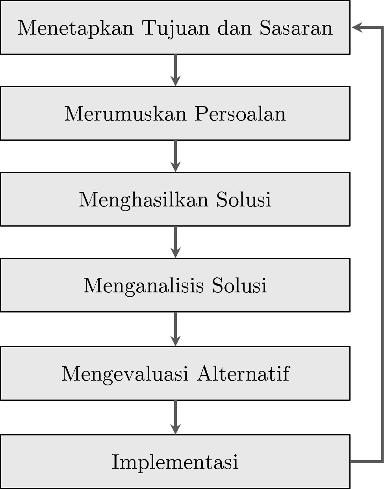

# Konsep Dasar Statistika dalam Perencanaan

::: rmdcapaian
### Capaian Pembelajaran {.unnumbered}

Setelah mempelajari bab ini, Anda diharapkan:

* Mampu menjelaskan kedudukan dan peran analisis statistik dalam perencanaan [STP-1.1]{.capaian}
* Mampu menjelaskan perbedaan analisis kuantitatif dan kualitatif dengan tepat [STP-1.2]{.capaian}
:::

## Kedudukan dan Peran Analisis Data dalam Perencanaan

Proses perencanaan adalah proses yang sangat memerlukan data di seluruh tahapannya. Seperti yang ditunjukkan dalam Gambar \@ref(fig:proses-perencanaan-rasional) tentang proses perencanaan secara rasional, setiap tahapnya sangat memerlukan data sebagai masukan untuk melaksanakan **setiap tahap**.

```{r proses-perencanaan-rasional, fig.cap='Proses Perencanaan Rasional. Diadaptasi dari @ewing2020basic', echo=FALSE, out.width='60%',  fig.align='center'}

```

Kita ambil contoh di tahap pertama. Penetapan tujuan dan sasaran memerlukan data dari berbagai sumber di wilayah perencanaan, termasuk dari pemangku kepentingan (*stakeholder*). Data-data tersebut dikumpulkan dan untuk merumuskan tujuan dan sasaran yang benar-benar mencerminkan kebutuhan wilayah perencanaan.

Lain lagi di tahap kedua, contoh lainnya. Perumusan persoalan (*problem*) adalah hal yang harus dilakukan dengan mempertimbangkan data dan fakta kondisi yang ada (kondisi eksisting). Hal ini dikarenakan jika kita salah mendefinisikan persoalan, implementasi rencana tidak akan menjawab persoalan yang seharusnya.

Dari paparan sebelumnya, kita dapat menyimpulkan bahwa setiap tahap dalam perencanaan memerlukan penelitian, yakni kegiatan membuat pertanyaan mengenai suatu permasalahan dan menjawab pertanyaan tersebut dengan proses yang sistematis.

::: rmdkasus
### Studi Kasus: Analisis Data dalam Perencanaan Transportasi Berkelanjutan di Kampus ITERA {.unnumbered #kasus-analisis-data-dalam-perencanaan}

Kita akan mengambil kasus berupa perencanaan transportasi berkelanjutan mahasiswa dan staf pegawai di kampus ITERA. Transportasi berkelanjutan adalah perpindahan dalam konteks transportasi yang memiliki nilai berkelanjutan, salah satunya minim polusi udara.

Dalam kasus ini, kita sudah mengetahui bahwa tujuan dari rektorat adalah “transportasi mahasiswa dan pegawai yang berkelanjutan.” Selanjutnya, kita perlu mengetahui apa persoalan yang ada saat ini di kampus ITERA (perhatikan Gambar \@ref(fig:kasus-bab1))

```{r kasus-bab1, fig.cap='Persoalan Transportasi di ITERA', echo=FALSE, out.width='60%', fig.align='center'}
knitr::include_graphics("images/kasus-bab1.png")
```

Untuk mengetahui persoalan terkait dengan transportasi mahasiswa dan pegawai, kita perlu mengajukan pertanyaan terkait hal ini, yakni *sudah sejauh mana keberlanjutan pada pola pergerakan pada mahasiswa dan pegawai kampus ITERA saat ini?*

Ini adalah pertanyaan penelitian kita untuk menjawab apa persoalan yang ada terkait rencana transportasi berkelanjutan di kampus ITERA. Untuk menjawab pertanyaan ini, kita mengumpulkan data terkait pola pergerakan mahasiswa dan pegawai di ITERA dengan menyebarkan kuesioner kepada para mahasiswa dan pegawai kampus ITERA tentang pola pergerakan mereka.
:::

## Penelitian Kuantitatif vs. Penelitian Kualitatif dan Kedudukan Statistik

Selanjutnya kita akan membahas dua pendekatan terbesar dalam penelitian yakni penelitian kuantitatif dan penelitian kualitatif.

Penelitian secara umum adalah proses mengajukan pertanyaan dan menjawabnya secara sistematis. Pertanyaan yang diajukan bisa terkait dengan tahap yang dilakukan dalam proses perencanaan tadi.

Secara umum, pendekatan penelitian terbagi menjadi **pendekatan kuantitatif** dan **pendekatan kualitatif**. Singkatnya, pendekatan kuantitatif menekankan penggunaan angka-angka (kuantitas) dalam prosesnya, sementara pendekatan kualitatif menekankan pada eksplorasi data-data yang bersifat non-angka dan perlu diindra (dilihat, dicium, diraba, didengar) dan dirasakan.

### Analisis Kuantitatif vs. Analisis Kualitatif {#analisis-kuantitatif-vs-kualitatif}

Analisis adalah salah satu proses dalam penelitian yang mengolah data yang dikumpulkan menjadi jawaban dari pertanyaan di awal. Sebagaimana pendekatannya, secara umum analisis juga dapat dibagi menjadi **analisis kuantitatif** dan **analisis kualitatif**.

Di sisi lain, data sebagai bahan analisis juga dapat dibagi menjadi **data kuantitatif** dan **data kualitatif**. Kita dapat memaknai data kuantitatif sebagai fakta/fenomena yang diukur sehingga dinyatakan dalam bentuk angka, sementara data kualitatif adalah fakta/fenomena yang dijelaskan dalam bentuk pemaknaan dan pemahaman yang mendalam dari pelaku penelitian (subjek penelitian).

Karena analisis kuantitatif menggunakan angka-angka, pengumpulan data kuantitatif dapat disebut juga sebagai **pengukuran**.

::: rmdkasus

### Studi Kasus: Penelitian Mengenai Pola Pergerakan Mahasiswa dan Pegawai di Kampus ITERA {.unnumbered}

Berdasarkan pertanyaan penelitian *sudah sejauh mana keberlanjutan pada pola pergerakan pada mahasiswa dan pegawai kampus ITERA saat ini?*, kita akan  mengumpulkan data terkait pola pergerakan mahasiswa dan pegawai di ITERA dengan menyebarkan kuesioner kepada para mahasiswa dan pegawai kampus ITERA tentang pola pergerakan mereka. Berikut adalah analisis tentang perbandingan antara analisis kuantitatif dan analisis kualitatif.

| Aspek                | Analisis Kuantitatif                                                    | Analisis Kualitatif                                                          |
| :------------------- | :---------------------------------------------------------------------- | :--------------------------------------------------------------------------- |
| **Fokus**            | Luas (*Breadth*), mencari generalisasi.                                 | Dalam (*Depth*), mencari makna/alasan.                                       |
| **Pertanyaan Utama** | Berapa banyak emisi yang dihasilkan?                                    | Mengapa orang enggan naik shuttle?                                           |
| **Alat Analisis**    | Statistik (SPSS, Excel, Pemodelan Transportasi).                        | Transkrip wawancara, observasi lapangan, analisis tema.                      |
| **Kelebihan**        | Akurat untuk menghitung target penurunan emisi karbon secara matematis. | Sangat baik untuk merancang kebijakan yang sesuai dengan psikologi pengguna. |
| **Kelemahan**        | Tidak bisa menjelaskan alasan personal di balik angka.                  | Hasilnya tidak bisa digeneralisasi untuk seluruh populasi secara kaku.       |

:::

### Analisis Statistik sebagai Analisis Kuantitatif

Statistik adalah serangkaian teknik matematis yang digunakan untuk mengorganisir, memanipulasi, dan menganalisis data dengan tujuan menjawab pertanyaan penelitian [@healey2021statistics]. Ilmu yang mempelajari statistik disebut statistika yang dalam bahasa Inggris menjadi "statistics" (menggunakan "s").

Dalam pengertian tersebut terdapat kata kunci "matematis". Kata kunci tersebut tentunya mengantarkan kita berpikir bahwa analisis statistik adalah bagian dari penelitian kuantitatif.

Analisis statistik dapat melakukan hal-hal berikut:

1.  **Meringkas dan Mengorganisasi Data**. Statistik membantu mereduksi banyak item informasi menjadi beberapa angka yang jelas, ringkas, dan mudah dipahami, sebuah proses yang dikenal sebagai reduksi data.
2.  **Mengidentifikasi Pola dan Hubungan**. Statistik memungkinkan peneliti untuk mendeteksi pola dalam data dan mengukur hubungan antara dua atau lebih variabel.
3.  **Membuat Generalisasi**. Salah satu jenis statistik, statistik inferensial, mampu untuk menggeneralisasi temuan dari sampel kecil ke populasi yang lebih luas, memberikan perkiraan seberapa mungkin pola yang diamati dalam sampel berlaku di populasi. Ini akan kita pelajari di bab selanjutnya.
4.  **Menguji Hipotesis dan Teori**. Dalam penelitian secara umum, statistik membantu kita menguji apakah ide atau dugaan yang kita buat benar, berdasarkan data. Dari teori yang ada, kita bisa membuat hipotesis dan mengujinya secara empiris, atau bahkan menemukan hipotesis baru dari data.

Secara umum, statistika dapat dibagi menjadi dua menurut keperluannya terkait data: **statistika deskriptif** dan **statistika inferensial** [@ewing2020basic]. Statistika deskriptif berfungsi untuk mendeskripsikan data dari sebuah sampel atau populasi. Di sisi lain, statistik inferensial menarik kesimpulan dari data yang dikumpulkan (sampel) terhadap cakupan yang lebih besar dari data tersebut, yakni populasi.

Berdasarkan jumlah variabelnya statistika juga dapat dibagi menjadi 3: **statistika univariat**, **statistika bivariat** dan **statistika multivariat**. Sesuai namanya, statistika univariat adalah statistika yang digunakan untuk menganalisis satu variabel saja. Statistika bivariat adalah statistika yang menganalisis dua variabel secara bersamaan, sementara multivariat menganalisis lebih dari dua.

Jawablah soal evaluasi berikut untuk menguji pemahaman Anda tentang konsep dasar statistika dalam perencanaan.

::: rmdexercise

### Soal Evaluasi 1 {.unnumbered}

1.  Jelaskanlah penggunaan analisis data dalam setiap tahap perencanaan untuk kasus acara kumpul keakraban angkatan! [STP-1.1]{.capaian}
2.  Ceritakan perbedaan  analisis kuantitatif dan kualitatif yang mungkin digunakan dalam perencanaan acara tersebut. [STP-1.2]{.capaian}

:::