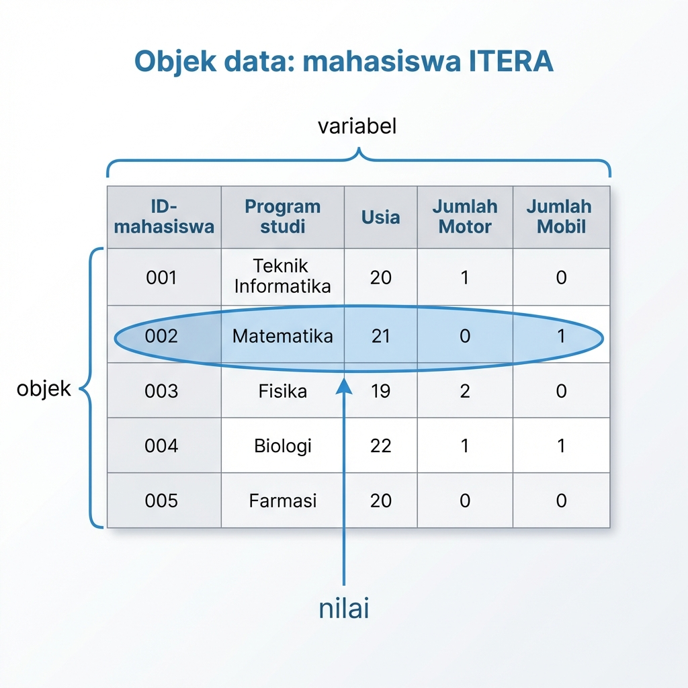
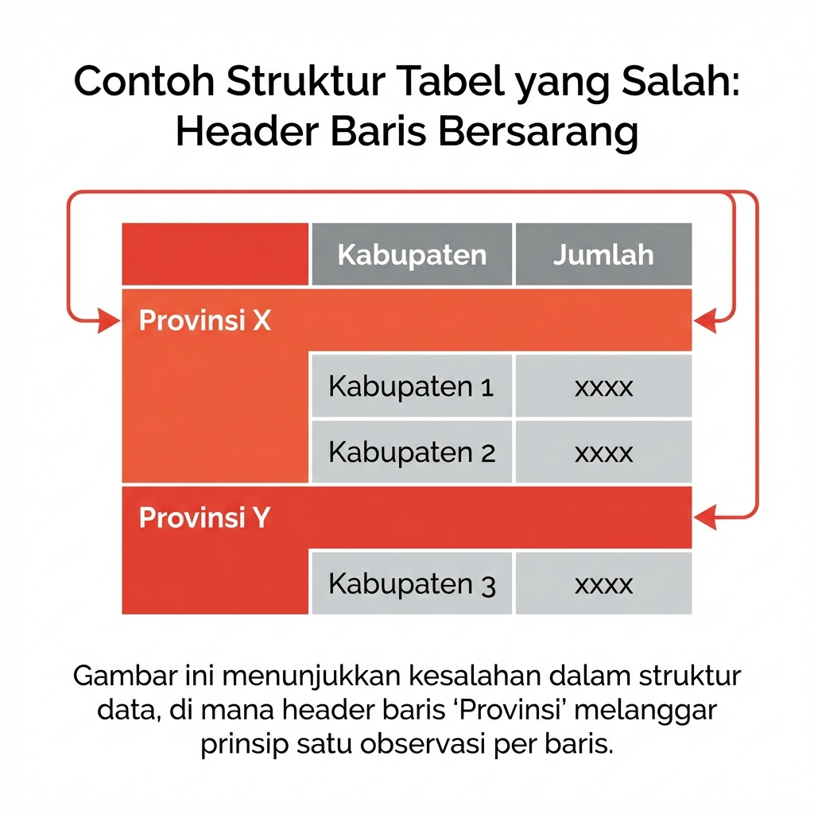
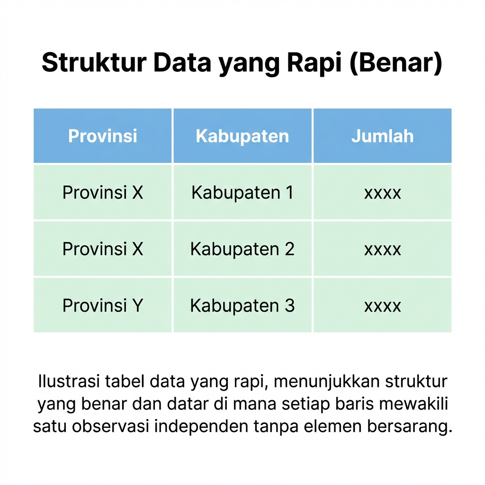
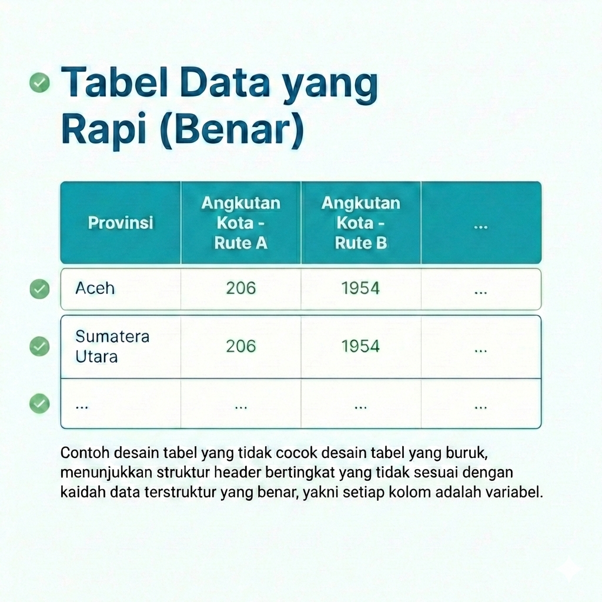
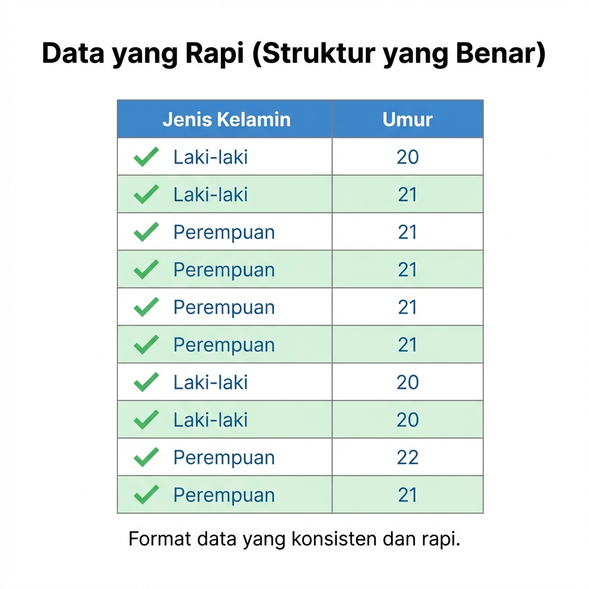

# Data Terstruktur

::: rmdcapaian
### Capaian Pembelajaran {.unnumbered}

Setelah mempelajari bab ini, Anda diharapkan:

1. mampu menganalisis variabel dan objek dalam sebuah format data terstruktur sesuai dengan konsepnya [STP-1.3]{.capaian}
2. mampu menentukan tingkat pengukuran yang tepat untuk sebuah variabel [STP-2.1]{.capaian}
:::

Berdasarkan formatnya, data dapat dibedakan menjadi dua jenis. Jenis data berdasarkan formatnya tersebut terdiri atas **data tidak terstruktur**  (*unstructured data*) dan **data terstruktur** (*structured data*).

Data tidak terstruktur adalah data yang tidak memiliki format yang terdefinisikan sebelum dikumpulkan, seperti teks wawancara, rekaman suara, gambar, atau video. Bentuk dan ukuran data-data tersebut dapat berbeda-beda, dengan kata lain formatnya tidak sama sehingga dapat dikatakan juga tidak terdefinisi atau tidak terstruktur [@oracle2024structured].

Di sisi lain, data terstruktur adalah data yang memiliki definisi yang jelas dan pola yang telah ditentukan sebelum dikumpulkan. Definisi yang jelas di sini diperlihatkan dengan bentuk data terstruktur berupa tabel. Dengan bentuk tabel, data memiliki format yang terdefinisi, lebih jelas isinya, dan dapat dikenali polanya sehingga lebih mudah untuk dianalisis.

**Penelitian yang menggunakan analisis statistik pasti menghasilkan data terstruktur dari pengumpulannya** [@devaus2014surveys]. Hal ini bukan berarti penelitian kualitatif juga tidak bisa menghasilkan data terstruktur, akan tetapi hal tersebut tidak mutlak. Hanya penelitian kuantitatif dengan metode analisis statistik yang mutlak menggunakan data terstruktur.

## Elemen Data Terstruktur

Dengan format yang jelas, data terstruktur dapat dipandang sebagai susunan 3 elemen penting: objek (*object*), variabel (*variable*), dan nilai (*value*). Ketiga hal ini membentuk struktur yang disebut **tabulasi data**. Tabulasi data adalah bentuk penyajian data dalam bentuk tabel yang terdiri atas baris dan kolom. Sebuah tabulasi data yang baik harus memiliki struktur yang jelas di mana baris mewakili objek dan kolom mewakili variabel.

1.  **Objek**. Objek adalah unit analisis yang datanya kita kumpulkan. Dalam tabulasi data, objek biasanya menempati posisi **baris** (*row*). Contoh objek dalam perencanaan wilayah dan kota bisa berupa rumah tangga, individu, kelurahan, kecamatan, atau kabupaten.
2.  **Variabel**. Variabel adalah karakteristik atau atribut yang melekat pada objek yang nilainya bisa berbeda-beda (bervariasi) antar satu objek dengan objek lainnya. Dalam tabulasi data, variabel menempati posisi **kolom** (*column*). Contoh variabel adalah luas lahan, jumlah penduduk, pendapatan per bulan, dan tingkat pendidikan.
3.  **Nilai**. Nilai adalah angka atau kategori yang mengisi perpotongan antara baris (objek) dan kolom (variabel), yakni **sel** (*cell*). Nilai ini merepresentasikan data spesifik dari variabel tertentu untuk objek tertentu.


::: rmdkasus

### Studi Kasus: Elemen Data Terstruktur {.unnumbered #kasus-elemen-data-terstruktur} 

Perhatikan hasil pengumpulan data kuesioner berupa tabulasi data dari mahasiswa-mahasiswa ITERA seperti yang ditampilkan pada Gambar \@ref(fig:bab-2-ilus-data-terstruktur).

```{r bab-2-ilus-data-terstruktur, echo=FALSE, fig.cap='Ilustrasi elemen data terstruktur', out.width="80%", fig.align='center'}

```

Kita akan membedah elemen-elemen data terstruktur dari tabulasi data tersebut:
- Objek dari tabulasi data tersebut adalah mahasiswa-mahasiswa ITERA. Tiap objek dibedakan berdasarkan variabel `ID-mahasiswa`.
- Variabel dari tabulasi data tersebut di antaranya adalah `Program Studi`, `Usia`, `Jumlah Motor`, dan `Jumlah Mobil`. Adapun variabel `ID-mahasiswa` tidak termasuk dalam variabel yang dihitung karena hanya bertindak sebagai pengidentifikasi objek.
- Nilai dari tabulasi data tersebut bisa kita lihat di sel-selnya. Misalnya, objek mahasiswa dengan `ID-mahasiswa` 002 memiliki nilai `Program Studi` adalah "Matematika", `Usia` adalah 21 tahun, `Jumlah Motor` adalah 0, dan `Jumlah Mobil` adalah 1.

:::

## Tabulasi Data Terstruktur yang Baik

Agar data dapat diolah dengan baik menggunakan perangkat lunak statistik seperti R, tabulasi data harus memenuhi kaidah "Tidy Data" atau data yang rapi. Berikut adalah prinsip-prinsip data yang rapi:

1.  Setiap variabel harus membentuk satu kolom.
2.  Setiap observasi (objek) harus membentuk satu baris.
3.  Setiap jenis unit observasi membentuk satu tabel.

Pelajari kasus yang berisi perbandingan antara data yang tidak rapi dan data yang rapi berikut.

::: rmdkasus

### Studi Kasus: Perbandingan Data yang Tidak Rapi dan Data yang Rapi {.unnumbered} 

Berikut adalah beberapa contoh kesalahan umum dalam struktur data dan perbaikannya:

```{r tabel-perbandingan-tidy, echo=FALSE, message=FALSE}
library(knitr)
library(kableExtra)

# Membuat data frame dengan path gambar
perbandingan <- data.frame(
  Jenis = c("Kesalahan 1: Header Baris Bersarang", 
            "Kesalahan 2: Struktur Kompleks", 
            "Kesalahan 3: Format Tidak Konsisten"),
  `Data Tidak Rapi` = c(
    '',
    '',
    ''
  ),
  `Data Rapi` = c(
    '',
    '',
    ''
  ),
  check.names = FALSE
)

kable(perbandingan, format = "html", escape = FALSE, 
      col.names = c("Jenis Kesalahan", "Data Tidak Rapi (Salah)", "Data Rapi (Benar)")) %>%
  kable_styling(bootstrap_options = c("striped", "hover"), full_width = TRUE) %>%
  column_spec(1, bold = TRUE, width = "20%") %>%
  column_spec(2, width = "40%") %>%
  column_spec(3, width = "40%")
```

:::

Jawablah soal evaluasi berikut untuk menguji pemahaman Anda tentang elemen-elemen data terstruktur.

::: rmdexercise

### Soal Evaluasi 2 {.unnumbered}

Perhatikan tabel hasil pengumpulan data kuesioner berikut ini [STP-1.3]{.capaian}:

```{r tabel-1-3, echo=FALSE}
library(knitr)
library(kableExtra)

tabel_1_3 <- data.frame(
  ID_rumah = c("001", "002", "003", "004"),
  Usia_KK = c(55, 64, 33, 28),
  Jml_anggota = c(2, 5, 7, 2),
  Luas_rumah = c(101, 245, 69, 44),
  Income_bln = c(3.3, 6.0, 3.5, 27.0)
)

kable(tabel_1_3, format = "html", escape = FALSE, 
      col.names = c("ID_rumah", "Usia_KK", "Jml_anggota", "Luas_rumah", "Income_bln")) %>%
  kable_styling(bootstrap_options = c("striped", "hover"), full_width = TRUE) %>%
  column_spec(1, bold = TRUE, width = "20%") %>%
  column_spec(2, width = "40%") %>%
  column_spec(3, width = "40%")
```

Jawablah pertanyaan-pertanyaan berikut berdasarkan tabel tersebut:

a. Ada berapa objek dalam data terstruktur tersebut? 
b. Sebutkan apa kira-kira objek dari data terstruktur tersebut.
c. Berapa variabel yang dapat dianalisis dari data terstruktur tersebut? Sebutkan apa saja.
d. Apakah format tabel tersebut sesuai dengan prinsip data yang rapi? Jelaskan alasan Anda.

:::

## Tingkat Pengukuran Variabel

Pada subbab ini kita akan membahas lebih dalam tentang nilai dalam variabel yang berpengaruh pada analisis selanjutnya, yakni tingkat pengukuran variabel.

Sebagaimana telah disebutkan pada Subbab \@ref(analisis-kuantitatif-vs-kualitatif) bahwa pengumpulan data kuantitatif dapat disebut juga sebagai pengukuran suatu variabel, cara kita mengukur suatu variabel bisa diibaratkan seperti menggunakan mistar yang memiliki sederet angka [@kachigan1986statistical].

Tingkat pengukuran berbicara tentang cara kita menyatakan hasil pengukuran suatu variabel tersebut dalam angka, mulai dari hasil yang sangat menyerupai angka dalam mistar hingga hasil yang bukan angka sama sekali.

::: rmdkasus

### Studi Kasus: Tingkat Pengukuran Variabel {.unnumbered}

Sesuai dengan kasus \@ref(kasus-elemen-data-terstruktur), kita akan menggunakan kasus variabel `Usia` dari data terstruktur tersebut.

Dalam variabel tersebut, nilai `Usia` dapat kita nyatakan dalam 2 bentuk yang berbeda. Kita akan bedakan bentuknya menjadi kasus-kasus berikut:

1. **Kasus-1:** nilai `Usia` dinyatakan dalam bentuk angka dalam satuan tahun. Dengan demikian, dalam kasus ini nilai `17` berarti "17 tahun", dan nilai `26` berarti "26 tahun", dan seterusnya.

2. **Kasus-2:** nilai `Usia` dinyatakan dalam bentuk rentang usia seperti berikut:

    * kategori 1: 17-25 tahun
    * kategori 2: 26-35 tahun
    * kategori 3: 36-45 tahun
    * kategori 4: 46-55 tahun
    * kategori 5: 56-65 tahun

    Kita bisa menyatakan setiap kategori dengan angka tertentu yang masing-masingnya tentu mewakili rentang usia tersebut. Misalnya, kita bisa menyatakan kategori 1 dengan angka 17, kategori 2 dengan angka 26, dan seterusnya, sehingga rentangnya menjadi seperti ini:

    * 17: 17-25 tahun
    * 26: 26-35 tahun
    * 36: 36-45 tahun
    * 46: 46-55 tahun
    * 56: 56-65 tahun

    Dalam kasus ini, nilai `17` bukan lagi berarti "17 tahun", melainkan "17-25 tahun". Artinya nilai `17` ini bisa saja bernilai `17` atau `18` atau `19` atau `20` atau `21` atau `22` atau `23` atau `24` atau `25`.

Kedua kasus tersebut menunjukkan bahwa kita bisa menggunakan tingkat pengukuran yang berbeda untuk variabel yang sama. 

Kita akan mempelajari nama-nama tingkat pengukuran tersebut dalam subbab-subbab selanjutnya.

:::

## Jenis-jenis Tingkat Pengukuran Variabel

Tingkat pengukuran variabel secara umum memiliki 3 jenis dari yang paling rendah ke yang paling tinggi di antaranya adalah nominal, ordinal, dan metrik (metric). Kita akan bahas lebih dalam tentang jenis-jenis tersebut sebagai berikut mulai dari yang paling rendah ke yang paling tinggi.

### Nominal

Tingkat pengukuran nominal adalah tingkat pengukuran yang **paling rendah**. Jika angka dikenakan pada variabel ini, angka tersebut hanya bertindak sebagai label.

### Ordinal

Tingkat pengukuran ordinal berada di atas nominal. Angka pada tingkat ini hanya menunjukkan **urutan** atau **posisi** tetapi tidak dapat memberikan penafsiran berapa jarak di antara posisi-posisi tersebut.

### Metrik (Angka)

Variabel dengan tingkat pengukuran angka (bahasa Inggris: *metric*) adalah variabel dengan **angka yang sebenarnya** karena angka pada tingkat pengukuran ini memiliki penafsiran angka yang sebenarnya, yaitu memiliki posisi dan skala nilainya.

Dalam literatur lain, seperti @tjokropandojo2021pengantar, tingkat pengukuran ini banyak dibagi menjadi dua tingkat lagi, yaitu **interval** dan **rasio**. Perbedaan antara keduanya adalah bahwa interval **tidak memiliki posisi nol absolut** seperti rasio.

Contoh yang paling mudah adalah suhu. Suhu dapat dinyatakan dalam skala Celsius dan Fahrenheit. Dalam skala Celsius, air membeku pada tingkat 0 derajat, tetapi dalam skala Fahrenheit air membeku pada tingkat 32 derajat. Ini menunjukkan posisi nol yang tidak absolut pada pengukuran suhu.

Contoh lainnya adalah tahun. Dalam penanggalan Masehi, tahun-0 ditempatkan pada masa kelahiran Isa Al-Masih. Sementara itu, dalam penanggalan Hijriah, tahun-0 ditempatkan masa hijrahnya Nabi Muhammad SAW. Masa kelahiran Isa Al-Masih tentunya terjadi lebih dulu dibandingkan masa hijrah Nabi Muhammad SAW. Ini juga menunjukkan posisi nol yang tidak absolut pada pengukuran tahun.

## Menentukan Tingkat Pengukuran Variabel

Dalam praktiknya, menentukan tingkat pengukuran variabel seringkali tidak mudah karena seringkali data yang kita kumpulkan tidak memiliki tingkat pengukuran yang jelas. Oleh karena itu, kita perlu melakukan analisis lebih dalam untuk menentukan tingkat pengukuran variabel tersebut. Berikut adalah langkah-langkah yang dapat kita lakukan untuk menentukan tingkat pengukuran variabel.

1. Tentukan apakah jenis nilai dari variabel: apakah **kategorik** atau **numerik**
2. Jika **kategorik**, tentukan apakah terdapat tingkatan yang masuk akal. Jika terdapat tingkatan, maka ia pasti berupa ordinal. Jika tidak terdapat tingkatan, maka ia pasti berupa nominal.
3. Jika **numerik**, pastikan apakah angka-angka merepresentasikan angka sebenarnya. Jika tidak, ia sebenarnya adalah **kategorik**. Kembali ke langkah 1.
4. Jika **numerik** dan angka-angka merepresentasikan angka sebenarnya, pastikan apakah angka-angka memiliki posisi nol absolut. Jika tidak, ia pasti berupa **interval**. Jika ya, ia pasti berupa **rasio**.

Langkah-langkah tersebut dapat diilustrasikan dalam diagram alir yang ditampilkan dalam Gambar \@ref(fig:fig-menentukan-tingpeng) berikut. 

```{r fig-menentukan-tingpeng, echo=FALSE, fig.cap='Diagram alir menentukan tingkat pengukuran variabel', out.width='80%', fig.align='center'}

```

::: rmdkasus

### Studi Kasus: Menentukan Tingkat Pengukuran Variabel {.unnumbered}

Kita akan melanjutkan kasus pengumpulan data pergerakan mahasiswa di kampus ITERA dari bab sebelumnya. Setelah menentukan variabel-variabel yang diukur dan memperkirakan tabel data terstrukturnya, kita perlu menelaah nilai-nilai seperti apa yang kira-kira akan dihasilkan sehingga kita dapat menentukan jenis nilai dan tingkat pengukuran variabel-variabel kita tersebut agar jenis analisisnya nanti sesuai.
:::