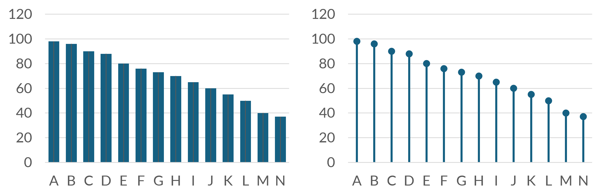

# Visualisasi Data Kuantitatif

::: rmdcapaian
### Capaian Pembelajaran {.unnumbered}

Setelah mempelajari bab ini, Anda diharapkan:

1. mampu memilih visualisasi yang tepat sesuai dengan variabel yang akan disajikan dan informasi yang ingin disampaikan [STP-3.1]{.capaian}
2. mampu menginterpretasikan suatu visualisasi data kuantitatif secara mendalam [STP-3.2]{.capaian}
3. mampu menjelaskan pentingnya menentukan tingkat pengukuran untuk sebuah variabel dari kaitannya dengan analisis statistik deskriptif dan diagram yang dipilih untuk menyajikan informasi [STP-3.4]{.capaian}
:::


## Konsep Dasar

Visualisasi data adalah mengubah bentuk penyajian data/presentasi data dari bentuk tabular/tabel menjadi bentuk grafis. Kita sering mendengar pepatah yang berbunyi *"a picture is worth a thousand words"* yang artinya kurang lebih "satu gambar bernilai seribu kata." Pepatah ini menggambarkan bahwa data yang disajikan dalam bentuk gambar/grafis dapat menampilkan banyak sekali informasi kepada audiens.

Sajian data dalam bentuk gambar disebut juga **grafik** atau **diagram** *(chart)*. Jenis grafik atau diagram yang digunakan sangat bergantung pada jenis dan tingkat pengukuran variabel yang akan divisualisasikan.

Banyak sekali panduan-panduan untuk memilih bentuk grafik yang perlu Anda gunakan untuk menyajikan data Anda. Salah satu sumber yang menyediakan panduan tersebut adalah situs @datatoviz atau @Ferdio.


## Jenis-jenis Diagram

Untuk memilih jenis diagram yang tepat, kita perlu menentukan terlebih dahulu jenis dan tingkat pengukuran variabel yang akan kita sajikan. Kemudian, kita dapat mempertimbangkan jenis informasi apa yang ingin kita sajikan dan menyesuaikannya dengan cara menampilkan nilainya, bisa dengan sumbu (tegak/datar; Y/X) atau yang lainnya. Berikut adalah pembahasan sebagian jenis-jenis diagram berdasarkan jenis nilai dan tingkat pengukuran variabel yang sudah kita bahas dan tujuan penggunaanya.

### Variabel Kategorikal

Visualisasi variabel kategorikal bertujuan menampilkan **jumlah (frekuensi) objek** untuk masing-masing kategori. Untuk menentukan jenis diagram yang tepat, kita perlu memperhatikan **jumlah variabel** yang dianalisis dan **hubungan antarvariabel**.

#### Grafik Batang *(Column/Bar Chart)*

Grafik batang adalah grafik yang paling sering digunakan untuk memvisualkan variabel kategorikal. Grafik ini memberikan informasi berupa **sebaran frekuensi** sebuah variabel. 

Bentuk grafik batang tersusun dari dua sumbu tegak (Y) dan datar (X). Tinggi batang sepanjang sumbu Y bermakna frekuensi dari kategori-kategori yang ada dalam variabel, sementara kategori-kategori berada di sepanjang sumbu X.

Terdapat dua jenis grafik batang: tegak dan mendatar. Grafik batang tegak disebut juga *column chart* sementara yang mendatar disebut *bar chart*. Perbedaan column chart dan bar chart hanya terletak di **sumbu yang menunjukkan frekuensi kategori**, yakni tinggi/panjang batang. Grafik batang yang menggunakan sumbu Y untuk menunjukkan jumlah frekuensinya adalah ***column chart***, sementara yang menggunakan sumbu X adalah ***bar chart***.

Untuk lebih memahami bagaimana mengubah data terstruktur menjadi grafik batang, penjelasannya dapat dilihat di Studi Kasus di bawah.


#### Grafik Batang Bertumpuk (Stacked Column/Bar Chart) {#materi-bar-chart}

Grafik batang bertumpuk *(stacked bar/column chart)* digunakan untuk membandingkan komposisi dari beberapa kategori. Setiap batang mewakili nilai total, yang kemudian dipecah menjadi beberapa segmen untuk menunjukkan bagaimana kontribusi masing-masing subkategori membentuk total tersebut. Kategori kedua variabel tersebut dibuat bertumpukan. Misalnya sebaran pengguna kendaraan (mobil, motor, sepeda) berdasarkan jenis kelamin (laki-laki dan perempuan).

Untuk lebih memahami bagaimana mengubah data terstruktur menjadi grafik batang bertumpuk, penjelasannya dapat dilihat di Studi Kasus di bawah. Secara umum, data mentah diubah menjadi tabel distribusi frekuensi, dan tabel distribusi frekuensi itu yang menjadi bahan pembuatan grafik.

::: rmdkasus

### Studi Kasus: Visualisasi Moda Transportasi Mahasiswa dengan Diagram Batang  {.unnumbered}

Untuk memahami pembuatan grafik batang, kita akan menganalisis data moda transportasi mahasiswa UIN Raden Intan Lampung. Langkah pertama adalah mengubah data mentah menjadi tabel distribusi frekuensi (Tabel \@ref(tab:bab-4-diagram-batang)), baru kemudian divisualisasikan.

```{r bab-4-diagram-batang, echo=FALSE, out.width='60%', fig.align='center'}
# Memuat library
library(tidyverse)
library(knitr)
library(kableExtra)

# Memuat data
data_uinril <- read.csv2("datasets/DataUtama_mhsUINRIL.csv")

# Membuat tabel distribusi frekuensi untuk moda transportasi
tabel_moda <- table(data_uinril$kendaraan.utama)

# Format tabel
kable(tabel_moda, col.names = c('Moda Transportasi', 'Frekuensi'), 
      caption = 'Distribusi Frekuensi Moda Transportasi Mahasiswa UIN Raden Intan Lampung') %>%
  kable_styling(bootstrap_options = c('striped', 'hover', 'condensed'), 
                full_width = FALSE, position = 'center')

```

Setelah mendapatkan tabel distribusi frekuensi, kita dapat membuat grafik batang tegak (*column chart*)

```{r fig-column-moda, echo=FALSE, fig.cap='Grafik batang tegak distribusi moda transportasi', fig.align='center', out.width='70%'}
barplot(tabel_moda,
  main = "Distribusi Moda Transportasi Mahasiswa UINRIL",
  xlab = "Moda Transportasi",
  ylab = "Frekuensi",
  col = "#3498db",
  las = 2
)
```

Atau dalam bentuk grafik batang mendatar (*bar chart*):

```{r fig-bar-moda, echo=FALSE, fig.cap='Grafik batang mendatar distribusi moda transportasi', fig.align='center', out.width='70%'}
barplot(tabel_moda,
  main = "Distribusi Moda Transportasi Mahasiswa UINRIL",
  xlab = "Frekuensi",
  ylab = "Moda Transportasi",
  col = "#e74c3c",
  horiz = TRUE,
  las = 1
)
```

Untuk **grafik batang bertumpuk**, kita memerlukan dua variabel kategorikal. Kita akan membandingkan moda transportasi berdasarkan jenis kelamin:

```{r, echo=FALSE}
# Membuat tabel kontingensi (distribusi frekuensi dua variabel)
tabel_moda_jk <- table(data_uinril$Jenis.Kelamin, data_uinril$kendaraan.utama)
tabel_moda_jk
```

Dari tabel kontingensi tersebut, kita dapat membuat grafik batang bertumpuk:

```{r fig-stacked-bar, echo=FALSE, fig.cap='Grafik batang bertumpuk moda transportasi berdasarkan jenis kelamin', fig.align='center', out.width='75%'}
barplot(tabel_moda_jk,
  main = "Moda Transportasi Berdasarkan Jenis Kelamin",
  xlab = "Moda Transportasi",
  ylab = "Frekuensi",
  col = c("#9b59b6", "#f39c12"),
  legend = rownames(tabel_moda_jk),
  las = 2,
  args.legend = list(x = "topright")
)
```

**Interpretasi:** Grafik menunjukkan bahwa sepeda motor merupakan moda transportasi yang paling banyak digunakan oleh mahasiswa UINRIL, diikuti oleh mobil dan angkutan umum. Dari grafik batang bertumpuk terlihat bahwa penggunaan sepeda motor lebih dominan pada mahasiswa laki-laki dibandingkan perempuan, sementara penggunaan angkutan umum relatif seimbang antara kedua jenis kelamin.

:::


#### Grafik Lollipop

Diagram lollipop pada dasarnya serupa dengan diagram batang, hanya saja data direpresentasikan oleh tiang-tiang berujung lingkaran yang menyerupai permen loli. Penggunaannya sangat cocok untuk data berjumlah banyak guna menghindari efek Moiré (dibaca `moarey') @wikipedia2025moire. Efek Moiré adalah ilusi optik pergerakan benda yang posisinya berdekatan dan membentuk sebuah kisi (fringe) seperti yang ditunjukkan Gambar \@ref(fig:contoh-moire), sehingga dapat menyulitkan pembaca grafik.

```{r contoh-moire, echo=FALSE, out.width='60%', fig.align='center', fig.cap='Contoh efek Moiré pada grafik batang'}

```


::: rmdkasus

### Studi Kasus: Perbandingan Grafik Lollipop dengan Grafik Batang {.unnumbered}

Pada dataset dengan banyak kategori, grafik batang konvensional dapat menghasilkan efek Moiré yang mengganggu. Mari kita bandingkan penggunaan grafik batang biasa dengan grafik lollipop menggunakan data program studi mahasiswa UINRIL.

```{r, echo=FALSE}
# Install package ggplot2 jika belum ada
# install.packages('ggplot2')
library(ggplot2)

# Memuat data dan membuat tabel frekuensi prodi
data_uinril <- read.csv2('datasets/DataUtama_mhsUINRIL.csv')
tabel_prodi <- as.data.frame(table(data_uinril$Prodi))
colnames(tabel_prodi) <- c('Prodi', 'Frekuensi')

# Mengurutkan berdasarkan frekuensi
tabel_prodi <- tabel_prodi[order(tabel_prodi$Frekuensi, decreasing = TRUE), ]
tabel_prodi
```

Berikut adalah visualisasi menggunakan grafik batang biasa:

```{r fig-bar-prodi, echo=FALSE, fig.cap='Grafik batang program studi mahasiswa UINRIL', fig.align='center', out.width='85%'}
ggplot(tabel_prodi, aes(x = reorder(Prodi, -Frekuensi), y = Frekuensi)) +
  geom_bar(stat = 'identity', fill = '#3498db', width = 0.8) +
  theme_minimal() +
  labs(
    title = 'Distribusi Mahasiswa per Program Studi (Grafik Batang)',
    x = 'Program Studi',
    y = 'Frekuensi'
  ) +
  theme(axis.text.x = element_text(angle = 45, hjust = 1, size = 8))
```

Sekarang bandingkan dengan grafik lollipop:

```{r fig-lollipop-prodi, echo=FALSE, fig.cap='Grafik lollipop program studi mahasiswa UINRIL', fig.align='center', out.width='85%'}
ggplot(tabel_prodi, aes(x = reorder(Prodi, -Frekuensi), y = Frekuensi)) +
  geom_segment(aes(x = Prodi, xend = Prodi, y = 0, yend = Frekuensi),
    color = '#95a5a6', size = 0.5
  ) +
  geom_point(color = '#e74c3c', size = 3) +
  theme_minimal() +
  labs(
    title = 'Distribusi Mahasiswa per Program Studi (Grafik Lollipop)',
    x = 'Program Studi',
    y = 'Frekuensi'
  ) +
  theme(axis.text.x = element_text(angle = 45, hjust = 1, size = 8))
```

**Perbandingan:** Pada grafik lollipop, setiap kategori lebih mudah dibedakan karena hanya tiang tipis dan titik yang mewakili nilai, sehingga menghindari efek visual yang berlebihan (Moiré). Grafik lollipop sangat cocok untuk dataset dengan banyak kategori seperti ini, karena lebih ringkas dan tetap informatif. Sementara grafik batang biasa terlihat lebih padat dan dapat menimbulkan kesulitan dalam membaca data ketika batang-batangnya berdekatan.

:::

#### Grafik *Treemap*

Secara fungsi, treemap dan *stacked bar chart* sangat mirip karena keduanya menunjukkan distribusi frekuensi objek berdasarkan kategori variabelnya. Jika *stacked chart* memakai panjang segmen pada batang untuk menunjukkan proporsi, *treemap* menggunakan luas area persegi panjang. Frekuensinya diperlihatkan oleh **luas persegi masing-masing kategori**.

Proses pembuatannya sama persis seperti dengan grafik batang bertumpuk.

::: rmdkasus

### Studi Kasus: Membuat Treemap Moda Transportasi {.unnumbered}

Treemap menggunakan luas area persegi untuk menunjukkan proporsi kategori. Seperti pada grafik batang bertumpuk, kita mulai dari tabel distribusi frekuensi dua variabel.

```{r, echo=FALSE}
# Install package treemap jika belum ada
# install.packages('treemap')
library(treemap)

# Memuat data
data_uinril <- read.csv2("datasets/DataUtama_mhsUINRIL.csv")

# Membuat tabel kontingensi dan mengubahnya ke data frame
tabel_moda_jk <- as.data.frame(table(data_uinril$Jenis.Kelamin, data_uinril$kendaraan.utama))
colnames(tabel_moda_jk) <- c("Jenis_Kelamin", "Moda_Transportasi", "Frekuensi")

# Menampilkan tabel
tabel_moda_jk
```

Dari tabel distribusi frekuensi tersebut, kita dapat membuat treemap:

```{r fig-treemap-moda, echo=FALSE, fig.cap='Treemap moda transportasi berdasarkan jenis kelamin', fig.align='center', out.width='80%'}
treemap(tabel_moda_jk,
  index = c("Moda_Transportasi", "Jenis_Kelamin"),
  vSize = "Frekuensi",
  type = "index",
  title = "Komposisi Moda Transportasi Berdasarkan Jenis Kelamin",
  fontsize.labels = c(12, 10),
  fontcolor.labels = c("white", "white"),
  bg.labels = 0,
  border.col = "white",
  border.lwds = 2,
  palette = "Set2"
)
```

**Interpretasi:** Treemap menunjukkan proporsi penggunaan moda transportasi dengan jelas melalui luas area. Area terbesar dimiliki oleh sepeda motor, menunjukkan dominasinya sebagai moda transportasi utama. Di dalam setiap moda, terdapat sub-area yang menunjukkan pembagian berdasarkan jenis kelamin. Visualisasi ini memudahkan kita untuk membandingkan proporsi secara langsung tanpa perlu membaca angka.

:::

#### Grafik Pai/Donat *(Pie/Donut Chart)*

Grafik jenis ini juga sering digunakan untuk visualisasi variabel kategoris. Perbedaan dengan grafik batang adalah frekuensi tiap kategori tidak diperlihatkan dengan sumbu tegak, tetapi besar juring (sektor) lingkaran.

Proses pembuatannya sama seperti pembuatan grafik batang yang ditunjukkan pada kasus di \@ref(materi-bar-chart), hanya saja jumlah kategori menjadi jumlah sektor, sementara frekuensinya menjadi ukuran sektor.

::: rmdkasus

### Studi Kasus: Membuat Grafik Pai dan Donat {.unnumbered}

Grafik pai dan donat menggunakan juring lingkaran untuk menunjukkan proporsi kategori. Prosesnya sama dengan grafik batang, dimulai dari tabel distribusi frekuensi.

```{r}
# Memuat data
data_uinril <- read.csv2("datasets/DataUtama_mhsUINRIL.csv")

# Membuat tabel distribusi frekuensi untuk moda transportasi
tabel_moda <- table(data_uinril$kendaraan.utama)
tabel_moda
```

Dari tabel distribusi frekuensi, kita dapat membuat grafik pai (*pie chart*):

```{r fig-pie-moda, fig.cap='Grafik pai moda transportasi mahasiswa UINRIL', fig.align='center', out.width='70%'}
# Menghitung persentase
persentase <- round(100 * tabel_moda / sum(tabel_moda), 1)
label <- paste0(names(tabel_moda), "\n", persentase, "%")

pie(tabel_moda,
  labels = label,
  main = "Distribusi Moda Transportasi Mahasiswa UINRIL",
  col = c("#3498db", "#e74c3c", "#f39c12", "#2ecc71", "#9b59b6"),
  border = "white"
)
```

Untuk membuat grafik donat (*donut chart*), kita mengubah jenis kategori menjadi juring-juring lingkaran dan sudunya ditentukan dari proporsi frekuensi. Prosesnya sama dengan grafik pai, hanya saja kita di tengahnya ada ruang kosong yang dapat digunakan untuk informasi tambahan.

```{r fig-donut-moda, fig.cap='Grafik donat moda transportasi mahasiswa UINRIL', fig.align='center', out.width='70%'}
library(ggplot2)

# Mengubah tabel menjadi data frame
df_moda <- as.data.frame(tabel_moda)
colnames(df_moda) <- c("Moda", "Frekuensi")

# Menghitung persentase dan posisi label
df_moda$Persentase <- round(100 * df_moda$Frekuensi / sum(df_moda$Frekuensi), 1)
df_moda$Label <- paste0(df_moda$Persentase, "%")

# Membuat donut chart
ggplot(df_moda, aes(x = 2, y = Frekuensi, fill = Moda)) +
  geom_bar(stat = "identity", width = 1, color = "white") +
  coord_polar(theta = "y") +
  xlim(0.5, 2.5) +
  theme_void() +
  labs(title = "Distribusi Moda Transportasi (Donut Chart)") +
  geom_text(aes(label = Label),
    position = position_stack(vjust = 0.5),
    color = "white", size = 4
  ) +
  scale_fill_manual(values = c("#3498db", "#e74c3c", "#f39c12", "#2ecc71", "#9b59b6", "#34495e"))
```

**Interpretasi:** Baik grafik pai maupun donat menunjukkan proporsi penggunaan moda transportasi dengan jelas. Sepeda motor mendominasi dengan proporsi terbesar, diikuti oleh mobil dan angkutan umum. Grafik donat memberikan tampilan yang lebih modern dengan ruang kosong di tengahnya yang dapat digunakan untuk informasi tambahan.

:::


### Variabel Numerik

Berbeda dengan visualisasi variabel kategorikal yang memperlihatkan frekuensi masing-masing kategori dalam variabel, grafik data dengan variabel numerik merepresentasikan nilai yang sebenarnya. 

Persamaan dengan visualisasi pada data kategorikal adalah perlunya pertimbangan **jumlah variabel** dan cara menyajikan nilianya dengan sumbu atau bukan. Selain itu juga perlu dipertimbangkan **keterurutan objek/observasi *(order)***.

Berikut adalah tinjauan beberapa jenis grafik visualisasi data variabel numerik dengan masing-masing ilustrasi data terstrukturnya.

#### Histogram

Histogram menunjukkan distribusi nilai-nilai yang berada pada rentang tertentu. Rentang nilai ditunjukkan di sumbu X-nya, sementara sumbu Y adalah frekuensinya. Istilah untuk rentang-rentang ini disebut ***bin***, sementara lebar/ukurannya disebut ***bin size*** atau ***bin width***.


::: rmdnote

[Penting!]{.tajuksaya}

Jangan tertukar antara histogram dengan grafik batang! Perbedaan mendasar keduanya terletak pada sumbu X-nya. Sumbu X pada histogram menunjukkan angka, sementara pada grafik batang menunjukkan kategorinya.

Satu karakteristik lain yang membedakan histogram dengan grafik batang adalah **jarak antarbatangnya**. Grafik batang biasanya memiliki celah di antara batangnya, sementara histogram tidak memiliki celah.

:::


Proses pembuatan histogram dari tabel data terstruktur diilustrasikan oleh kasus berikut. Dalam proses ini, variabel numerik dikelompokkan ke dalam interval atau rentang tertentu. Selanjutnya, frekuensi merepresentasikan jumlah total objek yang nilainya berada di dalam masing-masing rentang tersebut.

::: rmdkasus

### Studi Kasus: Membuat Histogram Biaya Perjalanan {.unnumbered}

Histogram menunjukkan distribusi nilai numerik dengan mengelompokkannya ke dalam interval (bin). Mari kita visualisasikan biaya perjalanan mahasiswa ITERA.

```{r}
# Memuat data
data_itera <- read.csv2("datasets/DataUtama_mhsITERA.csv")

# Melihat statistik deskriptif
summary(data_itera$biaya.dalam.sepekan)
```

Sebelum membuat histogram, kita perlu mengelompokkan nilai-nilai ke dalam interval (bin). R melakukan ini secara otomatis, tetapi kita juga bisa mengatur sendiri. Mari kita buat histogram dengan pengaturan bin otomatis:

```{r fig-hist-biaya-auto, fig.cap='Histogram biaya perjalanan (bin otomatis)', fig.align='center', out.width='75%'}
hist(data_itera$biaya.dalam.sepekan,
  main = "Distribusi Biaya Perjalanan Mahasiswa ITERA",
  xlab = "Biaya Perjalanan (Rp ribu)",
  ylab = "Frekuensi",
  col = "#3498db",
  border = "white",
  las = 1
)
```

Kita juga dapat mengatur jumlah bin secara manual untuk melihat distribusi dengan lebih detail:

```{r fig-hist-biaya-manual, fig.cap='Histogram biaya perjalanan (bin manual)', fig.align='center', out.width='75%'}
# Membuat histogram dengan 15 bin
hist(data_itera$biaya.dalam.sepekan,
  breaks = 15,
  main = "Distribusi Biaya Perjalanan (15 Bin)",
  xlab = "Biaya Perjalanan (Rp ribu)",
  ylab = "Frekuensi",
  col = "#e74c3c",
  border = "white",
  las = 1
)
```

Untuk lebih memahami proses binning, mari kita buat tabel frekuensi manual:

```{r}
# Membuat interval bin
bins <- seq(0, max(data_itera$biaya.dalam.sepekan, na.rm = TRUE), length.out = 10)

# Mengelompokkan data ke dalam bin
data_itera$bin <- cut(data_itera$biaya.dalam.sepekan, breaks = bins, include.lowest = TRUE)

# Membuat tabel frekuensi
tabel_freq <- table(data_itera$bin)
head(tabel_freq)
```

**Interpretasi:** Histogram menunjukkan bahwa sebagian besar mahasiswa ITERA memiliki biaya perjalanan dalam rentang rendah hingga menengah, dengan konsentrasi terbesar pada rentang 0-50 ribu rupiah. Distribusi menunjukkan pola miring ke kanan (*right-skewed*), yang berarti terdapat beberapa mahasiswa dengan biaya perjalanan yang sangat tinggi. Informasi ini penting untuk perencanaan transportasi kampus, misalnya dalam menentukan subsidi atau rute angkutan kampus.

:::


#### *Boxplot*

Boxplot adalah grafik berbentuk kotak dan garis yang menampilkan ukuran penyebaran suatu variabel numerik secara grafis (Gambar \@ref(fig:jenis-boxplot)). Sebagaimana yang ditunjukkan oleh gambar tersebut, kotak dan garis pada boxplot dapat berjumlah satu atau lebih. Satu kotak dan garis menandakan hanya ada satu kategori objek dengan variabel numerik yang ditampilkan.

Sementara itu, variabel numerik tersebut dikategorikan lagi berdasarkan suatu variabel kategoris, maka jumlah kotak dan garisnya bisa lebih dari satu.

Setiap elemen pada boxplot memiliki makna ukuran penyebaran. Ini dijelaskan pada kasus berikut.

::: rmdkasus

### Studi Kasus: Membuat Boxplot Biaya Perjalanan Mahasiswa {.unnumbered}

Boxplot menampilkan ukuran penyebaran data numerik secara grafis. Mari kita buat boxplot untuk menganalisis distribusi biaya perjalanan mahasiswa dari berbagai universitas.

```{r}
# Memuat data dari beberapa universitas
data_uinril <- read.csv2("datasets/DataUtama_mhsUINRIL.csv")
data_unila <- read.csv2("datasets/DataUtama_mhsUNILA.csv")

# Memilih kolom biaya perjalanan
data_uinril <- data_uinril |>
  select(biaya.dalam.sepekan, Kampus_PT)

data_unila <- data_unila |>
  select(biaya.dalam.sepekan, Kampus_PT)


# Menggabungkan data
data_gabung <- rbind(data_uinril, data_unila)

# Melihat ringkasan data biaya perjalanan
summary(data_gabung$biaya.dalam.sepekan)
```

Mari kita buat boxplot tunggal untuk biaya perjalanan UINRIL terlebih dahulu:

```{r fig-boxplot-single, fig.cap='Boxplot biaya perjalanan mahasiswa UINRIL', fig.align='center', out.width='60%'}
boxplot(data_uinril$biaya.dalam.sepekan,
  main = "Distribusi Biaya Perjalanan Mahasiswa UINRIL",
  ylab = "Biaya Perjalanan (Rp ribu)",
  col = "#3498db",
  border = "#2c3e50"
)

# Menambahkan label untuk setiap elemen boxplot
text(1, 1, quantile(data_uinril$biaya.dalam.sepekan, 0, 25, na.rm = TRUE),
  labels = paste0("Q1 = ", round(quantile(data_uinril$biaya.dalam.sepekan, 0, 25, na.rm = TRUE), 1)),
  pos = 4, cex = 0, 8, col = "red"
)
text(1, 1, median(data_uinril$biaya.dalam.sepekan, na.rm = TRUE),
  labels = paste0("Median = ", round(median(data_uinril$biaya.dalam.sepekan, na.rm = TRUE), 1)),
  pos = 4, cex = 0, 8, col = "red"
)
text(1, 1, quantile(data_uinril$biaya.dalam.sepekan, 0, 75, na.rm = TRUE),
  labels = paste0("Q3 = ", round(quantile(data_uinril$biaya.dalam.sepekan, 0, 75, na.rm = TRUE), 1)),
  pos = 4, cex = 0, 8, col = "red"
)
```

Sekarang mari kita buat boxplot ganda untuk membandingkan distribusi biaya perjalanan antar kampus:

```{r fig-boxplot-multiple, fig.cap='Boxplot biaya perjalanan mahasiswa berdasarkan kampus', fig.align='center', out.width='75%'}
boxplot(biaya.dalam.sepekan ~ Kampus_PT,
  data = data_gabung,
  main = "Perbandingan Distribusi Biaya Perjalanan Antar Kampus",
  xlab = "Kampus",
  ylab = "Biaya Perjalanan (Rp ribu)",
  col = c("#3498db", "#e74c3c"),
  border = "#2c3e50"
)
```

**Penjelasan elemen boxplot:**

- **Garis tengah kotak (median/Q2)**: Nilai tengah data yang membagi data menjadi dua bagian sama besar
- **Kotak bagian bawah (Q1)**: Kuartil pertama, 25% data berada di bawah nilai ini
- **Kotak bagian atas (Q3)**: Kuartil ketiga, 75% data berada di bawah nilai ini
- **Tinggi kotak (IQR)**: Jarak interkuartil, menunjukkan rentang 50% data tengah
- **Whiskers (garis atas dan bawah)**: Menunjukkan rentang data yang masih dalam batas normal (1,5 × IQR)
- **Titik-titik di luar whiskers**: Outlier atau nilai ekstrem yang jauh dari sebagian besar data

**Interpretasi:** Dari boxplot ganda terlihat bahwa distribusi biaya perjalanan mahasiswa UNILA memiliki median yang sedikit lebih tinggi dibandingkan UINRIL. Rentang interkuartil (tinggi kotak) UNILA juga lebih besar, menunjukkan variasi biaya perjalanan yang lebih beragam. Terdapat beberapa outlier pada kedua kampus yang menunjukkan ada mahasiswa dengan biaya perjalanan yang jauh lebih tinggi dari mayoritas. Informasi ini berguna untuk perencanaan fasilitas kampus seperti kantin atau transportasi yang disesuaikan dengan daya beli mahasiswa.

:::

#### Grafik Garis *(Line Plot)* dan Area *(Area Plot)*

Grafik ini memetakan nilai variabel angka yang masuk akal bisa diurutkan, yakni biasanya yang berupa deret waktu (time series). Garis menghubungkan masing-masing titik nilai pada tiap-tiap posisi untuk menegaskan perubahan nilainya. Gambar \@ref(fig:line-plot-area-plot) berikut mengilustrasikan data terstruktur yang membentuk line atau area plot.

Area plot secara prinsip sama saja dengan line plot, hanya saja ruang di bawah garisnya diisi dengan warna yang sama dengan garis. Area plot biasanya digunakan untuk data numerik dengan dimensi waktu yang terdiri atas kategori-kategori.


#### Grafik Pencar *(Scatterplot)*

*Scatterplot* dapat memperlihatkan pemetaan nilai dua variabel numerik yang berkaitan. Sumbu tegak dan datar menunjukkan nilai-nilai dua variabel tersebut sementara tiap titik dibentuk dari perpotongan nilai dari kedua variabel untuk tiap-tiap objek.

::: rmdkasus

### Studi Kasus: Membuat *Scatterplot* Hubungan Biaya Perjalanan dan Jarak Tempuh {.unnumbered}

*Scatterplot* memperlihatkan hubungan antara dua variabel numerik. Setiap titik mewakili satu observasi dengan nilai pada sumbu X dan Y. Mari kita analisis hubungan antara biaya perjalanan dan jarak tempuh mahasiswa ITERA.

```{r}
# Memuat library
library(tidyverse)

# Memuat data
data_itera <- read.csv2('datasets/DataUtama_mhsITERA.csv')

# Konversi biaya perjalanan dan jarak (mengganti koma dengan titik, lalu ke numeric)
data_itera$biaya.dalam.sepekan <- as.numeric(gsub(',', '.', data_itera$biaya.dalam.sepekan))
data_itera$jarak <- as.numeric(gsub(',', '.', data_itera$jarak))

# Menghapus baris dengan nilai NA pada kedua variabel
data_itera <- data_itera %>% drop_na(biaya.dalam.sepekan, jarak)

# Melihat struktur data untuk memahami pemetaan ke scatterplot
head(data_itera[, c('biaya.dalam.sepekan', 'jarak')], 10)
```

Tabel di atas menunjukkan pasangan nilai untuk setiap mahasiswa. Kolom pertama (`biaya.dalam.sepekan`) akan menjadi sumbu X, dan kolom kedua (`jarak`) menjadi sumbu Y. Setiap baris akan menjadi satu titik pada scatterplot.

Mari kita buat *scatterplot* sederhana:

```{r fig-scatter-basic, fig.cap='Scatterplot hubungan biaya perjalanan dan jarak tempuh', fig.align='center', out.width='75%'}
plot(data_itera$biaya.dalam.sepekan, data_itera$jarak,
  main = 'Hubungan Biaya Perjalanan dan Jarak Tempuh Mahasiswa ITERA',
  xlab = 'Biaya Perjalanan (Rp ribu)',
  ylab = 'Jarak Tempuh (km)',
  pch = 16,
  col = rgb(52, 152, 219, maxColorValue = 255, alpha = 100)
)

# Menambahkan garis tren
abline(lm(jarak ~ biaya.dalam.sepekan, data = data_itera),
  col = '#e74c3c', lwd = 2, lty = 2
)
```

Kita juga dapat membuat *scatterplot* yang lebih informatif menggunakan `ggplot2`:

```{r fig-scatter-ggplot, fig.cap='Scatterplot dengan ggplot2', fig.align='center', out.width='75%'}
library(ggplot2)

ggplot(data_itera, aes(x = biaya.dalam.sepekan, y = jarak)) +
  geom_point(color = '#3498db', alpha = 0.6, size = 3) +
  geom_smooth(method = 'lm', se = TRUE, color = '#e74c3c', fill = '#e74c3c', alpha = 0.2) +
  theme_minimal() +
  labs(
    title = 'Hubungan Biaya Perjalanan dan Jarak Tempuh',
    subtitle = 'Mahasiswa ITERA',
    x = 'Biaya Perjalanan (Rp ribu)',
    y = 'Jarak Tempuh (km)'
  ) +
  theme(plot.title = element_text(face = 'bold', size = 14))
```

**Hubungan data terstruktur dengan scatterplot:**

- Setiap **baris** dalam tabel data menjadi **satu titik** pada grafik
- Nilai **kolom pertama** (biaya perjalanan) menentukan **posisi horizontal (X)** titik
- Nilai **kolom kedua** (jarak tempuh) menentukan **posisi vertikal (Y)** titik
- Titik di koordinat (50, 10) artinya mahasiswa tersebut memiliki biaya perjalanan 50 ribu dan jarak tempuh 10 km

**Interpretasi:** Scatterplot menunjukkan adanya hubungan positif antara biaya perjalanan dan jarak tempuh mahasiswa ITERA. Mahasiswa yang tinggal lebih jauh dari kampus cenderung memiliki biaya perjalanan yang lebih tinggi, yang masuk akal karena mereka memerlukan lebih banyak bahan bakar atau biaya transportasi umum. Garis tren (garis putus-putus merah) menunjukkan arah umum hubungan ini. Informasi ini berguna untuk perencanaan kebijakan kampus terkait subsidi transportasi yang mungkin lebih diprioritaskan untuk mahasiswa yang tinggal jauh dari kampus.

:::


## Penggunaan dan Interpretasi Diagram

Memilih diagram yang tepat adalah kunci dalam menghasilkan analisis yang baik dan tajam. Setiap diagram memiliki karakteristik yang berbeda satu sama lain, sehingga penggunaannya harus disesuaikan dengan jenis variabel dan pesan yang ingin ditekankan.

Untuk memilih visualisasi yang paling efektif, mulailah dengan menjawab beberapa pertanyaan mendasar berikut:

* **Apa tujuan utama Anda?** Apakah Anda ingin menunjukkan perbandingan, distribusi, komposisi, atau hubungan antarvariabel?
* **Ada berapa variabel yang ingin Anda tampilkan?** Apakah hanya satu, dua, atau lebih?
* **Apa jenis nilai dan tingkat pengukuran dari variabel-variabel tersebut?** Apakah kategorikal (nominal, ordinal) atau numerik (metrik)?

Jawaban dari pertanyaan-pertanyaan ini akan menuntun Anda pada pilihan diagram yang paling sesuai.

### Pemilihan Diagram Berdasarkan Tujuan

Secara umum, tujuan visualisasi data dalam statistik dapat dikelompokkan menjadi beberapa empat kategori, yang masing-masing memiliki jenis diagram yang cocok. Berikut adalan penjelasan keempat kategori tersebut.

1. **Menampilkan Distribusi Frekuensi**. Ini paling cocok untuk variabel kategorikal (nominal atau ordinal). Pilihan utamanya adalah **grafik batang** atau **grafik lollipop**, di mana panjang atau tinggi batang merepresentasikan jumlah atau frekuensi setiap kategori.
2. **Menampilkan Komposisi**. Ketika Anda ingin menunjukkan bagian-bagian dari suatu keseluruhan, Anda sedang menampilkan komposisi. **Grafik pai** atau **donat** dapat dipakai untuk tujuan ini.
3. **Menampilkan Distribusi Nilai Numerik**. Ketika Anda ingin menampilkan distribusi nilai numerik, Anda dapat menggunakan **histogram** atau **boxplot**. Untuk menampilkan ukuran-ukuran statistik penyebaran dengan lebih tegas, Anda dapat menggunakan *boxplot*.
4. **Menampilkan Hubungan Antar Variabel**. Ketika Anda ingin menunjukkan hubungan antar variabel, Anda dapat menggunakan **scatterplot** atau **line plot**.

### Pemilihan Diagram Berdasarkan Jumlah Variabel

Pemilihan diagram juga dapat Anda lakukan dengan melihat jumlah variabel yang ingin Anda tampilkan. Jika hanya satu variabel, Anda dapat menggunakan **grafik batang** atau **grafik lollipop**. Jika ada dua variabel, Anda dapat menggunakan **scatterplot** atau **line plot**.

Grafik batang juga dapat digunakan untuk menampilkan distribusi frekuensi dari dua variabel kategorikal dengan menggunakan **grafik batang bertumpuk** atau **grafik batang berjejer**.


### Pemilihan Diagram Berdasarkan Tingkat Pengukuran Variabel

Secara umum, diagram yang digunakan untuk menampilkan data kategorikal adalah **grafik batang** atau **grafik lollipop**, sedangkan diagram yang digunakan untuk menampilkan data numerik adalah **histogram** atau **boxplot**.

Beberapa contoh pertimbangan dalam memilih diagram berdasarkan tingkat pengukuran variabel adalah sebagai berikut:

1. **Data Ordinal**. Untuk data ordinal, Anda sangat disarankan untuk menggunakan **grafik batang** atau **grafik lollipop** yang diurutkan berdasarkan urutan kategori.
2. **Data Metrik**. Histogram, *boxplot*, dan *scatterplot* adalah pilihan standar untuk visualisasi.

Ringkasan dari pemilihan diagram berdasarkan tujuan, jumlah variabel, dan tingkat pengukuran variabel tersebut dapat dilihat pada Gambar \@ref(fig:simpulan-memilih-visualisasi) berikut.

```{r simpulan-memilih-visualisasi, echo=FALSE, fig.cap='Panduan memilih jenis visualisasi', fig.align='center', out.width='60%'}
knitr::include_graphics('images/simpulan-memilih-visualisasi.png')
```


::: rmdexercise

## Soal Evaluasi 5 {.unnumbered}

Perhatikan cuplikan data hasil survei mahasiswa berikut ini:

```{r bab-4-eval-5-preview, echo=FALSE, out.width='60%', fig.align='center'}
library(knitr)
library(kableExtra)

preview_data <- data.frame(
  KodeResp = c('001', '002', '003', '004', '005', '006'),
  Usia = c(22, 25, 24, 19, 23, 20),
  Fakultas = c(1, 1, 2, 3, 2, 1),
  ThnMsk = c(2020, 2020, 2021, 2022, 2021, 2020),
  UangSaku = c(2, 1, 1, 1, 1, 3),
  Jarak = c(19.27, 0.58, 0.56, 1.05, 1.69, 1.37)
)

kable(preview_data, format = 'html', align = 'c',
      caption = 'Cuplikan data survei mahasiswa') %>%
  kable_styling(bootstrap_options = c('striped', 'hover'), full_width = TRUE)
```

Adapun keterangan dari variabel-variabel tersebut (metadata) adalah sebagai berikut:

```{r bab-4-eval-5-metadata, echo=FALSE, out.width='60%', fig.align='center'}
library(knitr)
library(kableExtra)

metadata_soal <- data.frame(
  `Nama Variabel` = c('`KodeResp`', '`Usia`', '`Fakultas`', '`ThnMsk`', '`UangSaku`', '`Jarak`'),
  Deskripsi = c('Nomor urut responden', 'Usia responden (tahun)', 'Fakultas mahasiswa', 'Tahun masuk kuliah (Masehi)', 'Uang saku mahasiswa per bulan', 'Jarak tempat tinggal mahasiswa dari kampus (km)'),
  `Nilai-nilai yang valid` = c(
  ' tiga digit angka, hingga jumlah responden minimal', 
  ' 18 - &infin;', 
  '1 = Fakultas Syariah,<br>2 = Fakultas Tarbiyah dan Keguruan,<br>3 = Fakultas Dakwah dan Komunikasi', 
  '2018 - 2022',
  '1 = &lt;1 juta rupiah,<br>2 = 1-2 juta rupiah,<br>3 = 2-3 juta rupiah,<br>4 = 3-4 juta,<br>5 = &gt;4 juta',
  '0 - &infin;')
)

kable(metadata_soal, format = 'html', escape = FALSE,
      col.names = c('Nama Variabel', 'Deskripsi', 'Nilai-nilai yang valid'),
      caption = 'Metadata variabel survei mahasiswa') %>%
  kable_styling(bootstrap_options = c('striped', 'hover'), full_width = TRUE)
```

1. Analisislah tiap-tiap variabel berdasarkan tingkat pengukuran variabelnya untuk menentukan jenis grafik apa yang bisa digunakan untuk memvisualkan variabel-variabel tersebut! [STP-3.1]{.capaian}

  ```{r bab-4-eval-5-jawaban-1, echo=FALSE, out.width='50%', fig.align='center'}
  library(knitr)
  library(kableExtra)

  jawaban_tabel <- data.frame(
    No = c('a', 'b', 'c', 'd', 'e'),
    Variabel = c('`Usia`','`Fakultas`', '`UangSaku`', '`ThnMsk`','`Jarak`'),
    Tingkat = c('...', '...', '...', '...', '...'),
    Grafik = c('...', '...', '...', '...', '...')
  )

  kable(jawaban_tabel,
    format = 'html', align = 'c',
    col.names = c('#', 'Nama Variabel', 'Tingkat Pengukuran', 'Jenis Grafik yang Bisa Digunakan (bisa lebih dari 1)')) %>%
    kable_styling(bootstrap_options = c('striped', 'hover'), full_width = TRUE)
  ```

2. Tentukan jenis grafik yang sesuai untuk beberapa tujuan visualisasi berikut [STP-3.2]{.capaian}:
  1. menampilkan distribusi frekuensi dari variabel `Fakultas`
  2. memperlihatkan median, kuartil atas, dan kuartil bawah variabel `Usia` 
  3. memperlihatkan sebaran mahasiswa berdasarkan `Jarak` tempat tinggal mereka

:::


