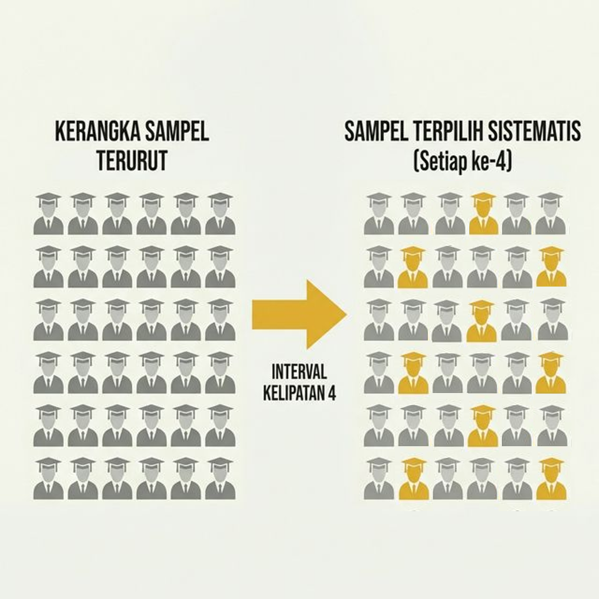
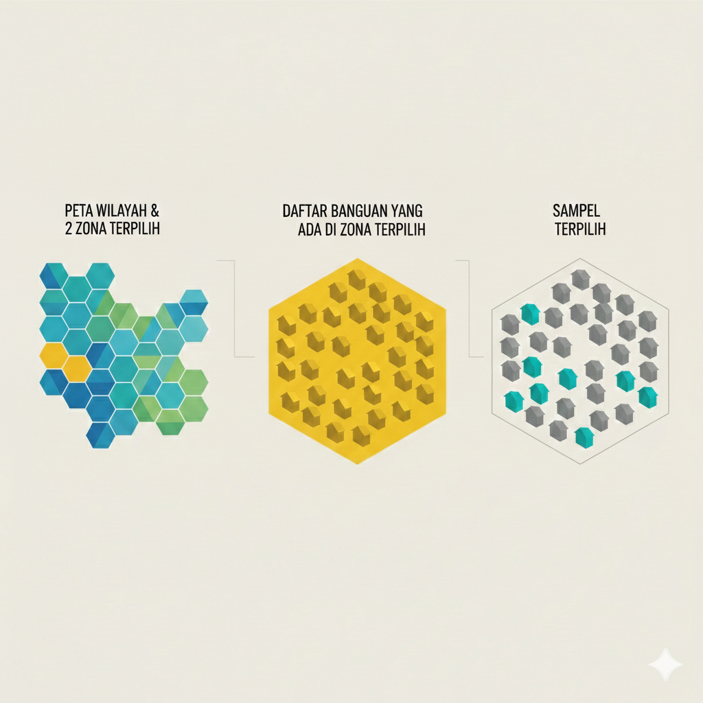
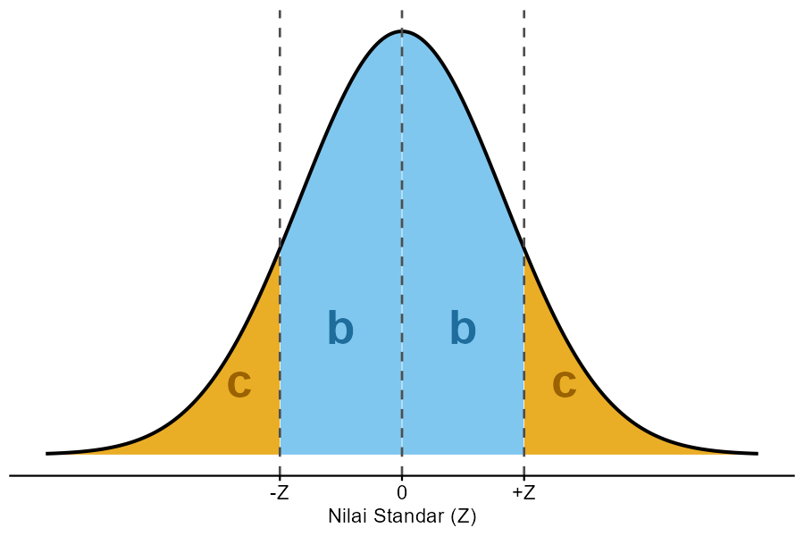

# Pengantar Analisis Statistik Inferensial

::: rmdcapaian
## Capaian Pembelajaran {.unnumbered}

Setelah mempelajari bab ini, Anda diharapkan:

1.  mampu memilih jenis-jenis pengambilan sampel dalam statistik untuk sebuah kasus. [STP-4.1]{.capaian}
2.  mampu menjelaskan hasil perhitungan probabilitas dari suatu nilai sampel dalam distribusi statistik sampel menggunakan *standard error*. [STP-4.2]{.capaian}
:::

## Konsep Dasar Statistika Inferensial

Statistika inferensial adalah cabang statistika yang mempelajari **penarikan kesimpulan tentang populasi berdasarkan data dari sampel**. Konsep-konsep dasar yang perlu dipahami dalam analisis statistika ini meliputi **perbedaan antara populasi dan sampel**, **teknik pengambilan sampel**, **distribusi sampel dan distribusi statistik sampel**, serta prinsip-prinsip terkait distribusi statistik, yakni beberapa di antaranya adalah **teorema limit sentral** dan **distribusi normal**.

Setelah memahami konsep-konsep tersebut, kita dapat melanjutkan pembahasan ke penarikan kesimpulan karakteristik populasi dari hasil sampel, yang mencakup pembuatan **estimasi parameter** dan **pengujian hipotesis** yang menyatakan karakteristik seluruh populasi dari hasil sampel.

## Populasi vs. Sampel

**Populasi** adalah seluruh kelompok objek (baik orang, benda, maupun kejadian) yang menjadi target penelitian kita. Ukuran statistik deskriptif dari populasi, seperti rata-rata ($\mu$) atau simpangan baku ($\sigma$), disebut **parameter**. Parameter inilah yang sebenarnya ingin diketahui oleh peneliti. Namun, karena jumlah populasi biasanya sangat besar, sering kali kita tidak mungkin mengukur seluruh anggota populasi secara langsung.

Sebaliknya, **sampel** adalah sebagian kecil dari populasi yang kita ambil untuk diamati. Sampel yang baik harus bisa mewakili sifat keseluruhan populasinya **(representatif)**. Ukuran statistik deskriptif dari sampel inilah yang disebut **statistik** (seperti rata-rata $\bar{x}$ atau simpangan baku $s$). Nilai statistik ini digunakan untuk menduga nilai parameter populasi.

**Mengapa kita mengambil sampel?** Alasan utamanya adalah **efisiensi** dan **kelayakan**. Menurut @saunders2023, melakukan sensus terhadap populasi yang besar sering kali tidak praktis karena membutuhkan **biaya** yang sangat mahal dan **waktu** yang lama. Selain itu, @devaus2014surveys menekankan bahwa sensus tidak menjamin data yang lebih akurat. Sebaliknya, sampel yang dipilih dengan hati-hati memungkinkan peneliti untuk mengontrol kualitas data dengan lebih ketat (misalnya melalui pelatihan pewawancara yang lebih intensif), sehingga justru dapat menghasilkan tingkat **akurasi** yang lebih tinggi dibandingkan sensus yang rentan terhadap *non-sampling error*.

::: rmdkasus
### Studi Kasus: Populasi vs. Sampel {.unnumbered}

Kita ingin menganalisis data karakteristik perjalanan mahasiswa di ITERA. Oleh karena itu, kita mengumpulkan data terstruktur yang mengukur variabel-variabel terkait pola perjalanan mahasiswa di ITERA.

Berdasarkan data tahun 2023 pertengahan, tercatat sebanyak **18.877** mahasiswa aktif di ITERA. Jika kita mengumpulkan seluruh mahasiswa aktif dengan jumlah tersebut, maka kita akan mendapatkan data populasi. Namun, karena jumlah mahasiswa yang sangat banyak, kita tidak mungkin mengumpulkan data seluruh mahasiswa aktif di ITERA. Oleh karena itu, kita mengumpulkan data sebagian mahasiswa aktif di ITERA, yaitu sebanyak **428** mahasiswa.

```{r 05-inferensia-populasi-sampel-viz, echo=FALSE, out.width='80%', fig.align='center', fig.cap="Ilustrasi Perbandingan Populasi Mahasiswa ITERA dan Sampel"}
knitr::include_graphics("images/populasi_vs_sampel_itera.png")
```

Keputusan mengambil 428 sampel ini didasarkan pada pertimbangan **efisiensi** dan **akurasi** yang telah kita bahas sebelumnya. Melakukan sensus terhadap 18.877 mahasiswa tentu membutuhkan biaya dan waktu yang sangat besar. Selain itu, dengan jumlah yang jauh lebih sedikit, peneliti dapat lebih fokus menjamin kualitas data (misalnya meminimalisir kesalahan input atau bias wawancara), sehingga data sampel ini diharapkan memiliki kualitas yang lebih baik daripada sensus yang dilakukan secara terburu-buru.
:::

## Teknik-Teknik Pengambilan Sampel *(Sampling Techniques)*

Teknik pengambilan sampel bertujuan memastikan bahwa sampel yang dipilih benar-benar dapat mewakili populasinya. @healey2021statistics menekankan prinsip EPSEM (*Equal Probability of Selection Method*), yakni prinsip yang menekankan bahwa **setiap anggota populasi memiliki kesempatan yang sama untuk dipilih**. Hal ini penting untuk menghasilkan sampel yang representatif.

Teknik probabilitas adalah teknik yang menggunakan prinsip EPSEM. Untuk dapat menggunakannya, kita harus memiliki **kerangka sampel**. Kerangka sampel adalah daftar seluruh anggota populasi yang akan menjadi acuan kita untuk memilih sampel nantinya. Ada empat jenis teknik yang termasuk ke dalam teknik pengambilan sampel probabilitas [@tjokropandojo2021pengantar, @saunders2023]: *simple random sampling*, *systematic sampling*, *stratified sampling*, dan *multi-stage cluster sampling*.

::: rmdkasus
### Studi Kasus: Pengambilan Sampel dengan Populasi Kecil {.unnumbered}

Untuk mempermudah pemahaman, bayangkan kita memiliki **populasi kecil** yang terdiri dari **16 orang** saja. Setiap orang memiliki atribut **Kelompok** (A/B/C/D) dan tinggal di **Blok** tertentu (1/2/3/4).

Berikut adalah data lengkap ke-16 orang tersebut:

```{r 05-inferensia-setup-toy-populasi, echo=FALSE, message=FALSE, warning=FALSE}
library(dplyr)
library(knitr)

# Buat Populasi Toy N=16
populasi_kecil <- data.frame(
  ID = 1:16,
  Jarak = c(
    2.5, 1.0, 5.2, 3.8, # Blok 1
    0.5, 1.2, 4.0, 6.1, # Blok 2
    10.5, 11.2, 9.8, 8.5, # Blok 3
    15.0, 14.2, 16.5, 13.8
  ), # Blok 4
  Kelompok = rep(c("A", "B", "C", "D"), 4), # Distribute Strata evenly
  Blok = rep(c("Blok 1", "Blok 2", "Blok 3", "Blok 4"), each = 4) # Clusters
)

# Tampilkan dalam format compact (2 kolom berdampingan)
# Split menjadi 2 bagian (1-8 dan 9-16)
df_split_1 <- populasi_kecil[1:8, ]
df_split_2 <- populasi_kecil[9:16, ]

# Rename columns for display to avoid confusion
colnames(df_split_1) <- c("ID", "Jarak", "Kelompok", "Blok")
colnames(df_split_2) <- c("ID", "Jarak", "Kelompok", "Blok")

# Bind side by side properly (cbind)
# Note: kable doesn't support multiple headers easily, so we just cbind
tabel_gabungan <- cbind(df_split_1, df_split_2)

kable(tabel_gabungan, caption = "Daftar Lengkap Populasi (N=16)")
```

Mari kita terapkan keempat teknik *sampling* untuk memilih sampel dari 16 orang ini.
:::

### *Simple Random Sampling*

*Simple random sampling* merupakan teknik paling dasar dalam pengambilan sampel probabilistik. Kita mengambil secara acak nomor yang merepresentasikan nomor urut sampel. Ini memungkinkan setiap anggota populasi memiliki peluang yang sama untuk dipilih. Pemilihan anggota sampel secara acak ini dapat dilakukan dengan bantuan sistem eksternal dari peneliti, misalnya melalui tabel angka acak atau program komputer yang menghasilkan angka acak (*random number generator*) (Gambar \@ref(fig:05-inferensia-img-srs)).

```{r 05-inferensia-img-srs, echo=FALSE, out.width='80%', fig.align='center', fig.cap="Ilustrasi Simple Random Sampling"}
knitr::include_graphics("images/bab-5-srs.png")
```

::: rmdnote
### Catatan: Miskonsepsi tentang Istilah Random {.unnumbered}

Banyak yang salah kaprah dengan istilah *random* pada *simple random sampling*. Keacakan (*random*) di sini maksudnya bukan asal mengambil sampel secara acak **langsung di dunia nyata**, akan tetapi kita mengambil sampel tersebut dari **sebuah kerangka sampel**, elemen vital dalam teknik *sampling* probabilitas.
:::

::: rmdkasus
### Studi Kasus: *Simple Random Sampling* dengan Populasi Kecil {.unnumbered}

Misalkan kita menggunakan *random number generator* yang ada di hampir semua program *spreadsheet* untuk memilih 4 sampel. *Hasilnya adalah 4 orang yang terpilih secara acak tanpa pola tertentu.*

```{r 05-inferensia-toy-srs, echo=FALSE}
set.seed(101) # Seed for reproducibility
sampel_srs <- populasi_kecil |> sample_n(4)
kable(sampel_srs, caption = "Hasil SRS (n=4)")
```
:::

### *Systematic Random Sampling*

Berbeda dengan *simple random sampling*, *systematic random sampling* menggunakan sistem pemilihan berdasarkan interval tertentu. Langkah pertama adalah menentukan angka acak awal, kemudian memilih sampel berikutnya berdasarkan kelipatan dari angka tersebut.

```{r 05-inferensia-img-systematic, echo=FALSE, out.width='60%', fig.align='center', fig.cap="Ilustrasi Systematic Random Sampling"}

```

::: rmdkasus
### Studi Kasus: *Systematic Sampling* dengan Populasi Kecil {.unnumbered}

Kita ingin mengambil sampel dengan interval **k=4**. Kita urutkan berdasarkan ID, lalu ambil setiap kelipatan 4 (4, 8, 12, 16).

```{r 05-inferensia-toy-systematic, echo=FALSE}
# Ambil setiap kelipatan 4
urutan_sys <- seq(4, 16, by = 4)
sampel_sys <- populasi_kecil |> slice(urutan_sys)
kable(sampel_sys, caption = "Hasil Systematic Sampling (Interval k=4)")
```

*Perhatikan pola ID yang terpilih selalu berjarak 4 angka.*
:::

### *Stratified Random Sampling*

Dalam beberapa kasus, populasi terdiri atas kelompok-kelompok, disebut **strata**, yang memiliki karakteristik yang sama didalamnya, misalnya jumlah anggota rumah tangga, tingkat pendidikan, atau status sosial ekonomi. Agar setiap kelompok terwakili, digunakanlah teknik *stratified random sampling*. Caranya adalah dengan membagi populasi ke dalam beberapa strata sesuai karakteristik yang relevan, kemudian mengambil sampel secara proporsional dari setiap strata.

```{r 05-inferensia-img-stratified, echo=FALSE, out.width='60%', fig.align='center', fig.cap="Ilustrasi Stratified Random Sampling"}
knitr::include_graphics("images/bab-5-stratified.png")
```

::: rmdkasus
### Studi Kasus: *Stratified Random Sampling* dengan Populasi Kecil {.unnumbered}

Kita ingin memastikan setiap **Kelompok** (A, B, C, D) terwakili. Kita bagi populasi menjadi 4 strata (Kelompok), lalu ambil **1 orang acak** dari setiap strata.

```{r 05-inferensia-toy-stratified, echo=FALSE}
set.seed(102)
sampel_strat <- populasi_kecil |>
  group_by(Kelompok) |>
  sample_n(1) |>
  ungroup() |>
  arrange(Kelompok) # Urutkan supaya terlihat perwakilannya

kable(sampel_strat,
  caption = "Hasil Stratified Sampling (1 wakil per Kelompok)"
)
```

*Hasilnya menjamin ada masing-masing satu perwakilan dari Kelompok A, B, C, dan D.*
:::

### *Multi-Stage Cluster Sampling*

Teknik ini digunakan ketika kerangka sampel individu tidak tersedia, tetapi kerangka sampel untuk kelompok (klaster) tersedia. Misalnya, kita tidak punya daftar nama seluruh penduduk kota, tetapi kita punya kerangka sampel nama-nama kelurahan. Kita bisa memilih beberapa kelurahan secara acak (tahap 1), kemudian menghasilkan kerangka sampel baru dari kelurahan yang terpilih tersebut, misalnya berdasarkan batas administratif (RW/lingkungan), atau berdasarkan batas fisik, seperti blok-blok jalan (tahap 2). Dari kerangka sampel tersebut kita pilih lagi secara acak anggota kerangka sampel tersebut.

```{r 05-inferensia-img-cluster, echo=FALSE, out.width='60%', fig.align='center', fig.cap="Ilustrasi Multi-Stage Cluster Sampling"}

```

::: rmdkasus
### Studi Kasus: *Multi-Stage Cluster Sampling* dengan Populasi Kecil {.unnumbered}

Kita ingin menghemat tenaga dengan hanya mendatangi satu lokasi saja. Kita pilih secara acak **1 Blok** (Cluster), lalu ambil **semua orang** di blok tersebut.

```{r 05-inferensia-toy-cluster, echo=FALSE}
set.seed(103)
# Pilih 1 blok secara acak
blok_terpilih <- sample(unique(populasi_kecil$Blok), 1)

sampel_cluster <- populasi_kecil |>
  filter(Blok == blok_terpilih)

kable(sampel_cluster,
  caption = paste("Hasil Cluster Sampling (Terpilih:", blok_terpilih, ")")
)
```

*Kita hanya perlu mendatangi satu lokasi (Blok), tapi mendapatkan 4 responden sekaligus.*
:::

::: rmdexercise

## Soal Evaluasi 6 {.unnumbered}

[STP-4.3]{.capaian} Sebuah acara keakraban angkatan Anda akan dilakukan di suatu tempat yang memerlukan biaya sewa tempat. Agar acara Anda dihadiri sebanyak mungkin orang, Anda menanyakan kesediaan kawan-kawan Anda. Anda pun merancang sebuah survei untuk mengetahui persentase kawan Anda yang setuju acara keakraban diadakan di tempat tersebut. Untuk itu Anda menanyakan sebagian kawan Anda sebagai sampel.

  a. Apabila Anda memiliki daftar nama seluruh kawan Anda, apa nama teknik pengambilan sampel yang Anda bisa lakukan?
  b. Jelaskan bagaimana metode Anda memilih sampel kawan Anda berdasarkan kondisi di soal ke-1 tersebut.
  c. Apabila Anda tidak memiliki daftar nama seluruh kawan Anda, apa nama teknik pengambilan sampel yang Anda bisa lakukan?
  d. Jelaskan bagaimana metode Anda memilih sampel kawan Anda berdasarkan kondisi di soal ke-3 tersebut.
:::


## Menentukan Ukuran Sampel

Jika selama ini kita masih berpikir bahwa ukuran sampel (jumlah sampel yang menjadi bahan data kita) ditentukan berdasarkan ukuran populasinya, maka kita salah kaprah. Menurut @devaus2014surveys, ukuran sampel menentukan galat dari perkiraan kita terhadap populasi, tapi ukuran sampel **bukan ditentukan dari ukuran populasi**. @devaus2014surveys juga menjabarkan jumlah-jumlah sampel yang berbeda untuk setiap galat dari perkiraan kita. Galat perkiraan ini disebut juga dengan *sampling error*. Tabel \@ref(tab:tabel-ukuran-sampel-sampling-error) menunjukkan ukuran sampel minimum berdasarkan *sampling error* pada varians 50/50, tingkat kepercayaan 95%. Ini akan kita pelajari lebih dalam di Bab \@ref(bab-6-estimasi-parameter).

```{r tabel-ukuran-sampel-sampling-error, echo=FALSE, fig.align='center'}
library(knitr)
library(kableExtra)

tabel_se <- data.frame(
  SE_kiri = c(
    "1,0%", "1,5%", "2,0%", "2,5%", "3,0%",
    "3,5%", "4,0%", "4,5%", "5,0%", ""
  ),
  n_kiri = c(
    "10.000", "4.500", "2.500", "1.600", "1.100",
    "816", "625", "494", "400", ""
  ),
  SE_kanan = c(
    "5,5%", "6,0%", "6,5%", "7,0%", "7,5%",
    "8,0%", "8,5%", "9,0%", "9,5%", "10,0%"
  ),
  n_kanan = c(
    "330", "277", "237", "204", "178",
    "156", "138", "123", "110", "100"
  )
)

kbl(
  tabel_se,
  col.names = c(
    "_Sampling error_", "Ukuran Sampel Min.",
    "_Sampling error_", "Ukuran Sampel Min."
  ),
  caption = "Ukuran sampel minimum berdasarkan *sampling error* pada varians 50/50, tingkat kepercayaan 95%",
  align = c("c", "c", "c", "c")
) |>
  kable_styling(full_width = FALSE, position = "center")
```

::: rmdkasus
### Studi Kasus: Menentukan Jumlah Sampel dari Tabel {.unnumbered}

Seorang mahasiswa ingin meneliti **proporsi mahasiswa ITERA yang menggunakan kendaraan bermotor** sebagai moda utama perjalanan ke kampus. Ia merancang survei dan perlu menentukan berapa responden yang harus ia kumpulkan.

Karena ia belum tahu berapa proporsi sesungguhnya di populasi, ia menggunakan asumsi terburuk: 50% menggunakan kendaraan bermotor dan 50% tidak (varians 50/50). Ia juga menetapkan bahwa *sampling error* yang masih dapat ia tolerir adalah **5%** pada tingkat kepercayaan 95%.

Dengan membaca Tabel \@ref(tab:tabel-ukuran-sampel-sampling-error) pada baris *sampling error* 5,0%, ia menemukan bahwa **sampel minimum yang dibutuhkan adalah 400 responden**. Jumlah inilah yang ia jadikan target pengumpulan data.

Perhatikan bahwa angka ini tidak bergantung pada seberapa besar populasi mahasiswa ITERA (yang berjumlah lebih dari 18.000 orang). Cukup 400 responden, dan hasil surveinya akan memiliki akurasi dalam batas ±5% pada tingkat kepercayaan 95%.
:::


## Konsep Distribusi dalam Statistik

Dalam stastistika inferensial, kita harus menguasai konsep mengenai **distribusi**. Distribusi adalah penyebaran suatu nilai yang memiliki karakteristik tertentu. Di sini, tujuan kita adalah mengenali apa yang kami akan sebut dengan **distribusi objek** dan **distribusi statistik**, atau yang dalam @healey2021statistics dan @ewing2020basic disebut **distribusi sampel** dan **distribusi hasil sampel** (*sampling distribution*).

### Model-model Distribusi Statistik

Terdapat banyak jenis model distribusi dalam statistik yang sering dipakai. Beberapa jenis model statisik yang populer misalnya adalah distribusi *uniform* (seragam), distribusi binomial, distribusi Poisson, dan distribusi normal atau Gaussian [@ModernStatR-Home]. Namun, dalam pembahasan statistika inferensial di buku ini kita hanya akan fokus pada **distribusi normal** dan turunannya, distribusi Student's t, beserta distribusi binomial, distribusi F, dan distribusi *Chi-square*.

Seperti yang ditampilkan oleh Gambar \@ref(fig:fig-ragam-distribusi) berikut, setiap jenis distribusi statistik mempunyai berbagai bentuknya. Bentuk-bentuk ini pada hakikatnya adalah **histogram-histogram** representasi sebaran nilai-nilai sekumpulan objek.

```{r fig-ragam-distribusi, echo=FALSE, out.width='80%', fig.align='center', fig.cap="Ragam Bentuk Distribusi Statistik", message=FALSE, warning=FALSE}
library(ggplot2)
library(gridExtra)
library(grid)

# Tema ilustrasi: ada garis sumbu tapi tanpa angka/label per panel
theme_dist <- theme_classic() +
  theme(
    axis.text = element_blank(),
    axis.ticks = element_blank(),
    axis.title = element_blank(),
    plot.title = element_text(hjust = 0.5, face = "bold", size = 10),
    plot.margin = margin(5, 5, 5, 5)
  )

# 1. Uniform
p1 <- ggplot(data.frame(x = c(0, 1)), aes(x)) +
  stat_function(
    fun = dunif, args = list(min = 0, max = 1),
    geom = "area", fill = "#56B4E9", alpha = 0.8
  ) +
  labs(title = "Uniform") +
  theme_dist

# 2. Binomial
p2 <- ggplot(
  data.frame(
    x = 0:10,
    y = dbinom(0:10, size = 10, prob = 0.5)
  ),
  aes(x, y)
) +
  geom_col(fill = "#e98056ff", alpha = 0.8, width = 0.7) +
  labs(title = "Binomial") +
  theme_dist

# 3. Poisson
p3 <- ggplot(data.frame(x = 0:10, y = dpois(0:10, lambda = 3)), aes(x, y)) +
  geom_col(fill = "#ae56e9ff", alpha = 0.8, width = 0.7) +
  labs(title = "Poisson") +
  theme_dist

# 4. Normal
p4 <- ggplot(data.frame(x = c(-3, 3)), aes(x)) +
  stat_function(fun = dnorm, geom = "area", fill = "#3eb925ff", alpha = 0.8) +
  labs(title = "Normal") +
  theme_dist

# 5. F-Distribution
p5 <- ggplot(data.frame(x = c(0, 5)), aes(x)) +
  stat_function(
    fun = function(x) df(x, df1 = 5, df2 = 20),
    geom = "area", fill = "#e95676ff", alpha = 0.8
  ) +
  labs(title = "F-Distribution") +
  theme_dist

# 6. Chi-Square
p6 <- ggplot(data.frame(x = c(0, 10)), aes(x)) +
  stat_function(
    fun = dchisq, args = list(df = 3),
    geom = "area", fill = "#be2121ff", alpha = 0.8
  ) +
  labs(title = "Chi-Square") +
  theme_dist

# Grid dengan label sumbu global
grid.arrange(p1, p2, p3, p4, p5, p6,
  ncol = 3,
  left = textGrob("Frekuensi",
    rot = 90,
    gp = gpar(fontsize = 12, fontface = "bold")
  ),
  bottom = textGrob("Nilai Variabel",
    gp = gpar(fontsize = 12, fontface = "bold")
  )
)
```

**Interpretasi Bentuk Distribusi**

Seperti yang sudah dijelaskan bahwa bentuk distribusi sebenarnya adalah histogram, kita sudah belajar bahwa histogram memiliki 2 sumbu: sumbu X dan Y/mendatar dan tegak, yang masing-masing artinya adalah rentang nilai dan frekuensi kemunculan nilai tersebut secara berturut-turut. 

Begitu juga gambar-gambar distribusi tersebut. Sumbu X mencerminkan **nilai-nilai yang terdapat dalam objek-objek** yang dinyatakan distribusinya, sumbu Y jumlah kemunculan nilai-nilai tersebut. Selain dipahami sebagai jumlah, sumbu Y juga bisa diinterpretasikan sebagai **probabilitas** kemunculan nilai-nilai tersebut.

### Distribusi Normal {#bab-5-distribusi-normal}

Distribusi normal adalah salah satu jenis distribusi nilai yang memiliki karakteristik berbentuk seperti lonceng, simetris, dan membentang tanpa batas di kedua sisi sumbu horizontal [@tjokropandojo2021pengantar]. Oleh karena itu, model distribusi ini juga disebut *bell curve* atau kurva lonceng [@healey2021statistics] (Gambar \@ref(fig:fig-bab-5-hist-normal)).

```{r fig-bab-5-hist-normal, echo=FALSE, out.width='80%', fig.align='center', fig.cap="Distribusi Normal"}
# 4. Normal
p4 <- ggplot(data.frame(x = c(-3, 3)), aes(x)) +
  stat_function(fun = dnorm, geom = "area", fill = "#56B4E9", alpha = 0.8) +
  theme_minimal()

p4
```

Dari Gambar \@ref(fig:fig-bab-5-hist-normal), kita dapat melihat bahwa distribusi normal memiliki beberapa karakteristik utama berikut:

1.  **Parameter Utama:** Distribusi normal ditentukan sepenuhnya oleh dua parameter: rata-rata (*mean* atau $\mu$) dan varians ($\sigma^2$) [@Chan-IntroProb]. Rata-rata menentukan lokasi tengah distribusi, sedangkan varians (atau standar deviasi) menentukan lebar atau penyebaran kurva [@healey2021statistics; @Hair-Multivariate].

```{r fig-bab-5-parameter-normal, echo=FALSE, out.width='80%', fig.align='center', fig.cap="Perbandingan Distribusi Normal dengan Rata-rata Sama namun Standar Deviasi Berbeda", warning=FALSE, message=FALSE}
library(ggplot2)
library(gridExtra)

mu <- 15
sigma1 <- 1.75
sigma2 <- 3.5 # Standar deviasi yang lebih besar (2x lipat)
# Gunakan range yang cukup lebar untuk menampung distribusi
# yang lebih lebar (sigma2)
x_range <- c(mu - 4 * sigma2, mu + 4 * sigma2)

# Fungsi untuk membuat plot standar dengan parameter spesifik
create_normal_plot <- function(mu, sigma, fill_color, title_text) {
  ggplot(data.frame(x = x_range), aes(x)) +
    stat_function(
      fun = dnorm, args = list(mean = mu, sd = sigma),
      geom = "area", fill = fill_color, alpha = 0.8
    ) +
    theme_minimal() +
    labs(title = title_text, x = "", y = "Densitas") +
    xlim(x_range) + # Pastikan sumbu x sama persis

    # Garis Mean
    geom_vline(
      xintercept = mu,
      linetype = "dashed",
      color = "indianred",
      size = 0.5
    ) +
    annotate("text",
      x = mu, y = dnorm(mu, mean = mu, sd = sigma) * 0.1,
      label = expression(mu), color = "indianred", size = 4, fontface = "bold"
    ) +

    # Garis +/- 1 SD
    geom_vline(
      xintercept = c(mu - sigma, mu + sigma),
      linetype = "dashed",
      color = "indianred",
      size = 0.5
    ) +
    annotate("text",
      x = mu - sigma, y = dnorm(mu - sigma, mean = mu, sd = sigma) * 0.2,
      label = expression(mu - sigma),
      color = "indianred",
      size = 3,
      hjust = 1.1
    ) +
    annotate("text",
      x = mu + sigma, y = dnorm(mu + sigma, mean = mu, sd = sigma) * 0.2,
      label = expression(mu + sigma),
      color = "indianred",
      size = 3,
      hjust = -0.1
    ) +

    # Garis +/- 2 SD
    geom_vline(
      xintercept = c(mu - 2 * sigma, mu + 2 * sigma),
      linetype = "dashed",
      color = "indianred",
      size = 0.5
    ) +
    annotate("text",
      x = mu - 2 * sigma,
      y = dnorm(mu - 2 * sigma, mean = mu, sd = sigma) * 0.5,
      label = expression(mu - 2 * sigma),
      color = "indianred",
      size = 3,
      hjust = 1.1
    ) +
    annotate("text",
      x = mu + 2 * sigma,
      y = dnorm(mu + 2 * sigma, mean = mu, sd = sigma) * 0.5,
      label = expression(mu + 2 * sigma),
      color = "indianred",
      size = 3,
      hjust = -0.1
    ) +

    # Garis +/- 3 SD
    geom_vline(
      xintercept = c(mu - 3 * sigma, mu + 3 * sigma),
      linetype = "dashed", color = "indianred", size = 0.5
    ) +
    annotate("text",
      x = mu - 3 * sigma,
      y = dnorm(mu - 3 * sigma, mean = mu, sd = sigma) * 0.8,
      label = expression(mu - 3 * sigma),
      color = "indianred", size = 3, hjust = 1.1
    ) +
    annotate("text",
      x = mu + 3 * sigma,
      y = dnorm(mu + 3 * sigma, mean = mu, sd = sigma) * 0.8,
      label = expression(mu + 3 * sigma),
      color = "indianred", size = 3, hjust = -0.1
    )
}

# Plot 1: Sigma Kecil
p4 <- create_normal_plot(
  mu, sigma1, "#56B4E9",
  paste("Distribusi Normal (SD =", sigma1, ")")
)

# Plot 2: Sigma Besar
p5 <- create_normal_plot(mu, sigma2, "#E69F00", paste("Distribusi Normal (SD =", sigma2, ")")) + # nolint: line_length_linter.
  labs(x = "Nilai") # Tambahkan label sumbu x hanya di plot bawah

grid.arrange(p4, p5, ncol = 1)
```

2.  **Simetri Sempurna:** Pada distribusi normal yang sempurna, nilai *mean* (rata-rata), *median* (nilai tengah), dan *mode* (nilai yang paling sering muncul) adalah identik dan berada **tepat di tengah distribusi** [@healey2021statistics; @devaus2014surveys].

3.  **Skewness dan Kurtosis:**

      - **Skewness (Kemencengan):** Distribusi normal memiliki nilai *skewness* 0, yang menunjukkan simetri sempurna. Jika data menumpuk di kiri, itu disebut *positive skew*, dan jika di kanan disebut *negative skew* [@devaus2014surveys; @ewing2020basic].

      - **Kurtosis (Keruncingan):** Mengukur keruncingan atau kedataran puncak distribusi relatif terhadap distribusi normal. Distribusi normal memiliki nilai kurtosis 3. Distribusi yang lebih runcing disebut leptokurtik (>3), dan yang lebih datar disebut platikurtik (<3) [@Chan-IntroProb; @ewing2020basic].

```{r 05-inferensia-viz-skewness, echo=FALSE, out.width='49%', fig.show='hold', fig.cap="Ilustrasi Positive dan Negative Skewness", warning=FALSE, message=FALSE}
library(ggplot2)
library(gridExtra)

# Generate data for visualizations
set.seed(123)
x_pos <- rbeta(2000, 2, 5) # Positive Skew
x_neg <- rbeta(2000, 5, 2) # Negative Skew

p_pos <- ggplot(data.frame(x = x_pos), aes(x)) +
  geom_density(fill = "#E69F00", alpha = 0.7) +
  labs(title = "Positif Skew (Ekor Kanan)") +
  theme_void() +
  theme(plot.title = element_text(hjust = 0.5, face = "bold"))

p_neg <- ggplot(data.frame(x = x_neg), aes(x)) +
  geom_density(fill = "#56B4E9", alpha = 0.7) +
  labs(title = "Negatif Skew (Ekor Kiri)") +
  theme_void() +
  theme(plot.title = element_text(hjust = 0.5, face = "bold"))

grid.arrange(p_pos, p_neg, ncol = 2)
```
```{r 05-inferensia-viz-kurtosis, echo=FALSE, out.width='49%', fig.show='hold', fig.cap="Perbandingan Kurtosis: Normal (3) vs Platikurtik (<3)", warning=FALSE, message=FALSE}
# Create data for Normal (Mesokurtic) and Uniform (Platykurtic)
x_seq <- seq(-4, 4, length.out = 200)

df_kurt <- data.frame(
  x = rep(x_seq, 2),
  y = c(dnorm(x_seq), dunif(x_seq, min = -2.5, max = 2.5)), # Uniform adjusted width
  Type = rep(c(
    "Normal (Kurtosis = 3)",
    "Platikurtik (Kurtosis = 0)"
  ), each = 200)
)

ggplot(df_kurt, aes(x = x, y = y, fill = Type)) +
  geom_area(position = "identity", alpha = 0.6) +
  scale_fill_manual(values = c("#56B4E9", "#D55E00")) +
  labs(y = "Densitas", x = "") +
  theme_minimal() +
  theme(legend.position = "bottom", legend.title = element_blank())
```

4.  **Area di Bawah Kurva (Aturan 68-95-99, Aturan Empiris):** Salah satu karakteristik paling berguna adalah **proporsi area di bawah kurva yang tetap** berdasarkan jarak standar deviasi (SD) dari rata-rata [@healey2021statistics]:

    -   $\pm$ 1 SD mencakup sekitar 68,26% dari total kasus.
    -   $\pm$ 2 SD mencakup sekitar 95,44% dari total kasus.
    -   $\pm$ 3 SD mencakup sekitar 99,72% dari total kasus.

    Ini mengimplikasikan bahwa kejadian yang berada jauh di luar 3 standar deviasi dari rata-rata sangat jarang terjadi.

```{r fig-bab-5-aturan-689599, echo=FALSE, out.width="80%", fig.align='center', fig.cap="Ilustrasi Aturan 68-95-99 (Aturan Empiris)"}
library(ggplot2)

mu <- 15
sigma <- 1.75

# Create data
x <- seq(mu - 4 * sigma, mu + 4 * sigma, length.out = 1000)
y <- dnorm(x, mean = mu, sd = sigma)
df <- data.frame(x = x, y = y)

ggplot(df, aes(x = x, y = y)) +
  # Layer 3 SD (99.7%) - Lightest
  geom_area(data = subset(df, x >= mu - 3 * sigma & x <= mu + 3 * sigma), fill = "#C6DBEF", alpha = 0.9) +
  # Layer 2 SD (95%) - Medium
  geom_area(data = subset(df, x >= mu - 2 * sigma & x <= mu + 2 * sigma), fill = "#6BAED6", alpha = 0.9) +
  # Layer 1 SD (68%) - Darkest
  geom_area(data = subset(df, x >= mu - sigma & x <= mu + sigma), fill = "#2171B5", alpha = 0.9) +
  # Outline
  geom_line(size = 0.8, color = "black") +

  # Annotations (Horizontal Lines & Percentages)

  # 68% Line (Top)
  annotate("segment",
    x = mu - sigma, xend = mu + sigma, y = 0.12, yend = 0.12,
    arrow = arrow(ends = "both", length = unit(0.2, "cm")), color = "white", size = 1
  ) +
  annotate("text", x = mu, y = 0.12, label = "68%", vjust = -0.8, color = "white", fontface = "bold", size = 5) +

  # 95% Line (Middle)
  annotate("segment",
    x = mu - 2 * sigma, xend = mu + 2 * sigma, y = 0.05, yend = 0.05,
    arrow = arrow(ends = "both", length = unit(0.2, "cm")), color = "black", size = 0.8
  ) +
  annotate("text", x = mu, y = 0.05, label = "95%", vjust = -0.8, color = "black", fontface = "bold", size = 4) +

  # 99.7% Line (Bottom)
  annotate("segment",
    x = mu - 3 * sigma, xend = mu + 3 * sigma, y = 0.01, yend = 0.01,
    arrow = arrow(ends = "both", length = unit(0.2, "cm")), color = "black", size = 0.8
  ) +
  annotate("text", x = mu, y = 0.01, label = "99.7%", vjust = -0.8, color = "black", fontface = "bold", size = 4) +

  # Custom X Axis Labels
  scale_x_continuous(
    breaks = c(mu - 3 * sigma, mu - 2 * sigma, mu - sigma, mu, mu + sigma, mu + 2 * sigma, mu + 3 * sigma),
    labels = c(
      expression(mu - 3 * sigma), expression(mu - 2 * sigma), expression(mu - sigma),
      expression(mu),
      expression(mu + sigma), expression(mu + 2 * sigma), expression(mu + 3 * sigma)
    )
  ) +
  theme_minimal() +
  labs(x = "", y = "Densitas") +
  theme(axis.text.x = element_text(size = 10))
```


### Distribusi Objek dan Distribusi Statistik

**Distribusi objek** atau **distribusi sampel** merujuk pada **sebaran nilai data** dari objek-objek yang menjadi sampel yang kita ambil. Dengan kata lain, distribusi ini menggambarkan variasi data individual setiap objek.

Di sisi lain, **distribusi statistik** atau **distribusi hasil sampel** *(sampling distribution)* adalah **sebaran nilai statistik** (misalnya rata-rata) dari suatu populasi yang berasal dari perhitungan statistik sampel-sampel yang diambil berulang kali dari populasi tersebut. Statistik yang dihitung biasanya dapat berupa proporsi atau rata-rata.

Mari pelajari kasus berikut untuk lebih memahami perbedaan antara distribusi objek dengan distribusi statistik.

::: rmdkasus
### Studi Kasus: Distribusi Objek vs Distribusi Statistik {.unnumbered}

Agar lebih mudah membayangkan perbedaan antara distribusi objek dan distribusi statistik, mari kita gunakan **populasi kecil** yang hanya terdiri dari **30 mahasiswa** (diambil dari data ITERA). Kita akan melihat variabel **Jarak Tempuh (km)**.

**1. Distribusi Objek (Sebaran Data Individu)**

Berikut adalah data populasi lengkap (N=30):

```{r 05-inferensia-populasi-30, echo=FALSE, message=FALSE, warning=FALSE}
library(readr)
library(dplyr)
library(knitr)
library(kableExtra)

# Load & Prep Data (Populasi Kecil N=30)
data_full <- read_delim("datasets/DataUtama_mhsITERA.csv", delim = ";", show_col_types = FALSE) |>
  filter(!is.na(jarak.km))
set.seed(42)
populasi_kecil <- data_full |>
  sample_n(30) |>
  select(nomor.urut, jarak.km) |>
  mutate(ID = 1:30) |> # Re-ID for simplicity
  select(ID, Jarak = jarak.km) |>
  arrange(Jarak)

# Split table for display 2 columns side-by-side (15 rows each)
tabel_kiri <- populasi_kecil[1:15, ]
tabel_kanan <- populasi_kecil[16:30, ]
tabel_gabung <- cbind(tabel_kiri, tabel_kanan)
colnames(tabel_gabung) <- c("ID", "Jarak", "ID", "Jarak")

kbl(tabel_gabung, caption = "Data Populasi (N=30)") |>
  kable_styling(full_width = T)

# Statistik Populasi
mu_pop <- mean(populasi_kecil$Jarak)
sigma_pop <- sd(populasi_kecil$Jarak)
```

Rata-rata populasi adalah $\mu = `r round(mu_pop, 2)`$ km dengan simpangan baku $\sigma = `r round(sigma_pop, 2)`$ km.

Sekarang, kita ambil **1 sampel** berukuran $n=10$ secara acak (*Simple Random Sampling*). Pengambilan menghasilkan sampel dengan ID 3, 9, 14, 17, 22, 23, 24, 25, 27, dan 30.

```{r 05-inferensia-sampel-satu, echo=FALSE, fig.cap="Histogram Distribusi Objek (n=10)", fig.align='center', out.width='80%'}
library(ggplot2)
set.seed(101)
sampel_satu <- populasi_kecil |> sample_n(10)

mean_sampel_satu <- mean(sampel_satu$Jarak)
sd_sampel_satu <- sd(sampel_satu$Jarak)

ggplot(sampel_satu, aes(x = Jarak)) +
  geom_histogram(bins = 6, fill = "#E69F00", color = "white", alpha = 0.8) +
  geom_vline(xintercept = mean_sampel_satu, color = "red", linetype = "dashed", size = 1) +
  labs(
    title = "Distribusi Objek (Sampel Tunggal n=10)",
    subtitle = paste("Rata-rata Sampel =", round(mean_sampel_satu, 2), "| SD Sampel =", round(sd_sampel_satu, 2)),
    x = "Jarak (km)", y = "Frekuensi (Jumlah Mahasiswa)"
  ) +
  theme_minimal()
```

Pada histogram di atas, sumbu Y ("Frekuensi") menunjukkan **jumlah mahasiswa** yang memiliki jarak tempuh tertentu. Variasi datanya menggambarkan seberapa berbeda jarak antar individu.

**2. Distribusi Statistik (Sebaran Rata-rata)**

Sekarang, kita lakukan simulasi: kita mengambil sampel ($n=10$) dari populasi tersebut sebanyak **200 kali**. Setiap kali ambil, kita catat rata-ratanya.

Berikut adalah 8 hasil pertama dari 200 pengambilan sampel:

```{r 05-inferensia-simulasi-200, echo=FALSE}
set.seed(999)
n_sim <- 200
n_sampel <- 10
hasil_simulasi <- numeric(n_sim)

for (i in 1:n_sim) {
  s <- sample(populasi_kecil$Jarak, n_sampel)
  hasil_simulasi[i] <- mean(s)
}

# Tampilkan 8 teratas
df_sim <- data.frame(
  Pengambilan_Ke = 1:n_sim,
  Rata_Rata_Sampel = round(hasil_simulasi, 2)
)

tabel_sim_head <- head(df_sim, 8)
rbind(tabel_sim_head |> mutate(Pengambilan_Ke = as.character(Pengambilan_Ke)), c("...", "...")) |>
  kbl(caption = "Hasil Simulasi Distribusi Sampling (8 Teratas dari 200)") |>
  kable_styling(full_width = F)
```

Mari kita lihat histogram dari 200 rata-rata ini:

```{r 05-inferensia-hist-sampling, echo=FALSE, fig.cap="Distribusi Statistik (200 Rata-rata)", fig.align='center', out.width='80%'}
mean_sampling <- mean(hasil_simulasi)
se_sampling <- sd(hasil_simulasi)

ggplot(data.frame(x = hasil_simulasi), aes(x = x)) +
  geom_histogram(bins = 15, fill = "#56B4E9", color = "white", alpha = 0.8) +
  geom_vline(xintercept = mean_sampling, color = "red", linetype = "dashed", size = 1) +
  labs(
    title = "Distribusi Statistik Hasil Sampel",
    subtitle = paste("Rata-rata dari Rata-rata =", round(mean_sampling, 2), "| Standard Error =", round(se_sampling, 2)),
    x = "Rata-rata Jarak (km)", y = "Frekuensi (Jumlah Sampel)"
  ) +
  theme_minimal()
```

Perhatikan perbedaan kedua histogram tersebut:

1.  **Distribusi objek**: Pada distribusi objek, tinggi batang (nilai di sumbu Y) mencerminkan "jumlah orang atau **frekuensi objek** yang memiliki nilai-nilai yang ada di sumbu X". Misalnya, objek yang memiliki nilai di antara 2,5 sampai 4,0 ada 4 buah (ID 23, 22, 9, dan 30), sementara 4,0 sampai 6,0 ada 2 objek (ID 27 dan 25).

2.  **Distribusi statistik**: Pada distribusi statistik, tinggi batang mencerminkan **frekuensi munculnya nilai rata-rata** dari 200 kali pengambilan sampel sebanyak 10 objek. Jika kita kaitkan dengan probabilitas, maka tinggi batang mewakili tingkat kemungkinan suatu nilai rata-rata dihasilkan dari sampel yang berjumlah 10 objek.
:::

::: rmdexercise
## Soal Evaluasi 7 {.unnumbered}

[STP-4.2]{.capaian} *Suatu sampel pegawai ITERA berjumlah 286 orang yang mengukur jarak tempat tinggal mereka ke kampus menghasilkan rata-rata 7,90 km dan simpangan baku 6,42 km.*

Jelaskan perbedaan distribusi objek dengan distribusi statistik berdasarkan kasus tersebut.

:::

## Teorema Limit Sentral

Tentu saja, di kehidupan nyata distribusi statistik dapat dikatakan tidak pernah ada. Sangat sulit untuk bisa mengambil sampel berkali-kali hingga sangat banyak. Ia hanyalah konsep teoritis untuk menjelaskan bagaimana suatu sampel bisa memiliki *pola statistik sampel yang dapat memprediksi populasi*. Dengan memahami pola prediksi tersebut, **kita tidak perlu lagi menghimpun semua anggota populasi** untuk menghitung parameter populasi. Cukup dengan mengumpulkan sampel tersebut, menghitung statistiknya, dan memperkirakan parameternya berdasarkan statistik tersebut.

Pola prediksi inilah yang dijelaskan oleh **Teorema Limit Sentral *(Central Limit Theorem)***. Teorema ini menjadi pijakan analisis inferensial karena memberikan dua jaminan penting:

1. jika ukuran sampel cukup besar (biasanya $n \ge 30$), **distribusi statistik sampel akan berbentuk normal** (lonceng simetris) apa pun bentuk populasi asalnya.

2. rata-rata dari distribusi statistik ini akan **tepat sama dengan rata-rata populasi sebenarnya**, dengan variasi yang semakin kecil seiring bertambahnya ukuran sampel. Ini adalah jaminan yang paling krusial dari teorema ini.

Kombinasi bentuk normal dan akurasi inilah yang memungkinkan kita melakukan estimasi dan uji statistik dengan percaya diri.

Berdasarkan teorema ini, kita dapat membagi analisis statistika inferensial menjadi analisis statistik inferensial **parametrik** dan **nonparametrik**. Analisis inferensial parametrik adalah analisis inferensial yang mengasumsikan bahwa populasi kita berdistribusi normal. Asumsi ini diuji dengan teknik pengujian kenormalan seperti [uji Shapiro-Wilk]('https://www.statistikian.com/2013/01/saphiro-wilk.html') atau [P-P plot]('https://online.stat.psu.edu/stat501/lesson/4/4.6').

::: rmdkasus
### Studi Kasus: Simulasi Teorema Limit Sentral {.unnumbered}

Mari kita buktikan CLT dengan melakukan simulasi pengambilan sampel berulang. Katakanlah kita memiliki **428 mahasiswa** sebagai populasi. Kita akan mengambil 1000 kali sampel berukuran 50 orang, lalu menghitung rata-ratanya dan memplot histogramnya.

Berikut adalah baris perintah untuk melakukan simulasi tersebut dalam R. Dataset yang digunakan dapat diakses pada [tautan ini]('https://github.com/abdulmubdibindar/buku-ajar-stp/blob/main/datasets/DataUtama_mhsITERA.csv').

```{r fig-05-inferensia-2-clt-studi-kasus-simulasi, echo=TRUE, fig.cap="Perbandingan Distribusi Populasi (Kiri) dan Distribusi Sampling (Kanan)", fig.width=10}
library(ggplot2)
library(gridExtra)
library(dplyr)

# Setup Ulang Populasi Besar (N=428) untuk CLT
data_itera <- read.csv("datasets/DataUtama_mhsITERA.csv", sep = ";")
data_populasi <- data_itera |>
  mutate(jarak = jarak.km) |>
  filter(!is.na(jarak))

# Hitung parameter populasi
mu <- mean(data_populasi$jarak)
N <- nrow(data_populasi)

# 1. Distribusi Populasi (Data Asli)
p1 <- ggplot(data_populasi, aes(x = jarak)) +
  geom_histogram(bins = 30, fill = "gray", color = "black", alpha = 0.7) +
  geom_vline(xintercept = mu, color = "red", size = 1) +
  labs(title = paste0("Distribusi Populasi (N=", N, ")"), x = "Jarak (km)") +
  theme_minimal()

# 2. Distribusi Sampling (Rata-rata dari 1000 sampel)  --> SIMULASI
set.seed(999)
means_1000 <- replicate(1000, mean(sample(data_populasi$jarak, 50)))
df_means <- data.frame(means = means_1000)

p2 <- ggplot(df_means, aes(x = means)) +
  geom_histogram(bins = 30, fill = "steelblue", color = "white", alpha = 0.9) +
  geom_vline(xintercept = mean(means_1000), color = "red", size = 1) +
  labs(title = "Distribusi Sampling (n=50, 1000x)", x = "Rata-rata Sampel") +
  theme_minimal()

grid.arrange(p1, p2, ncol = 2)
```

Gambar \@ref(fig:fig-05-inferensia-2-clt-studi-kasus-simulasi) menunjukkan distribusi objek populasi. Distribusi populasi (kiri) terlihat "miring" (*skewed*) ke kanan, artinya tidak normal. Namun, distribusi rata-rata sampelnya (kanan) berbentuk lonceng simetris yang hampir sempurna **normal**. Rata-rata dari distribusi statistik ini juga sangat dekat dengan rata-rata populasi sebenarnya ($\mu = `r round(mu, 2)`$).
:::

::: rmdkasus
### Studi Kasus: Efek Ukuran Sampel terhadap Variasi {.unnumbered}

Mari kita lanjutkan eksperimen kita. Apa yang terjadi jika kita mengubah ukuran sampel ($n$) yang kita ambil berulang-ulang tersebut? Kali ini kita akan membandingkan distribusi statistik yang dihasilkan dari pengambilan sampel berukuran **$n=30$** dengan **$n=100$**.

```{r fig-05-inferensia-3-clt-sample-size, echo=FALSE, fig.cap="Perbandingan Distribusi Statistik dengan Ukuran Sampel Berbeda", fig.width=10, warning=FALSE, message=FALSE}
# Simulasi n=30
set.seed(101)
means_n30 <- replicate(1000, mean(sample(data_populasi$jarak, 30)))
df_n30 <- data.frame(means = means_n30, type = "n = 30")

# Simulasi n=100
set.seed(102)
means_n100 <- replicate(1000, mean(sample(data_populasi$jarak, 100)))
df_n100 <- data.frame(means = means_n100, type = "n = 100")

# Gabung Data
df_compare <- rbind(df_n30, df_n100)

# Plot Overlay
ggplot(df_compare, aes(x = means, fill = type)) +
  geom_density(alpha = 0.6) +
  scale_fill_manual(values = c("#E69F00", "#56B4E9")) +
  geom_vline(xintercept = mu, color = "red", linetype = "dashed", size = 1) +
  labs(
    title = "Perbandingan Lebar Distribusi Statistik (n=30 vs n=100)",
    subtitle = paste("Garis Merah Putus-putus = Rata-rata Populasi (", round(mu, 2), ")"),
    x = "Rata-rata Sampel", y = "Densitas"
  ) +
  theme_minimal() +
  theme(legend.title = element_blank(), legend.position = "top")
```

Perhatikan Gambar \@ref(fig:fig-05-inferensia-3-clt-sample-size). Meskipun kedua kurva sama-sama berbentuk lonceng dan berpusat di rata-rata populasi (garis merah), kurva distribusi statistik untuk **$n=100$ (biru)** jauh lebih "kurus" dan tinggi dibandingkan kurva **$n=30$ (kuning)**.

Ini menunjukkan bahwa semakin banyak sampel yang kita ambil dalam satu kali pengambilan ($n$ semakin besar), maka **variasi** dari rata-rata yang kita peroleh akan semakin kecil. Artinya, rata-rata sampel kita akan semakin jarang meleset jauh dari rata-rata populasi sebenarnya. Dengan kata lain, memperbesar ukuran sampel akan meningkatkan peluang kita untuk mendapatkan hasil yang sangat mendekati kondisi populasi yang sebenarnya.
:::

::: rmdexercise
## Soal Evaluasi 8 {.unnumbered}

[STP-4.2]{.capaian} *Suatu sampel pegawai ITERA berjumlah 286 orang yang mengukur jarak tempat tinggal mereka ke kampus menghasilkan rata-rata 7,90 km dan simpangan baku 6,42 km.*

Apakah kita dapat menggunakan teorema limit sentral dalam perhitungan probabilitas distribusi statistik sampel tersebut? Jelaskan jawaban Anda.
:::


## Menghitung Peluang Kemunculan Nilai Tertentu dari Distribusi Statistik yang Berbentuk Normal.

Pada subbab \@ref(bab-5-distribusi-normal), kita telah belajar bahwa distribusi normal mempunyai aturan empiris atau aturan 68-95-99. Aturan ini berbicara tentang besar area di bawah kurva yang tetap berdasarkan jarak standar deviasi (SD) dari rata-rata [@healey2021statistics]:

  -   $\pm$ 1 SD mencakup sekitar 68,26% dari total kasus.
  -   $\pm$ 2 SD mencakup sekitar 95,44% dari total kasus.
  -   $\pm$ 3 SD mencakup sekitar 99,72% dari total kasus.

Sekarang kita akan menerapkan aturan empiris ini pada distribusi statistik yang berbentuk normal. Kita akan banyak menggunakan distribusi normal ini untuk menghitung **probabilitas terjadinya**--yang diwakili oleh besar area di bawah kurva distribusi normal--**dari suatu nilai yang diminta**, atau menentukan **nilai yang menjadi pembatas suatu probabilitas**. 

Untuk itu, kita perlu memahami konsep tentang standard error dan nilai standar atau nilai Z (*Z-score*). Kedua konsep ini sangat krusial bagi kita untuk memudahkan kita membaca tabel nilai Z yang beguna untuk 

### *Standard Error* (SE)

Sebagaimana yang sudah kita pelajari, distribusi statistik berbeda dengan distribusi objek dalam hal nilai yang diukur. Jika **distribusi objek mengukur nilai dari objek**, maka **distribusi statistik mengukur nilai dari sekumpulan objek yang diambil berulang-ulang dari populasi**.

Dalam distribusi objek, lebar distribusi berkaitan dengan ukuran statistik deskriptif yang disebut **standar deviasi** atau **simpangan baku**. Simpangan baku menunjukkan ukuran jarak rata-rata penyimpangan nilai-nilai dalam distribusi terhadap rata-ratanya. Untuk penyegaran, rumusnya adalah sebagai berikut.

$$
\begin{align}
\text{Simpangan Baku} &= \sqrt{\text{Variansi}}\\
&=\sqrt{\frac{\sum_{i=1}^{n}(x_i - \bar{x})^2}{n}} (\#eq:konsep-simpangan-baku-bab5)
\end{align}
$$ 

Di sisi lain, dalam distribusi statistik simpangan bakunya punya sebutan lain, yakni ***standard error*** (SE). *Standard error* pada hakikatnya adalah adalah **ukuran jarak statistik sampel dari parameter populasi**. Ingat kembali bahwa **rata-rata dari distribusi statistik adalah nilai parameter populasinya**. Semakin kecil SE, semakin presisi estimasi sampel kita terhadap parameter populasi. Secara matematis, standard error dihitung dari simpangan baku sampel kita dengan rumus berikut.

$$
\begin{align}
\text{SE} &=\frac{\sigma}{\sqrt{n}} (\#eq:konsep-standard-error-bab5)
\end{align}
$$ 

Dengan $\sigma$ adalah simpangan baku populasi dan $n$ adalah ukuran sampel.

Jika $\sigma$ tidak diketahui, kita gunakan simpangan baku sampel ($s$) sebagai estimasi, sehingga Persamaan \@ref(eq:konsep-standard-error-bab5) menjadi:

$$
\begin{align}
\text{SE} &=\frac{s}{\sqrt{n}} (\#eq:konsep-se-pake-sd)
\end{align}
$$ 


::: rmdnote

**PENTING**

Dalam beberapa sumber, seperti @healey2021statistics, perhitungan *standard error* yang menggunakan estimasi dari simpangan baku seperti Persamaan \@ref(eq:konsep-se-pake-sd) menggunakan bentuk yang dikoreksi, yakni dengan cara mengurangkan 1 dari nilai ukuran sampelnya, sehingga persamaannya menjadi:

$$
\begin{align}
\text{SE} &=\frac{s}{\sqrt{n-1}} (\#eq:konsep-se-pake-sd-healey)
\end{align}
$$ 

Yang mana yang betul? Karena keduanya sama-sama disebutkan dalam banyak literatur, di sini yang perlu kita perhatikan adalah **konsistensi kita** dalam penggunaan salah satunya.

:::

::: rmdkasus
### Studi Kasus: Menghitung Standard Error {.unnumbered}

Misalkan kita mengambil **satu sampel** acak berukuran $n=100$ mahasiswa dari populasi.

```{r 05-inferensia-3-se-studi-kasus-hitung, echo=FALSE}
# Pastikan parameter populasi tersedia
mu <- mean(data_populasi$jarak)
sigma <- sd(data_populasi$jarak)

set.seed(50)
n_sampel <- 100
satu_sampel <- sample_n(data_populasi, n_sampel)

mean_sampel <- mean(satu_sampel$jarak)
sd_sampel <- sd(satu_sampel$jarak)
```

Dari sampel ini, kita peroleh rata-rata jarak $\bar{x} = `r round(mean_sampel, 2)`$ km. Kita tahu simpangan baku populasi $\sigma = `r round(sigma, 2)`$ km. Maka *Standard error* adalah:

$$
\begin{align}
SE &=\frac{s}{\sqrt{n}}\\
&= \frac{`r round(sigma, 2)`}{\sqrt{100}} \\
&= `r round(sigma / 10, 4)`
\end{align}
$$

Nilai ini memberitahu kita bahwa rata-rata sampel kita (`r round(mean_sampel, 2)`) diperkirakan menyimpang sekitar $\pm `r round(sigma/10, 2)`$ km dari rata-rata populasi sebenarnya.
:::

::: rmdexercise
## Soal Evaluasi 9 {.unnumbered}

[STP-4.2]{.capaian} *Suatu sampel pegawai ITERA berjumlah 286 orang yang mengukur jarak tempat tinggal mereka ke kampus menghasilkan rata-rata 7,90 km dan simpangan baku 6,42 km.*

Berapakah standard error dari distribusi statistik sampel tersebut?
:::


### Nilai Standar (*Z-Score*)

*Z-score* menunjukkan posisi suatu nilai dalam sumbu X distribusi normal **jika rata-rata distribusi tersebut dibuat 0** dan **simpangan bakunya dibuat 1**. Untuk distribusi objek, rumusnya adalah:

$$
\begin{align}
Z = \frac{x - \mu}{\sigma} (\#eq:z-score)
\end{align}
$$

Dengan $x$ adalah nilai dalam distribusi normal yang akan kita konversi, $\mu$ melambangkan rata-rata distribusi, dan $\sigma$ melambangkan simpangan baku distribusi.


::: rmdkasus
### Studi Kasus: Menghitung *Z-Score* Suatu Nilai {.unnumbered}

Dalam sebuah sampel yang berjumlah 100 orang, kita mempunyai distribusi biaya perjalanan dengan rata-rata ($\mu$) 50.000 dan simpangan baku ($\sigma$) 10.000. Jika seseorang menghabiskan biaya perjalanan sebesar $x = 65.000$. Berapakah *Z-score* pengeluarannya?

**Jawaban:**

*Z-score* nilainya dihitung sebagai berikut:

$$
\begin{align}
Z &= \frac{x - \mu}{\sigma} \\
&= \frac{65.000 - 50.000}{10.000} \\
&= \frac{15.000}{10.000} \\
&= 1,5
\end{align}
$$

Nilai $Z = 1,5$ berarti biaya perjalanan orang tersebut berada 1,5 kali simpangan baku di atas rata-rata populasi.
:::

Jika kita menggunakan konsep *Z-Score* tersebut pada distribusi statistik, persamaan \@ref(eq:z-score) akan berubah dari $x$ menjadi $\bar{x}$ dan $\sigma$ menjadi $SE$:

$$
\begin{align}
Z = \frac{\bar{x} - \mu}{SE}
(\#eq:z-score-sampling-distribution)
\end{align}
$$

Dengan $\bar{x}$ adalah rata-rata sampel yang kita miliki, $\mu$ adalah rata-rata populasi (parameter) yang kita jadikan sebagai patokan, dan $SE$ adalah *standard error* yang dihitung dengan persamaan \@ref(eq:konsep-se-pake-sd) atau \@ref(eq:konsep-se-pake-sd-healey), sehingga persamaan \@ref(eq:z-score-sampling-distribution) sama saja bentuknya dengan:

$$
\begin{equation}
Z = \frac{\bar{x} - \mu}{s/\sqrt{n}}
(\#eq:z-score-sampling-distribution)
\end{equation}
$$

::: rmdkasus
### Studi Kasus: Menghitung *Z-Score* Rata-rata Sampel {.unnumbered}

Melanjutkan kasus distribusi biaya perjalanan sebelumnya, dengan menggunakan nilai rata-rata, simpangan baku, dan ukuran sampel yang sama, asumsikan kita mengetahui bahwa rata-rata biaya perjalanan populasi ($\mu$) sebesar 52.000. Berapakah nilai *Z-score* dari rata-rata sampel tersebut?

**Jawaban:**

Pertama-tama, hitung terlebih dahulu nilai *standard error* (SE)-nya:

$$
\begin{align}
SE &= \frac{s}{\sqrt{n}} \\
&= \frac{10.000}{\sqrt{100}} \\
&= \frac{10.000}{10} \\
&= 1.000
\end{align}
$$

Selanjutnya, gunakan nilai SE tersebut untuk menghitung nilai *Z-score* dari rata-rata sampel yang kita peroleh:

$$
\begin{align}
Z &= \frac{\bar{x} - \mu}{SE} \\
&= \frac{50.000 - 52.000}{1.000} \\
&= \frac{-2.000}{1.000} \\
&= -2,0
\end{align}
$$

Nilai $Z = -2,0$ ini berarti angka rata-rata sampel yang kita himpun tersebut ($\bar{x} = 50.000$) menduduki posisi 2 simpangan baku (atau 2 kali *standard error*) di bawah asumsi parameter rata-rata populasinya ($\mu = 52.000$). Dalam hal ini, *Z-score* mencerminkan rentang penyimpangan sampel terhadap populasinya: semakin jauh nilai *Z-score* dari angka nol, semakin jauh sampel kita menyimpang. Jika sampel kita ternyata dikategorikan "terlalu menyimpang", ada kemungkinan terjadinya bias ketika kita menghimpun sampel ke lapangan, atau asumsi kita mengenai rata-rata populasi tersebutlah yang justru keliru.
:::

::: rmdexercise
## Soal Evaluasi 10 {.unnumbered}

[STP-4.2]{.capaian} *Suatu sampel pegawai ITERA berjumlah 286 orang yang mengukur jarak tempat tinggal mereka ke kampus menghasilkan rata-rata 7,90 km dan simpangan baku 6,42 km.*

Jika diketahui parameter (rata-rata jarak tempat tinggal seluruh pegawai ITERA) sebesar 7,5 km, hitunglah nilai standar (*z-score*) sampel tersebut. Ulaslah hasil perhitungan Anda secara analitik berdasarkan konsep yang sudah Anda pelajar.
:::


### Menentukan Probabilitas Terjadinya Suatu Nilai

Probabilitas terjadinya suatu nilai dalam distribusi statistik yang berbentuk normal ditunjukkan oleh **luasan area di bawah kurva distribusi tersebut**. Luasan area di bawah kurva distribusi statistik ini dapat dihitung dengan terlebih dahulu menentukan nilai *Z-score* dari nilai tersebut.

Karena kurva distribusi normal bersifat kontinu, probabilitas terjadinya *tepat* satu nilai spesifik secara pasti (misalnya tepat 50.000) pada dasarnya dianggap nol. Oleh sebab itu, saat kita membicarakan probabilitas pada distribusi normal, kita harus selalu merujuk pada probabilitas dalam suatu **rentang nilai**. Ini berarti kita memerlukan rentang yang dibatasi oleh **dua nilai** (batas bawah dan batas atas), yang kemudian masing-masing harus dikonversikan menjadi dua nilai *Z-score*.

Untuk dapat menghitung probabilitas luasan di antara dua nilai *Z-score* ini, kita dapat memanfaatkan tabel statistik yang memuat nilai probabilitas kumulatif untuk setiap nilai *Z-score*. Tabel ini biasanya disajikan bersama ilustrasi area yang dimaksud seperti berikut.

```{r fig-distribusi-normal-area-bc, echo=FALSE, out.width='60%', fig.align='center', fig.cap='Ilustrasi area b (kiri) dan c (kanan) pada distribusi normal. Area b dan c masing-masing melambangkan probabilitas nilai-nilai yang berada di luar rentang nilai yang diamati.'}

```

Beberapa contoh tabel yang dapat kita gunakan adalah seperti yang disertakan dalam @healey2021statistics atau seperti yang disajikan [Stat Calculators](https://statcalculators.com/z-score-table-standard-normal-distribution/) berikut.

```{r bab-5-fig-z-table, echo=FALSE, out.width='60%', fig.align='center', fig.cap='Contoh tabel Z-score.'}
knitr::include_graphics("images/z-score-02.png")
```

Dalam perangkat lunak statistik seperti R, kita dapat memanfaatkan fungsi `pnorm()` untuk menghitung probabilitas luasan di antara dua nilai *Z-score* ini. 

::: rmdkasus
### Studi Kasus: Probabilitas Ditemukannya Suatu Sampel dengan Rata-rata Tertentu Dibandingkan dengan Rata-rata Populasi {.unnumbered}

Dengan sampel berukuran 100 orang yang memiliki rata-rata $\bar{x} = 51.500$ dan *standard error* $SE = 1.000$, berapakah probabilitas sampel tersebut ditemukan bila acuan kita adalah rata-rata populasi ($\mu = 52.000$)?

**Jawaban:**

Kita perlu menghitung *Z-score* untuk $\bar{x}=51.500$ terlebih dahulu:

$$
\begin{align}
Z &= \frac{51.500 - 52.000}{1.000} \\
&= \frac{-500}{1.000} \\
&= -0,5
\end{align}
$$

Sekarang kita memiliki dua singkapan tiang batas, yakni mulai dari $Z = -0,5$ hingga $Z = 0,0$ (rata-rata populasi). Kita dapat menggunakan tabel *Z-score* untuk menentukan probabilitas luasan di antara kedua nilai tersebut. Sebagai contoh, kita akan menggunakan Gambar \@ref(fig:fig-distribusi-normal-area-bc).

Pertama, kita perlu memperhatikan ilustrasi distribusi yang ada di pojok kiri atas tabel tersebut. Area yang diwarnai biru pada gambar tersebut menunjukkan area **b** dari ilustrasi kita (Gambar \@ref(fig:fig-distribusi-normal-area-bc), yaitu luasan dari $Z = 0$ hingga suatu nilai $Z$ positif tertentu. Karena distribusi normal bersifat simetris, luasan area di rentang $Z = 0$ hingga $Z = -0,5$ (yang kita cari) nilainya sama dengan luasan area di rentang $Z = 0$ hingga $Z = 0,5$ (positif).

Untuk membaca tabel, kita perlu mengambil nilai absolut dari $Z$, yakni $|Z| = 0,5$. Nilai ini dibaca dengan cara:

1. Cari baris yang sesuai dengan **angka puluhan** dari $Z$, yakni baris **0,5**.
2. Pada baris tersebut, pilih kolom yang sesuai dengan **angka satuan kedua** (angka di belakang desimal kedua), yakni kolom **0,00** karena $Z = -0,50$ (tidak ada digit kedua).
3. Nilai yang tercantum pada sel tersebut adalah **0,19146**.

Nilai **0,19146** ini adalah probabilitas area **b**, yaitu probabilitas bahwa rata-rata sampel kita jatuh di antara $\bar{x} = 51.500$ ($Z = -0,5$) dan $\mu = 52.000$ ($Z = 0$). Dengan kata lain, ada sekitar **19,1%** peluang sampel acak kita akan menghasilkan rata-rata di antara rentang 51.500 dan 52.000.

:::

### Menentukan Nilai yang Menjadi Pembatas Suatu Probabilitas

Terdapat saatnya kita bekerja secara berkebalikan: kita sudah menetapkan batasan luasan persentase atau target probabilitas di awal, lalu ingin mengetahui berapa sebenarnya nilai konkret ($X$ tunggal ataupun $\bar{x}$ rata-rata sampel) dari batas tersebut. 

Langkah yang dapat kita terapkan adalah mencari nilai *Z-score* yang bersesuaian dengan persentase probabilitas kumulatif yang dituju. Nilai tersebut didapatkan dengan melihat tabel *Z-score* atau dengan memakai fungsi R, yakni `qnorm()`.

Setelah nilai $Z$-nya diketahui, kita dapat mengembalikannya menjadi nilai $X$ atau $\bar{x}$ sesuai konteks kasus kita dengan memanipulasi secara aljabar rumus konversi *Z-score* untuk mengembalikan rupa *Z-score* menuju skala aslinya:

Untuk distribusi objek:
$X = \mu + Z \cdot \sigma$

Untuk distribusi statistik:
$\bar{x} = \mu + Z \cdot SE$

::: rmdkasus
### Studi Kasus: Menentukan Batas Biaya Perjalanan Ekstrem (Distribusi Objek) {.unnumbered}

Apabila rata-rata biaya perjalanan mahasiswa per bulan dalam satu populasi adalah $\mu = 50.000$ dengan simpangan baku $\sigma = 10.000$, berapakah batas pengeluaran biaya perjalanan individu yang termasuk golongan 5% orang berbiaya hidup tertinggi di kampus tersebut?

**Jawaban:**

*Pertama*, kita harus memahami konteks pertanyaan dari soal. Frasa "golongan 5% orang berbiaya hidup **tertinggi**" berarti bahwa jika kita nyatakan dalam bentuk grafik distribusi normal, maka area tersebut berada di bagian c di sebelah kanan yang besarnya 5% atau 0,05 (Gambar \@ref(fig:fig-bab-5-right-tail-5pct)).


```{r fig-bab-5-right-tail-5pct, echo=FALSE, out.width='60%', fig.align='center', fig.cap='Ilustrasi area c (ekor kanan) sebesar 5% pada distribusi normal.'}
library(ggplot2)

z_cut <- qnorm(0.95)
x <- seq(-3.5, 3.5, length.out = 1000)
y <- dnorm(x)
df_plot <- data.frame(x = x, y = y)

ggplot(df_plot, aes(x, y)) +
  geom_area(
    data = subset(
      df_plot,
      x >= z_cut
    ),
    fill = "#E69F00",
    alpha = 0.85
  ) +
  geom_area(
    data = subset(
      df_plot,
      x <= z_cut
    ),
    fill = "#D0D0D0",
    alpha = 0.6
  ) +
  geom_line(linewidth = 0.9) +
  geom_vline(
    xintercept = z_cut,
    linetype = "dashed",
    linewidth = 0.7,
    color = "gray30"
  ) +
  annotate("text",
    x = z_cut + 0.55,
    y = 0.03,
    label = "c\n(5%)",
    size = 5,
    fontface = "bold",
    color = "#9A6200"
  ) +
  annotate("text",
    x = -0.3, y = 0.15, label = "95%",
    size = 5, color = "gray20"
  ) +
  # scale_x_continuous(
  #   breaks = c(0, z_cut),
  #   labels = c("0", "Z = 1,645")
  # ) +
  labs(x = "Nilai Standar (Z)", y = NULL) +
  theme_classic() +
  theme(
    axis.text.x = element_text(size = 11),
    axis.text.y = element_blank(),
    axis.ticks.y = element_blank(),
    axis.line.y = element_blank()
  )
```

*Kedua*, kita perlu memperhatikan area yang diwarnai biru pada Gambar \@ref(fig:bab-5-fig-z-table). Area tersebut sebenarnya adalah area **b** di sebelah kanan dengan besar $95%-50%=45%$ atau 0,45. Dengan demikian, kita perlu mencari nilai $Z$ yang sesuai dengan proporsi 0,45.

*Ketiga*, kita akan cari nilai yang paling mendekati dengan 0,45 di sel-sel tabel pada Gambar \@ref(fig:bab-5-fig-z-table). Didapatkan nilai $Z = 1,64$ (baris 1,6 dan kolom 0,04) atau $Z = 1,65$ (baris 1,6 dan kolom 0,05). Kita ambil nilai $Z = 1,64$.

*Keempat*, jabarkan kembali variabel $Z$ ini (berkisar `1,64`) ke unit mata uang yang senyata-nyatanya:

$$
\begin{align}
x &= 50.000 + (1,64 \cdot 10.000) \\
&= 50.000 + 16.400 \\
&= 66.450
\end{align}
$$

Ini membeberkan simpulan bahwa seorang mahasiswa akan tergolong di klaster "5% mahasiswa dengan perjalanan kampus tereksklusif" asalkan ia rutin mengeluarkan paling tidak Rp66.450 ribu per bulan.
:::


::: rmdexercise
## Soal Evaluasi 11 {.unnumbered}

[STP-4.2]{.capaian} *Suatu sampel pegawai ITERA berjumlah 286 orang yang mengukur jarak tempat tinggal mereka ke kampus menghasilkan rata-rata 7,90 km dan simpangan baku 6,42 km.*

Hitunglah seberapa sering sampel-sampel yang nilainya **lebih kecil** dari statistik sampel kita (rata-rata jarak 7,9 km) ditemukan. Lengkapi penjelasan Anda dengan ilustrasi grafik distribusi normalnya.

*Petunjuk:*

- *'seberapa sering' merujuk pada probabilitas.*
  
- *perhatikan betul frasa 'lebih kecil' pada soal dan kaitkan dengan posisi area yang diwarnai seperti pada Gambar \@ref(fig:fig-distribusi-normal-area-bc).*
:::
