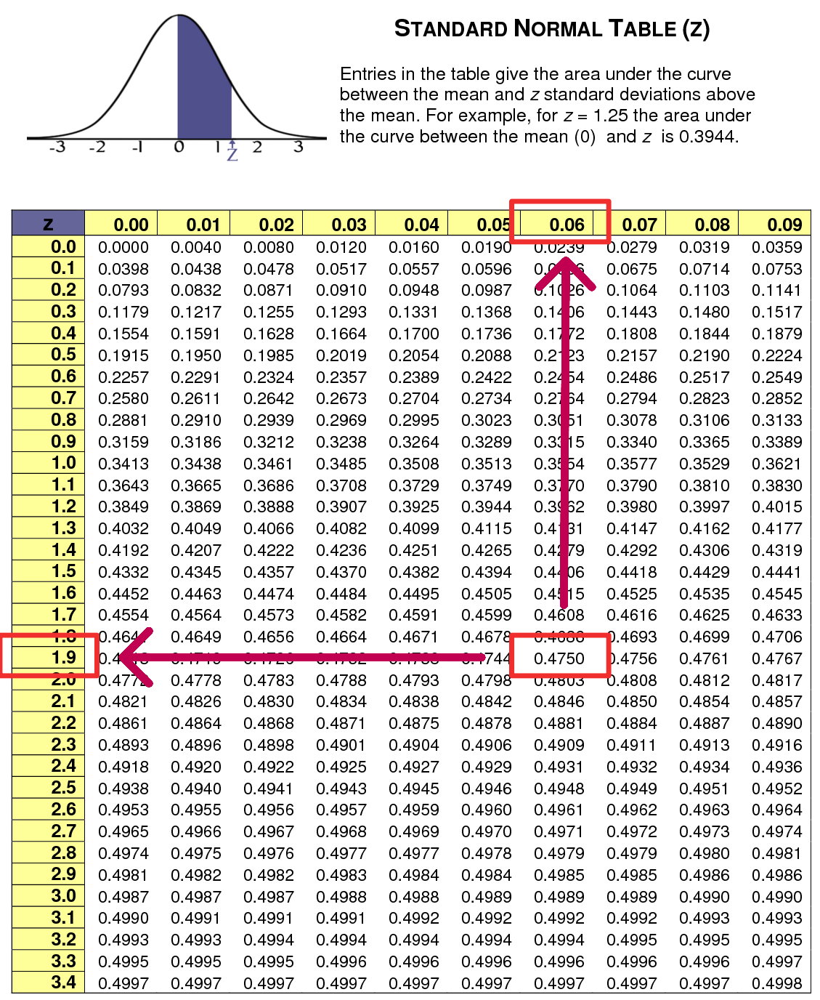
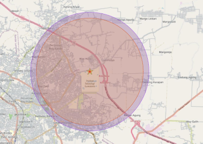

# Estimasi Parameter {#bab-6-estimasi-parameter}

::: rmdcapaian
### Capaian Pembelajaran {.unnumbered}

Setelah mempelajari bab ini, Anda diharapkan:

1. Mampu memaknai interval kepercayaan estimasi sebuah parameter `[STP-5.1]`.

Agar lebih mudah memahami konsep dasar, Anda dapat mempelajari studi kasus terlebih dahulu dan menyimak pembahasan sesuai dengan konsep dasarnya.
:::

## Konsep Dasar

Estimasi parameter adalah teknik dalam statistika inferensial untuk memperkirakan nilai karakteristik populasi berdasarkan data sampel [@healey2021statistics; @tjokropandojo2021pengantar]. Konsep dasar yang dipelajari mencakup perbedaan antara statistik dan parameter, estimasi titik dan estimasi rentang, serta tingkat kepercayaan (*confidence level*). Selanjutnya, dibahas perhitungan estimasi parameter untuk proporsi dan rata-rata, serta interpretasi hasil estimasi. Pemahaman konsep ini penting agar kesimpulan tentang populasi dapat dibuat secara lebih akurat meskipun hanya menggunakan data sampel.

### Statistik vs. Parameter

Dalam statistika, kita sering menjumpai dua istilah penting, yaitu statistik dan parameter. Keduanya sama-sama merupakan ukuran kuantitatif yang digunakan untuk menggambarkan karakteristik data, tetapi sumber datanya berbeda. Statistik diperoleh dari data sampel, sedangkan parameter menggambarkan kondisi populasi secara keseluruhan [@tjokropandojo2021pengantar]. Karena populasi biasanya sulit diukur langsung, maka statistik digunakan untuk mengestimasi parameter.

#### Statistik

Statistik adalah ukuran yang didapatkan dari data sampel, yaitu sebagian kecil dari populasi, yang digunakan untuk mewakili keseluruhan [@tjokropandojo2021pengantar]. Dalam analisis inferensial, statistik berfungsi sebagai ringkasan informasi dari sampel yang dapat membantu peneliti memahami pola data dan membuat perkiraan mengenai populasi.

Jika seorang peneliti ingin mengetahui rata-rata nilai ujian mahasiswa di suatu universitas dengan jumlah mahasiswa 5.000 orang, ia mengambil sampel acak dengan ukuran 100 mahasiswa. Misalkan hasil perhitungan dari sampel tersebut menunjukkan rata-rata nilai ujian sebesar 72 dengan simpangan baku 8. Angka rata-rata 72 dan simpangan baku 8 tersebut merupakan statistik, karena keduanya dihitung dari 100 orang sampel mahasiswa saja, bukan dari seluruh populasi.

#### Parameter

Parameter adalah ukuran yang menggambarkan karakteristik populasi secara keseluruhan [@tjokropandojo2021pengantar]. Populasi di sini mencakup seluruh individu, objek, atau elemen yang menjadi perhatian dalam penelitian. Karena populasi biasanya berjumlah sangat besar dan sulit dijangkau, nilai parameter hampir selalu tidak diketahui secara pasti, kecuali kita melakukan pengumpulan data secara menyeluruh yang disebut sensus.

Meneruskan contoh mahasiswa, peneliti tadi ternyata berkesempatan melakukan sensus kepada seluruh mahasiswa yang berjumlah 5.000 orang dan menanyakan nilai ujian mereka. Apabila ia mendapatkan hasil rata-rata nilai ujian seluruh mahasiswa tersebut adalah 74, maka nilai 74 tersebut adalah parameter. Nilai inilah yang tidak selalu diketahui dan berusaha diperkirakan berdasarkan nilai statistik.

Cara menyatakan ukuran statistik dan parameter, yakni menggunakan simbol-simbol matematis [@healey2021statistics], disajikan dalam tabel berikut.

```{r tab-simbol-statistik-parameter, echo=FALSE}
library(kableExtra)
data <- data.frame(
    "Ukuran" = c("Rata-rata", "Simpangan baku", "Variansi", "Proporsi", "Jumlah nilai", "Ukuran observasi"),
    "Statistik (Sampel)" = c("$\\bar{x}$", "$s$", "$s^2$", "$\\hat{p}$", "$x$", "$n$"),
    "Parameter (Populasi)" = c("$\\mu$", "$\\sigma$", "$\\sigma^2$", "$P$", "$X$", "$N$"),
    check.names = FALSE
)
data |>
    kbl(
        caption = "Simbol-simbol yang Digunakan Untuk Statistik dan Parameter",
        escape = FALSE, align = "l"
    ) |>
    kable_styling(bootstrap_options = c("striped", "hover", "condensed", "responsive"), full_width = F)
```

### Estimasi Titik vs. Estimasi Rentang

Karena kita jarang mengetahui nilai parameter dan lebih sering bisa memperoleh statistik, maka nilai parameter diperkirakan dari nilai statistik. Proses menghasilkan perkiraan ini disebut estimasi. Estimasi berarti memperkirakan nilai parameter (populasi) berdasarkan hasil perhitungan statistik (sampel).

Terdapat dua jenis estimasi yang umum digunakan, yaitu estimasi titik dan estimasi rentang [@tjokropandojo2021pengantar].

#### Estimasi Titik

Estimasi titik (*point estimate*) adalah estimasi nilai suatu parameter hanya dengan satu angka tunggal saja. Angka ini dihasilkan dari statistik sampel yang kita kumpulkan [@kachigan1986statistical].

Ciri utama estimasi titik adalah ia hanya terdiri dari satu nilai tunggal. Karena hanya memiliki satu nilai saja, kemungkinan kesalahannya sangat besar, karena sangat mungkin nilai tersebut berbeda jauh dari parameter yang sebenarnya.

Contoh lainnya, seorang peneliti lainnya ingin mengetahui rata-rata tinggi badan seluruh mahasiswa di sebuah universitas. Ia mengambil sampel berukuran 100 mahasiswa secara acak. Setelah dihitung, diperoleh rata-rata tinggi badan dari sampel adalah 165 cm. Angka 165 cm digunakan sebagai pengira dari parameter rata-rata tinggi badan seluruh mahasiswa universitas ($\mu$).

Peneliti tidak bisa memastikan apakah benar rata-rata populasi seluruh mahasiswa tepat sama dengan 165 cm, atau mungkin sebenarnya 164 cm, 166 cm, atau nilai lain yang mendekati (Gambar \@ref(fig:fig-ilustrasi-estimasi-titik)). Di sinilah keterbatasan estimasi titik terlihat, karena hanya menyajikan satu angka saja dan rentan meleset dari nilai parameter sebenarnya.

Pada bagian selanjutnya kita akan mempelajari estimasi yang lebih "aman" dari estimasi titik, yakni estimasi berupa rentang nilai.

```{r fig-ilustrasi-estimasi-titik, echo=FALSE, message=FALSE, warning=FALSE, fig.cap="Ilustrasi Estimasi Titik", out.width='60%', fig.align="center"}
library(ggplot2)
ggplot() +
    geom_vline(xintercept = 165.0, linetype = "dashed", color = "blue", size = 1) +
    geom_vline(xintercept = 167.5, linetype = "solid", color = "red", size = 1) +
    annotate("text", x = 165.0, y = 1.05, label = expression(bar(x) == 165.0), color = "blue", vjust = -0.5) +
    annotate("text", x = 167.5, y = 1.05, label = expression(mu == 167.5), color = "red", vjust = -0.5) +
    scale_y_continuous(labels = NULL, breaks = NULL) +
    scale_x_continuous(breaks = c(160, 162.5, 165.0, 167.5, 170.0), limits = c(160, 170)) +
    labs(x = "Tinggi Badan (cm)", y = NULL) +
    theme_minimal() +
    theme(axis.line.y = element_blank(), axis.ticks.y = element_blank(), panel.grid.major.y = element_blank(), panel.grid.minor.y = element_blank())
```

#### Estimasi Rentang

Berbeda dari estimasi titik, estimasi rentang (*interval estimate*) menetapkan parameter populasi dalam sebuah rentang nilai. Rentang inilah yang disebut interval kepercayaan (*confidence interval*), yang memuat nilai parameter populasi yang sebenarnya. Dengan demikian, kita bisa menebak parameter yang sebenarnya dengan kemungkinan yang lebih besar [@kachigan1986statistical].

Rentang kepercayaan dibentuk dari dua nilai batas, yaitu batas bawah (*lower limit*) dan batas atas (*upper limit*). Batas bawah dan batas atas ini diperoleh dari pengurangan dan penambahan margin kesalahan (*margin of error*) dari estimasi titik yang kita hitung dari sampel.

Melanjutkan contoh tinggi badan mahasiswa, alih-alih hanya menyatakan estimasi parameter sebesar 165 cm, peneliti tersebut menghitung *margin of error*-nya juga dan mendapatkan nilainya sebesar $\pm 2,5$ cm. Hasilnya, diperoleh interval kepercayaan antara 162,5 cm hingga 167,5 cm. Artinya, peneliti memperkirakan bahwa nilai parameter rata-rata tinggi badan seluruh mahasiswa adalah 162,5 cm atau 162,6 cm atau 162,7 cm dan seterusnya hingga 167,5 cm.

```{r fig-ilustrasi-estimasi-rentang, echo=FALSE, message=FALSE, warning=FALSE, fig.cap="Ilustrasi Estimasi Rentang", out.width='60%', fig.align="center"}
library(ggplot2)
ggplot() +
    annotate("rect", xmin = 165.0 - 2.5, xmax = 165.0 + 2.5, ymin = -Inf, ymax = Inf, alpha = 0.3, fill = "blue") +
    geom_vline(xintercept = 165.0, linetype = "dashed", color = "blue", size = 1) +
    geom_vline(xintercept = 167.5, linetype = "solid", color = "red", size = 1) +
    annotate("text", x = 165.0, y = 1.05, label = expression(bar(x) == 165.0), color = "blue", vjust = -0.5) +
    annotate("text", x = 167.5, y = 1.05, label = expression(mu == 167.5), color = "red", vjust = -0.5) +
    scale_y_continuous(labels = NULL, breaks = NULL) +
    scale_x_continuous(breaks = c(160, 162.5, 165.0, 167.5, 170.0), limits = c(160, 170)) +
    labs(x = "Tinggi Badan (cm)", y = NULL) +
    theme_minimal() +
    theme(axis.line.y = element_blank(), axis.ticks.y = element_blank(), panel.grid.major.y = element_blank(), panel.grid.minor.y = element_blank())
```

Estimasi ini jauh lebih mendekati kebenaran dibandingkan hanya menyebut estimasi titik sebesar 165 cm, karena peneliti menyadari adanya variasi dalam data dan memperhitungkan ketidakpastian dalam proses pengambilan sampel.

### Tingkat Kepercayaan (*Confidence Level*)

Untuk dapat menghasilkan estimasi rentang, konsep tingkat kepercayaan menjadi hal yang sangat penting untuk dipahami. Tingkat kepercayaan (*confidence level*, CL) berbeda dengan rentang kepercayaan (*confidence interval*) jika rentang kepercayaan adalah hasil berupa interval nilai yang memperkirakan posisi parameter populasi, maka tingkat kepercayaan adalah ukuran seberapa yakin kita terhadap interval tersebut [@chase2000general].

Tingkat kepercayaan berarti pernyataan keyakinan kita akan dimuatnya nilai parameter dalam interval yang kita hasilkan. Keyakinan ini dinyatakan dalam bentuk probabilitas yang merupakan angka persentase atau proporsi, misalnya 90% (0,90), 95% (0,95), atau 99% (0,99). Angka tersebut bermakna dari 100 sampel yang mungkin diambil, sebanyak CL% (*confidence level*) sampel akan memuat nilai parameter.

Semakin tinggi tingkat kepercayaan, semakin besar keyakinan kita bahwa interval estimasi mencakup parameter populasi.

Dalam statistik tidak pernah ada jaminan keyakinan 100%. Hal ini karena setiap proses estimasi selalu melibatkan sampel, dan pengambilan sampel tentu memiliki peluang kesalahan. Tingkat kepercayaan pasti selalu lebih kecil dari 100% karena sisanya adalah kemungkinan kita melakukan kesalahan, yakni menghasilkan nilai rentang yang tidak mencakup parameter. Nilai ini disebut dengan tingkat kesalahan (*error probability*) yang disimbolkan dengan $\alpha$ (dibaca "alpha"). Istilah lain untuk tingkat kesalahan *error probability* adalah signifikansi (*significance*) [@chase2000general].

Dengan demikian, secara matematis, tingkat kepercayaan dituliskan sebagai $1-\alpha$. Apabila $\alpha = 0,05$, maka tingkat kepercayaan adalah $1-0,05 = 0,95$ atau 95%. Ini artinya, kita dapat mengatakan bahwa 95% dari 100 kali sampel yang diambil akan menghasilkan interval yang mencakup nilai parameter, sedangkan 5% sisanya tidak.

Adapun nilai $\alpha$ yang umum digunakan dalam penelitian adalah 0,10 (10%), 0,05 (5%), dan 0,01 (1%), tergantung seberapa besar tingkat keyakinan yang dikehendaki peneliti.

Perbedaan tingkat kepercayaan memengaruhi lebar interval estimasi. Gambar \@ref(fig:fig-pengaruh-nilai-tingkat-kepercayaan) menunjukkan hasil estimasi parameter tinggi badan mahasiswa yang nilai statistiknya adalah 165 cm, simpangan baku 3 cm, dan ukuran sampel 200 orang.

```{r fig-pengaruh-nilai-tingkat-kepercayaan, echo=FALSE, message=FALSE, warning=FALSE, fig.cap="Ilustrasi Pengaruh Nilai Tingkat Kepercayaan Terhadap Ukuran Rentang", out.width='60%', fig.align="center"}
library(ggplot2)
mean_val <- 165
sd_val <- 2
n <- 200
se <- sd_val / sqrt(n)
ci_90 <- mean_val + c(-1, 1) * qnorm(0.95) * se
ci_95 <- mean_val + c(-1, 1) * qnorm(0.975) * se
ci_99 <- mean_val + c(-1, 1) * qnorm(0.995) * se

df_cl <- data.frame(
    CL = factor(c("99%", "95%", "90%"), levels = c("99%", "95%", "90%")),
    ymin = c(ci_99[1], ci_95[1], ci_90[1]),
    ymax = c(ci_99[2], ci_95[2], ci_90[2])
)

ggplot(df_cl, aes(y = CL, x = mean_val)) +
    geom_errorbarh(aes(xmin = ymin, xmax = ymax, color = CL), height = 0.2, size = 1.5) +
    geom_point(color = "black", size = 3) +
    geom_vline(xintercept = mean_val, linetype = "dashed", color = "black") +
    scale_color_manual(values = c("99%" = "purple", "95%" = "green", "90%" = "blue")) +
    labs(x = "Tinggi Badan (cm)", y = "Tingkat Kepercayaan") +
    theme_minimal() +
    theme(legend.position = "none") +
    scale_x_continuous(limits = c(min(ci_99) - 0.1, max(ci_99) + 0.1))
```

Garis hitam putus-putus pada posisi 165 menggambarkan estimasi titik, yaitu satu nilai hasil dari sampel [@chase2000general]. Bidang biru, hijau, dan ungu menggambarkan interval kepercayaan dengan tingkat kepercayaan yang berbeda. Pada tingkat kepercayaan 90% (biru), intervalnya sempit, yakni 164,65-165,35 cm. Pada tingkat kepercayaan 95% (hijau), intervalnya sedikit lebih lebar, yaitu 164,58-165,42 cm. Sementara pada tingkat kepercayaan 99% (ungu), interval semakin melebar menjadi 164,45-165,55 cm. Dari sini terlihat bahwa semakin tinggi tingkat kepercayaan, semakin lebar rentang yang dihasilkan.

::: rmdnote
### Catatan: Tingkat Kepercayaan {.unnumbered}

Tingkat kepercayaan jangan dimaknai peluang parameter ada di dalam interval. Jadi, nilai tingkat kepercayaan 90% bukan berarti kita 90% yakin bahwa nilai parameter ada dalam rentang kepercayaan kita. Nilai parameter populasi itu tetap, misalnya rata-rata tinggi badan seluruh mahasiswa memang punya satu angka pasti, hanya saja kita tidak tahu berapa nilainya. Oleh karena itu, kita mengambil sampel yang representatif dan menghitung statistiknya untuk mengestimasi parameter.

Dengan tingkat kepercayaan 90%, artinya kita mengatakan bahwa sampel kita tersebut hanya akan salah sebanyak 10 kali pengambilan saja dari 100 kali pengambilan yang mungkin. Dengan kata lain, 90 sampel tersebut akan benar-benar berisi nilai parameter populasi yang sebenarnya.
:::

### Konsep Perhitungan Rentang Kepercayaan

Rentang kepercayaan dihitung dari estimasi titik ($\bar{x}$ atau $\hat{p}$) yang kita kurangkan dan tambahkan dengan *margin of error* (MoE) [@healey2021statistics]. Jadi, rumus dasar untuk rentang kepercayaan adalah berikut.

$$c.i. = \text{estimasi titik} \pm MoE$$

MoE sendiri sebenarnya adalah perkalian antara nilai kritis dan *standard error*. Dengan demikian, rumus dasar *confidence interval* sebenarnya adalah:

$$MoE = Z_{\alpha/2} \times S.E.$$
$$c.i. = \text{estimasi titik} \pm (Z_{\alpha/2} \times S.E.)$$

Nilai kritis ($Z_{\alpha/2}$) adalah nilai standar dalam distribusi normal yang menjadi pembatas area di bawah kurva yang besarnya sama dengan tingkat kepercayaan kita dikurangi alpha yang dibagi rata ke dua sisi grafik. Ini seperti kebalikan dari proses pencarian nilai Z berdasarkan area peluang yang dibahas pada studi kasus kejadian probabilistik probabilitas standar.

Dalam bagian ini kita akan mempelajari perhitungan rentang kepercayaan untuk parameter rata-rata dan proporsi.

### Perhitungan Rentang Kepercayaan Rata-rata

Kita akan mulai dengan estimasi parameter untuk variabel numerik, yakni rata-rata. Estimasi parameter rata-rata, berarti kita memperkirakan nilai rata-rata populasi berdasarkan nilai rata-rata yang diperoleh dari sampel [@kachigan1986statistical].

Dari sampel ini diperoleh sebuah nilai rata-rata ($\bar{x}$) yang berfungsi sebagai estimasi titik. Estimasi titik ini kita tambah dan kurangkan dengan MoE agar menjadi rentang [@healey2021statistics]. Rumus S.E. untuk rata-rata adalah $\frac{s}{\sqrt{n}}$, maka MoE untuk interval rata-rata adalah:

$$MoE = Z_{\alpha/2} \times \frac{s}{\sqrt{n}}$$

dengan keterangan: $s$ adalah simpangan baku sampel dan $n$ adalah ukuran sampel. Dengan demikian, rumus lengkap untuk perhitungan rentang kepercayaan rata-rata adalah:

$$c.i. = \bar{x} \pm Z_{\alpha/2} \frac{s}{\sqrt{n}}$$

Sebagai contoh, misalkan seorang peneliti ingin memperkirakan rata-rata tinggi badan mahasiswa di sebuah universitas. Dari sampel 100 mahasiswa diperoleh rata-rata ($\bar{x}$) sebesar 165 cm dengan simpangan baku ($s$) 5 cm. Jika digunakan tingkat kepercayaan 95% ($Z=1,96$), maka estimasi rata-rata tinggi badan mahasiswa dapat dihitung dengan rumus di atas.

$$
\begin{aligned}
c.i. &= \bar{x} \pm \left(Z_{\alpha/2} \times \frac{s}{\sqrt{n}}\right) \\
&= 165 \pm \left(1,96 \times \frac{5}{\sqrt{100}}\right) \\
&= 165 \pm 0,98
\end{aligned}
$$

Dari hasil perhitungan, didapatkan interval kepercayaan kita sebesar 164,02 cm hingga 165,98 cm. Ini berarti dengan tingkat kepercayaan 95%, parameter rata-rata tinggi badan seluruh mahasiswa di universitas tersebut diperkirakan berada dalam rentang tersebut.

### Perhitungan Rentang Kepercayaan Proporsi

Perhitungan rentang kepercayaan proporsi hanya berbeda pada rumus *standard error*-nya [@kachigan1986statistical]. *Standard error* untuk distribusi statistik sampel proporsi dihitung dengan rumus berikut.

$$S.E. = \sqrt{\frac{\hat{p}(1-\hat{p})}{n}}$$

dengan keterangan: $\hat{p}$ adalah proporsi sampel dan $n$ ukuran sampel [@healey2021statistics]. Maka, rumus rentang kepercayaan untuk statistik proporsi adalah:

$$c.i. = \hat{p} \pm Z_{\alpha/2} \sqrt{\frac{\hat{p}(1-\hat{p})}{n}}$$

Misalnya, dari survei terhadap 100 mahasiswa diketahui bahwa 60 mahasiswa (proporsi 0,6) menggunakan sepeda motor untuk pergi ke kampus. Jika digunakan tingkat kepercayaan 95% ($Z=1,96$), maka estimasi proporsi mahasiswa yang menggunakan sepeda motor dapat dihitung dengan rumus di atas.

$$
\begin{aligned}
c.i. &= \hat{p} \pm Z_{\alpha/2} \sqrt{\frac{\hat{p}(1-\hat{p})}{n}} \\
&= 0,6 \pm 1,96 \sqrt{\frac{0,6(1-0,6)}{100}} \\
&= 0,6 \pm 1,96 \sqrt{\frac{0,24}{100}} \\
&= 0,6 \pm 1,96 \times 0,049 \\
&= 0,6 \pm 0,096
\end{aligned}
$$

Artinya, parameter berupa proporsi seluruh mahasiswa pengguna sepeda motor berada pada rentang 0,504 hingga 0,696, atau bila dinyatakan dalam persentase, yaitu 50,4% hingga 69,6% pada tingkat kepercayaan 95%.

### Interpretasi Estimasi Parameter

Interpretasi estimasi parameter berfokus pada pemahaman hasil berupa rentang kepercayaan atau *confidence interval* [@healey2021statistics]. Rentang ini menunjukkan nilai-nilai yang mungkin menjadi parameter populasi, berdasarkan data sampel yang diperoleh. Rentang kepercayaan tidak memberikan jawaban pasti mengenai nilai parameter, melainkan memberikan batas bawah dan batas atas yang menjadi perkiraan dengan tingkat keyakinan tertentu.

Lebar rentang estimasi dapat menjadi indikator kualitas estimasi. Rentang yang sempit menandakan estimasi yang lebih presisi, yang biasanya terjadi karena ukuran sampel cukup besar atau error yang relatif kecil. Sebaliknya, rentang yang lebar menunjukkan tingkat ketidakpastian yang lebih besar, sering kali disebabkan oleh ukuran sampel yang terlalu kecil atau variasi data yang tinggi. Sehingga, pemilihan jumlah sampel dan pengendalian error sangat memengaruhi kualitas estimasi.

Konsep tingkat kepercayaan membantu menjelaskan ketidakpastian dalam estimasi. Misalnya, pada tingkat kepercayaan 95% berarti ada kemungkinan 95 dari 100 sampel yang diambil akan menghasilkan interval yang mencakup parameter populasi sebenarnya. Sebaliknya, 5 dari 100 sampel (atau 5%) akan menghasilkan interval yang tidak mencakup parameter tersebut. Jika hasil sampel berbeda dari dugaan populasi, maka perbedaan itu dapat dijelaskan sebagai bagian dari kemungkinan error yang sudah diperhitungkan dalam tingkat kepercayaan.

Pada akhirnya, hasil estimasi parameter bukanlah angka yang mutlak, melainkan perkiraan yang disertai dengan tingkat kepastian tertentu. Interval kepercayaan memberikan ruang toleransi bagi ketidakpastian yang muncul dari proses pengambilan sampel, sekaligus menjadi alat bantu dalam pengambilan keputusan berbasis data.

::: rmdkasus
### Studi Kasus: Pola Hunian Mahasiswa ITERA {.unnumbered}

Fenomena alih fungsi lahan menjadi kos atau rumah sewa di sekitar ITERA yang semakin marak dan menimbulkan perhatian serius dalam perencanaan wilayah dan kota. Jika tidak terkendali, alih fungsi ini dapat mengurangi lahan pertanian, menekan ruang terbuka hijau, serta menimbulkan masalah tata ruang seperti kepadatan permukiman, keterbatasan infrastruktur dasar, dan bencana banjir di kawasan sekitar kampus.

Dalam sebuah survei terhadap 428 mahasiswa ITERA, dikumpulkan data yang berkaitan dengan kasus di atas, mengenai dua variabel utama yaitu jenis tempat tinggal dan jarak tempat tinggal ke kampus. Dataset tersebut dapat Anda simak di sini.

Variabel pertama, jenis tempat tinggal, yang dianalisis menggunakan estimasi parameter proporsi untuk mengetahui seberapa besar kecenderungan mahasiswa tinggal di masing-masing jenis hunian.

Sementara itu, variabel kedua, jarak tempat tinggal ke kampus, diukur dalam satuan kilometer dan dianalisis menggunakan estimasi parameter rata-rata untuk memperkirakan jarak rata-rata mahasiswa dari tempat tinggal menuju kampus.

Setelahnya kedua hasil estimasi ini diharapkan dapat memberikan gambaran yang lebih komprehensif mengenai pola hunian mahasiswa ITERA, baik dari sisi pilihan jenis tempat tinggal maupun kedekatannya dengan kampus, yang selanjutnya dapat menjadi dasar dalam perencanaan perumahan sewa atau kos bagi mahasiswa ITERA kedepannya.

#### Estimasi Parameter Proporsi

Dikumpulkan data mengenai jenis tempat tinggal mereka, termasuk kos sendiri, rumah mengontrak bersama-sama, kos bersama-sama, rumah keluarga, asrama, maupun rumah bersama saudara. Dari data tersebut, perlu dilakukan perhitungan untuk mengetahui estimasi proporsi mahasiswa yang tinggal di hunian sewa atau kos. Estimasi proporsi ini dihitung dengan tingkat kepercayaan 95%.

##### Menentukan Proporsi Sampel

Langkah awal dalam estimasi parameter proporsi adalah menghitung proporsi sampel berdasarkan data hasil survei. Proporsi sampel ($\hat{p}$) dihitung dengan:

$$\hat{p} = \frac{x}{n}$$

dengan:
- $x$ = jumlah responden yang memiliki karakteristik tertentu,
- $n$ = jumlah seluruh responden.

Pada kasus ini, karakteristik yang dimaksud adalah mahasiswa yang tinggal di hunian sewa atau kos. Kategori ini mencakup kos sendiri, rumah mengontrak bersama-sama, dan kos bersama-sama. Dari hasil survei terhadap 428 mahasiswa, diperoleh mahasiswa yang tinggal di kos sendiri, rumah mengontrak bersama-sama, kos bersama-sama, dan rumah mengontrak pribadi dengan totalnya adalah 333 mahasiswa (batang merah pada Gambar \@ref(fig:fig-sebaran-jenis-tempat-tinggal)).

```{r fig-sebaran-jenis-tempat-tinggal, echo=FALSE, message=FALSE, warning=FALSE, fig.cap="Grafik Statistik Sebaran Jenis Tempat Tinggal Mahasiswa", out.width='60%', fig.align="center"}
library(ggplot2)
library(dplyr)
data <- read.csv("datasets/DataUtama_mhsITERA.csv", sep = ";")

data_sewa <- data |>
    filter(jenis.tempat.tinggal %in% c("Kos sendiri", "Rumah mengontrak bersama-sama", "Kos bersama-sama", "Rumah mengontrak sendiri")) |>
    mutate(jenis.tempat.tinggal = case_when(
        jenis.tempat.tinggal == "Kos sendiri" ~ "Kos Sendiri",
        jenis.tempat.tinggal == "Rumah mengontrak bersama-sama" ~ "Rumah Mengontrak Bersama",
        jenis.tempat.tinggal == "Kos bersama-sama" ~ "Kos Bersama-sama",
        jenis.tempat.tinggal == "Rumah mengontrak sendiri" ~ "Rumah Mengontrak Pribadi",
        TRUE ~ jenis.tempat.tinggal
    ))

ggplot(data_sewa, aes(x = jenis.tempat.tinggal, fill = jenis.tempat.tinggal)) +
    geom_bar() +
    labs(x = "Jenis Tempat Tinggal", y = "Frekuensi", fill = "Kategori") +
    theme_minimal() +
    scale_fill_brewer(palette = "Set2") +
    theme(axis.text.x = element_text(angle = 15, hjust = 1))
```

Proporsi sampel dapat dihitung sebagai berikut:

$$\hat{p} = \frac{333}{428} = 0,778$$

Proporsi sampel mahasiswa yang tinggal di hunian sewa atau kos adalah 0,778 atau 77,8%. Nilai inilah yang kemudian digunakan sebagai dasar dalam perhitungan estimasi parameter proporsi pada tahap selanjutnya.

##### Menentukan Nilai Kritis Z

Setelah proporsi sampel ditentukan, langkah berikutnya adalah menentukan nilai kritis Z sesuai dengan tingkat kepercayaan yang digunakan. Nilai kritis $Z_{\alpha/2}$ diperoleh dari distribusi normal baku.

```{r fig-membagi-dua-nilai-alpha, echo=FALSE, fig.cap="Membagi Dua Nilai Alpha", out.width='60%', fig.align="center"}
knitr::include_graphics("images/bab-6-membagi-2-alpha.png")
```

Nilai tingkat kepercayaan yang kita gunakan adalah luas area di bawah kurva yang berwarna biru terang, yaitu 0,950. Artinya, kita menggunakan nilai $\alpha$ sebesar 0,05 atau 5%. Nilai $\alpha$ ini dibagi 2 ($\alpha/2$) dan ditempatkan di kiri dan kanan kurva normal. Dengan demikian, luas area biru terang menjadi bernilai $0,95 / 2 = 0,475$ dari titik 0 di tengah.

Nilai Z diperoleh dari area seluas 0,475 di bawah kurva normal mulai dari titik tengah (0). Dengan mencocokkan pada tabel distribusi normal, didapatkan nilai $Z=1,96$, yang berasal dari kombinasi angka 1,9 pada sisi vertikal dan 0,06 pada sisi horizontal tabel.

```{r fig-mencari-nilai-z, echo=FALSE, fig.cap="Mencari Nilai Z", out.width='60%', fig.align="center"}

```

##### Menghitung Rentang Kepercayaan dan Menarik Kesimpulan

Setelah seluruh komponen perhitungan ditentukan, langkah terakhir adalah menghitung rentang kepercayaan proporsi. Dari data yang ada diperoleh proporsi sampel sebesar 0,778 dan nilai kritis $Z=1,96$ pada tingkat kepercayaan 95%. Hasil tersebut kemudian disubstitusikan ke dalam rumus rentang kepercayaan proporsi sebagai berikut.

$$
\begin{aligned}
c.i. &= \hat{p} \pm Z_{\alpha/2} \sqrt{\frac{\hat{p}(1-\hat{p})}{n}} \\
&= 0,778 \pm 1,96 \times \sqrt{\frac{0,778(1 - 0,778)}{428}} \\
&= 0,778 \pm 0,0394
\end{aligned}
$$

Diperoleh rentang kepercayaan proporsi antara 73,86% hingga 81,74%. Artinya, dapat diperkirakan bahwa proporsi sebenarnya mahasiswa yang tinggal di hunian sewa atau kos di sekitar ITERA berada pada rentang tersebut.

Hasil ini menunjukkan bahwa mayoritas mahasiswa lebih memilih hunian sewa dibandingkan tinggal di rumah keluarga atau asrama, sehingga fenomena maraknya alih fungsi lahan menjadi kos atau rumah kontrakan di kawasan sekitar kampus memiliki dasar empiris yang kuat.

#### Estimasi Parameter Interval Rata-Rata

Dikumpulkan data mengenai jarak tempat tinggal mahasiswa menuju kampus, untuk 333 responden yang berjenis tempat tinggal kos atau rumah sewa, yang menunjukkan variasi jarak hunian. Dari data tersebut, perlu dilakukan perhitungan untuk mengetahui estimasi rata-rata jarak tempuh mahasiswa ke kampus. Estimasi rata-rata ini dihitung dengan tingkat kepercayaan 95%.

##### Menentukan Nilai Kritis Z

Dalam perhitungan estimasi parameter rata-rata, penentuan nilai kritis Z juga diperlukan sebagai batas pengali dari *standar error*. Prosedur penentuannya sama seperti yang telah dijelaskan pada subbab estimasi proporsi.

Menentukan nilai kritis Z, yaitu mengacu pada distribusi normal baku. Dengan tingkat kepercayaan sebesar 95%, maka tingkat kesalahan ($\alpha$) adalah 0,05 yang dibagi dua untuk pendekatan dua sisi, sehingga masing-masing sisi memiliki probabilitas 0,025. Berdasarkan tabel distribusi normal, probabilitas tersebut sesuai dengan nilai kritis $Z=1,96$.

##### Menghitung Rentang Kepercayaan dan Menarik Kesimpulan

Setelah seluruh komponen perhitungan ditentukan, langkah terakhir adalah menghitung rentang kepercayaan rata-rata. Dari data 333 responden, diperoleh rata-rata sampel sebesar 4,59 km dengan simpangan baku yaitu 2,23 km dan nilai kritis $Z = 1,96$ pada tingkat kepercayaan 95%. Hasil tersebut kemudian disubstitusikan ke dalam rumus rentang kepercayaan rata-rata sebagai berikut.

$$
\begin{aligned}
c.i. &= \bar{x} \pm Z_{\alpha/2} \frac{s}{\sqrt{n}} \\
&= 4,59 \pm 1,96 \times \frac{2,23}{\sqrt{333}} \\
&= 4,59 \pm 0,2395
\end{aligned}
$$

Diperoleh rentang kepercayaan rata-rata antara 4,35 km hingga 4,82 km. Artinya, dapat diperkirakan bahwa rata-rata sebenarnya jarak tempat tinggal mahasiswa ke kampus dengan jenis hunian sewa atau kos di sekitar ITERA berada pada rentang tersebut.

Hasil ini menunjukkan bahwa kawasan dalam *buffer* sejauh rentang perkiraan tersebut dari kampus ITERA merupakan lokasi utama yang dipilih mahasiswa untuk hunian sewa atau kos. Kondisi ini sejalan dengan fenomena maraknya alih fungsi lahan di sekitar kampus menjadi kos atau rumah kontrakan, karena kebutuhan hunian mahasiswa terkonsentrasi di radius tersebut.

#### Interpretasi Hasil Interval Estimasi Parameter

Hasil estimasi parameter tidak hanya memberikan informasi mengenai nilai proporsi atau rata-rata dari sampel, tetapi juga menyajikan gambaran interval estimasi yang dapat digunakan untuk memahami fenomena yang lebih luas.

Hasil estimasi parameter memberikan dua informasi penting, yaitu mengenai proporsi mahasiswa berdasarkan jenis tempat tinggal dan rata-rata jarak tempat tinggal mereka dari kampus. Kedua hasil ini saling melengkapi dalam memahami pola hunian mahasiswa ITERA.

Pertama, hasil estimasi proporsi menunjukkan bahwa mayoritas mahasiswa lebih memilih tinggal di hunian sewa, baik berupa kos maupun rumah kontrakan, dibandingkan dengan tinggal di rumah keluarga atau asrama. Temuan ini memberikan dasar empiris yang kuat atas fenomena maraknya alih fungsi lahan di sekitar kampus menjadi kos atau rumah kontrakan. Tingginya preferensi mahasiswa terhadap hunian sewa mendorong peningkatan permintaan, yang kemudian direspons oleh masyarakat sekitar melalui konversi lahan menjadi bentuk hunian yang sesuai kebutuhan mahasiswa.

Kedua, hasil estimasi rata-rata jarak tempat tinggal mahasiswa ke kampus berada dalam rentang 4,35 km hingga 4,82 km (Gambar \@ref(fig:fig-rentang-kepercayaan-rata-rata)). Konsentrasi hunian mahasiswa pada radius tersebut menunjukkan pola spasial yang erat kaitannya dengan ketersediaan fasilitas transportasi, aksesibilitas, serta keterjangkauan harga sewa. Fenomena alih fungsi lahan menjadi kos atau rumah kontrakan juga banyak ditemukan pada radius tersebut, karena dianggap paling strategis oleh mahasiswa.

```{r fig-rentang-kepercayaan-rata-rata, echo=FALSE, fig.cap="Hasil Olahan Rentang Kepercayaan Rata-rata Jarak Tempat Tinggal Mahasiswa", out.width='60%', fig.align="center"}

```

Interpretasi dari kedua hasil ini penting karena memberikan gambaran menyeluruh mengenai pola hunian mahasiswa ITERA, baik dari sisi pilihan jenis tempat tinggal maupun kedekatannya dengan kampus. Interval estimasi parameter yang dihasilkan tidak hanya bermanfaat untuk analisis statistik, tetapi juga dapat menjadi dasar dalam perencanaan kawasan perumahan sewa mahasiswa yang lebih terarah.

Seperti disebutkan di awal fenomena maraknya alih fungsi lahan di sekitar kampus juga menimbulkan berbagai dampak serius, seperti berkurangnya lahan pertanian produktif, menurunnya kualitas lingkungan, serta potensi konflik pemanfaatan ruang. Diperlukan solusi yang lebih berkelanjutan. Beberapa alternatif yang dapat dipertimbangkan antara lain:

- Perencanaan kawasan hunian mahasiswa terintegrasi, misalnya melalui penyediaan rumah susun sewa (rusunawa) yang dikelola kampus atau pemerintah daerah yang lebih banyak lagi.
- Pengaturan zonasi lahan di sekitar kampus, agar alih fungsi lahan tidak merusak tata ruang dan tetap mempertahankan fungsi ekologis wilayah salah satunya ruang terbuka hijau yang juga sebagai kawasan resapan air dalam mencegah terjadinya bencana banjir.
- Kemitraan dengan masyarakat lokal, sehingga kebutuhan hunian mahasiswa dapat terpenuhi tanpa harus mengorbankan seluruh lahan produktif, misalnya melalui model sewa jangka panjang atau pembangunan kos ramah lingkungan berupa pembangunan hunian vertikal.
- Pengembangan transportasi aksesibel, yang memungkinkan mahasiswa tinggal lebih jauh dari kampus namun tetap memiliki mobilitas tinggi, sehingga tekanan alih fungsi lahan di sekitar kampus dapat dikurangi.

Secara keseluruhan, pemahaman terhadap hasil estimasi ini diharapkan mampu memberikan gambaran yang lebih komprehensif mengenai kebutuhan hunian mahasiswa ITERA. Informasi ini dapat menjadi landasan dalam penyusunan strategi penyediaan perumahan sewa atau kos yang sesuai, sekaligus mengarahkan pengelolaan ruang di sekitar kampus agar lebih terkendali, adaptif, dan berkelanjutan.
:::

## Soal Latihan

::: rmdexercise
1. Dari suatu sampel dosen ITERA berjumlah 73 orang diperoleh rata-rata usianya adalah 30 tahun dan simpangan bakunya 2,9 tahun. Anda diminta menggunakan probabilitas galat, $\alpha = 5\%$ `[STP-5.1]`
   a. Berapakah tingkat kepercayaan (*confidence level*) yang digunakan?
   b. Berapakah nilai standar (Z *score*) yang kita pakai?
   c. Hitunglah rentang kepercayaan (*confidence interval*) rata-rata usia seluruh dosen ITERA menggunakan data sampel kita tadi.
2. Diketahui bahwa proporsi pengguna mobil pribadi dari suatu sampel mahasiswa berjumlah 429 orang adalah 0,04. `[STP-5.1]`
   a. Apabila kita menggunakan *confidence level* 93%, berapakah tingkat signifikansi kita?
   b. Berapakah Z *score* yang kita pakai?
   c. Hitunglah *confidence interval* proporsi pengguna mobil pribadi pada populasi mahasiswa tersebut.
:::
