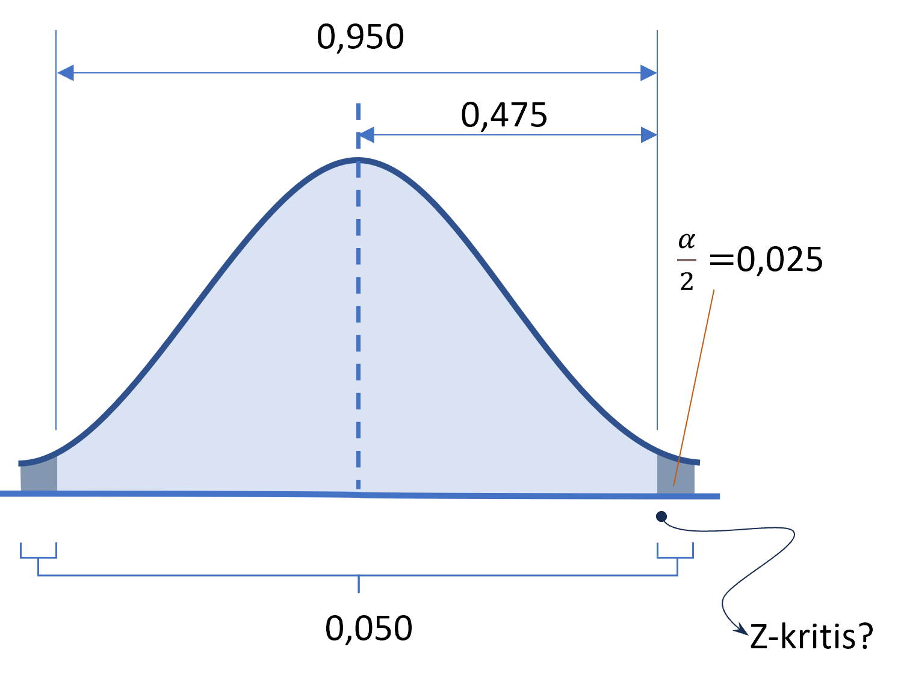
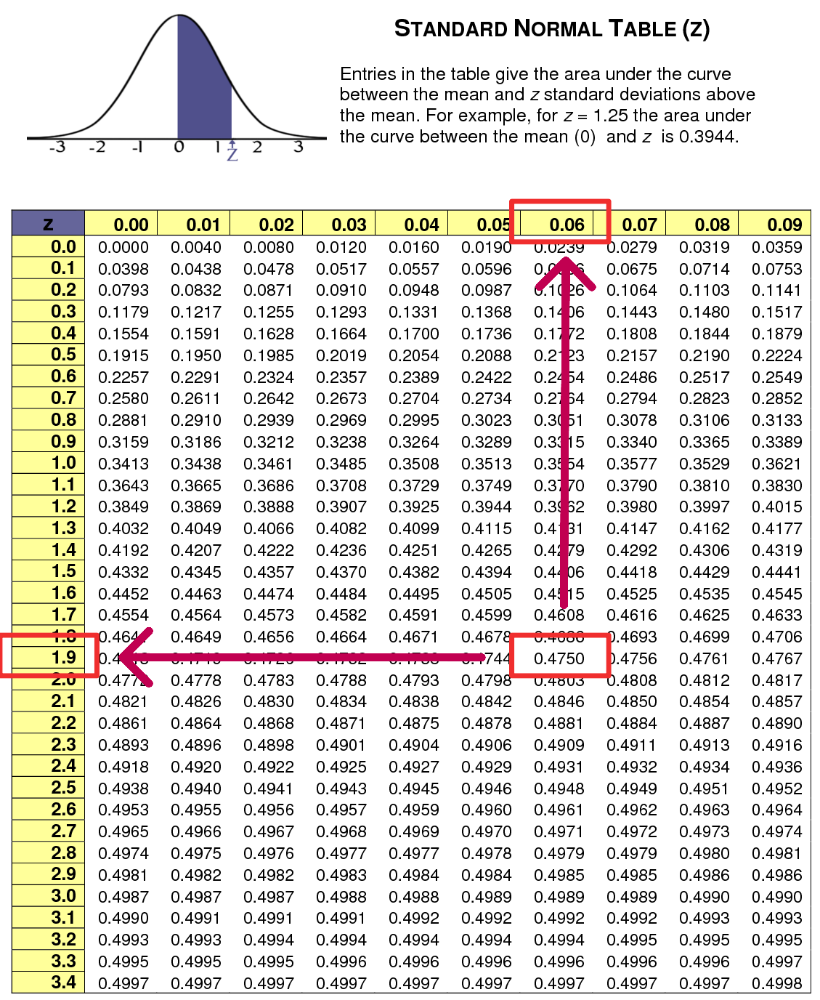

# Estimasi Parameter {#bab-6-estimasi-parameter}

::: rmdcapaian
### Capaian Pembelajaran {.unnumbered}

Setelah mempelajari bab ini, Anda diharapkan mampu memaknai interval kepercayaan estimasi sebuah parameter [STP-5.1]{.capaian}.
:::

Estimasi parameter adalah teknik dalam statistika inferensial untuk **memperkirakan nilai karakteristik populasi** (parameter) **berdasarkan data sampel** (statistik) [@healey2021statistics; @tjokropandojo2021pengantar]. Konsep dasar yang akan kita pelajari di antaranya:

1. perbedaan antara statistik dan parameter,
2. estimasi titik dan estimasi rentang, serta
3. tingkat kepercayaan (*confidence level*).

Selanjutnya, konsep-konsep dasar ini menjadi dasar untuk mempelajari **perhitungan estimasi parameter** untuk **proporsi** dan **rata-rata**, serta interpretasi hasil estimasi.

## Statistik vs. Parameter

Dalam statistika, kita akan sering menjumpai dua istilah penting, yaitu **statistik** dan **parameter**. Keduanya sama-sama merupakan ukuran kuantitatif yang digunakan untuk menggambarkan karakteristik data. Akan tetapi, perbedaannya terletak pada **sumber datanya**. Statistik diperoleh dari data **sampel**, sedangkan parameter adalah ukuran yang menggambarkan kondisi **populasi** secara keseluruhan [@tjokropandojo2021pengantar].

Karena parameter adalah ukuran untuk populasi, mengukurnya hanya bisa dilakukan dengan melibatkan seluruh populasi, yang disebut juga **sensus**. Karena sulit dilakukan, maka **statistik digunakan untuk mengestimasi parameter**.

Cara menyatakan ukuran statistik dan parameter, yakni menggunakan simbol-simbol matematis [@healey2021statistics], disajikan dalam tabel berikut.

```{r tab-simbol-statistik-parameter, echo=FALSE}
library(kableExtra)
data <- data.frame(
    "Ukuran" = c(
        "Rata-rata", "Simpangan baku", "Variansi", "Proporsi", "Jumlah nilai", "Ukuran observasi"
    ),
    "Statistik (Sampel)" = c(
        "$\\bar{x}$", "$s$", "$s^2$", "$\\hat{p}$", "$x$", "$n$"
    ),
    "Parameter (Populasi)" = c(
        "$\\mu$", "$\\sigma$", "$\\sigma^2$", "$P$", "$X$", "$N$"
    ),
    check.names = FALSE
)
data |>
    kbl(
        caption = "Simbol-simbol yang Digunakan Untuk Statistik dan Parameter",
        escape = FALSE, align = "l"
    ) |>
    kable_styling(
        bootstrap_options = c("striped", "hover", "condensed", "responsive"), full_width = F
    )
```

::: rmdkasus
### Studi Kasus: Statistik vs Parameter {.unnumbered}

Mengingat kembali studi kasus pada bab sebelumnya, diketahui populasi seluruh mahasiswa aktif ITERA pada pertengahan tahun 2023 berjumlah 18.877 orang. Namun, karena keterbatasan biaya dan waktu, survei hanya dilakukan terhadap sebagian mahasiswa, yaitu sebanyak 428 orang sebagai sampel.

Misalkan kita ingin mengetahui rata-rata usia para mahasiswa tersebut. Dengan menghitung usia 428 responden tersebut, kita akan memperoleh rata-rata usianya sebesar 20,90 tahun. Angka ini merupakan sebuah **statistik** karena dihitung berdasarkan data sampel. Kita akan menggunakan simbol $\bar{x}$ untuk menerangkan rata-rata sampel ini, sehingga $\bar{x} = 20,90$ tahun.

Lalu, apa **parameter** dalam kasus ini? Parameternya adalah **nilai rata-rata usia yang sebenarnya dari keseluruhan 18.877 mahasiswa aktif ITERA** tersebut. Angka sesungguhnya ini kita simbolkan dengan $\mu$. Karena parameter hanya bisa diketahui dari sensus terhadap seluruh populasi, nilai $\mu$ ini tidak akan pernah kita ketahui persis jika sensus tidak pernah dilakukan.

Di sinilah statistik digunakan: kita memakai nilai statistik sampel ($\bar{x} = 20,90$) sebagai alat ukur untuk memperkirakan atau mengestimasi besaran parameter populasi ($\mu$).
:::

## Estimasi Titik vs. Estimasi Rentang

Karena kita jarang mengetahui nilai parameter dan lebih sering bisa memperoleh statistik, maka nilai parameter kita perkirakan dari nilai statistik. Proses menghasilkan perkiraan ini disebut **estimasi**. Estimasi berarti **memperkirakan nilai parameter** (populasi) berdasarkan **hasil perhitungan statistik** (sampel). Terdapat dua jenis estimasi yang umum digunakan, yaitu **estimasi titik** dan **estimasi rentang** [@tjokropandojo2021pengantar].

### Estimasi Titik

Estimasi titik (*point estimate*) adalah estimasi nilai suatu parameter hanya dengan **satu angka tunggal saja**. Angka ini dihasilkan dari statistik sampel yang kita kumpulkan [@kachigan1986statistical].

Ciri utama estimasi titik adalah ia hanya terdiri dari satu nilai tunggal. Karena hanya memiliki satu nilai saja, kemungkinan kesalahannya sangat besar, karena sangat mungkin nilai tersebut berbeda jauh dari parameter yang sebenarnya.

::: rmdkasus
### Studi Kasus: Keterbatasan Estimasi Titik {.unnumbered}

Melanjutkan contoh sebelumnya, estimasi titik dari rata-rata usia mahasiswa ITERA adalah sebesar 20,90 tahun. Angka 20,90 tahun ini kita peroleh dari 428 responden, lalu kita gunakan sebagai penduga untuk parameter rata-rata usia seluruh mahasiswa ITERA ($\mu$).

Namun, kita tidak bisa memastikan apakah benar rata-rata populasi seluruh mahasiswa *tepat sama* dengan 20,90 tahun. Mungkin saja rata-rata populasi sebenarnya (parameter) adalah mendekati 20,50 tahun, 21,40 tahun, atau nilai lainnya. Hal inilah yang digambarkan pada Gambar \@ref(fig:fig-ilustrasi-estimasi-titik-usia) berikut.

```{r fig-ilustrasi-estimasi-titik-usia, echo=FALSE, message=FALSE, warning=FALSE, fig.cap="Ilustrasi Estimasi Titik Usia Mahasiswa", fig.align="center"}
library(ggplot2)
ggplot() +
    geom_vline(
        xintercept = 20.9,
        linetype = "dashed",
        color = "blue",
        size = 1
    ) +
    geom_vline(
        xintercept = 21.4,
        linetype = "solid",
        color = "red",
        size = 1
    ) +
    annotate(
        "text",
        x = 20.9,
        y = 1.05,
        label = expression(bar(x) == 20.9),
        color = "blue",
        vjust = -0.5
    ) +
    annotate(
        "text",
        x = 21.4,
        y = 1.05,
        label = expression(mu == 21.4),
        color = "red",
        vjust = -0.5
    ) +
    scale_y_continuous(labels = NULL, breaks = NULL) +
    scale_x_continuous(breaks = c(20.0, 20.5, 20.9, 21.4, 22.0), limits = c(20.0, 22.0)) +
    labs(x = "Usia Mahasiswa (Tahun)", y = NULL) +
    theme_minimal() +
    theme(axis.line.y = element_blank(), axis.ticks.y = element_blank(), panel.grid.major.y = element_blank(), panel.grid.minor.y = element_blank())
```

Di sinilah keterbatasan estimasi titik terlihat; ia hanya menyajikan satu angka saja, sehingga sangat rentan meleset dari nilai parameter yang sebenarnya. Oleh karena itu, kita membutuhkan estimasi yang lebih "aman", yakni estimasi berupa rentang nilai yang akan kita pelajari pada bagian selanjutnya.
:::

### Estimasi Rentang

Berbeda dari estimasi titik, estimasi rentang (*interval estimate*) menetapkan parameter populasi dalam sebuah rentang nilai. Rentang inilah yang disebut interval kepercayaan (*confidence interval*), yang memuat nilai parameter populasi yang sebenarnya. Dengan demikian, kita bisa menebak parameter yang sebenarnya dengan kemungkinan yang lebih besar [@kachigan1986statistical].

Rentang kepercayaan dibentuk dari dua nilai batas, yaitu batas bawah (*lower limit*) dan batas atas (*upper limit*). Batas bawah dan batas atas ini diperoleh dari pengurangan dan penambahan margin kesalahan (*margin of error*) dari estimasi titik yang kita hitung dari sampel.

::: rmdkasus
### Studi Kasus: Keuntungan Estimasi Rentang {.unnumbered}

Telah disebutkan bahwa rentang kepercayaan diperoleh dari pengurangan dan penambahan margin kesalahan (*margin of error*) atas estimasi titik yang kita hitung dari sampel.

Melanjutkan contoh usia mahasiswa, alih-alih hanya menyatakan estimasi parameter sebesar 20,90 tahun, misalkan kita memperhitungkan pula *margin of error*-nya sebesar $\pm 0,60$ tahun. Hasil pengurangannya memperoleh batas bawah interval pada 20,30 tahun, dan penambahannya menghasilkan batas atas interval usia pada 21,50 tahun. 

Artinya, kita memperkirakan bahwa nilai parameter rata-rata usia seluruh mahasiswa ITERA berada pada rentang antara 20,30 tahun hingga 21,50 tahun. Karena tebakan parameter sesungguhnya ($\mu = 21,4$) berada di dalam wilayah ini, maka tebakan kita jauh lebih akurat.

```{r fig-ilustrasi-estimasi-rentang-usia, echo=FALSE, message=FALSE, warning=FALSE, fig.cap="Ilustrasi Estimasi Rentang Usia Mahasiswa", fig.align="center"}
library(ggplot2)
ggplot() +
    annotate("rect", xmin = 20.9 - 0.6, xmax = 20.9 + 0.6, ymin = -Inf, ymax = Inf, alpha = 0.3, fill = "blue") +
    geom_vline(xintercept = 20.9, linetype = "dashed", color = "blue", size = 1) +
    geom_vline(xintercept = 21.4, linetype = "solid", color = "red", size = 1) +
    annotate("text", x = 20.9, y = 1.05, label = expression(bar(x) == 20.9), color = "blue", vjust = -0.5) +
    annotate("text", x = 21.4, y = 1.05, label = expression(mu == 21.4), color = "red", vjust = -0.5) +
    scale_y_continuous(labels = NULL, breaks = NULL) +
    scale_x_continuous(breaks = c(20.0, 20.3, 20.9, 21.5, 22.0), limits = c(20.0, 22.0)) +
    labs(x = "Usia Mahasiswa (Tahun)", y = NULL) +
    theme_minimal() +
    theme(axis.line.y = element_blank(), axis.ticks.y = element_blank(), panel.grid.major.y = element_blank(), panel.grid.minor.y = element_blank())
```

Estimasi ini jauh lebih mendekati kebenaran dibandingkan hanya menyebut estimasi titik sebesar 20,90 tahun tadi. Memperhitungkan ketidakpastian dalam proses pengambilan sampel dengan batas-batas ini membuat kita menemukan rentang parameter seperti yang diilustrasikan oleh area arsir berwarna biru pada Gambar \@ref(fig:fig-ilustrasi-estimasi-rentang-usia) tersebut.
:::

## Konsep Perhitungan Rentang Kepercayaan Sebagai Estimasi Rentang

**Rentang kepercayaan** atau **interval kepercayaan** *(confidence interval)* adalah bentuk estimasi rentang dalam statistika inferensial yang merupakan **estimasi titik** ($\bar{x}$ atau $\hat{p}$) **yang kita kurangkan dan tambahkan dengan** ***margin of error*** (MoE) [@healey2021statistics]. Jadi, rumus dasar untuk rentang kepercayaan adalah berikut.

$$
\begin{equation}
c.i. = \text{estimasi titik} \pm MoE
(\#eq:confidence-interval)
\end{equation}
$$

Sedangkan $MoE$ sendiri sebenarnya adalah perkalian antara **nilai kritis** dan *standard error*. Dengan demikian, rumus dasar *confidence interval* sebenarnya adalah:

$$
MoE = Z_{\alpha/2} \times \text{S.E.}
(\#eq:margin-of-error)
$$

Maka, dengan mensubstitusi $MoE$ dengan persamaan \@ref(eq:margin-of-error), persamaan \@ref(eq:confidence-interval) menjadi:

$$
c.i. = \text{estimasi titik} \pm (Z_{\alpha/2} \times \text{S.E.})
(\#eq:confidence-int-verbose)
$$

Nilai kritis ($Z_{\alpha/2}$) ini adalah nilai yang berkaitan dengan **tingkat kepercayaan** dan **signifikansi** ($\alpha$). Singkatnya, tingkat kepercayaan + signifikansi harus menghasilkan angka 100%. Konsepnya akan kita dalami di subbab \@ref(tingkat-kepercayaan).

Nilai kritis dicari dengan membagi 2 terlebih dahulu nilai $\alpha$ di kiri dan kanan kurva distribusi statistik, kemudian menemukan nilai yang menjadi pembatasnya dengan tabel nilai Z seperti yang sudah kita lakukan pada \@ref(untuk-z-kritis). Gambar \@ref(fig:fig-ilustrasi-z-alpha) berikut mengilustrasikan pencarian nilai kritis pada signifikansi sebesar 10%.

```{r fig-ilustrasi-z-alpha, echo=FALSE, message=FALSE, warning=FALSE, fig.cap="Ilustrasi Nilai Kritis Z pada Distribusi Normal, contoh $\alpha = 10%$", out.width='60%', fig.align="center"}
library(ggplot2)

x <- seq(-3.5, 3.5, length.out = 1000)
y <- dnorm(x)
df <- data.frame(x, y)

alpha <- 0.10
z_alphahalve <- qnorm(1 - alpha/2)

df_left <- df[df$x <= -z_alphahalve, ]
df_right <- df[df$x >= z_alphahalve, ]

ggplot(df, aes(x, y)) +
    geom_line(linewidth = 1) +
    geom_area(data = df_left, aes(x, y), fill = "red", alpha = 0.5) +
    geom_area(data = df_right, aes(x, y), fill = "red", alpha = 0.5) +
    geom_vline(xintercept = -z_alphahalve, linetype = "dashed") +
    geom_vline(xintercept = z_alphahalve, linetype = "dashed") +
    scale_y_continuous(labels = NULL, breaks = NULL) +
    scale_x_continuous(
        breaks = c(-z_alphahalve, 0, z_alphahalve),
        labels = c(expression(-Z[alpha/2]), "0", expression(+Z[alpha/2]))
    ) +
    annotate("text", x = -2.2, y = 0.05, label = "5%", color = "black", size = 5) +
    annotate("text", x = 2.2, y = 0.05, label = "5%", color = "black", size = 5) +
    annotate("text", x = 0, y = 0.15, label = "90%", color = "black", size = 6) +
    labs(x = "Nilai Z", y = NULL) +
    theme_minimal() +
    theme(
        axis.line.y = element_blank(),
        axis.ticks.y = element_blank(),
        panel.grid.major.y = element_blank(),
        panel.grid.minor.y = element_blank(),
        axis.text.x = element_text(size = 12)
    )
```

Dalam bab ini kita akan mempelajari perhitungan rentang kepercayaan untuk parameter **rata-rata** ($\mu$) dan **proporsi** ($P$).

### Perhitungan Rentang Kepercayaan Rata-rata

Kita akan mulai dengan estimasi parameter untuk variabel numerik, yakni rata-rata. Estimasi parameter rata-rata, berarti kita memperkirakan nilai rata-rata populasi berdasarkan nilai rata-rata yang diperoleh dari sampel [@kachigan1986statistical].

Dari sampel ini diperoleh sebuah nilai rata-rata ($\bar{x}$) yang berfungsi sebagai estimasi titik. Estimasi titik ini kita tambah dan kurangkan dengan MoE agar menjadi rentang [@healey2021statistics].

Rumus S.E. untuk rata-rata ditunjukkan oleh Persamaan \@ref(eq:konsep-se-pake-sd), maka, berdasarkan Persamaan \@ref(eq:margin-of-error), MoE untuk interval rata-rata adalah:

$$
MoE = Z_{\alpha/2} \times \frac{s}{\sqrt{n}}
(\#eq:ci-mean)
$$

dengan keterangan: $s$ adalah simpangan baku sampel dan $n$ adalah ukuran sampel. Dengan demikian, rumus lengkap untuk perhitungan rentang kepercayaan rata-rata adalah:

$$
c.i. = \bar{x} \pm Z_{\alpha/2} \frac{s}{\sqrt{n}}
(\#eq:ci-mean-verbose)
$$

::: rmdkasus
### Studi Kasus: Menghitung Rata-rata Jarak Tempat Tinggal Mahasiswa ITERA Berdasarkan Jenis Tempat Tinggalnya {.unnumbered}

Diketahui dari hasil survei terhadap 333 sampel mahasiswa ITERA, sebaran jenis tempat tinggalnya, beserta statistik jarak tempat tinggalnya, ditampilkan sebagai berikut.

```{r tabel-komponen-ci-jarak, echo=FALSE, message=FALSE, warning=FALSE}
data_sewa |>
  group_by(jenis.tempat.tinggal) |>
  summarize(
    'n' = n(),
    'Rata-rata Jarak (km)' = round(mean(jarak.km), 2),
    'Simpangan Baku (km)' = round(sd(jarak.km), 2)
  ) |>
  kbl(
    caption = 'Statistik Jarak Tempat Tinggal per Jenis Hunian',
    col.names = c('Jenis Tempat Tinggal', '$n$', '$\\bar{x}$ (km)', '$s$ (km)'),
    escape = FALSE, align = 'lccc',
    format.args = list(decimal.mark = ',', big.mark = '.')
  ) |>
  kable_styling(
    bootstrap_options = c('striped', 'hover', 'condensed', 'responsive'),
    full_width = FALSE
  )
```

Kita akan menghitung rentang kepercayaan rata-rata jarak tempat tinggal mahasiswa untuk setiap jenis tempat tinggal dengan tingkat kepercayaan 95%.

**Jawaban:**

**Langkah-1: Menghitung Statistik**

Dari Tabel \@ref(tab:tabel-komponen-ci-jarak) tersebut kita dapat melihat bahwa rata-rata jarak tempat tinggal mahasiswa sudah tersedia dan bervariasi menurut jenis hunian.

**Langkah-2: Menentukan Nilai Kritis Z**

Langkah berikutnya adalah menentukan nilai kritis $Z_{\alpha/2}$ sesuai dengan tingkat kepercayaan yang digunakan. Nilai kritis $Z_{\alpha/2}$ diperoleh dari distribusi normal baku.

```{r fig-membagi-dua-nilai-alpha-mean, echo=FALSE, fig.cap="Membagi Dua Nilai Alpha", out.width='60%', fig.align="center"}

```

Nilai tingkat kepercayaan yang kita gunakan adalah luas area di bawah kurva yang berwarna biru terang, yaitu 0,950. Artinya, kita menggunakan nilai $\alpha$ sebesar 0,05 atau 5%. Nilai $\alpha$ ini dibagi 2 ($\alpha/2$) dan ditempatkan di kiri dan kanan kurva normal. Dengan demikian, luas area biru terang menjadi bernilai $0,95 / 2 = 0,475$ dari titik 0 di tengah.

Nilai Z diperoleh dari area seluas 0,475 di bawah kurva normal mulai dari titik tengah (0). Dengan mencocokkan pada tabel distribusi normal, didapatkan nilai $Z=1,96$, yang berasal dari kombinasi angka 1,9 pada sisi vertikal dan 0,06 pada sisi horizontal tabel.

```{r fig-mencari-nilai-z-mean, echo=FALSE, fig.cap="Mencari Nilai Z", out.width='60%', fig.align="center"}

```

**Langkah-3: Menghitung Rentang Kepercayaan dan Menarik Kesimpulan**

Dengan $Z_{\alpha/2} = 1,96$, rentang kepercayaan dihitung per kategori menggunakan simpangan baku dan jumlah objek masing-masing. Mensubstitusi nilai-nilai per kategori dari Tabel \@ref(tab:tabel-komponen-ci-jarak) ke dalam rumus Persamaan \@ref(eq:ci-mean-verbose) menghasilkan:

**Kos Sendiri** ($n = 200$, $\bar{x} = 4,78$, $s = 2,21$):

$$
\begin{aligned}
c.i. &= 4,78 \pm 1,96 \times \frac{2,21}{\sqrt{200}} \\
&= 4,78 \pm 0,3062 \\
&= [4,47 \text{ km};\ 5,09 \text{ km}]
\end{aligned}
$$

**Rumah Mengontrak Bersama** ($n = 107$, $\bar{x} = 4,79$, $s = 2,13$):

$$
\begin{aligned}
c.i. &= 4,79 \pm 1,96 \times \frac{2,13}{\sqrt{107}} \\
&= 4,79 \pm 0,4038 \\
&= [4,39 \text{ km};\ 5,19 \text{ km}]
\end{aligned}
$$

**Kos Bersama-sama** ($n = 25$, $\bar{x} = 4,91$, $s = 2,87$):

$$
\begin{aligned}
c.i. &= 4,91 \pm 1,96 \times \frac{2,87}{\sqrt{25}} \\
&= 4,91 \pm 1,1252 \\
&= [3,78 \text{ km};\ 6,04 \text{ km}]
\end{aligned}
$$

***Catatan:** Kategori Rumah Mengontrak Pribadi hanya memiliki 1 responden ($n = 1$), sehingga simpangan baku tidak dapat dihitung dan rentang kepercayaan tidak dapat diestimasi. Kategori ini tidak disertakan dalam perhitungan.*

Dari ketiga hasil di atas, terlihat bahwa rata-rata jarak tempat tinggal ketiga jenis hunian relatif serupa, berkisar antara **4,47 km hingga 5,19 km** dari kampus. Perbedaan yang paling mencolok terletak pada lebar rentang: kategori **Kos Bersama-sama** memiliki rentang paling lebar ($\pm 1,13$ km) karena ukuran sampelnya jauh lebih kecil ($n = 25$), yang mencerminkan ketidakpastian estimasi yang lebih besar. Sebaliknya, **Kos Sendiri** dan **Rumah Mengontrak Bersama** memiliki rentang lebih sempit karena jumlah respondennya lebih besar.

```{r fig-ci-jarak-per-hunian, echo=FALSE, message=FALSE, warning=FALSE, fig.cap="Interval Kepercayaan 95% Rata-rata Jarak Tempat Tinggal per Jenis Hunian", out.width='60%', fig.align="center"}
library(ggplot2)

df_ci <- data.frame(
  hunian = factor(
    c('Kos Sendiri', 'Rumah Mengontrak\nBersama', 'Kos Bersama-sama'),
    levels = c('Kos Bersama-sama', 'Rumah Mengontrak\nBersama', 'Kos Sendiri')
  ),
  mean = c(4.78, 4.79, 4.91),
  lower = c(4.47, 4.39, 3.78),
  upper = c(5.09, 5.19, 6.04),
  n = c(200, 107, 25)
)

ggplot(df_ci, aes(y = hunian, x = mean)) +
  geom_errorbarh(
    aes(xmin = lower, xmax = upper, color = hunian),
    height = 0.25, linewidth = 1.2
  ) +
  geom_point(aes(color = hunian), size = 4) +
  geom_text(
    aes(label = paste0('n = ', n), x = upper),
    hjust = -0.2, size = 3.5, color = 'gray40'
  ) +
  geom_text(
    aes(label = paste0('[', lower, '; ', upper, ']'), x = mean),
    vjust = -1.1, size = 3, color = 'gray30'
  ) +
  scale_color_manual(values = c(
    'Kos Sendiri' = '#2166AC',
    'Rumah Mengontrak\nBersama' = '#4DAC26',
    'Kos Bersama-sama' = '#D7191C'
  )) +
  scale_x_continuous(
    limits = c(3.3, 6.7),
    breaks = seq(3.5, 6.5, by = 0.5),
    labels = function(x) format(x, decimal.mark = ',')
  ) +
  labs(
    x = 'Rata-rata Jarak Tempat Tinggal (km)',
    y = NULL
  ) +
  theme_minimal(base_size = 11) +
  theme(
    legend.position = 'none',
    panel.grid.minor = element_blank(),
    axis.text.y = element_text(size = 10)
  )
```

:::


Jawablah soal berikut untuk melatih keterampilan Anda menghitung rentang kepercayaan rata-rata.

::: rmdexercise
## Soal Evaluasi 12 {.unnumbered}

Dari suatu sampel dosen ITERA berjumlah 73 orang diperoleh rata-rata usianya adalah 30 tahun dan simpangan bakunya 2,9 tahun. Anda diminta menggunakan probabilitas galat, $\alpha = 5\%$ [STP-5.1]{.capaian}

   a. Berapakah tingkat kepercayaan (*confidence level*) yang digunakan?
   b. Berapakah nilai standar (Z-*score*) yang kita pakai?
   c. Hitunglah rentang kepercayaan (*confidence interval*) rata-rata usia seluruh dosen ITERA menggunakan data sampel kita tadi.
:::


### Perhitungan Rentang Kepercayaan Proporsi

Perhitungan rentang kepercayaan proporsi hanya berbeda pada rumus S.E.-nya [@kachigan1986statistical]. S.E.untuk distribusi statistik sampel proporsi dihitung dengan rumus berikut.

$$
\text{S.E.} = \sqrt{\frac{\hat{p}(1-\hat{p})}{n}}
(\#eq:se-proporsi)
$$

dengan keterangan: $\hat{p}$ adalah proporsi sampel dan $n$ ukuran sampel [@healey2021statistics]. Maka, rumus rentang kepercayaan untuk statistik proporsi adalah:

$$
c.i. = \hat{p} \pm Z_{\alpha/2} \sqrt{\frac{\hat{p}(1-\hat{p})}{n}}
(\#eq:confidence-interval-proportion-verbose)
$$

::: rmdkasus
### Studi Kasus: Proporsi Mahasiswa Berdasarkan Jenis Tempat Tinggal {.unnumbered}

Masih berdasarkan data dari kasus sebelumnya, kita akang menghitung parameter proporsi mahasiswa yang tinggal berdasarkan jenis tempat tinggal, akan tetapi, kita menurunkan tingkat kepercayaan kita menjadi 91%.

**Jawaban:**

**Langkah-1: Menghitung Statistik**

Langkah awal dalam estimasi parameter proporsi adalah menghitung proporsi sampel berdasarkan data hasil survei. Proporsi sampel ($\hat{p}$) dihitung dengan:

$$\hat{p} = \frac{x}{n}$$

dengan:

- $x$ = jumlah responden yang memiliki karakteristik tertentu,
- $n$ = jumlah seluruh responden.

Berdasarkan Tabel \@ref(tab:tabel-komponen-ci-jarak), kita dapat menghitung proporsi tiap-tiap kategori jenis tempat tinggal. Hasilnya ditunjukkan oleh Tabel \@ref(tab:tabel-proporsi-jenis-tempat-tinggal) berikut.

```{r tabel-proporsi-jenis-tempat-tinggal, echo=FALSE, message=FALSE, warning=FALSE}
data_sewa |>
  group_by(jenis.tempat.tinggal) |>
  summarize(
    'n' = n()
  ) |>
  mutate(
    'Proporsi' = round(n / sum(n), 3)
  ) |>
  kbl(
    caption = 'Proporsi Mahasiswa Berdasarkan Jenis Tempat Tinggal',
    col.names = c('Jenis Tempat Tinggal', '$n$', '$\\hat{p}$'),
    escape = FALSE, align = 'lccc',
    format.args = list(decimal.mark = ',', big.mark = '.')
  ) |>
  kable_styling(
    bootstrap_options = c('striped', 'hover', 'condensed', 'responsive'),
    full_width = FALSE
  )
```

**Langkah-2: Menentukan Nilai Kritis Z**

Sama konsepnya seperti kasus sebelumnya, sebelumnya kita akan menghitung terlebih dahulu nilai $\alpha$. Karena tingkat kepercayaan kita 91%, maka $\alpha=9\%$ atau $0,09$. Gambar \@ref(fig:fig-membagi-dua-nilai-alpha-proporsi-91) berikut menunjukkan area yang kita cari nilai $Z_{\alpha/2}$-nya, yakni $0,405$. 

```{r fig-membagi-dua-nilai-alpha-proporsi-91, echo=FALSE, fig.cap="Membagi Dua Nilai Alpha", out.width='60%', fig.align="center"}
knitr::include_graphics("images/bab-6-membagi-2-alpha-91.png")
```

Dari tabel nilai Z di Gambar \@ref(fig:bab-5-fig-z-table), kita dapat memperoleh nilai Z untuk tingkat kepercayaan 91% sebagai berikut.

```{r fig-mencari-nilai-z-proporsi-91, echo=FALSE, fig.cap="Mencari Nilai Z", out.width='60%', fig.align="center"}
knitr::include_graphics("images/bab-6-mencari-z-91.png")
```

**Langkah-3: Menghitung Rentang Kepercayaan dan Menarik Kesimpulan**

Setelah seluruh komponen perhitungan ditentukan, langkah terakhir adalah menghitung rentang kepercayaan proporsi untuk setiap kategori. Nilai kritis yang digunakan adalah $Z_{\alpha/2} = 1,31$ dan $n = 333$. Nilai-nilai $\hat{p}$ dari Tabel \@ref(tab:tabel-proporsi-jenis-tempat-tinggal) disubstitusikan ke dalam rumus Persamaan \@ref(eq:confidence-interval-proportion-verbose) untuk masing-masing kategori.

**Kos Sendiri** ($\hat{p} = 0,601$):

$$
\begin{aligned}
c.i. &= 0,601 \pm 1,31 \times \sqrt{\frac{0,601(1 - 0,601)}{333}} \\
&= 0,601 \pm 0,0351 \\
&= [56,59\%;\ 63,61\%]
\end{aligned}
$$

**Rumah Mengontrak Bersama** ($\hat{p} = 0,321$):

$$
\begin{aligned}
c.i. &= 0,321 \pm 1,31 \times \sqrt{\frac{0,321(1 - 0,321)}{333}} \\
&= 0,321 \pm 0,0335 \\
&= [28,75\%;\ 35,45\%]
\end{aligned}
$$

**Kos Bersama-sama** ($\hat{p} = 0,075$):

$$
\begin{aligned}
c.i. &= 0,075 \pm 1,31 \times \sqrt{\frac{0,075(1 - 0,075)}{333}} \\
&= 0,075 \pm 0,0189 \\
&= [5,61\%;\ 9,39\%]
\end{aligned}
$$

*Catatan: Kategori Rumah Mengontrak Pribadi ($n = 1$) tidak disertakan karena tidak representatif.*

Dari ketiga hasil di atas, terlihat bahwa **Kos Sendiri** mendominasi dengan estimasi proporsi antara 56,59% hingga 63,61% dari seluruh mahasiswa yang menyewa hunian. **Rumah Mengontrak Bersama** berada di posisi kedua (28,75%–35,45%), disusul **Kos Bersama-sama** (5,61%–9,39%). Temuan ini menunjukkan bahwa mayoritas mahasiswa ITERA memilih hunian sewa mandiri.

```{r fig-ci-proporsi-per-hunian, echo=FALSE, message=FALSE, warning=FALSE, fig.cap="Interval Kepercayaan 91% Proporsi Mahasiswa per Jenis Hunian", out.width='60%', fig.align="center"}
library(ggplot2)

df_ci_prop <- data.frame(
  hunian = factor(
    c('Kos Sendiri', 'Rumah Mengontrak\nBersama', 'Kos Bersama-sama'),
    levels = c('Kos Bersama-sama', 'Rumah Mengontrak\nBersama', 'Kos Sendiri')
  ),
  prop = c(0.601, 0.321, 0.075),
  lower = c(0.5659, 0.2875, 0.0561),
  upper = c(0.6361, 0.3545, 0.0939),
  n = c(200, 107, 25)
)

ggplot(df_ci_prop, aes(y = hunian, x = prop)) +
  geom_errorbarh(
    aes(xmin = lower, xmax = upper, color = hunian),
    height = 0.25, linewidth = 1.2
  ) +
  geom_point(aes(color = hunian), size = 4) +
  geom_text(
    aes(label = paste0('n = ', n), x = upper),
    hjust = -0.2, size = 3.5, color = 'gray40'
  ) +
  geom_text(
    aes(
      label = paste0(
        '[', scales::percent(lower, accuracy = 0.01, decimal.mark = ','),
        '; ', scales::percent(upper, accuracy = 0.01, decimal.mark = ','), ']'
      ),
      x = prop
    ),
    vjust = -1.1, size = 3, color = 'gray30'
  ) +
  scale_color_manual(values = c(
    'Kos Sendiri' = '#2166AC',
    'Rumah Mengontrak\nBersama' = '#4DAC26',
    'Kos Bersama-sama' = '#D7191C'
  )) +
  scale_x_continuous(
    limits = c(0, 0.75),
    labels = scales::percent_format(accuracy = 1, decimal.mark = ',')
  ) +
  labs(
    x = 'Proporsi Mahasiswa',
    y = NULL
  ) +
  theme_minimal(base_size = 11) +
  theme(
    legend.position = 'none',
    panel.grid.minor = element_blank(),
    axis.text.y = element_text(size = 10)
  )
```

:::

Jawablah soal berikut untuk melatih keterampilan Anda menghitung rentang kepercayaan proporsi.

::: rmdexercise
## Soal Evaluasi 13  {.unnumbered}

Diketahui bahwa proporsi pengguna mobil pribadi dari suatu sampel mahasiswa berjumlah 429 orang adalah 0,04. [STP-5.1]{.capaian}

   a. Apabila kita menggunakan *confidence level* 93%, berapakah tingkat signifikansi kita?
   b. Berapakah Z-*score* yang kita pakai?
   c. Hitunglah *confidence interval* proporsi pengguna mobil pribadi pada populasi mahasiswa tersebut.
:::


## Lebih Dalam tentang Tingkat Kepercayaan (*Confidence Level*) {#tingkat-kepercayaan}

Kita sudah mengetahui bahwa tingkat kepercayaan penting dalam perhitungan rentang kepercayaan. Di bagian ini, kita akan menganalisis lebih dalam apa yang dinyatakan oleh angka tingkat kepercayaan dan pengaruhnya terhadap perhitungan rentang kepercayaan.

Sebelum lebih lanjut, kita harus sadar bahwa **tingkat kepercayaan (*confidence level*, CL) berbeda dengan rentang kepercayaan (*confidence interval*)**. Jika rentang kepercayaan adalah hasil berupa interval nilai yang memperkirakan posisi parameter populasi, maka tingkat kepercayaan adalah **ukuran seberapa yakin kita terhadap interval tersebut** [@chase2000general].

Apa yang kita yakini? Yang kita yakini adalah **dimuatnya nilai parameter dalam interval yang kita hasilkan**. Keyakinan ini dinyatakan dalam bentuk **probabilitas** yang merupakan angka persentase atau proporsi. Misalnya pada kasus rata-rata jarak tempat tinggal mahasiswa yang mengekos sendiri. Tingkat kepercayaan 95% (0,95) bermakna **dari 100 sampel yang mungkin diambil, sebanyak 95% sampel akan memuat nilai parameter**. Dalam kasus ini, maka kita yakin bahwa **95% sampel yang kita ambil, yang menghasilkan rentang 4,47 km hingga 5,09 km, mencakup nilai parameter sebenarnya**.

Banyak orang salah dalam menginterpretasikan angka tingkat kepercayaan. Simak pembahasan berikut untuk memahaminya.

::: rmdnote
### Catatan: Salah Kaprah Tingkat Kepercayaan {.unnumbered}

Tingkat kepercayaan sering disalahmaknai sebagai **peluang parameter ada di dalam interval**. Jadi, nilai tingkat kepercayaan 90% bukan berarti kita 90% yakin bahwa nilai parameter ada dalam rentang kepercayaan kita. Nilai parameter populasi itu tetap, misalnya rata-rata tinggi badan seluruh mahasiswa memang punya satu angka pasti, hanya saja kita tidak tahu berapa nilainya. Oleh karena itu, kita mengambil sampel yang representatif dan menghitung statistiknya untuk mengestimasi parameter.

Dengan tingkat kepercayaan 90%, artinya kita mengatakan bahwa sampel kita tersebut hanya akan salah sebanyak 10 kali pengambilan saja dari 100 kali pengambilan yang mungkin. Dengan kata lain, 90 sampel tersebut akan benar-benar berisi nilai parameter populasi yang sebenarnya.
:::


Satu lagi besaran yang berpengaruh terhadap perhitungan rentang kepercayaan dalam statistika inferensial adalah **tingkat kesalahan** atau **signifikansi**. Dalam literatur statistika berbahasa Inggris, istilah ini disebut juga ***error term*** atau ***significance level***, atau ***significance*** saja [@chase2000general]. Karena dalam statistika proses estimasi selalu melibatkan sampel yang pengambilannya tidak pernah pasti, pasti akan terdapat peluang kesalahan. Peluang kesalahan inilah yang menjadi pengertian dari tingkat kesalahan atau signifikansi tersebut. Peluang kesalahan dilambangkan dengan $\alpha$ (/alfa/).

Dengan demikian, secara matematis, tingkat kepercayaan dituliskan sebagai $1-\alpha$. Apabila $\alpha = 0,05$, maka tingkat kepercayaan adalah $1-0,05 = 0,95$ atau 95%. Ini artinya, kita dapat mengatakan bahwa 95% dari 100 kali sampel yang diambil akan menghasilkan interval yang mencakup nilai parameter, sedangkan 5% sisanya tidak.

Adapun nilai $\alpha$ yang umum digunakan dalam penelitian adalah 0,10 (10%), 0,05 (5%), dan 0,01 (1%), tergantung seberapa besar tingkat keyakinan yang dikehendaki peneliti.


Bagaimana kaitan antara tingkat kepercayaan dengan rentang kepercayaan yang dihasilkan? Simak kasus berikut untuk memahaminya.

::: rmdkasus
### Studi Kasus: Pengaruh Tingkat Kepercayaan terhadap Lebar Rentang Kepercayaan {.unnumbered}

Perbedaan tingkat kepercayaan memengaruhi lebar interval estimasi. Gambar \@ref(fig:fig-pengaruh-nilai-tingkat-kepercayaan) menunjukkan hasil estimasi parameter tinggi badan mahasiswa yang nilai statistiknya adalah 165 cm, simpangan baku 3 cm, dan ukuran sampel 200 orang.

```{r fig-pengaruh-nilai-tingkat-kepercayaan, echo=FALSE, message=FALSE, warning=FALSE, fig.cap="Ilustrasi Pengaruh Nilai Tingkat Kepercayaan Terhadap Ukuran Rentang", out.width='60%', fig.align="center"}
library(ggplot2)
mean_val <- 165
sd_val <- 2
n <- 200
se <- sd_val / sqrt(n)
ci_90 <- mean_val + c(-1, 1) * qnorm(0.95) * se
ci_95 <- mean_val + c(-1, 1) * qnorm(0.975) * se
ci_99 <- mean_val + c(-1, 1) * qnorm(0.995) * se

df_cl <- data.frame(
    CL = factor(c("99%", "95%", "90%"), levels = c("99%", "95%", "90%")),
    ymin = c(ci_99[1], ci_95[1], ci_90[1]),
    ymax = c(ci_99[2], ci_95[2], ci_90[2])
)

ggplot(df_cl, aes(y = CL, x = mean_val)) +
    geom_errorbarh(aes(xmin = ymin, xmax = ymax, color = CL), height = 0.2, size = 1.5) +
    geom_point(color = "black", size = 3) +
    geom_vline(xintercept = mean_val, linetype = "dashed", color = "black") +
    scale_color_manual(values = c("99%" = "purple", "95%" = "green", "90%" = "blue")) +
    labs(x = "Tinggi Badan (cm)", y = "Tingkat Kepercayaan") +
    theme_minimal() +
    theme(legend.position = "none") +
    scale_x_continuous(limits = c(min(ci_99) - 0.1, max(ci_99) + 0.1))
```

Garis hitam putus-putus pada posisi 165 menggambarkan estimasi titik, yaitu satu nilai hasil dari sampel [@chase2000general]. Garis horisontal biru, hijau, dan ungu menggambarkan interval kepercayaan dengan tingkat kepercayaan yang berbeda. Pada tingkat kepercayaan 90% (biru), intervalnya sempit, yakni 164,65-165,35 cm. Pada tingkat kepercayaan 95% (hijau), intervalnya sedikit lebih lebar, yaitu 164,58-165,42 cm. Sementara pada tingkat kepercayaan 99% (ungu), interval semakin melebar menjadi 164,45-165,55 cm. Dari sini terlihat bahwa semakin tinggi tingkat kepercayaan, semakin lebar rentang yang dihasilkan.

**Interpretasi**: menaikkan tingkat kepercayaan artinya memperbesar cakupan area probabilitas pada kurva distribusi statistik (ingat aturan empiris pada Gambar \@ref(fig:fig-bab-5-aturan-689599)). Cakupan area probabilitas yang semakin besar berarti menambah cakupan nilai Z di distribusi tersebut.

Karena nilai Z mencerminkan nilai statistik yang salah satunya adalah parameter yang kita perkirakan, tingkat kepercayaan yang lebih besar memperlebar rentang perkiraan kita sehingga nilai parameter dapat tercakup dan "tertangkap" di dalam rentang perkiraan kita.
:::


## Kesimpulan: Interpretasi Estimasi Parameter

Interpretasi estimasi parameter berfokus pada pemahaman hasil berupa **rentang kepercayaan** atau *confidence interval* [@healey2021statistics]. Rentang ini menunjukkan **nilai-nilai yang mungkin menjadi parameter populasi**, berdasarkan data sampel yang diperoleh. Rentang kepercayaan tidak memberikan jawaban pasti mengenai nilai parameter, melainkan memberikan batas bawah dan batas atas yang menjadi perkiraan parameter tersebut dengan tingkat keyakinan tertentu.

Lebar rentang estimasi dapat menjadi indikator kualitas estimasi. Rentang yang sempit menandakan estimasi yang lebih presisi, yang biasanya terjadi karena ukuran sampel cukup besar atau error yang relatif kecil. Sebaliknya, rentang yang lebar menunjukkan tingkat ketidakpastian yang lebih besar, sering kali disebabkan oleh ukuran sampel yang terlalu kecil atau variasi data yang tinggi. Sehingga, pemilihan jumlah sampel dan pengendalian error sangat memengaruhi kualitas estimasi.

Konsep tingkat kepercayaan membantu menjelaskan ketidakpastian dalam estimasi. Misalnya, pada tingkat kepercayaan 95% berarti ada kemungkinan 95 dari 100 sampel yang diambil akan menghasilkan interval yang mencakup parameter populasi sebenarnya. Sebaliknya, 5 dari 100 sampel (atau 5%) akan menghasilkan interval yang tidak mencakup parameter tersebut. Jika hasil sampel berbeda dari dugaan populasi, maka perbedaan itu dapat dijelaskan sebagai bagian dari kemungkinan error yang sudah diperhitungkan dalam tingkat kepercayaan.

Pada akhirnya, hasil estimasi parameter bukanlah angka yang mutlak, melainkan perkiraan yang disertai dengan tingkat kepastian tertentu. Interval kepercayaan memberikan ruang toleransi bagi ketidakpastian yang muncul dari proses pengambilan sampel, sekaligus menjadi alat bantu dalam pengambilan keputusan berbasis data.
