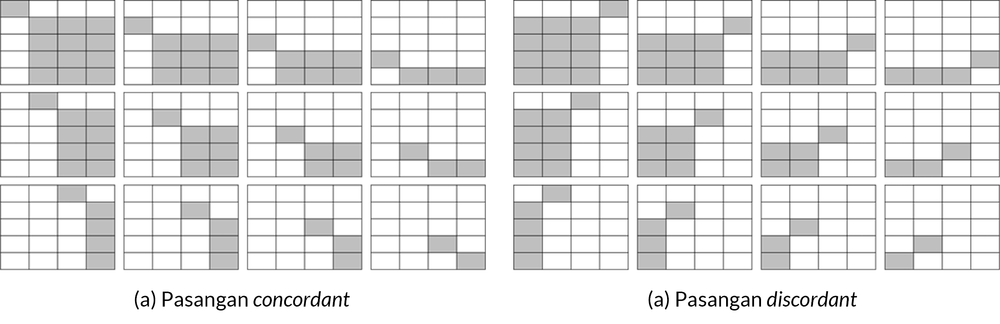
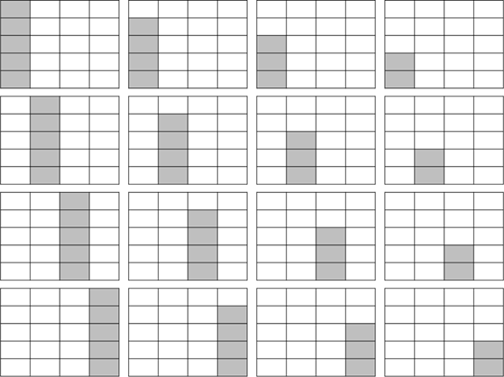

# Korelasi Antarvariabel Ordinal {#korelasi-antarvariabel-ordinal}

::: rmdcapaian
### Capaian Pembelajaran {.unnumbered}

Setelah mempelajari bab ini, Anda diharapkan mampu memaknai hasil analisis korelasi pasangan variabel bertingkat pengukuran ordinal dengan tepat [STP-10.1]{.capaian}

:::

Pada bab ini, penjelasan analisis asosiasi bivariat sama dengan yang telah dijelaskan pada bab sebelumnya. Hanya saja, pada bab ini jenis variabel yang akan dianalisis adalah **variabel ordinal**. Sebagai pengingat, variabel dengan jenis ordinal ini adalah variabel yang memiliki ragam nilai kategori yang dapat diurutkan (contoh: tinggi – sedang – rendah, dsb).

Untuk mengukur korelasi antarvariabel ordinal, kita akan mempelajari koefisien-koefisien yang sesuai, di antaranya Gamma ($\gamma$) dari Goodman dan Kruskal, $d$ dari Sommer, dan tau-b ($\tau$-b) dari Kendall yang secara konseptual sama dengan korelasi berbasis proporsi kesalahan yang dikurangi (PRE) seperti yang dibahas pada subbab \@ref(koefisien-korelasi-nominal-error).

## Koefisien Gamma ($\gamma$) dari Goodman dan Kruskal {#gamma}
Goodman and Kruskal's $\gamma$ digunakan untuk mengukur korelasi antarvariabel ordinal, khususnya variabel yang **memiliki kategori nilai yang relatif lebih sedikit** (tidak lebih dari lima atau enam kategori) [@devaus2014surveys].

Pengukuran koefisien Gamma dapat menjawab tiga pertanyaan dasar mengenai asosiasi bivariat pada variabel ordinal sebagai berikut:

a. Apakah variabel yang diuji memiliki asosiasi (saling terkait)? 
b. Seberapa kuat asosiasinya? 
c. Bagaimana arah asosiasinya? (positif atau negatif)

Logika pengukuran koefisien korelasi $\gamma$ adalah **berbasis galat (PRE)** dengan menentukan seberapa besar kemampuan untuk memprediksi peringkat (atau urutan) dari nilai suatu variabel ditingkatkan dengan mengetahui peringkat nilai variabel lainnya [@healey2021statistics]. Hubungan antar variabel akan disimpulkan berdasarkan **kesearahan (*concordant*) dan keberlawananarahan (*discordant*)** pada pasangan frekuensi-frekuensi kategori dua variabel tersebut.

Rumus untuk menghitung koefisien Gamma adalah sebagai berikut:

$$
\gamma = \frac{C - D}{C + D}
(\#eq:gamma)
$$

dengan:

- $C$ adalah jumlah pasangan kategori yang *concordant*
- $D$ adalah jumlah pasangan kategori yang *discordant*

Simak kasus berikut untuk mempelajari apa yang dimaksud dengan pasangan frekuensi *concordant* dan *discordant*.

::: rmdkasus
### Studi Kasus: Pasangan Frekuensi Concordant* dan *Discordant* {.unnumbered}
Kita akan meninjau korelasi antara variabel **"tingkat uang saku"** dan **"tingkat semester perkuliahan"**. Perhatikan kategori nilai dalam kedua variabel tersebut sebagai berikut beserta kode yang akan digunakan pada tabel silangnya.

```{r tbl-variabel-ordinal, echo=FALSE, message=FALSE, warning=FALSE}
library(kableExtra)

df_var <- data.frame(
  "Nama Variabel" = c(rep("Tingkat uang saku", 5), rep("Tingkat semester", 4)),
  "Kategori" = c(
    "&lt; Rp1 Juta", "Rp1 Juta - Rp2 Juta", "Rp2,1 Juta - Rp3 Juta", "Rp3,1 Juta - Rp4 Juta", "&gt; Rp4 Juta",
    "Semester 1 - Semester 2", "Semester 3 - Semester 4", "Semester 5 - Semester 6", "Semester 7 - Semester 8"
  ),
  "Kode" = c("a", "b", "c", "d", "e", "w", "x", "y", "z"),
  check.names = FALSE
)

tbl_out <- kbl(df_var,
  caption = "Kategori Nilai pada Variabel Tingkat Uang Saku dan Tingkat Semester",
  format.args = list(big.mark = ".", decimal.mark = ","),
  escape = FALSE
) |>
  kable_styling(
    bootstrap_options = c("striped", "hover", "responsive"),
    full_width = FALSE,
    latex_options = c("scale_down", "HOLD_position")
  ) |>
  collapse_rows(columns = 1, valign = "top")

# if (knitr::is_html_output()) {
#   tbl_out <- tbl_out |> scroll_box(width = "100%", box_css = "border: 0px;")
# }
tbl_out
```

Setelah diobservasi, tabel silangnya adalah sebagai berikut.

```{r tbl-crosstab-ordinal, echo=FALSE, message=FALSE, warning=FALSE}
library(kableExtra)

df_cross <- data.frame(
  "Kode Uang Saku" = c("a", "b", "c", "d", "e", "Total"),
  "w" = c(58, 87, 40, 34, 7, 226),
  "x" = c(89, 118, 57, 19, 4, 287),
  "y" = c(81, 181, 53, 24, 5, 344),
  "z" = c(159, 350, 142, 37, 12, 700),
  "Total" = c(407, 736, 292, 114, 28, 1577),
  check.names = FALSE
)

tbl_out <- kbl(df_cross,
  caption = "Tabel Silang Antara Tingkat Uang Saku dan Tingkat Semester",
  format.args = list(big.mark = ".", decimal.mark = ","),
  align = c("l", rep("c", 5)),
  escape = FALSE
) |>
  kable_styling(
    bootstrap_options = c("striped", "hover", "responsive"),
    full_width = FALSE,
    latex_options = c("scale_down", "HOLD_position")
  ) |>
  add_header_above(c(" " = 1, "Kode TingkatSemester" = 4, " " = 1))

# if (knitr::is_html_output()) {
#   tbl_out <- tbl_out |> scroll_box(width = "100%", box_css = "border: 0px;")
# }
tbl_out
```

**Pembahasan**

Dari metadata di Tabel \@ref(tab:tbl-variabel-ordinal) tersebut, sangat jelas bahwa kedua variabel memiliki tingkat pengukuran **ordinal**, karena pada masing-masing variabel kita dapat melihat ada **tingkatan yang logis** dari tiap nilainya. Kemudian, pada kedua variabel tersebut, nilai-nilai yang ada hanyalah nilai-nilai diskret atau **kategoris**. Misalnya, jika dilihat dari kategorinya saja, kita tidak akan tahu pasti "<Rp1 juta" itu apakah Rp900 ribu atau Rp500 ribu.

Pada Tabel \@ref(tab:tbl-crosstab-ordinal) tersebut, nilai-nilai yang ada pada baris dan kolom adalah nilai-nilai **frekuensi** atau jumlah responden yang memiliki kombinasi kategori nilai tertentu. Misalnya, pada baris pertama kolom pertama, kita dapat melihat bahwa ada **58 responden** yang memiliki tingkat uang saku "<Rp1 juta" dan tingkat semester "Semester 1 - Semester 2" (kode $a$ dan $w$).

Yang dinamakan pasangan frekuensi ***concordant*** adalah dua frekuensi yang nilai kategori pada kedua variabel **sama-sama meningkat**. Pasangan frekuensi ***concordant*** dari tabel tersebut misalnya adalah  $aw$-$bx$, $aw$-$by$, $ax$-$by$, $ax$-$bz$, dan seterusnya. Sebaliknya, yang dinamakan pasangan ***discordant*** adalah pasangan kategori yang memiliki urutan yang **satu meningkat, satu lagi menurun**. Pasangan kategori ***discordant*** dari tabel tersebut misalnya adalah $az$-$by$, $az$-$bx$, $ay$-$bx$, dan seterusnya.

Pasangan $aw$-$ax$ **bukan pasangan *concordant***, karena walaupun variabel Tingkat Semester meningkat, nilai kategori pada variabel Tingkat Uang Saku **tetap** (tetap $a$). Begitu pula, pasangan $az$-$bz$ juga **bukan pasangan *discordant***, karena walaupun variabel Tingkat Semester menurun, nilai kategori pada variabel Tingkat Uang Saku **tetap** (tetap $z$).

:::

Jika diilustrasikan, bentuk pasangan *concordant* dan *discordant* adalah sebagai berikut.

```{r fig-ilustrasi-concordant-discordant, echo=FALSE, fig.cap="Ilustrasi Pasangan Frekuensi Concordant dan Discordant", fig.show="hold", fig.align="center"}

```

Nilai $C$ pada persamaan \@ref(eq:gamma) adalah penjumlahan dari perkalian seluruh frekuensi pasangan ***concordant***, sedangkan nilai $D$ adalah penjumlahan dari perkalian seluruh frekuensi pasangan ***discordant***.

::: rmdkasus
### Studi Kasus: Menghitung Goodman & Kruskal's Gamma ($\gamma$) {.unnumbered}
Setelah kita memahami apa yang dimaksud dengan pasangan frekuensi ***concordant*** dan ***discordant***, mari kita hitung nilai $C$ dan $D$ dari Tabel \@ref(tab:tbl-crosstab-ordinal).

**Total perkalian seluruh frekuensi pasangan *concordant* ($C$)**

Berdasarkan pada Gambar \@ref(fig:fig-ilustrasi-concordant-discordant) (a) dan disesuaikan dengan Tabel \@ref(tab:tbl-crosstab-ordinal), maka nilai $C$ adalah sebagai berikut.

$$
\begin{aligned}
C = & (58 \times 118) + (58 \times 57) + (58 \times 19) + \\
& (58 \times 4) + (58 \times 181) + (58 \times 53) + \\
& (58 \times 24) + (58 \times 5) + (58 \times 350) + \dots \\
& (87 \times 57) + (87 \times 19) + (87 \times 4) + \dots \\
& (40 \times 19) + (40 \times 4) + \dots + (34 \times 4) + (34 \times 5) + \\
& (34 \times 12) + (89 \times 181) + \dots \\
= & 58.116 + 30.711 + 4.040 + 714 + 71.556 + \\
& 32.214 + 4.446 + 323 + 43.821 + 34.571 + \\
& 2.597 + 288 \\
= & 283.397
\end{aligned}
$$


**Total perkalian seluruh frekuensi pasangan *discordant* ($D$)**

Berdasarkan pada Gambar \@ref(fig:fig-ilustrasi-concordant-discordant) (b) dan disesuaikan dengan Tabel \@ref(tab:tbl-crosstab-ordinal), maka nilai $D$ adalah sebagai berikut.

$$
\begin{aligned}
D = & (159 \times 181) + (159 \times 53) + (159 \times 24) + (159 \times 5) + \\
& (350 \times 53) + (350 \times 24) + (350 \times 5) + \dots + \\
& (142 \times 24) + (142 \times 5) + \dots + (37 \times 5) + \\
& (37 \times 4) + (37 \times 7) + (81 \times 118) + (81 \times 57) + \dots \\
= & 100.011 + 85.050 + 13.206 + 592 + 29.646 + 29.141 + 3.392 + 264 + \\
& 14.952 + 9.558 + 2.337 + 133 \\
= & 288.282
\end{aligned}
$$

**Nilai Goodman & Kruskal's Gamma ($\gamma$)**

Setelah mendapatkan nilai $C$ dan $D$, kita dapat menghitung nilai Goodman & Kruskal's Gamma ($\gamma$) dengan menggunakan persamaan \@ref(eq:gamma).

$$
\begin{aligned}
\gamma = & \frac{C - D}{C + D} \\
= & \frac{283.397 - 288.282}{283.397 + 288.282} \\
= & \frac{-4.885}{571.679} \\
= & -0{,}0085
\end{aligned}
$$

**Interpretasi Nilai Koefisien**

Dari koefisien $\gamma$ yang telah kita hitung, kita bisa mengetahui bahwa **hubungan tingkat semester dengan uang saku terbalik karena tandanya negatif** namun **kekuatannya lemah karena nilainya mendekati nol**. Ini berarti bahwa tingkat semester dan uang saku terdapat hubungan yang terbalik, yakni semakin tinggi semester kuliah, semakin sedikit uang saku yang diberikan oleh orang tua/wali mahasiswa. Namun, hubungan kedua variabel tersebut sangat lemah. Artinya, kondisinya tidak selalu seperti yang disebutkan. Banyak juga mahasiswa yang sudah lama berkuliah (tinggi tingkat semesternya) justru memiliki uang saku yang tinggi pula, atau sebaliknya.

:::

## Koefisien $d$ dari Sommer {#sommersd}
Untuk kasus pengujian korelasi antarvariabel ordinal dengan **ukuran kategori yang tidak sama (non-persegi)**, koefisien $d$ dari Sommer (*Sommer's* $d$) lebih sering digunakan dibandingkan dengan koefisien $\gamma$. Hal ini karena nilai koefisien $d$ dari Sommer dapat mencapai nilai sempurna, yaitu 1, meskipun jumlah kategori pada kedua variabel tidak sama. Dengan demikian, koefisien $d$ dari Sommer memiliki fleksibilitas yang lebih tinggi.

Dalam perhitungannya, $d$ dari Sommer tidak hanya mempertimbangkan pasangan *concordant* dan *discordant*, tetapi juga keberadaan pasangan kasus yang terikat pada variabel independen. Hal ini menjadi pembeda utama $d$ dari Sommer dengan $\gamma$. Meskipun lebih konservatif, tetapi hasil estimasinya lebih baik.

Selain itu, nilai $d$ dari Sommer juga bersifat **asimetris**, artinya apabila posisi variabel dibalik (variabel dependen menjadi independen atau sebaliknya), maka nilai $d$ dari Sommer juga akan berubah. Oleh karena itu, sebelum pengujian dilakukan kita perlu dengan **benar menetapkan variabel dependen dan independen**. Hal ini juga seringkali menjadi titik kritis untuk pengujian korelasi dengan pengukuran koefisien $d$ dari Sommer.

Koefisien $d$ dari Sommer dapat dihitung dengan menggunakan rumus berikut:

$$
d = \frac{C - D}{C + D + T}
(\#eq:rumus-sommersd)
$$

dengan:

- $C$ adalah jumlah pasangan frekuensi ***concordant***
- $D$ adalah jumlah pasangan frekuensi ***discordant***
- $T$ adalah jumlah pasangan frekuensi terikat *(tied ranks)* pada variabel independen

Nilai koefisien Somers’ D berada pada rentang 0 sampai dengan 1 sehingga dapat diinterpretasikan kekuatan asosiasinya, serta arah asosiasi dengan nilai positif ataupun negatif sebagaimana koefisien $\gamma$.

Pelajari kasus berikut untuk memahami perhitungan koefisien $d$ dari Sommer, terutama perhitungan komponen $T$.

::: rmdkasus
### Studi Kasus: Menghitung Sommer's $d$ {.unnumbered}
Dalam perhitungan koefisien d Sommer (Sommer’s d) kita sudah melibatkan penentuan variabel dependen dan independen, atau variabel yang dipengaruhi dan memengaruhi.

Dalam kasus kita, yang paling masuk akal adalah mengatakan **“tingkat semester perkuliahan memengaruhi tingkat uang saku”** ketimbang “tingkat uang saku memengaruhi tingkat semester perkuliahan.” Oleh karena itu, kita menganggap variabel independennya adalah Tingkat Semester Perkuliahan dan variabel dependennya Tingkat Uang Saku.

**Perhitungan $T$ atau pasangan frekuensi terikat (*tied ranks*)**

Perhitungan T adalah jumlah dari perkalian pasangan-pasangan *concordant* dari tabel silang kita, tetapi per ruas tempat variabel independennya berlokasi. Merujuk pada tabel silang kita yang ada di Tabel \@ref(tab:tbl-crosstab-ordinal), variabel independen kita berada ***di kolom***. Oleh karena itu, kita perlu menghitung perkalian pasangan-pasangan *concordant* yang ada di kolom.

Seperti halnya perhitungan $C$ dan $D$ pada koefisien $\gamma$ sebelumnya, perhitungan $T$ diilustrasikan sebagai berikut.

```{r fig-ilustrasi-tied-rank, echo=FALSE, out.width = '60%', fig.align = "center", fig.cap = 'Ilustrasi Perhitungan Pasangan Terikat (Tied Ranks)'}

```

Dengan demikian, perhitungan lengkap untuk $T$ adalah sebagai berikut

$$
\begin{aligned}
58 \times (87 + 40 + 34 + 7) &= 9.774 \\
87 \times (40 + 34 + 7) &= 7.047 \\
40 \times (34 + 7) &= 1.640 \\
34 \times 7 &= 238 \\
89 \times (118 + 57 + 19 + 4) &= 17.622 \\
118 \times (57 + 19 + 4) &= 9.400 \\
57 \times (19 + 4) &= 1.311 \\
19 \times 4 &= 76 \\
81 \times (181 + 53 + 24 + 5) &= 21.303 \\
181 \times (53 + 24 + 5) &= 14.842 \\
53 \times (24 + 5) &= 1.537 \\
24 \times 5 &= 120 \\
159 \times (350 + 142 + 37 + 12) &= 86.019 \\
350 \times (142 + 37 + 12) &= 66.850 \\
142 \times (37 + 12) &= 6.958 \\
37 \times 12 &= 444 \\
\end{aligned}
$$

Dengan demikian, total dari ke-16 persamaan untuk setiap kolom tersebut adalah $T = 245.191$.

**Menghitung Koefisien $d$ dari Sommer**

Alhasil, koefisien *Sommer's* $d$ adalah sebagai berikut.

$$
\begin{aligned}
d = & \frac{C - D}{C + D + T} \\
= & \frac{283.397 - 288.282}{283.397 + 288.282 + 245.191} \\
= & \frac{-4.885}{816.870} \\
= & -0{,}00598
\end{aligned}
$$

**Interpretasi Nilai Koefisien**

Nilai tersebut tidak jauh berbeda dengan nilai koefisien $\gamma$ yang tadi kita hitung, dan interpretasinya juga tidak berbeda dengan nilai koefisien $\gamma$, hanya saja di sini kita sudah memperhitungkan efek dari variabel Tingkat Semester Perkuliahan sebagai variabel independen.

:::


## Koefisien tau-b ($\tau$-b) dari Kendall {#kendall}
Koefisien tau-b dari Kendall (*Kendall's* $\tau_b$) memiliki banyak kemiripan prinsip dengan koefisien $\gamma$. Koefisien $\tau_b$ Kendall akan efektif apabila digunakan pada **tabel silang berbentuk persegi** dengan banyak kasus yang cenderung menghasilkan **peringkat yang sama (tied ranks)**. Dalam pengukurannya, koefisien $tau_b$ juga mempertimbangkan prinsip pasangan terikat sebagaimana yang disertakan oleh koefisien $d$ dari Sommer, tetapi tidak hanya di variabel dependen melainkan juga di variabel dependennya.

Koefisien $\tau_b$ Kendall memiliki sifat simetris, sehingga posisi variabel X dan variabel Y tidak bermasalah apabila ditukar.

Akan tetapi, jika pun diaplikasikan, setelah kita menghitung koefisien $d$, kita sebenarnya hanya perlu menghitung nilai T untuk sumbu yang satunya, kemudian kita menghitung nilai-nilai tersebut dengan persamaan berikut.

$$
\tau_b = \frac{C - D}{\sqrt{(C + D + T_x)(C + D + T_y)}}
(\#eq:rumus-kendaltaub)
$$

Secara keseluruhan, perbandingan penggunaan ketiga koefisien korelasi variabel ordinal kita adalah seperti berikut.

```{r tbl-perbandingan-koefisien-ordinal, echo=FALSE, message=FALSE, warning=FALSE}
library(kableExtra)

df_perbandingan <- data.frame(
  "Kriteria" = c("Penggunaan", "Dasar perhitungan", "Sifat hubungan yang diukur"),
  "$\\gamma$" = c(
    "Matriks korelasi persegi sederhana ($2\\times2$), ($3\\times3$), dll",
    "Jumlah pasangan frekuensi *concordant* dan *discordant*",
    "Simetris, tidak membedakan variabel dependen dan independen"
  ),
  "$d$ Sommer" = c(
    "Semua jenis matriks korelasi",
    "Jumlah pasangan frekuensi *concordant*, *discordant*, dan *tied ranks* pada variabel independen",
    "Asimetris, variabel dependen dan independen dibedakan"
  ),
  "$\\tau_b$ Kendall" = c(
    "Matriks korelasi dengan jumlah kasus ($n$) besar",
    "Jumlah pasangan frekuensi *concordant*, *discordant*, dan *tied ranks* pada variabel independen dan dependen",
    "Simetris, variabel dependen dan independen dibedakan"
  ),
  check.names = FALSE
)

tbl_out <- kbl(df_perbandingan,
  caption = "Perbandingan Karakteristik Koefisien Korelasi Ordinal",
  escape = FALSE
) |>
  kable_styling(
    bootstrap_options = c("striped", "hover", "responsive"),
    full_width = FALSE,
    latex_options = c("scale_down", "HOLD_position")
  ) |>
  column_spec(1, width = "15em") |>
  column_spec(2:4, width = "12em")

# if (knitr::is_html_output()) {
#   tbl_out <- tbl_out |> scroll_box(width = "100%", box_css = "border: 0px;")
# }
tbl_out
```

::: rmdkasus

### Studi Kasus: Menghitung Kendall's $\tau_b$ {.unnumbered}

Nilai *tied ranks* sudah kita hitung untuk variabel independen yang ada di kolom pada perhitungan koefisien $d$ Sommer, yaitu sebesar $T_x = 245.191$. Sekarang, kita perlu menghitung nilai $T$ untuk variabel dependen yang ada di baris, yaitu $T_y$.

$$
\begin{aligned}
58 \times (89 + 81 + 159) &= 19.082\\
89 \times (81 + 159) &= 21.360\\
81 \times 159 &= 12.879\\
87 \times (118 + 181 + 350) &= 56.463\\
118 \times (181 + 350) &= 62.658\\
181 \times 350 &= 63.350\\
40 \times (57 + 53 + 142) &= 10.080\\
57 \times (53 + 142) &= 11.115\\
53 \times 142 &= 7.526\\
34 \times (19 + 24 + 37) &= 2.720\\
19 \times (24 + 37) &= 1.159\\
24 \times 37 &= 888\\
7 \times (4 + 5 + 12) &= 147\\
4 \times (5 + 12) &= 68\\
5 \times 12 &= 60\\
\end{aligned}
$$

dengan demikian, nilai $T_y$ kita adalah penjumlahan seluruh nilai di atas, yaitu sebesar $T_y = 269.555$.

Kita pun bisa menghitung nilai $\tau_b$ Kendall dengan memasukkan nilai $C$, $D$, $T_x$, dan $T_y$ ke dalam persamaan \@ref(eq:rumus-kendaltaub).

$$
\begin{aligned}
\tau_b &= \frac{C - D}{\sqrt{(C + D + T_x)(C + D + T_y)}} \\
&= \frac{283.397 - 288.282}{\sqrt{(283.397 + 288.282 + 245.191)(283.397 + 288.282 + 269.555)}} \\
&= \frac{-4.885}{\sqrt{(816.870)(841.234)}} \\
&= \frac{-4.885}{\sqrt{687.258.870}} \\
&= \frac{-4.885}{829.011} \\
&= -0{,}00589
\end{aligned}
$$

:::

Kerjakan soal evaluasi berikut untuk mengukur pemahaman Anda mengenai koefisien korelasi ordinal.

::: rmdexercise
## Soal Evaluasi 12 {.unnumbered}

Perhatikan tabel silang yang menunjukkan distribusi frekuensi  dari 100 orang peserta musrenbang (musyawarah perencanaan pembangunan) di suatu lingkungan berdasarkan variabel persepsi mereka terhadap keberjalanan musrenbang dan tingkat partisipasi mereka. [STP-10.1]{.capaian}

```{r tbl-evaluasi-musrenbang, echo=FALSE, message=FALSE, warning=FALSE}
library(kableExtra)

df_eval <- data.frame(
  "Persepsi" = c("Kurang dari ekspektasi", "Sesuai ekspektasi", "Melebihi ekspektasi"),
  "Hadir 1 kali" = c(20, 10, 8),
  "Hadir 2 kali" = c(6, 15, 11),
  "Hadir >3 kali" = c(4, 5, 21),
  check.names = FALSE
)

# Gunakan safe_html untuk mengamankan karakter khusus pada nama kolom
names(df_eval) <- safe_html(names(df_eval))

tbl_out <- kbl(df_eval,
  caption = "Distribusi Frekuensi Persepsi vs Kehadiran Peserta Musrenbang",
  format.args = list(big.mark = ".", decimal.mark = ","),
  align = c("l", "c", "c", "c")
) |>
  kable_styling(
    bootstrap_options = c("striped", "hover", "responsive"),
    full_width = FALSE,
    latex_options = c("HOLD_position")
  ) |>
  add_header_above(c(" " = 1, "Tingkat Kehadiran" = 3))

tbl_out
```

  a. Tentukan koefisien yang pas untuk mengukur hubungan antara kedua variabel tersebut ($\gamma$, $d$ Sommer, atau $\tau_b$ Kendall). Jelaskan alasan Anda!
  b. Hitung koefisien korelasi yang Anda pilih!
  c. Interpretasikan hasil perhitungan Anda!

:::
