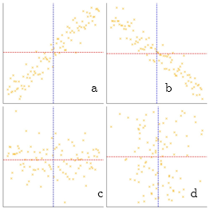
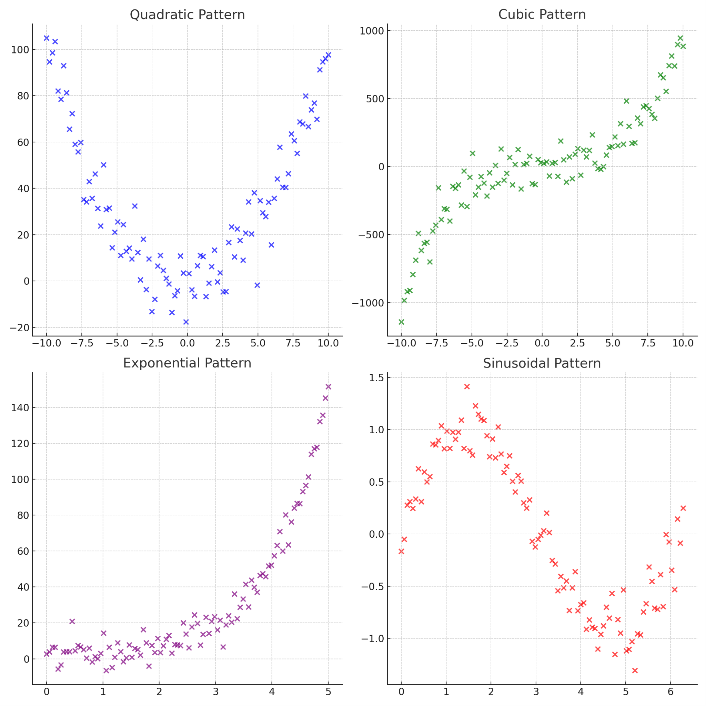

# Korelasi Antarvariabel Metrik

::: rmdcapaian
### Capaian Pembelajaran {.unnumbered}
Setelah mempelajari bab ini, Anda diharapkan mampu memaknai hasil analisis korelasi pasangan variabel bertingkat pengukuran metrik dengan tepat [STP-11.1]{.capaian}
:::

Setelah mempelajari korelasi antara dua variabel nominal dan ordinal, pada bab ini kita akan membahas bentuk pengujian asosiasi yang lebih kompleks, yaitu pengujian pada pasangan variabel berjenis **metrik**. Variabel metrik mencakup data dengan skala pengukuran **interval** maupun **rasio**. Variabel jenis ini **memiliki nilai yang beragam** dan **bersifat numerik**, sehingga **dapat langsung diolah secara matematis**.

Dalam analisis asosiasi, pengujian hubungan antarvariabel metrik dapat memberikan informasi yang lebih lengkap, meliputi (1) kekuatan hubungan, (2) arah hubungan (positif/searah atau negatif/berlawanan arah), dan (3) **pola hubungan** (linear atau non-linear).

Untuk asosiasi antarvariabel metrik, kita akan mempelajari dua koefisien, yaitu koefisien korelasi $\rho$ (rho) Spearman dan koefisien $r$ Pearson. Kedua ukuran ini didasarkan pada logika pengurangan kesalahan prediksi **(Proportional Reduction of Error, PRE)**, seperti halnya $\lambda$ pada ukuran asosiasi antarvariabel nominal dan pada ukuran-ukuran asosiasi antarvariabel ordinal. Artinya, pengujian dilakukan untuk melihat sejauh mana informasi dari satu variabel dapat mengurangi kesalahan prediksi terhadap nilai variabel lainnya.

## Koefisien Korelasi $\rho$ Spearman
Koefisien $\rho$ Spearman digunakan untuk mengukur tingkat asosiasi antara dua variabel interval (atau bisa salah satunya saja) dan **tidak mensyaratkan distribusi data yang normal**. Kondisi ini menjadikan pengukuran asosiasi menggunakan $\rho$ Spearman lebih fleksibel, karena dapat **diterapkan tanpa perlu terlebih dahulu mengidentifikasi bentuk distribusi datanya**.

::: rmdnote
[Catatan]{.tajuksaya}

Ingat kembali perbedaan mendasar antara tingkat pengukuran variabel interval dan rasio, yakni bahwa variabel interval adalah **variabel angka yang titik nolnya tidak absolut**.

Yang dimaksud dengan "tidak absolut" adalah **tidak ada posisi nilai nol mutlak yang berarti untuk variabel tersebut**. Contoh paling mudah adalah variabel *rating* yang memiliki rentang panjang, seperti 0 hingga 10 (apalagi jika menggunakan desimal).Tidak ada makna nol absolut dalam sebuah rating, karena rating bersifat subjektif tidak bisa dibuat titik nol universal.

Contoh lain adalah temperatur/suhu, yang memiliki titik nol berbeda-beda tergantung dari termometernya, serta tahun, tergantung dari kalendernya

:::

Secara konseptual, logika pengukuran $\rho$ Spearman serupa dengan koefisien $\gamma$, $d$ Sommer, maupun $\tau_b$ Kendall, yaitu dengan mempertimbangkan urutan (peringkat) pasangan kasus untuk mengetahui ada tidaknya hubungan antara dua variabel. Dalam analisis ini, nilai setiap variabel terlebih dahulu **diubah menjadi peringkat** sebelum dilakukan perhitungan asosiasinya.

Koefisien $\rho$ Spearman ini dapat diukur dengan rumus:

$$
\rho = 1 - \frac{6 \sum D_i^2}{n(n^2 - 1)}
(\#eq:rumus-rho-spearman)
$$

dengan:

- $D_i$ adalah selisih peringkat antara dua variabel
- $n$ adalah jumlah pasangan kasus

Nilai koefisien $\rho$ Spearman berkisar **antara 0 hingga 1**, yang menggambarkan **kekuatan hubungan** antardua variabel (lihat Tabel \@ref(tab:tbl-interpretasi-koefisien-nominal) untuk pedoman interpretasi kekuatan hubungan koefisien korelasi). Selain itu, nilai $\rho$ Spearman dapat bernilai positif (+) maupun negatif (−), yang menunjukkan **arah hubungan** antar kedua variabel.

Hasil kuadrat dari koefisien $\rho$ Spearman ($\rho^2$) menggambarkan **besarnya kemampuan peningkatan keakuratan prediksi** suatu variabel berdasarkan informasi dari variabel lainnya. Dengan kata lain, semakin besar nilai $\rho^2$, semakin tinggi pula kemampuan satu variabel dalam menjelaskan variasi yang terjadi pada variabel pasangannya.

Mari pelajari kasus berikut untuk lebih memahami penggunaan koefisien korelasi $\rho$ Spearman.

::: rmdkasus

### Studi Kasus: Mengukur Asosiasi Antarvariabel Metrik dengan $\rho$ Spearman {.unnumbered}

Agar proses perhitungan $\rho$ Spearman lebih mudah dipahami, kita akan menggunakan data sampel berukuran kecil. Dari 12 mahasiswa, kita mendapatkan data berupa jarak tempuh tempat tinggal ke kampus (dalam km) dan skor kepuasan berkuliah dari 0 sampai 20. Datanya ditampilkan dalam Tabel \@ref(tab:tbl-data-sampel-rho-spearman).

```{r tbl-data-sampel-rho-spearman, echo=FALSE, out.width='60%', fig.align='center'}
library(knitr)
library(kableExtra)

df_rho_spearman <- data.frame(
  Mahasiswa = 1:12,
  `Jarak Tempuh (km)` = c(2, 5, 3, 10, 8, 1, 15, 12, 7, 4, 9, 6),
  `Skor Kepuasan` = c(18, 15, 17, 10, 12, 19, 8, 9, 13, 16, 11, 14)
)

kbl(df_rho_spearman,
  align = "ccc",
  caption = "Data Sampel Jarak Tempuh dan Skor Kepuasan Berkuliah",
  escape = FALSE,
  col.names = c("Mahasiswa", "Jarak Tempuh (km)", "Skor Kepuasan Berkuliah")
) |>
  kable_styling(bootstrap_options = c("striped", "hover"), full_width = TRUE)
```

Langkah awal untuk menghitung koefisien $\rho$ Spearman adalah dengan memberikan **peringkat** pada setiap nilai dari masing-masing variabel yang akan diuji. Dalam hal ini, seluruh nilai pada **kedua variabel** diberi peringkat berdasarkan urutannya, dari nilai terkecil hingga terbesar.

```{r tbl-data-sampel-rho-spearman-ranking, echo=FALSE, out.width='60%', fig.align='center'}
library(knitr)
library(kableExtra)

df_rho_spearman_ranking <- data.frame(
  Mahasiswa = 1:12,
  `Jarak Tempuh (km)` = c(2, 5, 3, 10, 8, 1, 15, 12, 7, 4, 9, 6),
  `Peringkat Jarak` = c(2, 5, 3, 10, 8, 1, 12, 11, 7, 4, 9, 6),
  `Skor Kepuasan` = c(18, 15, 17, 10, 12, 19, 8, 9, 13, 16, 11, 14),
  `Peringkat Skor Kepuasan` = c(11, 8, 10, 3, 5, 12, 1, 2, 6, 9, 4, 7)
)

kbl(df_rho_spearman_ranking,
  align = "ccccc",
  caption = "Data Sampel Jarak Tempuh dan Skor Kepuasan Berkuliah Beserta Peringkatnya",
  escape = FALSE,
  col.names = c(
    "Mahasiswa",
    "Jarak Tempuh (km)",
    "Peringkat Jarak",
    "Skor Kepuasan Berkuliah",
    "Peringkat Skor Kepuasan"
  )
) |>
  kable_styling(bootstrap_options = c("striped", "hover"), full_width = TRUE)
```

Setelah proses pemberian peringkat dilakukan, langkah berikutnya adalah menghitung selisih peringkat ($D$) antara kedua variabel untuk setiap responden. Untuk meringkas demonstrasi, kolom nilai asli disembunyikan sehingga kita fokus pada peringkat dan selisihnya.

```{r tbl-data-sampel-rho-spearman-selisih, echo=FALSE, out.width='60%', fig.align='center'}
library(knitr)
library(kableExtra)

df_rho_spearman_selisih <- data.frame(
  Mahasiswa = 1:12,
  `Peringkat Jarak` = c(2, 5, 3, 10, 8, 1, 12, 11, 7, 4, 9, 6),
  `Peringkat Skor Kepuasan` = c(11, 8, 10, 3, 5, 12, 1, 2, 6, 9, 4, 7),
  `Selisih Peringkat (D)` = c(-9, -3, -7, 7, 3, -11, 11, 9, 1, -5, 5, -1),
  `Kuadrat Selisih Peringkat (D^2)` = c(81, 9, 49, 49, 9, 121, 121, 81, 1, 25, 25, 1)
)

kbl(df_rho_spearman_selisih,
  align = "ccccc",
  caption = "Pengolahan Data untuk Menghitung Koefisien Korelasi $\rho$ Spearman",
  escape = FALSE,
  col.names = c(
    "Mahasiswa",
    "Peringkat Jarak",
    "Peringkat Skor Kepuasan",
    "Selisih Peringkat (D)",
    "Kuadrat Selisih Peringkat (D^2)"
  )
) |>
  kable_styling(bootstrap_options = c("striped", "hover"), full_width = TRUE)
```

Dari Tabel \@ref(tab:tbl-data-sampel-rho-spearman-selisih) kolom terakhir, dapat kita hitung bahwa total kuadrat selisih peringkat ($\sum D^2$) adalah sebesar **572**. Dengan persamaan \@ref(eq:rumus-rho-spearman), maka koefisien korelasi $\rho$ Spearman dapat dihitung sebagai berikut.

$$
\begin{aligned}
\rho &= 1 - \frac{6 \sum D_i^2}{n(n^2 - 1)} \\
&= 1 - \frac{6 \times 572}{12(12^2 - 1)} \\
&= 1 - \frac{3432}{12(144 - 1)} \\
&= 1 - \frac{3432}{12(143)} \\
&= 1 - \frac{3432}{1716} \\
&= 1 - 2 \\
&= -1
\end{aligned}
$$

Berdasarkan hasil perhitungan, diketahui bahwa nilai $\rho = -1{,}00$ yang menunjukkan **hubungan sempurna antara jarak tempuh dan tingkat kepuasan**. Nilai koefisien ini juga bernilai **negatif** yang menunjukkan **arah yang berlawanan** antara kedua variabel tersebut. Interpretasinya adalah **apabila jarak perjalanan semakin jauh maka tingkat kepuasan akan semakin rendah**.

:::

## Koefisien Korelasi $r$ Pearson
Sebelum mempelajari lebih lanjut tentang koefisien korelasi $r$ Pearson, mari kita pahami terlebih dahulu konsep dari **kovariansi**. Perlu dipahami terlebih dahulu bahwa kovariansi digunakan untuk mengukur **hubungan antara dua variabel dengan skala interval maupun rasio** [@chan2021introduction]. Dalam hubungan antara dua variabel metrik, kita menilai bahwa ada hubungan antara kedua variabel tersebut berdasarkan adanya **kovariansi** (*covariance*).

### Dari Variansi ke Kovariansi
Untuk memahami kovariansi, ingatlah kembali konsep varians. Varians mengukur sejauh mana data dalam satu variabel menyebar dari nilai rata-ratanya. Jika kita memiliki variabel $X$, maka varians ($s^2$) dihitung dengan menjumlahkan kuadrat selisih antara setiap data ($x_i$) dengan rata-ratanya ($\bar{x}$):

$$
s^2_x = \frac{\sum (x_i - \bar{x})^2}{n-1}
$$

Sekarang, bayangkan kita memiliki dua variabel, $x$ dan $y$. Kita ingin tahu apakah ketika $x$ menyimpang dari rata-ratanya, $y$ juga cenderung menyimpang dalam arah yang sama atau berlawanan. Konsep ini disebut **kovariansi**.

Secara matematis, alih-alih menguadratkan selisih satu variabel, kita mengalikan selisih $x$ dengan selisih $y$:

$$
cov(x, y) = \frac{\sum (x_i - \bar{x})(y_i - \bar{y})}{n-1}
(\#eq:rumus-kovariansi)
$$

Logika kovariansi:

1. **Positif**: Jika saat $x$ berada di atas rata-rata, $y$ juga cenderung berada di atas rata-rata, maka hasil perkaliannya positif. Jika keduanya di bawah rata-rata, hasil perkaliannya juga positif. Ini menunjukkan hubungan searah.
2. **Negatif**: Jika saat $x$ di atas rata-rata, $y$ justru di bawah rata-rata, hasil perkaliannya menjadi negatif. Ini menunjukkan hubungan berlawanan arah.
3. **Mendekati Nol**: Jika tidak ada pola yang konsisten, nilai positif dan negatif akan saling meniadakan saat dijumlahkan, menghasilkan kovariansi yang mendekati nol.

### Masalah pada Kovariansi: Skala dan Unit
Kovariansi sangat berguna untuk mengetahui arah hubungan, namun ia memiliki kelemahan besar: besaran nilainya sangat bergantung pada unit pengukuran.

Jika kita mengukur jarak dalam meter alih-alih kilometer, **nilai kovariansinya akan melonjak drastis meskipun hubungan aslinya tidak berubah**. Hal ini membuat kita sulit menentukan seberapa "kuat" hubungan tersebut hanya dengan melihat angka kovariansi.

::: rmdkasus
### Studi Kasus: Masalah Skala dan Unit pada Kovariansi {.unnumbered}
Seorang perencana ingin menguji hubungan antara Jarak ke Taman Kota ($x$) dan Indeks Kualitas Udara ($y$) di 5 lokasi. Data awalnya adalah sebagai berikut:

```{r tbl-jarak-iku, echo=FALSE, out.width='60%', fig.align='center'}
library(knitr)
library(kableExtra)
library(dplyr)

# Menyiapkan data
data_persoalan <- data.frame(
  Lokasi = c("A", "B", "C", "D", "E"),
  Jarak_km = c(0.5, 1.2, 2.5, 3.0, 4.5),
  IKU = c(80, 75, 60, 55, 40)
)

# Menampilkan tabel menggunakan kbl()
data_persoalan |>
  kbl(
    col.names = c("Lokasi", "Jarak (km)", "Kualitas Udara (Indeks)"),
    caption = "Data Jarak ke Taman dan Kualitas Udara",
    format.args = list(big.mark = ".", decimal.mark = ","),
    booktabs = TRUE,
    align = "c",
    escape = FALSE
  ) |>
  kable_styling(
    bootstrap_options = c("striped", "hover", "responsive"),
    full_width = FALSE,
    latex_options = c("scale_down", "HOLD_position")
  )
```

```{r hitung-kovariansi, echo=FALSE}
# Menggunakan data_persoalan yang sudah didefinisikan sebelumnya
jarak_km <- data_persoalan$Jarak_km
kualitas_udara <- data_persoalan$IKU

# Menghitung rata-rata dari masing-masing variabel
mean_jarak_km <- mean(jarak_km)
mean_kualitas_udara <- mean(kualitas_udara)

# Membuat variabel baru dengan unit meter
jarak_m <- jarak_km * 1000

# Menghitung rata-rata jarak dalam meter
mean_jarak_m <- mean(jarak_m)

# Menghitung Kovariansi
kov_km <- cov(jarak_km, kualitas_udara)
kov_m <- cov(jarak_m, kualitas_udara)

# Menghitung Korelasi
cor_km <- cor(jarak_km, kualitas_udara)
cor_m <- cor(jarak_m, kualitas_udara)
```

Perhitungan kovariansi untuk data tersebut kita mulai dengan perhitungan rata-rata dari masing-masing variabel. Untuk variabel jarak tempuh dalam kilometer, rata-ratanya adalah $\bar{x} = \frac{0{,}5 + 1{,}2 + 2{,}5 + 3{,}0 + 4{,}5}{5} = `r format(mean_jarak_km, decimal.mark = ",", big.mark = ".", trim = TRUE)`$ kilometer. Sementara itu, rata-rata kualitas udara adalah $\bar{y} = \frac{80 + 75 + 60 + 55 + 40}{5} = `r format(mean_kualitas_udara, decimal.mark = ",", big.mark = ".", trim = TRUE)`$.

Sekarang kita akan menghitung kovariansinya menggunakan persamaan \@ref(eq:rumus-kovariansi):

$$
\begin{aligned}
\text{cov}(X, Y) &= \frac{\sum (X_i - \bar{X})(Y_i - \bar{Y})}{n-1} \\
&= \frac{(0{,}5 - `r format(mean_jarak_km, decimal.mark = ",", big.mark = ".", trim = TRUE)`)(80 - `r format(mean_kualitas_udara, decimal.mark = ",", big.mark = ".", trim = TRUE)`) + (1,2 - `r format(mean_jarak_km, decimal.mark = ",", big.mark = ".", trim = TRUE)`)(75 - `r format(mean_kualitas_udara, decimal.mark = ",", big.mark = ".", trim = TRUE)`) + \dots}{5-1} \\
&= \frac{`r format(kov_km * 4, decimal.mark = ",", big.mark = ".", trim = TRUE)`}{4} \\
&= `r format(kov_km, decimal.mark = ",", big.mark = ".", trim = TRUE)`
\end{aligned}
$$

Bagaimana jika kita mengubah satuan jarak tempuh dari kilometer menjadi meter? Berikut adalah dataset yang kita miliki:

```{r tbl-jarak-iku-meter, echo=FALSE, out.width='60%', fig.align='center'}
library(knitr)
library(kableExtra)
library(dplyr)

# Menyiapkan data
data_persoalan_meter <- data.frame(
  Lokasi = c("A", "B", "C", "D", "E"),
  Jarak_m = c(500, 1200, 2500, 3000, 4500),
  IKU = c(80, 75, 60, 55, 40)
)

# Menampilkan tabel menggunakan kbl()
data_persoalan_meter |>
  kbl(
    col.names = c("Lokasi", "Jarak (meter)", "Kualitas Udara (Indeks)"),
    caption = "Data Jarak ke Taman dan Kualitas Udara (Satuan Meter)",
    format.args = list(big.mark = ".", decimal.mark = ","),
    booktabs = TRUE,
    align = "c",
    escape = FALSE
  ) |>
  kable_styling(
    bootstrap_options = c("striped", "hover", "responsive"),
    full_width = FALSE,
    latex_options = c("scale_down", "HOLD_position")
  )
```

Rata-rata jarak tempuh dalam meter sekarang adalah $`r format(mean_jarak_m, big.mark = ".", trim = TRUE)`$ meter. Dan ketika kita menghitung kovariansinya, nilainya menjadi:

$$ 
\begin{aligned}
\text{cov}(X, Y) &= \frac{\sum (X_i - \bar{X})(Y_i - \bar{Y})}{n-1} \\
&= \frac{(500 - `r format(mean_jarak_m, big.mark = ".", trim = TRUE)`)(80 - `r format(mean_kualitas_udara, big.mark = ".", decimal.mark = ",", trim = TRUE)`) + (1200 - `r format(mean_jarak_m, big.mark = ".", trim = TRUE)`)(75 - `r format(mean_kualitas_udara, big.mark = ".", decimal.mark = ",", trim = TRUE)`) + \dots}{5-1} \\
&= \frac{`r format(kov_m * 4, scientific = FALSE, big.mark = ".", trim = TRUE)`}{4} \\
&= `r format(kov_m, scientific = FALSE, big.mark = ".", trim = TRUE)`
\end{aligned}
$$

Karena nilai selisih $(x_i - \bar{x})$ membesar 1000 kali lipat, maka nilai total kovariansi juga akan membesar 1000 kali lipat. Hal ini menunjukkan bahwa kovariansi **tidak stabil terhadap perubahan unit pengukuran**.

:::

### Standardisasi Kovariansi dengan Koefisien Korelasi $r$ Pearson

Untuk mengatasi masalah unit tersebut, Karl Pearson [-@pearson1895note] mengusulkan agar kovariansi "distandarisasi". Caranya adalah dengan membagi kovariansi dengan hasil kali standar deviasi kedua variabel ($s_x$ dan $s_y$). Indeks hasil standardisasi ini dikenal sebagai **Koefisien Korelasi Pearson** ($r$):

$$
r = \frac{Cov(x,y)}{s_x s_y}(\#eq:rumus-korelasi-pearson)
$$

dengan:

- $Cov(x,y)$ adalah kovariansi antara variabel x dan y
- $s_x$ adalah simpangan baku variabel x
- $s_y$ adalah simpangan baku variabel y

atau jika kita nyatakan dalam bentuk variabel-variabel yang dianalisis, maka persamaannya adalah:

$$
r = \frac{\sum_{i=1}^{n} (x_i - \bar{x})(y_i - \bar{y})}{\sqrt{\sum_{i=1}^{n} (x_i - \bar{x})^2} \sqrt{\sum_{i=1}^{n} (y_i - \bar{y})^2}}(\#eq:rumus-korelasi-pearson-variabel)
$$

dengan:

- $x_i$ adalah nilai variabel x ke-i
- $y_i$ adalah nilai variabel y ke-i
- $\bar{x}$ adalah rata-rata variabel x
- $\bar{y}$ adalah rata-rata variabel y
- $n$ adalah jumlah observasi

Interpretasi dari nilai ini juga lebih sederhana: rentang nilai $r$ selalu berada di antara $-1{,}00$ sampai dengan $+1{,}00$, yang berarti jika tandanya positif maka kedua variabel **bergerak searah**, sedangkan jika tandanya negatif maka kedua variabel **bergerak berlawanan arah**. Semakin mendekati nilai mutlak 1, maka **semakin kuat hubungan antara kedua variabel tersebut**.

::: rmdkasus
### Studi Kasus: Menghitung Korelasi Pearson {.unnumbered}
Kita akan menggunakan kembali data Jarak ke Taman Kota ($x$) dalam kilometer dan Indeks Kualitas Udara ($y$) dari contoh sebelumnya. Kita telah mengetahui bahwa:

- $Cov(x,y) = `r format(kov_km, decimal.mark = ",", big.mark = ".", trim = TRUE)`$\
- $\bar{x} = `r format(mean_jarak_km, decimal.mark = ",", big.mark = ".", trim = TRUE)`$\
- $\bar{y} = `r format(mean_kualitas_udara, decimal.mark = ",", big.mark = ".", trim = TRUE)`$\
- $s_x = `r format(sd(data_persoalan$Jarak_km), decimal.mark = ",", big.mark = ".", trim = TRUE)`$\
- $s_y = `r format(sd(data_persoalan$IKU), decimal.mark = ",", big.mark = ".", trim = TRUE)`$

Dengan menggunakan persamaan \@ref(eq:rumus-korelasi-pearson), kita dapat menghitung nilai korelasi sebagai berikut:

$$
\begin{aligned}
r &= \frac{Cov(x,y)}{s_x s_y} \\
&= \frac{`r format(kov_km, decimal.mark = ",", big.mark = ".", trim = TRUE)`}{`r format(sd(data_persoalan$Jarak_km), decimal.mark = ",", big.mark = ".", trim = TRUE)` \times `r format(sd(data_persoalan$IKU), decimal.mark = ",", big.mark = ".", trim = TRUE)`} \\
&= \frac{`r format(kov_km, decimal.mark = ",", big.mark = ".", trim = TRUE)`}{`r format(sd(data_persoalan$Jarak_km) * sd(data_persoalan$IKU), decimal.mark = ",", big.mark = ".", trim = TRUE)`} \\
&= `r format(cor_km, decimal.mark = ",", big.mark = ".", trim = TRUE)`
\end{aligned}
$$

Bila dihitung menggunakan persamaan dalam bentuk variabel-variabel yang dianalisis seperti pada \@ref(eq:rumus-korelasi-pearson-variabel), maka hasilnya adalah:

```{r perhitungan-simple, echo=FALSE}
mean_jarak_km <- format(mean_jarak_km, decimal.mark = ",", big.mark = ".", trim = TRUE)
mean_kualitas_udara <- format(mean_kualitas_udara, decimal.mark = ",", big.mark = ".", trim = TRUE)
```

$$
\begin{aligned}
r &= \frac{\sum_{i=1}^{n} (x_i - \bar{x})(y_i - \bar{y})}{\sqrt{\sum_{i=1}^{n} (x_i - \bar{x})^2} \sqrt{\sum_{i=1}^{n} (y_i - \bar{y})^2}} \\
&= \frac{(0{,}5 - `r mean_jarak_km`)(80 - `r mean_kualitas_udara`) + (1{,}2 - `r mean_jarak_km`)(75 - `r mean_kualitas_udara`) + \dots}{\sqrt{((0{,}5 - `r mean_jarak_km`)^2 + (1{,}2 - `r mean_jarak_km`)^2 + \dots)} \sqrt{((80 - `r mean_kualitas_udara`)^2 + (75 - `r mean_kualitas_udara`)^2 + \dots)}} \\
&= \frac{`r format(cor_km, decimal.mark = ",", big.mark = ".", trim = TRUE)`}{`r format(sd(data_persoalan$Jarak_km) * sd(data_persoalan$IKU), decimal.mark = ",", big.mark = ".", trim = TRUE)`} \\
&= `r format(cor_km, decimal.mark = ",", big.mark = ".", trim = TRUE)`
\end{aligned}
$$

Untuk memudahkan pengecekan, berikut adalah hasil pengolahan dari data mentah yang kita miliki:

```{r tbl-jarak-iku-2, echo=FALSE, out.width='60%', fig.align='center'}
library(knitr)
library(kableExtra)
library(dplyr)

# Menyiapkan data
data_persoalan <- data.frame(
  Lokasi = c("A", "B", "C", "D", "E"),
  Jarak_km = c(0.5, 1.2, 2.5, 3.0, 4.5),
  IKU = c(80, 75, 60, 55, 40)
)

# Menampilkan tabel menggunakan kbl()
data_persoalan |>
  kbl(
    col.names = c("Lokasi", "Jarak (km)", "Kualitas Udara (Indeks)"),
    caption = "Data Jarak ke Taman dan Kualitas Udara (diulang)",
    format.args = list(big.mark = ".", decimal.mark = ","),
    booktabs = TRUE,
    align = "c",
    escape = FALSE
  ) |>
  kable_styling(
    bootstrap_options = c("striped", "hover", "responsive"),
    full_width = FALSE,
    latex_options = c("scale_down", "HOLD_position")
  )
```

Nilai koefisien korelasi Pearson adalah `r format(cor_km, decimal.mark = ",", big.mark = ".", trim = TRUE)`, yang menunjukkan adanya hubungan linear negatif yang kuat antara jarak ke taman kota dan kualitas udara. Semakin jauh jarak ke taman kota, semakin rendah kualitas udaranya.

:::

## Pola Hubungan Data Metrik {#pola-hubungan-data-metrik}
Pola hubungan data metrik adalah **bentuk visual** dari **titik-titik yang ada dalam *scatter plot*** antara variabel-variabel metrik yang kita analisis. Dari pola dalam *scatter plot* kita juga sebenarnya dapat menelaah elemen-elemen hubungan lainnya: **keberadaan dan kekuatan** serta **arah hubungan**. Gambar \@ref(fig:fig-pola-hubungan) menjelaskan maksud hal tersebut.

```{r fig-pola-hubungan, echo=FALSE, out.width='60%', fig.align='center', fig.cap='Pola Hubungan Linear dan Ketiadaan Hubungan pada Scatter Plot'}

```

Grafik (a) dan (b) menunjukkan **pola hubungan linear** karena sebaran titik-titik membentuk pola garis lurus yang berarti keberadaan hubungan antara variabel-variabel metrik yang dianalisis dapat dikonfirmasi. Sementara itu, **ketiadaan hubungan** diperlihatkan oleh grafik (c) dan (d) yang kumpulannya tidak membentuk pola apapun (tidak beraturan).

**Kekuatan** hubungan dilihat dari kerapatan titik-titik. Titik-titik yang mengumpul dengan **rapat** menandakan hubungan yang **kuat**, sementara hubungan yang **lemah** diperlihatkan oleh kumpulan titik-titik yang **renggang**.

**Arah** hubungan dilihat dari **arah kemiringan** garis. Kemiringan **ke atas** menandakan hubungan yang **positif atau searah**. Hal ini dapat dilihat dari titik-titik yang berada di bawah garis merah (horizontal)—lebih kecil—juga berada di kiri garis biru (vertikal)—lebih kecil juga. Di sisi lain, kemiringan **ke bawah** menandakan hubungan yang **negatif atau berlawanan**. Titik-titik yang berada di bawah garis merah (horizontal)—lebih kecil—berada di kanan garis biru (vertikal)—lebih besar.

Pola hubungan lain adalah **nonlinear**. Hubungan nonlinear adalah hubungan yang, seperti namanya, tidak linear. Hubungan-hubungan nonlinear ini biasanya mengandung fungsi-fungsi matematis nonlinear seperti fungsi kuadrat (quadratic, $x^2$), kubik (cubic, $x^3$), eksponensial (exponential, $e^x$) atau sinusoidal ($sin(x)$). Hal ini diperjelas dengan ilustrasi yang ada di Gambar \@ref(fig:fig-pola-hubungan-nonlinear) berikut.

```{r fig-pola-hubungan-nonlinear, echo=FALSE, out.width='60%', fig.align='center', fig.cap='Pola Hubungan Linear dan Ketiadaan Hubungan pada Scatter Plot'}

```

::: rmdkasus
### Studi Kasus: Pola Hubungan Jarak dengan IKU {.unnumbered}

Untuk memahami gambaran hubungan antarvariabel metrik secara lebih luas, mari kita perhatikan hasil pengolahan data jarak ke taman dan kualitas udara dari 30 lokasi yang disajikan dalam Gambar \@ref(fig:fig-scatter-jarak-iku-30).

```{r fig-scatter-jarak-iku-30, echo=FALSE, out.width='70%', fig.align='center', fig.cap='Scatter Plot Hubungan Jarak ke Taman dengan IKU'}
library(ggplot2)

set.seed(42)
n <- 30
jarak <- round(runif(n, 0.5, 10), 1)
iku <- round(90 - 6.5 * jarak + rnorm(n, 0, 6), 0)
iku[iku < 0] <- 0
iku[iku > 100] <- 100
df_plot <- data.frame(Jarak = jarak, IKU = iku)

ggplot(df_plot, aes(x = Jarak, y = IKU)) +
  geom_point(color = "#2c3e50", size = 2) +
  labs(x = "Jarak ke Taman (km)", y = "Indeks Kualitas Udara (IKU)") +
  theme_minimal()
```

Berdasarkan pengamatan visual terhadap titik-titik koordinat tersebut, kita dapat menelaah elemen hubungan sebagai berikut:

1. **Keberadaan**: Terdapat pola yang jelas di mana titik-titik tersebut tidak menyebar secara acak, melainkan mengikuti kecenderungan arah tertentu. Hal ini mengonfirmasi adanya hubungan antara jarak ke taman dan kualitas udara.
2. **Kekuatan**: Hubungan ini dapat dikategorikan cukup kuat hingga kuat karena kumpulan titik-titik tersebut mengelompok dengan relatif rapat mengikuti satu garis imajiner, bukan menyebar luas secara berjauhan.
3. **Arah**: Hubungan bersifat negatif atau berlawanan arah. Hal ini ditunjukkan oleh kemiringan pola yang menurun dari kiri atas ke kanan bawah, yang berarti semakin jauh jarak ke taman (nilai $x$ membesar), maka kualitas udara cenderung semakin rendah (nilai $y$ mengecil).
4. **Pola**: Secara visual, sebaran titik-titik tersebut lebih mendekati bentuk garis lurus (linear) daripada bentuk melengkung (nonlinear). Oleh karena itu, kita dapat menyimpulkan bahwa hubungan kedua variabel ini mengikuti pola hubungan linear.
:::

Kerjakanlah soal-soal berikut untuk menguji pemahaman Anda mengenai korelasi variabel metrik.

::: rmdexercise
## Soal Evaluasi 13 {.unnumbered}
Perhatikan tabel terkait jarak rumah ke fasilitas kesehatan, frekuensi kunjungan per tahun, dan tingkat kepuasan terhadap fasilitas kesehatan berikut. Lakukanlah pengujian asosiasi pada masing-masing variabel berikut: (i) jarak dan frekuensi kunjungan; dan (ii) frekuensi kunjungan dan kepuasan.

```{r tbl-evaluasi-13, echo=FALSE, out.width='60%', fig.align='center'}
library(knitr)
library(kableExtra)
library(dplyr)

# Menyiapkan data
data_persoalan <- data.frame(
  Responden = (1:15),
  Jarak_faskes_km = c(
    1.2, 2.5, 3.8, 5.0, 0.8, 4.5,
    6.2, 2.0, 3.2, 5.5, 7.0, 1.0, 4.0, 6.8, 3.5
  ),
  Frekuensi_kunjungan = c(
    10, 8, 7, 6, 12, 7,
    4, 9, 8, 6, 3,
    11, 7, 4, 8
  ),
  Tingkat_kepuasan = c(
    18, 16, 15, 14, 19, 15,
    12, 17, 15, 13, 11,
    18, 15, 12, 16
  )
)

# Menampilkan tabel menggunakan kbl()
data_persoalan |>
  kbl(
    col.names = c(
      "Responden", "Jarak (km)", "Frekuensi Kunjungan",
      "Tingkat Kepuasan terhadap Faskes (0-20)"
    ),
    caption = "Data Jarak ke Taman dan Kualitas Udara (diulang)",
    format.args = list(big.mark = ".", decimal.mark = ","),
    booktabs = TRUE,
    align = "c",
    escape = FALSE
  ) |>
  kable_styling(
    bootstrap_options = c("striped", "hover", "responsive"),
    full_width = FALSE,
    latex_options = c("scale_down", "HOLD_position")
  )
```
  a. Tentukan koefisien yang pas digunakan untuk menyatakan korelasi kedua variabel pada masing-masing pasangan korelasi variabel (i, ii) ($\rho$ Spearman atau $r$ Pearson).
  b. Hitung dan interpretasikan nilai-nilai tersebut sesuai makna koefisien tersebut dalam konsepnya (Tuliskan langkah-langkah sesuai penjelasan pada bagian konsep).
  c. Apa yang bisa kita simpulkan dari hasil perhitungan koefisien-koefisien tersebut?

::: 

