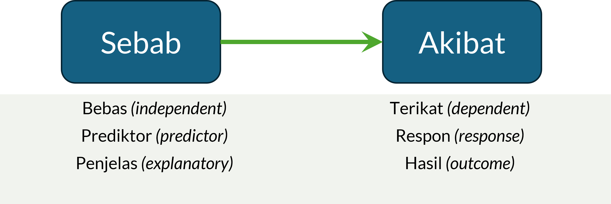

# Kausalitas dengan Regresi Linear Sederhana {#bab-13-regresi-sederhana}

::: rmdcapaian
### Capaian Pembelajaran {.unnumbered}

Setelah mempelajari bab ini, Anda diharapkan:

1. Mampu membedakan korelasi dan kausalitas dengan tepat [STP-12.1]{.capaian}
2. Mampu menguraikan hubungan antara variabel independen dengan variabel dependennya secara tepat sesuai dengan bentuk persamaan regresi linear sederhana [STP-12.2]{.capaian}
:::

Dalam subbab \@ref(bentuk-asosiasi-sepasang-variabel), kita sudah mempelajari dua bentuk dalam sebuah hubungan antara dua variabel: **korelasi** dan **kausalitas**. Tiga bab sebelumnya membahas korelasi antara dua variabel. Mulai bab ini, kita akan bergeser pada pembahasan mengenai **kausalitas** antara dua variabel.

## Apa yang Menentukan Sebuah Hubungan adalah Kausalitas?

Pada subbab \@ref(bentuk-asosiasi-sepasang-variabel) kita sudah membahas dasar dari perbedaan antara korelasi dan kausalitas. Di sana ditekankan bahwa *"korelasi belum tentu adalah sebuah kausalitas."* Jadi, apa yang menentukan sebuah hubungan antara dua variabel adalah kausalitas?

Jawaban dari pertanyaan ini adalah **kondisi prasyarat** yang harus dipenuhi sebuah hubungan agar dapat dikatakan bersifat kausalitas [@ewing2020basic]. Ada empat hal dalam kondisi prasyarat tersebut, yaitu:

1. **Plausibilitas Konseptual** (*Conceptual Plausibility*). Kondisi ini menyatakan bahwa harus ada teori atau dasar konseptual yang mendukung hubungan antara **variabel yang menjadi penyebab** dan **variabel yang menjadi akibat**. Hubungan tersebut harus **masuk akal secara ilmiah** dan sesuai dengan kerangka teori yang relevan.
2. **Asosiasi Kuat** (*Strong Association*). Hubungan pengaruh antarvariabel harus menunjukkan korelasi yang cukup kuat dan signifikan secara statistik. Semakin tinggi korelasi, semakin besar kemungkinan bahwa hubungan tersebut bersifat kausal.
3. **Urutan Waktu** (*Time Sequence*). **Variabel penyebab harus mendahului variabel akibat** dalam urutan waktu. Artinya, perubahan pada variabel penyebab harus terjadi sebelum perubahan pada variabel akibat.
4. **Eliminasi Alternatif Penjelasan** (*Elimination of Alternative Explanations*). Semua faktor pengganggu, atau **variabel antara** (*confounding variables*), yang dapat menjelaskan hubungan tersebut harus dikendalikan. Hal ini dapat dilakukan dengan menambahkan variabel kontrol dalam model statistik, membuat kelompok yang sebanding, menetapkan batasan konteks penelitian, randomisasi, dan menggunakan instrumen atau prosedur yang konsisten agar hubungan yang diamati benar-benar mencerminkan pengaruh dari variabel penyebab.
   
Jadi, untuk menyimpulkan adanya hubungan kausal, kita harus bisa **membuktikan seluruh kondisi prasyarat tersebut terpenuhi**. Pembuktian ini dilakukan dengan **menggabungkan logika teori, bukti statistik, urutan waktu yang jelas, dan pengendalian variabel luar**. Pendekatan ini membantu memastikan bahwa hasil penelitian tidak hanya menunjukkan korelasi, tetapi **benar-benar mencerminkan mekanisme sebab-akibat** yang dapat dipertanggungjawabkan secara ilmiah.

## Pemakaian Analisis Kausalitas dalam Konteks Perencanaan Wilayah dan Kota

Analisis kausalitas dapat digunakan dalam berbagai kasus perencanaan wilayah dan kota, di antaranya:

1. **Memahami variabel kunci dalam suatu konteks.** Analisis kausalitas memungkinkan perencana untuk mampu menyimpulkan hubungan suatu variabel dengan variabel lainnya. Hubungan variabel ini akan menunjukkan pola perubahan variabel oleh variabel kunci yang mempengaruhinya.
2. **Melakukan prediksi**. Analisis kausalitas dapat digunakan untuk memperkirakan nilai suatu variabel berdasarkan nilai variabel-variabel kuncinya sehingga dapat menjadi dasar intervensi ataupun antisipasi terhadap kondisi yang akan datang.
3. **Melakukan eksperimen**. Analisis asosiasi dapat digunakan untuk melakukan penyelidikan lebih lanjut terhadap suatu variabel dalam sistem yang terkontrol. Hal ini juga dapat dilakukan sebagai dasar berbagai penelitian lanjutan yang dapat memperkaya pengetahuan.
4. **Melakukan identifikasi variabel pengganti**. Analisis asosiasi dapat digunakan sebagai dasar untuk memilih suatu variabel sebagai ganti dari variabel lain.

::: rmdkasus

### Studi Kasus Pemakaian Analisis Kausalitas dalam Konteks PWK {.unnumbered}

Sesuai dengan pembahasan hal-hal yang dapat dilakukan dengan analisis kausalitas dalam bidang PWK, berikut adalah beberapa contoh kasus yang dapat dipecahkan dengan analisis kausalitas:

1. **Memahami variabel kunci dalam suatu konteks**
   a. faktor-faktor yang memengaruhi perilaku masyarakat membuang sampah di tempat sampah
   b. faktor-faktor yang memengaruhi tingkat partisipasi masyarakat dalam kegiatan musyawarah perencanaan pembangunan (musrenbang)
   c. variabel kunci dalam fenomena migrasi penduduk di Provinsi Lampung

2. **Melakukan prediksi**
   a. perubahan luas lahan pertanian berdasarkan variabel jumlah penduduk dan PDRB
   b. nilai investasi daerah berdasarkan variabel inflasi dan jumlah UMKM
   c. ketinggian muka genangan air laut berdasarkan variabel suhu harian rata-rata dan kecepatan angin

3. **Melakukan eksperimen**
   a. identifikasi pengaruh jenis kelamin penduduk terhadap pemilihan moda transportasi publik
   b. pengaruh tarif PDAM terhadap tingkat pemakaian air rumah tangga
   c. pengaruh tingkat pendidikan terhadap ketahanan masyarakat pesisir terhadap perubahan iklim

4. **Melakukan identifikasi variabel pengganti**. Apabila diketahui bahwa masyarakat membutuhkan ruang untuk berkumpul, sementara lahan yang tersedia sangat terbatas, apakah ada alternatif pengganti ketersediaan ruang terbuka hijau (RTH) bagi masyarakat?

:::

## Mengenal Model

Model adalah **representasi sederhana dari kenyataan yang kompleks**. Dalam konteks analisis kausalitas,fenomena yang ada di sekitar kita sangat rumit dan terdiri atas banyak sekali variabel yang saling berhubungan, bahkan saling memengaruhi. Agar kita dapat lebih mudah memahami dan menjelaskan suatu fenomena, maka kita mengambil **sebagian** variabel-variabel yang berkaitan tersebut sebagai "perwakilan" (ingat bahwa makna "representasi" = "wakil") untuk menyederhanakan penjelasan fenomena yang kompleks tersebut. Pembuatan model juga dilakukan agar peneliti dapat menjelaskan fenomena secara lebih sistematis dan terukur.

Berdasarkan sifatnya, model dapat dibagi menjadi **model konseptual**, **matematis**, dan **statistik**

- Model konseptual menggambarkan hubungan logis antarvariabel berdasarkan teori atau konsep yang mendasari penelitian.
- Model matematis menyatakan hubungan tersebut dalam bentuk persamaan matematis.
- Model statistik adalah model matematis yang melibatkan unsur ketidakpastian dan data empiris, misalnya model regresi.

Salah satu bentuk model statistik yang paling umum digunakan dalam analisis data kuantitatif adalah **model regresi linear**. Model ini digunakan untuk menggambarkan hubungan antara **satu (atau lebih) variabel yang menjadi penyebab** dengan **satu variabel yang menjadi akibat**.

```{r fig-variabel-sebab-akibat, echo=FALSE, fig.cap="Variabel sebab, akibat, dan nama-nama lainnya"}

```

Dalam banyak literatur statistik, istilah kedua variabel ini bermacam-macam (Gambar \@ref(fig:fig-variabel-sebab-akibat)). Misalnya, variabel yang menjadi penyebab disebut sebagai **variabel bebas** atau *independent variable* dalam bahasa Inggris, dan variabel yang menjadi akibat disebut sebagai **variabel terikat** atau *dependent variable*. Selain itu, variabel bebas juga sering disebut sebagai **variabel prediktor** atau *predictor variable*, sedangkan variabel terikat juga sering disebut sebagai **variabel respon** atau *response variable*. Ada juga yang menyebut variabel bebas sebagai **variabel penjelas** (*explanatory variable*) dan variabel terikat sebagai **variabel hasil** (*outcome variable*).

Model regresi linear berfungsi sebagai alat untuk **memodelkan, menganalisis, dan memprediksi hubungan antara variabel-variabel yang diamati**. Model ini juga merupakan alat kita memahami **arah** dan **kekuatan pengaruh** dari variabel independen terhadap variabel dependen, serta menilai sejauh mana model mampu menjelaskan variasi data yang terjadi di lapangan dengan baik.
