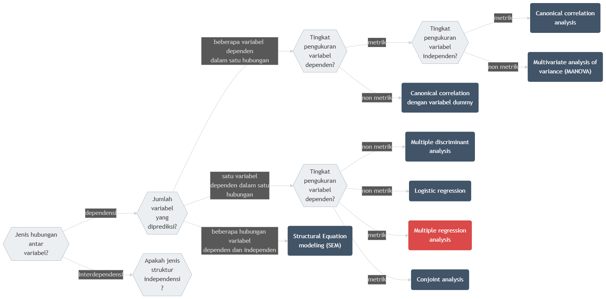

# Kausalitas dengan Regresi Linear Berganda {#bab-regresi-berganda}

::: rmdcapaian

### Capaian Pembelajaran {-}

Setelah mempelajari bab ini, Anda diharapkan mampu:

1. menyebutkan perbedaan analisis regresi linear berganda dengan analisis regresi linear sederhana [STP-13.1]{.capaian}
2. menguraikan hubungan antara variabel independen dengan variabel dependennya secara tepat dalam sebuah persamaan regresi linear berganda [STP-13.2]{.capaian}

:::

## Jenis-jenis Asosiasi Multivariat

Kita sudah mempelajari hubungan antara 1 variabel dependen dan 1 variabel independen pada bab sebelumnya. Namun, pada kenyataannya, bentuk hubungan antarvariabel tidak selalu sesederhana itu. Hubungan antarvariabel bisa berupa **asosiasi multivariat** yang melibatkan **lebih dari 2 variabel**.

Terdapat dua kelompok besar asosiasi multivariat: **interdependensi** dan **dependensi**. interdependensi adalah jenis asosiasi yang **tidak memiliki hubungan ketergantungan antara variabel-variabel yang dianalisis**. Sebaliknya, dependensi adalah jenis asosiasi yang **memiliki hubungan ketergantungan antara variabel-variabel yang dianalisis**. Yang dimaksud dengan "ketergantungan" adalah hubungan *memengaruhi-dipengaruhi* seperti yang sudah kalian pelajari dalam analisis hubungan regresi linear sederhana. Diagram berikut menunjukkan bagaimana semua teknik analisis multivariat dikelompokkan berdasarkan kedua jenis asosiasi tersebut.

```{r diagram-asosiasi-multivariat, echo=FALSE, message=FALSE, fig.align='center', fig.cap="Diagram Pohon Keputusan Asosiasi Multivariat"}

```

Pada jalur dependensi, langkah pertama adalah melihat jumlah variabel dependen yang ingin dianalisis. Jika hanya terdapat satu variabel dependen, maka teknik analisis dipilih berdasarkan tingkat pengukuran variabel dependen tersebut. Apabila variabel dependen berskala metrik (interval maupun rasio), maka teknik yang sesuai adalah **regresi linear berganda**, khususnya ketika variabel independen dapat berupa campuran metrik dan non-metrik. Namun apabila variabel dependen berskala non-metrik (nominal atau ordinal), maka analisis yang digunakan dapat berupa ***logistic regression*** untuk data biner, atau ***conjoint analysis*** untuk analisis preferensi dalam konteks pemasaran atau perilaku pilihan.

Jika penelitian melibatkan lebih dari satu variabel dependen dalam satu hubungan analisis, maka peneliti perlu kembali mengidentifikasi tingkat pengukuran dari variabel dependen. Untuk variabel dependen berskala metrik, terdapat dua kemungkinan teknik. Apabila variabel independen bersifat metrik, maka teknik yang direkomendasikan adalah **canonical correlation analysis**, yaitu analisis yang menghubungkan dua set variabel secara simultan. Namun jika variabel independen bersifat non-metrik, maka metode yang tepat adalah **Multivariate Analysis of Variance (MANOVA)**. Sebaliknya, untuk variabel dependen non-metrik, metode yang digunakan adalah **multiple discriminant analysis**, yang bertujuan mengklasifikasikan objek ke dalam kelompok tertentu berdasarkan kombinasi variabel prediktor.

Dalam bab ini kita akan fokus pada salah satu analisis statistik yang menggunakan hubungan dependensi, yaitu **regresi linear berganda**. Untuk salah satu contoh hubungan interdependensi, yakni analisis faktor, akan kita pelajari di bab selanjutnya.

## Perbedaan dengan Regresi Linear Sederhana

Analisis regresi merupakan salah satu metode analisis statistik yang digunakan untuk **memahami hubungan antara variabel dependen (variabel yang diprediksi) dan variabel independen (variabel yang memengaruhi)**. Pada dasarnya, perbedaan utama antara regresi linear sederhana dan regresi linear berganda terletak pada **jumlah variabel independen** yang digunakan dalam pemodelan.

Regresi linear **sederhana** hanya melibatkan **satu variabel independen** untuk menjelaskan atau memprediksi variabel dependen. Model ini digunakan untuk melihat pengaruh satu faktor saja terhadap suatu perubahan pada variabel terikat.

Sementara itu, regresi linear **berganda** digunakan ketika variabel dependen dipengaruhi oleh **lebih dari satu variabel independen**. Model ini memberikan gambaran yang lebih komprehensif karena dapat **menangkap pengaruh simultan dari beberapa faktor terhadap variabel terikat**. Bentuk umum model regresi linear berganda adalah sebagai berikut.

$$
Y = \beta_0 + \beta_1 X_1 + \beta_2 X_2 + ... + \beta_k X_k + \epsilon
(\#eq:bentuk-dasar-regresi-linear-berganda)
$$

dengan:

- $Y$ adalah variabel dependen
- $k$ adalah jumlah variabel independen
- $\beta_0$ adalah intersep
- $\beta_1, \beta_2, ..., \beta_k$ adalah koefisien regresi untuk variabel independen $X_1, X_2, ..., X_k$
- $\epsilon$ adalah galat

Lagi-lagi, karena kita tidak tahu berapa nilai komponen acak, $\epsilon$, maka komponen tersebut jarang ditulis dalam persamaan.

Karena jumlah variabel yang terlibat adalah lebih dari 2, **kemampuan prediksi** variabel dependen dengan model regresi linear berganda akan **lebih baik** dibandingkan dengan model regresi linear sederhana. Akan tetapi, kelebihan kemampuan prediksi tersebut juga mengakibatkan **hubungan yang lebih kompleks antarvariabelnya**. Misalnya adalah **multikolinearitas** yang merupakan hubungan antarvariabel independen dalam persamaan model. Ini menambahkan kompleksitas dalam perumusan dan analisis model regresi linear berganda.

::: rmdkasus

## Studi Kasus: Regresi Linear Sederhana vs Berganda {.unnumbered}

Pada bab sebelumnya, kita sudah mempelajari kasus penerapan regresi linear sederhana untuk memprediksi Indeks Kualitas Udara (IKU) berdasarkan jarak ke taman kota. Pada kasus tersebut, kita menemukan bahwa IKU dapat diprediksi dengan baik menggunakan jarak ke taman kota. Namun, kita juga menyadari bahwa IKU dipengaruhi oleh faktor lain, seperti jarak ke kawasan industri dan tutupan vegetasi. Oleh karena itu, pada kasus ini kita akan mempelajari penerapan regresi linear berganda untuk memprediksi IKU berdasarkan beberapa variabel independen yang menjadi faktor-faktor lain tersebut.

Variabel-variabel independen yang akan kita perhitungkan di antaranya adalah

- jarak ke taman kota (dilambangkan dengan $\text{jarak_taman}$)
- jarak ke kawasan industri ($\text{jarak_industri}$)
- persentase tutupan vegetasi di sekitar lokasi pengamatan ($\text{vegetasi}$)
- zona fungsi lahan (perumahan, komersial, atau industri) ($\text{zona}$)

Jika kita melambangkan variabel dependen dengan $\text{IKU}$, maka persamaan regresi linear berganda yang akan kita gunakan adalah sebagai berikut.

$$
\text{IKU} = \beta_0 + \beta_1 \text{jarak_taman} + \beta_2 \text{jarak_industri} + \beta_3 \text{vegetasi} + \beta_4 \text{zona}
$$

[Makna Konstanta dan Koefisien]{.tajuksaya}

Berdasarkan persamaan tersebut, kita dapat menginterpretasikan konstanta dan koefisien sebagai berikut.

- $\beta_0$ adalah konstanta, yaitu nilai IKU ketika semua variabel independen bernilai 0.
- $\beta_1$ adalah koefisien regresi untuk variabel $\text{jarak_taman}$, yaitu perubahan nilai IKU ketika $\text{jarak_taman}$ bertambah 1 unit, dengan asumsi variabel independen lainnya konstan.
- $\beta_2$ adalah koefisien regresi untuk variabel $\text{jarak_industri}$, yaitu perubahan nilai IKU ketika $\text{jarak_industri}$ bertambah 1 unit, dengan asumsi variabel independen lainnya konstan.
- $\beta_3$ adalah koefisien regresi untuk variabel $\text{vegetasi}$, yaitu perubahan nilai IKU ketika $\text{vegetasi}$ bertambah 1 unit, dengan asumsi variabel independen lainnya konstan.
- $\beta_4$ adalah koefisien regresi untuk variabel $\text{zona}$, yaitu perubahan nilai IKU ketika $\text{zona}$ bertambah 1 unit, dengan asumsi variabel independen lainnya konstan.

Konstanta dan koefisien-koefisien inilah yang akan kita tentukan dalam bab ini.

:::


## Hal-hal Penting yang Perlu Diperhatikan dalam Regresi Linear Berganda

Model regresi linear berganda merupakan pengembangan dari regresi linear sederhana yang digunakan ketika variabel dependen dipengaruhi oleh lebih dari satu variabel independen. Regresi linear berganda melibatkan beberapa variabel independen sekaligus, terdapat dua hal penting yang perlu diperhatikan agar model tetap valid dan dapat diinterpretasikan dengan baik. Pertama, **multikolinearitas** yang merupakan hubungan antarvariabel independen dalam persamaan model. Kedua, ***adjusted R-squared*** yang merupakan ukuran kecocokan model dengan data.

### Hubungan Antarvariabel Independen (Multikolinearitas)

Dalam regresi linear berganda, antarvariabel independen **tidak boleh memiliki hubungan korelatif yang kuat** satu sama lain. Jika terjadi hubungan yang terlalu tinggi antarvariabel independen, kondisi ini disebut **multikolinearitas**. Multikolinearitas menyebabkan informasi yang diberikan menjadi redundan, ini juga berakibat pada model yang tidak dapat memisahkan kontribusi masing-masing variabel, sehingga:

- koefisien regresi menjadi tidak stabil,
- nilai signifikansi (uji t) menjadi tidak akurat,
- interpretasi pengaruh tiap variabel menjadi menyesatkan,
- model tampak baik secara keseluruhan (uji F signifikan), tetapi variabel satu per satu tidak signifikan.

Dalam konteks penelitian perencanaan wilayah dan kota, multikolinearitas perlu dihindari karena banyak fenomena perkotaan memiliki hubungan yang saling berkorelasi. Misalnya, kepadatan penduduk dan kepadatan bangunan sering bergerak dalam arah yang sama sehingga tidak tepat dimasukkan bersamaan tanpa pengecekan diagnostik.

```{r bab14-dataset-regresi-linear-berganda, include=FALSE}
set.seed(42)
n <- 30

# Variabel kontinu
jarak_taman <- round(runif(n, 0.5, 10), 1) # km
jarak_industri <- round(runif(n, 0.5, 8), 1) # km
vegetasi <- round(runif(n, 5, 60), 1) # %

# Variabel kategoris (zona fungsi lahan)
zona <- sample(
    c("Perumahan", "Komersial", "Industri"),
    n,
    replace = TRUE,
    prob = c(0.5, 0.3, 0.2)
)

# Dummy variables
d_komersial <- as.integer(zona == "Komersial")
d_industri <- as.integer(zona == "Industri")

# Generate IKU
iku <- round(
    75
    - 4.5 * jarak_taman
        + 3.0 * jarak_industri
        + 0.4 * vegetasi
        - 5 * d_komersial
        - 12 * d_industri
        + rnorm(n, 0, 4),
    0
)
iku[iku < 0] <- 0
iku[iku > 100] <- 100

df_berganda <- data.frame(
    No             = 1:n,
    jarak_taman    = jarak_taman,
    jarak_industri = jarak_industri,
    vegetasi       = vegetasi,
    zona           = zona,
    iku            = iku
)
```

```{r bab14-dataset-multikolinearitas, include=FALSE}
set.seed(42)
n_mk <- 30

# Buat jarak_taman independen
jarak_taman_mk <- round(runif(n_mk, 0.5, 10), 1)

# jarak_industri dibuat sangat berkorelasi dengan jarak_taman
jarak_industri_mk <- round(8 - 0.85 * jarak_taman_mk + rnorm(n_mk, 0, 0.3), 1)

# vegetasi tetap independen
vegetasi_mk <- round(runif(n_mk, 5, 60), 1)

# Variabel kategoris (zona fungsi lahan)
zona_mk <- sample(
    c("Perumahan", "Komersial", "Industri"),
    n_mk,
    replace = TRUE,
    prob = c(0.5, 0.3, 0.2)
)

# Dummy variables
d_komersial_mk <- as.integer(zona_mk == "Komersial")
d_industri_mk <- as.integer(zona_mk == "Industri")

# Generate IKU dengan formula yang sama
iku_mk <- round(
    75
    - 4.5 * jarak_taman_mk
        + 3.0 * jarak_industri_mk
        + 0.4 * vegetasi_mk
        - 5 * d_komersial_mk
        - 12 * d_industri_mk
        + rnorm(n_mk, 0, 4),
    0
)
iku_mk[iku_mk < 0] <- 0
iku_mk[iku_mk > 100] <- 100

df_mk <- data.frame(
    jarak_taman    = jarak_taman_mk,
    jarak_industri = jarak_industri_mk,
    vegetasi       = vegetasi_mk,
    zona           = zona_mk,
    iku            = iku_mk
)
```

::: rmdkasus

### Studi Kasus: Multikolinearitas {.unnumbered}

Misalkan seorang peneliti mengumpulkan data untuk memodelkan Indeks Kualitas Udara (IKU) menggunakan tiga variabel independen metrik: jarak ke taman kota (`jarak_taman`), jarak ke kawasan industri (`jarak_industri`), dan persentase tutupan vegetasi (`vegetasi`). Sebelum membangun model, peneliti membuat **tabel korelasi silang** untuk memeriksa hubungan antarvariabel independen.

```{r tbl-korelasi-mk, echo=FALSE, message=FALSE}
library(knitr)
library(kableExtra)

# Hitung matriks korelasi hanya untuk variabel independen metrik
mat_kor <- df_mk[, c("jarak_taman", "jarak_industri", "vegetasi")] |>
    cor() |>
    round(2)

# Beri nama kolom dan baris yang lebih rapi
kolom_nama <- c("Jarak Taman", "Jarak Industri", "Vegetasi")
colnames(mat_kor) <- kolom_nama
rownames(mat_kor) <- kolom_nama

tbl_out <- kbl(
    mat_kor,
    caption = "Matriks Korelasi Antarvariabel Independen",
    format.args = list(big.mark = ".", decimal.mark = ","),
    escape = FALSE
) |>
    kable_styling(
        bootstrap_options = c("striped", "hover"),
        full_width        = FALSE,
        latex_options = if (knitr::is_latex_output()) "HOLD_position" else c("striped", "hover")
    )

if (knitr::is_html_output()) {
    tbl_out <- tbl_out |> scroll_box(width = "100%", box_css = "border: 0px;")
}
tbl_out
```

Hasil tabel di atas menunjukkan bahwa `jarak_taman` dan `jarak_industri` memiliki nilai korelasi `r round(cor(df_mk$jarak_taman, df_mk$jarak_industri), 2)`, yang mendekati −1. Ini merupakan tanda **multikolinearitas yang serius**: kedua variabel membawa informasi yang hampir identik (berlawanan arah), sehingga model tidak mampu memisahkan kontribusi masing-masing terhadap IKU. Sebaliknya, `vegetasi` berkorelasi rendah dengan kedua variabel lainnya, sehingga tidak menimbulkan masalah. Dalam situasi seperti ini, peneliti harus memilih salah satu dari `jarak_taman` atau `jarak_industri` untuk dimasukkan ke dalam model, atau menggabungkannya menjadi satu indeks komposit.

:::

Selain mengamatinya melalui tabel korelasi silang, adanya multikolinearitas juga dapat dideteksi melalui nilai **Variance Inflation Factor (VIF)**. VIF mengukur seberapa besar varians dari koefisien regresi meningkat akibat adanya multikolinearitas. Nilai VIF yang tinggi menunjukkan adanya multikolinearitas yang serius. Umumnya, nilai VIF > 10 dianggap sebagai indikator multikolinearitas yang serius.


::: rmdkasus

### Studi Kasus: Deteksi Multikolinearitas dengan VIF {.unnumbered}

Indikasi multikolinearitas pada ketiga variabel independen metrik di atas juga dapat dipastikan melalui nilai VIF. Berikut adalah hasil perhitungan VIF untuk `jarak_taman`, `jarak_industri`, dan `vegetasi`.

```{r tbl-vif-mk, echo=FALSE, message=FALSE, warning=FALSE}
library(knitr)
library(kableExtra)
library(car)

# Model regresi dengan variabel metrik saja untuk cek VIF
model_mk <- lm(iku ~ jarak_taman + jarak_industri + vegetasi, data = df_mk)
nilai_vif <- vif(model_mk)

# Buat dataframe untuk tabel
df_vif <- data.frame(
    Variabel = c("Jarak Taman", "Jarak Industri", "Vegetasi"),
    VIF = unname(nilai_vif)[1:3]
)

tbl_vif <- kbl(
    df_vif,
    caption = "Nilai Variance Inflation Factor (VIF)",
    digits = 2,
    format.args = list(big.mark = ".", decimal.mark = ","),
    align = c("l", "c")
) |>
    kable_styling(
        bootstrap_options = c("striped", "hover"),
        full_width        = FALSE,
        latex_options     = c("HOLD_position")
    )

if (knitr::is_html_output()) {
    tbl_vif <- tbl_vif |> scroll_box(width = "100%", box_css = "border: 0px;")
}
tbl_vif
```

Variabel `jarak_taman` dan `jarak_industri` memiliki nilai VIF jauh melampaui ambang batas 10. Nilai ini menegaskan keberadaan multikolinearitas, karena informasi kedua variabel tersebut saling tumpang tindih berlebihan jika dimasukkan serentak ke dalam model. Sebaliknya, variabel `vegetasi` memiliki nilai VIF mendekati 1, yang menandakan variabel tersebut bebas dari masalah multikolinearitas dengan variabel lainnya.

:::


### Variabel independen bertingkat pengukuran nonmetrik (variabel *dummy*)

Dalam beberapa kasus, **variabel independen** yang digunakan dalam model regresi **tidak selalu berbentuk data numerik**. Variabel yang bersifat kategorik, yakni variabel nominal atau ordinal, dapat digunakan sebagai variabel independen dalam model regresi. Akan tetapi, variabel tersebut perlu diubah terlebih dahulu menjadi **variabel *dummy***. Variabel *dummy* adalah variabel **yang hanya memiliki nilai 0 dan 1**. Nilai 0 menunjukkan variabel tersebut bernilai "tidak" atau "salah", sedangkan nilai 1 menunjukkan variabel tersebut bernilai "ya" atau "benar". Proses ini memungkinkan variabel kategorik untuk diolah dalam model regresi sehingga pengaruhnya terhadap variabel dependen tetap dapat dianalisis secara kuantitatif.

Perhatikan kasus berikut untuk memahami bagaimana variabel *dummy* bekerja.

::: rmdkasus

### Studi Kasus: Variabel *Dummy* {.unnumbered}

Dalam kasus sebelumnya, kita melibatkan satu variabel nominal, yakni $\text{zona}$ yang terdiri atas tiga kategori: **Perumahan**, **Komersial**, dan **Industri**. Untuk dapat memasukkan variabel ini ke dalam model regresi, kita perlu mengubahnya menjadi variabel *dummy*. Proses pembentukan variabel dummy adalah sebagai berikut.

Karena variabel $\text{zona}$ memiliki tiga kategori, kita pertama-tama akan membuat tiga variabel baru berdasarkan masing-masing kategori. Kita misalkan variabel tersebut adalah $D_{\text{Perumahan}}$, $D_{\text{Komersial}}$, dan $D_{\text{Industri}}$. Nilainya diisi dengan 1 jika observasi benar berada pada kategori tersebut, dan 0 jika salah.

Berikut adalah tabel ilustrasi nilai ketiga variabel baru tersebut. Kategori **Industri** diletakkan di baris paling bawah sebagai **kategori referensi**. Oleh karena itu, variabel $D_{\text{Industri}}$ juga ditempatkan di kolom paling kanan.

```{r tbl-dummy-3-kategori, echo=FALSE, message=FALSE}
library(knitr)
library(kableExtra)

df_dummy3 <- data.frame(
    Kategori = c("Perumahan", "Komersial", "Industri"),
    D_Perumahan = c(1, 0, 0),
    D_Komersial = c(0, 1, 0),
    D_Industri = c(0, 0, 1)
)

kbl(
    df_dummy3,
    col.names = c(
        "Kategori",
        "$D_{\\text{Perumahan}}$",
        "$D_{\\text{Komersial}}$",
        "$D_{\\text{Industri}}$"
    ),
    align = "c",
    escape = FALSE,
    caption = "Variabel Baru untuk 3 Kategori"
) |>
    kable_styling(
        bootstrap_options = c("striped", "hover"),
        latex_options = if (knitr::is_latex_output()) "HOLD_position" else c("striped", "hover"),
        full_width = FALSE
    )
```

Mari kita pusatkan pembahasan pada dua kolom variabel pertama, yakni $D_{\text{Perumahan}}$ dan $D_{\text{Komersial}}$. Pada baris terakhir (kategori Industri), nilai pada dua variabel tesebut adalah nol secara bersamaan. Ini berarti, ketika sebuah observasi bernilai 0 baik pada variabel $D_{\text{Perumahan}}$ maupun $D_{\text{Komersial}}$, kita sudah bisa memastikan bahwa observasi tersebut memuat nilai 1 pada $D_{\text{Industri}}$--yang artinya masuk ke kategori Industri. Kombinasi unik pada dua variabel *dummy* pertama ini menunjukkan bahwa informasi keberadaan kategori Industri sudah tercakup di dua variabel pertamanya, sehingga variabel ketiga ($D_{\text{Industri}}$) menjadi **redundan** dan tidak lagi kita perlukan.

Prinsip ini menegaskan bahwa **jumlah variabel *dummy* yang akan kita masukkan untuk suatu variabel kategoris akan selalu sebanyak $k-1$**, dengan $k$ merupakan total jumlah kategori.

Sebagai penekanan, mari kita lihat apa yang terjadi jika kita memiliki empat kategori, misalnya ditambahkan kategori **Taman**. Jika kita juga menjadikan Taman sebagai kategori referensi, ilustrasinya adalah sebagai berikut.

```{r tbl-dummy-4-kategori, echo=FALSE, message=FALSE}
df_dummy4 <- data.frame(
    Kategori = c("Perumahan", "Komersial", "Industri", "Taman"),
    D_Perumahan = c(1, 0, 0, 0),
    D_Komersial = c(0, 1, 0, 0),
    D_Industri = c(0, 0, 1, 0),
    D_Taman = c(0, 0, 0, 1)
)

kbl(
    df_dummy4,
    col.names = c(
        "Kategori",
        "$D_{\\text{Perumahan}}$",
        "$D_{\\text{Komersial}}$",
        "$D_{\\text{Industri}}$",
        "$D_{\\text{Taman}}$"
    ),
    align = "c",
    escape = FALSE,
    caption = "Variabel Baru untuk 4 Kategori"
) |>
    kable_styling(
        bootstrap_options = c("striped", "hover"),
        latex_options = if (knitr::is_latex_output()) "HOLD_position" else c("striped", "hover"),
        full_width = FALSE
    )
```

Pada baris kategori Taman, kita mendapati bahwa nilainya adalah 0 secara keseluruhan pada ketiga variabel *dummy* yang lain. Informasi "bukan Perumahan, bukan Komersial, dan bukan Industri" sudah cukup untuk menyimpulkan secara mutlak bahwa observasi tersebut termasuk Taman tanpa perlu adanya variabel $D_{\text{Taman}}$. Praktik menyembunyikan variabel kategori referensi inilah yang menyebabkan kita hanya akan mendapati variabel *dummy* masuk ke dalam model regresi berganda sebanyak satu unit lebih sedikit daripada jumlah kategori semula.

[Kaitan dengan Persamaan Regresi]{.tajuksaya}

Dengan diubahnya variabel kategorik $\text{zona}$ menjadi variabel *dummy*, maka persamaan regresi berganda yang akan kita gunakan adalah sebagai berikut.

$$
\begin{aligned}
IKU = &\beta_0 + \beta_1 D_{\text{Perumahan}} + \beta_2 D_{\text{Komersial}} + \beta_3 \text{jarak_taman} + \\
&\beta_4 \text{jarak_industri} + \beta_5 \text{vegetasi}
\end{aligned}
$$

Dengan interpretasi koefisien dan konstanta sebagai berikut:

1. **Konstanta** ($\beta_0$): nilai IKU ketika semua variabel independen bernilai 0. Dalam kasus ini, konstanta menunjukkan nilai IKU pada zona Industri dengan jarak taman 0 km dan jarak industri 0 km, serta vegetasi 0%. 
2. **Koefisien** ($\beta_1$): perubahan nilai IKU ketika variabel $D_{\text{Perumahan}}$ bernilai 1 (observasi berada di zona Perumahan) dibandingkan dengan kategori referensi (zona Industri). 
3. **Koefisien** ($\beta_2$): perubahan nilai IKU ketika variabel $D_{\text{Komersial}}$ bernilai 1 (observasi berada di zona Komersial) dibandingkan dengan kategori referensi (zona Industri). 
4. **Koefisien** ($\beta_3$): perubahan nilai IKU ketika jarak taman bertambah 1 km, dengan asumsi zona Perumahan dan Komersial bernilai 0 (observasi berada di zona Industri). 
5. **Koefisien** ($\beta_4$): perubahan nilai IKU ketika jarak industri bertambah 1 km, dengan asumsi zona Perumahan dan Komersial bernilai 0 (observasi berada di zona Industri). 
6. **Koefisien** ($\beta_5$): perubahan nilai IKU ketika vegetasi bertambah 1%, dengan asumsi zona Perumahan dan Komersial bernilai 0 (observasi berada di zona Industri). 

:::

Dari kasus tersebut, kita dapat menyimpulkan bahwa **variabel kategorik akan menjadi variabel *dummy* dengan jumlah $k-1$**, dengan $k$ merupakan total jumlah kategori variabel tersebut. Setiap variabel *dummy* tersebut akan memiliki koefisiennya masing-masing yang menunjukkan pengaruhnya terhadap variabel dependen. Adapun kategori yang tidak memiliki variabel *dummy* disebut sebagai **kategori referensi**.

## Mencari Koefisien Variabel Independen Regresi Linear Berganda

Untuk persamaan regresi linear sederhana, rumus untuk menghitung koefisien variabel independen adalah seperti yang ditunjukkan pada Persamaan \@ref(eq:rumus-koefisien-regresi-linear) yang ditulis ulang sebagai berikut.

$$
b = \frac{\sum^{n}_{i=1}(X_i - \bar{X})(Y_i - \bar{Y})}{\sum^{n}_{i=1}(X_i - \bar{X})^2}
$$

Rumus tersebut menghitung selisih antara nilai variabel independen dengan nilai rata-ratanya, kemudian dikalikan dengan selisih antara nilai variabel dependen dengan nilai rata-ratanya. Hasilnya kemudian dibagi dengan selisih antara nilai variabel independen dengan nilai rata-ratanya, kemudian dikuadratkan. Ini hanya bisa dilakukan pada 2 variabel saja: satu variabel independen dan satu variabel dependen. Untuk yang lebih dari 2 variabel, kita perlu menggunakan rumus yang lebih kompleks, yaitu seperti yang ditunjukkan pada Persamaan \@ref(eq:rumus-koefisien-regresi-linear) [@chan2021introduction].

$$
\mathbf{b} = (\mathbf{X}^T \mathbf{X})^{-1} \mathbf{X}^T \mathbf{y}
(\#eq:rumus-koefisien-regresi-linear-berganda)
$$

Penjelasan dari rumus tersebut adalah sebagai berikut:

- $\mathbf{b}$ adalah vektor koefisien regresi
- $\mathbf{X}$ adalah matriks variabel independen
- $\mathbf{y}$ adalah vektor variabel dependen

Rumus tersebut tidak akan dibahas terlalu dalam di buku ini karena buku ini fokus kepada penggunaan praktis dari alat-alat analisis statistik ke dalam kasus-kasus perencanaan alih-alih pembahasan matematisnya. Secara praktis, di sinilah peran perangkat lunak statistik seperti R, SPSS, atau Stata menjadi sangat penting.

## Diagnosis Model Regresi Linear Berganda

Ketika kita menggunakan lebih dari satu variabel independen, kita bisa menghasilkan beberapa alternatif model regresi. Dengan demikian, persoalannya sekarang bukan lagi sekadar bagaimana menghasilkan persamaan regresi, tetapi juga bagaimana memastikan bahwa **model yang dibangun merupakan model terbaik (*best-fit model*)** dari beberapa alternatif model yang mungkin. Diagnosis model dilakukan untuk memilih model yang paling sesuai berdasarkan keseimbangan antara **kualitas prediksi**, **signifikansi model dan variabel independen**, dan **kesederhanaan model (*parsimony*)**.

### Uji Asumsi Klasik

Sama seperti halnya regresi linear sederhana, regresi linear berganda juga menerapkan uji asumsi klasik sebelum menganalisis model secara lebih lanjut. Uji-uji tersebut meliputi:

1. **Linearitas**, memastikan tidak ada pola melengkung pada model, diperiksa menggunakan plot *Residuals vs Fitted*.
2. **Normalitas Residual**, memastikan galat terdistribusi normal, diuji menggunakan uji Shapiro-Wilk. Galat dikatakan terdistribusi normal jika *p-value* > 0,05.
3. **Non-Multikolinearitas**, memastikan tidak ada korelasi berlebih antarvariabel independen, dipastikan lewat nilai *Variance Inflation Factor* (VIF) yang lebih kecil dari 10.
4. **Homoskedastisitas**, memastikan varians galat konstan, diperiksa lewat plot *Residuals vs Fitted* atau Galat vs Prediksi.
5. **Non-Autokorelasi**, memastikan galat antarobservasi saling bebas. Ini umumnya terpenuhi pada data silang tempat (*cross-section*), atau dapat diuji dengan uji Durbin-Watson. Nilai Durbin-Watson dikatakan tidak ada autokorelasi jika 1,5 < DW < 2,5.

### Kualitas Prediksi (Koefisien Determinasi)

Tingkat kualitas prediksi model diukur dengan menggunakan nilai **koefisien determinasi** atau ***R-squared***, atau dalam konteks regresi linear berganda, menggunakan ***Adjusted R-squared***.

Nilai *R-squared* pada dasarnya akan selalu meningkat ketika jumlah variabel independen dalam model bertambah. Hal ini karena penambahan variabel independen akan selalu meningkatkan kemampuan model untuk menjelaskan variasi dalam variabel dependen, meskipun variabel independen tersebut tidak memiliki hubungan yang signifikan dengan variabel dependen. Dengan demikian, agar lebih objektif, nilai R-squared tersebut disesuaikan (adjusted) dengan jumlah variabel independen dan ukuran sampel sehingga menjadi ***Adjusted R-squared***. Oleh karena inilah kita menggunakan nilai *adjusted R-squared* ketika membandingkan kualitas sejumlah model.

### Signifikansi Model dan Variabel Independen (Uji F dan Uji t)

Uji ini sama persis dengan yang sudah dibahas pada subbab \@ref(signifikansi-model), yakni menilai **keberartian hubungan pengaruh antara variabel independen dengan variabel dependennya**. Perbedaannya terletak pada **jumlah variabel independen** yang diuji. Pada regresi linear sederhana, kita hanya menguji satu variabel independen, sedangkan pada regresi linear berganda, kita menguji lebih dari satu variabel independen.

Oleh karena pada regresi linear sederhana kita hanya menggunakan satu variabel independen, maka uji signifikansi model sama saja dengan uji signifikansi variabel independennya. Namun, pada regresi linear berganda, kita perlu melakukan kedua uji tersebut secara terpisah.

Uji signifikansi variabel menggunakan nilai uji statistik t, yakni pengujian hipotesis yang hipotesis kosongnya adalah **"koefisien variabel sama dengan nol secara statistik"**. Dalam berbagai perangkat lunak statistik, uji ini biasanya dilaporkan dalam bentuk *p-value*, yaitu probabilitas untuk mendapatkan nilai uji statistik t sebesar itu atau lebih ekstrem jika hipotesis kosong benar. Jika nilai ***p-value* lebih kecil dari tingkat signifikansi yang ditentukan** (misalnya 0,05), maka **hipotesis kosong ditolak**, yang berarti **variabel tersebut signifikan secara statistik**. Sebaliknya, jika nilai *p-value* lebih besar dari tingkat signifikansi, maka **hipotesis kosong diterima**, yang berarti **variabel tersebut tidak signifikan secara statistik**.

### Kesederhanaan Model (*Parsimony*)

@ewing2020basic menyatakan bahwa model yang dipilih harus mengedepankan prinsip kesederhanaan model atau yang disebut juga *parsimony*, yakni kemampuan menjelaskan variabel dependen dengan variabel independen secukupnya tanpa menambah kompleksitas yang tidak perlu. Untuk mencapai model seperti ini, kita memerlukan perbandingan nilai-nilai koefisien determinasi yang sudah disesuaikan (*adjusted R-squared*) dari model-model yang ditinjau. Apabila menambahkan variabel hanya meningkatkan sedikit sekali nilai koefisien determinasi yang sudah disesuaikan (*adjusted R-squared*), maka variabel tersebut sebaiknya tidak dimasukkan ke dalam model.

Untuk merealisasikan prinsip ***parsimony*** secara objektif, salah satu metode pencarian sekuensial yang sangat direkomendasikan adalah **metode *stepwise***. Metode ini secara iteratif **menyeleksi dan mengeliminasi** variabel independen dari dalam persamaan regresi berdasarkan **nilai uji F parsial**. Pada prosesnya, *stepwise* akan **memasukkan variabel baru** yang menyumbangkan akurasi prediksi signifikan, sekaligus **mengevaluasi ulang** variabel-variabel yang sudah lebih dahulu ada di dalam model. Jika ada variabel lama yang informasinya menjadi **tumpang tindih** dan **kehilangan signifikansi** akibat penambahan tersebut, **variabel lama itu akan dibuang**. Mekanisme seleksi ketat ini menjamin bahwa model akhir **hanya memuat variabel-variabel paling esensial** tanpa risiko ***overfitting***, sehingga keseimbangan antara **kesederhanaan model** dan **kebaikan suai (*goodness-of-fit*)** dapat tercapai secara maksimal.

::: rmdkasus

### Studi Kasus: Evaluasi dan Pemilihan Model Parsimoni {.unnumbered}

Mari kita aplikasikan prinsip evaluasi dan seleksi *stepwise* pada *dataset* kasus multikolinearitas yang sebelumnya telah kita singgung. Pertama-tama, kita buat model regresi penuh (*full model*) yang memasukkan seluruh variabel independen ke dalam persamaan.

```{r bab14-model-penuh-evaluasi, echo=TRUE}
# Membuat model regresi dengan seluruh variabel
model_mk_penuh <- lm(
    iku ~ jarak_taman + jarak_industri + vegetasi + zona,
    data = df_mk
)

# Menampilkan ringkasan model
summary(model_mk_penuh)
```

Jika dicermati pada *output* model penuh, nilai *p-value* untuk variabel `jarak_industri` adalah 0,471 (jauh lebih besar dari batas kekeliruan 0,05). Hal ini berarti secara parsial variabel tersebut **tidak mencapai signifikansi statistik**. Padahal, uji keseluruhan model sangat signifikan dengan F-statistik sebesar 137,2 (*p-value* < 0,05) dan memiliki nilai *adjusted R-squared* sebesar 0,9591. Inilah dampak nyata dari multikolinearitas: model tampak sukses secara keseluruhan, namun variabel yang saling bertumpang-tindih di dalamnya menjadi gagal menunjukkan nilai prediksinya yang sebenarnya.

Untuk menanggulangi penumpukan variabel redundan tersebut dan mencari model yang paling parsimoni, kita menggunakan fungsi `step()` di R sebagai implementasi mekanisme *stepwise*.

```{r bab14-model-stepwise-evaluasi, echo=TRUE}
# Melakukan seleksi stepwise
model_mk_stepwise <- step(
    model_mk_penuh,
    direction = "both", trace = 0
)

# Menampilkan ringkasan model parsimoni
summary(model_mk_stepwise)
```

Metode *stepwise* mengevaluasi setiap variabel berdasarkan uji kontribusi dan otomatis mengeliminasi `jarak_industri` dari model baru. Perhatikan tiga perubahan positif pada *output* model parsimoni yang kita capai:

1.  **Signifikansi Variabel Independen**: Seluruh variabel tersisa kini secara individu terbukti **signifikan** (*p-value* pada setiap koefisien regresi < 0,05).
2.  **Kualitas Prediksi**: Nilai *adjusted R-squared* model **meningkat** menjadi 0,9599 dari yang semula hanya 0,9591. Meskipun jumlah variabel berkurang, metrik ini membuktikan bahwa penyesuaian yang kita lakukan telah membuat model ini justru memprediksi lebih baik dan efisien atas data kita.
3.  **Signifikansi Model Secara Keseluruhan**: Nilai F-statistik melonjak tajam dari 137,2 menjadi 174,6, yang berarti keberartian (signifikansi) dan keandalan model baru jauh melampaui kemampuan model pertama.

Demonstrasi tersebut membuktikan secara konklusif bahwa pembuangan variabel-variabel tumpang tindih secara efektif akan meningkatkan kemurnian dan performa model sembari memastikannya tetap representatif dan *parsimoni* (*Occam's razor*).

:::


::: rmdexercise

## Soal Evaluasi 15 {-}

1. [STP-13.1]{.capaian} Sebuah penelitian ingin mengetahui hubungan kausal antara Tingkat Penggunaan Transportasi Umum dengan sejumlah variabel. Peneliti pertama menghasilkan persamaan model seperti berikut.
   
   $$Y = 11{,}2 + 0{,}7X_1$$

   dengan $X_1$ adalah variabel kepadatan penduduk, dalam jiwa/hektar, dan $Y$ adalah tingkat penggunaan transportasi umum, dalam nilai 0-100.

   Peneliti kedua menghasilkan persamaan model seperti berikut.

   $$Y = 12{,}5 + 0{,}45X_1 + 0{,}30X_2 - 0{,}25X_3$$

   dengan keterangan nilai:

   - $Y$, tingkat penggunaan transportasi umum, nilai 0-100,
   - $X_1$, kepadatan penduduk, dalam jiwa/hektar,
   - $X_2$, aksesibilitas transportasi, nilai kemudahan akses dari permukiman ke halte bus terdekat, dalam menit,
   - $X_3$, kualitas ruang terbuka hijau, nilai kemudahan akses dari permukiman ke ruang terbuka hijau terdekat, dalam menit.

   Ulaslah perbedaan antara model yang digunakan oleh peneliti pertama dengan peneliti kedua. *Petunjuk: mulai dari menyebutkan nama model yang digunakan oleh kedua peneliti dan dari situ tuliskan apa perbedaan keduanya.*   

2. [STP-13.2]{.capaian} Uraikan hubungan antara variabel dependen dan independen dari persamaan model yang dihasilkan peneliti kedua di soal nomor (1) sebelumnya. *Petunjuk: ulas berapa perubahan variabel dependen jika satu unit perubahan variabel independen terjadi.*

:::

