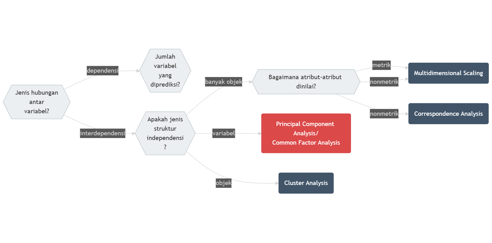

# Analisis Statistik Multivariat Interdependensi: Analisis Komponen Prinsip dan Analisis Faktor

::: rmdcapaian

### Capaian Pembelajaran {-}

Setelah mempelajari bab ini Anda diharapkan:

1. mampu menjelaskan kegunaan dan asumsi pendahuluan untuk melakukan analisis komponen prinsip dan analisis faktor [STP-14.1]{.capaian}
2. mampu menginterpretasikan hasil analisis komponen prinsip/analisis faktor dengan benar [STP-14.2]{.capaian}

:::

## Konsep Dasar

**Analisis komponen prinsip (*principal component analysis*, PCA)** dan **Analisis Faktor (*common factor analysis*)** adalah metode analisis statistik multivariat lain yang berguna untuk **mengurangi jumlah variabel yang dianalisis dengan meringkasnya**.

::: rmdnote

[Istilah "Dimensi"]{.tajuksaya}

Istilah “variabel” memiliki sebutan lain yakni **dimensi (*dimension*)**. Ini merujuk pada visualisasi data yang dilakukan dengan sumbu-sumbu X, Y, dan Z. Sumbu-sumbu tersebut tidak lain adalah variabel kita. Jumlah sumbu menandakan jumlah dimensinya juga: 2 dimensi berarti mengandung 2 variabel, 3 dimensi berarti mengandung 3 variabel.

:::

Analisis komponen prinsip dan analisis faktor termasuk ke dalam analisis multivariat juga, seperti halnya analisis Regresi. Akan tetapi, sebagaimana gambar serupa yang bisa kita lihat pada Gambar \@ref(fig:diagram-asosiasi-multivariat), pada Gambar \@ref(fig:posisi-pca-cfa) menunjukan posisi PCA dan CFA. Posisinya terletak pada jenis hubungan yang **interdependen**.

```{r posisi-pca-cfa, echo=FALSE, message=FALSE, fig.align='center', fig.cap="Diagram Pohon Keputusan Asosiasi Multivariat: Bagian Interdependensi"}

```

Yang dimaksud dengan “hubungan interdependen” adalah **hubungan yang seluruh variabelnya saling bergantung satu sama lain**. Ini bermakna bahwa setiap variabel setara hubungannya sehingga tidak ada hubungan pengaruh (memengaruhi-dipengaruhi) seperti halnya yang ada dalam analisis regresi linear berganda.

## Kegunaan PCA dan Analisis Faktor {#kegunaan-pca-analisis-faktor}

PCA dan analisis faktor sama-sama memliki kegunaan untuk mengurangi jumlah variabel dari analisis kita. Seperti yang sudah disampaikan, pengurangan ini dilakukan bukan dengan menghilangkan sebagian variabel, melainkan dengan merangkumnya menjadi variabel baru yang disebut dimensi.

PCA dan Analisis Faktor memiliki perbedaan mendasar dalam memaknai hasil analisis masing-masing:

1. PCA **mengurangi variabel-variabel (*data reduction*)** yang dianalisis dengan mengelompokkan variabel-variabel yang mirip menjadi satu variat yang merupakan penjumlahan nilai setiap variabel yang mirip tersebut.
2. Analisis faktor **meringkas variabel-variabel (*data summarization*)** yang dianalisis dengan mengelompokkan variabel-variabel yang mirip saja tanpa mengubahnya menjadi variabel lain/variat.

::: rmdkasus

## Studi Kasus: Kegunaan PCA dan Analisis Faktor {.unnumbered}

Sebuah penelitian oleh @bindar2022faktor mengidentifikasi struktur di balik variabel-variabel yang memengaruhi penduduk Kota Bandung memilih cara mengakses lokasi *Car-Free Day*. Terdapat 12 variabel yang diukur beserta singkatan yang digunakan disajikan pada Tabel \@ref(tab:tabel-variabel-cfd) berikut.

```{r tabel-variabel-cfd, echo=FALSE, message=FALSE, warning=FALSE}
library(knitr)
library(kableExtra)

df_var <- data.frame(
    No1 = 1:6,
    Variabel1 = c(
        "total biaya perjalanan",
        "biaya parkir",
        "durasi perjalanan",
        "jumlah rombongan dalam perjalanan",
        "jumlah lajur jalan terbanyak yang dilalui",
        "usia pelaku perjalanan"
    ),
    Singkatan1 = c("ongkos", "bparkir", "durasi", "bareng", "toplajur", "usia"),
    No2 = 7:12,
    Variabel2 = c(
        "jumlah sepeda motor",
        "jumlah mobil",
        "jumlah sepeda",
        "jumlah orang dewasa dalam rumah tangganya",
        "jumlah anak-anak dalam rumah tangganya",
        "jarak tempuh dari rumah ke lokasi CFD"
    ),
    Singkatan2 = c(
        "jmlmotor",
        "jmlmobil",
        "jmlsepeda",
        "jmldewasa",
        "jmlanak",
        "jarak"
    )
)

tbl_out <- kbl(df_var,
    col.names = c(
        "No.",
        "Nama Variabel",
        "Singkatan",
        "No.",
        "Nama Variabel",
        "Singkatan"
    ),
    caption = "Daftar Variabel Pemilihan Cara Mengakses Lokasi CFD",
    format.args = list(big.mark = ".", decimal.mark = ","),
    escape = FALSE,
    align = "cllcll"
) |>
    kable_styling(
        bootstrap_options = c("striped", "hover", "responsive"),
        full_width = FALSE,
        latex_options = if (knitr::is_latex_output()) "HOLD_position" else c("striped", "hover")
    ) |>
    column_spec(c(2, 5), width = "4.5cm")

if (knitr::is_html_output()) {
    tbl_out <- tbl_out |> scroll_box(width = "100%", box_css = "border: 0px;")
}
tbl_out
```

[Pembahasan]{.tajuksaya}

Jika di akhir kita hanya ingin membuat pengelompokan variabel, maka kita cukup menggunakan **analisis faktor**. Lain halnya jika kita membutuhkan **variat** yang merupakan penjumlahan nilai-nilai variabel. Contoh variat misalnya adalah sebagai berikut:

$$
\begin{aligned}
\text{total_biaya} &= \beta_1 \text{ongkos} + \beta_2 \text{biaya} \\
\text{impedansi} &= \beta_3 \text{jarak} + \beta_4 \text{durasi}
\end{aligned}
$$

Pengelompokan keempat variabel menjadi 2 variat serta nilai-nilai $\beta_1$, $\beta_2$, $\beta_3$, dan $\beta_4$, dihasilkan secara bersama-sama sebagai keluaran dari PCA

:::

## Asumsi-asumsi Dasar dalam Melakukan PCA/Analisis Faktor

Terdapat **dua jenis asumsi dasar** sebelum melakukan PCA/Analisis Faktor terhadap data kita. Yang pertama adalah **asumsi konseptual**, sedangkan yang kedua **asumsi statistikal**. Asumsi konseptual berbicara tentang **kemasukakalan pengelompokan variabel-variabel** yang dilibatkan. Kita harus memiliki justifikasi yang kuat secara konseptual bahwa di antara variabel-variabel yang kita analisis ada kelompok-kelompok yang bisa dibentuk. Asumsi kedua berbicara tentang **kemungkinan dilakukannya analisis komponen prinsip dari sudut pandang ukuran statistik**. Ada beberapa hal yang perlu kita perhatikan mengenai asumsi statistik:

1. Baik PCA maupun Analisis Faktor menggunakan basis **nilai koefisien korelasi $r$ Pearson** sebagai pengelompokan. Oleh karena itu, variabel-variabel yang bisa kita analisis dengan PCA adalah variabel **metrik (interval/rasio)**.
2. Idealnya, setiap variabel metrik dalam variabel-variabel yang dianalisis **berdistribusi normal**.
3. Terdapat **hubungan linear antarvariabel** yang ditunjukkan oleh pola diagram pencar antarvariabel yang disebut juga **asumsi linearitas**.

::: rmdkasus

## Studi Kasus: Asumsi Konseptual dan Statistikal {.unnumbered}

[Asumsi Konseptual]{.tajuksaya}

Secara substansi, kita dapat melihat kemungkinan pemngelompokan dalam variabel-variabel yang dianalisis. Misalnya, variabel jarak tempuh dari rumah ke lokasi CFD dan durasi perjalanan kemungkinan besar akan berkorelasi positif, karena penambahan jarak tempuh pastinya akan menambah durasi perjalanan juga. Kemudian, variabel jumlah sepeda motor dan jumlah mobil kemungkinan besar akan berkorelasi positif, karena kepemilikan kendaraan bermotor berbanding lurus dengan pendapatan, sehingga bisa dianalisis bahwa kedua variabel tersebut memiliki hubungan. Dengan demikian, kita bisa katakan bahwa asumsi konseptual untuk kasus ini bisa dipenuhi.

```{r setup-pca-case, include=FALSE}
# Load library
library(tidyverse)
library(psych)
library(GPArotation)

# Read data CFD
dataCFD <- read_csv2(
    "datasets/dataCFDbyMAMB.csv",
    col_types = cols(
        CFD = col_integer(),
        jk = col_integer(),
        jmlmotor = col_integer(),
        jmlmobil = col_integer(),
        jmlsepeda = col_integer(),
        jmldewasa = col_integer(),
        jmlanak = col_integer(),
        kendaraan = col_character(),
        kendaraan2 = col_character(),
        mdhparkir = col_integer(),
        kontitroto = col_integer(),
        toplajur = col_integer(),
        kondisijln = col_integer(),
        keringat = col_integer(),
        bnykbrg = col_integer(),
        penumpang = col_integer(),
        maksud = col_integer(),
        jmlkunj = col_integer(),
        bareng = col_integer()
    )
)
```

```{r tidy-data-pca, include=FALSE}
# Changing integer to factor

dataCFD <- dataCFD |>
    mutate(
        CFD = as.factor(CFD),
        jk = as.factor(jk),
        kendaraan = as.factor(kendaraan),
        kendaraan2 = as.factor(kendaraan2),
        mdhparkir = as.factor(mdhparkir),
        kontitroto = as.factor(kontitroto),
        kondisijln = as.factor(kondisijln),
        keringat = as.factor(keringat),
        bnykbrg = as.factor(bnykbrg),
        penumpang = as.factor(penumpang),
        maksud = as.factor(maksud)
    ) |>
    drop_na(kendaraan)
```

```{r select-metric-var-only-and-motorized, include=FALSE}
# Selecting metric vars only
dataCFDMetric <- dataCFD |>
    select(
        ongkos, bparkir, durasi, bareng,
        usia, toplajur, jmlmotor, jmlmobil,
        jmlsepeda, jmldewasa, jmlanak, jarak
    )
```

[Asumsi Statistikal]{.tajuksaya}

Dilihat dari tingkat pengukurannya, seluruh variabel yang akan kita analisis adalah variabel metrik, karena ukuran semua variabel adalah angka yang bermakna, serta memiliki posisi nol yang absolut dan masuk akal. Akan tetapi, secara ukuran kenormalan distribusi dan linearitas, dataset ini tidak memenuhi asumsi tersebut. Ini dapat dilihat dari hasil analisis grafis dan koefisien korelasi r-Pearsonnya seperti pada Gambar \@ref(fig:grafik-scatterplot-cfd).

```{r grafik-scatterplot-cfd, echo=FALSE, message=FALSE, warning=FALSE, fig.align='center', fig.cap="Grafik Analisis CFD"}
pairs.panels(dataCFDMetric,
    method = "pearson", # Menggunakan korelasi Pearson,
    hist.border = NA,
    hist.col = "#28c999",
    density = TRUE, # Tidak menampilkan garis density agar lebih bersih
    lm.col = "red", # Mengubah warna data points menjadi abu-abu gelap
    ellipses = TRUE, # Menampilkan elips korelasi untuk melihat pola linearitas
    lm = TRUE, # Menampilkan garis regresi linear lurus
    # cex.labels = 0.4, # Membesarkan ukuran font label diagonal (nama variabel)
    main = "Scatter Plot Matrix Asumsi Awal"
)
```

```{r linearity-test-broom-purr, include=FALSE}
library(broom)
library(purrr)

# Nama kolom
vars <- names(dataCFDMetric)

# Buat kerangka kombinasi terlebih dahulu
kombinasi_var <- expand_grid(y = vars, x = vars) |>
    filter(x != y)

# Gunakan pmap_dfr (purrr map over dataframe rows) untuk memetakan tiap baris dari kombinasi_var
data_residu_lengkap <- pmap_dfr(kombinasi_var, function(y, x) {
    # Buat model regresinya
    model_sederhana <- lm(as.formula(paste(y, "~", x)), data = dataCFDMetric)

    # JALAN PINTAS: "augment" otomatis mengeluarkan tabel rapi berisi .fitted dan .resid
    hasil_augment <- augment(model_sederhana) |>
        select(.fitted, .resid) |>
        # Beri 'tag' identitas pasangan plotnya ini
        mutate(pasangan_plot = paste(y, "sbg Y, vs", x, "sbg X"))

    return(hasil_augment)
})
```

Analisis *scatter-plot* antara *residual* (galat model vs data) dengan *model* (hasil prediksi) seperti yang ditampilkan Gambar \@ref(fig:grafik-residual-fitted) berikut memperlihatkan beberapa pasangan variabel yang memiliki heteroskedastisitas (sebaran residual yang melebar ke kanan, seiring bertambahnya nilai variabel dependen). Misalnya, **durasi sebagai X, vs bparkir sebagai Y** atau **jarak sebagai X, vs jmlanak sebagai Y**. Solusinya adalah kita mentransformasi nilai-nilai variabel kita dengan fungsi lain. Yang paling umum adalah fungsi logaritmik ($log$ atau $ln$). Variabel mana yang kita ubah? Kita bisa memilih variabel yang mempunyai kemiringan ke kanan (*right-skewed*). Variabel-variabel tersebut dapat kita lihat pada Gambar \@ref(fig:grafik-scatterplot-cfd).

```{r grafik-residual-fitted, echo=FALSE, message=FALSE, warning=FALSE, fig.width=15, fig.height=23, fig.align='center', fig.cap="Scatter Plot Residual vs Fitted untuk Seluruh Pasangan Variabel"}
library(ggplot2)

ggplot(data_residu_lengkap, aes(x = .fitted, y = .resid)) +
    geom_point(alpha = 0.4, color = "#0f6992") + # titik diberi alpha agar tidak menumpuk gelap
    geom_hline(yintercept = 0, linetype = "dashed", color = "red", linewidth = 0.8) +
    # Bila layar kuat, Anda bisa mengaktifkan garis smooth loess di bawah ini:
    # geom_smooth(method = "loess", se = FALSE, color = "darkorange", linewidth = 0.8) +
    facet_wrap(~pasangan_plot, scales = "free", ncol = 5) +
    labs(
        title = "Pola Distribusi Galat (Residual vs Fitted Values)",
        subtitle = "Pemeriksaan Asumsi Linearitas antar Semua Variabel Metrik",
        x = "Nilai Prediksi (Fitted)",
        y = "Galat (Residual)"
    ) +
    theme_minimal() +
    theme(
        strip.text = element_text(size = 7, face = "bold"), # mengecilkan teks judul panel
        axis.text = element_text(size = 5),
        panel.spacing = unit(1, "lines")
    )
```

Untuk mengatasi masalah non-linearitas ini, seperti yang sudah dijelaskan, kita dapat melakukan transformasi nilai. Melihat bentuk rentang distribusi dari pengamatan grafik bar sebelumnya yang hampir seluruhnya "menceng kanan" (berkumpul pada nilai kecil dengan *outlier* nilai sangat besar), pendekatan **logaritma natural (`log()`)** sangat cocok diterapkan, dan akan kita terapkan hampir di semua variabel kecuali toplajur. Mari kita lihat pola korelasi terbarunya setelah data-data tersebut ditransformasikan menggunakan operasi logaritma.

```{r transformasi-log-cfd, include=FALSE}
# Melakukan transformasi logaritma natural (ln) serempak untuk semua variabel kecuali toplajur.
# Kita menggunakan subset fungsi across() untuk memutasi antar kolom secara cepat.
# Ingat untuk menambahkan +1 jika rentang nilai data ada yang bernilai nol
# karena jika dipaksakan bernilai tak terhingga log(0) = undefined/infinity.
dataCFDMetric_Log <- dataCFDMetric |>
    mutate(across(-toplajur, ~ log(.x + 1), .names = "log_{.col}")) |>
    # Memilih hanya toplajur dan kelompok variabel log baru untuk analisis panel,
    # kolom data aslinya tidak lagi diikutkan
    select(toplajur, starts_with("log_"))
```

```{r grafik-scatterplot-cfd-transform, echo=FALSE, message=FALSE, warning=FALSE, fig.align='center', fig.cap="Grafik Scatterplot Matrix CFD Pasca-Transformasi Logaritma"}
pairs.panels(dataCFDMetric_Log,
    method = "pearson",
    hist.border = NA,
    hist.col = "#28c999",
    density = TRUE,
    lm.col = "red",
    ellipses = TRUE,
    lm = TRUE, # Menampilkan garis regresi untuk mengamati kemiringan linear
    main = "Scatter Plot Matrix Pasca-Transformasi"
)
```

Dapat dilihat pada Gambar \@ref(fig:grafik-scatterplot-cfd-transform) bahwa elips yang ditunjukkan antara `log_ongkos` dan variabel metrik lain (juga pada `log_jarak`) sudah menunjukkan orientasi yang miring dan lebih memanjang mengikuti titik referensi linear utamanya (titik sumbu silang). Elipsnya tidak lagi membulat atau berpusat sembarang di pojok seperti bentuk hubungan pada grafik sebelumnya. Pola linear ini menandakan bahwa hubungan tersebut kini terbaca lebih *linear*, sehingga korelasi Pearson bekerja lebih optimal dan pada gilirannya **meningkatkan signifikansi variabel saat hendak dilibatkan dalam analisis komponen prinsip atau analisis faktor.**

```{r linearity-test-using-reset-post-transform, include=FALSE}
# Untuk memastikannya kembali secara statistik, kita dapat menjalankan
# pengujian RESET test seperti sebelumnya terhadap matrix data yang baru.
vars_log <- names(dataCFDMetric_Log)

hasil_linearitas_tidy <- expand_grid(y = vars_log, x = vars_log) |>
    filter(y != x) |>
    mutate(
        P_Value = map2_dbl(y, x, function(dependen, independen) {
            model <- lm(as.formula(paste(dependen, "~", independen)), data = dataCFDMetric_Log)
            uji_reset <- tryCatch(resettest(model), error = function(e) NULL)

            if (is.null(uji_reset)) {
                return(NA_real_)
            } else {
                return(uji_reset$p.value)
            }
        })
    ) |>
    arrange(P_Value)

# Menyaring keseluruhan pasangan relasi yang berhasil lolos asumsi linearitas
hasil_linearitas_tidy_h0 <- hasil_linearitas_tidy |>
    filter(P_Value > 0.05)
```

:::

## Langkah-langkah dalam Melakukan PCA atau Analisis Faktor

Setelah kita mengecek asumsi-asumsi, kita melakukan langkah-langkah berikut dalam melakukan analisis komponen prinsip. Secara umum langkah-langkah yang kita perlu lakukan di antaranya:

1. mempersiapkan data,
2. mengekstrak dimensi baru, melakukan rotasi, dan
3. interpretasi dimensi

Tentu saja, secara teknis langkah-langkah ini kita lakukan dengan bantuan program komputer, bukan dengan hitungan manual seperti materi-materi sebelumnya.

### Mempersiapkan Data

Di langkah ini kita melakukan **uji kelayakan data** untuk memastikan data kita memiliki **interkorelasi** yang memadai, artinya terdapat korelasi yang cukup kuat satu sama lain antarvariabel yang kita analisis. Pemenuhan kriteria ini dilihat dari 2 indikator: 

1. **Uji *Bartlett of Sphericity***, kriteria korelasi memadai adalah ketika *p-value* pengujian < 0,05, dan 
2. ***Measure of Sampling Adequacy*** yang diuji menggunakan koefisien **Kaiser-Meyer-Olkin (KMO) *test***, kriteria korelasi memadai adalah ketika nilai tes KMO > 0,5.
   
   Ada dua jenis nilai KMO, yaitu KMO secara keseluruhan dan KMO secara individual. Jika nilai KMO secara keseluruhan > 0,5 maka data kita layak untuk dilakukan analisis PCA atau analisis faktor. Akan tetapi, jika nilai KMO secara individual < 0,5 maka variabel tersebut **dikeluarkan** analisis PCA atau analisis faktor. 

::: rmdkasus

### Studi Kasus: Uji Kelayakan Data (interkorelasi) {.unnumbered}

```{r bartlett-kmo, echo=FALSE, message=FALSE, results='hold'}
bartlett_Log <- cortest.bartlett(dataCFDMetric_Log)
cat("P-value Bartlett's Test of Sphericity adalah", bartlett_Log$p.value, "\n\n")

KMO_Log <- KMO(dataCFDMetric_Log)
KMO_Log
```
Berdasarkan pengujian kedua indikator menggunakan R tersebut, nilai p pengujian *Bartlett of Sphericity* menunjukkan nilai `r format(bartlett_Log$p.value, nsmall = 5)`. Nilai MSA/nilai uji KMO keseluruhan menunjukkan `r KMO_Log$MSA`.

Ini berarti uji Bartlett of Sphericity menunjukkan hasil yang signifikan karena bernilai <0,05 serta untuk MSA nilai uji KMO berada lebih dari 0,5. Secara uji kelayakan data, maka data kita dikatakan layak. Hasil uji KMO untuk setiap variabel juga menunjukkan tidak adanya variabel yang memiliki nilai MSA <0,5 yang berarti data kita bisa terus dianalisis.

:::

### Mengekstrak Dimensi Baru

Jika kriteria-kriteria *Bartlett's test of sphericity* serta MSA terpenuhi, kita dapat melanjutkan analisis kita ke tahap kedua, yakni mengekstrak atau ekstraksi dimensi baru. Terdapat dua metode dalam melakukan ekstraksi dimensi baru: metode ***principal component analysis* (PCA)** dan ***common factor analysis*** atau yang akan kita sebut **analisis faktor**.

Secara konseptual perbedaan keduanya sudah dijelaskan di subbab \@ref(kegunaan-pca-analisis-faktor). Secara teknis, perbedaan antara PCA dan analisis faktor terletak pada **variat** dan ***factor score***. Dua hal ini **hanya dihasilkan dari PCA**. Analisis faktor tidak menghasilkan dua hal ini, tetapi **hanya mengelompokkan variabel-variabel yang mirip dalam satu dimensi baru**.

Mengekstrak dimensi baru membutuhkan keputusan terkait jumlah dimensi baru yang diekstrak. Untuk memutuskannya, kita melakukan analisis lain yang disebut **analisis paralel (*parallel analysis*)**. Analisis paralel dilakukan dengan menggunakan pendekatan ***eigenvalue*** (nilai eigen) dan ***scree plot*** (grafik patahan).

#### Pendekatan *Eigenvalue*

Sebelum sampai ke pembahasan *eigenvalue*, kita akan mulai dari konsep yang paling awal terlebih dahulu: nilai terstandar dan variansi totalnya.

Sebelum diolah, nilai-nilai seluruh variabel analisis kita distandarkan terlebih dahulu, atau diubah dalam bentuk ***Z-score***. Artinya seluruh variabel akan mempunyai nilai rata-rata dan variansi/simpangan baku yang sama, yakni 0 dan 1, secara berturut-turut. Untuk menstandarkan nilai-nilai variabel kita, seperti yang sudah dibahas dalam Bab \@ref(bab-5-pengantar-inferensial), yakni pada persamaan \@ref(eq:z-score), setiap nilai dalam data kita ($x_i$) dihitung dengan persamaan berikut:

$$
Z_i = \frac{x_i - \bar{x}}{s}
$$

Variansi bisa dihitung. Jika kita berbicara **total variansi**, artinya kita menjumlahkan seluruh variansi variabel yang kita analisis. Karena setiap variabel sudah terstandardisasi, variansinya bernilai 1. Karena itu juga, total variansi variabel-variabel yang kita analisis akan **bernilai sama seperti jumlah variabel kita**.

Setiap dimensi atau jumlah dimensi yang dihasilkan dari gabungan variabel-variabel analisis kita memiliki sebuah skor yang disebut **Nilai eigen** atau ***eigenvalue***. Nilai eigen atau *eigenvalue* adalah nilai yang merepresentasikan besar atau porsi variansi dari variabel asli yang berhasil dirangkum oleh dimensi tersebut. Nilai ini kita gunakan untuk menentukan jumlah dimensi baru yang kita hasilkan dalam analisis paralel.

Tabel yang menunjukkan nilai *eigen* dan persentase kumulatif total nilai *eigen* untuk setiap jumlah dimensi biasa digunakan untuk menentukan jumlah dimensi yang dihasilkan. Tabel tersebut **memiliki baris yang berjumlah sama dengan jumlah variabel yang dianalisis**. Dengan demikian, jumlah dimensi yang akan dihasilkan bisa berjumlah **1 yang berisi $n$ variabel yang dianalisis** hingga **$n$ dimensi yang masing-masing hanya berisi 1 variabel analisis**. Kita akan memilih jumlah yang optimal di antara itu.

Kriteria yang digunakan untuk menentukan jumlah dimensi biasanya adalah yang memiliki nilai *eigen* $>1{,}00$ atau yang memiliki persentase kumulatif total nilai *eigen* $\geq 60\%$ [@Hair-Multivariate].

::: rmdkasus

#### Studi Kasus: Mengekstrak Sejumlah Dimensi Baru Menggunakan Nilai *Eigen* {.unnumbered}

Tabel \@ref(tab:show-loading) berikut menampilkan nilai *eigen* dan persentase kumulatif total nilai *eigen* untuk setiap jumlah dimensi. Berdasarkan kriteria yang telah disebutkan sebelumnya, yakni nilai *eigen* $>1{,}00$ atau yang memiliki persentase kumulatif total nilai *eigen* $\geq 60\%$. Sehingga jumlah dimensi yang akan diekstrak adalah **4 dimensi**, walaupun pada jumlah tersebut nilai persentase kumulatif total nilai *eigen*-nya tidak pas 60%, kita bisa menganggap nilai 59,2257% tersebut mendekati 60% saja.

```{r show-loading, echo=FALSE, message=FALSE, warning=FALSE, fig.align='center'}
library(knitr)
library(kableExtra)

cfd_eigen <- eigen(cor(dataCFDMetric_Log))$values
cfd_running_eigen <- cumsum(cfd_eigen / sum(cfd_eigen) * 100)

table_eigen <- tibble(
    `Jumlah dimensi` = seq_along(cfd_eigen),
    `Nilai Eigen` = cfd_eigen,
    `Persentase Kumulatif (%)` = cfd_running_eigen
)

out_eigen <- kbl(table_eigen,
    caption = "Nilai Eigen dan Persentase Kumulatif dari Tiap Dimensi",
    digits = 4, # membulatkan hingga 4 angka pecahan
    format.args = list(decimal.mark = ",", big.mark = "."),
    align = "ccc"
) |>
    kable_styling(
        bootstrap_options = c("striped", "hover"),
        full_width = FALSE,
        latex_options = if (knitr::is_latex_output()) "HOLD_position" else c("striped", "hover")
    )

if (knitr::is_html_output()) {
    out_eigen <- out_eigen |> scroll_box(width = "100%", box_css = "border: 0px;")
}
out_eigen
```

::: 

#### Pendekatan *Scree Plot*

Untuk *scree plot*, kita perlu membuat grafik garis untuk nilai *eigen* dengan jumlah dimensinya. Jumlah dimensi yang kita ambil adalah titik yang menandakan **perbelokan melandai pertama** yang ada pada grafik tersebut. *Scree plot* pada dasarnya memetakan nilai *eigen* terhadap jumlah dimensi.

::: rmdkasus

#### Studi Kasus: Mengekstrak Sejumlah Dimensi Baru Menggunakan *Scree Plot* {.unnumbered}

Grafik untuk kasus kita diperlihatkan pada Gambar \@ref(fig:show-scree-plot). Pada gambar tersebut, perbelokan melandai agak sulit ditentukan karena nampaknya tidak perbelokan yang terlalu tajam pada titik mana pun. Dengan demikian, kriteria ini sulit untuk digunakan dalam menentukan jumlah dimensi yang akan diekstrak.

```{r show-scree-plot, echo=FALSE, message=FALSE, warning=FALSE, fig.align='center', fig.cap="Scree Plot untuk Data CFD (Transformasi Log)"}
dataCFDMetric_Log |>
    scree(
        main = "Scree Plot untuk Data CFD (Transformasi Log)",
        factors = FALSE
    )
```

Karena kesulitan dalam pendekatan ini, kita akan menentukan jumlah dimensi yang akan diekstrak menggunakan pendekatan nilai *eigen* saja, yakni **4 dimensi**.

:::

### Mengelompokkan Variabel-variabel ke dalam Dimensi Baru

Setelah memutuskan jumlah dimensi yang kita ekstrak, kita harus mengelompokkan variabel-variabel ke dalam dimensi yang kita ekstrak.

Istilah “dimensi” ini sekarang harus kita bedakan. Jika kita menggunakan PCA, maka nama dimensi kita adalah **komponen** atau **variat**. Namun apabila kita menggunakan analisis faktor, dimensi kita disebut **faktor**.

Variabel dikelompokkan ke dalam dimensi berdasarkan **nilai *loading*-nya**. Setiap variabel mempunyai nilai loading untuk tiap-tiap dimensi yang disajikan dalam ***factor matrix***. Untuk menentukan ke dalam dimensi mana tiap-tiap variabel dikelompokkan, kita mengacu pada **nilai absolut *loading* terbesar** yang ada di antara sejumlah dimensi yang diekstrak.

::: rmdkasus

### Studi Kasus: Mengelompokkan Variabel-variabel ke dalam Dimensi Baru {.unnumbered}

[Untuk Analisis Komponen Prinsip]{.tajuksaya}

Berikut adalah tabel *loading* untuk komponen-komponen yang diekstrak. Karena kita sudah menentukan jumlah dimensi yang diekstrak adalah 4, kita hanya tinggal menggolongkan tiap-tiap variabel ke dalam komponen yang memiliki nilai *loading* absolut terbesar. Sel yang tidak memiliki angka menandakan **nilai *loading* variabel dalam dimensi tersebut sangat kecil hingga mendekati nol**.

```{r pca-extraction, echo=FALSE, warning=FALSE, message=FALSE}
variates <- principal(
    dataCFDMetric_Log,
    rotate = "none",
    nfactors = 4,
    scores = TRUE
)

variates$loadings
```

Berdasarkan hasil PCA tersebut, pengelompokan tiap-tiap komponennya adalah:

- toplajur : PC1
- log_ongkos : PC1
- log_bparkir : PC1
- log_durasi : PC3
- log_bareng : PC4
- log_usia : PC2
- log_jmlmotor : PC2
- log_jmlmobil : PC1
- log_jmlsepeda : PC2
- log_jmldewasa : PC4
- log_jmlanak : PC4
- log_jarak : PC1

Dengan demikian, pengelompokan tiap-tiap komponennya ditunjukkan oleh Tabel \@ref(tab:pca-grouping) berikut.

```{r pca-grouping, echo=FALSE}
variates_grouping <- tibble(
    "PC1" = c("toplajur", "log_ongkos", "log_bparkir", "log_jmlmobil", "log_jarak"),
    "PC2" = c("log_usia", "log_jmlmotor", "log_jmlsepeda", "", ""),
    "PC3" = c("log_durasi", "", "", "", ""),
    "PC4" = c("log_bareng", "log_jmldewasa", "log_jmlanak", "", "")
)

kbl(
    variates_grouping,
    caption = "Pengelompokan Variabel ke dalam Komponen Baru",
    digits = 4,
    format.args = list(decimal.mark = ",", big.mark = "."),
    align = "ccc"
) |>
    kable_styling(
        bootstrap_options = c("striped", "hover"),
        full_width = FALSE,
        latex_options = if (knitr::is_latex_output()) "HOLD_position" else c("striped", "hover")
    )
```


[Untuk Analisis Faktor]{.tajuksaya}

Berikut adalah tabel *loading* untuk faktor-faktor yang diekstrak. Karena kita sudah menentukan jumlah dimensi yang diekstrak adalah 4, kita hanya tinggal menggolongkan tiap-tiap variabel ke dalam faktor yang memiliki nilai *loading* absolut terbesar.

```{r factors-extraction, echo=FALSE, warning=FALSE, message=FALSE}
factors <- fa(
    dataCFDMetric_Log,
    rotate = "none",
    nfactors = 4
)

factors$loadings
```

Loadings:
              MR1    MR2    MR3    MR4   
toplajur       0.596        -0.162       
log_ongkos     0.691 -0.582  0.306       
log_bparkir    0.552 -0.397  0.342       
log_durasi     0.515  0.180 -0.392 -0.321
log_bareng     0.113 -0.138              
log_usia              0.270         0.199
log_jmlmotor   0.349  0.347         0.166
log_jmlmobil   0.312  0.156  0.125  0.251
log_jmlsepeda  0.338  0.574         0.456
log_jmldewasa  0.207  0.653  0.575 -0.445
log_jmlanak    0.217  0.147  0.163       
log_jarak      0.809        -0.372 -0.233

Berdasarkan hasil analisis faktor tersebut, pengelompokan tiap-tiap faktornya adalah:

- toplajur : MR1
- log_ongkos : MR1
- log_bparkir : MR1
- log_durasi : MR1
- log_bareng : MR2
- log_usia : MR2
- log_jmlmotor : MR1
- log_jmlmobil : MR1
- log_jmlsepeda : MR2
- log_jmldewasa : MR2
- log_jmlanak : MR1
- log_jarak : MR1

Dengan demikian, pengelompokan tiap-tiap faktornya ditunjukkan oleh Tabel \@ref(tab:factors-grouping) berikut.

```{r factors-grouping, echo=FALSE}
factors_grouping <- tibble(
    "MR1" = c("toplajur", "log_ongkos", "log_bparkir", "log_durasi", "log_jmlmotor", "log_jmlmobil", "log_jmlanak", "log_jarak"),
    "MR2" = c("log_bareng", "log_usia", "log_jmlsepeda", "log_jmldewasa", "", "", "", ""),
    "MR3" = c("", "", "", "", "", "", "", ""),
    "MR4" = c("", "", "", "", "", "", "", "")
)

kbl(
    factors_grouping,
    caption = "Pengelompokan Variabel ke dalam Faktor Baru",
    digits = 4,
    format.args = list(decimal.mark = ",", big.mark = "."),
    align = "ccc"
) |>
    kable_styling(
        bootstrap_options = c("striped", "hover"),
        full_width = FALSE,
        latex_options = if (knitr::is_latex_output()) "HOLD_position" else c("striped", "hover")
    )
```

:::

### Merotasi Dimensi

Nilai-nilai loading bisa tidak kontras antarfaktor atau antarkomponen. Ini membuat pengelompokan tidak tegas. Untuk membuat nilai loading dalam setiap faktor atau komponen cenderung kontras atau timpang satu sama lain, kita dapat melakukan **rotasi**. Proses rotasi akan memberatkan nilai loading tiap-tiap variabel ke satu faktor atau komponen sehingga pengelompokan dapat dilakukan dengan lebih baik.

Terdapat banyak jenis rotasi faktor atau komponen yang digolongkan menjadi ***orthogonal*** dan ***oblique***. Teknik rotasi yang termasuk ke dalam jenis orthogonal dan banyak dipakai antara lain ***quartimax***, ***varimax***, dan ***equamax***. Sementara itu, teknik rotasi jenis oblique yang banyak dipakai antara lain ***promax***, ***oblimin***, dan ***simplimax***.

::: rmdkasus

### Studi Kasus: Merotasi Dimensi Menggunakan Varimax {.unnumbered}

Sekarang kita akan menerapkan salah satu teknik rotasi yakni *varimax* baik untuk analisis komponen prinsip kita maupun analisis faktor.

[Untuk Analisis Komponen Prinsip]{.tajuksaya}

```{r pca-rotation, echo=FALSE, warning=FALSE, message=FALSE}
variates_rotation <- principal(
    dataCFDMetric_Log,
    nfactors = 4,
    rotate = "varimax"
)

variates_rotation$loadings
```

- toplajur : RC1
- log_ongkos : RC3
- log_bparkir : RC3
- log_durasi : RC1
- log_bareng : RC3
- log_usia : RC2
- log_jmlmotor : RC2
- log_jmlmobil : RC2
- log_jmlsepeda : RC2
- log_jmldewasa : RC4
- log_jmlanak : RC4
- log_jarak : RC1

Dengan demikian, pengelompokan tiap-tiap komponennya ditunjukkan oleh Tabel \@ref(tab:pca-grouping-rotation) berikut.

```{r pca-grouping-rotation, echo=FALSE}
variates_grouping_rotation <- tibble(
    "RC1" = c("toplajur", "log_durasi", "log_jarak", ""),
    "RC2" = c("log_usia", "log_jmlmotor", "log_jmlmobil", "log_jmlsepeda"),
    "RC3" = c("log_ongkos", "log_bparkir", "", ""),
    "RC4" = c("log_jmldewasa", "log_jmlanak", "", "")
)

kbl(
    variates_grouping_rotation,
    caption = "Pengelompokan Variabel ke dalam Komponen Baru",
    digits = 4,
    format.args = list(decimal.mark = ",", big.mark = "."),
    align = "ccc"
) |>
    kable_styling(
        bootstrap_options = c("striped", "hover"),
        full_width = FALSE,
        latex_options = if (knitr::is_latex_output()) "HOLD_position" else c("striped", "hover")
    )
```

[Untuk Analisis Faktor]{.tajuksaya}

```{r factors-rotation, echo=FALSE, warning=FALSE, message=FALSE}
factors_rotation <- fa(
    dataCFDMetric_Log,
    nfactors = 4,
    rotate = "varimax"
)

factors_rotation$loadings
```

Dengan demikian, pengelompokan tiap-tiap faktornya adalah sebagai berikut.

- toplajur : MR1
- log_ongkos : MR2
- log_bparkir : MR2
- log_durasi : MR1
- log_bareng : MR2
- log_usia : MR4
- log_jmlmotor : MR4
- log_jmlmobil : MR4
- log_jmlsepeda : MR4
- log_jmldewasa : MR3
- log_jmlanak : MR3
- log_jarak : MR1

Dengan demikian, pengelompokan tiap-tiap faktornya ditunjukkan oleh Tabel \@ref(tab:factors-grouping-rotation) berikut.

```{r factors-grouping-rotation, echo=FALSE}
factors_grouping_rotation <- tibble(
    "MR1" = c("toplajur", "log_durasi", "log_jarak", ""),
    "MR2" = c("log_ongkos", "log_bparkir", "log_bareng", ""),
    "MR3" = c("log_jmldewasa", "log_jmlanak", "", ""),
    "MR4" = c("log_usia", "log_jmlmotor", "log_jmlmobil", "log_jmlsepeda")
)

kbl(
    factors_grouping_rotation,
    caption = "Pengelompokan Variabel ke dalam Faktor Baru",
    digits = 4,
    format.args = list(decimal.mark = ",", big.mark = "."),
    align = "ccc"
) |>
    kable_styling(
        bootstrap_options = c("striped", "hover"),
        full_width = FALSE,
        latex_options = if (knitr::is_latex_output()) "HOLD_position" else c("striped", "hover")
    )
```

Perhatikan bahwa hasil rotasi faktor, baik di analisis komponen prinsip maupun analisis faktor, menghasilkan pengelompokan yang berbeda, terutama analisis faktor. Dengan merotasi dimensi kita, kita dapat memperoleh pengelompokan yang lebih baik, lebih merata.

:::

### Memperoleh Skor Komponen (Khusus PCA)

Jika kita melakukan analisis komponen prinsip, langkah setelah kita merotasi komponen adalah memperoleh **skor komponen**. Skor komponen ini bertindak seperti halnya koefisien dalam variabel-variabel independen. Gunanya adalah untuk membentuk variat yang merupakan persamaan linear yang disusun oleh variabel-variabel anggotanya.

::: rmdkasus

### Studi Kasus: Skor Komponen {.unnumbered}

Berdasarkan hasil rotasi komponen pada analisis komponen prinsip sebelumnya, kita dapat memperoleh skor komponen yang hasilnya sebagai berikut.

```{r pca-scores, echo=FALSE, warning=FALSE, message=FALSE}
variates_rotation$weights
```

Berdasarkan keluaran skor tersebut, kita dapat menuliskan persamaan variat sebagai berikut.

$$
\begin{aligned}
RC1 &= 0{,}263 \text{toplajur} + 0{,}518\text{log_durasi} + 0{,}436 \text{log_jarak} \\
RC2 &= 0{,}357\text{log_usia} + 0{,}276 \text{log_jmlmotor} + 0{,}436 \text{log_jmlmobil} + 0{,}405 \text{log_jmlsepeda} \\
RC3 &= 0{,}436 \text{log_ongkos} + 0{,}444 \text{log_bparkir} \\
RC4 &= 0{,}581 \text{log_jmldewasa} + 0{,}570 \text{log_jmlanak}
\end{aligned}
$$

:::

### Interpretasi Dimensi

Langkah terakhir adalah menginterpretasi dimensi baru yang mengelompokkan variabel-variabel analisis kita. Di sini, kita memberi nama dimensi-dimensi dengan nama yang sesuai.

Untuk PCA, interpretasi akhir kita adalah persamaan akhir variat yang kita gunakan untuk mengurangi jumlah kolom dalam dataset kita. Sedangkan untuk analisis faktor, interpretasi akhir kita adalah nama-nama dari tiap-tiap faktornya yang lebih kontekstual.

::: rmdkasus

### Studi Kasus: Interpretasi Faktor {.unnumbered}

Dari kasus sebelumnya, kita mendapatkan pengelompokan faktor seperti berikut.

```{r factors-grouping-rotation-rewrite, echo=FALSE}
factors_grouping_rotation <- tibble(
    "MR1" = c("toplajur", "log_durasi", "log_jarak", ""),
    "MR2" = c("log_ongkos", "log_bparkir", "log_bareng", ""),
    "MR3" = c("log_jmldewasa", "log_jmlanak", "", ""),
    "MR4" = c("log_usia", "log_jmlmotor", "log_jmlmobil", "log_jmlsepeda")
)

kbl(
    factors_grouping_rotation,
    caption = "Pengelompokan Variabel ke dalam Faktor Baru (Ditulis Ulang)",
    digits = 4,
    format.args = list(decimal.mark = ",", big.mark = "."),
    align = "ccc"
) |>
    kable_styling(
        bootstrap_options = c("striped", "hover"),
        full_width = FALSE,
        latex_options = if (knitr::is_latex_output()) "HOLD_position" else c("striped", "hover")
    )
```

Kita dapat mengubah nama "MR1", "MR2", "MR3", dan "MR4" pada tabel tersebut dengan nama kelompok yang lebih kontekstual lagi mewakili anggota-anggota faktornya. Misalnya, kita dapat menggunakan nama *impedansi perjalanan*, *biaya perjalanan*, *faktor rumah tangga*, dan *faktor kepemilikan kendaraan* untuk MR1, MR2, MR3, dan MR4.

Alasan penamaan faktor tersebut secara demikian bisa dijelaskan sebagai berikut:

1. istilah "impedansi" merujuk pada pengertian "hambatan" dari perjalanan yang dilakukan. Jarak dan waktu tempuh sudah jelas menggambarkan hambatan yang akan memengaruhi orang untuk mengakses lokasi CFD atau tidak. Jika jaraknya dekat atau waktu tempuhnya singkat, impedansinya kecil, kemungkinan besar orang mau mengakses lokasi CFD. Untuk jumlah lajur paling banyak, kita bisa anggap hal tersebut sebagai pemikiran jika mengakses lokasi CFD memerlukan akses ke jalan yang lebih banyak lajurnya, dengan kata lain lebih ramai, mengakses lokasi CFD mengalami kenaikan impedansi;
2. dua variabel, biaya perjalanan (`ongkos`) dan biaya parkir (`bparkir`) sangat digambarkan oleh istilah "biaya". Walaupun nampaknya variabel jumlah orang dalam rombongan perjalanan (`bareng`) tidak ada kaitannya dengan biaya, jika kita pikirkan secara lebih mendalam, jumlah orang dalam rombongan perjalanan bisa memengaruhi moda yang dipilih. Jika jumlah rombongannya banyak, orang akan cenderung menggunakan kendaraan bermotor untuk mengakses lokasi CFD, yang berpengaruh pada biaya parkir;
3. jumlah orang dewasa (`jmldewasa`) dan jumlah anak (`jmlanak`) sudah jelas merupakan variabel-variabel yang menggambarkan kondisi "rumah tangga" (*household*). Perlu dipahami bahwa pengertian "rumah tangga" di sini lebih ditujukan pada **unit amatan** alih-alih pada keluarga yang terdiri atas suami, istri, dan anak. Dua orang mahasiswa yang tinggal di suatu rumah kontrakan pada dasarnya bisa kita sebut sebagai "rumah tangga";
4. seperti halnya poin-2, kita bisa menyangkutpautkan `usia` dengan kepemilikan kendaraan. Orang yang lebih tua cenderung memiliki kendaraan bermotor ketimbang orang yang masih belia.

:::

Kerjakan soal evaluasi berikut untuk menguji pemahaman Anda terhadap analisis komponen prinsip dan analisis faktor

::: rmdexercise

## Soal Evaluasi 23 {.unnumbered}

1. [STP-14.1]{.capaian} Diperoleh hasil pengujian awal dari 10 variabel yang dianalisis menggunakan PCA sebagai berikut.
   
   ```
   P-value Bartlett's Test of Sphericity adalah 0.12196

   Kaiser-Meyer-Olkin factor adequacy
   Call: KMO(r = dataSoal1)
   Overall MSA =  0.46
   MSA for each item = 
       x1        x2        x3        x4        x5        x6        x7 
     0.36      0.47      0.67      0.48      0.53      0.56      0.49 
       x8        x9       x10 
     0.73      0.44      0.55 
   ```

   Apa yang bisa kita simpulkan dari hasil pengujian tersebut terhadap PCA yang akan dilakukan?

2. [STP-14.2]{.capaian} Sebuah riset dilakukan untuk menilai kualitas sebuah taman kota menggunakan instrumen dari 9 variabel evaluasi. Analisis faktor telah dilaksanakan terhadap kesembilan variabel tersebut dan telah merangkumnya menjadi tiga faktor secara seimbang (F1, F2, dan F3) yang diperlihatkan nilai-nilai *loading* pada Tabel \@ref(tab:factor-matrix-taman) berikut.

   ```{r factor-matrix-taman, echo=FALSE, message=FALSE, warning=FALSE}
library(knitr)
library(kableExtra)
library(tibble)

factor_matrix <- tibble(
    `Variabel` = c(
        "Kebersihan area taman", "Ketersediaan tempat sampah", "Keindahan dan perawatan tanaman",
        "Ketersediaan tempat duduk", "Kondisi area bermain anak", "Ketersediaan toilet umum",
        "Ketersediaan lampu penerangan", "Hadirnya petugas pengawas", "Kemudahan akses masuk"
    ),
    `F1` = c(0.782, 0.695, 0.812, 0.124, 0.203, 0.155, 0.105, 0.089, 0.215),
    `F2` = c(0.145, 0.112, 0.231, 0.756, 0.841, 0.689, 0.245, 0.187, 0.098),
    `F3` = c(0.112, 0.205, 0.088, 0.198, 0.154, 0.221, 0.825, 0.774, 0.698)
)

out_taman <- kbl(
    factor_matrix,
    caption = "Matriks Faktor Variabel Kualitas Taman Kota",
    digits = 3,
    format.args = list(decimal.mark = ",", big.mark = "."),
    align = "lccc"
) |>
    kable_styling(
        bootstrap_options = c("striped", "hover", "responsive"),
        full_width = FALSE,
        latex_options = if (knitr::is_latex_output()) "HOLD_position" else c("striped", "hover")
    )

if (knitr::is_html_output()) {
    out_taman <- out_taman |> scroll_box(width = "100%", box_css = "border: 0px;")
}
out_taman
   ```

   **Keterangan variabel yang dianalisis:**

   -   **Kebersihan area taman**: persentase luasan area pedestrian (*paving/track*) yang secara visual bebas dari hambatan sampah (%).
   -   **Ketersediaan tempat sampah**: kepadatan sebaran jumlah tempat sampah riil di seluruh kawasan (unit per $m^2$).
   -   **Keindahan dan perawatan tanaman**: skor indeks tutupan kanopi peneduh di area taman (rentang metrik 1-100).
   -   **Ketersediaan tempat duduk**: rasio perbandingan jumlah bangku taman terhadap estimasi jumlah pengunjung di jam-jam sibuk.
   -   **Kondisi area bermain anak**: total luasan spasial lantai fasilitas bermain anak (*playground*) yang layak pakai ($m^2$).
   -   **Ketersediaan toilet umum**: keberadaan jumlah bilik MCK atau toilet fungsional per kapita pengunjung di akhir pekan.
   -   **Ketersediaan lampu penerangan**: besaran intensitas pencahayaan rata-rata pada titik-titik kumpul di taman saat malam hari (Lux).
   -   **Hadirnya petugas pengawas**: tingkat frekuensi durasi dan putaran patroli keamanan atau linmas per hari (putaran/hari).
   -   **Kemudahan akses masuk**: jarak meter dari pintu gerbang atau akses pejalan kaki taman menuju perhentian transportasi terdekat (meter).

   Berdasarkan besaran nilai *loading* dalam Matriks Faktor di Tabel \@ref(tab:factor-matrix-taman) tersebut:
   
   a.  Tentukan variabel-variabel mana saja yang menyusun masing-masing faktor (F1, F2, dan F3)!
   b.  Berikan pemberian nama yang komprehensif bagi ketiga faktor baru tersebut berdasarkan atas esensi logis variabel-variabel utamanya, lalu jelaskan alasan logis singkat Anda!

```{r kunci-jawaban-evaluasi-16, include=FALSE}
# KUNCI JAWABAN SOAL EVALUASI BAB 15
# ==================================
#
# Jawaban Soal 1:
# - Nilai p-value uji Bartlett 0.12196 (> 0.05) menunjukkan matriks korelasi adalah matriks identitas (korelasi sangat lemah/tidak ada).
# - Nilai KMO keseluruhan 0.46 (< 0.5) menunjukkan tingkat kecukupan sampel interkorelasi berada pada level yang tidak dapat diterima.
# - Kesimpulan: Kombinasi variabel tersebut TIDAK LAYAK untuk dilanjutkan ke tahap ekstraksi analisis PCA/Faktor.
#
# Jawaban Soal 2:
# a. Pengelompokan Variabel Berdasarkan Faktor (dilihat dari nilai loading > 0.6):
#    - F1 tersusun atas: Kebersihan area taman (0.782), Ketersediaan tempat sampah (0.695), Keindahan tanaman (0.812).
#    - F2 tersusun atas: Ketersediaan tempat duduk (0.756), Area bermain anak (0.841), Ketersediaan toilet (0.689).
#    - F3 tersusun atas: Ketersediaan lampu (0.825), Petugas pengawas (0.774), Kemudahan akses masuk (0.698).
#
# b. Interpretasi/Penamaan Faktor:
#    - F1: "Faktor Kebersihan dan Estetika Lingkungan". (Alasan: ketiga variabel mempresentasikan kondisi kebersihan riil dan visual tanaman yang terawat).
#    - F2: "Faktor Fasilitas Sarana Relaksasi Umum". (Alasan: ketiga variabel merupakan objek terbangun krusial penunjang rekreasi/pelesiran pengunjung taman).
#    - F3: "Faktor Keamanan dan Aksesibilitas". (Alasan: ketiga variabel berkaitan langsung dengan rasa aman visual/fisik serta konektivitas sirkulasi).
```

:::


