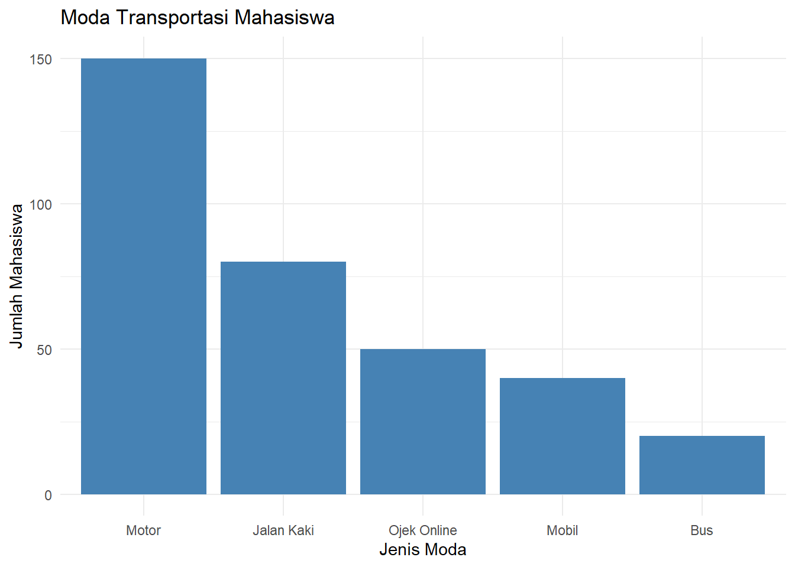

# Statistika untuk Perencanaan {.unnumbered}

Buku ini dirancang untuk membantu mahasiswa dalam memahami konsep statistika dan penggunaan R dalam pengolahan data kuantitatif, terutama dalam perencanaan wilayah dan kota. Buku ini terdiri atas x bagian:

1. Konsep Dasar Statistika dalam Perencanaan
2. Data Terstruktur
3. Analisis Statistik Deskriptif
4. Visualisasi Data Kuantitatif
5. Pengantar Statistik Inferensial
6. Estimasi Parameter
7. Uji Hipotesis Satu Populasi
8. Uji Hipotesis Dua Populasi
9. Uji Hipotesis Lebih dari Dua Populasi
10. Korelasi Antarvariabel Nominal
11. Korelasi Antarvariabel Ordinal
12. Korelasi Antarvariabel Metrik
13. Regresi Linear Sederhana
14. Regresi Linear Berganda
15. Analisis Statistik Multivariat Interdependensi


------------------------------------

# Pengantar {.unnumbered}

Puji dan syukur kami panjatkan ke hadirat Tuhan Yang Maha Esa, Allah *subhanahu wa ta’aala*, yang tanpa rahmat, izin, dan kekuatan dari-Nya modul ini tidak akan pernah bisa dirampungkan. Kami juga memanjatkan salawat dan permohonan keselamatan untuk Rasul junjungan kami dan seluruh alam, Nabi Muhammad *shallallahu alaihi wa sallam*, pembawa risalah kebenaran dan transformator peradaban terbesar sepanjang sejarah.

Buku ajar ini kami rancang sebagai media pembelajaran sekaligus instrumen evaluasinya untuk mahasiswa yang mempelajari statistika, khususnya di bidang Perencanaan Wilayah dan Kota. Kasus-kasus yang digunakan dalam pembahasannya diambil dari dataset yang diupayakan oleh delapan orang mahasiswa PWK ITERA angkatan 2020: Alvian Syah Syaidina Muhammad, Muhammad Gilang Ramadhan, Assa Bangsa Putra, Fachrian Noor Kusnadi, Bonafasius Geoffrey Titawanno, dan Ramli Indran Alif di bawah bimbingan penulis.

Buku ajar ini pastinya masih jauh dari kesempurnaan. Untuk itu, kami sangat terbuka akan masukan dan kritikan demi kesempurnaan modul ini ke depannya. Segala masukan dan kritikan akan kami tampung melalui surel [muhammad.bindar@pwk.itera.ac.id](mailto:muhammad.bindar@pwk.itera.ac.id) dan jadikan pembelajaran untuk perbaikan selanjutnya.

Lampung Selatan, 2025

Tim Penulis

<!--chapter:end:index.Rmd-->

# Konsep Dasar Statistika dalam Perencanaan

::: rmdcapaian
### Capaian Pembelajaran {.unnumbered}

Setelah mempelajari bab ini, Anda diharapkan:

* Mampu menjelaskan kedudukan dan peran analisis statistik dalam perencanaan [STP-1.1]{.capaian}
* Mampu menjelaskan perbedaan analisis kuantitatif dan kualitatif dengan tepat [STP-1.2]{.capaian}
:::

## Kedudukan dan Peran Analisis Data dalam Perencanaan

Proses perencanaan adalah proses yang sangat memerlukan data di seluruh tahapannya. Seperti yang ditunjukkan dalam Gambar \@ref(fig:proses-perencanaan-rasional) tentang proses perencanaan secara rasional, setiap tahapnya sangat memerlukan data sebagai masukan untuk melaksanakan **setiap tahap**.

<div class="figure" style="text-align: center">

<p class="caption">(\#fig:proses-perencanaan-rasional)Proses Perencanaan Rasional. Diadaptasi dari @ewing2020basic</p>
</div>

Kita ambil contoh di tahap pertama. Penetapan tujuan dan sasaran memerlukan data dari berbagai sumber di wilayah perencanaan, termasuk dari pemangku kepentingan (*stakeholder*). Data-data tersebut dikumpulkan dan untuk merumuskan tujuan dan sasaran yang benar-benar mencerminkan kebutuhan wilayah perencanaan.

Lain lagi di tahap kedua, contoh lainnya. Perumusan persoalan (*problem*) adalah hal yang harus dilakukan dengan mempertimbangkan data dan fakta kondisi yang ada (kondisi eksisting). Hal ini dikarenakan jika kita salah mendefinisikan persoalan, implementasi rencana tidak akan menjawab persoalan yang seharusnya.

Dari paparan sebelumnya, kita dapat menyimpulkan bahwa setiap tahap dalam perencanaan memerlukan penelitian, yakni kegiatan membuat pertanyaan mengenai suatu permasalahan dan menjawab pertanyaan tersebut dengan proses yang sistematis.

::: rmdkasus
### Studi Kasus: Analisis Data dalam Perencanaan Transportasi Berkelanjutan di Kampus ITERA {.unnumbered #kasus-analisis-data-dalam-perencanaan}

Kita akan mengambil kasus berupa perencanaan transportasi berkelanjutan mahasiswa dan staf pegawai di kampus ITERA. Transportasi berkelanjutan adalah perpindahan dalam konteks transportasi yang memiliki nilai berkelanjutan, salah satunya minim polusi udara.

Dalam kasus ini, kita sudah mengetahui bahwa tujuan dari rektorat adalah “transportasi mahasiswa dan pegawai yang berkelanjutan.” Selanjutnya, kita perlu mengetahui apa persoalan yang ada saat ini di kampus ITERA (perhatikan Gambar \@ref(fig:kasus-bab1))

<div class="figure" style="text-align: center">

<p class="caption">(\#fig:kasus-bab1)Persoalan Transportasi di ITERA</p>
</div>

Untuk mengetahui persoalan terkait dengan transportasi mahasiswa dan pegawai, kita perlu mengajukan pertanyaan terkait hal ini, yakni *sudah sejauh mana keberlanjutan pada pola pergerakan pada mahasiswa dan pegawai kampus ITERA saat ini?*

Ini adalah pertanyaan penelitian kita untuk menjawab apa persoalan yang ada terkait rencana transportasi berkelanjutan di kampus ITERA. Untuk menjawab pertanyaan ini, kita mengumpulkan data terkait pola pergerakan mahasiswa dan pegawai di ITERA dengan menyebarkan kuesioner kepada para mahasiswa dan pegawai kampus ITERA tentang pola pergerakan mereka.
:::

## Penelitian Kuantitatif vs. Penelitian Kualitatif dan Kedudukan Statistik

Selanjutnya kita akan membahas dua pendekatan terbesar dalam penelitian yakni penelitian kuantitatif dan penelitian kualitatif.

Penelitian secara umum adalah proses mengajukan pertanyaan dan menjawabnya secara sistematis. Pertanyaan yang diajukan bisa terkait dengan tahap yang dilakukan dalam proses perencanaan tadi.

Secara umum, pendekatan penelitian terbagi menjadi **pendekatan kuantitatif** dan **pendekatan kualitatif**. Singkatnya, pendekatan kuantitatif menekankan penggunaan angka-angka (kuantitas) dalam prosesnya, sementara pendekatan kualitatif menekankan pada eksplorasi data-data yang bersifat non-angka dan perlu diindra (dilihat, dicium, diraba, didengar) dan dirasakan.

### Analisis Kuantitatif vs. Analisis Kualitatif {#analisis-kuantitatif-vs-kualitatif}

Analisis adalah salah satu proses dalam penelitian yang mengolah data yang dikumpulkan menjadi jawaban dari pertanyaan di awal. Sebagaimana pendekatannya, secara umum analisis juga dapat dibagi menjadi **analisis kuantitatif** dan **analisis kualitatif**.

Di sisi lain, data sebagai bahan analisis juga dapat dibagi menjadi **data kuantitatif** dan **data kualitatif**. Kita dapat memaknai data kuantitatif sebagai fakta/fenomena yang diukur sehingga dinyatakan dalam bentuk angka, sementara data kualitatif adalah fakta/fenomena yang dijelaskan dalam bentuk pemaknaan dan pemahaman yang mendalam dari pelaku penelitian (subjek penelitian).

Karena analisis kuantitatif menggunakan angka-angka, pengumpulan data kuantitatif dapat disebut juga sebagai **pengukuran**.

::: rmdkasus

### Studi Kasus: Penelitian Mengenai Pola Pergerakan Mahasiswa dan Pegawai di Kampus ITERA {.unnumbered}

Berdasarkan pertanyaan penelitian *sudah sejauh mana keberlanjutan pada pola pergerakan pada mahasiswa dan pegawai kampus ITERA saat ini?*, kita akan  mengumpulkan data terkait pola pergerakan mahasiswa dan pegawai di ITERA dengan menyebarkan kuesioner kepada para mahasiswa dan pegawai kampus ITERA tentang pola pergerakan mereka. Berikut adalah analisis tentang perbandingan antara analisis kuantitatif dan analisis kualitatif.

| Aspek                | Analisis Kuantitatif                                                    | Analisis Kualitatif                                                          |
| :------------------- | :---------------------------------------------------------------------- | :--------------------------------------------------------------------------- |
| **Fokus**            | Luas (*Breadth*), mencari generalisasi.                                 | Dalam (*Depth*), mencari makna/alasan.                                       |
| **Pertanyaan Utama** | Berapa banyak emisi yang dihasilkan?                                    | Mengapa orang enggan naik shuttle?                                           |
| **Alat Analisis**    | Statistik (SPSS, Excel, Pemodelan Transportasi).                        | Transkrip wawancara, observasi lapangan, analisis tema.                      |
| **Kelebihan**        | Akurat untuk menghitung target penurunan emisi karbon secara matematis. | Sangat baik untuk merancang kebijakan yang sesuai dengan psikologi pengguna. |
| **Kelemahan**        | Tidak bisa menjelaskan alasan personal di balik angka.                  | Hasilnya tidak bisa digeneralisasi untuk seluruh populasi secara kaku.       |
:::

### Analisis Statistik sebagai Analisis Kuantitatif

Statistik adalah serangkaian teknik matematis yang digunakan untuk mengorganisir, memanipulasi, dan menganalisis data dengan tujuan menjawab pertanyaan penelitian [@healey2021statistics]. Ilmu yang mempelajari statistik disebut statistika yang dalam bahasa Inggris menjadi "statistics" (menggunakan "s").

Dalam pengertian tersebut terdapat kata kunci "matematis". Kata kunci tersebut tentunya mengantarkan kita berpikir bahwa analisis statistik adalah bagian dari penelitian kuantitatif.

Analisis statistik dapat melakukan hal-hal berikut:

1.  **Meringkas dan Mengorganisasi Data**. Statistik membantu mereduksi banyak item informasi menjadi beberapa angka yang jelas, ringkas, dan mudah dipahami, sebuah proses yang dikenal sebagai reduksi data.
2.  **Mengidentifikasi Pola dan Hubungan**. Statistik memungkinkan peneliti untuk mendeteksi pola dalam data dan mengukur hubungan antara dua atau lebih variabel.
3.  **Membuat Generalisasi**. Salah satu jenis statistik, statistik inferensial, mampu untuk menggeneralisasi temuan dari sampel kecil ke populasi yang lebih luas, memberikan perkiraan seberapa mungkin pola yang diamati dalam sampel berlaku di populasi. Ini akan kita pelajari di bab selanjutnya.
4.  **Menguji Hipotesis dan Teori**. Dalam penelitian secara umum, statistik membantu kita menguji apakah ide atau dugaan yang kita buat benar, berdasarkan data. Dari teori yang ada, kita bisa membuat hipotesis dan mengujinya secara empiris, atau bahkan menemukan hipotesis baru dari data.

Secara umum, statistika dapat dibagi menjadi dua menurut keperluannya terkait data: **statistika deskriptif** dan **statistika inferensial** [@ewing2020basic]. Statistika deskriptif berfungsi untuk mendeskripsikan data dari sebuah sampel atau populasi. Di sisi lain, statistik inferensial menarik kesimpulan dari data yang dikumpulkan (sampel) terhadap cakupan yang lebih besar dari data tersebut, yakni populasi.

Berdasarkan jumlah variabelnya statistika juga dapat dibagi menjadi 3: **statistika univariat**, **statistika bivariat** dan **statistika multivariat**. Sesuai namanya, statistika univariat adalah statistika yang digunakan untuk menganalisis satu variabel saja. Statistika bivariat adalah statistika yang menganalisis dua variabel secara bersamaan, sementara multivariat menganalisis lebih dari dua.

Jawablah soal evaluasi berikut untuk menguji pemahaman Anda tentang konsep dasar statistika dalam perencanaan.

::: rmdexercise
### Soal Evaluasi 1 {.unnumbered}

1.  Jelaskanlah penggunaan analisis data dalam setiap tahap perencanaan untuk kasus acara kumpul keakraban angkatan! [STP-1.1]{.capaian}
2.  Ceritakan perbedaan  analisis kuantitatif dan kualitatif yang mungkin digunakan dalam perencanaan acara tersebut. [STP-1.2]{.capaian}
:::

<!--chapter:end:01-konsep-dasar.Rmd-->

# Data Terstruktur

::: rmdcapaian
### Capaian Pembelajaran {.unnumbered}

Setelah mempelajari bab ini, Anda diharapkan:

1. mampu menganalisis variabel dan objek dalam sebuah format data terstruktur sesuai dengan konsepnya [STP-1.3]{.capaian}
2. mampu menentukan tingkat pengukuran yang tepat untuk sebuah variabel [STP-2.1]{.capaian}
:::

Berdasarkan formatnya, data dapat dibedakan menjadi dua jenis. Jenis data berdasarkan formatnya tersebut terdiri atas **data tidak terstruktur**  (*unstructured data*) dan **data terstruktur** (*structured data*).

Data tidak terstruktur adalah data yang tidak memiliki format yang terdefinisikan sebelum dikumpulkan, seperti teks wawancara, rekaman suara, gambar, atau video. Bentuk dan ukuran data-data tersebut dapat berbeda-beda, dengan kata lain formatnya tidak sama sehingga dapat dikatakan juga tidak terdefinisi atau tidak terstruktur [@oracle2024structured].

Di sisi lain, data terstruktur adalah data yang memiliki definisi yang jelas dan pola yang telah ditentukan sebelum dikumpulkan. Definisi yang jelas di sini diperlihatkan dengan bentuk data terstruktur berupa tabel. Dengan bentuk tabel, data memiliki format yang terdefinisi, lebih jelas isinya, dan dapat dikenali polanya sehingga lebih mudah untuk dianalisis.

**Penelitian yang menggunakan analisis statistik pasti menghasilkan data terstruktur dari pengumpulannya** [@devaus2014surveys]. Hal ini bukan berarti penelitian kualitatif juga tidak bisa menghasilkan data terstruktur, akan tetapi hal tersebut tidak mutlak. Hanya penelitian kuantitatif dengan metode analisis statistik yang mutlak menggunakan data terstruktur.

## Elemen Data Terstruktur

Dengan format yang jelas, data terstruktur dapat dipandang sebagai susunan 3 elemen penting: objek (*object*), variabel (*variable*), dan nilai (*value*). Ketiga hal ini membentuk struktur yang disebut **tabulasi data**. Tabulasi data adalah bentuk penyajian data dalam bentuk tabel yang terdiri atas baris dan kolom. Sebuah tabulasi data yang baik harus memiliki struktur yang jelas di mana baris mewakili objek dan kolom mewakili variabel.

1.  **Objek**. Objek adalah unit analisis yang datanya kita kumpulkan. Dalam tabulasi data, objek biasanya menempati posisi **baris** (*row*). Contoh objek dalam perencanaan wilayah dan kota bisa berupa rumah tangga, individu, kelurahan, kecamatan, atau kabupaten.
2.  **Variabel**. Variabel adalah karakteristik atau atribut yang melekat pada objek yang nilainya bisa berbeda-beda (bervariasi) antar satu objek dengan objek lainnya. Dalam tabulasi data, variabel menempati posisi **kolom** (*column*). Contoh variabel adalah luas lahan, jumlah penduduk, pendapatan per bulan, dan tingkat pendidikan.
3.  **Nilai**. Nilai adalah angka atau kategori yang mengisi perpotongan antara baris (objek) dan kolom (variabel), yakni **sel** (*cell*). Nilai ini merepresentasikan data spesifik dari variabel tertentu untuk objek tertentu.

::: rmdkasus
### Studi Kasus: Elemen Data Terstruktur {.unnumbered #kasus-elemen-data-terstruktur} 

Perhatikan hasil pengumpulan data kuesioner berupa tabulasi data dari mahasiswa-mahasiswa ITERA seperti yang ditampilkan pada Gambar \@ref(fig:bab-2-ilus-data-terstruktur).

<div class="figure" style="text-align: center">

<p class="caption">(\#fig:bab-2-ilus-data-terstruktur)Ilustrasi elemen data terstruktur</p>
</div>

Kita akan membedah elemen-elemen data terstruktur dari tabulasi data tersebut:
- Objek dari tabulasi data tersebut adalah mahasiswa-mahasiswa ITERA. Tiap objek dibedakan berdasarkan variabel `ID-mahasiswa`.
- Variabel dari tabulasi data tersebut di antaranya adalah `Program Studi`, `Usia`, `Jumlah Motor`, dan `Jumlah Mobil`. Adapun variabel `ID-mahasiswa` tidak termasuk dalam variabel yang dihitung karena hanya bertindak sebagai pengidentifikasi objek.
- Nilai dari tabulasi data tersebut bisa kita lihat di sel-selnya. Misalnya, objek mahasiswa dengan `ID-mahasiswa` 002 memiliki nilai `Program Studi` adalah "Matematika", `Usia` adalah 21 tahun, `Jumlah Motor` adalah 0, dan `Jumlah Mobil` adalah 1.
:::

## Tabulasi Data Terstruktur yang Baik

Agar data dapat diolah dengan baik menggunakan perangkat lunak statistik seperti R, tabulasi data harus memenuhi kaidah "Tidy Data" atau data yang rapi. Berikut adalah prinsip-prinsip data yang rapi:

1.  Setiap variabel harus membentuk satu kolom.
2.  Setiap observasi (objek) harus membentuk satu baris.
3.  Setiap jenis unit observasi membentuk satu tabel.

Pelajari kasus yang berisi perbandingan antara data yang tidak rapi dan data yang rapi berikut.

::: rmdkasus
### Studi Kasus: Perbandingan Data yang Tidak Rapi dan Data yang Rapi {.unnumbered} 

Berikut adalah beberapa contoh kesalahan umum dalam struktur data dan perbaikannya:

<table class="table table-striped table-hover" style="margin-left: auto; margin-right: auto;">
 <thead>
  <tr>
   <th style="text-align:left;"> Jenis Kesalahan </th>
   <th style="text-align:left;"> Data Tidak Rapi (Salah) </th>
   <th style="text-align:left;"> Data Rapi (Benar) </th>
  </tr>
 </thead>
<tbody>
  <tr>
   <td style="text-align:left;width: 20%; font-weight: bold;"> Kesalahan 1: Header Baris Bersarang </td>
   <td style="text-align:left;width: 40%; ">  </td>
   <td style="text-align:left;width: 40%; ">  </td>
  </tr>
  <tr>
   <td style="text-align:left;width: 20%; font-weight: bold;"> Kesalahan 2: Struktur Kompleks </td>
   <td style="text-align:left;width: 40%; ">  </td>
   <td style="text-align:left;width: 40%; ">  </td>
  </tr>
  <tr>
   <td style="text-align:left;width: 20%; font-weight: bold;"> Kesalahan 3: Format Tidak Konsisten </td>
   <td style="text-align:left;width: 40%; ">  </td>
   <td style="text-align:left;width: 40%; ">  </td>
  </tr>
</tbody>
</table>
:::

Jawablah soal evaluasi berikut untuk menguji pemahaman Anda tentang elemen-elemen data terstruktur.

::: rmdexercise
### Soal Evaluasi 2 {.unnumbered}

Perhatikan tabel hasil pengumpulan data kuesioner berikut ini [STP-1.3]{.capaian}:

<table class="table table-striped table-hover" style="margin-left: auto; margin-right: auto;">
 <thead>
  <tr>
   <th style="text-align:left;"> ID_rumah </th>
   <th style="text-align:right;"> Usia_KK </th>
   <th style="text-align:right;"> Jml_anggota </th>
   <th style="text-align:right;"> Luas_rumah </th>
   <th style="text-align:right;"> Income_bln </th>
  </tr>
 </thead>
<tbody>
  <tr>
   <td style="text-align:left;width: 20%; font-weight: bold;"> 001 </td>
   <td style="text-align:right;width: 40%; "> 55 </td>
   <td style="text-align:right;width: 40%; "> 2 </td>
   <td style="text-align:right;"> 101 </td>
   <td style="text-align:right;"> 3.3 </td>
  </tr>
  <tr>
   <td style="text-align:left;width: 20%; font-weight: bold;"> 002 </td>
   <td style="text-align:right;width: 40%; "> 64 </td>
   <td style="text-align:right;width: 40%; "> 5 </td>
   <td style="text-align:right;"> 245 </td>
   <td style="text-align:right;"> 6.0 </td>
  </tr>
  <tr>
   <td style="text-align:left;width: 20%; font-weight: bold;"> 003 </td>
   <td style="text-align:right;width: 40%; "> 33 </td>
   <td style="text-align:right;width: 40%; "> 7 </td>
   <td style="text-align:right;"> 69 </td>
   <td style="text-align:right;"> 3.5 </td>
  </tr>
  <tr>
   <td style="text-align:left;width: 20%; font-weight: bold;"> 004 </td>
   <td style="text-align:right;width: 40%; "> 28 </td>
   <td style="text-align:right;width: 40%; "> 2 </td>
   <td style="text-align:right;"> 44 </td>
   <td style="text-align:right;"> 27.0 </td>
  </tr>
</tbody>
</table>

Jawablah pertanyaan-pertanyaan berikut berdasarkan tabel tersebut:

a. Ada berapa objek dalam data terstruktur tersebut? 
b. Sebutkan apa kira-kira objek dari data terstruktur tersebut.
c. Berapa variabel yang dapat dianalisis dari data terstruktur tersebut? Sebutkan apa saja.
d. Apakah format tabel tersebut sesuai dengan prinsip data yang rapi? Jelaskan alasan Anda.
:::

## Tingkat Pengukuran Variabel

Pada subbab ini kita akan membahas lebih dalam tentang nilai dalam variabel yang berpengaruh pada analisis selanjutnya, yakni tingkat pengukuran variabel.

Sebagaimana telah disebutkan pada Subbab \@ref(analisis-kuantitatif-vs-kualitatif) bahwa pengumpulan data kuantitatif dapat disebut juga sebagai pengukuran suatu variabel, cara kita mengukur suatu variabel bisa diibaratkan seperti menggunakan mistar yang memiliki sederet angka [@kachigan1986statistical].

Tingkat pengukuran berbicara tentang cara kita menyatakan hasil pengukuran suatu variabel tersebut dalam angka, mulai dari hasil yang sangat menyerupai angka dalam mistar hingga hasil yang bukan angka sama sekali.

::: rmdkasus
### Studi Kasus: Tingkat Pengukuran Variabel {.unnumbered}

Sesuai dengan kasus \@ref(kasus-elemen-data-terstruktur), kita akan menggunakan kasus variabel `Usia` dari data terstruktur tersebut.

Dalam variabel tersebut, nilai `Usia` dapat kita nyatakan dalam 2 bentuk yang berbeda. Kita akan bedakan bentuknya menjadi kasus-kasus berikut:

1. **Kasus-1:** nilai `Usia` dinyatakan dalam bentuk angka dalam satuan tahun. Dengan demikian, dalam kasus ini nilai `17` berarti "17 tahun", dan nilai `26` berarti "26 tahun", dan seterusnya.

2. **Kasus-2:** nilai `Usia` dinyatakan dalam bentuk rentang usia seperti berikut:

    * kategori 1: 17-25 tahun
    * kategori 2: 26-35 tahun
    * kategori 3: 36-45 tahun
    * kategori 4: 46-55 tahun
    * kategori 5: 56-65 tahun

    Kita bisa menyatakan setiap kategori dengan angka tertentu yang masing-masingnya tentu mewakili rentang usia tersebut. Misalnya, kita bisa menyatakan kategori 1 dengan angka 17, kategori 2 dengan angka 26, dan seterusnya, sehingga rentangnya menjadi seperti ini:

    * 17: 17-25 tahun
    * 26: 26-35 tahun
    * 36: 36-45 tahun
    * 46: 46-55 tahun
    * 56: 56-65 tahun

    Dalam kasus ini, nilai `17` bukan lagi berarti "17 tahun", melainkan "17-25 tahun". Artinya nilai `17` ini bisa saja bernilai `17` atau `18` atau `19` atau `20` atau `21` atau `22` atau `23` atau `24` atau `25`.

Kedua kasus tersebut menunjukkan bahwa kita bisa menggunakan tingkat pengukuran yang berbeda untuk variabel yang sama. 

Kita akan mempelajari nama-nama tingkat pengukuran tersebut dalam subbab-subbab selanjutnya.
:::

## Jenis-jenis Tingkat Pengukuran Variabel

Tingkat pengukuran variabel secara umum memiliki 3 jenis dari yang paling rendah ke yang paling tinggi di antaranya adalah nominal, ordinal, dan metrik (metric). Kita akan bahas lebih dalam tentang jenis-jenis tersebut sebagai berikut mulai dari yang paling rendah ke yang paling tinggi.

### Nominal

Tingkat pengukuran nominal adalah tingkat pengukuran yang **paling rendah**. Jika angka dikenakan pada variabel ini, angka tersebut hanya bertindak sebagai label.

### Ordinal

Tingkat pengukuran ordinal berada di atas nominal. Angka pada tingkat ini hanya menunjukkan **urutan** atau **posisi** tetapi tidak dapat memberikan penafsiran berapa jarak di antara posisi-posisi tersebut.

### Metrik (Angka)

Variabel dengan tingkat pengukuran angka (bahasa Inggris: *metric*) adalah variabel dengan **angka yang sebenarnya** karena angka pada tingkat pengukuran ini memiliki penafsiran angka yang sebenarnya, yaitu memiliki posisi dan skala nilainya.

Dalam literatur lain, seperti @tjokropandojo2021pengantar, tingkat pengukuran ini banyak dibagi menjadi dua tingkat lagi, yaitu **interval** dan **rasio**. Perbedaan antara keduanya adalah bahwa interval **tidak memiliki posisi nol absolut** seperti rasio.

Contoh yang paling mudah adalah suhu. Suhu dapat dinyatakan dalam skala Celsius dan Fahrenheit. Dalam skala Celsius, air membeku pada tingkat 0 derajat, tetapi dalam skala Fahrenheit air membeku pada tingkat 32 derajat. Ini menunjukkan posisi nol yang tidak absolut pada pengukuran suhu.

Contoh lainnya adalah tahun. Dalam penanggalan Masehi, tahun-0 ditempatkan pada masa kelahiran Isa Al-Masih. Sementara itu, dalam penanggalan Hijriah, tahun-0 ditempatkan masa hijrahnya Nabi Muhammad SAW. Masa kelahiran Isa Al-Masih tentunya terjadi lebih dulu dibandingkan masa hijrah Nabi Muhammad SAW. Ini juga menunjukkan posisi nol yang tidak absolut pada pengukuran tahun.

## Menentukan Tingkat Pengukuran Variabel

Dalam praktiknya, menentukan tingkat pengukuran variabel seringkali tidak mudah karena seringkali data yang kita kumpulkan tidak memiliki tingkat pengukuran yang jelas. Oleh karena itu, kita perlu melakukan analisis lebih dalam untuk menentukan tingkat pengukuran variabel tersebut. Berikut adalah langkah-langkah yang dapat kita lakukan untuk menentukan tingkat pengukuran variabel.

1. Tentukan apakah jenis nilai dari variabel: apakah **kategorik** atau **numerik**
2. Jika **kategorik**, tentukan apakah terdapat tingkatan yang masuk akal. Jika terdapat tingkatan, maka ia pasti berupa ordinal. Jika tidak terdapat tingkatan, maka ia pasti berupa nominal.
3. Jika **numerik**, pastikan apakah angka-angka merepresentasikan angka sebenarnya. Jika tidak, ia sebenarnya adalah **kategorik**. Kembali ke langkah 1.
4. Jika **numerik** dan angka-angka merepresentasikan angka sebenarnya, pastikan apakah angka-angka memiliki posisi nol absolut. Jika tidak, ia pasti berupa **interval**. Jika ya, ia pasti berupa **rasio**.

Langkah-langkah tersebut dapat diilustrasikan dalam diagram alir yang ditampilkan dalam Gambar \@ref(fig:fig-menentukan-tingpeng) berikut. 

<div class="figure" style="text-align: center">

<p class="caption">(\#fig:fig-menentukan-tingpeng)Diagram alir menentukan tingkat pengukuran variabel</p>
</div>

::: rmdkasus
### Studi Kasus: Menentukan Tingkat Pengukuran Variabel {.unnumbered}

Melanjutkan kasus pengumpulan data pergerakan mahasiswa ITERA dari bab sebelumnya, setelah merumuskan pertanyaan penelitian mengenai keberlanjutan pola pergerakan, kita perlu menentukan variabel yang akan diukur. Berikut adalah variabel-variabel tersebut beserta penjelasannya:

<table class="table table-striped table-hover" style="margin-left: auto; margin-right: auto;">
<caption>(\#tab:bab-2-rancangan-metadata)Penelaahan tingkat pengukuran variabel penelitian</caption>
 <thead>
  <tr>
   <th style="text-align:left;"> Variabel </th>
   <th style="text-align:left;"> Nama Panggilan </th>
   <th style="text-align:left;"> Penjelasan </th>
  </tr>
 </thead>
<tbody>
  <tr>
   <td style="text-align:left;"> Moda transportasi yang digunakan responden </td>
   <td style="text-align:left;"> `kend` </td>
   <td style="text-align:left;"> Nilai-nilai dari moda transportasi bukanlah angka, melainkan label yang merepresentasikan jenis moda transportasi yang digunakan responden. Oleh karena itu, jenis nilai dari variabel ini adalah kategorik. Tidak ada tingkatan pada nilai-nilai di variabel ini, sehingga tingkat pengukurannya adalah nominal. </td>
  </tr>
  <tr>
   <td style="text-align:left;"> Jarak tempuh dari rumah ke kampus </td>
   <td style="text-align:left;"> `jarak` </td>
   <td style="text-align:left;"> Nilai-nilai dari jarak tempuh dari rumah ke kampus adalah angka yang merepresentasikan jarak tempuh dari rumah ke kampus. Oleh karena itu, jenis nilai dari variabel ini adalah numerik. Angka 0 merepresentasikan tidak ada jarak tempuh. Karena ini angka sebenarnya dan memiliki makna 0 yang sebenarnya, maka tingkat pengukurannya adalah rasio. </td>
  </tr>
  <tr>
   <td style="text-align:left;"> Banyaknya perjalanan ke kampus dalam satu pekan </td>
   <td style="text-align:left;"> `frek_jalan_sepekan` </td>
   <td style="text-align:left;"> Nilai-nilai dari banyaknya perjalanan ke kampus dalam satu pekan adalah angka yang merepresentasikan banyaknya perjalanan ke kampus dalam satu pekan. Oleh karena itu, jenis nilai dari variabel ini adalah numerik. Angka 0 merepresentasikan banyaknya perjalanan ke kampus 0 kali, atau tidak pernah ke kampus. Karena ini angka sebenarnya dan memiliki makna 0 yang sebenarnya, maka tingkat pengukurannya adalah rasio. </td>
  </tr>
  <tr>
   <td style="text-align:left;"> Total biaya transportasi selama satu pekan </td>
   <td style="text-align:left;"> `biaya` </td>
   <td style="text-align:left;"> Nilai-nilai dari total biaya transportasi selama satu pekan adalah angka yang merepresentasikan total biaya transportasi selama satu pekan. Oleh karena itu, jenis nilai dari variabel ini adalah numerik. Angka 0 merepresentasikan total biaya transportasi 0 rupiah, atau tidak mengeluarkan biaya transportasi. Karena ini angka sebenarnya dan memiliki makna 0 yang sebenarnya, maka tingkat pengukurannya adalah rasio. </td>
  </tr>
</tbody>
</table>

Setelah menelaah jenis nilai dan tingkat pengukuran variabel, kita perlu menspesifikasikan nilai isian beserta satuannya. Jika menggunakan kodifikasi, aturannya harus diperjelas. Spesifikasi ini disebut **metadata**, yaitu data yang menjelaskan tentang data.

<table class="table table-striped table-hover" style="margin-left: auto; margin-right: auto;">
<caption>(\#tab:bab-2-metadata)Metadata variabel penelitian</caption>
 <thead>
  <tr>
   <th style="text-align:left;"> Variabel </th>
   <th style="text-align:left;"> Nama Panggilan </th>
   <th style="text-align:left;"> Tingkat Pengukuran </th>
   <th style="text-align:left;"> Satuan </th>
   <th style="text-align:left;"> Nilai yang mungkin </th>
  </tr>
 </thead>
<tbody>
  <tr>
   <td style="text-align:left;"> Moda transportasi yang digunakan responden </td>
   <td style="text-align:left;"> `kend` </td>
   <td style="text-align:left;"> Nominal </td>
   <td style="text-align:left;"> Tidak ada </td>
   <td style="text-align:left;"> Sepeda motor, mobil, angkutan umum, dll </td>
  </tr>
  <tr>
   <td style="text-align:left;"> Jarak tempuh dari rumah ke kampus </td>
   <td style="text-align:left;"> `jarak` </td>
   <td style="text-align:left;"> Metrik </td>
   <td style="text-align:left;"> km </td>
   <td style="text-align:left;"> 0 - ∞ km </td>
  </tr>
  <tr>
   <td style="text-align:left;"> Banyaknya perjalanan ke kampus dalam satu pekan </td>
   <td style="text-align:left;"> `frek_jalan_sepekan` </td>
   <td style="text-align:left;"> Metrik </td>
   <td style="text-align:left;"> kali </td>
   <td style="text-align:left;"> 0 - 7 </td>
  </tr>
  <tr>
   <td style="text-align:left;"> Total biaya transportasi selama satu pekan </td>
   <td style="text-align:left;"> `biaya` </td>
   <td style="text-align:left;"> Metrik </td>
   <td style="text-align:left;"> rupiah (Rp) </td>
   <td style="text-align:left;"> 0 - ∞ </td>
  </tr>
</tbody>
</table>

**Mengubah Tingkat Pengukuran Variabel**

Kita sudah menentukan nilai dari telaahan variabel-variabel yang sudah kita buat sebelumnya. Pada hasil telaahan kita sebelumnya, kita memiliki satu variabel nominal dan 3 variabel numerik. Variabel nominal tersebut adalah `kend`, sedangkan variabel numerik tersebut adalah `jarak`, `frek_jalan_sepekan`, dan `biaya`.

Kita bisa mengubah tingkat pengukuran variabel dari satu tingkat ke lainnya. Misalnya, kita bisa mengubah tingkat pengukuran variabel `jarak` dari metrik (rasio) menjadi ordinal. Karena tingkat pengukuran variabel metrik adalah angka, untuk mengubahnya menjadi ordinal maka kita perlu mengubahnya menjadi kategorikal. Artinya, kita perlu membuat kategori baru dari variabel `jarak` tersebut.

<table class="table table-striped table-hover" style="margin-left: auto; margin-right: auto;">
<caption>(\#tab:bab-2-ubah-tingkat-pengukuran)Metadata variabel penelitian yang diubah</caption>
 <thead>
  <tr>
   <th style="text-align:left;"> Variabel </th>
   <th style="text-align:left;"> Nama Panggilan </th>
   <th style="text-align:left;"> Tingkat Pengukuran </th>
   <th style="text-align:left;"> Satuan </th>
   <th style="text-align:left;"> Nilai yang mungkin </th>
  </tr>
 </thead>
<tbody>
  <tr>
   <td style="text-align:left;"> Moda transportasi yang digunakan responden </td>
   <td style="text-align:left;"> `kend` </td>
   <td style="text-align:left;"> Nominal </td>
   <td style="text-align:left;"> Tidak ada </td>
   <td style="text-align:left;"> Sepeda motor, mobil, angkutan umum, dll </td>
  </tr>
  <tr>
   <td style="text-align:left;background-color: rgba(255, 255, 204, 255) !important;"> Jarak tempuh dari rumah ke kampus </td>
   <td style="text-align:left;background-color: rgba(255, 255, 204, 255) !important;"> `jarak` </td>
   <td style="text-align:left;background-color: rgba(255, 255, 204, 255) !important;"> Ordinal </td>
   <td style="text-align:left;background-color: rgba(255, 255, 204, 255) !important;"> km </td>
   <td style="text-align:left;background-color: rgba(255, 255, 204, 255) !important;"> 0 - 5 km,<br>5 - 10 km,<br>10 - 15 km,<br>dll </td>
  </tr>
  <tr>
   <td style="text-align:left;"> Banyaknya perjalanan ke kampus dalam satu pekan </td>
   <td style="text-align:left;"> `frek_jalan_sepekan` </td>
   <td style="text-align:left;"> Metrik </td>
   <td style="text-align:left;"> kali </td>
   <td style="text-align:left;"> 0 - 7 </td>
  </tr>
  <tr>
   <td style="text-align:left;"> Total biaya transportasi selama satu pekan </td>
   <td style="text-align:left;"> `biaya` </td>
   <td style="text-align:left;"> Metrik </td>
   <td style="text-align:left;"> rupiah (Rp) </td>
   <td style="text-align:left;"> 0 - ∞ </td>
  </tr>
</tbody>
</table>
:::


Jawablah soal evaluasi berikut untuk menguji pemahaman Anda tentang tingkat pengukuran variabel.

::: rmdexercise
### Soal Evaluasi 3 {.unnumbered}

Perhatikan cuplikan data hasil survei mahasiswa berikut ini:

<table class="table table-striped table-hover" style="margin-left: auto; margin-right: auto;">
<caption>(\#tab:bab-2-eval-3-preview)Cuplikan data survei mahasiswa</caption>
 <thead>
  <tr>
   <th style="text-align:center;"> KodeResp </th>
   <th style="text-align:center;"> Usia </th>
   <th style="text-align:center;"> Fakultas </th>
   <th style="text-align:center;"> ThnMsk </th>
   <th style="text-align:center;"> UangSaku </th>
   <th style="text-align:center;"> Jarak </th>
  </tr>
 </thead>
<tbody>
  <tr>
   <td style="text-align:center;"> 001 </td>
   <td style="text-align:center;"> 22 </td>
   <td style="text-align:center;"> 1 </td>
   <td style="text-align:center;"> 2020 </td>
   <td style="text-align:center;"> 2 </td>
   <td style="text-align:center;"> 19.27 </td>
  </tr>
  <tr>
   <td style="text-align:center;"> 002 </td>
   <td style="text-align:center;"> 25 </td>
   <td style="text-align:center;"> 1 </td>
   <td style="text-align:center;"> 2020 </td>
   <td style="text-align:center;"> 1 </td>
   <td style="text-align:center;"> 0.58 </td>
  </tr>
  <tr>
   <td style="text-align:center;"> 003 </td>
   <td style="text-align:center;"> 24 </td>
   <td style="text-align:center;"> 2 </td>
   <td style="text-align:center;"> 2021 </td>
   <td style="text-align:center;"> 1 </td>
   <td style="text-align:center;"> 0.56 </td>
  </tr>
  <tr>
   <td style="text-align:center;"> 004 </td>
   <td style="text-align:center;"> 19 </td>
   <td style="text-align:center;"> 3 </td>
   <td style="text-align:center;"> 2022 </td>
   <td style="text-align:center;"> 1 </td>
   <td style="text-align:center;"> 1.05 </td>
  </tr>
  <tr>
   <td style="text-align:center;"> 005 </td>
   <td style="text-align:center;"> 23 </td>
   <td style="text-align:center;"> 2 </td>
   <td style="text-align:center;"> 2021 </td>
   <td style="text-align:center;"> 1 </td>
   <td style="text-align:center;"> 1.69 </td>
  </tr>
  <tr>
   <td style="text-align:center;"> 006 </td>
   <td style="text-align:center;"> 20 </td>
   <td style="text-align:center;"> 1 </td>
   <td style="text-align:center;"> 2020 </td>
   <td style="text-align:center;"> 3 </td>
   <td style="text-align:center;"> 1.37 </td>
  </tr>
</tbody>
</table>

Adapun keterangan dari variabel-variabel tersebut (metadata) adalah sebagai berikut:

<table class="table table-striped table-hover" style="margin-left: auto; margin-right: auto;">
<caption>(\#tab:bab-2-eval-3-metadata)Metadata variabel survei mahasiswa</caption>
 <thead>
  <tr>
   <th style="text-align:left;"> Nama Variabel </th>
   <th style="text-align:left;"> Deskripsi </th>
   <th style="text-align:left;"> Nilai-nilai yang valid </th>
  </tr>
 </thead>
<tbody>
  <tr>
   <td style="text-align:left;"> `KodeResp` </td>
   <td style="text-align:left;"> Nomor urut responden </td>
   <td style="text-align:left;"> tiga digit angka, hingga jumlah responden minimal </td>
  </tr>
  <tr>
   <td style="text-align:left;"> `Usia` </td>
   <td style="text-align:left;"> Usia responden (tahun) </td>
   <td style="text-align:left;"> 18 - ∞ </td>
  </tr>
  <tr>
   <td style="text-align:left;"> `Fakultas` </td>
   <td style="text-align:left;"> Fakultas mahasiswa </td>
   <td style="text-align:left;"> 1 = Fakultas Syariah,<br>2 = Fakultas Tarbiyah dan Keguruan,<br>3 = Fakultas Dakwah dan Komunikasi </td>
  </tr>
  <tr>
   <td style="text-align:left;"> `ThnMsk` </td>
   <td style="text-align:left;"> Tahun masuk kuliah (Masehi) </td>
   <td style="text-align:left;"> 2018 - 2022 </td>
  </tr>
  <tr>
   <td style="text-align:left;"> `UangSaku` </td>
   <td style="text-align:left;"> Uang saku mahasiswa per bulan </td>
   <td style="text-align:left;"> 1 = &lt;1 juta rupiah,<br>2 = 1-2 juta rupiah,<br>3 = 2-3 juta rupiah,<br>4 = 3-4 juta,<br>5 = &gt;4 juta </td>
  </tr>
  <tr>
   <td style="text-align:left;"> `Jarak` </td>
   <td style="text-align:left;"> Jarak tempat tinggal mahasiswa dari kampus (km) </td>
   <td style="text-align:left;"> 0 - ∞ </td>
  </tr>
</tbody>
</table>

Sebutkan tingkat pengukuran untuk variabel-variabel yang ada dalam set data tersebut dan jelaskan! [STP-2.1]{.capaian}

:::

<!--chapter:end:02-data-terstruktur.Rmd-->

# Analisis Statistik Deskriptif

::: rmdcapaian
### Capaian Pembelajaran {.unnumbered}

Setelah mempelajari bab ini, Anda diharapkan:

1. mampu memilih statistik deskriptif yang tepat sesuai dengan variabel yang akan disajikan dan informasi yang ingin disampaikan [STP-2.2]{.capaian}
2. mampu menginterpretasikan informasi dari persentase/proporsi, rasio, laju, ukuran pemusatan, dan ukuran penyebaran suatu data kuantiatif sesuai dengan konteks kasusnya [STP-2.3]{.capaian}
:::

## Makna Analisis Statistik Deskriptif?

Statistik deskriptif adalah metode analisis untuk mendeskripsikan data dari sampel atau populasi. Metode ini digunakan untuk membantu kita menghasilkan informasi yang bermakna dan bernilai dari sekadar data mentah. Perlu dicatat bahwa analisis statistik deskriptif dapat digunakan pada data mentah entah  berupa sampel atau populasi. Dengan demikian, statistik deskriptif sangat bergantung pada kondisi data mentah yang kita miliki.

Berdasarkan teknik yang digunakan, statistik deskriptif dapat dibagi menjadi 4 kategori: **ukuran frekuensi**, **ukuran kecenderungan memusat**, **ukuran penyebaran**, dan **tabel silang**. Setiap kategori teknik memiliki tingkat pengukuran yang sesuai untuk variabel yang akan dianalisi. Makna yang dihasilkan juga akan berbeda tergantung pada teknik yang digunakan.

::: rmdnote
⚠️ Penting {.header}

Di sinilah letak krusialnya menentukan tingkat pengukuran variabel, karena akan menentukan teknik analisis statistik deskriptif apa yang akan digunakan. Sebagai contoh, kita tidak bisa menggunakan mean untuk mengukur variabel nominal.

:::

Kita akan membahas berbagai teknik analisis statistik deskriptif berdasarkan kategori-kategori tersebut. Masing-masing pembahasan teknik juga akan dilengkapi dengan makna hasil analisisnya dan untuk apa teknik tersebut digunakan.

## Ukuran Frekuensi

Ukuran frekuensi adalah cara paling sederhana untuk memaknai satu variabel. Ukuran ini menyatakan frekuensi relatif objek-objek dilihat dari suatu variabel kategorik. Objek-objek dikelompokkan ke dalam kategori-kategori dan dihitung jumlahnya dan dibandingkan dengan jumlah keseluruhan objek tersebut. Untuk dapat menggunakan teknik ini, kita perlu melakukan pengolahan pada data mentah berupa variabel kategorik, yakni mengelompokkan objek berdasarkan kategori-kategori yang ada pada variabel tersebut dan menghitung frekuensi dari setiap kategori tersebut.

Secara matematis, ukuran frekuensi dapat dinyatakan sebagai berikut:

$$
\begin{equation}
\text{FR} = \frac{f}{n}
(\#eq:konsep-frekuensi-relatif)
\end{equation}
$$

dengan:

- $FR$ = Frekuensi Relatif
- $f$ = Frekuensi suatu kategori
- $n$ = Jumlah Observasi

Makna yang dihasilkan dari teknik ini adalah seberapa besar perbandingan jumlah objek pada suatu kategori relatif terhadap jumlah keseluruhan objeknya. Dari besar perbandingan tersebut, kita dapat mengetahui dominasi kategori tertentu pada objek-objek yang diamati serta perbandingan yang adil antar kumpulan objek dengan kategorisasi yang sama.

Karena rumus perhitungan frekuensi relatif melibatkan penghitungan frekuensi atau jumlah objek (Persamaan \@ref(eq:konsep-frekuensi-relatif)), maka teknik ini hanya dapat digunakan pada data nominal dan ordinal. Teknik ini tidak dapat digunakan pada data interval dan rasio karena data interval dan rasio tidak memiliki kategori.

::: rmdkasus
### Studi Kasus: Analisis Pola Pergerakan Mahasiswa ITERA {.unnumbered}

Sekarang kita akan membahas teknik analisis statistik dalam set data (dataset) mengenai pola pergerakan mahasiswa di ITERA. Untuk kepentingan kelengkapan ulasan, variabelnya kita tambah dengan satu variabel ordinal: tingkat tahun kuliah (`tingkat`).

Berikut adalah contoh set data hasil kuesioner yang sudah disebarkan beserta metadatanya:

<table class="table table-striped table-hover" style="margin-left: auto; margin-right: auto;">
<caption>(\#tab:bab-3-kasus-dataset)Contoh Set Data Hasil Kuesioner</caption>
 <thead>
  <tr>
   <th style="text-align:center;"> ID </th>
   <th style="text-align:center;"> kend </th>
   <th style="text-align:center;"> tingkat </th>
   <th style="text-align:center;"> jarak </th>
   <th style="text-align:center;"> perjalanan_senin </th>
   <th style="text-align:center;"> biaya_pekan </th>
  </tr>
 </thead>
<tbody>
  <tr>
   <td style="text-align:center;"> 117 </td>
   <td style="text-align:center;"> 5 </td>
   <td style="text-align:center;"> 4 </td>
   <td style="text-align:center;"> 2.34 </td>
   <td style="text-align:center;"> 3 </td>
   <td style="text-align:center;"> 0 </td>
  </tr>
  <tr>
   <td style="text-align:center;"> 118 </td>
   <td style="text-align:center;"> 1 </td>
   <td style="text-align:center;"> 4 </td>
   <td style="text-align:center;"> 2.66 </td>
   <td style="text-align:center;"> 2 </td>
   <td style="text-align:center;"> 40 </td>
  </tr>
  <tr>
   <td style="text-align:center;"> 119 </td>
   <td style="text-align:center;"> 1 </td>
   <td style="text-align:center;"> 4 </td>
   <td style="text-align:center;"> 3.84 </td>
   <td style="text-align:center;"> 2 </td>
   <td style="text-align:center;"> 30 </td>
  </tr>
  <tr>
   <td style="text-align:center;"> 120 </td>
   <td style="text-align:center;"> 1 </td>
   <td style="text-align:center;"> 4 </td>
   <td style="text-align:center;"> 3.64 </td>
   <td style="text-align:center;"> 3 </td>
   <td style="text-align:center;"> 40 </td>
  </tr>
  <tr>
   <td style="text-align:center;"> 121 </td>
   <td style="text-align:center;"> 1 </td>
   <td style="text-align:center;"> 3 </td>
   <td style="text-align:center;"> 3.17 </td>
   <td style="text-align:center;"> 2 </td>
   <td style="text-align:center;"> 45 </td>
  </tr>
  <tr>
   <td style="text-align:center;"> 138 </td>
   <td style="text-align:center;"> 3 </td>
   <td style="text-align:center;"> 4 </td>
   <td style="text-align:center;"> 3.84 </td>
   <td style="text-align:center;"> 3 </td>
   <td style="text-align:center;"> 15 </td>
  </tr>
  <tr>
   <td style="text-align:center;"> 139 </td>
   <td style="text-align:center;"> 3 </td>
   <td style="text-align:center;"> 3 </td>
   <td style="text-align:center;"> 3.84 </td>
   <td style="text-align:center;"> 4 </td>
   <td style="text-align:center;"> 60 </td>
  </tr>
  <tr>
   <td style="text-align:center;"> 161 </td>
   <td style="text-align:center;"> 5 </td>
   <td style="text-align:center;"> 2 </td>
   <td style="text-align:center;"> 3.52 </td>
   <td style="text-align:center;"> 4 </td>
   <td style="text-align:center;"> 0 </td>
  </tr>
</tbody>
</table>

**Metadata:**

<table class="table table-striped table-hover" style="margin-left: auto; margin-right: auto;">
<caption>(\#tab:bab-3-kasus-metadata)Metadata Variabel</caption>
 <thead>
  <tr>
   <th style="text-align:left;"> Variabel </th>
   <th style="text-align:left;"> Keterangan </th>
  </tr>
 </thead>
<tbody>
  <tr>
   <td style="text-align:left;width: 20%; font-weight: bold;"> ID </td>
   <td style="text-align:left;width: 80%; "> Nomor urut responden </td>
  </tr>
  <tr>
   <td style="text-align:left;width: 20%; font-weight: bold;"> kend </td>
   <td style="text-align:left;width: 80%; "> Jenis kendaraan yang digunakan<br>1 = sepeda motor pribadi<br>2 = mobil pribadi<br>3 = layanan online<br>4 = menumpang kawan<br>5 = sepeda<br>6 = berjalan kaki </td>
  </tr>
  <tr>
   <td style="text-align:left;width: 20%; font-weight: bold;"> tingkat </td>
   <td style="text-align:left;width: 80%; "> Tingkat semester kuliah<br>1 = Tahun pertama<br>2 = Tahun kedua<br>3 = Tahun ketiga<br>4 = Tahun keempat<br>5 = Swasta (mahasiswa tingkat akhir) </td>
  </tr>
  <tr>
   <td style="text-align:left;width: 20%; font-weight: bold;"> jarak </td>
   <td style="text-align:left;width: 80%; "> Jarak tempat tinggal mahasiswa dari kampus (kilometer) </td>
  </tr>
  <tr>
   <td style="text-align:left;width: 20%; font-weight: bold;"> perjalanan_senin </td>
   <td style="text-align:left;width: 80%; "> Frekuensi perjalanan di hari Senin </td>
  </tr>
  <tr>
   <td style="text-align:left;width: 20%; font-weight: bold;"> biaya_pekan </td>
   <td style="text-align:left;width: 80%; "> Biaya perjalanan selama sepekan (ribu rupiah) </td>
  </tr>
</tbody>
</table>

Ukuran frekuensi dapat dilakukan pada variabel kategorik (tingkat pengukuran nominal atau ordinal), seperti `kend` dan `tingkat`. Untuk dapat menghitung analisis ini kita harus membuat terlebih dahulu tabel frekuensi untuk kedua variabel ini. Kemudian, barulah kita dapat menghitung frekuensi relatifnya menggunakan Persamaan \@ref(eq:konsep-frekuensi-relatif) 

<table class="table table-striped table-hover" style="margin-left: auto; margin-right: auto;">
<caption>(\#tab:bab-3-tabel-frekuensi-kend)Tabel Distribusi Frekuensi Untuk Variabel `kend`</caption>
 <thead>
  <tr>
   <th style="text-align:center;"> kend </th>
   <th style="text-align:center;"> Jenis kendaraan </th>
   <th style="text-align:center;"> Frekuensi </th>
   <th style="text-align:center;"> Frekuensi Relatif </th>
  </tr>
 </thead>
<tbody>
  <tr>
   <td style="text-align:center;"> 1 </td>
   <td style="text-align:center;"> Sepeda motor pribadi </td>
   <td style="text-align:center;"> 4 </td>
   <td style="text-align:center;"> 0.50 </td>
  </tr>
  <tr>
   <td style="text-align:center;"> 2 </td>
   <td style="text-align:center;"> Mobil pribadi </td>
   <td style="text-align:center;"> 0 </td>
   <td style="text-align:center;"> 0.00 </td>
  </tr>
  <tr>
   <td style="text-align:center;"> 3 </td>
   <td style="text-align:center;"> Layanan online </td>
   <td style="text-align:center;"> 2 </td>
   <td style="text-align:center;"> 0.25 </td>
  </tr>
  <tr>
   <td style="text-align:center;"> 4 </td>
   <td style="text-align:center;"> Menumpang kawan </td>
   <td style="text-align:center;"> 0 </td>
   <td style="text-align:center;"> 0.00 </td>
  </tr>
  <tr>
   <td style="text-align:center;"> 5 </td>
   <td style="text-align:center;"> Sepeda </td>
   <td style="text-align:center;"> 2 </td>
   <td style="text-align:center;"> 0.25 </td>
  </tr>
  <tr>
   <td style="text-align:center;"> 6 </td>
   <td style="text-align:center;"> Berjalan kaki </td>
   <td style="text-align:center;"> 0 </td>
   <td style="text-align:center;"> 0.00 </td>
  </tr>
  <tr>
   <td style="text-align:center;font-weight: bold;"> Total </td>
   <td style="text-align:center;font-weight: bold;">  </td>
   <td style="text-align:center;font-weight: bold;"> 8 </td>
   <td style="text-align:center;font-weight: bold;"> 1.00 </td>
  </tr>
</tbody>
</table>

<table class="table table-striped table-hover" style="margin-left: auto; margin-right: auto;">
<caption>(\#tab:bab-3-tabel-frekuensi-tingkat)Tabel Distribusi Frekuensi Untuk Variabel `tingkat`</caption>
 <thead>
  <tr>
   <th style="text-align:center;"> tingkat </th>
   <th style="text-align:center;"> Tingkat kuliah </th>
   <th style="text-align:center;"> Frekuensi </th>
   <th style="text-align:center;"> Frekuensi Relatif </th>
  </tr>
 </thead>
<tbody>
  <tr>
   <td style="text-align:center;"> 1 </td>
   <td style="text-align:center;"> Tahun pertama </td>
   <td style="text-align:center;"> 0 </td>
   <td style="text-align:center;"> 0.000 </td>
  </tr>
  <tr>
   <td style="text-align:center;"> 2 </td>
   <td style="text-align:center;"> Tahun kedua </td>
   <td style="text-align:center;"> 1 </td>
   <td style="text-align:center;"> 0.125 </td>
  </tr>
  <tr>
   <td style="text-align:center;"> 3 </td>
   <td style="text-align:center;"> Tahun ketiga </td>
   <td style="text-align:center;"> 2 </td>
   <td style="text-align:center;"> 0.250 </td>
  </tr>
  <tr>
   <td style="text-align:center;"> 4 </td>
   <td style="text-align:center;"> Tahun keempat </td>
   <td style="text-align:center;"> 5 </td>
   <td style="text-align:center;"> 0.625 </td>
  </tr>
  <tr>
   <td style="text-align:center;"> 5 </td>
   <td style="text-align:center;"> Swasta (tingkat akhir) </td>
   <td style="text-align:center;"> 0 </td>
   <td style="text-align:center;"> 0.000 </td>
  </tr>
  <tr>
   <td style="text-align:center;font-weight: bold;"> Total </td>
   <td style="text-align:center;font-weight: bold;">  </td>
   <td style="text-align:center;font-weight: bold;"> 8 </td>
   <td style="text-align:center;font-weight: bold;"> 1.000 </td>
  </tr>
</tbody>
</table>
:::

### Persentase dan Proporsi

Dua jenis ukuran frekuensi yang paling sering dipakai adalah persentase dan proporsi [@ewing2020basic]. Kedua teknik ini menghasilkan nilai yang sama, hanya saja dinyatakan dalam skala yang berbeda. Persentase dinyatakan dalam skala 0-100 dengan satuan persen (%), sedangkan proporsi dinyatakan dalam skala 0-1. Dengan demikian, dapat dikatakan bahwa sebenarnya Persamaan \@ref(eq:konsep-frekuensi-relatif) adalah proporsi dan persentase adalah proporsi yang dikalikan dengan 100.

$$
\begin{equation}
\text{Persentase} = \frac{f}{n} \times 100\%
(\#eq:konsep-persentase)
\end{equation}
$$

::: rmdnote
Catatan {.header}

Selain persen (per 100), ada juga satuan 'permil' (per 1000) dengan simbol ‰, yang biasa digunakan pada perhitungan-perhitungan yang melibatkan bilangan yang sangat kecil.
:::


::: rmdkasus
### Studi Kasus: Penerapan Persentase dan Proporsi {.unnumbered}

Melanjutkan kasus sebelumnya, kita akan menghitung persentase dan proporsi untuk variabel `kend` dan `tingkat` dari data mahasiswa ITERA.

**Perhitungan untuk Variabel `kend`:**

Dari tabel distribusi frekuensi variabel `kend`, kita dapat menghitung proporsi (frekuensi relatif) penggunaan sepeda motor pribadi menggunakan Persamaan \@ref(eq:konsep-frekuensi-relatif):

$$
\text{Proporsi sepeda motor} = \frac{4}{8} = 0,5
$$

Sedangkan persentasenya dapat dihitung menggunakan Persamaan \@ref(eq:konsep-persentase):

$$
\text{Persentase sepeda motor} = \frac{4}{8} \times 100\% = 50\%
$$

**Interpretasi:** Setengah bagian (proporsi = 0,5 atau 50%) dari responden adalah pengguna sepeda motor pribadi. Ini menunjukkan bahwa sepeda motor pribadi merupakan moda transportasi yang dominan dalam sampel penelitian ini.

**Perhitungan untuk Variabel `tingkat`:**

Dari tabel distribusi frekuensi variabel `tingkat`, kita dapat menghitung proporsi mahasiswa tahun keempat menggunakan Persamaan \@ref(eq:konsep-frekuensi-relatif):

$$
\text{Proporsi tahun keempat} = \frac{5}{8} = 0,625
$$

Sedangkan persentasenya dapat dihitung menggunakan Persamaan \@ref(eq:konsep-persentase):

$$
\text{Persentase tahun keempat} = \frac{5}{8} \times 100\% = 62,5\%
$$

**Interpretasi:** Mayoritas responden (62,5%) adalah mahasiswa tahun keempat. Artinya, sebagian besar responden adalah mahasiswa yang sudah menyelesaikan studi di ITERA. Informasi ini berguna untuk memahami karakteristik sampel dalam penelitian pola pergerakan mahasiswa.

:::

### Laju *(Rate)*

Hampir sama dengan persentase, laju juga merupakan ukuran frekuensi relatif. Perbedaan dengan persentase terletak pada ide dari pembagi (denominator) yang digunakan. Persentase digunakan pada kondisi jumlah keseluruhan objek tidak berubah atau statis. Sementara laju digunakan pada kondisi jumlah keseluruhan objek berubah atau dinamis.

$$
\begin{equation}
\text{Laju} = \frac{f}{n_i} \times 100\%
(\#eq:konsep-laju)
\end{equation}
$$


## Teknik Analisis Statistik Deskriptif

Teknik analisis deskriptif yang digunakan bergantung pada tingkat pengukuran variabelnya (Nominal, Ordinal, Interval, atau Rasio).

### Ukuran Pemusatan (Central Tendency)

Ukuran pemusatan digunakan untuk melihat di mana data "berpusat" atau nilai yang mewakili keseluruhan data.

1.  **Mean (Rata-rata)**. Nilai rata-rata dari seluruh data. Cocok untuk data metrik (Interval/Rasio).
    $$ \bar{x} = \frac{\sum x_i}{n} $$
    Dimana:
    *   $\bar{x}$ = Rata-rata sampel
    *   $\sum x_i$ = Jumlah seluruh nilai
    *   $n$ = Jumlah observasi

2.  **Median (Nilai Tengah)**. Nilai yang berada tepat di tengah data setelah data diurutkan. Cocok untuk data ordinal dan metrik yang memiliki outlier (pencilan).

3.  **Modus**. Nilai yang paling sering muncul. Cocok untuk semua jenis data, terutama data nominal.

### Ukuran Penyebaran (Dispersion)

Ukuran penyebaran menjelaskan seberapa "menyebar" atau bervariasi data kita dari nilai pusatnya.

1.  **Range (Jangkauan)**. Selisih antara nilai maksimum dan minimum.
    $$ Range = Max - Min $$

2.  **Varian (Variance) dan Simpangan Baku (Standard Deviation)**. Mengukur seberapa jauh rata-rata data menyimpang dari mean-nya.
    $$ s = \sqrt{\frac{\sum (x_i - \bar{x})^2}{n-1}} $$
    Dimana $s$ adalah simpangan baku sampel.

### Statistik untuk Data Kategorik

Untuk data nominal dan ordinal, kita sering menggunakan:

1.  **Persentase/Proporsi**. Bagian dari keseluruhan.
    $$ \% = \frac{f}{n} \times 100\% $$
2.  **Rasio**. Perbandingan antara dua kategori.

## Studi Kasus

Dalam studi kasus transportasi ITERA, kita ingin mengetahui karakteristik pengguna transportasi.
Misalkan kita memiliki data sampel 10 mahasiswa.


``` r
# Contoh data fiktif untuk ilustrasi
mahasiswa <- data.frame(
  Usia = c(19, 20, 19, 21, 20, 22, 19, 20, 21, 20),
  Uang_Saku = c(500, 600, 450, 700, 500, 800, 500, 550, 750, 600)*1000
)

# Menghitung Rata-rata Usia
mean(mahasiswa$Usia)
```

```
## [1] 20.1
```

``` r
# Menghitung Simpangan Baku Uang Saku
sd(mahasiswa$Uang_Saku)
```

```
## [1] 118907.1
```

::: rmdexercise
### Soal Evaluasi 4 {.unnumbered}

1.  Sebutkan tingkat pengukuran untuk variabel-variabel yang ada dalam set data tersebut. [STP-2.1]{.capaian}
2.  Centang analisis statistik deskriptif yang relevan diaplikasikan kepada variabel-variabel tersebut. [STP-2.2]{.capaian}

    | Variabel  | Persentase/Proporsi | Rasio | Laju  |
    | :-------- | :-----------------: | :---: | :---: |
    | Usia      |                     |       |       |
    | Fakultas  |                     |       |       |
    | ThnMsk    |                     |       |       |
    | Uang_saku |                     |       |       |

3.  Apa informasi utama yang bisa kita simpulkan dari hasil statistik deskriptif variabel-variabel berikut? [STP-2.3]{.capaian}
    a. Persentase tiap kategori Fakultas
    b. Proporsi kategori pada variabel UangSaku
    c. Rata-rata (mean) variabel Usia
    d. Median variabel ThnMsk
    e. Standar deviasi variabel Jarak

:::

<!--chapter:end:03-statistik-deskriptif.Rmd-->

# Visualisasi Data Kuantitatif

## Konsep Dasar

Visualisasi data adalah representasi grafis dari informasi dan data. Dengan menggunakan elemen visual seperti grafik, bagan, dan peta, visualisasi data menyediakan cara yang mudah diakses untuk melihat dan memahami tren, outlier, dan pola dalam data.

Dalam R, `ggplot2` adalah paket yang paling populer dan kuat untuk membuat visualisasi data. Prinsip dasarnya adalah "Grammar of Graphics", yang membangun grafik komponen demi komponen (data, aesthetics, geometries).

## Jenis Visualisasi Dasar

### Diagram Batang (Bar Chart)

Cocok untuk membandingkan kuantitas antar kategori (Data Nominal/Ordinal).


``` r
library(ggplot2)
ggplot(data, aes(x = Kategori, y = Jumlah)) +
  geom_col() +
  theme_minimal()
```

### Histogram

Cocok untuk melihat distribusi data numerik (Data Interval/Rasio).


``` r
ggplot(data, aes(x = VariabelNumerik)) +
  geom_histogram(binwidth = 5)
```

### Boxplot

Cocok untuk melihat ringkasan lima angka (min, k1, median, k3, max) dan outlier. Sangat baik untuk membandingkan distribusi antar grup.


``` r
ggplot(data, aes(x = Kategori, y = Nilai)) +
  geom_boxplot()
```

### Scatterplot

Cocok untuk melihat hubungan antara dua variabel numerik.


``` r
ggplot(data, aes(x = X, y = Y)) +
  geom_point()
```

## Studi Kasus

Menggunakan data transportasi kampus, kita akan memvisualisasikan moda transportasi.


``` r
library(ggplot2)

# Data contoh
transport <- data.frame(
  Moda = c("Motor", "Mobil", "Jalan Kaki", "Ojek Online", "Bus"),
  Jumlah = c(150, 40, 80, 50, 20)
)

# Membuat Bar Chart
ggplot(transport, aes(x = reorder(Moda, -Jumlah), y = Jumlah)) +
  geom_col(fill = "steelblue") +
  theme_minimal() +
  labs(title = "Moda Transportasi Mahasiswa",
       x = "Jenis Moda",
       y = "Jumlah Mahasiswa")
```

<!-- -->

::: rmdexercise
### Soal Evaluasi 5 {.unnumbered}

1.  Jelaskan prinsip dasar pemilihan jenis grafik berdasarkan tingkat pengukuran variabelnya! [STP-3.1]{.capaian}
2.  Apa fungsi Boxplot dalam analisis data eksploratif? [STP-3.2]{.capaian}
3.  Perhatikan diagram berikut (misalkan ada diagram batang). Apa kesimpulan yang dapat diambil? [STP-3.3]{.capaian}

:::

<!--chapter:end:04-visualisasi-data.Rmd-->

# Pengantar Analisis Statistik Inferensial

## Konsep Dasar

Statistik inferensial adalah metode yang digunakan untuk menarik kesimpulan mengenai populasi berdasarkan data sampel. Konsep kuncinya adalah bahwa kita tidak mengukur seluruh populasi (sensus), melainkan hanya sebagian kecilnya (sampel), namun kita ingin hasil pengukuran sampel tersebut dapat digeneralisasi ke populasi.

### Teknik Pengambilan Sampel

Agar generalisasi valid, sampel harus representatif. Beberapa teknik:

1.  **Simple Random Sampling**. Setiap anggota populasi memiliki peluang yang sama untuk dipilih.
2.  **Stratified Random Sampling**. Populasi dibagi menjadi strata (kelompok), lalu sampel diambil secara acak dari tiap strata secara proporsional.
3.  **Cluster Sampling**. Populasi dibagi menjadi klaster (wilayah), lalu beberapa klaster dipilih secara acak.

## Distribusi Sampling dan Teorema Limit Sentral

Walaupun kita hanya mengambil satu sampel, kita perlu membayangkan konsep "Distribusi Sampling". Jika kita mengambil banyak sampel berulang kali dari populasi yang sama, rata-rata dari masing-masing sampel tersebut akan membentuk distribusi normal, terlepas dari bentuk distribusi populasinya. Inilah **Teorema Limit Sentral**.

### Standard Error

Simpangan baku dari distribusi sampling disebut **Standard Error (SE)**.
$$ SE = \frac{\sigma}{\sqrt{n}} $$
Dimana $\sigma$ adalah simpangan baku populasi dan $n$ adalah ukuran sampel.

### Z-Score

Untuk mengetahui posisi suatu nilai dalam distribusi normal baku, kita menggunakan Z-Score:
$$ Z = \frac{x - \mu}{\sigma} $$
Untuk rata-rata sampel:
$$ Z = \frac{\bar{x} - \mu}{SE} $$

::: rmdexercise
### Soal Evaluasi 6 {.unnumbered}

1.  Jelaskan perbedaan mendasar antara statistik deskriptif dan inferensial. [STP-4.1]{.capaian}
2.  Sebutkan dan jelaskan tiga teknik pengambilan sampel probabilitas. [STP-4.2]{.capaian}
3.  Hitung Z-Score jika diketahui rata-rata sampel = 50, rata-rata populasi = 45, simpangan baku = 10, dan n = 25. [STP-4.3]{.capaian}

:::

<!--chapter:end:05-pengantar-inferensial.Rmd-->

# Estimasi Parameter

## Konsep Dasar

Dalam statistik inferensial, kita menggunakan statistik sampel (seperti $\bar{x}$) untuk mengestimasi parameter populasi (seperti $\mu$).

Ada dua jenis estimasi:
1.  **Estimasi Titik (Point Estimation)**. Menggunakan satu nilai tunggal. Contoh: "Rata-rata pendapatan adalah 5 juta". Kelemahannya: akurasinya diragukan.
2.  **Estimasi Rentang (Interval Estimation)**. Menggunakan rentang nilai dengan tingkat kepercayaan tertentu. Contoh: "Rata-rata pendapatan ada di antara 4,8 juta hingga 5,2 juta dengan tingkat kepercayaan 95%". Inilah yang disebut **Confidence Interval (CI)**.

## Estimasi Rentang Kepercayaan (Confidence Interval)

Rumus umum untuk CI rata-rata adalah:
$$ \bar{x} \pm Z_{\alpha/2} \times SE $$
Atau:
$$ \bar{x} - Z_{\alpha/2} \frac{\sigma}{\sqrt{n}} < \mu < \bar{x} + Z_{\alpha/2} \frac{\sigma}{\sqrt{n}} $$

Nilai $Z_{\alpha/2}$ bergantung pada tingkat kepercayaan (Confidence Level, $1-\alpha$):
*   Tingkat Kepercayaan 90% ($\alpha=10\%$) $\rightarrow Z = 1.645$
*   Tingkat Kepercayaan 95% ($\alpha=5\%$) $\rightarrow Z = 1.96$
*   Tingkat Kepercayaan 99% ($\alpha=1\%$) $\rightarrow Z = 2.575$

### Studi Kasus

Seorang peneliti ingin mengestimasi rata-rata pengeluaran bulanan mahasiswa. Dari sampel 100 mahasiswa, diperoleh rata-rata 1,5 juta rupiah dengan simpangan baku 500 ribu rupiah. Buatlah selang kepercayaan 95%.

Diketahui:
*   $n = 100$
*   $\bar{x} = 1.500.000$
*   $s = 500.000$ (menggantikan $\sigma$)
*   $Z_{0.025} = 1.96$

Standard Error: $SE = 500.000 / \sqrt{100} = 50.000$.

Batas Bawah: $1.500.000 - (1.96 \times 50.000) = 1.402.000$.
Batas Atas: $1.500.000 + (1.96 \times 50.000) = 1.598.000$.

Jadi, dengan tingkat kepercayaan 95%, rata-rata pengeluaran mahasiswa berada di antara Rp1.402.000 dan Rp1.598.000.

::: rmdexercise
### Soal Evaluasi 7 {.unnumbered}

1.  Apa yang dimaksud dengan tingkat kepercayaan (confidence level)? [STP-5.1]{.capaian}
2.  Hitunglah Confidence Interval 95% untuk rata-rata jika $\bar{x}=100$, $s=15$, dan $n=36$. [STP-5.2]{.capaian}

:::

<!--chapter:end:06-estimasi-parameter.Rmd-->

# Uji Hipotesis Satu Populasi

## Konsep Dasar

Uji hipotesis adalah prosedur statistik yang menggunakan data sampel untuk mengevaluasi suatu dugaan (hipotesis) mengenai populasi.

### Hipotesis Nol dan Alternatif

*   **Hipotesis Nol ($H_0$)**: Pernyataan tentang status quo, tidak ada perbedaan, atau tidak ada efek. Biasanya mengandung tanda sama dengan ($=, \le, \ge$).
*   **Hipotesis Alternatif ($H_1$)**: Pernyataan yang bertentangan dengan $H_0$, biasanya merupakan dugaan yang ingin dibuktikan oleh peneliti. Mengandung tanda ketidaksamaan ($\ne, <, >$).

### Langkah-langkah Pengujian Hipotesis

1.  **Rumuskan Hipotesis ($H_0$ dan $H_1$)**.
2.  **Tentukan Tingkat Signifikansi ($\alpha$)**. Biasanya 0,05.
3.  **Pilih Statistik Uji**. (Z-test jika $\sigma$ diketahui atau $n > 30$, t-test jika $\sigma$ tidak diketahui dan $n < 30$).
4.  **Hitung Statistik Hitung dan P-value**.
5.  **Ambil Keputusan**. Tolak $H_0$ jika P-value $< \alpha$.
6.  **Tarik Kesimpulan**.

## Studi Kasus dengan R

Seorang perencana kota menduga bahwa rata-rata waktu tempuh warga ke tempat kerja adalah **lebih dari 45 menit**. Dari survei terhadap 35 warga, diperoleh rata-rata 48 menit dengan simpangan baku 10 menit. Ujilah hipotesis tersebut dengan $\alpha = 0.05$.

Hipotesis:
*   $H_0: \mu \le 45$ (Rata-rata tidak lebih dari 45 menit)
*   $H_1: \mu > 45$ (Rata-rata lebih dari 45 menit)


``` r
# Data Sampel (Simulasi)
set.seed(123)
waktu_tempuh <- rnorm(35, mean = 48, sd = 10)

# Uji T Satu Sampel
t.test(waktu_tempuh, mu = 45, alternative = "greater")
```

```
## 
## 	One Sample t-test
## 
## data:  waktu_tempuh
## t = 2.1102, df = 34, p-value = 0.02114
## alternative hypothesis: true mean is greater than 45
## 95 percent confidence interval:
##  45.67059      Inf
## sample estimates:
## mean of x 
##  48.37518
```

**Interpretasi**:
Jika p-value < 0,05, maka kita menolak $H_0$ dan menyimpulkan bahwa rata-rata waktu tempuh secara signifikan lebih dari 45 menit.

::: rmdexercise
### Soal Evaluasi 8 {.unnumbered}

1.  Jelaskan perbedaan antara Hipotesis Nol dan Hipotesis Alternatif. [STP-6.1]{.capaian}
2.  Apa makna P-value dalam pengambilan keputusan uji hipotesis? [STP-6.2]{.capaian}

:::

<!--chapter:end:07-uji-hipotesis-satu-populasi.Rmd-->

# Uji Hipotesis Dua Populasi

## Konsep Dasar

Uji ini digunakan untuk membandingkan parameter (rata-rata atau proporsi) dari dua populasi yang berbeda. Tujuannya adalah untuk mengetahui apakah ada perbedaan yang signifikan di antara keduanya.

### Uji Beda Rata-rata (Independent Samples t-test)

Digunakan untuk dua kelompok sampel yang tidak saling berhubungan (independen). Contoh: Membandingkan rata-rata pendapatan warga di Kota A dan Kota B.

Hipotesis:
*   $H_0: \mu_A = \mu_B$
*   $H_1: \mu_A \ne \mu_B$

### Uji Beda Rata-rata Berpasangan (Paired Samples t-test)

Digunakan untuk dua kelompok sampel yang saling berhubungan (berpasangan). Contoh: Membandingkan kemacetan di jalan yang sama **sebelum** dan **sesudah** penerapan kebijakan ganjil-genap.

## Studi Kasus dengan R

### Independent t-test

Membandingkan pendapatan (dalam juta) antara pria dan wanita.


``` r
# Data Contoh
pria <- c(5, 6, 5, 7, 6, 8, 5)
wanita <- c(4, 5, 4, 6, 5, 5, 4)

# Uji t independen
t.test(pria, wanita, var.equal = TRUE)
```

```
## 
## 	Two Sample t-test
## 
## data:  pria and wanita
## t = 2.4648, df = 12, p-value = 0.02978
## alternative hypothesis: true difference in means is not equal to 0
## 95 percent confidence interval:
##  0.1491572 2.4222714
## sample estimates:
## mean of x mean of y 
##  6.000000  4.714286
```

### Paired t-test

Membandingkan waktu tempuh (menit) sebelum dan sesudah pembangunan tol.


``` r
sebelum <- c(60, 55, 70, 65, 80)
sesudah <- c(40, 45, 50, 55, 60)

# Uji t berpasangan
t.test(sebelum, sesudah, paired = TRUE)
```

```
## 
## 	Paired t-test
## 
## data:  sebelum and sesudah
## t = 6.532, df = 4, p-value = 0.002838
## alternative hypothesis: true mean difference is not equal to 0
## 95 percent confidence interval:
##   9.199126 22.800874
## sample estimates:
## mean difference 
##              16
```

::: rmdexercise
### Soal Evaluasi 9 {.unnumbered}

1.  Kapan kita menggunakan uji t independen dan kapan menggunakan uji t berpasangan? Berikan contoh kasus perencanaannya! [STP-7.1]{.capaian}
2.  Lakukan uji beda rata-rata untuk data berikut... [STP-7.2]{.capaian}

:::

<!--chapter:end:08-uji-hipotesis-dua-populasi.Rmd-->

# Uji Hipotesis Lebih dari Dua Populasi

## Analisis Variansi (ANOVA)

Ketika kita ingin membandingkan rata-rata dari **lebih dari dua** kelompok populasi, kita menggunakan **Analysis of Variance (ANOVA)**. Jika kita menggunakan uji t berulang kali untuk setiap pasangan kelompok, risiko kesalahan Tipe I (False Positive) akan meningkat. ANOVA mengatasi masalah ini dengan menguji perbedaan secara simultan.

Hipotesis ANOVA Satu Arah (One-Way ANOVA):
*   $H_0: \mu_1 = \mu_2 = \dots = \mu_k$ (Semua rata-rata kelompok sama)
*   $H_1$: Setidaknya ada satu pasang rata-rata yang berbeda.

## Studi Kasus dengan R

Kita ingin membandingkan rata-rata harga tanah di tiga zona: Pusat Kota, Suburban, dan Rural.


``` r
# Data Contoh
harga_tanah <- c(10, 12, 11, 13, 15, # Pusat
                 8, 9, 7, 8, 10,       # Suburban
                 4, 5, 3, 5, 4)        # Rural
zona <- factor(rep(c("Pusat", "Suburban", "Rural"), each = 5))

data_tanah <- data.frame(harga = harga_tanah, zona = zona)

# ANOVA Satu Arah
model_anova <- aov(harga ~ zona, data = data_tanah)
summary(model_anova)
```

```
##             Df Sum Sq Mean Sq F value   Pr(>F)    
## zona         2  160.1   80.07   42.14 3.75e-06 ***
## Residuals   12   22.8    1.90                     
## ---
## Signif. codes:  0 '***' 0.001 '**' 0.01 '*' 0.05 '.' 0.1 ' ' 1
```

**Interpretasi**:
Jika nilai Pr(>F) pada tabel ANOVA kurang dari 0,05, maka tolak $H_0$. Artinya, terdapat perbedaan signifikan rata-rata harga tanah antar zona tersebut. Untuk mengetahui zona mana yang berbeda, dapat dilanjutkan dengan uji lanjut (Post Hoc Test) seperti Tukey HSD.


``` r
TukeyHSD(model_anova)
```

```
##   Tukey multiple comparisons of means
##     95% family-wise confidence level
## 
## Fit: aov(formula = harga ~ zona, data = data_tanah)
## 
## $zona
##                diff       lwr      upr     p adj
## Rural-Pusat    -8.0 -10.32579 -5.67421 0.0000025
## Suburban-Pusat -3.8  -6.12579 -1.47421 0.0024733
## Suburban-Rural  4.2   1.87421  6.52579 0.0011306
```

::: rmdexercise
### Soal Evaluasi 10 {.unnumbered}

1.  Mengapa kita tidak dianjurkan menggunakan uji t berulang kali untuk membandingkan 3 kelompok atau lebih? [STP-7.3]{.capaian}
2.  Apa kesimpulan jika P-value ANOVA > 0,05? [STP-7.4]{.capaian}

:::

<!--chapter:end:09-uji-hipotesis-lebih-dua-populasi.Rmd-->

# Korelasi Antarvariabel Nominal

## Konsep Dasar

Analisis ini digunakan untuk mengukur kekuatan hubungan antara dua variabel kategori (nominal). Teknik yang umum digunakan adalah **Chi-Square ($X^2$)** untuk signifikansi dan **Cramer's V**, **Phi**, atau **Lambda** untuk kekuatan hubungan.

## Studi Kasus dengan R

Apakah ada hubungan antara **Fakultas** dengan **Moda Transportasi** yang digunakan?


``` r
# Data Contoh
fakultas <- c("Saintek", "Soshum", "Saintek", "Soshum", "Saintek", "Saintek")
moda <- c("Motor", "Mobil", "Motor", "Jalan Kaki", "Mobil", "Motor")

# Membuat Tabel Kontingensi
tabel <- table(fakultas, moda)
print(tabel)
```

```
##          moda
## fakultas  Jalan Kaki Mobil Motor
##   Saintek          0     1     3
##   Soshum           1     1     0
```

``` r
# Uji Chi-Square
chisq.test(tabel)
```

```
## Warning in chisq.test(tabel): Chi-squared approximation may be incorrect
```

```
## 
## 	Pearson's Chi-squared test
## 
## data:  tabel
## X-squared = 3.75, df = 2, p-value = 0.1534
```

**Interpretasi**:
Jika P-value < 0,05, maka ada hubungan signifikan antara Fakultas dan Moda Transportasi.

::: rmdexercise
### Soal Evaluasi 11 {.unnumbered}

1.  Apa perbedaan Chi-Square Test dengan Lambda sebagai ukuran asosiasi? [STP-8.1]{.capaian}
2.  Hitunglah nilai Cramer's V untuk tabel kontingensi berikut... [STP-8.2]{.capaian}

:::

<!--chapter:end:10-korelasi-nominal.Rmd-->

# Korelasi Antarvariabel Ordinal

## Konsep Dasar

Untuk data ordinal (berjenjang/ranking), kita menggunakan korelasi berbasis peringkat. Dua yang paling populer adalah **Spearman's Rho ($\rho$)** dan **Kendall's Tau ($\tau$)**.

## Studi Kasus dengan R

Apakah ada hubungan antara **Tingkat Pendidikan** (SD, SMP, SMA) dengan **Kepuasan Layanan** (Rendah, Sedang, Tinggi)?


``` r
# Data Ordinal (sebagai angka peringkat)
pendidikan <- c(1, 2, 3, 2, 3, 1, 2)
kepuasan <- c(1, 1, 3, 2, 3, 1, 2)

# Korelasi Spearman
cor.test(pendidikan, kepuasan, method = "spearman")
```

```
## Warning in cor.test.default(pendidikan, kepuasan, method = "spearman"): Cannot compute
## exact p-value with ties
```

```
## 
## 	Spearman's rank correlation rho
## 
## data:  pendidikan and kepuasan
## S = 5.6, p-value = 0.005752
## alternative hypothesis: true rho is not equal to 0
## sample estimates:
## rho 
## 0.9
```

``` r
# Korelasi Kendall
cor.test(pendidikan, kepuasan, method = "kendall")
```

```
## Warning in cor.test.default(pendidikan, kepuasan, method = "kendall"): Cannot compute
## exact p-value with ties
```

```
## 
## 	Kendall's rank correlation tau
## 
## data:  pendidikan and kepuasan
## z = 2.3936, p-value = 0.01668
## alternative hypothesis: true tau is not equal to 0
## sample estimates:
##   tau 
## 0.875
```

**Interpretasi**:
Nilai korelasi mendekati +1 menunjukkan hubungan positif kuat (semakin tinggi pendidikan, semakin tinggi kepuasan).

::: rmdexercise
### Soal Evaluasi 12 {.unnumbered}

1.  Kapan kita sebaiknya menggunakan Kendall's Tau dibandingkan Spearman's Rho? [STP-9.1]{.capaian}
2.  Jelaskan makna korelasi negatif pada variabel ordinal! [STP-9.2]{.capaian}

:::

<!--chapter:end:11-korelasi-ordinal.Rmd-->

# Korelasi Antarvariabel Metrik

## Konsep Dasar

Untuk dua variabel numerik (interval/rasio), ukuran asosiasi yang paling umum adalah **Pearson Product-Moment Correlation ($r$)**. Nilai $r$ berkisar antara -1 hingga +1.

## Studi Kasus dengan R

Hubungan antara **Pendapatan** dan **Pengeluaran**.


``` r
pendapatan <- c(5, 6, 7, 8, 9, 10, 11)
pengeluaran <- c(3, 4, 3.5, 5, 6, 6.5, 7)

# Scatterplot
plot(pendapatan, pengeluaran)
```

<!-- -->

``` r
# Korelasi Pearson
cor.test(pendapatan, pengeluaran, method = "pearson")
```

```
## 
## 	Pearson's product-moment correlation
## 
## data:  pendapatan and pengeluaran
## t = 8.5927, df = 5, p-value = 0.0003521
## alternative hypothesis: true correlation is not equal to 0
## 95 percent confidence interval:
##  0.7916653 0.9953960
## sample estimates:
##       cor 
## 0.9677688
```

::: rmdexercise
### Soal Evaluasi 13 {.unnumbered}

1.  Apa syarat utama penggunaan korelasi Pearson? [STP-10.1]{.capaian}
2.  Jika $r = 0$, apakah artinya tidak ada hubungan sama sekali? Jelaskan! [STP-10.2]{.capaian}

:::

<!--chapter:end:12-korelasi-metrik.Rmd-->

# Regresi Linear Sederhana

## Konsep Dasar

Regresi linear sederhana digunakan untuk memprediksi nilai satu variabel dependen ($Y$) berdasarkan satu variabel independen ($X$). Persamaannya:
$$ Y = a + bX + \epsilon $$

## Studi Kasus dengan R

Memprediksi **Pengeluaran** berdasarkan **Pendapatan**.


``` r
pendapatan <- c(5, 6, 7, 8, 9, 10, 11)
pengeluaran <- c(3, 4, 3.5, 5, 6, 6.5, 7)

# Membuat Model Regresi
model <- lm(pengeluaran ~ pendapatan)
summary(model)
```

```
## 
## Call:
## lm(formula = pengeluaran ~ pendapatan)
## 
## Residuals:
##          1          2          3          4          5          6          7 
##  8.929e-02  3.929e-01 -8.036e-01 -1.804e-16  3.036e-01  1.071e-01 -8.929e-02 
## 
## Coefficients:
##             Estimate Std. Error t value Pr(>|t|)    
## (Intercept) -0.57143    0.66834  -0.855 0.431606    
## pendapatan   0.69643    0.08105   8.593 0.000352 ***
## ---
## Signif. codes:  0 '***' 0.001 '**' 0.01 '*' 0.05 '.' 0.1 ' ' 1
## 
## Residual standard error: 0.4289 on 5 degrees of freedom
## Multiple R-squared:  0.9366,	Adjusted R-squared:  0.9239 
## F-statistic: 73.83 on 1 and 5 DF,  p-value: 0.0003521
```

``` r
# Melihat koefisien
coef(model)
```

```
## (Intercept)  pendapatan 
##  -0.5714286   0.6964286
```

**Interpretasi**:
Nilai Intercept ($a$) dan Slope ($b$) menentukan persamaan garis prediksi. $R^2$ menunjukkan seberapa baik model menjelaskan variasi data.

::: rmdexercise
### Soal Evaluasi 14 {.unnumbered}

1.  Apa perbedaan antara korelasi dan regresi? [STP-11.1]{.capaian}
2.  Jelaskan makna $R^2$ (Koefisien Determinasi)! [STP-11.2]{.capaian}

:::

<!--chapter:end:13-regresi-sederhana.Rmd-->

# Regresi Linear Berganda

## Konsep Dasar

Regresi linear berganda melibatkan **lebih dari satu** variabel independen untuk memprediksi variabel dependen.
$$ Y = a + b_1X_1 + b_2X_2 + \dots + \epsilon $$

## Studi Kasus dengan R

Memprediksi **Harga Rumah** berdasarkan **Luas Tanah** dan **Jumlah Kamar**.


``` r
harga <- c(500, 700, 600, 800, 900)
luas <- c(100, 150, 120, 160, 200)
kamar <- c(2, 3, 2, 4, 5)

# Model Regresi Berganda
model_berganda <- lm(harga ~ luas + kamar)
summary(model_berganda)
```

```
## 
## Call:
## lm(formula = harga ~ luas + kamar)
## 
## Residuals:
##       1       2       3       4       5 
## -22.901  -6.107  16.031  32.824 -19.847 
## 
## Coefficients:
##             Estimate Std. Error t value Pr(>|t|)
## (Intercept)  156.489    104.150   1.503    0.272
## luas           3.053      1.724   1.771    0.219
## kamar         30.534     50.865   0.600    0.609
## 
## Residual standard error: 33.84 on 2 degrees of freedom
## Multiple R-squared:  0.9771,	Adjusted R-squared:  0.9542 
## F-statistic: 42.67 on 2 and 2 DF,  p-value: 0.0229
```

::: rmdexercise
### Soal Evaluasi 15 {.unnumbered}

1.  Apa itu multikolinearitas dalam regresi berganda? [STP-12.1]{.capaian}
2.  Bagaimana cara menginterpretasikan Adjusted $R^2$? [STP-12.2]{.capaian}

:::

<!--chapter:end:14-regresi-berganda.Rmd-->

# Analisis Statistik Multivariat Interdependensi

## Konsep Dasar

Analisis multivariat interdependensi tidak membedakan variabel menjadi dependen dan independen. Tujuannya adalah untuk mencari struktur dasar dari sekumpulan variabel.
Contoh: **Analisis Faktor** dan **Principal Component Analysis (PCA)**. Biasanya digunakan untuk mereduksi dimensi data (menyederhanakan banyak variabel menjadi beberapa faktor utama).

## Studi Kasus dengan R

Mereduksi 5 indikator kepuasan menjadi faktor-faktor utama.


``` r
# Simulasi Data
set.seed(123)
data_survei <- matrix(rnorm(100*5), ncol=5)
colnames(data_survei) <- c("Q1", "Q2", "Q3", "Q4", "Q5")

# Principal Component Analysis
pca_result <- prcomp(data_survei, scale. = TRUE)
summary(pca_result)
```

```
## Importance of components:
##                           PC1    PC2    PC3    PC4    PC5
## Standard deviation     1.1077 1.0610 1.0191 0.9468 0.8440
## Proportion of Variance 0.2454 0.2251 0.2077 0.1793 0.1425
## Cumulative Proportion  0.2454 0.4705 0.6783 0.8575 1.0000
```

``` r
# Melihat beban faktor (loadings)
pca_result$rotation
```

```
##            PC1        PC2        PC3        PC4       PC5
## Q1  0.67277300  0.3292034 -0.1275847 -0.1588174 0.6304766
## Q2  0.19353433 -0.6901072  0.1205644  0.6023990 0.3299640
## Q3 -0.28920162 -0.4912642 -0.5283287 -0.5405369 0.3220413
## Q4  0.01926618 -0.2337862  0.8146660 -0.5122828 0.1373262
## Q5 -0.65261949  0.3455152  0.1624021  0.2393297 0.6091420
```

::: rmdexercise
### Soal Evaluasi 16 {.unnumbered}

1.  Apa tujuan utama dari Analisis Faktor? [STP-13.1]{.capaian}
2.  Jelaskan perbedaan mendasar antara Analisis Regresi dan Analisis Faktor! [STP-13.2]{.capaian}

:::

<!--chapter:end:15-multivariat-interdependensi.Rmd-->

