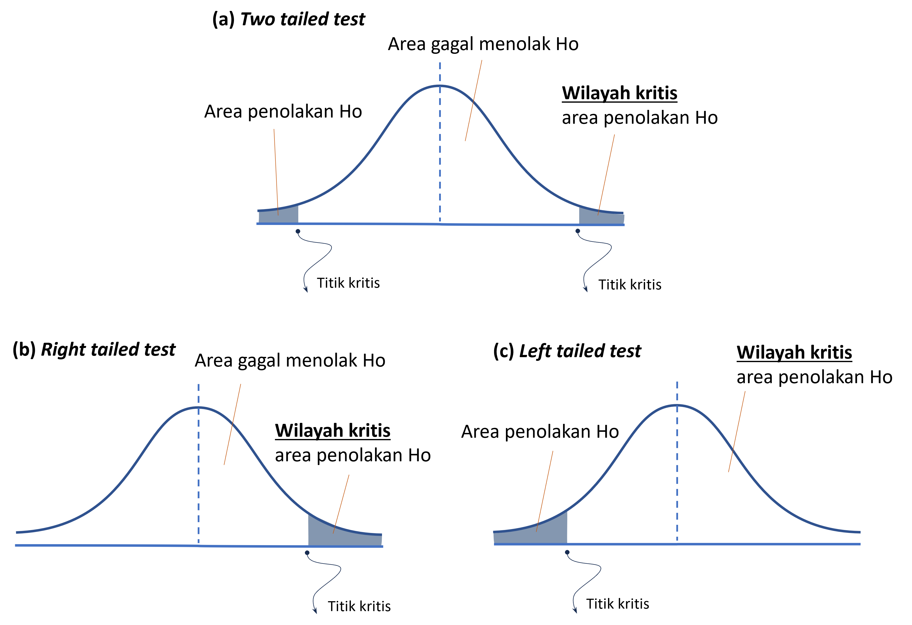
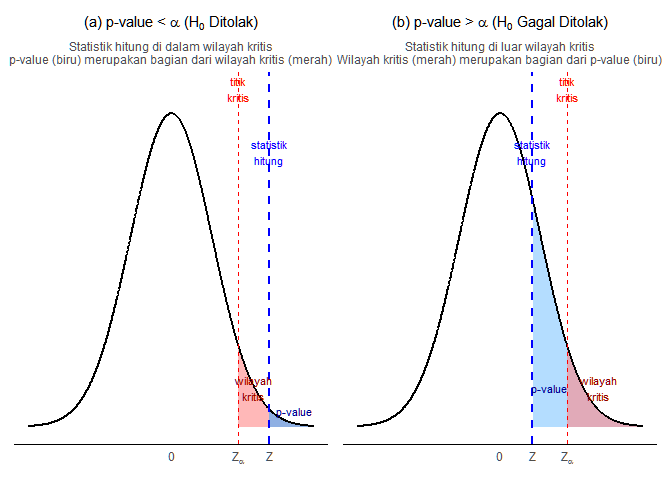
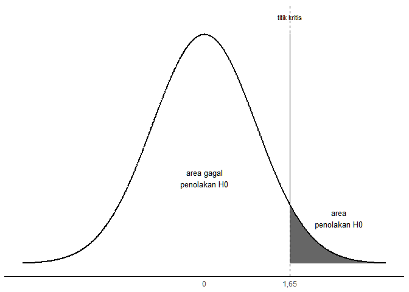
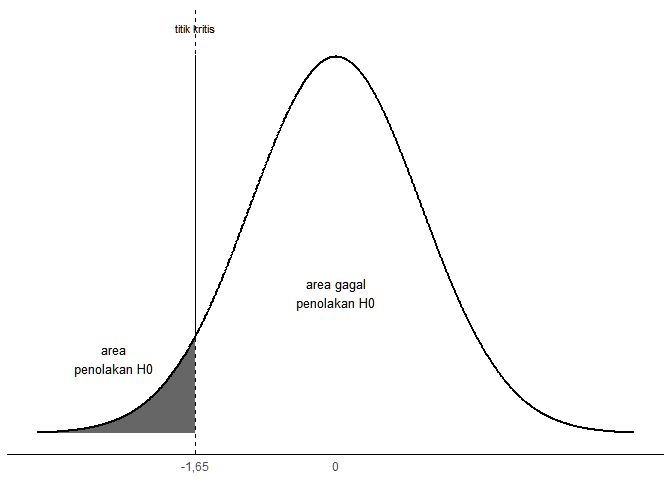
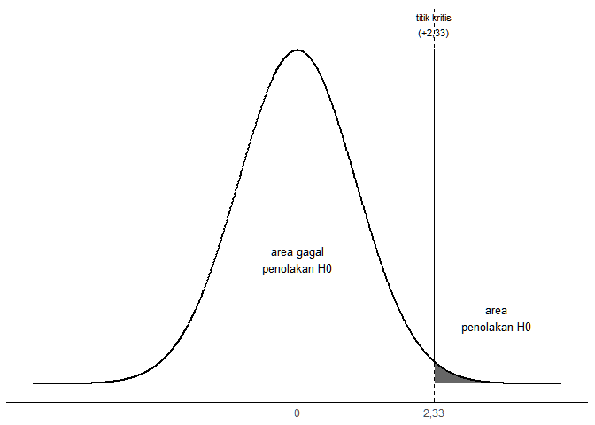
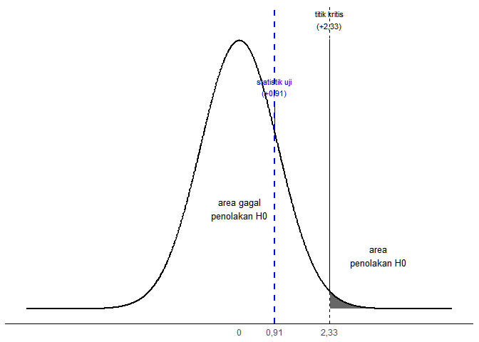
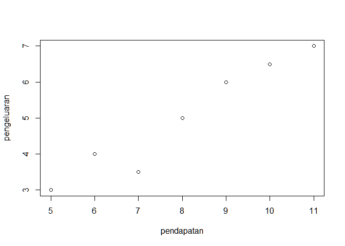

# Statistika untuk Perencanaan {.unnumbered}

Placeholder


<!--chapter:end:index.Rmd-->


# Konsep Dasar Statistika dalam Perencanaan

Placeholder


### Capaian Pembelajaran {.unnumbered}
## Kedudukan dan Peran Analisis Data dalam Perencanaan
### Studi Kasus: Analisis Data dalam Perencanaan Transportasi Berkelanjutan di Kampus ITERA {#kasus-analisis-data-dalam-perencanaan .unnumbered}
## Penelitian Kuantitatif vs. Penelitian Kualitatif dan Kedudukan Statistik
### Analisis Kuantitatif vs. Analisis Kualitatif {#analisis-kuantitatif-vs-kualitatif}
### Studi Kasus: Penelitian Mengenai Pola Pergerakan Mahasiswa dan Pegawai di Kampus ITERA {.unnumbered}
### Analisis Statistik sebagai Analisis Kuantitatif
## Soal Evaluasi 1 {.unnumbered}

<!--chapter:end:01-konsep-dasar.Rmd-->


# Data Terstruktur

Placeholder


### Capaian Pembelajaran {.unnumbered}
## Elemen Data Terstruktur {#kasus-elemen-data-terstruktur}
### Studi Kasus: Elemen Data Terstruktur {.unnumbered} 
## Tabulasi Data Terstruktur yang Baik
### Studi Kasus: Perbandingan Data yang Tidak Rapi dan Data yang Rapi {.unnumbered} 
## Soal Evaluasi 2 {.unnumbered}
## Tingkat Pengukuran Variabel
### Studi Kasus: Tingkat Pengukuran Variabel {.unnumbered}
## Jenis-jenis Tingkat Pengukuran Variabel
### Nominal
### Ordinal
### Metrik (Angka)
## Menentukan Tingkat Pengukuran Variabel
### Studi Kasus: Menentukan Tingkat Pengukuran Variabel {.unnumbered}
## Soal Evaluasi 3 {.unnumbered}

<!--chapter:end:02-data-terstruktur.Rmd-->


# Analisis Statistik Deskriptif

Placeholder


### Capaian Pembelajaran {.unnumbered}
## Makna Analisis Statistik Deskriptif
## Ukuran Frekuensi
### Studi Kasus: Penerapan Ukuran Frekuensi dari Dataset Hasil Survei {.unnumbered}
### Persentase dan Proporsi
### Studi Kasus: Penerapan Persentase dan Proporsi {.unnumbered}
### Laju *(Rate)*
### Studi Kasus: Perhitungan Laju {.unnumbered}
### Rasio
### Studi Kasus: Perhitungan Rasio Penggunaan Kendaraan {.unnumbered}
### Perubahan Persentase (*Percentage Change*)
### Studi Kasus: Perubahan Persentase Penggunaan Transportasi Online {.unnumbered}
### Studi Kasus: Kesalahan Umum dalam Menafsirkan Kenaikan Pajak {.unnumbered}
## Ukuran Kecenderungan Pemusatan (*Measure Central Tendency*)
### Rata-rata (*mean*)
### Median
### Studi Kasus: Mean dan Median pada Data dengan Pencilan {.unnumbered}
### Modus
### Studi Kasus: Analisis Modus {.unnumbered}
## Ukuran Penyebaran (*Measure of Dispersion*)
### Indeks Variasi Kualitatif (*Index of Qualitative Variance*, IQV)
### Studi Kasus: Keberagaman Distribusi Mahasiswa Antar Fakultas {.unnumbered}
### Rentang (*Range*)
### Studi Kasus: Perbandingan Rentang Biaya Perjalanan Mahasiswa {.unnumbered}
### Kuartil, Desil, dan Persentil
### Studi Kasus: Analisis Posisi Data dengan Kuartil {.unnumbered}
### Variansi (*Variance*) dan Simpangan Baku (*Standard Deviation*)
### Studi Kasus: Menghitung Variansi dan Simpangan Baku Biaya Perjalanan {.unnumbered}
### Rangkuman Teknik Analisis Statistik Deskriptif
## Soal Evaluasi 4 {.unnumbered}

<!--chapter:end:03-statistik-deskriptif.Rmd-->


# Visualisasi Data Kuantitatif

Placeholder


### Capaian Pembelajaran {.unnumbered}
## Konsep Dasar
## Jenis-jenis Diagram
### Variabel Kategorikal
#### Grafik Batang *(Column/Bar Chart)*
#### Grafik Batang Bertumpuk (Stacked Column/Bar Chart) {#materi-bar-chart}
#### Studi Kasus: Visualisasi Moda Transportasi Mahasiswa dengan Diagram Batang  {.unnumbered}
#### Grafik Lollipop
#### Studi Kasus: Perbandingan Grafik Lollipop dengan Grafik Batang {.unnumbered}
#### Grafik *Treemap*
#### Studi Kasus: Membuat Treemap Moda Transportasi {.unnumbered}
#### Grafik Pai/Donat *(Pie/Donut Chart)*
#### Studi Kasus: Membuat Grafik Pai dan Donat {.unnumbered}
### Variabel Numerik
#### Histogram
#### Studi Kasus: Membuat Histogram Biaya Perjalanan {.unnumbered}
#### *Boxplot*
#### Studi Kasus: Membuat Boxplot Biaya Perjalanan Mahasiswa {.unnumbered}
#### Grafik Garis *(Line Plot)* dan Area *(Area Plot)*
#### Grafik Pencar *(Scatterplot)*
#### Studi Kasus: Membuat *Scatterplot* Hubungan Biaya Perjalanan dan Jarak Tempuh {.unnumbered}
## Penggunaan dan Interpretasi Diagram
### Pemilihan Diagram Berdasarkan Tujuan
### Pemilihan Diagram Berdasarkan Jumlah Variabel
### Pemilihan Diagram Berdasarkan Tingkat Pengukuran Variabel
## Soal Evaluasi 5 {.unnumbered}

<!--chapter:end:04-visualisasi-data.Rmd-->


# Pengantar Analisis Statistik Inferensial

Placeholder


## Capaian Pembelajaran {.unnumbered}
## Konsep Dasar Statistika Inferensial
## Populasi vs. Sampel
### Studi Kasus: Populasi vs. Sampel {.unnumbered}
## Teknik-Teknik Pengambilan Sampel *(Sampling Techniques)*
### Studi Kasus: Pengambilan Sampel dengan Populasi Kecil {.unnumbered}
### *Simple Random Sampling*
### Catatan: Miskonsepsi tentang Istilah Random {.unnumbered}
### Studi Kasus: *Simple Random Sampling* dengan Populasi Kecil {.unnumbered}
### *Systematic Random Sampling*
### Studi Kasus: *Systematic Sampling* dengan Populasi Kecil {.unnumbered}
### *Stratified Random Sampling*
### Studi Kasus: *Stratified Random Sampling* dengan Populasi Kecil {.unnumbered}
### *Multi-Stage Cluster Sampling*
### Studi Kasus: *Multi-Stage Cluster Sampling* dengan Populasi Kecil {.unnumbered}
## Soal Evaluasi 6 {.unnumbered}
## Menentukan Ukuran Sampel
### Studi Kasus: Menentukan Jumlah Sampel dari Tabel {.unnumbered}
## Konsep Distribusi dalam Statistik
### Model-model Distribusi Statistik
### Distribusi Normal {#bab-5-distribusi-normal}
### Distribusi Objek dan Distribusi Statistik
### Studi Kasus: Distribusi Objek vs Distribusi Statistik {.unnumbered}
## Soal Evaluasi 7 {.unnumbered}
## Teorema Limit Sentral
### Studi Kasus: Simulasi Teorema Limit Sentral {.unnumbered}
### Studi Kasus: Efek Ukuran Sampel terhadap Variasi {.unnumbered}
## Soal Evaluasi 8 {.unnumbered}
## Menghitung Peluang Kemunculan Nilai Tertentu dari Distribusi Statistik yang Berbentuk Normal.
### *Standard Error* (SE)
### Studi Kasus: Menghitung Standard Error {.unnumbered}
## Soal Evaluasi 9 {.unnumbered}
### Nilai Standar (*Z-Score*)
### Studi Kasus: Menghitung *Z-Score* Suatu Nilai {.unnumbered}
### Studi Kasus: Menghitung *Z-Score* Rata-rata Sampel {.unnumbered}
## Soal Evaluasi 10 {.unnumbered}
### Menentukan Probabilitas Terjadinya Suatu Nilai {#probabilitas-nilai-di-distribusi-statistik}
### Studi Kasus: Probabilitas Ditemukannya Suatu Sampel dengan Rata-rata Tertentu Dibandingkan dengan Rata-rata Populasi {.unnumbered}
### Menentukan Nilai yang Menjadi Pembatas Suatu Probabilitas {#untuk-z-kritis}
### Studi Kasus: Menentukan Batas Biaya Perjalanan Ekstrem (Distribusi Objek) {.unnumbered}
## Soal Evaluasi 11 {.unnumbered}

<!--chapter:end:05-pengantar-inferensial.Rmd-->


# Estimasi Parameter {#bab-6-estimasi-parameter}

Placeholder


### Capaian Pembelajaran {.unnumbered}
## Statistik vs. Parameter
### Studi Kasus: Statistik vs Parameter {.unnumbered}
## Estimasi Titik vs. Estimasi Rentang
### Estimasi Titik
### Studi Kasus: Keterbatasan Estimasi Titik {.unnumbered}
### Estimasi Rentang
### Studi Kasus: Keuntungan Estimasi Rentang {.unnumbered}
## Konsep Perhitungan Rentang Kepercayaan Sebagai Estimasi Rentang
### Perhitungan Rentang Kepercayaan Rata-rata
### Studi Kasus: Menghitung Rata-rata Jarak Tempat Tinggal Mahasiswa ITERA Berdasarkan Jenis Tempat Tinggalnya {.unnumbered}
## Soal Evaluasi 12 {.unnumbered}
### Perhitungan Rentang Kepercayaan Proporsi
### Studi Kasus: Proporsi Mahasiswa Berdasarkan Jenis Tempat Tinggal {.unnumbered}
## Soal Evaluasi 13  {.unnumbered}
## Lebih Dalam tentang Tingkat Kepercayaan (*Confidence Level*) {#tingkat-kepercayaan}
### Catatan: Salah Kaprah Tingkat Kepercayaan {.unnumbered}
### Studi Kasus: Pengaruh Tingkat Kepercayaan terhadap Lebar Rentang Kepercayaan {.unnumbered}
## Kesimpulan: Interpretasi Estimasi Parameter

<!--chapter:end:06-estimasi-parameter.Rmd-->

# Uji Hipotesis Parameter Satu Populasi {#bab-7-uji-hipotesis-satu-populasi}

::: rmdcapaian
### Capaian Pembelajaran {.unnumbered}

Setelah mempelajari bab ini, Anda diharapkan mampu memaknai hasil dari pengujian hipotesis parameter satu populasi pada suatu kasus [STP-6.1]{.capaian}
:::

## Konsep Dasar Uji Hipotesis Parameter {#konsep-dasar-uji-hipotesis-1samp}

Analisis statistika inferensial dengan uji hipotesis parameter digunakan untuk **memperkirakan nilai dari parameter** melalui **pengujian hipotesis nilai sebuah parameter** berdasarkan informasi yang diperoleh dari sampel, atau seperti yang telah kita pelajari, disebut **statistik** [@healey2021statistics]. Hipotesis sendiri dapat dipahami sebagai **dugaan awal mengenai suatu kondisi, nilai, atau keadaan parameter**. Dalam metode ilmiah, hipotesis berasal dari teori, penelitian sebelumnya, atau klaim tertentu yang ingin diuji  [@ewing2020basic; @healey2021statistics].

Melalui pengujian hipotesis, inferensi dilakukan dengan menarik kesimpulan terhadap hasil pengujian hipotesis kita berdasarkan statistik yang kita peroleh (Gambar \@ref(fig:fig-ilustrasi-hipotesis)). Secara sederhana, analisis diawali dengan pertanyaan: "Apakah nilai parameter $\mu = b$?". Bentuk pertanyaan ini bisa kita ubah juga menjadi bentuk pernyataan, atau **hipotesis**, yakni "nilai parameter kita $b$ ($\mu = b$)." Kesimpulan yang kita akan ambil nanti hanya ada di antara dua pilihan: **menerima** atau **menolak** hipotesis tersebut.

<div class="figure" style="text-align: center">

<p class="caption">(\#fig:fig-ilustrasi-hipotesis)Ilustrasi Alur Hubungan Parameter, Sampel, dan Inferensinya</p>
</div>

::: rmdkasus
### Studi Kasus: Alur Logika Evaluasi Makan Bergizi Gratis (MBG) {.unnumbered}

Sebagai pelengkap dari ilustrasi alur pengujian di atas, mari perhatikan kasus evaluasi kepuasan program Makan Bergizi Gratis (MBG). Pemerintah ingin mengetahui rata-rata tingkat kepuasan dari seluruh penerima manfaat (populasi) di mana nilai sejatinya belum diketahui ($\mu = \,?$). Pemerintah memiliki **pertanyaan evaluasi**: *"Apakah benar program MBG memberikan rata-rata skor kepuasan hingga mencapai nilai standar 80?"* Pertanyaan ini kemudian disusun menjadi **pernyataan sasaran (hipotesis)** bahwa "Rata-rata kepuasan populasi adalah 80" ($\mu = 80$). 

Untuk membuktikan apakah pernyataan asumsi ini bisa dipertahankan, dilakukan **pengambilan sampel** secara acak terhadap 200 responden. Dari data sampel tersebut, diperoleh nilai **statistik** rata-rata kepuasan sebesar 95 ($\bar{x} = 95$). Nilai bukti dari data sampel ($\bar{x}=95$) inilah yang digunakan sebagai landasan analisis (**uji**) untuk mempertanyakan keabsahan dari klaim awal ($\mu=80$). Puncak dari uji ini bermuara pada **kesimpulan**: yakni apakah pernyataan sasaran dapat tetap dilanggengkan (diterima) atau justru harus digugurkan (*ditolak*) karena dibantah oleh bukti empiris.
:::

## Perbedaan Uji Hipotesis Parameter dengan Estimasi Parameter {#perbedaan-uji-hipotesis-estimasi-parameter}

Estimasi parameter dan uji hipotesis parameter **sama-sama bertujuan memperkirakan nilai parameter**. Akan tetapi, keduanya melakukannya  dengan cara yang berbeda. Estimasi parameter menghasilkan suatu **rentang nilai yang memuat parameter-parameter yang mungkin* bagi parameter populasi**. Pertanyaan yang dijawab berupa *"Berapa kira-kira nilai rata-rata populasi?"*

Sementara itu, uji hipotesis parameter berfokus pada **penerimaan atau penolakan dugaan** kita tentang hipotesis terhadap parameter. Pertanyaan yang dijawab berupa *"Jika saya menduga bahwa rata-rata populasi adalah $b$, apakah dugaan tersebut dapat diterima?"*


## Hipotesis Kosong dan Hipotesis Alternatif {#hipotesis-kosong-dan-alternatif}

Sebagaimana yang sudah dibahas di subbab \@ref(konsep-dasar-uji-hipotesis-1samp) dan \@ref(perbedaan-uji-hipotesis-estimasi-parameter), inferensi dilakukan dengan menguji hipotesis yang mengandung pernyataan terhadap parameter, yakni **mana hipotesis yang bisa kita terima?**

Oleh karena kita harus memilih, maka minimal kita memiliki **dua** jenis (dan memang tidak lebih) hipotesis, yaitu **hipotesis kosong** ($H_0$) dan **hipotesis alternatif** ($H_1$ atau $H_a$) yang masing-masing akan dijelaskan dengan rinci sebagai berikut.

### Hipotesis Kosong {#konsep-hipotesis-kosong}

Hipotesis kosong *(null hypothesis)* muncul dari prinsip ilmiah bahwa **pengetahuan harus dapat dibuktikan oleh data**. Konsekuensinya, peneliti tidak bisa langsung membenarkan suatu klaim atau fenomena baru secara sepihak sebelum memiliki bukti empiris (data). Oleh karena itu, prosedur yang paling logis adalah menetapkan hipotesis kosong sebagai pijakan awal; yakni sebuah kerangka netral (*status quo*) yang berasumsi bahwa dugaan baru tersebut belum terbukti dan kondisi yang ada diasumsikan tidak mengalami perubahan dari standar umumnya.

Di sinilah statistik hasil pengumpulan data memainkan perannya: ia tidak digunakan untuk menyusun pernyataan hipotesis kosong itu sendiri, melainkan didatangkan belakangan sebagai **alat bukti** untuk menguji apakah *status quo* tersebut masih layak dipertahankan atau justru sangat lemah sehingga harus ditolak [@healey2021statistics].

Dalam pengertian matematis, hipotesis kosong yang merupakan kondisi netral atau status quo ini dinyatakan dengan menggunakan simbol persamaan ($=$). Oleh karena itu, penulisan hipotesis kosong selalu menggunakan simbol persamaan, misalnya $\mu = \mu_0$ atau $P = P_0$. Secara umum, penulisan hipotesis nol adalah:

$$
H_0 : \text{parameter} = \text{nilai dugaan}
(\#eq:bentuk-umum-h0)
$$

Secara khusus, jika kita menyatakan hipotesis parameter rata-rata dan proporsi, kita menyebut $\text{nilai dugaan}$ ini dengan notasi sesuai parameternya dan diberi *subscript* $0$.

$$
\begin{aligned}
&H_0 : \mu = \mu_0, \\
&H_0 : P = P_0
\end{aligned}
(\#eq:bentuk-khusus-h0)
$$


::: rmdkasus
### Studi Kasus: Menentukan Hipotesis Kosong pada Evaluasi MBG {.unnumbered}

Misalkan kita memiliki pertanyaan evaluasi: *"Apakah benar bahwa program MBG berhasil dengan memberikan kepuasan kepada masyarakat?"*. Kita pun menetapkan nilai 80 sebagai ambang kepuasan masyarakat. Dalam hal ini, ada dua kemungkinan kondisi yang terjadi: 

1) program tidak memberikan kepuasan kepada masyarakat sehingga rata-rata nilai 80 (atau mungkin kurang); atau
2) program berhasil memberikan kepuasan kepada masyarakat sehingga rata-rata nilai lebih dari 80.

Kemungkinan pertama, yaitu "program tidak memberikan kepuasan kepada masyarakat", menggambarkan kondisi netral atau tidak ada perbedaan. Oleh karena itu, pernyataan ini dijadikan sebagai hipotesis kosong ($H_0$) dan dituliskan dengan simbol persamaan ($=$). Secara matematis, hipotesis kosong untuk rata-rata skor kepuasan ini dapat dinyatakan sebagai berikut:

$$H_0: \mu = 80$$

Dalam kasus ini, karena kita menetapkan nilai minimal masyarakat "puas" adalah pada rata-rata skor = 80, dugaan terhadap rata-rata skor kepuasan populasi adalah 80, sehingga $\mu_0 = 80$.

:::

### Hipotesis Alternatif {#konsep-hipotesis-alternatif}

Sementara itu, hipotesis alternatif (*alternative hypothesis* $H_1$) adalah **klaim kita terhadap keadaan netral atau standar yang diasumsikan dalam hipotesis kosong** [@healey2021statistics]. Jika hipotesis kosong mewakili *status quo* bahwa "tidak ada yang terjadi", klaim dalam hipotesis alternatif justru menantang hal tersebut dengan menyatakan bahwa "ada sesuatu yang berubah atau berdampak" sehingga perlu dibuktikan. Dengan kata lain, hipotesis alternatif menyatakan adanya **perbedaan** yang ingin dibuktikan peneliti.

Hipotesis alternatif ini dapat berbentuk **tidak berarah**, misalnya hanya menyatakan "ada perbedaan" tanpa menyebutkan ke arah mana perbedaannya, atau **berarah**, yaitu menyatakan secara spesifik bahwa suatu kondisi "lebih besar", "lebih kecil", atau "lebih tinggi" dibandingkan standar yang ada.

Secara rinci ragam bentuk hipotesis alternatif ini adalah sebagai berikut [@tjokropandojo2021pengantar]:

1. Kasus **"tidak sama dengan" ($\neq$)** digunakan ketika dugaan hanya menyatakan "ada perbedaan", tanpa menyebutkan lebih besar atau lebih kecil.
2. Kasus **"lebih dari" ($>$)** digunakan ketika dugaan menyatakan bahwa parameter populasi lebih besar daripada nilai dugaan.
3. Kasus **"kurang dari" ($<$)** digunakan ketika dugaan menyatakan bahwa parameter populasi lebih kecil daripada nilai dugaan.

Adapun bentuk matematis dari hipotesis alternatif yang mungkin dipilih ditampilkan pada Tabel \@ref(tab:tab-bentuk-hipotesis-alternatif) berikut.

<table class="table table-striped table-hover table-condensed table-responsive" style="color: black; width: auto !important; margin-left: auto; margin-right: auto;">
<caption>(\#tab:tab-bentuk-hipotesis-alternatif)Alternatif Bentuk Hipotesis Alternatif</caption>
 <thead>
  <tr>
   <th style="text-align:left;"> No </th>
   <th style="text-align:left;"> Bentuk Kasus </th>
   <th style="text-align:center;"> Persamaan Matematis </th>
   <th style="text-align:left;"> Interpretasi </th>
  </tr>
 </thead>
<tbody>
  <tr>
   <td style="text-align:left;"> 1 </td>
   <td style="text-align:left;"> Tidak sama dengan </td>
   <td style="text-align:center;"> $H_1: \mu \neq \mu_0$ </td>
   <td style="text-align:left;"> Rata-rata parameter tidak sama dengan nilai dugaan </td>
  </tr>
  <tr>
   <td style="text-align:left;"> 2 </td>
   <td style="text-align:left;"> Lebih dari </td>
   <td style="text-align:center;"> $H_1: \mu > \mu_0$ </td>
   <td style="text-align:left;"> Rata-rata parameter lebih besar nilai dugaan </td>
  </tr>
  <tr>
   <td style="text-align:left;"> 3 </td>
   <td style="text-align:left;"> Kurang dari </td>
   <td style="text-align:center;"> $H_1: \mu < \mu_0$ </td>
   <td style="text-align:left;"> Rata-rata parameter lebih kecil (tidak sama) dengan nilai dugaan </td>
  </tr>
</tbody>
</table>

::: rmdkasus
### Studi Kasus: Menentukan Hipotesis Alternatif pada Evaluasi MBG {.unnumbered}

Pada evaluasi kepuasan program MBG, hipotesis alternatif mencerminkan kemungkinan kondisi ke-2, yaitu "program berhasil memberikan kepuasan kepada masyarakat sehingga rata-rata nilai lebih dari 80". Ini adalah contoh kasus untuk bentuk hipotesis alternatif yang berarah karena menggunakan pertidaksamaan (ada kata "lebih dari"). Dengan demikian, penulisan hipotesis alternatif untuk kasus ini adalah sebagai berikut:

$$
H_1: \mu > 80
$$
:::

### Pentingnya Menentukan Bentuk Hipotesis Alternatif {#pentingnya-menentukan-bentuk-h1}

Memilih bentuk hipotesis alternatif sesuai yang dijelaskan pada Tabel \@ref(tab:tab-bentuk-hipotesis-alternatif) sangat penting karena ini menjadi penentu **posisi wilayah kritis** pada kurva distribusi statistik sampel, yang menjadi penentu kita **menolak/menerima hipotesis kosong**. Posisi ini disebut ***tail* (ekor)** yang merupakan istilah untuk posisi wilayah kritis sebagaimana yang dijelaskan lebih rinci pada subbab berikutnya.

### Kemungkinan Hasil Pengujian Hipotesis: "Menerima $H_0$" atau "Gagal Menolak $H_0$"?

Hasil dari pengujian hipotesis hanya memiliki dua kemungkinan, yaitu **menolak** atau **gagal menolak hipotesis kosong ($H_0$)**. Kita tidak menggunakan diksi "menerima" hipotesis kosong karena pendekatan statistik **bukan untuk membuktikan bahwa hipotesis kosong ($H_0$) benar**. Fokus pengujian hipotesis adalah mencari kemungkinan untuk menolak hipotesis kosong ($H_0$), bukan membuktikan kebenarannya. Dengan cara pandang ini, proses pengolahan data menjadi lebih mudah dipahami: kita mencari bukti untuk **menolak dugaan awal**, bukan membuktikan bahwa dugaan awal itu pasti benar.

::: rmdnote
### Catatan: Analogi Pengadilan {.unnumbered}

Pengujian hipotesis dapat dianalogikan seperti proses peradilan di pengadilan. Dalam analogi ini, posisi terdakwa adalah hipotesis kosong ($H_0$), alat bukti di persidangan adalah data sampel (statistik hitung), dan vonis pengadilan adalah hasil uji statistiknya. 

Sebagaimana asas praduga tak bersalah, dari awal proses pengadilan selalu diasumsikan bahwa terdakwa tidak bersalah (kondisi awal netral). Tugas peneliti adalah mengumpulkan **alat bukti** (observasi dan data sampel) untuk mendukung dakwaan bahwa telah terjadi sesuatu yang menyimpang (hipotesis alternatif).

Jika bukti dari data sampel *sangat kuat dan meyakinkan*, maka pengujian akan **menolak $H_0$** (terdakwa divonis bersalah). Namun, jika bukti-bukti data sampel kurang kuat, kaidah statistik tidak otomatis menyimpulkan "kami memastikan Anda tidak bersalah" (*menerima $H_0$*). Sebaliknya, keputusan yang diambil adalah "bukti terlalu lemah untuk membuktikan Anda bersalah". Dalam bahasa statistik, ini disebut dengan **gagal menolak $H_0$**, yakni saat alat bukti (statistik sampel) tidak cukup memadai untuk menggugurkan dugaan mula-mula (*status quo*) yang kita miliki.
:::


### Menentukan Hasil Pengujian Hipotesis Parameter

Penentuan hasil pengujian hipotesis dilakukan dengan menggabungkan tiga besaran penting: **titik kritis**, **wilayah kritis** dan **nilai *p* (*p-value*)**. Seluruhnya didasarkan pada konsep perhitungan probabilitas pada distribusi statistik sebagaimana yang dijelaskan pada subbab \@ref(probabilitas-nilai-di-distribusi-statistik).

#### Titik Kritis dan Wilayah Kritis {#titik-kritis-wilayah-kritis}

Sesuai konsep distribusi statistik normal, titik kritis (*critical value*) sebenarnya adalah nilai $Z$ pada distribusi statistik yang **menandai batas awal dari wilayah kritis** (*critical region*), sehingga disebut juga nilai $Z_{kritis}$ atau $Z_{critical}$/$Z_{crit}$. Wilayah kritis adalah **wilayah penolakan $H_0$** karena wilayah ini mencakup nilai statistik yang dianggap "tidak mungkin" ditemukan jika kita gagal menolak $H_0$ [@healey2021statistics]. Praktisnya, titik kritis menjadi pemisah kedua area untuk menentukan apakah $H_0$ ditolak atau gagal ditolak.   

Wilayah kritis ditentukan oleh dua hal: **tingkat signifikansi ($\alpha$)** dan **bentuk hipotesis alternatif**. Secara grafis, wilayah kritis sebenarnya adalah wilayah (c) pada Gambar \@ref(fig:fig-distribusi-normal-area-bc). Penentuan titik kritisnya dilakukan dengan memanfaatkan tabel distribusi, yaitu Tabel Z atau Tabel Distribusi Normal, seperti yang sudah dipelajari di \@ref(untuk-z-kritis) untuk ukuran sampel besar, dan Tabel Distribusi t untuk ukuran sampel kecil. Untuk saat ini, dapat kita sepakati bahwa ukuran sampel besar adalah jumlah sampel lebih dari 100, sedangkan sampel dengan jumlah 100 atau kurang digolongkan sebagai sampel kecil [@devaus2014surveys; @kachigan1986statistical].

Seperti yang telah dijelaskan, untuk menentukan wilayah kritis kita harus memperhatikan juga **bentuk hipotesis alternatif yang telah dirumuskan**. Inilah yang dimaksud pada subbab \@ref(pentingnya-menentukan-bentuk-h1):

a. **Kasus tidak sama dengan (*two tailed*)**  
   Kasus tidak sama dengan adalah bentuk hipotesis tanpa arah, sehingga wilayah kritis akan terbagi dua secara sama rata di ekor kurva. Apabila kita menetapkan $\alpha = 5\%$, maka masing-masing ekor akan menampung $\alpha/2 = 2,5\%$. Dalam hal ini, titik kritis dihitung berdasarkan nilai $\alpha/2$.

b. **Kasus lebih dari (*right tailed*)**  
   Selanjutnya untuk bentuk lebih dari, wilayah kritis hanya berada di ekor kanan kurva. Dengan $\alpha = 5\%$, titik kritis ditentukan langsung berdasarkan nilai $\alpha$ tersebut.

c. **Kasus kurang dari (*left tailed*)**  
   Wilayah kritis akan berada di ekor sebelah kiri. Sama halnya dengan bentuk lebih dari, nilai titik kritis ditentukan langsung berdasarkan nilai $\alpha$ yang digunakan.

Ketiga bentuk hipotesis alternatif ini akan menghasilkan wilayah kritis yang berbeda-beda, seperti yang disajikan pada Gambar \@ref(fig:fig-titik-kritis-distribusi) berikut.

<div class="figure" style="text-align: center">

<p class="caption">(\#fig:fig-titik-kritis-distribusi)Ilustrasi Titik Kritis pada Kurva Distribusi Normal</p>
</div>

#### Nilai Statistik Uji dan Nilai p (*p-value*) {#nilai-statistik-uji-nilai-p}

Setelah titik kritis ditetapkan ($Z_{crit}$ untuk sampel besar atau $t_{crit}$ untuk sampel kecil), kita bisa mengambil dua pendekatan untuk menentukan hasil pengujian: pendekatan **statistik uji** atau **nilai-p (*p-value*)**.

Pendekatan statistik uji *(test statistic)* berupa Z atau t, tergantung jenis distribusi yang digunakan, menggunakan nilai statistik uji yang dihitung dari data sampel kita. Nilai statistik uji tersebut kemudian **dibandingkan dengan titik kritis** yang telah diperoleh sebelumnya dan **diperhatikan posisinya terhadap wilayah kritis**. Ini yang akan menentukan apakah hipotesis kosong kita ditolak atau gagal ditolak:

*  Jika nilai statistik uji **tidak jatuh ke dalam wilayah kritis**, maka hasil pengujian kita adalah hipotesis kosong gagal ditolak ($H_0$ gagal ditolak).

*  Jika nilai statistik uji **jatuh di dalam wilayah kritis**, maka hasil pengujian kita adalah hipotesis kosong dapat ditolak ($H_0$ ditolak).

Nilai statistik uji untuk **rata-rata** dihitung dengan rumus berikut:

$$
\begin{equation}
Z = \frac{\bar{x} - \mu_0}{s / \sqrt{n}}
(\#eq:statistik-uji-mean)
\end{equation}
$$

dengan:

*  $Z$ : nilai statistik uji
*  $\bar{x}$ : rata-rata sampel
*  $\mu_0$ : nilai dugaan
*  $s$ : simpangan baku sampel
*  $n$ : ukuran sampel

Sedangkan, untuk **proporsi**, statistik ujinya dihitung dengan rumus berikut:

$$
\begin{equation}
Z = \frac{\hat{p} - p_0}{\sqrt{\frac{p_0(1 - p_0)}{n}}}
(\#eq:statistik-uji-proporsi)
\end{equation}
$$

dengan:

*  $Z$ : nilai statistik uji
*  $\hat{p}$ : proporsi sampel
*  $p_0$ : proporsi dugaan
*  $n$ : ukuran sampel

Nilai p atau *p-value* adalah cara lain selain titik kritis untuk menentukan nasib $H_0$. Secara ringkas dan sederhana, *p-value* dapat dibayangkan semacam "peluang kebetulan", yakni probabilitas yang menjawab pertanyaan: **"seberapa mungkin bukti dari data yang kita dapatkan ini terjadi sekadar karena kebetulan semata (dengan anggapan $H_0$ benar)?"** Semakin kecil nilai peluang ini, semakin tidak masuk akal pula bagi kita untuk percaya bahwa hasil pengamatan dari sampel tersebut hanyalah suatu kebetulan, sehingga **$H_0$ menjadi sangat wajar untuk ditolak**.

Penolakan $H_0$ didasarkan pada perbandingannya dengan nilai signifikansi ($\alpha$) yang kita gunakan.

*  Jika nilai *p-value* **lebih besar dari $\alpha$**, maka kita **gagal menolak $H_0$** (Gambar \@ref(fig:fig-penetapan-hipotesis) (a)).
*  Jika nilai *p-value* **lebih kecil dari $\alpha$**, maka kita **menolak $H_0$** (Gambar \@ref(fig:fig-penetapan-hipotesis) (b)).

<div class="figure" style="text-align: center">

<p class="caption">(\#fig:fig-penetapan-hipotesis)Ilustrasi Perbandingan Nilai p (p-value) dengan Wilayah Kritis (Uji Satu Ekor)</p>
</div>


### Langkah-langkah Pengujian Hipotesis

Berdasarkan konsep-konsep yang sudah kita pelajari sebelunya, berikut adalah rangkuman langkah-langkah pengujian hipotesis.

a. Menetapkan hipotesis kosong dan alternatif (\@ref(konsep-hipotesis-kosong) dan \@ref(konsep-hipotesis-alternatif))
b. Menetapkan wilayah kritis dari signifikansi (\@ref(titik-kritis-wilayah-kritis))
c. Mencari nilai titik kritis (\@ref(titik-kritis-wilayah-kritis))
d. Mencari nilai statistik uji (\@ref(nilai-statistik-uji-nilai-p))
e. Membandingkan nilai statistik uji dan titik kritis (\@ref(nilai-statistik-uji-nilai-p))
f. Menarik kesimpulan dan memaknai hasil pengujian.

::: rmdkasus
### Studi Kasus: Melanjutkan Langkah Pengujian Hipotesis MBG {.unnumbered}

Mari kita lanjutkan pembahasan evaluasi program MBG ini. Sebelumnya di subbab hipotesis, kita telah merumuskan hipotesis kosong dan alternatif sebagai berikut:

$$H_0: \mu = 80$$
$$H_1: \mu > 80$$

Berdasarkan hasil survei terhadap sampel berukuran besar yakni 200 orang ($n=200$), diperoleh rata-rata skor kepuasan ($\bar{x}$) adalah 95 dengan simpangan baku ($s$) 2,3. Mari kita lakukan sisa langkah-langkah pengujian (langkah b s.d. f) dengan menggunakan tingkat signifikansi 5% ($\alpha = 5\%$).

**b. Menetapkan Wilayah Kritis**  
Berdasarkan hipotesis alternatif ($H_1$), arah ketidaksamaan yang digunakan adalah "lebih dari" ($>$). Oleh karena itu, kita menggunakan uji ekor kanan (*right-tailed test*). 

**c. Mencari Nilai Titik Kritis**  
Mengingat ukuran sampel kita besar ($n = 200 > 100$), kita menggunakan **Distribusi Z** sebagai acuan penentuan kritisnya. Dengan tingkat signifikansi $\alpha = 5\%$, kita mendapati nilai titik kritis di tabel Z adalah $Z_{kritis} = +1,65$. Titik ini menjadi batas awal di mana nilai $Z > +1,65$ merupakan wilayah kritis.

<div class="figure" style="text-align: center">

<p class="caption">(\#fig:fig-kurva-kritis-mbg)Distribusi Sampling dan Wilayah Kritis Kasus MBG</p>
</div>

**d. Mencari Nilai Statistik Uji**  
Kita akan menghitung nilai statistik hitung Z berdasarkan data sampel:

- $\bar{x} = 95$
- $\mu_0 = 80$
- $s = 2,3$
- $n = 200$

$$
\begin{aligned}
Z &= \frac{\bar{x} - \mu_0}{s / \sqrt{n}} \\
&= \frac{95 - 80}{2,3 / \sqrt{200}} \\
&= \frac{15}{0,1626} \\
&= +92,25
\end{aligned}
$$

Nilai statistik uji yang diperoleh adalah $Z = +92,25$.

**e. Membandingkan Nilai Statistik Uji dan Titik Kritis**  
Nilai statistik uji $Z_{hitung} = +92,25$ jatuh sejauh mungkin ke dalam wilayah kritis di sebelah kanan karena nilainya lebih besar dari titik kritis $Z_{kritis} = +1,65$. Oleh karena itu, keputusannya adalah **menolak hipotesis kosong ($H_0$)**.

**f. Menarik Kesimpulan dan Memaknai Hasil**  
Dengan menolak $H_0$, terbukti bahwa rata-rata skor kepuasan masyarakat yang diperoleh dari sampel, yaitu 95, berada secara signifikan di atas ambang batas 80. Hasil secara saintifik ini selaras dan dapat memastikan hipotesis alternatif kita ($H_1$), yaitu program MBG dinilai **berhasil** karena skor kepuasan populasinya diprediksi kuat melampaui indikator yang ditetapkan.
:::

Mari kita pelajari kasus lain yang langkah-langkahnya lebih terlihat dari awal sampai akhir, juga untuk statistik proporsi

::: rmdkasus
### Studi Kasus: Layanan Bus Kampus {.unnumbered}

*Dengan menggunakan data pada subbab sebelumnya mengenai jarak tempat tinggal mahasiswa ITERA menuju kampus yang menghasilkan rata-rata 4,95 km dan simpangan baku 2,23 km didasarkan pada jawaban 333 responden, pihak kampus merespons kebutuhan mobilitas mahasiswa dengan merencanakan penyediaan layanan Bus Kampus. Namun, layanan ini hanya akan efektif jika mayoritas mahasiswa tinggal pada jarak dekat ($\leq 5$ km) dari kampus dan apabila lebih dari 80% mahasiswa berminat terhadap layanan tersebut.*


#### Pengujian Hipotesis Rata-rata Populasi {.unnumbered}

*Pada tingkat kepercayaan 95%, apakah layanan Bus Kampus akan efektif melayani seluruh mahasiswa ITERA, yang dengan bentuk pertanyaan lain, apakah benar mahasiswa ITERA tinggal $\leq 5$ km dari kampus?*

##### Menetapkan Hipotesis Kosong dan Alternatif ($H_0$ dan $H_1$) {.unnumbered}

Bentuk kondisi netral yang dapat dijadikan hipotesis kosong adalah **rata-rata sama dengan 5 km**. Untuk bentuk hipotesis alternatifnya, kita berusaha membuktikan agar klaim kita bahwa "penyediaan bus akan efektif saat rata-rata jarak tempuh dari tempat tinggal <5 km" bisa menolak hipotesis kosong. Dengan demikian, bentuk hipotesis alternatif kita adalah kondisi di mana penyediaan bus akan efektif (<5 km).

$$
H_0: \mu = 5 \text{ km}\\
H_1: \mu < 5 \text{ km}
$$

Pada hipotesis tersebut, $H_0$ menunjukkan kondisi bahwa rata-rata jarak adalah 5 km. $H_1$ berusaha menolak hipotesis kosong dengan mengeklaim bahwa penyediaan bus efisien, di saat rata-rata <5 km.

##### Menetapkan Wilayah Kritis dari Signifikansi {.unnumbered}

Karena kita menggunakan sampel besar, kita menggunakan distribusi Z. Lalu, kita menggunakan tingkat kepercayaan 95%, yang berarti tingkat kepercayaan kita adalah $\alpha = 5\% = 0,05$.

Berdasarkan subbab \@ref(titik-kritis-wilayah-kritis), dan Gambar \@ref(fig:fig-titik-kritis-distribusi), kita menggunakan bentuk (b) atau *left-tailed*.


##### Mencari Nilai Titik Kritis {-}

Berdasarkan tabel Distribusi Z, nilai titik kritis untuk $\alpha = 5\%$ *left-tailed* adalah $-1,65$.

<div class="figure" style="text-align: center">

<p class="caption">(\#fig:fig-kurva-kritis-bus-kampus)Distribusi Sampling dan Wilayah Kritis Kasus Rata-rata Jarak ke Kampus ITERA</p>
</div>

##### Mencari Nilai Statistik Uji {-}

Kita menggunakan persamaan \@ref(eq:statistik-uji-mean) untuk menghitung statistik uji kita.

- $\bar{x} = 4,59$
- $\mu_0 = 5$
- $s = 2,23$
- $n = 333$

$$
\begin{aligned}
Z &= \frac{\bar{x} - \mu_0}{s / \sqrt{n}} \\
&= \frac{4,59 - 5}{2,23 / \sqrt{333}} \\
&= \frac{-0,41}{0,122} \\
&= \frac{-0,41}{0,122}
\end{aligned}
$$

##### Membandingkan Nilai Statistik Uji dan Titik Kritis {-}

- $Z_{hitung} = -3,36$
- $Z_{kritis} = -1,65$

Nilai statistik uji **jatuh ke dalam wilayah kritis** karena nilai $Z_{hitung}$ (-3,36) lebih kecil dari $Z_{kritis}$ (-1,65) sehingga berada di sebelah kirinya (masuk ke dalam area penolakan $H_0$) (Gambar \@ref(fig:fig-perbandingan-z-jarak)).

<div class="figure" style="text-align: center">

<p class="caption">(\#fig:fig-perbandingan-z-jarak)Perbandingan Nilai Statistik Uji dan Titik Kritis (Kasus Jarak ke Kampus ITERA)</p>
</div>

##### Menarik Kesimpulan dan Memaknai Hasil {-}

Dengan demikian, data sampel kita cukup untuk dapat menolak $H_0$, yaitu bahwa rata-rata jarak mahasiswa ITERA ke kampus adalah 5 km atau kurang. Berdasarkan perhitungan statistik, penyediaan Bus Kampus dapat dianggap tepat dan berpotensi efektif. 


#### Pengujian Hipotesis Proporsi Populasi {.unnumbered}

*Program dinilai akan berhasil apabila lebih dari 80% mahasiswa berminat. Berdasarkan survei terhadap 333 responden, diketahui 82% mahasiswa berminat. Dengan tingkat kepercayaan 99%, kita uji hipotesis parameter proporsi ini.*

##### Menetapkan Hipotesis Kosong dan Alternatif ($H_0$ dan $H_1$) {-}

Bentuk kondisi netral yang dapat dijadikan hipotesis kosong adalah **proporsi mahasiswa yang berminat sama dengan 80%**. Untuk bentuk hipotesis alternatifnya, kita berusaha untuk membuktikan klaim bahwa program akan berhasil jika minat melebihi 80%. Dengan demikian, bentuk hipotesis alternatif kita adalah $H_1: P > 0,8$.

$$
H_0: P = 0,8 \\
H_1: P > 0,8
$$

Pada hipotesis tersebut, $H_0$ menunjukkan kondisi bahwa besaran proporsi adalah 0,8. $H_1$ berusaha menolak hipotesis kosong dengan mengeklaim bahwa program akan berhasil di saat proporsi > 0,8.

##### Menetapkan Wilayah Kritis dari Signifikansi {-}

Oleh karena kita menguji proporsi, kita menggunakan metode sampel besar, sehingga titik statistik acuan adalah distribusi Z. Lalu, kita menggunakan tingkat kepercayaan 99%, yang berarti tingkat signifikansi kita adalah $\alpha = 1\% = 0,01$.

Berdasarkan hipotesis alternatif $H_1$ yang berarah "lebih dari" (>), kita menggunakan uji ekor kanan (*right-tailed*).

##### Mencari Nilai Titik Kritis {-}

Berdasarkan tabel Distribusi Z, nilai titik kritis untuk $\alpha = 1\%$ *right-tailed* adalah $+2,33$.

<div class="figure" style="text-align: center">

<p class="caption">(\#fig:fig-kurva-kritis-proporsi-bus)Distribusi Sampling dan Wilayah Kritis Kasus Proporsi Minat Bus Kampus</p>
</div>

##### Mencari Nilai Statistik Uji {-}

Kita menggunakan persamaan \@ref(eq:statistik-uji-proporsi) untuk menghitung statistik uji kita.

- $\hat{p} = 0,82$
- $p_0 = 0,8$
- $n = 333$

$$
\begin{aligned}
Z &= \frac{\hat{p} - p_0}{\sqrt{\frac{p_0(1-p_0)}{n}}} \\
&= \frac{0,82 - 0,8}{\sqrt{\frac{0,8(1-0,8)}{333}}} \\
&= \frac{0,02}{0,0219} \\
&= 0,91
\end{aligned}
$$

##### Membandingkan Nilai Statistik Uji dan Titik Kritis {-}

- $Z_{hitung} = +0,91$
- $Z_{kritis} = +2,33$

Nilai statistik uji **tidak jatuh ke dalam wilayah kritis** karena nilai $Z_{hitung}$ (0,91) tidak melampaui dan lebih kecil dari titik kritis $Z_{kritis}$ (+2,33). Titik wilayah kritis kita berada di ekor sebelah kanan (+2,33), sementara statistik uji jatuh jauh di sebelah kiri kurva sumbu nol (Gambar \@ref(fig:fig-perbandingan-z-proporsi)). Oleh karena itu, kita **gagal menolak hipotesis kosong ($H_0$)**.

<div class="figure" style="text-align: center">

<p class="caption">(\#fig:fig-perbandingan-z-proporsi)Perbandingan Nilai Statistik Uji dan Titik Kritis (Kasus Proporsi Minat Bus Kampus)</p>
</div>

##### Menarik Kesimpulan dan Memaknai Hasil {-}

Karena kita gagal menolak $H_0$, terbukti bahwa statistik proporsi sebesar 0,82 atau 82% belum memiliki cukup bukti empiris untuk menolak pernyataan bahwasanya proporsi mahasiswa yang berminat hanya 80%. Walaupun kita mendapat sampel dengan nilai 82% (>80%), hasil pengujian hipotesis menyatakan bahwa sampel kita tersebut didapatkan secara kebetulan. Oleh karena itu, secara populasi, kita bisa menyimpulkan bahwa proporsi minat mahasiswa belum mencukupi standar target kelayakan. Pihak kampus perlu mengkaji ulang atau mempertimbangkan kembali penyediaan Bus Kampus ini mengingat minimnya potensi minat mahasiswa.
:::


::: rmdexercise

## Soal Evaluasi 14 {.unnumbered}

1. Berdasarkan survei kepada 173 orang dosen ITERA pada tahun 2023, rata-rata usianya pada saat itu adalah 29 tahun dengan simpangan bakunya adalah 2,9 tahun. Jika ingin diketahui apakah rata-rata usia dosen ITERA pada tahun 2023 tersebut adalah sebenarnya sama saja dengan 30 tahun, ujilah pernyataan tersebut! Gunakan galat sebesar 5%. `[STP-6.1]{.capaian}`
   a. Tentukanlah hipotesis kosong dan hipotesis alternatifnya!
   b. Tentukan keputusan dalam memilih hipotesis yang diterima!
   c. Simpulkanlah makna dari hasil pemilihan hipotesis tersebut!
   
2. Hasil survei kepada 427 orang mahasiswa menunjukkan bahwa proporsi pengguna sepeda motor pribadi adalah 0,56. Bagaimana hasil pengujian hipotesis yang menyatakan bahwa sebenarnya pengguna sepeda motor pada mahasiswa itu lebih dari setengahnya? Gunakan galat sebesar 5%. `[STP-6.1]{.capaian}`
   a. Tentukanlah hipotesis kosong dan hipotesis alternatifnya!
   b. Tentukan keputusan dalam memilih hipotesis yang diterima!
   c. Simpulkanlah makna dari hasil pemilihan hipotesis tersebut!
:::

<!--chapter:end:07-uji-hipotesis-satu-populasi.Rmd-->


# Uji Hipotesis Parameter Dua Populasi

Placeholder


## Konsep Dasar
### Uji Beda Rata-rata (Independent Samples t-test)
### Uji Beda Rata-rata Berpasangan (Paired Samples t-test)
## Studi Kasus dengan R
### Independent t-test
### Paired t-test
## Soal Evaluasi 9 {.unnumbered}

<!--chapter:end:08-uji-hipotesis-dua-populasi.Rmd-->


# Uji Hipotesis Parameter Lebih dari Dua Populasi

Placeholder


## Analisis Variansi (ANOVA)
## Studi Kasus dengan R
## Soal Evaluasi 10 {.unnumbered}

<!--chapter:end:09-uji-hipotesis-lebih-dua-populasi.Rmd-->


# Korelasi Antarvariabel Nominal

Placeholder


## Konsep Dasar
## Studi Kasus dengan R
## Soal Evaluasi 11 {.unnumbered}

<!--chapter:end:10-korelasi-nominal.Rmd-->


# Korelasi Antarvariabel Ordinal

Placeholder


## Konsep Dasar
## Studi Kasus dengan R
## Soal Evaluasi 12 {.unnumbered}

<!--chapter:end:11-korelasi-ordinal.Rmd-->

# Korelasi Antarvariabel Metrik

## Konsep Dasar

Untuk dua variabel numerik (interval/rasio), ukuran asosiasi yang paling umum adalah **Pearson Product-Moment Correlation ($r$)**. Nilai $r$ berkisar antara -1 hingga +1.

## Studi Kasus dengan R

Hubungan antara **Pendapatan** dan **Pengeluaran**.


``` r
pendapatan <- c(5, 6, 7, 8, 9, 10, 11)
pengeluaran <- c(3, 4, 3.5, 5, 6, 6.5, 7)

# Scatterplot
plot(pendapatan, pengeluaran)
```

<!-- -->

``` r
# Korelasi Pearson
cor.test(pendapatan, pengeluaran, method = "pearson")
```

```
## 
## 	Pearson's product-moment correlation
## 
## data:  pendapatan and pengeluaran
## t = 8.5927, df = 5, p-value = 0.0003521
## alternative hypothesis: true correlation is not equal to 0
## 95 percent confidence interval:
##  0.7916653 0.9953960
## sample estimates:
##       cor 
## 0.9677688
```

::: rmdexercise
## Soal Evaluasi 13 {.unnumbered}

1.  Apa syarat utama penggunaan korelasi Pearson? [STP-10.1]{.capaian}
2.  Jika $r = 0$, apakah artinya tidak ada hubungan sama sekali? Jelaskan! [STP-10.2]{.capaian}

:::

<!--chapter:end:12-korelasi-metrik.Rmd-->


# Regresi Linear Sederhana

Placeholder


## Konsep Dasar
## Studi Kasus dengan R
## Soal Evaluasi 14 {.unnumbered}

<!--chapter:end:13-regresi-sederhana.Rmd-->

# Regresi Linear Berganda

## Konsep Dasar

Regresi linear berganda melibatkan **lebih dari satu** variabel independen untuk memprediksi variabel dependen.
$$ Y = a + b_1X_1 + b_2X_2 + \dots + \epsilon $$

## Studi Kasus dengan R

Memprediksi **Harga Rumah** berdasarkan **Luas Tanah** dan **Jumlah Kamar**.


``` r
harga <- c(500, 700, 600, 800, 900)
luas <- c(100, 150, 120, 160, 200)
kamar <- c(2, 3, 2, 4, 5)

# Model Regresi Berganda
model_berganda <- lm(harga ~ luas + kamar)
summary(model_berganda)
```

```
## 
## Call:
## lm(formula = harga ~ luas + kamar)
## 
## Residuals:
##       1       2       3       4       5 
## -22.901  -6.107  16.031  32.824 -19.847 
## 
## Coefficients:
##             Estimate Std. Error t value Pr(>|t|)
## (Intercept)  156.489    104.150   1.503    0.272
## luas           3.053      1.724   1.771    0.219
## kamar         30.534     50.865   0.600    0.609
## 
## Residual standard error: 33.84 on 2 degrees of freedom
## Multiple R-squared:  0.9771,	Adjusted R-squared:  0.9542 
## F-statistic: 42.67 on 2 and 2 DF,  p-value: 0.0229
```

::: rmdexercise
## Soal Evaluasi 15 {.unnumbered}

1.  Apa itu multikolinearitas dalam regresi berganda? [STP-12.1]{.capaian}
2.  Bagaimana cara menginterpretasikan Adjusted $R^2$? [STP-12.2]{.capaian}

:::

<!--chapter:end:14-regresi-berganda.Rmd-->


# Analisis Statistik Multivariat Interdependensi

Placeholder


## Konsep Dasar
## Studi Kasus dengan R
## Soal Evaluasi 16 {.unnumbered}

<!--chapter:end:15-multivariat-interdependensi.Rmd-->

