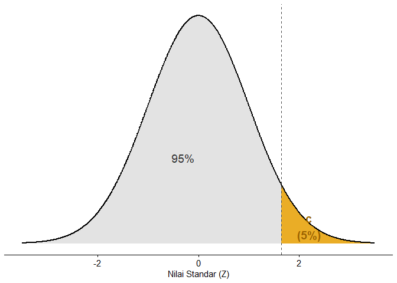
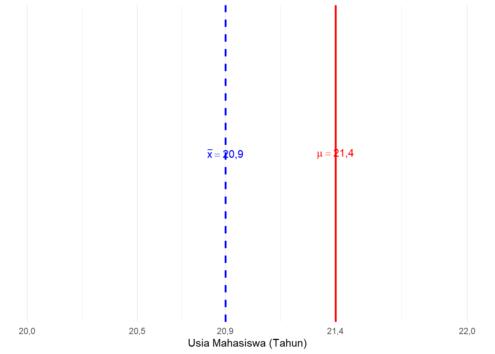
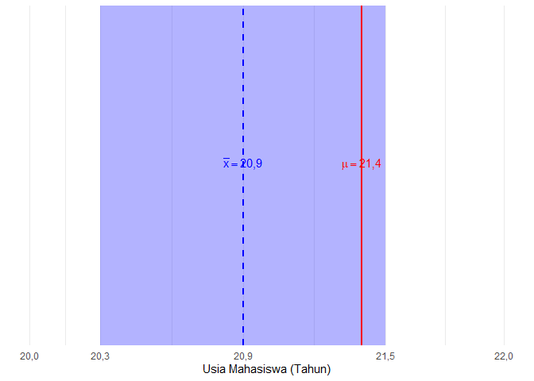
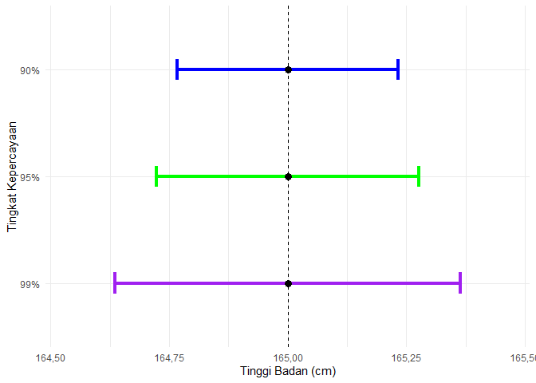
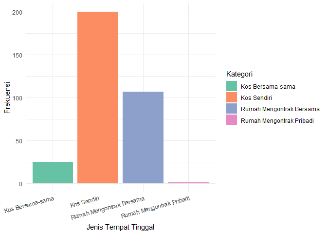
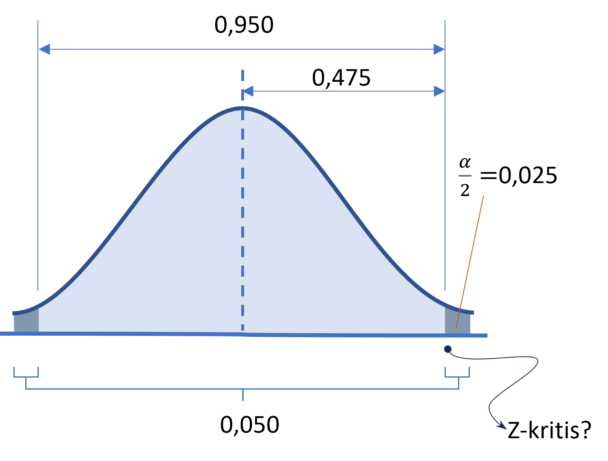

# Statistika untuk Perencanaan {.unnumbered}

Buku ini dirancang untuk membantu mahasiswa dalam memahami konsep statistika dan penggunaan R dalam pengolahan data kuantitatif, terutama dalam perencanaan wilayah dan kota. Buku ini terdiri atas 15 bab yang terdiri atas beberapa bagian:

1. Konsep Dasar Statistika
    1. Konsep Dasar Statistika dalam Perencanaan
    1. Data Terstruktur
2. Statistika Univariat
    1. Analisis Statistik Deskriptif
    1. Visualisasi Data Kuantitatif
    1. Pengantar Statistik Inferensial
    1. Estimasi Parameter
    1. Uji Hipotesis Satu Populasi
    1. Uji Hipotesis Dua Populasi
    1. Uji Hipotesis Lebih dari Dua Populasi
3. Statistika Bivariat
    1. Korelasi Antarvariabel Nominal
    1. Korelasi Antarvariabel Ordinal
    1. Korelasi Antarvariabel Metrik
    1. Regresi Linear Sederhana
4. Statistika Multivariat
    1. Regresi Linear Berganda
    1. Analisis Statistik Multivariat Interdependensi


------------------------------------

# Pengantar {.unnumbered}

Puji dan syukur kami panjatkan ke hadirat Tuhan Yang Maha Esa, Allah *subhanahu wa ta’aala*, yang tanpa rahmat, izin, dan kekuatan dari-Nya modul ini tidak akan pernah bisa dirampungkan. Kami juga memanjatkan salawat dan permohonan keselamatan untuk Rasul junjungan kami dan seluruh alam, Nabi Muhammad *shallallahu alaihi wa sallam*, pembawa risalah kebenaran dan transformator peradaban terbesar sepanjang sejarah.

Buku ajar ini kami rancang sebagai media pembelajaran sekaligus instrumen evaluasinya untuk mahasiswa yang mempelajari statistika, khususnya di bidang Perencanaan Wilayah dan Kota. Kasus-kasus yang digunakan dalam pembahasannya diambil dari dataset yang diupayakan oleh delapan orang mahasiswa PWK ITERA angkatan 2020: Alvian Syah Syaidina Muhammad, Muhammad Gilang Ramadhan, Assa Bangsa Putra, Fachrian Noor Kusnadi, Bonafasius Geoffrey Titawanno, dan Ramli Indran Alif di bawah bimbingan penulis.

Buku ajar ini pastinya masih jauh dari kesempurnaan. Untuk itu, kami sangat terbuka akan masukan dan kritikan demi kesempurnaan modul ini ke depannya. Segala masukan dan kritikan akan kami tampung melalui surel [muhammad.bindar@pwk.itera.ac.id](mailto:muhammad.bindar@pwk.itera.ac.id) dan jadikan pembelajaran untuk perbaikan selanjutnya.

Lampung Selatan, 2025

Tim Penulis


------------------------------------

# Lembar Persembahan

Buku ini kami dedikasikan untuk guru-guru kami, Ibu **Dewi Sawitri Tjokropandojo** dan Ibu **Sri Maryati**, atas ilmu dan teladan yang tak ternilai

<!--chapter:end:index.Rmd-->

# Konsep Dasar Statistika dalam Perencanaan

::: rmdcapaian
### Capaian Pembelajaran {.unnumbered}

Setelah mempelajari bab ini, Anda diharapkan:

-   Mampu menjelaskan kedudukan dan peran analisis statistik dalam perencanaan [STP-1.1]{.capaian}
-   Mampu menjelaskan perbedaan analisis kuantitatif dan kualitatif dengan tepat [STP-1.2]{.capaian}
:::

## Kedudukan dan Peran Analisis Data dalam Perencanaan

Proses perencanaan adalah proses yang sangat memerlukan data di seluruh tahapannya. Seperti yang ditunjukkan dalam Gambar \@ref(fig:proses-perencanaan-rasional) tentang proses perencanaan secara rasional, setiap tahapnya sangat memerlukan data sebagai masukan untuk melaksanakan **setiap tahap**.

<div class="figure" style="text-align: center">

<p class="caption">(\#fig:proses-perencanaan-rasional)Proses Perencanaan Rasional. Diadaptasi dari @ewing2020basic</p>
</div>

Kita ambil contoh di tahap pertama. Penetapan tujuan dan sasaran memerlukan data dari berbagai sumber di wilayah perencanaan, termasuk dari pemangku kepentingan (*stakeholder*). Data-data tersebut dikumpulkan dan untuk merumuskan tujuan dan sasaran yang benar-benar mencerminkan kebutuhan wilayah perencanaan.

Lain lagi di tahap kedua, contoh lainnya. Perumusan persoalan (*problem*) adalah hal yang harus dilakukan dengan mempertimbangkan data dan fakta kondisi yang ada (kondisi eksisting). Hal ini dikarenakan jika kita salah mendefinisikan persoalan, implementasi rencana tidak akan menjawab persoalan yang seharusnya.

Dari paparan sebelumnya, kita dapat menyimpulkan bahwa setiap tahap dalam perencanaan memerlukan penelitian, yakni kegiatan membuat pertanyaan mengenai suatu permasalahan dan menjawab pertanyaan tersebut dengan proses yang sistematis.

::: rmdkasus
### Studi Kasus: Analisis Data dalam Perencanaan Transportasi Berkelanjutan di Kampus ITERA {#kasus-analisis-data-dalam-perencanaan .unnumbered}

Kita akan mengambil kasus berupa perencanaan transportasi berkelanjutan mahasiswa dan staf pegawai di kampus ITERA. Transportasi berkelanjutan adalah perpindahan dalam konteks transportasi yang memiliki nilai berkelanjutan, salah satunya minim polusi udara.

Dalam kasus ini, kita sudah mengetahui bahwa tujuan dari rektorat adalah “transportasi mahasiswa dan pegawai yang berkelanjutan.” Selanjutnya, kita perlu mengetahui apa persoalan yang ada saat ini di kampus ITERA (perhatikan Gambar \@ref(fig:kasus-bab1))

<div class="figure" style="text-align: center">

<p class="caption">(\#fig:kasus-bab1)Persoalan Transportasi di ITERA</p>
</div>

Untuk mengetahui persoalan terkait dengan transportasi mahasiswa dan pegawai, kita perlu mengajukan pertanyaan terkait hal ini, yakni *sudah sejauh mana keberlanjutan pada pola pergerakan pada mahasiswa dan pegawai kampus ITERA saat ini?*

Ini adalah pertanyaan penelitian kita untuk menjawab apa persoalan yang ada terkait rencana transportasi berkelanjutan di kampus ITERA. Untuk menjawab pertanyaan ini, kita mengumpulkan data terkait pola pergerakan mahasiswa dan pegawai di ITERA dengan menyebarkan kuesioner kepada para mahasiswa dan pegawai kampus ITERA tentang pola pergerakan mereka.
:::

## Penelitian Kuantitatif vs. Penelitian Kualitatif dan Kedudukan Statistik

Selanjutnya kita akan membahas dua pendekatan terbesar dalam penelitian yakni penelitian kuantitatif dan penelitian kualitatif.

Penelitian secara umum adalah proses mengajukan pertanyaan dan menjawabnya secara sistematis. Pertanyaan yang diajukan bisa terkait dengan tahap yang dilakukan dalam proses perencanaan tadi.

Secara umum, pendekatan penelitian terbagi menjadi **pendekatan kuantitatif** dan **pendekatan kualitatif**. Singkatnya, pendekatan kuantitatif menekankan penggunaan angka-angka (kuantitas) dalam prosesnya, sementara pendekatan kualitatif menekankan pada eksplorasi data-data yang bersifat non-angka dan perlu diindra (dilihat, dicium, diraba, didengar) dan dirasakan.

### Analisis Kuantitatif vs. Analisis Kualitatif {#analisis-kuantitatif-vs-kualitatif}

Analisis adalah salah satu proses dalam penelitian yang mengolah data yang dikumpulkan menjadi jawaban dari pertanyaan di awal. Sebagaimana pendekatannya, secara umum analisis juga dapat dibagi menjadi **analisis kuantitatif** dan **analisis kualitatif**.

Di sisi lain, data sebagai bahan analisis juga dapat dibagi menjadi **data kuantitatif** dan **data kualitatif**. Kita dapat memaknai data kuantitatif sebagai fakta/fenomena yang diukur sehingga dinyatakan dalam bentuk angka, sementara data kualitatif adalah fakta/fenomena yang dijelaskan dalam bentuk pemaknaan dan pemahaman yang mendalam dari pelaku penelitian (subjek penelitian).

Karena analisis kuantitatif menggunakan angka-angka, pengumpulan data kuantitatif dapat disebut juga sebagai **pengukuran**.

::: rmdkasus
### Studi Kasus: Penelitian Mengenai Pola Pergerakan Mahasiswa dan Pegawai di Kampus ITERA {.unnumbered}

Berdasarkan pertanyaan penelitian *sudah sejauh mana keberlanjutan pada pola pergerakan pada mahasiswa dan pegawai kampus ITERA saat ini?*, kita akan mengumpulkan data terkait pola pergerakan mahasiswa dan pegawai di ITERA dengan menyebarkan kuesioner kepada para mahasiswa dan pegawai kampus ITERA tentang pola pergerakan mereka. Berikut adalah analisis tentang perbandingan antara analisis kuantitatif dan analisis kualitatif.

| Aspek | Analisis Kuantitatif | Analisis Kualitatif |
|:---------------|:--------------------------|:----------------------------|
| **Fokus** | Luas (*Breadth*), mencari generalisasi. | Dalam (*Depth*), mencari makna/alasan. |
| **Pertanyaan Utama** | Berapa banyak emisi yang dihasilkan? | Mengapa orang enggan naik shuttle? |
| **Alat Analisis** | Statistik (SPSS, Excel, Pemodelan Transportasi). | Transkrip wawancara, observasi lapangan, analisis tema. |
| **Kelebihan** | Akurat untuk menghitung target penurunan emisi karbon secara matematis. | Sangat baik untuk merancang kebijakan yang sesuai dengan psikologi pengguna. |
| **Kelemahan** | Tidak bisa menjelaskan alasan personal di balik angka. | Hasilnya tidak bisa digeneralisasi untuk seluruh populasi secara kaku. |
:::

### Analisis Statistik sebagai Analisis Kuantitatif

Statistik adalah serangkaian teknik matematis yang digunakan untuk mengorganisir, memanipulasi, dan menganalisis data dengan tujuan menjawab pertanyaan penelitian [@healey2021statistics]. Ilmu yang mempelajari statistik disebut statistika yang dalam bahasa Inggris menjadi "statistics" (menggunakan "s").

Dalam pengertian tersebut terdapat kata kunci "matematis". Kata kunci tersebut tentunya mengantarkan kita berpikir bahwa analisis statistik adalah bagian dari penelitian kuantitatif.

Analisis statistik dapat melakukan hal-hal berikut:

1.  **Meringkas dan Mengorganisasi Data**. Statistik membantu mereduksi banyak item informasi menjadi beberapa angka yang jelas, ringkas, dan mudah dipahami, sebuah proses yang dikenal sebagai reduksi data.
2.  **Mengidentifikasi Pola dan Hubungan**. Statistik memungkinkan peneliti untuk mendeteksi pola dalam data dan mengukur hubungan antara dua atau lebih variabel.
3.  **Membuat Generalisasi**. Salah satu jenis statistik, statistik inferensial, mampu untuk menggeneralisasi temuan dari sampel kecil ke populasi yang lebih luas, memberikan perkiraan seberapa mungkin pola yang diamati dalam sampel berlaku di populasi. Ini akan kita pelajari di bab selanjutnya.
4.  **Menguji Hipotesis dan Teori**. Dalam penelitian secara umum, statistik membantu kita menguji apakah ide atau dugaan yang kita buat benar, berdasarkan data. Dari teori yang ada, kita bisa membuat hipotesis dan mengujinya secara empiris, atau bahkan menemukan hipotesis baru dari data.

Secara umum, statistika dapat dibagi menjadi dua menurut keperluannya terkait data: **statistika deskriptif** dan **statistika inferensial** [@ewing2020basic]. Statistika deskriptif berfungsi untuk mendeskripsikan data dari sebuah sampel atau populasi. Di sisi lain, statistik inferensial menarik kesimpulan dari data yang dikumpulkan (sampel) terhadap cakupan yang lebih besar dari data tersebut, yakni populasi.

Berdasarkan jumlah variabelnya statistika juga dapat dibagi menjadi 3: **statistika univariat**, **statistika bivariat** dan **statistika multivariat**. Sesuai namanya, statistika univariat adalah statistika yang digunakan untuk menganalisis satu variabel saja. Statistika bivariat adalah statistika yang menganalisis dua variabel secara bersamaan, sementara multivariat menganalisis lebih dari dua.

Jawablah soal evaluasi berikut untuk menguji pemahaman Anda tentang konsep dasar statistika dalam perencanaan.

::: rmdexercise
## Soal Evaluasi 1 {.unnumbered}

1.  Jelaskanlah penggunaan analisis data dalam setiap tahap perencanaan untuk kasus acara kumpul keakraban angkatan! [STP-1.1]{.capaian}
2.  Ceritakan perbedaan analisis kuantitatif dan kualitatif yang mungkin digunakan dalam perencanaan acara tersebut. [STP-1.2]{.capaian}
:::

<!--chapter:end:01-konsep-dasar.Rmd-->

# Data Terstruktur

::: rmdcapaian
### Capaian Pembelajaran {.unnumbered}

Setelah mempelajari bab ini, Anda diharapkan:

1. mampu menganalisis variabel dan objek dalam sebuah format data terstruktur sesuai dengan konsepnya [STP-1.3]{.capaian}
2. mampu menentukan tingkat pengukuran yang tepat untuk sebuah variabel [STP-2.1]{.capaian}
:::

Berdasarkan formatnya, data dapat dibedakan menjadi dua jenis. Jenis data berdasarkan formatnya tersebut terdiri atas **data tidak terstruktur**  (*unstructured data*) dan **data terstruktur** (*structured data*).

Data tidak terstruktur adalah data yang tidak memiliki format yang terdefinisikan sebelum dikumpulkan, seperti teks wawancara, rekaman suara, gambar, atau video. Bentuk dan ukuran data-data tersebut dapat berbeda-beda, dengan kata lain formatnya tidak sama sehingga dapat dikatakan juga tidak terdefinisi atau tidak terstruktur [@oracle2024structured].

Di sisi lain, data terstruktur adalah data yang memiliki definisi yang jelas dan pola yang telah ditentukan sebelum dikumpulkan. Definisi yang jelas di sini diperlihatkan dengan bentuk data terstruktur berupa tabel. Dengan bentuk tabel, data memiliki format yang terdefinisi, lebih jelas isinya, dan dapat dikenali polanya sehingga lebih mudah untuk dianalisis.

**Penelitian yang menggunakan analisis statistik pasti menghasilkan data terstruktur dari pengumpulannya** [@devaus2014surveys]. Hal ini bukan berarti penelitian kualitatif juga tidak bisa menghasilkan data terstruktur, akan tetapi hal tersebut tidak mutlak. Hanya penelitian kuantitatif dengan metode analisis statistik yang mutlak menggunakan data terstruktur.

## Elemen Data Terstruktur {#kasus-elemen-data-terstruktur}

Dengan format yang jelas, data terstruktur dapat dipandang sebagai susunan 3 elemen penting: objek (*object*), variabel (*variable*), dan nilai (*value*). Ketiga hal ini membentuk struktur yang disebut **tabulasi data**. Tabulasi data adalah bentuk penyajian data dalam bentuk tabel yang terdiri atas baris dan kolom. Sebuah tabulasi data yang baik harus memiliki struktur yang jelas di mana baris mewakili objek dan kolom mewakili variabel.

1.  **Objek**. Objek adalah unit analisis yang datanya kita kumpulkan. Dalam tabulasi data, objek biasanya menempati posisi **baris** (*row*). Contoh objek dalam perencanaan wilayah dan kota bisa berupa rumah tangga, individu, kelurahan, kecamatan, atau kabupaten.
2.  **Variabel**. Variabel adalah karakteristik atau atribut yang melekat pada objek yang nilainya bisa berbeda-beda (bervariasi) antar satu objek dengan objek lainnya. Dalam tabulasi data, variabel menempati posisi **kolom** (*column*). Contoh variabel adalah luas lahan, jumlah penduduk, pendapatan per bulan, dan tingkat pendidikan.
3.  **Nilai**. Nilai adalah angka atau kategori yang mengisi perpotongan antara baris (objek) dan kolom (variabel), yakni **sel** (*cell*). Nilai ini merepresentasikan data spesifik dari variabel tertentu untuk objek tertentu.

::: rmdkasus
### Studi Kasus: Elemen Data Terstruktur {.unnumbered} 

Perhatikan hasil pengumpulan data kuesioner berupa tabulasi data dari mahasiswa-mahasiswa ITERA seperti yang ditampilkan pada Gambar \@ref(fig:bab-2-ilus-data-terstruktur).

<div class="figure" style="text-align: center">

<p class="caption">(\#fig:bab-2-ilus-data-terstruktur)Ilustrasi elemen data terstruktur</p>
</div>

Kita akan membedah elemen-elemen data terstruktur dari tabulasi data tersebut:
- Objek dari tabulasi data tersebut adalah mahasiswa-mahasiswa ITERA. Tiap objek dibedakan berdasarkan variabel `ID-mahasiswa`.
- Variabel dari tabulasi data tersebut di antaranya adalah `Program Studi`, `Usia`, `Jumlah Motor`, dan `Jumlah Mobil`. Adapun variabel `ID-mahasiswa` tidak termasuk dalam variabel yang dihitung karena hanya bertindak sebagai pengidentifikasi objek.
- Nilai dari tabulasi data tersebut bisa kita lihat di sel-selnya. Misalnya, objek mahasiswa dengan `ID-mahasiswa` 002 memiliki nilai `Program Studi` adalah "Matematika", `Usia` adalah 21 tahun, `Jumlah Motor` adalah 0, dan `Jumlah Mobil` adalah 1.
:::

## Tabulasi Data Terstruktur yang Baik

Agar data dapat diolah dengan baik menggunakan perangkat lunak statistik seperti R, tabulasi data harus memenuhi kaidah "Tidy Data" atau data yang rapi. Berikut adalah prinsip-prinsip data yang rapi:

1.  Setiap variabel harus membentuk satu kolom.
2.  Setiap observasi (objek) harus membentuk satu baris.
3.  Setiap jenis unit observasi membentuk satu tabel.

Pelajari kasus yang berisi perbandingan antara data yang tidak rapi dan data yang rapi berikut.

::: rmdkasus
### Studi Kasus: Perbandingan Data yang Tidak Rapi dan Data yang Rapi {.unnumbered} 

Berikut adalah beberapa contoh kesalahan umum dalam struktur data dan perbaikannya:

<table class="table table-striped table-hover" style="color: black; margin-left: auto; margin-right: auto;">
 <thead>
  <tr>
   <th style="text-align:left;"> Jenis Kesalahan </th>
   <th style="text-align:left;"> Data Tidak Rapi (Salah) </th>
   <th style="text-align:left;"> Data Rapi (Benar) </th>
  </tr>
 </thead>
<tbody>
  <tr>
   <td style="text-align:left;width: 20%; font-weight: bold;"> Kesalahan 1: Header Baris Bersarang </td>
   <td style="text-align:left;width: 40%; ">  </td>
   <td style="text-align:left;width: 40%; ">  </td>
  </tr>
  <tr>
   <td style="text-align:left;width: 20%; font-weight: bold;"> Kesalahan 2: Struktur Kompleks </td>
   <td style="text-align:left;width: 40%; ">  </td>
   <td style="text-align:left;width: 40%; ">  </td>
  </tr>
  <tr>
   <td style="text-align:left;width: 20%; font-weight: bold;"> Kesalahan 3: Format Tidak Konsisten </td>
   <td style="text-align:left;width: 40%; ">  </td>
   <td style="text-align:left;width: 40%; ">  </td>
  </tr>
</tbody>
</table>
:::

Jawablah soal evaluasi berikut untuk menguji pemahaman Anda tentang elemen-elemen data terstruktur.

::: rmdexercise
## Soal Evaluasi 2 {.unnumbered}

Perhatikan tabel hasil pengumpulan data kuesioner berikut ini [STP-1.3]{.capaian}:

<table class="table table-striped table-hover" style="color: black; margin-left: auto; margin-right: auto;">
 <thead>
  <tr>
   <th style="text-align:left;"> ID_rumah </th>
   <th style="text-align:right;"> Usia_KK </th>
   <th style="text-align:right;"> Jml_anggota </th>
   <th style="text-align:right;"> Luas_rumah </th>
   <th style="text-align:right;"> Income_bln </th>
  </tr>
 </thead>
<tbody>
  <tr>
   <td style="text-align:left;width: 20%; font-weight: bold;"> 001 </td>
   <td style="text-align:right;width: 40%; "> 55 </td>
   <td style="text-align:right;width: 40%; "> 2 </td>
   <td style="text-align:right;"> 101 </td>
   <td style="text-align:right;"> 3.3 </td>
  </tr>
  <tr>
   <td style="text-align:left;width: 20%; font-weight: bold;"> 002 </td>
   <td style="text-align:right;width: 40%; "> 64 </td>
   <td style="text-align:right;width: 40%; "> 5 </td>
   <td style="text-align:right;"> 245 </td>
   <td style="text-align:right;"> 6.0 </td>
  </tr>
  <tr>
   <td style="text-align:left;width: 20%; font-weight: bold;"> 003 </td>
   <td style="text-align:right;width: 40%; "> 33 </td>
   <td style="text-align:right;width: 40%; "> 7 </td>
   <td style="text-align:right;"> 69 </td>
   <td style="text-align:right;"> 3.5 </td>
  </tr>
  <tr>
   <td style="text-align:left;width: 20%; font-weight: bold;"> 004 </td>
   <td style="text-align:right;width: 40%; "> 28 </td>
   <td style="text-align:right;width: 40%; "> 2 </td>
   <td style="text-align:right;"> 44 </td>
   <td style="text-align:right;"> 27.0 </td>
  </tr>
</tbody>
</table>

Jawablah pertanyaan-pertanyaan berikut berdasarkan tabel tersebut:

a. Ada berapa objek dalam data terstruktur tersebut? 
b. Sebutkan apa kira-kira objek dari data terstruktur tersebut.
c. Berapa variabel yang dapat dianalisis dari data terstruktur tersebut? Sebutkan apa saja.
d. Apakah format tabel tersebut sesuai dengan prinsip data yang rapi? Jelaskan alasan Anda.
:::

## Tingkat Pengukuran Variabel

Pada subbab ini kita akan membahas lebih dalam tentang nilai dalam variabel yang berpengaruh pada analisis selanjutnya, yakni tingkat pengukuran variabel.

Sebagaimana telah disebutkan pada Subbab \@ref(analisis-kuantitatif-vs-kualitatif) bahwa pengumpulan data kuantitatif dapat disebut juga sebagai pengukuran suatu variabel, cara kita mengukur suatu variabel bisa diibaratkan seperti menggunakan mistar yang memiliki sederet angka [@kachigan1986statistical].

Tingkat pengukuran berbicara tentang cara kita menyatakan hasil pengukuran suatu variabel tersebut dalam angka, mulai dari hasil yang sangat menyerupai angka dalam mistar hingga hasil yang bukan angka sama sekali.

::: rmdkasus
### Studi Kasus: Tingkat Pengukuran Variabel {.unnumbered}

Sesuai dengan kasus \@ref(kasus-elemen-data-terstruktur), kita akan menggunakan kasus variabel `Usia` dari data terstruktur tersebut.

Dalam variabel tersebut, nilai `Usia` dapat kita nyatakan dalam 2 bentuk yang berbeda. Kita akan bedakan bentuknya menjadi kasus-kasus berikut:

1. **Kasus-1:** nilai `Usia` dinyatakan dalam bentuk angka dalam satuan tahun. Dengan demikian, dalam kasus ini nilai `17` berarti "17 tahun", dan nilai `26` berarti "26 tahun", dan seterusnya.

2. **Kasus-2:** nilai `Usia` dinyatakan dalam bentuk rentang usia seperti berikut:

    * kategori 1: 17-25 tahun
    * kategori 2: 26-35 tahun
    * kategori 3: 36-45 tahun
    * kategori 4: 46-55 tahun
    * kategori 5: 56-65 tahun

    Kita bisa menyatakan setiap kategori dengan angka tertentu yang masing-masingnya tentu mewakili rentang usia tersebut. Misalnya, kita bisa menyatakan kategori 1 dengan angka 17, kategori 2 dengan angka 26, dan seterusnya, sehingga rentangnya menjadi seperti ini:

    * 17: 17-25 tahun
    * 26: 26-35 tahun
    * 36: 36-45 tahun
    * 46: 46-55 tahun
    * 56: 56-65 tahun

    Dalam kasus ini, nilai `17` bukan lagi berarti "17 tahun", melainkan "17-25 tahun". Artinya nilai `17` ini bisa saja bernilai `17` atau `18` atau `19` atau `20` atau `21` atau `22` atau `23` atau `24` atau `25`.

Kedua kasus tersebut menunjukkan bahwa kita bisa menggunakan tingkat pengukuran yang berbeda untuk variabel yang sama. 

Kita akan mempelajari nama-nama tingkat pengukuran tersebut dalam subbab-subbab selanjutnya.
:::

## Jenis-jenis Tingkat Pengukuran Variabel

Tingkat pengukuran variabel secara umum memiliki 3 jenis dari yang paling rendah ke yang paling tinggi di antaranya adalah nominal, ordinal, dan metrik (metric). Kita akan bahas lebih dalam tentang jenis-jenis tersebut sebagai berikut mulai dari yang paling rendah ke yang paling tinggi.

### Nominal

Tingkat pengukuran nominal adalah tingkat pengukuran yang **paling rendah**. Jika angka dikenakan pada variabel ini, angka tersebut hanya bertindak sebagai label.

### Ordinal

Tingkat pengukuran ordinal berada di atas nominal. Angka pada tingkat ini hanya menunjukkan **urutan** atau **posisi** tetapi tidak dapat memberikan penafsiran berapa jarak di antara posisi-posisi tersebut.

### Metrik (Angka)

Variabel dengan tingkat pengukuran angka (bahasa Inggris: *metric*) adalah variabel dengan **angka yang sebenarnya** karena angka pada tingkat pengukuran ini memiliki penafsiran angka yang sebenarnya, yaitu memiliki posisi dan skala nilainya.

Dalam literatur lain, seperti @tjokropandojo2021pengantar, tingkat pengukuran ini banyak dibagi menjadi dua tingkat lagi, yaitu **interval** dan **rasio**. Perbedaan antara keduanya adalah bahwa interval **tidak memiliki posisi nol absolut** seperti rasio.

Contoh yang paling mudah adalah suhu. Suhu dapat dinyatakan dalam skala Celsius dan Fahrenheit. Dalam skala Celsius, air membeku pada tingkat 0 derajat, tetapi dalam skala Fahrenheit air membeku pada tingkat 32 derajat. Ini menunjukkan posisi nol yang tidak absolut pada pengukuran suhu.

Contoh lainnya adalah tahun. Dalam penanggalan Masehi, tahun-0 ditempatkan pada masa kelahiran Isa Al-Masih. Sementara itu, dalam penanggalan Hijriah, tahun-0 ditempatkan masa hijrahnya Nabi Muhammad SAW. Masa kelahiran Isa Al-Masih tentunya terjadi lebih dulu dibandingkan masa hijrah Nabi Muhammad SAW. Ini juga menunjukkan posisi nol yang tidak absolut pada pengukuran tahun.

## Menentukan Tingkat Pengukuran Variabel

Dalam praktiknya, menentukan tingkat pengukuran variabel seringkali tidak mudah karena seringkali data yang kita kumpulkan tidak memiliki tingkat pengukuran yang jelas. Oleh karena itu, kita perlu melakukan analisis lebih dalam untuk menentukan tingkat pengukuran variabel tersebut. Berikut adalah langkah-langkah yang dapat kita lakukan untuk menentukan tingkat pengukuran variabel.

1. Tentukan apakah jenis nilai dari variabel: apakah **kategorik** atau **numerik**
2. Jika **kategorik**, tentukan apakah terdapat tingkatan yang masuk akal. Jika terdapat tingkatan, maka ia pasti berupa ordinal. Jika tidak terdapat tingkatan, maka ia pasti berupa nominal.
3. Jika **numerik**, pastikan apakah angka-angka merepresentasikan angka sebenarnya. Jika tidak, ia sebenarnya adalah **kategorik**. Kembali ke langkah 1.
4. Jika **numerik** dan angka-angka merepresentasikan angka sebenarnya, pastikan apakah angka-angka memiliki posisi nol absolut. Jika tidak, ia pasti berupa **interval**. Jika ya, ia pasti berupa **rasio**.

Langkah-langkah tersebut dapat diilustrasikan dalam diagram alir yang ditampilkan dalam Gambar \@ref(fig:fig-menentukan-tingpeng) berikut. 

<div class="figure" style="text-align: center">

<p class="caption">(\#fig:fig-menentukan-tingpeng)Diagram alir menentukan tingkat pengukuran variabel</p>
</div>

::: rmdkasus
### Studi Kasus: Menentukan Tingkat Pengukuran Variabel {.unnumbered}

Melanjutkan kasus pengumpulan data pergerakan mahasiswa ITERA dari bab sebelumnya, setelah merumuskan pertanyaan penelitian mengenai keberlanjutan pola pergerakan, kita perlu menentukan variabel yang akan diukur. Berikut adalah variabel-variabel tersebut beserta penjelasannya:

<table class="table table-striped table-hover" style="color: black; margin-left: auto; margin-right: auto;">
<caption>(\#tab:bab-2-rancangan-metadata)Penelaahan tingkat pengukuran variabel penelitian</caption>
 <thead>
  <tr>
   <th style="text-align:left;"> Variabel </th>
   <th style="text-align:left;"> Nama Panggilan </th>
   <th style="text-align:left;"> Penjelasan </th>
  </tr>
 </thead>
<tbody>
  <tr>
   <td style="text-align:left;"> Moda transportasi yang digunakan responden </td>
   <td style="text-align:left;"> `kend` </td>
   <td style="text-align:left;"> Nilai-nilai dari moda transportasi bukanlah angka, melainkan label yang merepresentasikan jenis moda transportasi yang digunakan responden. Oleh karena itu, jenis nilai dari variabel ini adalah kategorik. Tidak ada tingkatan pada nilai-nilai di variabel ini, sehingga tingkat pengukurannya adalah nominal. </td>
  </tr>
  <tr>
   <td style="text-align:left;"> Jarak tempuh dari rumah ke kampus </td>
   <td style="text-align:left;"> `jarak` </td>
   <td style="text-align:left;"> Nilai-nilai dari jarak tempuh dari rumah ke kampus adalah angka yang merepresentasikan jarak tempuh dari rumah ke kampus. Oleh karena itu, jenis nilai dari variabel ini adalah numerik. Angka 0 merepresentasikan tidak ada jarak tempuh. Karena ini angka sebenarnya dan memiliki makna 0 yang sebenarnya, maka tingkat pengukurannya adalah rasio. </td>
  </tr>
  <tr>
   <td style="text-align:left;"> Banyaknya perjalanan ke kampus dalam satu pekan </td>
   <td style="text-align:left;"> `frek_jalan_sepekan` </td>
   <td style="text-align:left;"> Nilai-nilai dari banyaknya perjalanan ke kampus dalam satu pekan adalah angka yang merepresentasikan banyaknya perjalanan ke kampus dalam satu pekan. Oleh karena itu, jenis nilai dari variabel ini adalah numerik. Angka 0 merepresentasikan banyaknya perjalanan ke kampus 0 kali, atau tidak pernah ke kampus. Karena ini angka sebenarnya dan memiliki makna 0 yang sebenarnya, maka tingkat pengukurannya adalah rasio. </td>
  </tr>
  <tr>
   <td style="text-align:left;"> Total biaya transportasi selama satu pekan </td>
   <td style="text-align:left;"> `biaya` </td>
   <td style="text-align:left;"> Nilai-nilai dari total biaya transportasi selama satu pekan adalah angka yang merepresentasikan total biaya transportasi selama satu pekan. Oleh karena itu, jenis nilai dari variabel ini adalah numerik. Angka 0 merepresentasikan total biaya transportasi 0 rupiah, atau tidak mengeluarkan biaya transportasi. Karena ini angka sebenarnya dan memiliki makna 0 yang sebenarnya, maka tingkat pengukurannya adalah rasio. </td>
  </tr>
</tbody>
</table>

Setelah menelaah jenis nilai dan tingkat pengukuran variabel, kita perlu menspesifikasikan nilai isian beserta satuannya. Jika menggunakan kodifikasi, aturannya harus diperjelas. Spesifikasi ini disebut **metadata**, yaitu data yang menjelaskan tentang data.

<table class="table table-striped table-hover" style="color: black; margin-left: auto; margin-right: auto;">
<caption>(\#tab:bab-2-metadata)Metadata variabel penelitian</caption>
 <thead>
  <tr>
   <th style="text-align:left;"> Variabel </th>
   <th style="text-align:left;"> Nama Panggilan </th>
   <th style="text-align:left;"> Tingkat Pengukuran </th>
   <th style="text-align:left;"> Satuan </th>
   <th style="text-align:left;"> Nilai yang mungkin </th>
  </tr>
 </thead>
<tbody>
  <tr>
   <td style="text-align:left;"> Moda transportasi yang digunakan responden </td>
   <td style="text-align:left;"> `kend` </td>
   <td style="text-align:left;"> Nominal </td>
   <td style="text-align:left;"> Tidak ada </td>
   <td style="text-align:left;"> Sepeda motor, mobil, angkutan umum, dll </td>
  </tr>
  <tr>
   <td style="text-align:left;"> Jarak tempuh dari rumah ke kampus </td>
   <td style="text-align:left;"> `jarak` </td>
   <td style="text-align:left;"> Metrik </td>
   <td style="text-align:left;"> km </td>
   <td style="text-align:left;"> 0 - ∞ km </td>
  </tr>
  <tr>
   <td style="text-align:left;"> Banyaknya perjalanan ke kampus dalam satu pekan </td>
   <td style="text-align:left;"> `frek_jalan_sepekan` </td>
   <td style="text-align:left;"> Metrik </td>
   <td style="text-align:left;"> kali </td>
   <td style="text-align:left;"> 0 - 7 </td>
  </tr>
  <tr>
   <td style="text-align:left;"> Total biaya transportasi selama satu pekan </td>
   <td style="text-align:left;"> `biaya` </td>
   <td style="text-align:left;"> Metrik </td>
   <td style="text-align:left;"> rupiah (Rp) </td>
   <td style="text-align:left;"> 0 - ∞ </td>
  </tr>
</tbody>
</table>

**Mengubah Tingkat Pengukuran Variabel**

Kita sudah menentukan nilai dari telaahan variabel-variabel yang sudah kita buat sebelumnya. Pada hasil telaahan kita sebelumnya, kita memiliki satu variabel nominal dan 3 variabel numerik. Variabel nominal tersebut adalah `kend`, sedangkan variabel numerik tersebut adalah `jarak`, `frek_jalan_sepekan`, dan `biaya`.

Kita bisa mengubah tingkat pengukuran variabel dari satu tingkat ke lainnya. Misalnya, kita bisa mengubah tingkat pengukuran variabel `jarak` dari metrik (rasio) menjadi ordinal. Karena tingkat pengukuran variabel metrik adalah angka, untuk mengubahnya menjadi ordinal maka kita perlu mengubahnya menjadi kategorikal. Artinya, kita perlu membuat kategori baru dari variabel `jarak` tersebut.

<table class="table table-striped table-hover" style="color: black; margin-left: auto; margin-right: auto;">
<caption>(\#tab:bab-2-ubah-tingkat-pengukuran)Metadata variabel penelitian yang diubah</caption>
 <thead>
  <tr>
   <th style="text-align:left;"> Variabel </th>
   <th style="text-align:left;"> Nama Panggilan </th>
   <th style="text-align:left;"> Tingkat Pengukuran </th>
   <th style="text-align:left;"> Satuan </th>
   <th style="text-align:left;"> Nilai yang mungkin </th>
  </tr>
 </thead>
<tbody>
  <tr>
   <td style="text-align:left;"> Moda transportasi yang digunakan responden </td>
   <td style="text-align:left;"> `kend` </td>
   <td style="text-align:left;"> Nominal </td>
   <td style="text-align:left;"> Tidak ada </td>
   <td style="text-align:left;"> Sepeda motor, mobil, angkutan umum, dll </td>
  </tr>
  <tr>
   <td style="text-align:left;background-color: rgba(255, 255, 204, 255) !important;"> Jarak tempuh dari rumah ke kampus </td>
   <td style="text-align:left;background-color: rgba(255, 255, 204, 255) !important;"> `jarak` </td>
   <td style="text-align:left;background-color: rgba(255, 255, 204, 255) !important;"> Ordinal </td>
   <td style="text-align:left;background-color: rgba(255, 255, 204, 255) !important;"> km </td>
   <td style="text-align:left;background-color: rgba(255, 255, 204, 255) !important;"> 0 - 5 km,<br>5 - 10 km,<br>10 - 15 km,<br>dll </td>
  </tr>
  <tr>
   <td style="text-align:left;"> Banyaknya perjalanan ke kampus dalam satu pekan </td>
   <td style="text-align:left;"> `frek_jalan_sepekan` </td>
   <td style="text-align:left;"> Metrik </td>
   <td style="text-align:left;"> kali </td>
   <td style="text-align:left;"> 0 - 7 </td>
  </tr>
  <tr>
   <td style="text-align:left;"> Total biaya transportasi selama satu pekan </td>
   <td style="text-align:left;"> `biaya` </td>
   <td style="text-align:left;"> Metrik </td>
   <td style="text-align:left;"> rupiah (Rp) </td>
   <td style="text-align:left;"> 0 - ∞ </td>
  </tr>
</tbody>
</table>
:::


Jawablah soal evaluasi berikut untuk menguji pemahaman Anda tentang tingkat pengukuran variabel.

::: rmdexercise
## Soal Evaluasi 3 {.unnumbered}

Perhatikan cuplikan data hasil survei mahasiswa berikut ini:

<table class="table table-striped table-hover" style="color: black; margin-left: auto; margin-right: auto;">
<caption>(\#tab:bab-2-eval-3-preview)Cuplikan data survei mahasiswa</caption>
 <thead>
  <tr>
   <th style="text-align:center;"> KodeResp </th>
   <th style="text-align:center;"> Usia </th>
   <th style="text-align:center;"> Fakultas </th>
   <th style="text-align:center;"> ThnMsk </th>
   <th style="text-align:center;"> UangSaku </th>
   <th style="text-align:center;"> Jarak </th>
  </tr>
 </thead>
<tbody>
  <tr>
   <td style="text-align:center;"> 001 </td>
   <td style="text-align:center;"> 22 </td>
   <td style="text-align:center;"> 1 </td>
   <td style="text-align:center;"> 2020 </td>
   <td style="text-align:center;"> 2 </td>
   <td style="text-align:center;"> 19.27 </td>
  </tr>
  <tr>
   <td style="text-align:center;"> 002 </td>
   <td style="text-align:center;"> 25 </td>
   <td style="text-align:center;"> 1 </td>
   <td style="text-align:center;"> 2020 </td>
   <td style="text-align:center;"> 1 </td>
   <td style="text-align:center;"> 0.58 </td>
  </tr>
  <tr>
   <td style="text-align:center;"> 003 </td>
   <td style="text-align:center;"> 24 </td>
   <td style="text-align:center;"> 2 </td>
   <td style="text-align:center;"> 2021 </td>
   <td style="text-align:center;"> 1 </td>
   <td style="text-align:center;"> 0.56 </td>
  </tr>
  <tr>
   <td style="text-align:center;"> 004 </td>
   <td style="text-align:center;"> 19 </td>
   <td style="text-align:center;"> 3 </td>
   <td style="text-align:center;"> 2022 </td>
   <td style="text-align:center;"> 1 </td>
   <td style="text-align:center;"> 1.05 </td>
  </tr>
  <tr>
   <td style="text-align:center;"> 005 </td>
   <td style="text-align:center;"> 23 </td>
   <td style="text-align:center;"> 2 </td>
   <td style="text-align:center;"> 2021 </td>
   <td style="text-align:center;"> 1 </td>
   <td style="text-align:center;"> 1.69 </td>
  </tr>
  <tr>
   <td style="text-align:center;"> 006 </td>
   <td style="text-align:center;"> 20 </td>
   <td style="text-align:center;"> 1 </td>
   <td style="text-align:center;"> 2020 </td>
   <td style="text-align:center;"> 3 </td>
   <td style="text-align:center;"> 1.37 </td>
  </tr>
</tbody>
</table>

Adapun keterangan dari variabel-variabel tersebut (metadata) adalah sebagai berikut:

<table class="table table-striped table-hover" style="color: black; margin-left: auto; margin-right: auto;">
<caption>(\#tab:bab-2-eval-3-metadata)Metadata variabel survei mahasiswa</caption>
 <thead>
  <tr>
   <th style="text-align:left;"> Nama Variabel </th>
   <th style="text-align:left;"> Deskripsi </th>
   <th style="text-align:left;"> Nilai-nilai yang valid </th>
  </tr>
 </thead>
<tbody>
  <tr>
   <td style="text-align:left;"> `KodeResp` </td>
   <td style="text-align:left;"> Nomor urut responden </td>
   <td style="text-align:left;"> tiga digit angka, hingga jumlah responden minimal </td>
  </tr>
  <tr>
   <td style="text-align:left;"> `Usia` </td>
   <td style="text-align:left;"> Usia responden (tahun) </td>
   <td style="text-align:left;"> 18 - ∞ </td>
  </tr>
  <tr>
   <td style="text-align:left;"> `Fakultas` </td>
   <td style="text-align:left;"> Fakultas mahasiswa </td>
   <td style="text-align:left;"> 1 = Fakultas Syariah,<br>2 = Fakultas Tarbiyah dan Keguruan,<br>3 = Fakultas Dakwah dan Komunikasi </td>
  </tr>
  <tr>
   <td style="text-align:left;"> `ThnMsk` </td>
   <td style="text-align:left;"> Tahun masuk kuliah (Masehi) </td>
   <td style="text-align:left;"> 2018 - 2022 </td>
  </tr>
  <tr>
   <td style="text-align:left;"> `UangSaku` </td>
   <td style="text-align:left;"> Uang saku mahasiswa per bulan </td>
   <td style="text-align:left;"> 1 = &lt;1 juta rupiah,<br>2 = 1-2 juta rupiah,<br>3 = 2-3 juta rupiah,<br>4 = 3-4 juta,<br>5 = &gt;4 juta </td>
  </tr>
  <tr>
   <td style="text-align:left;"> `Jarak` </td>
   <td style="text-align:left;"> Jarak tempat tinggal mahasiswa dari kampus (km) </td>
   <td style="text-align:left;"> 0 - ∞ </td>
  </tr>
</tbody>
</table>

Sebutkan tingkat pengukuran untuk variabel-variabel yang ada dalam set data tersebut dan jelaskan! [STP-2.1]{.capaian}

:::

<!--chapter:end:02-data-terstruktur.Rmd-->

# Analisis Statistik Deskriptif

::: rmdcapaian
### Capaian Pembelajaran {.unnumbered}

Setelah mempelajari bab ini, Anda diharapkan:

1.  mampu memilih statistik deskriptif yang tepat sesuai dengan variabel yang akan disajikan dan informasi yang ingin disampaikan [STP-2.2]{.capaian}
2.  mampu menginterpretasikan informasi dari persentase/proporsi, rasio, laju, ukuran pemusatan, dan ukuran penyebaran suatu data kuantiatif sesuai dengan konteks kasusnya [STP-2.3]{.capaian}
:::

## Makna Analisis Statistik Deskriptif

Statistik deskriptif adalah metode analisis untuk mendeskripsikan data dari sampel atau populasi. Metode ini digunakan untuk membantu kita menghasilkan informasi yang bermakna dan bernilai dari sekadar data mentah. Perlu dicatat bahwa analisis statistik deskriptif dapat digunakan pada data mentah entah berupa sampel atau populasi. Dengan demikian, statistik deskriptif sangat bergantung pada kondisi data mentah yang kita miliki.

Berdasarkan teknik yang digunakan, statistik deskriptif dapat dibagi menjadi 4 kategori: **ukuran frekuensi**, **ukuran kecenderungan memusat**, **ukuran penyebaran**, dan **tabel silang**. Setiap kategori teknik memiliki tingkat pengukuran yang sesuai untuk variabel yang akan dianalisi. Makna yang dihasilkan juga akan berbeda tergantung pada teknik yang digunakan.

::: rmdnote
[⚠️ Penting]{.tajuksaya}

Di sinilah letak krusialnya menentukan tingkat pengukuran variabel, karena akan menentukan teknik analisis statistik deskriptif apa yang akan digunakan. Sebagai contoh, kita tidak bisa menggunakan mean untuk mengukur variabel nominal.
:::

## Ukuran Frekuensi

Ukuran frekuensi adalah cara paling sederhana untuk memaknai satu variabel. Ukuran ini menyatakan frekuensi relatif objek-objek dilihat dari suatu variabel kategorik. Objek-objek dikelompokkan ke dalam kategori-kategori dan dihitung jumlahnya dan dibandingkan dengan jumlah keseluruhan objek tersebut. Untuk dapat menggunakan teknik ini, kita perlu melakukan pengolahan pada data mentah berupa variabel kategorik, yakni mengelompokkan objek berdasarkan kategori-kategori yang ada pada variabel tersebut dan menghitung frekuensi dari setiap kategori tersebut.

Secara matematis, ukuran frekuensi dapat dinyatakan sebagai berikut:

$$
\begin{equation}
\text{FR} = \frac{f}{n}
(\#eq:konsep-frekuensi-relatif)
\end{equation}
$$

dengan:

-   $FR$ = Frekuensi Relatif
-   $f$ = Frekuensi suatu kategori
-   $n$ = Jumlah Observasi

Makna yang dihasilkan dari teknik ini adalah seberapa besar perbandingan jumlah objek pada suatu kategori relatif terhadap jumlah keseluruhan objeknya. Dari besar perbandingan tersebut, kita dapat mengetahui dominasi kategori tertentu pada objek-objek yang diamati serta perbandingan yang adil antar kumpulan objek dengan kategorisasi yang sama.

Karena rumus perhitungan frekuensi relatif melibatkan penghitungan frekuensi atau jumlah objek (Persamaan \@ref(eq:konsep-frekuensi-relatif)), maka teknik ini hanya dapat digunakan pada data nominal dan ordinal. Teknik ini tidak dapat digunakan pada data interval dan rasio karena data interval dan rasio tidak memiliki kategori.

::: rmdkasus
### Studi Kasus: Penerapan Ukuran Frekuensi dari Dataset Hasil Survei {.unnumbered}

Sekarang kita akan membahas teknik analisis statistik dalam set data (dataset) mengenai pola pergerakan mahasiswa di ITERA. Untuk kepentingan kelengkapan ulasan, variabelnya kita tambah dengan satu variabel ordinal: tingkat tahun kuliah (`tingkat`).

Berikut adalah contoh set data hasil kuesioner yang sudah disebarkan beserta metadatanya:

<table class="table table-striped table-hover" style="color: black; margin-left: auto; margin-right: auto;">
<caption>(\#tab:bab-3-kasus-dataset)Contoh Set Data Hasil Kuesioner</caption>
 <thead>
  <tr>
   <th style="text-align:center;"> ID </th>
   <th style="text-align:center;"> kend </th>
   <th style="text-align:center;"> tingkat </th>
   <th style="text-align:center;"> jarak </th>
   <th style="text-align:center;"> perjalanan_senin </th>
   <th style="text-align:center;"> biaya_pekan </th>
  </tr>
 </thead>
<tbody>
  <tr>
   <td style="text-align:center;"> 117 </td>
   <td style="text-align:center;"> 5 </td>
   <td style="text-align:center;"> 4 </td>
   <td style="text-align:center;"> 2.34 </td>
   <td style="text-align:center;"> 3 </td>
   <td style="text-align:center;"> 0 </td>
  </tr>
  <tr>
   <td style="text-align:center;"> 118 </td>
   <td style="text-align:center;"> 1 </td>
   <td style="text-align:center;"> 4 </td>
   <td style="text-align:center;"> 2.66 </td>
   <td style="text-align:center;"> 2 </td>
   <td style="text-align:center;"> 40 </td>
  </tr>
  <tr>
   <td style="text-align:center;"> 119 </td>
   <td style="text-align:center;"> 1 </td>
   <td style="text-align:center;"> 4 </td>
   <td style="text-align:center;"> 3.84 </td>
   <td style="text-align:center;"> 2 </td>
   <td style="text-align:center;"> 30 </td>
  </tr>
  <tr>
   <td style="text-align:center;"> 120 </td>
   <td style="text-align:center;"> 1 </td>
   <td style="text-align:center;"> 4 </td>
   <td style="text-align:center;"> 3.64 </td>
   <td style="text-align:center;"> 3 </td>
   <td style="text-align:center;"> 40 </td>
  </tr>
  <tr>
   <td style="text-align:center;"> 121 </td>
   <td style="text-align:center;"> 1 </td>
   <td style="text-align:center;"> 3 </td>
   <td style="text-align:center;"> 3.17 </td>
   <td style="text-align:center;"> 2 </td>
   <td style="text-align:center;"> 45 </td>
  </tr>
  <tr>
   <td style="text-align:center;"> 138 </td>
   <td style="text-align:center;"> 3 </td>
   <td style="text-align:center;"> 4 </td>
   <td style="text-align:center;"> 3.84 </td>
   <td style="text-align:center;"> 3 </td>
   <td style="text-align:center;"> 15 </td>
  </tr>
  <tr>
   <td style="text-align:center;"> 139 </td>
   <td style="text-align:center;"> 3 </td>
   <td style="text-align:center;"> 3 </td>
   <td style="text-align:center;"> 3.84 </td>
   <td style="text-align:center;"> 4 </td>
   <td style="text-align:center;"> 60 </td>
  </tr>
  <tr>
   <td style="text-align:center;"> 161 </td>
   <td style="text-align:center;"> 5 </td>
   <td style="text-align:center;"> 2 </td>
   <td style="text-align:center;"> 3.52 </td>
   <td style="text-align:center;"> 4 </td>
   <td style="text-align:center;"> 0 </td>
  </tr>
</tbody>
</table>

**Metadata:**

<table class="table table-striped table-hover" style="color: black; margin-left: auto; margin-right: auto;">
<caption>(\#tab:bab-3-kasus-metadata)Metadata Variabel</caption>
 <thead>
  <tr>
   <th style="text-align:left;"> Variabel </th>
   <th style="text-align:left;"> Keterangan </th>
  </tr>
 </thead>
<tbody>
  <tr>
   <td style="text-align:left;width: 20%; font-weight: bold;"> ID </td>
   <td style="text-align:left;width: 80%; "> Nomor urut responden </td>
  </tr>
  <tr>
   <td style="text-align:left;width: 20%; font-weight: bold;"> kend </td>
   <td style="text-align:left;width: 80%; "> Jenis kendaraan yang digunakan<br>1 = sepeda motor pribadi<br>2 = mobil pribadi<br>3 = layanan online<br>4 = menumpang kawan<br>5 = sepeda<br>6 = berjalan kaki </td>
  </tr>
  <tr>
   <td style="text-align:left;width: 20%; font-weight: bold;"> tingkat </td>
   <td style="text-align:left;width: 80%; "> Tingkat semester kuliah<br>1 = Tahun pertama<br>2 = Tahun kedua<br>3 = Tahun ketiga<br>4 = Tahun keempat<br>5 = Swasta (mahasiswa tingkat akhir) </td>
  </tr>
  <tr>
   <td style="text-align:left;width: 20%; font-weight: bold;"> jarak </td>
   <td style="text-align:left;width: 80%; "> Jarak tempat tinggal mahasiswa dari kampus (kilometer) </td>
  </tr>
  <tr>
   <td style="text-align:left;width: 20%; font-weight: bold;"> perjalanan_senin </td>
   <td style="text-align:left;width: 80%; "> Frekuensi perjalanan di hari Senin </td>
  </tr>
  <tr>
   <td style="text-align:left;width: 20%; font-weight: bold;"> biaya_pekan </td>
   <td style="text-align:left;width: 80%; "> Biaya perjalanan selama sepekan (ribu rupiah) </td>
  </tr>
</tbody>
</table>

Ukuran frekuensi dapat dilakukan pada variabel kategorik (tingkat pengukuran nominal atau ordinal), seperti `kend` dan `tingkat`. Untuk dapat menghitung analisis ini kita harus membuat terlebih dahulu tabel frekuensi untuk kedua variabel ini. Kemudian, barulah kita dapat menghitung frekuensi relatifnya menggunakan Persamaan \@ref(eq:konsep-frekuensi-relatif)

<table class="table table-striped table-hover" style="color: black; margin-left: auto; margin-right: auto;">
<caption>(\#tab:bab-3-tabel-frekuensi-kend)Tabel Distribusi Frekuensi Untuk Variabel `kend`</caption>
 <thead>
  <tr>
   <th style="text-align:center;"> kend </th>
   <th style="text-align:center;"> Jenis kendaraan </th>
   <th style="text-align:center;"> Frekuensi </th>
   <th style="text-align:center;"> Frekuensi Relatif </th>
  </tr>
 </thead>
<tbody>
  <tr>
   <td style="text-align:center;"> 1 </td>
   <td style="text-align:center;"> Sepeda motor pribadi </td>
   <td style="text-align:center;"> 4 </td>
   <td style="text-align:center;"> 0.50 </td>
  </tr>
  <tr>
   <td style="text-align:center;"> 2 </td>
   <td style="text-align:center;"> Mobil pribadi </td>
   <td style="text-align:center;"> 0 </td>
   <td style="text-align:center;"> 0.00 </td>
  </tr>
  <tr>
   <td style="text-align:center;"> 3 </td>
   <td style="text-align:center;"> Layanan online </td>
   <td style="text-align:center;"> 2 </td>
   <td style="text-align:center;"> 0.25 </td>
  </tr>
  <tr>
   <td style="text-align:center;"> 4 </td>
   <td style="text-align:center;"> Menumpang kawan </td>
   <td style="text-align:center;"> 0 </td>
   <td style="text-align:center;"> 0.00 </td>
  </tr>
  <tr>
   <td style="text-align:center;"> 5 </td>
   <td style="text-align:center;"> Sepeda </td>
   <td style="text-align:center;"> 2 </td>
   <td style="text-align:center;"> 0.25 </td>
  </tr>
  <tr>
   <td style="text-align:center;"> 6 </td>
   <td style="text-align:center;"> Berjalan kaki </td>
   <td style="text-align:center;"> 0 </td>
   <td style="text-align:center;"> 0.00 </td>
  </tr>
  <tr>
   <td style="text-align:center;font-weight: bold;"> Total </td>
   <td style="text-align:center;font-weight: bold;">  </td>
   <td style="text-align:center;font-weight: bold;"> 8 </td>
   <td style="text-align:center;font-weight: bold;"> 1.00 </td>
  </tr>
</tbody>
</table>

<table class="table table-striped table-hover" style="color: black; margin-left: auto; margin-right: auto;">
<caption>(\#tab:bab-3-tabel-frekuensi-tingkat)Tabel Distribusi Frekuensi Untuk Variabel `tingkat`</caption>
 <thead>
  <tr>
   <th style="text-align:center;"> tingkat </th>
   <th style="text-align:center;"> Tingkat kuliah </th>
   <th style="text-align:center;"> Frekuensi </th>
   <th style="text-align:center;"> Frekuensi Relatif </th>
  </tr>
 </thead>
<tbody>
  <tr>
   <td style="text-align:center;"> 1 </td>
   <td style="text-align:center;"> Tahun pertama </td>
   <td style="text-align:center;"> 0 </td>
   <td style="text-align:center;"> 0.000 </td>
  </tr>
  <tr>
   <td style="text-align:center;"> 2 </td>
   <td style="text-align:center;"> Tahun kedua </td>
   <td style="text-align:center;"> 1 </td>
   <td style="text-align:center;"> 0.125 </td>
  </tr>
  <tr>
   <td style="text-align:center;"> 3 </td>
   <td style="text-align:center;"> Tahun ketiga </td>
   <td style="text-align:center;"> 2 </td>
   <td style="text-align:center;"> 0.250 </td>
  </tr>
  <tr>
   <td style="text-align:center;"> 4 </td>
   <td style="text-align:center;"> Tahun keempat </td>
   <td style="text-align:center;"> 5 </td>
   <td style="text-align:center;"> 0.625 </td>
  </tr>
  <tr>
   <td style="text-align:center;"> 5 </td>
   <td style="text-align:center;"> Swasta (tingkat akhir) </td>
   <td style="text-align:center;"> 0 </td>
   <td style="text-align:center;"> 0.000 </td>
  </tr>
  <tr>
   <td style="text-align:center;font-weight: bold;"> Total </td>
   <td style="text-align:center;font-weight: bold;">  </td>
   <td style="text-align:center;font-weight: bold;"> 8 </td>
   <td style="text-align:center;font-weight: bold;"> 1.000 </td>
  </tr>
</tbody>
</table>
:::

Teknik-teknik analisis statistik deskriptif yang termasuk ke dalam kelompok ukuran frekuensi di antaranya adalah **persentase/proporsi**, **laju**, **rasio**, dan **perubahan persentase**. Silakan pelajari cara penggunaan masing-masing teknik disertai kasus penerapannya.

### Persentase dan Proporsi

Dua jenis ukuran frekuensi yang paling sering dipakai adalah persentase dan proporsi [@ewing2020basic]. Kedua teknik ini menghasilkan nilai yang sama, hanya saja dinyatakan dalam skala yang berbeda. Persentase dinyatakan dalam skala 0-100 dengan satuan persen (%), sedangkan proporsi dinyatakan dalam skala 0-1. Dengan demikian, dapat dikatakan bahwa sebenarnya Persamaan \@ref(eq:konsep-frekuensi-relatif) adalah proporsi dan persentase adalah proporsi yang dikalikan dengan 100.

$$
\begin{equation}
\text{Persentase} = \frac{f}{n} \times 100\%
(\#eq:konsep-persentase)
\end{equation}
$$

Makna yang bisa kita dapatkan dari analisis ini adalah dominansi suatu kategori terhadap kategori lainnya. Selain itu, ketika membandingkan dua kelompok yang jumlah totalnya berbeda, kita bisa membandingkan satu kategori yang sama pada kelompok tersebut secara adil.

::: rmdnote
[Catatan]{.tajuksaya}

Selain persen (per 100), ada juga satuan 'permil' (per 1000) dengan simbol ‰, yang biasa digunakan pada perhitungan-perhitungan yang melibatkan bilangan yang sangat kecil.
:::

::: rmdkasus
### Studi Kasus: Penerapan Persentase dan Proporsi {.unnumbered}

Salah satu keunggulan persentase adalah kemampuannya untuk membandingkan dominansi suatu kategori pada dua kelompok yang memiliki jumlah total berbeda secara adil. Mari kita bandingkan penggunaan sepeda motor pribadi sebagai kendaraan utama di dua perguruan tinggi: ITERA dan UBL.

Berdasarkan survei pola mobilitas mahasiswa, diperoleh data sebagai berikut:

<table class="table table-striped table-hover" style="color: black; margin-left: auto; margin-right: auto;">
<caption>(\#tab:bab-3-perbandingan-kampus)Data Pengguna Sepeda Motor Pribadi di ITERA dan UBL</caption>
 <thead>
  <tr>
   <th style="text-align:center;"> Kampus </th>
   <th style="text-align:center;"> Total Responden </th>
   <th style="text-align:center;"> Pengguna Sepeda Motor Pribadi </th>
  </tr>
 </thead>
<tbody>
  <tr>
   <td style="text-align:center;"> ITERA </td>
   <td style="text-align:center;"> 429 </td>
   <td style="text-align:center;"> 276 </td>
  </tr>
  <tr>
   <td style="text-align:center;"> UBL </td>
   <td style="text-align:center;"> 380 </td>
   <td style="text-align:center;"> 195 </td>
  </tr>
</tbody>
</table>

**Perbandingan Menggunakan Frekuensi Absolut:**

Jika kita hanya membandingkan jumlah absolut, ITERA memiliki 276 pengguna sepeda motor sedangkan UBL memiliki 195 pengguna. Apakah ini berarti penggunaan sepeda motor lebih dominan di ITERA? **Belum tentu**, karena total responden di kedua kampus berbeda.

**Perbandingan Menggunakan Persentase:**

Mari kita hitung persentase pengguna sepeda motor di masing-masing kampus menggunakan Persamaan \@ref(eq:konsep-persentase):

**ITERA:**

$$
\text{Persentase sepeda motor ITERA} = \frac{276}{429} \times 100\% = 64,3\%
$$

**UBL:**
$$
\text{Persentase sepeda motor UBL} = \frac{195}{380} \times 100\% = 51,3\%
$$

<table class="table table-striped table-hover" style="color: black; margin-left: auto; margin-right: auto;">
<caption>(\#tab:bab-3-hasil-perbandingan)Perbandingan Proporsi dan Persentase Pengguna Sepeda Motor</caption>
 <thead>
  <tr>
   <th style="text-align:center;"> Kampus </th>
   <th style="text-align:center;"> Total Responden </th>
   <th style="text-align:center;"> Pengguna Motor </th>
   <th style="text-align:center;"> Proporsi </th>
   <th style="text-align:center;"> Persentase </th>
  </tr>
 </thead>
<tbody>
  <tr>
   <td style="text-align:center;"> ITERA </td>
   <td style="text-align:center;"> 429 </td>
   <td style="text-align:center;"> 276 </td>
   <td style="text-align:center;"> 0.643 </td>
   <td style="text-align:center;font-weight: bold;background-color: rgba(232, 244, 248, 255) !important;"> 64,3% </td>
  </tr>
  <tr>
   <td style="text-align:center;"> UBL </td>
   <td style="text-align:center;"> 380 </td>
   <td style="text-align:center;"> 195 </td>
   <td style="text-align:center;"> 0.513 </td>
   <td style="text-align:center;font-weight: bold;background-color: rgba(232, 244, 248, 255) !important;"> 51,3% </td>
  </tr>
</tbody>
</table>

**Interpretasi:**

Dengan menggunakan persentase, kita dapat membandingkan kedua kampus secara adil meskipun jumlah respondennya berbeda:

1.  **Dominansi di ITERA**: Sebanyak 64,3% mahasiswa ITERA menggunakan sepeda motor pribadi sebagai kendaraan utama
2.  **Dominansi di UBL**: Sebanyak 51,3% mahasiswa UBL menggunakan sepeda motor pribadi sebagai kendaraan utama
3.  **Kesimpulan**: Penggunaan sepeda motor lebih dominan di ITERA dibandingkan UBL, dengan selisih 13 poin persentase

Tanpa persentase, kita akan salah menyimpulkan hanya berdasarkan jumlah absolut (276 vs 195). Persentase memberikan ukuran yang adil untuk membandingkan dominansi kategori pada kelompok dengan ukuran berbeda.

**Implikasi untuk Perencanaan:**

Informasi ini penting bagi perencana transportasi kampus untuk: - ITERA perlu menyediakan area parkir motor yang lebih luas (minimal 64% dari kapasitas mahasiswa) - UBL dapat mengalokasikan lebih banyak ruang untuk moda transportasi alternatif karena dominansi motor lebih rendah
:::

### Laju *(Rate)*

Hampir sama dengan persentase, laju juga merupakan ukuran frekuensi relatif. Perbedaan dengan persentase terletak pada ide dari pembagi (denominator) yang digunakan. Persentase digunakan pada kondisi jumlah keseluruhan objek tidak berubah atau statis. Sementara laju digunakan pada kondisi jumlah keseluruhan objek berubah atau dinamis.

$$
\begin{equation}
\text{Laju} = \frac{f}{n_i} \times 100\%
(\#eq:konsep-laju)
\end{equation}
$$

Pada Persamaan \@ref(eq:konsep-laju), *subscript* $i$ ditambahkan untuk menandakan bahwa jumlah keseluruhan yang menjadi denominator adalah jumlah yang bersifat dinamis.

Makna yang kita dapatkan dari hasil analisis ini sama persis seperti persentase dan proporsi, yakni perbandingan adil suatu kategori dari sejumlah kelompok yang berbeda. Perbedaannya hanya terletak pada ide dari jumlah pembagi yang bisa berubah-ubah sepanjang waktu.

::: rmdkasus
### Studi Kasus: Perhitungan Laju {.unnumbered}

Konsep laju sangat penting dalam analisis transportasi, terutama untuk memahami dinamika perubahan pola pergerakan dari waktu ke waktu. Berbeda dengan persentase yang mengukur bagian dari total yang statis, laju mengukur tingkat perubahan relatif terhadap populasi yang berubah.

Misalkan kita memiliki data survei pola mobilitas mahasiswa dari tiga perguruan tinggi di Lampung (UBL, ITERA, dan UNILA) yang dilakukan pada dua periode berbeda: 2023 dan 2024. Kita tertarik untuk mengetahui laju pertumbuhan penggunaan sepeda motor pribadi sebagai moda transportasi utama.

**Data Tahun 2023:**

<table class="table table-striped table-hover" style="color: black; margin-left: auto; margin-right: auto;">
<caption>(\#tab:bab-3-data-laju-2023)Data Pengguna Sepeda Motor Tahun 2023</caption>
 <thead>
  <tr>
   <th style="text-align:center;"> Kampus </th>
   <th style="text-align:center;"> Jumlah Mahasiswa </th>
   <th style="text-align:center;"> Pengguna Sepeda Motor </th>
  </tr>
 </thead>
<tbody>
  <tr>
   <td style="text-align:center;"> UBL </td>
   <td style="text-align:center;"> 8500 </td>
   <td style="text-align:center;"> 5100 </td>
  </tr>
  <tr>
   <td style="text-align:center;"> ITERA </td>
   <td style="text-align:center;"> 5200 </td>
   <td style="text-align:center;"> 3380 </td>
  </tr>
  <tr>
   <td style="text-align:center;"> UNILA </td>
   <td style="text-align:center;"> 12000 </td>
   <td style="text-align:center;"> 7800 </td>
  </tr>
</tbody>
</table>

**Data Tahun 2024:**

<table class="table table-striped table-hover" style="color: black; margin-left: auto; margin-right: auto;">
<caption>(\#tab:bab-3-data-laju-2024)Data Pengguna Sepeda Motor Tahun 2024</caption>
 <thead>
  <tr>
   <th style="text-align:center;"> Kampus </th>
   <th style="text-align:center;"> Jumlah Mahasiswa </th>
   <th style="text-align:center;"> Pengguna Sepeda Motor </th>
  </tr>
 </thead>
<tbody>
  <tr>
   <td style="text-align:center;"> UBL </td>
   <td style="text-align:center;"> 9200 </td>
   <td style="text-align:center;"> 6072 </td>
  </tr>
  <tr>
   <td style="text-align:center;"> ITERA </td>
   <td style="text-align:center;"> 5800 </td>
   <td style="text-align:center;"> 4350 </td>
  </tr>
  <tr>
   <td style="text-align:center;"> UNILA </td>
   <td style="text-align:center;"> 13500 </td>
   <td style="text-align:center;"> 9450 </td>
  </tr>
</tbody>
</table>

Dengan menggunakan Persamaan \@ref(eq:konsep-laju), kita dapat menghitung laju penggunaan sepeda motor untuk masing-masing kampus:

**Perhitungan untuk UBL:**

$$
\text{Laju 2023} = \frac{5.100}{8.500} \times 100\% = 60,0\%
$$

$$
\text{Laju 2024} = \frac{6.072}{9.200} \times 100\% = 66,0\%
$$

**Perhitungan untuk ITERA:**

$$
\text{Laju 2023} = \frac{3.380}{5.200} \times 100\% = 65,0\%
$$

$$
\text{Laju 2024} = \frac{4.350}{5.800} \times 100\% = 75,0\%
$$

**Perhitungan untuk UNILA:**

$$
\text{Laju 2023} = \frac{7.800}{12.000} \times 100\% = 65,0\%
$$

$$
\text{Laju 2024} = \frac{9.450}{13.500} \times 100\% = 70,0\%
$$

**Interpretasi:**

Hasil perhitungan menunjukkan bahwa laju penggunaan sepeda motor meningkat di semua kampus. ITERA mengalami peningkatan laju tertinggi (10 poin persentase, dari 65% menjadi 75%), diikuti oleh UBL (6 poin persentase) dan UNILA (5 poin persentase).

Perhatikan bahwa meskipun jumlah mahasiswa di setiap kampus bertambah dari tahun 2023 ke 2024, kita tetap dapat membandingkan laju penggunaan sepeda motor karena denominatornya disesuaikan dengan jumlah mahasiswa pada setiap periode. Ini berbeda dengan persentase biasa yang menggunakan denominator tetap.

Informasi laju ini sangat berguna bagi perencana transportasi untuk memahami tren penggunaan moda transportasi dan merencanakan infrastruktur yang sesuai, seperti area parkir kendaraan bermotor di kampus.
:::

### Rasio

Jika frekuensi relatif di awal membandingkan frekuensi objek pada suatu kategori dengan jumlah objek keseluruhan, rasio membandingkan frekuensi objek pada suatu kategori **terhadap kategori lain**.

$$
\begin{equation}
\text{Rasio} = \frac{n_i}{n_j}
(\#eq:konsep-rasio)
\end{equation}
$$

dengan:

-   $n_i$ = Jumlah objek pada kategori i
-   $n_j$ = Jumlah objek pada kategori j

Makna yang bisa kita hasilkan dari perhitungan ini adalah ketimpangan dari dua kategori yang dibandingkan. Biasanya dinyatakan dalam bentuk perbandingan "1:n" yang berarti "setiap 1 objek kategori x terdapat n objek kategori y".

::: rmdkasus
### Studi Kasus: Perhitungan Rasio Penggunaan Kendaraan {.unnumbered}

Rasio sangat berguna untuk membandingkan dua kategori yang berbeda dalam suatu variabel. Dalam studi transportasi, kita sering ingin membandingkan penggunaan berbagai jenis moda transportasi untuk memahami preferensi dan pola mobilitas.

Mari kita gunakan data mahasiswa ITERA untuk menghitung rasio penggunaan kendaraan bermotor terhadap kendaraan non-bermotor. Berdasarkan data survei pola mobilitas mahasiswa ITERA, kita dapat mengelompokkan jenis kendaraan menjadi dua kategori besar:

**Kendaraan Bermotor:** - Sepeda Motor Pribadi - Mobil Pribadi\
- Transportasi Online - Kendaraan Bermotor (menumpang dengan keluarga/teman)

**Kendaraan Non-Bermotor:** - Sepeda - Berjalan Kaki

Dari dataset yang berisi 429 responden mahasiswa ITERA, diperoleh distribusi sebagai berikut:

<table class="table table-striped table-hover" style="color: black; margin-left: auto; margin-right: auto;">
<caption>(\#tab:bab-3-data-rasio-itera)Distribusi Penggunaan Kendaraan Mahasiswa ITERA</caption>
 <thead>
  <tr>
   <th style="text-align:center;"> Kategori Kendaraan </th>
   <th style="text-align:center;"> Jumlah Mahasiswa </th>
   <th style="text-align:center;"> Persentase </th>
  </tr>
 </thead>
<tbody>
  <tr>
   <td style="text-align:center;"> Kendaraan Bermotor </td>
   <td style="text-align:center;"> 398 </td>
   <td style="text-align:center;"> 92,8% </td>
  </tr>
  <tr>
   <td style="text-align:center;"> Kendaraan Non-Bermotor </td>
   <td style="text-align:center;"> 31 </td>
   <td style="text-align:center;"> 7,2% </td>
  </tr>
  <tr>
   <td style="text-align:center;font-weight: bold;"> Total </td>
   <td style="text-align:center;font-weight: bold;"> 429 </td>
   <td style="text-align:center;font-weight: bold;"> 100% </td>
  </tr>
</tbody>
</table>

**Detail per jenis kendaraan:**

<table class="table table-striped table-hover" style="color: black; margin-left: auto; margin-right: auto;">
<caption>(\#tab:bab-3-detail-kendaraan-itera)Detail Jenis Kendaraan yang Digunakan</caption>
 <thead>
  <tr>
   <th style="text-align:center;"> Jenis Kendaraan </th>
   <th style="text-align:center;"> Kategori </th>
   <th style="text-align:center;"> Jumlah </th>
  </tr>
 </thead>
<tbody>
  <tr>
   <td style="text-align:center;background-color: rgba(232, 244, 248, 255) !important;"> Sepeda Motor Pribadi </td>
   <td style="text-align:center;background-color: rgba(232, 244, 248, 255) !important;"> Bermotor </td>
   <td style="text-align:center;background-color: rgba(232, 244, 248, 255) !important;"> 276 </td>
  </tr>
  <tr>
   <td style="text-align:center;background-color: rgba(232, 244, 248, 255) !important;"> Mobil Pribadi </td>
   <td style="text-align:center;background-color: rgba(232, 244, 248, 255) !important;"> Bermotor </td>
   <td style="text-align:center;background-color: rgba(232, 244, 248, 255) !important;"> 47 </td>
  </tr>
  <tr>
   <td style="text-align:center;background-color: rgba(232, 244, 248, 255) !important;"> Transportasi Online </td>
   <td style="text-align:center;background-color: rgba(232, 244, 248, 255) !important;"> Bermotor </td>
   <td style="text-align:center;background-color: rgba(232, 244, 248, 255) !important;"> 32 </td>
  </tr>
  <tr>
   <td style="text-align:center;background-color: rgba(232, 244, 248, 255) !important;"> Menumpang (Kendaraan Bermotor) </td>
   <td style="text-align:center;background-color: rgba(232, 244, 248, 255) !important;"> Bermotor </td>
   <td style="text-align:center;background-color: rgba(232, 244, 248, 255) !important;"> 43 </td>
  </tr>
  <tr>
   <td style="text-align:center;background-color: rgba(248, 249, 232, 255) !important;"> Sepeda </td>
   <td style="text-align:center;background-color: rgba(248, 249, 232, 255) !important;"> Non-Bermotor </td>
   <td style="text-align:center;background-color: rgba(248, 249, 232, 255) !important;"> 18 </td>
  </tr>
  <tr>
   <td style="text-align:center;background-color: rgba(248, 249, 232, 255) !important;"> Berjalan Kaki </td>
   <td style="text-align:center;background-color: rgba(248, 249, 232, 255) !important;"> Non-Bermotor </td>
   <td style="text-align:center;background-color: rgba(248, 249, 232, 255) !important;"> 13 </td>
  </tr>
</tbody>
</table>

Menggunakan Persamaan \@ref(eq:konsep-rasio), kita dapat menghitung rasio penggunaan kendaraan bermotor terhadap kendaraan non-bermotor:

$$
\text{Rasio} = \frac{n_{\text{bermotor}}}{n_{\text{non-bermotor}}} = \frac{398}{31} = 12,84
$$

**Interpretasi:**

Rasio 12,84 berarti bahwa untuk setiap 1 mahasiswa yang menggunakan kendaraan non-bermotor (sepeda atau berjalan kaki), terdapat sekitar 13 mahasiswa yang menggunakan kendaraan bermotor. Nilai rasio ini dapat juga dinyatakan sebagai **12,84:1** atau dibulatkan menjadi **13:1**.

Rasio yang tinggi ini menunjukkan dominasi penggunaan kendaraan bermotor di kalangan mahasiswa ITERA. Informasi ini penting bagi perencana kampus untuk:

1.  Merencanakan kapasitas area parkir kendaraan bermotor yang memadai
2.  Mempertimbangkan program promosi penggunaan kendaraan non-bermotor demi keberlanjutan
3.  Merancang infrastruktur jalur sepeda dan pejalan kaki yang aman

Kita juga dapat menghitung rasio antar jenis kendaraan bermotor. Misalnya, rasio penggunaan sepeda motor pribadi terhadap mobil pribadi:

$$
\text{Rasio motor:mobil} = \frac{276}{47} = 5,87 \approx 6:1
$$

Artinya, untuk setiap 1 mahasiswa yang menggunakan mobil pribadi, terdapat sekitar 6 mahasiswa yang menggunakan sepeda motor pribadi.
:::

### Perubahan Persentase (*Percentage Change*)

Mengukur perubahan sosial dalam berbagai bentuknya merupakan tugas penting dalam ilmu-ilmu sosial [@healey2021statistics]. Salah satu statistik yang sangat berguna untuk tujuan ini adalah **perubahan persentase** (*percentage change*), yang menunjukkan seberapa besar suatu variabel telah meningkat atau menurun selama periode waktu tertentu.

Untuk menghitung perubahan persentase, kita memerlukan nilai suatu variabel pada dua titik waktu yang berbeda. Nilai-nilai tersebut dapat berupa frekuensi, laju, atau persentase itu sendiri. Perubahan persentase akan memberitahu kita seberapa besar perubahan yang terjadi pada waktu kemudian relatif terhadap waktu sebelumnya.

Rumus perubahan persentase adalah:

$$
\begin{equation}
\text{Perubahan Persentase} = \left(\frac{f_2 - f_1}{f_1}\right) \times 100\%
(\#eq:konsep-percentage-change)
\end{equation}
$$

dengan:

-   $f_1$ = Nilai pertama (waktu awal), frekuensi, atau nilai
-   $f_2$ = Nilai kedua (waktu kemudian), frekuensi, atau nilai

Makna yang dihasilkan dari analisis ini adalah magnitud (besar nilai) dan arah perubahan yang terjadi. Tanda positif menunjukkan peningkatan, sedangkan tanda negatif menunjukkan penurunan.

::: rmdkasus
### Studi Kasus: Perubahan Persentase Penggunaan Transportasi Online {.unnumbered}

Mari kita analisis perubahan pola mobilitas mahasiswa ITERA dari waktu ke waktu. Berdasarkan data survei yang dilakukan pada dua periode berbeda, kita tertarik untuk mengetahui perubahan persentase penggunaan transportasi online sebagai moda transportasi utama.

**Data Survei Periode 1 (Semester Ganjil 2023):** - Total responden: 200 mahasiswa - Pengguna transportasi online: 24 mahasiswa

**Data Survei Periode 2 (Semester Ganjil 2024):** - Total responden: 429 mahasiswa\
- Pengguna transportasi online: 32 mahasiswa

Pertama, kita hitung persentase penggunaan transportasi online pada masing-masing periode:

**Periode 1:**

$$
\text{Persentase TO Periode 1} = \frac{24}{200} \times 100\% = 12,0\%
$$

**Periode 2:**

$$
\text{Persentase TO Periode 2} = \frac{32}{429} \times 100\% = 7,5\%
$$

<table class="table table-striped table-hover" style="color: black; margin-left: auto; margin-right: auto;">
<caption>(\#tab:bab-3-data-percentage-change)Data Penggunaan Transportasi Online di ITERA</caption>
 <thead>
  <tr>
   <th style="text-align:center;"> Periode </th>
   <th style="text-align:center;"> Total Responden </th>
   <th style="text-align:center;"> Pengguna Transportasi Online </th>
   <th style="text-align:center;"> Persentase </th>
  </tr>
 </thead>
<tbody>
  <tr>
   <td style="text-align:center;"> Semester Ganjil 2023 </td>
   <td style="text-align:center;"> 200 </td>
   <td style="text-align:center;"> 24 </td>
   <td style="text-align:center;font-weight: bold;background-color: rgba(248, 244, 232, 255) !important;"> 12,0% </td>
  </tr>
  <tr>
   <td style="text-align:center;"> Semester Ganjil 2024 </td>
   <td style="text-align:center;"> 429 </td>
   <td style="text-align:center;"> 32 </td>
   <td style="text-align:center;font-weight: bold;background-color: rgba(248, 244, 232, 255) !important;"> 7,5% </td>
  </tr>
</tbody>
</table>

Sekarang kita hitung perubahan persentase menggunakan Persamaan \@ref(eq:konsep-percentage-change):

$$
\text{Perubahan Persentase} = \left(\frac{7,5 - 12,0}{12,0}\right) \times 100\% = \left(\frac{-4,5}{12,0}\right) \times 100\% = -37,5\%
$$

**Interpretasi:**

Terjadi **penurunan sebesar 37,5%** dalam penggunaan transportasi online sebagai moda transportasi utama mahasiswa ITERA dari Semester Ganjil 2023 ke Semester Ganjil 2024.

Perhatikan bahwa meskipun jumlah absolut pengguna transportasi online meningkat dari 24 menjadi 32 orang, magnitudnya justru menurun dari 12,0% menjadi 7,5%. Ini terjadi karena:

1.  Total responden meningkat signifikan (dari 200 ke 429 mahasiswa)
2.  Pertumbuhan jumlah pengguna transportasi online (8 orang) tidak sebanding dengan pertumbuhan total populasi (229 orang)

**Implikasi untuk Perencanaan:**

Penurunan 37,5% ini mengindikasikan bahwa: - Mahasiswa lebih memilih moda transportasi lain seperti sepeda motor pribadi - Kebijakan kampus tentang akses transportasi online mungkin perlu dievaluasi - Perlu investigasi lebih lanjut tentang faktor-faktor yang menyebabkan penurunan ini (biaya, ketersediaan, kenyamanan, dll.)
:::

Simak juga pembahasan kasus terkait perubahan persentase yang sempat hangat di pertengahan tahun 2025, yakni kenaikan tarif pajak pertambahan nilai (PPN) dari 11% hingga 12%.

::: rmdkasus
### Studi Kasus: Kesalahan Umum dalam Menafsirkan Kenaikan Pajak {.unnumbered}

Perhatikan pernyataan berikut yang sering kita dengar di media massa atau percakapan sehari-hari:

> "Pemerintah menaikkan tarif pajak penghasilan (PPh) dari 11% menjadi 12%. Kenaikannya hanya 1% saja, tidak terlalu signifikan."

Benarkah kenaikannya "hanya 1%"? Mari kita analisis dengan cermat menggunakan konsep perubahan persentase.

**Data:** - Tarif pajak awal ($f_1$) = 11% - Tarif pajak baru ($f_2$) = 12% - Selisih absolut = 12% - 11% = 1 poin persentase

**Analisis yang Keliru:**

Banyak orang menyimpulkan bahwa kenaikannya "hanya 1%" karena melihat selisih absolut. Namun, ini adalah **kesalahan interpretasi yang fatal**.

**Analisis yang Benar:**

Kita harusnya menghitung perubahan persentase menggunakan Persamaan \@ref(eq:konsep-percentage-change):

$$
\text{Perubahan Persentase} = \left(\frac{12 - 11}{11}\right) \times 100\% = \left(\frac{1}{11}\right) \times 100\% = 9,09\%
$$

**Sebenarnya, kenaikan pajak tersebut adalah 9,09%, bukan 1%!**

<table class="table table-striped table-hover" style="color: black; margin-left: auto; margin-right: auto;">
<caption>(\#tab:bab-3-kasus-pajak)Perbandingan Interpretasi Kenaikan Pajak</caption>
 <thead>
  <tr>
   <th style="text-align:center;"> Jenis Interpretasi </th>
   <th style="text-align:center;"> Perhitungan </th>
   <th style="text-align:center;"> Makna </th>
  </tr>
 </thead>
<tbody>
  <tr>
   <td style="text-align:center;background-color: rgba(255, 232, 232, 255) !important;"> Selisih Absolut (KELIRU) </td>
   <td style="text-align:center;background-color: rgba(255, 232, 232, 255) !important;"> 12% - 11% = 1 poin persentase </td>
   <td style="text-align:center;background-color: rgba(255, 232, 232, 255) !important;"> Terkesan kenaikan kecil </td>
  </tr>
  <tr>
   <td style="text-align:center;background-color: rgba(232, 248, 232, 255) !important;"> Perubahan Persentase (BENAR) </td>
   <td style="text-align:center;background-color: rgba(232, 248, 232, 255) !important;"> (12% - 11%) / 11% × 100% = 9,09% </td>
   <td style="text-align:center;background-color: rgba(232, 248, 232, 255) !important;"> Kenaikan hampir 10% dari beban pajak awal </td>
  </tr>
</tbody>
</table>

**Dampak Fatal Kesalahan Interpretasi:**

Mari kita lihat dampak nyata pada ekonomi rumah tangga. Misalkan seorang pekerja dengan penghasilan Rp 10.000.000 per bulan:

**Beban Pajak Sebelum Kenaikan:**

$$
\text{Pajak lama} = 11\% \times \text{Rp 10.000.000} = \text{Rp 1.100.000}
$$

**Beban Pajak Setelah Kenaikan:**

$$
\text{Pajak baru} = 12\% \times \text{Rp 10.000.000} = \text{Rp 1.200.000}
$$

**Tambahan Beban Pajak per Bulan:**

$$
\text{Tambahan} = \text{Rp 1.200.000} - \text{Rp 1.100.000} = \text{Rp 100.000}
$$

**Tambahan Beban Pajak per Tahun:**

$$
\text{Tambahan tahunan} = \text{Rp 100.000} \times 12 = \text{Rp 1.200.000}
$$

<table class="table table-striped table-hover" style="color: black; margin-left: auto; margin-right: auto;">
<caption>(\#tab:bab-3-dampak-ekonomi)Dampak Kenaikan Pajak pada Penghasilan Rp 10 Juta/Bulan</caption>
 <thead>
  <tr>
   <th style="text-align:center;"> Periode </th>
   <th style="text-align:center;"> Pajak Lama (11%) </th>
   <th style="text-align:center;"> Pajak Baru (12%) </th>
   <th style="text-align:center;"> Tambahan Beban </th>
   <th style="text-align:center;"> Perubahan % </th>
  </tr>
 </thead>
<tbody>
  <tr>
   <td style="text-align:center;"> Per Bulan </td>
   <td style="text-align:center;"> Rp 1.100.000 </td>
   <td style="text-align:center;"> Rp 1.200.000 </td>
   <td style="text-align:center;font-weight: bold;background-color: rgba(255, 244, 232, 255) !important;"> Rp 100.000 </td>
   <td style="text-align:center;font-weight: bold;background-color: rgba(255, 244, 232, 255) !important;"> 9,09% </td>
  </tr>
  <tr>
   <td style="text-align:center;"> Per Tahun </td>
   <td style="text-align:center;"> Rp 13.200.000 </td>
   <td style="text-align:center;"> Rp 14.400.000 </td>
   <td style="text-align:center;font-weight: bold;background-color: rgba(255, 244, 232, 255) !important;"> Rp 1.200.000 </td>
   <td style="text-align:center;font-weight: bold;background-color: rgba(255, 244, 232, 255) !important;"> 9,09% </td>
  </tr>
</tbody>
</table>

**Kesimpulan dan Implikasi:**

1.  **Kesalahan Persepsi**: Mengatakan "hanya naik 1%" membuat masyarakat meremehkan dampak kebijakan tersebut
2.  **Dampak Riil**: Kenaikan 9,09% berarti beban pajak meningkat hampir sepersepuluh dari beban awal
3.  **Akumulasi Tahunan**: Tambahan Rp 1.200.000 per tahun adalah beban yang signifikan bagi rumah tangga
4.  **Kesalahan Kebijakan Publik**: Jika pembuat kebijakan atau masyarakat salah memahami magnitud perubahan ini, bisa terjadi kesalahan dalam:
    -   Perencanaan anggaran rumah tangga
    -   Evaluasi dampak kebijakan fiskal
    -   Negosiasi upah dan tunjangan
    -   Pengambilan keputusan investasi

**Pelajaran Penting:**

Dalam analisis ekonomi dan kebijakan publik, **selalu gunakan perubahan persentase**, bukan selisih absolut, untuk memahami magnitud perubahan yang sebenarnya. Kesalahan interpretasi bisa berakibat fatal pada perencanaan ekonomi baik di tingkat individu, rumah tangga, maupun negara.
:::

## Ukuran Kecenderungan Pemusatan (*Measure Central Tendency*)

Ukuran kecenderungan pemusatan adalah ukuran yang menerangkan *bagaimana karakteristik yang mewakili kebanyakan objek yang kita kumpulkan*. Secara matematis ini disebut juga *kecenderungan pusat dari distribusi nilai objek*.

Makna yang dihasilkan dari analisis kecenderungan memusat adalah *karakteristik kebanyakan untuk kumpulan objek kita*. Karakteristik tersebut ditunjukkan oleh nilai dari teknik ukuran kencenderungan pemusatan yang dipilih. Oleh karena itu, satuan nilai kecenderungan pemusatan ini akan **sama dengan satuan variabelnya**.

Teknik-teknik analisis statistik deskriptif yang termasuk ke dalam kelompok ukuran ukuran kecenderungan pemusatan terdiri atas **rata-rata (*mean*)**, **median**, dan **modus (*mode*)**. Penggunaan setiap teknik harus **memperhatikan tingkat pengukuran variabelnya**.

### Rata-rata (*mean*)

Rata-rata menjumlahkan seluruh nilai yang ada di objek kita lalu membaginya dengan jumlah objek tersebut. Rata-rata hanya dapat dikenakan pada variabel dengan **tingkat pengukuran metrik (interval/rasio) saja** karena rumusnya melibatkan pembagian.

::: rmdnote
[Catatan]{.tajuksaya}

Terminologi (pengistilahan) "rasio" pada tingkat pengukuran variabel juga merujuk pada sifat nilai dengan tingkat pengukuran variabel ini yang selalu konstan jika dibandingkan (dirasiokan). Ini adalah sifat dari angka sebenarnya, yang juga merupakan nilai numerik.
:::

Rumus rata-rata adalah sebagai berikut.

$$
\bar{x} = \frac{\sum_{i=1}^{n} X_i}{n} = \frac{X_1 + X_2 + ... + X_n}{n}
(\#eq:konsep-mean)
$$

dengan:

-   $\bar{x}$ = Rata-rata sampel
-   $X_i$ = Nilai observasi ke-$i$
-   $n$ = Jumlah observasi
-   $\sum_{i=1}^{n} X_i$ = Jumlah seluruh nilai ($X_1 + X_2 + ... + X_n$)

Makna yang dihasilkan teknik analisis ini adalah **pusat dari distribusi nilai variabel sekumpulan objek**. Artinya, nilai rata-rata adalah nilai yang paling mewakili nilai-nilai lainnya dalam distribusi tersebut. Atau dengan kata lain, nilai yang menyatakan "kebanyakan" nilai suatu variabel dalam distribusi tersebut.

### Median

Median sering disebut juga sebagai "nilai tengah" suatu variabel karena nilai median adalah nilai yang menjadi pembagi kumpulan objek kita menjadi dua kumpulan dengan jumlah yang sama (50%-50%).

Cara menghitung nilai median adalah dengan mengurutkan nilai variabel dari objek-objek yang dianalisis dari yang terkecil hingga yang terbesar, kemudian:

-   jika jumlah objek ganjil, maka median adalah nilai yang berada tepat di tengah, yakni objek ke $\frac{n+1}{2}$
-   jika jumlah objek genap, maka median adalah rata-rata dari dua nilai yang berada di tengah, yakni objek ke $\frac{n}{2}$ dan $\frac{n}{2}+1$

Median digunakan pada data yang berurutan, dengan demikian tingkat pengukuran *paling rendah* yang bisa menggunakan adalah **ordinal**. Variabel dengan tingkat pengukuran nominal tidak bisa menggunakan median karena tidak memiliki urutan.

Makna yang dihasilkan teknik analisis ini sama saja dengan *mean*, yakni **pusat dari distribusi nilai variabel sekumpulan objek**. Akan tetapi, median sering disandingkan dengan *mean* karena tidak seperti *mean*, median tidak terpengaruh oleh nilai ekstrem (*outlier*).

::: rmdkasus
### Studi Kasus: Mean dan Median pada Data dengan Pencilan {.unnumbered}

Perhatikan data biaya perjalanan sepekan (ribu rupiah) dari 8 mahasiswa ITERA:

<table class="table table-striped table-hover" style="color: black; margin-left: auto; margin-right: auto;">
<caption>(\#tab:bab-3-data-biaya-awal)Biaya Perjalanan Sepekan (Ribu Rupiah)</caption>
 <thead>
  <tr>
   <th style="text-align:center;"> Mahasiswa </th>
   <th style="text-align:center;"> Biaya (Rp) </th>
  </tr>
 </thead>
<tbody>
  <tr>
   <td style="text-align:center;"> Mhs 1 </td>
   <td style="text-align:center;"> 50 </td>
  </tr>
  <tr>
   <td style="text-align:center;"> Mhs 2 </td>
   <td style="text-align:center;"> 55 </td>
  </tr>
  <tr>
   <td style="text-align:center;"> Mhs 3 </td>
   <td style="text-align:center;"> 60 </td>
  </tr>
  <tr>
   <td style="text-align:center;"> Mhs 4 </td>
   <td style="text-align:center;"> 65 </td>
  </tr>
  <tr>
   <td style="text-align:center;"> Mhs 5 </td>
   <td style="text-align:center;"> 70 </td>
  </tr>
  <tr>
   <td style="text-align:center;"> Mhs 6 </td>
   <td style="text-align:center;"> 75 </td>
  </tr>
  <tr>
   <td style="text-align:center;"> Mhs 7 </td>
   <td style="text-align:center;"> 80 </td>
  </tr>
  <tr>
   <td style="text-align:center;"> Mhs 8 </td>
   <td style="text-align:center;"> 85 </td>
  </tr>
</tbody>
</table>

**Perhitungan Mean:**

$$
\bar{x} = \frac{50 + 55 + 60 + 65 + 70 + 75 + 80 + 85}{8} = \frac{540}{8} = 67,5
$$

**Perhitungan Median:**

Data sudah terurut, $n=8$ (genap), maka median adalah rata-rata nilai ke-4 dan ke-5:

$$
\text{Median} = \frac{65 + 70}{2} = 67,5
$$

Sekarang misalkan Mhs 8 memiliki biaya ekstrem Rp 500.000 (menggunakan layanan *premium*):

<table class="table table-striped table-hover" style="color: black; margin-left: auto; margin-right: auto;">
<caption>(\#tab:bab-3-data-biaya-outlier)Biaya Perjalanan dengan Pencilan</caption>
 <thead>
  <tr>
   <th style="text-align:center;"> Mahasiswa </th>
   <th style="text-align:center;"> Biaya (Rp) </th>
  </tr>
 </thead>
<tbody>
  <tr>
   <td style="text-align:center;"> Mhs 1 </td>
   <td style="text-align:center;"> 50 </td>
  </tr>
  <tr>
   <td style="text-align:center;"> Mhs 2 </td>
   <td style="text-align:center;"> 55 </td>
  </tr>
  <tr>
   <td style="text-align:center;"> Mhs 3 </td>
   <td style="text-align:center;"> 60 </td>
  </tr>
  <tr>
   <td style="text-align:center;"> Mhs 4 </td>
   <td style="text-align:center;"> 65 </td>
  </tr>
  <tr>
   <td style="text-align:center;"> Mhs 5 </td>
   <td style="text-align:center;"> 70 </td>
  </tr>
  <tr>
   <td style="text-align:center;"> Mhs 6 </td>
   <td style="text-align:center;"> 75 </td>
  </tr>
  <tr>
   <td style="text-align:center;"> Mhs 7 </td>
   <td style="text-align:center;"> 80 </td>
  </tr>
  <tr>
   <td style="text-align:center;font-weight: bold;background-color: rgba(255, 232, 232, 255) !important;"> Mhs 8 </td>
   <td style="text-align:center;font-weight: bold;background-color: rgba(255, 232, 232, 255) !important;"> 500 </td>
  </tr>
</tbody>
</table>

**Perhitungan Mean Baru:**

$$
\bar{x} = \frac{50 + 55 + 60 + 65 + 70 + 75 + 80 + 500}{8} = \frac{955}{8} = 119,4
$$

**Perhitungan Median Baru:**

$$
\text{Median} = \frac{65 + 70}{2} = 67,5
$$

<table class="table table-striped table-hover" style="color: black; margin-left: auto; margin-right: auto;">
<caption>(\#tab:bab-3-perbandingan-mean-median)Perbandingan Mean dan Median</caption>
 <thead>
  <tr>
   <th style="text-align:center;"> Kondisi </th>
   <th style="text-align:center;"> Mean </th>
   <th style="text-align:center;"> Median </th>
   <th style="text-align:center;"> Δ Mean </th>
   <th style="text-align:center;"> Δ Median </th>
  </tr>
 </thead>
<tbody>
  <tr>
   <td style="text-align:center;"> Tanpa Pencilan </td>
   <td style="text-align:center;"> 67,5 </td>
   <td style="text-align:center;font-weight: bold;background-color: rgba(232, 248, 232, 255) !important;"> 67,5 </td>
   <td style="text-align:center;"> — </td>
   <td style="text-align:center;font-weight: bold;background-color: rgba(232, 248, 232, 255) !important;"> — </td>
  </tr>
  <tr>
   <td style="text-align:center;"> Dengan Pencilan </td>
   <td style="text-align:center;"> 119,4 </td>
   <td style="text-align:center;font-weight: bold;background-color: rgba(232, 248, 232, 255) !important;"> 67,5 </td>
   <td style="text-align:center;"> +51,9 </td>
   <td style="text-align:center;font-weight: bold;background-color: rgba(232, 248, 232, 255) !important;"> 0 </td>
  </tr>
</tbody>
</table>

**Interpretasi:**

Mean terpengaruh drastis oleh pencilan (naik 77%), sedangkan median tetap 67,5. Median lebih representatif untuk data dengan pencilan karena menunjukkan nilai tengah mayoritas mahasiswa. Ini penting dalam perencanaan: jika menggunakan mean (Rp 119.400), estimasi subsidi transportasi akan terlalu tinggi dan tidak mencerminkan kebutuhan kebanyakan mahasiswa.
:::

### Modus

Modus adalah nilai suatu variabel yang sering muncul dalam set data. Cara perhitungannya tidak rumit sama sekali, kita hanya cukup membuat tabel frekuensi dari data yang kita miliki, kemudian mencari nilai dengan frekuensi terbesar (yang paling sering muncul). Nilai itulah modusnya.

Makna dari analisis modus adalah nilai yang menjadi tren atau paling umum dalam suatu distribusi data.

Modus biasanya digunakan pada **data kategoris**, seperti variabel nominal dan ordinal. Untuk variabel metrik, modus agak sulit dilakukan karena nilai yang sama persis sangat jarang muncul. Kecuali sifat nilainya **diskret**, seperti usia atau jumlah perjalanan.

Modus dapat berjumlah lebih dari satu dalam sebuah set data. Set data dengan satu modus disebut **unimodal**, set data dengan dua modus disebut **bimodal**, dan set data dengan lebih dari dua modus disebut **multimodal**.

::: rmdkasus
### Studi Kasus: Analisis Modus {.unnumbered}

Modus sangat berguna untuk mengidentifikasi nilai yang paling umum dalam data kategoris maupun numerik diskret. Mari kita gunakan data pola mobilitas mahasiswa ITERA untuk menganalisis modus pada dua tipe variabel berbeda.

**Variabel 1: Jenis Kendaraan (`kend`) - Kategoris Nominal**

Dari dataset 8 mahasiswa yang telah digunakan sebelumnya, kita dapat membuat tabel frekuensi untuk variabel `kend`:

<table class="table table-striped table-hover" style="color: black; margin-left: auto; margin-right: auto;">
<caption>(\#tab:bab-3-modus-kend)Distribusi Frekuensi Jenis Kendaraan</caption>
 <thead>
  <tr>
   <th style="text-align:center;"> Kode </th>
   <th style="text-align:center;"> Jenis Kendaraan </th>
   <th style="text-align:center;"> Frekuensi </th>
  </tr>
 </thead>
<tbody>
  <tr>
   <td style="text-align:center;font-weight: bold;background-color: rgba(232, 244, 248, 255) !important;"> 1 </td>
   <td style="text-align:center;font-weight: bold;background-color: rgba(232, 244, 248, 255) !important;"> Sepeda motor pribadi </td>
   <td style="text-align:center;font-weight: bold;background-color: rgba(232, 244, 248, 255) !important;"> 4 </td>
  </tr>
  <tr>
   <td style="text-align:center;"> 3 </td>
   <td style="text-align:center;"> Layanan online </td>
   <td style="text-align:center;"> 2 </td>
  </tr>
  <tr>
   <td style="text-align:center;"> 5 </td>
   <td style="text-align:center;"> Sepeda </td>
   <td style="text-align:center;"> 2 </td>
  </tr>
</tbody>
</table>

**Hasil:**

Modus untuk variabel `kend` adalah **sepeda motor pribadi** (kode 1) dengan frekuensi 4. Artinya, jenis kendaraan yang paling umum digunakan mahasiswa adalah sepeda motor pribadi.

**Variabel 2: Frekuensi Perjalanan Senin (`perjalanan_senin`) - Numerik Diskret**

Variabel ini menunjukkan berapa kali mahasiswa melakukan perjalanan di hari Senin. Mari kita buat tabel frekuensinya:

<table class="table table-striped table-hover" style="color: black; margin-left: auto; margin-right: auto;">
<caption>(\#tab:bab-3-modus-perjalanan)Distribusi Frekuensi Perjalanan di Hari Senin</caption>
 <thead>
  <tr>
   <th style="text-align:center;"> Jumlah Perjalanan </th>
   <th style="text-align:center;"> Frekuensi </th>
  </tr>
 </thead>
<tbody>
  <tr>
   <td style="text-align:center;font-weight: bold;background-color: rgba(255, 244, 232, 255) !important;"> 2 </td>
   <td style="text-align:center;font-weight: bold;background-color: rgba(255, 244, 232, 255) !important;"> 3 </td>
  </tr>
  <tr>
   <td style="text-align:center;font-weight: bold;background-color: rgba(255, 244, 232, 255) !important;"> 3 </td>
   <td style="text-align:center;font-weight: bold;background-color: rgba(255, 244, 232, 255) !important;"> 3 </td>
  </tr>
  <tr>
   <td style="text-align:center;"> 4 </td>
   <td style="text-align:center;"> 2 </td>
  </tr>
</tbody>
</table>

**Hasil:**

Data ini **bimodal** karena terdapat dua nilai yang sama-sama memiliki frekuensi tertinggi (3): mahasiswa yang melakukan **2 kali perjalanan** dan **3 kali perjalanan**. Artinya, pola yang paling umum adalah mahasiswa melakukan 2-3 kali perjalanan per hari Senin.

**Interpretasi untuk Perencanaan:**

1.  **Jenis Kendaraan**: Dominasi sepeda motor pribadi (modus) mengindikasikan perlunya penyediaan area parkir motor yang memadai
2.  **Frekuensi Perjalanan**: Pola bimodal 2-3 kali perjalanan menunjukkan bahwa kebanyakan mahasiswa melakukan perjalanan pulang-pergi ditambah satu perjalanan tambahan (ke kantin, perpustakaan, dll). Informasi ini berguna untuk merencanakan jadwal layanan transportasi kampus pada jam-jam tertentu
:::

## Ukuran Penyebaran (*Measure of Dispersion*)

Lain halnya dengan ukuran pemusatan, ukuran penyebaran memberikan informasi tentang **keberagaman nilai** suatu kumpulan objek. Dua set data dapat memiliki ukuran pemusatan yang sama, naman belum tentu variasi atau keberagamannya juga sama. Oleh karena itu kita perlu menyajikan ukuran penyebaran di samping ukuran pemusatannya.

Seperti halnya ukuran kecenderungan memusat, ukuran penyebaran juga dapat digunakan pada seluruh tingkat pengukuran. Tentu saja, untuk setiap tingkat pengukuran terdapat teknik yang berbeda. Teknik-teknik analisis deskriptif yang termasuk ke dalam ukuran penyebaran di antaranya adalah indeks variasi kualitatif (*index of qualitative variance*, IQV), rentang (*range*), variansi (*variance*), dan simpangan baku (*standard deviation*).

### Indeks Variasi Kualitatif (*Index of Qualitative Variance*, IQV)

IQV adalah satu-satunya ukuran penyebaran yang dapat digunakan untuk variabel nominal [@healey2021statistics]. Meskipun demikian, IQV juga dapat digunakan pada variabel dengan tingkat pengukuran apa pun selama sudah dikelompokkan ke dalam distribusi frekuensi.

IQV pada dasarnya adalah rasio antara jumlah variasi yang benar-benar teramati dalam distribusi data dengan variasi maksimum yang mungkin ada dalam distribusi tersebut. Makna dari nilai IQV adalah sebagai berikut:

-   IQV = 0,00: Tidak ada variasi dalam distribusi data sama sekali, semua objek benar-benar seragam
-   IQV = 1,00: Variasi maksimum dalam distribusi data, semua objek benar-benar berbeda satu sama lain

Perhitungan IQV dilakukan dengan rumus:

$$
\begin{equation}
\text{IQV} = \frac{k(1 - \sum p_i^2)}{k - 1}
(\#eq:konsep-iqv)
\end{equation}
$$

dengan:

-   $k$ = Jumlah kategori
-   $p_i$ = Proporsi pada kategori ke-$i$

::: rmdkasus
### Studi Kasus: Keberagaman Distribusi Mahasiswa Antar Fakultas {.unnumbered}

Indeks Variasi Kualitatif (IQV) sangat berguna untuk mengukur tingkat keberagaman distribusi data kategoris. Mari kita gunakan data distribusi mahasiswa UIN Raden Intan Lampung berdasarkan fakultas untuk menghitung IQV.

Dari set data hasil penyebaran kuesioner yang berisi 400 mahasiswa, kita dapat membuat tabel distribusi frekuensi untuk variabel `Fakultas`:

<table class="table table-striped table-hover" style="color: black; margin-left: auto; margin-right: auto;">
<caption>(\#tab:bab-3-data-iqv-fakultas)Distribusi Mahasiswa UIN Raden Intan Lampung Berdasarkan Fakultas</caption>
 <thead>
  <tr>
   <th style="text-align:center;"> Fakultas </th>
   <th style="text-align:center;"> Frekuensi </th>
   <th style="text-align:center;"> Proporsi </th>
  </tr>
 </thead>
<tbody>
  <tr>
   <td style="text-align:center;"> Ekonomi dan Bisnis Islam </td>
   <td style="text-align:center;"> 44 </td>
   <td style="text-align:center;"> 0.110 </td>
  </tr>
  <tr>
   <td style="text-align:center;"> Syariah </td>
   <td style="text-align:center;"> 118 </td>
   <td style="text-align:center;"> 0.295 </td>
  </tr>
  <tr>
   <td style="text-align:center;"> Ushuluddin dan Studi Agama </td>
   <td style="text-align:center;"> 58 </td>
   <td style="text-align:center;"> 0.145 </td>
  </tr>
  <tr>
   <td style="text-align:center;"> Dakwah dan Ilmu Komunikasi </td>
   <td style="text-align:center;"> 130 </td>
   <td style="text-align:center;"> 0.325 </td>
  </tr>
  <tr>
   <td style="text-align:center;"> Tarbiyah dan Keguruan </td>
   <td style="text-align:center;"> 15 </td>
   <td style="text-align:center;"> 0.038 </td>
  </tr>
  <tr>
   <td style="text-align:center;"> Sains dan Teknologi </td>
   <td style="text-align:center;"> 20 </td>
   <td style="text-align:center;"> 0.050 </td>
  </tr>
  <tr>
   <td style="text-align:center;"> Ilmu Sosial dan Ilmu Politik </td>
   <td style="text-align:center;"> 10 </td>
   <td style="text-align:center;"> 0.025 </td>
  </tr>
  <tr>
   <td style="text-align:center;"> Adab </td>
   <td style="text-align:center;"> 5 </td>
   <td style="text-align:center;"> 0.013 </td>
  </tr>
</tbody>
</table>

Kita mengaplikasikan Persamaan \@ref(eq:konsep-iqv) dengan langkah-langkah seperti berikut. Simak dan bila perlu tulis ulang langkah-langkahnya oleh Anda.

**Langkah 1: Hitung** $\sum p_i^2$

$$
\begin{aligned}
\sum p_i^2 &= (0,110)^2 + (0,295)^2 + (0,145)^2 + (0,325)^2 + (0,038)^2 \\
           &\quad + (0,050)^2 + (0,025)^2 + (0,013)^2 \\
           &= 0,012 + 0,087 + 0,021 + 0,106 + 0,001 + 0,003 + 0,001 + 0,000 \\
           &= 0,231
\end{aligned}
$$

**Langkah 2: Hitung IQV**

Dengan $k = 8$ (jumlah fakultas):

$$
IQV = \frac{8(1 - 0,231)}{8 - 1} = \frac{8 \times 0,769}{7} = \frac{6,152}{7} = 0,879
$$

<table class="table table-striped table-hover" style="color: black; margin-left: auto; margin-right: auto;">
<caption>(\#tab:bab-3-hasil-iqv)Hasil Perhitungan IQV</caption>
 <thead>
  <tr>
   <th style="text-align:center;"> Komponen </th>
   <th style="text-align:center;"> Nilai </th>
  </tr>
 </thead>
<tbody>
  <tr>
   <td style="text-align:center;"> Jumlah kategori (k) </td>
   <td style="text-align:center;"> 8 </td>
  </tr>
  <tr>
   <td style="text-align:center;"> Σpᵢ² </td>
   <td style="text-align:center;"> 0,231 </td>
  </tr>
  <tr>
   <td style="text-align:center;"> 1 - Σpᵢ² </td>
   <td style="text-align:center;"> 0,769 </td>
  </tr>
  <tr>
   <td style="text-align:center;font-weight: bold;background-color: rgba(232, 244, 248, 255) !important;"> IQV </td>
   <td style="text-align:center;font-weight: bold;background-color: rgba(232, 244, 248, 255) !important;"> 0,879 </td>
  </tr>
</tbody>
</table>

**Interpretasi:**

Nilai IQV = 0,879 menunjukkan tingkat keberagaman yang tinggi dalam distribusi mahasiswa antar fakultas. Nilai ini mendekati 1,00, yang berarti distribusi mahasiswa cukup merata di berbagai fakultas (tidak terlalu terkonsentrasi di satu fakultas saja).

Meskipun ada fakultas dengan jumlah mahasiswa yang lebih banyak seperti Dakwah dan Ilmu Komunikasi (32,5%) dan Syariah (29,5%), distribusi secara keseluruhan masih menunjukkan variasi yang baik. Jika semua mahasiswa hanya berada di satu fakultas, maka IQV = 0,00 (tidak ada variasi sama sekali).
:::

### Rentang (*Range*)

Rentang adalah selisih antara nilai tertinggi (maksimum) dan nilai terendah (minimum) dalam suatu distribusi data. Karena itu, rentang hanya dapat digunakan pada variabel interval dan rasio.

Makna dari perhitungan rentang tidak banyak memberikan informasi terkait keberagaman data jika hanya dikenakan pada satu set data saja. Apabila dibandingkan, maka set data yang rentangnya lebih besar dapat dikatakan lebih beragam.

::: rmdkasus
### Studi Kasus: Perbandingan Rentang Biaya Perjalanan Mahasiswa {.unnumbered}

Rentang dapat digunakan untuk membandingkan tingkat keberagaman data antar kelompok alih-alih untuk menjelaskan satu set data saja. Mari kita bandingkan keberagaman biaya perjalanan sepekan mahasiswa dari dua perguruan tinggi: UIN RIL dan UNILA.

Berdasarkan data survei pola mobilitas mahasiswa, kita akan menganalisis variabel `biaya_perjalanan` (biaya perjalanan sepekan dalam rupiah). Perhatikan statistik deskriptif dari kedua kelompok:

<table class="table table-striped table-hover" style="color: black; margin-left: auto; margin-right: auto;">
<caption>(\#tab:bab-3-data-rentang)Perbandingan Rentang Biaya Perjalanan Sepekan Mahasiswa UIN RIL dan UNILA</caption>
 <thead>
  <tr>
   <th style="text-align:center;"> Kampus </th>
   <th style="text-align:center;"> Minimum (Rp) </th>
   <th style="text-align:center;"> Maksimum (Rp) </th>
   <th style="text-align:center;"> Rentang (Rp) </th>
  </tr>
 </thead>
<tbody>
  <tr>
   <td style="text-align:center;"> UIN RIL </td>
   <td style="text-align:center;"> 0 </td>
   <td style="text-align:center;"> 150 </td>
   <td style="text-align:center;font-weight: bold;background-color: rgba(232, 244, 248, 255) !important;"> 150 </td>
  </tr>
  <tr>
   <td style="text-align:center;"> UNILA </td>
   <td style="text-align:center;"> 0 </td>
   <td style="text-align:center;"> 400 </td>
   <td style="text-align:center;font-weight: bold;background-color: rgba(232, 244, 248, 255) !important;"> 400 </td>
  </tr>
</tbody>
</table>

**Perhitungan Rentang untuk UIN RIL:**

$$
\begin{align}
\text{Rentang}_{\text{UIN RIL}} &= \text{Maks} - \text{Min}\\
&= 150 - 0\\
&= 150
\end{align}
$$

**Perhitungan Rentang untuk UNILA:**

$$
\begin{align}
\text{Rentang}_{\text{UNILA}} &= \text{Maks} - \text{Min}\\
&=400 - 0\\
&=400
\end{align}
$$

Nilai spesifik untuk minimum, maksimum, dan rentang dapat dilihat pada tabel di atas.

**Interpretasi:**

Hasil perhitungan menunjukkan bahwa terdapat variasi yang cukup besar dalam biaya perjalanan sepekan mahasiswa di kedua kampus. Perbandingan rentang biaya perjalanan memberikan informasi penting tentang keberagaman kondisi ekonomi dan pola mobilitas mahasiswa:

1. **Rentang yang Berbeda**: Perbedaan rentang biaya perjalanan antara UIN RIL dan UNILA menunjukkan tingkat keberagaman ekonomi dan pola mobilitas yang berbeda di kedua kampus

2. **Variasi Biaya**: Mahasiswa di kedua kampus memiliki spektrum biaya perjalanan yang luas, dari yang sangat rendah (kemungkinan berjalan kaki atau bersepeda) hingga yang cukup tinggi (menggunakan kendaraan bermotor atau transportasi online)

3. **Implikasi Ekonomi**: Keberagaman biaya perjalanan mencerminkan perbedaan kondisi ekonomi mahasiswa dan pilihan moda transportasi yang tersedia

:::

### Kuartil, Desil, dan Persentil

Kuartil, desil, dan persentil adalah ukuran penyebaran yang digunakan untuk membagi data menjadi beberapa bagian yang sama besar. Kuartil membagi data menjadi **empat** bagian yang sama besar, desil membagi data menjadi **sepuluh** bagian yang sama besar, dan persentil membagi data menjadi **seratus** bagian yang sama besar.

Terdapat tiga jenis kuartil, yaitu kuartil bawah ($Q_1$), kuartil tengah ($Q_2$), dan kuartil atas ($Q_3$).

<div class="figure" style="text-align: center">

<p class="caption">(\#fig:fig-ilustrasi-kuartil)Ilustrasi Kuartil</p>
</div>

::: rmdkasus
### Studi Kasus: Analisis Posisi Data dengan Kuartil {.unnumbered}

Kuartil membagi distribusi data menjadi empat bagian yang sama. Ini sangat berguna untuk memahami posisi suatu nilai dalam keseluruhan data. Mari kita gunakan kembali data biaya perjalanan mahasiswa UNILA.

<table class="table table-striped table-hover" style="color: black; margin-left: auto; margin-right: auto;">
<caption>(\#tab:bab-3-kuartil-unila)Nilai Kuartil Biaya Perjalanan Mahasiswa UNILA (n = 394)</caption>
 <thead>
  <tr>
   <th style="text-align:left;">   </th>
   <th style="text-align:center;"> Statistik </th>
   <th style="text-align:center;"> Posisi Data </th>
   <th style="text-align:center;"> Nilai (Ribu Rp) </th>
  </tr>
 </thead>
<tbody>
  <tr>
   <td style="text-align:left;"> 25% </td>
   <td style="text-align:center;"> Kuartil Bawah (Q1) </td>
   <td style="text-align:center;font-weight: bold;background-color: rgba(232, 244, 248, 255) !important;"> Membatasi 25% data terbawah </td>
   <td style="text-align:center;"> 35 </td>
  </tr>
  <tr>
   <td style="text-align:left;"> 50% </td>
   <td style="text-align:center;"> Kuartil Tengah (Q2/Median) </td>
   <td style="text-align:center;font-weight: bold;background-color: rgba(232, 244, 248, 255) !important;"> Membatasi 50% data terbawah </td>
   <td style="text-align:center;"> 50 </td>
  </tr>
  <tr>
   <td style="text-align:left;"> 75% </td>
   <td style="text-align:center;"> Kuartil Atas (Q3) </td>
   <td style="text-align:center;font-weight: bold;background-color: rgba(232, 244, 248, 255) !important;"> Membatasi 75% data terbawah </td>
   <td style="text-align:center;"> 100 </td>
  </tr>
</tbody>
</table>

**Cara Menentukan Kuartil:**

1.  **Kuartil Bawah ($Q_1$):**
    *   Urutkan data dari terkecil hingga terbesar.
    *   Cari nilai pada posisi $\frac{1(n+1)}{4}$.
    *   Nilai ini memisahkan 25% data terendah dari sisa 75% data lainnya.

2.  **Kuartil Atas ($Q_3$):**
    *   Data diurutkan dari terkecil hingga terbesar.
    *   Cari nilai pada posisi $\frac{3(n+1)}{4}$.
    *   Nilai ini memisahkan 75% data terendah dari 25% data tertinggi.

**Interpretasi:**

Dari total **394** mahasiswa yang diamati, kita dapat menafsirkan posisi data sebagai berikut:

1.  **Kuartil Bawah ($Q_1$):** Sebesar 25% dari populasi (sekitar **98** mahasiswa) memiliki biaya perjalanan sepekan kurang dari atau sama dengan nilai $Q_1$. Ini menandakan kelompok dengan biaya transportasi paling efisien.
2.  **Kuartil Tengah ($Q_2$):** Sebesar 50% (sekitar **197** mahasiswa) memiliki biaya perjalanan kurang dari atau sama dengan median. Ini adalah titik tengah distribusi.
3.  **Kuartil Atas ($Q_3$):** Sebesar 75% (sekitar **296** mahasiswa) memiliki biaya perjalanan di bawah nilai $Q_3$. Artinya, hanya 25% sisanya (sekitar **98** mahasiswa) yang menghabiskan biaya perjalanan di atas nilai tersebut (kelompok dengan biaya tinggi).

Pemahaman ini penting untuk melihat sebaran beban biaya di kalangan mahasiswa, apakah terkonsentrasi di nilai rendah atau tinggi.
:::

Makna dari hasil perhitungan kuartil adalah nilai-nilai yang menjadi kuartil bawah, kuartil tengah, dan kuartil atas adalah nilai-nilai yang menjadi pembatas jumlah observasi sebanyak masing-masing 25% ketika setelah diurutkan dari kecil ke besar. Dengan begitu pula, maka kuartil **tidak dapat** dikenakan pada variabel dengan **tingkat pengukuran nominal**.

### Variansi (*Variance*) dan Simpangan Baku (*Standard Deviation*)

Variansi dan simpangan baku adalah ukuran penyebaran yang paling memberikan banyak informasi tentang variasi nilai suatu variabel dari sekumpulan objek. Variansi dan simpangan baku dapat dikatakan **ukuran seberapa dekat nilai tiap-tiap objek dengan nilai rata-ratanya.** Ini adalah makna dari variansi dan simpangan baku. Dengan kata lain, ukuran ini adalah rata-rata jarak nilai setiap objek dengan nilai rata-rata seluruh objek tersebut.

Variansi dihitung dengan rumus yang ditampilkan pada Persamaan \@ref(eq:konsep-variansi). Satuan dari nilai variansi sama dengan satuan variabel yang dianalisisnya, tetapi karena dikuadratkan, maka satuannya juga ikut dikuadratkan.

$$
\begin{equation}
\text{Variansi} = \frac{\sum_{i=1}^{n}(x_i - \bar{x})^2}{n}
\end{equation}
(\#eq:konsep-variansi)
$$

Karena nilai variansi dihasilkan dari kuadrat selisih nilai objek dengan rata-rata, maka satuannya juga ikut dikuadratkan. Ini membuat penafsiran menjadi aneh. Untuk menormalkannya, ditariklah akar kuadrat dari variansi itu yang dinamakan **simpangan baku** (*standard deviation*).

$$
\begin{align}
\text{Simpangan Baku} &= \sqrt{\text{Variansi}}\\
&=\sqrt{\frac{\sum_{i=1}^{n}(x_i - \bar{x})^2}{n}} (\#eq:konsep-simpangan-baku)
\end{align}
$$ 

Nilai variansi dan simpangan baku yang kecil menunjukkan bahwa nilai tiap-tiap objek cenderung berdekatan dengan nilai rata-ratanya. Sebaliknya, nilai variansi dan simpangan baku yang besar menunjukkan bahwa nilai tiap-tiap objek cenderung berjauhan dengan nilai rata-ratanya.

::: rmdkasus
### Studi Kasus: Menghitung Variansi dan Simpangan Baku Biaya Perjalanan {.unnumbered}

Mari kita hitung variansi dan simpangan baku dari sampel kecil biaya perjalanan sepekan (dalam ribu rupiah) dari 5 mahasiswa. Ini akan membantu kita memahami bagaimana ukuran penyebaran dihitung langkah demi langkah.

Data biaya perjalanan (`X`): 50, 60, 55, 70, 65.

**Langkah 1: Hitung Rata-rata ($\bar{x}$)**

$$
\bar{x} = \frac{50 + 60 + 55 + 70 + 65}{5} = \frac{300}{5} = 60
$$

**Langkah 2: Buat Tabel Perhitungan $(x_i - \bar{x})^2$**

<table class="table table-striped table-hover" style="color: black; margin-left: auto; margin-right: auto;">
<caption>(\#tab:bab-3-simulasi-variansi)Perhitungan Selisih Kuadrat</caption>
 <thead>
<tr>
<th style="empty-cells: hide;border-bottom:hidden;" colspan="1"></th>
<th style="border-bottom:hidden;padding-bottom:0; padding-left:3px;padding-right:3px;text-align: center; " colspan="1"><div style="border-bottom: 1px solid #ddd; padding-bottom: 5px; ">Data Asli</div></th>
<th style="border-bottom:hidden;padding-bottom:0; padding-left:3px;padding-right:3px;text-align: center; " colspan="1"><div style="border-bottom: 1px solid #ddd; padding-bottom: 5px; ">Pusat</div></th>
<th style="border-bottom:hidden;padding-bottom:0; padding-left:3px;padding-right:3px;text-align: center; " colspan="2"><div style="border-bottom: 1px solid #ddd; padding-bottom: 5px; ">Deviasi</div></th>
</tr>
  <tr>
   <th style="text-align:center;"> Mahasiswa </th>
   <th style="text-align:center;"> Biaya (X) </th>
   <th style="text-align:center;"> Rata-rata (x̄) </th>
   <th style="text-align:center;"> Selisih (X - x̄) </th>
   <th style="text-align:center;"> Kuadrat (X - x̄)² </th>
  </tr>
 </thead>
<tbody>
  <tr>
   <td style="text-align:center;"> A </td>
   <td style="text-align:center;"> 50 </td>
   <td style="text-align:center;"> 60 </td>
   <td style="text-align:center;"> -10 </td>
   <td style="text-align:center;"> 100 </td>
  </tr>
  <tr>
   <td style="text-align:center;"> B </td>
   <td style="text-align:center;"> 60 </td>
   <td style="text-align:center;"> 60 </td>
   <td style="text-align:center;"> 0 </td>
   <td style="text-align:center;"> 0 </td>
  </tr>
  <tr>
   <td style="text-align:center;"> C </td>
   <td style="text-align:center;"> 55 </td>
   <td style="text-align:center;"> 60 </td>
   <td style="text-align:center;"> -5 </td>
   <td style="text-align:center;"> 25 </td>
  </tr>
  <tr>
   <td style="text-align:center;"> D </td>
   <td style="text-align:center;"> 70 </td>
   <td style="text-align:center;"> 60 </td>
   <td style="text-align:center;"> 10 </td>
   <td style="text-align:center;"> 100 </td>
  </tr>
  <tr>
   <td style="text-align:center;border-bottom: 2px solid #000"> E </td>
   <td style="text-align:center;border-bottom: 2px solid #000"> 65 </td>
   <td style="text-align:center;border-bottom: 2px solid #000"> 60 </td>
   <td style="text-align:center;border-bottom: 2px solid #000"> 5 </td>
   <td style="text-align:center;border-bottom: 2px solid #000"> 25 </td>
  </tr>
</tbody>
</table>

**Langkah 3: Hitung Jumlah Kuadrat Selisih**

$$
\sum_{i=1}^{n}(x_i - \bar{x})^2 = 100 + 0 + 25 + 100 + 25 = 250
$$

**Langkah 4: Hitung Variansi dan Simpangan Baku**

Sesuai Persamaan \@ref(eq:konsep-variansi), kita bagi jumlah tersebut dengan $n = 5$:

$$
\text{Variansi} = \frac{250}{5} = 50
$$

Simpangan baku adalah akar kuadrat dari variansi:

$$
\text{Simpangan Baku} = \sqrt{50} \approx 7,07
$$

**Interpretasi:**

Simpangan baku sebesar 7,07 (ribu rupiah) menunjukkan rata-rata penyimpangan biaya perjalanan setiap mahasiswa dari biaya rata-rata kelompoknya.

-   Semakin **kecil** simpangan baku, semakin seragam biaya perjalanan mahasiswa (data mengumpul di sekitar rata-rata).
-   Semakin **besar** simpangan baku, semakin bervariasi biaya perjalanan mahasiswa (data menyebar jauh dari rata-rata).

Dalam bidang PWK, wilayah dengan simpangan baku pendapatan atau pengeluaran yang tinggi menunjukkan ketimpangan yang tinggi, yang mungkin memerlukan intervensi kebijakan yang berbeda dibandingkan wilayah yang cenderung homogen.
:::


### Rangkuman Teknik Analisis Statistik Deskriptif

Pemilihan teknik analisis statistik deskriptif sangat bergantung pada tujuan analisis (apakah melihat pemusatan atau penyebaran) dan tingkat pengukuran variabel yang tersedia. Tabel \@ref(tab:rangkuman-deskriptif) merangkum berbagai teknik yang telah dipelajari beserta syarat penggunaannya.

<table class="table table-striped table-hover" style="color: black; margin-left: auto; margin-right: auto;">
<caption>(\#tab:rangkuman-deskriptif)Rangkuman Teknik Analisis Statistik Deskriptif</caption>
 <thead>
  <tr>
   <th style="text-align:center;"> No </th>
   <th style="text-align:left;"> Nama Analisis </th>
   <th style="text-align:left;"> Tingkat Pengukuran </th>
   <th style="text-align:left;"> Makna Singkat Hasil </th>
  </tr>
 </thead>
<tbody>
  <tr>
   <td style="text-align:center;font-weight: bold;"> 1 </td>
   <td style="text-align:left;"> Frekuensi &amp; Persentase </td>
   <td style="text-align:left;"> Nominal, Ordinal </td>
   <td style="text-align:left;"> Jumlah atau proporsi kemunculan suatu nilai dalam distribusi </td>
  </tr>
  <tr>
   <td style="text-align:center;font-weight: bold;"> 2 </td>
   <td style="text-align:left;"> Rasio </td>
   <td style="text-align:left;"> Nominal, Ordinal </td>
   <td style="text-align:left;"> Perbandingan relatif jumlah satu kategori terhadap kategori lain </td>
  </tr>
  <tr>
   <td style="text-align:center;font-weight: bold;"> 3 </td>
   <td style="text-align:left;"> Laju (*Rate*) </td>
   <td style="text-align:left;"> Metrik (jumlah kejadian) </td>
   <td style="text-align:left;"> Intensitas kejadian relatif terhadap populasi berisiko atau waktu </td>
  </tr>
  <tr>
   <td style="text-align:center;font-weight: bold;"> 4 </td>
   <td style="text-align:left;"> Modus </td>
   <td style="text-align:left;"> Nominal, Ordinal, Metrik </td>
   <td style="text-align:left;"> Nilai yang paling sering muncul (tren) </td>
  </tr>
  <tr>
   <td style="text-align:center;font-weight: bold;"> 5 </td>
   <td style="text-align:left;"> Median </td>
   <td style="text-align:left;"> Ordinal, Metrik </td>
   <td style="text-align:left;"> Nilai tengah yang membagi data menjadi dua bagian sama besar </td>
  </tr>
  <tr>
   <td style="text-align:center;font-weight: bold;"> 6 </td>
   <td style="text-align:left;"> Rata-rata (*Mean*) </td>
   <td style="text-align:left;"> Metrik </td>
   <td style="text-align:left;"> Pusat aritmatika yang mewakili keseluruhan nilai </td>
  </tr>
  <tr>
   <td style="text-align:center;font-weight: bold;"> 7 </td>
   <td style="text-align:left;"> IQV </td>
   <td style="text-align:left;"> Nominal, Ordinal </td>
   <td style="text-align:left;"> Derajat keberagaman (heterogenitas) data kualitatif </td>
  </tr>
  <tr>
   <td style="text-align:center;font-weight: bold;"> 8 </td>
   <td style="text-align:left;"> Rentang (*Range*) </td>
   <td style="text-align:left;"> Metrik </td>
   <td style="text-align:left;"> Selisih total antara nilai tertinggi dan terendah </td>
  </tr>
  <tr>
   <td style="text-align:center;font-weight: bold;"> 9 </td>
   <td style="text-align:left;"> Kuartil/Persentil </td>
   <td style="text-align:left;"> Ordinal, Metrik </td>
   <td style="text-align:left;"> Posisi nilai yang membagi data terurut menjadi bagian-bagian proporsional </td>
  </tr>
  <tr>
   <td style="text-align:center;font-weight: bold;"> 10 </td>
   <td style="text-align:left;"> Variansi &amp; Simpangan Baku </td>
   <td style="text-align:left;"> Metrik </td>
   <td style="text-align:left;"> Rata-rata jarak penyimpangan setiap data terhadap nilai rata-ratanya </td>
  </tr>
</tbody>
</table>

Kerjakanlah soal-soal evaluasi berikut untuk menguji pemahaman Anda terhadap analisis statistik deskriptif.

::: rmdexercise
## Soal Evaluasi 4 {.unnumbered}

Perhatikan cuplikan set data hasil pengumpulan kuesioner yang terdiri atas 6 responden berikut.

<table class="table table-striped table-hover" style="color: black; margin-left: auto; margin-right: auto;">
<caption>(\#tab:bab-3-eval-4-preview)Cuplikan data survei mahasiswa</caption>
 <thead>
  <tr>
   <th style="text-align:center;"> KodeResp </th>
   <th style="text-align:center;"> Usia </th>
   <th style="text-align:center;"> Fakultas </th>
   <th style="text-align:center;"> ThnMsk </th>
   <th style="text-align:center;"> UangSaku </th>
   <th style="text-align:center;"> Jarak </th>
  </tr>
 </thead>
<tbody>
  <tr>
   <td style="text-align:center;"> 001 </td>
   <td style="text-align:center;"> 22 </td>
   <td style="text-align:center;"> 1 </td>
   <td style="text-align:center;"> 2020 </td>
   <td style="text-align:center;"> 2 </td>
   <td style="text-align:center;"> 19.27 </td>
  </tr>
  <tr>
   <td style="text-align:center;"> 002 </td>
   <td style="text-align:center;"> 25 </td>
   <td style="text-align:center;"> 1 </td>
   <td style="text-align:center;"> 2020 </td>
   <td style="text-align:center;"> 1 </td>
   <td style="text-align:center;"> 0.58 </td>
  </tr>
  <tr>
   <td style="text-align:center;"> 003 </td>
   <td style="text-align:center;"> 24 </td>
   <td style="text-align:center;"> 2 </td>
   <td style="text-align:center;"> 2021 </td>
   <td style="text-align:center;"> 1 </td>
   <td style="text-align:center;"> 0.56 </td>
  </tr>
  <tr>
   <td style="text-align:center;"> 004 </td>
   <td style="text-align:center;"> 19 </td>
   <td style="text-align:center;"> 3 </td>
   <td style="text-align:center;"> 2022 </td>
   <td style="text-align:center;"> 1 </td>
   <td style="text-align:center;"> 1.05 </td>
  </tr>
  <tr>
   <td style="text-align:center;"> 005 </td>
   <td style="text-align:center;"> 23 </td>
   <td style="text-align:center;"> 2 </td>
   <td style="text-align:center;"> 2021 </td>
   <td style="text-align:center;"> 1 </td>
   <td style="text-align:center;"> 1.69 </td>
  </tr>
  <tr>
   <td style="text-align:center;"> 006 </td>
   <td style="text-align:center;"> 20 </td>
   <td style="text-align:center;"> 1 </td>
   <td style="text-align:center;"> 2020 </td>
   <td style="text-align:center;"> 3 </td>
   <td style="text-align:center;"> 1.37 </td>
  </tr>
</tbody>
</table>

Adapun keterangan dari variabel-variabel tersebut (metadata) adalah sebagai berikut:

<table class="table table-striped table-hover" style="color: black; margin-left: auto; margin-right: auto;">
<caption>(\#tab:bab-3-eval-4-metadata)Metadata variabel survei mahasiswa</caption>
 <thead>
  <tr>
   <th style="text-align:left;"> Nama Variabel </th>
   <th style="text-align:left;"> Deskripsi </th>
   <th style="text-align:left;"> Nilai-nilai yang valid </th>
  </tr>
 </thead>
<tbody>
  <tr>
   <td style="text-align:left;"> `KodeResp` </td>
   <td style="text-align:left;"> Nomor urut responden </td>
   <td style="text-align:left;"> tiga digit angka, hingga jumlah responden minimal </td>
  </tr>
  <tr>
   <td style="text-align:left;"> `Usia` </td>
   <td style="text-align:left;"> Usia responden (tahun) </td>
   <td style="text-align:left;"> 18 - ∞ </td>
  </tr>
  <tr>
   <td style="text-align:left;"> `Fakultas` </td>
   <td style="text-align:left;"> Fakultas mahasiswa </td>
   <td style="text-align:left;"> 1 = Fakultas Syariah,<br>2 = Fakultas Tarbiyah dan Keguruan,<br>3 = Fakultas Dakwah dan Komunikasi </td>
  </tr>
  <tr>
   <td style="text-align:left;"> `ThnMsk` </td>
   <td style="text-align:left;"> Tahun masuk kuliah (Masehi) </td>
   <td style="text-align:left;"> 2018 - 2022 </td>
  </tr>
  <tr>
   <td style="text-align:left;"> `UangSaku` </td>
   <td style="text-align:left;"> Uang saku mahasiswa per bulan </td>
   <td style="text-align:left;"> 1 = &lt;1 juta rupiah,<br>2 = 1-2 juta rupiah,<br>3 = 2-3 juta rupiah,<br>4 = 3-4 juta,<br>5 = &gt;4 juta </td>
  </tr>
  <tr>
   <td style="text-align:left;"> `Jarak` </td>
   <td style="text-align:left;"> Jarak tempat tinggal mahasiswa dari kampus (km) </td>
   <td style="text-align:left;"> 0 - ∞ </td>
  </tr>
</tbody>
</table>

1. Identifikasilah statistik deskriptif yang dapat dikenakan pada variabel-variabel berikut: [STP-2.2]{.capaian}
  
  a. Fakultas
  b. Uang saku
  c. Jarak
  
  Sertakan juga hasil perhitungan kalian dengan langkah yang dapat dipertanggungjawabkan.
2. Interpretasikan salah satu hasil statistik deskriptif yang telah dihitung pada masing-masing variabel. [STP-2.3]{.capaian}

:::

<!--chapter:end:03-statistik-deskriptif.Rmd-->

# Visualisasi Data Kuantitatif

::: rmdcapaian
### Capaian Pembelajaran {.unnumbered}

Setelah mempelajari bab ini, Anda diharapkan:

1. mampu memilih visualisasi yang tepat sesuai dengan variabel yang akan disajikan dan informasi yang ingin disampaikan [STP-3.1]{.capaian}
2. mampu menginterpretasikan suatu visualisasi data kuantitatif secara mendalam [STP-3.2]{.capaian}
3. mampu menjelaskan pentingnya menentukan tingkat pengukuran untuk sebuah variabel dari kaitannya dengan analisis statistik deskriptif dan diagram yang dipilih untuk menyajikan informasi [STP-3.4]{.capaian}
:::


## Konsep Dasar

Visualisasi data adalah mengubah bentuk penyajian data/presentasi data dari bentuk tabular/tabel menjadi bentuk grafis. Kita sering mendengar pepatah yang berbunyi *"a picture is worth a thousand words"* yang artinya kurang lebih "satu gambar bernilai seribu kata." Pepatah ini menggambarkan bahwa data yang disajikan dalam bentuk gambar/grafis dapat menampilkan banyak sekali informasi kepada audiens.

Sajian data dalam bentuk gambar disebut juga **grafik** atau **diagram** *(chart)*. Jenis grafik atau diagram yang digunakan sangat bergantung pada jenis dan tingkat pengukuran variabel yang akan divisualisasikan.

Banyak sekali panduan-panduan untuk memilih bentuk grafik yang perlu Anda gunakan untuk menyajikan data Anda. Salah satu sumber yang menyediakan panduan tersebut adalah situs [From data to Viz](https://www.data-to-viz.com/) atau [Data Viz Project](https://datavizproject.com/).


## Jenis-jenis Diagram

Untuk memilih jenis diagram yang tepat, kita perlu menentukan terlebih dahulu jenis dan tingkat pengukuran variabel yang akan kita sajikan. Kemudian, kita dapat mempertimbangkan jenis informasi apa yang ingin kita sajikan dan menyesuaikannya dengan cara menampilkan nilainya, bisa dengan sumbu (tegak/datar; Y/X) atau yang lainnya. Berikut adalah pembahasan sebagian jenis-jenis diagram berdasarkan jenis nilai dan tingkat pengukuran variabel yang sudah kita bahas dan tujuan penggunaanya.

### Variabel Kategorikal

Visualisasi variabel kategorikal bertujuan menampilkan **jumlah (frekuensi) objek** untuk masing-masing kategori. Untuk menentukan jenis diagram yang tepat, kita perlu memperhatikan **jumlah variabel** yang dianalisis dan **hubungan antarvariabel**.

#### Grafik Batang *(Column/Bar Chart)*

Grafik batang adalah grafik yang paling sering digunakan untuk memvisualkan variabel kategorikal. Grafik ini memberikan informasi berupa **sebaran frekuensi** sebuah variabel. 

Bentuk grafik batang tersusun dari dua sumbu tegak (Y) dan datar (X). Tinggi batang sepanjang sumbu Y bermakna frekuensi dari kategori-kategori yang ada dalam variabel, sementara kategori-kategori berada di sepanjang sumbu X.

Terdapat dua jenis grafik batang: tegak dan mendatar. Grafik batang tegak disebut juga *column chart* sementara yang mendatar disebut *bar chart*. Perbedaan column chart dan bar chart hanya terletak di **sumbu yang menunjukkan frekuensi kategori**, yakni tinggi/panjang batang. Grafik batang yang menggunakan sumbu Y untuk menunjukkan jumlah frekuensinya adalah ***column chart***, sementara yang menggunakan sumbu X adalah ***bar chart***.

Untuk lebih memahami bagaimana mengubah data terstruktur menjadi grafik batang, penjelasannya dapat dilihat di Studi Kasus di bawah.


#### Grafik Batang Bertumpuk (Stacked Column/Bar Chart) {#materi-bar-chart}

Grafik batang bertumpuk *(stacked bar/column chart)* digunakan untuk membandingkan komposisi dari beberapa kategori. Setiap batang mewakili nilai total, yang kemudian dipecah menjadi beberapa segmen untuk menunjukkan bagaimana kontribusi masing-masing subkategori membentuk total tersebut. Kategori kedua variabel tersebut dibuat bertumpukan. Misalnya sebaran pengguna kendaraan (mobil, motor, sepeda) berdasarkan jenis kelamin (laki-laki dan perempuan).

Untuk lebih memahami bagaimana mengubah data terstruktur menjadi grafik batang bertumpuk, penjelasannya dapat dilihat di Studi Kasus di bawah. Secara umum, data mentah diubah menjadi tabel distribusi frekuensi, dan tabel distribusi frekuensi itu yang menjadi bahan pembuatan grafik.

::: rmdkasus

#### Studi Kasus: Visualisasi Moda Transportasi Mahasiswa dengan Diagram Batang  {.unnumbered}

Untuk memahami pembuatan grafik batang, kita akan menganalisis data moda transportasi mahasiswa UIN Raden Intan Lampung. Langkah pertama adalah mengubah data mentah menjadi tabel distribusi frekuensi (Tabel \@ref(tab:bab-4-diagram-batang)), baru kemudian divisualisasikan.

<table class="table table-striped table-hover table-condensed" style="color: black; width: auto !important; margin-left: auto; margin-right: auto;">
<caption>(\#tab:bab-4-diagram-batang)Distribusi Frekuensi Moda Transportasi Mahasiswa UIN Raden Intan Lampung</caption>
 <thead>
  <tr>
   <th style="text-align:left;"> Moda Transportasi </th>
   <th style="text-align:right;"> Frekuensi </th>
  </tr>
 </thead>
<tbody>
  <tr>
   <td style="text-align:left;"> Berjalan kaki </td>
   <td style="text-align:right;"> 38 </td>
  </tr>
  <tr>
   <td style="text-align:left;"> Menumpang kendaraan bermotor teman/keluarga </td>
   <td style="text-align:right;"> 27 </td>
  </tr>
  <tr>
   <td style="text-align:left;"> Mobil pribadi </td>
   <td style="text-align:right;"> 15 </td>
  </tr>
  <tr>
   <td style="text-align:left;"> Sepeda motor pribadi </td>
   <td style="text-align:right;"> 290 </td>
  </tr>
  <tr>
   <td style="text-align:left;"> Transportasi daring </td>
   <td style="text-align:right;"> 30 </td>
  </tr>
</tbody>
</table>

Setelah mendapatkan tabel distribusi frekuensi, kita dapat membuat grafik batang tegak (*column chart*)

<div class="figure" style="text-align: center">

<p class="caption">(\#fig:fig-column-moda)Grafik batang tegak distribusi moda transportasi</p>
</div>

Atau dalam bentuk grafik batang mendatar (*bar chart*):

<div class="figure" style="text-align: center">

<p class="caption">(\#fig:fig-bar-moda)Grafik batang mendatar distribusi moda transportasi</p>
</div>

Untuk **grafik batang bertumpuk**, kita memerlukan dua variabel kategorikal. Kita akan membandingkan moda transportasi berdasarkan jenis kelamin (Tabel \@ref(tab:tab-distribusi-2-var)).

<table class="table table-striped table-hover table-condensed" style="color: black; width: auto !important; margin-left: auto; margin-right: auto;">
<caption>(\#tab:tab-distribusi-2-var)Distribusi Frekuensi Moda Transportasi Mahasiswa UIN Raden Intan Lampung berdasarkan Jenis Kelamin</caption>
 <thead>
  <tr>
   <th style="text-align:left;"> Jenis Kelamin </th>
   <th style="text-align:right;"> Berjalan Kaki </th>
   <th style="text-align:right;"> Menumpang </th>
   <th style="text-align:right;"> Mobil Pribadi </th>
   <th style="text-align:right;"> Sepeda </th>
   <th style="text-align:right;"> Sepeda Motor </th>
   <th style="text-align:right;"> Transportasi Online </th>
  </tr>
 </thead>
<tbody>
  <tr>
   <td style="text-align:left;"> Laki-laki </td>
   <td style="text-align:right;"> 3 </td>
   <td style="text-align:right;"> 9 </td>
   <td style="text-align:right;"> 6 </td>
   <td style="text-align:right;"> 0 </td>
   <td style="text-align:right;"> 167 </td>
   <td style="text-align:right;"> 3 </td>
  </tr>
  <tr>
   <td style="text-align:left;"> Perempuan </td>
   <td style="text-align:right;"> 35 </td>
   <td style="text-align:right;"> 18 </td>
   <td style="text-align:right;"> 9 </td>
   <td style="text-align:right;"> 0 </td>
   <td style="text-align:right;"> 123 </td>
   <td style="text-align:right;"> 27 </td>
  </tr>
</tbody>
</table>

Dari tabel kontingensi tersebut, kita dapat membuat grafik batang bertumpuk:

<div class="figure" style="text-align: center">

<p class="caption">(\#fig:fig-stacked-bar)Grafik batang bertumpuk moda transportasi berdasarkan jenis kelamin</p>
</div>

**Interpretasi:** Grafik menunjukkan bahwa sepeda motor merupakan moda transportasi yang paling banyak digunakan oleh mahasiswa UINRIL, diikuti oleh mobil dan angkutan umum. Dari grafik batang bertumpuk terlihat bahwa penggunaan sepeda motor lebih dominan pada mahasiswa laki-laki dibandingkan perempuan, sementara penggunaan angkutan umum relatif seimbang antara kedua jenis kelamin.

:::


#### Grafik Lollipop

Diagram lollipop pada dasarnya serupa dengan diagram batang, hanya saja data direpresentasikan oleh tiang-tiang berujung lingkaran yang menyerupai permen loli. Penggunaannya sangat cocok untuk data berjumlah banyak guna menghindari efek Moiré (dibaca `moarey') @wikipedia2025moire. Efek Moiré adalah ilusi optik pergerakan benda yang posisinya berdekatan dan membentuk sebuah kisi (fringe) seperti yang ditunjukkan Gambar \@ref(fig:contoh-moire), sehingga dapat menyulitkan pembaca grafik.

<div class="figure" style="text-align: center">

<p class="caption">(\#fig:contoh-moire)Contoh efek Moiré pada grafik batang</p>
</div>


::: rmdkasus

#### Studi Kasus: Perbandingan Grafik Lollipop dengan Grafik Batang {.unnumbered}

Pada dataset dengan banyak kategori, grafik batang konvensional dapat menghasilkan efek Moiré yang mengganggu. Mari kita bandingkan penggunaan grafik batang biasa dengan grafik lollipop menggunakan data program studi mahasiswa UINRIL.

<table class="table table-striped table-hover table-condensed" style="color: black; width: auto !important; margin-left: auto; margin-right: auto;border-bottom: 0;">
<caption>(\#tab:bab-4-distribusi-per-prodi)Distribusi Frekuensi Mahasiswa UIN Raden Intan Lampung Per Program Studi</caption>
 <thead>
  <tr>
   <th style="text-align:left;"> Nama Program Studi </th>
   <th style="text-align:right;"> Frekuensi </th>
  </tr>
 </thead>
<tbody>
  <tr>
   <td style="text-align:left;"> Hukum Keluarga </td>
   <td style="text-align:right;"> 31 </td>
  </tr>
  <tr>
   <td style="text-align:left;"> Ekonomi Syariah </td>
   <td style="text-align:right;"> 28 </td>
  </tr>
  <tr>
   <td style="text-align:left;"> Pendidikan Bahasa Inggris </td>
   <td style="text-align:right;"> 24 </td>
  </tr>
  <tr>
   <td style="text-align:left;"> Pendidikan Biologi </td>
   <td style="text-align:right;"> 23 </td>
  </tr>
  <tr>
   <td style="text-align:left;"> Manajemen Bisnis Syariah </td>
   <td style="text-align:right;"> 21 </td>
  </tr>
  <tr>
   <td style="text-align:left;"> Akuntansi Syariah </td>
   <td style="text-align:right;"> 19 </td>
  </tr>
</tbody>
<tfoot><tr><td style="padding: 0; " colspan="100%">
<span style="font-style: italic;">Catatan:</span> <sup></sup> Menampilkan 6 dari 32 program studi</td></tr></tfoot>
</table>

Berikut adalah visualisasi menggunakan grafik batang biasa:

<div class="figure" style="text-align: center">

<p class="caption">(\#fig:fig-bar-prodi)Grafik batang program studi mahasiswa UINRIL</p>
</div>

Sekarang bandingkan dengan grafik lollipop:

<div class="figure" style="text-align: center">

<p class="caption">(\#fig:fig-lollipop-prodi)Grafik lollipop program studi mahasiswa UINRIL</p>
</div>

**Perbandingan:** Pada grafik lollipop, setiap kategori lebih mudah dibedakan karena hanya tiang tipis dan titik yang mewakili nilai, sehingga menghindari efek visual yang berlebihan (Moiré). Grafik lollipop sangat cocok untuk dataset dengan banyak kategori seperti ini, karena lebih ringkas dan tetap informatif. Sementara grafik batang biasa terlihat lebih padat dan dapat menimbulkan kesulitan dalam membaca data ketika batang-batangnya berdekatan.

:::

#### Grafik *Treemap*

Secara fungsi, treemap dan *stacked bar chart* sangat mirip karena keduanya menunjukkan distribusi frekuensi objek berdasarkan kategori variabelnya. Jika *stacked chart* memakai panjang segmen pada batang untuk menunjukkan proporsi, *treemap* menggunakan luas area persegi panjang. Frekuensinya diperlihatkan oleh **luas persegi masing-masing kategori**.

Proses pembuatannya sama persis seperti dengan grafik batang bertumpuk.

::: rmdkasus

#### Studi Kasus: Membuat Treemap Moda Transportasi {.unnumbered}

Treemap menggunakan luas area persegi untuk menunjukkan proporsi kategori. Seperti pada grafik batang bertumpuk, kita mulai dari tabel distribusi frekuensi dua variabel.

<table class="table table-striped table-hover table-condensed" style="color: black; width: auto !important; margin-left: auto; margin-right: auto;">
<caption>(\#tab:tab-treemap-data)Distribusi Frekuensi Moda Transportasi berdasarkan Jenis Kelamin untuk Treemap</caption>
 <thead>
  <tr>
   <th style="text-align:left;"> Jenis Kelamin </th>
   <th style="text-align:left;"> Moda Transportasi </th>
   <th style="text-align:right;"> Frekuensi </th>
  </tr>
 </thead>
<tbody>
  <tr>
   <td style="text-align:left;"> Laki-laki </td>
   <td style="text-align:left;"> Berjalan kaki </td>
   <td style="text-align:right;"> 3 </td>
  </tr>
  <tr>
   <td style="text-align:left;"> Laki-laki </td>
   <td style="text-align:left;"> Menumpang kendaraan bermotor teman/keluarga </td>
   <td style="text-align:right;"> 9 </td>
  </tr>
  <tr>
   <td style="text-align:left;"> Laki-laki </td>
   <td style="text-align:left;"> Mobil pribadi </td>
   <td style="text-align:right;"> 6 </td>
  </tr>
  <tr>
   <td style="text-align:left;"> Laki-laki </td>
   <td style="text-align:left;"> Sepeda motor pribadi </td>
   <td style="text-align:right;"> 167 </td>
  </tr>
  <tr>
   <td style="text-align:left;"> Laki-laki </td>
   <td style="text-align:left;"> Transportasi daring </td>
   <td style="text-align:right;"> 3 </td>
  </tr>
  <tr>
   <td style="text-align:left;"> Perempuan </td>
   <td style="text-align:left;"> Berjalan kaki </td>
   <td style="text-align:right;"> 35 </td>
  </tr>
  <tr>
   <td style="text-align:left;"> Perempuan </td>
   <td style="text-align:left;"> Menumpang kendaraan bermotor teman/keluarga </td>
   <td style="text-align:right;"> 18 </td>
  </tr>
  <tr>
   <td style="text-align:left;"> Perempuan </td>
   <td style="text-align:left;"> Mobil pribadi </td>
   <td style="text-align:right;"> 9 </td>
  </tr>
  <tr>
   <td style="text-align:left;"> Perempuan </td>
   <td style="text-align:left;"> Sepeda motor pribadi </td>
   <td style="text-align:right;"> 123 </td>
  </tr>
  <tr>
   <td style="text-align:left;"> Perempuan </td>
   <td style="text-align:left;"> Transportasi daring </td>
   <td style="text-align:right;"> 27 </td>
  </tr>
</tbody>
</table>

Dari tabel distribusi frekuensi tersebut, kita dapat membuat treemap:

<div class="figure" style="text-align: center">

<p class="caption">(\#fig:fig-treemap-moda)Treemap moda transportasi berdasarkan jenis kelamin</p>
</div>

**Interpretasi:** Treemap menunjukkan proporsi penggunaan moda transportasi dengan jelas melalui luas area. Area terbesar dimiliki oleh sepeda motor, menunjukkan dominasinya sebagai moda transportasi utama. Di dalam setiap moda, terdapat sub-area yang menunjukkan pembagian berdasarkan jenis kelamin. Visualisasi ini memudahkan kita untuk membandingkan proporsi secara langsung tanpa perlu membaca angka.

:::

#### Grafik Pai/Donat *(Pie/Donut Chart)*

Grafik jenis ini juga sering digunakan untuk visualisasi variabel kategoris. Perbedaan dengan grafik batang adalah frekuensi tiap kategori tidak diperlihatkan dengan sumbu tegak, tetapi besar juring (sektor) lingkaran.

Proses pembuatannya sama seperti pembuatan grafik batang yang ditunjukkan pada kasus di \@ref(materi-bar-chart), hanya saja jumlah kategori menjadi jumlah sektor, sementara frekuensinya menjadi ukuran sektor.

::: rmdkasus

#### Studi Kasus: Membuat Grafik Pai dan Donat {.unnumbered}

Grafik pai dan donat menggunakan juring lingkaran untuk menunjukkan proporsi kategori. Prosesnya sama dengan grafik batang, dimulai dari tabel distribusi frekuensi.

<table class="table table-striped table-hover table-condensed" style="color: black; width: auto !important; margin-left: auto; margin-right: auto;">
<caption>(\#tab:tab-pie-data)Distribusi Frekuensi Moda Transportasi untuk Grafik Pai</caption>
 <thead>
  <tr>
   <th style="text-align:left;"> Moda Transportasi </th>
   <th style="text-align:right;"> Frekuensi </th>
  </tr>
 </thead>
<tbody>
  <tr>
   <td style="text-align:left;"> Berjalan kaki </td>
   <td style="text-align:right;"> 38 </td>
  </tr>
  <tr>
   <td style="text-align:left;"> Menumpang kendaraan bermotor teman/keluarga </td>
   <td style="text-align:right;"> 27 </td>
  </tr>
  <tr>
   <td style="text-align:left;"> Mobil pribadi </td>
   <td style="text-align:right;"> 15 </td>
  </tr>
  <tr>
   <td style="text-align:left;"> Sepeda motor pribadi </td>
   <td style="text-align:right;"> 290 </td>
  </tr>
  <tr>
   <td style="text-align:left;"> Transportasi daring </td>
   <td style="text-align:right;"> 30 </td>
  </tr>
</tbody>
</table>

Dari tabel distribusi frekuensi, kita dapat membuat grafik pai (*pie chart*):

<div class="figure" style="text-align: center">

<p class="caption">(\#fig:fig-pie-moda)Grafik pai moda transportasi mahasiswa UINRIL</p>
</div>

Untuk membuat grafik donat (*donut chart*), kita mengubah jenis kategori menjadi juring-juring lingkaran dan sudunya ditentukan dari proporsi frekuensi. Prosesnya sama dengan grafik pai, hanya saja kita di tengahnya ada ruang kosong yang dapat digunakan untuk informasi tambahan.

<div class="figure" style="text-align: center">

<p class="caption">(\#fig:fig-donut-moda)Grafik donat moda transportasi mahasiswa UINRIL</p>
</div>

**Interpretasi:** Baik grafik pai maupun donat menunjukkan proporsi penggunaan moda transportasi dengan jelas. Sepeda motor mendominasi dengan proporsi terbesar, diikuti oleh mobil dan angkutan umum. Grafik donat memberikan tampilan yang lebih modern dengan ruang kosong di tengahnya yang dapat digunakan untuk informasi tambahan.

:::


### Variabel Numerik

Berbeda dengan visualisasi variabel kategorikal yang memperlihatkan frekuensi masing-masing kategori dalam variabel, grafik data dengan variabel numerik merepresentasikan nilai yang sebenarnya. 

Persamaan dengan visualisasi pada data kategorikal adalah perlunya pertimbangan **jumlah variabel** dan cara menyajikan nilianya dengan sumbu atau bukan. Selain itu juga perlu dipertimbangkan **keterurutan objek/observasi *(order)***.

Berikut adalah tinjauan beberapa jenis grafik visualisasi data variabel numerik dengan masing-masing ilustrasi data terstrukturnya.

#### Histogram

Histogram menunjukkan distribusi nilai-nilai yang berada pada rentang tertentu. Rentang nilai ditunjukkan di sumbu X-nya, sementara sumbu Y adalah frekuensinya. Istilah untuk rentang-rentang ini disebut ***bin***, sementara lebar/ukurannya disebut ***bin size*** atau ***bin width***.


::: rmdnote

[Penting!]{.tajuksaya}

Jangan tertukar antara histogram dengan grafik batang! Perbedaan mendasar keduanya terletak pada sumbu X-nya. Sumbu X pada histogram menunjukkan angka, sementara pada grafik batang menunjukkan kategorinya.

Satu karakteristik lain yang membedakan histogram dengan grafik batang adalah **jarak antarbatangnya**. Grafik batang biasanya memiliki celah di antara batangnya, sementara histogram tidak memiliki celah.

:::


Proses pembuatan histogram dari tabel data terstruktur diilustrasikan oleh kasus berikut. Dalam proses ini, variabel numerik dikelompokkan ke dalam interval atau rentang tertentu. Selanjutnya, frekuensi merepresentasikan jumlah total objek yang nilainya berada di dalam masing-masing rentang tersebut.

::: rmdkasus

#### Studi Kasus: Membuat Histogram Biaya Perjalanan {.unnumbered}

Histogram menunjukkan distribusi nilai numerik dengan mengelompokkannya ke dalam interval (bin). Mari kita visualisasikan biaya perjalanan mahasiswa ITERA.

<table class="table table-striped table-hover table-condensed" style="color: black; width: auto !important; margin-left: auto; margin-right: auto;">
<caption>(\#tab:bab-4-hist-biaya-prep)Statistik Deskriptif Biaya Perjalanan Mahasiswa ITERA (dalam ribuan rupiah)</caption>
 <thead>
  <tr>
   <th style="text-align:left;"> Statistik </th>
   <th style="text-align:right;"> Nilai (Rp ribu) </th>
  </tr>
 </thead>
<tbody>
  <tr>
   <td style="text-align:left;"> Min </td>
   <td style="text-align:right;"> 0.00 </td>
  </tr>
  <tr>
   <td style="text-align:left;"> Q1 </td>
   <td style="text-align:right;"> 20000.00 </td>
  </tr>
  <tr>
   <td style="text-align:left;"> Median </td>
   <td style="text-align:right;"> 30000.00 </td>
  </tr>
  <tr>
   <td style="text-align:left;"> Mean </td>
   <td style="text-align:right;"> 38665.89 </td>
  </tr>
  <tr>
   <td style="text-align:left;"> Q3 </td>
   <td style="text-align:right;"> 45000.00 </td>
  </tr>
  <tr>
   <td style="text-align:left;"> Max </td>
   <td style="text-align:right;"> 400000.00 </td>
  </tr>
  <tr>
   <td style="text-align:left;"> NA </td>
   <td style="text-align:right;"> 0.00 </td>
  </tr>
</tbody>
</table>

Sebelum membuat histogram, kita perlu mengelompokkan nilai-nilai ke dalam interval (*bin*). Perangkat lunak pengolah data statistik, contohnya bahasa pemrograman R, melakukan ini secara otomatis. Berikut adalah contoh pembuatan histogram dengan pengaturan *bin* otomatis:

<div class="figure" style="text-align: center">

<p class="caption">(\#fig:fig-hist-biaya-auto)Histogram biaya perjalanan (bin otomatis) dalam ribuan rupiah</p>
</div>

Kita juga dapat mengatur jumlah bin secara manual untuk melihat distribusi dengan lebih detail:

<div class="figure" style="text-align: center">

<p class="caption">(\#fig:fig-hist-biaya-manual)Histogram biaya perjalanan (bin manual) dalam ribuan rupiah</p>
</div>

Untuk lebih memahami proses *binning*, mari kita buat tabel frekuensi manual:

<table class="table table-striped table-hover table-condensed" style="color: black; width: auto !important; margin-left: auto; margin-right: auto;">
<caption>(\#tab:bab-4-tab-freq-manual)Tabel Frekuensi Biaya Perjalanan dalam Ribuan Rupiah (6 Interval Pertama)</caption>
 <thead>
  <tr>
   <th style="text-align:left;"> Interval Biaya (Rp ribu) </th>
   <th style="text-align:right;"> Frekuensi </th>
  </tr>
 </thead>
<tbody>
  <tr>
   <td style="text-align:left;"> [0,4.44e+04] </td>
   <td style="text-align:right;"> 318 </td>
  </tr>
  <tr>
   <td style="text-align:left;"> (4.44e+04,8.89e+04] </td>
   <td style="text-align:right;"> 80 </td>
  </tr>
  <tr>
   <td style="text-align:left;"> (8.89e+04,1.33e+05] </td>
   <td style="text-align:right;"> 13 </td>
  </tr>
  <tr>
   <td style="text-align:left;"> (1.33e+05,1.78e+05] </td>
   <td style="text-align:right;"> 7 </td>
  </tr>
  <tr>
   <td style="text-align:left;"> (1.78e+05,2.22e+05] </td>
   <td style="text-align:right;"> 7 </td>
  </tr>
  <tr>
   <td style="text-align:left;"> (2.22e+05,2.67e+05] </td>
   <td style="text-align:right;"> 1 </td>
  </tr>
</tbody>
</table>

**Interpretasi:** Histogram menunjukkan bahwa sebagian besar mahasiswa ITERA memiliki biaya perjalanan dalam rentang rendah hingga menengah, dengan konsentrasi terbesar pada rentang 0-50 ribu rupiah (perhatikan bahwa nilai biaya sudah dalam satuan ribu rupiah). Distribusi menunjukkan pola miring ke kanan (*right-skewed*), yang berarti terdapat beberapa mahasiswa dengan biaya perjalanan yang sangat tinggi. Informasi ini penting untuk perencanaan transportasi kampus, misalnya dalam menentukan subsidi atau rute angkutan kampus.

:::


#### *Boxplot*

Boxplot adalah grafik berbentuk kotak dan garis yang menampilkan ukuran penyebaran suatu variabel numerik secara grafis (Gambar \@ref(fig:jenis-boxplot)). Sebagaimana yang ditunjukkan oleh gambar tersebut, kotak dan garis pada boxplot dapat berjumlah satu atau lebih. Satu kotak dan garis menandakan hanya ada satu kategori objek dengan variabel numerik yang ditampilkan.

Sementara itu, jika variabel numerik tersebut dikategorikan lagi berdasarkan suatu variabel kategoris, maka jumlah kotak dan garisnya bisa lebih dari satu dan berjumlah sesuai dengan jumlah kategori objeknya.


<div class="figure" style="text-align: center">

<p class="caption">(\#fig:jenis-boxplot)*Boxplot* yang terdiri atas dua kategori objek: A dan B</p>
</div>

Setiap elemen pada boxplot memiliki makna ukuran penyebaran. Ini dijelaskan pada kasus berikut.

::: rmdkasus

#### Studi Kasus: Membuat Boxplot Biaya Perjalanan Mahasiswa {.unnumbered}

Boxplot menampilkan ukuran penyebaran data numerik secara grafis. Mari kita buat boxplot untuk menganalisis distribusi biaya perjalanan mahasiswa dari berbagai universitas.

<table class="table table-striped table-hover table-condensed" style="color: black; width: auto !important; margin-left: auto; margin-right: auto;">
<caption>(\#tab:bab-4-boxplot-prep)Statistik Deskriptif Biaya Perjalanan Gabungan (UINRIL &amp; UNILA)</caption>
 <thead>
  <tr>
   <th style="text-align:left;"> Statistik </th>
   <th style="text-align:right;"> Nilai </th>
  </tr>
 </thead>
<tbody>
  <tr>
   <td style="text-align:left;"> Min </td>
   <td style="text-align:right;"> 0.00 </td>
  </tr>
  <tr>
   <td style="text-align:left;"> Q1 </td>
   <td style="text-align:right;"> 30.00 </td>
  </tr>
  <tr>
   <td style="text-align:left;"> Median </td>
   <td style="text-align:right;"> 50.00 </td>
  </tr>
  <tr>
   <td style="text-align:left;"> Mean </td>
   <td style="text-align:right;"> 56.54 </td>
  </tr>
  <tr>
   <td style="text-align:left;"> Q3 </td>
   <td style="text-align:right;"> 65.00 </td>
  </tr>
  <tr>
   <td style="text-align:left;"> Max </td>
   <td style="text-align:right;"> 400.00 </td>
  </tr>
  <tr>
   <td style="text-align:left;"> NA </td>
   <td style="text-align:right;"> 0.00 </td>
  </tr>
</tbody>
</table>

Mari kita buat boxplot tunggal untuk biaya perjalanan UINRIL terlebih dahulu:

<div class="figure" style="text-align: center">

<p class="caption">(\#fig:fig-boxplot-single)Boxplot biaya perjalanan mahasiswa UINRIL</p>
</div>

Sekarang mari kita buat boxplot ganda untuk membandingkan distribusi biaya perjalanan antar kampus:

<div class="figure" style="text-align: center">

<p class="caption">(\#fig:fig-boxplot-multiple)Boxplot biaya perjalanan mahasiswa berdasarkan kampus</p>
</div>

**Penjelasan elemen boxplot:**

- **Garis tengah kotak (median/Q2)**: Nilai tengah data yang membagi data menjadi dua bagian sama besar
- **Kotak bagian bawah (Q1)**: Kuartil pertama, 25% data berada di bawah nilai ini
- **Kotak bagian atas (Q3)**: Kuartil ketiga, 75% data berada di bawah nilai ini
- **Tinggi kotak (IQR)**: Jarak interkuartil, menunjukkan rentang 50% data tengah
- ***Whiskers* (garis atas dan bawah)**: Menunjukkan rentang data yang masih dalam batas normal (1,5 × IQR)
- **Titik-titik di luar *whiskers***: *Outlier* atau pencilan, yakni nilai-nilai ekstrem yang jauh dari sebagian besar data

**Interpretasi:** Dari boxplot ganda terlihat bahwa distribusi biaya perjalanan mahasiswa UNILA memiliki median yang sedikit lebih tinggi dibandingkan UINRIL. Rentang interkuartil (tinggi kotak) UNILA juga lebih besar, menunjukkan variasi biaya perjalanan yang lebih beragam. Terdapat beberapa outlier pada kedua kampus yang menunjukkan ada mahasiswa dengan biaya perjalanan yang jauh lebih tinggi dari mayoritas. Informasi ini berguna untuk perencanaan fasilitas kampus seperti kantin atau transportasi yang disesuaikan dengan daya beli mahasiswa.

:::

#### Grafik Garis *(Line Plot)* dan Area *(Area Plot)*

Grafik ini memetakan nilai variabel angka yang masuk akal bisa diurutkan, yakni biasanya yang berupa deret waktu (time series). Garis menghubungkan masing-masing titik nilai pada tiap-tiap posisi untuk menegaskan perubahan nilainya. Gambar \@ref(fig:line-plot-area-plot) berikut mengilustrasikan data terstruktur yang membentuk line atau area plot.

<div class="figure" style="text-align: center">

<p class="caption">(\#fig:line-plot-area-plot)Ilustrasi line plot dan area plot serta data terstruktur yang membentuknya</p>
</div>

Area plot secara prinsip sama saja dengan line plot, hanya saja ruang di bawah garisnya diisi dengan warna yang sama dengan garis. Area plot biasanya digunakan untuk data numerik dengan dimensi waktu yang terdiri atas kategori-kategori seperti yang ditunjukkan Gambar \@ref(fig:fig-area-plot-multi).

<div class="figure" style="text-align: center">

<p class="caption">(\#fig:fig-area-plot-multi)Ilustrasi area plot dengan tiga variabel</p>
</div>

#### Grafik Pencar *(Scatterplot)*

*Scatterplot* dapat memperlihatkan pemetaan nilai dua variabel numerik yang berkaitan. Sumbu tegak dan datar menunjukkan nilai-nilai dua variabel tersebut sementara tiap titik dibentuk dari perpotongan nilai dari kedua variabel untuk tiap-tiap objek.

::: rmdkasus

#### Studi Kasus: Membuat *Scatterplot* Hubungan Biaya Perjalanan dan Jarak Tempuh {.unnumbered}

*Scatterplot* memperlihatkan hubungan antara dua variabel numerik. Setiap titik mewakili satu observasi dengan nilai pada sumbu X dan Y. Mari kita analisis hubungan antara biaya perjalanan dan jarak tempuh mahasiswa ITERA.

<table class="table table-striped table-hover table-condensed" style="color: black; width: auto !important; margin-left: auto; margin-right: auto;">
<caption>(\#tab:bab-4-scatter-prep)Contoh Data Biaya Perjalanan dan Jarak Tempuh dalam Ribuan Rupiah (10 Observasi Pertama)</caption>
 <thead>
  <tr>
   <th style="text-align:right;"> Biaya Perjalanan (Rp ribu) </th>
   <th style="text-align:right;"> Jarak Tempuh (km) </th>
  </tr>
 </thead>
<tbody>
  <tr>
   <td style="text-align:right;"> 10000 </td>
   <td style="text-align:right;"> 6.69 </td>
  </tr>
  <tr>
   <td style="text-align:right;"> 21000 </td>
   <td style="text-align:right;"> 2.82 </td>
  </tr>
  <tr>
   <td style="text-align:right;"> 40000 </td>
   <td style="text-align:right;"> 5.17 </td>
  </tr>
  <tr>
   <td style="text-align:right;"> 30000 </td>
   <td style="text-align:right;"> 6.95 </td>
  </tr>
  <tr>
   <td style="text-align:right;"> 25000 </td>
   <td style="text-align:right;"> 5.57 </td>
  </tr>
  <tr>
   <td style="text-align:right;"> 40000 </td>
   <td style="text-align:right;"> 4.75 </td>
  </tr>
  <tr>
   <td style="text-align:right;"> 30000 </td>
   <td style="text-align:right;"> 8.27 </td>
  </tr>
  <tr>
   <td style="text-align:right;"> 0 </td>
   <td style="text-align:right;"> 3.70 </td>
  </tr>
  <tr>
   <td style="text-align:right;"> 100000 </td>
   <td style="text-align:right;"> 3.77 </td>
  </tr>
  <tr>
   <td style="text-align:right;"> 30000 </td>
   <td style="text-align:right;"> 2.08 </td>
  </tr>
</tbody>
</table>

Tabel di atas menunjukkan pasangan nilai untuk setiap mahasiswa. Kolom pertama (`biaya.dalam.sepekan`) akan menjadi sumbu X, dan kolom kedua (`jarak`) menjadi sumbu Y. Setiap baris akan menjadi satu titik pada scatterplot.

Mari kita buat *scatterplot* menggunakan `ggplot2`:

<div class="figure" style="text-align: center">

<p class="caption">(\#fig:fig-scatter-ggplot)Scatterplot jarak tempuh vs biaya perjalanan dalam ribuan rupiah</p>
</div>

**Hubungan data terstruktur dengan scatterplot:**

- Setiap **baris** dalam tabel data menjadi **satu titik** pada grafik
- Nilai **kolom pertama** (biaya perjalanan) menentukan **posisi horizontal (X)** titik
- Nilai **kolom kedua** (jarak tempuh) menentukan **posisi vertikal (Y)** titik
- Titik di koordinat (50, 10) artinya mahasiswa tersebut memiliki biaya perjalanan 50 ribu rupiah (nilai sudah dalam satuan ribu) dan jarak tempuh 10 km

**Interpretasi:** Scatterplot menunjukkan adanya hubungan positif antara biaya perjalanan (dalam ribuan rupiah) dan jarak tempuh mahasiswa ITERA. Mahasiswa yang tinggal lebih jauh dari kampus cenderung memiliki biaya perjalanan yang lebih tinggi, yang masuk akal karena mereka memerlukan lebih banyak bahan bakar atau biaya transportasi umum. Garis tren (garis putus-putus merah) menunjukkan arah umum hubungan ini. Informasi ini berguna untuk perencanaan kebijakan kampus terkait subsidi transportasi yang mungkin lebih diprioritaskan untuk mahasiswa yang tinggal jauh dari kampus.

:::


## Penggunaan dan Interpretasi Diagram

Memilih diagram yang tepat adalah kunci dalam menghasilkan analisis yang baik dan tajam. Setiap diagram memiliki karakteristik yang berbeda satu sama lain, sehingga penggunaannya harus disesuaikan dengan jenis variabel dan pesan yang ingin ditekankan.

Untuk memilih visualisasi yang paling efektif, mulailah dengan menjawab beberapa pertanyaan mendasar berikut:

* **Apa tujuan utama Anda?** Apakah Anda ingin menunjukkan perbandingan, distribusi, komposisi, atau hubungan antarvariabel?
* **Ada berapa variabel yang ingin Anda tampilkan?** Apakah hanya satu, dua, atau lebih?
* **Apa jenis nilai dan tingkat pengukuran dari variabel-variabel tersebut?** Apakah kategorikal (nominal, ordinal) atau numerik (metrik)?

Jawaban dari pertanyaan-pertanyaan ini akan menuntun Anda pada pilihan diagram yang paling sesuai.

### Pemilihan Diagram Berdasarkan Tujuan

Secara umum, tujuan visualisasi data dalam statistik dapat dikelompokkan menjadi beberapa empat kategori, yang masing-masing memiliki jenis diagram yang cocok. Berikut adalan penjelasan keempat kategori tersebut.

1. **Menampilkan Distribusi Frekuensi**. Ini paling cocok untuk variabel kategorikal (nominal atau ordinal). Pilihan utamanya adalah **grafik batang** atau **grafik lollipop**, di mana panjang atau tinggi batang merepresentasikan jumlah atau frekuensi setiap kategori.
2. **Menampilkan Komposisi**. Ketika Anda ingin menunjukkan bagian-bagian dari suatu keseluruhan, Anda sedang menampilkan komposisi. **Grafik pai** atau **donat** dapat dipakai untuk tujuan ini.
3. **Menampilkan Distribusi Nilai Numerik**. Ketika Anda ingin menampilkan distribusi nilai numerik, Anda dapat menggunakan **histogram** atau **boxplot**. Untuk menampilkan ukuran-ukuran statistik penyebaran dengan lebih tegas, Anda dapat menggunakan *boxplot*.
4. **Menampilkan Hubungan Antar Variabel**. Ketika Anda ingin menunjukkan hubungan antar variabel, Anda dapat menggunakan **scatterplot** atau **line plot**.

### Pemilihan Diagram Berdasarkan Jumlah Variabel

Pemilihan diagram juga dapat Anda lakukan dengan melihat jumlah variabel yang ingin Anda tampilkan. Jika hanya satu variabel, Anda dapat menggunakan **grafik batang** atau **grafik lollipop**. Jika ada dua variabel, Anda dapat menggunakan **scatterplot** atau **line plot**.

Grafik batang juga dapat digunakan untuk menampilkan distribusi frekuensi dari dua variabel kategorikal dengan menggunakan **grafik batang bertumpuk** atau **grafik batang berjejer**.


### Pemilihan Diagram Berdasarkan Tingkat Pengukuran Variabel

Secara umum, diagram yang digunakan untuk menampilkan data kategorikal adalah **grafik batang** atau **grafik lollipop**, sedangkan diagram yang digunakan untuk menampilkan data numerik adalah **histogram** atau **boxplot**.

Beberapa contoh pertimbangan dalam memilih diagram berdasarkan tingkat pengukuran variabel adalah sebagai berikut:

1. **Data Ordinal**. Untuk data ordinal, Anda sangat disarankan untuk menggunakan **grafik batang** atau **grafik lollipop** yang diurutkan berdasarkan urutan kategori.
2. **Data Metrik**. Histogram, *boxplot*, dan *scatterplot* adalah pilihan standar untuk visualisasi.

Ringkasan dari pemilihan diagram berdasarkan tujuan, jumlah variabel, dan tingkat pengukuran variabel tersebut dapat dilihat pada Gambar \@ref(fig:simpulan-memilih-visualisasi) berikut yang diambil dari @Crazyegg_2017.

<div class="figure" style="text-align: center">

<p class="caption">(\#fig:simpulan-memilih-visualisasi)Panduan memilih jenis visualisasi</p>
</div>

Silakan kerjakan soal-soal evaluasi berikut terkait visualisasi data kuantitatif untuk menguji pemahaman Anda terhadap penjelasan-penjelasan yang telah Anda pelajari.

::: rmdexercise

## Soal Evaluasi 5 {.unnumbered}

Perhatikan cuplikan data hasil survei mahasiswa berikut ini:

<table class="table table-striped table-hover" style="color: black; margin-left: auto; margin-right: auto;">
<caption>(\#tab:bab-4-eval-5-preview)Cuplikan data survei mahasiswa</caption>
 <thead>
  <tr>
   <th style="text-align:center;"> KodeResp </th>
   <th style="text-align:center;"> Usia </th>
   <th style="text-align:center;"> Fakultas </th>
   <th style="text-align:center;"> ThnMsk </th>
   <th style="text-align:center;"> UangSaku </th>
   <th style="text-align:center;"> Jarak </th>
  </tr>
 </thead>
<tbody>
  <tr>
   <td style="text-align:center;"> 001 </td>
   <td style="text-align:center;"> 22 </td>
   <td style="text-align:center;"> 1 </td>
   <td style="text-align:center;"> 2020 </td>
   <td style="text-align:center;"> 2 </td>
   <td style="text-align:center;"> 19.27 </td>
  </tr>
  <tr>
   <td style="text-align:center;"> 002 </td>
   <td style="text-align:center;"> 25 </td>
   <td style="text-align:center;"> 1 </td>
   <td style="text-align:center;"> 2020 </td>
   <td style="text-align:center;"> 1 </td>
   <td style="text-align:center;"> 0.58 </td>
  </tr>
  <tr>
   <td style="text-align:center;"> 003 </td>
   <td style="text-align:center;"> 24 </td>
   <td style="text-align:center;"> 2 </td>
   <td style="text-align:center;"> 2021 </td>
   <td style="text-align:center;"> 1 </td>
   <td style="text-align:center;"> 0.56 </td>
  </tr>
  <tr>
   <td style="text-align:center;"> 004 </td>
   <td style="text-align:center;"> 19 </td>
   <td style="text-align:center;"> 3 </td>
   <td style="text-align:center;"> 2022 </td>
   <td style="text-align:center;"> 1 </td>
   <td style="text-align:center;"> 1.05 </td>
  </tr>
  <tr>
   <td style="text-align:center;"> 005 </td>
   <td style="text-align:center;"> 23 </td>
   <td style="text-align:center;"> 2 </td>
   <td style="text-align:center;"> 2021 </td>
   <td style="text-align:center;"> 1 </td>
   <td style="text-align:center;"> 1.69 </td>
  </tr>
  <tr>
   <td style="text-align:center;"> 006 </td>
   <td style="text-align:center;"> 20 </td>
   <td style="text-align:center;"> 1 </td>
   <td style="text-align:center;"> 2020 </td>
   <td style="text-align:center;"> 3 </td>
   <td style="text-align:center;"> 1.37 </td>
  </tr>
</tbody>
</table>

Adapun keterangan dari variabel-variabel tersebut (metadata) adalah sebagai berikut:

<table class="table table-striped table-hover" style="color: black; margin-left: auto; margin-right: auto;">
<caption>(\#tab:bab-4-eval-5-metadata)Metadata variabel survei mahasiswa</caption>
 <thead>
  <tr>
   <th style="text-align:left;"> Nama Variabel </th>
   <th style="text-align:left;"> Deskripsi </th>
   <th style="text-align:left;"> Nilai-nilai yang valid </th>
  </tr>
 </thead>
<tbody>
  <tr>
   <td style="text-align:left;"> `KodeResp` </td>
   <td style="text-align:left;"> Nomor urut responden </td>
   <td style="text-align:left;"> tiga digit angka, hingga jumlah responden minimal </td>
  </tr>
  <tr>
   <td style="text-align:left;"> `Usia` </td>
   <td style="text-align:left;"> Usia responden (tahun) </td>
   <td style="text-align:left;"> 18 - ∞ </td>
  </tr>
  <tr>
   <td style="text-align:left;"> `Fakultas` </td>
   <td style="text-align:left;"> Fakultas mahasiswa </td>
   <td style="text-align:left;"> 1 = Fakultas Syariah,<br>2 = Fakultas Tarbiyah dan Keguruan,<br>3 = Fakultas Dakwah dan Komunikasi </td>
  </tr>
  <tr>
   <td style="text-align:left;"> `ThnMsk` </td>
   <td style="text-align:left;"> Tahun masuk kuliah (Masehi) </td>
   <td style="text-align:left;"> 2018 - 2022 </td>
  </tr>
  <tr>
   <td style="text-align:left;"> `UangSaku` </td>
   <td style="text-align:left;"> Uang saku mahasiswa per bulan </td>
   <td style="text-align:left;"> 1 = &lt;1 juta rupiah,<br>2 = 1-2 juta rupiah,<br>3 = 2-3 juta rupiah,<br>4 = 3-4 juta,<br>5 = &gt;4 juta </td>
  </tr>
  <tr>
   <td style="text-align:left;"> `Jarak` </td>
   <td style="text-align:left;"> Jarak tempat tinggal mahasiswa dari kampus (km) </td>
   <td style="text-align:left;"> 0 - ∞ </td>
  </tr>
</tbody>
</table>

1. Analisislah tiap-tiap variabel berdasarkan tingkat pengukuran variabelnya untuk menentukan jenis grafik apa yang bisa digunakan untuk memvisualkan variabel-variabel tersebut! [STP-3.1]{.capaian}

  <table class="table table-striped table-hover" style="color: black; margin-left: auto; margin-right: auto;">
   <thead>
    <tr>
     <th style="text-align:center;"> # </th>
     <th style="text-align:center;"> Nama Variabel </th>
     <th style="text-align:center;"> Tingkat Pengukuran </th>
     <th style="text-align:center;"> Jenis Grafik yang Bisa Digunakan (bisa lebih dari 1) </th>
    </tr>
   </thead>
  <tbody>
    <tr>
     <td style="text-align:center;"> a </td>
     <td style="text-align:center;"> `Usia` </td>
     <td style="text-align:center;"> ... </td>
     <td style="text-align:center;"> ... </td>
    </tr>
    <tr>
     <td style="text-align:center;"> b </td>
     <td style="text-align:center;"> `Fakultas` </td>
     <td style="text-align:center;"> ... </td>
     <td style="text-align:center;"> ... </td>
    </tr>
    <tr>
     <td style="text-align:center;"> c </td>
     <td style="text-align:center;"> `UangSaku` </td>
     <td style="text-align:center;"> ... </td>
     <td style="text-align:center;"> ... </td>
    </tr>
    <tr>
     <td style="text-align:center;"> d </td>
     <td style="text-align:center;"> `ThnMsk` </td>
     <td style="text-align:center;"> ... </td>
     <td style="text-align:center;"> ... </td>
    </tr>
    <tr>
     <td style="text-align:center;"> e </td>
     <td style="text-align:center;"> `Jarak` </td>
     <td style="text-align:center;"> ... </td>
     <td style="text-align:center;"> ... </td>
    </tr>
  </tbody>
  </table>

2. Tentukan jenis grafik yang sesuai untuk beberapa tujuan visualisasi berikut [STP-3.2]{.capaian}:
    a. menampilkan distribusi frekuensi dari variabel `Fakultas`
    a. menampilkan distribusi frekuensi mahasiswa per `ThnMsk` dan `Fakultas`
    a. memperlihatkan median, kuartil atas, dan kuartil bawah variabel `Usia` 
    a. memperlihatkan sebaran mahasiswa berdasarkan `Jarak` tempat tinggal mereka

3. Analisislah mengapa grafik histogram tidak bisa digunakan untuk menampilkan distribusi frekuensi dari variabel `Fakultas` dan `UangSaku`! [STP-3.4]{.capaian}

:::


<!--chapter:end:04-visualisasi-data.Rmd-->

# Pengantar Analisis Statistik Inferensial

::: rmdcapaian
## Capaian Pembelajaran {.unnumbered}

Setelah mempelajari bab ini, Anda diharapkan:

1.  mampu memilih jenis-jenis pengambilan sampel dalam statistik untuk sebuah kasus. [STP-4.1]{.capaian}
2.  mampu menjelaskan hasil perhitungan probabilitas dari suatu nilai sampel dalam distribusi statistik sampel menggunakan *standard error*. [STP-4.2]{.capaian}
:::

## Konsep Dasar Statistika Inferensial

Statistika inferensial adalah cabang statistika yang mempelajari **penarikan kesimpulan tentang populasi berdasarkan data dari sampel**. Konsep-konsep dasar yang perlu dipahami dalam analisis statistika ini meliputi **perbedaan antara populasi dan sampel**, **teknik pengambilan sampel**, **distribusi sampel dan distribusi statistik sampel**, serta prinsip-prinsip terkait distribusi statistik, yakni beberapa di antaranya adalah **teorema limit sentral** dan **distribusi normal**.

Setelah memahami konsep-konsep tersebut, kita dapat melanjutkan pembahasan ke penarikan kesimpulan karakteristik populasi dari hasil sampel, yang mencakup pembuatan **estimasi parameter** dan **pengujian hipotesis** yang menyatakan karakteristik seluruh populasi dari hasil sampel.

## Populasi vs. Sampel

**Populasi** adalah seluruh kelompok objek (baik orang, benda, maupun kejadian) yang menjadi target penelitian kita. Ukuran statistik deskriptif dari populasi, seperti rata-rata ($\mu$) atau simpangan baku ($\sigma$), disebut **parameter**. Parameter inilah yang sebenarnya ingin diketahui oleh peneliti. Namun, karena jumlah populasi biasanya sangat besar, sering kali kita tidak mungkin mengukur seluruh anggota populasi secara langsung.

Sebaliknya, **sampel** adalah sebagian kecil dari populasi yang kita ambil untuk diamati. Sampel yang baik harus bisa mewakili sifat keseluruhan populasinya **(representatif)**. Ukuran statistik deskriptif dari sampel inilah yang disebut **statistik** (seperti rata-rata $\bar{x}$ atau simpangan baku $s$). Nilai statistik ini digunakan untuk menduga nilai parameter populasi.

**Mengapa kita mengambil sampel?** Alasan utamanya adalah **efisiensi** dan **kelayakan**. Menurut @saunders2023, melakukan sensus terhadap populasi yang besar sering kali tidak praktis karena membutuhkan **biaya** yang sangat mahal dan **waktu** yang lama. Selain itu, @devaus2014surveys menekankan bahwa sensus tidak menjamin data yang lebih akurat. Sebaliknya, sampel yang dipilih dengan hati-hati memungkinkan peneliti untuk mengontrol kualitas data dengan lebih ketat (misalnya melalui pelatihan pewawancara yang lebih intensif), sehingga justru dapat menghasilkan tingkat **akurasi** yang lebih tinggi dibandingkan sensus yang rentan terhadap *non-sampling error*.

::: rmdkasus
### Studi Kasus: Populasi vs. Sampel {.unnumbered}

Kita ingin menganalisis data karakteristik perjalanan mahasiswa di ITERA. Oleh karena itu, kita mengumpulkan data terstruktur yang mengukur variabel-variabel terkait pola perjalanan mahasiswa di ITERA.

Berdasarkan data tahun 2023 pertengahan, tercatat sebanyak **18.877** mahasiswa aktif di ITERA. Jika kita mengumpulkan seluruh mahasiswa aktif dengan jumlah tersebut, maka kita akan mendapatkan data populasi. Namun, karena jumlah mahasiswa yang sangat banyak, kita tidak mungkin mengumpulkan data seluruh mahasiswa aktif di ITERA. Oleh karena itu, kita mengumpulkan data sebagian mahasiswa aktif di ITERA, yaitu sebanyak **428** mahasiswa.

<div class="figure" style="text-align: center">

<p class="caption">(\#fig:05-inferensia-populasi-sampel-viz)Ilustrasi Perbandingan Populasi Mahasiswa ITERA dan Sampel</p>
</div>

Keputusan mengambil 428 sampel ini didasarkan pada pertimbangan **efisiensi** dan **akurasi** yang telah kita bahas sebelumnya. Melakukan sensus terhadap 18.877 mahasiswa tentu membutuhkan biaya dan waktu yang sangat besar. Selain itu, dengan jumlah yang jauh lebih sedikit, peneliti dapat lebih fokus menjamin kualitas data (misalnya meminimalisir kesalahan input atau bias wawancara), sehingga data sampel ini diharapkan memiliki kualitas yang lebih baik daripada sensus yang dilakukan secara terburu-buru.
:::

## Teknik-Teknik Pengambilan Sampel *(Sampling Techniques)*

Teknik pengambilan sampel bertujuan memastikan bahwa sampel yang dipilih benar-benar dapat mewakili populasinya. @healey2021statistics menekankan prinsip EPSEM (*Equal Probability of Selection Method*), yakni prinsip yang menekankan bahwa **setiap anggota populasi memiliki kesempatan yang sama untuk dipilih**. Hal ini penting untuk menghasilkan sampel yang representatif.

Teknik probabilitas adalah teknik yang menggunakan prinsip EPSEM. Untuk dapat menggunakannya, kita harus memiliki **kerangka sampel**. Kerangka sampel adalah daftar seluruh anggota populasi yang akan menjadi acuan kita untuk memilih sampel nantinya. Ada empat jenis teknik yang termasuk ke dalam teknik pengambilan sampel probabilitas [@tjokropandojo2021pengantar, @saunders2023]: *simple random sampling*, *systematic sampling*, *stratified sampling*, dan *multi-stage cluster sampling*.

::: rmdkasus
### Studi Kasus: Pengambilan Sampel dengan Populasi Kecil {.unnumbered}

Untuk mempermudah pemahaman, bayangkan kita memiliki **populasi kecil** yang terdiri dari **16 orang** saja. Setiap orang memiliki atribut **Kelompok** (A/B/C/D) dan tinggal di **Blok** tertentu (1/2/3/4).

Berikut adalah data lengkap ke-16 orang tersebut:


Table: (\#tab:05-inferensia-setup-toy-populasi)Daftar Lengkap Populasi (N=16)

| ID| Jarak|Kelompok |Blok   | ID| Jarak|Kelompok |Blok   |
|--:|-----:|:--------|:------|--:|-----:|:--------|:------|
|  1|   2.5|A        |Blok 1 |  9|  10.5|A        |Blok 3 |
|  2|   1.0|B        |Blok 1 | 10|  11.2|B        |Blok 3 |
|  3|   5.2|C        |Blok 1 | 11|   9.8|C        |Blok 3 |
|  4|   3.8|D        |Blok 1 | 12|   8.5|D        |Blok 3 |
|  5|   0.5|A        |Blok 2 | 13|  15.0|A        |Blok 4 |
|  6|   1.2|B        |Blok 2 | 14|  14.2|B        |Blok 4 |
|  7|   4.0|C        |Blok 2 | 15|  16.5|C        |Blok 4 |
|  8|   6.1|D        |Blok 2 | 16|  13.8|D        |Blok 4 |

Mari kita terapkan keempat teknik *sampling* untuk memilih sampel dari 16 orang ini.
:::

### *Simple Random Sampling*

*Simple random sampling* merupakan teknik paling dasar dalam pengambilan sampel probabilistik. Kita mengambil secara acak nomor yang merepresentasikan nomor urut sampel. Ini memungkinkan setiap anggota populasi memiliki peluang yang sama untuk dipilih. Pemilihan anggota sampel secara acak ini dapat dilakukan dengan bantuan sistem eksternal dari peneliti, misalnya melalui tabel angka acak atau program komputer yang menghasilkan angka acak (*random number generator*) (Gambar \@ref(fig:05-inferensia-img-srs)).

<div class="figure" style="text-align: center">

<p class="caption">(\#fig:05-inferensia-img-srs)Ilustrasi Simple Random Sampling</p>
</div>

::: rmdnote
### Catatan: Miskonsepsi tentang Istilah Random {.unnumbered}

Banyak yang salah kaprah dengan istilah *random* pada *simple random sampling*. Keacakan (*random*) di sini maksudnya bukan asal mengambil sampel secara acak **langsung di dunia nyata**, akan tetapi kita mengambil sampel tersebut dari **sebuah kerangka sampel**, elemen vital dalam teknik *sampling* probabilitas.
:::

::: rmdkasus
### Studi Kasus: *Simple Random Sampling* dengan Populasi Kecil {.unnumbered}

Misalkan kita menggunakan *random number generator* yang ada di hampir semua program *spreadsheet* untuk memilih 4 sampel. *Hasilnya adalah 4 orang yang terpilih secara acak tanpa pola tertentu.*


Table: (\#tab:05-inferensia-toy-srs)Hasil SRS (n=4)

| ID| Jarak|Kelompok |Blok   |
|--:|-----:|:--------|:------|
|  9|  10.5|A        |Blok 3 |
| 16|  13.8|D        |Blok 4 |
| 14|  14.2|B        |Blok 4 |
|  7|   4.0|C        |Blok 2 |
:::

### *Systematic Random Sampling*

Berbeda dengan *simple random sampling*, *systematic random sampling* menggunakan sistem pemilihan berdasarkan interval tertentu. Langkah pertama adalah menentukan angka acak awal, kemudian memilih sampel berikutnya berdasarkan kelipatan dari angka tersebut.

<div class="figure" style="text-align: center">

<p class="caption">(\#fig:05-inferensia-img-systematic)Ilustrasi Systematic Random Sampling</p>
</div>

::: rmdkasus
### Studi Kasus: *Systematic Sampling* dengan Populasi Kecil {.unnumbered}

Kita ingin mengambil sampel dengan interval **k=4**. Kita urutkan berdasarkan ID, lalu ambil setiap kelipatan 4 (4, 8, 12, 16).


Table: (\#tab:05-inferensia-toy-systematic)Hasil Systematic Sampling (Interval k=4)

| ID| Jarak|Kelompok |Blok   |
|--:|-----:|:--------|:------|
|  4|   3.8|D        |Blok 1 |
|  8|   6.1|D        |Blok 2 |
| 12|   8.5|D        |Blok 3 |
| 16|  13.8|D        |Blok 4 |

*Perhatikan pola ID yang terpilih selalu berjarak 4 angka.*
:::

### *Stratified Random Sampling*

Dalam beberapa kasus, populasi terdiri atas kelompok-kelompok, disebut **strata**, yang memiliki karakteristik yang sama didalamnya, misalnya jumlah anggota rumah tangga, tingkat pendidikan, atau status sosial ekonomi. Agar setiap kelompok terwakili, digunakanlah teknik *stratified random sampling*. Caranya adalah dengan membagi populasi ke dalam beberapa strata sesuai karakteristik yang relevan, kemudian mengambil sampel secara proporsional dari setiap strata.

<div class="figure" style="text-align: center">

<p class="caption">(\#fig:05-inferensia-img-stratified)Ilustrasi Stratified Random Sampling</p>
</div>

::: rmdkasus
### Studi Kasus: *Stratified Random Sampling* dengan Populasi Kecil {.unnumbered}

Kita ingin memastikan setiap **Kelompok** (A, B, C, D) terwakili. Kita bagi populasi menjadi 4 strata (Kelompok), lalu ambil **1 orang acak** dari setiap strata.


Table: (\#tab:05-inferensia-toy-stratified)Hasil Stratified Sampling (1 wakil per Kelompok)

| ID| Jarak|Kelompok |Blok   |
|--:|-----:|:--------|:------|
|  9|  10.5|A        |Blok 3 |
|  6|   1.2|B        |Blok 2 |
|  3|   5.2|C        |Blok 1 |
| 16|  13.8|D        |Blok 4 |

*Hasilnya menjamin ada masing-masing satu perwakilan dari Kelompok A, B, C, dan D.*
:::

### *Multi-Stage Cluster Sampling*

Teknik ini digunakan ketika kerangka sampel individu tidak tersedia, tetapi kerangka sampel untuk kelompok (klaster) tersedia. Misalnya, kita tidak punya daftar nama seluruh penduduk kota, tetapi kita punya kerangka sampel nama-nama kelurahan. Kita bisa memilih beberapa kelurahan secara acak (tahap 1), kemudian menghasilkan kerangka sampel baru dari kelurahan yang terpilih tersebut, misalnya berdasarkan batas administratif (RW/lingkungan), atau berdasarkan batas fisik, seperti blok-blok jalan (tahap 2). Dari kerangka sampel tersebut kita pilih lagi secara acak anggota kerangka sampel tersebut.

<div class="figure" style="text-align: center">

<p class="caption">(\#fig:05-inferensia-img-cluster)Ilustrasi Multi-Stage Cluster Sampling</p>
</div>

::: rmdkasus
### Studi Kasus: *Multi-Stage Cluster Sampling* dengan Populasi Kecil {.unnumbered}

Kita ingin menghemat tenaga dengan hanya mendatangi satu lokasi saja. Kita pilih secara acak **1 Blok** (Cluster), lalu ambil **semua orang** di blok tersebut.


Table: (\#tab:05-inferensia-toy-cluster)Hasil Cluster Sampling (Terpilih: Blok 4 )

| ID| Jarak|Kelompok |Blok   |
|--:|-----:|:--------|:------|
| 13|  15.0|A        |Blok 4 |
| 14|  14.2|B        |Blok 4 |
| 15|  16.5|C        |Blok 4 |
| 16|  13.8|D        |Blok 4 |

*Kita hanya perlu mendatangi satu lokasi (Blok), tapi mendapatkan 4 responden sekaligus.*
:::

::: rmdexercise

## Soal Evaluasi 6 {.unnumbered}

[STP-4.3]{.capaian} Sebuah acara keakraban angkatan Anda akan dilakukan di suatu tempat yang memerlukan biaya sewa tempat. Agar acara Anda dihadiri sebanyak mungkin orang, Anda menanyakan kesediaan kawan-kawan Anda. Anda pun merancang sebuah survei untuk mengetahui persentase kawan Anda yang setuju acara keakraban diadakan di tempat tersebut. Untuk itu Anda menanyakan sebagian kawan Anda sebagai sampel.

  a. Apabila Anda memiliki daftar nama seluruh kawan Anda, apa nama teknik pengambilan sampel yang Anda bisa lakukan?
  b. Jelaskan bagaimana metode Anda memilih sampel kawan Anda berdasarkan kondisi di soal ke-1 tersebut.
  c. Apabila Anda tidak memiliki daftar nama seluruh kawan Anda, apa nama teknik pengambilan sampel yang Anda bisa lakukan?
  d. Jelaskan bagaimana metode Anda memilih sampel kawan Anda berdasarkan kondisi di soal ke-3 tersebut.
:::


## Menentukan Ukuran Sampel

Jika selama ini kita masih berpikir bahwa ukuran sampel (jumlah sampel yang menjadi bahan data kita) ditentukan berdasarkan ukuran populasinya, maka kita salah kaprah. Menurut @devaus2014surveys, ukuran sampel menentukan galat dari perkiraan kita terhadap populasi, tapi ukuran sampel **bukan ditentukan dari ukuran populasi**. @devaus2014surveys juga menjabarkan jumlah-jumlah sampel yang berbeda untuk setiap galat dari perkiraan kita. Galat perkiraan ini disebut juga dengan *sampling error*. Tabel \@ref(tab:tabel-ukuran-sampel-sampling-error) menunjukkan ukuran sampel minimum berdasarkan *sampling error* pada varians 50/50, tingkat kepercayaan 95%. Ini akan kita pelajari lebih dalam di Bab \@ref(bab-6-estimasi-parameter).

<table class="table" style="color: black; width: auto !important; margin-left: auto; margin-right: auto;">
<caption>(\#tab:tabel-ukuran-sampel-sampling-error)Ukuran sampel minimum berdasarkan *sampling error* pada varians 50/50, tingkat kepercayaan 95%</caption>
 <thead>
  <tr>
   <th style="text-align:center;"> _Sampling error_ </th>
   <th style="text-align:center;"> Ukuran Sampel Min. </th>
   <th style="text-align:center;"> _Sampling error_ </th>
   <th style="text-align:center;"> Ukuran Sampel Min. </th>
  </tr>
 </thead>
<tbody>
  <tr>
   <td style="text-align:center;"> 1,0% </td>
   <td style="text-align:center;"> 10.000 </td>
   <td style="text-align:center;"> 5,5% </td>
   <td style="text-align:center;"> 330 </td>
  </tr>
  <tr>
   <td style="text-align:center;"> 1,5% </td>
   <td style="text-align:center;"> 4.500 </td>
   <td style="text-align:center;"> 6,0% </td>
   <td style="text-align:center;"> 277 </td>
  </tr>
  <tr>
   <td style="text-align:center;"> 2,0% </td>
   <td style="text-align:center;"> 2.500 </td>
   <td style="text-align:center;"> 6,5% </td>
   <td style="text-align:center;"> 237 </td>
  </tr>
  <tr>
   <td style="text-align:center;"> 2,5% </td>
   <td style="text-align:center;"> 1.600 </td>
   <td style="text-align:center;"> 7,0% </td>
   <td style="text-align:center;"> 204 </td>
  </tr>
  <tr>
   <td style="text-align:center;"> 3,0% </td>
   <td style="text-align:center;"> 1.100 </td>
   <td style="text-align:center;"> 7,5% </td>
   <td style="text-align:center;"> 178 </td>
  </tr>
  <tr>
   <td style="text-align:center;"> 3,5% </td>
   <td style="text-align:center;"> 816 </td>
   <td style="text-align:center;"> 8,0% </td>
   <td style="text-align:center;"> 156 </td>
  </tr>
  <tr>
   <td style="text-align:center;"> 4,0% </td>
   <td style="text-align:center;"> 625 </td>
   <td style="text-align:center;"> 8,5% </td>
   <td style="text-align:center;"> 138 </td>
  </tr>
  <tr>
   <td style="text-align:center;"> 4,5% </td>
   <td style="text-align:center;"> 494 </td>
   <td style="text-align:center;"> 9,0% </td>
   <td style="text-align:center;"> 123 </td>
  </tr>
  <tr>
   <td style="text-align:center;"> 5,0% </td>
   <td style="text-align:center;"> 400 </td>
   <td style="text-align:center;"> 9,5% </td>
   <td style="text-align:center;"> 110 </td>
  </tr>
  <tr>
   <td style="text-align:center;">  </td>
   <td style="text-align:center;">  </td>
   <td style="text-align:center;"> 10,0% </td>
   <td style="text-align:center;"> 100 </td>
  </tr>
</tbody>
</table>

::: rmdkasus
### Studi Kasus: Menentukan Jumlah Sampel dari Tabel {.unnumbered}

Seorang mahasiswa ingin meneliti **proporsi mahasiswa ITERA yang menggunakan kendaraan bermotor** sebagai moda utama perjalanan ke kampus. Ia merancang survei dan perlu menentukan berapa responden yang harus ia kumpulkan.

Karena ia belum tahu berapa proporsi sesungguhnya di populasi, ia menggunakan asumsi terburuk: 50% menggunakan kendaraan bermotor dan 50% tidak (varians 50/50). Ia juga menetapkan bahwa *sampling error* yang masih dapat ia tolerir adalah **5%** pada tingkat kepercayaan 95%.

Dengan membaca Tabel \@ref(tab:tabel-ukuran-sampel-sampling-error) pada baris *sampling error* 5,0%, ia menemukan bahwa **sampel minimum yang dibutuhkan adalah 400 responden**. Jumlah inilah yang ia jadikan target pengumpulan data.

Perhatikan bahwa angka ini tidak bergantung pada seberapa besar populasi mahasiswa ITERA (yang berjumlah lebih dari 18.000 orang). Cukup 400 responden, dan hasil surveinya akan memiliki akurasi dalam batas ±5% pada tingkat kepercayaan 95%.
:::


## Konsep Distribusi dalam Statistik

Dalam stastistika inferensial, kita harus menguasai konsep mengenai **distribusi**. Distribusi adalah penyebaran suatu nilai yang memiliki karakteristik tertentu. Di sini, tujuan kita adalah mengenali apa yang kami akan sebut dengan **distribusi objek** dan **distribusi statistik**, atau yang dalam @healey2021statistics dan @ewing2020basic disebut **distribusi sampel** dan **distribusi hasil sampel** (*sampling distribution*).

### Model-model Distribusi Statistik

Terdapat banyak jenis model distribusi dalam statistik yang sering dipakai. Beberapa jenis model statisik yang populer misalnya adalah distribusi *uniform* (seragam), distribusi binomial, distribusi Poisson, dan distribusi normal atau Gaussian [@ModernStatR-Home]. Namun, dalam pembahasan statistika inferensial di buku ini kita hanya akan fokus pada **distribusi normal** dan turunannya, distribusi Student's t, beserta distribusi binomial, distribusi F, dan distribusi *Chi-square*.

Seperti yang ditampilkan oleh Gambar \@ref(fig:fig-ragam-distribusi) berikut, setiap jenis distribusi statistik mempunyai berbagai bentuknya. Bentuk-bentuk ini pada hakikatnya adalah **histogram-histogram** representasi sebaran nilai-nilai sekumpulan objek.

<div class="figure" style="text-align: center">

<p class="caption">(\#fig:fig-ragam-distribusi)Ragam Bentuk Distribusi Statistik</p>
</div>

**Interpretasi Bentuk Distribusi**

Seperti yang sudah dijelaskan bahwa bentuk distribusi sebenarnya adalah histogram, kita sudah belajar bahwa histogram memiliki 2 sumbu: sumbu X dan Y/mendatar dan tegak, yang masing-masing artinya adalah rentang nilai dan frekuensi kemunculan nilai tersebut secara berturut-turut. 

Begitu juga gambar-gambar distribusi tersebut. Sumbu X mencerminkan **nilai-nilai yang terdapat dalam objek-objek** yang dinyatakan distribusinya, sumbu Y jumlah kemunculan nilai-nilai tersebut. Selain dipahami sebagai jumlah, sumbu Y juga bisa diinterpretasikan sebagai **probabilitas** kemunculan nilai-nilai tersebut.

### Distribusi Normal {#bab-5-distribusi-normal}

Distribusi normal adalah salah satu jenis distribusi nilai yang memiliki karakteristik berbentuk seperti lonceng, simetris, dan membentang tanpa batas di kedua sisi sumbu horizontal [@tjokropandojo2021pengantar]. Oleh karena itu, model distribusi ini juga disebut *bell curve* atau kurva lonceng [@healey2021statistics] (Gambar \@ref(fig:fig-bab-5-hist-normal)).

<div class="figure" style="text-align: center">

<p class="caption">(\#fig:fig-bab-5-hist-normal)Distribusi Normal</p>
</div>

Dari Gambar \@ref(fig:fig-bab-5-hist-normal), kita dapat melihat bahwa distribusi normal memiliki beberapa karakteristik utama berikut:

1.  **Parameter Utama:** Distribusi normal ditentukan sepenuhnya oleh dua parameter: rata-rata (*mean* atau $\mu$) dan varians ($\sigma^2$) [@Chan-IntroProb]. Rata-rata menentukan lokasi tengah distribusi, sedangkan varians (atau standar deviasi) menentukan lebar atau penyebaran kurva [@healey2021statistics; @Hair-Multivariate].

<div class="figure" style="text-align: center">

<p class="caption">(\#fig:fig-bab-5-parameter-normal)Perbandingan Distribusi Normal dengan Rata-rata Sama namun Standar Deviasi Berbeda</p>
</div>

2.  **Simetri Sempurna:** Pada distribusi normal yang sempurna, nilai *mean* (rata-rata), *median* (nilai tengah), dan *mode* (nilai yang paling sering muncul) adalah identik dan berada **tepat di tengah distribusi** [@healey2021statistics; @devaus2014surveys].

3.  **Skewness dan Kurtosis:**

      - **Skewness (Kemencengan):** Distribusi normal memiliki nilai *skewness* 0, yang menunjukkan simetri sempurna. Jika data menumpuk di kiri, itu disebut *positive skew*, dan jika di kanan disebut *negative skew* [@devaus2014surveys; @ewing2020basic].

      - **Kurtosis (Keruncingan):** Mengukur keruncingan atau kedataran puncak distribusi relatif terhadap distribusi normal. Distribusi normal memiliki nilai kurtosis 3. Distribusi yang lebih runcing disebut leptokurtik (>3), dan yang lebih datar disebut platikurtik (<3) [@Chan-IntroProb; @ewing2020basic].

<div class="figure">

<p class="caption">(\#fig:05-inferensia-viz-skewness)Ilustrasi Positive dan Negative Skewness</p>
</div>
<div class="figure">

<p class="caption">(\#fig:05-inferensia-viz-kurtosis)Perbandingan Kurtosis: Normal (3) vs Platikurtik (<3)</p>
</div>

4.  **Area di Bawah Kurva (Aturan 68-95-99, Aturan Empiris):** Salah satu karakteristik paling berguna adalah **proporsi area di bawah kurva yang tetap** berdasarkan jarak standar deviasi (SD) dari rata-rata [@healey2021statistics]:

    -   $\pm$ 1 SD mencakup sekitar 68,26% dari total kasus.
    -   $\pm$ 2 SD mencakup sekitar 95,44% dari total kasus.
    -   $\pm$ 3 SD mencakup sekitar 99,72% dari total kasus.

    Ini mengimplikasikan bahwa kejadian yang berada jauh di luar 3 standar deviasi dari rata-rata sangat jarang terjadi.

<div class="figure" style="text-align: center">

<p class="caption">(\#fig:fig-bab-5-aturan-689599)Ilustrasi Aturan 68-95-99 (Aturan Empiris)</p>
</div>


### Distribusi Objek dan Distribusi Statistik

**Distribusi objek** atau **distribusi sampel** merujuk pada **sebaran nilai data** dari objek-objek yang menjadi sampel yang kita ambil. Dengan kata lain, distribusi ini menggambarkan variasi data individual setiap objek.

Di sisi lain, **distribusi statistik** atau **distribusi hasil sampel** *(sampling distribution)* adalah **sebaran nilai statistik** (misalnya rata-rata) dari suatu populasi yang berasal dari perhitungan statistik sampel-sampel yang diambil berulang kali dari populasi tersebut. Statistik yang dihitung biasanya dapat berupa proporsi atau rata-rata.

Mari pelajari kasus berikut untuk lebih memahami perbedaan antara distribusi objek dengan distribusi statistik.

::: rmdkasus
### Studi Kasus: Distribusi Objek vs Distribusi Statistik {.unnumbered}

Agar lebih mudah membayangkan perbedaan antara distribusi objek dan distribusi statistik, mari kita gunakan **populasi kecil** yang hanya terdiri dari **30 mahasiswa** (diambil dari data ITERA). Kita akan melihat variabel **Jarak Tempuh (km)**.

**1. Distribusi Objek (Sebaran Data Individu)**

Berikut adalah data populasi lengkap (N=30):

<table class="table" style="color: black; margin-left: auto; margin-right: auto;">
<caption>(\#tab:05-inferensia-populasi-30)Data Populasi (N=30)</caption>
 <thead>
  <tr>
   <th style="text-align:right;"> ID </th>
   <th style="text-align:right;"> Jarak </th>
   <th style="text-align:right;"> ID </th>
   <th style="text-align:right;"> Jarak </th>
  </tr>
 </thead>
<tbody>
  <tr>
   <td style="text-align:right;"> 18 </td>
   <td style="text-align:right;"> 0.44 </td>
   <td style="text-align:right;"> 4 </td>
   <td style="text-align:right;"> 5.01 </td>
  </tr>
  <tr>
   <td style="text-align:right;"> 2 </td>
   <td style="text-align:right;"> 0.72 </td>
   <td style="text-align:right;"> 12 </td>
   <td style="text-align:right;"> 5.19 </td>
  </tr>
  <tr>
   <td style="text-align:right;"> 17 </td>
   <td style="text-align:right;"> 1.76 </td>
   <td style="text-align:right;"> 21 </td>
   <td style="text-align:right;"> 5.24 </td>
  </tr>
  <tr>
   <td style="text-align:right;"> 28 </td>
   <td style="text-align:right;"> 2.05 </td>
   <td style="text-align:right;"> 15 </td>
   <td style="text-align:right;"> 5.30 </td>
  </tr>
  <tr>
   <td style="text-align:right;"> 7 </td>
   <td style="text-align:right;"> 2.24 </td>
   <td style="text-align:right;"> 20 </td>
   <td style="text-align:right;"> 5.40 </td>
  </tr>
  <tr>
   <td style="text-align:right;"> 23 </td>
   <td style="text-align:right;"> 2.75 </td>
   <td style="text-align:right;"> 26 </td>
   <td style="text-align:right;"> 5.57 </td>
  </tr>
  <tr>
   <td style="text-align:right;"> 22 </td>
   <td style="text-align:right;"> 2.78 </td>
   <td style="text-align:right;"> 24 </td>
   <td style="text-align:right;"> 5.99 </td>
  </tr>
  <tr>
   <td style="text-align:right;"> 9 </td>
   <td style="text-align:right;"> 2.79 </td>
   <td style="text-align:right;"> 10 </td>
   <td style="text-align:right;"> 6.50 </td>
  </tr>
  <tr>
   <td style="text-align:right;"> 29 </td>
   <td style="text-align:right;"> 3.57 </td>
   <td style="text-align:right;"> 5 </td>
   <td style="text-align:right;"> 6.59 </td>
  </tr>
  <tr>
   <td style="text-align:right;"> 19 </td>
   <td style="text-align:right;"> 3.77 </td>
   <td style="text-align:right;"> 6 </td>
   <td style="text-align:right;"> 6.78 </td>
  </tr>
  <tr>
   <td style="text-align:right;"> 30 </td>
   <td style="text-align:right;"> 3.77 </td>
   <td style="text-align:right;"> 14 </td>
   <td style="text-align:right;"> 7.07 </td>
  </tr>
  <tr>
   <td style="text-align:right;"> 27 </td>
   <td style="text-align:right;"> 4.47 </td>
   <td style="text-align:right;"> 13 </td>
   <td style="text-align:right;"> 7.82 </td>
  </tr>
  <tr>
   <td style="text-align:right;"> 8 </td>
   <td style="text-align:right;"> 4.85 </td>
   <td style="text-align:right;"> 3 </td>
   <td style="text-align:right;"> 8.70 </td>
  </tr>
  <tr>
   <td style="text-align:right;"> 16 </td>
   <td style="text-align:right;"> 4.88 </td>
   <td style="text-align:right;"> 11 </td>
   <td style="text-align:right;"> 10.44 </td>
  </tr>
  <tr>
   <td style="text-align:right;"> 25 </td>
   <td style="text-align:right;"> 4.88 </td>
   <td style="text-align:right;"> 1 </td>
   <td style="text-align:right;"> 12.41 </td>
  </tr>
</tbody>
</table>

Rata-rata populasi adalah $\mu = 4.99$ km dengan simpangan baku $\sigma = 2.67$ km.

Sekarang, kita ambil **1 sampel** berukuran $n=10$ secara acak (*Simple Random Sampling*). Pengambilan menghasilkan sampel dengan ID 3, 9, 14, 17, 22, 23, 24, 25, 27, dan 30.

<div class="figure" style="text-align: center">

<p class="caption">(\#fig:05-inferensia-sampel-satu)Histogram Distribusi Objek (n=10)</p>
</div>

Pada histogram di atas, sumbu Y ("Frekuensi") menunjukkan **jumlah mahasiswa** yang memiliki jarak tempuh tertentu. Variasi datanya menggambarkan seberapa berbeda jarak antar individu.

**2. Distribusi Statistik (Sebaran Rata-rata)**

Sekarang, kita lakukan simulasi: kita mengambil sampel ($n=10$) dari populasi tersebut sebanyak **200 kali**. Setiap kali ambil, kita catat rata-ratanya.

Berikut adalah 8 hasil pertama dari 200 pengambilan sampel:

<table class="table" style="color: black; width: auto !important; margin-left: auto; margin-right: auto;">
<caption>(\#tab:05-inferensia-simulasi-200)Hasil Simulasi Distribusi Sampling (8 Teratas dari 200)</caption>
 <thead>
  <tr>
   <th style="text-align:left;"> Pengambilan_Ke </th>
   <th style="text-align:left;"> Rata_Rata_Sampel </th>
  </tr>
 </thead>
<tbody>
  <tr>
   <td style="text-align:left;"> 1 </td>
   <td style="text-align:left;"> 3.79 </td>
  </tr>
  <tr>
   <td style="text-align:left;"> 2 </td>
   <td style="text-align:left;"> 4.72 </td>
  </tr>
  <tr>
   <td style="text-align:left;"> 3 </td>
   <td style="text-align:left;"> 4.7 </td>
  </tr>
  <tr>
   <td style="text-align:left;"> 4 </td>
   <td style="text-align:left;"> 4.62 </td>
  </tr>
  <tr>
   <td style="text-align:left;"> 5 </td>
   <td style="text-align:left;"> 6.76 </td>
  </tr>
  <tr>
   <td style="text-align:left;"> 6 </td>
   <td style="text-align:left;"> 5.94 </td>
  </tr>
  <tr>
   <td style="text-align:left;"> 7 </td>
   <td style="text-align:left;"> 3.89 </td>
  </tr>
  <tr>
   <td style="text-align:left;"> 8 </td>
   <td style="text-align:left;"> 3.82 </td>
  </tr>
  <tr>
   <td style="text-align:left;"> ... </td>
   <td style="text-align:left;"> ... </td>
  </tr>
</tbody>
</table>

Mari kita lihat histogram dari 200 rata-rata ini:

<div class="figure" style="text-align: center">

<p class="caption">(\#fig:05-inferensia-hist-sampling)Distribusi Statistik (200 Rata-rata)</p>
</div>

Perhatikan perbedaan kedua histogram tersebut:

1.  **Distribusi objek**: Pada distribusi objek, tinggi batang (nilai di sumbu Y) mencerminkan "jumlah orang atau **frekuensi objek** yang memiliki nilai-nilai yang ada di sumbu X". Misalnya, objek yang memiliki nilai di antara 2,5 sampai 4,0 ada 4 buah (ID 23, 22, 9, dan 30), sementara 4,0 sampai 6,0 ada 2 objek (ID 27 dan 25).

2.  **Distribusi statistik**: Pada distribusi statistik, tinggi batang mencerminkan **frekuensi munculnya nilai rata-rata** dari 200 kali pengambilan sampel sebanyak 10 objek. Jika kita kaitkan dengan probabilitas, maka tinggi batang mewakili tingkat kemungkinan suatu nilai rata-rata dihasilkan dari sampel yang berjumlah 10 objek.
:::

::: rmdexercise
## Soal Evaluasi 7 {.unnumbered}

[STP-4.2]{.capaian} *Suatu sampel pegawai ITERA berjumlah 286 orang yang mengukur jarak tempat tinggal mereka ke kampus menghasilkan rata-rata 7,90 km dan simpangan baku 6,42 km.*

Jelaskan perbedaan distribusi objek dengan distribusi statistik berdasarkan kasus tersebut.

:::

## Teorema Limit Sentral

Tentu saja, di kehidupan nyata distribusi statistik dapat dikatakan tidak pernah ada. Sangat sulit untuk bisa mengambil sampel berkali-kali hingga sangat banyak. Ia hanyalah konsep teoritis untuk menjelaskan bagaimana suatu sampel bisa memiliki *pola statistik sampel yang dapat memprediksi populasi*. Dengan memahami pola prediksi tersebut, **kita tidak perlu lagi menghimpun semua anggota populasi** untuk menghitung parameter populasi. Cukup dengan mengumpulkan sampel tersebut, menghitung statistiknya, dan memperkirakan parameternya berdasarkan statistik tersebut.

Pola prediksi inilah yang dijelaskan oleh **Teorema Limit Sentral *(Central Limit Theorem)***. Teorema ini menjadi pijakan analisis inferensial karena memberikan dua jaminan penting:

1. jika ukuran sampel cukup besar (biasanya $n \ge 30$), **distribusi statistik sampel akan berbentuk normal** (lonceng simetris) apa pun bentuk populasi asalnya.

2. rata-rata dari distribusi statistik ini akan **tepat sama dengan rata-rata populasi sebenarnya**, dengan variasi yang semakin kecil seiring bertambahnya ukuran sampel. Ini adalah jaminan yang paling krusial dari teorema ini.

Kombinasi bentuk normal dan akurasi inilah yang memungkinkan kita melakukan estimasi dan uji statistik dengan percaya diri.

Berdasarkan teorema ini, kita dapat membagi analisis statistika inferensial menjadi analisis statistik inferensial **parametrik** dan **nonparametrik**. Analisis inferensial parametrik adalah analisis inferensial yang mengasumsikan bahwa populasi kita berdistribusi normal. Asumsi ini diuji dengan teknik pengujian kenormalan seperti [uji Shapiro-Wilk]('https://www.statistikian.com/2013/01/saphiro-wilk.html') atau [P-P plot]('https://online.stat.psu.edu/stat501/lesson/4/4.6').

::: rmdkasus
### Studi Kasus: Simulasi Teorema Limit Sentral {.unnumbered}

Mari kita buktikan CLT dengan melakukan simulasi pengambilan sampel berulang. Katakanlah kita memiliki **428 mahasiswa** sebagai populasi. Kita akan mengambil 1000 kali sampel berukuran 50 orang, lalu menghitung rata-ratanya dan memplot histogramnya.

Berikut adalah baris perintah untuk melakukan simulasi tersebut dalam R. Dataset yang digunakan dapat diakses pada [tautan ini]('https://github.com/abdulmubdibindar/buku-ajar-stp/blob/main/datasets/DataUtama_mhsITERA.csv').


``` r
library(ggplot2)
library(gridExtra)
library(dplyr)

# Setup Ulang Populasi Besar (N=428) untuk CLT
data_itera <- read.csv("datasets/DataUtama_mhsITERA.csv", sep = ";")
data_populasi <- data_itera |>
  mutate(jarak = jarak.km) |>
  filter(!is.na(jarak))

# Hitung parameter populasi
mu <- mean(data_populasi$jarak)
N <- nrow(data_populasi)

# 1. Distribusi Populasi (Data Asli)
p1 <- ggplot(data_populasi, aes(x = jarak)) +
  geom_histogram(bins = 30, fill = "gray", color = "black", alpha = 0.7) +
  geom_vline(xintercept = mu, color = "red", size = 1) +
  labs(title = paste0("Distribusi Populasi (N=", N, ")"), x = "Jarak (km)") +
  theme_minimal()

# 2. Distribusi Statistik Sampel (Rata-rata dari 50 sampel yang diambil 1000 kali)  --> SIMULASI
set.seed(999)
means_1000 <- replicate(1000, mean(sample(data_populasi$jarak, 50)))
df_means <- data.frame(means = means_1000)

p2 <- ggplot(df_means, aes(x = means)) +
  geom_histogram(bins = 30, fill = "steelblue", color = "white", alpha = 0.9) +
  geom_vline(xintercept = mean(means_1000), color = "red", size = 1) +
  labs(title = "Distribusi Sampling (n=50, 1000x)", x = "Rata-rata Sampel") +
  theme_minimal()

grid.arrange(p1, p2, ncol = 2)
```

<div class="figure">

<p class="caption">(\#fig:fig-05-inferensia-2-clt-studi-kasus-simulasi)Perbandingan Distribusi Populasi (Kiri) dan Distribusi Statistiknya (Kanan)</p>
</div>

Gambar \@ref(fig:fig-05-inferensia-2-clt-studi-kasus-simulasi) menunjukkan distribusi objek populasi. Distribusi populasi (kiri) terlihat "miring" (*skewed*) ke kanan, artinya tidak normal. Namun, distribusi rata-rata sampelnya (kanan) berbentuk lonceng simetris yang hampir sempurna **normal**. Rata-rata dari distribusi statistik ini juga sangat dekat dengan rata-rata populasi sebenarnya ($\mu = 5.01$).
:::

::: rmdkasus
### Studi Kasus: Efek Ukuran Sampel terhadap Variasi {.unnumbered}

Mari kita lanjutkan eksperimen kita. Apa yang terjadi jika kita mengubah ukuran sampel ($n$) yang kita ambil berulang-ulang tersebut? Kali ini kita akan membandingkan distribusi statistik yang dihasilkan dari pengambilan sampel berukuran **$n=30$** dengan **$n=100$**.

<div class="figure">

<p class="caption">(\#fig:fig-05-inferensia-3-clt-sample-size)Perbandingan Distribusi Statistik dengan Ukuran Sampel Berbeda</p>
</div>

Perhatikan Gambar \@ref(fig:fig-05-inferensia-3-clt-sample-size). Meskipun kedua kurva sama-sama berbentuk lonceng dan berpusat di rata-rata populasi (garis merah), kurva distribusi statistik untuk **$n=100$ (biru)** jauh lebih "kurus" dan tinggi dibandingkan kurva **$n=30$ (kuning)**.

Ini menunjukkan bahwa semakin banyak sampel yang kita ambil dalam satu kali pengambilan ($n$ semakin besar), maka **variasi** dari rata-rata yang kita peroleh akan semakin kecil. Artinya, rata-rata sampel kita akan semakin jarang meleset jauh dari rata-rata populasi sebenarnya. Dengan kata lain, memperbesar ukuran sampel akan meningkatkan peluang kita untuk mendapatkan hasil yang sangat mendekati kondisi populasi yang sebenarnya.
:::

::: rmdexercise
## Soal Evaluasi 8 {.unnumbered}

[STP-4.2]{.capaian} *Suatu sampel pegawai ITERA berjumlah 286 orang yang mengukur jarak tempat tinggal mereka ke kampus menghasilkan rata-rata 7,90 km dan simpangan baku 6,42 km.*

Apakah kita dapat menggunakan teorema limit sentral dalam perhitungan probabilitas distribusi statistik sampel tersebut? Jelaskan jawaban Anda.
:::


## Menghitung Peluang Kemunculan Nilai Tertentu dari Distribusi Statistik yang Berbentuk Normal.

Pada subbab \@ref(bab-5-distribusi-normal), kita telah belajar bahwa distribusi normal mempunyai aturan empiris atau aturan 68-95-99. Aturan ini berbicara tentang besar area di bawah kurva yang tetap berdasarkan jarak standar deviasi (SD) dari rata-rata [@healey2021statistics]:

  -   $\pm$ 1 SD mencakup sekitar 68,26% dari total kasus.
  -   $\pm$ 2 SD mencakup sekitar 95,44% dari total kasus.
  -   $\pm$ 3 SD mencakup sekitar 99,72% dari total kasus.

Sekarang kita akan menerapkan aturan empiris ini pada distribusi statistik yang berbentuk normal. Kita akan banyak menggunakan distribusi normal ini untuk menghitung **probabilitas terjadinya**--yang diwakili oleh besar area di bawah kurva distribusi normal--**dari suatu nilai yang diminta**, atau menentukan **nilai yang menjadi pembatas suatu probabilitas**. 

Untuk itu, kita perlu memahami konsep tentang standard error dan nilai standar atau nilai Z (*Z-score*). Kedua konsep ini sangat krusial bagi kita untuk memudahkan kita membaca tabel nilai Z yang beguna untuk 

### *Standard Error* (SE)

Sebagaimana yang sudah kita pelajari, distribusi statistik berbeda dengan distribusi objek dalam hal nilai yang diukur. Jika **distribusi objek mengukur nilai dari objek**, maka **distribusi statistik mengukur nilai dari sekumpulan objek yang diambil berulang-ulang dari populasi**.

Dalam distribusi objek, lebar distribusi berkaitan dengan ukuran statistik deskriptif yang disebut **standar deviasi** atau **simpangan baku**. Simpangan baku menunjukkan ukuran jarak rata-rata penyimpangan nilai-nilai dalam distribusi terhadap rata-ratanya. Untuk penyegaran, rumusnya adalah sebagai berikut.

$$
\begin{align}
\text{Simpangan Baku} &= \sqrt{\text{Variansi}}\\
&=\sqrt{\frac{\sum_{i=1}^{n}(x_i - \bar{x})^2}{n}} (\#eq:konsep-simpangan-baku-bab5)
\end{align}
$$ 

Di sisi lain, dalam distribusi statistik simpangan bakunya punya sebutan lain, yakni ***standard error*** (SE). *Standard error* pada hakikatnya adalah adalah **ukuran jarak statistik sampel dari parameter populasi**. Ingat kembali bahwa **rata-rata dari distribusi statistik adalah nilai parameter populasinya**. Semakin kecil SE, semakin presisi estimasi sampel kita terhadap parameter populasi. Secara matematis, standard error dihitung dari simpangan baku sampel kita dengan rumus berikut.

$$
\begin{align}
\text{SE} &=\frac{\sigma}{\sqrt{n}} (\#eq:konsep-standard-error-bab5)
\end{align}
$$ 

Dengan $\sigma$ adalah simpangan baku populasi dan $n$ adalah ukuran sampel.

Jika $\sigma$ tidak diketahui, kita gunakan simpangan baku sampel ($s$) sebagai estimasi, sehingga Persamaan \@ref(eq:konsep-standard-error-bab5) menjadi:

$$
\begin{align}
\text{SE} &=\frac{s}{\sqrt{n}} (\#eq:konsep-se-pake-sd)
\end{align}
$$ 


::: rmdnote

**PENTING**

Dalam beberapa sumber, seperti @healey2021statistics, perhitungan *standard error* yang menggunakan estimasi dari simpangan baku seperti Persamaan \@ref(eq:konsep-se-pake-sd) menggunakan bentuk yang dikoreksi, yakni dengan cara mengurangkan 1 dari nilai ukuran sampelnya, sehingga persamaannya menjadi:

$$
\begin{align}
\text{SE} &=\frac{s}{\sqrt{n-1}} (\#eq:konsep-se-pake-sd-healey)
\end{align}
$$ 

Yang mana yang betul? Karena keduanya sama-sama disebutkan dalam banyak literatur, di sini yang perlu kita perhatikan adalah **konsistensi kita** dalam penggunaan salah satunya.

:::

::: rmdkasus
### Studi Kasus: Menghitung Standard Error {.unnumbered}

Misalkan kita mengambil **satu sampel** acak berukuran $n=100$ mahasiswa dari populasi.


Dari sampel ini, kita peroleh rata-rata jarak $\bar{x} = 5.16$ km. Kita tahu simpangan baku populasi $\sigma = 2.82$ km. Maka *Standard error* adalah:

$$
\begin{align}
SE &=\frac{s}{\sqrt{n}}\\
&= \frac{2.82}{\sqrt{100}} \\
&= 0.2817
\end{align}
$$

Nilai ini memberitahu kita bahwa rata-rata sampel kita (5.16) diperkirakan menyimpang sekitar $\pm 0.28$ km dari rata-rata populasi sebenarnya.
:::

::: rmdexercise
## Soal Evaluasi 9 {.unnumbered}

[STP-4.2]{.capaian} *Suatu sampel pegawai ITERA berjumlah 286 orang yang mengukur jarak tempat tinggal mereka ke kampus menghasilkan rata-rata 7,90 km dan simpangan baku 6,42 km.*

Berapakah standard error dari distribusi statistik sampel tersebut?
:::


### Nilai Standar (*Z-Score*)

*Z-score* menunjukkan posisi suatu nilai dalam sumbu X distribusi normal **jika rata-rata distribusi tersebut dibuat 0** dan **simpangan bakunya dibuat 1**. Untuk distribusi objek, rumusnya adalah:

$$
\begin{align}
Z = \frac{x - \mu}{\sigma} (\#eq:z-score)
\end{align}
$$

Dengan $x$ adalah nilai dalam distribusi normal yang akan kita konversi, $\mu$ melambangkan rata-rata distribusi, dan $\sigma$ melambangkan simpangan baku distribusi.

Kegunaan dari perhitungan nilai terstandar atau nilai Z ini adalah **kita dapat menyatakan nilai statistik yang menggunakan skala berbeda-beda menjadi nilai yang sama**. Hal ini memungkinkan kita membandingkan nilai-nilai tersebut dengan setara, walaupun skala atau satuannya tidak sama.

::: rmdkasus
### Studi Kasus: Menghitung *Z-Score* Suatu Nilai {.unnumbered}

Dalam sebuah sampel yang berjumlah 100 orang, kita mempunyai distribusi biaya perjalanan dengan rata-rata ($\mu$) 50.000 dan simpangan baku ($\sigma$) 10.000. Jika seseorang menghabiskan biaya perjalanan sebesar $x = 65.000$. Berapakah *Z-score* pengeluarannya?

**Jawaban:**

*Z-score* nilainya dihitung sebagai berikut:

$$
\begin{align}
Z &= \frac{x - \mu}{\sigma} \\
&= \frac{65.000 - 50.000}{10.000} \\
&= \frac{15.000}{10.000} \\
&= 1,5
\end{align}
$$

Nilai $Z = 1,5$ berarti biaya perjalanan orang tersebut berada 1,5 kali simpangan baku di atas rata-rata populasi.

Sekarang, mari pertimbangkan variabel lain dari sampel yang sama untuk melihat bagaimana *Z-score* memungkinkan kita membandingkan dua unit pengukuran yang berbeda. 

Misalkan dari 100 orang tersebut, kita juga mempunyai distribusi jarak tempuh dengan rata-rata ($\mu$) 10 km dan simpangan baku ($\sigma$) 2 km. Jika orang yang sama tadi harus menempuh jarak sejauh $x = 13$ km, berapakah *Z-score* jarak tempuhnya?

**Jawaban:**

*Z-score* nilainya dihitung sebagai berikut:

$$
\begin{align}
Z &= \frac{x - \mu}{\sigma} \\
&= \frac{13 - 10}{2} \\
&= \frac{3}{2} \\
&= 1,5
\end{align}
$$

Meskipun menggunakan satuan yang berbeda (biaya dalam Rupiah versus jarak dalam kilometer), nilai *Z-score* pada kedua variabel tersebut ternyata sama ($Z=1,5$). Hal ini berarti biaya perjalanan sebesar 65.000 dan jarak tempuh sejauh 13 km memiliki "posisi" relatif yang sama, yakni sama-sama melampaui 1,5 simpangan baku di atas rata-ratanya masing-masing. Inilah wujud nyata bagaimana *Z-score* menyetarakan nilai-nilai dengan satuan yang berbeda ke dalam satu ukuran standar.
:::

Jika kita menggunakan konsep *Z-Score* tersebut pada distribusi statistik, persamaan \@ref(eq:z-score) akan berubah dari $x$ menjadi $\bar{x}$ dan $\sigma$ menjadi $SE$:

$$
\begin{align}
Z = \frac{\bar{x} - \mu}{SE}
(\#eq:z-score-sampling-distribution)
\end{align}
$$

Dengan $\bar{x}$ adalah rata-rata sampel yang kita miliki, $\mu$ adalah rata-rata populasi (parameter) yang kita jadikan sebagai patokan, dan $SE$ adalah *standard error* yang dihitung dengan persamaan \@ref(eq:konsep-se-pake-sd) atau \@ref(eq:konsep-se-pake-sd-healey), sehingga persamaan \@ref(eq:z-score-sampling-distribution) sama saja bentuknya dengan:

$$
\begin{equation}
Z = \frac{\bar{x} - \mu}{s/\sqrt{n}}
(\#eq:z-score-sampling-distribution)
\end{equation}
$$

::: rmdkasus
### Studi Kasus: Menghitung *Z-Score* Rata-rata Sampel {.unnumbered}

Melanjutkan kasus distribusi biaya perjalanan sebelumnya, dengan menggunakan nilai rata-rata, simpangan baku, dan ukuran sampel yang sama, asumsikan kita mengetahui bahwa rata-rata biaya perjalanan populasi ($\mu$) sebesar 52.000. Berapakah nilai *Z-score* dari rata-rata sampel tersebut?

**Jawaban:**

Pertama-tama, hitung terlebih dahulu nilai *standard error* (SE)-nya:

$$
\begin{align}
SE &= \frac{s}{\sqrt{n}} \\
&= \frac{10.000}{\sqrt{100}} \\
&= \frac{10.000}{10} \\
&= 1.000
\end{align}
$$

Selanjutnya, gunakan nilai SE tersebut untuk menghitung nilai *Z-score* dari rata-rata sampel yang kita peroleh:

$$
\begin{align}
Z &= \frac{\bar{x} - \mu}{SE} \\
&= \frac{50.000 - 52.000}{1.000} \\
&= \frac{-2.000}{1.000} \\
&= -2,0
\end{align}
$$

Nilai $Z = -2,0$ ini berarti angka rata-rata sampel yang kita himpun tersebut ($\bar{x} = 50.000$) menduduki posisi 2 simpangan baku (atau 2 kali *standard error*) di bawah asumsi parameter rata-rata populasinya ($\mu = 52.000$). Dalam hal ini, *Z-score* mencerminkan rentang penyimpangan sampel terhadap populasinya: semakin jauh nilai *Z-score* dari angka nol, semakin jauh sampel kita menyimpang. Jika sampel kita ternyata dikategorikan "terlalu menyimpang", ada kemungkinan terjadinya bias ketika kita menghimpun sampel ke lapangan, atau asumsi kita mengenai rata-rata populasi tersebutlah yang justru keliru.
:::

::: rmdexercise
## Soal Evaluasi 10 {.unnumbered}

[STP-4.2]{.capaian} *Suatu sampel pegawai ITERA berjumlah 286 orang yang mengukur jarak tempat tinggal mereka ke kampus menghasilkan rata-rata 7,90 km dan simpangan baku 6,42 km.*

Jika diketahui parameter (rata-rata jarak tempat tinggal seluruh pegawai ITERA) sebesar 7,5 km, hitunglah nilai standar (*z-score*) sampel tersebut. Ulaslah hasil perhitungan Anda secara analitik berdasarkan konsep yang sudah Anda pelajar.
:::


### Menentukan Probabilitas Terjadinya Suatu Nilai

Probabilitas terjadinya suatu nilai dalam distribusi statistik yang berbentuk normal ditunjukkan oleh **luasan area di bawah kurva distribusi tersebut**. Luasan area di bawah kurva distribusi statistik ini dapat dihitung dengan terlebih dahulu menentukan nilai *Z-score* dari nilai tersebut.

Karena kurva distribusi normal bersifat kontinu, probabilitas terjadinya *tepat* satu nilai spesifik secara pasti (misalnya tepat 50.000) pada dasarnya dianggap nol. Oleh sebab itu, saat kita membicarakan probabilitas pada distribusi normal, kita harus selalu merujuk pada probabilitas dalam suatu **rentang nilai**. Ini berarti kita memerlukan rentang yang dibatasi oleh **dua nilai** (batas bawah dan batas atas), yang kemudian masing-masing harus dikonversikan menjadi dua nilai *Z-score*.

Untuk dapat menghitung probabilitas luasan di antara dua nilai *Z-score* ini, kita dapat memanfaatkan tabel statistik yang memuat nilai probabilitas kumulatif untuk setiap nilai *Z-score*. Tabel ini biasanya disajikan bersama ilustrasi area yang dimaksud seperti berikut.

<div class="figure" style="text-align: center">

<p class="caption">(\#fig:fig-distribusi-normal-area-bc)Ilustrasi area b (kiri) dan c (kanan) pada distribusi normal. Area b dan c masing-masing melambangkan probabilitas nilai-nilai yang berada di luar rentang nilai yang diamati.</p>
</div>

Beberapa contoh tabel yang dapat kita gunakan adalah seperti yang disertakan dalam @healey2021statistics atau seperti yang disajikan [Stat Calculators](https://statcalculators.com/z-score-table-standard-normal-distribution/) berikut.

<div class="figure" style="text-align: center">

<p class="caption">(\#fig:bab-5-fig-z-table)Contoh tabel Z-score.</p>
</div>

Dalam perangkat lunak statistik seperti R, kita dapat memanfaatkan fungsi `pnorm()` untuk menghitung probabilitas luasan di antara dua nilai *Z-score* ini. 

::: rmdkasus
### Studi Kasus: Probabilitas Ditemukannya Suatu Sampel dengan Rata-rata Tertentu Dibandingkan dengan Rata-rata Populasi {.unnumbered}

Dengan sampel berukuran 100 orang yang memiliki rata-rata $\bar{x} = 51.500$ dan *standard error* $SE = 1.000$, berapakah probabilitas sampel tersebut ditemukan bila acuan kita adalah rata-rata populasi ($\mu = 52.000$)?

**Jawaban:**

Kita perlu menghitung *Z-score* untuk $\bar{x}=51.500$ terlebih dahulu:

$$
\begin{align}
Z &= \frac{51.500 - 52.000}{1.000} \\
&= \frac{-500}{1.000} \\
&= -0,5
\end{align}
$$

Sekarang kita memiliki dua singkapan tiang batas, yakni mulai dari $Z = -0,5$ hingga $Z = 0,0$ (rata-rata populasi). Kita dapat menggunakan tabel *Z-score* untuk menentukan probabilitas luasan di antara kedua nilai tersebut. Sebagai contoh, kita akan menggunakan Gambar \@ref(fig:fig-distribusi-normal-area-bc).

Pertama, kita perlu memperhatikan ilustrasi distribusi yang ada di pojok kiri atas tabel tersebut. Area yang diwarnai biru pada gambar tersebut menunjukkan area **b** dari ilustrasi kita (Gambar \@ref(fig:fig-distribusi-normal-area-bc), yaitu luasan dari $Z = 0$ hingga suatu nilai $Z$ positif tertentu. Karena distribusi normal bersifat simetris, luasan area di rentang $Z = 0$ hingga $Z = -0,5$ (yang kita cari) nilainya sama dengan luasan area di rentang $Z = 0$ hingga $Z = 0,5$ (positif).

Untuk membaca tabel, kita perlu mengambil nilai absolut dari $Z$, yakni $|Z| = 0,5$. Nilai ini dibaca dengan cara:

1. Cari baris yang sesuai dengan **angka puluhan** dari $Z$, yakni baris **0,5**.
2. Pada baris tersebut, pilih kolom yang sesuai dengan **angka satuan kedua** (angka di belakang desimal kedua), yakni kolom **0,00** karena $Z = -0,50$ (tidak ada digit kedua).
3. Nilai yang tercantum pada sel tersebut adalah **0,19146**.

Nilai **0,19146** ini adalah probabilitas area **b**, yaitu probabilitas bahwa rata-rata sampel kita jatuh di antara $\bar{x} = 51.500$ ($Z = -0,5$) dan $\mu = 52.000$ ($Z = 0$). Dengan kata lain, ada sekitar **19,1%** peluang sampel acak kita akan menghasilkan rata-rata di antara rentang 51.500 dan 52.000.

:::

### Menentukan Nilai yang Menjadi Pembatas Suatu Probabilitas

Terdapat saatnya kita bekerja secara berkebalikan: kita sudah menetapkan batasan luasan persentase atau target probabilitas di awal, lalu ingin mengetahui berapa sebenarnya nilai konkret ($X$ tunggal ataupun $\bar{x}$ rata-rata sampel) dari batas tersebut. 

Langkah yang dapat kita terapkan adalah mencari nilai *Z-score* yang bersesuaian dengan persentase probabilitas kumulatif yang dituju. Nilai tersebut didapatkan dengan melihat tabel *Z-score* atau dengan memakai fungsi R, yakni `qnorm()`.

Setelah nilai $Z$-nya diketahui, kita dapat mengembalikannya menjadi nilai $X$ atau $\bar{x}$ sesuai konteks kasus kita dengan memanipulasi secara aljabar rumus konversi *Z-score* untuk mengembalikan rupa *Z-score* menuju skala aslinya:

Untuk distribusi objek:
$X = \mu + Z \cdot \sigma$

Untuk distribusi statistik:
$\bar{x} = \mu + Z \cdot SE$

::: rmdkasus
### Studi Kasus: Menentukan Batas Biaya Perjalanan Ekstrem (Distribusi Objek) {.unnumbered}

Apabila rata-rata biaya perjalanan mahasiswa per bulan dalam satu populasi adalah $\mu = 50.000$ dengan simpangan baku $\sigma = 10.000$, berapakah batas pengeluaran biaya perjalanan individu yang termasuk golongan 5% orang berbiaya hidup tertinggi di kampus tersebut?

**Jawaban:**

*Pertama*, kita harus memahami konteks pertanyaan dari soal. Frasa "golongan 5% orang berbiaya hidup **tertinggi**" berarti bahwa jika kita nyatakan dalam bentuk grafik distribusi normal, maka area tersebut berada di bagian c di sebelah kanan yang besarnya 5% atau 0,05 (Gambar \@ref(fig:fig-bab-5-right-tail-5pct)).


<div class="figure" style="text-align: center">

<p class="caption">(\#fig:fig-bab-5-right-tail-5pct)Ilustrasi area c (ekor kanan) sebesar 5% pada distribusi normal.</p>
</div>

*Kedua*, kita perlu memperhatikan area yang diwarnai biru pada Gambar \@ref(fig:bab-5-fig-z-table). Area tersebut sebenarnya adalah area **b** di sebelah kanan dengan besar $95%-50%=45%$ atau 0,45. Dengan demikian, kita perlu mencari nilai $Z$ yang sesuai dengan proporsi 0,45.

*Ketiga*, kita akan cari nilai yang paling mendekati dengan 0,45 di sel-sel tabel pada Gambar \@ref(fig:bab-5-fig-z-table). Didapatkan nilai $Z = 1,64$ (baris 1,6 dan kolom 0,04) atau $Z = 1,65$ (baris 1,6 dan kolom 0,05). Kita ambil nilai $Z = 1,64$.

*Keempat*, jabarkan kembali variabel $Z$ ini (berkisar `1,64`) ke unit mata uang yang senyata-nyatanya:

$$
\begin{align}
x &= 50.000 + (1,64 \cdot 10.000) \\
&= 50.000 + 16.400 \\
&= 66.450
\end{align}
$$

Ini membeberkan simpulan bahwa seorang mahasiswa akan tergolong di klaster "5% mahasiswa dengan perjalanan kampus tereksklusif" asalkan ia rutin mengeluarkan paling tidak Rp66.450 ribu per bulan.
:::


::: rmdexercise
## Soal Evaluasi 11 {.unnumbered}

[STP-4.2]{.capaian} *Suatu sampel pegawai ITERA berjumlah 286 orang yang mengukur jarak tempat tinggal mereka ke kampus menghasilkan rata-rata 7,90 km dan simpangan baku 6,42 km.*

Hitunglah seberapa sering sampel-sampel yang nilainya **lebih kecil** dari statistik sampel kita (rata-rata jarak 7,9 km) ditemukan. Lengkapi penjelasan Anda dengan ilustrasi grafik distribusi normalnya.

*Petunjuk:*

- *'seberapa sering' merujuk pada probabilitas.*
  
- *perhatikan betul frasa 'lebih kecil' pada soal dan kaitkan dengan posisi area yang diwarnai seperti pada Gambar \@ref(fig:fig-distribusi-normal-area-bc).*
:::

<!--chapter:end:05-pengantar-inferensial.Rmd-->

# Estimasi Parameter {#bab-6-estimasi-parameter}

::: rmdcapaian
### Capaian Pembelajaran {.unnumbered}

Setelah mempelajari bab ini, Anda diharapkan mampu memaknai interval kepercayaan estimasi sebuah parameter [STP-5.1]{.capaian}.
:::

Estimasi parameter adalah teknik dalam statistika inferensial untuk **memperkirakan nilai karakteristik populasi** (parameter) **berdasarkan data sampel** (statistik) [@healey2021statistics; @tjokropandojo2021pengantar]. Konsep dasar yang akan kita pelajari di antaranya:

1. perbedaan antara statistik dan parameter,
2. estimasi titik dan estimasi rentang, serta
3. tingkat kepercayaan (*confidence level*).

Selanjutnya, konsep-konsep dasar ini menjadi dasar untuk mempelajari **perhitungan estimasi parameter** untuk **proporsi** dan **rata-rata**, serta interpretasi hasil estimasi.

## Statistik vs. Parameter

Dalam statistika, kita akan sering menjumpai dua istilah penting, yaitu **statistik** dan **parameter**. Keduanya sama-sama merupakan ukuran kuantitatif yang digunakan untuk menggambarkan karakteristik data. Akan tetapi, perbedaannya terletak pada **sumber datanya**. Statistik diperoleh dari data **sampel**, sedangkan parameter adalah ukuran yang menggambarkan kondisi **populasi** secara keseluruhan [@tjokropandojo2021pengantar].

Karena parameter adalah ukuran untuk populasi, mengukurnya hanya bisa dilakukan dengan melibatkan seluruh populasi, yang disebut juga **sensus**. Karena sulit dilakukan, maka **statistik digunakan untuk mengestimasi parameter**.

Cara menyatakan ukuran statistik dan parameter, yakni menggunakan simbol-simbol matematis [@healey2021statistics], disajikan dalam tabel berikut.

<table class="table table-striped table-hover table-condensed table-responsive" style="color: black; width: auto !important; margin-left: auto; margin-right: auto;">
<caption>(\#tab:tab-simbol-statistik-parameter)Simbol-simbol yang Digunakan Untuk Statistik dan Parameter</caption>
 <thead>
  <tr>
   <th style="text-align:left;"> Ukuran </th>
   <th style="text-align:left;"> Statistik (Sampel) </th>
   <th style="text-align:left;"> Parameter (Populasi) </th>
  </tr>
 </thead>
<tbody>
  <tr>
   <td style="text-align:left;"> Rata-rata </td>
   <td style="text-align:left;"> $\bar{x}$ </td>
   <td style="text-align:left;"> $\mu$ </td>
  </tr>
  <tr>
   <td style="text-align:left;"> Simpangan baku </td>
   <td style="text-align:left;"> $s$ </td>
   <td style="text-align:left;"> $\sigma$ </td>
  </tr>
  <tr>
   <td style="text-align:left;"> Variansi </td>
   <td style="text-align:left;"> $s^2$ </td>
   <td style="text-align:left;"> $\sigma^2$ </td>
  </tr>
  <tr>
   <td style="text-align:left;"> Proporsi </td>
   <td style="text-align:left;"> $\hat{p}$ </td>
   <td style="text-align:left;"> $P$ </td>
  </tr>
  <tr>
   <td style="text-align:left;"> Jumlah nilai </td>
   <td style="text-align:left;"> $x$ </td>
   <td style="text-align:left;"> $X$ </td>
  </tr>
  <tr>
   <td style="text-align:left;"> Ukuran observasi </td>
   <td style="text-align:left;"> $n$ </td>
   <td style="text-align:left;"> $N$ </td>
  </tr>
</tbody>
</table>

::: rmdkasus
### Studi Kasus: Statistik vs Parameter {.unnumbered}

Mengingat kembali studi kasus pada bab sebelumnya, diketahui populasi seluruh mahasiswa aktif ITERA pada pertengahan tahun 2023 berjumlah 18.877 orang. Namun, karena keterbatasan biaya dan waktu, survei hanya dilakukan terhadap sebagian mahasiswa, yaitu sebanyak 428 orang sebagai sampel.

Misalkan kita ingin mengetahui rata-rata usia para mahasiswa tersebut. Dengan menghitung usia 428 responden tersebut, kita akan memperoleh rata-rata usianya sebesar 20,90 tahun. Angka ini merupakan sebuah **statistik** karena dihitung berdasarkan data sampel. Kita akan menggunakan simbol $\bar{x}$ untuk menerangkan rata-rata sampel ini, sehingga $\bar{x} = 20,90$ tahun.

Lalu, apa **parameter** dalam kasus ini? Parameternya adalah **nilai rata-rata usia yang sebenarnya dari keseluruhan 18.877 mahasiswa aktif ITERA** tersebut. Angka sesungguhnya ini kita simbolkan dengan $\mu$. Karena parameter hanya bisa diketahui dari sensus terhadap seluruh populasi, nilai $\mu$ ini tidak akan pernah kita ketahui persis jika sensus tidak pernah dilakukan.

Di sinilah statistik digunakan: kita memakai nilai statistik sampel ($\bar{x} = 20,90$) sebagai alat ukur untuk memperkirakan atau mengestimasi besaran parameter populasi ($\mu$).
:::

## Estimasi Titik vs. Estimasi Rentang

Karena kita jarang mengetahui nilai parameter dan lebih sering bisa memperoleh statistik, maka nilai parameter kita perkirakan dari nilai statistik. Proses menghasilkan perkiraan ini disebut **estimasi**. Estimasi berarti **memperkirakan nilai parameter** (populasi) berdasarkan **hasil perhitungan statistik** (sampel). Terdapat dua jenis estimasi yang umum digunakan, yaitu **estimasi titik** dan **estimasi rentang** [@tjokropandojo2021pengantar].

### Estimasi Titik

Estimasi titik (*point estimate*) adalah estimasi nilai suatu parameter hanya dengan **satu angka tunggal saja**. Angka ini dihasilkan dari statistik sampel yang kita kumpulkan [@kachigan1986statistical].

Ciri utama estimasi titik adalah ia hanya terdiri dari satu nilai tunggal. Karena hanya memiliki satu nilai saja, kemungkinan kesalahannya sangat besar, karena sangat mungkin nilai tersebut berbeda jauh dari parameter yang sebenarnya.


::: rmdkasus
### Studi Kasus: Keterbatasan Estimasi Titik {.unnumbered}

Melanjutkan contoh sebelumnya, estimasi titik dari rata-rata usia mahasiswa ITERA adalah sebesar 20,90 tahun. Angka 20,90 tahun ini kita peroleh dari 428 responden, lalu kita gunakan sebagai penduga untuk parameter rata-rata usia seluruh mahasiswa ITERA ($\mu$).

Namun, kita tidak bisa memastikan apakah benar rata-rata populasi seluruh mahasiswa *tepat sama* dengan 20,90 tahun. Mungkin saja rata-rata populasi sebenarnya (parameter) adalah mendekati 20,50 tahun, 21,40 tahun, atau nilai lainnya. Hal inilah yang digambarkan pada Gambar \@ref(fig:fig-ilustrasi-estimasi-titik-usia) berikut.

<div class="figure" style="text-align: center">

<p class="caption">(\#fig:fig-ilustrasi-estimasi-titik-usia)Ilustrasi Estimasi Titik Usia Mahasiswa</p>
</div>

Di sinilah keterbatasan estimasi titik terlihat; ia hanya menyajikan satu angka saja, sehingga sangat rentan meleset dari nilai parameter yang sebenarnya. Oleh karena itu, kita membutuhkan estimasi yang lebih "aman", yakni estimasi berupa rentang nilai yang akan kita pelajari pada bagian selanjutnya.
:::

### Estimasi Rentang

Berbeda dari estimasi titik, estimasi rentang (*interval estimate*) menetapkan parameter populasi dalam sebuah rentang nilai. Rentang inilah yang disebut interval kepercayaan (*confidence interval*), yang memuat nilai parameter populasi yang sebenarnya. Dengan demikian, kita bisa menebak parameter yang sebenarnya dengan kemungkinan yang lebih besar [@kachigan1986statistical].

Rentang kepercayaan dibentuk dari dua nilai batas, yaitu batas bawah (*lower limit*) dan batas atas (*upper limit*). Batas bawah dan batas atas ini diperoleh dari pengurangan dan penambahan margin kesalahan (*margin of error*) dari estimasi titik yang kita hitung dari sampel.

::: rmdkasus
### Studi Kasus: Keuntungan Estimasi Rentang {.unnumbered}

Telah disebutkan bahwa rentang kepercayaan diperoleh dari pengurangan dan penambahan margin kesalahan (*margin of error*) atas estimasi titik yang kita hitung dari sampel.

Melanjutkan contoh usia mahasiswa, alih-alih hanya menyatakan estimasi parameter sebesar 20,90 tahun, misalkan kita memperhitungkan pula *margin of error*-nya sebesar $\pm 0,60$ tahun. Hasil pengurangannya memperoleh batas bawah interval pada 20,30 tahun, dan penambahannya menghasilkan batas atas interval usia pada 21,50 tahun. 

Artinya, kita memperkirakan bahwa nilai parameter rata-rata usia seluruh mahasiswa ITERA berada pada rentang antara 20,30 tahun hingga 21,50 tahun. Karena tebakan parameter sesungguhnya ($\mu = 21,4$) berada di dalam wilayah ini, maka tebakan kita jauh lebih akurat.

<div class="figure" style="text-align: center">

<p class="caption">(\#fig:fig-ilustrasi-estimasi-rentang-usia)Ilustrasi Estimasi Rentang Usia Mahasiswa</p>
</div>

Estimasi ini jauh lebih mendekati kebenaran dibandingkan hanya menyebut estimasi titik sebesar 20,90 tahun tadi. Memperhitungkan ketidakpastian dalam proses pengambilan sampel dengan batas-batas ini membuat kita menemukan rentang parameter seperti yang diilustrasikan oleh area arsir berwarna biru pada Gambar \@ref(fig:fig-ilustrasi-estimasi-rentang-usia) tersebut.
:::


## Tingkat Kepercayaan (*Confidence Level*)

Untuk dapat menghasilkan estimasi rentang, konsep tingkat kepercayaan menjadi hal yang sangat penting untuk dipahami. **Tingkat kepercayaan (*confidence level*, CL) berbeda dengan rentang kepercayaan (*confidence interval*)**. Jika rentang kepercayaan adalah hasil berupa interval nilai yang memperkirakan posisi parameter populasi, maka tingkat kepercayaan adalah **ukuran seberapa yakin kita terhadap interval tersebut** [@chase2000general]. Apa yang kita yakini?

Tingkat kepercayaan berarti pernyataan keyakinan kita **akan dimuatnya nilai parameter dalam interval yang kita hasilkan**. Keyakinan ini dinyatakan dalam bentuk probabilitas yang merupakan angka persentase atau proporsi, misalnya 90% (0,90), 95% (0,95), atau 99% (0,99). Angka tersebut bermakna **dari 100 sampel yang mungkin diambil, sebanyak x% sampel akan memuat nilai parameter**. Semakin tinggi tingkat kepercayaan, semakin besar keyakinan kita bahwa interval estimasi mencakup parameter populasi.

Dalam statistik tidak pernah ada jaminan keyakinan 100%. Tentu saja karena setiap proses estimasi selalu melibatkan sampel, dan pengambilan sampel tentu memiliki peluang kesalahan. Tingkat kepercayaan **pasti selalu lebih kecil dari 100%** karena sisanya adalah kemungkinan kita melakukan kesalahan, yakni menghasilkan nilai rentang yang tidak mencakup parameter. Nilai ini disebut dengan **tingkat kesalahan** (*error probability*) yang disimbolkan dengan $\alpha$ (dibaca "alpha"). Istilah lain untuk tingkat kesalahan *error probability* adalah **signifikansi** (*significance*) [@chase2000general].

Dengan demikian, secara matematis, tingkat kepercayaan dituliskan sebagai $1-\alpha$. Apabila $\alpha = 0,05$, maka tingkat kepercayaan adalah $1-0,05 = 0,95$ atau 95%. Ini artinya, kita dapat mengatakan bahwa 95 kali dari 100 kali sampel yang diambil akan menghasilkan interval yang mencakup nilai parameter, sedangkan 5 kali tidak.

Adapun nilai $\alpha$ yang umum digunakan dalam penelitian adalah 0,10 (10%), 0,05 (5%), dan 0,01 (1%), tergantung seberapa besar tingkat keyakinan yang dikehendaki peneliti.

::: rmdnote
## Catatan: Tingkat Kepercayaan {.unnumbered}

Tingkat kepercayaan sering disalahmaknai sebagai **peluang parameter ada di dalam interval**. Jadi, nilai tingkat kepercayaan 90% bukan berarti kita 90% yakin bahwa nilai parameter ada dalam rentang kepercayaan kita. Nilai parameter populasi itu tetap, misalnya rata-rata tinggi badan seluruh mahasiswa memang punya satu angka pasti, hanya saja kita tidak tahu berapa nilainya. Oleh karena itu, kita mengambil sampel yang representatif dan menghitung statistiknya untuk mengestimasi parameter.

Dengan tingkat kepercayaan 90%, artinya kita mengatakan bahwa sampel kita tersebut hanya akan salah sebanyak 10 kali pengambilan saja dari 100 kali pengambilan yang mungkin. Dengan kata lain, 90 sampel tersebut akan benar-benar berisi nilai parameter populasi yang sebenarnya.
:::

::: rmdkasus

## Studi Kasus: Pengaruh Tingkat Kepercayaan terhadap Lebar Rentang Kepercayaan {.unnumbered}

Perbedaan tingkat kepercayaan memengaruhi lebar interval estimasi. Gambar \@ref(fig:fig-pengaruh-nilai-tingkat-kepercayaan) menunjukkan hasil estimasi parameter tinggi badan mahasiswa yang nilai statistiknya adalah 165 cm, simpangan baku 3 cm, dan ukuran sampel 200 orang.

<div class="figure" style="text-align: center">

<p class="caption">(\#fig:fig-pengaruh-nilai-tingkat-kepercayaan)Ilustrasi Pengaruh Nilai Tingkat Kepercayaan Terhadap Ukuran Rentang</p>
</div>

Garis hitam putus-putus pada posisi 165 menggambarkan estimasi titik, yaitu satu nilai hasil dari sampel [@chase2000general]. Garis horisontal biru, hijau, dan ungu menggambarkan interval kepercayaan dengan tingkat kepercayaan yang berbeda. Pada tingkat kepercayaan 90% (biru), intervalnya sempit, yakni 164,65-165,35 cm. Pada tingkat kepercayaan 95% (hijau), intervalnya sedikit lebih lebar, yaitu 164,58-165,42 cm. Sementara pada tingkat kepercayaan 99% (ungu), interval semakin melebar menjadi 164,45-165,55 cm. Dari sini terlihat bahwa semakin tinggi tingkat kepercayaan, semakin lebar rentang yang dihasilkan.

**Interpretasi**: menaikkan tingkat kepercayaan artinya memperbesar cakupan area probabilitas pada kurva distribusi statistik (ingat aturan empiris pada Gambar \@ref(fig:fig-bab-5-aturan-689599)). Cakupan area probabilitas yang semakin besar berarti menambah cakupan nilai Z di distribusi tersebut.

Karena nilai Z mencerminkan nilai statistik yang salah satunya adalah parameter yang kita perkirakan, tingkat kepercayaan yang lebih besar memperlebar rentang perkiraan kita sehingga nilai parameter dapat tercakup dan "tertangkap" di dalam rentang perkiraan kita.
:::


## Konsep Perhitungan Rentang Kepercayaan

Rentang kepercayaan dihitung dari **estimasi titik** ($\bar{x}$ atau $\hat{p}$) **yang kita kurangkan dan tambahkan dengan** ***margin of error*** (MoE) [@healey2021statistics]. Jadi, rumus dasar untuk rentang kepercayaan adalah berikut.

$$
\begin{equation}
c.i. = \text{estimasi titik} \pm MoE
(\#eq:confidence-interval)
\end{equation}$$

Sedangkan MoE sendiri sebenarnya adalah perkalian antara **nilai kritis** dan *standard error*. Dengan demikian, rumus dasar *confidence interval* sebenarnya adalah:

$$MoE = Z_{\alpha/2} \times S.E.(\#eq:margin-of-error)$$
$$c.i. = \text{estimasi titik} \pm (Z_{\alpha/2} \times S.E.)$$

Nilai kritis ($Z_{\alpha/2}$) ini adalah nilai standar dalam distribusi statistik yang diasumsikan berbentuk normal yang menjadi pembatas area di bawah kurva yang besarnya sama dengan tingkat kepercayaan kita dikurangi alpha yang dibagi rata ke dua sisi grafik. Ini seperti kebalikan dari proses pencarian nilai Z berdasarkan area peluang yang dibahas pada studi kasus kejadian probabilistik probabilitas standar.

Dalam bagian ini kita akan mempelajari perhitungan rentang kepercayaan untuk parameter rata-rata dan proporsi.

## Perhitungan Rentang Kepercayaan Rata-rata

Kita akan mulai dengan estimasi parameter untuk variabel numerik, yakni rata-rata. Estimasi parameter rata-rata, berarti kita memperkirakan nilai rata-rata populasi berdasarkan nilai rata-rata yang diperoleh dari sampel [@kachigan1986statistical].

Dari sampel ini diperoleh sebuah nilai rata-rata ($\bar{x}$) yang berfungsi sebagai estimasi titik. Estimasi titik ini kita tambah dan kurangkan dengan MoE agar menjadi rentang [@healey2021statistics]. Rumus S.E. untuk rata-rata adalah $\frac{s}{\sqrt{n}}$, maka MoE untuk interval rata-rata adalah:

$$MoE = Z_{\alpha/2} \times \frac{s}{\sqrt{n}}$$

dengan keterangan: $s$ adalah simpangan baku sampel dan $n$ adalah ukuran sampel. Dengan demikian, rumus lengkap untuk perhitungan rentang kepercayaan rata-rata adalah:

$$c.i. = \bar{x} \pm Z_{\alpha/2} \frac{s}{\sqrt{n}}$$

Sebagai contoh, misalkan seorang peneliti ingin memperkirakan rata-rata tinggi badan mahasiswa di sebuah universitas. Dari sampel 100 mahasiswa diperoleh rata-rata ($\bar{x}$) sebesar 165 cm dengan simpangan baku ($s$) 5 cm. Jika digunakan tingkat kepercayaan 95% ($Z=1,96$), maka estimasi rata-rata tinggi badan mahasiswa dapat dihitung dengan rumus di atas.

$$
\begin{aligned}
c.i. &= \bar{x} \pm \left(Z_{\alpha/2} \times \frac{s}{\sqrt{n}}\right) \\
&= 165 \pm \left(1,96 \times \frac{5}{\sqrt{100}}\right) \\
&= 165 \pm 0,98
\end{aligned}
$$

Dari hasil perhitungan, didapatkan interval kepercayaan kita sebesar 164,02 cm hingga 165,98 cm. Ini berarti dengan tingkat kepercayaan 95%, parameter rata-rata tinggi badan seluruh mahasiswa di universitas tersebut diperkirakan berada dalam rentang tersebut.

## Perhitungan Rentang Kepercayaan Proporsi

Perhitungan rentang kepercayaan proporsi hanya berbeda pada rumus *standard error*-nya [@kachigan1986statistical]. *Standard error* untuk distribusi statistik sampel proporsi dihitung dengan rumus berikut.

$$S.E. = \sqrt{\frac{\hat{p}(1-\hat{p})}{n}}$$

dengan keterangan: $\hat{p}$ adalah proporsi sampel dan $n$ ukuran sampel [@healey2021statistics]. Maka, rumus rentang kepercayaan untuk statistik proporsi adalah:

$$c.i. = \hat{p} \pm Z_{\alpha/2} \sqrt{\frac{\hat{p}(1-\hat{p})}{n}}$$

Misalnya, dari survei terhadap 100 mahasiswa diketahui bahwa 60 mahasiswa (proporsi 0,6) menggunakan sepeda motor untuk pergi ke kampus. Jika digunakan tingkat kepercayaan 95% ($Z=1,96$), maka estimasi proporsi mahasiswa yang menggunakan sepeda motor dapat dihitung dengan rumus di atas.

$$
\begin{aligned}
c.i. &= \hat{p} \pm Z_{\alpha/2} \sqrt{\frac{\hat{p}(1-\hat{p})}{n}} \\
&= 0,6 \pm 1,96 \sqrt{\frac{0,6(1-0,6)}{100}} \\
&= 0,6 \pm 1,96 \sqrt{\frac{0,24}{100}} \\
&= 0,6 \pm 1,96 \times 0,049 \\
&= 0,6 \pm 0,096
\end{aligned}
$$

Artinya, parameter berupa proporsi seluruh mahasiswa pengguna sepeda motor berada pada rentang 0,504 hingga 0,696, atau bila dinyatakan dalam persentase, yaitu 50,4% hingga 69,6% pada tingkat kepercayaan 95%.

## Interpretasi Estimasi Parameter

Interpretasi estimasi parameter berfokus pada pemahaman hasil berupa rentang kepercayaan atau *confidence interval* [@healey2021statistics]. Rentang ini menunjukkan nilai-nilai yang mungkin menjadi parameter populasi, berdasarkan data sampel yang diperoleh. Rentang kepercayaan tidak memberikan jawaban pasti mengenai nilai parameter, melainkan memberikan batas bawah dan batas atas yang menjadi perkiraan dengan tingkat keyakinan tertentu.

Lebar rentang estimasi dapat menjadi indikator kualitas estimasi. Rentang yang sempit menandakan estimasi yang lebih presisi, yang biasanya terjadi karena ukuran sampel cukup besar atau error yang relatif kecil. Sebaliknya, rentang yang lebar menunjukkan tingkat ketidakpastian yang lebih besar, sering kali disebabkan oleh ukuran sampel yang terlalu kecil atau variasi data yang tinggi. Sehingga, pemilihan jumlah sampel dan pengendalian error sangat memengaruhi kualitas estimasi.

Konsep tingkat kepercayaan membantu menjelaskan ketidakpastian dalam estimasi. Misalnya, pada tingkat kepercayaan 95% berarti ada kemungkinan 95 dari 100 sampel yang diambil akan menghasilkan interval yang mencakup parameter populasi sebenarnya. Sebaliknya, 5 dari 100 sampel (atau 5%) akan menghasilkan interval yang tidak mencakup parameter tersebut. Jika hasil sampel berbeda dari dugaan populasi, maka perbedaan itu dapat dijelaskan sebagai bagian dari kemungkinan error yang sudah diperhitungkan dalam tingkat kepercayaan.

Pada akhirnya, hasil estimasi parameter bukanlah angka yang mutlak, melainkan perkiraan yang disertai dengan tingkat kepastian tertentu. Interval kepercayaan memberikan ruang toleransi bagi ketidakpastian yang muncul dari proses pengambilan sampel, sekaligus menjadi alat bantu dalam pengambilan keputusan berbasis data.

::: rmdkasus
### Studi Kasus: Pola Hunian Mahasiswa ITERA {.unnumbered}

Fenomena alih fungsi lahan menjadi kos atau rumah sewa di sekitar ITERA yang semakin marak dan menimbulkan perhatian serius dalam perencanaan wilayah dan kota. Jika tidak terkendali, alih fungsi ini dapat mengurangi lahan pertanian, menekan ruang terbuka hijau, serta menimbulkan masalah tata ruang seperti kepadatan permukiman, keterbatasan infrastruktur dasar, dan bencana banjir di kawasan sekitar kampus.

Dalam sebuah survei terhadap 428 mahasiswa ITERA, dikumpulkan data yang berkaitan dengan kasus di atas, mengenai dua variabel utama yaitu jenis tempat tinggal dan jarak tempat tinggal ke kampus. Dataset tersebut dapat Anda simak di sini.

Variabel pertama, jenis tempat tinggal, yang dianalisis menggunakan estimasi parameter proporsi untuk mengetahui seberapa besar kecenderungan mahasiswa tinggal di masing-masing jenis hunian.

Sementara itu, variabel kedua, jarak tempat tinggal ke kampus, diukur dalam satuan kilometer dan dianalisis menggunakan estimasi parameter rata-rata untuk memperkirakan jarak rata-rata mahasiswa dari tempat tinggal menuju kampus.

Setelahnya kedua hasil estimasi ini diharapkan dapat memberikan gambaran yang lebih komprehensif mengenai pola hunian mahasiswa ITERA, baik dari sisi pilihan jenis tempat tinggal maupun kedekatannya dengan kampus, yang selanjutnya dapat menjadi dasar dalam perencanaan perumahan sewa atau kos bagi mahasiswa ITERA kedepannya.

#### Estimasi Parameter Proporsi

Dikumpulkan data mengenai jenis tempat tinggal mereka, termasuk kos sendiri, rumah mengontrak bersama-sama, kos bersama-sama, rumah keluarga, asrama, maupun rumah bersama saudara. Dari data tersebut, perlu dilakukan perhitungan untuk mengetahui estimasi proporsi mahasiswa yang tinggal di hunian sewa atau kos. Estimasi proporsi ini dihitung dengan tingkat kepercayaan 95%.

##### Menentukan Proporsi Sampel

Langkah awal dalam estimasi parameter proporsi adalah menghitung proporsi sampel berdasarkan data hasil survei. Proporsi sampel ($\hat{p}$) dihitung dengan:

$$\hat{p} = \frac{x}{n}$$

dengan:
- $x$ = jumlah responden yang memiliki karakteristik tertentu,
- $n$ = jumlah seluruh responden.

Pada kasus ini, karakteristik yang dimaksud adalah mahasiswa yang tinggal di hunian sewa atau kos. Kategori ini mencakup kos sendiri, rumah mengontrak bersama-sama, dan kos bersama-sama. Dari hasil survei terhadap 428 mahasiswa, diperoleh mahasiswa yang tinggal di kos sendiri, rumah mengontrak bersama-sama, kos bersama-sama, dan rumah mengontrak pribadi dengan totalnya adalah 333 mahasiswa (batang merah pada Gambar \@ref(fig:fig-sebaran-jenis-tempat-tinggal)).

<div class="figure" style="text-align: center">

<p class="caption">(\#fig:fig-sebaran-jenis-tempat-tinggal)Grafik Statistik Sebaran Jenis Tempat Tinggal Mahasiswa</p>
</div>

Proporsi sampel dapat dihitung sebagai berikut:

$$\hat{p} = \frac{333}{428} = 0,778$$

Proporsi sampel mahasiswa yang tinggal di hunian sewa atau kos adalah 0,778 atau 77,8%. Nilai inilah yang kemudian digunakan sebagai dasar dalam perhitungan estimasi parameter proporsi pada tahap selanjutnya.

##### Menentukan Nilai Kritis Z

Setelah proporsi sampel ditentukan, langkah berikutnya adalah menentukan nilai kritis Z sesuai dengan tingkat kepercayaan yang digunakan. Nilai kritis $Z_{\alpha/2}$ diperoleh dari distribusi normal baku.

<div class="figure" style="text-align: center">

<p class="caption">(\#fig:fig-membagi-dua-nilai-alpha)Membagi Dua Nilai Alpha</p>
</div>

Nilai tingkat kepercayaan yang kita gunakan adalah luas area di bawah kurva yang berwarna biru terang, yaitu 0,950. Artinya, kita menggunakan nilai $\alpha$ sebesar 0,05 atau 5%. Nilai $\alpha$ ini dibagi 2 ($\alpha/2$) dan ditempatkan di kiri dan kanan kurva normal. Dengan demikian, luas area biru terang menjadi bernilai $0,95 / 2 = 0,475$ dari titik 0 di tengah.

Nilai Z diperoleh dari area seluas 0,475 di bawah kurva normal mulai dari titik tengah (0). Dengan mencocokkan pada tabel distribusi normal, didapatkan nilai $Z=1,96$, yang berasal dari kombinasi angka 1,9 pada sisi vertikal dan 0,06 pada sisi horizontal tabel.

<div class="figure" style="text-align: center">

<p class="caption">(\#fig:fig-mencari-nilai-z)Mencari Nilai Z</p>
</div>

##### Menghitung Rentang Kepercayaan dan Menarik Kesimpulan

Setelah seluruh komponen perhitungan ditentukan, langkah terakhir adalah menghitung rentang kepercayaan proporsi. Dari data yang ada diperoleh proporsi sampel sebesar 0,778 dan nilai kritis $Z=1,96$ pada tingkat kepercayaan 95%. Hasil tersebut kemudian disubstitusikan ke dalam rumus rentang kepercayaan proporsi sebagai berikut.

$$
\begin{aligned}
c.i. &= \hat{p} \pm Z_{\alpha/2} \sqrt{\frac{\hat{p}(1-\hat{p})}{n}} \\
&= 0,778 \pm 1,96 \times \sqrt{\frac{0,778(1 - 0,778)}{428}} \\
&= 0,778 \pm 0,0394
\end{aligned}
$$

Diperoleh rentang kepercayaan proporsi antara 73,86% hingga 81,74%. Artinya, dapat diperkirakan bahwa proporsi sebenarnya mahasiswa yang tinggal di hunian sewa atau kos di sekitar ITERA berada pada rentang tersebut.

Hasil ini menunjukkan bahwa mayoritas mahasiswa lebih memilih hunian sewa dibandingkan tinggal di rumah keluarga atau asrama, sehingga fenomena maraknya alih fungsi lahan menjadi kos atau rumah kontrakan di kawasan sekitar kampus memiliki dasar empiris yang kuat.

#### Estimasi Parameter Interval Rata-Rata

Dikumpulkan data mengenai jarak tempat tinggal mahasiswa menuju kampus, untuk 333 responden yang berjenis tempat tinggal kos atau rumah sewa, yang menunjukkan variasi jarak hunian. Dari data tersebut, perlu dilakukan perhitungan untuk mengetahui estimasi rata-rata jarak tempuh mahasiswa ke kampus. Estimasi rata-rata ini dihitung dengan tingkat kepercayaan 95%.

##### Menentukan Nilai Kritis Z

Dalam perhitungan estimasi parameter rata-rata, penentuan nilai kritis Z juga diperlukan sebagai batas pengali dari *standar error*. Prosedur penentuannya sama seperti yang telah dijelaskan pada subbab estimasi proporsi.

Menentukan nilai kritis Z, yaitu mengacu pada distribusi normal baku. Dengan tingkat kepercayaan sebesar 95%, maka tingkat kesalahan ($\alpha$) adalah 0,05 yang dibagi dua untuk pendekatan dua sisi, sehingga masing-masing sisi memiliki probabilitas 0,025. Berdasarkan tabel distribusi normal, probabilitas tersebut sesuai dengan nilai kritis $Z=1,96$.

##### Menghitung Rentang Kepercayaan dan Menarik Kesimpulan

Setelah seluruh komponen perhitungan ditentukan, langkah terakhir adalah menghitung rentang kepercayaan rata-rata. Dari data 333 responden, diperoleh rata-rata sampel sebesar 4,59 km dengan simpangan baku yaitu 2,23 km dan nilai kritis $Z = 1,96$ pada tingkat kepercayaan 95%. Hasil tersebut kemudian disubstitusikan ke dalam rumus rentang kepercayaan rata-rata sebagai berikut.

$$
\begin{aligned}
c.i. &= \bar{x} \pm Z_{\alpha/2} \frac{s}{\sqrt{n}} \\
&= 4,59 \pm 1,96 \times \frac{2,23}{\sqrt{333}} \\
&= 4,59 \pm 0,2395
\end{aligned}
$$

Diperoleh rentang kepercayaan rata-rata antara 4,35 km hingga 4,82 km. Artinya, dapat diperkirakan bahwa rata-rata sebenarnya jarak tempat tinggal mahasiswa ke kampus dengan jenis hunian sewa atau kos di sekitar ITERA berada pada rentang tersebut.

Hasil ini menunjukkan bahwa kawasan dalam *buffer* sejauh rentang perkiraan tersebut dari kampus ITERA merupakan lokasi utama yang dipilih mahasiswa untuk hunian sewa atau kos. Kondisi ini sejalan dengan fenomena maraknya alih fungsi lahan di sekitar kampus menjadi kos atau rumah kontrakan, karena kebutuhan hunian mahasiswa terkonsentrasi di radius tersebut.

#### Interpretasi Hasil Interval Estimasi Parameter

Hasil estimasi parameter tidak hanya memberikan informasi mengenai nilai proporsi atau rata-rata dari sampel, tetapi juga menyajikan gambaran interval estimasi yang dapat digunakan untuk memahami fenomena yang lebih luas.

Hasil estimasi parameter memberikan dua informasi penting, yaitu mengenai proporsi mahasiswa berdasarkan jenis tempat tinggal dan rata-rata jarak tempat tinggal mereka dari kampus. Kedua hasil ini saling melengkapi dalam memahami pola hunian mahasiswa ITERA.

Pertama, hasil estimasi proporsi menunjukkan bahwa mayoritas mahasiswa lebih memilih tinggal di hunian sewa, baik berupa kos maupun rumah kontrakan, dibandingkan dengan tinggal di rumah keluarga atau asrama. Temuan ini memberikan dasar empiris yang kuat atas fenomena maraknya alih fungsi lahan di sekitar kampus menjadi kos atau rumah kontrakan. Tingginya preferensi mahasiswa terhadap hunian sewa mendorong peningkatan permintaan, yang kemudian direspons oleh masyarakat sekitar melalui konversi lahan menjadi bentuk hunian yang sesuai kebutuhan mahasiswa.

Kedua, hasil estimasi rata-rata jarak tempat tinggal mahasiswa ke kampus berada dalam rentang 4,35 km hingga 4,82 km (Gambar \@ref(fig:fig-rentang-kepercayaan-rata-rata)). Konsentrasi hunian mahasiswa pada radius tersebut menunjukkan pola spasial yang erat kaitannya dengan ketersediaan fasilitas transportasi, aksesibilitas, serta keterjangkauan harga sewa. Fenomena alih fungsi lahan menjadi kos atau rumah kontrakan juga banyak ditemukan pada radius tersebut, karena dianggap paling strategis oleh mahasiswa.

<div class="figure" style="text-align: center">

<p class="caption">(\#fig:fig-rentang-kepercayaan-rata-rata)Hasil Olahan Rentang Kepercayaan Rata-rata Jarak Tempat Tinggal Mahasiswa</p>
</div>

Interpretasi dari kedua hasil ini penting karena memberikan gambaran menyeluruh mengenai pola hunian mahasiswa ITERA, baik dari sisi pilihan jenis tempat tinggal maupun kedekatannya dengan kampus. Interval estimasi parameter yang dihasilkan tidak hanya bermanfaat untuk analisis statistik, tetapi juga dapat menjadi dasar dalam perencanaan kawasan perumahan sewa mahasiswa yang lebih terarah.

Seperti disebutkan di awal fenomena maraknya alih fungsi lahan di sekitar kampus juga menimbulkan berbagai dampak serius, seperti berkurangnya lahan pertanian produktif, menurunnya kualitas lingkungan, serta potensi konflik pemanfaatan ruang. Diperlukan solusi yang lebih berkelanjutan. Beberapa alternatif yang dapat dipertimbangkan antara lain:

- Perencanaan kawasan hunian mahasiswa terintegrasi, misalnya melalui penyediaan rumah susun sewa (rusunawa) yang dikelola kampus atau pemerintah daerah yang lebih banyak lagi.
- Pengaturan zonasi lahan di sekitar kampus, agar alih fungsi lahan tidak merusak tata ruang dan tetap mempertahankan fungsi ekologis wilayah salah satunya ruang terbuka hijau yang juga sebagai kawasan resapan air dalam mencegah terjadinya bencana banjir.
- Kemitraan dengan masyarakat lokal, sehingga kebutuhan hunian mahasiswa dapat terpenuhi tanpa harus mengorbankan seluruh lahan produktif, misalnya melalui model sewa jangka panjang atau pembangunan kos ramah lingkungan berupa pembangunan hunian vertikal.
- Pengembangan transportasi aksesibel, yang memungkinkan mahasiswa tinggal lebih jauh dari kampus namun tetap memiliki mobilitas tinggi, sehingga tekanan alih fungsi lahan di sekitar kampus dapat dikurangi.

Secara keseluruhan, pemahaman terhadap hasil estimasi ini diharapkan mampu memberikan gambaran yang lebih komprehensif mengenai kebutuhan hunian mahasiswa ITERA. Informasi ini dapat menjadi landasan dalam penyusunan strategi penyediaan perumahan sewa atau kos yang sesuai, sekaligus mengarahkan pengelolaan ruang di sekitar kampus agar lebih terkendali, adaptif, dan berkelanjutan.
:::


::: rmdexercise
## Soal Evaluasi
1. Dari suatu sampel dosen ITERA berjumlah 73 orang diperoleh rata-rata usianya adalah 30 tahun dan simpangan bakunya 2,9 tahun. Anda diminta menggunakan probabilitas galat, $\alpha = 5\%$ [STP-5.1]{.capaian}
   a. Berapakah tingkat kepercayaan (*confidence level*) yang digunakan?
   b. Berapakah nilai standar (Z *score*) yang kita pakai?
   c. Hitunglah rentang kepercayaan (*confidence interval*) rata-rata usia seluruh dosen ITERA menggunakan data sampel kita tadi.

2. Diketahui bahwa proporsi pengguna mobil pribadi dari suatu sampel mahasiswa berjumlah 429 orang adalah 0,04. [STP-5.1]{.capaian}
   a. Apabila kita menggunakan *confidence level* 93%, berapakah tingkat signifikansi kita?
   b. Berapakah Z *score* yang kita pakai?
   c. Hitunglah *confidence interval* proporsi pengguna mobil pribadi pada populasi mahasiswa tersebut.
:::

<!--chapter:end:06-estimasi-parameter.Rmd-->

# Uji Hipotesis Satu Populasi {#bab-7-uji-hipotesis-satu-populasi}

::: rmdcapaian
### Capaian Pembelajaran {.unnumbered}

Setelah mempelajari bab ini, Anda diharapkan:

1. Mampu memaknai hasil dari pengujian hipotesis satu populasi pada suatu kasus [STP-6.1]{.capaian}

Agar lebih mudah memahami konsep dasar, Anda dapat mempelajari studi kasus terlebih dahulu dan menyimak pembahasan sesuai dengan konsep dasarnya.
:::

## Konsep Dasar

Analisis statistik dengan uji hipotesis digunakan untuk memperkirakan nilai dari parameter populasi melalui pengujian hipotesis dengan menggunakan informasi yang diperoleh dari sampel [@healey2021statistics]. Hipotesis sendiri dapat dipahami sebagai dugaan awal mengenai suatu kondisi, nilai, atau keadaan parameter. Dugaan ini dapat berasal dari teori, penelitian sebelumnya, atau klaim tertentu yang ingin diuji. Dalam hal ini, nilai sampel (statistik) berperan sebagai bukti (*evidence*) untuk menguji hipotesis terhadap parameter yang telah dirumuskan [@kachigan1986statistical; @healey2021statistics].

Melalui pengujian hipotesis, kita sebagai peneliti akan dapat menarik kesimpulan (inferensi) mengenai kondisi sebenarnya pada populasi. Secara sederhana, konsep dasar analisis ini dapat dianalogikan dengan pertanyaan: "jika rata-rata nilai sampel adalah X, apakah nilai rata-rata populasinya juga X?" (Gambar \@ref(fig:fig-ilustrasi-hipotesis)). Kita tidak tahu nilai populasi sebenarnya dan hanya mengandalkan nilai sampel untuk menguji hipotesis.

<div class="figure" style="text-align: center">

<p class="caption">(\#fig:fig-ilustrasi-hipotesis)Ilustrasi Alur Hubungan Karakteristik Populasi, Statistik Sampel, dan Inferensi</p>
</div>

Sebagai contoh yang lebih nyata, khususnya dalam konteks perencanaan, sering muncul pertanyaan: "Apakah benar bahwa rata-rata penghasilan penduduk Kota Z berada di atas UMR?". Pertanyaan ini sebetulnya bukan pertanyaan yang sulit. Untuk menjawabnya, kita hanya perlu mengumpulkan data penghasilan seluruh penduduk lalu kemudian menghitung rata-ratanya. Hanya saja, persoalannya menjadi rumit saat jumlah populasi penduduk perkotaan yang datanya akan kita kumpulkan sangat besar (tahukah kamu, jumlah penduduk untuk kota kecil saja mencapai 10.000 jiwa), sehingga untuk menjawab pertanyaan tersebut, dilakukan pengambilan sampel dan prosedur dari analisis inferensial ini.

Selanjutnya, dari sampel sebanyak 350 orang, diketahui bahwa rata-rata penghasilan mereka berada di atas UMR. Namun, hal ini belum dapat langsung digunakan untuk menjawab pertanyaan karena data yang kita peroleh hanya dari 350 orang saja. Hal ini kemudian menimbulkan pertanyaan baru: "Apakah kondisi yang sama (rata-rata di atas UMR) juga berlaku pada populasi penduduk secara keseluruhan?" atau "Apakah bukti dari data sampel ini cukup kuat untuk menolak 'dugaan' kita bahwa rata-rata penghasilan penduduk berada di atas UMR?"

Dalam pengujian hipotesis, kita tidak akan menghitung berapa nilai rata-rata penghasilan seluruh penduduk (parameternya), melainkan hanya mengetahui apakah dugaan yang kita miliki salah (ditolak) atau benar (gagal ditolak).

Lalu bagaimana cara kerja analisis ini, mengapa kita bisa menggunakan statistik sampel untuk menyimpulkan karakteristik populasi? Pada dasarnya, proses yang dilakukan adalah menguji apakah perbedaan atau hubungan yang diamati dalam sampel cukup kuat untuk disimpulkan berlaku juga pada populasi.

Maksudnya, sampel hanyalah sebagian kecil dari populasi. Apa yang kita temukan pada sampel (misalnya rata-rata, perbedaan, atau hubungan antar-variabel) belum tentu berlaku juga di populasi. Melalui uji hipotesis, kita memeriksa apakah temuan dari sampel hanya terjadi karena kebetulan dalam pengambilan sampel (kesalahan sampling), atau benar-benar mencerminkan kondisi populasi [@kachigan1986statistical; @healey2021statistics]. Jika hasil dari sampel terbukti cukup kuat secara statistik, maka kita dapat menggeneralisasikan kesimpulan tersebut ke populasi.

Adapun kondisi kebetulan ini dapat dijelaskan melalui pertanyaan berikut: "Apabila pengambilan sampel diulang terhadap 350 orang yang berbeda, apakah rata-rata sampelnya akan tetap berada di atas UMR?" Jika hasilnya konsisten, berarti temuan tersebut tidak terjadi karena kebetulan. Hal ini menjadi indikasi bahwa data sampel cukup kuat untuk mencerminkan populasi. Namun, jika hasilnya berbeda, maka ada kemungkinan bahwa perbedaan tersebut muncul akibat kebetulan atau faktor kesalahan dalam pengambilan sampel.

Coba perhatikan Gambar \@ref(fig:fig-hubungan-statistik-parameter). Pada dasarnya nilai populasi sangat beragam, dan rata-rata populasi hanya menunjukkan kecenderungan umum dari nilai-nilai tersebut. Namun, dalam praktiknya kita mungkin menemukan data responden yang nilainya sangat jauh berbeda dari rata-rata (pencilan/*outlier*). Nilai pencilan ini dapat mengganggu representasi data dan membuat sampel terlihat tidak mewakili kondisi populasi secara keseluruhan.

<div class="figure" style="text-align: center">

<p class="caption">(\#fig:fig-hubungan-statistik-parameter)Hubungan Statistik Sampel dan Parameter Populasi</p>
</div>

Selanjutnya, mari kita lihat contoh kasus yang lain. Sebagai bentuk evaluasi terhadap implementasi perencanaan dan pembangunan kota, diperlukan evaluasi program berdasarkan sudut pandang masyarakat sebagai penerima layanan.

Misalnya, pemerintah ingin mengevaluasi keberhasilan program Makan Bergizi Gratis (MBG) di Kota Bandar Lampung. Untuk itu, pemerintah melakukan survei untuk menjaring skor kepuasan masyarakat penerima manfaat program dengan angka 0--100. Dalam hal ini, dapat ditetapkan sebuah indikator bahwa program dianggap berhasil apabila skor kepuasan masyarakat penerima layanan mencapai angka 80 atau lebih.

Dengan demikian, apabila hasil survei menunjukkan skor kepuasan masyarakat berada di atas angka tersebut, maka program dapat dinilai berhasil sesuai indikator yang telah ditetapkan. Dalam contoh ini, skor kepuasan masyarakat sebesar 80 atau lebih adalah dugaan yang ingin kita telusuri sebagai bentuk hipotesis yang akan diuji.

Selanjutnya, dilakukan survei kepada 200 orang responden secara acak. Dari responden ini, diketahui bahwa skor kepuasan responden berada di angka 85. Lalu, pertanyaannya: "apakah secara keseluruhan, yaitu pada seluruh anggota populasi di Kota Bandar Lampung, skor kepuasan terhadap program MBG benar-benar mencapai lebih dari 80 sehingga program MBG dapat dikatakan berhasil?".

Selanjutnya, analisis dilakukan untuk membuktikan apakah nilai statistik, yaitu skor kepuasan sebesar 85 dari 200 responden, benar-benar dapat mencerminkan kondisi populasi atau hanya muncul karena kebetulan dalam proses pengambilan sampel. Dengan kata lain, data sampel yang menunjukkan skor kepuasan 85 dijadikan dasar untuk menguji apakah hipotesis dapat ditolak atau tidak.

::: rmdnote
### Catatan: Kemungkinan Hasil Pengujian Hipotesis {.unnumbered}

Hasil dari pengujian hipotesis hanya memiliki dua kemungkinan, yaitu menolak atau gagal menolak hipotesis (hipotesis kosong, $H_0$). Menolak hipotesis berarti menyetujui bahwa kondisi yang terjadi justru merupakan 'kebalikan' atau 'antitesis' dari dugaan awal. Sebaliknya, gagal menolak hipotesis berarti kita tidak menemukan cukup bukti untuk menolak hipotesis, sehingga secara tidak langsung kita "menerima" bahwa hipotesis tersebut masih mungkin benar.

Istilah yang digunakan adalah gagal menolak, bukan menerima, karena dalam pendekatan statistik kita tidak pernah membuktikan bahwa hipotesis ($H_0$) benar. Fokus pengujian statistik adalah mencari kemungkinan untuk menolak hipotesis, bukan membuktikan kebenarannya. Dengan cara pandang ini, proses pengolahan data menjadi lebih mudah dipahami: kita mencari bukti untuk menolak dugaan awal, bukan membuktikan bahwa dugaan itu pasti benar.
:::

### Perbedaan Estimasi Parameter dengan Uji Hipotesis

Estimasi parameter dan uji hipotesis memiliki tujuan yang berbeda. Estimasi parameter menghasilkan suatu rentang nilai yang mungkin bagi parameter populasi. Pertanyaan yang dijawab biasanya berbentuk: "Berapa kira-kira nilai rata-rata populasi X?"

Sementara itu, uji hipotesis berfokus pada penerimaan atau penolakan dugaan kita tentang parameter populasi. Pertanyaan yang diajukan lebih ke arah: "Jika saya menduga bahwa rata-rata populasi X adalah Y, apakah dugaan tersebut dapat diterima?"

Jadi, melalui pengujian hipotesis kita tidak akan bicara 'berapa nilainya...?' tetapi untuk membuktikan dugaan dalam bentuk hipotesis 'apakah benar jika?...'

### Hipotesis Kosong dan Hipotesis Alternatif

Dalam pengujian hipotesis, terdapat dua jenis hipotesis, yaitu hipotesis kosong ($H_0$) dan hipotesis alternatif ($H_1$ atau $H_a$) yang masing-masing akan dijelaskan dengan rinci sebagai berikut.

#### Hipotesis Kosong

Hipotesis kosong muncul dari prinsip ilmiah bahwa "pengetahuan harus dapat dibuktikan oleh data". Artinya, peneliti tidak dapat langsung menyatakan adanya perbedaan atau hubungan tanpa adanya bukti yang kuat. Oleh karena itu, hipotesis kosong digunakan sebagai titik awal yang logis dengan menganggap bahwa **tidak ada perbedaan** atau **tidak ada hubungan** antara kondisi yang diamati dan dugaan yang dimiliki [@healey2021statistics].

Dengan kata lain, hipotesis kosong menggambarkan kondisi netral atau standar yang dapat dijadikan dasar pembuktian. Dari sinilah kemudian pengujian dilakukan untuk melihat apakah ada cukup bukti untuk menolak $H_0$ dan 'menerima hipotesis alternatif' ataupun tidak.

Melanjutkan contoh MBG, misalkan kita memiliki dugaan: "apakah benar bahwa program MBG berhasil dengan memberikan kepuasan kepada masyarakat?". Dalam hal ini, ada dua kemungkinan kondisi yang terjadi: 1) program tidak memberikan dampak apa-apa sehingga masyarakat tidak memberikan rata-rata nilai kepuasan di atas 80; atau 2) program berhasil sehingga masyarakat puas dan memberikan rata-rata skor kepuasan di atas 80.

Kemungkinan pertama, yaitu "program tidak memberikan dampak apa-apa sehingga masyarakat tidak memberikan rata-rata nilai kepuasan di atas 80", menggambarkan kondisi netral atau tidak ada perbedaan. Oleh karena itu, pernyataan ini dijadikan sebagai hipotesis kosong ($H_0$) dan dituliskan dengan simbol persamaan ($=$). Secara matematis, hipotesis kosong untuk rata-rata skor kepuasan ini dapat dinyatakan sebagai berikut:

$$H_0: \mu = \mu_0$$

Notasi $\mu_0$ menunjukkan nilai dugaan (hipotesis) yang kita miliki. Dalam kasus ini, karena kita menetapkan nilai minimal masyarakat "puas" adalah pada rata-rata skor = 80, dugaan terhadap rata-rata skor kepuasan populasi adalah 80, sehingga $\mu_0 = 80$. Berdasarkan kondisi tersebut, penulisan hipotesis dapat dirumuskan kembali sebagai berikut:

$$H_0 : \mu = 80$$

Hipotesis nol menyatakan bahwa nilai parameter populasi tidak berbeda (sama) dengan nilai yang diduga. Secara sederhana, hal ini dapat dimaknai sebagai: "nilai rata-rata sampel $\bar{x}$ yang dijadikan bukti tidak cukup kuat untuk menolak $H_0$". Dengan demikian, kondisi yang diasumsikan dalam hipotesis nol dianggap masih berlaku, atau dengan kata lain, hipotesis nol gagal ditolak.

#### Hipotesis Alternatif

Sementara itu, hipotesis alternatif ($H_1$) adalah dugaan awal mengenai kondisi yang berbeda (antitesis) dari keadaan netral atau standar yang diasumsikan dalam hipotesis kosong [@healey2021statistics]. Dengan kata lain, hipotesis alternatif menyatakan adanya perbedaan atau hubungan yang ingin dibuktikan peneliti.

Hipotesis alternatif ini dapat berbentuk tidak berarah, misalnya hanya menyatakan "ada perbedaan" tanpa menyebutkan ke arah mana perbedaannya, atau berarah, yaitu menyatakan secara spesifik bahwa suatu kondisi "lebih besar", "lebih kecil", atau "lebih tinggi" dibandingkan standar yang ada.

Secara rinci ragam bentuk hipotesis alternatif ini adalah sebagai berikut [@tjokropandojo2021pengantar]:

1. Kasus **"tidak sama dengan" ($\neq$)** digunakan ketika dugaan hanya menyatakan "ada perbedaan", tanpa menyebutkan lebih besar atau lebih kecil.
2. Kasus **"lebih dari" ($>$)** digunakan ketika dugaan menyatakan bahwa parameter populasi lebih besar daripada nilai dugaan.
3. Kasus **"kurang dari" ($<$)** digunakan ketika dugaan menyatakan bahwa parameter populasi lebih kecil daripada nilai dugaan.

Adapun bentuk matematis dari hipotesis alternatif yang mungkin dipilih ditampilkan pada Tabel \@ref(tab:tab-bentuk-hipotesis-alternatif) berikut.

<table class="table table-striped table-hover table-condensed table-responsive" style="color: black; width: auto !important; margin-left: auto; margin-right: auto;">
<caption>(\#tab:tab-bentuk-hipotesis-alternatif)Alternatif Bentuk Hipotesis Alternatif</caption>
 <thead>
  <tr>
   <th style="text-align:left;"> No </th>
   <th style="text-align:left;"> Bentuk Kasus </th>
   <th style="text-align:center;"> Persamaan Matematis </th>
   <th style="text-align:left;"> Interpretasi </th>
  </tr>
 </thead>
<tbody>
  <tr>
   <td style="text-align:left;"> I </td>
   <td style="text-align:left;"> Tidak sama dengan </td>
   <td style="text-align:center;"> $H_1: \mu \neq \mu_0$ </td>
   <td style="text-align:left;"> Rata-rata parameter tidak sama dengan nilai dugaan </td>
  </tr>
  <tr>
   <td style="text-align:left;"> II </td>
   <td style="text-align:left;"> Lebih dari </td>
   <td style="text-align:center;"> $H_1: \mu > \mu_0$ </td>
   <td style="text-align:left;"> Rata-rata parameter lebih besar nilai dugaan </td>
  </tr>
  <tr>
   <td style="text-align:left;"> III </td>
   <td style="text-align:left;"> Kurang dari </td>
   <td style="text-align:center;"> $H_1: \mu < \mu_0$ </td>
   <td style="text-align:left;"> Rata-rata parameter lebih kecil (tidak sama) dengan nilai dugaan </td>
  </tr>
</tbody>
</table>

Melanjutkan contoh pada bagian sebelumnya, hipotesis alternatif akan mencerminkan kemungkinan kondisi ke-2, yaitu "program memberikan dampak sehingga nilainya bukan 80 atau berbeda dari 80". Ini adalah contoh kasus untuk bentuk tidak berarah karena menggunakan pertidaksamaan ($\neq$, ada kata "berbeda").

Walaupun bentuk ini bisa digunakan, hasilnya tidak lebih informatif dibandingkan kita menentukan arahnya (lebih besar/lebih kecil). Jika kita menggunakan kata lebih dari atau kurang dari dalam perumusan hipotesis alternatif kita, maka hipotesis alternatif kita memiliki arah, dan kita akan menggunakan $<$ atau $>$ dalam bentuk persamaan matematisnya.

Memilih tanda atau arah pertidaksamaan dalam perumusan hipotesis alternatif berarah sangat penting karena ini menentukan posisi wilayah kritis pada kurva distribusi statistik sampel, yang menjadi dasar dalam pengujian hipotesis. Posisi ini disebut *tail* (ekor) yang merupakan istilah untuk posisi wilayah kritis sebagaimana yang dijelaskan lebih rinci pada subbab berikutnya.

::: rmdnote
### Catatan: Simbol Hipotesis {.unnumbered}

Hipotesis kosong, atau sering juga disebut sebagai hipotesis nol ($H_0$), biasanya disimbolkan dengan tanda sama dengan ($=$), karena menggambarkan kondisi standar atau tidak ada perbedaan.

Sebaliknya, hipotesis alternatif, atau sering juga disebut sebagai hipotesis penelitian ($H_1$) menunjukkan kondisi yang berlawanan dengan hipotesis kosong. Bentuknya bisa tidak berarah, ditandai dengan simbol tidak sama dengan ($\neq$), atau berarah, ditandai dengan simbol lebih dari ($>$) atau kurang dari ($<$) sesuai arah dugaan yang ingin diuji.
:::

### Titik Kritis dan p-value

Pengujian hipotesis dilakukan dengan menggunakan dua pendekatan utama, yaitu titik kritis dan nilai *p* (*p-value*), yang keduanya didasarkan pada konsep distribusi statistik.

#### Titik Kritis dan Wilayah Kritis

Secara lebih rinci, titik kritis adalah nilai pada distribusi sampling yang menandai batas awal dari suatu area yang disebut wilayah kritis (*critical region*) atau wilayah penolakan. Wilayah kritis ini mencakup hasil sampel yang dianggap "tidak mungkin" terjadi apabila hipotesis kosong benar [@healey2021statistics]. Praktisnya, titik kritis menjadi pemisah kedua area untuk menentukan apakah $H_0$ ditolak atau gagal ditolak.

Penentuan titik kritis didasarkan pada tingkat signifikansi ($\alpha$), yang dalam ilmu sosial umumnya ditetapkan sebesar 5% atau 0,05. Nilai titik kritis ini diperoleh dari tabel distribusi, yaitu Tabel Z untuk ukuran sampel besar dan Tabel t untuk ukuran sampel kecil. Dalam hal ini, dapat kita sepakati bahwa ukuran sampel besar adalah jumlah sampel lebih dari 100, sedangkan sampel dengan jumlah 100 atau kurang digolongkan sebagai sampel kecil [@devaus2014surveys; @kachigan1986statistical].

Distribusi wilayah kritis ditentukan oleh bentuk hipotesis alternatif yang telah dirumuskan. Masing-masing bentuk hipotesis alternatif (tidak sama dengan, kurang dari, dan lebih dari) akan memengaruhi letak wilayah kritis pada kurva distribusi sampling.

1. **Kasus tidak sama dengan (*two tailed*)**  
   Kasus tidak sama dengan adalah bentuk hipotesis tanpa arah, sehingga wilayah kritis akan terbagi dua secara sama rata di ekor kurva. Apabila kita menetapkan $\alpha = 5\%$, maka masing-masing ekor akan menampung $\alpha/2 = 2,5\%$. Dalam hal ini, titik kritis dihitung berdasarkan nilai $\alpha/2$.

2. **Kasus lebih dari (*right tailed*)**  
   Selanjutnya untuk bentuk lebih dari, wilayah kritis hanya berada di ekor kanan kurva. Dengan $\alpha = 5\%$, titik kritis ditentukan langsung berdasarkan nilai $\alpha$ tersebut.

3. **Kasus kurang dari (*left tailed*)**  
   Wilayah kritis akan berada di ekor sebelah kiri. Sama halnya dengan bentuk lebih dari, nilai titik kritis ditentukan langsung berdasarkan nilai $\alpha$ yang digunakan.

<div class="figure" style="text-align: center">

<p class="caption">(\#fig:fig-titik-kritis-distribusi)Ilustrasi Titik Kritis pada Kurva Distribusi Normal</p>
</div>

Setelah wilayah kritis dan titik kritis ditetapkan, nilai statistik uji (Z-score ataupun t-score) dihitung dari data sampel, lalu dibandingkan dengan titik kritis tersebut. Jika statistik uji jatuh ke dalam area penerimaan $H_0$, maka dapat disimpulkan bahwa hipotesis kosong tidak ditolak ($H_0$ dianggap benar untuk kasus yang diuji).

#### Nilai Statistik Uji dan Nilai p (*p-value*)

Jika nilai statistik uji jatuh di dalam wilayah kritis, maka dapat disimpulkan bahwa hipotesis kosong ditolak ($H_1$ gagal ditolak untuk kasus yang diuji). Sebaliknya, jika nilai tersebut jatuh di luar wilayah kritis, maka hipotesis kosong gagal ditolak ($H_1$ ditolak untuk kasus yang diuji).

<div class="figure" style="text-align: center">

<p class="caption">(\#fig:fig-penetapan-hipotesis)Ilustrasi Penetapan Hipotesis yang Ditolak (untuk Satu Ekor)</p>
</div>

Sementara itu, nilai p (*p-value*) adalah probabilitas untuk memperoleh hasil sampel seperti yang kita amati, atau bahkan hasil yang lebih ekstrem, dengan asumsi bahwa hipotesis kosong ($H_0$) benar. Dengan kata lain, nilai p menunjukkan seberapa besar kemungkinan hasil yang kita peroleh dari sampel muncul hanya karena kebetulan, apabila pada populasi sebenarnya tidak ada perbedaan atau hubungan apa pun.

Saat ini, perangkat lunak statistik modern (Excel, R, SPSS, dsb) secara otomatis menghitung nilai p dari data yang dianalisis. Nilai p tersebut kemudian dibandingkan dengan tingkat signifikansi ($\alpha$) yang sudah ditentukan. Jika nilai p lebih besar dari $\alpha$, maka dapat disimpulkan bahwa $H_0$ gagal ditolak (tidak ada cukup bukti untuk menolak hipotesis kosong).

::: rmdnote
### Catatan: Kaidah Pengujian Hipotesis {.unnumbered}

Kaidah pengujian hipotesis terkait titik kritis dan nilai p adalah sebagai berikut:

- Jika Z-score jatuh ke dalam area penolakan $H_0$, nilai p $< \alpha$, maka $H_0$ ditolak $\rightarrow$ kondisi yang berlaku adalah $H_1$
- Jika Z-score jatuh ke dalam area penerimaan $H_0$, nilai p $> \alpha$ maka dapat disimpulkan bahwa $H_0$ gagal ditolak $\rightarrow$ kondisi yang berlaku adalah $H_0$
:::

### Langkah-langkah Pengujian Hipotesis

Berikut adalah rangkuman langkah-langkah pengujian hipotesis. Proses ini memungkinkan peneliti menarik kesimpulan (inferensi) tentang populasi yang lebih besar berdasarkan data dari sampel yang lebih kecil.

Agar lebih mudah dipahami, langkah-langkah pengujian hipotesis ini akan dibahas melalui studi kasus sederhana evaluasi keberhasilan program Makan Bergizi Gratis (MBG) yang telah diuraikan sebelumnya.

Pada kasus ini, evaluasi dilakukan dengan menyurvei skor *rating* kepuasan penerima layanan MBG yang berkisar antara 0--100. Pertanyaan yang ingin dijawab dari survei ini adalah: "apakah benar bahwa skor kepuasan masyarakat penerima layanan mencapai skor 80?"

Berdasarkan hasil survei terhadap sampel berukuran 200 orang, diperoleh informasi bahwa rata-rata skor tingkat kepuasannya adalah 95 dengan standar deviasi 2,3. Dan dengan tingkat kepercayaan 95%, akan dilakukan pengujian hipotesis sebagai dasar untuk menentukan apakah program MBG dapat dikatakan berhasil sesuai indikator yang ditetapkan.

#### 1. Membuat Asumsi

Untuk dapat menyelesaikan kasus melalui pengujian hipotesis, peneliti harus memastikan bahwa proses pengambilan sampel telah dilakukan secara acak dan memenuhi persyaratan statistik. Persyaratan statistik tersebut adalah distribusi sampling-nya mengikuti distribusi normal. Berikut penjelasannya:

a. Responden dipilih secara acak (random) sesuai kaidah pengambilan sampel probabilistik $\rightarrow$ proses sampling terhadap 200 responden dilakukan menggunakan teknik acak.
b. Distribusi statistik sampel mengikuti distribusi normal $\rightarrow$ dapat dipenuhi oleh jumlah sampel yang besar [@devaus2014surveys].

Perlu diperhatikan bahwa kita akan menguji hipotesis untuk rata-rata. Oleh karena itu variabel kita harus bisa dipastikan bertingkat pengukuran minimal metrik. Variabel yang akan diuji di sini adalah skor kepuasan yang merupakan variabel interval/rasio, maka uji hipotesis dapat dilanjutkan.

#### 2. Merumuskan Hipotesis ($H_0$ dan $H_1$)

Dalam kasus penilaian keberhasilan program MBG, indikator keberhasilan adalah apabila skor kepuasan masyarakat mencapai skor 80. Oleh karena hipotesis kosong mengandung makna bahwa tidak ada dampak/tidak ada perbedaan, nilai 80 kita tetapkan sebagai rata-rata skor di mana tidak ada pengaruh positif.

Oleh karena itu, hipotesis alternatif kita adalah "program ini berhasil sehingga memberikan rata-rata skor kepuasan $>80$". Bentuk persamaan hipotesis adalah:

$$H_0: \mu = 80$$
$$H_1: \mu > 80$$

Pada hipotesis tersebut, $H_0$ menunjukkan kondisi rata-rata skor kepuasan masyarakat mencapai (sama dengan) angka 80. Sementara itu, $H_1$ menunjukkan kondisi rata-rata skor kepuasan masyarakat lebih dari angka 80.

#### 3. Memilih Distribusi Sampling dan Titik Kritis

Distribusi sampling dipilih dengan mempertimbangkan jumlah sampel yang digunakan. Wilayah kritis ditetapkan berdasarkan bentuk hipotesis.

1. Ukuran sampel adalah 200 responden (sampel besar). Oleh karena itu, distribusi sampling mengikuti Distribusi Z.
2. Hipotesis alternatif berbentuk lebih dari (*right-tailed test*).
3. Dengan tingkat kepercayaan 95% ($\alpha = 5\%$), nilai Z kritis adalah $+1,65$.

<div class="figure" style="text-align: center">

<p class="caption">(\#fig:fig-kurva-kritis-mbg)Distribusi Sampling dan Wilayah Kritis Kasus MBG</p>
</div>

#### 4. Menghitung Statistik Uji

Berdasarkan kasus, dapat dirangkum:
- $\bar{x}$ (rata-rata sampel) = 95
- $\mu_0$ (nilai dugaan) = 80
- $s$ (standar deviasi sampel) = 2,3
- $n$ (ukuran sampel) = 200

Maka perhitungan Z-score adalah:

$$
Z = \frac{\bar{x} - \mu_0}{s / \sqrt{n}} = \frac{95 - 80}{2,3 / \sqrt{200}} = \frac{15}{0,1626} = 92,25
$$

Dengan demikian, nilai statistik uji yang diperoleh adalah $+92,25$.

#### 5. Menarik Kesimpulan

Pada kasus, nilai statistik uji dan titik kritis adalah:
- $Z_{hitung} = +92,25$
- $Z_{kritis} = +1,65$

Keputusannya, nilai statistik uji jatuh jauh ke dalam wilayah kritis. Oleh karena itu, hipotesis kosong ditolak (Gambar \@ref(fig:fig-kurva-kesimpulan-mbg)).

<div class="figure" style="text-align: center">

<p class="caption">(\#fig:fig-kurva-kesimpulan-mbg)Penarikan Kesimpulan Statistik Hitung dan Wilayah Kritis</p>
</div>

#### 6. Memaknai Hasil Pengujian

Dengan menolak hipotesis kosong, hasil pengujian menunjukkan bahwa rata-rata skor kepuasan masyarakat yang diperoleh, yaitu 95, berada jauh di atas ambang batas. Hal ini membuat kemungkinan bahwa parameter skor kepuasan berada di angka 80 ke bawah menjadi sangat kecil. Hasil ini sangat mendukung hipotesis alternatif, yaitu bahwa program MBG berhasil dan skor kepuasan melampaui indikator yang ditetapkan.

::: rmdkasus
### Studi Kasus: Layanan Bus Kampus {.unnumbered}

Dengan menggunakan data pada subbab sebelumnya mengenai jarak tempat tinggal mahasiswa ITERA menuju kampus dari 333 responden, pihak kampus merespons kebutuhan mobilitas mahasiswa dengan merencanakan penyediaan layanan Bus Kampus. Namun, layanan ini hanya akan efektif jika mayoritas mahasiswa tinggal pada jarak dekat ($\leq 5$ km) dari kampus dan apabila lebih dari 80% mahasiswa berminat terhadap layanan tersebut. 

Sebagai informasi awal bahwa pengambilan data yang dilakukan telah sesuai dengan prinsip probabilitas dan data yang terkumpul memiliki distribusi normal.

#### Pengujian Hipotesis Rata-rata Populasi

Apabila rata-rata jarak tempat tinggal mahasiswa memang berada pada 5 km atau kurang, maka penyediaan Bus Kampus dapat dianggap tepat dan efektif. Berdasarkan data sampel tersebut, diketahui bahwa rata-rata jarak tempat tinggal mahasiswa dari kampus adalah sebesar 4,59 km dengan simpangan baku yaitu 2,23 km. Selanjutnya dengan tingkat kepercayaan 95%, kita akan melakukan pengujian terhadap rata-rata populasi mahasiswa ITERA tersebut.

**1. Membuat Asumsi**

- Sampling telah memenuhi prinsip probabilitas.
- Distribusi sampling mengikuti distribusi normal (didukung jumlah sampel $n=333$).
- Tingkat pengukuran variabel berada pada skala rasio, sehingga dilakukan uji hipotesis rata-rata.

**2. Merumuskan Hipotesis ($H_0$ dan $H_1$)**

Bentuk kondisi netral yang dapat dijadikan hipotesis kosong adalah rata-rata sama dengan 5 km. Sedangkan karena kita ingin menguji dugaan "rata-rata jarak lebih dari 5 km akan menyebabkan ketidakefektifan", kita dapat merumuskan hipotesis untuk membuktikan sebaliknya atau membuktikan klaim tertentu:

$$H_0: \mu = 5 \text{ km}$$
$$H_1: \mu > 5 \text{ km}$$

Pada hipotesis tersebut, $H_0$ menunjukkan kondisi bahwa rata-rata jarak adalah 5 km. $H_1$ menunjukkan rata-rata jarak lebih dari 5 km (yang berarti layanan bus kampus melemah efektivitasnya jika terbukti lebih dari 5 km).

**3. Memilih Distribusi Sampling dan Wilayah Kritis**

- Sampel besar ($n=333$), distribusi Z.
- Hipotesis *right-tailed test*.
- Tingkat kepercayaan 95% ($\alpha = 5\%$), maka $Z_{kritis} = +1,65$.

**4. Menghitung Statistik Uji**

- $\bar{x} = 4,59$
- $\mu_0 = 5$
- $s = 2,23$
- $n = 333$

$$
Z = \frac{4,59 - 5}{2,23 / \sqrt{333}} = \frac{-0,41}{0,122} = -3,36
$$

**5. Menarik Kesimpulan**

- $Z_{hitung} = -3,36$
- $Z_{kritis} = +1,65$

Nilai statistik uji tidak jatuh ke dalam wilayah kritis sehingga hipotesis kosong gagal ditolak.

**6. Memaknai Hasil Pengujian Hipotesis**

Dengan demikian, data sampel mendukung $H_0$, yaitu bahwa rata-rata jarak mahasiswa ITERA ke kampus adalah 5 km atau kurang. Berdasarkan perhitungan statistik, penyediaan Bus Kampus dapat dianggap tepat dan berpotensi efektif. 

#### Pengujian Hipotesis Proporsi Populasi

Program dinilai akan berhasil apabila lebih dari 80% mahasiswa berminat. Berdasarkan survei terhadap 333 responden, diketahui 70% mahasiswa berminat. Dengan tingkat kepercayaan 99%, kita uji hipotesis proporsi ini.

**1. Membuat Asumsi**

Tingkat pengukuran nominal, pengujian proporsi, dan *random sampling* terpenuhi.

**2. Merumuskan Hipotesis ($H_0$ dan $H_1$)**

$$H_0: P = 0,8$$
$$H_1: P < 0,8$$ *(Catatan: Penyesuaian ke left-tailed karena sampel 0,7 lebih kecil dari 0,8 dan dugaan bahwa proporsi gagal mencapai 0,8).* Atau jika mengikuti teks referensi asli yang menduga $P > 0,8$, kita pertahankan hipotesis awal:

$$H_0: P = 0,8$$
$$H_1: P > 0,8$$

*(Dari teks: $H_0: P = 0,8$ vs $H_1: P > 0,8$).*

**3. Memilih Distribusi Sampling dan Wilayah Kritis**

- Distribusi Z.
- Tingkat kepercayaan 99% ($\alpha = 1\%$), formasi *right-tailed*, maka $Z_{kritis} = +2,33$.

**4. Menghitung Statistik Uji**

- $\hat{p} = 0,7$
- $P = 0,8$
- $n = 333$

$$
Z = \frac{\hat{p} - P}{\sqrt{\frac{P(1-P)}{n}}} = \frac{0,7 - 0,8}{\sqrt{\frac{0,8(0,2)}{333}}} = -3,98
$$

(Dalam teks referensi tercantum rumus yang menggunakan $\hat{p}$ atau $P$ di bawah akar; hasil $Z=-3,98$).

**5. Menarik Kesimpulan**

- $Z_{hitung} = -3,98$
- $Z_{kritis} = +2,33$

Nilai statistik uji tidak jatuh ke dalam wilayah kritis, sehingga hipotesis kosong gagal ditolak.

**6. Memaknai Hasil Pengujian Hipotesis**

Data sampel mendukung $H_0$ (gagal menolak) bahwa minat mahasiswa tidak mencapai atau melebihi 80%. Secara populasi, minat mahasiswa dapat disimpulkan rendah. Pihak kampus perlu mengkaji ulang program ini karena adanya potensi minat yang terlalu rendah.
:::

## Soal Latihan

::: rmdexercise
1. Berdasarkan survei kepada 173 orang dosen ITERA pada tahun 2023, rata-rata usianya pada saat itu adalah 29 tahun dengan simpangan bakunya adalah 2,9 tahun. Jika ingin diketahui apakah rata-rata usia dosen ITERA pada tahun 2023 tersebut adalah sebenarnya sama saja dengan 30 tahun, ujilah pernyataan tersebut! Gunakan galat sebesar 5%. `[STP-6.1]`
   a. Tentukanlah hipotesis kosong dan hipotesis alternatifnya!
   b. Tentukan keputusan dalam memilih hipotesis yang diterima!
   c. Simpulkanlah makna dari hasil pemilihan hipotesis tersebut!
   
2. Hasil survei kepada 427 orang mahasiswa menunjukkan bahwa proporsi pengguna sepeda motor pribadi adalah 0,56. Bagaimana hasil pengujian hipotesis yang menyatakan bahwa sebenarnya pengguna sepeda motor pada mahasiswa itu lebih dari setengahnya? Gunakan galat sebesar 5%. `[STP-6.1]`
   a. Tentukanlah hipotesis kosong dan hipotesis alternatifnya!
   b. Tentukan keputusan dalam memilih hipotesis yang diterima!
   c. Simpulkanlah makna dari hasil pemilihan hipotesis tersebut!
:::

<!--chapter:end:07-uji-hipotesis-satu-populasi.Rmd-->

# Uji Hipotesis Dua Populasi

## Konsep Dasar

Uji ini digunakan untuk membandingkan parameter (rata-rata atau proporsi) dari dua populasi yang berbeda. Tujuannya adalah untuk mengetahui apakah ada perbedaan yang signifikan di antara keduanya.

### Uji Beda Rata-rata (Independent Samples t-test)

Digunakan untuk dua kelompok sampel yang tidak saling berhubungan (independen). Contoh: Membandingkan rata-rata pendapatan warga di Kota A dan Kota B.

Hipotesis:
*   $H_0: \mu_A = \mu_B$
*   $H_1: \mu_A \ne \mu_B$

### Uji Beda Rata-rata Berpasangan (Paired Samples t-test)

Digunakan untuk dua kelompok sampel yang saling berhubungan (berpasangan). Contoh: Membandingkan kemacetan di jalan yang sama **sebelum** dan **sesudah** penerapan kebijakan ganjil-genap.

## Studi Kasus dengan R

### Independent t-test

Membandingkan pendapatan (dalam juta) antara pria dan wanita.


``` r
# Data Contoh
pria <- c(5, 6, 5, 7, 6, 8, 5)
wanita <- c(4, 5, 4, 6, 5, 5, 4)

# Uji t independen
t.test(pria, wanita, var.equal = TRUE)
```

```
## 
## 	Two Sample t-test
## 
## data:  pria and wanita
## t = 2.4648, df = 12, p-value = 0.02978
## alternative hypothesis: true difference in means is not equal to 0
## 95 percent confidence interval:
##  0.1491572 2.4222714
## sample estimates:
## mean of x mean of y 
##  6.000000  4.714286
```

### Paired t-test

Membandingkan waktu tempuh (menit) sebelum dan sesudah pembangunan tol.


``` r
sebelum <- c(60, 55, 70, 65, 80)
sesudah <- c(40, 45, 50, 55, 60)

# Uji t berpasangan
t.test(sebelum, sesudah, paired = TRUE)
```

```
## 
## 	Paired t-test
## 
## data:  sebelum and sesudah
## t = 6.532, df = 4, p-value = 0.002838
## alternative hypothesis: true mean difference is not equal to 0
## 95 percent confidence interval:
##   9.199126 22.800874
## sample estimates:
## mean difference 
##              16
```

::: rmdexercise
## Soal Evaluasi 9 {.unnumbered}

1.  Kapan kita menggunakan uji t independen dan kapan menggunakan uji t berpasangan? Berikan contoh kasus perencanaannya! [STP-7.1]{.capaian}
2.  Lakukan uji beda rata-rata untuk data berikut... [STP-7.2]{.capaian}

:::

<!--chapter:end:08-uji-hipotesis-dua-populasi.Rmd-->

# Uji Hipotesis Lebih dari Dua Populasi

## Analisis Variansi (ANOVA)

Ketika kita ingin membandingkan rata-rata dari **lebih dari dua** kelompok populasi, kita menggunakan **Analysis of Variance (ANOVA)**. Jika kita menggunakan uji t berulang kali untuk setiap pasangan kelompok, risiko kesalahan Tipe I (False Positive) akan meningkat. ANOVA mengatasi masalah ini dengan menguji perbedaan secara simultan.

Hipotesis ANOVA Satu Arah (One-Way ANOVA):
*   $H_0: \mu_1 = \mu_2 = \dots = \mu_k$ (Semua rata-rata kelompok sama)
*   $H_1$: Setidaknya ada satu pasang rata-rata yang berbeda.

## Studi Kasus dengan R

Kita ingin membandingkan rata-rata harga tanah di tiga zona: Pusat Kota, Suburban, dan Rural.


``` r
# Data Contoh
harga_tanah <- c(10, 12, 11, 13, 15, # Pusat
                 8, 9, 7, 8, 10,       # Suburban
                 4, 5, 3, 5, 4)        # Rural
zona <- factor(rep(c("Pusat", "Suburban", "Rural"), each = 5))

data_tanah <- data.frame(harga = harga_tanah, zona = zona)

# ANOVA Satu Arah
model_anova <- aov(harga ~ zona, data = data_tanah)
summary(model_anova)
```

```
##             Df Sum Sq Mean Sq F value   Pr(>F)    
## zona         2  160.1   80.07   42.14 3.75e-06 ***
## Residuals   12   22.8    1.90                     
## ---
## Signif. codes:  0 '***' 0.001 '**' 0.01 '*' 0.05 '.' 0.1 ' ' 1
```

**Interpretasi**:
Jika nilai Pr(>F) pada tabel ANOVA kurang dari 0,05, maka tolak $H_0$. Artinya, terdapat perbedaan signifikan rata-rata harga tanah antar zona tersebut. Untuk mengetahui zona mana yang berbeda, dapat dilanjutkan dengan uji lanjut (Post Hoc Test) seperti Tukey HSD.


``` r
TukeyHSD(model_anova)
```

```
##   Tukey multiple comparisons of means
##     95% family-wise confidence level
## 
## Fit: aov(formula = harga ~ zona, data = data_tanah)
## 
## $zona
##                diff       lwr      upr     p adj
## Rural-Pusat    -8.0 -10.32579 -5.67421 0.0000025
## Suburban-Pusat -3.8  -6.12579 -1.47421 0.0024733
## Suburban-Rural  4.2   1.87421  6.52579 0.0011306
```

::: rmdexercise
## Soal Evaluasi 10 {.unnumbered}

1.  Mengapa kita tidak dianjurkan menggunakan uji t berulang kali untuk membandingkan 3 kelompok atau lebih? [STP-7.3]{.capaian}
2.  Apa kesimpulan jika P-value ANOVA > 0,05? [STP-7.4]{.capaian}

:::

<!--chapter:end:09-uji-hipotesis-lebih-dua-populasi.Rmd-->

# Korelasi Antarvariabel Nominal

## Konsep Dasar

Analisis ini digunakan untuk mengukur kekuatan hubungan antara dua variabel kategori (nominal). Teknik yang umum digunakan adalah **Chi-Square ($X^2$)** untuk signifikansi dan **Cramer's V**, **Phi**, atau **Lambda** untuk kekuatan hubungan.

## Studi Kasus dengan R

Apakah ada hubungan antara **Fakultas** dengan **Moda Transportasi** yang digunakan?


``` r
# Data Contoh
fakultas <- c("Saintek", "Soshum", "Saintek", "Soshum", "Saintek", "Saintek")
moda <- c("Motor", "Mobil", "Motor", "Jalan Kaki", "Mobil", "Motor")

# Membuat Tabel Kontingensi
tabel <- table(fakultas, moda)
print(tabel)
```

```
##          moda
## fakultas  Jalan Kaki Mobil Motor
##   Saintek          0     1     3
##   Soshum           1     1     0
```

``` r
# Uji Chi-Square
chisq.test(tabel)
```

```
## 
## 	Pearson's Chi-squared test
## 
## data:  tabel
## X-squared = 3.75, df = 2, p-value = 0.1534
```

**Interpretasi**:
Jika P-value < 0,05, maka ada hubungan signifikan antara Fakultas dan Moda Transportasi.

::: rmdexercise
## Soal Evaluasi 11 {.unnumbered}

1.  Apa perbedaan Chi-Square Test dengan Lambda sebagai ukuran asosiasi? [STP-8.1]{.capaian}
2.  Hitunglah nilai Cramer's V untuk tabel kontingensi berikut... [STP-8.2]{.capaian}

:::

<!--chapter:end:10-korelasi-nominal.Rmd-->

# Korelasi Antarvariabel Ordinal

## Konsep Dasar

Untuk data ordinal (berjenjang/ranking), kita menggunakan korelasi berbasis peringkat. Dua yang paling populer adalah **Spearman's Rho ($\rho$)** dan **Kendall's Tau ($\tau$)**.

## Studi Kasus dengan R

Apakah ada hubungan antara **Tingkat Pendidikan** (SD, SMP, SMA) dengan **Kepuasan Layanan** (Rendah, Sedang, Tinggi)?


``` r
# Data Ordinal (sebagai angka peringkat)
pendidikan <- c(1, 2, 3, 2, 3, 1, 2)
kepuasan <- c(1, 1, 3, 2, 3, 1, 2)

# Korelasi Spearman
cor.test(pendidikan, kepuasan, method = "spearman")
```

```
## 
## 	Spearman's rank correlation rho
## 
## data:  pendidikan and kepuasan
## S = 5.6, p-value = 0.005752
## alternative hypothesis: true rho is not equal to 0
## sample estimates:
## rho 
## 0.9
```

``` r
# Korelasi Kendall
cor.test(pendidikan, kepuasan, method = "kendall")
```

```
## 
## 	Kendall's rank correlation tau
## 
## data:  pendidikan and kepuasan
## z = 2.3936, p-value = 0.01668
## alternative hypothesis: true tau is not equal to 0
## sample estimates:
##   tau 
## 0.875
```

**Interpretasi**:
Nilai korelasi mendekati +1 menunjukkan hubungan positif kuat (semakin tinggi pendidikan, semakin tinggi kepuasan).

::: rmdexercise
## Soal Evaluasi 12 {.unnumbered}

1.  Kapan kita sebaiknya menggunakan Kendall's Tau dibandingkan Spearman's Rho? [STP-9.1]{.capaian}
2.  Jelaskan makna korelasi negatif pada variabel ordinal! [STP-9.2]{.capaian}

:::

<!--chapter:end:11-korelasi-ordinal.Rmd-->

# Korelasi Antarvariabel Metrik

## Konsep Dasar

Untuk dua variabel numerik (interval/rasio), ukuran asosiasi yang paling umum adalah **Pearson Product-Moment Correlation ($r$)**. Nilai $r$ berkisar antara -1 hingga +1.

## Studi Kasus dengan R

Hubungan antara **Pendapatan** dan **Pengeluaran**.


``` r
pendapatan <- c(5, 6, 7, 8, 9, 10, 11)
pengeluaran <- c(3, 4, 3.5, 5, 6, 6.5, 7)

# Scatterplot
plot(pendapatan, pengeluaran)
```

<!-- -->

``` r
# Korelasi Pearson
cor.test(pendapatan, pengeluaran, method = "pearson")
```

```
## 
## 	Pearson's product-moment correlation
## 
## data:  pendapatan and pengeluaran
## t = 8.5927, df = 5, p-value = 0.0003521
## alternative hypothesis: true correlation is not equal to 0
## 95 percent confidence interval:
##  0.7916653 0.9953960
## sample estimates:
##       cor 
## 0.9677688
```

::: rmdexercise
## Soal Evaluasi 13 {.unnumbered}

1.  Apa syarat utama penggunaan korelasi Pearson? [STP-10.1]{.capaian}
2.  Jika $r = 0$, apakah artinya tidak ada hubungan sama sekali? Jelaskan! [STP-10.2]{.capaian}

:::

<!--chapter:end:12-korelasi-metrik.Rmd-->

# Regresi Linear Sederhana

## Konsep Dasar

Regresi linear sederhana digunakan untuk memprediksi nilai satu variabel dependen ($Y$) berdasarkan satu variabel independen ($X$). Persamaannya:
$$ Y = a + bX + \epsilon $$

## Studi Kasus dengan R

Memprediksi **Pengeluaran** berdasarkan **Pendapatan**.


``` r
pendapatan <- c(5, 6, 7, 8, 9, 10, 11)
pengeluaran <- c(3, 4, 3.5, 5, 6, 6.5, 7)

# Membuat Model Regresi
model <- lm(pengeluaran ~ pendapatan)
summary(model)
```

```
## 
## Call:
## lm(formula = pengeluaran ~ pendapatan)
## 
## Residuals:
##          1          2          3          4          5          6          7 
##  8.929e-02  3.929e-01 -8.036e-01 -1.804e-16  3.036e-01  1.071e-01 -8.929e-02 
## 
## Coefficients:
##             Estimate Std. Error t value Pr(>|t|)    
## (Intercept) -0.57143    0.66834  -0.855 0.431606    
## pendapatan   0.69643    0.08105   8.593 0.000352 ***
## ---
## Signif. codes:  0 '***' 0.001 '**' 0.01 '*' 0.05 '.' 0.1 ' ' 1
## 
## Residual standard error: 0.4289 on 5 degrees of freedom
## Multiple R-squared:  0.9366,	Adjusted R-squared:  0.9239 
## F-statistic: 73.83 on 1 and 5 DF,  p-value: 0.0003521
```

``` r
# Melihat koefisien
coef(model)
```

```
## (Intercept)  pendapatan 
##  -0.5714286   0.6964286
```

**Interpretasi**:
Nilai Intercept ($a$) dan Slope ($b$) menentukan persamaan garis prediksi. $R^2$ menunjukkan seberapa baik model menjelaskan variasi data.

::: rmdexercise
## Soal Evaluasi 14 {.unnumbered}

1.  Apa perbedaan antara korelasi dan regresi? [STP-11.1]{.capaian}
2.  Jelaskan makna $R^2$ (Koefisien Determinasi)! [STP-11.2]{.capaian}

:::

<!--chapter:end:13-regresi-sederhana.Rmd-->

# Regresi Linear Berganda

## Konsep Dasar

Regresi linear berganda melibatkan **lebih dari satu** variabel independen untuk memprediksi variabel dependen.
$$ Y = a + b_1X_1 + b_2X_2 + \dots + \epsilon $$

## Studi Kasus dengan R

Memprediksi **Harga Rumah** berdasarkan **Luas Tanah** dan **Jumlah Kamar**.


``` r
harga <- c(500, 700, 600, 800, 900)
luas <- c(100, 150, 120, 160, 200)
kamar <- c(2, 3, 2, 4, 5)

# Model Regresi Berganda
model_berganda <- lm(harga ~ luas + kamar)
summary(model_berganda)
```

```
## 
## Call:
## lm(formula = harga ~ luas + kamar)
## 
## Residuals:
##       1       2       3       4       5 
## -22.901  -6.107  16.031  32.824 -19.847 
## 
## Coefficients:
##             Estimate Std. Error t value Pr(>|t|)
## (Intercept)  156.489    104.150   1.503    0.272
## luas           3.053      1.724   1.771    0.219
## kamar         30.534     50.865   0.600    0.609
## 
## Residual standard error: 33.84 on 2 degrees of freedom
## Multiple R-squared:  0.9771,	Adjusted R-squared:  0.9542 
## F-statistic: 42.67 on 2 and 2 DF,  p-value: 0.0229
```

::: rmdexercise
## Soal Evaluasi 15 {.unnumbered}

1.  Apa itu multikolinearitas dalam regresi berganda? [STP-12.1]{.capaian}
2.  Bagaimana cara menginterpretasikan Adjusted $R^2$? [STP-12.2]{.capaian}

:::

<!--chapter:end:14-regresi-berganda.Rmd-->

# Analisis Statistik Multivariat Interdependensi

## Konsep Dasar

Analisis multivariat interdependensi tidak membedakan variabel menjadi dependen dan independen. Tujuannya adalah untuk mencari struktur dasar dari sekumpulan variabel.
Contoh: **Analisis Faktor** dan **Principal Component Analysis (PCA)**. Biasanya digunakan untuk mereduksi dimensi data (menyederhanakan banyak variabel menjadi beberapa faktor utama).

## Studi Kasus dengan R

Mereduksi 5 indikator kepuasan menjadi faktor-faktor utama.


``` r
# Simulasi Data
set.seed(123)
data_survei <- matrix(rnorm(100*5), ncol=5)
colnames(data_survei) <- c("Q1", "Q2", "Q3", "Q4", "Q5")

# Principal Component Analysis
pca_result <- prcomp(data_survei, scale. = TRUE)
summary(pca_result)
```

```
## Importance of components:
##                           PC1    PC2    PC3    PC4    PC5
## Standard deviation     1.1077 1.0610 1.0191 0.9468 0.8440
## Proportion of Variance 0.2454 0.2251 0.2077 0.1793 0.1425
## Cumulative Proportion  0.2454 0.4705 0.6783 0.8575 1.0000
```

``` r
# Melihat beban faktor (loadings)
pca_result$rotation
```

```
##            PC1        PC2        PC3        PC4       PC5
## Q1  0.67277300  0.3292034 -0.1275847 -0.1588174 0.6304766
## Q2  0.19353433 -0.6901072  0.1205644  0.6023990 0.3299640
## Q3 -0.28920162 -0.4912642 -0.5283287 -0.5405369 0.3220413
## Q4  0.01926618 -0.2337862  0.8146660 -0.5122828 0.1373262
## Q5 -0.65261949  0.3455152  0.1624021  0.2393297 0.6091420
```

::: rmdexercise
## Soal Evaluasi 16 {.unnumbered}

1.  Apa tujuan utama dari Analisis Faktor? [STP-13.1]{.capaian}
2.  Jelaskan perbedaan mendasar antara Analisis Regresi dan Analisis Faktor! [STP-13.2]{.capaian}

:::

<!--chapter:end:15-multivariat-interdependensi.Rmd-->

