# Statistika untuk Perencanaan {.unnumbered}

Buku ini dirancang untuk membantu mahasiswa dalam memahami konsep statistika dan penggunaan R dalam pengolahan data kuantitatif, terutama dalam perencanaan wilayah dan kota. Buku ini terdiri atas 15 bab yang terdiri atas beberapa bagian:

1. Konsep Dasar Statistika
    1. Konsep Dasar Statistika dalam Perencanaan
    1. Data Terstruktur
2. Statistika Univariat
    1. Analisis Statistik Deskriptif
    1. Visualisasi Data Kuantitatif
    1. Pengantar Statistik Inferensial
    1. Estimasi Parameter
    1. Uji Hipotesis Parameter Satu Populasi
    1. Uji Hipotesis Parameter Dua Populasi
    1. Uji Hipotesis Parameter Lebih dari Dua Populasi
3. Statistika Bivariat
    1. Korelasi Antarvariabel Nominal
    1. Korelasi Antarvariabel Ordinal
    1. Korelasi Antarvariabel Metrik
    1. Regresi Linear Sederhana
4. Statistika Multivariat
    1. Regresi Linear Berganda
    1. Analisis Statistik Multivariat Interdependensi


------------------------------------

# Pengantar {.unnumbered}

Puji dan syukur kami panjatkan ke hadirat Tuhan Yang Maha Esa, Allah *subhanahu wa ta’aala*, yang tanpa rahmat, izin, dan kekuatan dari-Nya modul ini tidak akan pernah bisa dirampungkan. Kami juga memanjatkan salawat dan permohonan keselamatan untuk Rasul junjungan kami dan seluruh alam, Nabi Muhammad *shallallahu alaihi wa sallam*, pembawa risalah kebenaran dan transformator peradaban terbesar sepanjang sejarah.

Buku ajar ini kami rancang sebagai media pembelajaran sekaligus instrumen evaluasinya untuk mahasiswa yang mempelajari statistika, khususnya di bidang Perencanaan Wilayah dan Kota. Kasus-kasus yang digunakan dalam pembahasannya diambil dari dataset yang diupayakan oleh delapan orang mahasiswa PWK ITERA angkatan 2020: Alvian Syah Syaidina Muhammad, Muhammad Gilang Ramadhan, Assa Bangsa Putra, Fachrian Noor Kusnadi, Bonafasius Geoffrey Titawanno, dan Ramli Indran Alif di bawah bimbingan penulis.

Buku ajar ini pastinya masih jauh dari kesempurnaan. Untuk itu, kami sangat terbuka akan masukan dan kritikan demi kesempurnaan modul ini ke depannya. Segala masukan dan kritikan akan kami tampung melalui surel [muhammad.bindar@pwk.itera.ac.id](mailto:muhammad.bindar@pwk.itera.ac.id) dan jadikan pembelajaran untuk perbaikan selanjutnya.

Lampung Selatan, 2025

Tim Penulis


------------------------------------

# Lembar Persembahan {.unnumbered}

Buku ini kami dedikasikan untuk guru-guru kami, Ibu **Dewi Sawitri Tjokropandojo** dan Ibu **Sri Maryati**, atas ilmu dan teladan yang tak ternilai

<!--chapter:end:index.Rmd-->

# Konsep Dasar Statistika dalam Perencanaan

::: rmdcapaian
### Capaian Pembelajaran {.unnumbered}

Setelah mempelajari bab ini, Anda diharapkan:

-   Mampu menjelaskan kedudukan dan peran analisis statistik dalam perencanaan [STP-1.1]{.capaian}
-   Mampu menjelaskan perbedaan analisis kuantitatif dan kualitatif dengan tepat [STP-1.2]{.capaian}
:::

## Kedudukan dan Peran Analisis Data dalam Perencanaan

Proses perencanaan adalah proses yang sangat memerlukan data di seluruh tahapannya. Seperti yang ditunjukkan dalam Gambar \@ref(fig:proses-perencanaan-rasional) tentang proses perencanaan secara rasional, setiap tahapnya sangat memerlukan data sebagai masukan untuk melaksanakan **setiap tahap**.

<div class="figure" style="text-align: center">
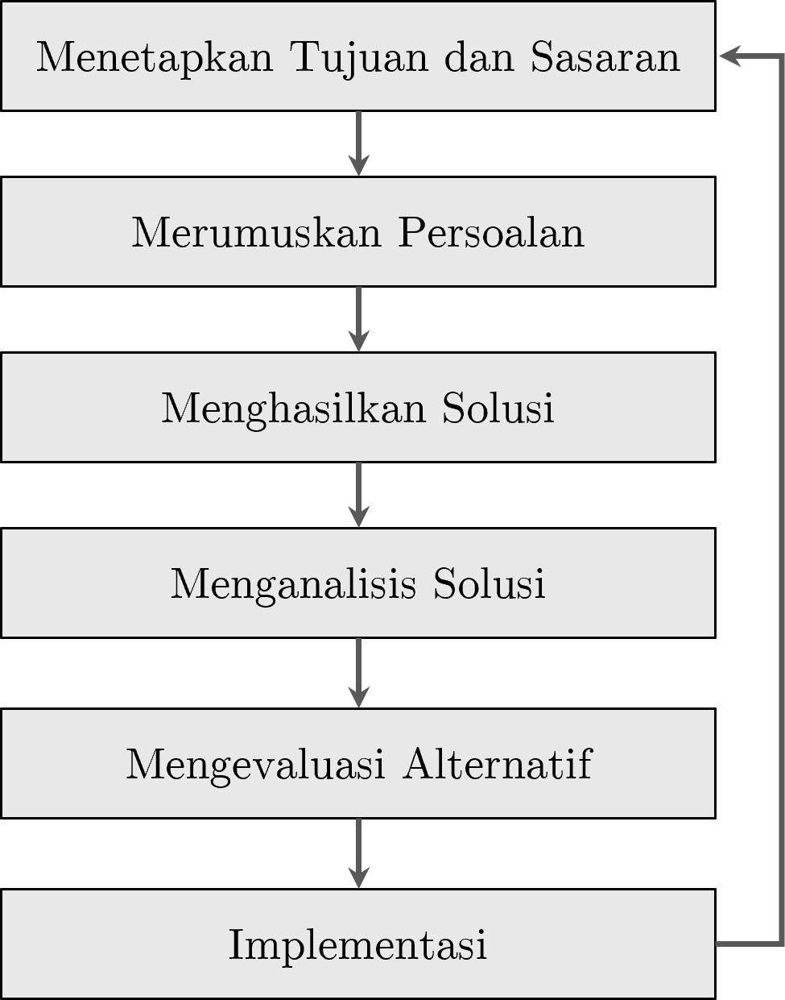
<p class="caption">(\#fig:proses-perencanaan-rasional)Proses Perencanaan Rasional. Diadaptasi dari @ewing2020basic</p>
</div>

Kita ambil contoh di tahap pertama. Penetapan tujuan dan sasaran memerlukan data dari berbagai sumber di wilayah perencanaan, termasuk dari pemangku kepentingan (*stakeholder*). Data-data tersebut dikumpulkan dan untuk merumuskan tujuan dan sasaran yang benar-benar mencerminkan kebutuhan wilayah perencanaan.

Lain lagi di tahap kedua, contoh lainnya. Perumusan persoalan (*problem*) adalah hal yang harus dilakukan dengan mempertimbangkan data dan fakta kondisi yang ada (kondisi eksisting). Hal ini dikarenakan jika kita salah mendefinisikan persoalan, implementasi rencana tidak akan menjawab persoalan yang seharusnya.

Dari paparan sebelumnya, kita dapat menyimpulkan bahwa setiap tahap dalam perencanaan memerlukan penelitian, yakni kegiatan membuat pertanyaan mengenai suatu permasalahan dan menjawab pertanyaan tersebut dengan proses yang sistematis.

::: rmdkasus
### Studi Kasus: Analisis Data dalam Perencanaan Transportasi Berkelanjutan di Kampus ITERA {#kasus-analisis-data-dalam-perencanaan .unnumbered}

Kita akan mengambil kasus berupa perencanaan transportasi berkelanjutan mahasiswa dan staf pegawai di kampus ITERA. Transportasi berkelanjutan adalah perpindahan dalam konteks transportasi yang memiliki nilai berkelanjutan, salah satunya minim polusi udara.

Dalam kasus ini, kita sudah mengetahui bahwa tujuan dari rektorat adalah “transportasi mahasiswa dan pegawai yang berkelanjutan.” Selanjutnya, kita perlu mengetahui apa persoalan yang ada saat ini di kampus ITERA (perhatikan Gambar \@ref(fig:kasus-bab1))

<div class="figure" style="text-align: center">
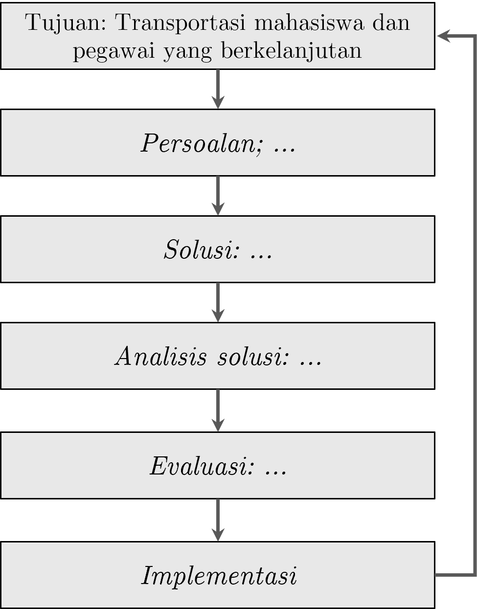
<p class="caption">(\#fig:kasus-bab1)Persoalan Transportasi di ITERA</p>
</div>

Untuk mengetahui persoalan terkait dengan transportasi mahasiswa dan pegawai, kita perlu mengajukan pertanyaan terkait hal ini, yakni *sudah sejauh mana keberlanjutan pada pola pergerakan pada mahasiswa dan pegawai kampus ITERA saat ini?*

Ini adalah pertanyaan penelitian kita untuk menjawab apa persoalan yang ada terkait rencana transportasi berkelanjutan di kampus ITERA. Untuk menjawab pertanyaan ini, kita mengumpulkan data terkait pola pergerakan mahasiswa dan pegawai di ITERA dengan menyebarkan kuesioner kepada para mahasiswa dan pegawai kampus ITERA tentang pola pergerakan mereka.
:::

## Penelitian Kuantitatif vs. Penelitian Kualitatif dan Kedudukan Statistik

Selanjutnya kita akan membahas dua pendekatan terbesar dalam penelitian yakni penelitian kuantitatif dan penelitian kualitatif.

Penelitian secara umum adalah proses mengajukan pertanyaan dan menjawabnya secara sistematis. Pertanyaan yang diajukan bisa terkait dengan tahap yang dilakukan dalam proses perencanaan tadi.

Secara umum, pendekatan penelitian terbagi menjadi **pendekatan kuantitatif** dan **pendekatan kualitatif**. Singkatnya, pendekatan kuantitatif menekankan penggunaan angka-angka (kuantitas) dalam prosesnya, sementara pendekatan kualitatif menekankan pada eksplorasi data-data yang bersifat non-angka dan perlu diindra (dilihat, dicium, diraba, didengar) dan dirasakan.

### Analisis Kuantitatif vs. Analisis Kualitatif {#analisis-kuantitatif-vs-kualitatif}

Analisis adalah salah satu proses dalam penelitian yang mengolah data yang dikumpulkan menjadi jawaban dari pertanyaan di awal. Sebagaimana pendekatannya, secara umum analisis juga dapat dibagi menjadi **analisis kuantitatif** dan **analisis kualitatif**.

Di sisi lain, data sebagai bahan analisis juga dapat dibagi menjadi **data kuantitatif** dan **data kualitatif**. Kita dapat memaknai data kuantitatif sebagai fakta/fenomena yang diukur sehingga dinyatakan dalam bentuk angka, sementara data kualitatif adalah fakta/fenomena yang dijelaskan dalam bentuk pemaknaan dan pemahaman yang mendalam dari pelaku penelitian (subjek penelitian).

Karena analisis kuantitatif menggunakan angka-angka, pengumpulan data kuantitatif dapat disebut juga sebagai **pengukuran**.

::: rmdkasus
### Studi Kasus: Penelitian Mengenai Pola Pergerakan Mahasiswa dan Pegawai di Kampus ITERA {.unnumbered}

Berdasarkan pertanyaan penelitian *sudah sejauh mana keberlanjutan pada pola pergerakan pada mahasiswa dan pegawai kampus ITERA saat ini?*, kita akan mengumpulkan data terkait pola pergerakan mahasiswa dan pegawai di ITERA dengan menyebarkan kuesioner kepada para mahasiswa dan pegawai kampus ITERA tentang pola pergerakan mereka. Berikut adalah analisis tentang perbandingan antara analisis kuantitatif dan analisis kualitatif.

| Aspek | Analisis Kuantitatif | Analisis Kualitatif |
|:---------------|:--------------------------|:----------------------------|
| **Fokus** | Luas (*Breadth*), mencari generalisasi. | Dalam (*Depth*), mencari makna/alasan. |
| **Pertanyaan Utama** | Berapa banyak emisi yang dihasilkan? | Mengapa orang enggan naik shuttle? |
| **Alat Analisis** | Statistik (SPSS, Excel, Pemodelan Transportasi). | Transkrip wawancara, observasi lapangan, analisis tema. |
| **Kelebihan** | Akurat untuk menghitung target penurunan emisi karbon secara matematis. | Sangat baik untuk merancang kebijakan yang sesuai dengan psikologi pengguna. |
| **Kelemahan** | Tidak bisa menjelaskan alasan personal di balik angka. | Hasilnya tidak bisa digeneralisasi untuk seluruh populasi secara kaku. |
:::

### Analisis Statistik sebagai Analisis Kuantitatif

Statistik adalah serangkaian teknik matematis yang digunakan untuk mengorganisir, memanipulasi, dan menganalisis data dengan tujuan menjawab pertanyaan penelitian [@healey2021statistics]. Ilmu yang mempelajari statistik disebut statistika yang dalam bahasa Inggris menjadi "statistics" (menggunakan "s").

Dalam pengertian tersebut terdapat kata kunci "matematis". Kata kunci tersebut tentunya mengantarkan kita berpikir bahwa analisis statistik adalah bagian dari penelitian kuantitatif.

Analisis statistik dapat melakukan hal-hal berikut:

1.  **Meringkas dan Mengorganisasi Data**. Statistik membantu mereduksi banyak item informasi menjadi beberapa angka yang jelas, ringkas, dan mudah dipahami, sebuah proses yang dikenal sebagai reduksi data.
2.  **Mengidentifikasi Pola dan Hubungan**. Statistik memungkinkan peneliti untuk mendeteksi pola dalam data dan mengukur hubungan antara dua atau lebih variabel.
3.  **Membuat Generalisasi**. Salah satu jenis statistik, statistik inferensial, mampu untuk menggeneralisasi temuan dari sampel kecil ke populasi yang lebih luas, memberikan perkiraan seberapa mungkin pola yang diamati dalam sampel berlaku di populasi. Ini akan kita pelajari di bab selanjutnya.
4.  **Menguji Hipotesis dan Teori**. Dalam penelitian secara umum, statistik membantu kita menguji apakah ide atau dugaan yang kita buat benar, berdasarkan data. Dari teori yang ada, kita bisa membuat hipotesis dan mengujinya secara empiris, atau bahkan menemukan hipotesis baru dari data.

Secara umum, statistika dapat dibagi menjadi dua menurut keperluannya terkait data: **statistika deskriptif** dan **statistika inferensial** [@ewing2020basic]. Statistika deskriptif berfungsi untuk mendeskripsikan data dari sebuah sampel atau populasi. Di sisi lain, statistik inferensial menarik kesimpulan dari data yang dikumpulkan (sampel) terhadap cakupan yang lebih besar dari data tersebut, yakni populasi.

Berdasarkan jumlah variabelnya statistika juga dapat dibagi menjadi 3: **statistika univariat**, **statistika bivariat** dan **statistika multivariat**. Sesuai namanya, statistika univariat adalah statistika yang digunakan untuk menganalisis satu variabel saja. Statistika bivariat adalah statistika yang menganalisis dua variabel secara bersamaan, sementara multivariat menganalisis lebih dari dua.

Jawablah soal evaluasi berikut untuk menguji pemahaman Anda tentang konsep dasar statistika dalam perencanaan.

::: rmdexercise
## Soal Evaluasi 1 {.unnumbered}

1.  Jelaskanlah penggunaan analisis data dalam setiap tahap perencanaan untuk kasus acara kumpul keakraban angkatan! [STP-1.1]{.capaian}
2.  Ceritakan perbedaan analisis kuantitatif dan kualitatif yang mungkin digunakan dalam perencanaan acara tersebut. [STP-1.2]{.capaian}
:::

<!--chapter:end:01-konsep-dasar.Rmd-->

# Data Terstruktur

::: rmdcapaian
### Capaian Pembelajaran {.unnumbered}

Setelah mempelajari bab ini, Anda diharapkan:

1. mampu menganalisis variabel dan objek dalam sebuah format data terstruktur sesuai dengan konsepnya [STP-1.3]{.capaian}
2. mampu menentukan tingkat pengukuran yang tepat untuk sebuah variabel [STP-2.1]{.capaian}
:::

Berdasarkan formatnya, data dapat dibedakan menjadi dua jenis. Jenis data berdasarkan formatnya tersebut terdiri atas **data tidak terstruktur**  (*unstructured data*) dan **data terstruktur** (*structured data*).

Data tidak terstruktur adalah data yang tidak memiliki format yang terdefinisikan sebelum dikumpulkan, seperti teks wawancara, rekaman suara, gambar, atau video. Bentuk dan ukuran data-data tersebut dapat berbeda-beda, dengan kata lain formatnya tidak sama sehingga dapat dikatakan juga tidak terdefinisi atau tidak terstruktur [@oracle2024structured].

Di sisi lain, data terstruktur adalah data yang memiliki definisi yang jelas dan pola yang telah ditentukan sebelum dikumpulkan. Definisi yang jelas di sini diperlihatkan dengan bentuk data terstruktur berupa tabel. Dengan bentuk tabel, data memiliki format yang terdefinisi, lebih jelas isinya, dan dapat dikenali polanya sehingga lebih mudah untuk dianalisis.

**Penelitian yang menggunakan analisis statistik pasti menghasilkan data terstruktur dari pengumpulannya** [@devaus2014surveys]. Hal ini bukan berarti penelitian kualitatif juga tidak bisa menghasilkan data terstruktur, akan tetapi hal tersebut tidak mutlak. Hanya penelitian kuantitatif dengan metode analisis statistik yang mutlak menggunakan data terstruktur.

## Elemen Data Terstruktur {#kasus-elemen-data-terstruktur}

Dengan format yang jelas, data terstruktur dapat dipandang sebagai susunan 3 elemen penting: objek (*object*), variabel (*variable*), dan nilai (*value*). Ketiga hal ini membentuk struktur yang disebut **tabulasi data**. Tabulasi data adalah bentuk penyajian data dalam bentuk tabel yang terdiri atas baris dan kolom. Sebuah tabulasi data yang baik harus memiliki struktur yang jelas di mana baris mewakili objek dan kolom mewakili variabel.

1.  **Objek**. Objek adalah unit analisis yang datanya kita kumpulkan. Dalam tabulasi data, objek biasanya menempati posisi **baris** (*row*). Contoh objek dalam perencanaan wilayah dan kota bisa berupa rumah tangga, individu, kelurahan, kecamatan, atau kabupaten.
2.  **Variabel**. Variabel adalah karakteristik atau atribut yang melekat pada objek yang nilainya bisa berbeda-beda (bervariasi) antar satu objek dengan objek lainnya. Dalam tabulasi data, variabel menempati posisi **kolom** (*column*). Contoh variabel adalah luas lahan, jumlah penduduk, pendapatan per bulan, dan tingkat pendidikan.
3.  **Nilai**. Nilai adalah angka atau kategori yang mengisi perpotongan antara baris (objek) dan kolom (variabel), yakni **sel** (*cell*). Nilai ini merepresentasikan data spesifik dari variabel tertentu untuk objek tertentu.

::: rmdkasus
### Studi Kasus: Elemen Data Terstruktur {.unnumbered} 

Perhatikan hasil pengumpulan data kuesioner berupa tabulasi data dari mahasiswa-mahasiswa ITERA seperti yang ditampilkan pada Gambar \@ref(fig:bab-2-ilus-data-terstruktur).

<div class="figure" style="text-align: center">
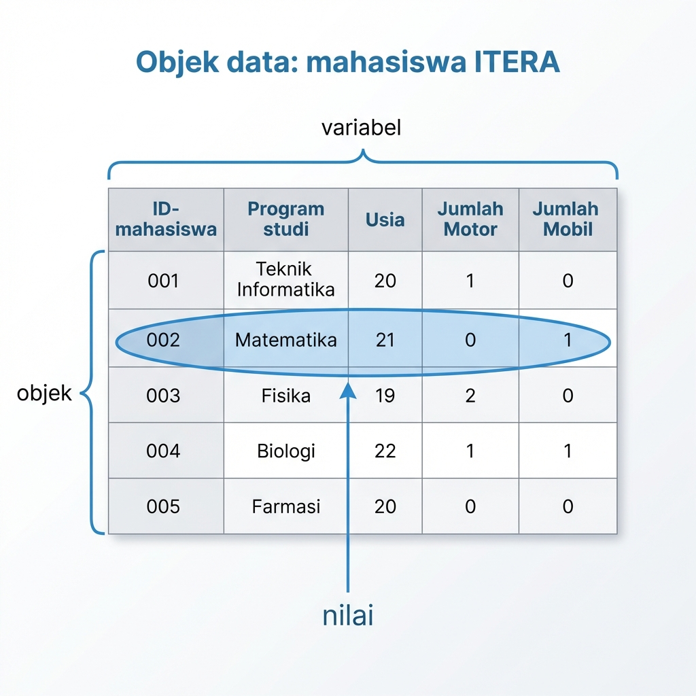
<p class="caption">(\#fig:bab-2-ilus-data-terstruktur)Ilustrasi elemen data terstruktur</p>
</div>

Kita akan membedah elemen-elemen data terstruktur dari tabulasi data tersebut:
- Objek dari tabulasi data tersebut adalah mahasiswa-mahasiswa ITERA. Tiap objek dibedakan berdasarkan variabel `ID-mahasiswa`.
- Variabel dari tabulasi data tersebut di antaranya adalah `Program Studi`, `Usia`, `Jumlah Motor`, dan `Jumlah Mobil`. Adapun variabel `ID-mahasiswa` tidak termasuk dalam variabel yang dihitung karena hanya bertindak sebagai pengidentifikasi objek.
- Nilai dari tabulasi data tersebut bisa kita lihat di sel-selnya. Misalnya, objek mahasiswa dengan `ID-mahasiswa` 002 memiliki nilai `Program Studi` adalah "Matematika", `Usia` adalah 21 tahun, `Jumlah Motor` adalah 0, dan `Jumlah Mobil` adalah 1.
:::

## Tabulasi Data Terstruktur yang Baik

Agar data dapat diolah dengan baik menggunakan perangkat lunak statistik seperti R, tabulasi data harus memenuhi kaidah "Tidy Data" atau data yang rapi. Berikut adalah prinsip-prinsip data yang rapi:

1.  Setiap variabel harus membentuk satu kolom.
2.  Setiap observasi (objek) harus membentuk satu baris.
3.  Setiap jenis unit observasi membentuk satu tabel.

Pelajari kasus yang berisi perbandingan antara data yang tidak rapi dan data yang rapi berikut.

::: rmdkasus
### Studi Kasus: Perbandingan Data yang Tidak Rapi dan Data yang Rapi {.unnumbered} 

Berikut adalah beberapa contoh kesalahan umum dalam struktur data dan perbaikannya:

<table class="table table-striped table-hover" style="margin-left: auto; margin-right: auto;">
 <thead>
  <tr>
   <th style="text-align:left;"> Jenis Kesalahan </th>
   <th style="text-align:left;"> Data Tidak Rapi (Salah) </th>
   <th style="text-align:left;"> Data Rapi (Benar) </th>
  </tr>
 </thead>
<tbody>
  <tr>
   <td style="text-align:left;width: 20%; font-weight: bold;"> Kesalahan 1: Header Baris Bersarang </td>
   <td style="text-align:left;width: 40%; "> 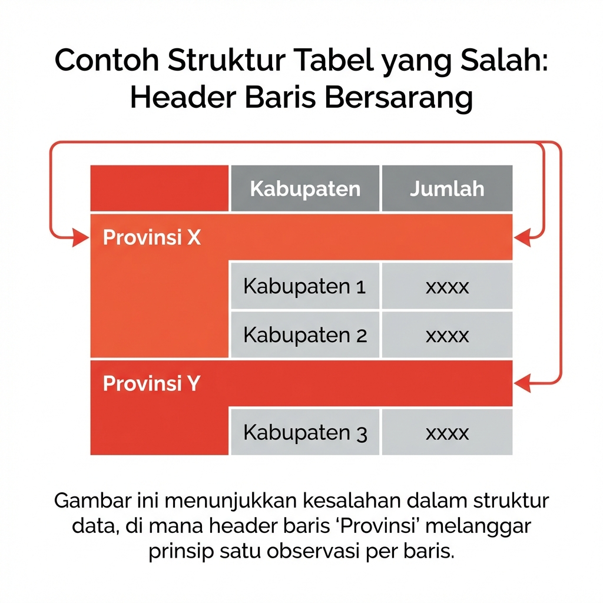 </td>
   <td style="text-align:left;width: 40%; "> 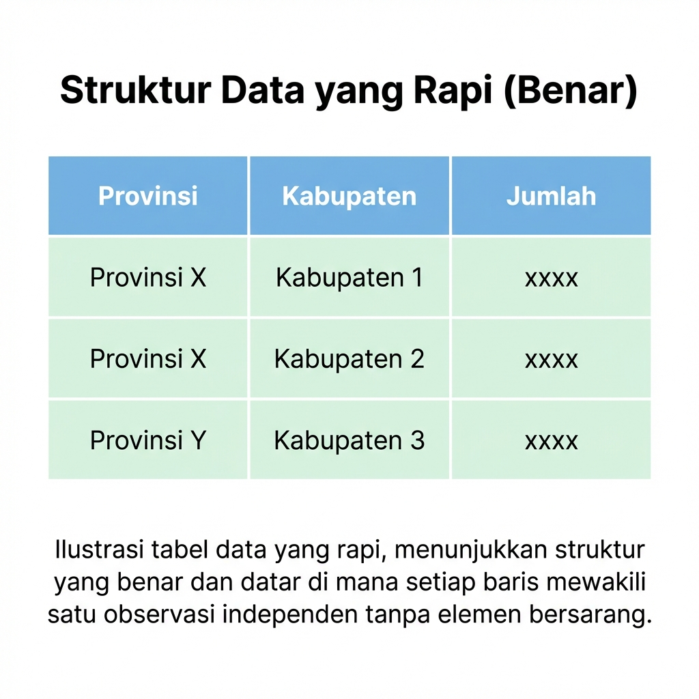 </td>
  </tr>
  <tr>
   <td style="text-align:left;width: 20%; font-weight: bold;"> Kesalahan 2: Struktur Kompleks </td>
   <td style="text-align:left;width: 40%; "> 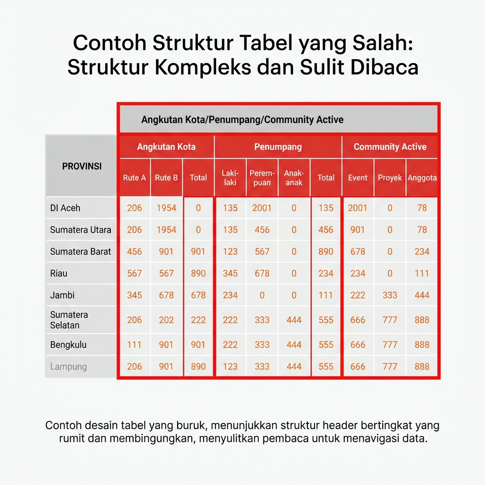 </td>
   <td style="text-align:left;width: 40%; "> 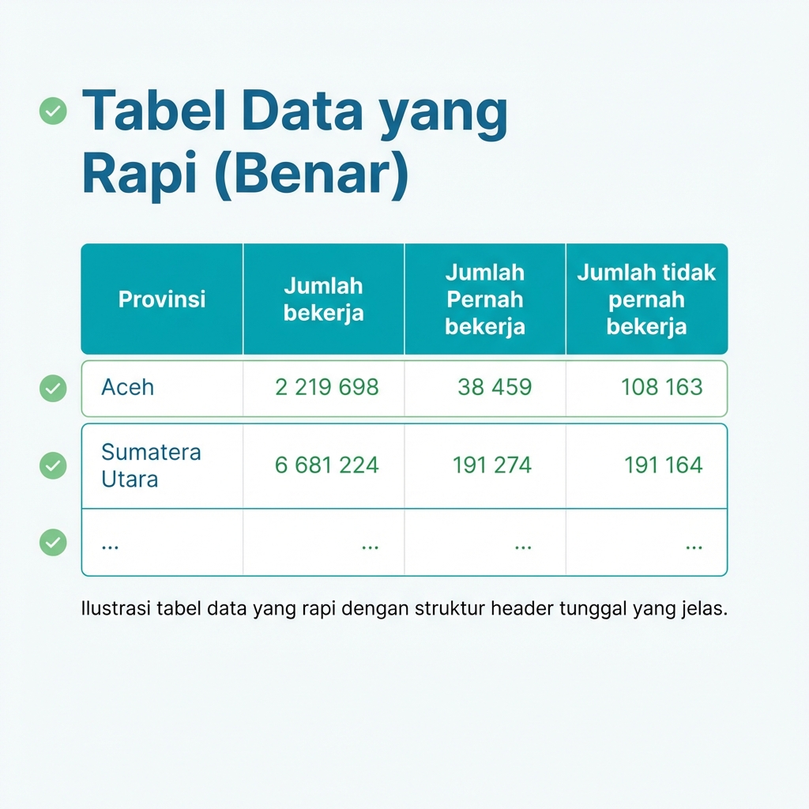 </td>
  </tr>
  <tr>
   <td style="text-align:left;width: 20%; font-weight: bold;"> Kesalahan 3: Format Tidak Konsisten </td>
   <td style="text-align:left;width: 40%; "> 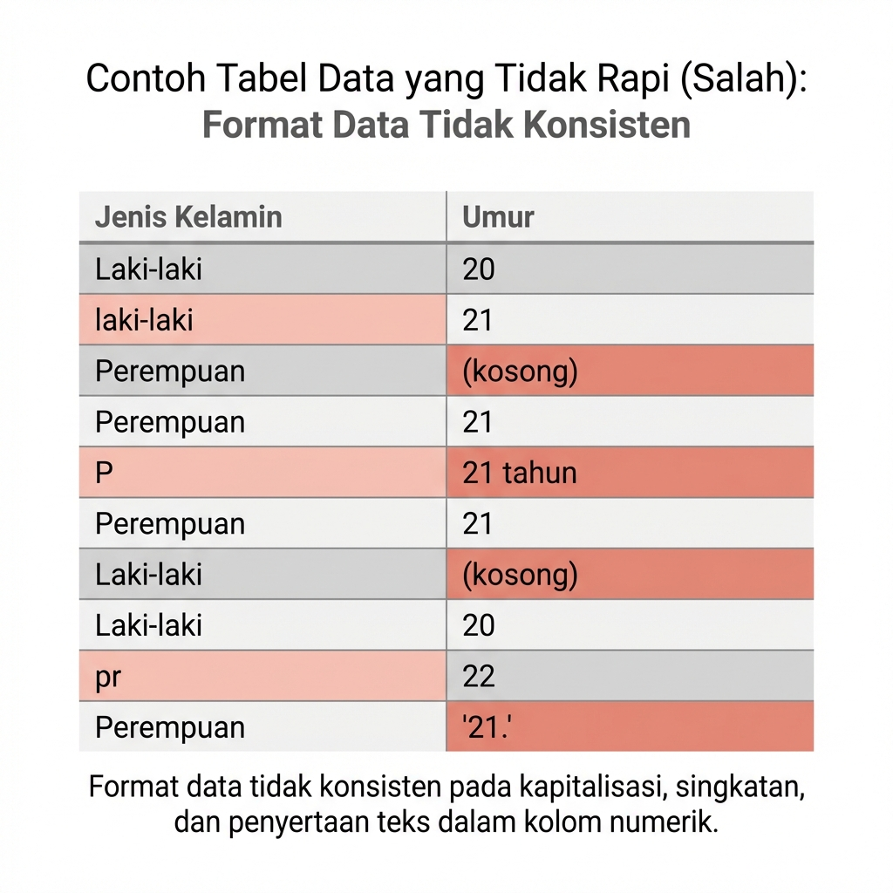 </td>
   <td style="text-align:left;width: 40%; "> 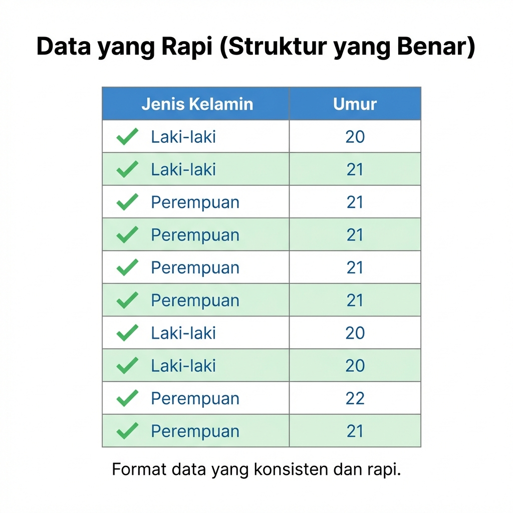 </td>
  </tr>
</tbody>
</table>
:::

Jawablah soal evaluasi berikut untuk menguji pemahaman Anda tentang elemen-elemen data terstruktur.

::: rmdexercise
## Soal Evaluasi 2 {.unnumbered}

Perhatikan tabel hasil pengumpulan data kuesioner berikut ini [STP-1.3]{.capaian}:

<table class="table table-striped table-hover" style="margin-left: auto; margin-right: auto;">
 <thead>
  <tr>
   <th style="text-align:left;"> ID_rumah </th>
   <th style="text-align:right;"> Usia_KK </th>
   <th style="text-align:right;"> Jml_anggota </th>
   <th style="text-align:right;"> Luas_rumah </th>
   <th style="text-align:right;"> Income_bln </th>
  </tr>
 </thead>
<tbody>
  <tr>
   <td style="text-align:left;width: 20%; font-weight: bold;"> 001 </td>
   <td style="text-align:right;width: 40%; "> 55 </td>
   <td style="text-align:right;width: 40%; "> 2 </td>
   <td style="text-align:right;"> 101 </td>
   <td style="text-align:right;"> 3,3 </td>
  </tr>
  <tr>
   <td style="text-align:left;width: 20%; font-weight: bold;"> 002 </td>
   <td style="text-align:right;width: 40%; "> 64 </td>
   <td style="text-align:right;width: 40%; "> 5 </td>
   <td style="text-align:right;"> 245 </td>
   <td style="text-align:right;"> 6,0 </td>
  </tr>
  <tr>
   <td style="text-align:left;width: 20%; font-weight: bold;"> 003 </td>
   <td style="text-align:right;width: 40%; "> 33 </td>
   <td style="text-align:right;width: 40%; "> 7 </td>
   <td style="text-align:right;"> 69 </td>
   <td style="text-align:right;"> 3,5 </td>
  </tr>
  <tr>
   <td style="text-align:left;width: 20%; font-weight: bold;"> 004 </td>
   <td style="text-align:right;width: 40%; "> 28 </td>
   <td style="text-align:right;width: 40%; "> 2 </td>
   <td style="text-align:right;"> 44 </td>
   <td style="text-align:right;"> 27,0 </td>
  </tr>
</tbody>
</table>

Jawablah pertanyaan-pertanyaan berikut berdasarkan tabel tersebut:

a. Ada berapa objek dalam data terstruktur tersebut? 
b. Sebutkan apa kira-kira objek dari data terstruktur tersebut.
c. Berapa variabel yang dapat dianalisis dari data terstruktur tersebut? Sebutkan apa saja.
d. Apakah format tabel tersebut sesuai dengan prinsip data yang rapi? Jelaskan alasan Anda.
:::

## Tingkat Pengukuran Variabel

Pada subbab ini kita akan membahas lebih dalam tentang nilai dalam variabel yang berpengaruh pada analisis selanjutnya, yakni tingkat pengukuran variabel.

Sebagaimana telah disebutkan pada Subbab \@ref(analisis-kuantitatif-vs-kualitatif) bahwa pengumpulan data kuantitatif dapat disebut juga sebagai pengukuran suatu variabel, cara kita mengukur suatu variabel bisa diibaratkan seperti menggunakan mistar yang memiliki sederet angka [@kachigan1986statistical].

Tingkat pengukuran berbicara tentang cara kita menyatakan hasil pengukuran suatu variabel tersebut dalam angka, mulai dari hasil yang sangat menyerupai angka dalam mistar hingga hasil yang bukan angka sama sekali.

::: rmdkasus
### Studi Kasus: Tingkat Pengukuran Variabel {.unnumbered}

Sesuai dengan kasus \@ref(kasus-elemen-data-terstruktur), kita akan menggunakan kasus variabel `Usia` dari data terstruktur tersebut.

Dalam variabel tersebut, nilai `Usia` dapat kita nyatakan dalam 2 bentuk yang berbeda. Kita akan bedakan bentuknya menjadi kasus-kasus berikut:

1. **Kasus-1:** nilai `Usia` dinyatakan dalam bentuk angka dalam satuan tahun. Dengan demikian, dalam kasus ini nilai `17` berarti "17 tahun", dan nilai `26` berarti "26 tahun", dan seterusnya.

2. **Kasus-2:** nilai `Usia` dinyatakan dalam bentuk rentang usia seperti berikut:

    * kategori 1: 17-25 tahun
    * kategori 2: 26-35 tahun
    * kategori 3: 36-45 tahun
    * kategori 4: 46-55 tahun
    * kategori 5: 56-65 tahun

    Kita bisa menyatakan setiap kategori dengan angka tertentu yang masing-masingnya tentu mewakili rentang usia tersebut. Misalnya, kita bisa menyatakan kategori 1 dengan angka 17, kategori 2 dengan angka 26, dan seterusnya, sehingga rentangnya menjadi seperti ini:

    * 17: 17-25 tahun
    * 26: 26-35 tahun
    * 36: 36-45 tahun
    * 46: 46-55 tahun
    * 56: 56-65 tahun

    Dalam kasus ini, nilai `17` bukan lagi berarti "17 tahun", melainkan "17-25 tahun". Artinya nilai `17` ini bisa saja bernilai `17` atau `18` atau `19` atau `20` atau `21` atau `22` atau `23` atau `24` atau `25`.

Kedua kasus tersebut menunjukkan bahwa kita bisa menggunakan tingkat pengukuran yang berbeda untuk variabel yang sama. 

Kita akan mempelajari nama-nama tingkat pengukuran tersebut dalam subbab-subbab selanjutnya.
:::

## Jenis-jenis Tingkat Pengukuran Variabel

Tingkat pengukuran variabel secara umum memiliki 3 jenis dari yang paling rendah ke yang paling tinggi di antaranya adalah nominal, ordinal, dan metrik (metric). Kita akan bahas lebih dalam tentang jenis-jenis tersebut sebagai berikut mulai dari yang paling rendah ke yang paling tinggi.

### Nominal

Tingkat pengukuran nominal adalah tingkat pengukuran yang **paling rendah**. Jika angka dikenakan pada variabel ini, angka tersebut hanya bertindak sebagai label.

### Ordinal

Tingkat pengukuran ordinal berada di atas nominal. Angka pada tingkat ini hanya menunjukkan **urutan** atau **posisi** tetapi tidak dapat memberikan penafsiran berapa jarak di antara posisi-posisi tersebut.

### Metrik (Angka)

Variabel dengan tingkat pengukuran angka (bahasa Inggris: *metric*) adalah variabel dengan **angka yang sebenarnya** karena angka pada tingkat pengukuran ini memiliki penafsiran angka yang sebenarnya, yaitu memiliki posisi dan skala nilainya.

Dalam literatur lain, seperti @tjokropandojo2021pengantar, tingkat pengukuran ini banyak dibagi menjadi dua tingkat lagi, yaitu **interval** dan **rasio**. Perbedaan antara keduanya adalah bahwa interval **tidak memiliki posisi nol absolut** seperti rasio.

Contoh yang paling mudah adalah suhu. Suhu dapat dinyatakan dalam skala Celsius dan Fahrenheit. Dalam skala Celsius, air membeku pada tingkat 0 derajat, tetapi dalam skala Fahrenheit air membeku pada tingkat 32 derajat. Ini menunjukkan posisi nol yang tidak absolut pada pengukuran suhu.

Contoh lainnya adalah tahun. Dalam penanggalan Masehi, tahun-0 ditempatkan pada masa kelahiran Isa Al-Masih. Sementara itu, dalam penanggalan Hijriah, tahun-0 ditempatkan masa hijrahnya Nabi Muhammad SAW. Masa kelahiran Isa Al-Masih tentunya terjadi lebih dulu dibandingkan masa hijrah Nabi Muhammad SAW. Ini juga menunjukkan posisi nol yang tidak absolut pada pengukuran tahun.

## Menentukan Tingkat Pengukuran Variabel

Dalam praktiknya, menentukan tingkat pengukuran variabel seringkali tidak mudah karena seringkali data yang kita kumpulkan tidak memiliki tingkat pengukuran yang jelas. Oleh karena itu, kita perlu melakukan analisis lebih dalam untuk menentukan tingkat pengukuran variabel tersebut. Berikut adalah langkah-langkah yang dapat kita lakukan untuk menentukan tingkat pengukuran variabel.

1. Tentukan apakah jenis nilai dari variabel: apakah **kategorik** atau **numerik**
2. Jika **kategorik**, tentukan apakah terdapat tingkatan yang masuk akal. Jika terdapat tingkatan, maka ia pasti berupa ordinal. Jika tidak terdapat tingkatan, maka ia pasti berupa nominal.
3. Jika **numerik**, pastikan apakah angka-angka merepresentasikan angka sebenarnya. Jika tidak, ia sebenarnya adalah **kategorik**. Kembali ke langkah 1.
4. Jika **numerik** dan angka-angka merepresentasikan angka sebenarnya, pastikan apakah angka-angka memiliki posisi nol absolut. Jika tidak, ia pasti berupa **interval**. Jika ya, ia pasti berupa **rasio**.

Langkah-langkah tersebut dapat diilustrasikan dalam diagram alir yang ditampilkan dalam Gambar \@ref(fig:fig-menentukan-tingpeng) berikut. 

<div class="figure" style="text-align: center">

<p class="caption">(\#fig:fig-menentukan-tingpeng)Diagram alir menentukan tingkat pengukuran variabel</p>
</div>

::: rmdkasus
### Studi Kasus: Menentukan Tingkat Pengukuran Variabel {.unnumbered}

Melanjutkan kasus pengumpulan data pergerakan mahasiswa ITERA dari bab sebelumnya, setelah merumuskan pertanyaan penelitian mengenai keberlanjutan pola pergerakan, kita perlu menentukan variabel yang akan diukur. Berikut adalah variabel-variabel tersebut beserta penjelasannya:

<table class="table table-striped table-hover" style="margin-left: auto; margin-right: auto;">
<caption>(\#tab:bab-2-rancangan-metadata)Penelaahan tingkat pengukuran variabel penelitian</caption>
 <thead>
  <tr>
   <th style="text-align:left;"> Variabel </th>
   <th style="text-align:left;"> Nama Panggilan </th>
   <th style="text-align:left;"> Penjelasan </th>
  </tr>
 </thead>
<tbody>
  <tr>
   <td style="text-align:left;"> Moda transportasi yang digunakan responden </td>
   <td style="text-align:left;"> `kend` </td>
   <td style="text-align:left;"> Nilai-nilai dari moda transportasi bukanlah angka, melainkan label yang merepresentasikan jenis moda transportasi yang digunakan responden. Oleh karena itu, jenis nilai dari variabel ini adalah kategorik. Tidak ada tingkatan pada nilai-nilai di variabel ini, sehingga tingkat pengukurannya adalah nominal. </td>
  </tr>
  <tr>
   <td style="text-align:left;"> Jarak tempuh dari rumah ke kampus </td>
   <td style="text-align:left;"> `jarak` </td>
   <td style="text-align:left;"> Nilai-nilai dari jarak tempuh dari rumah ke kampus adalah angka yang merepresentasikan jarak tempuh dari rumah ke kampus. Oleh karena itu, jenis nilai dari variabel ini adalah numerik. Angka 0 merepresentasikan tidak ada jarak tempuh. Karena ini angka sebenarnya dan memiliki makna 0 yang sebenarnya, maka tingkat pengukurannya adalah rasio. </td>
  </tr>
  <tr>
   <td style="text-align:left;"> Banyaknya perjalanan ke kampus dalam satu pekan </td>
   <td style="text-align:left;"> `frek_jalan_sepekan` </td>
   <td style="text-align:left;"> Nilai-nilai dari banyaknya perjalanan ke kampus dalam satu pekan adalah angka yang merepresentasikan banyaknya perjalanan ke kampus dalam satu pekan. Oleh karena itu, jenis nilai dari variabel ini adalah numerik. Angka 0 merepresentasikan banyaknya perjalanan ke kampus 0 kali, atau tidak pernah ke kampus. Karena ini angka sebenarnya dan memiliki makna 0 yang sebenarnya, maka tingkat pengukurannya adalah rasio. </td>
  </tr>
  <tr>
   <td style="text-align:left;"> Total biaya transportasi selama satu pekan </td>
   <td style="text-align:left;"> `biaya` </td>
   <td style="text-align:left;"> Nilai-nilai dari total biaya transportasi selama satu pekan adalah angka yang merepresentasikan total biaya transportasi selama satu pekan. Oleh karena itu, jenis nilai dari variabel ini adalah numerik. Angka 0 merepresentasikan total biaya transportasi 0 rupiah, atau tidak mengeluarkan biaya transportasi. Karena ini angka sebenarnya dan memiliki makna 0 yang sebenarnya, maka tingkat pengukurannya adalah rasio. </td>
  </tr>
</tbody>
</table>

Setelah menelaah jenis nilai dan tingkat pengukuran variabel, kita perlu menspesifikasikan nilai isian beserta satuannya. Jika menggunakan kodifikasi, aturannya harus diperjelas. Spesifikasi ini disebut **metadata**, yaitu data yang menjelaskan tentang data.

<table class="table table-striped table-hover" style="margin-left: auto; margin-right: auto;">
<caption>(\#tab:bab-2-metadata)Metadata variabel penelitian</caption>
 <thead>
  <tr>
   <th style="text-align:left;"> Variabel </th>
   <th style="text-align:left;"> Nama Panggilan </th>
   <th style="text-align:left;"> Tingkat Pengukuran </th>
   <th style="text-align:left;"> Satuan </th>
   <th style="text-align:left;"> Nilai yang mungkin </th>
  </tr>
 </thead>
<tbody>
  <tr>
   <td style="text-align:left;"> Moda transportasi yang digunakan responden </td>
   <td style="text-align:left;"> `kend` </td>
   <td style="text-align:left;"> Nominal </td>
   <td style="text-align:left;"> Tidak ada </td>
   <td style="text-align:left;"> Sepeda motor, mobil, angkutan umum, dll </td>
  </tr>
  <tr>
   <td style="text-align:left;"> Jarak tempuh dari rumah ke kampus </td>
   <td style="text-align:left;"> `jarak` </td>
   <td style="text-align:left;"> Metrik </td>
   <td style="text-align:left;"> km </td>
   <td style="text-align:left;"> 0 - ∞ km </td>
  </tr>
  <tr>
   <td style="text-align:left;"> Banyaknya perjalanan ke kampus dalam satu pekan </td>
   <td style="text-align:left;"> `frek_jalan_sepekan` </td>
   <td style="text-align:left;"> Metrik </td>
   <td style="text-align:left;"> kali </td>
   <td style="text-align:left;"> 0 - 7 </td>
  </tr>
  <tr>
   <td style="text-align:left;"> Total biaya transportasi selama satu pekan </td>
   <td style="text-align:left;"> `biaya` </td>
   <td style="text-align:left;"> Metrik </td>
   <td style="text-align:left;"> rupiah (Rp) </td>
   <td style="text-align:left;"> 0 - ∞ </td>
  </tr>
</tbody>
</table>

**Mengubah Tingkat Pengukuran Variabel**

Kita sudah menentukan nilai dari telaahan variabel-variabel yang sudah kita buat sebelumnya. Pada hasil telaahan kita sebelumnya, kita memiliki satu variabel nominal dan 3 variabel numerik. Variabel nominal tersebut adalah `kend`, sedangkan variabel numerik tersebut adalah `jarak`, `frek_jalan_sepekan`, dan `biaya`.

Kita bisa mengubah tingkat pengukuran variabel dari satu tingkat ke lainnya. Misalnya, kita bisa mengubah tingkat pengukuran variabel `jarak` dari metrik (rasio) menjadi ordinal. Karena tingkat pengukuran variabel metrik adalah angka, untuk mengubahnya menjadi ordinal maka kita perlu mengubahnya menjadi kategorikal. Artinya, kita perlu membuat kategori baru dari variabel `jarak` tersebut.

<table class="table table-striped table-hover" style="margin-left: auto; margin-right: auto;">
<caption>(\#tab:bab-2-ubah-tingkat-pengukuran)Metadata variabel penelitian yang diubah</caption>
 <thead>
  <tr>
   <th style="text-align:left;"> Variabel </th>
   <th style="text-align:left;"> Nama Panggilan </th>
   <th style="text-align:left;"> Tingkat Pengukuran </th>
   <th style="text-align:left;"> Satuan </th>
   <th style="text-align:left;"> Nilai yang mungkin </th>
  </tr>
 </thead>
<tbody>
  <tr>
   <td style="text-align:left;"> Moda transportasi yang digunakan responden </td>
   <td style="text-align:left;"> `kend` </td>
   <td style="text-align:left;"> Nominal </td>
   <td style="text-align:left;"> Tidak ada </td>
   <td style="text-align:left;"> Sepeda motor, mobil, angkutan umum, dll </td>
  </tr>
  <tr>
   <td style="text-align:left;background-color: rgba(255, 255, 204, 255) !important;"> Jarak tempuh dari rumah ke kampus </td>
   <td style="text-align:left;background-color: rgba(255, 255, 204, 255) !important;"> `jarak` </td>
   <td style="text-align:left;background-color: rgba(255, 255, 204, 255) !important;"> Ordinal </td>
   <td style="text-align:left;background-color: rgba(255, 255, 204, 255) !important;"> km </td>
   <td style="text-align:left;background-color: rgba(255, 255, 204, 255) !important;"> 0 - 5 km,<br>5 - 10 km,<br>10 - 15 km,<br>dll </td>
  </tr>
  <tr>
   <td style="text-align:left;"> Banyaknya perjalanan ke kampus dalam satu pekan </td>
   <td style="text-align:left;"> `frek_jalan_sepekan` </td>
   <td style="text-align:left;"> Metrik </td>
   <td style="text-align:left;"> kali </td>
   <td style="text-align:left;"> 0 - 7 </td>
  </tr>
  <tr>
   <td style="text-align:left;"> Total biaya transportasi selama satu pekan </td>
   <td style="text-align:left;"> `biaya` </td>
   <td style="text-align:left;"> Metrik </td>
   <td style="text-align:left;"> rupiah (Rp) </td>
   <td style="text-align:left;"> 0 - ∞ </td>
  </tr>
</tbody>
</table>
:::


Jawablah soal evaluasi berikut untuk menguji pemahaman Anda tentang tingkat pengukuran variabel.

::: rmdexercise
## Soal Evaluasi 3 {.unnumbered}

Perhatikan cuplikan data hasil survei mahasiswa berikut ini:

<table class="table table-striped table-hover" style="margin-left: auto; margin-right: auto;">
<caption>(\#tab:bab-2-eval-3-preview)Cuplikan data survei mahasiswa</caption>
 <thead>
  <tr>
   <th style="text-align:center;"> KodeResp </th>
   <th style="text-align:center;"> Usia </th>
   <th style="text-align:center;"> Fakultas </th>
   <th style="text-align:center;"> ThnMsk </th>
   <th style="text-align:center;"> UangSaku </th>
   <th style="text-align:center;"> Jarak </th>
  </tr>
 </thead>
<tbody>
  <tr>
   <td style="text-align:center;"> 001 </td>
   <td style="text-align:center;"> 22 </td>
   <td style="text-align:center;"> 1 </td>
   <td style="text-align:center;"> 2020 </td>
   <td style="text-align:center;"> 2 </td>
   <td style="text-align:center;"> 19,27 </td>
  </tr>
  <tr>
   <td style="text-align:center;"> 002 </td>
   <td style="text-align:center;"> 25 </td>
   <td style="text-align:center;"> 1 </td>
   <td style="text-align:center;"> 2020 </td>
   <td style="text-align:center;"> 1 </td>
   <td style="text-align:center;"> 0,58 </td>
  </tr>
  <tr>
   <td style="text-align:center;"> 003 </td>
   <td style="text-align:center;"> 24 </td>
   <td style="text-align:center;"> 2 </td>
   <td style="text-align:center;"> 2021 </td>
   <td style="text-align:center;"> 1 </td>
   <td style="text-align:center;"> 0,56 </td>
  </tr>
  <tr>
   <td style="text-align:center;"> 004 </td>
   <td style="text-align:center;"> 19 </td>
   <td style="text-align:center;"> 3 </td>
   <td style="text-align:center;"> 2022 </td>
   <td style="text-align:center;"> 1 </td>
   <td style="text-align:center;"> 1,05 </td>
  </tr>
  <tr>
   <td style="text-align:center;"> 005 </td>
   <td style="text-align:center;"> 23 </td>
   <td style="text-align:center;"> 2 </td>
   <td style="text-align:center;"> 2021 </td>
   <td style="text-align:center;"> 1 </td>
   <td style="text-align:center;"> 1,69 </td>
  </tr>
  <tr>
   <td style="text-align:center;"> 006 </td>
   <td style="text-align:center;"> 20 </td>
   <td style="text-align:center;"> 1 </td>
   <td style="text-align:center;"> 2020 </td>
   <td style="text-align:center;"> 3 </td>
   <td style="text-align:center;"> 1,37 </td>
  </tr>
</tbody>
</table>

Adapun keterangan dari variabel-variabel tersebut (metadata) adalah sebagai berikut:

<table class="table table-striped table-hover" style="margin-left: auto; margin-right: auto;">
<caption>(\#tab:bab-2-eval-3-metadata)Metadata variabel survei mahasiswa</caption>
 <thead>
  <tr>
   <th style="text-align:left;"> Nama Variabel </th>
   <th style="text-align:left;"> Deskripsi </th>
   <th style="text-align:left;"> Nilai-nilai yang valid </th>
  </tr>
 </thead>
<tbody>
  <tr>
   <td style="text-align:left;"> `KodeResp` </td>
   <td style="text-align:left;"> Nomor urut responden </td>
   <td style="text-align:left;"> tiga digit angka, hingga jumlah responden minimal </td>
  </tr>
  <tr>
   <td style="text-align:left;"> `Usia` </td>
   <td style="text-align:left;"> Usia responden (tahun) </td>
   <td style="text-align:left;"> 18 - ∞ </td>
  </tr>
  <tr>
   <td style="text-align:left;"> `Fakultas` </td>
   <td style="text-align:left;"> Fakultas mahasiswa </td>
   <td style="text-align:left;"> 1 = Fakultas Syariah,<br>2 = Fakultas Tarbiyah dan Keguruan,<br>3 = Fakultas Dakwah dan Komunikasi </td>
  </tr>
  <tr>
   <td style="text-align:left;"> `ThnMsk` </td>
   <td style="text-align:left;"> Tahun masuk kuliah (Masehi) </td>
   <td style="text-align:left;"> 2018 - 2022 </td>
  </tr>
  <tr>
   <td style="text-align:left;"> `UangSaku` </td>
   <td style="text-align:left;"> Uang saku mahasiswa per bulan </td>
   <td style="text-align:left;"> 1 = &lt;1 juta rupiah,<br>2 = 1-2 juta rupiah,<br>3 = 2-3 juta rupiah,<br>4 = 3-4 juta,<br>5 = &gt;4 juta </td>
  </tr>
  <tr>
   <td style="text-align:left;"> `Jarak` </td>
   <td style="text-align:left;"> Jarak tempat tinggal mahasiswa dari kampus (km) </td>
   <td style="text-align:left;"> 0 - ∞ </td>
  </tr>
</tbody>
</table>

Sebutkan tingkat pengukuran untuk variabel-variabel yang ada dalam set data tersebut dan jelaskan! [STP-2.1]{.capaian}

:::

<!--chapter:end:02-data-terstruktur.Rmd-->

# Analisis Statistik Deskriptif {#bab-3-analisis-statistik-deskriptif}

::: rmdcapaian
### Capaian Pembelajaran {.unnumbered}

Setelah mempelajari bab ini, Anda diharapkan:

1.  mampu memilih statistik deskriptif yang tepat sesuai dengan variabel yang akan disajikan dan informasi yang ingin disampaikan [STP-2.2]{.capaian}
2.  mampu menginterpretasikan informasi dari persentase/proporsi, rasio, laju, ukuran pemusatan, dan ukuran penyebaran suatu data kuantiatif sesuai dengan konteks kasusnya [STP-2.3]{.capaian}
:::

## Makna Analisis Statistik Deskriptif

Statistik deskriptif adalah metode analisis untuk mendeskripsikan data dari sampel atau populasi. Metode ini digunakan untuk membantu kita menghasilkan informasi yang bermakna dan bernilai dari sekadar data mentah. Perlu dicatat bahwa analisis statistik deskriptif dapat digunakan pada data mentah entah berupa sampel atau populasi. Dengan demikian, statistik deskriptif sangat bergantung pada kondisi data mentah yang kita miliki.

Berdasarkan teknik yang digunakan, statistik deskriptif dapat dibagi menjadi 4 kategori: **ukuran frekuensi**, **ukuran kecenderungan memusat**, **ukuran penyebaran**, dan **tabel silang**. Setiap kategori teknik memiliki tingkat pengukuran yang sesuai untuk variabel yang akan dianalisi. Makna yang dihasilkan juga akan berbeda tergantung pada teknik yang digunakan.

::: rmdnote
[⚠️ Penting]{.tajuksaya}

Di sinilah letak krusialnya menentukan tingkat pengukuran variabel, karena akan menentukan teknik analisis statistik deskriptif apa yang akan digunakan. Sebagai contoh, kita tidak bisa menggunakan mean untuk mengukur variabel nominal.
:::

## Ukuran Frekuensi

Ukuran frekuensi adalah cara paling sederhana untuk memaknai satu variabel. Ukuran ini menyatakan frekuensi relatif objek-objek dilihat dari suatu variabel kategorik. Objek-objek dikelompokkan ke dalam kategori-kategori dan dihitung jumlahnya dan dibandingkan dengan jumlah keseluruhan objek tersebut. Untuk dapat menggunakan teknik ini, kita perlu melakukan pengolahan pada data mentah berupa variabel kategorik, yakni mengelompokkan objek berdasarkan kategori-kategori yang ada pada variabel tersebut dan menghitung frekuensi dari setiap kategori tersebut.

Secara matematis, ukuran frekuensi dapat dinyatakan sebagai berikut:

$$
\begin{equation}
\text{FR} = \frac{f}{n}
(\#eq:konsep-frekuensi-relatif)
\end{equation}
$$

dengan:

-   $FR$ = Frekuensi Relatif
-   $f$ = Frekuensi suatu kategori
-   $n$ = Jumlah Observasi

Makna yang dihasilkan dari teknik ini adalah seberapa besar perbandingan jumlah objek pada suatu kategori relatif terhadap jumlah keseluruhan objeknya. Dari besar perbandingan tersebut, kita dapat mengetahui dominasi kategori tertentu pada objek-objek yang diamati serta perbandingan yang adil antar kumpulan objek dengan kategorisasi yang sama.

Karena rumus perhitungan frekuensi relatif melibatkan penghitungan frekuensi atau jumlah objek (Persamaan \@ref(eq:konsep-frekuensi-relatif)), maka teknik ini hanya dapat digunakan pada data nominal dan ordinal. Teknik ini tidak dapat digunakan pada data interval dan rasio karena data interval dan rasio tidak memiliki kategori.

::: rmdkasus
### Studi Kasus: Penerapan Ukuran Frekuensi dari Dataset Hasil Survei {.unnumbered}

Sekarang kita akan membahas teknik analisis statistik dalam set data (dataset) mengenai pola pergerakan mahasiswa di ITERA. Untuk kepentingan kelengkapan ulasan, variabelnya kita tambah dengan satu variabel ordinal: tingkat tahun kuliah (`tingkat`).

Berikut adalah contoh set data hasil kuesioner yang sudah disebarkan beserta metadatanya:

<table class="table table-striped table-hover" style="margin-left: auto; margin-right: auto;">
<caption>(\#tab:bab-3-kasus-dataset)Contoh Set Data Hasil Kuesioner</caption>
 <thead>
  <tr>
   <th style="text-align:center;"> ID </th>
   <th style="text-align:center;"> kend </th>
   <th style="text-align:center;"> tingkat </th>
   <th style="text-align:center;"> jarak </th>
   <th style="text-align:center;"> perjalanan_senin </th>
   <th style="text-align:center;"> biaya_pekan </th>
  </tr>
 </thead>
<tbody>
  <tr>
   <td style="text-align:center;"> 117 </td>
   <td style="text-align:center;"> 5 </td>
   <td style="text-align:center;"> 4 </td>
   <td style="text-align:center;"> 2,34 </td>
   <td style="text-align:center;"> 3 </td>
   <td style="text-align:center;"> 0 </td>
  </tr>
  <tr>
   <td style="text-align:center;"> 118 </td>
   <td style="text-align:center;"> 1 </td>
   <td style="text-align:center;"> 4 </td>
   <td style="text-align:center;"> 2,66 </td>
   <td style="text-align:center;"> 2 </td>
   <td style="text-align:center;"> 40 </td>
  </tr>
  <tr>
   <td style="text-align:center;"> 119 </td>
   <td style="text-align:center;"> 1 </td>
   <td style="text-align:center;"> 4 </td>
   <td style="text-align:center;"> 3,84 </td>
   <td style="text-align:center;"> 2 </td>
   <td style="text-align:center;"> 30 </td>
  </tr>
  <tr>
   <td style="text-align:center;"> 120 </td>
   <td style="text-align:center;"> 1 </td>
   <td style="text-align:center;"> 4 </td>
   <td style="text-align:center;"> 3,64 </td>
   <td style="text-align:center;"> 3 </td>
   <td style="text-align:center;"> 40 </td>
  </tr>
  <tr>
   <td style="text-align:center;"> 121 </td>
   <td style="text-align:center;"> 1 </td>
   <td style="text-align:center;"> 3 </td>
   <td style="text-align:center;"> 3,17 </td>
   <td style="text-align:center;"> 2 </td>
   <td style="text-align:center;"> 45 </td>
  </tr>
  <tr>
   <td style="text-align:center;"> 138 </td>
   <td style="text-align:center;"> 3 </td>
   <td style="text-align:center;"> 4 </td>
   <td style="text-align:center;"> 3,84 </td>
   <td style="text-align:center;"> 3 </td>
   <td style="text-align:center;"> 15 </td>
  </tr>
  <tr>
   <td style="text-align:center;"> 139 </td>
   <td style="text-align:center;"> 3 </td>
   <td style="text-align:center;"> 3 </td>
   <td style="text-align:center;"> 3,84 </td>
   <td style="text-align:center;"> 4 </td>
   <td style="text-align:center;"> 60 </td>
  </tr>
  <tr>
   <td style="text-align:center;"> 161 </td>
   <td style="text-align:center;"> 5 </td>
   <td style="text-align:center;"> 2 </td>
   <td style="text-align:center;"> 3,52 </td>
   <td style="text-align:center;"> 4 </td>
   <td style="text-align:center;"> 0 </td>
  </tr>
</tbody>
</table>

**Metadata:**

<table class="table table-striped table-hover" style="margin-left: auto; margin-right: auto;">
<caption>(\#tab:bab-3-kasus-metadata)Metadata Variabel</caption>
 <thead>
  <tr>
   <th style="text-align:left;"> Variabel </th>
   <th style="text-align:left;"> Keterangan </th>
  </tr>
 </thead>
<tbody>
  <tr>
   <td style="text-align:left;width: 20%; font-weight: bold;"> ID </td>
   <td style="text-align:left;width: 80%; "> Nomor urut responden </td>
  </tr>
  <tr>
   <td style="text-align:left;width: 20%; font-weight: bold;"> kend </td>
   <td style="text-align:left;width: 80%; "> Jenis kendaraan yang digunakan<br>1 = sepeda motor pribadi<br>2 = mobil pribadi<br>3 = layanan online<br>4 = menumpang kawan<br>5 = sepeda<br>6 = berjalan kaki </td>
  </tr>
  <tr>
   <td style="text-align:left;width: 20%; font-weight: bold;"> tingkat </td>
   <td style="text-align:left;width: 80%; "> Tingkat semester kuliah<br>1 = Tahun pertama<br>2 = Tahun kedua<br>3 = Tahun ketiga<br>4 = Tahun keempat<br>5 = Swasta (mahasiswa tingkat akhir) </td>
  </tr>
  <tr>
   <td style="text-align:left;width: 20%; font-weight: bold;"> jarak </td>
   <td style="text-align:left;width: 80%; "> Jarak tempat tinggal mahasiswa dari kampus (kilometer) </td>
  </tr>
  <tr>
   <td style="text-align:left;width: 20%; font-weight: bold;"> perjalanan_senin </td>
   <td style="text-align:left;width: 80%; "> Frekuensi perjalanan di hari Senin </td>
  </tr>
  <tr>
   <td style="text-align:left;width: 20%; font-weight: bold;"> biaya_pekan </td>
   <td style="text-align:left;width: 80%; "> Biaya perjalanan selama sepekan (ribu rupiah) </td>
  </tr>
</tbody>
</table>

Ukuran frekuensi dapat dilakukan pada variabel kategorik (tingkat pengukuran nominal atau ordinal), seperti `kend` dan `tingkat`. Untuk dapat menghitung analisis ini kita harus membuat terlebih dahulu tabel frekuensi untuk kedua variabel ini. Kemudian, barulah kita dapat menghitung frekuensi relatifnya menggunakan Persamaan \@ref(eq:konsep-frekuensi-relatif)

<table class="table table-striped table-hover" style="margin-left: auto; margin-right: auto;">
<caption>(\#tab:bab-3-tabel-frekuensi-kend)Tabel Distribusi Frekuensi Untuk Variabel `kend`</caption>
 <thead>
  <tr>
   <th style="text-align:center;"> kend </th>
   <th style="text-align:center;"> Jenis kendaraan </th>
   <th style="text-align:center;"> Frekuensi </th>
   <th style="text-align:center;"> Frekuensi Relatif </th>
  </tr>
 </thead>
<tbody>
  <tr>
   <td style="text-align:center;"> 1 </td>
   <td style="text-align:center;"> Sepeda motor pribadi </td>
   <td style="text-align:center;"> 4 </td>
   <td style="text-align:center;"> 0,50 </td>
  </tr>
  <tr>
   <td style="text-align:center;"> 2 </td>
   <td style="text-align:center;"> Mobil pribadi </td>
   <td style="text-align:center;"> 0 </td>
   <td style="text-align:center;"> 0,00 </td>
  </tr>
  <tr>
   <td style="text-align:center;"> 3 </td>
   <td style="text-align:center;"> Layanan online </td>
   <td style="text-align:center;"> 2 </td>
   <td style="text-align:center;"> 0,25 </td>
  </tr>
  <tr>
   <td style="text-align:center;"> 4 </td>
   <td style="text-align:center;"> Menumpang kawan </td>
   <td style="text-align:center;"> 0 </td>
   <td style="text-align:center;"> 0,00 </td>
  </tr>
  <tr>
   <td style="text-align:center;"> 5 </td>
   <td style="text-align:center;"> Sepeda </td>
   <td style="text-align:center;"> 2 </td>
   <td style="text-align:center;"> 0,25 </td>
  </tr>
  <tr>
   <td style="text-align:center;"> 6 </td>
   <td style="text-align:center;"> Berjalan kaki </td>
   <td style="text-align:center;"> 0 </td>
   <td style="text-align:center;"> 0,00 </td>
  </tr>
  <tr>
   <td style="text-align:center;font-weight: bold;"> Total </td>
   <td style="text-align:center;font-weight: bold;">  </td>
   <td style="text-align:center;font-weight: bold;"> 8 </td>
   <td style="text-align:center;font-weight: bold;"> 1,00 </td>
  </tr>
</tbody>
</table>

<table class="table table-striped table-hover" style="margin-left: auto; margin-right: auto;">
<caption>(\#tab:bab-3-tabel-frekuensi-tingkat)Tabel Distribusi Frekuensi Untuk Variabel `tingkat`</caption>
 <thead>
  <tr>
   <th style="text-align:center;"> tingkat </th>
   <th style="text-align:center;"> Tingkat kuliah </th>
   <th style="text-align:center;"> Frekuensi </th>
   <th style="text-align:center;"> Frekuensi Relatif </th>
  </tr>
 </thead>
<tbody>
  <tr>
   <td style="text-align:center;"> 1 </td>
   <td style="text-align:center;"> Tahun pertama </td>
   <td style="text-align:center;"> 0 </td>
   <td style="text-align:center;"> 0,000 </td>
  </tr>
  <tr>
   <td style="text-align:center;"> 2 </td>
   <td style="text-align:center;"> Tahun kedua </td>
   <td style="text-align:center;"> 1 </td>
   <td style="text-align:center;"> 0,125 </td>
  </tr>
  <tr>
   <td style="text-align:center;"> 3 </td>
   <td style="text-align:center;"> Tahun ketiga </td>
   <td style="text-align:center;"> 2 </td>
   <td style="text-align:center;"> 0,250 </td>
  </tr>
  <tr>
   <td style="text-align:center;"> 4 </td>
   <td style="text-align:center;"> Tahun keempat </td>
   <td style="text-align:center;"> 5 </td>
   <td style="text-align:center;"> 0,625 </td>
  </tr>
  <tr>
   <td style="text-align:center;"> 5 </td>
   <td style="text-align:center;"> Swasta (tingkat akhir) </td>
   <td style="text-align:center;"> 0 </td>
   <td style="text-align:center;"> 0,000 </td>
  </tr>
  <tr>
   <td style="text-align:center;font-weight: bold;"> Total </td>
   <td style="text-align:center;font-weight: bold;">  </td>
   <td style="text-align:center;font-weight: bold;"> 8 </td>
   <td style="text-align:center;font-weight: bold;"> 1,000 </td>
  </tr>
</tbody>
</table>
:::

Teknik-teknik analisis statistik deskriptif yang termasuk ke dalam kelompok ukuran frekuensi di antaranya adalah **persentase/proporsi**, **laju**, **rasio**, dan **perubahan persentase**. Silakan pelajari cara penggunaan masing-masing teknik disertai kasus penerapannya.

### Persentase dan Proporsi

Dua jenis ukuran frekuensi yang paling sering dipakai adalah persentase dan proporsi [@ewing2020basic]. Kedua teknik ini menghasilkan nilai yang sama, hanya saja dinyatakan dalam skala yang berbeda. Persentase dinyatakan dalam skala 0-100 dengan satuan persen (%), sedangkan proporsi dinyatakan dalam skala 0-1. Dengan demikian, dapat dikatakan bahwa sebenarnya Persamaan \@ref(eq:konsep-frekuensi-relatif) adalah proporsi dan persentase adalah proporsi yang dikalikan dengan 100.

$$
\begin{equation}
\text{Persentase} = \frac{f}{n} \times 100\%
(\#eq:konsep-persentase)
\end{equation}
$$

Makna yang bisa kita dapatkan dari analisis ini adalah dominansi suatu kategori terhadap kategori lainnya. Selain itu, ketika membandingkan dua kelompok yang jumlah totalnya berbeda, kita bisa membandingkan satu kategori yang sama pada kelompok tersebut secara adil.

::: rmdnote
[Catatan]{.tajuksaya}

Selain persen (per 100), ada juga satuan 'permil' (per 1000) dengan simbol ‰, yang biasa digunakan pada perhitungan-perhitungan yang melibatkan bilangan yang sangat kecil.
:::

::: rmdkasus
### Studi Kasus: Penerapan Persentase dan Proporsi {.unnumbered}

Salah satu keunggulan persentase adalah kemampuannya untuk membandingkan dominansi suatu kategori pada dua kelompok yang memiliki jumlah total berbeda secara adil. Mari kita bandingkan penggunaan sepeda motor pribadi sebagai kendaraan utama di dua perguruan tinggi: ITERA dan UBL.

Berdasarkan survei pola mobilitas mahasiswa, diperoleh data sebagai berikut:

<table class="table table-striped table-hover" style="margin-left: auto; margin-right: auto;">
<caption>(\#tab:bab-3-perbandingan-kampus)Data Pengguna Sepeda Motor Pribadi di ITERA dan UBL</caption>
 <thead>
  <tr>
   <th style="text-align:center;"> Kampus </th>
   <th style="text-align:center;"> Total Responden </th>
   <th style="text-align:center;"> Pengguna Sepeda Motor Pribadi </th>
  </tr>
 </thead>
<tbody>
  <tr>
   <td style="text-align:center;"> ITERA </td>
   <td style="text-align:center;"> 429 </td>
   <td style="text-align:center;"> 276 </td>
  </tr>
  <tr>
   <td style="text-align:center;"> UBL </td>
   <td style="text-align:center;"> 380 </td>
   <td style="text-align:center;"> 195 </td>
  </tr>
</tbody>
</table>

**Perbandingan Menggunakan Frekuensi Absolut:**

Jika kita hanya membandingkan jumlah absolut, ITERA memiliki 276 pengguna sepeda motor sedangkan UBL memiliki 195 pengguna. Apakah ini berarti penggunaan sepeda motor lebih dominan di ITERA? **Belum tentu**, karena total responden di kedua kampus berbeda.

**Perbandingan Menggunakan Persentase:**

Mari kita hitung persentase pengguna sepeda motor di masing-masing kampus menggunakan Persamaan \@ref(eq:konsep-persentase):

**ITERA:**

$$
\text{Persentase sepeda motor ITERA} = \frac{276}{429} \times 100\% = 64,3\%
$$

**UBL:**
$$
\text{Persentase sepeda motor UBL} = \frac{195}{380} \times 100\% = 51,3\%
$$

<table class="table table-striped table-hover" style="margin-left: auto; margin-right: auto;">
<caption>(\#tab:bab-3-hasil-perbandingan)Perbandingan Proporsi dan Persentase Pengguna Sepeda Motor</caption>
 <thead>
  <tr>
   <th style="text-align:center;"> Kampus </th>
   <th style="text-align:center;"> Total Responden </th>
   <th style="text-align:center;"> Pengguna Motor </th>
   <th style="text-align:center;"> Proporsi </th>
   <th style="text-align:center;"> Persentase </th>
  </tr>
 </thead>
<tbody>
  <tr>
   <td style="text-align:center;"> ITERA </td>
   <td style="text-align:center;"> 429 </td>
   <td style="text-align:center;"> 276 </td>
   <td style="text-align:center;"> 0,643 </td>
   <td style="text-align:center;font-weight: bold;background-color: rgba(232, 244, 248, 255) !important;"> 64,3% </td>
  </tr>
  <tr>
   <td style="text-align:center;"> UBL </td>
   <td style="text-align:center;"> 380 </td>
   <td style="text-align:center;"> 195 </td>
   <td style="text-align:center;"> 0,513 </td>
   <td style="text-align:center;font-weight: bold;background-color: rgba(232, 244, 248, 255) !important;"> 51,3% </td>
  </tr>
</tbody>
</table>

**Interpretasi:**

Dengan menggunakan persentase, kita dapat membandingkan kedua kampus secara adil meskipun jumlah respondennya berbeda:

1.  **Dominansi di ITERA**: Sebanyak 64,3% mahasiswa ITERA menggunakan sepeda motor pribadi sebagai kendaraan utama
2.  **Dominansi di UBL**: Sebanyak 51,3% mahasiswa UBL menggunakan sepeda motor pribadi sebagai kendaraan utama
3.  **Kesimpulan**: Penggunaan sepeda motor lebih dominan di ITERA dibandingkan UBL, dengan selisih 13 poin persentase

Tanpa persentase, kita akan salah menyimpulkan hanya berdasarkan jumlah absolut (276 vs 195). Persentase memberikan ukuran yang adil untuk membandingkan dominansi kategori pada kelompok dengan ukuran berbeda.

**Implikasi untuk Perencanaan:**

Informasi ini penting bagi perencana transportasi kampus untuk: - ITERA perlu menyediakan area parkir motor yang lebih luas (minimal 64% dari kapasitas mahasiswa) - UBL dapat mengalokasikan lebih banyak ruang untuk moda transportasi alternatif karena dominansi motor lebih rendah
:::

### Laju *(Rate)*

Hampir sama dengan persentase, laju juga merupakan ukuran frekuensi relatif. Perbedaan dengan persentase terletak pada ide dari pembagi (denominator) yang digunakan. Persentase digunakan pada kondisi jumlah keseluruhan objek tidak berubah atau statis. Sementara laju digunakan pada kondisi jumlah keseluruhan objek berubah atau dinamis.

$$
\begin{equation}
\text{Laju} = \frac{f}{n_i} \times 100\%
(\#eq:konsep-laju)
\end{equation}
$$

Pada Persamaan \@ref(eq:konsep-laju), *subscript* $i$ ditambahkan untuk menandakan bahwa jumlah keseluruhan yang menjadi denominator adalah jumlah yang bersifat dinamis.

Makna yang kita dapatkan dari hasil analisis ini sama persis seperti persentase dan proporsi, yakni perbandingan adil suatu kategori dari sejumlah kelompok yang berbeda. Perbedaannya hanya terletak pada ide dari jumlah pembagi yang bisa berubah-ubah sepanjang waktu.

::: rmdkasus
### Studi Kasus: Perhitungan Laju {.unnumbered}

Konsep laju sangat penting dalam analisis transportasi, terutama untuk memahami dinamika perubahan pola pergerakan dari waktu ke waktu. Berbeda dengan persentase yang mengukur bagian dari total yang statis, laju mengukur tingkat perubahan relatif terhadap populasi yang berubah.

Misalkan kita memiliki data survei pola mobilitas mahasiswa dari tiga perguruan tinggi di Lampung (UBL, ITERA, dan UNILA) yang dilakukan pada dua periode berbeda: 2023 dan 2024. Kita tertarik untuk mengetahui laju pertumbuhan penggunaan sepeda motor pribadi sebagai moda transportasi utama.

**Data Tahun 2023:**

<table class="table table-striped table-hover" style="margin-left: auto; margin-right: auto;">
<caption>(\#tab:bab-3-data-laju-2023)Data Pengguna Sepeda Motor Tahun 2023</caption>
 <thead>
  <tr>
   <th style="text-align:center;"> Kampus </th>
   <th style="text-align:center;"> Jumlah Mahasiswa </th>
   <th style="text-align:center;"> Pengguna Sepeda Motor </th>
  </tr>
 </thead>
<tbody>
  <tr>
   <td style="text-align:center;"> UBL </td>
   <td style="text-align:center;"> 8500 </td>
   <td style="text-align:center;"> 5100 </td>
  </tr>
  <tr>
   <td style="text-align:center;"> ITERA </td>
   <td style="text-align:center;"> 5200 </td>
   <td style="text-align:center;"> 3380 </td>
  </tr>
  <tr>
   <td style="text-align:center;"> UNILA </td>
   <td style="text-align:center;"> 12000 </td>
   <td style="text-align:center;"> 7800 </td>
  </tr>
</tbody>
</table>

**Data Tahun 2024:**

<table class="table table-striped table-hover" style="margin-left: auto; margin-right: auto;">
<caption>(\#tab:bab-3-data-laju-2024)Data Pengguna Sepeda Motor Tahun 2024</caption>
 <thead>
  <tr>
   <th style="text-align:center;"> Kampus </th>
   <th style="text-align:center;"> Jumlah Mahasiswa </th>
   <th style="text-align:center;"> Pengguna Sepeda Motor </th>
  </tr>
 </thead>
<tbody>
  <tr>
   <td style="text-align:center;"> UBL </td>
   <td style="text-align:center;"> 9200 </td>
   <td style="text-align:center;"> 6072 </td>
  </tr>
  <tr>
   <td style="text-align:center;"> ITERA </td>
   <td style="text-align:center;"> 5800 </td>
   <td style="text-align:center;"> 4350 </td>
  </tr>
  <tr>
   <td style="text-align:center;"> UNILA </td>
   <td style="text-align:center;"> 13500 </td>
   <td style="text-align:center;"> 9450 </td>
  </tr>
</tbody>
</table>

Dengan menggunakan Persamaan \@ref(eq:konsep-laju), kita dapat menghitung laju penggunaan sepeda motor untuk masing-masing kampus:

**Perhitungan untuk UBL:**

$$
\text{Laju 2023} = \frac{5.100}{8.500} \times 100\% = 60,0\%
$$

$$
\text{Laju 2024} = \frac{6.072}{9.200} \times 100\% = 66,0\%
$$

**Perhitungan untuk ITERA:**

$$
\text{Laju 2023} = \frac{3.380}{5.200} \times 100\% = 65,0\%
$$

$$
\text{Laju 2024} = \frac{4.350}{5.800} \times 100\% = 75,0\%
$$

**Perhitungan untuk UNILA:**

$$
\text{Laju 2023} = \frac{7.800}{12.000} \times 100\% = 65,0\%
$$

$$
\text{Laju 2024} = \frac{9.450}{13.500} \times 100\% = 70,0\%
$$

**Interpretasi:**

Hasil perhitungan menunjukkan bahwa laju penggunaan sepeda motor meningkat di semua kampus. ITERA mengalami peningkatan laju tertinggi (10 poin persentase, dari 65% menjadi 75%), diikuti oleh UBL (6 poin persentase) dan UNILA (5 poin persentase).

Perhatikan bahwa meskipun jumlah mahasiswa di setiap kampus bertambah dari tahun 2023 ke 2024, kita tetap dapat membandingkan laju penggunaan sepeda motor karena denominatornya disesuaikan dengan jumlah mahasiswa pada setiap periode. Ini berbeda dengan persentase biasa yang menggunakan denominator tetap.

Informasi laju ini sangat berguna bagi perencana transportasi untuk memahami tren penggunaan moda transportasi dan merencanakan infrastruktur yang sesuai, seperti area parkir kendaraan bermotor di kampus.
:::

### Rasio

Jika frekuensi relatif di awal membandingkan frekuensi objek pada suatu kategori dengan jumlah objek keseluruhan, rasio membandingkan frekuensi objek pada suatu kategori **terhadap kategori lain**.

$$
\begin{equation}
\text{Rasio} = \frac{n_i}{n_j}
(\#eq:konsep-rasio)
\end{equation}
$$

dengan:

-   $n_i$ = Jumlah objek pada kategori i
-   $n_j$ = Jumlah objek pada kategori j

Makna yang bisa kita hasilkan dari perhitungan ini adalah ketimpangan dari dua kategori yang dibandingkan. Biasanya dinyatakan dalam bentuk perbandingan "1:n" yang berarti "setiap 1 objek kategori x terdapat n objek kategori y".

::: rmdkasus
### Studi Kasus: Perhitungan Rasio Penggunaan Kendaraan {.unnumbered}

Rasio sangat berguna untuk membandingkan dua kategori yang berbeda dalam suatu variabel. Dalam studi transportasi, kita sering ingin membandingkan penggunaan berbagai jenis moda transportasi untuk memahami preferensi dan pola mobilitas.

Mari kita gunakan data mahasiswa ITERA untuk menghitung rasio penggunaan kendaraan bermotor terhadap kendaraan non-bermotor. Berdasarkan data survei pola mobilitas mahasiswa ITERA, kita dapat mengelompokkan jenis kendaraan menjadi dua kategori besar:

**Kendaraan Bermotor:** - Sepeda Motor Pribadi - Mobil Pribadi\
- Transportasi Online - Kendaraan Bermotor (menumpang dengan keluarga/teman)

**Kendaraan Non-Bermotor:** - Sepeda - Berjalan Kaki

Dari dataset yang berisi 429 responden mahasiswa ITERA, diperoleh distribusi sebagai berikut:

<table class="table table-striped table-hover" style="margin-left: auto; margin-right: auto;">
<caption>(\#tab:bab-3-data-rasio-itera)Distribusi Penggunaan Kendaraan Mahasiswa ITERA</caption>
 <thead>
  <tr>
   <th style="text-align:center;"> Kategori Kendaraan </th>
   <th style="text-align:center;"> Jumlah Mahasiswa </th>
   <th style="text-align:center;"> Persentase </th>
  </tr>
 </thead>
<tbody>
  <tr>
   <td style="text-align:center;"> Kendaraan Bermotor </td>
   <td style="text-align:center;"> 398 </td>
   <td style="text-align:center;"> 92,8% </td>
  </tr>
  <tr>
   <td style="text-align:center;"> Kendaraan Non-Bermotor </td>
   <td style="text-align:center;"> 31 </td>
   <td style="text-align:center;"> 7,2% </td>
  </tr>
  <tr>
   <td style="text-align:center;font-weight: bold;"> Total </td>
   <td style="text-align:center;font-weight: bold;"> 429 </td>
   <td style="text-align:center;font-weight: bold;"> 100% </td>
  </tr>
</tbody>
</table>

**Detail per jenis kendaraan:**

<table class="table table-striped table-hover" style="margin-left: auto; margin-right: auto;">
<caption>(\#tab:bab-3-detail-kendaraan-itera)Detail Jenis Kendaraan yang Digunakan</caption>
 <thead>
  <tr>
   <th style="text-align:center;"> Jenis Kendaraan </th>
   <th style="text-align:center;"> Kategori </th>
   <th style="text-align:center;"> Jumlah </th>
  </tr>
 </thead>
<tbody>
  <tr>
   <td style="text-align:center;background-color: rgba(232, 244, 248, 255) !important;"> Sepeda Motor Pribadi </td>
   <td style="text-align:center;background-color: rgba(232, 244, 248, 255) !important;"> Bermotor </td>
   <td style="text-align:center;background-color: rgba(232, 244, 248, 255) !important;"> 276 </td>
  </tr>
  <tr>
   <td style="text-align:center;background-color: rgba(232, 244, 248, 255) !important;"> Mobil Pribadi </td>
   <td style="text-align:center;background-color: rgba(232, 244, 248, 255) !important;"> Bermotor </td>
   <td style="text-align:center;background-color: rgba(232, 244, 248, 255) !important;"> 47 </td>
  </tr>
  <tr>
   <td style="text-align:center;background-color: rgba(232, 244, 248, 255) !important;"> Transportasi Online </td>
   <td style="text-align:center;background-color: rgba(232, 244, 248, 255) !important;"> Bermotor </td>
   <td style="text-align:center;background-color: rgba(232, 244, 248, 255) !important;"> 32 </td>
  </tr>
  <tr>
   <td style="text-align:center;background-color: rgba(232, 244, 248, 255) !important;"> Menumpang (Kendaraan Bermotor) </td>
   <td style="text-align:center;background-color: rgba(232, 244, 248, 255) !important;"> Bermotor </td>
   <td style="text-align:center;background-color: rgba(232, 244, 248, 255) !important;"> 43 </td>
  </tr>
  <tr>
   <td style="text-align:center;background-color: rgba(248, 249, 232, 255) !important;"> Sepeda </td>
   <td style="text-align:center;background-color: rgba(248, 249, 232, 255) !important;"> Non-Bermotor </td>
   <td style="text-align:center;background-color: rgba(248, 249, 232, 255) !important;"> 18 </td>
  </tr>
  <tr>
   <td style="text-align:center;background-color: rgba(248, 249, 232, 255) !important;"> Berjalan Kaki </td>
   <td style="text-align:center;background-color: rgba(248, 249, 232, 255) !important;"> Non-Bermotor </td>
   <td style="text-align:center;background-color: rgba(248, 249, 232, 255) !important;"> 13 </td>
  </tr>
</tbody>
</table>

Menggunakan Persamaan \@ref(eq:konsep-rasio), kita dapat menghitung rasio penggunaan kendaraan bermotor terhadap kendaraan non-bermotor:

$$
\text{Rasio} = \frac{n_{\text{bermotor}}}{n_{\text{non-bermotor}}} = \frac{398}{31} = 12,84
$$

**Interpretasi:**

Rasio 12,84 berarti bahwa untuk setiap 1 mahasiswa yang menggunakan kendaraan non-bermotor (sepeda atau berjalan kaki), terdapat sekitar 13 mahasiswa yang menggunakan kendaraan bermotor. Nilai rasio ini dapat juga dinyatakan sebagai **12,84:1** atau dibulatkan menjadi **13:1**.

Rasio yang tinggi ini menunjukkan dominasi penggunaan kendaraan bermotor di kalangan mahasiswa ITERA. Informasi ini penting bagi perencana kampus untuk:

1.  Merencanakan kapasitas area parkir kendaraan bermotor yang memadai
2.  Mempertimbangkan program promosi penggunaan kendaraan non-bermotor demi keberlanjutan
3.  Merancang infrastruktur jalur sepeda dan pejalan kaki yang aman

Kita juga dapat menghitung rasio antar jenis kendaraan bermotor. Misalnya, rasio penggunaan sepeda motor pribadi terhadap mobil pribadi:

$$
\text{Rasio motor:mobil} = \frac{276}{47} = 5,87 \approx 6:1
$$

Artinya, untuk setiap 1 mahasiswa yang menggunakan mobil pribadi, terdapat sekitar 6 mahasiswa yang menggunakan sepeda motor pribadi.
:::

### Perubahan Persentase (*Percentage Change*)

Mengukur perubahan sosial dalam berbagai bentuknya merupakan tugas penting dalam ilmu-ilmu sosial [@healey2021statistics]. Salah satu statistik yang sangat berguna untuk tujuan ini adalah **perubahan persentase** (*percentage change*), yang menunjukkan seberapa besar suatu variabel telah meningkat atau menurun selama periode waktu tertentu.

Untuk menghitung perubahan persentase, kita memerlukan nilai suatu variabel pada dua titik waktu yang berbeda. Nilai-nilai tersebut dapat berupa frekuensi, laju, atau persentase itu sendiri. Perubahan persentase akan memberitahu kita seberapa besar perubahan yang terjadi pada waktu kemudian relatif terhadap waktu sebelumnya.

Rumus perubahan persentase adalah:

$$
\begin{equation}
\text{Perubahan Persentase} = \left(\frac{f_2 - f_1}{f_1}\right) \times 100\%
(\#eq:konsep-percentage-change)
\end{equation}
$$

dengan:

-   $f_1$ = Nilai pertama (waktu awal), frekuensi, atau nilai
-   $f_2$ = Nilai kedua (waktu kemudian), frekuensi, atau nilai

Makna yang dihasilkan dari analisis ini adalah magnitud (besar nilai) dan arah perubahan yang terjadi. Tanda positif menunjukkan peningkatan, sedangkan tanda negatif menunjukkan penurunan.

::: rmdkasus
### Studi Kasus: Perubahan Persentase Penggunaan Transportasi Online {.unnumbered}

Mari kita analisis perubahan pola mobilitas mahasiswa ITERA dari waktu ke waktu. Berdasarkan data survei yang dilakukan pada dua periode berbeda, kita tertarik untuk mengetahui perubahan persentase penggunaan transportasi online sebagai moda transportasi utama.

**Data Survei Periode 1 (Semester Ganjil 2023):** - Total responden: 200 mahasiswa - Pengguna transportasi online: 24 mahasiswa

**Data Survei Periode 2 (Semester Ganjil 2024):** - Total responden: 429 mahasiswa\
- Pengguna transportasi online: 32 mahasiswa

Pertama, kita hitung persentase penggunaan transportasi online pada masing-masing periode:

**Periode 1:**

$$
\text{Persentase TO Periode 1} = \frac{24}{200} \times 100\% = 12,0\%
$$

**Periode 2:**

$$
\text{Persentase TO Periode 2} = \frac{32}{429} \times 100\% = 7,5\%
$$

<table class="table table-striped table-hover" style="margin-left: auto; margin-right: auto;">
<caption>(\#tab:bab-3-data-percentage-change)Data Penggunaan Transportasi Online di ITERA</caption>
 <thead>
  <tr>
   <th style="text-align:center;"> Periode </th>
   <th style="text-align:center;"> Total Responden </th>
   <th style="text-align:center;"> Pengguna Transportasi Online </th>
   <th style="text-align:center;"> Persentase </th>
  </tr>
 </thead>
<tbody>
  <tr>
   <td style="text-align:center;"> Semester Ganjil 2023 </td>
   <td style="text-align:center;"> 200 </td>
   <td style="text-align:center;"> 24 </td>
   <td style="text-align:center;font-weight: bold;background-color: rgba(248, 244, 232, 255) !important;"> 12,0% </td>
  </tr>
  <tr>
   <td style="text-align:center;"> Semester Ganjil 2024 </td>
   <td style="text-align:center;"> 429 </td>
   <td style="text-align:center;"> 32 </td>
   <td style="text-align:center;font-weight: bold;background-color: rgba(248, 244, 232, 255) !important;"> 7,5% </td>
  </tr>
</tbody>
</table>

Sekarang kita hitung perubahan persentase menggunakan Persamaan \@ref(eq:konsep-percentage-change):

$$
\text{Perubahan Persentase} = \left(\frac{7,5 - 12,0}{12,0}\right) \times 100\% = \left(\frac{-4,5}{12,0}\right) \times 100\% = -37,5\%
$$

**Interpretasi:**

Terjadi **penurunan sebesar 37,5%** dalam penggunaan transportasi online sebagai moda transportasi utama mahasiswa ITERA dari Semester Ganjil 2023 ke Semester Ganjil 2024.

Perhatikan bahwa meskipun jumlah absolut pengguna transportasi online meningkat dari 24 menjadi 32 orang, magnitudnya justru menurun dari 12,0% menjadi 7,5%. Ini terjadi karena:

1.  Total responden meningkat signifikan (dari 200 ke 429 mahasiswa)
2.  Pertumbuhan jumlah pengguna transportasi online (8 orang) tidak sebanding dengan pertumbuhan total populasi (229 orang)

**Implikasi untuk Perencanaan:**

Penurunan 37,5% ini mengindikasikan bahwa: - Mahasiswa lebih memilih moda transportasi lain seperti sepeda motor pribadi - Kebijakan kampus tentang akses transportasi online mungkin perlu dievaluasi - Perlu investigasi lebih lanjut tentang faktor-faktor yang menyebabkan penurunan ini (biaya, ketersediaan, kenyamanan, dll.)
:::

Simak juga pembahasan kasus terkait perubahan persentase yang sempat hangat di pertengahan tahun 2025, yakni kenaikan tarif pajak pertambahan nilai (PPN) dari 11% hingga 12%.

::: rmdkasus
### Studi Kasus: Kesalahan Umum dalam Menafsirkan Kenaikan Pajak {.unnumbered}

Perhatikan pernyataan berikut yang sering kita dengar di media massa atau percakapan sehari-hari:

> "Pemerintah menaikkan tarif pajak penghasilan (PPh) dari 11% menjadi 12%. Kenaikannya hanya 1% saja, tidak terlalu signifikan."

Benarkah kenaikannya "hanya 1%"? Mari kita analisis dengan cermat menggunakan konsep perubahan persentase.

**Data:** - Tarif pajak awal ($f_1$) = 11% - Tarif pajak baru ($f_2$) = 12% - Selisih absolut = 12% - 11% = 1 poin persentase

**Analisis yang Keliru:**

Banyak orang menyimpulkan bahwa kenaikannya "hanya 1%" karena melihat selisih absolut. Namun, ini adalah **kesalahan interpretasi yang fatal**.

**Analisis yang Benar:**

Kita harusnya menghitung perubahan persentase menggunakan Persamaan \@ref(eq:konsep-percentage-change):

$$
\text{Perubahan Persentase} = \left(\frac{12 - 11}{11}\right) \times 100\% = \left(\frac{1}{11}\right) \times 100\% = 9,09\%
$$

**Sebenarnya, kenaikan pajak tersebut adalah 9,09%, bukan 1%!**

<table class="table table-striped table-hover" style="margin-left: auto; margin-right: auto;">
<caption>(\#tab:bab-3-kasus-pajak)Perbandingan Interpretasi Kenaikan Pajak</caption>
 <thead>
  <tr>
   <th style="text-align:center;"> Jenis Interpretasi </th>
   <th style="text-align:center;"> Perhitungan </th>
   <th style="text-align:center;"> Makna </th>
  </tr>
 </thead>
<tbody>
  <tr>
   <td style="text-align:center;background-color: rgba(255, 232, 232, 255) !important;"> Selisih Absolut (KELIRU) </td>
   <td style="text-align:center;background-color: rgba(255, 232, 232, 255) !important;"> 12% - 11% = 1 poin persentase </td>
   <td style="text-align:center;background-color: rgba(255, 232, 232, 255) !important;"> Terkesan kenaikan kecil </td>
  </tr>
  <tr>
   <td style="text-align:center;background-color: rgba(232, 248, 232, 255) !important;"> Perubahan Persentase (BENAR) </td>
   <td style="text-align:center;background-color: rgba(232, 248, 232, 255) !important;"> (12% - 11%) / 11% × 100% = 9,09% </td>
   <td style="text-align:center;background-color: rgba(232, 248, 232, 255) !important;"> Kenaikan hampir 10% dari beban pajak awal </td>
  </tr>
</tbody>
</table>

**Dampak Fatal Kesalahan Interpretasi:**

Mari kita lihat dampak nyata pada ekonomi rumah tangga. Misalkan seorang pekerja dengan penghasilan Rp 10.000.000 per bulan:

**Beban Pajak Sebelum Kenaikan:**

$$
\text{Pajak lama} = 11\% \times \text{Rp 10.000.000} = \text{Rp 1.100.000}
$$

**Beban Pajak Setelah Kenaikan:**

$$
\text{Pajak baru} = 12\% \times \text{Rp 10.000.000} = \text{Rp 1.200.000}
$$

**Tambahan Beban Pajak per Bulan:**

$$
\text{Tambahan} = \text{Rp 1.200.000} - \text{Rp 1.100.000} = \text{Rp 100.000}
$$

**Tambahan Beban Pajak per Tahun:**

$$
\text{Tambahan tahunan} = \text{Rp 100.000} \times 12 = \text{Rp 1.200.000}
$$

<table class="table table-striped table-hover" style="margin-left: auto; margin-right: auto;">
<caption>(\#tab:bab-3-dampak-ekonomi)Dampak Kenaikan Pajak pada Penghasilan Rp 10 Juta/Bulan</caption>
 <thead>
  <tr>
   <th style="text-align:center;"> Periode </th>
   <th style="text-align:center;"> Pajak Lama (11%) </th>
   <th style="text-align:center;"> Pajak Baru (12%) </th>
   <th style="text-align:center;"> Tambahan Beban </th>
   <th style="text-align:center;"> Perubahan % </th>
  </tr>
 </thead>
<tbody>
  <tr>
   <td style="text-align:center;"> Per Bulan </td>
   <td style="text-align:center;"> Rp 1.100.000 </td>
   <td style="text-align:center;"> Rp 1.200.000 </td>
   <td style="text-align:center;font-weight: bold;background-color: rgba(255, 244, 232, 255) !important;"> Rp 100.000 </td>
   <td style="text-align:center;font-weight: bold;background-color: rgba(255, 244, 232, 255) !important;"> 9,09% </td>
  </tr>
  <tr>
   <td style="text-align:center;"> Per Tahun </td>
   <td style="text-align:center;"> Rp 13.200.000 </td>
   <td style="text-align:center;"> Rp 14.400.000 </td>
   <td style="text-align:center;font-weight: bold;background-color: rgba(255, 244, 232, 255) !important;"> Rp 1.200.000 </td>
   <td style="text-align:center;font-weight: bold;background-color: rgba(255, 244, 232, 255) !important;"> 9,09% </td>
  </tr>
</tbody>
</table>

**Kesimpulan dan Implikasi:**

1.  **Kesalahan Persepsi**: Mengatakan "hanya naik 1%" membuat masyarakat meremehkan dampak kebijakan tersebut
2.  **Dampak Riil**: Kenaikan 9,09% berarti beban pajak meningkat hampir sepersepuluh dari beban awal
3.  **Akumulasi Tahunan**: Tambahan Rp 1.200.000 per tahun adalah beban yang signifikan bagi rumah tangga
4.  **Kesalahan Kebijakan Publik**: Jika pembuat kebijakan atau masyarakat salah memahami magnitud perubahan ini, bisa terjadi kesalahan dalam:
    -   Perencanaan anggaran rumah tangga
    -   Evaluasi dampak kebijakan fiskal
    -   Negosiasi upah dan tunjangan
    -   Pengambilan keputusan investasi

**Pelajaran Penting:**

Dalam analisis ekonomi dan kebijakan publik, **selalu gunakan perubahan persentase**, bukan selisih absolut, untuk memahami magnitud perubahan yang sebenarnya. Kesalahan interpretasi bisa berakibat fatal pada perencanaan ekonomi baik di tingkat individu, rumah tangga, maupun negara.
:::

## Ukuran Kecenderungan Pemusatan (*Measure Central Tendency*)

Ukuran kecenderungan pemusatan adalah ukuran yang menerangkan *bagaimana karakteristik yang mewakili kebanyakan objek yang kita kumpulkan*. Secara matematis ini disebut juga *kecenderungan pusat dari distribusi nilai objek*.

Makna yang dihasilkan dari analisis kecenderungan memusat adalah *karakteristik kebanyakan untuk kumpulan objek kita*. Karakteristik tersebut ditunjukkan oleh nilai dari teknik ukuran kencenderungan pemusatan yang dipilih. Oleh karena itu, satuan nilai kecenderungan pemusatan ini akan **sama dengan satuan variabelnya**.

Teknik-teknik analisis statistik deskriptif yang termasuk ke dalam kelompok ukuran ukuran kecenderungan pemusatan terdiri atas **rata-rata (*mean*)**, **median**, dan **modus (*mode*)**. Penggunaan setiap teknik harus **memperhatikan tingkat pengukuran variabelnya**.

### Rata-rata (*mean*)

Rata-rata menjumlahkan seluruh nilai yang ada di objek kita lalu membaginya dengan jumlah objek tersebut. Rata-rata hanya dapat dikenakan pada variabel dengan **tingkat pengukuran metrik (interval/rasio) saja** karena rumusnya melibatkan pembagian.

::: rmdnote
[Catatan]{.tajuksaya}

Terminologi (pengistilahan) "rasio" pada tingkat pengukuran variabel juga merujuk pada sifat nilai dengan tingkat pengukuran variabel ini yang selalu konstan jika dibandingkan (dirasiokan). Ini adalah sifat dari angka sebenarnya, yang juga merupakan nilai numerik.
:::

Rumus rata-rata adalah sebagai berikut.

$$
\bar{x} = \frac{\sum_{i=1}^{n} X_i}{n} = \frac{X_1 + X_2 + ... + X_n}{n}
(\#eq:konsep-mean)
$$

dengan:

-   $\bar{x}$ = Rata-rata sampel
-   $X_i$ = Nilai observasi ke-$i$
-   $n$ = Jumlah observasi
-   $\sum_{i=1}^{n} X_i$ = Jumlah seluruh nilai ($X_1 + X_2 + ... + X_n$)

Makna yang dihasilkan teknik analisis ini adalah **pusat dari distribusi nilai variabel sekumpulan objek**. Artinya, nilai rata-rata adalah nilai yang paling mewakili nilai-nilai lainnya dalam distribusi tersebut. Atau dengan kata lain, nilai yang menyatakan "kebanyakan" nilai suatu variabel dalam distribusi tersebut.

### Median

Median sering disebut juga sebagai "nilai tengah" suatu variabel karena nilai median adalah nilai yang menjadi pembagi kumpulan objek kita menjadi dua kumpulan dengan jumlah yang sama (50%-50%).

Cara menghitung nilai median adalah dengan mengurutkan nilai variabel dari objek-objek yang dianalisis dari yang terkecil hingga yang terbesar, kemudian:

-   jika jumlah objek ganjil, maka median adalah nilai yang berada tepat di tengah, yakni objek ke $\frac{n+1}{2}$
-   jika jumlah objek genap, maka median adalah rata-rata dari dua nilai yang berada di tengah, yakni objek ke $\frac{n}{2}$ dan $\frac{n}{2}+1$

Median digunakan pada data yang berurutan, dengan demikian tingkat pengukuran *paling rendah* yang bisa menggunakan adalah **ordinal**. Variabel dengan tingkat pengukuran nominal tidak bisa menggunakan median karena tidak memiliki urutan.

Makna yang dihasilkan teknik analisis ini sama saja dengan *mean*, yakni **pusat dari distribusi nilai variabel sekumpulan objek**. Akan tetapi, median sering disandingkan dengan *mean* karena tidak seperti *mean*, median tidak terpengaruh oleh nilai ekstrem (*outlier*).

::: rmdkasus
### Studi Kasus: Mean dan Median pada Data dengan Pencilan {.unnumbered}

Perhatikan data biaya perjalanan sepekan (ribu rupiah) dari 8 mahasiswa ITERA:

<table class="table table-striped table-hover" style="margin-left: auto; margin-right: auto;">
<caption>(\#tab:bab-3-data-biaya-awal)Biaya Perjalanan Sepekan (Ribu Rupiah)</caption>
 <thead>
  <tr>
   <th style="text-align:center;"> Mahasiswa </th>
   <th style="text-align:center;"> Biaya (Rp) </th>
  </tr>
 </thead>
<tbody>
  <tr>
   <td style="text-align:center;"> Mhs 1 </td>
   <td style="text-align:center;"> 50 </td>
  </tr>
  <tr>
   <td style="text-align:center;"> Mhs 2 </td>
   <td style="text-align:center;"> 55 </td>
  </tr>
  <tr>
   <td style="text-align:center;"> Mhs 3 </td>
   <td style="text-align:center;"> 60 </td>
  </tr>
  <tr>
   <td style="text-align:center;"> Mhs 4 </td>
   <td style="text-align:center;"> 65 </td>
  </tr>
  <tr>
   <td style="text-align:center;"> Mhs 5 </td>
   <td style="text-align:center;"> 70 </td>
  </tr>
  <tr>
   <td style="text-align:center;"> Mhs 6 </td>
   <td style="text-align:center;"> 75 </td>
  </tr>
  <tr>
   <td style="text-align:center;"> Mhs 7 </td>
   <td style="text-align:center;"> 80 </td>
  </tr>
  <tr>
   <td style="text-align:center;"> Mhs 8 </td>
   <td style="text-align:center;"> 85 </td>
  </tr>
</tbody>
</table>

**Perhitungan Mean:**

$$
\bar{x} = \frac{50 + 55 + 60 + 65 + 70 + 75 + 80 + 85}{8} = \frac{540}{8} = 67,5
$$

**Perhitungan Median:**

Data sudah terurut, $n=8$ (genap), maka median adalah rata-rata nilai ke-4 dan ke-5:

$$
\text{Median} = \frac{65 + 70}{2} = 67,5
$$

Sekarang misalkan Mhs 8 memiliki biaya ekstrem Rp 500.000 (menggunakan layanan *premium*):

<table class="table table-striped table-hover" style="margin-left: auto; margin-right: auto;">
<caption>(\#tab:bab-3-data-biaya-outlier)Biaya Perjalanan dengan Pencilan</caption>
 <thead>
  <tr>
   <th style="text-align:center;"> Mahasiswa </th>
   <th style="text-align:center;"> Biaya (Rp) </th>
  </tr>
 </thead>
<tbody>
  <tr>
   <td style="text-align:center;"> Mhs 1 </td>
   <td style="text-align:center;"> 50 </td>
  </tr>
  <tr>
   <td style="text-align:center;"> Mhs 2 </td>
   <td style="text-align:center;"> 55 </td>
  </tr>
  <tr>
   <td style="text-align:center;"> Mhs 3 </td>
   <td style="text-align:center;"> 60 </td>
  </tr>
  <tr>
   <td style="text-align:center;"> Mhs 4 </td>
   <td style="text-align:center;"> 65 </td>
  </tr>
  <tr>
   <td style="text-align:center;"> Mhs 5 </td>
   <td style="text-align:center;"> 70 </td>
  </tr>
  <tr>
   <td style="text-align:center;"> Mhs 6 </td>
   <td style="text-align:center;"> 75 </td>
  </tr>
  <tr>
   <td style="text-align:center;"> Mhs 7 </td>
   <td style="text-align:center;"> 80 </td>
  </tr>
  <tr>
   <td style="text-align:center;font-weight: bold;background-color: rgba(255, 232, 232, 255) !important;"> Mhs 8 </td>
   <td style="text-align:center;font-weight: bold;background-color: rgba(255, 232, 232, 255) !important;"> 500 </td>
  </tr>
</tbody>
</table>

**Perhitungan Mean Baru:**

$$
\bar{x} = \frac{50 + 55 + 60 + 65 + 70 + 75 + 80 + 500}{8} = \frac{955}{8} = 119,4
$$

**Perhitungan Median Baru:**

$$
\text{Median} = \frac{65 + 70}{2} = 67,5
$$

<table class="table table-striped table-hover" style="margin-left: auto; margin-right: auto;">
<caption>(\#tab:bab-3-perbandingan-mean-median)Perbandingan Mean dan Median</caption>
 <thead>
  <tr>
   <th style="text-align:center;"> Kondisi </th>
   <th style="text-align:center;"> Mean </th>
   <th style="text-align:center;"> Median </th>
   <th style="text-align:center;"> Δ Mean </th>
   <th style="text-align:center;"> Δ Median </th>
  </tr>
 </thead>
<tbody>
  <tr>
   <td style="text-align:center;"> Tanpa Pencilan </td>
   <td style="text-align:center;"> 67,5 </td>
   <td style="text-align:center;font-weight: bold;background-color: rgba(232, 248, 232, 255) !important;"> 67,5 </td>
   <td style="text-align:center;"> — </td>
   <td style="text-align:center;font-weight: bold;background-color: rgba(232, 248, 232, 255) !important;"> — </td>
  </tr>
  <tr>
   <td style="text-align:center;"> Dengan Pencilan </td>
   <td style="text-align:center;"> 119,4 </td>
   <td style="text-align:center;font-weight: bold;background-color: rgba(232, 248, 232, 255) !important;"> 67,5 </td>
   <td style="text-align:center;"> +51,9 </td>
   <td style="text-align:center;font-weight: bold;background-color: rgba(232, 248, 232, 255) !important;"> 0 </td>
  </tr>
</tbody>
</table>

**Interpretasi:**

Mean terpengaruh drastis oleh pencilan (naik 77%), sedangkan median tetap 67,5. Median lebih representatif untuk data dengan pencilan karena menunjukkan nilai tengah mayoritas mahasiswa. Ini penting dalam perencanaan: jika menggunakan mean (Rp 119.400), estimasi subsidi transportasi akan terlalu tinggi dan tidak mencerminkan kebutuhan kebanyakan mahasiswa.
:::

### Modus

Modus adalah nilai suatu variabel yang sering muncul dalam set data. Cara perhitungannya tidak rumit sama sekali, kita hanya cukup membuat tabel frekuensi dari data yang kita miliki, kemudian mencari nilai dengan frekuensi terbesar (yang paling sering muncul). Nilai itulah modusnya.

Makna dari analisis modus adalah nilai yang menjadi tren atau paling umum dalam suatu distribusi data.

Modus biasanya digunakan pada **data kategoris**, seperti variabel nominal dan ordinal. Untuk variabel metrik, modus agak sulit dilakukan karena nilai yang sama persis sangat jarang muncul. Kecuali sifat nilainya **diskret**, seperti usia atau jumlah perjalanan.

Modus dapat berjumlah lebih dari satu dalam sebuah set data. Set data dengan satu modus disebut **unimodal**, set data dengan dua modus disebut **bimodal**, dan set data dengan lebih dari dua modus disebut **multimodal**.

::: rmdkasus
### Studi Kasus: Analisis Modus {.unnumbered}

Modus sangat berguna untuk mengidentifikasi nilai yang paling umum dalam data kategoris maupun numerik diskret. Mari kita gunakan data pola mobilitas mahasiswa ITERA untuk menganalisis modus pada dua tipe variabel berbeda.

**Variabel 1: Jenis Kendaraan (`kend`) - Kategoris Nominal**

Dari dataset 8 mahasiswa yang telah digunakan sebelumnya, kita dapat membuat tabel frekuensi untuk variabel `kend`:

<table class="table table-striped table-hover" style="margin-left: auto; margin-right: auto;">
<caption>(\#tab:bab-3-modus-kend)Distribusi Frekuensi Jenis Kendaraan</caption>
 <thead>
  <tr>
   <th style="text-align:center;"> Kode </th>
   <th style="text-align:center;"> Jenis Kendaraan </th>
   <th style="text-align:center;"> Frekuensi </th>
  </tr>
 </thead>
<tbody>
  <tr>
   <td style="text-align:center;font-weight: bold;background-color: rgba(232, 244, 248, 255) !important;"> 1 </td>
   <td style="text-align:center;font-weight: bold;background-color: rgba(232, 244, 248, 255) !important;"> Sepeda motor pribadi </td>
   <td style="text-align:center;font-weight: bold;background-color: rgba(232, 244, 248, 255) !important;"> 4 </td>
  </tr>
  <tr>
   <td style="text-align:center;"> 3 </td>
   <td style="text-align:center;"> Layanan online </td>
   <td style="text-align:center;"> 2 </td>
  </tr>
  <tr>
   <td style="text-align:center;"> 5 </td>
   <td style="text-align:center;"> Sepeda </td>
   <td style="text-align:center;"> 2 </td>
  </tr>
</tbody>
</table>

**Hasil:**

Modus untuk variabel `kend` adalah **sepeda motor pribadi** (kode 1) dengan frekuensi 4. Artinya, jenis kendaraan yang paling umum digunakan mahasiswa adalah sepeda motor pribadi.

**Variabel 2: Frekuensi Perjalanan Senin (`perjalanan_senin`) - Numerik Diskret**

Variabel ini menunjukkan berapa kali mahasiswa melakukan perjalanan di hari Senin. Mari kita buat tabel frekuensinya:

<table class="table table-striped table-hover" style="margin-left: auto; margin-right: auto;">
<caption>(\#tab:bab-3-modus-perjalanan)Distribusi Frekuensi Perjalanan di Hari Senin</caption>
 <thead>
  <tr>
   <th style="text-align:center;"> Jumlah Perjalanan </th>
   <th style="text-align:center;"> Frekuensi </th>
  </tr>
 </thead>
<tbody>
  <tr>
   <td style="text-align:center;font-weight: bold;background-color: rgba(255, 244, 232, 255) !important;"> 2 </td>
   <td style="text-align:center;font-weight: bold;background-color: rgba(255, 244, 232, 255) !important;"> 3 </td>
  </tr>
  <tr>
   <td style="text-align:center;font-weight: bold;background-color: rgba(255, 244, 232, 255) !important;"> 3 </td>
   <td style="text-align:center;font-weight: bold;background-color: rgba(255, 244, 232, 255) !important;"> 3 </td>
  </tr>
  <tr>
   <td style="text-align:center;"> 4 </td>
   <td style="text-align:center;"> 2 </td>
  </tr>
</tbody>
</table>

**Hasil:**

Data ini **bimodal** karena terdapat dua nilai yang sama-sama memiliki frekuensi tertinggi (3): mahasiswa yang melakukan **2 kali perjalanan** dan **3 kali perjalanan**. Artinya, pola yang paling umum adalah mahasiswa melakukan 2-3 kali perjalanan per hari Senin.

**Interpretasi untuk Perencanaan:**

1.  **Jenis Kendaraan**: Dominasi sepeda motor pribadi (modus) mengindikasikan perlunya penyediaan area parkir motor yang memadai
2.  **Frekuensi Perjalanan**: Pola bimodal 2-3 kali perjalanan menunjukkan bahwa kebanyakan mahasiswa melakukan perjalanan pulang-pergi ditambah satu perjalanan tambahan (ke kantin, perpustakaan, dll). Informasi ini berguna untuk merencanakan jadwal layanan transportasi kampus pada jam-jam tertentu
:::

## Ukuran Penyebaran (*Measure of Dispersion*)

Lain halnya dengan ukuran pemusatan, ukuran penyebaran memberikan informasi tentang **keberagaman nilai** suatu kumpulan objek. Dua set data dapat memiliki ukuran pemusatan yang sama, naman belum tentu variasi atau keberagamannya juga sama. Oleh karena itu kita perlu menyajikan ukuran penyebaran di samping ukuran pemusatannya.

Seperti halnya ukuran kecenderungan memusat, ukuran penyebaran juga dapat digunakan pada seluruh tingkat pengukuran. Tentu saja, untuk setiap tingkat pengukuran terdapat teknik yang berbeda. Teknik-teknik analisis deskriptif yang termasuk ke dalam ukuran penyebaran di antaranya adalah indeks variasi kualitatif (*index of qualitative variance*, IQV), rentang (*range*), variansi (*variance*), dan simpangan baku (*standard deviation*).

### Indeks Variasi Kualitatif (*Index of Qualitative Variance*, IQV)

IQV adalah satu-satunya ukuran penyebaran yang dapat digunakan untuk variabel nominal [@healey2021statistics]. Meskipun demikian, IQV juga dapat digunakan pada variabel dengan tingkat pengukuran apa pun selama sudah dikelompokkan ke dalam distribusi frekuensi.

IQV pada dasarnya adalah rasio antara jumlah variasi yang benar-benar teramati dalam distribusi data dengan variasi maksimum yang mungkin ada dalam distribusi tersebut. Makna dari nilai IQV adalah sebagai berikut:

-   IQV = 0,00: Tidak ada variasi dalam distribusi data sama sekali, semua objek benar-benar seragam
-   IQV = 1,00: Variasi maksimum dalam distribusi data, semua objek benar-benar berbeda satu sama lain

Perhitungan IQV dilakukan dengan rumus:

$$
\begin{equation}
\text{IQV} = \frac{k(1 - \sum p_i^2)}{k - 1}
(\#eq:konsep-iqv)
\end{equation}
$$

dengan:

-   $k$ = Jumlah kategori
-   $p_i$ = Proporsi pada kategori ke-$i$

::: rmdkasus
### Studi Kasus: Keberagaman Distribusi Mahasiswa Antar Fakultas {.unnumbered}

Indeks Variasi Kualitatif (IQV) sangat berguna untuk mengukur tingkat keberagaman distribusi data kategoris. Mari kita gunakan data distribusi mahasiswa UIN Raden Intan Lampung berdasarkan fakultas untuk menghitung IQV.

Dari set data hasil penyebaran kuesioner yang berisi 400 mahasiswa, kita dapat membuat tabel distribusi frekuensi untuk variabel `Fakultas`:

<table class="table table-striped table-hover" style="margin-left: auto; margin-right: auto;">
<caption>(\#tab:bab-3-data-iqv-fakultas)Distribusi Mahasiswa UIN Raden Intan Lampung Berdasarkan Fakultas</caption>
 <thead>
  <tr>
   <th style="text-align:center;"> Fakultas </th>
   <th style="text-align:center;"> Frekuensi </th>
   <th style="text-align:center;"> Proporsi </th>
  </tr>
 </thead>
<tbody>
  <tr>
   <td style="text-align:center;"> Ekonomi dan Bisnis Islam </td>
   <td style="text-align:center;"> 44 </td>
   <td style="text-align:center;"> 0,110 </td>
  </tr>
  <tr>
   <td style="text-align:center;"> Syariah </td>
   <td style="text-align:center;"> 118 </td>
   <td style="text-align:center;"> 0,295 </td>
  </tr>
  <tr>
   <td style="text-align:center;"> Ushuluddin dan Studi Agama </td>
   <td style="text-align:center;"> 58 </td>
   <td style="text-align:center;"> 0,145 </td>
  </tr>
  <tr>
   <td style="text-align:center;"> Dakwah dan Ilmu Komunikasi </td>
   <td style="text-align:center;"> 130 </td>
   <td style="text-align:center;"> 0,325 </td>
  </tr>
  <tr>
   <td style="text-align:center;"> Tarbiyah dan Keguruan </td>
   <td style="text-align:center;"> 15 </td>
   <td style="text-align:center;"> 0,038 </td>
  </tr>
  <tr>
   <td style="text-align:center;"> Sains dan Teknologi </td>
   <td style="text-align:center;"> 20 </td>
   <td style="text-align:center;"> 0,050 </td>
  </tr>
  <tr>
   <td style="text-align:center;"> Ilmu Sosial dan Ilmu Politik </td>
   <td style="text-align:center;"> 10 </td>
   <td style="text-align:center;"> 0,025 </td>
  </tr>
  <tr>
   <td style="text-align:center;"> Adab </td>
   <td style="text-align:center;"> 5 </td>
   <td style="text-align:center;"> 0,013 </td>
  </tr>
</tbody>
</table>

Kita mengaplikasikan Persamaan \@ref(eq:konsep-iqv) dengan langkah-langkah seperti berikut. Simak dan bila perlu tulis ulang langkah-langkahnya oleh Anda.

**Langkah 1: Hitung** $\sum p_i^2$

$$
\begin{aligned}
\sum p_i^2 &= (0,110)^2 + (0,295)^2 + (0,145)^2 + (0,325)^2 + (0,038)^2 \\
           &\quad + (0,050)^2 + (0,025)^2 + (0,013)^2 \\
           &= 0,012 + 0,087 + 0,021 + 0,106 + 0,001 + 0,003 + 0,001 + 0,000 \\
           &= 0,231
\end{aligned}
$$

**Langkah 2: Hitung IQV**

Dengan $k = 8$ (jumlah fakultas):

$$
IQV = \frac{8(1 - 0,231)}{8 - 1} = \frac{8 \times 0,769}{7} = \frac{6,152}{7} = 0,879
$$

<table class="table table-striped table-hover" style="margin-left: auto; margin-right: auto;">
<caption>(\#tab:bab-3-hasil-iqv)Hasil Perhitungan IQV</caption>
 <thead>
  <tr>
   <th style="text-align:center;"> Komponen </th>
   <th style="text-align:center;"> Nilai </th>
  </tr>
 </thead>
<tbody>
  <tr>
   <td style="text-align:center;"> Jumlah kategori (k) </td>
   <td style="text-align:center;"> 8 </td>
  </tr>
  <tr>
   <td style="text-align:center;"> Σpᵢ² </td>
   <td style="text-align:center;"> 0,231 </td>
  </tr>
  <tr>
   <td style="text-align:center;"> 1 - Σpᵢ² </td>
   <td style="text-align:center;"> 0,769 </td>
  </tr>
  <tr>
   <td style="text-align:center;font-weight: bold;background-color: rgba(232, 244, 248, 255) !important;"> IQV </td>
   <td style="text-align:center;font-weight: bold;background-color: rgba(232, 244, 248, 255) !important;"> 0,879 </td>
  </tr>
</tbody>
</table>

**Interpretasi:**

Nilai IQV = 0,879 menunjukkan tingkat keberagaman yang tinggi dalam distribusi mahasiswa antar fakultas. Nilai ini mendekati 1,00, yang berarti distribusi mahasiswa cukup merata di berbagai fakultas (tidak terlalu terkonsentrasi di satu fakultas saja).

Meskipun ada fakultas dengan jumlah mahasiswa yang lebih banyak seperti Dakwah dan Ilmu Komunikasi (32,5%) dan Syariah (29,5%), distribusi secara keseluruhan masih menunjukkan variasi yang baik. Jika semua mahasiswa hanya berada di satu fakultas, maka IQV = 0,00 (tidak ada variasi sama sekali).
:::

### Rentang (*Range*)

Rentang adalah selisih antara nilai tertinggi (maksimum) dan nilai terendah (minimum) dalam suatu distribusi data. Karena itu, rentang hanya dapat digunakan pada variabel interval dan rasio.

Makna dari perhitungan rentang tidak banyak memberikan informasi terkait keberagaman data jika hanya dikenakan pada satu set data saja. Apabila dibandingkan, maka set data yang rentangnya lebih besar dapat dikatakan lebih beragam.

::: rmdkasus
### Studi Kasus: Perbandingan Rentang Biaya Perjalanan Mahasiswa {.unnumbered}

Rentang dapat digunakan untuk membandingkan tingkat keberagaman data antar kelompok alih-alih untuk menjelaskan satu set data saja. Mari kita bandingkan keberagaman biaya perjalanan sepekan mahasiswa dari dua perguruan tinggi: UIN RIL dan UNILA.

Berdasarkan data survei pola mobilitas mahasiswa, kita akan menganalisis variabel `biaya_perjalanan` (biaya perjalanan sepekan dalam rupiah). Perhatikan statistik deskriptif dari kedua kelompok:

<table class="table table-striped table-hover" style="margin-left: auto; margin-right: auto;">
<caption>(\#tab:bab-3-data-rentang)Perbandingan Rentang Biaya Perjalanan Sepekan Mahasiswa UIN RIL dan UNILA</caption>
 <thead>
  <tr>
   <th style="text-align:center;"> Kampus </th>
   <th style="text-align:center;"> Minimum (Rp) </th>
   <th style="text-align:center;"> Maksimum (Rp) </th>
   <th style="text-align:center;"> Rentang (Rp) </th>
  </tr>
 </thead>
<tbody>
  <tr>
   <td style="text-align:center;"> UIN RIL </td>
   <td style="text-align:center;"> 0 </td>
   <td style="text-align:center;"> 150 </td>
   <td style="text-align:center;font-weight: bold;background-color: rgba(232, 244, 248, 255) !important;"> 150 </td>
  </tr>
  <tr>
   <td style="text-align:center;"> UNILA </td>
   <td style="text-align:center;"> 0 </td>
   <td style="text-align:center;"> 400 </td>
   <td style="text-align:center;font-weight: bold;background-color: rgba(232, 244, 248, 255) !important;"> 400 </td>
  </tr>
</tbody>
</table>

**Perhitungan Rentang untuk UIN RIL:**

$$
\begin{align}
\text{Rentang}_{\text{UIN RIL}} &= \text{Maks} - \text{Min}\\
&= 150 - 0\\
&= 150
\end{align}
$$

**Perhitungan Rentang untuk UNILA:**

$$
\begin{align}
\text{Rentang}_{\text{UNILA}} &= \text{Maks} - \text{Min}\\
&=400 - 0\\
&=400
\end{align}
$$

Nilai spesifik untuk minimum, maksimum, dan rentang dapat dilihat pada tabel di atas.

**Interpretasi:**

Hasil perhitungan menunjukkan bahwa terdapat variasi yang cukup besar dalam biaya perjalanan sepekan mahasiswa di kedua kampus. Perbandingan rentang biaya perjalanan memberikan informasi penting tentang keberagaman kondisi ekonomi dan pola mobilitas mahasiswa:

1. **Rentang yang Berbeda**: Perbedaan rentang biaya perjalanan antara UIN RIL dan UNILA menunjukkan tingkat keberagaman ekonomi dan pola mobilitas yang berbeda di kedua kampus

2. **Variasi Biaya**: Mahasiswa di kedua kampus memiliki spektrum biaya perjalanan yang luas, dari yang sangat rendah (kemungkinan berjalan kaki atau bersepeda) hingga yang cukup tinggi (menggunakan kendaraan bermotor atau transportasi online)

3. **Implikasi Ekonomi**: Keberagaman biaya perjalanan mencerminkan perbedaan kondisi ekonomi mahasiswa dan pilihan moda transportasi yang tersedia

:::

### Kuartil, Desil, dan Persentil

Kuartil, desil, dan persentil adalah ukuran penyebaran yang digunakan untuk membagi data menjadi beberapa bagian yang sama besar. Kuartil membagi data menjadi **empat** bagian yang sama besar, desil membagi data menjadi **sepuluh** bagian yang sama besar, dan persentil membagi data menjadi **seratus** bagian yang sama besar.

Terdapat tiga jenis kuartil, yaitu kuartil bawah ($Q_1$), kuartil tengah ($Q_2$), dan kuartil atas ($Q_3$).

<div class="figure" style="text-align: center">
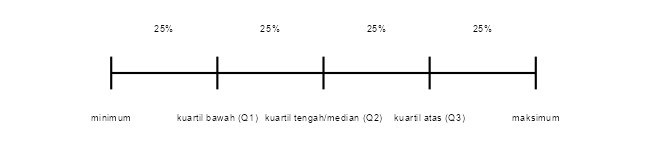
<p class="caption">(\#fig:fig-ilustrasi-kuartil)Ilustrasi Kuartil</p>
</div>

::: rmdkasus
### Studi Kasus: Analisis Posisi Data dengan Kuartil {.unnumbered}

Kuartil membagi distribusi data menjadi empat bagian yang sama. Ini sangat berguna untuk memahami posisi suatu nilai dalam keseluruhan data. Mari kita gunakan kembali data biaya perjalanan mahasiswa UNILA.

<table class="table table-striped table-hover" style="margin-left: auto; margin-right: auto;">
<caption>(\#tab:bab-3-kuartil-unila)Nilai Kuartil Biaya Perjalanan Mahasiswa UNILA (n = 394)</caption>
 <thead>
  <tr>
   <th style="text-align:left;">   </th>
   <th style="text-align:center;"> Statistik </th>
   <th style="text-align:center;"> Posisi Data </th>
   <th style="text-align:center;"> Nilai (Ribu Rp) </th>
  </tr>
 </thead>
<tbody>
  <tr>
   <td style="text-align:left;"> 25% </td>
   <td style="text-align:center;"> Kuartil Bawah (Q1) </td>
   <td style="text-align:center;font-weight: bold;background-color: rgba(232, 244, 248, 255) !important;"> Membatasi 25% data terbawah </td>
   <td style="text-align:center;"> 35 </td>
  </tr>
  <tr>
   <td style="text-align:left;"> 50% </td>
   <td style="text-align:center;"> Kuartil Tengah (Q2/Median) </td>
   <td style="text-align:center;font-weight: bold;background-color: rgba(232, 244, 248, 255) !important;"> Membatasi 50% data terbawah </td>
   <td style="text-align:center;"> 50 </td>
  </tr>
  <tr>
   <td style="text-align:left;"> 75% </td>
   <td style="text-align:center;"> Kuartil Atas (Q3) </td>
   <td style="text-align:center;font-weight: bold;background-color: rgba(232, 244, 248, 255) !important;"> Membatasi 75% data terbawah </td>
   <td style="text-align:center;"> 100 </td>
  </tr>
</tbody>
</table>

**Cara Menentukan Kuartil:**

1.  **Kuartil Bawah ($Q_1$):**
    *   Urutkan data dari terkecil hingga terbesar.
    *   Cari nilai pada posisi $\frac{1(n+1)}{4}$.
    *   Nilai ini memisahkan 25% data terendah dari sisa 75% data lainnya.

2.  **Kuartil Atas ($Q_3$):**
    *   Data diurutkan dari terkecil hingga terbesar.
    *   Cari nilai pada posisi $\frac{3(n+1)}{4}$.
    *   Nilai ini memisahkan 75% data terendah dari 25% data tertinggi.

**Interpretasi:**

Dari total **394** mahasiswa yang diamati, kita dapat menafsirkan posisi data sebagai berikut:

1.  **Kuartil Bawah ($Q_1$):** Sebesar 25% dari populasi (sekitar **98** mahasiswa) memiliki biaya perjalanan sepekan kurang dari atau sama dengan nilai $Q_1$. Ini menandakan kelompok dengan biaya transportasi paling efisien.
2.  **Kuartil Tengah ($Q_2$):** Sebesar 50% (sekitar **197** mahasiswa) memiliki biaya perjalanan kurang dari atau sama dengan median. Ini adalah titik tengah distribusi.
3.  **Kuartil Atas ($Q_3$):** Sebesar 75% (sekitar **296** mahasiswa) memiliki biaya perjalanan di bawah nilai $Q_3$. Artinya, hanya 25% sisanya (sekitar **98** mahasiswa) yang menghabiskan biaya perjalanan di atas nilai tersebut (kelompok dengan biaya tinggi).

Pemahaman ini penting untuk melihat sebaran beban biaya di kalangan mahasiswa, apakah terkonsentrasi di nilai rendah atau tinggi.
:::

Makna dari hasil perhitungan kuartil adalah nilai-nilai yang menjadi kuartil bawah, kuartil tengah, dan kuartil atas adalah nilai-nilai yang menjadi pembatas jumlah observasi sebanyak masing-masing 25% ketika setelah diurutkan dari kecil ke besar. Dengan begitu pula, maka kuartil **tidak dapat** dikenakan pada variabel dengan **tingkat pengukuran nominal**.

### Variansi (*Variance*) dan Simpangan Baku (*Standard Deviation*)

Variansi dan simpangan baku adalah ukuran penyebaran yang paling memberikan banyak informasi tentang variasi nilai suatu variabel dari sekumpulan objek. Variansi dan simpangan baku dapat dikatakan **ukuran seberapa dekat nilai tiap-tiap objek dengan nilai rata-ratanya.** Ini adalah makna dari variansi dan simpangan baku. Dengan kata lain, ukuran ini adalah rata-rata jarak nilai setiap objek dengan nilai rata-rata seluruh objek tersebut.

Variansi dihitung dengan rumus yang ditampilkan pada Persamaan \@ref(eq:konsep-variansi). Satuan dari nilai variansi sama dengan satuan variabel yang dianalisisnya, tetapi karena dikuadratkan, maka satuannya juga ikut dikuadratkan.

$$
\begin{equation}
\text{Variansi} = \frac{\sum_{i=1}^{n}(x_i - \bar{x})^2}{n}
\end{equation}
(\#eq:konsep-variansi)
$$

Karena nilai variansi dihasilkan dari kuadrat selisih nilai objek dengan rata-rata, maka satuannya juga ikut dikuadratkan. Ini membuat penafsiran menjadi aneh. Untuk menormalkannya, ditariklah akar kuadrat dari variansi itu yang dinamakan **simpangan baku** (*standard deviation*).

$$
\begin{align}
\text{Simpangan Baku} &= \sqrt{\text{Variansi}}\\
&=\sqrt{\frac{\sum_{i=1}^{n}(x_i - \bar{x})^2}{n}} (\#eq:konsep-simpangan-baku)
\end{align}
$$ 

Nilai variansi dan simpangan baku yang kecil menunjukkan bahwa nilai tiap-tiap objek cenderung berdekatan dengan nilai rata-ratanya. Sebaliknya, nilai variansi dan simpangan baku yang besar menunjukkan bahwa nilai tiap-tiap objek cenderung berjauhan dengan nilai rata-ratanya.

::: rmdkasus
### Studi Kasus: Menghitung Variansi dan Simpangan Baku Biaya Perjalanan {.unnumbered}

Mari kita hitung variansi dan simpangan baku dari sampel kecil biaya perjalanan sepekan (dalam ribu rupiah) dari 5 mahasiswa. Ini akan membantu kita memahami bagaimana ukuran penyebaran dihitung langkah demi langkah.

Data biaya perjalanan (`X`): 50, 60, 55, 70, 65.

**Langkah 1: Hitung Rata-rata ($\bar{x}$)**

$$
\bar{x} = \frac{50 + 60 + 55 + 70 + 65}{5} = \frac{300}{5} = 60
$$

**Langkah 2: Buat Tabel Perhitungan $(x_i - \bar{x})^2$**

<table class="table table-striped table-hover" style="margin-left: auto; margin-right: auto;">
<caption>(\#tab:bab-3-simulasi-variansi)Perhitungan Selisih Kuadrat</caption>
 <thead>
<tr>
<th style="empty-cells: hide;border-bottom:hidden;" colspan="1"></th>
<th style="border-bottom:hidden;padding-bottom:0; padding-left:3px;padding-right:3px;text-align: center; " colspan="1"><div style="border-bottom: 1px solid #ddd; padding-bottom: 5px; ">Data Asli</div></th>
<th style="border-bottom:hidden;padding-bottom:0; padding-left:3px;padding-right:3px;text-align: center; " colspan="1"><div style="border-bottom: 1px solid #ddd; padding-bottom: 5px; ">Pusat</div></th>
<th style="border-bottom:hidden;padding-bottom:0; padding-left:3px;padding-right:3px;text-align: center; " colspan="2"><div style="border-bottom: 1px solid #ddd; padding-bottom: 5px; ">Deviasi</div></th>
</tr>
  <tr>
   <th style="text-align:center;"> Mahasiswa </th>
   <th style="text-align:center;"> Biaya (X) </th>
   <th style="text-align:center;"> Rata-rata (x̄) </th>
   <th style="text-align:center;"> Selisih (X - x̄) </th>
   <th style="text-align:center;"> Kuadrat (X - x̄)² </th>
  </tr>
 </thead>
<tbody>
  <tr>
   <td style="text-align:center;"> A </td>
   <td style="text-align:center;"> 50 </td>
   <td style="text-align:center;"> 60 </td>
   <td style="text-align:center;"> -10 </td>
   <td style="text-align:center;"> 100 </td>
  </tr>
  <tr>
   <td style="text-align:center;"> B </td>
   <td style="text-align:center;"> 60 </td>
   <td style="text-align:center;"> 60 </td>
   <td style="text-align:center;"> 0 </td>
   <td style="text-align:center;"> 0 </td>
  </tr>
  <tr>
   <td style="text-align:center;"> C </td>
   <td style="text-align:center;"> 55 </td>
   <td style="text-align:center;"> 60 </td>
   <td style="text-align:center;"> -5 </td>
   <td style="text-align:center;"> 25 </td>
  </tr>
  <tr>
   <td style="text-align:center;"> D </td>
   <td style="text-align:center;"> 70 </td>
   <td style="text-align:center;"> 60 </td>
   <td style="text-align:center;"> 10 </td>
   <td style="text-align:center;"> 100 </td>
  </tr>
  <tr>
   <td style="text-align:center;border-bottom: 2px solid #000"> E </td>
   <td style="text-align:center;border-bottom: 2px solid #000"> 65 </td>
   <td style="text-align:center;border-bottom: 2px solid #000"> 60 </td>
   <td style="text-align:center;border-bottom: 2px solid #000"> 5 </td>
   <td style="text-align:center;border-bottom: 2px solid #000"> 25 </td>
  </tr>
</tbody>
</table>

**Langkah 3: Hitung Jumlah Kuadrat Selisih**

$$
\sum_{i=1}^{n}(x_i - \bar{x})^2 = 100 + 0 + 25 + 100 + 25 = 250
$$

**Langkah 4: Hitung Variansi dan Simpangan Baku**

Sesuai Persamaan \@ref(eq:konsep-variansi), kita bagi jumlah tersebut dengan $n = 5$:

$$
\text{Variansi} = \frac{250}{5} = 50
$$

Simpangan baku adalah akar kuadrat dari variansi:

$$
\text{Simpangan Baku} = \sqrt{50} \approx 7,07
$$

**Interpretasi:**

Simpangan baku sebesar 7,07 (ribu rupiah) menunjukkan rata-rata penyimpangan biaya perjalanan setiap mahasiswa dari biaya rata-rata kelompoknya.

-   Semakin **kecil** simpangan baku, semakin seragam biaya perjalanan mahasiswa (data mengumpul di sekitar rata-rata).
-   Semakin **besar** simpangan baku, semakin bervariasi biaya perjalanan mahasiswa (data menyebar jauh dari rata-rata).

Dalam bidang PWK, wilayah dengan simpangan baku pendapatan atau pengeluaran yang tinggi menunjukkan ketimpangan yang tinggi, yang mungkin memerlukan intervensi kebijakan yang berbeda dibandingkan wilayah yang cenderung homogen.
:::


### Rangkuman Teknik Analisis Statistik Deskriptif

Pemilihan teknik analisis statistik deskriptif sangat bergantung pada tujuan analisis (apakah melihat pemusatan atau penyebaran) dan tingkat pengukuran variabel yang tersedia. Tabel \@ref(tab:rangkuman-deskriptif) merangkum berbagai teknik yang telah dipelajari beserta syarat penggunaannya.

<table class="table table-striped table-hover" style="margin-left: auto; margin-right: auto;">
<caption>(\#tab:rangkuman-deskriptif)Rangkuman Teknik Analisis Statistik Deskriptif</caption>
 <thead>
  <tr>
   <th style="text-align:center;"> No </th>
   <th style="text-align:left;"> Nama Analisis </th>
   <th style="text-align:left;"> Tingkat Pengukuran </th>
   <th style="text-align:left;"> Makna Singkat Hasil </th>
  </tr>
 </thead>
<tbody>
  <tr>
   <td style="text-align:center;font-weight: bold;"> 1 </td>
   <td style="text-align:left;"> Frekuensi &amp; Persentase </td>
   <td style="text-align:left;"> Nominal, Ordinal </td>
   <td style="text-align:left;"> Jumlah atau proporsi kemunculan suatu nilai dalam distribusi </td>
  </tr>
  <tr>
   <td style="text-align:center;font-weight: bold;"> 2 </td>
   <td style="text-align:left;"> Rasio </td>
   <td style="text-align:left;"> Nominal, Ordinal </td>
   <td style="text-align:left;"> Perbandingan relatif jumlah satu kategori terhadap kategori lain </td>
  </tr>
  <tr>
   <td style="text-align:center;font-weight: bold;"> 3 </td>
   <td style="text-align:left;"> Laju (*Rate*) </td>
   <td style="text-align:left;"> Metrik (jumlah kejadian) </td>
   <td style="text-align:left;"> Intensitas kejadian relatif terhadap populasi berisiko atau waktu </td>
  </tr>
  <tr>
   <td style="text-align:center;font-weight: bold;"> 4 </td>
   <td style="text-align:left;"> Modus </td>
   <td style="text-align:left;"> Nominal, Ordinal, Metrik </td>
   <td style="text-align:left;"> Nilai yang paling sering muncul (tren) </td>
  </tr>
  <tr>
   <td style="text-align:center;font-weight: bold;"> 5 </td>
   <td style="text-align:left;"> Median </td>
   <td style="text-align:left;"> Ordinal, Metrik </td>
   <td style="text-align:left;"> Nilai tengah yang membagi data menjadi dua bagian sama besar </td>
  </tr>
  <tr>
   <td style="text-align:center;font-weight: bold;"> 6 </td>
   <td style="text-align:left;"> Rata-rata (*Mean*) </td>
   <td style="text-align:left;"> Metrik </td>
   <td style="text-align:left;"> Pusat aritmatika yang mewakili keseluruhan nilai </td>
  </tr>
  <tr>
   <td style="text-align:center;font-weight: bold;"> 7 </td>
   <td style="text-align:left;"> IQV </td>
   <td style="text-align:left;"> Nominal, Ordinal </td>
   <td style="text-align:left;"> Derajat keberagaman (heterogenitas) data kualitatif </td>
  </tr>
  <tr>
   <td style="text-align:center;font-weight: bold;"> 8 </td>
   <td style="text-align:left;"> Rentang (*Range*) </td>
   <td style="text-align:left;"> Metrik </td>
   <td style="text-align:left;"> Selisih total antara nilai tertinggi dan terendah </td>
  </tr>
  <tr>
   <td style="text-align:center;font-weight: bold;"> 9 </td>
   <td style="text-align:left;"> Kuartil/Persentil </td>
   <td style="text-align:left;"> Ordinal, Metrik </td>
   <td style="text-align:left;"> Posisi nilai yang membagi data terurut menjadi bagian-bagian proporsional </td>
  </tr>
  <tr>
   <td style="text-align:center;font-weight: bold;"> 10 </td>
   <td style="text-align:left;"> Variansi &amp; Simpangan Baku </td>
   <td style="text-align:left;"> Metrik </td>
   <td style="text-align:left;"> Rata-rata jarak penyimpangan setiap data terhadap nilai rata-ratanya </td>
  </tr>
</tbody>
</table>

Kerjakanlah soal-soal evaluasi berikut untuk menguji pemahaman Anda terhadap analisis statistik deskriptif.

::: rmdexercise
## Soal Evaluasi 4 {.unnumbered}

Perhatikan cuplikan set data hasil pengumpulan kuesioner yang terdiri atas 6 responden berikut.

<table class="table table-striped table-hover" style="margin-left: auto; margin-right: auto;">
<caption>(\#tab:bab-3-eval-4-preview)Cuplikan data survei mahasiswa</caption>
 <thead>
  <tr>
   <th style="text-align:center;"> KodeResp </th>
   <th style="text-align:center;"> Usia </th>
   <th style="text-align:center;"> Fakultas </th>
   <th style="text-align:center;"> ThnMsk </th>
   <th style="text-align:center;"> UangSaku </th>
   <th style="text-align:center;"> Jarak </th>
  </tr>
 </thead>
<tbody>
  <tr>
   <td style="text-align:center;"> 001 </td>
   <td style="text-align:center;"> 22 </td>
   <td style="text-align:center;"> 1 </td>
   <td style="text-align:center;"> 2020 </td>
   <td style="text-align:center;"> 2 </td>
   <td style="text-align:center;"> 19,27 </td>
  </tr>
  <tr>
   <td style="text-align:center;"> 002 </td>
   <td style="text-align:center;"> 25 </td>
   <td style="text-align:center;"> 1 </td>
   <td style="text-align:center;"> 2020 </td>
   <td style="text-align:center;"> 1 </td>
   <td style="text-align:center;"> 0,58 </td>
  </tr>
  <tr>
   <td style="text-align:center;"> 003 </td>
   <td style="text-align:center;"> 24 </td>
   <td style="text-align:center;"> 2 </td>
   <td style="text-align:center;"> 2021 </td>
   <td style="text-align:center;"> 1 </td>
   <td style="text-align:center;"> 0,56 </td>
  </tr>
  <tr>
   <td style="text-align:center;"> 004 </td>
   <td style="text-align:center;"> 19 </td>
   <td style="text-align:center;"> 3 </td>
   <td style="text-align:center;"> 2022 </td>
   <td style="text-align:center;"> 1 </td>
   <td style="text-align:center;"> 1,05 </td>
  </tr>
  <tr>
   <td style="text-align:center;"> 005 </td>
   <td style="text-align:center;"> 23 </td>
   <td style="text-align:center;"> 2 </td>
   <td style="text-align:center;"> 2021 </td>
   <td style="text-align:center;"> 1 </td>
   <td style="text-align:center;"> 1,69 </td>
  </tr>
  <tr>
   <td style="text-align:center;"> 006 </td>
   <td style="text-align:center;"> 20 </td>
   <td style="text-align:center;"> 1 </td>
   <td style="text-align:center;"> 2020 </td>
   <td style="text-align:center;"> 3 </td>
   <td style="text-align:center;"> 1,37 </td>
  </tr>
</tbody>
</table>

Adapun keterangan dari variabel-variabel tersebut (metadata) adalah sebagai berikut:

<table class="table table-striped table-hover" style="margin-left: auto; margin-right: auto;">
<caption>(\#tab:bab-3-eval-4-metadata)Metadata variabel survei mahasiswa</caption>
 <thead>
  <tr>
   <th style="text-align:left;"> Nama Variabel </th>
   <th style="text-align:left;"> Deskripsi </th>
   <th style="text-align:left;"> Nilai-nilai yang valid </th>
  </tr>
 </thead>
<tbody>
  <tr>
   <td style="text-align:left;"> `KodeResp` </td>
   <td style="text-align:left;"> Nomor urut responden </td>
   <td style="text-align:left;"> tiga digit angka, hingga jumlah responden minimal </td>
  </tr>
  <tr>
   <td style="text-align:left;"> `Usia` </td>
   <td style="text-align:left;"> Usia responden (tahun) </td>
   <td style="text-align:left;"> 18 - ∞ </td>
  </tr>
  <tr>
   <td style="text-align:left;"> `Fakultas` </td>
   <td style="text-align:left;"> Fakultas mahasiswa </td>
   <td style="text-align:left;"> 1 = Fakultas Syariah,<br>2 = Fakultas Tarbiyah dan Keguruan,<br>3 = Fakultas Dakwah dan Komunikasi </td>
  </tr>
  <tr>
   <td style="text-align:left;"> `ThnMsk` </td>
   <td style="text-align:left;"> Tahun masuk kuliah (Masehi) </td>
   <td style="text-align:left;"> 2018 - 2022 </td>
  </tr>
  <tr>
   <td style="text-align:left;"> `UangSaku` </td>
   <td style="text-align:left;"> Uang saku mahasiswa per bulan </td>
   <td style="text-align:left;"> 1 = &lt;1 juta rupiah,<br>2 = 1-2 juta rupiah,<br>3 = 2-3 juta rupiah,<br>4 = 3-4 juta,<br>5 = &gt;4 juta </td>
  </tr>
  <tr>
   <td style="text-align:left;"> `Jarak` </td>
   <td style="text-align:left;"> Jarak tempat tinggal mahasiswa dari kampus (km) </td>
   <td style="text-align:left;"> 0 - ∞ </td>
  </tr>
</tbody>
</table>

1. Identifikasilah statistik deskriptif yang dapat dikenakan pada variabel-variabel berikut: [STP-2.2]{.capaian}
  
  a. Fakultas
  b. Uang saku
  c. Jarak
  
  Sertakan juga hasil perhitungan kalian dengan langkah yang dapat dipertanggungjawabkan.
2. Interpretasikan salah satu hasil statistik deskriptif yang telah dihitung pada masing-masing variabel. [STP-2.3]{.capaian}

:::

<!--chapter:end:03-statistik-deskriptif.Rmd-->

# Visualisasi Data Kuantitatif {#bab-4-visualisasi-data-kuantitatif}

::: rmdcapaian
### Capaian Pembelajaran {.unnumbered}

Setelah mempelajari bab ini, Anda diharapkan:

1. mampu memilih visualisasi yang tepat sesuai dengan variabel yang akan disajikan dan informasi yang ingin disampaikan [STP-3.1]{.capaian}
2. mampu menginterpretasikan suatu visualisasi data kuantitatif secara mendalam [STP-3.2]{.capaian}
3. mampu menjelaskan pentingnya menentukan tingkat pengukuran untuk sebuah variabel dari kaitannya dengan analisis statistik deskriptif dan diagram yang dipilih untuk menyajikan informasi [STP-3.4]{.capaian}
:::


## Konsep Dasar

Visualisasi data adalah mengubah bentuk penyajian data/presentasi data dari bentuk tabular/tabel menjadi bentuk grafis. Kita sering mendengar pepatah yang berbunyi *"a picture is worth a thousand words"* yang artinya kurang lebih "satu gambar bernilai seribu kata." Pepatah ini menggambarkan bahwa data yang disajikan dalam bentuk gambar/grafis dapat menampilkan banyak sekali informasi kepada audiens.

Sajian data dalam bentuk gambar disebut juga **grafik** atau **diagram** *(chart)*. Jenis grafik atau diagram yang digunakan sangat bergantung pada jenis dan tingkat pengukuran variabel yang akan divisualisasikan.

Banyak sekali panduan-panduan untuk memilih bentuk grafik yang perlu Anda gunakan untuk menyajikan data Anda. Salah satu sumber yang menyediakan panduan tersebut adalah situs [From data to Viz](https://www.data-to-viz.com/) atau [Data Viz Project](https://datavizproject.com/).


## Jenis-jenis Diagram

Untuk memilih jenis diagram yang tepat, kita perlu menentukan terlebih dahulu jenis dan tingkat pengukuran variabel yang akan kita sajikan. Kemudian, kita dapat mempertimbangkan jenis informasi apa yang ingin kita sajikan dan menyesuaikannya dengan cara menampilkan nilainya, bisa dengan sumbu (tegak/datar; Y/X) atau yang lainnya. Berikut adalah pembahasan sebagian jenis-jenis diagram berdasarkan jenis nilai dan tingkat pengukuran variabel yang sudah kita bahas dan tujuan penggunaanya.

### Variabel Kategorikal

Visualisasi variabel kategorikal bertujuan menampilkan **jumlah (frekuensi) objek** untuk masing-masing kategori. Untuk menentukan jenis diagram yang tepat, kita perlu memperhatikan **jumlah variabel** yang dianalisis dan **hubungan antarvariabel**.

#### Grafik Batang *(Column/Bar Chart)*

Grafik batang adalah grafik yang paling sering digunakan untuk memvisualkan variabel kategorikal. Grafik ini memberikan informasi berupa **sebaran frekuensi** sebuah variabel. 

Bentuk grafik batang tersusun dari dua sumbu tegak (Y) dan datar (X). Tinggi batang sepanjang sumbu Y bermakna frekuensi dari kategori-kategori yang ada dalam variabel, sementara kategori-kategori berada di sepanjang sumbu X.

Terdapat dua jenis grafik batang: tegak dan mendatar. Grafik batang tegak disebut juga *column chart* sementara yang mendatar disebut *bar chart*. Perbedaan column chart dan bar chart hanya terletak di **sumbu yang menunjukkan frekuensi kategori**, yakni tinggi/panjang batang. Grafik batang yang menggunakan sumbu Y untuk menunjukkan jumlah frekuensinya adalah ***column chart***, sementara yang menggunakan sumbu X adalah ***bar chart***.

Untuk lebih memahami bagaimana mengubah data terstruktur menjadi grafik batang, penjelasannya dapat dilihat di Studi Kasus di bawah.


#### Grafik Batang Bertumpuk (Stacked Column/Bar Chart) {#materi-bar-chart}

Grafik batang bertumpuk *(stacked bar/column chart)* digunakan untuk membandingkan komposisi dari beberapa kategori. Setiap batang mewakili nilai total, yang kemudian dipecah menjadi beberapa segmen untuk menunjukkan bagaimana kontribusi masing-masing subkategori membentuk total tersebut. Kategori kedua variabel tersebut dibuat bertumpukan. Misalnya sebaran pengguna kendaraan (mobil, motor, sepeda) berdasarkan jenis kelamin (laki-laki dan perempuan).

Untuk lebih memahami bagaimana mengubah data terstruktur menjadi grafik batang bertumpuk, penjelasannya dapat dilihat di Studi Kasus di bawah. Secara umum, data mentah diubah menjadi tabel distribusi frekuensi, dan tabel distribusi frekuensi itu yang menjadi bahan pembuatan grafik.

::: rmdkasus

#### Studi Kasus: Visualisasi Moda Transportasi Mahasiswa dengan Diagram Batang  {.unnumbered}

Untuk memahami pembuatan grafik batang, kita akan menganalisis data moda transportasi mahasiswa UIN Raden Intan Lampung. Langkah pertama adalah mengubah data mentah menjadi tabel distribusi frekuensi (Tabel \@ref(tab:bab-4-diagram-batang)), baru kemudian divisualisasikan.

<table class="table table-striped table-hover table-condensed" style="width: auto !important; margin-left: auto; margin-right: auto;">
<caption>(\#tab:bab-4-diagram-batang)Distribusi Frekuensi Moda Transportasi Mahasiswa UIN Raden Intan Lampung</caption>
 <thead>
  <tr>
   <th style="text-align:left;"> Moda Transportasi </th>
   <th style="text-align:right;"> Frekuensi </th>
  </tr>
 </thead>
<tbody>
  <tr>
   <td style="text-align:left;"> Berjalan kaki </td>
   <td style="text-align:right;"> 38 </td>
  </tr>
  <tr>
   <td style="text-align:left;"> Menumpang kendaraan bermotor teman/keluarga </td>
   <td style="text-align:right;"> 27 </td>
  </tr>
  <tr>
   <td style="text-align:left;"> Mobil pribadi </td>
   <td style="text-align:right;"> 15 </td>
  </tr>
  <tr>
   <td style="text-align:left;"> Sepeda motor pribadi </td>
   <td style="text-align:right;"> 290 </td>
  </tr>
  <tr>
   <td style="text-align:left;"> Transportasi daring </td>
   <td style="text-align:right;"> 30 </td>
  </tr>
</tbody>
</table>

Setelah mendapatkan tabel distribusi frekuensi, kita dapat membuat grafik batang tegak (*column chart*)

<div class="figure" style="text-align: center">
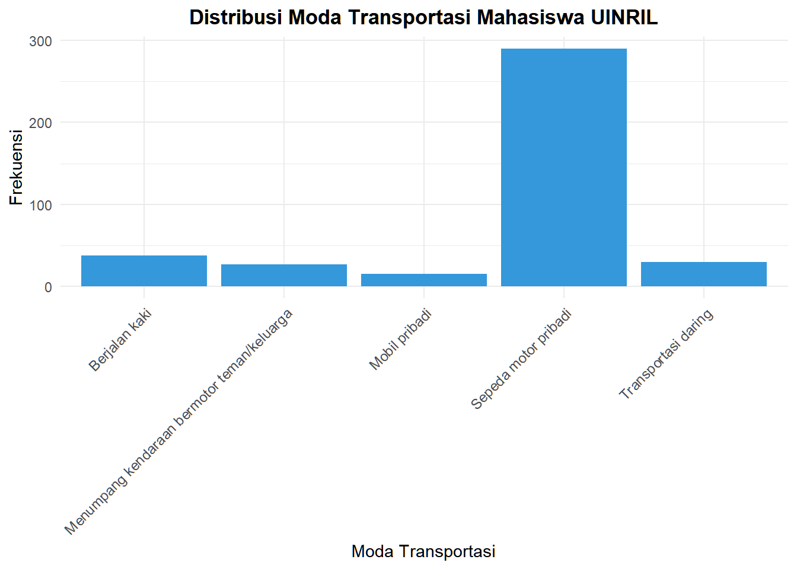
<p class="caption">(\#fig:fig-column-moda)Grafik batang tegak distribusi moda transportasi</p>
</div>

Atau dalam bentuk grafik batang mendatar (*bar chart*):

<div class="figure" style="text-align: center">
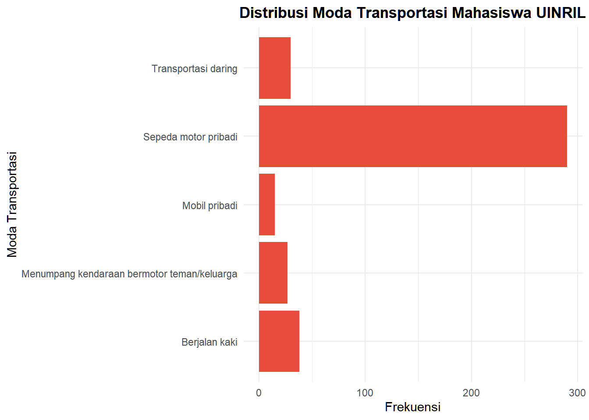
<p class="caption">(\#fig:fig-bar-moda)Grafik batang mendatar distribusi moda transportasi</p>
</div>

Untuk **grafik batang bertumpuk**, kita memerlukan dua variabel kategorikal. Kita akan membandingkan moda transportasi berdasarkan jenis kelamin (Tabel \@ref(tab:tab-distribusi-2-var)).

<table class="table table-striped table-hover table-condensed" style="width: auto !important; margin-left: auto; margin-right: auto;">
<caption>(\#tab:tab-distribusi-2-var)Distribusi Frekuensi Moda Transportasi Mahasiswa UIN Raden Intan Lampung berdasarkan Jenis Kelamin</caption>
 <thead>
  <tr>
   <th style="text-align:left;"> Jenis Kelamin </th>
   <th style="text-align:right;"> Berjalan Kaki </th>
   <th style="text-align:right;"> Menumpang </th>
   <th style="text-align:right;"> Mobil Pribadi </th>
   <th style="text-align:right;"> Sepeda </th>
   <th style="text-align:right;"> Sepeda Motor </th>
   <th style="text-align:right;"> Transportasi Online </th>
  </tr>
 </thead>
<tbody>
  <tr>
   <td style="text-align:left;"> Laki-laki </td>
   <td style="text-align:right;"> 3 </td>
   <td style="text-align:right;"> 9 </td>
   <td style="text-align:right;"> 6 </td>
   <td style="text-align:right;"> 0 </td>
   <td style="text-align:right;"> 167 </td>
   <td style="text-align:right;"> 3 </td>
  </tr>
  <tr>
   <td style="text-align:left;"> Perempuan </td>
   <td style="text-align:right;"> 35 </td>
   <td style="text-align:right;"> 18 </td>
   <td style="text-align:right;"> 9 </td>
   <td style="text-align:right;"> 0 </td>
   <td style="text-align:right;"> 123 </td>
   <td style="text-align:right;"> 27 </td>
  </tr>
</tbody>
</table>

Dari tabel kontingensi tersebut, kita dapat membuat grafik batang bertumpuk:

<div class="figure" style="text-align: center">
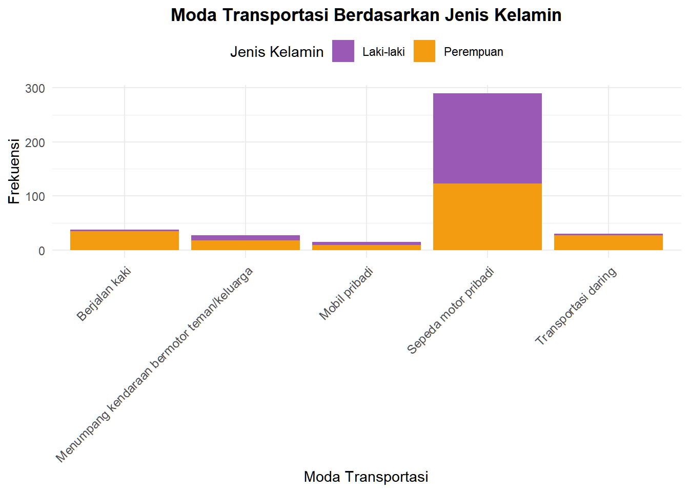
<p class="caption">(\#fig:fig-stacked-bar)Grafik batang bertumpuk moda transportasi berdasarkan jenis kelamin</p>
</div>

**Interpretasi:** Grafik menunjukkan bahwa sepeda motor merupakan moda transportasi yang paling banyak digunakan oleh mahasiswa UINRIL, diikuti oleh mobil dan angkutan umum. Dari grafik batang bertumpuk terlihat bahwa penggunaan sepeda motor lebih dominan pada mahasiswa laki-laki dibandingkan perempuan, sementara penggunaan angkutan umum relatif seimbang antara kedua jenis kelamin.

:::


#### Grafik Lollipop

Diagram lollipop pada dasarnya serupa dengan diagram batang, hanya saja data direpresentasikan oleh tiang-tiang berujung lingkaran yang menyerupai permen loli. Penggunaannya sangat cocok untuk data berjumlah banyak guna menghindari efek Moiré (dibaca `moarey') @wikipedia2025moire. Efek Moiré adalah ilusi optik pergerakan benda yang posisinya berdekatan dan membentuk sebuah kisi (fringe) seperti yang ditunjukkan Gambar \@ref(fig:contoh-moire), sehingga dapat menyulitkan pembaca grafik.

<div class="figure" style="text-align: center">
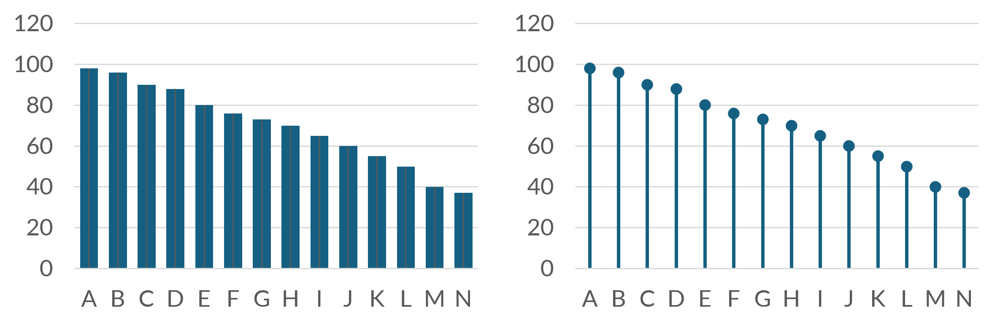
<p class="caption">(\#fig:contoh-moire)Contoh efek Moiré pada grafik batang</p>
</div>


::: rmdkasus

#### Studi Kasus: Perbandingan Grafik Lollipop dengan Grafik Batang {.unnumbered}

Pada dataset dengan banyak kategori, grafik batang konvensional dapat menghasilkan efek Moiré yang mengganggu. Mari kita bandingkan penggunaan grafik batang biasa dengan grafik lollipop menggunakan data program studi mahasiswa UINRIL.

<table class="table table-striped table-hover table-condensed" style="width: auto !important; margin-left: auto; margin-right: auto;border-bottom: 0;">
<caption>(\#tab:bab-4-distribusi-per-prodi)Distribusi Frekuensi Mahasiswa UIN Raden Intan Lampung Per Program Studi</caption>
 <thead>
  <tr>
   <th style="text-align:left;"> Nama Program Studi </th>
   <th style="text-align:right;"> Frekuensi </th>
  </tr>
 </thead>
<tbody>
  <tr>
   <td style="text-align:left;"> Hukum Keluarga </td>
   <td style="text-align:right;"> 31 </td>
  </tr>
  <tr>
   <td style="text-align:left;"> Ekonomi Syariah </td>
   <td style="text-align:right;"> 28 </td>
  </tr>
  <tr>
   <td style="text-align:left;"> Pendidikan Bahasa Inggris </td>
   <td style="text-align:right;"> 24 </td>
  </tr>
  <tr>
   <td style="text-align:left;"> Pendidikan Biologi </td>
   <td style="text-align:right;"> 23 </td>
  </tr>
  <tr>
   <td style="text-align:left;"> Manajemen Bisnis Syariah </td>
   <td style="text-align:right;"> 21 </td>
  </tr>
  <tr>
   <td style="text-align:left;"> Akuntansi Syariah </td>
   <td style="text-align:right;"> 19 </td>
  </tr>
</tbody>
<tfoot><tr><td style="padding: 0; " colspan="100%">
<span style="font-style: italic;">Catatan:</span> <sup></sup> Menampilkan 6 dari 32 program studi</td></tr></tfoot>
</table>

Berikut adalah visualisasi menggunakan grafik batang biasa:

<div class="figure" style="text-align: center">
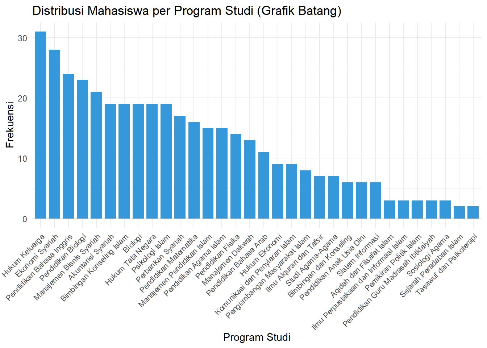
<p class="caption">(\#fig:fig-bar-prodi)Grafik batang program studi mahasiswa UINRIL</p>
</div>

Sekarang bandingkan dengan grafik lollipop:

<div class="figure" style="text-align: center">
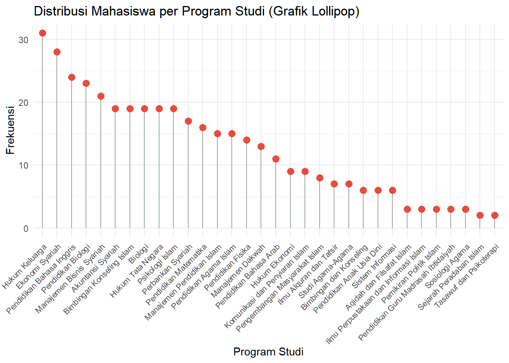
<p class="caption">(\#fig:fig-lollipop-prodi)Grafik lollipop program studi mahasiswa UINRIL</p>
</div>

**Perbandingan:** Pada grafik lollipop, setiap kategori lebih mudah dibedakan karena hanya tiang tipis dan titik yang mewakili nilai, sehingga menghindari efek visual yang berlebihan (Moiré). Grafik lollipop sangat cocok untuk dataset dengan banyak kategori seperti ini, karena lebih ringkas dan tetap informatif. Sementara grafik batang biasa terlihat lebih padat dan dapat menimbulkan kesulitan dalam membaca data ketika batang-batangnya berdekatan.

:::

#### Grafik *Treemap*

Secara fungsi, treemap dan *stacked bar chart* sangat mirip karena keduanya menunjukkan distribusi frekuensi objek berdasarkan kategori variabelnya. Jika *stacked chart* memakai panjang segmen pada batang untuk menunjukkan proporsi, *treemap* menggunakan luas area persegi panjang. Frekuensinya diperlihatkan oleh **luas persegi masing-masing kategori**.

Proses pembuatannya sama persis seperti dengan grafik batang bertumpuk.

::: rmdkasus

#### Studi Kasus: Membuat Treemap Moda Transportasi {.unnumbered}

Treemap menggunakan luas area persegi untuk menunjukkan proporsi kategori. Seperti pada grafik batang bertumpuk, kita mulai dari tabel distribusi frekuensi dua variabel.

<table class="table table-striped table-hover table-condensed" style="width: auto !important; margin-left: auto; margin-right: auto;">
<caption>(\#tab:tab-treemap-data)Distribusi Frekuensi Moda Transportasi berdasarkan Jenis Kelamin untuk Treemap</caption>
 <thead>
  <tr>
   <th style="text-align:left;"> Jenis Kelamin </th>
   <th style="text-align:left;"> Moda Transportasi </th>
   <th style="text-align:right;"> Frekuensi </th>
  </tr>
 </thead>
<tbody>
  <tr>
   <td style="text-align:left;"> Laki-laki </td>
   <td style="text-align:left;"> Berjalan kaki </td>
   <td style="text-align:right;"> 3 </td>
  </tr>
  <tr>
   <td style="text-align:left;"> Laki-laki </td>
   <td style="text-align:left;"> Menumpang kendaraan bermotor teman/keluarga </td>
   <td style="text-align:right;"> 9 </td>
  </tr>
  <tr>
   <td style="text-align:left;"> Laki-laki </td>
   <td style="text-align:left;"> Mobil pribadi </td>
   <td style="text-align:right;"> 6 </td>
  </tr>
  <tr>
   <td style="text-align:left;"> Laki-laki </td>
   <td style="text-align:left;"> Sepeda motor pribadi </td>
   <td style="text-align:right;"> 167 </td>
  </tr>
  <tr>
   <td style="text-align:left;"> Laki-laki </td>
   <td style="text-align:left;"> Transportasi daring </td>
   <td style="text-align:right;"> 3 </td>
  </tr>
  <tr>
   <td style="text-align:left;"> Perempuan </td>
   <td style="text-align:left;"> Berjalan kaki </td>
   <td style="text-align:right;"> 35 </td>
  </tr>
  <tr>
   <td style="text-align:left;"> Perempuan </td>
   <td style="text-align:left;"> Menumpang kendaraan bermotor teman/keluarga </td>
   <td style="text-align:right;"> 18 </td>
  </tr>
  <tr>
   <td style="text-align:left;"> Perempuan </td>
   <td style="text-align:left;"> Mobil pribadi </td>
   <td style="text-align:right;"> 9 </td>
  </tr>
  <tr>
   <td style="text-align:left;"> Perempuan </td>
   <td style="text-align:left;"> Sepeda motor pribadi </td>
   <td style="text-align:right;"> 123 </td>
  </tr>
  <tr>
   <td style="text-align:left;"> Perempuan </td>
   <td style="text-align:left;"> Transportasi daring </td>
   <td style="text-align:right;"> 27 </td>
  </tr>
</tbody>
</table>

Dari tabel distribusi frekuensi tersebut, kita dapat membuat treemap:

<div class="figure" style="text-align: center">
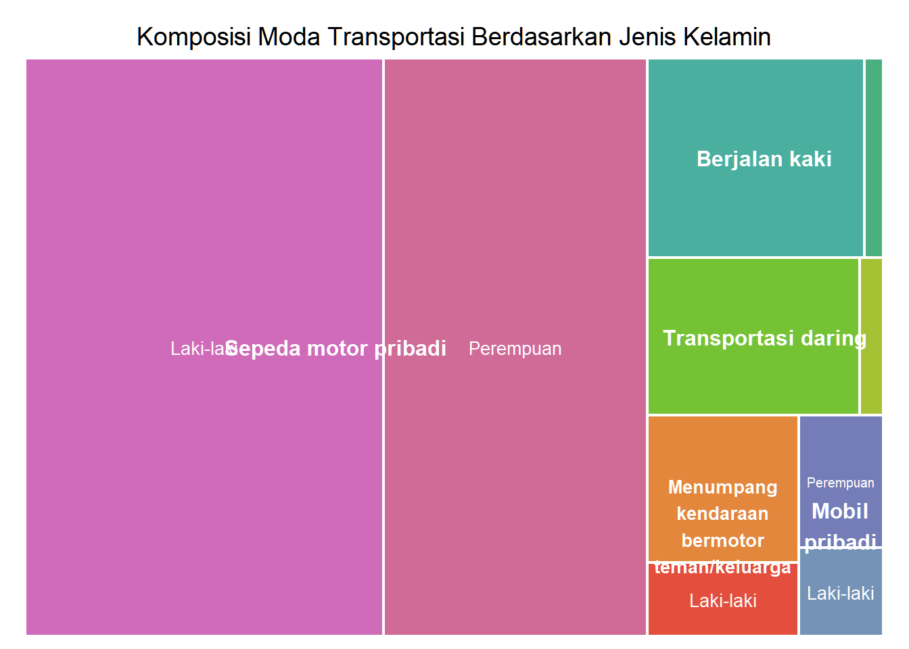
<p class="caption">(\#fig:fig-treemap-moda)Treemap moda transportasi berdasarkan jenis kelamin</p>
</div>

**Interpretasi:** Treemap menunjukkan proporsi penggunaan moda transportasi dengan jelas melalui luas area. Area terbesar dimiliki oleh sepeda motor, menunjukkan dominasinya sebagai moda transportasi utama. Di dalam setiap moda, terdapat sub-area yang menunjukkan pembagian berdasarkan jenis kelamin. Visualisasi ini memudahkan kita untuk membandingkan proporsi secara langsung tanpa perlu membaca angka.

:::

#### Grafik Pai/Donat *(Pie/Donut Chart)*

Grafik jenis ini juga sering digunakan untuk visualisasi variabel kategoris. Perbedaan dengan grafik batang adalah frekuensi tiap kategori tidak diperlihatkan dengan sumbu tegak, tetapi besar juring (sektor) lingkaran.

Proses pembuatannya sama seperti pembuatan grafik batang yang ditunjukkan pada kasus di \@ref(materi-bar-chart), hanya saja jumlah kategori menjadi jumlah sektor, sementara frekuensinya menjadi ukuran sektor.

::: rmdkasus

#### Studi Kasus: Membuat Grafik Pai dan Donat {.unnumbered}

Grafik pai dan donat menggunakan juring lingkaran untuk menunjukkan proporsi kategori. Prosesnya sama dengan grafik batang, dimulai dari tabel distribusi frekuensi.

<table class="table table-striped table-hover table-condensed" style="width: auto !important; margin-left: auto; margin-right: auto;">
<caption>(\#tab:tab-pie-data)Distribusi Frekuensi Moda Transportasi untuk Grafik Pai</caption>
 <thead>
  <tr>
   <th style="text-align:left;"> Moda Transportasi </th>
   <th style="text-align:right;"> Frekuensi </th>
  </tr>
 </thead>
<tbody>
  <tr>
   <td style="text-align:left;"> Berjalan kaki </td>
   <td style="text-align:right;"> 38 </td>
  </tr>
  <tr>
   <td style="text-align:left;"> Menumpang kendaraan bermotor teman/keluarga </td>
   <td style="text-align:right;"> 27 </td>
  </tr>
  <tr>
   <td style="text-align:left;"> Mobil pribadi </td>
   <td style="text-align:right;"> 15 </td>
  </tr>
  <tr>
   <td style="text-align:left;"> Sepeda motor pribadi </td>
   <td style="text-align:right;"> 290 </td>
  </tr>
  <tr>
   <td style="text-align:left;"> Transportasi daring </td>
   <td style="text-align:right;"> 30 </td>
  </tr>
</tbody>
</table>

Dari tabel distribusi frekuensi, kita dapat membuat grafik pai (*pie chart*):

<div class="figure" style="text-align: center">
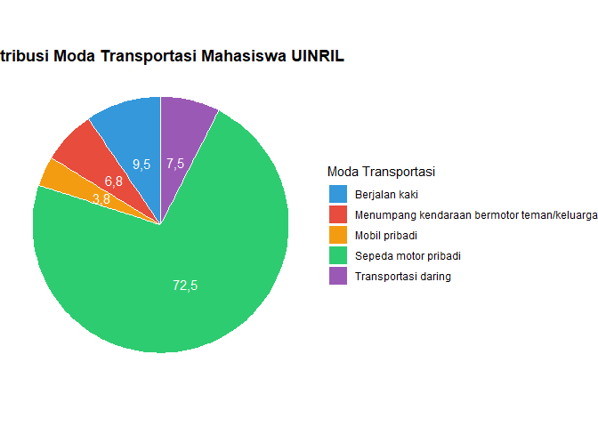
<p class="caption">(\#fig:fig-pie-moda)Grafik pai moda transportasi mahasiswa UINRIL</p>
</div>

Untuk membuat grafik donat (*donut chart*), kita mengubah jenis kategori menjadi juring-juring lingkaran dan sudunya ditentukan dari proporsi frekuensi. Prosesnya sama dengan grafik pai, hanya saja kita di tengahnya ada ruang kosong yang dapat digunakan untuk informasi tambahan.

<div class="figure" style="text-align: center">
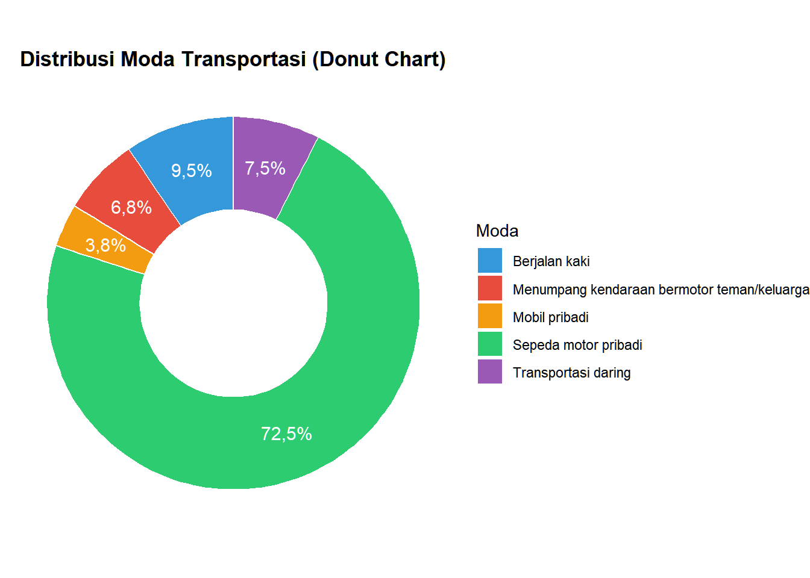
<p class="caption">(\#fig:fig-donut-moda)Grafik donat moda transportasi mahasiswa UINRIL</p>
</div>

**Interpretasi:** Baik grafik pai maupun donat menunjukkan proporsi penggunaan moda transportasi dengan jelas. Sepeda motor mendominasi dengan proporsi terbesar, diikuti oleh mobil dan angkutan umum. Grafik donat memberikan tampilan yang lebih modern dengan ruang kosong di tengahnya yang dapat digunakan untuk informasi tambahan.

:::


### Variabel Numerik

Berbeda dengan visualisasi variabel kategorikal yang memperlihatkan frekuensi masing-masing kategori dalam variabel, grafik data dengan variabel numerik merepresentasikan nilai yang sebenarnya. 

Persamaan dengan visualisasi pada data kategorikal adalah perlunya pertimbangan **jumlah variabel** dan cara menyajikan nilianya dengan sumbu atau bukan. Selain itu juga perlu dipertimbangkan **keterurutan objek/observasi *(order)***.

Berikut adalah tinjauan beberapa jenis grafik visualisasi data variabel numerik dengan masing-masing ilustrasi data terstrukturnya.

#### Histogram

Histogram menunjukkan distribusi nilai-nilai yang berada pada rentang tertentu. Rentang nilai ditunjukkan di sumbu X-nya, sementara sumbu Y adalah frekuensinya. Istilah untuk rentang-rentang ini disebut ***bin***, sementara lebar/ukurannya disebut ***bin size*** atau ***bin width***.


::: rmdnote

[Penting!]{.tajuksaya}

Jangan tertukar antara histogram dengan grafik batang! Perbedaan mendasar keduanya terletak pada sumbu X-nya. Sumbu X pada histogram menunjukkan angka, sementara pada grafik batang menunjukkan kategorinya.

Satu karakteristik lain yang membedakan histogram dengan grafik batang adalah **jarak antarbatangnya**. Grafik batang biasanya memiliki celah di antara batangnya, sementara histogram tidak memiliki celah.

:::


Proses pembuatan histogram dari tabel data terstruktur diilustrasikan oleh kasus berikut. Dalam proses ini, variabel numerik dikelompokkan ke dalam interval atau rentang tertentu. Selanjutnya, frekuensi merepresentasikan jumlah total objek yang nilainya berada di dalam masing-masing rentang tersebut.

::: rmdkasus

#### Studi Kasus: Membuat Histogram Biaya Perjalanan {.unnumbered}

Histogram menunjukkan distribusi nilai numerik dengan mengelompokkannya ke dalam interval (bin). Mari kita visualisasikan biaya perjalanan mahasiswa ITERA.

<table class="table table-striped table-hover table-condensed" style="width: auto !important; margin-left: auto; margin-right: auto;">
<caption>(\#tab:bab-4-hist-biaya-prep)Statistik Deskriptif Biaya Perjalanan Mahasiswa ITERA (dalam ribuan rupiah)</caption>
 <thead>
  <tr>
   <th style="text-align:left;"> Statistik </th>
   <th style="text-align:right;"> Nilai (Rp ribu) </th>
  </tr>
 </thead>
<tbody>
  <tr>
   <td style="text-align:left;"> Min </td>
   <td style="text-align:right;"> 0,00 </td>
  </tr>
  <tr>
   <td style="text-align:left;"> Q1 </td>
   <td style="text-align:right;"> 20000,00 </td>
  </tr>
  <tr>
   <td style="text-align:left;"> Median </td>
   <td style="text-align:right;"> 30000,00 </td>
  </tr>
  <tr>
   <td style="text-align:left;"> Mean </td>
   <td style="text-align:right;"> 38665,89 </td>
  </tr>
  <tr>
   <td style="text-align:left;"> Q3 </td>
   <td style="text-align:right;"> 45000,00 </td>
  </tr>
  <tr>
   <td style="text-align:left;"> Max </td>
   <td style="text-align:right;"> 400000,00 </td>
  </tr>
  <tr>
   <td style="text-align:left;"> NA </td>
   <td style="text-align:right;"> 0,00 </td>
  </tr>
</tbody>
</table>

Sebelum membuat histogram, kita perlu mengelompokkan nilai-nilai ke dalam interval (*bin*). Perangkat lunak pengolah data statistik, contohnya bahasa pemrograman R, melakukan ini secara otomatis. Berikut adalah contoh pembuatan histogram dengan pengaturan *bin* otomatis:

<div class="figure" style="text-align: center">
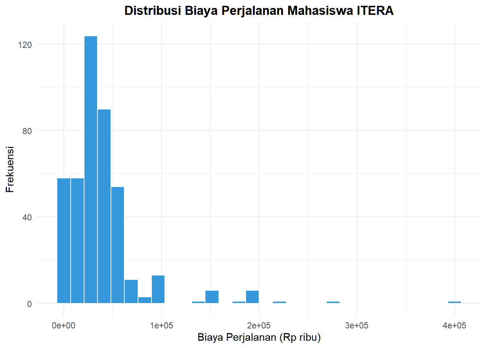
<p class="caption">(\#fig:fig-hist-biaya-auto)Histogram biaya perjalanan (bin otomatis) dalam ribuan rupiah</p>
</div>

Kita juga dapat mengatur jumlah bin secara manual untuk melihat distribusi dengan lebih detail:

<div class="figure" style="text-align: center">
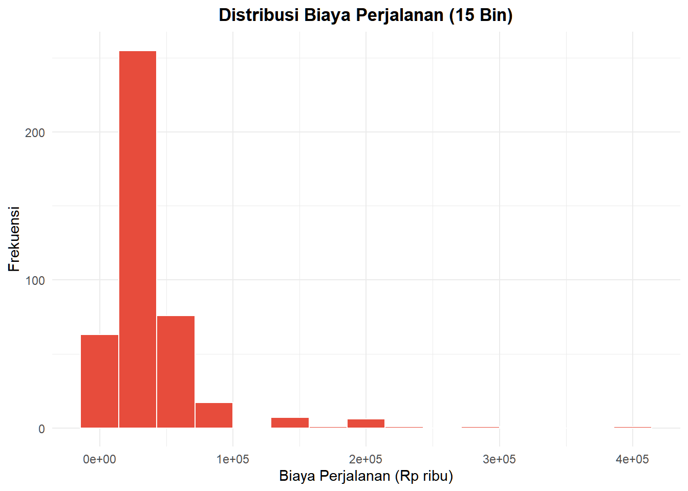
<p class="caption">(\#fig:fig-hist-biaya-manual)Histogram biaya perjalanan (bin manual) dalam ribuan rupiah</p>
</div>

Untuk lebih memahami proses *binning*, mari kita buat tabel frekuensi manual:

<table class="table table-striped table-hover table-condensed" style="width: auto !important; margin-left: auto; margin-right: auto;">
<caption>(\#tab:bab-4-tab-freq-manual)Tabel Frekuensi Biaya Perjalanan dalam Ribuan Rupiah (6 Interval Pertama)</caption>
 <thead>
  <tr>
   <th style="text-align:left;"> Interval Biaya (Rp ribu) </th>
   <th style="text-align:right;"> Frekuensi </th>
  </tr>
 </thead>
<tbody>
  <tr>
   <td style="text-align:left;"> [0,4,44e+04] </td>
   <td style="text-align:right;"> 318 </td>
  </tr>
  <tr>
   <td style="text-align:left;"> (4,44e+04,8,89e+04] </td>
   <td style="text-align:right;"> 80 </td>
  </tr>
  <tr>
   <td style="text-align:left;"> (8,89e+04,1,33e+05] </td>
   <td style="text-align:right;"> 13 </td>
  </tr>
  <tr>
   <td style="text-align:left;"> (1,33e+05,1,78e+05] </td>
   <td style="text-align:right;"> 7 </td>
  </tr>
  <tr>
   <td style="text-align:left;"> (1,78e+05,2,22e+05] </td>
   <td style="text-align:right;"> 7 </td>
  </tr>
  <tr>
   <td style="text-align:left;"> (2,22e+05,2,67e+05] </td>
   <td style="text-align:right;"> 1 </td>
  </tr>
</tbody>
</table>

**Interpretasi:** Histogram menunjukkan bahwa sebagian besar mahasiswa ITERA memiliki biaya perjalanan dalam rentang rendah hingga menengah, dengan konsentrasi terbesar pada rentang 0-50 ribu rupiah (perhatikan bahwa nilai biaya sudah dalam satuan ribu rupiah). Distribusi menunjukkan pola miring ke kanan (*right-skewed*), yang berarti terdapat beberapa mahasiswa dengan biaya perjalanan yang sangat tinggi. Informasi ini penting untuk perencanaan transportasi kampus, misalnya dalam menentukan subsidi atau rute angkutan kampus.

:::


#### *Boxplot*

Boxplot adalah grafik berbentuk kotak dan garis yang menampilkan ukuran penyebaran suatu variabel numerik secara grafis (Gambar \@ref(fig:jenis-boxplot)). Sebagaimana yang ditunjukkan oleh gambar tersebut, kotak dan garis pada boxplot dapat berjumlah satu atau lebih. Satu kotak dan garis menandakan hanya ada satu kategori objek dengan variabel numerik yang ditampilkan.

Sementara itu, jika variabel numerik tersebut dikategorikan lagi berdasarkan suatu variabel kategoris, maka jumlah kotak dan garisnya bisa lebih dari satu dan berjumlah sesuai dengan jumlah kategori objeknya.


<div class="figure" style="text-align: center">
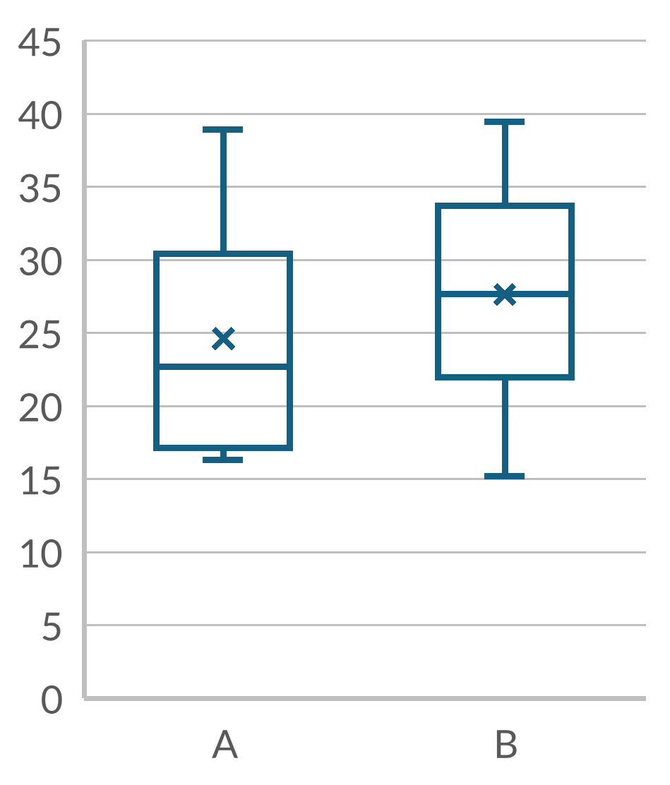
<p class="caption">(\#fig:jenis-boxplot)*Boxplot* yang terdiri atas dua kategori objek: A dan B</p>
</div>

Setiap elemen pada boxplot memiliki makna ukuran penyebaran. Ini dijelaskan pada kasus berikut.

::: rmdkasus

#### Studi Kasus: Membuat Boxplot Biaya Perjalanan Mahasiswa {.unnumbered}

Boxplot menampilkan ukuran penyebaran data numerik secara grafis. Mari kita buat boxplot untuk menganalisis distribusi biaya perjalanan mahasiswa dari berbagai universitas.

<table class="table table-striped table-hover table-condensed" style="width: auto !important; margin-left: auto; margin-right: auto;">
<caption>(\#tab:bab-4-boxplot-prep)Statistik Deskriptif Biaya Perjalanan Gabungan (UINRIL &amp; UNILA)</caption>
 <thead>
  <tr>
   <th style="text-align:left;"> Statistik </th>
   <th style="text-align:right;"> Nilai </th>
  </tr>
 </thead>
<tbody>
  <tr>
   <td style="text-align:left;"> Min </td>
   <td style="text-align:right;"> 0,00 </td>
  </tr>
  <tr>
   <td style="text-align:left;"> Q1 </td>
   <td style="text-align:right;"> 30,00 </td>
  </tr>
  <tr>
   <td style="text-align:left;"> Median </td>
   <td style="text-align:right;"> 50,00 </td>
  </tr>
  <tr>
   <td style="text-align:left;"> Mean </td>
   <td style="text-align:right;"> 56,54 </td>
  </tr>
  <tr>
   <td style="text-align:left;"> Q3 </td>
   <td style="text-align:right;"> 65,00 </td>
  </tr>
  <tr>
   <td style="text-align:left;"> Max </td>
   <td style="text-align:right;"> 400,00 </td>
  </tr>
  <tr>
   <td style="text-align:left;"> NA </td>
   <td style="text-align:right;"> 0,00 </td>
  </tr>
</tbody>
</table>

Mari kita buat boxplot tunggal untuk biaya perjalanan UINRIL terlebih dahulu:

<div class="figure" style="text-align: center">
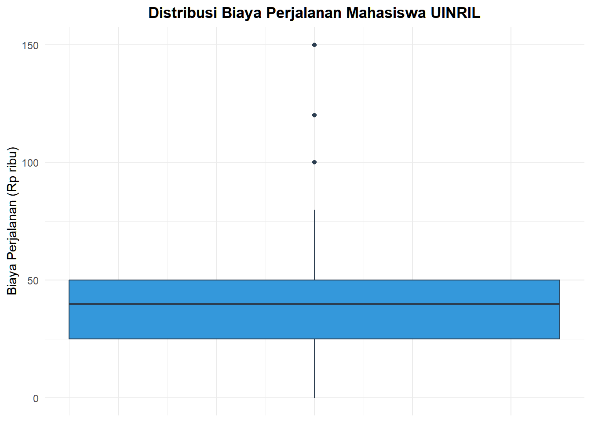
<p class="caption">(\#fig:fig-boxplot-single)Boxplot biaya perjalanan mahasiswa UINRIL</p>
</div>

Sekarang mari kita buat boxplot ganda untuk membandingkan distribusi biaya perjalanan antar kampus:

<div class="figure" style="text-align: center">
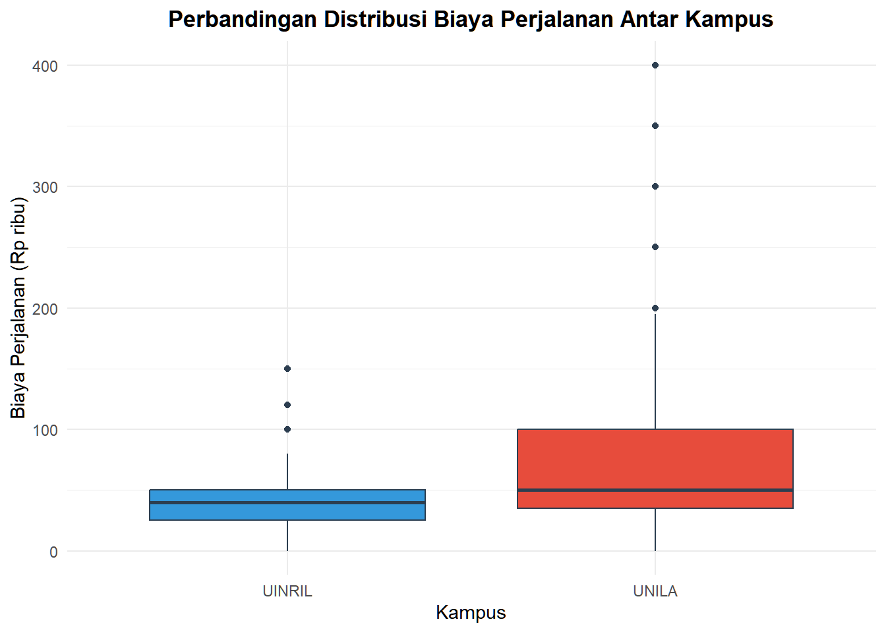
<p class="caption">(\#fig:fig-boxplot-multiple)Boxplot biaya perjalanan mahasiswa berdasarkan kampus</p>
</div>

**Penjelasan elemen boxplot:**

- **Garis tengah kotak (median/Q2)**: Nilai tengah data yang membagi data menjadi dua bagian sama besar
- **Kotak bagian bawah (Q1)**: Kuartil pertama, 25% data berada di bawah nilai ini
- **Kotak bagian atas (Q3)**: Kuartil ketiga, 75% data berada di bawah nilai ini
- **Tinggi kotak (IQR)**: Jarak interkuartil, menunjukkan rentang 50% data tengah
- ***Whiskers* (garis atas dan bawah)**: Menunjukkan rentang data yang masih dalam batas normal (1,5 × IQR)
- **Titik-titik di luar *whiskers***: *Outlier* atau pencilan, yakni nilai-nilai ekstrem yang jauh dari sebagian besar data

**Interpretasi:** Dari boxplot ganda terlihat bahwa distribusi biaya perjalanan mahasiswa UNILA memiliki median yang sedikit lebih tinggi dibandingkan UINRIL. Rentang interkuartil (tinggi kotak) UNILA juga lebih besar, menunjukkan variasi biaya perjalanan yang lebih beragam. Terdapat beberapa outlier pada kedua kampus yang menunjukkan ada mahasiswa dengan biaya perjalanan yang jauh lebih tinggi dari mayoritas. Informasi ini berguna untuk perencanaan fasilitas kampus seperti kantin atau transportasi yang disesuaikan dengan daya beli mahasiswa.

:::

#### Grafik Garis *(Line Plot)* dan Area *(Area Plot)*

Grafik ini memetakan nilai variabel angka yang masuk akal bisa diurutkan, yakni biasanya yang berupa deret waktu (time series). Garis menghubungkan masing-masing titik nilai pada tiap-tiap posisi untuk menegaskan perubahan nilainya. Gambar \@ref(fig:line-plot-area-plot) berikut mengilustrasikan data terstruktur yang membentuk line atau area plot.

<div class="figure" style="text-align: center">
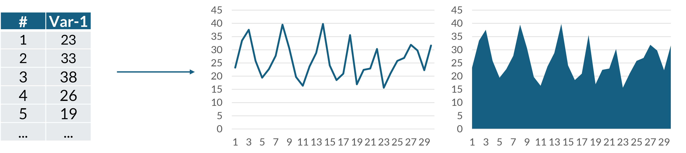
<p class="caption">(\#fig:line-plot-area-plot)Ilustrasi line plot dan area plot serta data terstruktur yang membentuknya</p>
</div>

Area plot secara prinsip sama saja dengan line plot, hanya saja ruang di bawah garisnya diisi dengan warna yang sama dengan garis. Area plot biasanya digunakan untuk data numerik dengan dimensi waktu yang terdiri atas kategori-kategori seperti yang ditunjukkan Gambar \@ref(fig:fig-area-plot-multi).

<div class="figure" style="text-align: center">

<p class="caption">(\#fig:fig-area-plot-multi)Ilustrasi area plot dengan tiga variabel</p>
</div>

#### Grafik Pencar *(Scatterplot)*

*Scatterplot* dapat memperlihatkan pemetaan nilai dua variabel numerik yang berkaitan. Sumbu tegak dan datar menunjukkan nilai-nilai dua variabel tersebut sementara tiap titik dibentuk dari perpotongan nilai dari kedua variabel untuk tiap-tiap objek.

::: rmdkasus

#### Studi Kasus: Membuat *Scatterplot* Hubungan Biaya Perjalanan dan Jarak Tempuh {.unnumbered}

*Scatterplot* memperlihatkan hubungan antara dua variabel numerik. Setiap titik mewakili satu observasi dengan nilai pada sumbu X dan Y. Mari kita analisis hubungan antara biaya perjalanan dan jarak tempuh mahasiswa ITERA.

<table class="table table-striped table-hover table-condensed" style="width: auto !important; margin-left: auto; margin-right: auto;">
<caption>(\#tab:bab-4-scatter-prep)Contoh Data Biaya Perjalanan dan Jarak Tempuh dalam Ribuan Rupiah (10 Observasi Pertama)</caption>
 <thead>
  <tr>
   <th style="text-align:right;"> Biaya Perjalanan (Rp ribu) </th>
   <th style="text-align:right;"> Jarak Tempuh (km) </th>
  </tr>
 </thead>
<tbody>
  <tr>
   <td style="text-align:right;"> 10000 </td>
   <td style="text-align:right;"> 6,69 </td>
  </tr>
  <tr>
   <td style="text-align:right;"> 21000 </td>
   <td style="text-align:right;"> 2,82 </td>
  </tr>
  <tr>
   <td style="text-align:right;"> 40000 </td>
   <td style="text-align:right;"> 5,17 </td>
  </tr>
  <tr>
   <td style="text-align:right;"> 30000 </td>
   <td style="text-align:right;"> 6,95 </td>
  </tr>
  <tr>
   <td style="text-align:right;"> 25000 </td>
   <td style="text-align:right;"> 5,57 </td>
  </tr>
  <tr>
   <td style="text-align:right;"> 40000 </td>
   <td style="text-align:right;"> 4,75 </td>
  </tr>
  <tr>
   <td style="text-align:right;"> 30000 </td>
   <td style="text-align:right;"> 8,27 </td>
  </tr>
  <tr>
   <td style="text-align:right;"> 0 </td>
   <td style="text-align:right;"> 3,70 </td>
  </tr>
  <tr>
   <td style="text-align:right;"> 100000 </td>
   <td style="text-align:right;"> 3,77 </td>
  </tr>
  <tr>
   <td style="text-align:right;"> 30000 </td>
   <td style="text-align:right;"> 2,08 </td>
  </tr>
</tbody>
</table>

Tabel di atas menunjukkan pasangan nilai untuk setiap mahasiswa. Kolom pertama (`biaya.dalam.sepekan`) akan menjadi sumbu X, dan kolom kedua (`jarak`) menjadi sumbu Y. Setiap baris akan menjadi satu titik pada scatterplot.

Mari kita buat *scatterplot* menggunakan `ggplot2`:

<div class="figure" style="text-align: center">
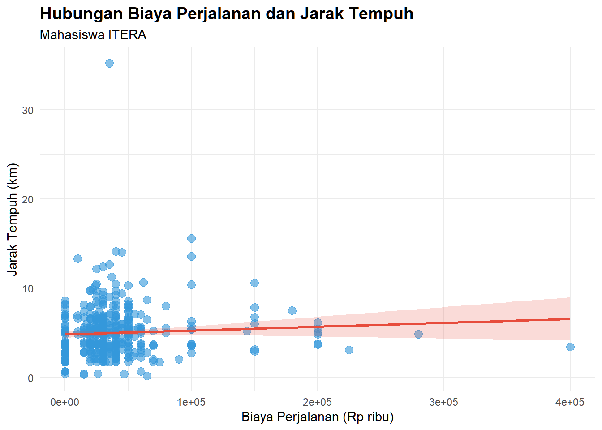
<p class="caption">(\#fig:fig-scatter-ggplot)Scatterplot jarak tempuh vs biaya perjalanan dalam ribuan rupiah</p>
</div>

**Hubungan data terstruktur dengan scatterplot:**

- Setiap **baris** dalam tabel data menjadi **satu titik** pada grafik
- Nilai **kolom pertama** (biaya perjalanan) menentukan **posisi horizontal (X)** titik
- Nilai **kolom kedua** (jarak tempuh) menentukan **posisi vertikal (Y)** titik
- Titik di koordinat (50, 10) artinya mahasiswa tersebut memiliki biaya perjalanan 50 ribu rupiah (nilai sudah dalam satuan ribu) dan jarak tempuh 10 km

**Interpretasi:** Scatterplot menunjukkan adanya hubungan positif antara biaya perjalanan (dalam ribuan rupiah) dan jarak tempuh mahasiswa ITERA. Mahasiswa yang tinggal lebih jauh dari kampus cenderung memiliki biaya perjalanan yang lebih tinggi, yang masuk akal karena mereka memerlukan lebih banyak bahan bakar atau biaya transportasi umum. Garis tren (garis putus-putus merah) menunjukkan arah umum hubungan ini. Informasi ini berguna untuk perencanaan kebijakan kampus terkait subsidi transportasi yang mungkin lebih diprioritaskan untuk mahasiswa yang tinggal jauh dari kampus.

:::


## Penggunaan dan Interpretasi Diagram

Memilih diagram yang tepat adalah kunci dalam menghasilkan analisis yang baik dan tajam. Setiap diagram memiliki karakteristik yang berbeda satu sama lain, sehingga penggunaannya harus disesuaikan dengan jenis variabel dan pesan yang ingin ditekankan.

Untuk memilih visualisasi yang paling efektif, mulailah dengan menjawab beberapa pertanyaan mendasar berikut:

* **Apa tujuan utama Anda?** Apakah Anda ingin menunjukkan perbandingan, distribusi, komposisi, atau hubungan antarvariabel?
* **Ada berapa variabel yang ingin Anda tampilkan?** Apakah hanya satu, dua, atau lebih?
* **Apa jenis nilai dan tingkat pengukuran dari variabel-variabel tersebut?** Apakah kategorikal (nominal, ordinal) atau numerik (metrik)?

Jawaban dari pertanyaan-pertanyaan ini akan menuntun Anda pada pilihan diagram yang paling sesuai.

### Pemilihan Diagram Berdasarkan Tujuan

Secara umum, tujuan visualisasi data dalam statistik dapat dikelompokkan menjadi beberapa empat kategori, yang masing-masing memiliki jenis diagram yang cocok. Berikut adalan penjelasan keempat kategori tersebut.

1. **Menampilkan Distribusi Frekuensi**. Ini paling cocok untuk variabel kategorikal (nominal atau ordinal). Pilihan utamanya adalah **grafik batang** atau **grafik lollipop**, di mana panjang atau tinggi batang merepresentasikan jumlah atau frekuensi setiap kategori.
2. **Menampilkan Komposisi**. Ketika Anda ingin menunjukkan bagian-bagian dari suatu keseluruhan, Anda sedang menampilkan komposisi. **Grafik pai** atau **donat** dapat dipakai untuk tujuan ini.
3. **Menampilkan Distribusi Nilai Numerik**. Ketika Anda ingin menampilkan distribusi nilai numerik, Anda dapat menggunakan **histogram** atau **boxplot**. Untuk menampilkan ukuran-ukuran statistik penyebaran dengan lebih tegas, Anda dapat menggunakan *boxplot*.
4. **Menampilkan Hubungan Antar Variabel**. Ketika Anda ingin menunjukkan hubungan antar variabel, Anda dapat menggunakan **scatterplot** atau **line plot**.

### Pemilihan Diagram Berdasarkan Jumlah Variabel

Pemilihan diagram juga dapat Anda lakukan dengan melihat jumlah variabel yang ingin Anda tampilkan. Jika hanya satu variabel, Anda dapat menggunakan **grafik batang** atau **grafik lollipop**. Jika ada dua variabel, Anda dapat menggunakan **scatterplot** atau **line plot**.

Grafik batang juga dapat digunakan untuk menampilkan distribusi frekuensi dari dua variabel kategorikal dengan menggunakan **grafik batang bertumpuk** atau **grafik batang berjejer**.


### Pemilihan Diagram Berdasarkan Tingkat Pengukuran Variabel

Secara umum, diagram yang digunakan untuk menampilkan data kategorikal adalah **grafik batang** atau **grafik lollipop**, sedangkan diagram yang digunakan untuk menampilkan data numerik adalah **histogram** atau **boxplot**.

Beberapa contoh pertimbangan dalam memilih diagram berdasarkan tingkat pengukuran variabel adalah sebagai berikut:

1. **Data Ordinal**. Untuk data ordinal, Anda sangat disarankan untuk menggunakan **grafik batang** atau **grafik lollipop** yang diurutkan berdasarkan urutan kategori.
2. **Data Metrik**. Histogram, *boxplot*, dan *scatterplot* adalah pilihan standar untuk visualisasi.

Ringkasan dari pemilihan diagram berdasarkan tujuan, jumlah variabel, dan tingkat pengukuran variabel tersebut dapat dilihat pada Gambar \@ref(fig:simpulan-memilih-visualisasi) berikut yang diambil dari @Crazyegg_2017.

<div class="figure" style="text-align: center">
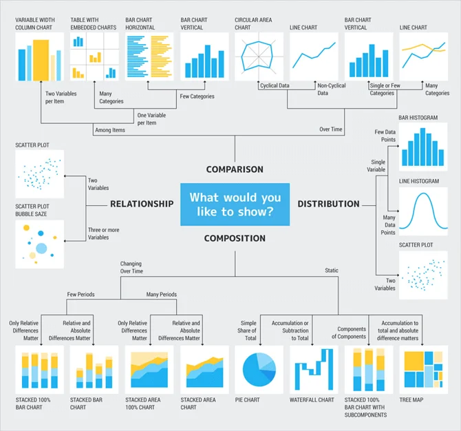
<p class="caption">(\#fig:simpulan-memilih-visualisasi)Panduan memilih jenis visualisasi</p>
</div>

Silakan kerjakan soal-soal evaluasi berikut terkait visualisasi data kuantitatif untuk menguji pemahaman Anda terhadap penjelasan-penjelasan yang telah Anda pelajari.

::: rmdexercise

## Soal Evaluasi 5 {.unnumbered}

Perhatikan cuplikan data hasil survei mahasiswa berikut ini:

<table class="table table-striped table-hover" style="margin-left: auto; margin-right: auto;">
<caption>(\#tab:bab-4-eval-5-preview)Cuplikan data survei mahasiswa</caption>
 <thead>
  <tr>
   <th style="text-align:center;"> KodeResp </th>
   <th style="text-align:center;"> Usia </th>
   <th style="text-align:center;"> Fakultas </th>
   <th style="text-align:center;"> ThnMsk </th>
   <th style="text-align:center;"> UangSaku </th>
   <th style="text-align:center;"> Jarak </th>
  </tr>
 </thead>
<tbody>
  <tr>
   <td style="text-align:center;"> 001 </td>
   <td style="text-align:center;"> 22 </td>
   <td style="text-align:center;"> 1 </td>
   <td style="text-align:center;"> 2020 </td>
   <td style="text-align:center;"> 2 </td>
   <td style="text-align:center;"> 19,27 </td>
  </tr>
  <tr>
   <td style="text-align:center;"> 002 </td>
   <td style="text-align:center;"> 25 </td>
   <td style="text-align:center;"> 1 </td>
   <td style="text-align:center;"> 2020 </td>
   <td style="text-align:center;"> 1 </td>
   <td style="text-align:center;"> 0,58 </td>
  </tr>
  <tr>
   <td style="text-align:center;"> 003 </td>
   <td style="text-align:center;"> 24 </td>
   <td style="text-align:center;"> 2 </td>
   <td style="text-align:center;"> 2021 </td>
   <td style="text-align:center;"> 1 </td>
   <td style="text-align:center;"> 0,56 </td>
  </tr>
  <tr>
   <td style="text-align:center;"> 004 </td>
   <td style="text-align:center;"> 19 </td>
   <td style="text-align:center;"> 3 </td>
   <td style="text-align:center;"> 2022 </td>
   <td style="text-align:center;"> 1 </td>
   <td style="text-align:center;"> 1,05 </td>
  </tr>
  <tr>
   <td style="text-align:center;"> 005 </td>
   <td style="text-align:center;"> 23 </td>
   <td style="text-align:center;"> 2 </td>
   <td style="text-align:center;"> 2021 </td>
   <td style="text-align:center;"> 1 </td>
   <td style="text-align:center;"> 1,69 </td>
  </tr>
  <tr>
   <td style="text-align:center;"> 006 </td>
   <td style="text-align:center;"> 20 </td>
   <td style="text-align:center;"> 1 </td>
   <td style="text-align:center;"> 2020 </td>
   <td style="text-align:center;"> 3 </td>
   <td style="text-align:center;"> 1,37 </td>
  </tr>
</tbody>
</table>

Adapun keterangan dari variabel-variabel tersebut (metadata) adalah sebagai berikut:

<table class="table table-striped table-hover" style="margin-left: auto; margin-right: auto;">
<caption>(\#tab:bab-4-eval-5-metadata)Metadata variabel survei mahasiswa</caption>
 <thead>
  <tr>
   <th style="text-align:left;"> Nama Variabel </th>
   <th style="text-align:left;"> Deskripsi </th>
   <th style="text-align:left;"> Nilai-nilai yang valid </th>
  </tr>
 </thead>
<tbody>
  <tr>
   <td style="text-align:left;"> `KodeResp` </td>
   <td style="text-align:left;"> Nomor urut responden </td>
   <td style="text-align:left;"> tiga digit angka, hingga jumlah responden minimal </td>
  </tr>
  <tr>
   <td style="text-align:left;"> `Usia` </td>
   <td style="text-align:left;"> Usia responden (tahun) </td>
   <td style="text-align:left;"> 18 - ∞ </td>
  </tr>
  <tr>
   <td style="text-align:left;"> `Fakultas` </td>
   <td style="text-align:left;"> Fakultas mahasiswa </td>
   <td style="text-align:left;"> 1 = Fakultas Syariah,<br>2 = Fakultas Tarbiyah dan Keguruan,<br>3 = Fakultas Dakwah dan Komunikasi </td>
  </tr>
  <tr>
   <td style="text-align:left;"> `ThnMsk` </td>
   <td style="text-align:left;"> Tahun masuk kuliah (Masehi) </td>
   <td style="text-align:left;"> 2018 - 2022 </td>
  </tr>
  <tr>
   <td style="text-align:left;"> `UangSaku` </td>
   <td style="text-align:left;"> Uang saku mahasiswa per bulan </td>
   <td style="text-align:left;"> 1 = &lt;1 juta rupiah,<br>2 = 1-2 juta rupiah,<br>3 = 2-3 juta rupiah,<br>4 = 3-4 juta,<br>5 = &gt;4 juta </td>
  </tr>
  <tr>
   <td style="text-align:left;"> `Jarak` </td>
   <td style="text-align:left;"> Jarak tempat tinggal mahasiswa dari kampus (km) </td>
   <td style="text-align:left;"> 0 - ∞ </td>
  </tr>
</tbody>
</table>

1. Analisislah tiap-tiap variabel berdasarkan tingkat pengukuran variabelnya untuk menentukan jenis grafik apa yang bisa digunakan untuk memvisualkan variabel-variabel tersebut! [STP-3.1]{.capaian}

  <table class="table table-striped table-hover" style="margin-left: auto; margin-right: auto;">
   <thead>
    <tr>
     <th style="text-align:center;"> # </th>
     <th style="text-align:center;"> Nama Variabel </th>
     <th style="text-align:center;"> Tingkat Pengukuran </th>
     <th style="text-align:center;"> Jenis Grafik yang Bisa Digunakan (bisa lebih dari 1) </th>
    </tr>
   </thead>
  <tbody>
    <tr>
     <td style="text-align:center;"> a </td>
     <td style="text-align:center;"> `Usia` </td>
     <td style="text-align:center;"> ... </td>
     <td style="text-align:center;"> ... </td>
    </tr>
    <tr>
     <td style="text-align:center;"> b </td>
     <td style="text-align:center;"> `Fakultas` </td>
     <td style="text-align:center;"> ... </td>
     <td style="text-align:center;"> ... </td>
    </tr>
    <tr>
     <td style="text-align:center;"> c </td>
     <td style="text-align:center;"> `UangSaku` </td>
     <td style="text-align:center;"> ... </td>
     <td style="text-align:center;"> ... </td>
    </tr>
    <tr>
     <td style="text-align:center;"> d </td>
     <td style="text-align:center;"> `ThnMsk` </td>
     <td style="text-align:center;"> ... </td>
     <td style="text-align:center;"> ... </td>
    </tr>
    <tr>
     <td style="text-align:center;"> e </td>
     <td style="text-align:center;"> `Jarak` </td>
     <td style="text-align:center;"> ... </td>
     <td style="text-align:center;"> ... </td>
    </tr>
  </tbody>
  </table>

2. Tentukan jenis grafik yang sesuai untuk beberapa tujuan visualisasi berikut [STP-3.2]{.capaian}:
    a. menampilkan distribusi frekuensi dari variabel `Fakultas`
    a. menampilkan distribusi frekuensi mahasiswa per `ThnMsk` dan `Fakultas`
    a. memperlihatkan median, kuartil atas, dan kuartil bawah variabel `Usia` 
    a. memperlihatkan sebaran mahasiswa berdasarkan `Jarak` tempat tinggal mereka

3. Analisislah mengapa grafik histogram tidak bisa digunakan untuk menampilkan distribusi frekuensi dari variabel `Fakultas` dan `UangSaku`! [STP-3.4]{.capaian}

:::


<!--chapter:end:04-visualisasi-data.Rmd-->

# Pengantar Analisis Statistik Inferensial {#bab-5-pengantar-inferensial}

::: rmdcapaian
## Capaian Pembelajaran {.unnumbered}

Setelah mempelajari bab ini, Anda diharapkan:

1.  mampu memilih jenis-jenis pengambilan sampel dalam statistik untuk sebuah kasus. [STP-4.1]{.capaian}
2.  mampu menjelaskan hasil perhitungan probabilitas dari suatu nilai sampel dalam distribusi statistik sampel menggunakan *standard error*. [STP-4.2]{.capaian}
:::

## Konsep Dasar Statistika Inferensial

Statistika inferensial adalah cabang statistika yang mempelajari **penarikan kesimpulan tentang populasi berdasarkan data dari sampel**. Konsep-konsep dasar yang perlu dipahami dalam analisis statistika ini meliputi **perbedaan antara populasi dan sampel**, **teknik pengambilan sampel**, **distribusi sampel dan distribusi statistik sampel**, serta prinsip-prinsip terkait distribusi statistik, yakni beberapa di antaranya adalah **teorema limit sentral** dan **distribusi normal**.

Setelah memahami konsep-konsep tersebut, kita dapat melanjutkan pembahasan ke penarikan kesimpulan karakteristik populasi dari hasil sampel, yang mencakup pembuatan **estimasi parameter** dan **pengujian hipotesis** yang menyatakan karakteristik seluruh populasi dari hasil sampel.

## Populasi vs. Sampel

**Populasi** adalah seluruh kelompok objek (baik orang, benda, maupun kejadian) yang menjadi target penelitian kita. Ukuran statistik deskriptif dari populasi, seperti rata-rata ($\mu$) atau simpangan baku ($\sigma$), disebut **parameter**. Parameter inilah yang sebenarnya ingin diketahui oleh peneliti. Namun, karena jumlah populasi biasanya sangat besar, sering kali kita tidak mungkin mengukur seluruh anggota populasi secara langsung.

Sebaliknya, **sampel** adalah sebagian kecil dari populasi yang kita ambil untuk diamati. Sampel yang baik harus bisa mewakili sifat keseluruhan populasinya **(representatif)**. Ukuran statistik deskriptif dari sampel inilah yang disebut **statistik** (seperti rata-rata $\bar{x}$ atau simpangan baku $s$). Nilai statistik ini digunakan untuk menduga nilai parameter populasi.

**Mengapa kita mengambil sampel?** Alasan utamanya adalah **efisiensi** dan **kelayakan**. Menurut @saunders2023, melakukan sensus terhadap populasi yang besar sering kali tidak praktis karena membutuhkan **biaya** yang sangat mahal dan **waktu** yang lama. Selain itu, @devaus2014surveys menekankan bahwa sensus tidak menjamin data yang lebih akurat. Sebaliknya, sampel yang dipilih dengan hati-hati memungkinkan peneliti untuk mengontrol kualitas data dengan lebih ketat (misalnya melalui pelatihan pewawancara yang lebih intensif), sehingga justru dapat menghasilkan tingkat **akurasi** yang lebih tinggi dibandingkan sensus yang rentan terhadap *non-sampling error*.

::: rmdkasus
### Studi Kasus: Populasi vs. Sampel {.unnumbered}

Kita ingin menganalisis data karakteristik perjalanan mahasiswa di ITERA. Oleh karena itu, kita mengumpulkan data terstruktur yang mengukur variabel-variabel terkait pola perjalanan mahasiswa di ITERA.

Berdasarkan data tahun 2023 pertengahan, tercatat sebanyak **18.877** mahasiswa aktif di ITERA. Jika kita mengumpulkan seluruh mahasiswa aktif dengan jumlah tersebut, maka kita akan mendapatkan data populasi. Namun, karena jumlah mahasiswa yang sangat banyak, kita tidak mungkin mengumpulkan data seluruh mahasiswa aktif di ITERA. Oleh karena itu, kita mengumpulkan data sebagian mahasiswa aktif di ITERA, yaitu sebanyak **428** mahasiswa.

<div class="figure" style="text-align: center">
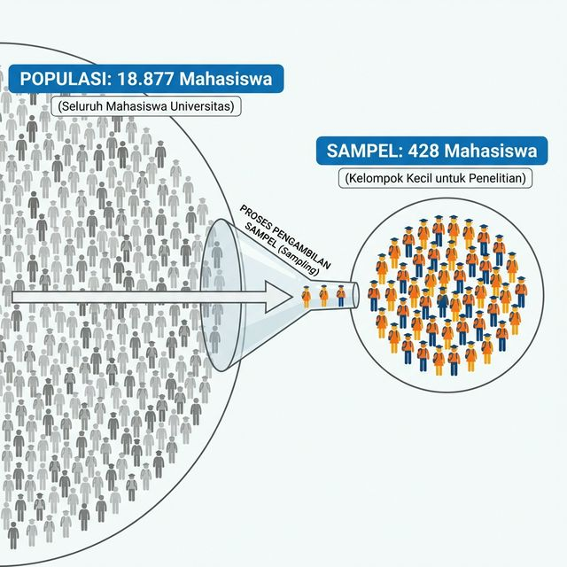
<p class="caption">(\#fig:05-inferensia-populasi-sampel-viz)Ilustrasi Perbandingan Populasi Mahasiswa ITERA dan Sampel</p>
</div>

Keputusan mengambil 428 sampel ini didasarkan pada pertimbangan **efisiensi** dan **akurasi** yang telah kita bahas sebelumnya. Melakukan sensus terhadap 18.877 mahasiswa tentu membutuhkan biaya dan waktu yang sangat besar. Selain itu, dengan jumlah yang jauh lebih sedikit, peneliti dapat lebih fokus menjamin kualitas data (misalnya meminimalisir kesalahan input atau bias wawancara), sehingga data sampel ini diharapkan memiliki kualitas yang lebih baik daripada sensus yang dilakukan secara terburu-buru.
:::

## Teknik-Teknik Pengambilan Sampel *(Sampling Techniques)*

Teknik pengambilan sampel bertujuan memastikan bahwa sampel yang dipilih benar-benar dapat mewakili populasinya. @healey2021statistics menekankan prinsip EPSEM (*Equal Probability of Selection Method*), yakni prinsip yang menekankan bahwa **setiap anggota populasi memiliki kesempatan yang sama untuk dipilih**. Hal ini penting untuk menghasilkan sampel yang representatif.

Teknik probabilitas adalah teknik yang menggunakan prinsip EPSEM. Untuk dapat menggunakannya, kita harus memiliki **kerangka sampel**. Kerangka sampel adalah daftar seluruh anggota populasi yang akan menjadi acuan kita untuk memilih sampel nantinya. Ada empat jenis teknik yang termasuk ke dalam teknik pengambilan sampel probabilitas [@tjokropandojo2021pengantar, @saunders2023]: *simple random sampling*, *systematic sampling*, *stratified sampling*, dan *multi-stage cluster sampling*.

::: rmdkasus
### Studi Kasus: Pengambilan Sampel dengan Populasi Kecil {.unnumbered}

Untuk mempermudah pemahaman, bayangkan kita memiliki **populasi kecil** yang terdiri dari **16 orang** saja. Setiap orang memiliki atribut **Kelompok** (A/B/C/D) dan tinggal di **Blok** tertentu (1/2/3/4).

Berikut adalah data lengkap ke-16 orang tersebut:


Table: (\#tab:05-inferensia-setup-toy-populasi)Daftar Lengkap Populasi (N=16)

| ID| Jarak|Kelompok |Blok   | ID| Jarak|Kelompok |Blok   |
|--:|-----:|:--------|:------|--:|-----:|:--------|:------|
|  1|   2,5|A        |Blok 1 |  9|  10,5|A        |Blok 3 |
|  2|   1,0|B        |Blok 1 | 10|  11,2|B        |Blok 3 |
|  3|   5,2|C        |Blok 1 | 11|   9,8|C        |Blok 3 |
|  4|   3,8|D        |Blok 1 | 12|   8,5|D        |Blok 3 |
|  5|   0,5|A        |Blok 2 | 13|  15,0|A        |Blok 4 |
|  6|   1,2|B        |Blok 2 | 14|  14,2|B        |Blok 4 |
|  7|   4,0|C        |Blok 2 | 15|  16,5|C        |Blok 4 |
|  8|   6,1|D        |Blok 2 | 16|  13,8|D        |Blok 4 |

Mari kita terapkan keempat teknik *sampling* untuk memilih sampel dari 16 orang ini.
:::

### *Simple Random Sampling*

*Simple random sampling* merupakan teknik paling dasar dalam pengambilan sampel probabilistik. Kita mengambil secara acak nomor yang merepresentasikan nomor urut sampel. Ini memungkinkan setiap anggota populasi memiliki peluang yang sama untuk dipilih. Pemilihan anggota sampel secara acak ini dapat dilakukan dengan bantuan sistem eksternal dari peneliti, misalnya melalui tabel angka acak atau program komputer yang menghasilkan angka acak (*random number generator*) (Gambar \@ref(fig:05-inferensia-img-srs)).

<div class="figure" style="text-align: center">

<p class="caption">(\#fig:05-inferensia-img-srs)Ilustrasi Simple Random Sampling</p>
</div>

::: rmdnote
### Catatan: Miskonsepsi tentang Istilah Random {.unnumbered}

Banyak yang salah kaprah dengan istilah *random* pada *simple random sampling*. Keacakan (*random*) di sini maksudnya bukan asal mengambil sampel secara acak **langsung di dunia nyata**, akan tetapi kita mengambil sampel tersebut dari **sebuah kerangka sampel**, elemen vital dalam teknik *sampling* probabilitas.
:::

::: rmdkasus
### Studi Kasus: *Simple Random Sampling* dengan Populasi Kecil {.unnumbered}

Misalkan kita menggunakan *random number generator* yang ada di hampir semua program *spreadsheet* untuk memilih 4 sampel. *Hasilnya adalah 4 orang yang terpilih secara acak tanpa pola tertentu.*


Table: (\#tab:05-inferensia-toy-srs)Hasil SRS (n=4)

| ID| Jarak|Kelompok |Blok   |
|--:|-----:|:--------|:------|
|  9|  10,5|A        |Blok 3 |
| 16|  13,8|D        |Blok 4 |
| 14|  14,2|B        |Blok 4 |
|  7|   4,0|C        |Blok 2 |
:::

### *Systematic Random Sampling*

Berbeda dengan *simple random sampling*, *systematic random sampling* menggunakan sistem pemilihan berdasarkan interval tertentu. Langkah pertama adalah menentukan angka acak awal, kemudian memilih sampel berikutnya berdasarkan kelipatan dari angka tersebut.

<div class="figure" style="text-align: center">
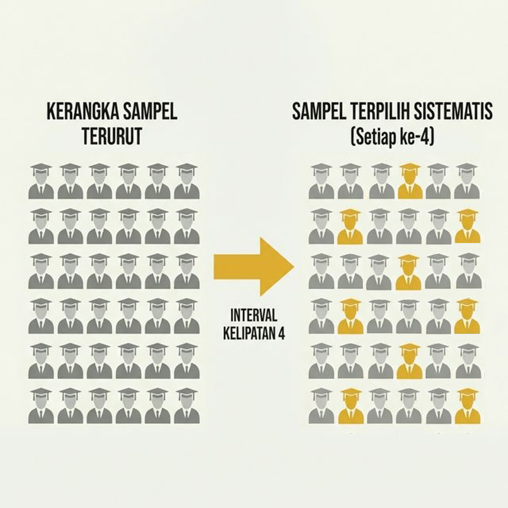
<p class="caption">(\#fig:05-inferensia-img-systematic)Ilustrasi Systematic Random Sampling</p>
</div>

::: rmdkasus
### Studi Kasus: *Systematic Sampling* dengan Populasi Kecil {.unnumbered}

Kita ingin mengambil sampel dengan interval **k=4**. Kita urutkan berdasarkan ID, lalu ambil setiap kelipatan 4 (4, 8, 12, 16).


Table: (\#tab:05-inferensia-toy-systematic)Hasil Systematic Sampling (Interval k=4)

| ID| Jarak|Kelompok |Blok   |
|--:|-----:|:--------|:------|
|  4|   3,8|D        |Blok 1 |
|  8|   6,1|D        |Blok 2 |
| 12|   8,5|D        |Blok 3 |
| 16|  13,8|D        |Blok 4 |

*Perhatikan pola ID yang terpilih selalu berjarak 4 angka.*
:::

### *Stratified Random Sampling*

Dalam beberapa kasus, populasi terdiri atas kelompok-kelompok, disebut **strata**, yang memiliki karakteristik yang sama didalamnya, misalnya jumlah anggota rumah tangga, tingkat pendidikan, atau status sosial ekonomi. Agar setiap kelompok terwakili, digunakanlah teknik *stratified random sampling*. Caranya adalah dengan membagi populasi ke dalam beberapa strata sesuai karakteristik yang relevan, kemudian mengambil sampel secara proporsional dari setiap strata.

<div class="figure" style="text-align: center">
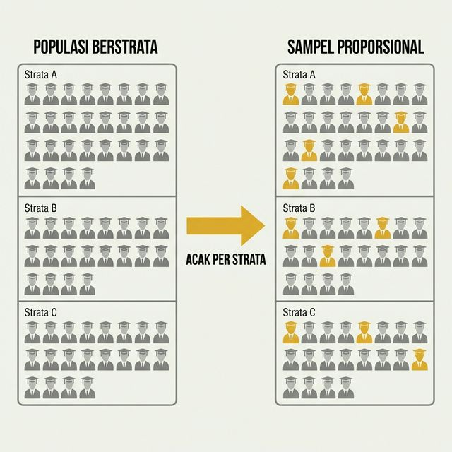
<p class="caption">(\#fig:05-inferensia-img-stratified)Ilustrasi Stratified Random Sampling</p>
</div>

::: rmdkasus
### Studi Kasus: *Stratified Random Sampling* dengan Populasi Kecil {.unnumbered}

Kita ingin memastikan setiap **Kelompok** (A, B, C, D) terwakili. Kita bagi populasi menjadi 4 strata (Kelompok), lalu ambil **1 orang acak** dari setiap strata.


Table: (\#tab:05-inferensia-toy-stratified)Hasil Stratified Sampling (1 wakil per Kelompok)

| ID| Jarak|Kelompok |Blok   |
|--:|-----:|:--------|:------|
|  9|  10,5|A        |Blok 3 |
|  6|   1,2|B        |Blok 2 |
|  3|   5,2|C        |Blok 1 |
| 16|  13,8|D        |Blok 4 |

*Hasilnya menjamin ada masing-masing satu perwakilan dari Kelompok A, B, C, dan D.*
:::

### *Multi-Stage Cluster Sampling*

Teknik ini digunakan ketika kerangka sampel individu tidak tersedia, tetapi kerangka sampel untuk kelompok (klaster) tersedia. Misalnya, kita tidak punya daftar nama seluruh penduduk kota, tetapi kita punya kerangka sampel nama-nama kelurahan. Kita bisa memilih beberapa kelurahan secara acak (tahap 1), kemudian menghasilkan kerangka sampel baru dari kelurahan yang terpilih tersebut, misalnya berdasarkan batas administratif (RW/lingkungan), atau berdasarkan batas fisik, seperti blok-blok jalan (tahap 2). Dari kerangka sampel tersebut kita pilih lagi secara acak anggota kerangka sampel tersebut.

<div class="figure" style="text-align: center">

<p class="caption">(\#fig:05-inferensia-img-cluster)Ilustrasi Multi-Stage Cluster Sampling</p>
</div>

::: rmdkasus
### Studi Kasus: *Multi-Stage Cluster Sampling* dengan Populasi Kecil {.unnumbered}

Kita ingin menghemat tenaga dengan hanya mendatangi satu lokasi saja. Kita pilih secara acak **1 Blok** (Cluster), lalu ambil **semua orang** di blok tersebut.


Table: (\#tab:05-inferensia-toy-cluster)Hasil Cluster Sampling (Terpilih: Blok 4 )

| ID| Jarak|Kelompok |Blok   |
|--:|-----:|:--------|:------|
| 13|  15,0|A        |Blok 4 |
| 14|  14,2|B        |Blok 4 |
| 15|  16,5|C        |Blok 4 |
| 16|  13,8|D        |Blok 4 |

*Kita hanya perlu mendatangi satu lokasi (Blok), tapi mendapatkan 4 responden sekaligus.*
:::

::: rmdexercise

## Soal Evaluasi 6 {.unnumbered}

[STP-4.3]{.capaian} Sebuah acara keakraban angkatan Anda akan dilakukan di suatu tempat yang memerlukan biaya sewa tempat. Agar acara Anda dihadiri sebanyak mungkin orang, Anda menanyakan kesediaan kawan-kawan Anda. Anda pun merancang sebuah survei untuk mengetahui persentase kawan Anda yang setuju acara keakraban diadakan di tempat tersebut. Untuk itu Anda menanyakan sebagian kawan Anda sebagai sampel.

  a. Apabila Anda memiliki daftar nama seluruh kawan Anda, apa nama teknik pengambilan sampel yang Anda bisa lakukan?
  b. Jelaskan bagaimana metode Anda memilih sampel kawan Anda berdasarkan kondisi di soal ke-1 tersebut.
  c. Apabila Anda tidak memiliki daftar nama seluruh kawan Anda, apa nama teknik pengambilan sampel yang Anda bisa lakukan?
  d. Jelaskan bagaimana metode Anda memilih sampel kawan Anda berdasarkan kondisi di soal ke-3 tersebut.
:::


## Menentukan Ukuran Sampel

Jika selama ini kita masih berpikir bahwa ukuran sampel (jumlah sampel yang menjadi bahan data kita) ditentukan berdasarkan ukuran populasinya, maka kita salah kaprah. Menurut @devaus2014surveys, ukuran sampel menentukan galat dari perkiraan kita terhadap populasi, tapi ukuran sampel **bukan ditentukan dari ukuran populasi**. @devaus2014surveys juga menjabarkan jumlah-jumlah sampel yang berbeda untuk setiap galat dari perkiraan kita. Galat perkiraan ini disebut juga dengan *sampling error*. Tabel \@ref(tab:tabel-ukuran-sampel-sampling-error) menunjukkan ukuran sampel minimum berdasarkan *sampling error* pada varians 50/50, tingkat kepercayaan 95%. Ini akan kita pelajari lebih dalam di Bab \@ref(bab-6-estimasi-parameter).

<table class="table" style="width: auto !important; margin-left: auto; margin-right: auto;">
<caption>(\#tab:tabel-ukuran-sampel-sampling-error)Ukuran sampel minimum berdasarkan *sampling error* pada varians 50/50, tingkat kepercayaan 95%</caption>
 <thead>
  <tr>
   <th style="text-align:center;"> _Sampling error_ </th>
   <th style="text-align:center;"> Ukuran Sampel Min. </th>
   <th style="text-align:center;"> _Sampling error_ </th>
   <th style="text-align:center;"> Ukuran Sampel Min. </th>
  </tr>
 </thead>
<tbody>
  <tr>
   <td style="text-align:center;"> 1,0% </td>
   <td style="text-align:center;"> 10.000 </td>
   <td style="text-align:center;"> 5,5% </td>
   <td style="text-align:center;"> 330 </td>
  </tr>
  <tr>
   <td style="text-align:center;"> 1,5% </td>
   <td style="text-align:center;"> 4.500 </td>
   <td style="text-align:center;"> 6,0% </td>
   <td style="text-align:center;"> 277 </td>
  </tr>
  <tr>
   <td style="text-align:center;"> 2,0% </td>
   <td style="text-align:center;"> 2.500 </td>
   <td style="text-align:center;"> 6,5% </td>
   <td style="text-align:center;"> 237 </td>
  </tr>
  <tr>
   <td style="text-align:center;"> 2,5% </td>
   <td style="text-align:center;"> 1.600 </td>
   <td style="text-align:center;"> 7,0% </td>
   <td style="text-align:center;"> 204 </td>
  </tr>
  <tr>
   <td style="text-align:center;"> 3,0% </td>
   <td style="text-align:center;"> 1.100 </td>
   <td style="text-align:center;"> 7,5% </td>
   <td style="text-align:center;"> 178 </td>
  </tr>
  <tr>
   <td style="text-align:center;"> 3,5% </td>
   <td style="text-align:center;"> 816 </td>
   <td style="text-align:center;"> 8,0% </td>
   <td style="text-align:center;"> 156 </td>
  </tr>
  <tr>
   <td style="text-align:center;"> 4,0% </td>
   <td style="text-align:center;"> 625 </td>
   <td style="text-align:center;"> 8,5% </td>
   <td style="text-align:center;"> 138 </td>
  </tr>
  <tr>
   <td style="text-align:center;"> 4,5% </td>
   <td style="text-align:center;"> 494 </td>
   <td style="text-align:center;"> 9,0% </td>
   <td style="text-align:center;"> 123 </td>
  </tr>
  <tr>
   <td style="text-align:center;"> 5,0% </td>
   <td style="text-align:center;"> 400 </td>
   <td style="text-align:center;"> 9,5% </td>
   <td style="text-align:center;"> 110 </td>
  </tr>
  <tr>
   <td style="text-align:center;">  </td>
   <td style="text-align:center;">  </td>
   <td style="text-align:center;"> 10,0% </td>
   <td style="text-align:center;"> 100 </td>
  </tr>
</tbody>
</table>

::: rmdkasus
### Studi Kasus: Menentukan Jumlah Sampel dari Tabel {.unnumbered}

Seorang mahasiswa ingin meneliti **proporsi mahasiswa ITERA yang menggunakan kendaraan bermotor** sebagai moda utama perjalanan ke kampus. Ia merancang survei dan perlu menentukan berapa responden yang harus ia kumpulkan.

Karena ia belum tahu berapa proporsi sesungguhnya di populasi, ia menggunakan asumsi terburuk: 50% menggunakan kendaraan bermotor dan 50% tidak (varians 50/50). Ia juga menetapkan bahwa *sampling error* yang masih dapat ia tolerir adalah **5%** pada tingkat kepercayaan 95%.

Dengan membaca Tabel \@ref(tab:tabel-ukuran-sampel-sampling-error) pada baris *sampling error* 5,0%, ia menemukan bahwa **sampel minimum yang dibutuhkan adalah 400 responden**. Jumlah inilah yang ia jadikan target pengumpulan data.

Perhatikan bahwa angka ini tidak bergantung pada seberapa besar populasi mahasiswa ITERA (yang berjumlah lebih dari 18.000 orang). Cukup 400 responden, dan hasil surveinya akan memiliki akurasi dalam batas ±5% pada tingkat kepercayaan 95%.
:::


## Konsep Distribusi dalam Statistik

Dalam stastistika inferensial, kita harus menguasai konsep mengenai **distribusi**. Distribusi adalah penyebaran suatu nilai yang memiliki karakteristik tertentu. Di sini, tujuan kita adalah mengenali apa yang kami akan sebut dengan **distribusi objek** dan **distribusi statistik**, atau yang dalam @healey2021statistics dan @ewing2020basic disebut **distribusi sampel** dan **distribusi hasil sampel** (*sampling distribution*).

### Model-model Distribusi Statistik

Terdapat banyak jenis model distribusi dalam statistik yang sering dipakai. Beberapa jenis model statisik yang populer misalnya adalah distribusi *uniform* (seragam), distribusi binomial, distribusi Poisson, dan distribusi normal atau Gaussian [@ModernStatR-Home]. Namun, dalam pembahasan statistika inferensial di buku ini kita hanya akan fokus pada **distribusi normal** dan turunannya, distribusi Student's t, beserta distribusi binomial, distribusi F, dan distribusi *Chi-square*.

Seperti yang ditampilkan oleh Gambar \@ref(fig:fig-ragam-distribusi) berikut, setiap jenis distribusi statistik mempunyai berbagai bentuknya. Bentuk-bentuk ini pada hakikatnya adalah **histogram-histogram** representasi sebaran nilai-nilai sekumpulan objek.

<div class="figure" style="text-align: center">
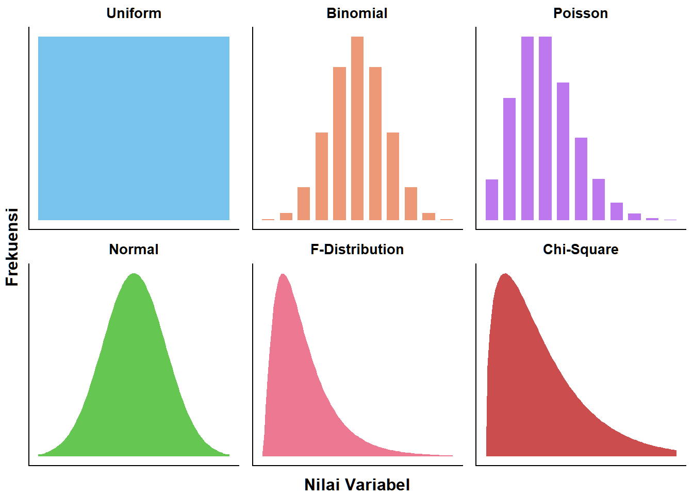
<p class="caption">(\#fig:fig-ragam-distribusi)Ragam Bentuk Distribusi Statistik</p>
</div>

**Interpretasi Bentuk Distribusi**

Seperti yang sudah dijelaskan bahwa bentuk distribusi sebenarnya adalah histogram, kita sudah belajar bahwa histogram memiliki 2 sumbu: sumbu X dan Y/mendatar dan tegak, yang masing-masing artinya adalah rentang nilai dan frekuensi kemunculan nilai tersebut secara berturut-turut. 

Begitu juga gambar-gambar distribusi tersebut. Sumbu X mencerminkan **nilai-nilai yang terdapat dalam objek-objek** yang dinyatakan distribusinya, sumbu Y jumlah kemunculan nilai-nilai tersebut. Selain dipahami sebagai jumlah, sumbu Y juga bisa diinterpretasikan sebagai **probabilitas** kemunculan nilai-nilai tersebut.

### Distribusi Normal {#bab-5-distribusi-normal}

Distribusi normal adalah salah satu jenis distribusi nilai yang memiliki karakteristik berbentuk seperti lonceng, simetris, dan membentang tanpa batas di kedua sisi sumbu horizontal [@tjokropandojo2021pengantar]. Oleh karena itu, model distribusi ini juga disebut *bell curve* atau kurva lonceng [@healey2021statistics] (Gambar \@ref(fig:fig-bab-5-hist-normal)).

<div class="figure" style="text-align: center">

<p class="caption">(\#fig:fig-bab-5-hist-normal)Distribusi Normal</p>
</div>

Dari Gambar \@ref(fig:fig-bab-5-hist-normal), kita dapat melihat bahwa distribusi normal memiliki beberapa karakteristik utama berikut:

1.  **Parameter Utama:** Distribusi normal ditentukan sepenuhnya oleh dua parameter: rata-rata (*mean* atau $\mu$) dan varians ($\sigma^2$) [@Chan-IntroProb]. Rata-rata menentukan lokasi tengah distribusi, sedangkan varians (atau standar deviasi) menentukan lebar atau penyebaran kurva [@healey2021statistics; @Hair-Multivariate].

<div class="figure" style="text-align: center">
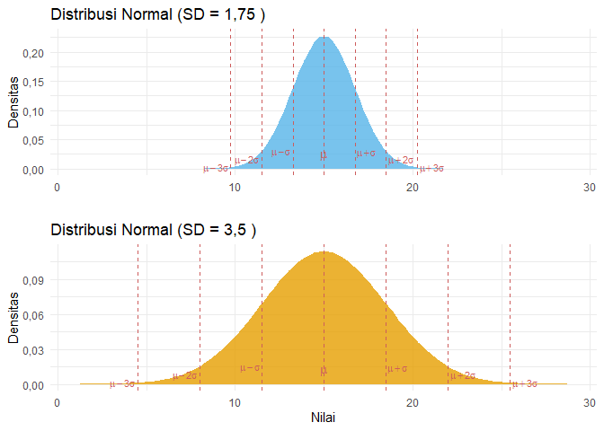
<p class="caption">(\#fig:fig-bab-5-parameter-normal)Perbandingan Distribusi Normal dengan Rata-rata Sama namun Standar Deviasi Berbeda</p>
</div>

2.  **Simetri Sempurna:** Pada distribusi normal yang sempurna, nilai *mean* (rata-rata), *median* (nilai tengah), dan *mode* (nilai yang paling sering muncul) adalah identik dan berada **tepat di tengah distribusi** [@healey2021statistics; @devaus2014surveys].

3.  **Skewness dan Kurtosis:**

      - **Skewness (Kemencengan):** Distribusi normal memiliki nilai *skewness* 0, yang menunjukkan simetri sempurna. Jika data menumpuk di kiri, itu disebut *positive skew*, dan jika di kanan disebut *negative skew* [@devaus2014surveys; @ewing2020basic].

      - **Kurtosis (Keruncingan):** Mengukur keruncingan atau kedataran puncak distribusi relatif terhadap distribusi normal. Distribusi normal memiliki nilai kurtosis 3. Distribusi yang lebih runcing disebut leptokurtik (>3), dan yang lebih datar disebut platikurtik (<3) [@Chan-IntroProb; @ewing2020basic].

<div class="figure">

<p class="caption">(\#fig:05-inferensia-viz-skewness)Ilustrasi Positive dan Negative Skewness</p>
</div>
<div class="figure">
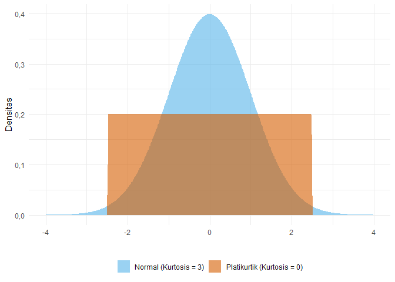
<p class="caption">(\#fig:05-inferensia-viz-kurtosis)Perbandingan Kurtosis: Normal (3) vs Platikurtik (<3)</p>
</div>

4.  **Area di Bawah Kurva (Aturan 68-95-99, Aturan Empiris):** Salah satu karakteristik paling berguna adalah **proporsi area di bawah kurva yang tetap** berdasarkan jarak standar deviasi (SD) dari rata-rata [@healey2021statistics]:

    -   $\pm$ 1 SD mencakup sekitar 68,26% dari total kasus.
    -   $\pm$ 2 SD mencakup sekitar 95,44% dari total kasus.
    -   $\pm$ 3 SD mencakup sekitar 99,72% dari total kasus.

    Ini mengimplikasikan bahwa kejadian yang berada jauh di luar 3 standar deviasi dari rata-rata sangat jarang terjadi.

<div class="figure" style="text-align: center">

<p class="caption">(\#fig:fig-bab-5-aturan-689599)Ilustrasi Aturan 68-95-99 (Aturan Empiris)</p>
</div>


### Distribusi Objek dan Distribusi Statistik

**Distribusi objek** atau **distribusi sampel** merujuk pada **sebaran nilai data** dari objek-objek yang menjadi sampel yang kita ambil. Dengan kata lain, distribusi ini menggambarkan variasi data individual setiap objek.

Di sisi lain, **distribusi statistik** atau **distribusi hasil sampel** *(sampling distribution)* adalah **sebaran nilai statistik** (misalnya rata-rata) dari suatu populasi yang berasal dari perhitungan statistik sampel-sampel yang diambil berulang kali dari populasi tersebut. Statistik yang dihitung biasanya dapat berupa proporsi atau rata-rata.

Mari pelajari kasus berikut untuk lebih memahami perbedaan antara distribusi objek dengan distribusi statistik.

::: rmdkasus
### Studi Kasus: Distribusi Objek vs Distribusi Statistik {.unnumbered}

Agar lebih mudah membayangkan perbedaan antara distribusi objek dan distribusi statistik, mari kita gunakan **populasi kecil** yang hanya terdiri dari **30 mahasiswa** (diambil dari data ITERA). Kita akan melihat variabel **Jarak Tempuh (km)**.

**1. Distribusi Objek (Sebaran Data Individu)**

Berikut adalah data populasi lengkap (N=30):

<table class="table" style="margin-left: auto; margin-right: auto;">
<caption>(\#tab:05-inferensia-populasi-30)Data Populasi (N=30)</caption>
 <thead>
  <tr>
   <th style="text-align:right;"> ID </th>
   <th style="text-align:right;"> Jarak </th>
   <th style="text-align:right;"> ID </th>
   <th style="text-align:right;"> Jarak </th>
  </tr>
 </thead>
<tbody>
  <tr>
   <td style="text-align:right;"> 18 </td>
   <td style="text-align:right;"> 0,44 </td>
   <td style="text-align:right;"> 4 </td>
   <td style="text-align:right;"> 5,01 </td>
  </tr>
  <tr>
   <td style="text-align:right;"> 2 </td>
   <td style="text-align:right;"> 0,72 </td>
   <td style="text-align:right;"> 12 </td>
   <td style="text-align:right;"> 5,19 </td>
  </tr>
  <tr>
   <td style="text-align:right;"> 17 </td>
   <td style="text-align:right;"> 1,76 </td>
   <td style="text-align:right;"> 21 </td>
   <td style="text-align:right;"> 5,24 </td>
  </tr>
  <tr>
   <td style="text-align:right;"> 28 </td>
   <td style="text-align:right;"> 2,05 </td>
   <td style="text-align:right;"> 15 </td>
   <td style="text-align:right;"> 5,30 </td>
  </tr>
  <tr>
   <td style="text-align:right;"> 7 </td>
   <td style="text-align:right;"> 2,24 </td>
   <td style="text-align:right;"> 20 </td>
   <td style="text-align:right;"> 5,40 </td>
  </tr>
  <tr>
   <td style="text-align:right;"> 23 </td>
   <td style="text-align:right;"> 2,75 </td>
   <td style="text-align:right;"> 26 </td>
   <td style="text-align:right;"> 5,57 </td>
  </tr>
  <tr>
   <td style="text-align:right;"> 22 </td>
   <td style="text-align:right;"> 2,78 </td>
   <td style="text-align:right;"> 24 </td>
   <td style="text-align:right;"> 5,99 </td>
  </tr>
  <tr>
   <td style="text-align:right;"> 9 </td>
   <td style="text-align:right;"> 2,79 </td>
   <td style="text-align:right;"> 10 </td>
   <td style="text-align:right;"> 6,50 </td>
  </tr>
  <tr>
   <td style="text-align:right;"> 29 </td>
   <td style="text-align:right;"> 3,57 </td>
   <td style="text-align:right;"> 5 </td>
   <td style="text-align:right;"> 6,59 </td>
  </tr>
  <tr>
   <td style="text-align:right;"> 19 </td>
   <td style="text-align:right;"> 3,77 </td>
   <td style="text-align:right;"> 6 </td>
   <td style="text-align:right;"> 6,78 </td>
  </tr>
  <tr>
   <td style="text-align:right;"> 30 </td>
   <td style="text-align:right;"> 3,77 </td>
   <td style="text-align:right;"> 14 </td>
   <td style="text-align:right;"> 7,07 </td>
  </tr>
  <tr>
   <td style="text-align:right;"> 27 </td>
   <td style="text-align:right;"> 4,47 </td>
   <td style="text-align:right;"> 13 </td>
   <td style="text-align:right;"> 7,82 </td>
  </tr>
  <tr>
   <td style="text-align:right;"> 8 </td>
   <td style="text-align:right;"> 4,85 </td>
   <td style="text-align:right;"> 3 </td>
   <td style="text-align:right;"> 8,70 </td>
  </tr>
  <tr>
   <td style="text-align:right;"> 16 </td>
   <td style="text-align:right;"> 4,88 </td>
   <td style="text-align:right;"> 11 </td>
   <td style="text-align:right;"> 10,44 </td>
  </tr>
  <tr>
   <td style="text-align:right;"> 25 </td>
   <td style="text-align:right;"> 4,88 </td>
   <td style="text-align:right;"> 1 </td>
   <td style="text-align:right;"> 12,41 </td>
  </tr>
</tbody>
</table>

Rata-rata populasi adalah $\mu = 4,99$ km dengan simpangan baku $\sigma = 2,67$ km.

Sekarang, kita ambil **1 sampel** berukuran $n=10$ secara acak (*Simple Random Sampling*). Pengambilan menghasilkan sampel dengan ID 3, 9, 14, 17, 22, 23, 24, 25, 27, dan 30.

<div class="figure" style="text-align: center">
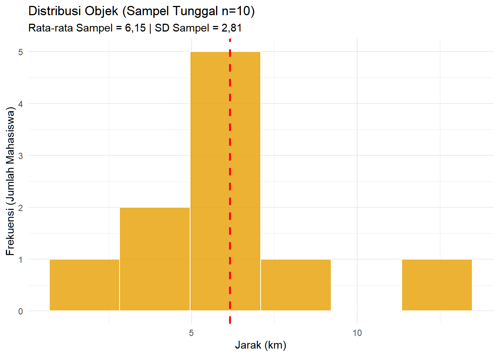
<p class="caption">(\#fig:05-inferensia-sampel-satu)Histogram Distribusi Objek (n=10)</p>
</div>

Pada histogram di atas, sumbu Y ("Frekuensi") menunjukkan **jumlah mahasiswa** yang memiliki jarak tempuh tertentu. Variasi datanya menggambarkan seberapa berbeda jarak antar individu.

**2. Distribusi Statistik (Sebaran Rata-rata)**

Sekarang, kita lakukan simulasi: kita mengambil sampel ($n=10$) dari populasi tersebut sebanyak **200 kali**. Setiap kali ambil, kita catat rata-ratanya.

Berikut adalah 8 hasil pertama dari 200 pengambilan sampel:

<table class="table" style="width: auto !important; margin-left: auto; margin-right: auto;">
<caption>(\#tab:05-inferensia-simulasi-200)Hasil Simulasi Distribusi Sampling (8 Teratas dari 200)</caption>
 <thead>
  <tr>
   <th style="text-align:left;"> Pengambilan_Ke </th>
   <th style="text-align:left;"> Rata_Rata_Sampel </th>
  </tr>
 </thead>
<tbody>
  <tr>
   <td style="text-align:left;"> 1 </td>
   <td style="text-align:left;"> 3,79 </td>
  </tr>
  <tr>
   <td style="text-align:left;"> 2 </td>
   <td style="text-align:left;"> 4,72 </td>
  </tr>
  <tr>
   <td style="text-align:left;"> 3 </td>
   <td style="text-align:left;"> 4,7 </td>
  </tr>
  <tr>
   <td style="text-align:left;"> 4 </td>
   <td style="text-align:left;"> 4,62 </td>
  </tr>
  <tr>
   <td style="text-align:left;"> 5 </td>
   <td style="text-align:left;"> 6,76 </td>
  </tr>
  <tr>
   <td style="text-align:left;"> 6 </td>
   <td style="text-align:left;"> 5,94 </td>
  </tr>
  <tr>
   <td style="text-align:left;"> 7 </td>
   <td style="text-align:left;"> 3,89 </td>
  </tr>
  <tr>
   <td style="text-align:left;"> 8 </td>
   <td style="text-align:left;"> 3,82 </td>
  </tr>
  <tr>
   <td style="text-align:left;"> ... </td>
   <td style="text-align:left;"> ... </td>
  </tr>
</tbody>
</table>

Mari kita lihat histogram dari 200 rata-rata ini:

<div class="figure" style="text-align: center">
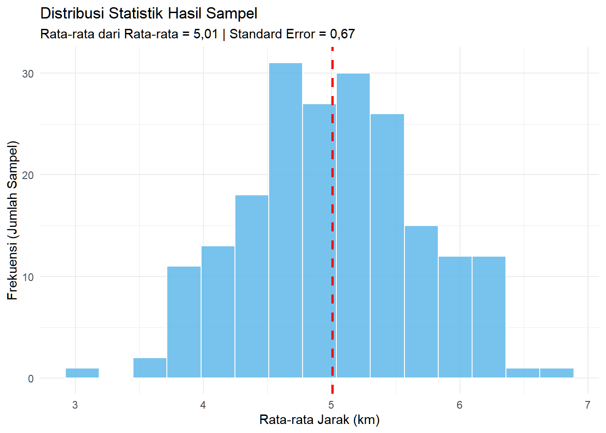
<p class="caption">(\#fig:05-inferensia-hist-sampling)Distribusi Statistik (200 Rata-rata)</p>
</div>

Perhatikan perbedaan kedua histogram tersebut:

1.  **Distribusi objek**: Pada distribusi objek, tinggi batang (nilai di sumbu Y) mencerminkan "jumlah orang atau **frekuensi objek** yang memiliki nilai-nilai yang ada di sumbu X". Misalnya, objek yang memiliki nilai di antara 2,5 sampai 4,0 ada 4 buah (ID 23, 22, 9, dan 30), sementara 4,0 sampai 6,0 ada 2 objek (ID 27 dan 25).

2.  **Distribusi statistik**: Pada distribusi statistik, tinggi batang mencerminkan **frekuensi munculnya nilai rata-rata** dari 200 kali pengambilan sampel sebanyak 10 objek. Jika kita kaitkan dengan probabilitas, maka tinggi batang mewakili tingkat kemungkinan suatu nilai rata-rata dihasilkan dari sampel yang berjumlah 10 objek.
:::

::: rmdexercise
## Soal Evaluasi 7 {.unnumbered}

[STP-4.2]{.capaian} *Suatu sampel pegawai ITERA berjumlah 286 orang yang mengukur jarak tempat tinggal mereka ke kampus menghasilkan rata-rata 7,90 km dan simpangan baku 6,42 km.*

Jelaskan perbedaan distribusi objek dengan distribusi statistik berdasarkan kasus tersebut.

:::

## Teorema Limit Sentral

Tentu saja, di kehidupan nyata distribusi statistik dapat dikatakan tidak pernah ada. Sangat sulit untuk bisa mengambil sampel berkali-kali hingga sangat banyak. Ia hanyalah konsep teoritis untuk menjelaskan bagaimana suatu sampel bisa memiliki *pola statistik sampel yang dapat memprediksi populasi*. Dengan memahami pola prediksi tersebut, **kita tidak perlu lagi menghimpun semua anggota populasi** untuk menghitung parameter populasi. Cukup dengan mengumpulkan sampel tersebut, menghitung statistiknya, dan memperkirakan parameternya berdasarkan statistik tersebut.

Pola prediksi inilah yang dijelaskan oleh **Teorema Limit Sentral *(Central Limit Theorem)***. Teorema ini menjadi pijakan analisis inferensial karena memberikan dua jaminan penting:

1. jika ukuran sampel cukup besar (biasanya $n \ge 30$), **distribusi statistik sampel akan berbentuk normal** (lonceng simetris) apa pun bentuk populasi asalnya.

2. rata-rata dari distribusi statistik ini akan **tepat sama dengan rata-rata populasi sebenarnya**, dengan variasi yang semakin kecil seiring bertambahnya ukuran sampel. Ini adalah jaminan yang paling krusial dari teorema ini.

Kombinasi bentuk normal dan akurasi inilah yang memungkinkan kita melakukan estimasi dan uji statistik dengan percaya diri.

Berdasarkan teorema ini, kita dapat membagi analisis statistika inferensial menjadi analisis statistik inferensial **parametrik** dan **nonparametrik**. Analisis inferensial parametrik adalah analisis inferensial yang mengasumsikan bahwa populasi kita berdistribusi normal. Asumsi ini diuji dengan teknik pengujian kenormalan seperti [uji Shapiro-Wilk]('https://www.statistikian.com/2013/01/saphiro-wilk.html') atau [P-P plot]('https://online.stat.psu.edu/stat501/lesson/4/4.6').

::: rmdkasus
### Studi Kasus: Simulasi Teorema Limit Sentral {.unnumbered}

Mari kita buktikan CLT dengan melakukan simulasi pengambilan sampel berulang. Katakanlah kita memiliki **428 mahasiswa** sebagai populasi. Kita akan mengambil 1000 kali sampel berukuran 50 orang, lalu menghitung rata-ratanya dan memplot histogramnya.

Berikut adalah baris perintah untuk melakukan simulasi tersebut dalam R. Dataset yang digunakan dapat diakses pada [tautan ini]('https://github.com/abdulmubdibindar/buku-ajar-stp/blob/main/datasets/DataUtama_mhsITERA.csv').


``` r
library(ggplot2)
library(gridExtra)
library(dplyr)

# Setup Ulang Populasi Besar (N=428) untuk CLT
data_itera <- read.csv("datasets/DataUtama_mhsITERA.csv", sep = ";")
data_populasi <- data_itera |>
  mutate(jarak = jarak.km) |>
  filter(!is.na(jarak))

# Hitung parameter populasi
mu <- mean(data_populasi$jarak)
N <- nrow(data_populasi)

# 1. Distribusi Populasi (Data Asli)
p1 <- ggplot(data_populasi, aes(x = jarak)) +
  geom_histogram(bins = 30, fill = "gray", color = "black", alpha = 0.7) +
  geom_vline(xintercept = mu, color = "red", size = 1) +
  labs(title = paste0("Distribusi Populasi (N=", N, ")"), x = "Jarak (km)") +
  theme_minimal()

# 2. Distribusi Statistik Sampel (Rata-rata dari 50 sampel yang diambil 1000 kali)  --> SIMULASI
set.seed(999)
means_1000 <- replicate(1000, mean(sample(data_populasi$jarak, 50)))
df_means <- data.frame(means = means_1000)

p2 <- ggplot(df_means, aes(x = means)) +
  geom_histogram(bins = 30, fill = "steelblue", color = "white", alpha = 0.9) +
  geom_vline(xintercept = mean(means_1000), color = "red", size = 1) +
  labs(title = "Distribusi Sampling (n=50, 1000x)", x = "Rata-rata Sampel") +
  theme_minimal()

grid.arrange(p1, p2, ncol = 2)
```

<div class="figure">
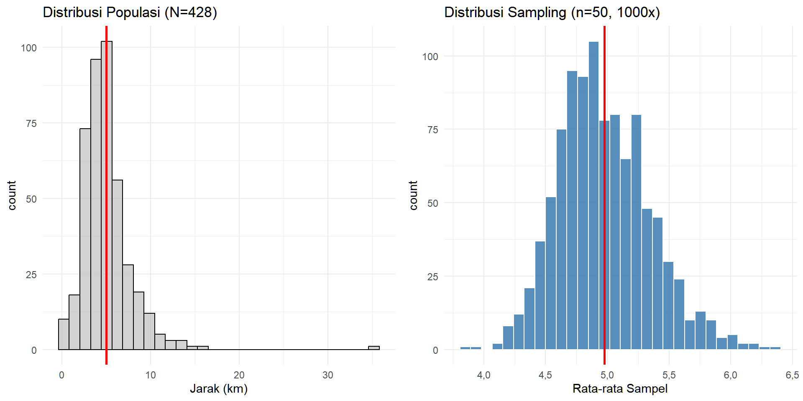
<p class="caption">(\#fig:fig-05-inferensia-2-clt-studi-kasus-simulasi)Perbandingan Distribusi Populasi (Kiri) dan Distribusi Statistiknya (Kanan)</p>
</div>

Gambar \@ref(fig:fig-05-inferensia-2-clt-studi-kasus-simulasi) menunjukkan distribusi objek populasi. Distribusi populasi (kiri) terlihat "miring" (*skewed*) ke kanan, artinya tidak normal. Namun, distribusi rata-rata sampelnya (kanan) berbentuk lonceng simetris yang hampir sempurna **normal**. Rata-rata dari distribusi statistik ini juga sangat dekat dengan rata-rata populasi sebenarnya ($\mu = 5,01$).
:::

::: rmdkasus
### Studi Kasus: Efek Ukuran Sampel terhadap Variasi {.unnumbered}

Mari kita lanjutkan eksperimen kita. Apa yang terjadi jika kita mengubah ukuran sampel ($n$) yang kita ambil berulang-ulang tersebut? Kali ini kita akan membandingkan distribusi statistik yang dihasilkan dari pengambilan sampel berukuran **$n=30$** dengan **$n=100$**.

<div class="figure">

<p class="caption">(\#fig:fig-05-inferensia-3-clt-sample-size)Perbandingan Distribusi Statistik dengan Ukuran Sampel Berbeda</p>
</div>

Perhatikan Gambar \@ref(fig:fig-05-inferensia-3-clt-sample-size). Meskipun kedua kurva sama-sama berbentuk lonceng dan berpusat di rata-rata populasi (garis merah), kurva distribusi statistik untuk **$n=100$ (biru)** jauh lebih "kurus" dan tinggi dibandingkan kurva **$n=30$ (kuning)**.

Ini menunjukkan bahwa semakin banyak sampel yang kita ambil dalam satu kali pengambilan ($n$ semakin besar), maka **variasi** dari rata-rata yang kita peroleh akan semakin kecil. Artinya, rata-rata sampel kita akan semakin jarang meleset jauh dari rata-rata populasi sebenarnya. Dengan kata lain, memperbesar ukuran sampel akan meningkatkan peluang kita untuk mendapatkan hasil yang sangat mendekati kondisi populasi yang sebenarnya.
:::

::: rmdexercise
## Soal Evaluasi 8 {.unnumbered}

[STP-4.2]{.capaian} *Suatu sampel pegawai ITERA berjumlah 286 orang yang mengukur jarak tempat tinggal mereka ke kampus menghasilkan rata-rata 7,90 km dan simpangan baku 6,42 km.*

Apakah kita dapat menggunakan teorema limit sentral dalam perhitungan probabilitas distribusi statistik sampel tersebut? Jelaskan jawaban Anda.
:::


## Menghitung Peluang Kemunculan Nilai Tertentu dari Distribusi Statistik yang Berbentuk Normal.

Pada subbab \@ref(bab-5-distribusi-normal), kita telah belajar bahwa distribusi normal mempunyai aturan empiris atau aturan 68-95-99. Aturan ini berbicara tentang besar area di bawah kurva yang tetap berdasarkan jarak standar deviasi (SD) dari rata-rata [@healey2021statistics]:

  -   $\pm$ 1 SD mencakup sekitar 68,26% dari total kasus.
  -   $\pm$ 2 SD mencakup sekitar 95,44% dari total kasus.
  -   $\pm$ 3 SD mencakup sekitar 99,72% dari total kasus.

Sekarang kita akan menerapkan aturan empiris ini pada distribusi statistik yang berbentuk normal. Kita akan banyak menggunakan distribusi normal ini untuk menghitung **probabilitas terjadinya**--yang diwakili oleh besar area di bawah kurva distribusi normal--**dari suatu nilai yang diminta**, atau menentukan **nilai yang menjadi pembatas suatu probabilitas**. 

Untuk itu, kita perlu memahami konsep tentang standard error dan nilai standar atau nilai Z (*Z-score*). Kedua konsep ini sangat krusial bagi kita untuk memudahkan kita membaca tabel nilai Z yang beguna untuk 

### *Standard Error* (SE)

Sebagaimana yang sudah kita pelajari, distribusi statistik berbeda dengan distribusi objek dalam hal nilai yang diukur. Jika **distribusi objek mengukur nilai dari objek**, maka **distribusi statistik mengukur nilai dari sekumpulan objek yang diambil berulang-ulang dari populasi**.

Dalam distribusi objek, lebar distribusi berkaitan dengan ukuran statistik deskriptif yang disebut **standar deviasi** atau **simpangan baku**. Simpangan baku menunjukkan ukuran jarak rata-rata penyimpangan nilai-nilai dalam distribusi terhadap rata-ratanya. Untuk penyegaran, rumusnya adalah sebagai berikut.

$$
\begin{align}
\text{Simpangan Baku} &= \sqrt{\text{Variansi}}\\
&=\sqrt{\frac{\sum_{i=1}^{n}(x_i - \bar{x})^2}{n}} (\#eq:konsep-simpangan-baku-bab5)
\end{align}
$$ 

Di sisi lain, dalam distribusi statistik simpangan bakunya punya sebutan lain, yakni ***standard error*** (SE). *Standard error* pada hakikatnya adalah adalah **ukuran jarak statistik sampel dari parameter populasi**. Ingat kembali bahwa **rata-rata dari distribusi statistik adalah nilai parameter populasinya**. Semakin kecil SE, semakin presisi estimasi sampel kita terhadap parameter populasi. Secara matematis, standard error dihitung dari simpangan baku sampel kita dengan rumus berikut.

$$
\begin{align}
\text{SE} &=\frac{\sigma}{\sqrt{n}} (\#eq:konsep-standard-error-bab5)
\end{align}
$$ 

Dengan $\sigma$ adalah simpangan baku populasi dan $n$ adalah ukuran sampel.

Jika $\sigma$ tidak diketahui, kita gunakan simpangan baku sampel ($s$) sebagai estimasi, sehingga Persamaan \@ref(eq:konsep-standard-error-bab5) menjadi:

$$
\begin{align}
\text{SE} &=\frac{s}{\sqrt{n}} (\#eq:konsep-se-pake-sd)
\end{align}
$$ 


::: rmdnote

**PENTING**

Dalam beberapa sumber, seperti @healey2021statistics, perhitungan *standard error* yang menggunakan estimasi dari simpangan baku seperti Persamaan \@ref(eq:konsep-se-pake-sd) menggunakan bentuk yang dikoreksi, yakni dengan cara mengurangkan 1 dari nilai ukuran sampelnya, sehingga persamaannya menjadi:

$$
\begin{align}
\text{SE} &=\frac{s}{\sqrt{n-1}} (\#eq:konsep-se-pake-sd-healey)
\end{align}
$$ 

Yang mana yang betul? Karena keduanya sama-sama disebutkan dalam banyak literatur, di sini yang perlu kita perhatikan adalah **konsistensi kita** dalam penggunaan salah satunya.

:::

::: rmdkasus
### Studi Kasus: Menghitung Standard Error {.unnumbered}

Misalkan kita mengambil **satu sampel** acak berukuran $n=100$ mahasiswa dari populasi.


Dari sampel ini, kita peroleh rata-rata jarak $\bar{x} = 5,16$ km. Kita tahu simpangan baku populasi $\sigma = 2,82$ km. Maka *Standard error* adalah:

$$
\begin{align}
SE &=\frac{s}{\sqrt{n}}\\
&= \frac{2,82}{\sqrt{100}} \\
&= 0,2817
\end{align}
$$

Nilai ini memberitahu kita bahwa rata-rata sampel kita (5,16) diperkirakan menyimpang sekitar $\pm 0,28$ km dari rata-rata populasi sebenarnya.
:::

::: rmdexercise
## Soal Evaluasi 9 {.unnumbered}

[STP-4.2]{.capaian} *Suatu sampel pegawai ITERA berjumlah 286 orang yang mengukur jarak tempat tinggal mereka ke kampus menghasilkan rata-rata 7,90 km dan simpangan baku 6,42 km.*

Berapakah standard error dari distribusi statistik sampel tersebut?
:::


### Nilai Standar (*Z-Score*)

*Z-score* menunjukkan posisi suatu nilai dalam sumbu X distribusi normal **jika rata-rata distribusi tersebut dibuat 0** dan **simpangan bakunya dibuat 1**. Untuk distribusi objek, rumusnya adalah:

$$
\begin{align}
Z = \frac{x - \mu}{\sigma} (\#eq:z-score)
\end{align}
$$

Dengan $x$ adalah nilai dalam distribusi normal yang akan kita konversi, $\mu$ melambangkan rata-rata distribusi, dan $\sigma$ melambangkan simpangan baku distribusi.

Kegunaan dari perhitungan nilai terstandar atau nilai Z ini adalah **kita dapat menyatakan nilai statistik yang menggunakan skala berbeda-beda menjadi nilai yang sama**. Hal ini memungkinkan kita membandingkan nilai-nilai tersebut dengan setara, walaupun skala atau satuannya tidak sama.

::: rmdkasus
### Studi Kasus: Menghitung *Z-Score* Suatu Nilai {.unnumbered}

Dalam sebuah sampel yang berjumlah 100 orang, kita mempunyai distribusi biaya perjalanan dengan rata-rata ($\mu$) 50.000 dan simpangan baku ($\sigma$) 10.000. Jika seseorang menghabiskan biaya perjalanan sebesar $x = 65.000$. Berapakah *Z-score* pengeluarannya?

**Jawaban:**

*Z-score* nilainya dihitung sebagai berikut:

$$
\begin{align}
Z &= \frac{x - \mu}{\sigma} \\
&= \frac{65.000 - 50.000}{10.000} \\
&= \frac{15.000}{10.000} \\
&= 1,5
\end{align}
$$

Nilai $Z = 1,5$ berarti biaya perjalanan orang tersebut berada 1,5 kali simpangan baku di atas rata-rata populasi.

Sekarang, mari pertimbangkan variabel lain dari sampel yang sama untuk melihat bagaimana *Z-score* memungkinkan kita membandingkan dua unit pengukuran yang berbeda. 

Misalkan dari 100 orang tersebut, kita juga mempunyai distribusi jarak tempuh dengan rata-rata ($\mu$) 10 km dan simpangan baku ($\sigma$) 2 km. Jika orang yang sama tadi harus menempuh jarak sejauh $x = 13$ km, berapakah *Z-score* jarak tempuhnya?

**Jawaban:**

*Z-score* nilainya dihitung sebagai berikut:

$$
\begin{align}
Z &= \frac{x - \mu}{\sigma} \\
&= \frac{13 - 10}{2} \\
&= \frac{3}{2} \\
&= 1,5
\end{align}
$$

Meskipun menggunakan satuan yang berbeda (biaya dalam Rupiah versus jarak dalam kilometer), nilai *Z-score* pada kedua variabel tersebut ternyata sama ($Z=1,5$). Hal ini berarti biaya perjalanan sebesar 65.000 dan jarak tempuh sejauh 13 km memiliki "posisi" relatif yang sama, yakni sama-sama melampaui 1,5 simpangan baku di atas rata-ratanya masing-masing. Inilah wujud nyata bagaimana *Z-score* menyetarakan nilai-nilai dengan satuan yang berbeda ke dalam satu ukuran standar.
:::

Jika kita menggunakan konsep *Z-Score* tersebut pada distribusi statistik, persamaan \@ref(eq:z-score) akan berubah dari $x$ menjadi $\bar{x}$ dan $\sigma$ menjadi $SE$:

$$
\begin{align}
Z = \frac{\bar{x} - \mu}{SE}
(\#eq:z-score-sampling-distribution)
\end{align}
$$

Dengan $\bar{x}$ adalah rata-rata sampel yang kita miliki, $\mu$ adalah rata-rata populasi (parameter) yang kita jadikan sebagai patokan, dan $SE$ adalah *standard error* yang dihitung dengan persamaan \@ref(eq:konsep-se-pake-sd) atau \@ref(eq:konsep-se-pake-sd-healey), sehingga persamaan \@ref(eq:z-score-sampling-distribution) sama saja bentuknya dengan:

$$
\begin{equation}
Z = \frac{\bar{x} - \mu}{s/\sqrt{n}}
(\#eq:z-score-sampling-distribution)
\end{equation}
$$

::: rmdkasus
### Studi Kasus: Menghitung *Z-Score* Rata-rata Sampel {.unnumbered}

Melanjutkan kasus distribusi biaya perjalanan sebelumnya, dengan menggunakan nilai rata-rata, simpangan baku, dan ukuran sampel yang sama, asumsikan kita mengetahui bahwa rata-rata biaya perjalanan populasi ($\mu$) sebesar 52.000. Berapakah nilai *Z-score* dari rata-rata sampel tersebut?

**Jawaban:**

Pertama-tama, hitung terlebih dahulu nilai *standard error* (SE)-nya:

$$
\begin{align}
SE &= \frac{s}{\sqrt{n}} \\
&= \frac{10.000}{\sqrt{100}} \\
&= \frac{10.000}{10} \\
&= 1.000
\end{align}
$$

Selanjutnya, gunakan nilai SE tersebut untuk menghitung nilai *Z-score* dari rata-rata sampel yang kita peroleh:

$$
\begin{align}
Z &= \frac{\bar{x} - \mu}{SE} \\
&= \frac{50.000 - 52.000}{1.000} \\
&= \frac{-2.000}{1.000} \\
&= -2,0
\end{align}
$$

Nilai $Z = -2,0$ ini berarti angka rata-rata sampel yang kita himpun tersebut ($\bar{x} = 50.000$) menduduki posisi 2 simpangan baku (atau 2 kali *standard error*) di bawah asumsi parameter rata-rata populasinya ($\mu = 52.000$). Dalam hal ini, *Z-score* mencerminkan rentang penyimpangan sampel terhadap populasinya: semakin jauh nilai *Z-score* dari angka nol, semakin jauh sampel kita menyimpang. Jika sampel kita ternyata dikategorikan "terlalu menyimpang", ada kemungkinan terjadinya bias ketika kita menghimpun sampel ke lapangan, atau asumsi kita mengenai rata-rata populasi tersebutlah yang justru keliru.
:::

::: rmdexercise
## Soal Evaluasi 10 {.unnumbered}

[STP-4.2]{.capaian} *Suatu sampel pegawai ITERA berjumlah 286 orang yang mengukur jarak tempat tinggal mereka ke kampus menghasilkan rata-rata 7,90 km dan simpangan baku 6,42 km.*

Jika diketahui parameter (rata-rata jarak tempat tinggal seluruh pegawai ITERA) sebesar 7,5 km, hitunglah nilai standar (*z-score*) sampel tersebut. Ulaslah hasil perhitungan Anda secara analitik berdasarkan konsep yang sudah Anda pelajar.
:::


### Menentukan Probabilitas Terjadinya Suatu Nilai {#probabilitas-nilai-di-distribusi-statistik}

Probabilitas terjadinya suatu nilai dalam distribusi statistik yang berbentuk normal ditunjukkan oleh **luasan area di bawah kurva distribusi tersebut**. Luasan area di bawah kurva distribusi statistik ini dapat dihitung dengan terlebih dahulu menentukan nilai *Z-score* dari nilai tersebut.

Karena kurva distribusi normal bersifat kontinu, probabilitas terjadinya *tepat* satu nilai spesifik secara pasti (misalnya tepat 50.000) pada dasarnya dianggap nol. Oleh sebab itu, saat kita membicarakan probabilitas pada distribusi normal, kita harus selalu merujuk pada probabilitas dalam suatu **rentang nilai**. Ini berarti kita memerlukan rentang yang dibatasi oleh **dua nilai** (batas bawah dan batas atas), yang kemudian masing-masing harus dikonversikan menjadi dua nilai *Z-score*.

Untuk dapat menghitung probabilitas luasan di antara dua nilai *Z-score* ini, kita dapat memanfaatkan tabel statistik yang memuat nilai probabilitas kumulatif untuk setiap nilai *Z-score*. Tabel ini biasanya disajikan bersama ilustrasi area yang dimaksud seperti berikut.

<div class="figure" style="text-align: center">
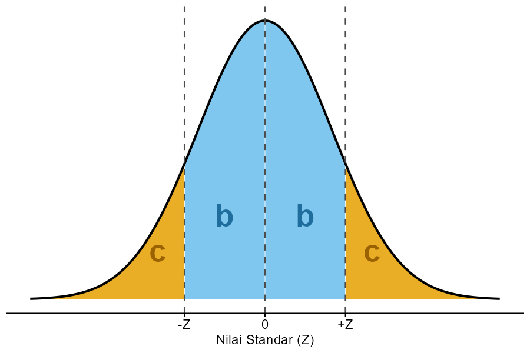
<p class="caption">(\#fig:fig-distribusi-normal-area-bc)Ilustrasi area b (kiri) dan c (kanan) pada distribusi normal. Area b dan c masing-masing melambangkan probabilitas nilai-nilai yang berada di luar rentang nilai yang diamati.</p>
</div>

Beberapa contoh tabel yang dapat kita gunakan adalah seperti yang disertakan dalam @healey2021statistics atau seperti yang disajikan [Stat Calculators](https://statcalculators.com/z-score-table-standard-normal-distribution/) berikut.

<div class="figure" style="text-align: center">
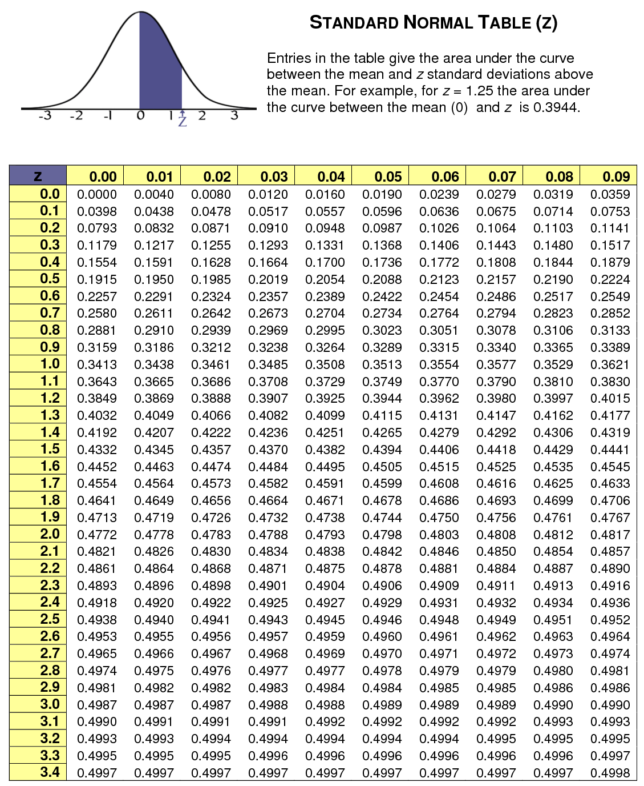
<p class="caption">(\#fig:bab-5-fig-z-table)Contoh tabel Z-score.</p>
</div>

Dalam perangkat lunak statistik seperti R, kita dapat memanfaatkan fungsi `pnorm()` untuk menghitung probabilitas luasan di antara dua nilai *Z-score* ini. 

::: rmdkasus
### Studi Kasus: Probabilitas Ditemukannya Suatu Sampel dengan Rata-rata Tertentu Dibandingkan dengan Rata-rata Populasi {.unnumbered}

Dengan sampel berukuran 100 orang yang memiliki rata-rata $\bar{x} = 51.500$ dan *standard error* $SE = 1.000$, berapakah probabilitas sampel tersebut ditemukan bila acuan kita adalah rata-rata populasi ($\mu = 52.000$)?

**Jawaban:**

Kita perlu menghitung *Z-score* untuk $\bar{x}=51.500$ terlebih dahulu:

$$
\begin{align}
Z &= \frac{51.500 - 52.000}{1.000} \\
&= \frac{-500}{1.000} \\
&= -0,5
\end{align}
$$

Sekarang kita memiliki dua singkapan tiang batas, yakni mulai dari $Z = -0,5$ hingga $Z = 0,0$ (rata-rata populasi). Kita dapat menggunakan tabel *Z-score* untuk menentukan probabilitas luasan di antara kedua nilai tersebut. Sebagai contoh, kita akan menggunakan Gambar \@ref(fig:fig-distribusi-normal-area-bc).

Pertama, kita perlu memperhatikan ilustrasi distribusi yang ada di pojok kiri atas tabel tersebut. Area yang diwarnai biru pada gambar tersebut menunjukkan area **b** dari ilustrasi kita (Gambar \@ref(fig:fig-distribusi-normal-area-bc), yaitu luasan dari $Z = 0$ hingga suatu nilai $Z$ positif tertentu. Karena distribusi normal bersifat simetris, luasan area di rentang $Z = 0$ hingga $Z = -0,5$ (yang kita cari) nilainya sama dengan luasan area di rentang $Z = 0$ hingga $Z = 0,5$ (positif).

Untuk membaca tabel, kita perlu mengambil nilai absolut dari $Z$, yakni $|Z| = 0,5$. Nilai ini dibaca dengan cara:

1. Cari baris yang sesuai dengan **angka puluhan** dari $Z$, yakni baris **0,5**.
2. Pada baris tersebut, pilih kolom yang sesuai dengan **angka satuan kedua** (angka di belakang desimal kedua), yakni kolom **0,00** karena $Z = -0,50$ (tidak ada digit kedua).
3. Nilai yang tercantum pada sel tersebut adalah **0,19146**.

Nilai **0,19146** ini adalah probabilitas area **b**, yaitu probabilitas bahwa rata-rata sampel kita jatuh di antara $\bar{x} = 51.500$ ($Z = -0,5$) dan $\mu = 52.000$ ($Z = 0$). Dengan kata lain, ada sekitar **19,1%** peluang sampel acak kita akan menghasilkan rata-rata di antara rentang 51.500 dan 52.000.

:::

### Menentukan Nilai yang Menjadi Pembatas Suatu Probabilitas {#untuk-z-kritis}

Terdapat saatnya kita bekerja secara berkebalikan: kita sudah menetapkan batasan luasan persentase atau target probabilitas di awal, lalu ingin mengetahui berapa sebenarnya nilai konkret ($X$ tunggal ataupun $\bar{x}$ rata-rata sampel) dari batas tersebut. 

Langkah yang dapat kita terapkan adalah mencari nilai *Z-score* yang bersesuaian dengan persentase probabilitas kumulatif yang dituju. Nilai tersebut didapatkan dengan melihat tabel *Z-score* atau dengan memakai fungsi R, yakni `qnorm()`.

Setelah nilai $Z$-nya diketahui, kita dapat mengembalikannya menjadi nilai $X$ atau $\bar{x}$ sesuai konteks kasus kita dengan memanipulasi secara aljabar rumus konversi *Z-score* untuk mengembalikan rupa *Z-score* menuju skala aslinya:

Untuk distribusi objek:
$X = \mu + Z \cdot \sigma$

Untuk distribusi statistik:
$\bar{x} = \mu + Z \cdot SE$

::: rmdkasus
### Studi Kasus: Menentukan Batas Biaya Perjalanan Ekstrem (Distribusi Objek) {.unnumbered}

Apabila rata-rata biaya perjalanan mahasiswa per bulan dalam satu populasi adalah $\mu = 50.000$ dengan simpangan baku $\sigma = 10.000$, berapakah batas pengeluaran biaya perjalanan individu yang termasuk golongan 5% orang berbiaya hidup tertinggi di kampus tersebut?

**Jawaban:**

*Pertama*, kita harus memahami konteks pertanyaan dari soal. Frasa "golongan 5% orang berbiaya hidup **tertinggi**" berarti bahwa jika kita nyatakan dalam bentuk grafik distribusi normal, maka area tersebut berada di bagian c di sebelah kanan yang besarnya 5% atau 0,05 (Gambar \@ref(fig:fig-bab-5-right-tail-5pct)).


<div class="figure" style="text-align: center">
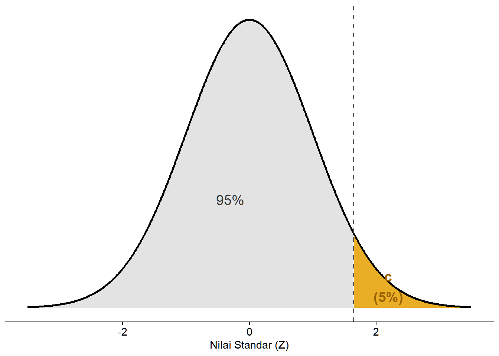
<p class="caption">(\#fig:fig-bab-5-right-tail-5pct)Ilustrasi area c (ekor kanan) sebesar 5% pada distribusi normal.</p>
</div>

*Kedua*, kita perlu memperhatikan area yang diwarnai biru pada Gambar \@ref(fig:bab-5-fig-z-table). Area tersebut sebenarnya adalah area **b** di sebelah kanan dengan besar $95%-50%=45%$ atau 0,45. Dengan demikian, kita perlu mencari nilai $Z$ yang sesuai dengan proporsi 0,45.

*Ketiga*, kita akan cari nilai yang paling mendekati dengan 0,45 di sel-sel tabel pada Gambar \@ref(fig:bab-5-fig-z-table). Didapatkan nilai $Z = 1,64$ (baris 1,6 dan kolom 0,04) atau $Z = 1,65$ (baris 1,6 dan kolom 0,05). Kita ambil nilai $Z = 1,64$.

*Keempat*, jabarkan kembali variabel $Z$ ini (berkisar `1,64`) ke unit mata uang yang senyata-nyatanya:

$$
\begin{align}
x &= 50.000 + (1,64 \cdot 10.000) \\
&= 50.000 + 16.400 \\
&= 66.450
\end{align}
$$

Ini membeberkan simpulan bahwa seorang mahasiswa akan tergolong di klaster "5% mahasiswa dengan perjalanan kampus tereksklusif" asalkan ia rutin mengeluarkan paling tidak Rp66.450 ribu per bulan.
:::


::: rmdexercise
## Soal Evaluasi 11 {.unnumbered}

[STP-4.2]{.capaian} *Suatu sampel pegawai ITERA berjumlah 286 orang yang mengukur jarak tempat tinggal mereka ke kampus menghasilkan rata-rata 7,90 km dan simpangan baku 6,42 km.*

Hitunglah seberapa sering sampel-sampel yang nilainya **lebih kecil** dari statistik sampel kita (rata-rata jarak 7,9 km) ditemukan. Lengkapi penjelasan Anda dengan ilustrasi grafik distribusi normalnya.

*Petunjuk:*

- *'seberapa sering' merujuk pada probabilitas.*
  
- *perhatikan betul frasa 'lebih kecil' pada soal dan kaitkan dengan posisi area yang diwarnai seperti pada Gambar \@ref(fig:fig-distribusi-normal-area-bc).*
:::

<!--chapter:end:05-pengantar-inferensial.Rmd-->

# Estimasi Parameter {#bab-6-estimasi-parameter}

::: rmdcapaian
### Capaian Pembelajaran {.unnumbered}

Setelah mempelajari bab ini, Anda diharapkan mampu memaknai interval kepercayaan estimasi sebuah parameter [STP-5.1]{.capaian}.
:::

Estimasi parameter adalah teknik dalam statistika inferensial untuk **memperkirakan nilai karakteristik populasi** (parameter) **berdasarkan data sampel** (statistik) [@healey2021statistics; @tjokropandojo2021pengantar]. Konsep dasar yang akan kita pelajari di antaranya:

1. perbedaan antara statistik dan parameter,
2. estimasi titik dan estimasi rentang, serta
3. tingkat kepercayaan (*confidence level*).

Selanjutnya, konsep-konsep dasar ini menjadi dasar untuk mempelajari **perhitungan estimasi parameter** untuk **proporsi** dan **rata-rata**, serta interpretasi hasil estimasi.

## Statistik vs. Parameter

Dalam statistika, kita akan sering menjumpai dua istilah penting, yaitu **statistik** dan **parameter**. Keduanya sama-sama merupakan ukuran kuantitatif yang digunakan untuk menggambarkan karakteristik data. Akan tetapi, perbedaannya terletak pada **sumber datanya**. Statistik diperoleh dari data **sampel**, sedangkan parameter adalah ukuran yang menggambarkan kondisi **populasi** secara keseluruhan [@tjokropandojo2021pengantar].

Karena parameter adalah ukuran untuk populasi, mengukurnya hanya bisa dilakukan dengan melibatkan seluruh populasi, yang disebut juga **sensus**. Karena sulit dilakukan, maka **statistik digunakan untuk mengestimasi parameter**.

Cara menyatakan ukuran statistik dan parameter, yakni menggunakan simbol-simbol matematis [@healey2021statistics], disajikan dalam tabel berikut.

<table class="table table-striped table-hover table-condensed table-responsive" style="width: auto !important; margin-left: auto; margin-right: auto;">
<caption>(\#tab:tab-simbol-statistik-parameter)Simbol-simbol yang Digunakan Untuk Statistik dan Parameter</caption>
 <thead>
  <tr>
   <th style="text-align:left;"> Ukuran </th>
   <th style="text-align:left;"> Statistik (Sampel) </th>
   <th style="text-align:left;"> Parameter (Populasi) </th>
  </tr>
 </thead>
<tbody>
  <tr>
   <td style="text-align:left;"> Rata-rata </td>
   <td style="text-align:left;"> $\bar{x}$ </td>
   <td style="text-align:left;"> $\mu$ </td>
  </tr>
  <tr>
   <td style="text-align:left;"> Simpangan baku </td>
   <td style="text-align:left;"> $s$ </td>
   <td style="text-align:left;"> $\sigma$ </td>
  </tr>
  <tr>
   <td style="text-align:left;"> Variansi </td>
   <td style="text-align:left;"> $s^2$ </td>
   <td style="text-align:left;"> $\sigma^2$ </td>
  </tr>
  <tr>
   <td style="text-align:left;"> Proporsi </td>
   <td style="text-align:left;"> $\hat{p}$ </td>
   <td style="text-align:left;"> $P$ </td>
  </tr>
  <tr>
   <td style="text-align:left;"> Jumlah nilai </td>
   <td style="text-align:left;"> $x$ </td>
   <td style="text-align:left;"> $X$ </td>
  </tr>
  <tr>
   <td style="text-align:left;"> Ukuran observasi </td>
   <td style="text-align:left;"> $n$ </td>
   <td style="text-align:left;"> $N$ </td>
  </tr>
</tbody>
</table>

::: rmdkasus
### Studi Kasus: Statistik vs Parameter {.unnumbered}

Mengingat kembali studi kasus pada bab sebelumnya, diketahui populasi seluruh mahasiswa aktif ITERA pada pertengahan tahun 2023 berjumlah 18.877 orang. Namun, karena keterbatasan biaya dan waktu, survei hanya dilakukan terhadap sebagian mahasiswa, yaitu sebanyak 428 orang sebagai sampel.

Misalkan kita ingin mengetahui rata-rata usia para mahasiswa tersebut. Dengan menghitung usia 428 responden tersebut, kita akan memperoleh rata-rata usianya sebesar 20,90 tahun. Angka ini merupakan sebuah **statistik** karena dihitung berdasarkan data sampel. Kita akan menggunakan simbol $\bar{x}$ untuk menerangkan rata-rata sampel ini, sehingga $\bar{x} = 20,90$ tahun.

Lalu, apa **parameter** dalam kasus ini? Parameternya adalah **nilai rata-rata usia yang sebenarnya dari keseluruhan 18.877 mahasiswa aktif ITERA** tersebut. Angka sesungguhnya ini kita simbolkan dengan $\mu$. Karena parameter hanya bisa diketahui dari sensus terhadap seluruh populasi, nilai $\mu$ ini tidak akan pernah kita ketahui persis jika sensus tidak pernah dilakukan.

Di sinilah statistik digunakan: kita memakai nilai statistik sampel ($\bar{x} = 20,90$) sebagai alat ukur untuk memperkirakan atau mengestimasi besaran parameter populasi ($\mu$).
:::

## Estimasi Titik vs. Estimasi Rentang

Karena kita jarang mengetahui nilai parameter dan lebih sering bisa memperoleh statistik, maka nilai parameter kita perkirakan dari nilai statistik. Proses menghasilkan perkiraan ini disebut **estimasi**. Estimasi berarti **memperkirakan nilai parameter** (populasi) berdasarkan **hasil perhitungan statistik** (sampel). Terdapat dua jenis estimasi yang umum digunakan, yaitu **estimasi titik** dan **estimasi rentang** [@tjokropandojo2021pengantar].

### Estimasi Titik

Estimasi titik (*point estimate*) adalah estimasi nilai suatu parameter hanya dengan **satu angka tunggal saja**. Angka ini dihasilkan dari statistik sampel yang kita kumpulkan [@kachigan1986statistical].

Ciri utama estimasi titik adalah ia hanya terdiri dari satu nilai tunggal. Karena hanya memiliki satu nilai saja, kemungkinan kesalahannya sangat besar, karena sangat mungkin nilai tersebut berbeda jauh dari parameter yang sebenarnya.

::: rmdkasus
### Studi Kasus: Keterbatasan Estimasi Titik {.unnumbered}

Melanjutkan contoh sebelumnya, estimasi titik dari rata-rata usia mahasiswa ITERA adalah sebesar 20,90 tahun. Angka 20,90 tahun ini kita peroleh dari 428 responden, lalu kita gunakan sebagai penduga untuk parameter rata-rata usia seluruh mahasiswa ITERA ($\mu$).

Namun, kita tidak bisa memastikan apakah benar rata-rata populasi seluruh mahasiswa *tepat sama* dengan 20,90 tahun. Mungkin saja rata-rata populasi sebenarnya (parameter) adalah mendekati 20,50 tahun, 21,40 tahun, atau nilai lainnya. Hal inilah yang digambarkan pada Gambar \@ref(fig:fig-ilustrasi-estimasi-titik-usia) berikut.

<div class="figure" style="text-align: center">
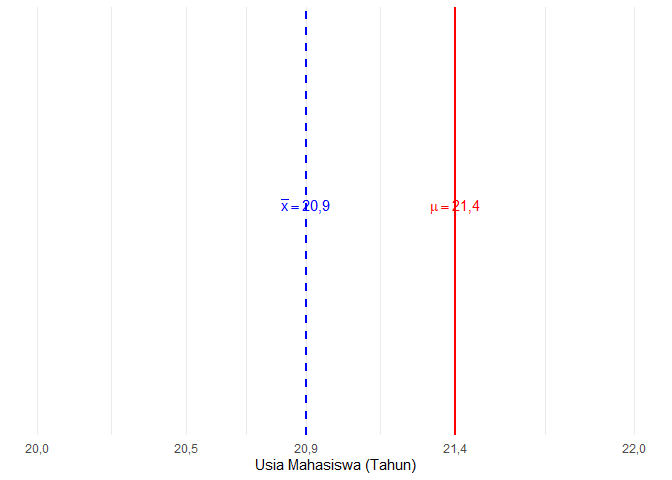
<p class="caption">(\#fig:fig-ilustrasi-estimasi-titik-usia)Ilustrasi Estimasi Titik Usia Mahasiswa</p>
</div>

Di sinilah keterbatasan estimasi titik terlihat; ia hanya menyajikan satu angka saja, sehingga sangat rentan meleset dari nilai parameter yang sebenarnya. Oleh karena itu, kita membutuhkan estimasi yang lebih "aman", yakni estimasi berupa rentang nilai yang akan kita pelajari pada bagian selanjutnya.
:::

### Estimasi Rentang

Berbeda dari estimasi titik, estimasi rentang (*interval estimate*) menetapkan parameter populasi dalam sebuah rentang nilai. Rentang inilah yang disebut interval kepercayaan (*confidence interval*), yang memuat nilai parameter populasi yang sebenarnya. Dengan demikian, kita bisa menebak parameter yang sebenarnya dengan kemungkinan yang lebih besar [@kachigan1986statistical].

Rentang kepercayaan dibentuk dari dua nilai batas, yaitu batas bawah (*lower limit*) dan batas atas (*upper limit*). Batas bawah dan batas atas ini diperoleh dari pengurangan dan penambahan margin kesalahan (*margin of error*) dari estimasi titik yang kita hitung dari sampel.

::: rmdkasus
### Studi Kasus: Keuntungan Estimasi Rentang {.unnumbered}

Telah disebutkan bahwa rentang kepercayaan diperoleh dari pengurangan dan penambahan margin kesalahan (*margin of error*) atas estimasi titik yang kita hitung dari sampel.

Melanjutkan contoh usia mahasiswa, alih-alih hanya menyatakan estimasi parameter sebesar 20,90 tahun, misalkan kita memperhitungkan pula *margin of error*-nya sebesar $\pm 0,60$ tahun. Hasil pengurangannya memperoleh batas bawah interval pada 20,30 tahun, dan penambahannya menghasilkan batas atas interval usia pada 21,50 tahun. 

Artinya, kita memperkirakan bahwa nilai parameter rata-rata usia seluruh mahasiswa ITERA berada pada rentang antara 20,30 tahun hingga 21,50 tahun. Karena tebakan parameter sesungguhnya ($\mu = 21,4$) berada di dalam wilayah ini, maka tebakan kita jauh lebih akurat.

<div class="figure" style="text-align: center">
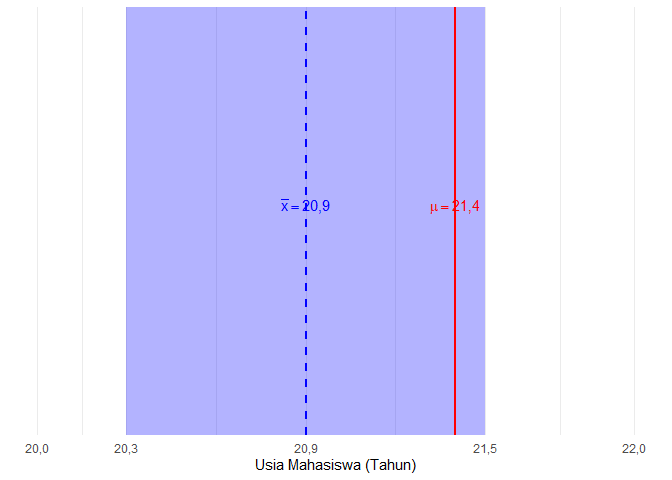
<p class="caption">(\#fig:fig-ilustrasi-estimasi-rentang-usia)Ilustrasi Estimasi Rentang Usia Mahasiswa</p>
</div>

Estimasi ini jauh lebih mendekati kebenaran dibandingkan hanya menyebut estimasi titik sebesar 20,90 tahun tadi. Memperhitungkan ketidakpastian dalam proses pengambilan sampel dengan batas-batas ini membuat kita menemukan rentang parameter seperti yang diilustrasikan oleh area arsir berwarna biru pada Gambar \@ref(fig:fig-ilustrasi-estimasi-rentang-usia) tersebut.
:::

## Konsep Perhitungan Rentang Kepercayaan Sebagai Estimasi Rentang

**Rentang kepercayaan** atau **interval kepercayaan** *(confidence interval)* adalah bentuk estimasi rentang dalam statistika inferensial yang merupakan **estimasi titik** ($\bar{x}$ atau $\hat{p}$) **yang kita kurangkan dan tambahkan dengan** ***margin of error*** (MoE) [@healey2021statistics]. Jadi, rumus dasar untuk rentang kepercayaan adalah berikut.

$$
\begin{equation}
c.i. = \text{estimasi titik} \pm MoE
(\#eq:confidence-interval)
\end{equation}
$$

Sedangkan $MoE$ sendiri sebenarnya adalah perkalian antara **nilai kritis** dan *standard error*. Dengan demikian, rumus dasar *confidence interval* sebenarnya adalah:

$$
MoE = Z_{\alpha/2} \times \text{S.E.}
(\#eq:margin-of-error)
$$

Maka, dengan mensubstitusi $MoE$ dengan persamaan \@ref(eq:margin-of-error), persamaan \@ref(eq:confidence-interval) menjadi:

$$
c.i. = \text{estimasi titik} \pm (Z_{\alpha/2} \times \text{S.E.})
(\#eq:confidence-int-verbose)
$$

Nilai kritis ($Z_{\alpha/2}$) ini adalah nilai yang berkaitan dengan **tingkat kepercayaan** dan **signifikansi** ($\alpha$). Singkatnya, tingkat kepercayaan + signifikansi harus menghasilkan angka 100%. Konsepnya akan kita dalami di subbab \@ref(tingkat-kepercayaan).

Nilai kritis dicari dengan membagi 2 terlebih dahulu nilai $\alpha$ di kiri dan kanan kurva distribusi statistik, kemudian menemukan nilai yang menjadi pembatasnya dengan tabel nilai Z seperti yang sudah kita lakukan pada \@ref(untuk-z-kritis). Gambar \@ref(fig:fig-ilustrasi-z-alpha) berikut mengilustrasikan pencarian nilai kritis pada signifikansi sebesar 10%.

<div class="figure" style="text-align: center">
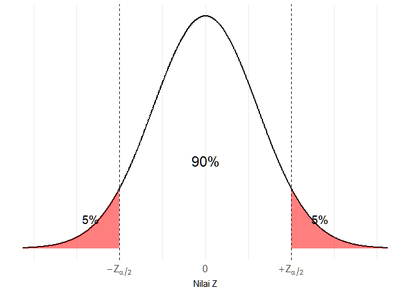
<p class="caption">(\#fig:fig-ilustrasi-z-alpha)Ilustrasi Nilai Kritis Z pada Distribusi Normal, contoh $lpha = 10%$</p>
</div>

Dalam bab ini kita akan mempelajari perhitungan rentang kepercayaan untuk parameter **rata-rata** ($\mu$) dan **proporsi** ($P$).

### Perhitungan Rentang Kepercayaan Rata-rata

Kita akan mulai dengan estimasi parameter untuk variabel numerik, yakni rata-rata. Estimasi parameter rata-rata, berarti kita memperkirakan nilai rata-rata populasi berdasarkan nilai rata-rata yang diperoleh dari sampel [@kachigan1986statistical].

Dari sampel ini diperoleh sebuah nilai rata-rata ($\bar{x}$) yang berfungsi sebagai estimasi titik. Estimasi titik ini kita tambah dan kurangkan dengan MoE agar menjadi rentang [@healey2021statistics].

Rumus S.E. untuk rata-rata ditunjukkan oleh Persamaan \@ref(eq:konsep-se-pake-sd), maka, berdasarkan Persamaan \@ref(eq:margin-of-error), MoE untuk interval rata-rata adalah:

$$
MoE = Z_{\alpha/2} \times \frac{s}{\sqrt{n}}
(\#eq:ci-mean)
$$

dengan keterangan: $s$ adalah simpangan baku sampel dan $n$ adalah ukuran sampel. Dengan demikian, rumus lengkap untuk perhitungan rentang kepercayaan rata-rata adalah:

$$
c.i. = \bar{x} \pm Z_{\alpha/2} \frac{s}{\sqrt{n}}
(\#eq:ci-mean-verbose)
$$

::: rmdkasus
### Studi Kasus: Menghitung Rata-rata Jarak Tempat Tinggal Mahasiswa ITERA Berdasarkan Jenis Tempat Tinggalnya {.unnumbered}

Diketahui dari hasil survei terhadap 333 sampel mahasiswa ITERA, sebaran jenis tempat tinggalnya, beserta statistik jarak tempat tinggalnya, ditampilkan sebagai berikut.

<table class="table table-striped table-hover table-condensed table-responsive" style="width: auto !important; margin-left: auto; margin-right: auto;">
<caption>(\#tab:tabel-komponen-ci-jarak)Statistik Jarak Tempat Tinggal per Jenis Hunian</caption>
 <thead>
  <tr>
   <th style="text-align:left;"> Jenis Tempat Tinggal </th>
   <th style="text-align:center;"> $n$ </th>
   <th style="text-align:center;"> $\bar{x}$ (km) </th>
   <th style="text-align:center;"> $s$ (km) </th>
  </tr>
 </thead>
<tbody>
  <tr>
   <td style="text-align:left;"> Kos Bersama-sama </td>
   <td style="text-align:center;"> 25 </td>
   <td style="text-align:center;"> 4,91 </td>
   <td style="text-align:center;"> 2,87 </td>
  </tr>
  <tr>
   <td style="text-align:left;"> Kos Sendiri </td>
   <td style="text-align:center;"> 200 </td>
   <td style="text-align:center;"> 4,78 </td>
   <td style="text-align:center;"> 2,21 </td>
  </tr>
  <tr>
   <td style="text-align:left;"> Rumah Mengontrak Bersama </td>
   <td style="text-align:center;"> 107 </td>
   <td style="text-align:center;"> 4,79 </td>
   <td style="text-align:center;"> 2,13 </td>
  </tr>
  <tr>
   <td style="text-align:left;"> Rumah Mengontrak Pribadi </td>
   <td style="text-align:center;"> 1 </td>
   <td style="text-align:center;"> 3,90 </td>
   <td style="text-align:center;"> NA </td>
  </tr>
</tbody>
</table>

Kita akan menghitung rentang kepercayaan rata-rata jarak tempat tinggal mahasiswa untuk setiap jenis tempat tinggal dengan tingkat kepercayaan 95%.

**Jawaban:**

**Langkah-1: Menghitung Statistik**

Dari Tabel \@ref(tab:tabel-komponen-ci-jarak) tersebut kita dapat melihat bahwa rata-rata jarak tempat tinggal mahasiswa sudah tersedia dan bervariasi menurut jenis hunian.

**Langkah-2: Menentukan Nilai Kritis Z**

Langkah berikutnya adalah menentukan nilai kritis $Z_{\alpha/2}$ sesuai dengan tingkat kepercayaan yang digunakan. Nilai kritis $Z_{\alpha/2}$ diperoleh dari distribusi normal baku.

<div class="figure" style="text-align: center">

<p class="caption">(\#fig:fig-membagi-dua-nilai-alpha-mean)Membagi Dua Nilai Alpha</p>
</div>

Nilai tingkat kepercayaan yang kita gunakan adalah luas area di bawah kurva yang berwarna biru terang, yaitu 0,950. Artinya, kita menggunakan nilai $\alpha$ sebesar 0,05 atau 5%. Nilai $\alpha$ ini dibagi 2 ($\alpha/2$) dan ditempatkan di kiri dan kanan kurva normal. Dengan demikian, luas area biru terang menjadi bernilai $0,95 / 2 = 0,475$ dari titik 0 di tengah.

Nilai Z diperoleh dari area seluas 0,475 di bawah kurva normal mulai dari titik tengah (0). Dengan mencocokkan pada tabel distribusi normal, didapatkan nilai $Z=1,96$, yang berasal dari kombinasi angka 1,9 pada sisi vertikal dan 0,06 pada sisi horizontal tabel.

<div class="figure" style="text-align: center">

<p class="caption">(\#fig:fig-mencari-nilai-z-mean)Mencari Nilai Z</p>
</div>

**Langkah-3: Menghitung Rentang Kepercayaan dan Menarik Kesimpulan**

Dengan $Z_{\alpha/2} = 1,96$, rentang kepercayaan dihitung per kategori menggunakan simpangan baku dan jumlah objek masing-masing. Mensubstitusi nilai-nilai per kategori dari Tabel \@ref(tab:tabel-komponen-ci-jarak) ke dalam rumus Persamaan \@ref(eq:ci-mean-verbose) menghasilkan:

**Kos Sendiri** ($n = 200$, $\bar{x} = 4,78$, $s = 2,21$):

$$
\begin{aligned}
c.i. &= 4,78 \pm 1,96 \times \frac{2,21}{\sqrt{200}} \\
&= 4,78 \pm 0,3062 \\
&= [4,47 \text{ km};\ 5,09 \text{ km}]
\end{aligned}
$$

**Rumah Mengontrak Bersama** ($n = 107$, $\bar{x} = 4,79$, $s = 2,13$):

$$
\begin{aligned}
c.i. &= 4,79 \pm 1,96 \times \frac{2,13}{\sqrt{107}} \\
&= 4,79 \pm 0,4038 \\
&= [4,39 \text{ km};\ 5,19 \text{ km}]
\end{aligned}
$$

**Kos Bersama-sama** ($n = 25$, $\bar{x} = 4,91$, $s = 2,87$):

$$
\begin{aligned}
c.i. &= 4,91 \pm 1,96 \times \frac{2,87}{\sqrt{25}} \\
&= 4,91 \pm 1,1252 \\
&= [3,78 \text{ km};\ 6,04 \text{ km}]
\end{aligned}
$$

***Catatan:** Kategori Rumah Mengontrak Pribadi hanya memiliki 1 responden ($n = 1$), sehingga simpangan baku tidak dapat dihitung dan rentang kepercayaan tidak dapat diestimasi. Kategori ini tidak disertakan dalam perhitungan.*

Dari ketiga hasil di atas, terlihat bahwa rata-rata jarak tempat tinggal ketiga jenis hunian relatif serupa, berkisar antara **4,47 km hingga 5,19 km** dari kampus. Perbedaan yang paling mencolok terletak pada lebar rentang: kategori **Kos Bersama-sama** memiliki rentang paling lebar ($\pm 1,13$ km) karena ukuran sampelnya jauh lebih kecil ($n = 25$), yang mencerminkan ketidakpastian estimasi yang lebih besar. Sebaliknya, **Kos Sendiri** dan **Rumah Mengontrak Bersama** memiliki rentang lebih sempit karena jumlah respondennya lebih besar.

<div class="figure" style="text-align: center">
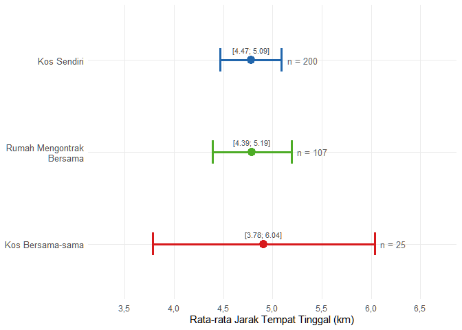
<p class="caption">(\#fig:fig-ci-jarak-per-hunian)Interval Kepercayaan 95% Rata-rata Jarak Tempat Tinggal per Jenis Hunian</p>
</div>

:::


Jawablah soal berikut untuk melatih keterampilan Anda menghitung rentang kepercayaan rata-rata.

::: rmdexercise
## Soal Evaluasi 12 {.unnumbered}

Dari suatu sampel dosen ITERA berjumlah 73 orang diperoleh rata-rata usianya adalah 30 tahun dan simpangan bakunya 2,9 tahun. Anda diminta menggunakan probabilitas galat, $\alpha = 5\%$ [STP-5.1]{.capaian}

   a. Berapakah tingkat kepercayaan (*confidence level*) yang digunakan?
   b. Berapakah nilai standar (Z-*score*) yang kita pakai?
   c. Hitunglah rentang kepercayaan (*confidence interval*) rata-rata usia seluruh dosen ITERA menggunakan data sampel kita tadi.
:::


### Perhitungan Rentang Kepercayaan Proporsi

Perhitungan rentang kepercayaan proporsi hanya berbeda pada rumus S.E.-nya [@kachigan1986statistical]. S.E.untuk distribusi statistik sampel proporsi dihitung dengan rumus berikut.

$$
\text{S.E.} = \sqrt{\frac{\hat{p}(1-\hat{p})}{n}}
(\#eq:se-proporsi)
$$

dengan keterangan: $\hat{p}$ adalah proporsi sampel dan $n$ ukuran sampel [@healey2021statistics]. Maka, rumus rentang kepercayaan untuk statistik proporsi adalah:

$$
c.i. = \hat{p} \pm Z_{\alpha/2} \sqrt{\frac{\hat{p}(1-\hat{p})}{n}}
(\#eq:confidence-interval-proportion-verbose)
$$

::: rmdkasus
### Studi Kasus: Proporsi Mahasiswa Berdasarkan Jenis Tempat Tinggal {.unnumbered}

Masih berdasarkan data dari kasus sebelumnya, kita akang menghitung parameter proporsi mahasiswa yang tinggal berdasarkan jenis tempat tinggal, akan tetapi, kita menurunkan tingkat kepercayaan kita menjadi 91%.

**Jawaban:**

**Langkah-1: Menghitung Statistik**

Langkah awal dalam estimasi parameter proporsi adalah menghitung proporsi sampel berdasarkan data hasil survei. Proporsi sampel ($\hat{p}$) dihitung dengan:

$$\hat{p} = \frac{x}{n}$$

dengan:

- $x$ = jumlah responden yang memiliki karakteristik tertentu,
- $n$ = jumlah seluruh responden.

Berdasarkan Tabel \@ref(tab:tabel-komponen-ci-jarak), kita dapat menghitung proporsi tiap-tiap kategori jenis tempat tinggal. Hasilnya ditunjukkan oleh Tabel \@ref(tab:tabel-proporsi-jenis-tempat-tinggal) berikut.

<table class="table table-striped table-hover table-condensed table-responsive" style="width: auto !important; margin-left: auto; margin-right: auto;">
<caption>(\#tab:tabel-proporsi-jenis-tempat-tinggal)Proporsi Mahasiswa Berdasarkan Jenis Tempat Tinggal</caption>
 <thead>
  <tr>
   <th style="text-align:left;"> Jenis Tempat Tinggal </th>
   <th style="text-align:center;"> $n$ </th>
   <th style="text-align:center;"> $\hat{p}$ </th>
  </tr>
 </thead>
<tbody>
  <tr>
   <td style="text-align:left;"> Kos Bersama-sama </td>
   <td style="text-align:center;"> 25 </td>
   <td style="text-align:center;"> 0,075 </td>
  </tr>
  <tr>
   <td style="text-align:left;"> Kos Sendiri </td>
   <td style="text-align:center;"> 200 </td>
   <td style="text-align:center;"> 0,601 </td>
  </tr>
  <tr>
   <td style="text-align:left;"> Rumah Mengontrak Bersama </td>
   <td style="text-align:center;"> 107 </td>
   <td style="text-align:center;"> 0,321 </td>
  </tr>
  <tr>
   <td style="text-align:left;"> Rumah Mengontrak Pribadi </td>
   <td style="text-align:center;"> 1 </td>
   <td style="text-align:center;"> 0,003 </td>
  </tr>
</tbody>
</table>

**Langkah-2: Menentukan Nilai Kritis Z**

Sama konsepnya seperti kasus sebelumnya, sebelumnya kita akan menghitung terlebih dahulu nilai $\alpha$. Karena tingkat kepercayaan kita 91%, maka $\alpha=9\%$ atau $0,09$. Gambar \@ref(fig:fig-membagi-dua-nilai-alpha-proporsi-91) berikut menunjukkan area yang kita cari nilai $Z_{\alpha/2}$-nya, yakni $0,405$. 

<div class="figure" style="text-align: center">
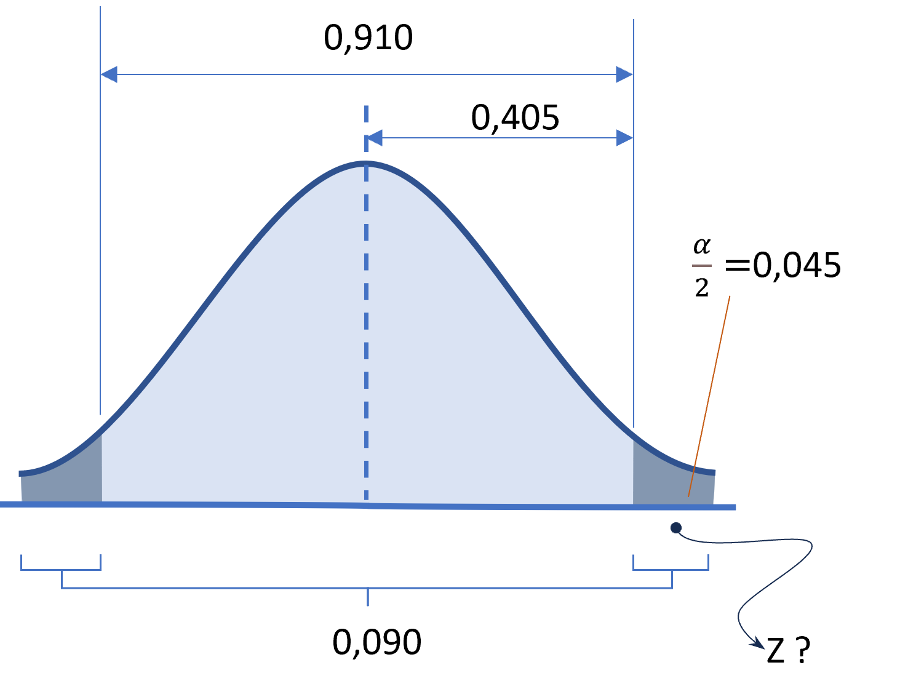
<p class="caption">(\#fig:fig-membagi-dua-nilai-alpha-proporsi-91)Membagi Dua Nilai Alpha</p>
</div>

Dari tabel nilai Z di Gambar \@ref(fig:bab-5-fig-z-table), kita dapat memperoleh nilai Z untuk tingkat kepercayaan 91% sebagai berikut.

<div class="figure" style="text-align: center">

<p class="caption">(\#fig:fig-mencari-nilai-z-proporsi-91)Mencari Nilai Z</p>
</div>

**Langkah-3: Menghitung Rentang Kepercayaan dan Menarik Kesimpulan**

Setelah seluruh komponen perhitungan ditentukan, langkah terakhir adalah menghitung rentang kepercayaan proporsi untuk setiap kategori. Nilai kritis yang digunakan adalah $Z_{\alpha/2} = 1,31$ dan $n = 333$. Nilai-nilai $\hat{p}$ dari Tabel \@ref(tab:tabel-proporsi-jenis-tempat-tinggal) disubstitusikan ke dalam rumus Persamaan \@ref(eq:confidence-interval-proportion-verbose) untuk masing-masing kategori.

**Kos Sendiri** ($\hat{p} = 0,601$):

$$
\begin{aligned}
c.i. &= 0,601 \pm 1,31 \times \sqrt{\frac{0,601(1 - 0,601)}{333}} \\
&= 0,601 \pm 0,0351 \\
&= [56,59\%;\ 63,61\%]
\end{aligned}
$$

**Rumah Mengontrak Bersama** ($\hat{p} = 0,321$):

$$
\begin{aligned}
c.i. &= 0,321 \pm 1,31 \times \sqrt{\frac{0,321(1 - 0,321)}{333}} \\
&= 0,321 \pm 0,0335 \\
&= [28,75\%;\ 35,45\%]
\end{aligned}
$$

**Kos Bersama-sama** ($\hat{p} = 0,075$):

$$
\begin{aligned}
c.i. &= 0,075 \pm 1,31 \times \sqrt{\frac{0,075(1 - 0,075)}{333}} \\
&= 0,075 \pm 0,0189 \\
&= [5,61\%;\ 9,39\%]
\end{aligned}
$$

*Catatan: Kategori Rumah Mengontrak Pribadi ($n = 1$) tidak disertakan karena tidak representatif.*

Dari ketiga hasil di atas, terlihat bahwa **Kos Sendiri** mendominasi dengan estimasi proporsi antara 56,59% hingga 63,61% dari seluruh mahasiswa yang menyewa hunian. **Rumah Mengontrak Bersama** berada di posisi kedua (28,75%–35,45%), disusul **Kos Bersama-sama** (5,61%–9,39%). Temuan ini menunjukkan bahwa mayoritas mahasiswa ITERA memilih hunian sewa mandiri.

<div class="figure" style="text-align: center">

<p class="caption">(\#fig:fig-ci-proporsi-per-hunian)Interval Kepercayaan 91% Proporsi Mahasiswa per Jenis Hunian</p>
</div>

:::

Jawablah soal berikut untuk melatih keterampilan Anda menghitung rentang kepercayaan proporsi.

::: rmdexercise
## Soal Evaluasi 13  {.unnumbered}

Diketahui bahwa proporsi pengguna mobil pribadi dari suatu sampel mahasiswa berjumlah 429 orang adalah 0,04. [STP-5.1]{.capaian}

   a. Apabila kita menggunakan *confidence level* 93%, berapakah tingkat signifikansi kita?
   b. Berapakah Z-*score* yang kita pakai?
   c. Hitunglah *confidence interval* proporsi pengguna mobil pribadi pada populasi mahasiswa tersebut.
:::


## Lebih Dalam tentang Tingkat Kepercayaan (*Confidence Level*) {#tingkat-kepercayaan}

Kita sudah mengetahui bahwa tingkat kepercayaan penting dalam perhitungan rentang kepercayaan. Di bagian ini, kita akan menganalisis lebih dalam apa yang dinyatakan oleh angka tingkat kepercayaan dan pengaruhnya terhadap perhitungan rentang kepercayaan.

Sebelum lebih lanjut, kita harus sadar bahwa **tingkat kepercayaan (*confidence level*, CL) berbeda dengan rentang kepercayaan (*confidence interval*)**. Jika rentang kepercayaan adalah hasil berupa interval nilai yang memperkirakan posisi parameter populasi, maka tingkat kepercayaan adalah **ukuran seberapa yakin kita terhadap interval tersebut** [@chase2000general].

Apa yang kita yakini? Yang kita yakini adalah **dimuatnya nilai parameter dalam interval yang kita hasilkan**. Keyakinan ini dinyatakan dalam bentuk **probabilitas** yang merupakan angka persentase atau proporsi. Misalnya pada kasus rata-rata jarak tempat tinggal mahasiswa yang mengekos sendiri. Tingkat kepercayaan 95% (0,95) bermakna **dari 100 sampel yang mungkin diambil, sebanyak 95% sampel akan memuat nilai parameter**. Dalam kasus ini, maka kita yakin bahwa **95% sampel yang kita ambil, yang menghasilkan rentang 4,47 km hingga 5,09 km, mencakup nilai parameter sebenarnya**.

Banyak orang salah dalam menginterpretasikan angka tingkat kepercayaan. Simak pembahasan berikut untuk memahaminya.

::: rmdnote
### Catatan: Salah Kaprah Tingkat Kepercayaan {.unnumbered}

Tingkat kepercayaan sering disalahmaknai sebagai **peluang parameter ada di dalam interval**. Jadi, nilai tingkat kepercayaan 90% bukan berarti kita 90% yakin bahwa nilai parameter ada dalam rentang kepercayaan kita. Nilai parameter populasi itu tetap, misalnya rata-rata tinggi badan seluruh mahasiswa memang punya satu angka pasti, hanya saja kita tidak tahu berapa nilainya. Oleh karena itu, kita mengambil sampel yang representatif dan menghitung statistiknya untuk mengestimasi parameter.

Dengan tingkat kepercayaan 90%, artinya kita mengatakan bahwa sampel kita tersebut hanya akan salah sebanyak 10 kali pengambilan saja dari 100 kali pengambilan yang mungkin. Dengan kata lain, 90 sampel tersebut akan benar-benar berisi nilai parameter populasi yang sebenarnya.
:::


Satu lagi besaran yang berpengaruh terhadap perhitungan rentang kepercayaan dalam statistika inferensial adalah **tingkat kesalahan** atau **signifikansi**. Dalam literatur statistika berbahasa Inggris, istilah ini disebut juga ***error term*** atau ***significance level***, atau ***significance*** saja [@chase2000general]. Karena dalam statistika proses estimasi selalu melibatkan sampel yang pengambilannya tidak pernah pasti, pasti akan terdapat peluang kesalahan. Peluang kesalahan inilah yang menjadi pengertian dari tingkat kesalahan atau signifikansi tersebut. Peluang kesalahan dilambangkan dengan $\alpha$ (/alfa/).

Dengan demikian, secara matematis, tingkat kepercayaan dituliskan sebagai $1-\alpha$. Apabila $\alpha = 0,05$, maka tingkat kepercayaan adalah $1-0,05 = 0,95$ atau 95%. Ini artinya, kita dapat mengatakan bahwa 95% dari 100 kali sampel yang diambil akan menghasilkan interval yang mencakup nilai parameter, sedangkan 5% sisanya tidak.

Adapun nilai $\alpha$ yang umum digunakan dalam penelitian adalah 0,10 (10%), 0,05 (5%), dan 0,01 (1%), tergantung seberapa besar tingkat keyakinan yang dikehendaki peneliti.


Bagaimana kaitan antara tingkat kepercayaan dengan rentang kepercayaan yang dihasilkan? Simak kasus berikut untuk memahaminya.

::: rmdkasus
### Studi Kasus: Pengaruh Tingkat Kepercayaan terhadap Lebar Rentang Kepercayaan {.unnumbered}

Perbedaan tingkat kepercayaan memengaruhi lebar interval estimasi. Gambar \@ref(fig:fig-pengaruh-nilai-tingkat-kepercayaan) menunjukkan hasil estimasi parameter tinggi badan mahasiswa yang nilai statistiknya adalah 165 cm, simpangan baku 3 cm, dan ukuran sampel 200 orang.

<div class="figure" style="text-align: center">
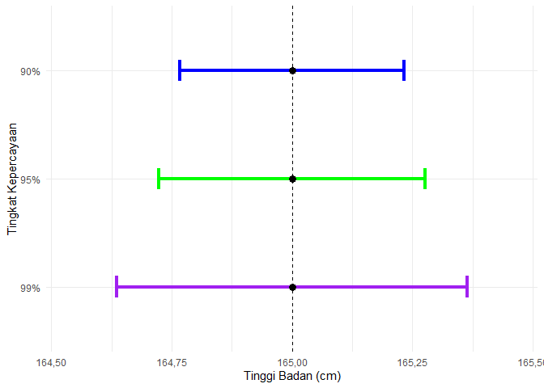
<p class="caption">(\#fig:fig-pengaruh-nilai-tingkat-kepercayaan)Ilustrasi Pengaruh Nilai Tingkat Kepercayaan Terhadap Ukuran Rentang</p>
</div>

Garis hitam putus-putus pada posisi 165 menggambarkan estimasi titik, yaitu satu nilai hasil dari sampel [@chase2000general]. Garis horisontal biru, hijau, dan ungu menggambarkan interval kepercayaan dengan tingkat kepercayaan yang berbeda. Pada tingkat kepercayaan 90% (biru), intervalnya sempit, yakni 164,65-165,35 cm. Pada tingkat kepercayaan 95% (hijau), intervalnya sedikit lebih lebar, yaitu 164,58-165,42 cm. Sementara pada tingkat kepercayaan 99% (ungu), interval semakin melebar menjadi 164,45-165,55 cm. Dari sini terlihat bahwa semakin tinggi tingkat kepercayaan, semakin lebar rentang yang dihasilkan.

**Interpretasi**: menaikkan tingkat kepercayaan artinya memperbesar cakupan area probabilitas pada kurva distribusi statistik (ingat aturan empiris pada Gambar \@ref(fig:fig-bab-5-aturan-689599)). Cakupan area probabilitas yang semakin besar berarti menambah cakupan nilai Z di distribusi tersebut.

Karena nilai Z mencerminkan nilai statistik yang salah satunya adalah parameter yang kita perkirakan, tingkat kepercayaan yang lebih besar memperlebar rentang perkiraan kita sehingga nilai parameter dapat tercakup dan "tertangkap" di dalam rentang perkiraan kita.
:::


## Kesimpulan: Interpretasi Estimasi Parameter

Interpretasi estimasi parameter berfokus pada pemahaman hasil berupa **rentang kepercayaan** atau *confidence interval* [@healey2021statistics]. Rentang ini menunjukkan **nilai-nilai yang mungkin menjadi parameter populasi**, berdasarkan data sampel yang diperoleh. Rentang kepercayaan tidak memberikan jawaban pasti mengenai nilai parameter, melainkan memberikan batas bawah dan batas atas yang menjadi perkiraan parameter tersebut dengan tingkat keyakinan tertentu.

Lebar rentang estimasi dapat menjadi indikator kualitas estimasi. Rentang yang sempit menandakan estimasi yang lebih presisi, yang biasanya terjadi karena ukuran sampel cukup besar atau error yang relatif kecil. Sebaliknya, rentang yang lebar menunjukkan tingkat ketidakpastian yang lebih besar, sering kali disebabkan oleh ukuran sampel yang terlalu kecil atau variasi data yang tinggi. Sehingga, pemilihan jumlah sampel dan pengendalian error sangat memengaruhi kualitas estimasi.

Konsep tingkat kepercayaan membantu menjelaskan ketidakpastian dalam estimasi. Misalnya, pada tingkat kepercayaan 95% berarti ada kemungkinan 95 dari 100 sampel yang diambil akan menghasilkan interval yang mencakup parameter populasi sebenarnya. Sebaliknya, 5 dari 100 sampel (atau 5%) akan menghasilkan interval yang tidak mencakup parameter tersebut. Jika hasil sampel berbeda dari dugaan populasi, maka perbedaan itu dapat dijelaskan sebagai bagian dari kemungkinan error yang sudah diperhitungkan dalam tingkat kepercayaan.

Pada akhirnya, hasil estimasi parameter bukanlah angka yang mutlak, melainkan perkiraan yang disertai dengan tingkat kepastian tertentu. Interval kepercayaan memberikan ruang toleransi bagi ketidakpastian yang muncul dari proses pengambilan sampel, sekaligus menjadi alat bantu dalam pengambilan keputusan berbasis data.

<!--chapter:end:06-estimasi-parameter.Rmd-->

# Uji Hipotesis Parameter Satu Populasi {#bab-7-uji-hipotesis-satu-populasi}

::: rmdcapaian
### Capaian Pembelajaran {.unnumbered}

Setelah mempelajari bab ini, Anda diharapkan mampu memaknai hasil dari pengujian hipotesis parameter satu populasi pada suatu kasus [STP-6.1]{.capaian}
:::

## Konsep Dasar Uji Hipotesis Parameter {#konsep-dasar-uji-hipotesis-1samp}

Analisis statistika inferensial dengan uji hipotesis parameter digunakan untuk **memperkirakan nilai dari parameter** melalui **pengujian hipotesis nilai sebuah parameter** berdasarkan informasi yang diperoleh dari sampel, atau seperti yang telah kita pelajari, disebut **statistik** [@healey2021statistics]. Hipotesis sendiri dapat dipahami sebagai **dugaan awal mengenai suatu kondisi, nilai, atau keadaan parameter**. Dalam metode ilmiah, hipotesis berasal dari teori, penelitian sebelumnya, atau klaim tertentu yang ingin diuji  [@ewing2020basic; @healey2021statistics].

Melalui pengujian hipotesis, inferensi dilakukan dengan menarik kesimpulan terhadap hasil pengujian hipotesis kita berdasarkan statistik yang kita peroleh (Gambar \@ref(fig:fig-ilustrasi-hipotesis)). Secara sederhana, analisis diawali dengan pertanyaan: "Apakah nilai parameter $\mu = b$?". Bentuk pertanyaan ini bisa kita ubah juga menjadi bentuk pernyataan, atau **hipotesis**, yakni "nilai parameter kita $b$ ($\mu = b$)." Kesimpulan yang kita akan ambil nanti hanya ada di antara dua pilihan: **menerima** atau **menolak** hipotesis tersebut.

<div class="figure" style="text-align: center">

<p class="caption">(\#fig:fig-ilustrasi-hipotesis)Ilustrasi Alur Hubungan Parameter, Sampel, dan Inferensinya</p>
</div>

::: rmdkasus
### Studi Kasus: Alur Logika Evaluasi Makan Bergizi Gratis (MBG) {.unnumbered}

Sebagai pelengkap dari ilustrasi alur pengujian di atas, mari perhatikan kasus evaluasi kepuasan program Makan Bergizi Gratis (MBG). Pemerintah ingin mengetahui rata-rata tingkat kepuasan dari seluruh penerima manfaat (populasi) di mana nilai sejatinya belum diketahui ($\mu = \,?$). Pemerintah memiliki **pertanyaan evaluasi**: *"Apakah benar program MBG memberikan rata-rata skor kepuasan hingga mencapai nilai standar 80?"* Pertanyaan ini kemudian disusun menjadi **pernyataan sasaran (hipotesis)** bahwa "Rata-rata kepuasan populasi adalah 80" ($\mu = 80$). 

Untuk membuktikan apakah pernyataan asumsi ini bisa dipertahankan, dilakukan **pengambilan sampel** secara acak terhadap 200 responden. Dari data sampel tersebut, diperoleh nilai **statistik** rata-rata kepuasan sebesar 95 ($\bar{x} = 95$). Nilai bukti dari data sampel ($\bar{x}=95$) inilah yang digunakan sebagai landasan analisis (**uji**) untuk mempertanyakan keabsahan dari klaim awal ($\mu=80$). Puncak dari uji ini bermuara pada **kesimpulan**: yakni apakah pernyataan sasaran dapat tetap dilanggengkan (diterima) atau justru harus digugurkan (*ditolak*) karena dibantah oleh bukti empiris.
:::

## Perbedaan Uji Hipotesis Parameter dengan Estimasi Parameter {#perbedaan-uji-hipotesis-estimasi-parameter}

Estimasi parameter dan uji hipotesis parameter **sama-sama bertujuan memperkirakan nilai parameter**. Akan tetapi, keduanya melakukannya  dengan cara yang berbeda. Estimasi parameter menghasilkan suatu **rentang nilai yang memuat parameter-parameter yang mungkin* bagi parameter populasi**. Pertanyaan yang dijawab berupa *"Berapa kira-kira nilai rata-rata populasi?"*

Sementara itu, uji hipotesis parameter berfokus pada **penerimaan atau penolakan dugaan** kita tentang hipotesis terhadap parameter. Pertanyaan yang dijawab berupa *"Jika saya menduga bahwa rata-rata populasi adalah $b$, apakah dugaan tersebut dapat diterima?"*

## Asumsi-asumsi yang Harus Dipenuhi dalam Menguji Hipotesis Parameter {#asumsi-dasar-uji-hipotesis}

Sebelum menguji hipotesis untuk parameter yang kita ingin inferensi, kita harus menyatakan sejumlah asumsi yang harus dipenuhi. Mengapa hal ini penting? Setiap alat uji statistik **dibangun di atas model probabilitas teoretis tertentu**. Apabila data kita melanggar asumsi-asumsi dasar tersebut, maka keakuratan perhitungan probabilitasnya (seperti perolehan p-value) akan terganggu, sehingga simpulan inferensi ke populasi menjadi tidak valid.

Secara umum, ada tiga asumsi yang harus dipenuhi dalam menguji hipotesis parameter, yaitu:

1. **Independensi**: Sampel harus diambil secara acak dan independen.
2. **Tingkat pengukuran**: Variabel yang diukur harus berada pada tingkat pengukuran yang sesuai dengan alat uji yang digunakan.
3. **Bentuk distribusi statistik**: Distribusi statistik (*sampling distribution*) berbentuk normal

::: rmdkasus
### Studi Kasus: Memeriksa Asumsi pada Evaluasi MBG {.unnumbered}

Mari kita perhatikan kembali kasus evaluasi program Makan Bergizi Gratis (MBG) yang melibatkan 200 responden sebelumnya. Apakah kasus tersebut terbukti memenuhi ketiga asumsi pengujian hipotesis?

1. **Independensi**: Pengambilan sampel 200 responden dilakukan secara **acak**. Artinya, setiap responden memiliki peluang yang sama untuk terpilih sehingga nilai satu observasi tidak terkait dengan observasi lainnya. Asumsi independensi terpenuhi.
2. **Tingkat pengukuran**: Variabel yang diukur adalah skor kepuasan, sebuah takaran numerik (seperti skor rata-rata $95$) dengan standar ukur yang konstan (interval-rasio). Asumsi tingkat pengukuran terpenuhi.
3. **Bentuk distribusi statistik**: Berhubung kita mengukur sampel berukuran besar ($n = 200$, lebih dari 100), Teorema Limit Sentral menjamin bahwa distribusi probabilitas nilai rata-ratanya mendekati distribusi normal secara praktis. Asumsi kenormalan kurva dapat terpenuhi.

Oleh karena seluruh prasyarat dasarnya terpenuhi, barulah tahapan inferensi berikutnya berhak kita lanjutkan secara ilmiah.
:::

## Hipotesis Kosong dan Hipotesis Alternatif {#hipotesis-kosong-dan-alternatif}

Sebagaimana yang sudah dibahas di subbab \@ref(konsep-dasar-uji-hipotesis-1samp) dan \@ref(perbedaan-uji-hipotesis-estimasi-parameter), inferensi dilakukan dengan menguji hipotesis yang mengandung pernyataan terhadap parameter, yakni **mana hipotesis yang bisa kita terima?**

Oleh karena kita harus memilih, maka minimal kita memiliki **dua** jenis (dan memang tidak lebih) hipotesis, yaitu **hipotesis kosong** ($H_0$) dan **hipotesis alternatif** ($H_1$ atau $H_a$) yang masing-masing akan dijelaskan dengan rinci sebagai berikut.

### Hipotesis Kosong {#konsep-hipotesis-kosong}

Hipotesis kosong *(null hypothesis)* muncul dari prinsip ilmiah bahwa **pengetahuan harus dapat dibuktikan oleh data**. Konsekuensinya, peneliti tidak bisa langsung membenarkan suatu klaim atau fenomena baru secara sepihak sebelum memiliki bukti empiris (data). Oleh karena itu, prosedur yang paling logis adalah menetapkan hipotesis kosong sebagai pijakan awal; yakni sebuah kerangka netral (*status quo*) yang berasumsi bahwa dugaan baru tersebut belum terbukti dan kondisi yang ada diasumsikan tidak mengalami perubahan dari standar umumnya.

Di sinilah statistik hasil pengumpulan data memainkan perannya: ia tidak digunakan untuk menyusun pernyataan hipotesis kosong itu sendiri, melainkan didatangkan belakangan sebagai **alat bukti** untuk menguji apakah *status quo* tersebut masih layak dipertahankan atau justru sangat lemah sehingga harus ditolak [@healey2021statistics].

Dalam pengertian matematis, hipotesis kosong yang merupakan kondisi netral atau status quo ini dinyatakan dengan menggunakan simbol persamaan ($=$). Oleh karena itu, penulisan hipotesis kosong selalu menggunakan simbol persamaan, misalnya $\mu = \mu_0$ atau $P = P_0$. Secara umum, penulisan hipotesis nol adalah:

$$
H_0 : \text{parameter} = \text{nilai dugaan}
(\#eq:bentuk-umum-h0)
$$

Secara khusus, jika kita menyatakan hipotesis parameter rata-rata dan proporsi, kita menyebut $\text{nilai dugaan}$ ini dengan notasi sesuai parameternya dan diberi *subscript* $0$.

$$
\begin{aligned}
&H_0 : \mu = \mu_0, \\
&H_0 : P = P_0
\end{aligned}
(\#eq:bentuk-khusus-h0)
$$


::: rmdkasus
### Studi Kasus: Menentukan Hipotesis Kosong pada Evaluasi MBG {.unnumbered}

Misalkan kita memiliki pertanyaan evaluasi: *"Apakah benar bahwa program MBG berhasil dengan memberikan kepuasan kepada masyarakat?"*. Kita pun menetapkan nilai 80 sebagai ambang kepuasan masyarakat. Dalam hal ini, ada dua kemungkinan kondisi yang terjadi: 

1) program tidak memberikan kepuasan kepada masyarakat sehingga rata-rata nilai 80 (atau mungkin kurang); atau
2) program berhasil memberikan kepuasan kepada masyarakat sehingga rata-rata nilai lebih dari 80.

Kemungkinan pertama, yaitu "program tidak memberikan kepuasan kepada masyarakat", menggambarkan kondisi netral atau tidak ada perbedaan. Oleh karena itu, pernyataan ini dijadikan sebagai hipotesis kosong ($H_0$) dan dituliskan dengan simbol persamaan ($=$). Secara matematis, hipotesis kosong untuk rata-rata skor kepuasan ini dapat dinyatakan sebagai berikut:

$$H_0: \mu = 80$$

Dalam kasus ini, karena kita menetapkan nilai minimal masyarakat "puas" adalah pada rata-rata skor = 80, dugaan terhadap rata-rata skor kepuasan populasi adalah 80, sehingga $\mu_0 = 80$.

:::

### Hipotesis Alternatif {#konsep-hipotesis-alternatif}

Sementara itu, hipotesis alternatif (*alternative hypothesis* $H_1$) adalah **klaim kita terhadap keadaan netral atau standar yang diasumsikan dalam hipotesis kosong** [@healey2021statistics]. Jika hipotesis kosong mewakili *status quo* bahwa "tidak ada yang terjadi", klaim dalam hipotesis alternatif justru menantang hal tersebut dengan menyatakan bahwa "ada sesuatu yang berubah atau berdampak" sehingga perlu dibuktikan. Dengan kata lain, hipotesis alternatif menyatakan adanya **perbedaan** yang ingin dibuktikan peneliti.

Hipotesis alternatif ini dapat berbentuk **tidak berarah**, misalnya hanya menyatakan "ada perbedaan" tanpa menyebutkan ke arah mana perbedaannya, atau **berarah**, yaitu menyatakan secara spesifik bahwa suatu kondisi "lebih besar", "lebih kecil", atau "lebih tinggi" dibandingkan standar yang ada.

Secara rinci ragam bentuk hipotesis alternatif ini adalah sebagai berikut [@tjokropandojo2021pengantar]:

1. Kasus **"tidak sama dengan" ($\neq$)** digunakan ketika dugaan hanya menyatakan "ada perbedaan", tanpa menyebutkan lebih besar atau lebih kecil.
2. Kasus **"lebih dari" ($>$)** digunakan ketika dugaan menyatakan bahwa parameter populasi lebih besar daripada nilai dugaan.
3. Kasus **"kurang dari" ($<$)** digunakan ketika dugaan menyatakan bahwa parameter populasi lebih kecil daripada nilai dugaan.

Adapun bentuk matematis dari hipotesis alternatif yang mungkin dipilih ditampilkan pada Tabel \@ref(tab:tab-bentuk-hipotesis-alternatif) berikut.

<table class="table table-striped table-hover table-condensed table-responsive" style="width: auto !important; margin-left: auto; margin-right: auto;">
<caption>(\#tab:tab-bentuk-hipotesis-alternatif)Alternatif Bentuk Hipotesis Alternatif</caption>
 <thead>
  <tr>
   <th style="text-align:left;"> No </th>
   <th style="text-align:left;"> Bentuk Kasus </th>
   <th style="text-align:center;"> Persamaan Matematis </th>
   <th style="text-align:left;"> Interpretasi </th>
  </tr>
 </thead>
<tbody>
  <tr>
   <td style="text-align:left;"> 1 </td>
   <td style="text-align:left;"> Tidak sama dengan </td>
   <td style="text-align:center;"> $H_1: \mu \neq \mu_0$ </td>
   <td style="text-align:left;"> Rata-rata parameter tidak sama dengan nilai dugaan </td>
  </tr>
  <tr>
   <td style="text-align:left;"> 2 </td>
   <td style="text-align:left;"> Lebih dari </td>
   <td style="text-align:center;"> $H_1: \mu > \mu_0$ </td>
   <td style="text-align:left;"> Rata-rata parameter lebih besar nilai dugaan </td>
  </tr>
  <tr>
   <td style="text-align:left;"> 3 </td>
   <td style="text-align:left;"> Kurang dari </td>
   <td style="text-align:center;"> $H_1: \mu < \mu_0$ </td>
   <td style="text-align:left;"> Rata-rata parameter lebih kecil (tidak sama) dengan nilai dugaan </td>
  </tr>
</tbody>
</table>

::: rmdkasus
### Studi Kasus: Menentukan Hipotesis Alternatif pada Evaluasi MBG {.unnumbered}

Pada evaluasi kepuasan program MBG, hipotesis alternatif mencerminkan kemungkinan kondisi ke-2, yaitu "program berhasil memberikan kepuasan kepada masyarakat sehingga rata-rata nilai lebih dari 80". Ini adalah contoh kasus untuk bentuk hipotesis alternatif yang berarah karena menggunakan pertidaksamaan (ada kata "lebih dari"). Dengan demikian, penulisan hipotesis alternatif untuk kasus ini adalah sebagai berikut:

$$
H_1: \mu > 80
$$
:::

### Pentingnya Menentukan Bentuk Hipotesis Alternatif {#pentingnya-menentukan-bentuk-h1}

Memilih bentuk hipotesis alternatif sesuai yang dijelaskan pada Tabel \@ref(tab:tab-bentuk-hipotesis-alternatif) sangat penting karena ini menjadi penentu **posisi wilayah kritis** pada kurva distribusi statistik sampel, yang menjadi penentu kita **menolak/menerima hipotesis kosong**. Posisi ini disebut ***tail* (ekor)** yang merupakan istilah untuk posisi wilayah kritis sebagaimana yang dijelaskan lebih rinci pada subbab berikutnya.

### Kemungkinan Hasil Pengujian Hipotesis: "Menerima $H_0$" atau "Gagal Menolak $H_0$"?

Hasil dari pengujian hipotesis hanya memiliki dua kemungkinan, yaitu **menolak** atau **gagal menolak hipotesis kosong ($H_0$)**. Kita tidak menggunakan diksi "menerima" hipotesis kosong karena pendekatan statistik **bukan untuk membuktikan bahwa hipotesis kosong ($H_0$) benar**. Fokus pengujian hipotesis adalah mencari kemungkinan untuk menolak hipotesis kosong ($H_0$), bukan membuktikan kebenarannya. Dengan cara pandang ini, proses pengolahan data menjadi lebih mudah dipahami: kita mencari bukti untuk **menolak dugaan awal**, bukan membuktikan bahwa dugaan awal itu pasti benar.

::: rmdnote
### Catatan: Analogi Pengadilan {.unnumbered}

Pengujian hipotesis dapat dianalogikan seperti proses peradilan di pengadilan. Dalam analogi ini, posisi terdakwa adalah hipotesis kosong ($H_0$), alat bukti di persidangan adalah data sampel (statistik hitung), dan vonis pengadilan adalah hasil uji statistiknya. 

Sebagaimana asas praduga tak bersalah, dari awal proses pengadilan selalu diasumsikan bahwa terdakwa tidak bersalah (kondisi awal netral). Tugas peneliti adalah mengumpulkan **alat bukti** (observasi dan data sampel) untuk mendukung dakwaan bahwa telah terjadi sesuatu yang menyimpang (hipotesis alternatif).

Jika bukti dari data sampel *sangat kuat dan meyakinkan*, maka pengujian akan **menolak $H_0$** (terdakwa divonis bersalah). Namun, jika bukti-bukti data sampel kurang kuat, kaidah statistik tidak otomatis menyimpulkan "kami memastikan Anda tidak bersalah" (*menerima $H_0$*). Sebaliknya, keputusan yang diambil adalah "bukti terlalu lemah untuk membuktikan Anda bersalah". Dalam bahasa statistik, ini disebut dengan **gagal menolak $H_0$**, yakni saat alat bukti (statistik sampel) tidak cukup memadai untuk menggugurkan dugaan mula-mula (*status quo*) yang kita miliki.
:::


## Menentukan Hasil Pengujian Hipotesis Parameter

Penentuan hasil pengujian hipotesis dilakukan dengan menggabungkan tiga besaran penting: **titik kritis**, **wilayah kritis** dan **nilai *p* (*p-value*)**. Seluruhnya didasarkan pada konsep perhitungan probabilitas pada distribusi statistik sebagaimana yang dijelaskan pada subbab \@ref(probabilitas-nilai-di-distribusi-statistik).

#### Titik Kritis dan Wilayah Kritis {#titik-kritis-wilayah-kritis}

Sesuai konsep distribusi statistik normal, titik kritis (*critical value*) sebenarnya adalah nilai $Z$ pada distribusi statistik yang **menandai batas awal dari wilayah kritis** (*critical region*), sehingga disebut juga nilai $Z_{kritis}$ atau $Z_{critical}$/$Z_{crit}$. Wilayah kritis adalah **wilayah penolakan $H_0$** karena wilayah ini mencakup nilai statistik yang dianggap "tidak mungkin" ditemukan jika kita gagal menolak $H_0$ [@healey2021statistics]. Praktisnya, titik kritis menjadi pemisah kedua area untuk menentukan apakah $H_0$ ditolak atau gagal ditolak.   

Wilayah kritis ditentukan oleh dua hal: **tingkat signifikansi ($\alpha$)** dan **bentuk hipotesis alternatif**. Secara grafis, wilayah kritis sebenarnya adalah wilayah (c) pada Gambar \@ref(fig:fig-distribusi-normal-area-bc). Penentuan titik kritisnya dilakukan dengan memanfaatkan tabel distribusi, yaitu Tabel Z atau Tabel Distribusi Normal, seperti yang sudah dipelajari di \@ref(untuk-z-kritis) untuk ukuran sampel besar, dan Tabel Distribusi t untuk ukuran sampel kecil. Untuk saat ini, dapat kita sepakati bahwa ukuran sampel besar adalah jumlah sampel lebih dari 100, sedangkan sampel dengan jumlah 100 atau kurang digolongkan sebagai sampel kecil [@devaus2014surveys; @kachigan1986statistical].

Seperti yang telah dijelaskan, untuk menentukan wilayah kritis kita harus memperhatikan juga **bentuk hipotesis alternatif yang telah dirumuskan**. Inilah yang dimaksud pada subbab \@ref(pentingnya-menentukan-bentuk-h1):

a. **Kasus tidak sama dengan (*two tailed*)**  
   Kasus tidak sama dengan adalah bentuk hipotesis tanpa arah, sehingga wilayah kritis akan terbagi dua secara sama rata di ekor kurva. Apabila kita menetapkan $\alpha = 5\%$, maka masing-masing ekor akan menampung $\alpha/2 = 2,5\%$. Dalam hal ini, titik kritis dihitung berdasarkan nilai $\alpha/2$.

b. **Kasus lebih dari (*right tailed*)**  
   Selanjutnya untuk bentuk lebih dari, wilayah kritis hanya berada di ekor kanan kurva. Dengan $\alpha = 5\%$, titik kritis ditentukan langsung berdasarkan nilai $\alpha$ tersebut.

c. **Kasus kurang dari (*left tailed*)**  
   Wilayah kritis akan berada di ekor sebelah kiri. Sama halnya dengan bentuk lebih dari, nilai titik kritis ditentukan langsung berdasarkan nilai $\alpha$ yang digunakan.

Ketiga bentuk hipotesis alternatif ini akan menghasilkan wilayah kritis yang berbeda-beda, seperti yang disajikan pada Gambar \@ref(fig:fig-titik-kritis-distribusi) berikut.

<div class="figure" style="text-align: center">

<p class="caption">(\#fig:fig-titik-kritis-distribusi)Ilustrasi Titik Kritis pada Kurva Distribusi Normal</p>
</div>

#### Nilai Statistik Uji dan Nilai p (*p-value*) {#nilai-statistik-uji-nilai-p}

Setelah titik kritis ditetapkan ($Z_{crit}$ untuk sampel besar atau $t_{crit}$ untuk sampel kecil), kita bisa mengambil dua pendekatan untuk menentukan hasil pengujian: pendekatan **statistik uji** atau **nilai-p (*p-value*)**.

Pendekatan statistik uji *(test statistic)* berupa Z atau t, tergantung jenis distribusi yang digunakan, menggunakan nilai statistik uji yang dihitung dari data sampel kita. Nilai statistik uji tersebut kemudian **dibandingkan dengan titik kritis** yang telah diperoleh sebelumnya dan **diperhatikan posisinya terhadap wilayah kritis**. Ini yang akan menentukan apakah hipotesis kosong kita ditolak atau gagal ditolak:

*  Jika nilai statistik uji **tidak jatuh ke dalam wilayah kritis**, maka hasil pengujian kita adalah hipotesis kosong gagal ditolak ($H_0$ gagal ditolak).

*  Jika nilai statistik uji **jatuh di dalam wilayah kritis**, maka hasil pengujian kita adalah hipotesis kosong dapat ditolak ($H_0$ ditolak).

Nilai statistik uji untuk **rata-rata** dihitung dengan rumus berikut:

$$
\begin{equation}
Z = \frac{\bar{x} - \mu_0}{s / \sqrt{n}}
(\#eq:statistik-uji-mean)
\end{equation}
$$

dengan:

*  $Z$ : nilai statistik uji
*  $\bar{x}$ : rata-rata sampel
*  $\mu_0$ : nilai dugaan
*  $s$ : simpangan baku sampel
*  $n$ : ukuran sampel

Sedangkan, untuk **proporsi**, statistik ujinya dihitung dengan rumus berikut:

$$
\begin{equation}
Z = \frac{\hat{p} - p_0}{\sqrt{\frac{p_0(1 - p_0)}{n}}}
(\#eq:statistik-uji-proporsi)
\end{equation}
$$

dengan:

*  $Z$ : nilai statistik uji
*  $\hat{p}$ : proporsi sampel
*  $p_0$ : proporsi dugaan
*  $n$ : ukuran sampel

Nilai p atau *p-value* adalah cara lain selain titik kritis untuk menentukan nasib $H_0$. Secara ringkas dan sederhana, *p-value* dapat dibayangkan semacam "peluang kebetulan", yakni probabilitas yang menjawab pertanyaan: **"seberapa mungkin bukti dari data yang kita dapatkan ini terjadi sekadar karena kebetulan semata (dengan anggapan $H_0$ benar)?"** Semakin kecil nilai peluang ini, semakin tidak masuk akal pula bagi kita untuk percaya bahwa hasil pengamatan dari sampel tersebut hanyalah suatu kebetulan, sehingga **$H_0$ menjadi sangat wajar untuk ditolak**.

Penolakan $H_0$ didasarkan pada perbandingannya dengan nilai signifikansi ($\alpha$) yang kita gunakan.

*  Jika nilai *p-value* **lebih besar dari $\alpha$**, maka kita **gagal menolak $H_0$** (Gambar \@ref(fig:fig-penetapan-hipotesis) (a)).
*  Jika nilai *p-value* **lebih kecil dari $\alpha$**, maka kita **menolak $H_0$** (Gambar \@ref(fig:fig-penetapan-hipotesis) (b)).

<div class="figure" style="text-align: center">

<p class="caption">(\#fig:fig-penetapan-hipotesis)Ilustrasi Perbandingan Nilai p (p-value) dengan Wilayah Kritis (Uji Satu Ekor)</p>
</div>


## Langkah-langkah Pengujian Hipotesis {#langkah-pengujian-hipotesis}

Berdasarkan konsep-konsep yang sudah kita pelajari sebelunya, berikut adalah rangkuman langkah-langkah pengujian hipotesis.

a. Menyatakan asumsi awal (\@ref(asumsi-dasar-uji-hipotesis))
b. Menetapkan hipotesis kosong dan alternatif (\@ref(konsep-hipotesis-kosong) dan \@ref(konsep-hipotesis-alternatif))
c. Menetapkan wilayah kritis dari signifikansi (\@ref(titik-kritis-wilayah-kritis))
d. Mencari nilai titik kritis (\@ref(titik-kritis-wilayah-kritis))
e. Mencari nilai statistik uji (\@ref(nilai-statistik-uji-nilai-p))
f. Membandingkan nilai statistik uji dan titik kritis (\@ref(nilai-statistik-uji-nilai-p))
g. Menarik kesimpulan dan memaknai hasil pengujian.

::: rmdkasus
### Studi Kasus: Melanjutkan Langkah Pengujian Hipotesis MBG {.unnumbered}

Mari kita lanjutkan pembahasan evaluasi program MBG ini. Sebelumnya di subbab hipotesis, kita telah merumuskan hipotesis kosong dan alternatif sebagai berikut:

$$H_0: \mu = 80$$
$$H_1: \mu > 80$$

Berdasarkan hasil survei terhadap sampel berukuran besar yakni 200 orang ($n=200$), diperoleh rata-rata skor kepuasan ($\bar{x}$) adalah 95 dengan simpangan baku ($s$) 2,3. Mari kita lakukan sisa langkah-langkah pengujian (langkah b s.d. f) dengan menggunakan tingkat signifikansi 5% ($\alpha = 5\%$).

**b. Menetapkan Wilayah Kritis**  
Berdasarkan hipotesis alternatif ($H_1$), arah ketidaksamaan yang digunakan adalah "lebih dari" ($>$). Oleh karena itu, kita menggunakan uji ekor kanan (*right-tailed test*). 

**c. Mencari Nilai Titik Kritis**  
Mengingat ukuran sampel kita besar ($n = 200 > 100$), kita menggunakan **Distribusi Z** sebagai acuan penentuan kritisnya. Dengan tingkat signifikansi $\alpha = 5\%$, kita mendapati nilai titik kritis di tabel Z adalah $Z_{kritis} = +1,65$. Titik ini menjadi batas awal di mana nilai $Z > +1,65$ merupakan wilayah kritis.

<div class="figure" style="text-align: center">

<p class="caption">(\#fig:fig-kurva-kritis-mbg)Distribusi Sampling dan Wilayah Kritis Kasus MBG</p>
</div>

**d. Mencari Nilai Statistik Uji**  
Kita akan menghitung nilai statistik hitung Z berdasarkan data sampel:

- $\bar{x} = 95$
- $\mu_0 = 80$
- $s = 2,3$
- $n = 200$

$$
\begin{aligned}
Z &= \frac{\bar{x} - \mu_0}{s / \sqrt{n}} \\
&= \frac{95 - 80}{2,3 / \sqrt{200}} \\
&= \frac{15}{0,1626} \\
&= +92,25
\end{aligned}
$$

Nilai statistik uji yang diperoleh adalah $Z = +92,25$.

**e. Membandingkan Nilai Statistik Uji dan Titik Kritis**  
Nilai statistik uji $Z_{hitung} = +92,25$ jatuh sejauh mungkin ke dalam wilayah kritis di sebelah kanan karena nilainya lebih besar dari titik kritis $Z_{kritis} = +1,65$. Oleh karena itu, keputusannya adalah **menolak hipotesis kosong ($H_0$)**.

**f. Menarik Kesimpulan dan Memaknai Hasil**  
Dengan menolak $H_0$, terbukti bahwa rata-rata skor kepuasan masyarakat yang diperoleh dari sampel, yaitu 95, berada secara signifikan di atas ambang batas 80. Hasil secara saintifik ini selaras dan dapat memastikan hipotesis alternatif kita ($H_1$), yaitu program MBG dinilai **berhasil** karena skor kepuasan populasinya diprediksi kuat melampaui indikator yang ditetapkan.
:::

Mari kita pelajari kasus lain yang langkah-langkahnya lebih terlihat dari awal sampai akhir, juga untuk statistik proporsi

::: rmdkasus
### Studi Kasus: Layanan Bus Kampus {.unnumbered}

*Dengan menggunakan data pada subbab sebelumnya mengenai jarak tempat tinggal mahasiswa ITERA menuju kampus yang menghasilkan rata-rata 4,95 km dan simpangan baku 2,23 km didasarkan pada jawaban 333 responden, pihak kampus merespons kebutuhan mobilitas mahasiswa dengan merencanakan penyediaan layanan Bus Kampus. Namun, layanan ini hanya akan efektif jika mayoritas mahasiswa tinggal pada jarak dekat ($\leq 5$ km) dari kampus dan apabila lebih dari 80% mahasiswa berminat terhadap layanan tersebut.*


#### Pengujian Hipotesis Rata-rata Populasi {.unnumbered}

*Pada tingkat kepercayaan 95%, apakah layanan Bus Kampus akan efektif melayani seluruh mahasiswa ITERA, yang dengan bentuk pertanyaan lain, apakah benar mahasiswa ITERA tinggal $\leq 5$ km dari kampus?*

##### Memeriksa Asumsi Pengujian {.unnumbered}

1. **Independensi**: Pengambilan sampel 333 responden diasumsikan dilakukan secara acak sehingga hasil pengamatan antarmahasiswa saling bebas. Asumsi independensi terpenuhi.
2. **Tingkat pengukuran**: Variabel yang dikaji adalah jarak tempuh (km), sebuah skor ukur yang numerik dan konstan (interval-rasio). Asumsi tingkat pengukuran terpenuhi.
3. **Bentuk distribusi statistik**: Oleh karena jumlah sampel tergolong besar ($n = 333 > 100$), Teorema Limit Sentral dapat digunakan sehingga distribusi probabilitas rata-rata ukurnya diasumsikan berdistribusi normal secara praktis. Asumsi kenormalan terpenuhi.

##### Menetapkan Hipotesis Kosong dan Alternatif ($H_0$ dan $H_1$) {.unnumbered}

Bentuk kondisi netral yang dapat dijadikan hipotesis kosong adalah **rata-rata sama dengan 5 km**. Untuk bentuk hipotesis alternatifnya, kita berusaha membuktikan agar klaim kita bahwa "penyediaan bus akan efektif saat rata-rata jarak tempuh dari tempat tinggal <5 km" bisa menolak hipotesis kosong. Dengan demikian, bentuk hipotesis alternatif kita adalah kondisi di mana penyediaan bus akan efektif (<5 km).

$$
H_0: \mu = 5 \text{ km}\\
H_1: \mu < 5 \text{ km}
$$

Pada hipotesis tersebut, $H_0$ menunjukkan kondisi bahwa rata-rata jarak adalah 5 km. $H_1$ berusaha menolak hipotesis kosong dengan mengeklaim bahwa penyediaan bus efisien, di saat rata-rata <5 km.

##### Menetapkan Wilayah Kritis dari Signifikansi {.unnumbered}

Karena kita menggunakan sampel besar, kita menggunakan distribusi Z. Lalu, kita menggunakan tingkat kepercayaan 95%, yang berarti tingkat kepercayaan kita adalah $\alpha = 5\% = 0,05$.

Berdasarkan subbab \@ref(titik-kritis-wilayah-kritis), dan Gambar \@ref(fig:fig-titik-kritis-distribusi), kita menggunakan bentuk (b) atau *left-tailed*.


##### Mencari Nilai Titik Kritis {-}

Berdasarkan tabel Distribusi Z, nilai titik kritis untuk $\alpha = 5\%$ *left-tailed* adalah $-1,65$.

<div class="figure" style="text-align: center">
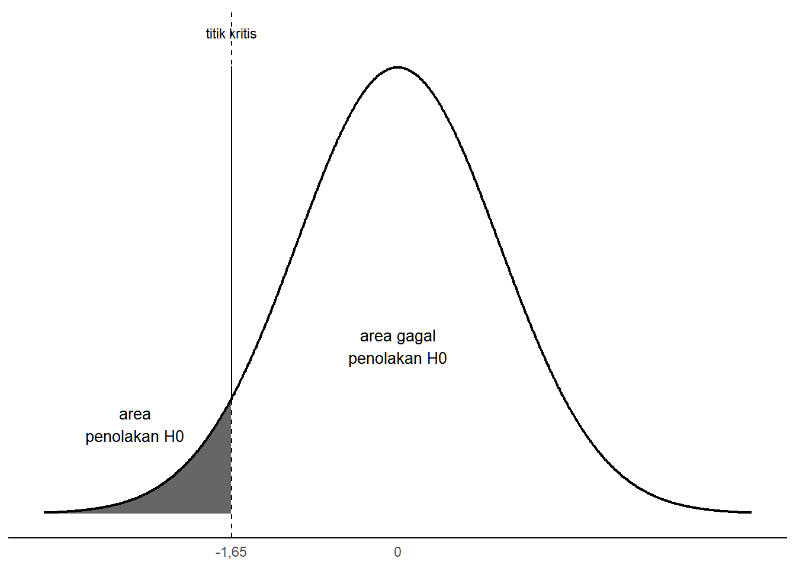
<p class="caption">(\#fig:fig-kurva-kritis-bus-kampus)Distribusi Sampling dan Wilayah Kritis Kasus Rata-rata Jarak ke Kampus ITERA</p>
</div>

##### Mencari Nilai Statistik Uji {-}

Kita menggunakan persamaan \@ref(eq:statistik-uji-mean) untuk menghitung statistik uji kita.

- $\bar{x} = 4,59$
- $\mu_0 = 5$
- $s = 2,23$
- $n = 333$

$$
\begin{aligned}
Z &= \frac{\bar{x} - \mu_0}{s / \sqrt{n}} \\
&= \frac{4,59 - 5}{2,23 / \sqrt{333}} \\
&= \frac{-0,41}{0,122} \\
&= \frac{-0,41}{0,122}
\end{aligned}
$$

##### Membandingkan Nilai Statistik Uji dan Titik Kritis {-}

- $Z_{hitung} = -3,36$
- $Z_{kritis} = -1,65$

Nilai statistik uji **jatuh ke dalam wilayah kritis** karena nilai $Z_{hitung}$ (-3,36) lebih kecil dari $Z_{kritis}$ (-1,65) sehingga berada di sebelah kirinya (masuk ke dalam area penolakan $H_0$) (Gambar \@ref(fig:fig-perbandingan-z-jarak)).

<div class="figure" style="text-align: center">
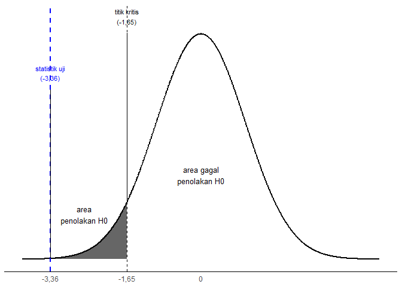
<p class="caption">(\#fig:fig-perbandingan-z-jarak)Perbandingan Nilai Statistik Uji dan Titik Kritis (Kasus Jarak ke Kampus ITERA)</p>
</div>

##### Menarik Kesimpulan dan Memaknai Hasil {-}

Dengan demikian, data sampel kita cukup untuk dapat menolak $H_0$, yaitu bahwa rata-rata jarak mahasiswa ITERA ke kampus adalah 5 km atau kurang. Berdasarkan perhitungan statistik, penyediaan Bus Kampus dapat dianggap tepat dan berpotensi efektif. 


#### Pengujian Hipotesis Proporsi Populasi {.unnumbered}

*Program dinilai akan berhasil apabila lebih dari 80% mahasiswa berminat. Berdasarkan survei terhadap 333 responden, diketahui 82% mahasiswa berminat. Dengan tingkat kepercayaan 99%, kita uji hipotesis parameter proporsi ini.*

##### Memeriksa Asumsi Pengujian {-}

1. **Independensi**: Sebagaimana pada uji rata-rata, sampel 333 responden ini diasumsikan ditarik secara acak. Asumsi independensi terpenuhi.
2. **Tingkat pengukuran**: Respons yang diberikan mahasiswa bersifat kategorik nominal dikotomis (hanya ada dua kemungkinan: "berminat" atau "tidak berminat"), sesuai dengan alat ukur proporsi. Asumsi tingkat pengukuran terpenuhi.
3. **Bentuk distribusi statistik**: Mempertimbangkan bahwa ukuran sampel yang digunakan sangat besar ($n = 333$), distribusi statistik dari proporsi sampel tersebut cukup memadai untuk didekati dengan distribusi normal. Asumsi kenormalan terpenuhi.

##### Menetapkan Hipotesis Kosong dan Alternatif ($H_0$ dan $H_1$) {-}

Bentuk kondisi netral yang dapat dijadikan hipotesis kosong adalah **proporsi mahasiswa yang berminat sama dengan 80%**. Untuk bentuk hipotesis alternatifnya, kita berusaha untuk membuktikan klaim bahwa program akan berhasil jika minat melebihi 80%. Dengan demikian, bentuk hipotesis alternatif kita adalah $H_1: P > 0,8$.

$$
H_0: P = 0,8 \\
H_1: P > 0,8
$$

Pada hipotesis tersebut, $H_0$ menunjukkan kondisi bahwa besaran proporsi adalah 0,8. $H_1$ berusaha menolak hipotesis kosong dengan mengeklaim bahwa program akan berhasil di saat proporsi > 0,8.

##### Menetapkan Wilayah Kritis dari Signifikansi {-}

Oleh karena kita menguji proporsi, kita menggunakan metode sampel besar, sehingga titik statistik acuan adalah distribusi Z. Lalu, kita menggunakan tingkat kepercayaan 99%, yang berarti tingkat signifikansi kita adalah $\alpha = 1\% = 0,01$.

Berdasarkan hipotesis alternatif $H_1$ yang berarah "lebih dari" (>), kita menggunakan uji ekor kanan (*right-tailed*).

##### Mencari Nilai Titik Kritis {-}

Berdasarkan tabel Distribusi Z, nilai titik kritis untuk $\alpha = 1\%$ *right-tailed* adalah $+2,33$.

<div class="figure" style="text-align: center">

<p class="caption">(\#fig:fig-kurva-kritis-proporsi-bus)Distribusi Sampling dan Wilayah Kritis Kasus Proporsi Minat Bus Kampus</p>
</div>

##### Mencari Nilai Statistik Uji {-}

Kita menggunakan persamaan \@ref(eq:statistik-uji-proporsi) untuk menghitung statistik uji kita.

- $\hat{p} = 0,82$
- $p_0 = 0,8$
- $n = 333$

$$
\begin{aligned}
Z &= \frac{\hat{p} - p_0}{\sqrt{\frac{p_0(1-p_0)}{n}}} \\
&= \frac{0,82 - 0,8}{\sqrt{\frac{0,8(1-0,8)}{333}}} \\
&= \frac{0,02}{0,0219} \\
&= 0,91
\end{aligned}
$$

##### Membandingkan Nilai Statistik Uji dan Titik Kritis {-}

- $Z_{hitung} = +0,91$
- $Z_{kritis} = +2,33$

Nilai statistik uji **tidak jatuh ke dalam wilayah kritis** karena nilai $Z_{hitung}$ (0,91) tidak melampaui dan lebih kecil dari titik kritis $Z_{kritis}$ (+2,33). Titik wilayah kritis kita berada di ekor sebelah kanan (+2,33), sementara statistik uji jatuh jauh di sebelah kiri kurva sumbu nol (Gambar \@ref(fig:fig-perbandingan-z-proporsi)). Oleh karena itu, kita **gagal menolak hipotesis kosong ($H_0$)**.

<div class="figure" style="text-align: center">
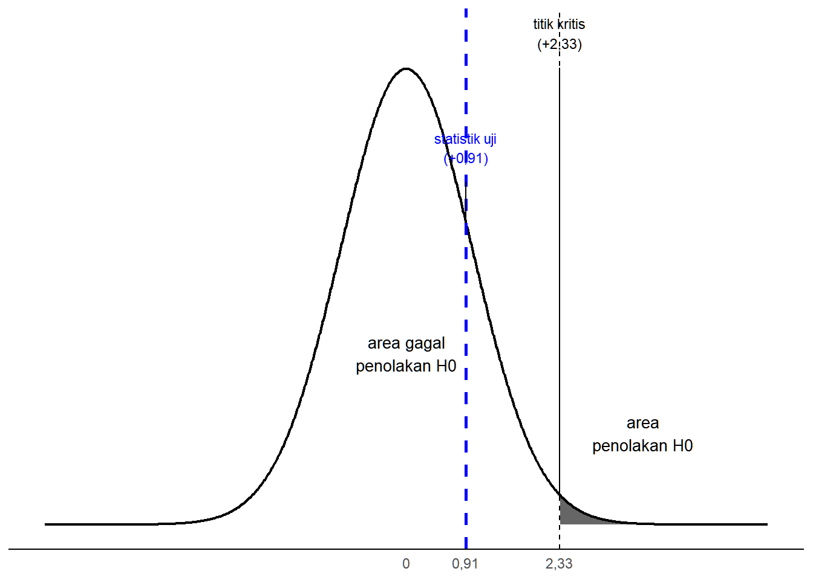
<p class="caption">(\#fig:fig-perbandingan-z-proporsi)Perbandingan Nilai Statistik Uji dan Titik Kritis (Kasus Proporsi Minat Bus Kampus)</p>
</div>

##### Menarik Kesimpulan dan Memaknai Hasil {-}

Karena kita gagal menolak $H_0$, terbukti bahwa statistik proporsi sebesar 0,82 atau 82% belum memiliki cukup bukti empiris untuk menolak pernyataan bahwasanya proporsi mahasiswa yang berminat hanya 80%. Walaupun kita mendapat sampel dengan nilai 82% (>80%), hasil pengujian hipotesis menyatakan bahwa sampel kita tersebut didapatkan secara kebetulan. Oleh karena itu, secara populasi, kita bisa menyimpulkan bahwa proporsi minat mahasiswa belum mencukupi standar target kelayakan. Pihak kampus perlu mengkaji ulang atau mempertimbangkan kembali penyediaan Bus Kampus ini mengingat minimnya potensi minat mahasiswa.
:::

Kerjakanlah soal evaluasi berikut untuk mengasah pemahaman Anda tentang pengujian hipotesis parameter baik untuk rata-rata maupun proporsi. 

::: rmdexercise

## Soal Evaluasi 14 {.unnumbered}

1. Berdasarkan survei kepada 173 orang dosen ITERA pada tahun 2023, rata-rata usianya pada saat itu adalah 29 tahun dengan simpangan bakunya adalah 2,9 tahun. Jika ingin diketahui apakah rata-rata usia dosen ITERA pada tahun 2023 tersebut adalah sebenarnya sama saja dengan 30 tahun, ujilah pernyataan tersebut! Gunakan galat sebesar 5%. [STP-6.1]{.capaian}
   a. Tuliskan asumsi awal pengujian hipotesis!
   b. Tentukanlah hipotesis kosong dan hipotesis alternatifnya!
   c. Tentukan keputusan dalam memilih hipotesis yang diterima!
   d. Simpulkanlah makna dari hasil pemilihan hipotesis tersebut!
   
2. Hasil survei kepada 427 orang mahasiswa menunjukkan bahwa proporsi pengguna sepeda motor pribadi adalah 0,56. Bagaimana hasil pengujian hipotesis yang menyatakan bahwa sebenarnya pengguna sepeda motor pada mahasiswa itu lebih dari setengahnya? Gunakan galat sebesar 5%. [STP-6.1]{.capaian}
   a. Tuliskan asumsi awal pengujian hipotesis!
   b. Tentukanlah hipotesis kosong dan hipotesis alternatifnya!
   c. Tentukan keputusan dalam memilih hipotesis yang diterima!
   d. Simpulkanlah makna dari hasil pemilihan hipotesis tersebut!
   
**Penting! Tuliskan langkah demi langkah secara berurutan. Gambar seluruh hal yang berkaitan dengan distribusi statistik, seperti wilayah kritis, posisi titik kritis, dan posisi statistik ujinya.**
:::

<!--chapter:end:07-uji-hipotesis-satu-populasi.Rmd-->

# Uji Hipotesis Parameter Dua Populasi Atau Lebih

::: rmdcapaian
### Capaian Pembelajaran {.unnumbered}

Setelah mempelajari bab ini, Anda diharapkan mampu memaknai hasil dari pengujian hipotesis parameter dua populasi atau lebih pada suatu kasus [STP-7.1]{.capaian}
:::

## Konsep Dasar Uji Hipotesis Parameter Dua Populasi Atau Lebih {#konsep-dasar-uji-hipotesis-dua-populasi}

Pengertian *lebih dari satu populasi* mengacu pada dua sudut pandang, yaitu:

1. **Cakupan populasi yang kita definisikan pada penelitian kita**. Jika satu populasi pada penelitian kita adalah *“seluruh mahasiswa ITERA”*, maka dua populasi dapat menjadi *“seluruh mahasiswa ITERA”* dan *“seluruh mahasiswa UIN RIL”*, dan sebagainya.
   
   Akan ada hal yang kita bandingkan dari kedua ataupun seluruh populasi tersebut. Dalam hal ini, kita akan membuktikan bahwa *“ada atau tidaknya perbedaan karakteristik dari mahasiswa ITERA dan mahasiswa UIN RIL”*. Perbedaan karakteristik ini dapat berupa parameter tertentu, seperti rata-rata, median, atau proporsi pada dua atau lebih populasi yang diujikan.

::: rmdkasus
### Studi Kasus: Batasan Cakupan Sebagai Dasar Penentuan Populasi {.unnumbered}

Cakupan populasi sangat bergantung pada batasan penelitian. Mari bandingkan dua situasi berikut:

-   **Situasi 1**: Penelitian mengamati mahasiswa di suatu kampus tingkat universitas, misalnya UBL. Dalam hal ini, seluruh mahasiswa UBL adalah **satu populasi**. Jika kita membandingkannya dengan kampus lain, maka mahasiswa kampus lain tersebut (misalnya UIN RIL) akan menjadi **populasi kedua**.
-   **Situasi 2**: Penelitian mengamati seluruh mahasiswa di Kota Bandar Lampung. Dalam kasus ini, mahasiswa UBL dan mahasiswa UIN RIL melebur menjadi **satu populasi yang sama**, yaitu populasi mahasiswa Kota Bandar Lampung. Populasi kedua, misalnya, bisa jadi adalah *seluruh mahasiswa di **Kota Metro***.

Sebagai kesimpulan, penentuan "satu populasi" dapat berubah menyesuaikan lingkup pengamatan yang ditetapkan.
:::

2. **Waktu pengambilan data**. Jika kita mengambil data dari suatu populasi pada dua tahap yang berbeda, misalnya sebelum dan sesudah suatu program, kita dapat menganggap populasi sebelum program sebagai populasi pertama, dan populasi setelah program sebagai populasi kedua.

::: rmdkasus
### Studi Kasus: Waktu Pengambilan Data Sebagai Dasar Penentuan Populasi {.unnumbered}

Batasan populasi juga dapat dibedakan berdasarkan waktu. Sebagai contoh, kita ingin mengevaluasi dampak pembangunan jalan layang (*flyover*) terhadap waktu tempuh mahasiswa UBL menuju kampus.

-   **Populasi 1**: Waktu tempuh perjalanan seluruh mahasiswa UBL **sebelum** adanya *flyover*.
-   **Populasi 2**: Waktu tempuh perjalanan seluruh mahasiswa UBL **sesudah** *flyover* tersebut beroperasi.

Meski kelompok subjek yang diamati sama (mahasiswa UBL), perbedaan waktu pengambilan data (sebelum dan sesudah) secara praktis membagi kelompok tersebut menjadi **dua populasi**.
:::

Sudut pandang pertama juga bisa dibagi lagi menjadi dua populasi **berpasangan** dan **independen**. Populasi berpasangan adalah dua populasi yang terikat hubungan satu sama lain secara logis. Misalnya, kita mengambil data suami dan istri dalam suatu kelurahan. Dalam hal tersebut, suami adalah populasi pertama, sementara istri adalah populasi kedua. Sudut pandang kedua juga kita bisa katakan sebagai populasi yang berpasangan.

Dengan demikian, berdasarkan sudut pandangnya, penjelasan uji hipotesis lebih dari satu populasi ini dapat dikelompokkan ke dalam tiga bentuk kasus, yaitu **dua populasi tidak berpasangan**, **dua populasi berpasangan**, dan **lebih dari dua populasi**. Sedangkan berdasarkan statistiknya, kita akan membahas uji hipotesis parameter **rata-rata** dan **proporsi**.

## Tahapan Pengujian Hipotesis Parameter Dua Populasi atau Lebih

Secara umum, tahapan pengujian hipotesis parameter dua populasi atau lebih **tidak berbeda jauh** dengan tahapan pengujian hipotesis parameter satu populasi (subbab \@ref(langkah-pengujian-hipotesis). Perbedaannya hanya terletak pada **bentuk hipotesis** yang akan diuji dan **cara menghitung statistik ujinya**.

Untuk menyegarkan ingatan kita, berikut adalah langkah-langkah dalam pengujian hipotesis parameter satu populasi:

1. Menyatakan asumsi awal
2. Menetapkan hipotesis kosong dan alternatif
3. Menetapkan wilayah kritis dari signifikansi
4. Mencari nilai titik kritis
5. Mencari nilai statistik uji
6. Membandingkan nilai statistik uji dan titik kritis
7. Menarik kesimpulan dan memaknai hasil pengujian.

Langkah-langkah ini juga akan kita gunakan dalam melakukan uji hipotesis parameter dua populasi atau lebih.

## Uji Hipotesis Parameter Dua Populasi Independen

Dalam subbab ini, kita akan membahas **perumusan hipotesis kosong dan alternatif** serta **perhitungan statistik ujinya**, sesuai penjelasan sebelumnya yang mengatakan bahwa dua hal tersebut merupakan hal yang membedakan uji hipotesis parameter dua populasi atau lebih dengan uji hipotesis parameter satu populasi.

### Hipotesis Kosong dan Alternatif Uji Hipotesis Parameter Dua Populasi Independen

Pada uji hipotesis dua populasi independen, hanya terdapat **dua populasi** yang diujikan. Dua populasi ini adalah populasi yang **berbeda satu sama lain/tidak saling berkaitan**. Dalam uji ini, hipotesis kosong ($H_0$) yang menunjukkan kondisi netral dapat dirumuskan sebagai **tidak adanya perbedaan parameter antara kedua populasi yang dibandingkan**. Bentuk penulisan hipotesis kosong ini dapat dilihat pada Tabel \@ref(tab:tab-hipotesis-kosong-dua-populasi) berikut.

<table class="table" style="width: auto !important; margin-left: auto; margin-right: auto;">
<caption>(\#tab:tab-hipotesis-kosong-dua-populasi)Bentuk Hipotesis Kosong Dua Populasi</caption>
 <thead>
  <tr>
   <th style="text-align:center;"> Bentuk </th>
   <th style="text-align:center;"> Parameter Rata-rata </th>
   <th style="text-align:center;"> Parameter Proporsi </th>
  </tr>
 </thead>
<tbody>
  <tr>
   <td style="text-align:center;"> Bentuk Umum </td>
   <td style="text-align:center;"> $H_0: \mu_A = \mu_B$ </td>
   <td style="text-align:center;"> $H_0: P_A = P_B$ </td>
  </tr>
  <tr>
   <td style="text-align:center;"> Bentuk Selisih </td>
   <td style="text-align:center;"> $H_0: \mu_A - \mu_B = 0$ </td>
   <td style="text-align:center;"> $H_0: P_A - P_B = 0$ </td>
  </tr>
</tbody>
</table>

Dalam Tabel \@ref(tab:tab-hipotesis-kosong-dua-populasi), kita dapat melihat bahwa hipotesis kosong ini dapat dirumuskan dengan dua bentuk, yaitu **bentuk umum** dan **bentuk selisih**. Kedua bentuk ini sebenarnya memiliki arti yang sama, yaitu tidak adanya perbedaan antara kedua populasi yang dibandingkan. Hanya saja, bentuk selisih lebih mudah diterapkan ketika **kita hanya berfokus pada perbedaan nilai parameter antara kedua populasi tersebut** alih-alih nilai absolut parameter-parameternya. 

Sementara itu, hipotesis alternatif ($H_1$) menunjukkan kondisi **adanya perbedaan antara kedua populasi tersebut** — baik perbedaan yang memiliki arah (lebih besar atau lebih kecil), maupun yang tidak memiliki arah (tidak sama dengan). Perhatikan Tabel \@ref(tab:tab-hipotesis-alternatif-dua-populasi) berikut֫.

<table class="table" style="width: auto !important; margin-left: auto; margin-right: auto;">
<caption>(\#tab:tab-hipotesis-alternatif-dua-populasi)Bentuk Hipotesis Alternatif Dua Populasi</caption>
 <thead>
  <tr>
   <th style="text-align:center;"> Bentuk </th>
   <th style="text-align:center;"> Parameter Rata-rata </th>
   <th style="text-align:center;"> Parameter Proporsi </th>
  </tr>
 </thead>
<tbody>
  <tr>
   <td style="text-align:center;"> Bentuk Umum </td>
   <td style="text-align:center;"> $H_1: \mu_A \ne \mu_B$<br>$H_1: \mu_A > \mu_B$<br>$H_1: \mu_A < \mu_B$ </td>
   <td style="text-align:center;"> $H_1: P_A \ne P_B$<br>$H_1: P_A > P_B$<br>$H_1: P_A < P_B$ </td>
  </tr>
  <tr>
   <td style="text-align:center;"> Bentuk Selisih </td>
   <td style="text-align:center;"> $H_1: \mu_A - \mu_B \ne 0$<br>$H_1: \mu_A - \mu_B > 0$<br>$H_1: \mu_A - \mu_B < 0$ </td>
   <td style="text-align:center;"> $H_1: P_A - P_B \ne 0$<br>$H_1: P_A - P_B > 0$<br>$H_1: P_A - P_B < 0$ </td>
  </tr>
</tbody>
</table>

### Perhitungan Statistik Uji dalam Uji Hipotesis Parameter Dua Populasi Independen

Secara matematis, perhitungan statistik uji pada beda dua rata-rata independen diawali dengan membandingkan selisih rata-rata dari kedua sampel ($\bar{x}_1 - \bar{x}_2$) terhadap hipotesis selisih dari kedua rata-rata populasinya ($\mu_1 - \mu_2$), untuk kemudian dibagikan dengan standar *error*-nya.

Untuk **parameter rata-rata**, statistik uji yang digunakan adalah sebagai berikut:

$$
Z_{hitung} = \frac{(\bar{x}_1 - \bar{x}_2) - (\mu_1 - \mu_2)}{SE_{\bar{x}_1 - \bar{x}_2}}
(\#eq:statistik-uji-dua-populasi-independen)
$$

Di mana:

- $\bar{x}_1, \bar{x}_2$ = Rata-rata sampel 1 dan sampel 2 
- $\mu_1, \mu_2$ = Rata-rata populasi 1 dan populasi 2
- $SE_{\bar{x}_1 - \bar{x}_2}$ = Standar *error* dari selisih rata-rata sampel 1 dan sampel 2

Perlu diperhatikan bahwa $(\mu_1 - \mu_2)$ pada persamaan \@ref(eq:statistik-uji-dua-populasi-independen) mencerminkan **nilai hipotesis selisih rata-rata kedua populasi**. Dalam pengujian hipotesis, nilai tersebut ditetapkan sesuai dengan hipotesis kosong ($H_0$). Karena $H_0$ pada umumnya menyatakan tidak adanya perbedaan antar populasi (yakni $\mu_1 - \mu_2 = 0$), maka suku $(\mu_1 - \mu_2)$ ini **bernilai nol dan gugur dari perhitungan**.

Perhitungan *standard error* dari selisih rata-rata sampel 1 dan sampel 2 adalah sebagai berikut:

$$
SE_{\bar{x}_1 - \bar{x}_2} = \sqrt{ \frac{s_1^2}{N_1 - 1} + \frac{s_2^2}{N_2 - 1} }
(\#eq:standard-error-dua-populasi-independen)
$$

Di mana:

- $s_1^2, s_2^2$ = Varians (standar deviasi yang dikuadratkan) dari sampel 1 dan sampel 2
- $N_1, N_2$ = Jumlah total masing-masing observasi sampel 1 dan sampel 2

Dengan demikian, menggabungkan persamaan \@ref(eq:statistik-uji-dua-populasi-independen) dan \@ref(eq:standard-error-dua-populasi-independen), perhitungan statistik uji beda dua rata-rata independen menjadi:

$$
Z_{hitung} = \frac{\bar{x}_1 - \bar{x}_2}{\sqrt{ \frac{s_1^2}{N_1 - 1} + \frac{s_2^2}{N_2 - 1} }}
(\#eq:statistik-uji-dua-populasi-independen-2)
$$

Di mana:

- $\bar{x}_1, \bar{x}_2$ = Rata-rata sampel 1 dan sampel 2 
- $s_1^2, s_2^2$ = Varians (standar deviasi yang dikuadratkan) dari sampel 1 dan sampel 2
- $N_1, N_2$ = Jumlah total masing-masing observasi sampel 1 dan sampel 2

Sementara itu, untuk **parameter proporsi**, statistik uji untuk beda dua proporsi independen dihitung dengan cara yang mirip dengan beda dua rata-rata, yaitu membandingkan selisih proporsi sampel ($\hat{p}_1 - \hat{p}_2$) terhadap nilai nol (karena $H_0: P_1 - P_2 = 0$), dikalibrasi dengan *standard error*-nya:

$$
Z_{hitung} = \frac{\hat{p}_1 - \hat{p}_2}{\sqrt{\hat{p}(1-\hat{p})\left(\dfrac{1}{N_1} + \dfrac{1}{N_2}\right)}}
(\#eq:statistik-uji-proporsi-dua-populasi)
$$

Di mana:

- $\hat{p}_1, \hat{p}_2$ = Proporsi sampel dari populasi 1 dan populasi 2
- $N_1, N_2$ = Jumlah total observasi sampel populasi 1 dan populasi 2
- $\hat{p}$ = Proporsi gabungan (*pooled proportion*), dihitung sebagai:

$$
\hat{p} = \frac{x_1 + x_2}{N_1 + N_2} = \frac{N_1 \hat{p}_1 + N_2 \hat{p}_2}{N_1 + N_2}
(\#eq:proporsi-gabungan)
$$

Di mana: 

- $x_1$ dan $x_2$ adalah jumlah observasi yang memenuhi kategori yang diuji pada masing-masing sampel
- $N_1$ dan $N_2$ adalah jumlah observasi sampel 1 dan sampel 2
- $\hat{p}_1$ dan $\hat{p}_2$ adalah proporsi sampel 1 dan sampel 2

Perlu dicatat bahwa pada persamaan \@ref(eq:statistik-uji-proporsi-dua-populasi), standar *error* dihitung menggunakan **proporsi gabungan** ($\hat{p}$) — bukan proporsi masing-masing sampel. Ini dilakukan karena, di bawah asumsi $H_0$ (bahwa kedua proporsi populasi sesungguhnya adalah sama), kita memiliki basis yang lebih kuat jika mengestimasi proporsi populasi tersebut dari kedua sampel secara bersamaan.

Aturan pengambilan keputusan untuk uji proporsi ini sama dengan yang berlaku pada uji rata-rata, yakni: jika statistik uji **jatuh di dalam wilayah kritis**, kita tolak $H_0$; sebaliknya, kita **gagal menolak $H_0$**.


Setelah memperoleh nilai dari hitungan statistik ujinya, tugas selanjutnya adalah membandingkannya terhadap nilai titik kritis ($Z_{kritis}$) dari tabel distribusi di tingkat signifikansi ($\alpha$) tertentu. Aturan pengambilan keputusannya senantiasa mengikuti kaidah berikut ini:

- Jika nilai statistik uji **jatuh di dalam wilayah kritis**, maka hasil pengujian kita adalah hipotesis kosong dapat ditolak (**tolak $H_0$**). Ini berarti statistik yang telah dihitung ternyata memiliki bukti yang cukup untuk menyimpulkan telah terjadi perbedaan yang signifikan antara keadaan rata-rata kedua populasi tersebut.
- Sebaliknya, jika nilai statistik uji **tidak jatuh ke dalam wilayah kritis**, maka hasil pengujian kita adalah hipotesis kosong gagal ditolak (**gagal tolak $H_0$**). Ini mengindikasikan bahwa data yang dihasilkan nyatanya belum memiliki cukup kekuatan meyakinkan untuk menolak dugaan ketiadaan perbedaan kondisi dari rata-rata kedua populasinya.

::: rmdkasus
### Studi Kasus: Uji Rata-Rata Waktu Tempuh Mahasiswa ITERA dan UNILA {.unnumbered}

Dinas Perhubungan ingin mengetahui apakah rata-rata waktu tempuh perjalanan menuju kampus bagi mahasiswa ITERA berbeda dengan mahasiswa UNILA. Survei taktis pun dilakukan kepada mahasiswa kedua kampus dan berhasil menghimpun sampel sebanyak 428 mahasiswa ITERA yang menghasilkan rata-rata dan simpangan baku, berturut-turut, 5,01 km dan 2,82 km. Sampel mahasiswa UNILA juga berhasil dikumpulkan, yakni sebanyak 394 orang, menghasilkan rata-rata dan simpangan baku, berturut-turut, 2,78 km dan 2,53 km.

Dari data tersebut, menggunakan tingkat kepercayaan 90%, kita akan mencari tahu apakah:

a. nilai rata-rata jarak tempuh ke kampus masing-masing, sebesar 5,01 km dan 2,78 km, benar-benar berbeda satu sama lain?
b. Jika ya, bagaimana pernyataan ""*mahasiswa UNILA secara keseluruhan lebih dekat jarak tempuh ke kampus mereka sendiri ketimbang mahasiswa ITERA?"*


**Jawaban:**

Kita menjalankan langkah-langkah pengujian hipotesis parameter dua populasi independen untuk memutuskan hal tersebut:

a. **Menyatakan Asumsi Awal**  
   Pengujian ini mensyaratkan bahwa kelompok data observasi mahasiswa ITERA dan UNILA adalah **independen** satu sama lain. Selain itu, tingkat pengukurannya adalah rasio (variabel yang diujikan: jarak tempuh) dan ukuran sampel keduanya memadai (ukuran besar, 428 dan 394) sehingga distribusi statistiknya mendekati **normal**.

b. **Menetapkan Hipotesis Kosong dan Alternatif ($H_0$ dan $H_1$)**
   Dalam kasus ini, kita akan menguji apakah rata-rata waktu tempuh mahasiswa ITERA dan UNILA **berbeda** satu sama lain. Setelah itu, jika berbeda, kita akan menguji apakah rata-rata waktu tempuh mahasiswa UNILA **lebih kecil** dari mahasiswa ITERA. Dengan demikian, kita menggunakan hipotesis alternatif bentuk **tidak berarah** dan **berarah** secara berurutan.

   Karena kita berurusan dengan dua populasi, kita misalkan populasi ITERA = 1 dan UNILA = 2. Dengan demikian, kita dapat menuliskan hipotesis alternatif sebagai berikut:

   **Bentuk tidak berarah:**

   -   **Hipotesis Kosong** ($H_0: \mu_1 = \mu_2$): Rata-rata waktu tempuh mahasiswa ITERA dan UNILA adalah sama. (Kondisi dasar netral/tidak ada perbedaan).
   -   **Hipotesis Alternatif** ($H_1: \mu_1 \ne \mu_2$): Rata-rata waktu tempuh mahasiswa ITERA dan UNILA berbeda. (Kondisi terdapat perbedaan).

   **Bentuk berarah:**

   -   **Hipotesis Kosong** ($H_0: \mu_1 = \mu_2$): Rata-rata waktu tempuh mahasiswa ITERA dan UNILA adalah sama.
   -   **Hipotesis Alternatif** ($H_1: \mu_1 > \mu_2$): Rata-rata waktu tempuh mahasiswa ITERA lebih besar dari mahasiswa UNILA.

c. **Menetapkan Wilayah Kritis dari Signifikansi**  
   Untuk hipotesis alternatif **bentuk tidak berarah**, wilayah penolakan **terbagi sama rata di dua unjung kurva penolakan** (uji dua ekor/ *two-tailed*). Sementara itu, untuk hipotesis alternatif **bentuk berarah**, wilayah penolakan berada di salah satu ujung kurva penolakan (uji satu ekor/ *one-tailed*).
   
   Karena kita menggunakan bentuk pertidaksamaan "lebih besar", posisi wilayah kritis kita ada di **kanan** kurva distribusi statisik kita.

   Kita diberi tahu bahwa tingkat kepercayaan yang digunakan adalah 90%, sehingga tingkat signifikansi $\alpha$ adalah 10% atau 0,10. Dengan demikian, kita dapat menentukan wilayah kritis sebagai berikut:

<div class="figure" style="text-align: center">
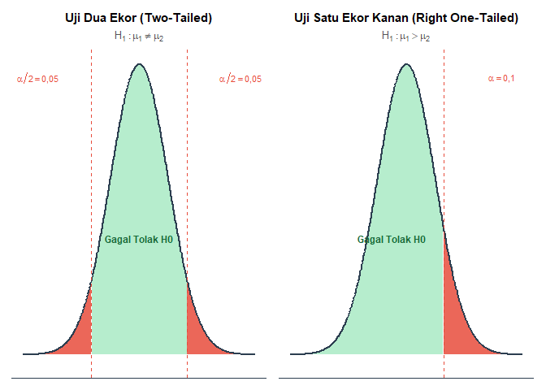
<p class="caption">(\#fig:fig-wilayah-kritis-dua-vs-satu-ekor)Ilustrasi wilayah kritis: uji dua ekor (kiri) dan uji satu ekor kanan (kanan) pada tingkat signifikansi $\alpha$ = 10%</p>
</div>

d. **Mencari Nilai Titik Kritis**  
   Berdasarkan tingkat signifikansi yang ditetapkan ($\alpha = 10\% = 0,10$) dan bentuk hipotesis alternatif kita (tidak berarah & berarah), nilai titik kritis kita:
     
   -   Uji dua ekor: $Z_{kritis} = \pm 1,64$
   -   Uji satu ekor kanan: $Z_{kritis} = 1,28$

e. **Mencari Nilai Statistik Uji**  
   Perhitungan nilai statistik uji (misalnya $Z_{hitung}$) dieksekusi berdasarkan selisih jarak proporsi   rata-rata kedua sampel waktu tempuh tersebut setelah dikalibrasi oleh gabungan *standard error* dari beda rata-rata independen (Persamaan \@ref(eq:statistik-uji-dua-populasi-independen-2)).

   \begin{align}
   Z_{hitung} &= \frac{\bar{X}_1 - \bar{X}_2}{\sqrt{ \dfrac{s_1^2}{N_1 - 1} + \dfrac{s_2^2}{N_2 - 1} }} \nonumber\\
              &= \frac{5{,}01 - 2{,}78}{\sqrt{ \dfrac{2{,}82^2}{428 - 1} + \dfrac{2{,}53^2}{394 - 1} }} \nonumber\\
              &= \frac{2{,}23}{\sqrt{ \dfrac{7{,}9524}{427} + \dfrac{6{,}4009}{393} }} \nonumber\\
              &= \frac{2{,}23}{\sqrt{0{,}01863 + 0{,}01629}} \nonumber\\
              &= \frac{2{,}23}{\sqrt{0{,}03492}} \nonumber\\
              &= \frac{2{,}23}{0{,}1869} \nonumber\\
              &\approx 11{,}93
              % (\#eq:z-hitung-itera-unila)
   \end{align}


f. **Membandingkan Nilai Statistik Uji dan Titik Kritis**  
   Setelah nilainya statistik uji kita peroleh, kita bandingkan posisinya di dalam kurva dengan titik:
   -   Bila $Z_{hitung}$ **melampaui titik kritis** sehingga jatuh di dalam **wilayah kritis**, maka keputusannya kita **menolak $H_0$**.
   -   Sebaliknya, jika tidak, kita **gagal menolak $H_0$**.
   
   Berdasarkan hasil perhitungan statistik uji yang telah kita lakukan, nilainya adalah $+11{,}93$. Karena nilai ini berada jauh di sebelah **kanan** titik kritis, maka ia jatuh **di dalam wilayah kritis**. Bahkan, jika kita perhatikan Gambar \@ref(fig:fig-hasil-pengujian-dua-vs-satu-ekor), posisi statistik uji kita berada jauh sekali sampai di luar grafik.
   
<div class="figure" style="text-align: center">
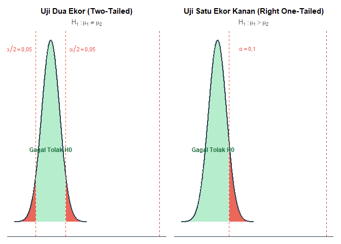
<p class="caption">(\#fig:fig-hasil-pengujian-dua-vs-satu-ekor)Hasil pengujian hipotesis populasi ITERA dan UNILA</p>
</div>

g. **Menarik Kesimpulan dan Memaknai Hasil**  
   Hasil perhitungan statistik uji kita jelas menunjukkan bahwa posisinya berada di dalam wilayah kritis, oleh karena kitu, kesimpulan kita adalah kita dapat **menolak $H_0$**. Kesimpulannya, sampel observasi cukup untuk membuktikan perbedaan rata-rata waktu tempuh kedua kampus secara kuat (signifikan). Artinya, rata-rata jarak tempuh mahasiswa UNILA ke kampus dibandingkan dengan mahasiswa ITERA **memang lebih pendek**.
   
**Interpretasi ke dalam bidang PWK:** rata-rata jarak tempuh mahasiswa UNILA yang lebih pendek mengindikasikan bahwa kampus UNILA mempunyai struktur ruang yang lebih kompak *(kompak)* dibandingkan ITERA. Ini dapat dikaitkan dengan pola jaringan jalan yang dimiliki lingkungan di sekitar UNILA yang berbentuk *grid* sehingga banyak blok-blok guna lahan di sekitarnya yang dapat dimanfaatkan sebagai tempat tinggal.

Lain halnya dengan ITERA, pola jarinagan jalan di sekitar ITERA adalah satu jalan raya memanjang, Jalan Terusan Ryacudu, yang di sekitarnya lebih tersebar *(disepersed)*, mengakibatkan tempat tinggal di sekitarnya juga jadi berjauhan.

<div class="figure" style="text-align: center">

<p class="caption">(\#fig:fig-perbandingan-itera-unila)Gambaran Struktur Ruang ITERA *(dispersed)* vs. UNILA *(compact)*</p>
</div>
:::

Simak juga kasus untuk uji hipotesis parameter proporsi untuk dua populasi independen berikut.

::: rmdkasus
### Studi Kasus: Uji Proporsi Pengguna Sepeda Motor Mahasiswa ITERA dan UNILA {.unnumbered}

Dinas Perhubungan ingin mengetahui apakah proporsi mahasiswa yang menggunakan **sepeda motor pribadi** sebagai kendaraan utama menuju kampus berbeda antara mahasiswa ITERA dan mahasiswa UNILA. Dari data observasi yang ada, tercatat bahwa dari 428 mahasiswa ITERA, sebanyak 260 orang menggunakan sepeda motor, sementara dari 394 mahasiswa UNILA, sebanyak 230 orang juga menggunakan sepeda motor.

Dengan menggunakan **tingkat kepercayaan 90%**, kita akan menguji apakah proporsi pengguna sepeda motor dari kedua kampus tersebut berbeda secara signifikan.

**Jawaban:**

Kita jalankan langkah-langkah pengujian hipotesis proporsi dua populasi independen:

a. **Menyatakan Asumsi Awal**  
   Data yang diamati merupakan dua kelompok sampel yang **independen** — tidak ada hubungan berpasangan antara mahasiswa ITERA dan UNILA. Variabel yang diuji adalah **kategorikal dikotomis** (menggunakan sepeda motor atau tidak), dan ukuran sampel keduanya cukup besar sehingga memenuhi syarat distribusi normal untuk proporsi.

b. **Menetapkan Hipotesis Kosong dan Alternatif ($H_0$ dan $H_1$)**  
   Kita misalkan populasi ITERA = 1 dan UNILA = 2. Karena kita ingin mengetahui apakah ada perbedaan (tanpa menentukan arah), kita gunakan hipotesis alternatif **tidak berarah**:

   - **Hipotesis Kosong** ($H_0: P_1 = P_2$): Proporsi pengguna sepeda motor mahasiswa ITERA dan UNILA adalah sama.
   - **Hipotesis Alternatif** ($H_1: P_1 \ne P_2$): Proporsi pengguna sepeda motor mahasiswa ITERA dan UNILA berbeda.

c. **Menetapkan Wilayah Kritis dari Signifikansi**  
   Karena hipotesis alternatif kita **tidak berarah**, ini merupakan **uji dua ekor** (*two-tailed*). Tingkat kepercayaan 90% berarti tingkat signifikansi $\alpha = 0{,}10$, sehingga masing-masing ujung kurva memuat luas $\alpha/2 = 0{,}05$.

d. **Mencari Nilai Titik Kritis**  
   Berdasarkan tabel distribusi normal standar dengan $\alpha/2 = 0{,}05$:
   
   $$Z_{kritis} = \pm 1{,}645$$

e. **Mencari Nilai Statistik Uji**  
   Terlebih dahulu kita hitung proporsi masing-masing sampel dan proporsi gabungannya (Persamaan \@ref(eq:proporsi-gabungan)):

   \begin{align}
   \hat{p}_1 &= \frac{260}{428} \approx 0{,}607 \nonumber\\
   \hat{p}_2 &= \frac{230}{394} \approx 0{,}584 \nonumber\\
   \hat{p}   &= \frac{260 + 230}{428 + 394} = \frac{490}{822} \approx 0{,}596 \nonumber
   \end{align}

   Kemudian kita hitung nilai statistik ujinya (Persamaan \@ref(eq:statistik-uji-proporsi-dua-populasi)):

   \begin{align}
   Z_{hitung} &= \frac{\hat{p}_1 - \hat{p}_2}{\sqrt{\hat{p}(1-\hat{p})\left(\dfrac{1}{N_1} + \dfrac{1}{N_2}\right)}} \nonumber\\
              &= \frac{0{,}607 - 0{,}584}{\sqrt{0{,}596 \times 0{,}404 \times \left(\dfrac{1}{428} + \dfrac{1}{394}\right)}} \nonumber\\
              &= \frac{0{,}023}{\sqrt{0{,}2408 \times 0{,}00487}} \nonumber\\
              &= \frac{0{,}023}{\sqrt{0{,}001173}} \nonumber\\
              &= \frac{0{,}023}{0{,}0343} \nonumber\\
              &\approx 0{,}69
   \end{align}

f. **Membandingkan Nilai Statistik Uji dan Titik Kritis**  
   Nilai $Z_{hitung} \approx 0{,}69$ berada **di antara $-1{,}645$ dan $+1{,}645$**, sehingga ia **tidak jatuh ke dalam wilayah kritis** di kedua ujung kurva.

g. **Menarik Kesimpulan dan Memaknai Hasil**  
   Karena statistik uji tidak berada di dalam wilayah kritis, keputusan kita adalah **gagal menolak $H_0$**. Artinya, data yang tersedia **belum cukup untuk membuktikan** adanya perbedaan yang signifikan antara proporsi pengguna sepeda motor mahasiswa ITERA dan UNILA pada tingkat kepercayaan 90%.

   **Interpretasi ke dalam bidang PWK:** meskipun proporsi pengguna sepeda motor di ITERA (≈60,7%) tampak lebih tinggi dari UNILA (≈58,4%), selisih tersebut tidak cukup signifikan secara statistik. Ini menunjukkan bahwa **budaya penggunaan kendaraan bermotor pribadi cenderung serupa** di kedua kampus. Dalam konteks perencanaan transportasi, hal ini mengindikasikan bahwa intervensi kebijakan untuk mendorong moda transportasi alternatif — seperti angkutan umum atau sepeda — kemungkinan perlu diformulasikan secara bersamaan untuk kedua kawasan kampus tersebut.
:::

Kerjakan soal evaluasi berikut untuk mengaplikasikan pemahaman kalian mengenai uji hipotesis dua populasi independen.

::: rmdexercise
## Soal Evaluasi 15 {.unnumbered}

1. Gilang ingin mengetahui apakah selisih rata-rata usia antara seluruh Dosen dengan Tenaga Kependidikan di ITERA sama dengan 1 tahun atau sebenarnya lebih. Dari 73 sampel Dosen, Gilang mendapatkan rata-rata usianya yaitu 30 tahun, sementara dari 69 sampel Tenaga Kependidikan, rata-rata usianya 29 tahun. Simpangan baku sampel Dosen dan Tenaga Kependidikan yang didapatkan Gilang adalah 2,9 tahun dan 2,5 tahun secara berturut-turut. Dengan galat 10%, bantulah Gilang menganalisis hipotesis tersebut. [STP-7.1]{.capaian}
2. Masih dari data yang sama, Gilang juga ingin mengetahui apakah proporsi Dosen yang sudah menikah di ITERA **lebih besar** dari proporsi Tenaga Kependidikan yang sudah menikah. Dari 73 sampel Dosen, sebanyak 54 orang sudah menikah, sementara dari 69 sampel Tenaga Kependidikan, sebanyak 38 orang sudah menikah. Dengan tingkat kepercayaan 95%, bantulah Gilang menganalisis hipotesis tersebut. [STP-7.1]{.capaian}

Untuk kedua nomor:

a. Nyatakan formulasi hipotesis kosong dan alternatifnya
b. Gambarkan distribusi statistiknya untuk menampilkan wilayah dan titik kritis
c. Hitung nilai statistik uji. Gambarkan juga dalam distribusi statistik pada poin b.
d. Tuliskan keputusan pemilihan hipotesis dan interpretasikan hasilnya.
:::

## Uji Hipotesis Parameter Dua Populasi Berpasangan

Kasus dua populasi berpasangan merujuk pada kondisi di mana terdapat **dua populasi yang sama dan saling berkaitan**. Kedua populasi ini sebenarnya berasal dari satu populasi yang sama, tetapi diamati dalam dua kondisi yang berbeda, misalnya kondisi sebelum dan sesudah suatu intervensi kebijakan. Atau juga bisa merujuk pada dua populasi yang berbeda namun memiliki karakteristik yang sama sehingga dapat dibandingkan, misalnya membandingkan usia suami dan istri.

Oleh karena populasinya berpasangan, dalam kasus ini kita **hanya bisa menghitung rata-rata dari selisih variabel kedua populasi** tersebut. Selisih ini biasanya disimbolkan dengan $D$ [@tjokropandojo2021pengantar].

Karena kita hanya mempunyai 1 angka tunggal, maka pernyataan hipotesis dan juga perhitungan statistik ujinya sama persis teknisnya dengan uji hipotesis satu populasi:

\begin{equation}
Z_{hitung} = \frac{\bar{D} - \mu_{D_0}}{s_D / \sqrt{n}}
(\#eq:statistik-uji-dua-populasi-berpasangan)
\end{equation}

Di mana:

- $\bar{D}$ = rata-rata selisih antara dua pengamatan berpasangan
- $\mu_{D_0}$ = nilai hipotesis rata-rata selisih (bernilai 0 pada $H_0$)
- $s_D$ = simpangan baku dari selisih pengamatan
- $n$ = jumlah pasangan pengamatan

::: rmdkasus
### Studi Kasus: Uji Beda Biaya Perjalanan Mahasiswa Sebelum dan Sesudah Pemberlakuan Sistem Angkutan Umum Kampus {.unnumbered}

Pihak pengelola kampus ingin mengevaluasi efektivitas sistem angkutan umum kampus yang baru diluncurkan dalam menekan biaya transportasi harian mahasiswa. Untuk itu, dilakukan pengambilan data terhadap 35 mahasiswa mengenai biaya perjalanan harian mereka sebelum dan sesudah sistem tersebut beroperasi. 

Dari hasil survei, diperoleh rata-rata selisih penurunan biaya perjalanan ($\bar{D}$) sebesar Rp5.300,00 dengan simpangan baku selisih ($s_D$) sebesar Rp1.800,00. Dengan menggunakan **tingkat kepercayaan 95%**, apakah kita dapat menyimpulkan bahwa terdapat perbedaan biaya perjalanan yang signifikan akibat adanya sistem angkutan umum tersebut?

**Jawaban:**

Kita menjalankan langkah-langkah pengujian hipotesis dua populasi berpasangan:

a. **Menyatakan Asumsi Awal**  
   Data yang digunakan adalah **berpasangan** karena berasal dari subjek yang sama (35 mahasiswa yang sama) pada dua kondisi waktu yang berbeda. Diasumsikan selisih biaya perjalanan berdistribusi normal dengan ukuran sampel $n = 35$ yang mencukupi untuk pendekatan distribusi normal.

b. **Menetapkan Hipotesis Kosong dan Alternatif ($H_0$ dan $H_1$)**  
   Kita ingin menguji apakah terdapat perbedaan yang signifikan:
   
   - **Hipotesis Kosong** ($H_0: \mu_D = 0$): Tidak terdapat perbedaan rata-rata biaya perjalanan mahasiswa antara sebelum dan sesudah adanya angkutan umum.
   - **Hipotesis Alternatif** ($H_1: \mu_D \ne 0$): Terdapat perbedaan rata-rata biaya perjalanan mahasiswa antara sebelum dan sesudah adanya angkutan umum.

c. **Menetapkan Wilayah Kritis dari Signifikansi**  
   Tingkat kepercayaan 95% berarti tingkat signifikansi $\alpha = 0,05$. Karena uji dua ekor, maka wilayah penolakan berada di kedua ujung kurva dengan luas masing-masing $\alpha/2 = 0,025$.

d. **Mencari Nilai Titik Kritis**  
   Berdasarkan tabel distribusi normal standar ($Z$):
   
   $$Z_{kritis} = \pm 1,96$$

e. **Mencari Nilai Statistik Uji**  
   Kita menghitung nilai statistik uji $Z_{hitung}$ untuk data berpasangan:

   \begin{align}
   Z_{hitung} &= \frac{\bar{D} - \mu_{D_0}}{s_D / \sqrt{n}} \nonumber\\
              &= \frac{5.300 - 0}{1.800 / \sqrt{35}} \nonumber\\
              &= \frac{5.300}{1.800 / 5{,}916} \nonumber\\
              &= \frac{5.300}{304{,}26} \nonumber\\
              &\approx 17{,}42 (\#eq:z-hitung-biaya-perjalanan)
   \end{align}

f. **Membandingkan Nilai Statistik Uji dan Titik Kritis**  
   Nilai $Z_{hitung} \approx 17{,}42$ jauh lebih besar daripada $+1,96$, sehingga statistik uji **jatuh di dalam wilayah kritis** sebelah kanan.

g. **Menarik Kesimpulan dan Memaknai Hasil**  
   Karena statistik uji berada di wilayah kritis, maka kita **menolak $H_0$**. Ini berarti terdapat bukti statistik yang sangat kuat untuk menyatakan bahwa ada perbedaan biaya perjalanan mahasiswa yang signifikan setelah pemberlakuan sistem angkutan umum kampus.

**Interpretasi ke dalam bidang PWK:** Penurunan biaya perjalanan yang signifikan menunjukkan bahwa penyediaan infrastruktur transportasi umum yang terintegrasi di kawasan pendidikan efektif dalam meningkatkan efisiensi ekonomi bagi pengguna. Dalam perencanaan wilayah, keberhasilan ini dapat menjadi dasar untuk memperluas jangkauan layanan angkutan umum guna mendorong pergeseran moda (*modal shift*) dari kendaraan pribadi ke transportasi publik yang lebih berkelanjutan.
:::

Kerjakan soal evaluasi berikut untuk mengaplikasikan pemahaman kalian mengenai uji hipotesis dua populasi berpasangan.

::: rmdexercise
## Soal Evaluasi 16 {.unnumbered}

Kampus ITERA melakukan penilaian terhadap Program Bus Kampus, khusus untuk segmen pegawai dan Tenaga Kependidikan (Tendik). Sebanyak 120 orang pegawai dipilih secara acak dan diamati beberapa bulan sebelum dan setelah program berjalan. Hasilnya, rata-rata selisih biaya perjalanan harian (sesudah dikurangi sebelum) yang diperoleh adalah $-$Rp250.000 dengan simpangan baku Rp120.000. Dengan galat 10%, buktikanlah apakah selisih tersebut signifikan secara statistik. [STP-7.1]{.capaian}

a. Nyatakan hipotesis nol dan hipotesis alternatif.
b. Gambarkan distribusi statistiknya untuk menampilkan wilayah dan titik kritis.
c. Hitung nilai statistik uji. Gambarkan juga dalam distribusi statistik pada poin b.
d. Tuliskan keputusan pemilihan hipotesis dan interpretasikan hasilnya.
:::

## Uji Hipotesis Parameter Lebih dari Dua Populasi

Selanjutnya, untuk kasus lebih dari dua populasi, konsep dasarnya **sama seperti pada kasus dua populasi yang tidak saling berhubungan (independen)**. Perbedaannya terletak pada **jumlah populasi yang dibandingkan, yaitu lebih dari dua** dan **parameter yang dapat diujikan hanyalah rata-rata**.

Selain itu, dalam pengujian ini tidak ada istilah "bentuk hipotesis alternatif", karena bentuk hipotesis alternatif dalam pengujian ini hanyalah "ada perbedaan".


### Konsep *Analysis of Variance* (ANOVA)

Pengujian hipotesis parameter lebih dari dua populasi menggunakan teknik yang disebut **ANOVA (*Analysis of Variance*)**. ANOVA merupakan metode statistik inferensial yang dirancang khusus **untuk membandingkan rata-rata dari lebih dari dua populasi atau kelompok**.

Teknik ini digunakan untuk menentukan, berdasarkan satu variabel metrik (interval-rasio), apakah sampel-sampel berasal dari populasi yang memiliki rata-rata yang sama.

Secara konsep, ANOVA membandingkan **variasi antar kelompok** (*between-group variance*) dengan **variasi di dalam kelompok** (*within-group variance*) untuk menilai apakah perbedaan rata-rata yang muncul bersifat signifikan secara statistik atau hanya terjadi karena faktor kebetulan (*random error*).


### Hipotesis Kosong dan Alternatif ANOVA {#hipotesis-kosong-alternatif-anova}

Bentuk hipotesis kosong dari uji hipoteis parameter lebih dari dua populasi adalah "tidak ada perbedaan rata-rata dalam populasi-populasi yang dibandingkan".

$$
H_0: \mu_A = \mu_B = \mu_C = ...
$$

Sementara itu, bentuk hipotesis alternatifnya hanyalah **"salah satu atau lebih dari dua populasi memiliki rata-rata yang berbeda"**. Hal ini mengakibatkan tidak ada bentuk pernyataan hipotesis alternatif yang spesifik.


### Langkah Pengujian Hipotesis dengan ANOVA

Langkah-langkah pengujian hipotesis menggunakan prosedur ANOVA akan dijelaskan sebagai berikut.

#### Menyatakan Asumsi Awal

Agar prosedur ANOVA dapat dilakukan, terdapat beberapa asumsi yang harus dipenuhi [@healey2021statistics; @devaus2014surveys], di antaranya

a. Sampel harus acak dan independen satu sama lain; 
b. Tingkat pengukuran variabel yang diuji adalah interval-rasio; 
c. Data terdistribusi normal. Pada dasarnya, ANOVA toleran terhadap beberapa pelanggaran, tetapi keberadaan *outlier* yang parah akan mengganggu hasil analisis sehingga akan lebih baik jika asumsi ini terpenuhi; 
d. Variansi kelompok harus kira-kira sama untuk semua populasi.

#### Merumuskan Hipotesis Kosong dan Alternatif

Pada dasarnya, hipotesis dalam prosedur ANOVA memiliki bentuk yang seragam. Peneliti hanya perlu menyesuaikan notasinya sesuai dengan konteks atau kebutuhan penelitian yang dilakukan. Adapun bentuk matematis dari hipotesis dalam analisis ANOVA telah dijelaskan dalam subbab \@ref(hipotesis-kosong-alternatif-anova).


::: rmdkasus
### Studi Kasus: Uji ANOVA Biaya Perjalanan Tiga Kampus {.unnumbered}

Dinas Perhubungan melakukan survei biaya perjalanan per bulan (dalam ribu rupiah) dari mahasiswa di tiga kampus yang ada di Bandar Lampung: UIN RIL, UNILA, dan UBL. Ringkasan datanya dihimpun dalam metrik berikut:

| Kampus      | Ukuran Sampel | Rata-rata (ribu rupiah) |
| ----------- | ------------- | ----------------------- |
| UINRIL      | 400           | 39,33                   |
| UNILA       | 394           | 74,00                   |
| UBL         | 378           | 99,18                   |
| Tiga kampus | 1.172         | 70,29                   |

Dengan tingkat signifikansi sebesar 5%, apakah perbedaan rata-rata biaya perjalanan di antara ketiga kampus tersebut nyata secara statistik? 

**Jawaban:**

a. **Menyatakan Asumsi Awal**  
  Setiap subjek beserta catatan biayanya dipilah ke dalam sampel pengamatan secara acak dari ketiga kampus tanpa saling mencampuri observasi lainnya (**independen**). Objek yang diteliti, yaitu biaya, berderajat numerik (**interval-rasio**). Mengingat besaran cakupan seluruh sampel melintasi rekomendasi kenormalan (>100), sebaran statistik diyakini memadai asumsi berdistribusi **normal**. Disertai pula asusmi kesetaraan disparitas keberagaman nilainya di rentang proporsi populasi (**homogenitas varians**).

b. **Menetapkan Hipotesis Kosong dan Alternatif ($H_0$ dan $H_1$)**  
   -   **Hipotesis Kosong** ($H_0: \mu_{UIN} = \mu_{UNILA} = \mu_{UBL}$): Tidak terdapat perbedaan signifikan dalam parameter rata-rata rasio biaya perjalanan populasi mahasiswa di ketiga kampus tersebut.
   -   **Hipotesis Alternatif** ($H_1$): Terdapat setidaknya kelompok dari salah satu kampus yang rata-rata biaya perjalanannya berlainan dibandingkan yang lain.
:::


#### Menentukan Wilayah dan Titik Kritis

Dalam prosedur ANOVA, distribusi sampling yang digunakan adalah **distribusi F**. Distribusi ini memungkinkan peneliti untuk menguji hipotesis kosong ($H_0$) mengenai *ada tidaknya perbedaan rata-rata di antara dua kelompok atau lebih*.

Bentuk distribusi F bersifat asimetris (miring ke kanan) dan nilainya selalu positif (Gambar \@ref(fig:fig-distribusi-f)). Hal ini karena nilai F diperoleh dari **perbandingan antara dua parameter penting**, yaitu **variansi antar kelompok** (*between groups*) dan **variansi dalam kelompok** (*within groups*).

$$
F = \frac{Variansi\ Antar\ Kelompok}{Variansi\ Dalam\ Kelompok}
(\#eq:rumus-dasar-f)
$$


<div class="figure" style="text-align: center">
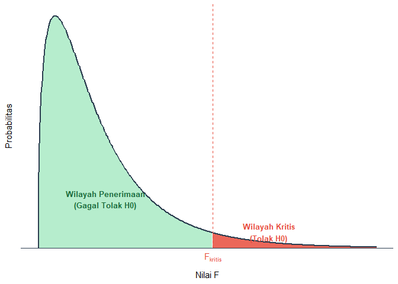
<p class="caption">(\#fig:fig-distribusi-f)Bentuk Distribusi F dan Wilayah Kritisnya</p>
</div>

Makna nilai $F$ yang besar menunjukkan bahwa perbedaan rata-rata antarkelompok signifikan secara statistik, sedangkan nilai $F$ yang mendekati 1 menunjukkan bahwa perbedaan antarkelompok cenderung terjadi karena kebetulan.

Menentukan $F_{kritis}$ dan wilayah kritis pada ANOVA membutuhkan 3 parameter penting: **derajat kebebasan di dalam kelompok** (*degree of freedom within group*, $dfw$), **derajat kebebasan di antara kelompok** (*degree of freedom between group*, $dfb$), dan **tingkat signifikansi** ($\alpha$) sebagai **wilayah kritis**. Ketiga parameter tersebut menjadi penentu nilai $F_{kritis}$ dari **tabel distribusi F**.

Nilai $\alpha$ menjadi variasi tabel, sementara itu di setiap tabel kita menentukan nilai $F_{kritis}$ berdasarkan nilai **$dfw$** yang bertindak sebagai **baris** dan **$dfb$** yang bertindak sebagai **kolom**.

Tabel tersebut dapat kita lihat pada Tabel \@ref(tab:tab-distribusi-f-5persen-lampiran) untuk $\alpha = 5\%$ dan Tabel \@ref(tab:tab-distribusi-f-10persen) untuk $\alpha = 10\%$ di bagian Lampiran.

#### Menghitung Statistik Uji

Perhitungan statistik uji, dalam hal ini adalah nilai F dihitung dengan persamaan \@ref(eq:rumus-f-anova) berikut yang merupakan penjabaran dari persamaan \@ref(eq:rumus-dasar-f).

$$
F = \frac{MSB}{MSW}
(\#eq:rumus-f-anova)
$$

Di mana $MSB$ adalah *Mean Square Between* atau variansi antar kelompok, dan $MSW$ adalah *Mean Square Within* atau variansi dalam kelompok.

- Untuk menghitung $MSB$ sendiri kita menggunakan persamaan berikut

  $$ 
  MSB = \frac{SSB}{dfb}
  (\#eq:rumus-msb-anova)
  $$

  $SSB$ sendiri kita hitung dengan persamaan berikut

  $$ 
  SSB = \sum_{i=1}^{k} n_i (\bar{x}_i - \bar{x})^2
  (\#eq:rumus-ssb-anova)
  $$

  dengan

  - $n_i$ adalah ukuran sampel dari populasi ke-$i$
  - $\bar{x}_i$ adalah rata-rata sampel dari populasi ke-$i$
  - $\bar{x}$ adalah rata-rata gabungan sampel dari keseluruhan populasi

- Untuk menghitung $MSW$ kita menggunakan persamaan berikut

  $$ 
  MSW = \frac{SSW}{dfw}
  (\#eq:rumus-msw-anova)
  $$ 

  Dalam prosedur ANOVA, variasi total dari seluruh skor dibagi menjadi dua komponen utama: variasi **di dalam** kelompok ($SSW$) dan variasi **antar** kelompok ($SSB$). Jika keduanya dijumlahkan, kita mendapatkan nilai variasi total (*Total Sum of Squares*, $SST$) yang dinyatakan sebagai

  $$
  SST = SSB + SSW
  (\#eq:rumus-sst-anova)
  $$

  sehingga $SSW$ dapat diperoleh dengan

  $$ 
  SSW = SST - SSB
  (\#eq:rumus-ssw-anova)
  $$ 

  $SST$ sendiri terlebih dahulu dihitung dengan persamaan

  $$
  SST = \sum x^2 - N\bar{x}^2
  (\#eq:rumus-sst-detail-anova)
  $$

  dengan

  - $\sum x^2$ adalah jumlah dari kuadrat masing-masing skor observasi
  - $N$ adalah jumlah total observasi dari seluruh kelompok
  - $\bar{x}$ adalah rata-rata gabungan dari seluruh skor (*grand mean*)

  **Langkah-langkah menghitung SSW:**

  1. *Menghitung $SST$*: Kuadratkan setiap skor secara individual, lalu jumlahkan seluruh hasilnya untuk mendapatkan $\sum x^2$. Selanjutnya, kuadratkan *grand mean* $\bar{x}$ dan kalikan dengan jumlah total observasi $N$. Kurangkan hasil perkalian tersebut dari $\sum x^2$ untuk mendapatkan nilai $SST$.

  2. *Menghitung $SSB$*: Untuk setiap kelompok ke-$i$, hitung selisih antara rata-rata kelompok $\bar{x}_i$ dan *grand mean* $\bar{x}$, lalu kuadratkan. Kalikan deviasi yang telah dikuadratkan tersebut dengan jumlah sampel kelompok $n_i$. Jumlahkan hasil perkalian dari seluruh kelompok untuk mendapatkan nilai $SSB$ (Persamaan \@ref(eq:rumus-ssb-anova)).

  3. *Menghitung $SSW$*: Kurangkan nilai $SSB$ dari nilai $SST$. Selisih inilah yang merupakan nilai $SSW$ (Persamaan \@ref(eq:rumus-ssw-anova)).

#### Menarik Kesimpulan
Penarikan kesimpulan dilakukan dengan membandingkan nilai statistik uji, yaitu nilai $F$ hasil perhitungan ($F_{uji}$) terhadap nilai $F_{kritis}$ dari tabel. $H_0$ akan **ditolak** apabila nilai **$F_{uji}$ lebih besar dari nilai $F_{kritis}$** atau $F_{uji} > F_{kritis}$, sementara apabila nilai **$F_{uji} < F_{kritis}$**, maka hasil pengujian **gagal menolak $H_0$**.

Jika kita menggunakan pendekatan *p-value* yang digunakan di banyak perangkat lunak statistik seperti bahasa R atau SPSS, *p-value* < signifikansi ($\alpha$) berarti kita menolak $H_0$, sementara jika *p-value* > signifikansi ($\alpha$) maka kita gagal menolak $H_0$.

::: rmdkasus
### Lanjutan Studi Kasus: Uji ANOVA Biaya Perjalanan Tiga Kampus {.unnumbered}

Setelah menyatakan asumsi dan merumuskan hipotesis, langkah selanjutnya adalah menguji hipotesis tersebut dengan membandingkan $F_{kritis}$ atau $F_{tabel}$ dengan $F_{hitung}$ yang dilakukan sebagai berikut.

c. **Menetapkan Wilayah Kritis dan Titik Kritis**  
   Wilayah kritis kita adalah nilai $\alpha$ yang digunakan untuk pengujian, yakni 5%. Untuk mencari titik kritisnya, maka kita harus menggunakan Tabel $F$ dengan $\alpha = 5\%$.
   Untuk menentukan titik kritisnya, kita menggunakan dua besaran derajat kebebasan $dfb$ dan $dfw$.
   
   $$
   \begin{align}
   dfb &= K - 1 \\
       &= 3 - 1 \\
       &= 2 \\
   dfw &= N - K \\
       &= 1.172 - 3 \\
       &= 1.169
   \end{align}
   $$
   
   Oleh karena nilai $dfw$ sangat besar, kita menggunakan angka tak hingga ($\infty$).
   Dari nilai $dfb$ yang menjadi kolom dan $dfw$ yang menjadi baris, kita mendapatkan titik kritis kita sebesar 3,00.

d. **Menghitung Statistik Uji** 
   Menghitung nilai $F_{hitung}$ (persamaan \@ref(eq:rumus-f-anova)) memerlukan nilai $MSB$ dan $MSW$. Nilai $MSB$ dan $MSW$ dihitung dengan persamaan \@ref(eq:rumus-msb-anova) dan \@ref(eq:rumus-msw-anova) yang dihasilkan dari nilai $SSB$ dan $SSW$ (persamaan \@ref(eq:rumus-ssb-anova) dan \@ref(eq:rumus-ssw-anova)).

   - **Nilai Total Variasi ($SST$)**: Variansi ditelaah pada setiap individu responden untuk dikurangkan terhadap *grand mean* yang diketahui sebesar 70,29. Mengutip 5 nilai sampel pertama (diketahui berasal dari UNILA: 150, 150, 25, 25, 25), kita menghitung SST sesuai persamaan \@ref(eq:rumus-sst-anova):

     | $x_i$   | $x_i^2$ |
     | ------- | ------- |
     | 150     | 22.500  |
     | 150     | 22.500  |
     | 25      | 625     |
     | 25      | 625     |
     | 25      | 625     |
     | $\dots$ | $\dots$ |

     $$
     \begin{align}
     \sum x_i^2 &= 22.500 + 22.500 + 625 + 625 + 625 + \dots = 11.205.372 \nonumber\\
     SST &= \sum x_i^2 - N\bar{x}^2 \nonumber\\
     &= 11.205.372 - 1.172(70,29)^2 \nonumber\\
     &\approx \mathbf{5.414.663} \nonumber
     \end{align}
     $$

   - **Nilai Variasi Antar-Kelompok ($SSB$)**: Variansi ini mengukur seberapa jauh perbedaan rata-rata tiap kampus ($\bar{x}_j$) terhadap rata-rata gabungan keseluruhannya (*grand mean*). Karena jumlah sampel kita sangat banyak, perhitungannya bisa dipersingkat. Kita cukup mencari selisih rata-rata tiap kampus dengan *grand mean*, mengkuadratkannya, lalu mengalikannya dengan jumlah sampel di kampus tersebut ($n_j$):  

     | Kampus ($j$) | $n_j$ | $\bar{x}_j$ | $(\bar{x}_j - \bar{x})$ | $(\bar{x}_j - \bar{x})^2$ | $n_j(\bar{x}_j - \bar{x})^2$ |
     | ------------ | ----- | ----------- | ----------------------- | ------------------------- | ---------------------------- |
     | UINRIL       | 400   | 39,33       | -30,96                  | 958,52                    | **383.408,6**                |
     | UNILA        | 394   | 74,00       | 3,71                    | 13,76                     | **5.423,1**                  |
     | UBL          | 378   | 99,18       | 28,89                   | 834,63                    | **315.490,9**                |

     $$
     \begin{align}
     SSB &= \sum n_j(\bar{x}_j - \bar{x})^2 \\
     &= 383.408{,}6 + 5.423{,}1 + 315.490{,}9 \\
     &= \mathbf{704.322{,}6} \approx \mathbf{704.352{,}5}
     \end{align}
     $$
     
   - **Nilai Variasi Dalam-Kelompok ($SSW$)**: Nilai ini mewakili variasi alami yang memang terjadi di dalam observasi masing-masing kelompok kampus. Alih-alih menghitung rumusnya dari awal satu per satu, kita bisa memanfaatkan sifat penjumlahan komponen variasi secara langsung. Kita cukup mengurangkan variasi total ($SST$) dengan variasi antar-kelompok ($SSB$):  
   
     $$
     \begin{align}
     SSW &= SST - SSB \nonumber\\
         &= 5.414.663 - 704.352{,}5 \nonumber\\
         &= \mathbf{4.710.310{,}5} \nonumber
     \end{align}
     $$

     Nilai variasi $SSB$ dan $SSW$ yang baru saja kita dapatkan belum bisa dibandingkan secara langsung. Kita harus menstandarkannya terlebih dahulu dengan membaginya menggunakan besaran derajat kebebasannya ($df$) masing-masing untuk memperoleh nilai rata-rata kuadrat atau *Mean Square* ($MSB$ dan $MSW$). Setelah itu, barulah kita bisa mendapatkan nilai $F_{hitung}$ dari pembagian antara $MSB$ dan $MSW$:  
   
     $$
     \begin{align}
     MSB &= \frac{SSB}{dfb} \\
         &= \frac{704.352{,}5}{2} \\
         &= 352.176{,}2 \\
     MSW &= \frac{SSW}{dfw} \\
         &= \frac{4.710.310{,}5}{1.169} \\
         &= 4.029{,}3 \\
     F_{hitung} &= \frac{MSB}{MSW} \\
         &= \frac{352.176{,}2}{4.029{,}3} \\
         &= \mathbf{87{,}4}
     \end{align}
     $$

e. **Menarik Kesimpulan**  
   Nilai $F_{hitung}$ yang kita peroleh sebesar 87,4 jauh melampaui rentang nilai penerimaan wajar karena nilainya lebih besar daripada nilai $F_{kritis}$ sebesar 3,00 ($F_{hitung} > F_{kritis}$). Dengan jatuhnya nilai statistik uji ini ke dalam wilayah kritis, keputusan akhir kita adalah **menolak hipotesis kosong ($H_0$)**. 

f. **Membahas Interpretasi**  
   Ditolaknya hipotesis kosong menunjukkan bahwa, secara komparatif statistik probabilitas, dapat disimpulkan bahwa **terdapat perbedaan rata-rata biaya perjalanan yang nyata (signifikan)** minimal untuk salah satu populasi mahasiswa di ketiga kampus tersebut. Asumsi netral ($H_0$) bahwa beban pengeluaran transportasi mahasiswa sama berapapun biayanya di setiap kampus kita tolak.

   Secara realita di lapangan, perbedaan ini bisa menunjukkan adanya karakteristik khas dari kampus tertentu yang membuat mahasiswanya butuh biaya keseharian transportasi mobilitas lebih tinggi (misalnya terkait kepemilikan dan pilihan moda kendaraan pribadi yang lebih mahal, atau keterpencilan lokasi). Bagi instansi pemerintah dan perencana transportasi, pembuktian kesenjangan aksesibilitas ekonomi antarwilayah kampus ini dapat menjadi basis dasar analitik dalam merumuskan penyediaan infrastruktur transportasi massal, program penyediaan *bus school*, atau kebijakan tarif subsidi publik yang tepat sasaran.
:::

::: rmdexercise
## Soal Evaluasi 17 {.unnumbered}

Sebagai bagian dari upaya peningkatan keselamatan di lingkungan  kampus, mahasiswa  ITERA  diwajibkan mematuhi peraturan berkendara, salah satunya adalah menggunakan helm saat mengendarai kendaraan bermotor, termasuk  ketika berpindah antar gedung untuk mengikuti perkuliahan.

Rektorat berhipotesis bahwa tingkat kepatuhan mahasiswa terhadap peraturan berkendara, khususnya pemakaian helm, berbeda antar tingkat perkuliahan. Untuk menguji hipotesis tersebut, dilakukan survei selama 30 hari dengan memasang kamera pengawas di beberapa ttiik strategis. Plat nomor motor setiap mahasiswa didata dan dicocokkan dengan identitas mahasiswa yang terdaftar. Algoritma pengenalan plat nomor kendaraan dan pemakaian helm dari rekaman video pun dikembangkan untuk memudahkan pendataan pelanggar. Setiap pelanggar per hari dicatat dan rata-rata jumlah pelanggar dihitung untuk setiap tingkat perkuliahan. Hasil surveinya adalah sebagai berikut

| Tingkat Perkuliahan | Jumlah Sampel | Rata-rata Jumlah Pelanggar |
| ------------------- | ------------- | -------------------------- |
| Tahun Pertama       | 200           | 30                         |
| Tahun Kedua         | 220           | 32                         |
| Tahun Ketiga        | 310           | 59                         |
| Tahun Keempat       | 175           | 33                         |

Dari data tersebut diperoleh SST sebesar 36.193.660 dan SSB sebesar 153.660. Dengan tingkat signifikansi 0,05 tentukan apakah hipotesis rektorat tersebut berlaku? [STP-7.1]{.capaian}

:::

<!--chapter:end:08-uji-hipotesis-dua-populasi.Rmd-->

# Korelasi Antarvariabel Nominal

::: rmdcapaian
### Capaian Pembelajaran {.unnumbered}

Setelah mempelajari bab ini, Anda diharapkan mampu memaknai hasil analisis korelasi pasangan variabel bertingkat pengukuran nominal dengan tepat [STP-9.1]{.capaian}
:::

## Konsep Dasar Analisis Bivariat

Mulai bab ini kita akan bergeser dari analisis statistik univariat, analisis statistik yang hanya memperhatikan satu variabel saja, ke analisis statistik **bivariat**, yaitu analisis statistik yang memperhatikan dua variabel secara bersamaan.

Beberapa kasus yang sudah kita bahas dalam bab-bab sebelumnya yang mencerminkan analisis univariat adalah sebagai berikut.

<table class="table table-striped table-hover" style="margin-left: auto; margin-right: auto;">
<caption>(\#tab:tbl-analisis-univariat)Contoh Analisis Univariat pada Bab-Bab Sebelumnya</caption>
 <thead>
  <tr>
   <th style="text-align:center;"> Bab </th>
   <th style="text-align:left;"> Pembahasan </th>
   <th style="text-align:center;"> Variabel </th>
  </tr>
 </thead>
<tbody>
  <tr>
   <td style="text-align:center;"> \@ref(bab-3-analisis-statistik-deskriptif) </td>
   <td style="text-align:left;"> Menghitung persentase/proporsi mahasiswa pengguna sepeda motor ke kampus </td>
   <td style="text-align:center;"> Pengguna sepeda motor ke kampus </td>
  </tr>
  <tr>
   <td style="text-align:center;"> \@ref(bab-4-visualisasi-data-kuantitatif) </td>
   <td style="text-align:left;"> Memvisualkan sebaran moda yang digunakan mahasiswa ke kampus </td>
   <td style="text-align:center;"> Moda yang digunakan mahasiswa ke kampus </td>
  </tr>
  <tr>
   <td style="text-align:center;"> \@ref(bab-5-pengantar-inferensial) </td>
   <td style="text-align:left;"> Menghitung nilai standar untuk biaya perjalanan mahasiswa </td>
   <td style="text-align:center;"> Biaya perjalanan mahasiswa </td>
  </tr>
  <tr>
   <td style="text-align:center;"> \@ref(bab-6-estimasi-parameter) </td>
   <td style="text-align:left;"> Menghitung interval kepercayaan untuk parameter rata-rata jarak ke kampus populasi mahasiswa Itera </td>
   <td style="text-align:center;"> Jarak tempuh tempat tinggal ke kampus </td>
  </tr>
  <tr>
   <td style="text-align:center;"> \@ref(bab-7-uji-hipotesis-satu-populasi) </td>
   <td style="text-align:left;"> Pengujian hipotesis skor kepuasan program MBG </td>
   <td style="text-align:center;"> Skor kepuasan program MBG </td>
  </tr>
</tbody>
</table>

Dari Tabel \@ref(tab:tbl-analisis-univariat), dapat kita lihat bahwa pada bab-bab sebelumnya, kita hanya menganalisis **satu variabel saja**. Namun, mulai bab ini, kita akan menganalisis **dua variabel secara bersamaan**.

## Konsep Dasar Analisis Asosiasi

Ketika kita menganalisis dua variabel secara bersamaan, kita akan berfokus pada **hubungan atau asosiasi** antar kedua variabel tersebut. Kita akan mempelajari mengidentifikasi hubungan/asosiasi pada sepasang variabel dan apa saja bentuk hubungan/asosiasi tersebut.

### Mengidentifikasi Asosiasi Sepasang Variabel Secara Empiris

Bagaimana mengidentifikasi adanya hubungan/asosiasi pada sepasang variabel? Kita bisa memperhatikan tiga karakteristik hubungan berikut: **kekuatan**, **arah**, dan **pola** hubungan. Ketiga karakteristik ini, lagi-lagi, **erat kaitannya dengan tingkat pengukuran variabel**. Mari kita simak ulasan berikut mengenai masing-masing karakteristik **secara empiris** (tampak secara langsung) [@devaus2014surveys].

#### Kekuatan Hubungan

Kekuatan hubungan mengacu pada seberapa besar **besarnya perbedaan** yang teramati pada distribusi nilai variabel kedua ketika kita membandingkan nilai variabel pertama. Semakin besar perbedaan tersebut, semakin kuat hubungan antar kedua variabel. Sebaliknya, semakin kecil perbedaan tersebut, semakin lemah hubungan antar kedua variabel.

::: rmdkasus
#### Studi Kasus: Mengukur Kekuatan {.unnumbered}

Mari kita amati hubungan antara asal `Fakultas` secara umum dengan kebiasaan `Penggunaan Transportasi Umum` menggunakan tabel silang (*contingency table*). *Kekuatan* hubungan dapat dievaluasi secara manual dengan melihat besarnya selisih angka persentase pada selisih kolom antar-baris yang berlawanan. 

Pertama, mari kita lihat contoh data hipotetis yang mengindikasikan hubungan **lemah**:

<table class="table table-striped table-hover" style="width: auto !important; margin-left: auto; margin-right: auto;">
<caption>(\#tab:tbl-kekuatan-lemah-hipotetis)Skenario Asosiasi Lemah: Persentase Seragam</caption>
 <thead>
  <tr>
   <th style="text-align:left;"> Fakultas </th>
   <th style="text-align:center;"> Sering </th>
   <th style="text-align:center;"> Jarang </th>
  </tr>
 </thead>
<tbody>
  <tr>
   <td style="text-align:left;"> Fakultas A </td>
   <td style="text-align:center;"> 45% </td>
   <td style="text-align:center;"> 55% </td>
  </tr>
  <tr>
   <td style="text-align:left;"> Fakultas B </td>
   <td style="text-align:center;"> 48% </td>
   <td style="text-align:center;"> 52% </td>
  </tr>
  <tr>
   <td style="text-align:left;"> Fakultas C </td>
   <td style="text-align:center;"> 46% </td>
   <td style="text-align:center;"> 54% </td>
  </tr>
</tbody>
</table>

Pada Tabel \@ref(tab:tbl-kekuatan-lemah-hipotetis), perbedaan persentase untuk kelompok "Sering" di antara ketiga fakultas amatlah berdempetan (berkisar sempit antara $45\%-48\%$). Nilai yang saling menyerupai dan tanpa selisih riil ini menyatakan bahwa ciri kebiasaan fakultas nyaris tidak membuat pengaruh yang jelas terhadap penggunaan transportasi. Dapat disimpulkan, hubungan ini diklasifikasikan sebagai asosiasi yang **lemah**.

Sebagai perbandingan, silakan bandingkan dengan susunan skenario tabel di bawah ini yang mengilustrasikan kondisi asosiasi **kuat**:

<table class="table table-striped table-hover" style="width: auto !important; margin-left: auto; margin-right: auto;">
<caption>(\#tab:tbl-kekuatan-kuat-hipotetis)Skenario Asosiasi Kuat: Perbedaan Ekstrem</caption>
 <thead>
  <tr>
   <th style="text-align:left;"> Fakultas </th>
   <th style="text-align:center;"> Sering </th>
   <th style="text-align:center;"> Jarang </th>
  </tr>
 </thead>
<tbody>
  <tr>
   <td style="text-align:left;"> Fakultas A </td>
   <td style="text-align:center;"> 90% </td>
   <td style="text-align:center;"> 10% </td>
  </tr>
  <tr>
   <td style="text-align:left;"> Fakultas B </td>
   <td style="text-align:center;"> 20% </td>
   <td style="text-align:center;"> 80% </td>
  </tr>
  <tr>
   <td style="text-align:left;"> Fakultas C </td>
   <td style="text-align:center;"> 50% </td>
   <td style="text-align:center;"> 50% </td>
  </tr>
</tbody>
</table>

Pada Tabel \@ref(tab:tbl-kekuatan-kuat-hipotetis), kita bisa menarik garis selisih persentase yang teramat ekstrem lintas fakultas (Fakultas A mencapai sentuhan angka $90\%$, sementara Fakultas B jeblok di $20\%$). Rentang kesenjangan distribusi yang sangat mencolok secara visual pada tabel kontingensi inilah yang menjadi indikator empirik sahih dari suatu korelasi asimetris yang **kuat**.
:::

#### Arah Hubungan

Arah hubungan mengacu pada **arah perubahan** yang teramati pada distribusi nilai variabel kedua ketika kita membandingkan nilai variabel pertama. Arah hubungan bisa berupa **positif** yang berarti **searah** atau **negatif** yang berarti **berlawanan arah**. Arah hubungan positif berarti ketika **nilai variabel pertama meningkat, nilai variabel kedua juga cenderung meningkat**. Arah hubungan negatif berarti ketika **nilai variabel pertama meningkat, nilai variabel kedua cenderung menurun**.

::: rmdkasus
#### Studi Kasus: Arah Hubungan {.unnumbered}

Arah hubungan hanya dapat ditentukan jika data memiliki tingkatan atau urutan logis berjenjang (besaran rasio atau skala ordinal). Mari kita cermati hubungan hipotetis antara jenjang `Kepadatan Kuliah` dengan `Tingkat Stres` mahasiswa. Jika kita melihat persentase dalam sel tabel silang, arahnya tercermin secara teratur dari mana letak angka puncaknya berkonsentrasi membelah baris dan kolom:

<table class="table table-striped table-hover" style="width: auto !important; margin-left: auto; margin-right: auto;">
<caption>(\#tab:tbl-arah-positif-hipotetis)Arah Hubungan Positif di Tabel Kontingensi</caption>
 <thead>
  <tr>
   <th style="text-align:left;"> Kepadatan Kuliah </th>
   <th style="text-align:center;"> Stres Rendah </th>
   <th style="text-align:center;"> Stres Sedang </th>
   <th style="text-align:center;"> Stres Tinggi </th>
  </tr>
 </thead>
<tbody>
  <tr>
   <td style="text-align:left;"> Rendah </td>
   <td style="text-align:center;"> 70% </td>
   <td style="text-align:center;"> 20% </td>
   <td style="text-align:center;"> 10% </td>
  </tr>
  <tr>
   <td style="text-align:left;"> Sedang </td>
   <td style="text-align:center;"> 20% </td>
   <td style="text-align:center;"> 60% </td>
   <td style="text-align:center;"> 20% </td>
  </tr>
  <tr>
   <td style="text-align:left;"> Tinggi </td>
   <td style="text-align:center;"> 10% </td>
   <td style="text-align:center;"> 20% </td>
   <td style="text-align:center;"> 70% </td>
  </tr>
</tbody>
</table>

Di Tabel \@ref(tab:tbl-arah-positif-hipotetis) untuk skenario *Arah Positif*, angka tertinggi ($70\%$, $60\%$, $70\%$) berkumpul mengisi sel-sel diagonal urut yang membentang dari kiri atas turun ke kanan bawah. Artinya, makin padat jadwal kuliahnya, makin tinggi pula tingkat stres yang dialami mahasiswa. Ini menandakan hubungan yang **searah** antara kepadatan jadwal kuliah dengan tingkat stres mahasiswa.

Sebaliknya, mari kita observasi bila pilar angkanya diputarbalik menata sebaran **negatif**:

<table class="table table-striped table-hover" style="width: auto !important; margin-left: auto; margin-right: auto;">
<caption>(\#tab:tbl-arah-negatif-hipotetis)Arah Hubungan Negatif di Tabel Kontingensi</caption>
 <thead>
  <tr>
   <th style="text-align:left;"> Kepadatan Kuliah </th>
   <th style="text-align:center;"> Stres Rendah </th>
   <th style="text-align:center;"> Stres Sedang </th>
   <th style="text-align:center;"> Stres Tinggi </th>
  </tr>
 </thead>
<tbody>
  <tr>
   <td style="text-align:left;"> Rendah </td>
   <td style="text-align:center;"> 10% </td>
   <td style="text-align:center;"> 20% </td>
   <td style="text-align:center;"> 70% </td>
  </tr>
  <tr>
   <td style="text-align:left;"> Sedang </td>
   <td style="text-align:center;"> 20% </td>
   <td style="text-align:center;"> 60% </td>
   <td style="text-align:center;"> 20% </td>
  </tr>
  <tr>
   <td style="text-align:left;"> Tinggi </td>
   <td style="text-align:center;"> 70% </td>
   <td style="text-align:center;"> 20% </td>
   <td style="text-align:center;"> 10% </td>
  </tr>
</tbody>
</table>

Dalam skenario di Tabel \@ref(tab:tbl-arah-negatif-hipotetis), konsentrasi datanya menumpuk membentuk diagonal terbalik. Hal ini diartikan makin padat jadwal kuliah, tingkat stres cenderung rendah. Ini menandakan hubungan yang **berlawanan arah** sehingga dikatakan memiliki arah yang **negatif**.
:::

#### Pola Hubungan

Pola hubungan mengacu pada **bentuk hubungan** yang teramati pada distribusi nilai variabel kedua ketika kita membandingkan nilai variabel pertama. Pola hubungan bisa berupa **linear** atau **non-linear**. Pola hubungan linear berarti hubungan antar kedua variabel dapat digambarkan sebagai garis lurus. Pola hubungan non-linear berarti hubungan antar kedua variabel tidak dapat digambarkan sebagai garis lurus.

::: rmdkasus
#### Studi Kasus: Pola Hubungan Jarak Tempuh dan Biaya Perjalanan {.unnumbered}

Untuk menjelaskan **pola hubungan**, mari kita gunakan variabel rasio yang sifatnya numerik kontinyu, seperti `jarak.km` dengan `biaya.dalam.ribu2` (biaya perjalanan dalam ribuan rupiah) dari dataset mahasiswa kampus UIN Raden Intan Lampung. Sesuai kaidah analisis, *scatterplot* akan menyingkap bentuk formasi lintasan datanya secara visual, apakah berpola linear (membentuk garis lurus teratur) atau non-linear (berbelok-belok, misalnya kurva):

<div class="figure" style="text-align: center">
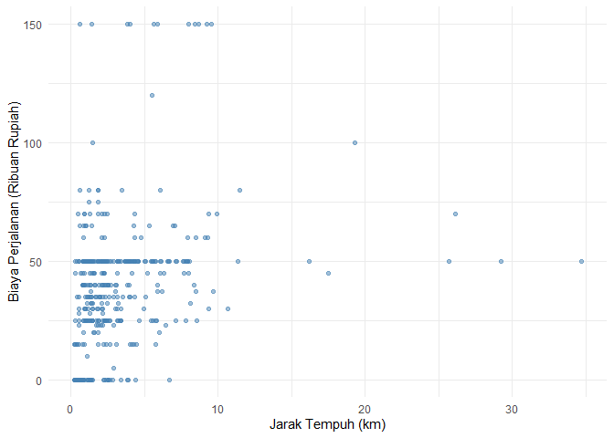
<p class="caption">(\#fig:fig-pola-jarak-biaya)Pola Hubungan Jarak Tempuh dan Biaya Perjalanan</p>
</div>

Melalui Gambar \@ref(fig:fig-pola-jarak-biaya), sebaran titik-titik koordinatnya menampilkan konsentrasi yang membentuk sebuah lintasan terarah. 

Sebagai perbandingan agar lebih mudah diidentifikasi, mari amati bentuk plot yang membentuk pola teoretis (garis lurus linear) serta kondisi yang sama sekali tidak berpola pada skenario data hipotetis berikut ini:

<div class="figure" style="text-align: center">
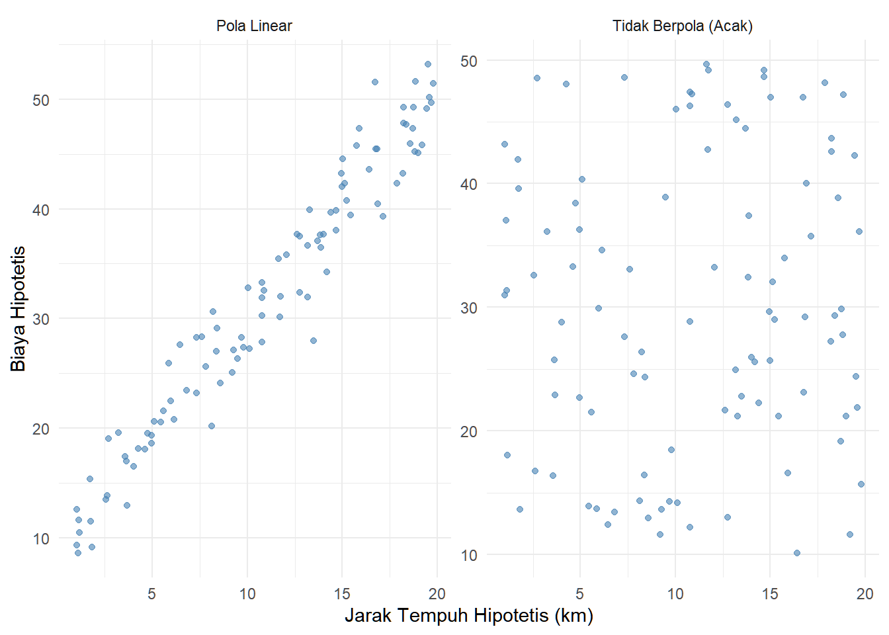
<p class="caption">(\#fig:fig-perbandingan-pola)Perbandingan Pola Linear dan Kondisi Tidak Berpola (Hipotetis)</p>
</div>

Anda dapat membandingkan titik-titik sebaran kampus UINRIL pada observasi pertama dengan kedua skenario referensi di atas untuk melihat apakah grafik tersebut mencontoh wujud *trend* model linear yang rapi, atau malah bersifat acak. Kemampuan mendiagnosis wujud pola empirik inilah yang krusial sebelum menentukan jenis probabilitas regresi selanjutnya!
:::

### Identifikasi Hubungan Antar Variabel Secara Matematis
Mengidentifikasi hubungan antarvariabel secara empiris tidak selalu mudah, oleh karena itu, dikembangkan **koefisien-koefisien asosiasi** yang dapat menginformasikan ketiga karakteristik tersebut secara ringkas.

Secara umum, koefisien asosiasi memiliki **rentang nilai antara 0 sampai dengan 1** dan tanda **positif (+) atau negatif (-)**. Rinciannya adalah sebagai berikut:

- Semakin mendekati 1 nilainya, semakin **kuat** hubungan antara kedua variabel. Sebaliknya, semakin mendekati 0 nilainya, semakin **lemah** hubungan antara kedua variabel.
- Tanda **positif (+)** menunjukkan hubungan yang searah, sedangkan tanda **negatif (-)** menunjukkan hubungan yang berlawanan arah.

Koefisien yang menerangkan pola **khusus hanya ada pada hubungan antar variabel metrik** dan berbeda dengan koefisien asosiasi yang dimaksud sebelumnya. Kita akan mempelajarinya pada bab \@ref(bab-13-regresi-sederhana).

#### Karakteristik Hubungan dan Tingkat Pengukuran Variabel

Di subbab sebelumnya kita telah mengenal karakteristik-karakteristik yang dapat diidentifikasi dalam sebuah hubungan antara dua variabel. Karakteristik ini **sangat berhubungan erat** dengan **tingkat pengukuran variabel-variabel yang dianalisis**. Berikut adalah penjelasan mengenai perbedaan karakteristik-karakteristik hubungan yang bisa diidentifikasi berdasarkan **tingkat pengukuran yang sama** untuk kedua variabel.

<table class="table table-striped table-hover" style="width: auto !important; margin-left: auto; margin-right: auto;">
<caption>(\#tab:tbl-karakteristik-hubungan)Karakteristik Hubungan dan Tingkat Pengukuran Variabel</caption>
 <thead>
  <tr>
   <th style="text-align:left;"> Tingkat.Pengukuran </th>
   <th style="text-align:center;"> Kekuatan </th>
   <th style="text-align:center;"> Arah </th>
   <th style="text-align:center;"> Pola </th>
  </tr>
 </thead>
<tbody>
  <tr>
   <td style="text-align:left;"> Nominal </td>
   <td style="text-align:center;"> ✅ </td>
   <td style="text-align:center;"> ❌ </td>
   <td style="text-align:center;"> ❌ </td>
  </tr>
  <tr>
   <td style="text-align:left;"> Ordinal </td>
   <td style="text-align:center;"> ✅ </td>
   <td style="text-align:center;"> ✅ </td>
   <td style="text-align:center;"> ❌ </td>
  </tr>
  <tr>
   <td style="text-align:left;"> Interval </td>
   <td style="text-align:center;"> ✅ </td>
   <td style="text-align:center;"> ✅ </td>
   <td style="text-align:center;"> ✅ </td>
  </tr>
  <tr>
   <td style="text-align:left;"> Rasio </td>
   <td style="text-align:center;"> ✅ </td>
   <td style="text-align:center;"> ✅ </td>
   <td style="text-align:center;"> ✅ </td>
  </tr>
</tbody>
</table>

Dari seluruh tingkat pengukuran, hanya tingkat pengukuran **nominal** yang tidak memiliki karakteristik **arah** dan **pola**. Ini dikarenakan sifat alami variabel nominal yang hanya berfungsi sebagai **label** atau **kategori** tanpa memiliki urutan atau nilai numerik yang dapat diinterpretasikan secara matematis. Mulai variabel **ordinal** dan seterusnya, **arah** bisa diidentifikasi, karena mulai tingkat ini urutan antar kategori sudah bisa diinterpretasikan secara logis.

Sementara itu, **pola** hanya bisa diidentifikasi pada tingkat pengukuran **interval** dan **rasio**, karena pola hanya bisa diidentifikasi pada nilai yang berupa angka.

Bagaimana jika dua variabel kita memiliki tingkat pengukuran yang berbeda? Kita harus melihat variabel yang **tingkat pengukurannya lebih rendah**. Mari simak contoh kasus berikut.

::: rmdkasus
#### Studi Kasus: Karakteristik Hubungan Berdasarkan Tingkat Pengukuran Variabel {.unnumbered}

Perhatikan dataset contoh berikut.

<table class="table table-striped table-hover" style="width: auto !important; margin-left: auto; margin-right: auto;">
<caption>(\#tab:tbl-dataset-beda-tingkat-pengukuran)Dataset Beda Tingkat Pengukuran</caption>
 <thead>
  <tr>
   <th style="text-align:left;"> ID </th>
   <th style="text-align:center;"> Jarak </th>
   <th style="text-align:center;"> Uang_saku </th>
  </tr>
 </thead>
<tbody>
  <tr>
   <td style="text-align:left;"> 1 </td>
   <td style="text-align:center;"> 23 </td>
   <td style="text-align:center;"> &lt;1 Juta rupiah </td>
  </tr>
  <tr>
   <td style="text-align:left;"> 2 </td>
   <td style="text-align:center;"> 12 </td>
   <td style="text-align:center;"> 2-3 Juta rupiah </td>
  </tr>
  <tr>
   <td style="text-align:left;"> 3 </td>
   <td style="text-align:center;"> 34 </td>
   <td style="text-align:center;"> 3-4 Juta rupiah </td>
  </tr>
  <tr>
   <td style="text-align:left;"> 4 </td>
   <td style="text-align:center;"> 45 </td>
   <td style="text-align:center;"> &gt;4 Juta rupiah </td>
  </tr>
  <tr>
   <td style="text-align:left;"> 5 </td>
   <td style="text-align:center;"> 56 </td>
   <td style="text-align:center;"> &lt;1 Juta rupiah </td>
  </tr>
</tbody>
</table>

Variabel `jarak` dan `uang_saku` memiliki tingkat pengukuran yang berbeda (rasio dan ordinal). Oleh karena itu, kita tidak dapat langsung menentukan karakteristik hubungan antara kedua variabel tersebut berdasarkan Tabel \@ref(tab:tbl-karakteristik-hubungan).

Oleh karena variabel yang lebih rendah tingkat pengukurannya adalah `uang_saku` (ordinal), maka kita perlu melakukan transformasi terlebih dahulu variabel `jarak` menjadi ordinal agar dapat dianalisis lebih lanjut:

<table class="table table-striped table-hover" style="width: auto !important; margin-left: auto; margin-right: auto;">
<caption>(\#tab:tbl-dataset-beda-tingkat-pengukuran-transformasi)Dataset Beda Tingkat Pengukuran (Transformasi)</caption>
 <thead>
  <tr>
   <th style="text-align:left;"> ID </th>
   <th style="text-align:center;"> Jarak </th>
   <th style="text-align:center;"> Uang_saku </th>
  </tr>
 </thead>
<tbody>
  <tr>
   <td style="text-align:left;"> 1 </td>
   <td style="text-align:center;"> 20-30 km </td>
   <td style="text-align:center;"> &lt;1 Juta rupiah </td>
  </tr>
  <tr>
   <td style="text-align:left;"> 2 </td>
   <td style="text-align:center;"> 10-20 km </td>
   <td style="text-align:center;"> 2-3 Juta rupiah </td>
  </tr>
  <tr>
   <td style="text-align:left;"> 3 </td>
   <td style="text-align:center;"> 30-40 km </td>
   <td style="text-align:center;"> 3-4 Juta rupiah </td>
  </tr>
  <tr>
   <td style="text-align:left;"> 4 </td>
   <td style="text-align:center;"> 40-50 km </td>
   <td style="text-align:center;"> &gt;4 Juta rupiah </td>
  </tr>
  <tr>
   <td style="text-align:left;"> 5 </td>
   <td style="text-align:center;"> &lt;10 km </td>
   <td style="text-align:center;"> &lt;1 Juta rupiah </td>
  </tr>
</tbody>
</table>

Dengan demikian, kita dapat mengidentifikasi karakteristik hubungan antara kedua variabel tersebut berdasarkan Tabel \@ref(tab:tbl-karakteristik-hubungan) yakni untuk variabel **ordinal**, yakni **kekuatan** dan **arah**. Koefisien asosiasinya juga berarti memiliki kisaran angka antara 0 sampai dengan 1 dan tanda positif (+) atau negatif (-).
:::

### Bentuk Asosiasi Sepasang Variabel

Setelah mempelajari karakteristik hubungan antarvariabel, kita perlu menguasai bentuk-bentuk asosiasi yang ada di antara kedua variabel. Penguasaan bentuk ini penting karena bentuk asosiasi tersebut **sangat menentukan jenis analisis asosiasi yang akan kita gunakan** selanjutnya, dan keduanya **sangat berlainan satu sama lain**.

Bentuk asosiasi dua variabel dapat dibagi menjadi  **keterkaitan** atau **korelasi** dan **pengaruh** atau **kausalitas**.

- **Keterkaitan** atau **korelasi** adalah bentuk hubungan yang biasanya teridentifikasi secara kebetulan, setelah data dianalisis. Kekuatan, arah, dan pola yang terjadi pada dua variabel dipandang sebagai sesuatu yang terjadi secara alami dan belum bisa dijelaskan penyebabnya.
- **Pengaruh** atau **kausalitas** adalah bentuk hubungan yang terjadi karena adanya **sebab dan akibat** antara dua variabel tersebut. Dalam hal ini, perubahan pada satu variabel menyebabkan perubahan pada variabel lainnya. Dalam bentuk ini, kita sudah memiliki asumsi awal mengenai variabel mana yang menjadi sebab dan mana yang menjadi akibat.

Penting untuk memiliki pemahaman bahwa **korelasi belum tentu sebuah kausalitas**, akan tetapi **kausalitas sudah pasti memiliki korelasi**. Mengapa demikian? Hubungan korelasi menunjukkan **indikasi** adanya pengaruh antara kedua variabel tersebut. Akan tetapi, kita belum bisa mengatakan salah satu menjadi pemengaruh yang lain tanpa menelaah secara mendalam. Walaupun bisa jadi ada pengaruh di antara kedua variabel tersebut, pengaruh ini bisa jadi disebabkan oleh adanya variabel antara atau variabel pengganggu, yang disebut juga ***confounding variable***. Simak studi kasus berikut. 

::: rmdkasus
#### Studi Kasus: Konsumsi Cokelat dan Peraih Nobel {.unnumbered}

Sebagai ilustrasi klasik nan menggelitik tentang perbedaan antara korelasi dan kausalitas, mari kita telaah sebuah temuan populer yang dipublikasikan oleh Dr. Franz Messerli pada tahun 2012 [@messerli2012chocolate]. Melalui observasinya, beliau menganalisis data statistik penduduk dari puluhan negara dan memplot korelasi antara *rata-rata konsumsi cokelat per kapita* (kg/tahun) dengan *jumlah peraih hadiah Nobel per 10 juta penduduk*.

Hasil *scatterplot*-nya secara mengejutkan menunjukkan bahwa terdapat **korelasi linear positif yang sangat kuat** (sangat signifikan) antara angka konsumsi cokelat sebuah negara dengan proporsi pemenang Nobel dari negara tersebut (Gambar \@ref(fig:scatterplot-cokelat-nobel)). Semakin tinggi tingkat konsumsi batangan cokelat penduduk negaranya, diiringi pula dengan melesatnya jumlah peraih penghargaan Nobel (di posisi teratas diduduki oleh negara Swiss dan Swedia).

<div class="figure" style="text-align: center">
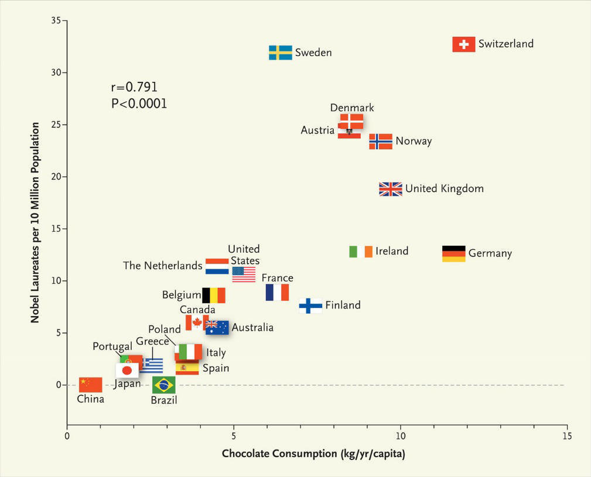
<p class="caption">(\#fig:scatterplot-cokelat-nobel)Scatterplot Konsumsi Cokelat dan Peraih Nobel. Sumber: data.europa.eu</p>
</div>

Namun, apakah korelasi statistik riil yang sangat kuat ini berarti bahwa memakan cokelat secara masif **"menyebabkan"** atau meningkatkan kecerdasan kognitif yang seketika membuat seseorang memenangkan Nobel (*kausalitas*)? 

Tentu saja kesimpulan tersebut keliru. Kendati secara hitungan matematis keduanya berkorelasi sangat tinggi, fenomena ini kemungkinan besar hanyalah imbas dari sebuah **variabel antara** (*confounding variable*) yang "menjembatani" tingkat konsumsi coklat dan jumlah peraih penghargaan Nobel, yakni tingkat **kesejahteraan sosial ekonomi makro**. Negara yang makmur dan tergolong sangat maju tentu memiliki daya beli yang lebih baik terhadap komoditas tersier seperti cokelat. Di lain sisi, wujud kemakmuran finansial tersebut merupakan fondasi dasar bagi ekosistem edukasi kelas dunia dan sokongan dana riset sains yang sangat dominan, sehingga sudah sewajarnya secara terpisah berujung pada tingginya kuantitas masyarakat yang sukses meraih Nobel.
:::

## Koefisien Korelasi Variabel Nominal
Dalam bab ini kita akan mempelajari **koefisien-koefisien korelasi** untuk dua variabel **nominal**. Koefisien-koefisien yang akan kita pelajari di antaranya adalah koefisien yang termasuk ke dalam kategori berbasis chi-kuadrat (*chi-square*, $\chi^2$) dan berbasis galat (*error*).

Koefisien yang termasuk ke dalam kategori berbasis chi-kuadrat yang akan kita bahas di antaranya adalah **koefisien *phi*** ($\phi$), **koefisien *Cramer's V*** (V), dan **koefisien *contingency*** (C). Sementara itu, koefisien yang termasuk ke dalam kategori berbasis galat (*error*) adalah **koefisien *Lambda*** ($\lambda$).

### Koefisien Korelasi Variabel Nominal Berbasis Chi-Kuadrat ($\chi^2$)
Chi-kuadrat (*chi-square*, dibaca "kai-square") sebenarnya adalah adalah salah satu teknik statistik yang biasa digunakan untuk menganalisis hubungan antara dua variabel **kategoris** dengan menguji apakah perbedaan yang diamati dalam distribusi frekuensi suatu sampel dapat dijelaskan hanya oleh peluang acak (*random chance*), atau justru mencerminkan perbedaan yang nyata (*genuine differences*) dalam populasi [@ewing2020basic].

Karena digunakan untuk dua variabel kategoris, Uji *Chi-square* menggunakan **tabel silang**, yakni tabel yang menampilkan frekuensi objek berdasarkan dua variabel. Dalam tabel silang, berbeda dengan tabel data terstruktur, **baris bukan lagi objek dan kolom bukan lagi variabel**. Baik baris maupun kolom **memuat kategori nilai dari seluruh variabel** yang dianalisis. 

Jumlah kategori dari variabel pertama akan menjadi **jumlah baris**, sementara jumlah kategori dari variabel kedua akan menjadi **jumlah kolom**. Dari situlah kita menyebutkan ukuran tabel silang sebagai **"tabel silang $b \times k$"**, dengan $b$ adalah jumlah baris dan $k$ adalah jumlah kolom. Sebagai contoh, jika variabel pertama memiliki 3 kategori dan variabel kedua memiliki 4 kategori, maka tabel silangnya berukuran $3 \times 4$.

Sel-sel tabel akan memuat rangkuman **nilai frekuensi yang diamati** (Tabel \@ref(tab:contoh-tabel-silang)). Dari tabel silang ini, tujuan kita adalah menganalisis **frekuensi teramati** (*observed frequency*) dan **frekuensi yang diharapkan** (*expected frequency*) untuk uji *Chi-square*. Perhatikan kasus berikut ini.


::: rmdkasus
### Studi Kasus: Tabel Silang Variabel Nominal {.unnumbered}
Korelasi antara variabel `jenis.tempat.tinggal` dan `kendaraan.utama` mahasiswa UNILA akan dianalisis pada tingkat kepercayaan 95%. Berikut adalah tabel silang dari kedua variabel tersebut.


```{=html}
<div class="tabwid"><style>.cl-959060a8{}.cl-9574cb2c{font-family:'Arial';font-size:11pt;font-weight:normal;font-style:normal;text-decoration:none;color:rgba(0, 0, 0, 1.00);background-color:transparent;}.cl-9574cb4a{font-family:'Arial';font-size:11pt;font-weight:bold;font-style:normal;text-decoration:none;color:rgba(0, 0, 0, 1.00);background-color:transparent;}.cl-9581230e{margin:0;text-align:left;border-bottom: 0 solid rgba(0, 0, 0, 1.00);border-top: 0 solid rgba(0, 0, 0, 1.00);border-left: 0 solid rgba(0, 0, 0, 1.00);border-right: 0 solid rgba(0, 0, 0, 1.00);padding-bottom:2pt;padding-top:2pt;padding-left:5pt;padding-right:5pt;line-height: 1;background-color:transparent;}.cl-95812322{margin:0;text-align:center;border-bottom: 0 solid rgba(0, 0, 0, 1.00);border-top: 0 solid rgba(0, 0, 0, 1.00);border-left: 0 solid rgba(0, 0, 0, 1.00);border-right: 0 solid rgba(0, 0, 0, 1.00);padding-bottom:2pt;padding-top:2pt;padding-left:5pt;padding-right:5pt;line-height: 1;background-color:transparent;}.cl-9581232c{margin:0;text-align:left;border-bottom: 0 solid rgba(0, 0, 0, 1.00);border-top: 0 solid rgba(0, 0, 0, 1.00);border-left: 0 solid rgba(0, 0, 0, 1.00);border-right: 0 solid rgba(0, 0, 0, 1.00);padding-bottom:5pt;padding-top:5pt;padding-left:5pt;padding-right:5pt;line-height: 1;background-color:transparent;}.cl-95812340{margin:0;text-align:center;border-bottom: 0 solid rgba(0, 0, 0, 1.00);border-top: 0 solid rgba(0, 0, 0, 1.00);border-left: 0 solid rgba(0, 0, 0, 1.00);border-right: 0 solid rgba(0, 0, 0, 1.00);padding-bottom:5pt;padding-top:5pt;padding-left:5pt;padding-right:5pt;line-height: 1;background-color:transparent;}.cl-9581234a{margin:0;text-align:left;border-bottom: 0 solid rgba(0, 0, 0, 1.00);border-top: 0 solid rgba(0, 0, 0, 1.00);border-left: 0 solid rgba(0, 0, 0, 1.00);border-right: 0 solid rgba(0, 0, 0, 1.00);padding-bottom:5pt;padding-top:5pt;padding-left:15pt;padding-right:5pt;line-height: 1;background-color:transparent;}.cl-95818d8a{width:3.833in;background-color:rgba(255, 255, 255, 1.00);vertical-align: middle;border-bottom: 1pt solid rgba(0, 0, 0, 1.00);border-top: 1pt solid rgba(0, 0, 0, 1.00);border-left: 0 solid rgba(0, 0, 0, 1.00);border-right: 0 solid rgba(0, 0, 0, 1.00);margin-bottom:0;margin-top:0;margin-left:0;margin-right:0;}.cl-95818d9e{width:0.846in;background-color:rgba(255, 255, 255, 1.00);vertical-align: middle;border-bottom: 1pt solid rgba(0, 0, 0, 1.00);border-top: 1pt solid rgba(0, 0, 0, 1.00);border-left: 0 solid rgba(0, 0, 0, 1.00);border-right: 0 solid rgba(0, 0, 0, 1.00);margin-bottom:0;margin-top:0;margin-left:0;margin-right:0;}.cl-95818da8{width:1.686in;background-color:rgba(255, 255, 255, 1.00);vertical-align: middle;border-bottom: 1pt solid rgba(0, 0, 0, 1.00);border-top: 1pt solid rgba(0, 0, 0, 1.00);border-left: 0 solid rgba(0, 0, 0, 1.00);border-right: 0 solid rgba(0, 0, 0, 1.00);margin-bottom:0;margin-top:0;margin-left:0;margin-right:0;}.cl-95818dbc{width:1.117in;background-color:rgba(255, 255, 255, 1.00);vertical-align: middle;border-bottom: 1pt solid rgba(0, 0, 0, 1.00);border-top: 1pt solid rgba(0, 0, 0, 1.00);border-left: 0 solid rgba(0, 0, 0, 1.00);border-right: 0 solid rgba(0, 0, 0, 1.00);margin-bottom:0;margin-top:0;margin-left:0;margin-right:0;}.cl-95818dc6{width:2.102in;background-color:rgba(255, 255, 255, 1.00);vertical-align: middle;border-bottom: 1pt solid rgba(0, 0, 0, 1.00);border-top: 1pt solid rgba(0, 0, 0, 1.00);border-left: 0 solid rgba(0, 0, 0, 1.00);border-right: 0 solid rgba(0, 0, 0, 1.00);margin-bottom:0;margin-top:0;margin-left:0;margin-right:0;}.cl-95818dd0{width:2.612in;background-color:rgba(255, 255, 255, 1.00);vertical-align: middle;border-bottom: 1pt solid rgba(0, 0, 0, 1.00);border-top: 1pt solid rgba(0, 0, 0, 1.00);border-left: 0 solid rgba(0, 0, 0, 1.00);border-right: 0 solid rgba(0, 0, 0, 1.00);margin-bottom:0;margin-top:0;margin-left:0;margin-right:0;}.cl-95818dda{width:2.051in;background-color:rgba(255, 255, 255, 1.00);vertical-align: middle;border-bottom: 1pt solid rgba(0, 0, 0, 1.00);border-top: 1pt solid rgba(0, 0, 0, 1.00);border-left: 0 solid rgba(0, 0, 0, 1.00);border-right: 0 solid rgba(0, 0, 0, 1.00);margin-bottom:0;margin-top:0;margin-left:0;margin-right:0;}.cl-95818de4{width:2.535in;background-color:rgba(255, 255, 255, 1.00);vertical-align: middle;border-bottom: 1pt solid rgba(0, 0, 0, 1.00);border-top: 1pt solid rgba(0, 0, 0, 1.00);border-left: 0 solid rgba(0, 0, 0, 1.00);border-right: 0 solid rgba(0, 0, 0, 1.00);margin-bottom:0;margin-top:0;margin-left:0;margin-right:0;}.cl-95818df8{width:3.833in;background-color:rgba(255, 255, 255, 1.00);vertical-align: middle;border-bottom: 1pt solid rgba(0, 0, 0, 1.00);border-top: 1pt solid rgba(0, 0, 0, 1.00);border-left: 0 solid rgba(0, 0, 0, 1.00);border-right: 0 solid rgba(0, 0, 0, 1.00);margin-bottom:0;margin-top:0;margin-left:0;margin-right:0;}.cl-95818e0c{width:0.846in;background-color:rgba(255, 255, 255, 1.00);vertical-align: middle;border-bottom: 1pt solid rgba(0, 0, 0, 1.00);border-top: 1pt solid rgba(0, 0, 0, 1.00);border-left: 0 solid rgba(0, 0, 0, 1.00);border-right: 0 solid rgba(0, 0, 0, 1.00);margin-bottom:0;margin-top:0;margin-left:0;margin-right:0;}.cl-95818e16{width:1.686in;background-color:rgba(255, 255, 255, 1.00);vertical-align: middle;border-bottom: 1pt solid rgba(0, 0, 0, 1.00);border-top: 1pt solid rgba(0, 0, 0, 1.00);border-left: 0 solid rgba(0, 0, 0, 1.00);border-right: 0 solid rgba(0, 0, 0, 1.00);margin-bottom:0;margin-top:0;margin-left:0;margin-right:0;}.cl-95818e20{width:1.117in;background-color:rgba(255, 255, 255, 1.00);vertical-align: middle;border-bottom: 1pt solid rgba(0, 0, 0, 1.00);border-top: 1pt solid rgba(0, 0, 0, 1.00);border-left: 0 solid rgba(0, 0, 0, 1.00);border-right: 0 solid rgba(0, 0, 0, 1.00);margin-bottom:0;margin-top:0;margin-left:0;margin-right:0;}.cl-95818e2a{width:2.102in;background-color:rgba(255, 255, 255, 1.00);vertical-align: middle;border-bottom: 1pt solid rgba(0, 0, 0, 1.00);border-top: 1pt solid rgba(0, 0, 0, 1.00);border-left: 0 solid rgba(0, 0, 0, 1.00);border-right: 0 solid rgba(0, 0, 0, 1.00);margin-bottom:0;margin-top:0;margin-left:0;margin-right:0;}.cl-95818e34{width:2.612in;background-color:rgba(255, 255, 255, 1.00);vertical-align: middle;border-bottom: 1pt solid rgba(0, 0, 0, 1.00);border-top: 1pt solid rgba(0, 0, 0, 1.00);border-left: 0 solid rgba(0, 0, 0, 1.00);border-right: 0 solid rgba(0, 0, 0, 1.00);margin-bottom:0;margin-top:0;margin-left:0;margin-right:0;}.cl-95818e48{width:2.051in;background-color:rgba(255, 255, 255, 1.00);vertical-align: middle;border-bottom: 1pt solid rgba(0, 0, 0, 1.00);border-top: 1pt solid rgba(0, 0, 0, 1.00);border-left: 0 solid rgba(0, 0, 0, 1.00);border-right: 0 solid rgba(0, 0, 0, 1.00);margin-bottom:0;margin-top:0;margin-left:0;margin-right:0;}.cl-95818e52{width:2.535in;background-color:rgba(255, 255, 255, 1.00);vertical-align: middle;border-bottom: 1pt solid rgba(0, 0, 0, 1.00);border-top: 1pt solid rgba(0, 0, 0, 1.00);border-left: 0 solid rgba(0, 0, 0, 1.00);border-right: 0 solid rgba(0, 0, 0, 1.00);margin-bottom:0;margin-top:0;margin-left:0;margin-right:0;}.cl-95818e66{width:3.833in;background-color:rgba(255, 255, 255, 1.00);vertical-align: top;border-bottom: 0 solid rgba(0, 0, 0, 1.00);border-top: 0 solid rgba(0, 0, 0, 1.00);border-left: 0 solid rgba(0, 0, 0, 1.00);border-right: 0 solid rgba(0, 0, 0, 1.00);margin-bottom:0;margin-top:0;margin-left:0;margin-right:0;}.cl-95818e67{width:0.846in;background-color:rgba(255, 255, 255, 1.00);vertical-align: top;border-bottom: 0 solid rgba(0, 0, 0, 1.00);border-top: 0 solid rgba(0, 0, 0, 1.00);border-left: 0 solid rgba(0, 0, 0, 1.00);border-right: 0 solid rgba(0, 0, 0, 1.00);margin-bottom:0;margin-top:0;margin-left:0;margin-right:0;}.cl-95818e7a{width:1.686in;background-color:rgba(255, 255, 255, 1.00);vertical-align: top;border-bottom: 0 solid rgba(0, 0, 0, 1.00);border-top: 0 solid rgba(0, 0, 0, 1.00);border-left: 0 solid rgba(0, 0, 0, 1.00);border-right: 0 solid rgba(0, 0, 0, 1.00);margin-bottom:0;margin-top:0;margin-left:0;margin-right:0;}.cl-95818e84{width:1.117in;background-color:rgba(255, 255, 255, 1.00);vertical-align: top;border-bottom: 0 solid rgba(0, 0, 0, 1.00);border-top: 0 solid rgba(0, 0, 0, 1.00);border-left: 0 solid rgba(0, 0, 0, 1.00);border-right: 0 solid rgba(0, 0, 0, 1.00);margin-bottom:0;margin-top:0;margin-left:0;margin-right:0;}.cl-95818ea2{width:2.102in;background-color:rgba(255, 255, 255, 1.00);vertical-align: top;border-bottom: 0 solid rgba(0, 0, 0, 1.00);border-top: 0 solid rgba(0, 0, 0, 1.00);border-left: 0 solid rgba(0, 0, 0, 1.00);border-right: 0 solid rgba(0, 0, 0, 1.00);margin-bottom:0;margin-top:0;margin-left:0;margin-right:0;}.cl-95818eb6{width:2.612in;background-color:rgba(255, 255, 255, 1.00);vertical-align: top;border-bottom: 0 solid rgba(0, 0, 0, 1.00);border-top: 0 solid rgba(0, 0, 0, 1.00);border-left: 0 solid rgba(0, 0, 0, 1.00);border-right: 0 solid rgba(0, 0, 0, 1.00);margin-bottom:0;margin-top:0;margin-left:0;margin-right:0;}.cl-95818eca{width:2.051in;background-color:rgba(255, 255, 255, 1.00);vertical-align: top;border-bottom: 0 solid rgba(0, 0, 0, 1.00);border-top: 0 solid rgba(0, 0, 0, 1.00);border-left: 0 solid rgba(0, 0, 0, 1.00);border-right: 0 solid rgba(0, 0, 0, 1.00);margin-bottom:0;margin-top:0;margin-left:0;margin-right:0;}.cl-95818ede{width:2.535in;background-color:rgba(255, 255, 255, 1.00);vertical-align: top;border-bottom: 0 solid rgba(0, 0, 0, 1.00);border-top: 0 solid rgba(0, 0, 0, 1.00);border-left: 0 solid rgba(0, 0, 0, 1.00);border-right: 0 solid rgba(0, 0, 0, 1.00);margin-bottom:0;margin-top:0;margin-left:0;margin-right:0;}.cl-95818ee8{width:3.833in;background-color:rgba(255, 255, 255, 1.00);vertical-align: top;border-bottom: 0 solid rgba(0, 0, 0, 1.00);border-top: 0 solid rgba(0, 0, 0, 1.00);border-left: 0 solid rgba(0, 0, 0, 1.00);border-right: 0 solid rgba(0, 0, 0, 1.00);margin-bottom:0;margin-top:0;margin-left:0;margin-right:0;}.cl-95818ef2{width:0.846in;background-color:rgba(255, 255, 255, 1.00);vertical-align: top;border-bottom: 0 solid rgba(0, 0, 0, 1.00);border-top: 0 solid rgba(0, 0, 0, 1.00);border-left: 0 solid rgba(0, 0, 0, 1.00);border-right: 0 solid rgba(0, 0, 0, 1.00);margin-bottom:0;margin-top:0;margin-left:0;margin-right:0;}.cl-95818f06{width:1.686in;background-color:rgba(255, 255, 255, 1.00);vertical-align: top;border-bottom: 0 solid rgba(0, 0, 0, 1.00);border-top: 0 solid rgba(0, 0, 0, 1.00);border-left: 0 solid rgba(0, 0, 0, 1.00);border-right: 0 solid rgba(0, 0, 0, 1.00);margin-bottom:0;margin-top:0;margin-left:0;margin-right:0;}.cl-95818f10{width:1.117in;background-color:rgba(255, 255, 255, 1.00);vertical-align: top;border-bottom: 0 solid rgba(0, 0, 0, 1.00);border-top: 0 solid rgba(0, 0, 0, 1.00);border-left: 0 solid rgba(0, 0, 0, 1.00);border-right: 0 solid rgba(0, 0, 0, 1.00);margin-bottom:0;margin-top:0;margin-left:0;margin-right:0;}.cl-95818f1a{width:2.102in;background-color:rgba(255, 255, 255, 1.00);vertical-align: top;border-bottom: 0 solid rgba(0, 0, 0, 1.00);border-top: 0 solid rgba(0, 0, 0, 1.00);border-left: 0 solid rgba(0, 0, 0, 1.00);border-right: 0 solid rgba(0, 0, 0, 1.00);margin-bottom:0;margin-top:0;margin-left:0;margin-right:0;}.cl-95818f38{width:2.612in;background-color:rgba(255, 255, 255, 1.00);vertical-align: top;border-bottom: 0 solid rgba(0, 0, 0, 1.00);border-top: 0 solid rgba(0, 0, 0, 1.00);border-left: 0 solid rgba(0, 0, 0, 1.00);border-right: 0 solid rgba(0, 0, 0, 1.00);margin-bottom:0;margin-top:0;margin-left:0;margin-right:0;}.cl-95818f42{width:2.051in;background-color:rgba(255, 255, 255, 1.00);vertical-align: top;border-bottom: 0 solid rgba(0, 0, 0, 1.00);border-top: 0 solid rgba(0, 0, 0, 1.00);border-left: 0 solid rgba(0, 0, 0, 1.00);border-right: 0 solid rgba(0, 0, 0, 1.00);margin-bottom:0;margin-top:0;margin-left:0;margin-right:0;}.cl-95818f43{width:2.535in;background-color:rgba(255, 255, 255, 1.00);vertical-align: top;border-bottom: 0 solid rgba(0, 0, 0, 1.00);border-top: 0 solid rgba(0, 0, 0, 1.00);border-left: 0 solid rgba(0, 0, 0, 1.00);border-right: 0 solid rgba(0, 0, 0, 1.00);margin-bottom:0;margin-top:0;margin-left:0;margin-right:0;}.cl-95818f56{width:3.833in;background-color:rgba(255, 255, 255, 1.00);vertical-align: top;border-bottom: 0 solid rgba(0, 0, 0, 1.00);border-top: 0 solid rgba(0, 0, 0, 1.00);border-left: 0 solid rgba(0, 0, 0, 1.00);border-right: 0 solid rgba(0, 0, 0, 1.00);margin-bottom:0;margin-top:0;margin-left:0;margin-right:0;}.cl-95818f60{width:0.846in;background-color:rgba(255, 255, 255, 1.00);vertical-align: top;border-bottom: 0 solid rgba(0, 0, 0, 1.00);border-top: 0 solid rgba(0, 0, 0, 1.00);border-left: 0 solid rgba(0, 0, 0, 1.00);border-right: 0 solid rgba(0, 0, 0, 1.00);margin-bottom:0;margin-top:0;margin-left:0;margin-right:0;}.cl-95818f74{width:1.686in;background-color:rgba(255, 255, 255, 1.00);vertical-align: top;border-bottom: 0 solid rgba(0, 0, 0, 1.00);border-top: 0 solid rgba(0, 0, 0, 1.00);border-left: 0 solid rgba(0, 0, 0, 1.00);border-right: 0 solid rgba(0, 0, 0, 1.00);margin-bottom:0;margin-top:0;margin-left:0;margin-right:0;}.cl-95818f7e{width:1.117in;background-color:rgba(255, 255, 255, 1.00);vertical-align: top;border-bottom: 0 solid rgba(0, 0, 0, 1.00);border-top: 0 solid rgba(0, 0, 0, 1.00);border-left: 0 solid rgba(0, 0, 0, 1.00);border-right: 0 solid rgba(0, 0, 0, 1.00);margin-bottom:0;margin-top:0;margin-left:0;margin-right:0;}.cl-95818f7f{width:2.102in;background-color:rgba(255, 255, 255, 1.00);vertical-align: top;border-bottom: 0 solid rgba(0, 0, 0, 1.00);border-top: 0 solid rgba(0, 0, 0, 1.00);border-left: 0 solid rgba(0, 0, 0, 1.00);border-right: 0 solid rgba(0, 0, 0, 1.00);margin-bottom:0;margin-top:0;margin-left:0;margin-right:0;}.cl-95818f88{width:2.612in;background-color:rgba(255, 255, 255, 1.00);vertical-align: top;border-bottom: 0 solid rgba(0, 0, 0, 1.00);border-top: 0 solid rgba(0, 0, 0, 1.00);border-left: 0 solid rgba(0, 0, 0, 1.00);border-right: 0 solid rgba(0, 0, 0, 1.00);margin-bottom:0;margin-top:0;margin-left:0;margin-right:0;}.cl-95818f92{width:2.051in;background-color:rgba(255, 255, 255, 1.00);vertical-align: top;border-bottom: 0 solid rgba(0, 0, 0, 1.00);border-top: 0 solid rgba(0, 0, 0, 1.00);border-left: 0 solid rgba(0, 0, 0, 1.00);border-right: 0 solid rgba(0, 0, 0, 1.00);margin-bottom:0;margin-top:0;margin-left:0;margin-right:0;}.cl-95818fa6{width:2.535in;background-color:rgba(255, 255, 255, 1.00);vertical-align: top;border-bottom: 0 solid rgba(0, 0, 0, 1.00);border-top: 0 solid rgba(0, 0, 0, 1.00);border-left: 0 solid rgba(0, 0, 0, 1.00);border-right: 0 solid rgba(0, 0, 0, 1.00);margin-bottom:0;margin-top:0;margin-left:0;margin-right:0;}.cl-95818fba{width:3.833in;background-color:rgba(255, 255, 255, 1.00);vertical-align: top;border-bottom: 0 solid rgba(0, 0, 0, 1.00);border-top: 0 solid rgba(0, 0, 0, 1.00);border-left: 0 solid rgba(0, 0, 0, 1.00);border-right: 0 solid rgba(0, 0, 0, 1.00);margin-bottom:0;margin-top:0;margin-left:0;margin-right:0;}.cl-95818fd8{width:0.846in;background-color:rgba(255, 255, 255, 1.00);vertical-align: top;border-bottom: 0 solid rgba(0, 0, 0, 1.00);border-top: 0 solid rgba(0, 0, 0, 1.00);border-left: 0 solid rgba(0, 0, 0, 1.00);border-right: 0 solid rgba(0, 0, 0, 1.00);margin-bottom:0;margin-top:0;margin-left:0;margin-right:0;}.cl-95818fd9{width:1.686in;background-color:rgba(255, 255, 255, 1.00);vertical-align: top;border-bottom: 0 solid rgba(0, 0, 0, 1.00);border-top: 0 solid rgba(0, 0, 0, 1.00);border-left: 0 solid rgba(0, 0, 0, 1.00);border-right: 0 solid rgba(0, 0, 0, 1.00);margin-bottom:0;margin-top:0;margin-left:0;margin-right:0;}.cl-95818fe2{width:1.117in;background-color:rgba(255, 255, 255, 1.00);vertical-align: top;border-bottom: 0 solid rgba(0, 0, 0, 1.00);border-top: 0 solid rgba(0, 0, 0, 1.00);border-left: 0 solid rgba(0, 0, 0, 1.00);border-right: 0 solid rgba(0, 0, 0, 1.00);margin-bottom:0;margin-top:0;margin-left:0;margin-right:0;}.cl-95819000{width:2.102in;background-color:rgba(255, 255, 255, 1.00);vertical-align: top;border-bottom: 0 solid rgba(0, 0, 0, 1.00);border-top: 0 solid rgba(0, 0, 0, 1.00);border-left: 0 solid rgba(0, 0, 0, 1.00);border-right: 0 solid rgba(0, 0, 0, 1.00);margin-bottom:0;margin-top:0;margin-left:0;margin-right:0;}.cl-9581900a{width:2.612in;background-color:rgba(255, 255, 255, 1.00);vertical-align: top;border-bottom: 0 solid rgba(0, 0, 0, 1.00);border-top: 0 solid rgba(0, 0, 0, 1.00);border-left: 0 solid rgba(0, 0, 0, 1.00);border-right: 0 solid rgba(0, 0, 0, 1.00);margin-bottom:0;margin-top:0;margin-left:0;margin-right:0;}.cl-9581901e{width:2.051in;background-color:rgba(255, 255, 255, 1.00);vertical-align: top;border-bottom: 0 solid rgba(0, 0, 0, 1.00);border-top: 0 solid rgba(0, 0, 0, 1.00);border-left: 0 solid rgba(0, 0, 0, 1.00);border-right: 0 solid rgba(0, 0, 0, 1.00);margin-bottom:0;margin-top:0;margin-left:0;margin-right:0;}.cl-95819028{width:2.535in;background-color:rgba(255, 255, 255, 1.00);vertical-align: top;border-bottom: 0 solid rgba(0, 0, 0, 1.00);border-top: 0 solid rgba(0, 0, 0, 1.00);border-left: 0 solid rgba(0, 0, 0, 1.00);border-right: 0 solid rgba(0, 0, 0, 1.00);margin-bottom:0;margin-top:0;margin-left:0;margin-right:0;}.cl-9581903c{width:3.833in;background-color:rgba(255, 255, 255, 1.00);vertical-align: top;border-bottom: 0 solid rgba(0, 0, 0, 1.00);border-top: 0 solid rgba(0, 0, 0, 1.00);border-left: 0 solid rgba(0, 0, 0, 1.00);border-right: 0 solid rgba(0, 0, 0, 1.00);margin-bottom:0;margin-top:0;margin-left:0;margin-right:0;}.cl-95819046{width:0.846in;background-color:rgba(255, 255, 255, 1.00);vertical-align: top;border-bottom: 0 solid rgba(0, 0, 0, 1.00);border-top: 0 solid rgba(0, 0, 0, 1.00);border-left: 0 solid rgba(0, 0, 0, 1.00);border-right: 0 solid rgba(0, 0, 0, 1.00);margin-bottom:0;margin-top:0;margin-left:0;margin-right:0;}.cl-95819050{width:1.686in;background-color:rgba(255, 255, 255, 1.00);vertical-align: top;border-bottom: 0 solid rgba(0, 0, 0, 1.00);border-top: 0 solid rgba(0, 0, 0, 1.00);border-left: 0 solid rgba(0, 0, 0, 1.00);border-right: 0 solid rgba(0, 0, 0, 1.00);margin-bottom:0;margin-top:0;margin-left:0;margin-right:0;}.cl-9581906e{width:1.117in;background-color:rgba(255, 255, 255, 1.00);vertical-align: top;border-bottom: 0 solid rgba(0, 0, 0, 1.00);border-top: 0 solid rgba(0, 0, 0, 1.00);border-left: 0 solid rgba(0, 0, 0, 1.00);border-right: 0 solid rgba(0, 0, 0, 1.00);margin-bottom:0;margin-top:0;margin-left:0;margin-right:0;}.cl-95819078{width:2.102in;background-color:rgba(255, 255, 255, 1.00);vertical-align: top;border-bottom: 0 solid rgba(0, 0, 0, 1.00);border-top: 0 solid rgba(0, 0, 0, 1.00);border-left: 0 solid rgba(0, 0, 0, 1.00);border-right: 0 solid rgba(0, 0, 0, 1.00);margin-bottom:0;margin-top:0;margin-left:0;margin-right:0;}.cl-9581908c{width:2.612in;background-color:rgba(255, 255, 255, 1.00);vertical-align: top;border-bottom: 0 solid rgba(0, 0, 0, 1.00);border-top: 0 solid rgba(0, 0, 0, 1.00);border-left: 0 solid rgba(0, 0, 0, 1.00);border-right: 0 solid rgba(0, 0, 0, 1.00);margin-bottom:0;margin-top:0;margin-left:0;margin-right:0;}.cl-95819096{width:2.051in;background-color:rgba(255, 255, 255, 1.00);vertical-align: top;border-bottom: 0 solid rgba(0, 0, 0, 1.00);border-top: 0 solid rgba(0, 0, 0, 1.00);border-left: 0 solid rgba(0, 0, 0, 1.00);border-right: 0 solid rgba(0, 0, 0, 1.00);margin-bottom:0;margin-top:0;margin-left:0;margin-right:0;}.cl-958190aa{width:2.535in;background-color:rgba(255, 255, 255, 1.00);vertical-align: top;border-bottom: 0 solid rgba(0, 0, 0, 1.00);border-top: 0 solid rgba(0, 0, 0, 1.00);border-left: 0 solid rgba(0, 0, 0, 1.00);border-right: 0 solid rgba(0, 0, 0, 1.00);margin-bottom:0;margin-top:0;margin-left:0;margin-right:0;}.cl-958190be{width:3.833in;background-color:rgba(255, 255, 255, 1.00);vertical-align: top;border-bottom: 1pt solid rgba(0, 0, 0, 1.00);border-top: 0 solid rgba(0, 0, 0, 1.00);border-left: 0 solid rgba(0, 0, 0, 1.00);border-right: 0 solid rgba(0, 0, 0, 1.00);margin-bottom:0;margin-top:0;margin-left:0;margin-right:0;}.cl-958190c8{width:0.846in;background-color:rgba(255, 255, 255, 1.00);vertical-align: top;border-bottom: 1pt solid rgba(0, 0, 0, 1.00);border-top: 0 solid rgba(0, 0, 0, 1.00);border-left: 0 solid rgba(0, 0, 0, 1.00);border-right: 0 solid rgba(0, 0, 0, 1.00);margin-bottom:0;margin-top:0;margin-left:0;margin-right:0;}.cl-958190d2{width:1.686in;background-color:rgba(255, 255, 255, 1.00);vertical-align: top;border-bottom: 1pt solid rgba(0, 0, 0, 1.00);border-top: 0 solid rgba(0, 0, 0, 1.00);border-left: 0 solid rgba(0, 0, 0, 1.00);border-right: 0 solid rgba(0, 0, 0, 1.00);margin-bottom:0;margin-top:0;margin-left:0;margin-right:0;}.cl-958190d3{width:1.117in;background-color:rgba(255, 255, 255, 1.00);vertical-align: top;border-bottom: 1pt solid rgba(0, 0, 0, 1.00);border-top: 0 solid rgba(0, 0, 0, 1.00);border-left: 0 solid rgba(0, 0, 0, 1.00);border-right: 0 solid rgba(0, 0, 0, 1.00);margin-bottom:0;margin-top:0;margin-left:0;margin-right:0;}.cl-958190e6{width:2.102in;background-color:rgba(255, 255, 255, 1.00);vertical-align: top;border-bottom: 1pt solid rgba(0, 0, 0, 1.00);border-top: 0 solid rgba(0, 0, 0, 1.00);border-left: 0 solid rgba(0, 0, 0, 1.00);border-right: 0 solid rgba(0, 0, 0, 1.00);margin-bottom:0;margin-top:0;margin-left:0;margin-right:0;}.cl-958190f0{width:2.612in;background-color:rgba(255, 255, 255, 1.00);vertical-align: top;border-bottom: 1pt solid rgba(0, 0, 0, 1.00);border-top: 0 solid rgba(0, 0, 0, 1.00);border-left: 0 solid rgba(0, 0, 0, 1.00);border-right: 0 solid rgba(0, 0, 0, 1.00);margin-bottom:0;margin-top:0;margin-left:0;margin-right:0;}.cl-95819104{width:2.051in;background-color:rgba(255, 255, 255, 1.00);vertical-align: top;border-bottom: 1pt solid rgba(0, 0, 0, 1.00);border-top: 0 solid rgba(0, 0, 0, 1.00);border-left: 0 solid rgba(0, 0, 0, 1.00);border-right: 0 solid rgba(0, 0, 0, 1.00);margin-bottom:0;margin-top:0;margin-left:0;margin-right:0;}.cl-95819118{width:2.535in;background-color:rgba(255, 255, 255, 1.00);vertical-align: top;border-bottom: 1pt solid rgba(0, 0, 0, 1.00);border-top: 0 solid rgba(0, 0, 0, 1.00);border-left: 0 solid rgba(0, 0, 0, 1.00);border-right: 0 solid rgba(0, 0, 0, 1.00);margin-bottom:0;margin-top:0;margin-left:0;margin-right:0;}</style><table data-quarto-disable-processing='true' class='cl-959060a8'>
<caption style="display:table-caption;margin:0pt;text-align:center;border-bottom: 0.00pt solid transparent;border-top: 0.00pt solid transparent;border-left: 0.00pt solid transparent;border-right: 0.00pt solid transparent;padding-top:3pt;padding-bottom:3pt;padding-left:3pt;padding-right:3pt;line-height: 1;background-color:transparent;">(#tab:contoh-tabel-silang)<span>Tabel Silang Variabel Jenis Tempat Tinggal dan Kendaraan Utama Mahasiswa UNILA</span></caption>
<thead><tr style="overflow-wrap:break-word;"><th class="cl-95818d8a"><p class="cl-9581230e"><span class="cl-9574cb2c"> </span></p></th><th  colspan="7"class="cl-95818d9e"><p class="cl-95812322"><span class="cl-9574cb4a">Jenis Tempat Tinggal</span></p></th></tr><tr style="overflow-wrap:break-word;"><th class="cl-95818df8"><p class="cl-9581230e"><span class="cl-9574cb2c"></span></p></th><th class="cl-95818e0c"><p class="cl-95812322"><span class="cl-9574cb4a">Asrama</span></p></th><th class="cl-95818e16"><p class="cl-95812322"><span class="cl-9574cb4a">Kos bersama-sama</span></p></th><th class="cl-95818e20"><p class="cl-95812322"><span class="cl-9574cb4a">Kos sendiri</span></p></th><th class="cl-95818e2a"><p class="cl-95812322"><span class="cl-9574cb4a">Rumah bersama saudara</span></p></th><th class="cl-95818e34"><p class="cl-95812322"><span class="cl-9574cb4a">Rumah ngontrak bersama-sama</span></p></th><th class="cl-95818e48"><p class="cl-95812322"><span class="cl-9574cb4a">Rumah ngontrak pribadi</span></p></th><th class="cl-95818e52"><p class="cl-95812322"><span class="cl-9574cb4a">Rumah pribadi/rumah keluarga</span></p></th></tr></thead><tbody><tr style="overflow-wrap:break-word;"><td class="cl-95818e66"><p class="cl-9581232c"><span class="cl-9574cb2c">Jenis Kendaraan</span></p></td><td class="cl-95818e67"><p class="cl-95812340"><span class="cl-9574cb2c"></span></p></td><td class="cl-95818e7a"><p class="cl-95812340"><span class="cl-9574cb2c"></span></p></td><td class="cl-95818e84"><p class="cl-95812340"><span class="cl-9574cb2c"></span></p></td><td class="cl-95818ea2"><p class="cl-95812340"><span class="cl-9574cb2c"></span></p></td><td class="cl-95818eb6"><p class="cl-95812340"><span class="cl-9574cb2c"></span></p></td><td class="cl-95818eca"><p class="cl-95812340"><span class="cl-9574cb2c"></span></p></td><td class="cl-95818ede"><p class="cl-95812340"><span class="cl-9574cb2c"></span></p></td></tr><tr style="overflow-wrap:break-word;"><td class="cl-95818ee8"><p class="cl-9581234a"><span class="cl-9574cb2c">Berjalan kaki</span></p></td><td class="cl-95818ef2"><p class="cl-95812340"><span class="cl-9574cb2c">10</span></p></td><td class="cl-95818f06"><p class="cl-95812340"><span class="cl-9574cb2c">5</span></p></td><td class="cl-95818f10"><p class="cl-95812340"><span class="cl-9574cb2c">6</span></p></td><td class="cl-95818f1a"><p class="cl-95812340"><span class="cl-9574cb2c">0</span></p></td><td class="cl-95818f38"><p class="cl-95812340"><span class="cl-9574cb2c">10</span></p></td><td class="cl-95818f42"><p class="cl-95812340"><span class="cl-9574cb2c">10</span></p></td><td class="cl-95818f43"><p class="cl-95812340"><span class="cl-9574cb2c">0</span></p></td></tr><tr style="overflow-wrap:break-word;"><td class="cl-95818f56"><p class="cl-9581234a"><span class="cl-9574cb2c">Menumpang kendaraan bermotor teman/keluarga</span></p></td><td class="cl-95818f60"><p class="cl-95812340"><span class="cl-9574cb2c">0</span></p></td><td class="cl-95818f74"><p class="cl-95812340"><span class="cl-9574cb2c">3</span></p></td><td class="cl-95818f7e"><p class="cl-95812340"><span class="cl-9574cb2c">1</span></p></td><td class="cl-95818f7f"><p class="cl-95812340"><span class="cl-9574cb2c">0</span></p></td><td class="cl-95818f88"><p class="cl-95812340"><span class="cl-9574cb2c">1</span></p></td><td class="cl-95818f92"><p class="cl-95812340"><span class="cl-9574cb2c">0</span></p></td><td class="cl-95818fa6"><p class="cl-95812340"><span class="cl-9574cb2c">3</span></p></td></tr><tr style="overflow-wrap:break-word;"><td class="cl-95818fba"><p class="cl-9581234a"><span class="cl-9574cb2c">Mobil pribadi</span></p></td><td class="cl-95818fd8"><p class="cl-95812340"><span class="cl-9574cb2c">0</span></p></td><td class="cl-95818fd9"><p class="cl-95812340"><span class="cl-9574cb2c">3</span></p></td><td class="cl-95818fe2"><p class="cl-95812340"><span class="cl-9574cb2c">7</span></p></td><td class="cl-95819000"><p class="cl-95812340"><span class="cl-9574cb2c">9</span></p></td><td class="cl-9581900a"><p class="cl-95812340"><span class="cl-9574cb2c">4</span></p></td><td class="cl-9581901e"><p class="cl-95812340"><span class="cl-9574cb2c">2</span></p></td><td class="cl-95819028"><p class="cl-95812340"><span class="cl-9574cb2c">26</span></p></td></tr><tr style="overflow-wrap:break-word;"><td class="cl-9581903c"><p class="cl-9581234a"><span class="cl-9574cb2c">Sepeda motor pribadi</span></p></td><td class="cl-95819046"><p class="cl-95812340"><span class="cl-9574cb2c">0</span></p></td><td class="cl-95819050"><p class="cl-95812340"><span class="cl-9574cb2c">22</span></p></td><td class="cl-9581906e"><p class="cl-95812340"><span class="cl-9574cb2c">51</span></p></td><td class="cl-95819078"><p class="cl-95812340"><span class="cl-9574cb2c">39</span></p></td><td class="cl-9581908c"><p class="cl-95812340"><span class="cl-9574cb2c">25</span></p></td><td class="cl-95819096"><p class="cl-95812340"><span class="cl-9574cb2c">17</span></p></td><td class="cl-958190aa"><p class="cl-95812340"><span class="cl-9574cb2c">76</span></p></td></tr><tr style="overflow-wrap:break-word;"><td class="cl-958190be"><p class="cl-9581234a"><span class="cl-9574cb2c">Transportasi daring</span></p></td><td class="cl-958190c8"><p class="cl-95812340"><span class="cl-9574cb2c">0</span></p></td><td class="cl-958190d2"><p class="cl-95812340"><span class="cl-9574cb2c">10</span></p></td><td class="cl-958190d3"><p class="cl-95812340"><span class="cl-9574cb2c">16</span></p></td><td class="cl-958190e6"><p class="cl-95812340"><span class="cl-9574cb2c">9</span></p></td><td class="cl-958190f0"><p class="cl-95812340"><span class="cl-9574cb2c">7</span></p></td><td class="cl-95819104"><p class="cl-95812340"><span class="cl-9574cb2c">6</span></p></td><td class="cl-95819118"><p class="cl-95812340"><span class="cl-9574cb2c">16</span></p></td></tr></tbody></table></div>
```

**Penjelasan Tabel Silang**

- Baris tabel tersebut adalah kategori dari variabel `kendaraan.utama`. Terdapat 5 kategori dari variabel tersebut, sehingga ada **5 baris**.
- Kolomnya adalah kategori dari variabel `jenis.tempat.tinggal`. Terdapat 7 kategori dari variabel tersebut, sehingga ada **7 kolom**.
- Ukuran tabel silang ini adalah $5 \times 7$.
:::

### Frekuensi Harapan dan Nilai *Chi-square* ($\chi^2$) {#frekuensi-harapan-dan-nilai-chi-square}
Frekuensi harapan (*expected frequency*, $f_e$) dari tabel silang dihitung dengan persamaan berikut.

$$
f_e = \frac{\text{total baris}\times \text{total kolom}}{\text{total keseluruhan}}
(\#eq:rumus-frekuensi-harapan)
$$

Bersama dengan frekuensi yang teramati (*observed frequency*, $f_o$), $f_e$ digunakan untuk menghitung nilai $\chi^2$ sebagai berikut.

$$
\chi^2 = \sum \frac{(f_o - f_e)^2}{f_e}
(\#eq:rumus-chi-square)
$$

::: rmdnote
[Catatan]{.tajuksaya}

$\chi^2$ pada dasarnya adalah sebuah **distribusi statistik** sekaligus **uji hipotesis**. Dengan demikian, $\chi^2$ memiliki tabel distribusi dan  juga hipotesis kosong dan alternatif. Hipotesis kosongnya adalah tidak ada hubungan antara kedua variabel, sementara hipotesis alternatifnya adalah ada hubungan antara kedua variabel.

Tabel distribusi $\chi^2$ menampilkan nilai-nilai kritis untuk setiap **derajat kebebasan** (*degree of freedom*, $df$) dan **tingkat signifikansi** ($\alpha$). Derajat kebebasan adalah hasil dari perhitungan $(b-1)(k-1)$, dengan $b$ adalah jumlah baris dan $k$ adalah jumlah kolom.

Dengan membandingkan nilai $\chi^2$ yang diperoleh dari perhitungan dengan nilai kritis pada tabel distribusi $\chi^2$, kita dapat menyatakan menolak hipotesis kosong (artinya ada hubungan antara kedua variabel) atau gagal menolak hipotesis kosong (artinya tidak ada hubungan antara kedua variabel). Hipotesis kosong **ditolak** jika nilai $\chi^2$ yang diperoleh **lebih besar** dari nilai kritis pada tabel distribusi $\chi^2$.
:::

Mari perhatikan lanjutan kasus sebelumnya untuk menghitung frekuensi harapan dan nilai $\chi^2$.

::: rmdkasus
### Studi Kasus: Menghitung Frekuensi Harapan dan Uji Chi-Square {.unnumbered}

Melanjutkan studi kasus tabel silang mahasiswa UNILA, kita akan menghitung **frekuensi harapan** ($f_e$) dan nilai **Chi-square** ($\chi^2$).

**1. Frekuensi Aktual (Teramati)**

Sebelum menghitung frekuensi harapan, mari kita visualisasikan kembali tabel silang aktual/teramati dari variabel `jenis.tempat.tinggal` dan `kendaraan.utama`. Kali ini, tabel tersebut telah dilengkapi dengan jumlahan total margin untuk masing-masing baris dan kolom:


```{=html}
<div class="tabwid"><style>.cl-9891d69c{}.cl-98261060{font-family:'Arial';font-size:11pt;font-weight:normal;font-style:normal;text-decoration:none;color:rgba(0, 0, 0, 1.00);background-color:transparent;}.cl-98261088{font-family:'Arial';font-size:11pt;font-weight:bold;font-style:normal;text-decoration:none;color:rgba(0, 0, 0, 1.00);background-color:transparent;}.cl-986e07c6{margin:0;text-align:left;border-bottom: 0 solid rgba(0, 0, 0, 1.00);border-top: 0 solid rgba(0, 0, 0, 1.00);border-left: 0 solid rgba(0, 0, 0, 1.00);border-right: 0 solid rgba(0, 0, 0, 1.00);padding-bottom:2pt;padding-top:2pt;padding-left:5pt;padding-right:5pt;line-height: 1;background-color:transparent;}.cl-986e07e4{margin:0;text-align:center;border-bottom: 0 solid rgba(0, 0, 0, 1.00);border-top: 0 solid rgba(0, 0, 0, 1.00);border-left: 0 solid rgba(0, 0, 0, 1.00);border-right: 0 solid rgba(0, 0, 0, 1.00);padding-bottom:2pt;padding-top:2pt;padding-left:5pt;padding-right:5pt;line-height: 1;background-color:transparent;}.cl-986e07f8{margin:0;text-align:left;border-bottom: 0 solid rgba(0, 0, 0, 1.00);border-top: 0 solid rgba(0, 0, 0, 1.00);border-left: 0 solid rgba(0, 0, 0, 1.00);border-right: 0 solid rgba(0, 0, 0, 1.00);padding-bottom:5pt;padding-top:5pt;padding-left:5pt;padding-right:5pt;line-height: 1;background-color:transparent;}.cl-986e0802{margin:0;text-align:center;border-bottom: 0 solid rgba(0, 0, 0, 1.00);border-top: 0 solid rgba(0, 0, 0, 1.00);border-left: 0 solid rgba(0, 0, 0, 1.00);border-right: 0 solid rgba(0, 0, 0, 1.00);padding-bottom:5pt;padding-top:5pt;padding-left:5pt;padding-right:5pt;line-height: 1;background-color:transparent;}.cl-986e080c{margin:0;text-align:left;border-bottom: 0 solid rgba(0, 0, 0, 1.00);border-top: 0 solid rgba(0, 0, 0, 1.00);border-left: 0 solid rgba(0, 0, 0, 1.00);border-right: 0 solid rgba(0, 0, 0, 1.00);padding-bottom:5pt;padding-top:5pt;padding-left:15pt;padding-right:5pt;line-height: 1;background-color:transparent;}.cl-98739e0c{width:3.833in;background-color:rgba(255, 255, 255, 1.00);vertical-align: middle;border-bottom: 1pt solid rgba(0, 0, 0, 1.00);border-top: 1pt solid rgba(0, 0, 0, 1.00);border-left: 0 solid rgba(0, 0, 0, 1.00);border-right: 0 solid rgba(0, 0, 0, 1.00);margin-bottom:0;margin-top:0;margin-left:0;margin-right:0;}.cl-98739e34{width:0.846in;background-color:rgba(255, 255, 255, 1.00);vertical-align: middle;border-bottom: 1pt solid rgba(0, 0, 0, 1.00);border-top: 1pt solid rgba(0, 0, 0, 1.00);border-left: 0 solid rgba(0, 0, 0, 1.00);border-right: 0 solid rgba(0, 0, 0, 1.00);margin-bottom:0;margin-top:0;margin-left:0;margin-right:0;}.cl-98739e3e{width:1.686in;background-color:rgba(255, 255, 255, 1.00);vertical-align: middle;border-bottom: 1pt solid rgba(0, 0, 0, 1.00);border-top: 1pt solid rgba(0, 0, 0, 1.00);border-left: 0 solid rgba(0, 0, 0, 1.00);border-right: 0 solid rgba(0, 0, 0, 1.00);margin-bottom:0;margin-top:0;margin-left:0;margin-right:0;}.cl-98739e48{width:1.117in;background-color:rgba(255, 255, 255, 1.00);vertical-align: middle;border-bottom: 1pt solid rgba(0, 0, 0, 1.00);border-top: 1pt solid rgba(0, 0, 0, 1.00);border-left: 0 solid rgba(0, 0, 0, 1.00);border-right: 0 solid rgba(0, 0, 0, 1.00);margin-bottom:0;margin-top:0;margin-left:0;margin-right:0;}.cl-98739f38{width:2.102in;background-color:rgba(255, 255, 255, 1.00);vertical-align: middle;border-bottom: 1pt solid rgba(0, 0, 0, 1.00);border-top: 1pt solid rgba(0, 0, 0, 1.00);border-left: 0 solid rgba(0, 0, 0, 1.00);border-right: 0 solid rgba(0, 0, 0, 1.00);margin-bottom:0;margin-top:0;margin-left:0;margin-right:0;}.cl-98739f42{width:2.612in;background-color:rgba(255, 255, 255, 1.00);vertical-align: middle;border-bottom: 1pt solid rgba(0, 0, 0, 1.00);border-top: 1pt solid rgba(0, 0, 0, 1.00);border-left: 0 solid rgba(0, 0, 0, 1.00);border-right: 0 solid rgba(0, 0, 0, 1.00);margin-bottom:0;margin-top:0;margin-left:0;margin-right:0;}.cl-98739f60{width:2.051in;background-color:rgba(255, 255, 255, 1.00);vertical-align: middle;border-bottom: 1pt solid rgba(0, 0, 0, 1.00);border-top: 1pt solid rgba(0, 0, 0, 1.00);border-left: 0 solid rgba(0, 0, 0, 1.00);border-right: 0 solid rgba(0, 0, 0, 1.00);margin-bottom:0;margin-top:0;margin-left:0;margin-right:0;}.cl-98739f74{width:2.535in;background-color:rgba(255, 255, 255, 1.00);vertical-align: middle;border-bottom: 1pt solid rgba(0, 0, 0, 1.00);border-top: 1pt solid rgba(0, 0, 0, 1.00);border-left: 0 solid rgba(0, 0, 0, 1.00);border-right: 0 solid rgba(0, 0, 0, 1.00);margin-bottom:0;margin-top:0;margin-left:0;margin-right:0;}.cl-98739f7e{width:3.833in;background-color:rgba(255, 255, 255, 1.00);vertical-align: middle;border-bottom: 1pt solid rgba(0, 0, 0, 1.00);border-top: 1pt solid rgba(0, 0, 0, 1.00);border-left: 0 solid rgba(0, 0, 0, 1.00);border-right: 0 solid rgba(0, 0, 0, 1.00);margin-bottom:0;margin-top:0;margin-left:0;margin-right:0;}.cl-98739f88{width:0.846in;background-color:rgba(255, 255, 255, 1.00);vertical-align: middle;border-bottom: 1pt solid rgba(0, 0, 0, 1.00);border-top: 1pt solid rgba(0, 0, 0, 1.00);border-left: 0 solid rgba(0, 0, 0, 1.00);border-right: 0 solid rgba(0, 0, 0, 1.00);margin-bottom:0;margin-top:0;margin-left:0;margin-right:0;}.cl-98739f92{width:1.686in;background-color:rgba(255, 255, 255, 1.00);vertical-align: middle;border-bottom: 1pt solid rgba(0, 0, 0, 1.00);border-top: 1pt solid rgba(0, 0, 0, 1.00);border-left: 0 solid rgba(0, 0, 0, 1.00);border-right: 0 solid rgba(0, 0, 0, 1.00);margin-bottom:0;margin-top:0;margin-left:0;margin-right:0;}.cl-9873b7a2{width:1.117in;background-color:rgba(255, 255, 255, 1.00);vertical-align: middle;border-bottom: 1pt solid rgba(0, 0, 0, 1.00);border-top: 1pt solid rgba(0, 0, 0, 1.00);border-left: 0 solid rgba(0, 0, 0, 1.00);border-right: 0 solid rgba(0, 0, 0, 1.00);margin-bottom:0;margin-top:0;margin-left:0;margin-right:0;}.cl-9873b7b6{width:2.102in;background-color:rgba(255, 255, 255, 1.00);vertical-align: middle;border-bottom: 1pt solid rgba(0, 0, 0, 1.00);border-top: 1pt solid rgba(0, 0, 0, 1.00);border-left: 0 solid rgba(0, 0, 0, 1.00);border-right: 0 solid rgba(0, 0, 0, 1.00);margin-bottom:0;margin-top:0;margin-left:0;margin-right:0;}.cl-9873b7d4{width:2.612in;background-color:rgba(255, 255, 255, 1.00);vertical-align: middle;border-bottom: 1pt solid rgba(0, 0, 0, 1.00);border-top: 1pt solid rgba(0, 0, 0, 1.00);border-left: 0 solid rgba(0, 0, 0, 1.00);border-right: 0 solid rgba(0, 0, 0, 1.00);margin-bottom:0;margin-top:0;margin-left:0;margin-right:0;}.cl-9873b7de{width:2.051in;background-color:rgba(255, 255, 255, 1.00);vertical-align: middle;border-bottom: 1pt solid rgba(0, 0, 0, 1.00);border-top: 1pt solid rgba(0, 0, 0, 1.00);border-left: 0 solid rgba(0, 0, 0, 1.00);border-right: 0 solid rgba(0, 0, 0, 1.00);margin-bottom:0;margin-top:0;margin-left:0;margin-right:0;}.cl-9873b7f2{width:2.535in;background-color:rgba(255, 255, 255, 1.00);vertical-align: middle;border-bottom: 1pt solid rgba(0, 0, 0, 1.00);border-top: 1pt solid rgba(0, 0, 0, 1.00);border-left: 0 solid rgba(0, 0, 0, 1.00);border-right: 0 solid rgba(0, 0, 0, 1.00);margin-bottom:0;margin-top:0;margin-left:0;margin-right:0;}.cl-9873b806{width:3.833in;background-color:rgba(255, 255, 255, 1.00);vertical-align: top;border-bottom: 0 solid rgba(0, 0, 0, 1.00);border-top: 0 solid rgba(0, 0, 0, 1.00);border-left: 0 solid rgba(0, 0, 0, 1.00);border-right: 0 solid rgba(0, 0, 0, 1.00);margin-bottom:0;margin-top:0;margin-left:0;margin-right:0;}.cl-9873b810{width:0.846in;background-color:rgba(255, 255, 255, 1.00);vertical-align: top;border-bottom: 0 solid rgba(0, 0, 0, 1.00);border-top: 0 solid rgba(0, 0, 0, 1.00);border-left: 0 solid rgba(0, 0, 0, 1.00);border-right: 0 solid rgba(0, 0, 0, 1.00);margin-bottom:0;margin-top:0;margin-left:0;margin-right:0;}.cl-9873b81a{width:1.686in;background-color:rgba(255, 255, 255, 1.00);vertical-align: top;border-bottom: 0 solid rgba(0, 0, 0, 1.00);border-top: 0 solid rgba(0, 0, 0, 1.00);border-left: 0 solid rgba(0, 0, 0, 1.00);border-right: 0 solid rgba(0, 0, 0, 1.00);margin-bottom:0;margin-top:0;margin-left:0;margin-right:0;}.cl-9873b824{width:1.117in;background-color:rgba(255, 255, 255, 1.00);vertical-align: top;border-bottom: 0 solid rgba(0, 0, 0, 1.00);border-top: 0 solid rgba(0, 0, 0, 1.00);border-left: 0 solid rgba(0, 0, 0, 1.00);border-right: 0 solid rgba(0, 0, 0, 1.00);margin-bottom:0;margin-top:0;margin-left:0;margin-right:0;}.cl-9873b82e{width:2.102in;background-color:rgba(255, 255, 255, 1.00);vertical-align: top;border-bottom: 0 solid rgba(0, 0, 0, 1.00);border-top: 0 solid rgba(0, 0, 0, 1.00);border-left: 0 solid rgba(0, 0, 0, 1.00);border-right: 0 solid rgba(0, 0, 0, 1.00);margin-bottom:0;margin-top:0;margin-left:0;margin-right:0;}.cl-9873b838{width:2.612in;background-color:rgba(255, 255, 255, 1.00);vertical-align: top;border-bottom: 0 solid rgba(0, 0, 0, 1.00);border-top: 0 solid rgba(0, 0, 0, 1.00);border-left: 0 solid rgba(0, 0, 0, 1.00);border-right: 0 solid rgba(0, 0, 0, 1.00);margin-bottom:0;margin-top:0;margin-left:0;margin-right:0;}.cl-9873b842{width:2.051in;background-color:rgba(255, 255, 255, 1.00);vertical-align: top;border-bottom: 0 solid rgba(0, 0, 0, 1.00);border-top: 0 solid rgba(0, 0, 0, 1.00);border-left: 0 solid rgba(0, 0, 0, 1.00);border-right: 0 solid rgba(0, 0, 0, 1.00);margin-bottom:0;margin-top:0;margin-left:0;margin-right:0;}.cl-9873b856{width:2.535in;background-color:rgba(255, 255, 255, 1.00);vertical-align: top;border-bottom: 0 solid rgba(0, 0, 0, 1.00);border-top: 0 solid rgba(0, 0, 0, 1.00);border-left: 0 solid rgba(0, 0, 0, 1.00);border-right: 0 solid rgba(0, 0, 0, 1.00);margin-bottom:0;margin-top:0;margin-left:0;margin-right:0;}.cl-9873b86a{width:3.833in;background-color:rgba(255, 255, 255, 1.00);vertical-align: top;border-bottom: 0 solid rgba(0, 0, 0, 1.00);border-top: 0 solid rgba(0, 0, 0, 1.00);border-left: 0 solid rgba(0, 0, 0, 1.00);border-right: 0 solid rgba(0, 0, 0, 1.00);margin-bottom:0;margin-top:0;margin-left:0;margin-right:0;}.cl-9873b874{width:0.846in;background-color:rgba(255, 255, 255, 1.00);vertical-align: top;border-bottom: 0 solid rgba(0, 0, 0, 1.00);border-top: 0 solid rgba(0, 0, 0, 1.00);border-left: 0 solid rgba(0, 0, 0, 1.00);border-right: 0 solid rgba(0, 0, 0, 1.00);margin-bottom:0;margin-top:0;margin-left:0;margin-right:0;}.cl-9873b888{width:1.686in;background-color:rgba(255, 255, 255, 1.00);vertical-align: top;border-bottom: 0 solid rgba(0, 0, 0, 1.00);border-top: 0 solid rgba(0, 0, 0, 1.00);border-left: 0 solid rgba(0, 0, 0, 1.00);border-right: 0 solid rgba(0, 0, 0, 1.00);margin-bottom:0;margin-top:0;margin-left:0;margin-right:0;}.cl-9873b892{width:1.117in;background-color:rgba(255, 255, 255, 1.00);vertical-align: top;border-bottom: 0 solid rgba(0, 0, 0, 1.00);border-top: 0 solid rgba(0, 0, 0, 1.00);border-left: 0 solid rgba(0, 0, 0, 1.00);border-right: 0 solid rgba(0, 0, 0, 1.00);margin-bottom:0;margin-top:0;margin-left:0;margin-right:0;}.cl-9873b8a6{width:2.102in;background-color:rgba(255, 255, 255, 1.00);vertical-align: top;border-bottom: 0 solid rgba(0, 0, 0, 1.00);border-top: 0 solid rgba(0, 0, 0, 1.00);border-left: 0 solid rgba(0, 0, 0, 1.00);border-right: 0 solid rgba(0, 0, 0, 1.00);margin-bottom:0;margin-top:0;margin-left:0;margin-right:0;}.cl-9873b8b0{width:2.612in;background-color:rgba(255, 255, 255, 1.00);vertical-align: top;border-bottom: 0 solid rgba(0, 0, 0, 1.00);border-top: 0 solid rgba(0, 0, 0, 1.00);border-left: 0 solid rgba(0, 0, 0, 1.00);border-right: 0 solid rgba(0, 0, 0, 1.00);margin-bottom:0;margin-top:0;margin-left:0;margin-right:0;}.cl-9873b8c4{width:2.051in;background-color:rgba(255, 255, 255, 1.00);vertical-align: top;border-bottom: 0 solid rgba(0, 0, 0, 1.00);border-top: 0 solid rgba(0, 0, 0, 1.00);border-left: 0 solid rgba(0, 0, 0, 1.00);border-right: 0 solid rgba(0, 0, 0, 1.00);margin-bottom:0;margin-top:0;margin-left:0;margin-right:0;}.cl-9873b8ce{width:2.535in;background-color:rgba(255, 255, 255, 1.00);vertical-align: top;border-bottom: 0 solid rgba(0, 0, 0, 1.00);border-top: 0 solid rgba(0, 0, 0, 1.00);border-left: 0 solid rgba(0, 0, 0, 1.00);border-right: 0 solid rgba(0, 0, 0, 1.00);margin-bottom:0;margin-top:0;margin-left:0;margin-right:0;}.cl-9873b8d8{width:3.833in;background-color:rgba(255, 255, 255, 1.00);vertical-align: top;border-bottom: 0 solid rgba(0, 0, 0, 1.00);border-top: 0 solid rgba(0, 0, 0, 1.00);border-left: 0 solid rgba(0, 0, 0, 1.00);border-right: 0 solid rgba(0, 0, 0, 1.00);margin-bottom:0;margin-top:0;margin-left:0;margin-right:0;}.cl-9873b8ec{width:0.846in;background-color:rgba(255, 255, 255, 1.00);vertical-align: top;border-bottom: 0 solid rgba(0, 0, 0, 1.00);border-top: 0 solid rgba(0, 0, 0, 1.00);border-left: 0 solid rgba(0, 0, 0, 1.00);border-right: 0 solid rgba(0, 0, 0, 1.00);margin-bottom:0;margin-top:0;margin-left:0;margin-right:0;}.cl-9873b8f6{width:1.686in;background-color:rgba(255, 255, 255, 1.00);vertical-align: top;border-bottom: 0 solid rgba(0, 0, 0, 1.00);border-top: 0 solid rgba(0, 0, 0, 1.00);border-left: 0 solid rgba(0, 0, 0, 1.00);border-right: 0 solid rgba(0, 0, 0, 1.00);margin-bottom:0;margin-top:0;margin-left:0;margin-right:0;}.cl-9873b900{width:1.117in;background-color:rgba(255, 255, 255, 1.00);vertical-align: top;border-bottom: 0 solid rgba(0, 0, 0, 1.00);border-top: 0 solid rgba(0, 0, 0, 1.00);border-left: 0 solid rgba(0, 0, 0, 1.00);border-right: 0 solid rgba(0, 0, 0, 1.00);margin-bottom:0;margin-top:0;margin-left:0;margin-right:0;}.cl-9873b90a{width:2.102in;background-color:rgba(255, 255, 255, 1.00);vertical-align: top;border-bottom: 0 solid rgba(0, 0, 0, 1.00);border-top: 0 solid rgba(0, 0, 0, 1.00);border-left: 0 solid rgba(0, 0, 0, 1.00);border-right: 0 solid rgba(0, 0, 0, 1.00);margin-bottom:0;margin-top:0;margin-left:0;margin-right:0;}.cl-9873b914{width:2.612in;background-color:rgba(255, 255, 255, 1.00);vertical-align: top;border-bottom: 0 solid rgba(0, 0, 0, 1.00);border-top: 0 solid rgba(0, 0, 0, 1.00);border-left: 0 solid rgba(0, 0, 0, 1.00);border-right: 0 solid rgba(0, 0, 0, 1.00);margin-bottom:0;margin-top:0;margin-left:0;margin-right:0;}.cl-9873b91e{width:2.051in;background-color:rgba(255, 255, 255, 1.00);vertical-align: top;border-bottom: 0 solid rgba(0, 0, 0, 1.00);border-top: 0 solid rgba(0, 0, 0, 1.00);border-left: 0 solid rgba(0, 0, 0, 1.00);border-right: 0 solid rgba(0, 0, 0, 1.00);margin-bottom:0;margin-top:0;margin-left:0;margin-right:0;}.cl-9873b928{width:2.535in;background-color:rgba(255, 255, 255, 1.00);vertical-align: top;border-bottom: 0 solid rgba(0, 0, 0, 1.00);border-top: 0 solid rgba(0, 0, 0, 1.00);border-left: 0 solid rgba(0, 0, 0, 1.00);border-right: 0 solid rgba(0, 0, 0, 1.00);margin-bottom:0;margin-top:0;margin-left:0;margin-right:0;}.cl-9873b932{width:3.833in;background-color:rgba(255, 255, 255, 1.00);vertical-align: top;border-bottom: 0 solid rgba(0, 0, 0, 1.00);border-top: 0 solid rgba(0, 0, 0, 1.00);border-left: 0 solid rgba(0, 0, 0, 1.00);border-right: 0 solid rgba(0, 0, 0, 1.00);margin-bottom:0;margin-top:0;margin-left:0;margin-right:0;}.cl-9873b93c{width:0.846in;background-color:rgba(255, 255, 255, 1.00);vertical-align: top;border-bottom: 0 solid rgba(0, 0, 0, 1.00);border-top: 0 solid rgba(0, 0, 0, 1.00);border-left: 0 solid rgba(0, 0, 0, 1.00);border-right: 0 solid rgba(0, 0, 0, 1.00);margin-bottom:0;margin-top:0;margin-left:0;margin-right:0;}.cl-9873b946{width:1.686in;background-color:rgba(255, 255, 255, 1.00);vertical-align: top;border-bottom: 0 solid rgba(0, 0, 0, 1.00);border-top: 0 solid rgba(0, 0, 0, 1.00);border-left: 0 solid rgba(0, 0, 0, 1.00);border-right: 0 solid rgba(0, 0, 0, 1.00);margin-bottom:0;margin-top:0;margin-left:0;margin-right:0;}.cl-9873b950{width:1.117in;background-color:rgba(255, 255, 255, 1.00);vertical-align: top;border-bottom: 0 solid rgba(0, 0, 0, 1.00);border-top: 0 solid rgba(0, 0, 0, 1.00);border-left: 0 solid rgba(0, 0, 0, 1.00);border-right: 0 solid rgba(0, 0, 0, 1.00);margin-bottom:0;margin-top:0;margin-left:0;margin-right:0;}.cl-9873b95a{width:2.102in;background-color:rgba(255, 255, 255, 1.00);vertical-align: top;border-bottom: 0 solid rgba(0, 0, 0, 1.00);border-top: 0 solid rgba(0, 0, 0, 1.00);border-left: 0 solid rgba(0, 0, 0, 1.00);border-right: 0 solid rgba(0, 0, 0, 1.00);margin-bottom:0;margin-top:0;margin-left:0;margin-right:0;}.cl-9873b964{width:2.612in;background-color:rgba(255, 255, 255, 1.00);vertical-align: top;border-bottom: 0 solid rgba(0, 0, 0, 1.00);border-top: 0 solid rgba(0, 0, 0, 1.00);border-left: 0 solid rgba(0, 0, 0, 1.00);border-right: 0 solid rgba(0, 0, 0, 1.00);margin-bottom:0;margin-top:0;margin-left:0;margin-right:0;}.cl-9873ba5e{width:2.051in;background-color:rgba(255, 255, 255, 1.00);vertical-align: top;border-bottom: 0 solid rgba(0, 0, 0, 1.00);border-top: 0 solid rgba(0, 0, 0, 1.00);border-left: 0 solid rgba(0, 0, 0, 1.00);border-right: 0 solid rgba(0, 0, 0, 1.00);margin-bottom:0;margin-top:0;margin-left:0;margin-right:0;}.cl-9873ba68{width:2.535in;background-color:rgba(255, 255, 255, 1.00);vertical-align: top;border-bottom: 0 solid rgba(0, 0, 0, 1.00);border-top: 0 solid rgba(0, 0, 0, 1.00);border-left: 0 solid rgba(0, 0, 0, 1.00);border-right: 0 solid rgba(0, 0, 0, 1.00);margin-bottom:0;margin-top:0;margin-left:0;margin-right:0;}.cl-9873ba72{width:3.833in;background-color:rgba(255, 255, 255, 1.00);vertical-align: top;border-bottom: 0 solid rgba(0, 0, 0, 1.00);border-top: 0 solid rgba(0, 0, 0, 1.00);border-left: 0 solid rgba(0, 0, 0, 1.00);border-right: 0 solid rgba(0, 0, 0, 1.00);margin-bottom:0;margin-top:0;margin-left:0;margin-right:0;}.cl-9873ba7c{width:0.846in;background-color:rgba(255, 255, 255, 1.00);vertical-align: top;border-bottom: 0 solid rgba(0, 0, 0, 1.00);border-top: 0 solid rgba(0, 0, 0, 1.00);border-left: 0 solid rgba(0, 0, 0, 1.00);border-right: 0 solid rgba(0, 0, 0, 1.00);margin-bottom:0;margin-top:0;margin-left:0;margin-right:0;}.cl-9873ba86{width:1.686in;background-color:rgba(255, 255, 255, 1.00);vertical-align: top;border-bottom: 0 solid rgba(0, 0, 0, 1.00);border-top: 0 solid rgba(0, 0, 0, 1.00);border-left: 0 solid rgba(0, 0, 0, 1.00);border-right: 0 solid rgba(0, 0, 0, 1.00);margin-bottom:0;margin-top:0;margin-left:0;margin-right:0;}.cl-9873ba90{width:1.117in;background-color:rgba(255, 255, 255, 1.00);vertical-align: top;border-bottom: 0 solid rgba(0, 0, 0, 1.00);border-top: 0 solid rgba(0, 0, 0, 1.00);border-left: 0 solid rgba(0, 0, 0, 1.00);border-right: 0 solid rgba(0, 0, 0, 1.00);margin-bottom:0;margin-top:0;margin-left:0;margin-right:0;}.cl-9873ba9a{width:2.102in;background-color:rgba(255, 255, 255, 1.00);vertical-align: top;border-bottom: 0 solid rgba(0, 0, 0, 1.00);border-top: 0 solid rgba(0, 0, 0, 1.00);border-left: 0 solid rgba(0, 0, 0, 1.00);border-right: 0 solid rgba(0, 0, 0, 1.00);margin-bottom:0;margin-top:0;margin-left:0;margin-right:0;}.cl-9873ba9b{width:2.612in;background-color:rgba(255, 255, 255, 1.00);vertical-align: top;border-bottom: 0 solid rgba(0, 0, 0, 1.00);border-top: 0 solid rgba(0, 0, 0, 1.00);border-left: 0 solid rgba(0, 0, 0, 1.00);border-right: 0 solid rgba(0, 0, 0, 1.00);margin-bottom:0;margin-top:0;margin-left:0;margin-right:0;}.cl-9873baa4{width:2.051in;background-color:rgba(255, 255, 255, 1.00);vertical-align: top;border-bottom: 0 solid rgba(0, 0, 0, 1.00);border-top: 0 solid rgba(0, 0, 0, 1.00);border-left: 0 solid rgba(0, 0, 0, 1.00);border-right: 0 solid rgba(0, 0, 0, 1.00);margin-bottom:0;margin-top:0;margin-left:0;margin-right:0;}.cl-9873baae{width:2.535in;background-color:rgba(255, 255, 255, 1.00);vertical-align: top;border-bottom: 0 solid rgba(0, 0, 0, 1.00);border-top: 0 solid rgba(0, 0, 0, 1.00);border-left: 0 solid rgba(0, 0, 0, 1.00);border-right: 0 solid rgba(0, 0, 0, 1.00);margin-bottom:0;margin-top:0;margin-left:0;margin-right:0;}.cl-9873baaf{width:3.833in;background-color:rgba(255, 255, 255, 1.00);vertical-align: top;border-bottom: 1pt solid rgba(0, 0, 0, 1.00);border-top: 0 solid rgba(0, 0, 0, 1.00);border-left: 0 solid rgba(0, 0, 0, 1.00);border-right: 0 solid rgba(0, 0, 0, 1.00);margin-bottom:0;margin-top:0;margin-left:0;margin-right:0;}.cl-9873bd6a{width:0.846in;background-color:rgba(255, 255, 255, 1.00);vertical-align: top;border-bottom: 1pt solid rgba(0, 0, 0, 1.00);border-top: 0 solid rgba(0, 0, 0, 1.00);border-left: 0 solid rgba(0, 0, 0, 1.00);border-right: 0 solid rgba(0, 0, 0, 1.00);margin-bottom:0;margin-top:0;margin-left:0;margin-right:0;}.cl-9873bd7e{width:1.686in;background-color:rgba(255, 255, 255, 1.00);vertical-align: top;border-bottom: 1pt solid rgba(0, 0, 0, 1.00);border-top: 0 solid rgba(0, 0, 0, 1.00);border-left: 0 solid rgba(0, 0, 0, 1.00);border-right: 0 solid rgba(0, 0, 0, 1.00);margin-bottom:0;margin-top:0;margin-left:0;margin-right:0;}.cl-9873bd88{width:1.117in;background-color:rgba(255, 255, 255, 1.00);vertical-align: top;border-bottom: 1pt solid rgba(0, 0, 0, 1.00);border-top: 0 solid rgba(0, 0, 0, 1.00);border-left: 0 solid rgba(0, 0, 0, 1.00);border-right: 0 solid rgba(0, 0, 0, 1.00);margin-bottom:0;margin-top:0;margin-left:0;margin-right:0;}.cl-9873bd92{width:2.102in;background-color:rgba(255, 255, 255, 1.00);vertical-align: top;border-bottom: 1pt solid rgba(0, 0, 0, 1.00);border-top: 0 solid rgba(0, 0, 0, 1.00);border-left: 0 solid rgba(0, 0, 0, 1.00);border-right: 0 solid rgba(0, 0, 0, 1.00);margin-bottom:0;margin-top:0;margin-left:0;margin-right:0;}.cl-9873bd9c{width:2.612in;background-color:rgba(255, 255, 255, 1.00);vertical-align: top;border-bottom: 1pt solid rgba(0, 0, 0, 1.00);border-top: 0 solid rgba(0, 0, 0, 1.00);border-left: 0 solid rgba(0, 0, 0, 1.00);border-right: 0 solid rgba(0, 0, 0, 1.00);margin-bottom:0;margin-top:0;margin-left:0;margin-right:0;}.cl-9873bdb0{width:2.051in;background-color:rgba(255, 255, 255, 1.00);vertical-align: top;border-bottom: 1pt solid rgba(0, 0, 0, 1.00);border-top: 0 solid rgba(0, 0, 0, 1.00);border-left: 0 solid rgba(0, 0, 0, 1.00);border-right: 0 solid rgba(0, 0, 0, 1.00);margin-bottom:0;margin-top:0;margin-left:0;margin-right:0;}.cl-9873bdba{width:2.535in;background-color:rgba(255, 255, 255, 1.00);vertical-align: top;border-bottom: 1pt solid rgba(0, 0, 0, 1.00);border-top: 0 solid rgba(0, 0, 0, 1.00);border-left: 0 solid rgba(0, 0, 0, 1.00);border-right: 0 solid rgba(0, 0, 0, 1.00);margin-bottom:0;margin-top:0;margin-left:0;margin-right:0;}</style><table data-quarto-disable-processing='true' class='cl-9891d69c'>
<caption style="display:table-caption;margin:0pt;text-align:center;border-bottom: 0.00pt solid transparent;border-top: 0.00pt solid transparent;border-left: 0.00pt solid transparent;border-right: 0.00pt solid transparent;padding-top:3pt;padding-bottom:3pt;padding-left:3pt;padding-right:3pt;line-height: 1;background-color:transparent;">(#tab:frekuensi-observasi-unila)<span>Tabel Silang Frekuensi Teramati</span></caption>
<thead><tr style="overflow-wrap:break-word;"><th class="cl-98739e0c"><p class="cl-986e07c6"><span class="cl-98261060"> </span></p></th><th  colspan="7"class="cl-98739e34"><p class="cl-986e07e4"><span class="cl-98261088">Jenis Tempat Tinggal</span></p></th></tr><tr style="overflow-wrap:break-word;"><th class="cl-98739f7e"><p class="cl-986e07c6"><span class="cl-98261060"></span></p></th><th class="cl-98739f88"><p class="cl-986e07e4"><span class="cl-98261088">Asrama</span></p></th><th class="cl-98739f92"><p class="cl-986e07e4"><span class="cl-98261088">Kos bersama-sama</span></p></th><th class="cl-9873b7a2"><p class="cl-986e07e4"><span class="cl-98261088">Kos sendiri</span></p></th><th class="cl-9873b7b6"><p class="cl-986e07e4"><span class="cl-98261088">Rumah bersama saudara</span></p></th><th class="cl-9873b7d4"><p class="cl-986e07e4"><span class="cl-98261088">Rumah ngontrak bersama-sama</span></p></th><th class="cl-9873b7de"><p class="cl-986e07e4"><span class="cl-98261088">Rumah ngontrak pribadi</span></p></th><th class="cl-9873b7f2"><p class="cl-986e07e4"><span class="cl-98261088">Rumah pribadi/rumah keluarga</span></p></th></tr></thead><tbody><tr style="overflow-wrap:break-word;"><td class="cl-9873b806"><p class="cl-986e07f8"><span class="cl-98261060">Jenis Kendaraan</span></p></td><td class="cl-9873b810"><p class="cl-986e0802"><span class="cl-98261060"></span></p></td><td class="cl-9873b81a"><p class="cl-986e0802"><span class="cl-98261060"></span></p></td><td class="cl-9873b824"><p class="cl-986e0802"><span class="cl-98261060"></span></p></td><td class="cl-9873b82e"><p class="cl-986e0802"><span class="cl-98261060"></span></p></td><td class="cl-9873b838"><p class="cl-986e0802"><span class="cl-98261060"></span></p></td><td class="cl-9873b842"><p class="cl-986e0802"><span class="cl-98261060"></span></p></td><td class="cl-9873b856"><p class="cl-986e0802"><span class="cl-98261060"></span></p></td></tr><tr style="overflow-wrap:break-word;"><td class="cl-9873b86a"><p class="cl-986e080c"><span class="cl-98261060">Berjalan kaki</span></p></td><td class="cl-9873b874"><p class="cl-986e0802"><span class="cl-98261060">10</span></p></td><td class="cl-9873b888"><p class="cl-986e0802"><span class="cl-98261060">5</span></p></td><td class="cl-9873b892"><p class="cl-986e0802"><span class="cl-98261060">6</span></p></td><td class="cl-9873b8a6"><p class="cl-986e0802"><span class="cl-98261060">0</span></p></td><td class="cl-9873b8b0"><p class="cl-986e0802"><span class="cl-98261060">10</span></p></td><td class="cl-9873b8c4"><p class="cl-986e0802"><span class="cl-98261060">10</span></p></td><td class="cl-9873b8ce"><p class="cl-986e0802"><span class="cl-98261060">0</span></p></td></tr><tr style="overflow-wrap:break-word;"><td class="cl-9873b8d8"><p class="cl-986e080c"><span class="cl-98261060">Menumpang kendaraan bermotor teman/keluarga</span></p></td><td class="cl-9873b8ec"><p class="cl-986e0802"><span class="cl-98261060">0</span></p></td><td class="cl-9873b8f6"><p class="cl-986e0802"><span class="cl-98261060">3</span></p></td><td class="cl-9873b900"><p class="cl-986e0802"><span class="cl-98261060">1</span></p></td><td class="cl-9873b90a"><p class="cl-986e0802"><span class="cl-98261060">0</span></p></td><td class="cl-9873b914"><p class="cl-986e0802"><span class="cl-98261060">1</span></p></td><td class="cl-9873b91e"><p class="cl-986e0802"><span class="cl-98261060">0</span></p></td><td class="cl-9873b928"><p class="cl-986e0802"><span class="cl-98261060">3</span></p></td></tr><tr style="overflow-wrap:break-word;"><td class="cl-9873b932"><p class="cl-986e080c"><span class="cl-98261060">Mobil pribadi</span></p></td><td class="cl-9873b93c"><p class="cl-986e0802"><span class="cl-98261060">0</span></p></td><td class="cl-9873b946"><p class="cl-986e0802"><span class="cl-98261060">3</span></p></td><td class="cl-9873b950"><p class="cl-986e0802"><span class="cl-98261060">7</span></p></td><td class="cl-9873b95a"><p class="cl-986e0802"><span class="cl-98261060">9</span></p></td><td class="cl-9873b964"><p class="cl-986e0802"><span class="cl-98261060">4</span></p></td><td class="cl-9873ba5e"><p class="cl-986e0802"><span class="cl-98261060">2</span></p></td><td class="cl-9873ba68"><p class="cl-986e0802"><span class="cl-98261060">26</span></p></td></tr><tr style="overflow-wrap:break-word;"><td class="cl-9873ba72"><p class="cl-986e080c"><span class="cl-98261060">Sepeda motor pribadi</span></p></td><td class="cl-9873ba7c"><p class="cl-986e0802"><span class="cl-98261060">0</span></p></td><td class="cl-9873ba86"><p class="cl-986e0802"><span class="cl-98261060">22</span></p></td><td class="cl-9873ba90"><p class="cl-986e0802"><span class="cl-98261060">51</span></p></td><td class="cl-9873ba9a"><p class="cl-986e0802"><span class="cl-98261060">39</span></p></td><td class="cl-9873ba9b"><p class="cl-986e0802"><span class="cl-98261060">25</span></p></td><td class="cl-9873baa4"><p class="cl-986e0802"><span class="cl-98261060">17</span></p></td><td class="cl-9873baae"><p class="cl-986e0802"><span class="cl-98261060">76</span></p></td></tr><tr style="overflow-wrap:break-word;"><td class="cl-9873baaf"><p class="cl-986e080c"><span class="cl-98261060">Transportasi daring</span></p></td><td class="cl-9873bd6a"><p class="cl-986e0802"><span class="cl-98261060">0</span></p></td><td class="cl-9873bd7e"><p class="cl-986e0802"><span class="cl-98261060">10</span></p></td><td class="cl-9873bd88"><p class="cl-986e0802"><span class="cl-98261060">16</span></p></td><td class="cl-9873bd92"><p class="cl-986e0802"><span class="cl-98261060">9</span></p></td><td class="cl-9873bd9c"><p class="cl-986e0802"><span class="cl-98261060">7</span></p></td><td class="cl-9873bdb0"><p class="cl-986e0802"><span class="cl-98261060">6</span></p></td><td class="cl-9873bdba"><p class="cl-986e0802"><span class="cl-98261060">16</span></p></td></tr></tbody></table></div>
```

**2. Frekuensi Harapan**

Frekuensi harapan dihitung menggunakan Persamaan \@ref(eq:rumus-frekuensi-harapan) berdasarkan nilai total baris dan total kolom dari frekuensi yang teramati pada masing-masing sel. Sebagai contoh, frekuensi harapan untuk mahasiswa yang menggunakan "Transportasi daring" dan tinggal di "Rumah pribadi/keluarga" (dengan total baris 64 dan total kolom 121 dari total keseluruhan 394 mahasiswa) dihitung sebagai berikut:
$$ f_e = \frac{64 \times 121}{394} = 19,65 $$

Berikut adalah tabel frekuensi harapan untuk seluruh sel, berisikan nilai-nilai $f_e$ beserta total kolom dan barisnya.


```{=html}
<div class="tabwid"><style>.cl-992bf4e8{}.cl-990dfd26{font-family:'Arial';font-size:11pt;font-weight:bold;font-style:normal;text-decoration:none;color:rgba(0, 0, 0, 1.00);background-color:transparent;}.cl-990dfd44{font-family:'Arial';font-size:11pt;font-weight:normal;font-style:normal;text-decoration:none;color:rgba(0, 0, 0, 1.00);background-color:transparent;}.cl-991b9de6{margin:0;text-align:left;border-bottom: 0 solid rgba(0, 0, 0, 1.00);border-top: 0 solid rgba(0, 0, 0, 1.00);border-left: 0 solid rgba(0, 0, 0, 1.00);border-right: 0 solid rgba(0, 0, 0, 1.00);padding-bottom:5pt;padding-top:5pt;padding-left:5pt;padding-right:5pt;line-height: 1;background-color:transparent;}.cl-991b9e04{margin:0;text-align:center;border-bottom: 0 solid rgba(0, 0, 0, 1.00);border-top: 0 solid rgba(0, 0, 0, 1.00);border-left: 0 solid rgba(0, 0, 0, 1.00);border-right: 0 solid rgba(0, 0, 0, 1.00);padding-bottom:5pt;padding-top:5pt;padding-left:5pt;padding-right:5pt;line-height: 1;background-color:transparent;}.cl-991b9e18{margin:0;text-align:left;border-bottom: 0 solid rgba(0, 0, 0, 1.00);border-top: 0 solid rgba(0, 0, 0, 1.00);border-left: 0 solid rgba(0, 0, 0, 1.00);border-right: 0 solid rgba(0, 0, 0, 1.00);padding-bottom:5pt;padding-top:5pt;padding-left:15pt;padding-right:5pt;line-height: 1;background-color:transparent;}.cl-991c1ece{width:3.833in;background-color:rgba(255, 255, 255, 1.00);vertical-align: middle;border-bottom: 1.5pt solid rgba(102, 102, 102, 1.00);border-top: 2pt solid rgba(0, 0, 0, 1.00);border-left: 0 solid rgba(0, 0, 0, 1.00);border-right: 0 solid rgba(0, 0, 0, 1.00);margin-bottom:0;margin-top:0;margin-left:0;margin-right:0;}.cl-991c1eec{width:0.846in;background-color:rgba(255, 255, 255, 1.00);vertical-align: middle;border-bottom: 1pt solid rgba(0, 0, 0, 1.00);border-top: 2pt solid rgba(0, 0, 0, 1.00);border-left: 0 solid rgba(0, 0, 0, 1.00);border-right: 0 solid rgba(0, 0, 0, 1.00);margin-bottom:0;margin-top:0;margin-left:0;margin-right:0;}.cl-991c1ef6{width:1.686in;background-color:rgba(255, 255, 255, 1.00);vertical-align: middle;border-bottom: 1pt solid rgba(0, 0, 0, 1.00);border-top: 2pt solid rgba(0, 0, 0, 1.00);border-left: 0 solid rgba(0, 0, 0, 1.00);border-right: 0 solid rgba(0, 0, 0, 1.00);margin-bottom:0;margin-top:0;margin-left:0;margin-right:0;}.cl-991c1f00{width:1.117in;background-color:rgba(255, 255, 255, 1.00);vertical-align: middle;border-bottom: 1pt solid rgba(0, 0, 0, 1.00);border-top: 2pt solid rgba(0, 0, 0, 1.00);border-left: 0 solid rgba(0, 0, 0, 1.00);border-right: 0 solid rgba(0, 0, 0, 1.00);margin-bottom:0;margin-top:0;margin-left:0;margin-right:0;}.cl-991c1f0a{width:2.102in;background-color:rgba(255, 255, 255, 1.00);vertical-align: middle;border-bottom: 1pt solid rgba(0, 0, 0, 1.00);border-top: 2pt solid rgba(0, 0, 0, 1.00);border-left: 0 solid rgba(0, 0, 0, 1.00);border-right: 0 solid rgba(0, 0, 0, 1.00);margin-bottom:0;margin-top:0;margin-left:0;margin-right:0;}.cl-991c1f0b{width:2.612in;background-color:rgba(255, 255, 255, 1.00);vertical-align: middle;border-bottom: 1pt solid rgba(0, 0, 0, 1.00);border-top: 2pt solid rgba(0, 0, 0, 1.00);border-left: 0 solid rgba(0, 0, 0, 1.00);border-right: 0 solid rgba(0, 0, 0, 1.00);margin-bottom:0;margin-top:0;margin-left:0;margin-right:0;}.cl-991c1f1e{width:2.051in;background-color:rgba(255, 255, 255, 1.00);vertical-align: middle;border-bottom: 1pt solid rgba(0, 0, 0, 1.00);border-top: 2pt solid rgba(0, 0, 0, 1.00);border-left: 0 solid rgba(0, 0, 0, 1.00);border-right: 0 solid rgba(0, 0, 0, 1.00);margin-bottom:0;margin-top:0;margin-left:0;margin-right:0;}.cl-991c1f28{width:2.535in;background-color:rgba(255, 255, 255, 1.00);vertical-align: middle;border-bottom: 1pt solid rgba(0, 0, 0, 1.00);border-top: 2pt solid rgba(0, 0, 0, 1.00);border-left: 0 solid rgba(0, 0, 0, 1.00);border-right: 0 solid rgba(0, 0, 0, 1.00);margin-bottom:0;margin-top:0;margin-left:0;margin-right:0;}.cl-991c1f32{width:0.65in;background-color:rgba(255, 255, 255, 1.00);vertical-align: middle;border-bottom: 1.5pt solid rgba(102, 102, 102, 1.00);border-top: 2pt solid rgba(0, 0, 0, 1.00);border-left: 0 solid rgba(0, 0, 0, 1.00);border-right: 0 solid rgba(0, 0, 0, 1.00);margin-bottom:0;margin-top:0;margin-left:0;margin-right:0;}.cl-991c1f3c{width:3.833in;background-color:rgba(255, 255, 255, 1.00);vertical-align: middle;border-bottom: 1.5pt solid rgba(102, 102, 102, 1.00);border-top: 1.5pt solid rgba(102, 102, 102, 1.00);border-left: 0 solid rgba(0, 0, 0, 1.00);border-right: 0 solid rgba(0, 0, 0, 1.00);margin-bottom:0;margin-top:0;margin-left:0;margin-right:0;}.cl-991c1f50{width:0.846in;background-color:rgba(255, 255, 255, 1.00);vertical-align: middle;border-bottom: 1.5pt solid rgba(102, 102, 102, 1.00);border-top: 1pt solid rgba(0, 0, 0, 1.00);border-left: 0 solid rgba(0, 0, 0, 1.00);border-right: 0 solid rgba(0, 0, 0, 1.00);margin-bottom:0;margin-top:0;margin-left:0;margin-right:0;}.cl-991c1f5a{width:1.686in;background-color:rgba(255, 255, 255, 1.00);vertical-align: middle;border-bottom: 1.5pt solid rgba(102, 102, 102, 1.00);border-top: 1pt solid rgba(0, 0, 0, 1.00);border-left: 0 solid rgba(0, 0, 0, 1.00);border-right: 0 solid rgba(0, 0, 0, 1.00);margin-bottom:0;margin-top:0;margin-left:0;margin-right:0;}.cl-991c1f64{width:1.117in;background-color:rgba(255, 255, 255, 1.00);vertical-align: middle;border-bottom: 1.5pt solid rgba(102, 102, 102, 1.00);border-top: 1pt solid rgba(0, 0, 0, 1.00);border-left: 0 solid rgba(0, 0, 0, 1.00);border-right: 0 solid rgba(0, 0, 0, 1.00);margin-bottom:0;margin-top:0;margin-left:0;margin-right:0;}.cl-991c1f6e{width:2.102in;background-color:rgba(255, 255, 255, 1.00);vertical-align: middle;border-bottom: 1.5pt solid rgba(102, 102, 102, 1.00);border-top: 1pt solid rgba(0, 0, 0, 1.00);border-left: 0 solid rgba(0, 0, 0, 1.00);border-right: 0 solid rgba(0, 0, 0, 1.00);margin-bottom:0;margin-top:0;margin-left:0;margin-right:0;}.cl-991c1f78{width:2.612in;background-color:rgba(255, 255, 255, 1.00);vertical-align: middle;border-bottom: 1.5pt solid rgba(102, 102, 102, 1.00);border-top: 1pt solid rgba(0, 0, 0, 1.00);border-left: 0 solid rgba(0, 0, 0, 1.00);border-right: 0 solid rgba(0, 0, 0, 1.00);margin-bottom:0;margin-top:0;margin-left:0;margin-right:0;}.cl-991c1f82{width:2.051in;background-color:rgba(255, 255, 255, 1.00);vertical-align: middle;border-bottom: 1.5pt solid rgba(102, 102, 102, 1.00);border-top: 1pt solid rgba(0, 0, 0, 1.00);border-left: 0 solid rgba(0, 0, 0, 1.00);border-right: 0 solid rgba(0, 0, 0, 1.00);margin-bottom:0;margin-top:0;margin-left:0;margin-right:0;}.cl-991c1f8c{width:2.535in;background-color:rgba(255, 255, 255, 1.00);vertical-align: middle;border-bottom: 1.5pt solid rgba(102, 102, 102, 1.00);border-top: 1pt solid rgba(0, 0, 0, 1.00);border-left: 0 solid rgba(0, 0, 0, 1.00);border-right: 0 solid rgba(0, 0, 0, 1.00);margin-bottom:0;margin-top:0;margin-left:0;margin-right:0;}.cl-991c1f96{width:0.65in;background-color:rgba(255, 255, 255, 1.00);vertical-align: middle;border-bottom: 1.5pt solid rgba(102, 102, 102, 1.00);border-top: 1.5pt solid rgba(102, 102, 102, 1.00);border-left: 0 solid rgba(0, 0, 0, 1.00);border-right: 0 solid rgba(0, 0, 0, 1.00);margin-bottom:0;margin-top:0;margin-left:0;margin-right:0;}.cl-991c1fa0{width:3.833in;background-color:rgba(255, 255, 255, 1.00);vertical-align: middle;border-bottom: 0 solid rgba(0, 0, 0, 1.00);border-top: 0 solid rgba(0, 0, 0, 1.00);border-left: 0 solid rgba(0, 0, 0, 1.00);border-right: 0 solid rgba(0, 0, 0, 1.00);margin-bottom:0;margin-top:0;margin-left:0;margin-right:0;}.cl-991c1fb4{width:0.846in;background-color:rgba(255, 255, 255, 1.00);vertical-align: middle;border-bottom: 0 solid rgba(0, 0, 0, 1.00);border-top: 0 solid rgba(0, 0, 0, 1.00);border-left: 0 solid rgba(0, 0, 0, 1.00);border-right: 0 solid rgba(0, 0, 0, 1.00);margin-bottom:0;margin-top:0;margin-left:0;margin-right:0;}.cl-991c1fb5{width:1.686in;background-color:rgba(255, 255, 255, 1.00);vertical-align: middle;border-bottom: 0 solid rgba(0, 0, 0, 1.00);border-top: 0 solid rgba(0, 0, 0, 1.00);border-left: 0 solid rgba(0, 0, 0, 1.00);border-right: 0 solid rgba(0, 0, 0, 1.00);margin-bottom:0;margin-top:0;margin-left:0;margin-right:0;}.cl-991c1fbe{width:1.117in;background-color:rgba(255, 255, 255, 1.00);vertical-align: middle;border-bottom: 0 solid rgba(0, 0, 0, 1.00);border-top: 0 solid rgba(0, 0, 0, 1.00);border-left: 0 solid rgba(0, 0, 0, 1.00);border-right: 0 solid rgba(0, 0, 0, 1.00);margin-bottom:0;margin-top:0;margin-left:0;margin-right:0;}.cl-991c1fc8{width:2.102in;background-color:rgba(255, 255, 255, 1.00);vertical-align: middle;border-bottom: 0 solid rgba(0, 0, 0, 1.00);border-top: 0 solid rgba(0, 0, 0, 1.00);border-left: 0 solid rgba(0, 0, 0, 1.00);border-right: 0 solid rgba(0, 0, 0, 1.00);margin-bottom:0;margin-top:0;margin-left:0;margin-right:0;}.cl-991c1fd2{width:2.612in;background-color:rgba(255, 255, 255, 1.00);vertical-align: middle;border-bottom: 0 solid rgba(0, 0, 0, 1.00);border-top: 0 solid rgba(0, 0, 0, 1.00);border-left: 0 solid rgba(0, 0, 0, 1.00);border-right: 0 solid rgba(0, 0, 0, 1.00);margin-bottom:0;margin-top:0;margin-left:0;margin-right:0;}.cl-991c1fdc{width:2.051in;background-color:rgba(255, 255, 255, 1.00);vertical-align: middle;border-bottom: 0 solid rgba(0, 0, 0, 1.00);border-top: 0 solid rgba(0, 0, 0, 1.00);border-left: 0 solid rgba(0, 0, 0, 1.00);border-right: 0 solid rgba(0, 0, 0, 1.00);margin-bottom:0;margin-top:0;margin-left:0;margin-right:0;}.cl-991c1fe6{width:2.535in;background-color:rgba(255, 255, 255, 1.00);vertical-align: middle;border-bottom: 0 solid rgba(0, 0, 0, 1.00);border-top: 0 solid rgba(0, 0, 0, 1.00);border-left: 0 solid rgba(0, 0, 0, 1.00);border-right: 0 solid rgba(0, 0, 0, 1.00);margin-bottom:0;margin-top:0;margin-left:0;margin-right:0;}.cl-991c1ff0{width:0.65in;background-color:rgba(255, 255, 255, 1.00);vertical-align: middle;border-bottom: 0 solid rgba(0, 0, 0, 1.00);border-top: 0 solid rgba(0, 0, 0, 1.00);border-left: 0 solid rgba(0, 0, 0, 1.00);border-right: 0 solid rgba(0, 0, 0, 1.00);margin-bottom:0;margin-top:0;margin-left:0;margin-right:0;}.cl-991c2004{width:3.833in;background-color:rgba(255, 255, 255, 1.00);vertical-align: middle;border-bottom: 0 solid rgba(0, 0, 0, 1.00);border-top: 0 solid rgba(0, 0, 0, 1.00);border-left: 0 solid rgba(0, 0, 0, 1.00);border-right: 0 solid rgba(0, 0, 0, 1.00);margin-bottom:0;margin-top:0;margin-left:0;margin-right:0;}.cl-991c200e{width:0.846in;background-color:rgba(255, 255, 255, 1.00);vertical-align: middle;border-bottom: 0 solid rgba(0, 0, 0, 1.00);border-top: 0 solid rgba(0, 0, 0, 1.00);border-left: 0 solid rgba(0, 0, 0, 1.00);border-right: 0 solid rgba(0, 0, 0, 1.00);margin-bottom:0;margin-top:0;margin-left:0;margin-right:0;}.cl-991c2018{width:1.686in;background-color:rgba(255, 255, 255, 1.00);vertical-align: middle;border-bottom: 0 solid rgba(0, 0, 0, 1.00);border-top: 0 solid rgba(0, 0, 0, 1.00);border-left: 0 solid rgba(0, 0, 0, 1.00);border-right: 0 solid rgba(0, 0, 0, 1.00);margin-bottom:0;margin-top:0;margin-left:0;margin-right:0;}.cl-991c2022{width:1.117in;background-color:rgba(255, 255, 255, 1.00);vertical-align: middle;border-bottom: 0 solid rgba(0, 0, 0, 1.00);border-top: 0 solid rgba(0, 0, 0, 1.00);border-left: 0 solid rgba(0, 0, 0, 1.00);border-right: 0 solid rgba(0, 0, 0, 1.00);margin-bottom:0;margin-top:0;margin-left:0;margin-right:0;}.cl-991c2023{width:2.102in;background-color:rgba(255, 255, 255, 1.00);vertical-align: middle;border-bottom: 0 solid rgba(0, 0, 0, 1.00);border-top: 0 solid rgba(0, 0, 0, 1.00);border-left: 0 solid rgba(0, 0, 0, 1.00);border-right: 0 solid rgba(0, 0, 0, 1.00);margin-bottom:0;margin-top:0;margin-left:0;margin-right:0;}.cl-991c202c{width:2.612in;background-color:rgba(255, 255, 255, 1.00);vertical-align: middle;border-bottom: 0 solid rgba(0, 0, 0, 1.00);border-top: 0 solid rgba(0, 0, 0, 1.00);border-left: 0 solid rgba(0, 0, 0, 1.00);border-right: 0 solid rgba(0, 0, 0, 1.00);margin-bottom:0;margin-top:0;margin-left:0;margin-right:0;}.cl-991c2036{width:2.051in;background-color:rgba(255, 255, 255, 1.00);vertical-align: middle;border-bottom: 0 solid rgba(0, 0, 0, 1.00);border-top: 0 solid rgba(0, 0, 0, 1.00);border-left: 0 solid rgba(0, 0, 0, 1.00);border-right: 0 solid rgba(0, 0, 0, 1.00);margin-bottom:0;margin-top:0;margin-left:0;margin-right:0;}.cl-991c2040{width:2.535in;background-color:rgba(255, 255, 255, 1.00);vertical-align: middle;border-bottom: 0 solid rgba(0, 0, 0, 1.00);border-top: 0 solid rgba(0, 0, 0, 1.00);border-left: 0 solid rgba(0, 0, 0, 1.00);border-right: 0 solid rgba(0, 0, 0, 1.00);margin-bottom:0;margin-top:0;margin-left:0;margin-right:0;}.cl-991c204a{width:0.65in;background-color:rgba(255, 255, 255, 1.00);vertical-align: middle;border-bottom: 0 solid rgba(0, 0, 0, 1.00);border-top: 0 solid rgba(0, 0, 0, 1.00);border-left: 0 solid rgba(0, 0, 0, 1.00);border-right: 0 solid rgba(0, 0, 0, 1.00);margin-bottom:0;margin-top:0;margin-left:0;margin-right:0;}.cl-991c2054{width:3.833in;background-color:rgba(255, 255, 255, 1.00);vertical-align: middle;border-bottom: 0 solid rgba(0, 0, 0, 1.00);border-top: 0 solid rgba(0, 0, 0, 1.00);border-left: 0 solid rgba(0, 0, 0, 1.00);border-right: 0 solid rgba(0, 0, 0, 1.00);margin-bottom:0;margin-top:0;margin-left:0;margin-right:0;}.cl-991c205e{width:0.846in;background-color:rgba(255, 255, 255, 1.00);vertical-align: middle;border-bottom: 0 solid rgba(0, 0, 0, 1.00);border-top: 0 solid rgba(0, 0, 0, 1.00);border-left: 0 solid rgba(0, 0, 0, 1.00);border-right: 0 solid rgba(0, 0, 0, 1.00);margin-bottom:0;margin-top:0;margin-left:0;margin-right:0;}.cl-991c2068{width:1.686in;background-color:rgba(255, 255, 255, 1.00);vertical-align: middle;border-bottom: 0 solid rgba(0, 0, 0, 1.00);border-top: 0 solid rgba(0, 0, 0, 1.00);border-left: 0 solid rgba(0, 0, 0, 1.00);border-right: 0 solid rgba(0, 0, 0, 1.00);margin-bottom:0;margin-top:0;margin-left:0;margin-right:0;}.cl-991c2072{width:1.117in;background-color:rgba(255, 255, 255, 1.00);vertical-align: middle;border-bottom: 0 solid rgba(0, 0, 0, 1.00);border-top: 0 solid rgba(0, 0, 0, 1.00);border-left: 0 solid rgba(0, 0, 0, 1.00);border-right: 0 solid rgba(0, 0, 0, 1.00);margin-bottom:0;margin-top:0;margin-left:0;margin-right:0;}.cl-991c207c{width:2.102in;background-color:rgba(255, 255, 255, 1.00);vertical-align: middle;border-bottom: 0 solid rgba(0, 0, 0, 1.00);border-top: 0 solid rgba(0, 0, 0, 1.00);border-left: 0 solid rgba(0, 0, 0, 1.00);border-right: 0 solid rgba(0, 0, 0, 1.00);margin-bottom:0;margin-top:0;margin-left:0;margin-right:0;}.cl-991c2086{width:2.612in;background-color:rgba(255, 255, 255, 1.00);vertical-align: middle;border-bottom: 0 solid rgba(0, 0, 0, 1.00);border-top: 0 solid rgba(0, 0, 0, 1.00);border-left: 0 solid rgba(0, 0, 0, 1.00);border-right: 0 solid rgba(0, 0, 0, 1.00);margin-bottom:0;margin-top:0;margin-left:0;margin-right:0;}.cl-991c2090{width:2.051in;background-color:rgba(255, 255, 255, 1.00);vertical-align: middle;border-bottom: 0 solid rgba(0, 0, 0, 1.00);border-top: 0 solid rgba(0, 0, 0, 1.00);border-left: 0 solid rgba(0, 0, 0, 1.00);border-right: 0 solid rgba(0, 0, 0, 1.00);margin-bottom:0;margin-top:0;margin-left:0;margin-right:0;}.cl-991c209a{width:2.535in;background-color:rgba(255, 255, 255, 1.00);vertical-align: middle;border-bottom: 0 solid rgba(0, 0, 0, 1.00);border-top: 0 solid rgba(0, 0, 0, 1.00);border-left: 0 solid rgba(0, 0, 0, 1.00);border-right: 0 solid rgba(0, 0, 0, 1.00);margin-bottom:0;margin-top:0;margin-left:0;margin-right:0;}.cl-991c20a4{width:0.65in;background-color:rgba(255, 255, 255, 1.00);vertical-align: middle;border-bottom: 0 solid rgba(0, 0, 0, 1.00);border-top: 0 solid rgba(0, 0, 0, 1.00);border-left: 0 solid rgba(0, 0, 0, 1.00);border-right: 0 solid rgba(0, 0, 0, 1.00);margin-bottom:0;margin-top:0;margin-left:0;margin-right:0;}.cl-991c20ae{width:3.833in;background-color:rgba(255, 255, 255, 1.00);vertical-align: middle;border-bottom: 0 solid rgba(0, 0, 0, 1.00);border-top: 0 solid rgba(0, 0, 0, 1.00);border-left: 0 solid rgba(0, 0, 0, 1.00);border-right: 0 solid rgba(0, 0, 0, 1.00);margin-bottom:0;margin-top:0;margin-left:0;margin-right:0;}.cl-991c20b8{width:0.846in;background-color:rgba(255, 255, 255, 1.00);vertical-align: middle;border-bottom: 0 solid rgba(0, 0, 0, 1.00);border-top: 0 solid rgba(0, 0, 0, 1.00);border-left: 0 solid rgba(0, 0, 0, 1.00);border-right: 0 solid rgba(0, 0, 0, 1.00);margin-bottom:0;margin-top:0;margin-left:0;margin-right:0;}.cl-991c20c2{width:1.686in;background-color:rgba(255, 255, 255, 1.00);vertical-align: middle;border-bottom: 0 solid rgba(0, 0, 0, 1.00);border-top: 0 solid rgba(0, 0, 0, 1.00);border-left: 0 solid rgba(0, 0, 0, 1.00);border-right: 0 solid rgba(0, 0, 0, 1.00);margin-bottom:0;margin-top:0;margin-left:0;margin-right:0;}.cl-991c20cc{width:1.117in;background-color:rgba(255, 255, 255, 1.00);vertical-align: middle;border-bottom: 0 solid rgba(0, 0, 0, 1.00);border-top: 0 solid rgba(0, 0, 0, 1.00);border-left: 0 solid rgba(0, 0, 0, 1.00);border-right: 0 solid rgba(0, 0, 0, 1.00);margin-bottom:0;margin-top:0;margin-left:0;margin-right:0;}.cl-991c20d6{width:2.102in;background-color:rgba(255, 255, 255, 1.00);vertical-align: middle;border-bottom: 0 solid rgba(0, 0, 0, 1.00);border-top: 0 solid rgba(0, 0, 0, 1.00);border-left: 0 solid rgba(0, 0, 0, 1.00);border-right: 0 solid rgba(0, 0, 0, 1.00);margin-bottom:0;margin-top:0;margin-left:0;margin-right:0;}.cl-991c20e0{width:2.612in;background-color:rgba(255, 255, 255, 1.00);vertical-align: middle;border-bottom: 0 solid rgba(0, 0, 0, 1.00);border-top: 0 solid rgba(0, 0, 0, 1.00);border-left: 0 solid rgba(0, 0, 0, 1.00);border-right: 0 solid rgba(0, 0, 0, 1.00);margin-bottom:0;margin-top:0;margin-left:0;margin-right:0;}.cl-991c20ea{width:2.051in;background-color:rgba(255, 255, 255, 1.00);vertical-align: middle;border-bottom: 0 solid rgba(0, 0, 0, 1.00);border-top: 0 solid rgba(0, 0, 0, 1.00);border-left: 0 solid rgba(0, 0, 0, 1.00);border-right: 0 solid rgba(0, 0, 0, 1.00);margin-bottom:0;margin-top:0;margin-left:0;margin-right:0;}.cl-991c20fe{width:2.535in;background-color:rgba(255, 255, 255, 1.00);vertical-align: middle;border-bottom: 0 solid rgba(0, 0, 0, 1.00);border-top: 0 solid rgba(0, 0, 0, 1.00);border-left: 0 solid rgba(0, 0, 0, 1.00);border-right: 0 solid rgba(0, 0, 0, 1.00);margin-bottom:0;margin-top:0;margin-left:0;margin-right:0;}.cl-991c2112{width:0.65in;background-color:rgba(255, 255, 255, 1.00);vertical-align: middle;border-bottom: 0 solid rgba(0, 0, 0, 1.00);border-top: 0 solid rgba(0, 0, 0, 1.00);border-left: 0 solid rgba(0, 0, 0, 1.00);border-right: 0 solid rgba(0, 0, 0, 1.00);margin-bottom:0;margin-top:0;margin-left:0;margin-right:0;}.cl-991c211c{width:3.833in;background-color:rgba(255, 255, 255, 1.00);vertical-align: middle;border-bottom: 0 solid rgba(0, 0, 0, 1.00);border-top: 0 solid rgba(0, 0, 0, 1.00);border-left: 0 solid rgba(0, 0, 0, 1.00);border-right: 0 solid rgba(0, 0, 0, 1.00);margin-bottom:0;margin-top:0;margin-left:0;margin-right:0;}.cl-991c2126{width:0.846in;background-color:rgba(255, 255, 255, 1.00);vertical-align: middle;border-bottom: 0 solid rgba(0, 0, 0, 1.00);border-top: 0 solid rgba(0, 0, 0, 1.00);border-left: 0 solid rgba(0, 0, 0, 1.00);border-right: 0 solid rgba(0, 0, 0, 1.00);margin-bottom:0;margin-top:0;margin-left:0;margin-right:0;}.cl-991c2130{width:1.686in;background-color:rgba(255, 255, 255, 1.00);vertical-align: middle;border-bottom: 0 solid rgba(0, 0, 0, 1.00);border-top: 0 solid rgba(0, 0, 0, 1.00);border-left: 0 solid rgba(0, 0, 0, 1.00);border-right: 0 solid rgba(0, 0, 0, 1.00);margin-bottom:0;margin-top:0;margin-left:0;margin-right:0;}.cl-991c2131{width:1.117in;background-color:rgba(255, 255, 255, 1.00);vertical-align: middle;border-bottom: 0 solid rgba(0, 0, 0, 1.00);border-top: 0 solid rgba(0, 0, 0, 1.00);border-left: 0 solid rgba(0, 0, 0, 1.00);border-right: 0 solid rgba(0, 0, 0, 1.00);margin-bottom:0;margin-top:0;margin-left:0;margin-right:0;}.cl-991c2144{width:2.102in;background-color:rgba(255, 255, 255, 1.00);vertical-align: middle;border-bottom: 0 solid rgba(0, 0, 0, 1.00);border-top: 0 solid rgba(0, 0, 0, 1.00);border-left: 0 solid rgba(0, 0, 0, 1.00);border-right: 0 solid rgba(0, 0, 0, 1.00);margin-bottom:0;margin-top:0;margin-left:0;margin-right:0;}.cl-991c214e{width:2.612in;background-color:rgba(255, 255, 255, 1.00);vertical-align: middle;border-bottom: 0 solid rgba(0, 0, 0, 1.00);border-top: 0 solid rgba(0, 0, 0, 1.00);border-left: 0 solid rgba(0, 0, 0, 1.00);border-right: 0 solid rgba(0, 0, 0, 1.00);margin-bottom:0;margin-top:0;margin-left:0;margin-right:0;}.cl-991c214f{width:2.051in;background-color:rgba(255, 255, 255, 1.00);vertical-align: middle;border-bottom: 0 solid rgba(0, 0, 0, 1.00);border-top: 0 solid rgba(0, 0, 0, 1.00);border-left: 0 solid rgba(0, 0, 0, 1.00);border-right: 0 solid rgba(0, 0, 0, 1.00);margin-bottom:0;margin-top:0;margin-left:0;margin-right:0;}.cl-991c2158{width:2.535in;background-color:rgba(255, 255, 255, 1.00);vertical-align: middle;border-bottom: 0 solid rgba(0, 0, 0, 1.00);border-top: 0 solid rgba(0, 0, 0, 1.00);border-left: 0 solid rgba(0, 0, 0, 1.00);border-right: 0 solid rgba(0, 0, 0, 1.00);margin-bottom:0;margin-top:0;margin-left:0;margin-right:0;}.cl-991c2162{width:0.65in;background-color:rgba(255, 255, 255, 1.00);vertical-align: middle;border-bottom: 0 solid rgba(0, 0, 0, 1.00);border-top: 0 solid rgba(0, 0, 0, 1.00);border-left: 0 solid rgba(0, 0, 0, 1.00);border-right: 0 solid rgba(0, 0, 0, 1.00);margin-bottom:0;margin-top:0;margin-left:0;margin-right:0;}.cl-991c2163{width:3.833in;background-color:rgba(255, 255, 255, 1.00);vertical-align: middle;border-bottom: 2pt solid rgba(0, 0, 0, 1.00);border-top: 0 solid rgba(0, 0, 0, 1.00);border-left: 0 solid rgba(0, 0, 0, 1.00);border-right: 0 solid rgba(0, 0, 0, 1.00);margin-bottom:0;margin-top:0;margin-left:0;margin-right:0;}.cl-991c216c{width:0.846in;background-color:rgba(255, 255, 255, 1.00);vertical-align: middle;border-bottom: 2pt solid rgba(0, 0, 0, 1.00);border-top: 0 solid rgba(0, 0, 0, 1.00);border-left: 0 solid rgba(0, 0, 0, 1.00);border-right: 0 solid rgba(0, 0, 0, 1.00);margin-bottom:0;margin-top:0;margin-left:0;margin-right:0;}.cl-991c2176{width:1.686in;background-color:rgba(255, 255, 255, 1.00);vertical-align: middle;border-bottom: 2pt solid rgba(0, 0, 0, 1.00);border-top: 0 solid rgba(0, 0, 0, 1.00);border-left: 0 solid rgba(0, 0, 0, 1.00);border-right: 0 solid rgba(0, 0, 0, 1.00);margin-bottom:0;margin-top:0;margin-left:0;margin-right:0;}.cl-991c218a{width:1.117in;background-color:rgba(255, 255, 255, 1.00);vertical-align: middle;border-bottom: 2pt solid rgba(0, 0, 0, 1.00);border-top: 0 solid rgba(0, 0, 0, 1.00);border-left: 0 solid rgba(0, 0, 0, 1.00);border-right: 0 solid rgba(0, 0, 0, 1.00);margin-bottom:0;margin-top:0;margin-left:0;margin-right:0;}.cl-991c2194{width:2.102in;background-color:rgba(255, 255, 255, 1.00);vertical-align: middle;border-bottom: 2pt solid rgba(0, 0, 0, 1.00);border-top: 0 solid rgba(0, 0, 0, 1.00);border-left: 0 solid rgba(0, 0, 0, 1.00);border-right: 0 solid rgba(0, 0, 0, 1.00);margin-bottom:0;margin-top:0;margin-left:0;margin-right:0;}.cl-991c219e{width:2.612in;background-color:rgba(255, 255, 255, 1.00);vertical-align: middle;border-bottom: 2pt solid rgba(0, 0, 0, 1.00);border-top: 0 solid rgba(0, 0, 0, 1.00);border-left: 0 solid rgba(0, 0, 0, 1.00);border-right: 0 solid rgba(0, 0, 0, 1.00);margin-bottom:0;margin-top:0;margin-left:0;margin-right:0;}.cl-991c21c6{width:2.051in;background-color:rgba(255, 255, 255, 1.00);vertical-align: middle;border-bottom: 2pt solid rgba(0, 0, 0, 1.00);border-top: 0 solid rgba(0, 0, 0, 1.00);border-left: 0 solid rgba(0, 0, 0, 1.00);border-right: 0 solid rgba(0, 0, 0, 1.00);margin-bottom:0;margin-top:0;margin-left:0;margin-right:0;}.cl-991c21d0{width:2.535in;background-color:rgba(255, 255, 255, 1.00);vertical-align: middle;border-bottom: 2pt solid rgba(0, 0, 0, 1.00);border-top: 0 solid rgba(0, 0, 0, 1.00);border-left: 0 solid rgba(0, 0, 0, 1.00);border-right: 0 solid rgba(0, 0, 0, 1.00);margin-bottom:0;margin-top:0;margin-left:0;margin-right:0;}.cl-991c21da{width:0.65in;background-color:rgba(255, 255, 255, 1.00);vertical-align: middle;border-bottom: 2pt solid rgba(0, 0, 0, 1.00);border-top: 0 solid rgba(0, 0, 0, 1.00);border-left: 0 solid rgba(0, 0, 0, 1.00);border-right: 0 solid rgba(0, 0, 0, 1.00);margin-bottom:0;margin-top:0;margin-left:0;margin-right:0;}</style><table data-quarto-disable-processing='true' class='cl-992bf4e8'>
<caption style="display:table-caption;margin:0pt;text-align:center;border-bottom: 0.00pt solid transparent;border-top: 0.00pt solid transparent;border-left: 0.00pt solid transparent;border-right: 0.00pt solid transparent;padding-top:3pt;padding-bottom:3pt;padding-left:3pt;padding-right:3pt;line-height: 1;background-color:transparent;">(#tab:frekuensi-harapan-unila)<span>Tabel Silang Frekuensi Harapan</span></caption>
<thead><tr style="overflow-wrap:break-word;"><th class="cl-991c1ece"><p class="cl-991b9de6"><span class="cl-990dfd26"></span></p></th><th  colspan="7"class="cl-991c1eec"><p class="cl-991b9e04"><span class="cl-990dfd26">Jenis Tempat Tinggal</span></p></th><th class="cl-991c1f32"><p class="cl-991b9e04"><span class="cl-990dfd26"></span></p></th></tr><tr style="overflow-wrap:break-word;"><th class="cl-991c1f3c"><p class="cl-991b9de6"><span class="cl-990dfd26"></span></p></th><th class="cl-991c1f50"><p class="cl-991b9e04"><span class="cl-990dfd26">Asrama</span></p></th><th class="cl-991c1f5a"><p class="cl-991b9e04"><span class="cl-990dfd26">Kos bersama-sama</span></p></th><th class="cl-991c1f64"><p class="cl-991b9e04"><span class="cl-990dfd26">Kos sendiri</span></p></th><th class="cl-991c1f6e"><p class="cl-991b9e04"><span class="cl-990dfd26">Rumah bersama saudara</span></p></th><th class="cl-991c1f78"><p class="cl-991b9e04"><span class="cl-990dfd26">Rumah ngontrak bersama-sama</span></p></th><th class="cl-991c1f82"><p class="cl-991b9e04"><span class="cl-990dfd26">Rumah ngontrak pribadi</span></p></th><th class="cl-991c1f8c"><p class="cl-991b9e04"><span class="cl-990dfd26">Rumah pribadi/rumah keluarga</span></p></th><th class="cl-991c1f96"><p class="cl-991b9e04"><span class="cl-990dfd26">Total</span></p></th></tr></thead><tbody><tr style="overflow-wrap:break-word;"><td class="cl-991c1fa0"><p class="cl-991b9de6"><span class="cl-990dfd26">Jenis Kendaraan</span></p></td><td class="cl-991c1fb4"><p class="cl-991b9e04"><span class="cl-990dfd44"></span></p></td><td class="cl-991c1fb5"><p class="cl-991b9e04"><span class="cl-990dfd44"></span></p></td><td class="cl-991c1fbe"><p class="cl-991b9e04"><span class="cl-990dfd44"></span></p></td><td class="cl-991c1fc8"><p class="cl-991b9e04"><span class="cl-990dfd44"></span></p></td><td class="cl-991c1fd2"><p class="cl-991b9e04"><span class="cl-990dfd44"></span></p></td><td class="cl-991c1fdc"><p class="cl-991b9e04"><span class="cl-990dfd44"></span></p></td><td class="cl-991c1fe6"><p class="cl-991b9e04"><span class="cl-990dfd44"></span></p></td><td class="cl-991c1ff0"><p class="cl-991b9e04"><span class="cl-990dfd44"></span></p></td></tr><tr style="overflow-wrap:break-word;"><td class="cl-991c2004"><p class="cl-991b9e18"><span class="cl-990dfd44">Berjalan kaki</span></p></td><td class="cl-991c200e"><p class="cl-991b9e04"><span class="cl-990dfd44">1.04</span></p></td><td class="cl-991c2018"><p class="cl-991b9e04"><span class="cl-990dfd44">4.47</span></p></td><td class="cl-991c2022"><p class="cl-991b9e04"><span class="cl-990dfd44">8.43</span></p></td><td class="cl-991c2023"><p class="cl-991b9e04"><span class="cl-990dfd44">5.93</span></p></td><td class="cl-991c202c"><p class="cl-991b9e04"><span class="cl-990dfd44">4.89</span></p></td><td class="cl-991c2036"><p class="cl-991b9e04"><span class="cl-990dfd44">3.64</span></p></td><td class="cl-991c2040"><p class="cl-991b9e04"><span class="cl-990dfd44">12.59</span></p></td><td class="cl-991c204a"><p class="cl-991b9e04"><span class="cl-990dfd44">41</span></p></td></tr><tr style="overflow-wrap:break-word;"><td class="cl-991c2054"><p class="cl-991b9e18"><span class="cl-990dfd44">Menumpang kendaraan bermotor teman/keluarga</span></p></td><td class="cl-991c205e"><p class="cl-991b9e04"><span class="cl-990dfd44">0.20</span></p></td><td class="cl-991c2068"><p class="cl-991b9e04"><span class="cl-990dfd44">0.87</span></p></td><td class="cl-991c2072"><p class="cl-991b9e04"><span class="cl-990dfd44">1.64</span></p></td><td class="cl-991c207c"><p class="cl-991b9e04"><span class="cl-990dfd44">1.16</span></p></td><td class="cl-991c2086"><p class="cl-991b9e04"><span class="cl-990dfd44">0.95</span></p></td><td class="cl-991c2090"><p class="cl-991b9e04"><span class="cl-990dfd44">0.71</span></p></td><td class="cl-991c209a"><p class="cl-991b9e04"><span class="cl-990dfd44">2.46</span></p></td><td class="cl-991c20a4"><p class="cl-991b9e04"><span class="cl-990dfd44">8</span></p></td></tr><tr style="overflow-wrap:break-word;"><td class="cl-991c20ae"><p class="cl-991b9e18"><span class="cl-990dfd44">Mobil pribadi</span></p></td><td class="cl-991c20b8"><p class="cl-991b9e04"><span class="cl-990dfd44">1.29</span></p></td><td class="cl-991c20c2"><p class="cl-991b9e04"><span class="cl-990dfd44">5.57</span></p></td><td class="cl-991c20cc"><p class="cl-991b9e04"><span class="cl-990dfd44">10.48</span></p></td><td class="cl-991c20d6"><p class="cl-991b9e04"><span class="cl-990dfd44">7.38</span></p></td><td class="cl-991c20e0"><p class="cl-991b9e04"><span class="cl-990dfd44">6.08</span></p></td><td class="cl-991c20ea"><p class="cl-991b9e04"><span class="cl-990dfd44">4.53</span></p></td><td class="cl-991c20fe"><p class="cl-991b9e04"><span class="cl-990dfd44">15.66</span></p></td><td class="cl-991c2112"><p class="cl-991b9e04"><span class="cl-990dfd44">51</span></p></td></tr><tr style="overflow-wrap:break-word;"><td class="cl-991c211c"><p class="cl-991b9e18"><span class="cl-990dfd44">Sepeda motor pribadi</span></p></td><td class="cl-991c2126"><p class="cl-991b9e04"><span class="cl-990dfd44">5.84</span></p></td><td class="cl-991c2130"><p class="cl-991b9e04"><span class="cl-990dfd44">25.10</span></p></td><td class="cl-991c2131"><p class="cl-991b9e04"><span class="cl-990dfd44">47.28</span></p></td><td class="cl-991c2144"><p class="cl-991b9e04"><span class="cl-990dfd44">33.27</span></p></td><td class="cl-991c214e"><p class="cl-991b9e04"><span class="cl-990dfd44">27.44</span></p></td><td class="cl-991c214f"><p class="cl-991b9e04"><span class="cl-990dfd44">20.43</span></p></td><td class="cl-991c2158"><p class="cl-991b9e04"><span class="cl-990dfd44">70.63</span></p></td><td class="cl-991c2162"><p class="cl-991b9e04"><span class="cl-990dfd44">230</span></p></td></tr><tr style="overflow-wrap:break-word;"><td class="cl-991c2004"><p class="cl-991b9e18"><span class="cl-990dfd44">Transportasi daring</span></p></td><td class="cl-991c200e"><p class="cl-991b9e04"><span class="cl-990dfd44">1.62</span></p></td><td class="cl-991c2018"><p class="cl-991b9e04"><span class="cl-990dfd44">6.98</span></p></td><td class="cl-991c2022"><p class="cl-991b9e04"><span class="cl-990dfd44">13.16</span></p></td><td class="cl-991c2023"><p class="cl-991b9e04"><span class="cl-990dfd44">9.26</span></p></td><td class="cl-991c202c"><p class="cl-991b9e04"><span class="cl-990dfd44">7.63</span></p></td><td class="cl-991c2036"><p class="cl-991b9e04"><span class="cl-990dfd44">5.69</span></p></td><td class="cl-991c2040"><p class="cl-991b9e04"><span class="cl-990dfd44">19.65</span></p></td><td class="cl-991c204a"><p class="cl-991b9e04"><span class="cl-990dfd44">64</span></p></td></tr><tr style="overflow-wrap:break-word;"><td class="cl-991c2163"><p class="cl-991b9e18"><span class="cl-990dfd44">Total</span></p></td><td class="cl-991c216c"><p class="cl-991b9e04"><span class="cl-990dfd44">10.00</span></p></td><td class="cl-991c2176"><p class="cl-991b9e04"><span class="cl-990dfd44">43.00</span></p></td><td class="cl-991c218a"><p class="cl-991b9e04"><span class="cl-990dfd44">81.00</span></p></td><td class="cl-991c2194"><p class="cl-991b9e04"><span class="cl-990dfd44">57.00</span></p></td><td class="cl-991c219e"><p class="cl-991b9e04"><span class="cl-990dfd44">47.00</span></p></td><td class="cl-991c21c6"><p class="cl-991b9e04"><span class="cl-990dfd44">35.00</span></p></td><td class="cl-991c21d0"><p class="cl-991b9e04"><span class="cl-990dfd44">121.00</span></p></td><td class="cl-991c21da"><p class="cl-991b9e04"><span class="cl-990dfd44">394</span></p></td></tr></tbody></table></div>
```

**3. Perhitungan Chi-Square**

Berdasarkan Persamaan \@ref(eq:rumus-chi-square), nilai uji $\chi^2$ dihitung dengan menjumlahkan kuadrat dari selisih antara nilai sel pada tabel observasi ($f_o$) dengan frekuensi harapannya ($f_e$), lalu dibagi dengan frekuensi harapannya.

Berikut adalah contoh perhitungan masing-masing selnya. Kita akan mulai dari sel paling kiri-atas, yakni $\text{Berjalan kaki} \times \text{Asrama}$, berjalan ke kanan pada baris $\text{Berjalan Kaki}$, yakni ke kolom $\text{Kos bersama-sama}$, kemudian $\text{Kos Sendiri}$, sampai ke sel paling kanan-bawah, $\text{Transportasi daring} \times \text{Rumah pribadi/rumah keluarga}$

$$
\begin{align}
\chi^2 &= \sum \frac{(f_o - f_e)^2}{f_e} \\
&= \frac{(10 - 19{,}65)^2}{19{,}65} + \frac{(5 - 4{,}47)^2}{4{,}47} + \dots + \frac{(16 - 19{,}65)^2}{19{,}65} \\
&= \frac{93{,}1225}{19{,}65} + \frac{0{,}2304}{4{,}47} + \dots + \frac{10{,}5625}{19{,}65} \\
&= 4{,}739 + 0{,}051 + \dots + 0{,}549 \\
&= 146{,}4233
\end{align}
$$

Dengan derajat kebebasan 24 ($(b-1)\times(k-1)=(5-1)\times(7-1)=6\times4$), pada tingkat kepercayaan 95% ($\alpha=5\%$), nilai $\chi^2_{kritis}$ kita adalah 36,42. Bila dibandingkan dengan nilai $\chi^2_{hitung}$ yang diperoleh, yakni 146,4233, maka nilai tersebut **lebih besar** dari nilai $\chi^2_{kritis}$.

Menurut kaidah pengambilan keputusan yang telah dibahas pada subbab \@ref(frekuensi-harapan-dan-nilai-chi-square), maka **hipotesis kosong ditolak**. Dapat disimpulkan, terdapat **hubungan (korelasi) yang signifikan** antara `jenis.tempat.tinggal` dengan `kendaraan.utama` yang digunakan oleh mahasiswa UNILA.

Langkah selanjutnya adalah menentukan **kekuatan** hubungan tersebut dengan alat-alat yang sudah kita bahas di awal: koeifisien kontingensi, koefisien Cramer's V, dan koefisien $\phi$.
:::

### Koefisien phi ($\phi$), Cramer's-V, dan Kontingensi (C)
Ketiga koefisien ini dihitung berdasarkan nilai $\chi^2$ yang diperoleh sebelumnya untuk menyatakan **kekuatan** hubungan dua variabel yang dianalisis. Seperti yang juga sudah dibahas, nilai koefisien ini berkisar di antara **0 hingga 1**, dari **tidak ada hubungan sama sekali** (kekuatan yang sangat lemah), sampai **sangat berhubungan**. Berikut adalah penjelasan ketiga koefisien tersebut yang mencakup cara perhitungan dan situasi koefisien tersebut dapat digunakan.

<div style="border: 0px;overflow-x: scroll; width:100%; "><table class="table table-striped table-hover table-responsive" style="width: auto !important; margin-left: auto; margin-right: auto;">
<caption>(\#tab:tbl-koefisien-nominal)Koefisien Korelasi Variabel Nominal Berbasis Chi-Kuadrat</caption>
 <thead>
  <tr>
   <th style="text-align:center;"> Koefisien </th>
   <th style="text-align:center;"> Perhitungan </th>
   <th style="text-align:center;"> Keterangan </th>
  </tr>
 </thead>
<tbody>
  <tr>
   <td style="text-align:center;"> phi ($\phi$) </td>
   <td style="text-align:center;"> $\phi = \sqrt{\frac{\chi^2}{n}}$ </td>
   <td style="text-align:center;"> Digunakan untuk tabel kontingensi $2 \times 2$ </td>
  </tr>
  <tr>
   <td style="text-align:center;"> Cramer's V </td>
   <td style="text-align:center;"> $V = \sqrt{\frac{\chi^2}{n(k-1)}}$ </td>
   <td style="text-align:center;vertical-align: middle !important;" rowspan="2"> Digunakan untuk tabel kontingensi $b \times k$ </td>
  </tr>
  <tr>
   <td style="text-align:center;"> Kontingensi (C) </td>
   <td style="text-align:center;"> $C = \sqrt{\frac{\chi^2}{n+\chi^2}}$ </td>
   
  </tr>
</tbody>
</table></div>

di mana:

- $\chi^2$ adalah nilai uji chi-kuadrat
- $n$ adalah jumlah observasi
- $b$ adalah jumlah baris
- $k$ adalah jumlah kolom

Koefisien C cenderung lebih sulit untuk diinterpretasikan dibandingkan Cramer's V karena nilainya hampir tidak pernah menyentuh nilai maksimum 1, yang dengan kata lain **tidak terstandardisasi**. Oleh karena itu, Cramer's V lebih sering digunakan dalam penelitian. Kita dapat menggunakan kriteria berikut untuk menginterpretasikan kekuatan hubungan dua variabel nominal [@devaus2014surveys].

<div style="border: 0px;overflow-x: scroll; width:100%; "><table class="table table-striped table-hover table-responsive" style="width: auto !important; margin-left: auto; margin-right: auto;">
<caption>(\#tab:tbl-interpretasi-koefisien-nominal)Kriteria Koefisien Korelasi Variabel Nominal menurut @devaus2014surveys</caption>
 <thead>
  <tr>
   <th style="text-align:center;"> Nilai </th>
   <th style="text-align:center;"> Keterangan </th>
  </tr>
 </thead>
<tbody>
  <tr>
   <td style="text-align:center;"> 0,00 </td>
   <td style="text-align:center;"> Tidak ada hubungan </td>
  </tr>
  <tr>
   <td style="text-align:center;"> 0,01 - 0,09 </td>
   <td style="text-align:center;"> Hubungan sangat kecil </td>
  </tr>
  <tr>
   <td style="text-align:center;"> 0,10 - 0,29 </td>
   <td style="text-align:center;"> Hubungan rendah hingga sedang </td>
  </tr>
  <tr>
   <td style="text-align:center;"> 0,30 - 0,49 </td>
   <td style="text-align:center;"> Hubungan sedang hingga kuat </td>
  </tr>
  <tr>
   <td style="text-align:center;"> 0,50 - 0,69 </td>
   <td style="text-align:center;"> Hubungan kuat hingga sangat kuat </td>
  </tr>
  <tr>
   <td style="text-align:center;"> 0,70 - 0,89 </td>
   <td style="text-align:center;"> Hubungan sangat kuat </td>
  </tr>
  <tr>
   <td style="text-align:center;"> 0,90 - 1,00 </td>
   <td style="text-align:center;"> Hubungan sempurna </td>
  </tr>
</tbody>
</table></div>


## Koefisien Korelasi Variabel Nominal Berbasis *Error* (Koefisien Lambda, $\lambda$) {#koefisien-korelasi-nominal-error}
Selain pengujian asosiasi dan perhitungan koefisien berbasis *Chi-square*, terdapat pula pengujian asosiasi dan perhitungan koefisien berbasis eror, atau lengkapnya disebut *proportional reduction of error* (PRE). Koefisien ini menggunakan logika yang berbeda dari uji *Chi-square*, karena berfokus pada kemampuan suatu variabel dalam meningkatkan ketepatan prediksi terhadap variabel lain.

Secara sederhana, konsep PRE dapat dijelaskan melalui logika pengurangan kesalahan prediksi (*error reduction*), yaitu sejauh mana prediksi frekuensi suatu variabel berkurang dengan adanya tambahan informasi dari variabel lain. Dalam konteks ini, **variabel yang memberikan informasi tambahan** disebut sebagai **variabel independen**, sedangkan **variabel yang diprediksi** disebut sebagai **variabel dependen**.

Kesalahan prediksi pada variabel dependen, sebelum adanya informasi dari variabel independen, disebut sebagai **kesalahan prediksi awal** (diberi kode $E_1$), sedangkan kesalahan prediksi pada variabel dependen, setelah adanya informasi dari variabel independen, disebut sebagai **kesalahan prediksi akhir** (diberi kode $E_2$).

Kedua variabel **dikatakan berhubungan** jika jumlah kesalahan prediksi pada kondisi kedua ($E_2$) **lebih kecil** daripada pada kondisi pertama ($E_1$). Dengan demikian, **semakin besar pengurangan kesalahan yang terjadi, semakin kuat hubungan antara kedua variabel tersebut**. 

::: rmdkasus
### Studi Kasus: Logika Pengurangan Kesalahan Prediksi (PRE) {.unnumbered}

Sebagai contoh ilustrasi bagaimana pengetahuan tentang suatu variabel dapat mengurangi kesalahan prediksi (*error*) terhadap variabel lainnya, bayangkan kita memiliki data dari 100 orang responden. Kita ingin memprediksi sikap mereka tentang preferensi menggunakan kendaraan umum atau tidak (variabel dependen, Y).

Untuk mengetahui sejauh mana kesalahan prediksi kita bisa ditekan, kita perlu membandingkan jumlah kesalahan dari dua kondisi: saat kita membuat prediksi tanpa informasi tambahan apa pun, dan saat kita memprediksi dengan bantuan informasi dari variabel lain.

Pada **kondisi pertama**, kita memprediksi tanpa memiliki informasi tambahan apa pun mengenai tiap responden. Dalam kondisi buta informasi ini, cara paling logis untuk meminimalkan potensi kesalahan prediksi adalah dengan merujuk pada probabilitas tertinggi. Artinya, kita menggunakan kategori yang paling banyak muncul (modus) pada populasi tersebut sebagai dasar prediksi untuk seluruh responden.

<table class="table table-striped table-hover" style="width: auto !important; margin-left: auto; margin-right: auto;">
<caption>(\#tab:tbl-pre-e1-hipotetis)Distribusi Preferensi Penggunaan Transportasi Publik</caption>
 <thead>
  <tr>
   <th style="text-align:left;"> Preferensi (Y) </th>
   <th style="text-align:center;"> Jumlah </th>
  </tr>
 </thead>
<tbody>
  <tr>
   <td style="text-align:left;"> Setuju transport publik </td>
   <td style="text-align:center;"> 60 </td>
  </tr>
  <tr>
   <td style="text-align:left;"> Tidak setuju </td>
   <td style="text-align:center;"> 40 </td>
  </tr>
  <tr>
   <td style="text-align:left;font-weight: bold;"> Total </td>
   <td style="text-align:center;font-weight: bold;"> 100 </td>
  </tr>
</tbody>
</table>

Berdasarkan Tabel \@ref(tab:tbl-pre-e1-hipotetis), **modus** atau preferensi mayoritas adalah **"Setuju transport publik"** (60 orang). Kategori ini pun menjadi prediksi kita. Jadi, jika kita memprediksi seluruh 100 responden tersebut menjawab "Setuju transport publik", maka prediksi kita hanya akan tepat untuk 60 orang. Di sisi lain, untuk 40 responden ($100 - 60$) yang sebenarnya menjawab "Tidak setuju", ini menjadi **kesalahan prediksi** kita. Angka 40 inilah yang menjadi dasar mula **jumlah kesalahan prediksi pertama ($E_1 = 40$)**.

Selanjutnya, mari kita masuk ke **kondisi kedua ($E_2$)**. Kali ini, kita diberikan tambahan pengetahuan mengenai karakteristik operasional tiap responden berupa kepemilikan kendaraannya (variabel independen, X). Kita ingin mengevaluasi sejauh mana pengetahuan tentang variabel independen ini **mampu mengurangi kesalahan prediksi** kita yang berjumlah 40 tadi.

Mari perhatikan tabel silang berikut.

<table class="table table-striped table-hover" style="width: auto !important; margin-left: auto; margin-right: auto;">
<caption>(\#tab:tbl-pre-e2-hipotetis)Tabel Silang Kepemilikan Kendaraan dan Preferensi Transportasi</caption>
 <thead>
  <tr>
   <th style="text-align:left;"> Kepemilikan Kendaraan (X) </th>
   <th style="text-align:center;"> Setuju transport publik </th>
   <th style="text-align:center;"> Tidak setuju </th>
   <th style="text-align:center;"> Total </th>
  </tr>
 </thead>
<tbody>
  <tr>
   <td style="text-align:left;"> Punya Kendaraan </td>
   <td style="text-align:center;"> 10 </td>
   <td style="text-align:center;"> 35 </td>
   <td style="text-align:center;"> 45 </td>
  </tr>
  <tr>
   <td style="text-align:left;"> Tidak Punya Kendaraan </td>
   <td style="text-align:center;"> 50 </td>
   <td style="text-align:center;"> 5 </td>
   <td style="text-align:center;"> 55 </td>
  </tr>
  <tr>
   <td style="text-align:left;font-weight: bold;"> Total </td>
   <td style="text-align:center;font-weight: bold;"> 60 </td>
   <td style="text-align:center;font-weight: bold;"> 40 </td>
   <td style="text-align:center;font-weight: bold;"> 100 </td>
  </tr>
</tbody>
</table>

Dengan mengetahui kelompok kepemilikan kendaraan (X) setiap responden, kita dapat menyesuaikan pendekatan prediksi. Alih-alih membuat satu prediksi seragam untuk seluruh populasi, kita memprediksi preferensi (Y) menggunakan modus dari masing-masing sub-kelompok X:

- Untuk 45 orang di kelompok "Punya Kendaraan", mayoritas dari mereka (35 orang) memilih "Tidak setuju". Apabila kita memprediksi seluruh 45 orang ini sebagai "Tidak setuju", maka prediksi kita akan meleset pada 10 orang penyimpang. Ini menyumbang **10 kesalahan**.
- Untuk 55 orang di kelompok "Tidak Punya Kendaraan", mayoritas dari mereka (50 orang) memilih "Setuju transport publik". Apabila kita memprediksi seluruh kelompok ini sebagai "Setuju transport publik", kita akan meleset pada 5 orang lainnya. Ini menyumbang **5 kesalahan**.

Ternyata, dengan beralih menggunakan modus per sub-kelompok, kita tetap melakukan kesalahan. Namun, bila kita totalkan keseluruhan kesalahan pada kondisi kedua ini, jumlahnya adalah $10 + 5 = 15$. Angka ini didefinisikan sebagai **jumlah kesalahan prediksi kedua ($E_2 = 15$)**.

Evaluasi akhirnya adalah, alih-alih melakukan 40 kesalahan seperti pada kondisi pertama, pengetahuan kita tentang variabel kepemilikan kendaraan secara efektif sukses **mengurangi jumlah kesalahan prediksi** hingga tersisa 15 kesalahan saja. Berdasarkan logika inilah korelasi ditentukan: karena pengetahuan tentang suatu variabel suskes mengurangi kesalahan prediksi kita terhadap variabel lainnya (*error reduction*), **maka kita simpulkan bahwa kedua variabel tersebut saling berkorelasi atau berhubungan**. Semakin besar pengurangan kesalahan yang timbul, semakin kuat pula tingkat hubungan antara kedua variabel.
:::

Setelah mengetahui ada/tidaknya hubungan dari perbandingan jumlah prediksi sebelum dan sesudah penambahan informasi variabel independen, kekuatan hubungan antara kedua variabel dihitung menggunakan rumus berikut:

$$\lambda = \frac{E_1 - E_2}{E_1} = 1 - \frac{E_2}{E_1}$$

dengan:

- $\lambda$ adalah koefisien korelasi berbasis eror (koefisien lambda)
- $E_1$ adalah jumlah kesalahan prediksi pada kondisi pertama
- $E_2$ adalah jumlah kesalahan prediksi pada kondisi kedua.

Nilai koefisien $\lambda$ berkisar antara 0 hingga 1. Semakin besar nilai $\lambda$, semakin kuat hubungan antara kedua variabel. Kita bisa menggunakan kriteria pada Tabel \@ref(tab:tbl-interpretasi-koefisien-nominal) untuk menilai kekuatan hubungan antara kedua variabel yang kita analisis.

::: rmdkasus
### Studi Kasus: Menghitung Koefisien Korelasi Lambda {.unnumbered}
Dari kasus sebelumnya, kita mendapatkan nilai $E_1 = 40$ dan $E_2 = 15$. Dengan demikian, koefisien korelasi lambda dapat dihitung sebagai berikut:

$$\lambda = \frac{40 - 15}{40} = \frac{25}{40} = 0.625$$

Oleh karena itu, kita dapat menyimpulkan bahwa terdapat hubungan yang kuat antara variabel kepemilikan kendaraan dan preferensi penggunaan transportasi publik. Berdasarkan Tabel \@ref(tab:tbl-pre-e2-hipotetis), kita dapat mengatakan bahwa pemilik kendaraan *cenderung* tidak setuju menggunakan transportasi publik, sedangkan mereka yang tidak memiliki kendaraan *cenderung* setuju menggunakan transportasi publik.

[**Penting!**]{.tajuksaya} Di sini kita tidak menyatakan klaim bahwa "kepemilikan kendaraan otomatis menyebabkan seseorang menolak penggunaan transportasi publik". Kita secara terukur menggunakan kata sifat **cenderung** untuk menerangkan bahwa terdapat **korelasi** atau hubungan antara variabel kepemilikan kendaraan dengan preferensi penggunaan transportasi publik. 

Akan tetapi, kita **belum bisa** menyimpulkan secara gamblang bahwa *"kepemilikan kendaraan menyebabkan ketidaksetujuan menggunakan transportasi publik"* (**kausalitas**). Ibarat kasus konsumsi cokelat dan peraih Nobel yang sudah dibahas pada awal bab, adanya korelasi yang tampak teramat kuat sekalipun belum tentu membuktikan secara empiris adanya **sebab-akibat**. 
:::

Mari kita terapkan analisis korelasi menggunakan koefisien $\lambda$ pada kasus **jenis tempat tinggal** versus **kendaraan utama**.

::: rmdkasus
### Studi Kasus: Menghitung Koefisien Korelasi Lambda {.unnumbered}

Mari kita aplikasikan logika pengurangan kesalahan prediksi (PRE) untuk menghitung koefisien Lambda ($\lambda$) pada hubungan antara `jenis.tempat.tinggal` (sebagai variabel independen, X) dengan `kendaraan.utama` yang digunakan (sebagai variabel dependen, Y) oleh mahasiswa UNILA.

Variabel `jenis.tempat.tinggal` ditentukan sebagai **variabel independen** karena secara logika lebih masuk jika dikatakan *"jenis kendaraan yang digunakan untuk mengakses kampus ditentukan oleh jenis tempat tinggalnya"* daripada sebaliknya.

**1. Menghitung Prediksi Pertama ($E_1$)**

Langkah pertama adalah menghitung seberapa besar tingkat probabilitas tebakan kita akan keliru apabila kita **hanya** mendasarkan tebakan pada informasi dari variabel dependen (`kendaraan.utama`) tanpa mempertimbangkan jenis tempat tinggal responden sama sekali. 

Tebakan terbaik kita pada kondisi ini adalah memilih jenis kendaraan yang paling banyak digunakan (modus) oleh populasi secara keseluruhan. Mari perhatikan tabel distribusi frekuensi tunggalnya:


```{=html}
<div class="tabwid"><style>.cl-9abaee40{}.cl-9aa4d7a4{font-family:'Arial';font-size:11pt;font-weight:bold;font-style:normal;text-decoration:none;color:rgba(0, 0, 0, 1.00);background-color:transparent;}.cl-9aa4d7cc{font-family:'Arial';font-size:11pt;font-weight:normal;font-style:normal;text-decoration:none;color:rgba(0, 0, 0, 1.00);background-color:transparent;}.cl-9aae8614{margin:0;text-align:left;border-bottom: 0 solid rgba(0, 0, 0, 1.00);border-top: 0 solid rgba(0, 0, 0, 1.00);border-left: 0 solid rgba(0, 0, 0, 1.00);border-right: 0 solid rgba(0, 0, 0, 1.00);padding-bottom:2pt;padding-top:2pt;padding-left:5pt;padding-right:5pt;line-height: 1;background-color:transparent;}.cl-9aae8628{margin:0;text-align:center;border-bottom: 0 solid rgba(0, 0, 0, 1.00);border-top: 0 solid rgba(0, 0, 0, 1.00);border-left: 0 solid rgba(0, 0, 0, 1.00);border-right: 0 solid rgba(0, 0, 0, 1.00);padding-bottom:2pt;padding-top:2pt;padding-left:5pt;padding-right:5pt;line-height: 1;background-color:transparent;}.cl-9aae8632{margin:0;text-align:left;border-bottom: 0 solid rgba(0, 0, 0, 1.00);border-top: 0 solid rgba(0, 0, 0, 1.00);border-left: 0 solid rgba(0, 0, 0, 1.00);border-right: 0 solid rgba(0, 0, 0, 1.00);padding-bottom:5pt;padding-top:5pt;padding-left:5pt;padding-right:5pt;line-height: 1;background-color:transparent;}.cl-9aae863c{margin:0;text-align:center;border-bottom: 0 solid rgba(0, 0, 0, 1.00);border-top: 0 solid rgba(0, 0, 0, 1.00);border-left: 0 solid rgba(0, 0, 0, 1.00);border-right: 0 solid rgba(0, 0, 0, 1.00);padding-bottom:5pt;padding-top:5pt;padding-left:5pt;padding-right:5pt;line-height: 1;background-color:transparent;}.cl-9aae8646{margin:0;text-align:left;border-bottom: 0 solid rgba(0, 0, 0, 1.00);border-top: 0 solid rgba(0, 0, 0, 1.00);border-left: 0 solid rgba(0, 0, 0, 1.00);border-right: 0 solid rgba(0, 0, 0, 1.00);padding-bottom:5pt;padding-top:5pt;padding-left:15pt;padding-right:5pt;line-height: 1;background-color:transparent;}.cl-9aaede70{width:3.833in;background-color:rgba(255, 255, 255, 1.00);vertical-align: middle;border-bottom: 1pt solid rgba(0, 0, 0, 1.00);border-top: 1pt solid rgba(0, 0, 0, 1.00);border-left: 0 solid rgba(0, 0, 0, 1.00);border-right: 0 solid rgba(0, 0, 0, 1.00);margin-bottom:0;margin-top:0;margin-left:0;margin-right:0;}.cl-9aaede84{width:0.82in;background-color:rgba(255, 255, 255, 1.00);vertical-align: middle;border-bottom: 1pt solid rgba(0, 0, 0, 1.00);border-top: 1pt solid rgba(0, 0, 0, 1.00);border-left: 0 solid rgba(0, 0, 0, 1.00);border-right: 0 solid rgba(0, 0, 0, 1.00);margin-bottom:0;margin-top:0;margin-left:0;margin-right:0;}.cl-9aaede8e{width:3.833in;background-color:rgba(255, 255, 255, 1.00);vertical-align: top;border-bottom: 0 solid rgba(0, 0, 0, 1.00);border-top: 0 solid rgba(0, 0, 0, 1.00);border-left: 0 solid rgba(0, 0, 0, 1.00);border-right: 0 solid rgba(0, 0, 0, 1.00);margin-bottom:0;margin-top:0;margin-left:0;margin-right:0;}.cl-9aaede98{width:0.82in;background-color:rgba(255, 255, 255, 1.00);vertical-align: top;border-bottom: 0 solid rgba(0, 0, 0, 1.00);border-top: 0 solid rgba(0, 0, 0, 1.00);border-left: 0 solid rgba(0, 0, 0, 1.00);border-right: 0 solid rgba(0, 0, 0, 1.00);margin-bottom:0;margin-top:0;margin-left:0;margin-right:0;}.cl-9aaedea2{width:3.833in;background-color:rgba(255, 255, 255, 1.00);vertical-align: top;border-bottom: 0 solid rgba(0, 0, 0, 1.00);border-top: 0 solid rgba(0, 0, 0, 1.00);border-left: 0 solid rgba(0, 0, 0, 1.00);border-right: 0 solid rgba(0, 0, 0, 1.00);margin-bottom:0;margin-top:0;margin-left:0;margin-right:0;}.cl-9aaedeac{width:0.82in;background-color:rgba(255, 255, 255, 1.00);vertical-align: top;border-bottom: 0 solid rgba(0, 0, 0, 1.00);border-top: 0 solid rgba(0, 0, 0, 1.00);border-left: 0 solid rgba(0, 0, 0, 1.00);border-right: 0 solid rgba(0, 0, 0, 1.00);margin-bottom:0;margin-top:0;margin-left:0;margin-right:0;}.cl-9aaedec0{width:3.833in;background-color:rgba(255, 255, 255, 1.00);vertical-align: top;border-bottom: 0 solid rgba(0, 0, 0, 1.00);border-top: 0 solid rgba(0, 0, 0, 1.00);border-left: 0 solid rgba(0, 0, 0, 1.00);border-right: 0 solid rgba(0, 0, 0, 1.00);margin-bottom:0;margin-top:0;margin-left:0;margin-right:0;}.cl-9aaedeca{width:0.82in;background-color:rgba(255, 255, 255, 1.00);vertical-align: top;border-bottom: 0 solid rgba(0, 0, 0, 1.00);border-top: 0 solid rgba(0, 0, 0, 1.00);border-left: 0 solid rgba(0, 0, 0, 1.00);border-right: 0 solid rgba(0, 0, 0, 1.00);margin-bottom:0;margin-top:0;margin-left:0;margin-right:0;}.cl-9aaedecb{width:3.833in;background-color:rgba(255, 255, 255, 1.00);vertical-align: top;border-bottom: 0 solid rgba(0, 0, 0, 1.00);border-top: 0 solid rgba(0, 0, 0, 1.00);border-left: 0 solid rgba(0, 0, 0, 1.00);border-right: 0 solid rgba(0, 0, 0, 1.00);margin-bottom:0;margin-top:0;margin-left:0;margin-right:0;}.cl-9aaeded4{width:0.82in;background-color:rgba(255, 255, 255, 1.00);vertical-align: top;border-bottom: 0 solid rgba(0, 0, 0, 1.00);border-top: 0 solid rgba(0, 0, 0, 1.00);border-left: 0 solid rgba(0, 0, 0, 1.00);border-right: 0 solid rgba(0, 0, 0, 1.00);margin-bottom:0;margin-top:0;margin-left:0;margin-right:0;}.cl-9aaedede{width:3.833in;background-color:rgba(255, 255, 255, 1.00);vertical-align: top;border-bottom: 0 solid rgba(0, 0, 0, 1.00);border-top: 0 solid rgba(0, 0, 0, 1.00);border-left: 0 solid rgba(0, 0, 0, 1.00);border-right: 0 solid rgba(0, 0, 0, 1.00);margin-bottom:0;margin-top:0;margin-left:0;margin-right:0;}.cl-9aaedee8{width:0.82in;background-color:rgba(255, 255, 255, 1.00);vertical-align: top;border-bottom: 0 solid rgba(0, 0, 0, 1.00);border-top: 0 solid rgba(0, 0, 0, 1.00);border-left: 0 solid rgba(0, 0, 0, 1.00);border-right: 0 solid rgba(0, 0, 0, 1.00);margin-bottom:0;margin-top:0;margin-left:0;margin-right:0;}.cl-9aaedef2{width:3.833in;background-color:rgba(255, 255, 255, 1.00);vertical-align: top;border-bottom: 1pt solid rgba(0, 0, 0, 1.00);border-top: 0 solid rgba(0, 0, 0, 1.00);border-left: 0 solid rgba(0, 0, 0, 1.00);border-right: 0 solid rgba(0, 0, 0, 1.00);margin-bottom:0;margin-top:0;margin-left:0;margin-right:0;}.cl-9aaedefc{width:0.82in;background-color:rgba(255, 255, 255, 1.00);vertical-align: top;border-bottom: 1pt solid rgba(0, 0, 0, 1.00);border-top: 0 solid rgba(0, 0, 0, 1.00);border-left: 0 solid rgba(0, 0, 0, 1.00);border-right: 0 solid rgba(0, 0, 0, 1.00);margin-bottom:0;margin-top:0;margin-left:0;margin-right:0;}</style><table data-quarto-disable-processing='true' class='cl-9abaee40'>
<caption style="display:table-caption;margin:0pt;text-align:center;border-bottom: 0.00pt solid transparent;border-top: 0.00pt solid transparent;border-left: 0.00pt solid transparent;border-right: 0.00pt solid transparent;padding-top:3pt;padding-bottom:3pt;padding-left:3pt;padding-right:3pt;line-height: 1;background-color:transparent;">(#tab:frekuensi-e1-unila)<span>Tabel Frekuensi Kendaraan Utama Mahasiswa UNILA</span></caption>
<thead><tr style="overflow-wrap:break-word;"><th class="cl-9aaede70"><p class="cl-9aae8614"><span class="cl-9aa4d7a4">Variabel</span></p></th><th class="cl-9aaede84"><p class="cl-9aae8628"><span class="cl-9aa4d7a4">Jumlah</span></p></th></tr></thead><tbody><tr style="overflow-wrap:break-word;"><td class="cl-9aaede8e"><p class="cl-9aae8632"><span class="cl-9aa4d7cc">Jenis Kendaraan</span></p></td><td class="cl-9aaede98"><p class="cl-9aae863c"><span class="cl-9aa4d7cc"></span></p></td></tr><tr style="overflow-wrap:break-word;"><td class="cl-9aaedea2"><p class="cl-9aae8646"><span class="cl-9aa4d7cc">Berjalan kaki</span></p></td><td class="cl-9aaedeac"><p class="cl-9aae863c"><span class="cl-9aa4d7cc">41</span></p></td></tr><tr style="overflow-wrap:break-word;"><td class="cl-9aaedec0"><p class="cl-9aae8646"><span class="cl-9aa4d7cc">Menumpang kendaraan bermotor teman/keluarga</span></p></td><td class="cl-9aaedeca"><p class="cl-9aae863c"><span class="cl-9aa4d7cc">8</span></p></td></tr><tr style="overflow-wrap:break-word;"><td class="cl-9aaedecb"><p class="cl-9aae8646"><span class="cl-9aa4d7cc">Mobil pribadi</span></p></td><td class="cl-9aaeded4"><p class="cl-9aae863c"><span class="cl-9aa4d7cc">51</span></p></td></tr><tr style="overflow-wrap:break-word;"><td class="cl-9aaedede"><p class="cl-9aae8646"><span class="cl-9aa4d7cc">Sepeda motor pribadi</span></p></td><td class="cl-9aaedee8"><p class="cl-9aae863c"><span class="cl-9aa4d7cc">230</span></p></td></tr><tr style="overflow-wrap:break-word;"><td class="cl-9aaedef2"><p class="cl-9aae8646"><span class="cl-9aa4d7cc">Transportasi daring</span></p></td><td class="cl-9aaedefc"><p class="cl-9aae863c"><span class="cl-9aa4d7cc">64</span></p></td></tr></tbody></table></div>
```

Berdasarkan Tabel \@ref(tab:frekuensi-e1-unila), total keseluruhan data populasi pendataan adalah $N = 394$ mahasiswa. Dari jumlah tersebut, kategori yang menjadi modus adalah **Sepeda motor pribadi** yang digunakan oleh $n = 230$ mahasiswa. Karenanya, tebakan logis kita untuk jenis kendaraan yang digunakan setiap responden adalah "Sepeda motor pribadi".

Bila tebakan seragam itu dipaksakan untuk seluruh 394 mahasiswa, maka prediksi tersebut akan tepat hanya untuk 230 orang dan meleset, atau **salah** untuk sisanya ($164$).

Angka 164 perhitungan error inilah yang diplot sebagai **jumlah kesalahan prediksi awal ($E_1 = 164$)**.

**2. Menghitung Prediksi Kedua ($E_2$)**

Langkah berikutnya adalah memasukkan informasi dari variabel tambahan, yakni jenis tempat tinggalnya (`jenis.tempat.tinggal`). Kita memprediksi ulang secara lebih spesifik menggunakan patokan modus dari **masing-masing kelompok tempat tinggal tersebut**.


```{=html}
<div class="tabwid"><style>.cl-9ec1af88{}.cl-9ea739f0{font-family:'Arial';font-size:11pt;font-weight:normal;font-style:normal;text-decoration:none;color:rgba(0, 0, 0, 1.00);background-color:transparent;}.cl-9eb0130e{margin:0;text-align:left;border-bottom: 0 solid rgba(0, 0, 0, 1.00);border-top: 0 solid rgba(0, 0, 0, 1.00);border-left: 0 solid rgba(0, 0, 0, 1.00);border-right: 0 solid rgba(0, 0, 0, 1.00);padding-bottom:2pt;padding-top:2pt;padding-left:5pt;padding-right:5pt;line-height: 1;background-color:transparent;}.cl-9eb01322{margin:0;text-align:center;border-bottom: 0 solid rgba(0, 0, 0, 1.00);border-top: 0 solid rgba(0, 0, 0, 1.00);border-left: 0 solid rgba(0, 0, 0, 1.00);border-right: 0 solid rgba(0, 0, 0, 1.00);padding-bottom:2pt;padding-top:2pt;padding-left:5pt;padding-right:5pt;line-height: 1;background-color:transparent;}.cl-9eb01336{margin:0;text-align:left;border-bottom: 0 solid rgba(0, 0, 0, 1.00);border-top: 0 solid rgba(0, 0, 0, 1.00);border-left: 0 solid rgba(0, 0, 0, 1.00);border-right: 0 solid rgba(0, 0, 0, 1.00);padding-bottom:5pt;padding-top:5pt;padding-left:5pt;padding-right:5pt;line-height: 1;background-color:transparent;}.cl-9eb01340{margin:0;text-align:center;border-bottom: 0 solid rgba(0, 0, 0, 1.00);border-top: 0 solid rgba(0, 0, 0, 1.00);border-left: 0 solid rgba(0, 0, 0, 1.00);border-right: 0 solid rgba(0, 0, 0, 1.00);padding-bottom:5pt;padding-top:5pt;padding-left:5pt;padding-right:5pt;line-height: 1;background-color:transparent;}.cl-9eb0134a{margin:0;text-align:left;border-bottom: 0 solid rgba(0, 0, 0, 1.00);border-top: 0 solid rgba(0, 0, 0, 1.00);border-left: 0 solid rgba(0, 0, 0, 1.00);border-right: 0 solid rgba(0, 0, 0, 1.00);padding-bottom:5pt;padding-top:5pt;padding-left:15pt;padding-right:5pt;line-height: 1;background-color:transparent;}.cl-9eb05fc6{width:2.661in;background-color:rgba(255, 255, 255, 1.00);vertical-align: middle;border-bottom: 1pt solid rgba(0, 0, 0, 1.00);border-top: 1pt solid rgba(0, 0, 0, 1.00);border-left: 0 solid rgba(0, 0, 0, 1.00);border-right: 0 solid rgba(0, 0, 0, 1.00);margin-bottom:0;margin-top:0;margin-left:0;margin-right:0;}.cl-9eb05fe4{width:1.16in;background-color:rgba(255, 255, 255, 1.00);vertical-align: middle;border-bottom: 1pt solid rgba(0, 0, 0, 1.00);border-top: 1pt solid rgba(0, 0, 0, 1.00);border-left: 0 solid rgba(0, 0, 0, 1.00);border-right: 0 solid rgba(0, 0, 0, 1.00);margin-bottom:0;margin-top:0;margin-left:0;margin-right:0;}.cl-9eb05fee{width:3.648in;background-color:rgba(255, 255, 255, 1.00);vertical-align: middle;border-bottom: 1pt solid rgba(0, 0, 0, 1.00);border-top: 1pt solid rgba(0, 0, 0, 1.00);border-left: 0 solid rgba(0, 0, 0, 1.00);border-right: 0 solid rgba(0, 0, 0, 1.00);margin-bottom:0;margin-top:0;margin-left:0;margin-right:0;}.cl-9eb05ff8{width:1.151in;background-color:rgba(255, 255, 255, 1.00);vertical-align: middle;border-bottom: 1pt solid rgba(0, 0, 0, 1.00);border-top: 1pt solid rgba(0, 0, 0, 1.00);border-left: 0 solid rgba(0, 0, 0, 1.00);border-right: 0 solid rgba(0, 0, 0, 1.00);margin-bottom:0;margin-top:0;margin-left:0;margin-right:0;}.cl-9eb05ff9{width:1.746in;background-color:rgba(255, 255, 255, 1.00);vertical-align: middle;border-bottom: 1pt solid rgba(0, 0, 0, 1.00);border-top: 1pt solid rgba(0, 0, 0, 1.00);border-left: 0 solid rgba(0, 0, 0, 1.00);border-right: 0 solid rgba(0, 0, 0, 1.00);margin-bottom:0;margin-top:0;margin-left:0;margin-right:0;}.cl-9eb06002{width:1.601in;background-color:rgba(255, 255, 255, 1.00);vertical-align: middle;border-bottom: 1pt solid rgba(0, 0, 0, 1.00);border-top: 1pt solid rgba(0, 0, 0, 1.00);border-left: 0 solid rgba(0, 0, 0, 1.00);border-right: 0 solid rgba(0, 0, 0, 1.00);margin-bottom:0;margin-top:0;margin-left:0;margin-right:0;}.cl-9eb06016{width:0.625in;background-color:rgba(255, 255, 255, 1.00);vertical-align: middle;border-bottom: 1pt solid rgba(0, 0, 0, 1.00);border-top: 1pt solid rgba(0, 0, 0, 1.00);border-left: 0 solid rgba(0, 0, 0, 1.00);border-right: 0 solid rgba(0, 0, 0, 1.00);margin-bottom:0;margin-top:0;margin-left:0;margin-right:0;}.cl-9eb0602a{width:2.661in;background-color:rgba(255, 255, 255, 1.00);vertical-align: middle;border-bottom: 1pt solid rgba(0, 0, 0, 1.00);border-top: 1pt solid rgba(0, 0, 0, 1.00);border-left: 0 solid rgba(0, 0, 0, 1.00);border-right: 0 solid rgba(0, 0, 0, 1.00);margin-bottom:0;margin-top:0;margin-left:0;margin-right:0;}.cl-9eb0603e{width:1.16in;background-color:rgba(255, 255, 255, 1.00);vertical-align: middle;border-bottom: 1pt solid rgba(0, 0, 0, 1.00);border-top: 1pt solid rgba(0, 0, 0, 1.00);border-left: 0 solid rgba(0, 0, 0, 1.00);border-right: 0 solid rgba(0, 0, 0, 1.00);margin-bottom:0;margin-top:0;margin-left:0;margin-right:0;}.cl-9eb06048{width:3.648in;background-color:rgba(255, 255, 255, 1.00);vertical-align: middle;border-bottom: 1pt solid rgba(0, 0, 0, 1.00);border-top: 1pt solid rgba(0, 0, 0, 1.00);border-left: 0 solid rgba(0, 0, 0, 1.00);border-right: 0 solid rgba(0, 0, 0, 1.00);margin-bottom:0;margin-top:0;margin-left:0;margin-right:0;}.cl-9eb0605c{width:1.151in;background-color:rgba(255, 255, 255, 1.00);vertical-align: middle;border-bottom: 1pt solid rgba(0, 0, 0, 1.00);border-top: 1pt solid rgba(0, 0, 0, 1.00);border-left: 0 solid rgba(0, 0, 0, 1.00);border-right: 0 solid rgba(0, 0, 0, 1.00);margin-bottom:0;margin-top:0;margin-left:0;margin-right:0;}.cl-9eb06066{width:1.746in;background-color:rgba(255, 255, 255, 1.00);vertical-align: middle;border-bottom: 1pt solid rgba(0, 0, 0, 1.00);border-top: 1pt solid rgba(0, 0, 0, 1.00);border-left: 0 solid rgba(0, 0, 0, 1.00);border-right: 0 solid rgba(0, 0, 0, 1.00);margin-bottom:0;margin-top:0;margin-left:0;margin-right:0;}.cl-9eb06070{width:1.601in;background-color:rgba(255, 255, 255, 1.00);vertical-align: middle;border-bottom: 1pt solid rgba(0, 0, 0, 1.00);border-top: 1pt solid rgba(0, 0, 0, 1.00);border-left: 0 solid rgba(0, 0, 0, 1.00);border-right: 0 solid rgba(0, 0, 0, 1.00);margin-bottom:0;margin-top:0;margin-left:0;margin-right:0;}.cl-9eb06084{width:0.625in;background-color:rgba(255, 255, 255, 1.00);vertical-align: middle;border-bottom: 1pt solid rgba(0, 0, 0, 1.00);border-top: 1pt solid rgba(0, 0, 0, 1.00);border-left: 0 solid rgba(0, 0, 0, 1.00);border-right: 0 solid rgba(0, 0, 0, 1.00);margin-bottom:0;margin-top:0;margin-left:0;margin-right:0;}.cl-9eb06085{width:2.661in;background-color:rgba(255, 255, 255, 1.00);vertical-align: top;border-bottom: 0 solid rgba(0, 0, 0, 1.00);border-top: 0 solid rgba(0, 0, 0, 1.00);border-left: 0 solid rgba(0, 0, 0, 1.00);border-right: 0 solid rgba(0, 0, 0, 1.00);margin-bottom:0;margin-top:0;margin-left:0;margin-right:0;}.cl-9eb06098{width:1.16in;background-color:rgba(255, 255, 255, 1.00);vertical-align: top;border-bottom: 0 solid rgba(0, 0, 0, 1.00);border-top: 0 solid rgba(0, 0, 0, 1.00);border-left: 0 solid rgba(0, 0, 0, 1.00);border-right: 0 solid rgba(0, 0, 0, 1.00);margin-bottom:0;margin-top:0;margin-left:0;margin-right:0;}.cl-9eb06099{width:3.648in;background-color:rgba(255, 255, 255, 1.00);vertical-align: top;border-bottom: 0 solid rgba(0, 0, 0, 1.00);border-top: 0 solid rgba(0, 0, 0, 1.00);border-left: 0 solid rgba(0, 0, 0, 1.00);border-right: 0 solid rgba(0, 0, 0, 1.00);margin-bottom:0;margin-top:0;margin-left:0;margin-right:0;}.cl-9eb060b6{width:1.151in;background-color:rgba(255, 255, 255, 1.00);vertical-align: top;border-bottom: 0 solid rgba(0, 0, 0, 1.00);border-top: 0 solid rgba(0, 0, 0, 1.00);border-left: 0 solid rgba(0, 0, 0, 1.00);border-right: 0 solid rgba(0, 0, 0, 1.00);margin-bottom:0;margin-top:0;margin-left:0;margin-right:0;}.cl-9eb060b7{width:1.746in;background-color:rgba(255, 255, 255, 1.00);vertical-align: top;border-bottom: 0 solid rgba(0, 0, 0, 1.00);border-top: 0 solid rgba(0, 0, 0, 1.00);border-left: 0 solid rgba(0, 0, 0, 1.00);border-right: 0 solid rgba(0, 0, 0, 1.00);margin-bottom:0;margin-top:0;margin-left:0;margin-right:0;}.cl-9eb060c0{width:1.601in;background-color:rgba(255, 255, 255, 1.00);vertical-align: top;border-bottom: 0 solid rgba(0, 0, 0, 1.00);border-top: 0 solid rgba(0, 0, 0, 1.00);border-left: 0 solid rgba(0, 0, 0, 1.00);border-right: 0 solid rgba(0, 0, 0, 1.00);margin-bottom:0;margin-top:0;margin-left:0;margin-right:0;}.cl-9eb060ca{width:0.625in;background-color:rgba(255, 255, 255, 1.00);vertical-align: top;border-bottom: 0 solid rgba(0, 0, 0, 1.00);border-top: 0 solid rgba(0, 0, 0, 1.00);border-left: 0 solid rgba(0, 0, 0, 1.00);border-right: 0 solid rgba(0, 0, 0, 1.00);margin-bottom:0;margin-top:0;margin-left:0;margin-right:0;}.cl-9eb060d4{width:2.661in;background-color:rgba(255, 255, 255, 1.00);vertical-align: top;border-bottom: 0 solid rgba(0, 0, 0, 1.00);border-top: 0 solid rgba(0, 0, 0, 1.00);border-left: 0 solid rgba(0, 0, 0, 1.00);border-right: 0 solid rgba(0, 0, 0, 1.00);margin-bottom:0;margin-top:0;margin-left:0;margin-right:0;}.cl-9eb060de{width:1.16in;background-color:rgba(255, 255, 255, 1.00);vertical-align: top;border-bottom: 0 solid rgba(0, 0, 0, 1.00);border-top: 0 solid rgba(0, 0, 0, 1.00);border-left: 0 solid rgba(0, 0, 0, 1.00);border-right: 0 solid rgba(0, 0, 0, 1.00);margin-bottom:0;margin-top:0;margin-left:0;margin-right:0;}.cl-9eb060e8{width:3.648in;background-color:rgba(255, 255, 255, 1.00);vertical-align: top;border-bottom: 0 solid rgba(0, 0, 0, 1.00);border-top: 0 solid rgba(0, 0, 0, 1.00);border-left: 0 solid rgba(0, 0, 0, 1.00);border-right: 0 solid rgba(0, 0, 0, 1.00);margin-bottom:0;margin-top:0;margin-left:0;margin-right:0;}.cl-9eb060f2{width:1.151in;background-color:rgba(255, 255, 255, 1.00);vertical-align: top;border-bottom: 0 solid rgba(0, 0, 0, 1.00);border-top: 0 solid rgba(0, 0, 0, 1.00);border-left: 0 solid rgba(0, 0, 0, 1.00);border-right: 0 solid rgba(0, 0, 0, 1.00);margin-bottom:0;margin-top:0;margin-left:0;margin-right:0;}.cl-9eb060fc{width:1.746in;background-color:rgba(255, 255, 255, 1.00);vertical-align: top;border-bottom: 0 solid rgba(0, 0, 0, 1.00);border-top: 0 solid rgba(0, 0, 0, 1.00);border-left: 0 solid rgba(0, 0, 0, 1.00);border-right: 0 solid rgba(0, 0, 0, 1.00);margin-bottom:0;margin-top:0;margin-left:0;margin-right:0;}.cl-9eb06106{width:1.601in;background-color:rgba(255, 255, 255, 1.00);vertical-align: top;border-bottom: 0 solid rgba(0, 0, 0, 1.00);border-top: 0 solid rgba(0, 0, 0, 1.00);border-left: 0 solid rgba(0, 0, 0, 1.00);border-right: 0 solid rgba(0, 0, 0, 1.00);margin-bottom:0;margin-top:0;margin-left:0;margin-right:0;}.cl-9eb06107{width:0.625in;background-color:rgba(255, 255, 255, 1.00);vertical-align: top;border-bottom: 0 solid rgba(0, 0, 0, 1.00);border-top: 0 solid rgba(0, 0, 0, 1.00);border-left: 0 solid rgba(0, 0, 0, 1.00);border-right: 0 solid rgba(0, 0, 0, 1.00);margin-bottom:0;margin-top:0;margin-left:0;margin-right:0;}.cl-9eb06110{width:2.661in;background-color:rgba(255, 255, 255, 1.00);vertical-align: top;border-bottom: 0 solid rgba(0, 0, 0, 1.00);border-top: 0 solid rgba(0, 0, 0, 1.00);border-left: 0 solid rgba(0, 0, 0, 1.00);border-right: 0 solid rgba(0, 0, 0, 1.00);margin-bottom:0;margin-top:0;margin-left:0;margin-right:0;}.cl-9eb0611a{width:1.16in;background-color:rgba(255, 255, 255, 1.00);vertical-align: top;border-bottom: 0 solid rgba(0, 0, 0, 1.00);border-top: 0 solid rgba(0, 0, 0, 1.00);border-left: 0 solid rgba(0, 0, 0, 1.00);border-right: 0 solid rgba(0, 0, 0, 1.00);margin-bottom:0;margin-top:0;margin-left:0;margin-right:0;}.cl-9eb06124{width:3.648in;background-color:rgba(255, 255, 255, 1.00);vertical-align: top;border-bottom: 0 solid rgba(0, 0, 0, 1.00);border-top: 0 solid rgba(0, 0, 0, 1.00);border-left: 0 solid rgba(0, 0, 0, 1.00);border-right: 0 solid rgba(0, 0, 0, 1.00);margin-bottom:0;margin-top:0;margin-left:0;margin-right:0;}.cl-9eb0612e{width:1.151in;background-color:rgba(255, 255, 255, 1.00);vertical-align: top;border-bottom: 0 solid rgba(0, 0, 0, 1.00);border-top: 0 solid rgba(0, 0, 0, 1.00);border-left: 0 solid rgba(0, 0, 0, 1.00);border-right: 0 solid rgba(0, 0, 0, 1.00);margin-bottom:0;margin-top:0;margin-left:0;margin-right:0;}.cl-9eb06138{width:1.746in;background-color:rgba(255, 255, 255, 1.00);vertical-align: top;border-bottom: 0 solid rgba(0, 0, 0, 1.00);border-top: 0 solid rgba(0, 0, 0, 1.00);border-left: 0 solid rgba(0, 0, 0, 1.00);border-right: 0 solid rgba(0, 0, 0, 1.00);margin-bottom:0;margin-top:0;margin-left:0;margin-right:0;}.cl-9eb06139{width:1.601in;background-color:rgba(255, 255, 255, 1.00);vertical-align: top;border-bottom: 0 solid rgba(0, 0, 0, 1.00);border-top: 0 solid rgba(0, 0, 0, 1.00);border-left: 0 solid rgba(0, 0, 0, 1.00);border-right: 0 solid rgba(0, 0, 0, 1.00);margin-bottom:0;margin-top:0;margin-left:0;margin-right:0;}.cl-9eb06142{width:0.625in;background-color:rgba(255, 255, 255, 1.00);vertical-align: top;border-bottom: 0 solid rgba(0, 0, 0, 1.00);border-top: 0 solid rgba(0, 0, 0, 1.00);border-left: 0 solid rgba(0, 0, 0, 1.00);border-right: 0 solid rgba(0, 0, 0, 1.00);margin-bottom:0;margin-top:0;margin-left:0;margin-right:0;}.cl-9eb0614c{width:2.661in;background-color:rgba(255, 255, 255, 1.00);vertical-align: top;border-bottom: 0 solid rgba(0, 0, 0, 1.00);border-top: 0 solid rgba(0, 0, 0, 1.00);border-left: 0 solid rgba(0, 0, 0, 1.00);border-right: 0 solid rgba(0, 0, 0, 1.00);margin-bottom:0;margin-top:0;margin-left:0;margin-right:0;}.cl-9eb0614d{width:1.16in;background-color:rgba(255, 255, 255, 1.00);vertical-align: top;border-bottom: 0 solid rgba(0, 0, 0, 1.00);border-top: 0 solid rgba(0, 0, 0, 1.00);border-left: 0 solid rgba(0, 0, 0, 1.00);border-right: 0 solid rgba(0, 0, 0, 1.00);margin-bottom:0;margin-top:0;margin-left:0;margin-right:0;}.cl-9eb06156{width:3.648in;background-color:rgba(255, 255, 255, 1.00);vertical-align: top;border-bottom: 0 solid rgba(0, 0, 0, 1.00);border-top: 0 solid rgba(0, 0, 0, 1.00);border-left: 0 solid rgba(0, 0, 0, 1.00);border-right: 0 solid rgba(0, 0, 0, 1.00);margin-bottom:0;margin-top:0;margin-left:0;margin-right:0;}.cl-9eb06160{width:1.151in;background-color:rgba(255, 255, 255, 1.00);vertical-align: top;border-bottom: 0 solid rgba(0, 0, 0, 1.00);border-top: 0 solid rgba(0, 0, 0, 1.00);border-left: 0 solid rgba(0, 0, 0, 1.00);border-right: 0 solid rgba(0, 0, 0, 1.00);margin-bottom:0;margin-top:0;margin-left:0;margin-right:0;}.cl-9eb06161{width:1.746in;background-color:rgba(255, 255, 255, 1.00);vertical-align: top;border-bottom: 0 solid rgba(0, 0, 0, 1.00);border-top: 0 solid rgba(0, 0, 0, 1.00);border-left: 0 solid rgba(0, 0, 0, 1.00);border-right: 0 solid rgba(0, 0, 0, 1.00);margin-bottom:0;margin-top:0;margin-left:0;margin-right:0;}.cl-9eb06174{width:1.601in;background-color:rgba(255, 255, 255, 1.00);vertical-align: top;border-bottom: 0 solid rgba(0, 0, 0, 1.00);border-top: 0 solid rgba(0, 0, 0, 1.00);border-left: 0 solid rgba(0, 0, 0, 1.00);border-right: 0 solid rgba(0, 0, 0, 1.00);margin-bottom:0;margin-top:0;margin-left:0;margin-right:0;}.cl-9eb06188{width:0.625in;background-color:rgba(255, 255, 255, 1.00);vertical-align: top;border-bottom: 0 solid rgba(0, 0, 0, 1.00);border-top: 0 solid rgba(0, 0, 0, 1.00);border-left: 0 solid rgba(0, 0, 0, 1.00);border-right: 0 solid rgba(0, 0, 0, 1.00);margin-bottom:0;margin-top:0;margin-left:0;margin-right:0;}.cl-9eb06192{width:2.661in;background-color:rgba(255, 255, 255, 1.00);vertical-align: top;border-bottom: 1pt solid rgba(0, 0, 0, 1.00);border-top: 0 solid rgba(0, 0, 0, 1.00);border-left: 0 solid rgba(0, 0, 0, 1.00);border-right: 0 solid rgba(0, 0, 0, 1.00);margin-bottom:0;margin-top:0;margin-left:0;margin-right:0;}.cl-9eb06193{width:1.16in;background-color:rgba(255, 255, 255, 1.00);vertical-align: top;border-bottom: 1pt solid rgba(0, 0, 0, 1.00);border-top: 0 solid rgba(0, 0, 0, 1.00);border-left: 0 solid rgba(0, 0, 0, 1.00);border-right: 0 solid rgba(0, 0, 0, 1.00);margin-bottom:0;margin-top:0;margin-left:0;margin-right:0;}.cl-9eb0619c{width:3.648in;background-color:rgba(255, 255, 255, 1.00);vertical-align: top;border-bottom: 1pt solid rgba(0, 0, 0, 1.00);border-top: 0 solid rgba(0, 0, 0, 1.00);border-left: 0 solid rgba(0, 0, 0, 1.00);border-right: 0 solid rgba(0, 0, 0, 1.00);margin-bottom:0;margin-top:0;margin-left:0;margin-right:0;}.cl-9eb061a6{width:1.151in;background-color:rgba(255, 255, 255, 1.00);vertical-align: top;border-bottom: 1pt solid rgba(0, 0, 0, 1.00);border-top: 0 solid rgba(0, 0, 0, 1.00);border-left: 0 solid rgba(0, 0, 0, 1.00);border-right: 0 solid rgba(0, 0, 0, 1.00);margin-bottom:0;margin-top:0;margin-left:0;margin-right:0;}.cl-9eb061b0{width:1.746in;background-color:rgba(255, 255, 255, 1.00);vertical-align: top;border-bottom: 1pt solid rgba(0, 0, 0, 1.00);border-top: 0 solid rgba(0, 0, 0, 1.00);border-left: 0 solid rgba(0, 0, 0, 1.00);border-right: 0 solid rgba(0, 0, 0, 1.00);margin-bottom:0;margin-top:0;margin-left:0;margin-right:0;}.cl-9eb061ba{width:1.601in;background-color:rgba(255, 255, 255, 1.00);vertical-align: top;border-bottom: 1pt solid rgba(0, 0, 0, 1.00);border-top: 0 solid rgba(0, 0, 0, 1.00);border-left: 0 solid rgba(0, 0, 0, 1.00);border-right: 0 solid rgba(0, 0, 0, 1.00);margin-bottom:0;margin-top:0;margin-left:0;margin-right:0;}.cl-9eb061c4{width:0.625in;background-color:rgba(255, 255, 255, 1.00);vertical-align: top;border-bottom: 1pt solid rgba(0, 0, 0, 1.00);border-top: 0 solid rgba(0, 0, 0, 1.00);border-left: 0 solid rgba(0, 0, 0, 1.00);border-right: 0 solid rgba(0, 0, 0, 1.00);margin-bottom:0;margin-top:0;margin-left:0;margin-right:0;}</style><table data-quarto-disable-processing='true' class='cl-9ec1af88'>
<caption style="display:table-caption;margin:0pt;text-align:center;border-bottom: 0.00pt solid transparent;border-top: 0.00pt solid transparent;border-left: 0.00pt solid transparent;border-right: 0.00pt solid transparent;padding-top:3pt;padding-bottom:3pt;padding-left:3pt;padding-right:3pt;line-height: 1;background-color:transparent;">(#tab:frekuensi-e2-unila)<span>Tabel Silang Kendaraan Utama Berdasarkan Jenis Tempat Tinggal</span></caption>
<thead><tr style="overflow-wrap:break-word;"><th class="cl-9eb05fc6"><p class="cl-9eb0130e"><span class="cl-9ea739f0"> </span></p></th><th  colspan="5"class="cl-9eb05fe4"><p class="cl-9eb01322"><span class="cl-9ea739f0">kendaraan.utama</span></p></th><th class="cl-9eb06016"><p class="cl-9eb01322"><span class="cl-9ea739f0"> </span></p></th></tr><tr style="overflow-wrap:break-word;"><th class="cl-9eb0602a"><p class="cl-9eb0130e"><span class="cl-9ea739f0"></span></p></th><th class="cl-9eb0603e"><p class="cl-9eb01322"><span class="cl-9ea739f0">Berjalan kaki</span></p></th><th class="cl-9eb06048"><p class="cl-9eb01322"><span class="cl-9ea739f0">Menumpang kendaraan bermotor teman/keluarga</span></p></th><th class="cl-9eb0605c"><p class="cl-9eb01322"><span class="cl-9ea739f0">Mobil pribadi</span></p></th><th class="cl-9eb06066"><p class="cl-9eb01322"><span class="cl-9ea739f0">Sepeda motor pribadi</span></p></th><th class="cl-9eb06070"><p class="cl-9eb01322"><span class="cl-9ea739f0">Transportasi daring</span></p></th><th class="cl-9eb06084"><p class="cl-9eb01322"><span class="cl-9ea739f0">Total</span></p></th></tr></thead><tbody><tr style="overflow-wrap:break-word;"><td class="cl-9eb06085"><p class="cl-9eb01336"><span class="cl-9ea739f0">jenis.tempat.tinggal</span></p></td><td class="cl-9eb06098"><p class="cl-9eb01340"><span class="cl-9ea739f0"></span></p></td><td class="cl-9eb06099"><p class="cl-9eb01340"><span class="cl-9ea739f0"></span></p></td><td class="cl-9eb060b6"><p class="cl-9eb01340"><span class="cl-9ea739f0"></span></p></td><td class="cl-9eb060b7"><p class="cl-9eb01340"><span class="cl-9ea739f0"></span></p></td><td class="cl-9eb060c0"><p class="cl-9eb01340"><span class="cl-9ea739f0"></span></p></td><td class="cl-9eb060ca"><p class="cl-9eb01340"><span class="cl-9ea739f0"></span></p></td></tr><tr style="overflow-wrap:break-word;"><td class="cl-9eb060d4"><p class="cl-9eb0134a"><span class="cl-9ea739f0">Asrama</span></p></td><td class="cl-9eb060de"><p class="cl-9eb01340"><span class="cl-9ea739f0">10</span></p></td><td class="cl-9eb060e8"><p class="cl-9eb01340"><span class="cl-9ea739f0">0</span></p></td><td class="cl-9eb060f2"><p class="cl-9eb01340"><span class="cl-9ea739f0">0</span></p></td><td class="cl-9eb060fc"><p class="cl-9eb01340"><span class="cl-9ea739f0">0</span></p></td><td class="cl-9eb06106"><p class="cl-9eb01340"><span class="cl-9ea739f0">0</span></p></td><td class="cl-9eb06107"><p class="cl-9eb01340"><span class="cl-9ea739f0">10</span></p></td></tr><tr style="overflow-wrap:break-word;"><td class="cl-9eb06110"><p class="cl-9eb0134a"><span class="cl-9ea739f0">Kos bersama-sama</span></p></td><td class="cl-9eb0611a"><p class="cl-9eb01340"><span class="cl-9ea739f0">5</span></p></td><td class="cl-9eb06124"><p class="cl-9eb01340"><span class="cl-9ea739f0">3</span></p></td><td class="cl-9eb0612e"><p class="cl-9eb01340"><span class="cl-9ea739f0">3</span></p></td><td class="cl-9eb06138"><p class="cl-9eb01340"><span class="cl-9ea739f0">22</span></p></td><td class="cl-9eb06139"><p class="cl-9eb01340"><span class="cl-9ea739f0">10</span></p></td><td class="cl-9eb06142"><p class="cl-9eb01340"><span class="cl-9ea739f0">43</span></p></td></tr><tr style="overflow-wrap:break-word;"><td class="cl-9eb060d4"><p class="cl-9eb0134a"><span class="cl-9ea739f0">Kos sendiri</span></p></td><td class="cl-9eb060de"><p class="cl-9eb01340"><span class="cl-9ea739f0">6</span></p></td><td class="cl-9eb060e8"><p class="cl-9eb01340"><span class="cl-9ea739f0">1</span></p></td><td class="cl-9eb060f2"><p class="cl-9eb01340"><span class="cl-9ea739f0">7</span></p></td><td class="cl-9eb060fc"><p class="cl-9eb01340"><span class="cl-9ea739f0">51</span></p></td><td class="cl-9eb06106"><p class="cl-9eb01340"><span class="cl-9ea739f0">16</span></p></td><td class="cl-9eb06107"><p class="cl-9eb01340"><span class="cl-9ea739f0">81</span></p></td></tr><tr style="overflow-wrap:break-word;"><td class="cl-9eb06110"><p class="cl-9eb0134a"><span class="cl-9ea739f0">Rumah bersama saudara</span></p></td><td class="cl-9eb0611a"><p class="cl-9eb01340"><span class="cl-9ea739f0">0</span></p></td><td class="cl-9eb06124"><p class="cl-9eb01340"><span class="cl-9ea739f0">0</span></p></td><td class="cl-9eb0612e"><p class="cl-9eb01340"><span class="cl-9ea739f0">9</span></p></td><td class="cl-9eb06138"><p class="cl-9eb01340"><span class="cl-9ea739f0">39</span></p></td><td class="cl-9eb06139"><p class="cl-9eb01340"><span class="cl-9ea739f0">9</span></p></td><td class="cl-9eb06142"><p class="cl-9eb01340"><span class="cl-9ea739f0">57</span></p></td></tr><tr style="overflow-wrap:break-word;"><td class="cl-9eb06085"><p class="cl-9eb0134a"><span class="cl-9ea739f0">Rumah ngontrak bersama-sama</span></p></td><td class="cl-9eb06098"><p class="cl-9eb01340"><span class="cl-9ea739f0">10</span></p></td><td class="cl-9eb06099"><p class="cl-9eb01340"><span class="cl-9ea739f0">1</span></p></td><td class="cl-9eb060b6"><p class="cl-9eb01340"><span class="cl-9ea739f0">4</span></p></td><td class="cl-9eb060b7"><p class="cl-9eb01340"><span class="cl-9ea739f0">25</span></p></td><td class="cl-9eb060c0"><p class="cl-9eb01340"><span class="cl-9ea739f0">7</span></p></td><td class="cl-9eb060ca"><p class="cl-9eb01340"><span class="cl-9ea739f0">47</span></p></td></tr><tr style="overflow-wrap:break-word;"><td class="cl-9eb06085"><p class="cl-9eb0134a"><span class="cl-9ea739f0">Rumah ngontrak pribadi</span></p></td><td class="cl-9eb06098"><p class="cl-9eb01340"><span class="cl-9ea739f0">10</span></p></td><td class="cl-9eb06099"><p class="cl-9eb01340"><span class="cl-9ea739f0">0</span></p></td><td class="cl-9eb060b6"><p class="cl-9eb01340"><span class="cl-9ea739f0">2</span></p></td><td class="cl-9eb060b7"><p class="cl-9eb01340"><span class="cl-9ea739f0">17</span></p></td><td class="cl-9eb060c0"><p class="cl-9eb01340"><span class="cl-9ea739f0">6</span></p></td><td class="cl-9eb060ca"><p class="cl-9eb01340"><span class="cl-9ea739f0">35</span></p></td></tr><tr style="overflow-wrap:break-word;"><td class="cl-9eb0614c"><p class="cl-9eb0134a"><span class="cl-9ea739f0">Rumah pribadi/rumah keluarga</span></p></td><td class="cl-9eb0614d"><p class="cl-9eb01340"><span class="cl-9ea739f0">0</span></p></td><td class="cl-9eb06156"><p class="cl-9eb01340"><span class="cl-9ea739f0">3</span></p></td><td class="cl-9eb06160"><p class="cl-9eb01340"><span class="cl-9ea739f0">26</span></p></td><td class="cl-9eb06161"><p class="cl-9eb01340"><span class="cl-9ea739f0">76</span></p></td><td class="cl-9eb06174"><p class="cl-9eb01340"><span class="cl-9ea739f0">16</span></p></td><td class="cl-9eb06188"><p class="cl-9eb01340"><span class="cl-9ea739f0">121</span></p></td></tr><tr style="overflow-wrap:break-word;"><td class="cl-9eb06192"><p class="cl-9eb01336"><span class="cl-9ea739f0">Total</span></p></td><td class="cl-9eb06193"><p class="cl-9eb01340"><span class="cl-9ea739f0">41</span></p></td><td class="cl-9eb0619c"><p class="cl-9eb01340"><span class="cl-9ea739f0">8</span></p></td><td class="cl-9eb061a6"><p class="cl-9eb01340"><span class="cl-9ea739f0">51</span></p></td><td class="cl-9eb061b0"><p class="cl-9eb01340"><span class="cl-9ea739f0">230</span></p></td><td class="cl-9eb061ba"><p class="cl-9eb01340"><span class="cl-9ea739f0">64</span></p></td><td class="cl-9eb061c4"><p class="cl-9eb01340"><span class="cl-9ea739f0">394</span></p></td></tr></tbody></table></div>
```

Berdasarkan Tabel \@ref(tab:frekuensi-e2-unila) di atas, kita menghitung selisih frekuensi total per kategori pada variabel X (total per kategori variabel `jenis.tempat.tinggal`) dengan modus pada kategori variabel `kendaraan.utama` untuk tiap kategori variabel `jenis.tempat.tinggal`:

- **Asrama:** Total 10 $\rightarrow$ Modusnya $\text{Berjalan kaki}$ (10). Kesalahan meleset $= 10 - 10 = 0$
- **Kos bersama-sama:** Total 43 $\rightarrow$ Modusnya $\text{Sepeda motor pribadi}$ (22). Kesalahan $= 43 - 22 = 21$
- **Kos sendiri:** Total 81 $\rightarrow$ Modusnya $\text{Sepeda motor pribadi}$ (51). Kesalahan $= 81 - 51 = 30$
- **Rumah bersama saudara:** Total 57 $\rightarrow$ Modusnya $\text{Sepeda motor pribadi}$ (39). Kesalahan $= 57 - 39 = 18$
- **Rumah ngontrak bersama-sama:** Total 47 $\rightarrow$ Modusnya $\text{Sepeda motor pribadi}$ (25). Kesalahan $= 47 - 25 = 22$
- **Rumah ngontrak pribadi:** Total 35 $\rightarrow$ Modusnya $\text{Sepeda motor pribadi}$ (17). Kesalahan $= 35 - 17 = 18$
- **Rumah pribadi/keluarga:** Total 121 $\rightarrow$ Modusnya $\text{Sepeda motor pribadi}$ (76). Kesalahan $= 121 - 76 = 45$

Selisih frekuensi total per kategori pada variabel X adalah:
$$ E_2 = 0 + 21 + 30 + 18 + 22 + 18 + 45 = 154 $$
Maka **jumlah kesalahan prediksi akhir ($E_2$) adalah 154**.

**3. Perhitungan Koefisien Lambda ($\lambda$)**

Berdasarkan angka $E_1$ dan $E_2$ yang sudah dihitung sebelumnya, besaran koefisien Lambda ($\lambda$) adalah:

$$
\begin{align}
\lambda &= \frac{E_1 - E_2}{E_1} \\
&= \frac{164 - 154}{164} 
&= \frac{10}{164} \approx 0,061
\end{align}
$$

**4. Interpretasi Koefisien Lambda ($\lambda$)**

Nilai $\lambda = 0,061$ menunjukkan bahwa informasi mengenai jenis tempat tinggal (variabel independen) hanya mampu mengurangi kesalahan prediksi kendaraan utama (variabel dependen) mahasiswa sebesar **6,1 %** saja.

Berdasarkan Tabel \@ref(tab:tbl-interpretasi-koefisien-nominal), nilai tersebut berada pada rentang $0,01 - 0,09$ yang berarti kedua variabel memiliki **hubungan yang sangat kecil (sangat lemah/nyaris tanpa pengaruh)**. Kesimpulannya, jenis tempat tinggal mahasiswa UNILA hampir tidak memiliki hubungan apapun terhadap jenis kendaraan utama yang mereka gunakan sehari-hari.
:::

Kerjakan soal evaluasi berikut untuk menguji pemahaman Anda mengenai materi yang telah dipelajari pada subbab ini.

::: rmdexercise
## Soal Evaluasi 18 {.unnumbered}

1. Perhatikan tabel silang yang menunjukkan distribusi frekuensi pandangan mahasiswa terhadap kegiatan ekstrakurikuler (ekskul) berdasarkan variabel pandangan mereka dan apakah mereka anggota sebuah himpunan. [STP-9.1]{.capaian}

  <div style="border: 0px;overflow-x: scroll; width:100%; "><table class="table table-striped table-hover table-responsive" style="width: auto !important; margin-left: auto; margin-right: auto;">
  <caption>(\#tab:tbl-evaluasi-ekskul)Tabel Silang Pandangan Mahasiswa terhadap Kegiatan Ekstrakurikuler</caption>
   <thead>
  <tr>
  <th style="empty-cells: hide;border-bottom:hidden;" colspan="1"></th>
  <th style="border-bottom:hidden;padding-bottom:0; padding-left:3px;padding-right:3px;text-align: center; " colspan="2"><div style="border-bottom: 1px solid #ddd; padding-bottom: 5px; ">Apakah Anda anggota himpunan/organisasi mahasiswa?</div></th>
  </tr>
    <tr>
     <th style="text-align:left;"> Bagaimana pendapat Anda tentang kegiatan ekstrakurikuler (ekskul) mahasiswa? </th>
     <th style="text-align:center;"> Ya </th>
     <th style="text-align:center;"> Tidak </th>
    </tr>
   </thead>
  <tbody>
    <tr>
     <td style="text-align:left;width: 8cm; "> Semua mahasiswa wajib ikut </td>
     <td style="text-align:center;width: 3cm; "> 466 </td>
     <td style="text-align:center;width: 3cm; "> 488 </td>
    </tr>
    <tr>
     <td style="text-align:left;width: 8cm; "> Mahasiswa seharusnya bebas menentukan sendiri </td>
     <td style="text-align:center;width: 3cm; "> 345 </td>
     <td style="text-align:center;width: 3cm; "> 383 </td>
    </tr>
    <tr>
     <td style="text-align:left;width: 8cm; "> Kegiatan ekskul hanya membuang waktu </td>
     <td style="text-align:center;width: 3cm; "> 38 </td>
     <td style="text-align:center;width: 3cm; "> 46 </td>
    </tr>
  </tbody>
  </table></div>
  
   a. Tentukan koefisien berbasis $\chi^2$ yang pas digunakan untuk menyatakan korelasi kedua variabel tersebut (phi, Cramer’s V, atau C, bisa lebih dari satu) 
   b. Hitung dan interpretasikan nilai koefisien tersebut sesuai makna koefisien tersebut dalam konsepnya (pilih salah satu dari jawaban Anda di a). 
   c. Apa yang bisa kita simpulkan dari hasil perhitungan koefisien tersebut? 

2. Perhatikan tabel silang yang menyajikan data hipotesis pola utama pengelolaan sampah berdasarkan tipe tempat tinggal 1.000 rumah tangga berikut. [STP-9.1]{.capaian}

  <div style="border: 0px;overflow-x: scroll; width:100%; "><table class="table table-striped table-hover table-responsive" style="width: auto !important; margin-left: auto; margin-right: auto;">
  <caption>(\#tab:tbl-evaluasi-sampah)Tabel Silang Pola Pengelolaan Sampah berdasarkan Tipe Tempat Tinggal</caption>
   <thead>
  <tr>
  <th style="empty-cells: hide;border-bottom:hidden;" colspan="1"></th>
  <th style="border-bottom:hidden;padding-bottom:0; padding-left:3px;padding-right:3px;text-align: center; " colspan="2"><div style="border-bottom: 1px solid #ddd; padding-bottom: 5px; ">Tipe Tempat Tinggal</div></th>
  </tr>
    <tr>
     <th style="text-align:left;"> Pola utama pengelolaan sampah rumah tangga </th>
     <th style="text-align:center;"> Apartemen </th>
     <th style="text-align:center;"> Perumahan Tapak </th>
    </tr>
   </thead>
  <tbody>
    <tr>
     <td style="text-align:left;width: 8cm; "> Diangkut oleh petugas kebersihan </td>
     <td style="text-align:center;width: 3cm; "> 465 </td>
     <td style="text-align:center;width: 3cm; "> 25 </td>
    </tr>
    <tr>
     <td style="text-align:left;width: 8cm; "> Dibakar atau dibuang ke lahan kosong </td>
     <td style="text-align:center;width: 3cm; "> 20 </td>
     <td style="text-align:center;width: 3cm; "> 450 </td>
    </tr>
    <tr>
     <td style="text-align:left;width: 8cm; "> Disetorkan ke bank sampah terpadu </td>
     <td style="text-align:center;width: 3cm; "> 15 </td>
     <td style="text-align:center;width: 3cm; "> 25 </td>
    </tr>
  </tbody>
  </table></div>
  
   a. Berapakah jumlah kesalahan prediksi awal ($E_1$) sebelum adanya informasi tambahan mengenai jenis tempat tinggal warganya?
   b. Berapakah jumlah kesalahan prediksi akhir ($E_2$) pasca diketahuinya informasi spesifik membagi warga per tipe tempat tinggal masing-masing?
   c. Hitung besaran koefisien Lambda ($\lambda$) menggunakan reduksi galat observasi $E_1$ dan $E_2$ yang Anda dapatkan di atas!
   d. Interpretasikan seberapa kuat atau solid nilai koefisien korelasi $\lambda$ yang diukur tersebut mengukuhkan hipotesis bahwa tipe hunian sangat berpengaruh pada rutinitas penanganan sampah warganya.

:::

<!--chapter:end:10-korelasi-nominal.Rmd-->

# Korelasi Antarvariabel Ordinal {#korelasi-antarvariabel-ordinal}

::: rmdcapaian
### Capaian Pembelajaran {.unnumbered}

Setelah mempelajari bab ini, Anda diharapkan mampu memaknai hasil analisis korelasi pasangan variabel bertingkat pengukuran ordinal dengan tepat [STP-10.1]{.capaian}

:::

Pada bab ini, penjelasan analisis asosiasi bivariat sama dengan yang telah dijelaskan pada bab sebelumnya. Hanya saja, pada bab ini jenis variabel yang akan dianalisis adalah **variabel ordinal**. Sebagai pengingat, variabel dengan jenis ordinal ini adalah variabel yang memiliki ragam nilai kategori yang dapat diurutkan (contoh: tinggi – sedang – rendah, dsb).

Untuk mengukur korelasi antarvariabel ordinal, kita akan mempelajari koefisien-koefisien yang sesuai, di antaranya Gamma ($\gamma$) dari Goodman dan Kruskal, $d$ dari Sommer, dan tau-b ($\tau$-b) dari Kendall yang secara konseptual sama dengan korelasi berbasis proporsi kesalahan yang dikurangi (PRE) seperti yang dibahas pada subbab \@ref(koefisien-korelasi-nominal-error).

## Koefisien Gamma ($\gamma$) dari Goodman dan Kruskal {#gamma}
Goodman and Kruskal's $\gamma$ digunakan untuk mengukur korelasi antarvariabel ordinal, khususnya variabel yang **memiliki kategori nilai yang relatif lebih sedikit** (tidak lebih dari lima atau enam kategori) [@devaus2014surveys].

Pengukuran koefisien Gamma dapat menjawab tiga pertanyaan dasar mengenai asosiasi bivariat pada variabel ordinal sebagai berikut:

a. Apakah variabel yang diuji memiliki asosiasi (saling terkait)? 
b. Seberapa kuat asosiasinya? 
c. Bagaimana arah asosiasinya? (positif atau negatif)

Logika pengukuran koefisien korelasi $\gamma$ adalah **berbasis galat (PRE)** dengan menentukan seberapa besar kemampuan untuk memprediksi peringkat (atau urutan) dari nilai suatu variabel ditingkatkan dengan mengetahui peringkat nilai variabel lainnya [@healey2021statistics]. Hubungan antar variabel akan disimpulkan berdasarkan **kesearahan (*concordant*) dan keberlawananarahan (*discordant*)** pada pasangan frekuensi-frekuensi kategori dua variabel tersebut.

Rumus untuk menghitung koefisien Gamma adalah sebagai berikut:

$$
\gamma = \frac{C - D}{C + D}
(\#eq:gamma)
$$

dengan:

- $C$ adalah jumlah pasangan kategori yang *concordant*
- $D$ adalah jumlah pasangan kategori yang *discordant*

Simak kasus berikut untuk mempelajari apa yang dimaksud dengan pasangan frekuensi *concordant* dan *discordant*.

::: rmdkasus
## Studi Kasus: Pasangan Frekuensi Concordant* dan *Discordant* {.unnumbered}
Kita akan meninjau korelasi antara variabel **"tingkat uang saku"** dan **"tingkat semester perkuliahan"**. Perhatikan kategori nilai dalam kedua variabel tersebut sebagai berikut beserta kode yang akan digunakan pada tabel silangnya.

<div style="border: 0px;overflow-x: scroll; width:100%; "><table class="table table-striped table-hover table-responsive" style="width: auto !important; margin-left: auto; margin-right: auto;">
<caption>(\#tab:tbl-variabel-ordinal)Kategori Nilai pada Variabel Tingkat Uang Saku dan Tingkat Semester</caption>
 <thead>
  <tr>
   <th style="text-align:left;"> Nama Variabel </th>
   <th style="text-align:left;"> Kategori </th>
   <th style="text-align:left;"> Kode </th>
  </tr>
 </thead>
<tbody>
  <tr>
   <td style="text-align:left;vertical-align: top !important;" rowspan="5"> Tingkat uang saku </td>
   <td style="text-align:left;"> &lt; Rp1 Juta </td>
   <td style="text-align:left;"> a </td>
  </tr>
  <tr>
   
   <td style="text-align:left;"> Rp1 Juta - Rp2 Juta </td>
   <td style="text-align:left;"> b </td>
  </tr>
  <tr>
   
   <td style="text-align:left;"> Rp2,1 Juta - Rp3 Juta </td>
   <td style="text-align:left;"> c </td>
  </tr>
  <tr>
   
   <td style="text-align:left;"> Rp3,1 Juta - Rp4 Juta </td>
   <td style="text-align:left;"> d </td>
  </tr>
  <tr>
   
   <td style="text-align:left;"> &gt; Rp4 Juta </td>
   <td style="text-align:left;"> e </td>
  </tr>
  <tr>
   <td style="text-align:left;vertical-align: top !important;" rowspan="4"> Tingkat semester </td>
   <td style="text-align:left;"> Semester 1 - Semester 2 </td>
   <td style="text-align:left;"> w </td>
  </tr>
  <tr>
   
   <td style="text-align:left;"> Semester 3 - Semester 4 </td>
   <td style="text-align:left;"> x </td>
  </tr>
  <tr>
   
   <td style="text-align:left;"> Semester 5 - Semester 6 </td>
   <td style="text-align:left;"> y </td>
  </tr>
  <tr>
   
   <td style="text-align:left;"> Semester 7 - Semester 8 </td>
   <td style="text-align:left;"> z </td>
  </tr>
</tbody>
</table></div>

Setelah diobservasi, tabel silangnya adalah sebagai berikut.

<div style="border: 0px;overflow-x: scroll; width:100%; "><table class="table table-striped table-hover table-responsive" style="width: auto !important; margin-left: auto; margin-right: auto;">
<caption>(\#tab:tbl-crosstab-ordinal)Tabel Silang Antara Tingkat Uang Saku dan Tingkat Semester</caption>
 <thead>
<tr>
<th style="empty-cells: hide;border-bottom:hidden;" colspan="1"></th>
<th style="border-bottom:hidden;padding-bottom:0; padding-left:3px;padding-right:3px;text-align: center; " colspan="4"><div style="border-bottom: 1px solid #ddd; padding-bottom: 5px; ">Kode TingkatSemester</div></th>
<th style="empty-cells: hide;border-bottom:hidden;" colspan="1"></th>
</tr>
  <tr>
   <th style="text-align:left;"> Kode Uang Saku </th>
   <th style="text-align:center;"> w </th>
   <th style="text-align:center;"> x </th>
   <th style="text-align:center;"> y </th>
   <th style="text-align:center;"> z </th>
   <th style="text-align:center;"> Total </th>
  </tr>
 </thead>
<tbody>
  <tr>
   <td style="text-align:left;"> a </td>
   <td style="text-align:center;"> 58 </td>
   <td style="text-align:center;"> 89 </td>
   <td style="text-align:center;"> 81 </td>
   <td style="text-align:center;"> 159 </td>
   <td style="text-align:center;"> 407 </td>
  </tr>
  <tr>
   <td style="text-align:left;"> b </td>
   <td style="text-align:center;"> 87 </td>
   <td style="text-align:center;"> 118 </td>
   <td style="text-align:center;"> 181 </td>
   <td style="text-align:center;"> 350 </td>
   <td style="text-align:center;"> 736 </td>
  </tr>
  <tr>
   <td style="text-align:left;"> c </td>
   <td style="text-align:center;"> 40 </td>
   <td style="text-align:center;"> 57 </td>
   <td style="text-align:center;"> 53 </td>
   <td style="text-align:center;"> 142 </td>
   <td style="text-align:center;"> 292 </td>
  </tr>
  <tr>
   <td style="text-align:left;"> d </td>
   <td style="text-align:center;"> 34 </td>
   <td style="text-align:center;"> 19 </td>
   <td style="text-align:center;"> 24 </td>
   <td style="text-align:center;"> 37 </td>
   <td style="text-align:center;"> 114 </td>
  </tr>
  <tr>
   <td style="text-align:left;"> e </td>
   <td style="text-align:center;"> 7 </td>
   <td style="text-align:center;"> 4 </td>
   <td style="text-align:center;"> 5 </td>
   <td style="text-align:center;"> 12 </td>
   <td style="text-align:center;"> 28 </td>
  </tr>
  <tr>
   <td style="text-align:left;"> Total </td>
   <td style="text-align:center;"> 226 </td>
   <td style="text-align:center;"> 287 </td>
   <td style="text-align:center;"> 344 </td>
   <td style="text-align:center;"> 700 </td>
   <td style="text-align:center;"> 1.577 </td>
  </tr>
</tbody>
</table></div>

**Pembahasan**

Dari metadata di Tabel \@ref(tab:tbl-variabel-ordinal) tersebut, sangat jelas bahwa kedua variabel memiliki tingkat pengukuran **ordinal**, karena pada masing-masing variabel kita dapat melihat ada **tingkatan yang logis** dari tiap nilainya. Kemudian, pada kedua variabel tersebut, nilai-nilai yang ada hanyalah nilai-nilai diskret atau **kategoris**. Misalnya, jika dilihat dari kategorinya saja, kita tidak akan tahu pasti "<Rp1 juta" itu apakah Rp900 ribu atau Rp500 ribu.

Pada Tabel \@ref(tab:tbl-crosstab-ordinal) tersebut, nilai-nilai yang ada pada baris dan kolom adalah nilai-nilai **frekuensi** atau jumlah responden yang memiliki kombinasi kategori nilai tertentu. Misalnya, pada baris pertama kolom pertama, kita dapat melihat bahwa ada **58 responden** yang memiliki tingkat uang saku "<Rp1 juta" dan tingkat semester "Semester 1 - Semester 2" (kode $a$ dan $w$).

Yang dinamakan pasangan frekuensi ***concordant*** adalah dua frekuensi yang nilai kategori pada kedua variabel **sama-sama meningkat**. Pasangan frekuensi ***concordant*** dari tabel tersebut misalnya adalah  $aw$-$bx$, $aw$-$by$, $ax$-$by$, $ax$-$bz$, dan seterusnya. Sebaliknya, yang dinamakan pasangan ***discordant*** adalah pasangan kategori yang memiliki urutan yang **satu meningkat, satu lagi menurun**. Pasangan kategori ***discordant*** dari tabel tersebut misalnya adalah $az$-$by$, $az$-$bx$, $ay$-$bx$, dan seterusnya.

Pasangan $aw$-$ax$ **bukan pasangan *concordant***, karena walaupun variabel Tingkat Semester meningkat, nilai kategori pada variabel Tingkat Uang Saku **tetap** (tetap $a$). Begitu pula, pasangan $az$-$bz$ juga **bukan pasangan *discordant***, karena walaupun variabel Tingkat Semester menurun, nilai kategori pada variabel Tingkat Uang Saku **tetap** (tetap $z$).

:::

Jika diilustrasikan, bentuk pasangan *concordant* dan *discordant* adalah sebagai berikut.

<div style="border: 0px;overflow-x: scroll; width:100%; "><table class="table table-responsive" style="width: auto !important; margin-left: auto; margin-right: auto;">
<caption>(\#tab:tbl-ilustrasi-concordant-discordant)Ilustrasi Pasangan Frekuensi Concordant dan Discordant</caption>
 <thead>
  <tr>
   <th style="text-align:center;"> (a) Pasangan Concordant </th>
   <th style="text-align:center;"> (b) Pasangan Discordant </th>
  </tr>
 </thead>
<tbody>
  <tr>
   <td style="text-align:center;width: 49%; "> 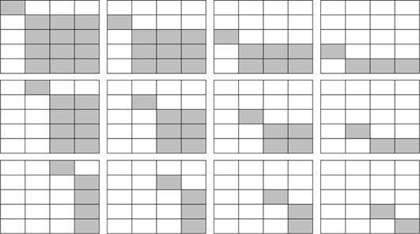 </td>
   <td style="text-align:center;width: 49%; "> 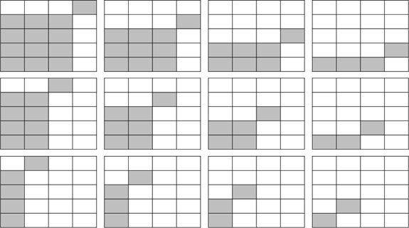 </td>
  </tr>
</tbody>
</table></div>

Nilai $C$ pada persamaan \@ref(eq:gamma) adalah penjumlahan dari perkalian seluruh frekuensi pasangan ***concordant***, sedangkan nilai $D$ adalah penjumlahan dari perkalian seluruh frekuensi pasangan ***discordant***.

::: rmdkasus
## Studi Kasus: Menghitung Goodman & Kruskal's Gamma ($\gamma$) {.unnumbered}
Setelah kita memahami apa yang dimaksud dengan pasangan frekuensi ***concordant*** dan ***discordant***, mari kita hitung nilai $C$ dan $D$ dari Tabel \@ref(tab:tbl-crosstab-ordinal).

**Total perkalian seluruh frekuensi pasangan *concordant* ($C$)**

Berdasarkan pada Gambar \@ref(tbl-ilustrasi-concordant-discordant)(a) dan disesuaikan dengan Tabel \@ref(tab:tbl-crosstab-ordinal), maka nilai $C$ adalah sebagai berikut.

$$
\begin{aligned}
C = & (58 \times 118) + (58 \times 181) + (58 \times 350) + (58 \times 57) + \\
& (58 \times 57) + (58 \times 53) + (58 \times 142) + (58 \times 19) + \\
& (58 \times 24) + (58 \times 37) \\
& (58 \times 4) + (58 \times 5) + (58 \times 12) \\
= & 58 \times (118 + 181 + 350 + 57 + 
\end{aligned}
$$

:::

## Koefisien $d$ dari Sommer {#sommersd}

## Koefisien tau-b ($\tau$-b) dari Kendall {#kendall}

::: rmdexercise
## Soal Evaluasi 12 {.unnumbered}

1.  Kapan kita sebaiknya menggunakan Kendall's Tau dibandingkan Spearman's Rho? [STP-9.1]{.capaian}
2.  Jelaskan makna korelasi negatif pada variabel ordinal! [STP-9.2]{.capaian}

:::

<!--chapter:end:11-korelasi-ordinal.Rmd-->

# Korelasi Antarvariabel Metrik

## Konsep Dasar

Untuk dua variabel numerik (interval/rasio), ukuran asosiasi yang paling umum adalah **Pearson Product-Moment Correlation ($r$)**. Nilai $r$ berkisar antara -1 hingga +1.

## Studi Kasus dengan R

Hubungan antara **Pendapatan** dan **Pengeluaran**.


``` r
pendapatan <- c(5, 6, 7, 8, 9, 10, 11)
pengeluaran <- c(3, 4, 3.5, 5, 6, 6.5, 7)

# Scatterplot
plot(pendapatan, pengeluaran)
```

<!-- -->

``` r
# Korelasi Pearson
cor.test(pendapatan, pengeluaran, method = "pearson")
```

```
## 
## 	Pearson's product-moment correlation
## 
## data:  pendapatan and pengeluaran
## t = 8,5927, df = 5, p-value = 0,0003521
## alternative hypothesis: true correlation is not equal to 0
## 95 percent confidence interval:
##  0,7916653 0,9953960
## sample estimates:
##       cor 
## 0,9677688
```

::: rmdexercise
## Soal Evaluasi 13 {.unnumbered}

1.  Apa syarat utama penggunaan korelasi Pearson? [STP-10.1]{.capaian}
2.  Jika $r = 0$, apakah artinya tidak ada hubungan sama sekali? Jelaskan! [STP-10.2]{.capaian}

:::

<!--chapter:end:12-korelasi-metrik.Rmd-->

# Regresi Linear Sederhana {#bab-13-regresi-sederhana}

## Konsep Dasar

Regresi linear sederhana digunakan untuk memprediksi nilai satu variabel dependen ($Y$) berdasarkan satu variabel independen ($X$). Persamaannya:
$$ Y = a + bX + \epsilon $$

## Studi Kasus dengan R

Memprediksi **Pengeluaran** berdasarkan **Pendapatan**.


``` r
pendapatan <- c(5, 6, 7, 8, 9, 10, 11)
pengeluaran <- c(3, 4, 3.5, 5, 6, 6.5, 7)

# Membuat Model Regresi
model <- lm(pengeluaran ~ pendapatan)
summary(model)
```

```
## 
## Call:
## lm(formula = pengeluaran ~ pendapatan)
## 
## Residuals:
##          1          2          3          4          5          6          7 
##  8,929e-02  3,929e-01 -8,036e-01 -1,804e-16  3,036e-01  1,071e-01 -8,929e-02 
## 
## Coefficients:
##             Estimate Std. Error t value Pr(>|t|)    
## (Intercept) -0,57143    0,66834  -0,855 0,431606    
## pendapatan   0,69643    0,08105   8,593 0,000352 ***
## ---
## Signif. codes:  0 '***' 0,001 '**' 0,01 '*' 0,05 '.' 0,1 ' ' 1
## 
## Residual standard error: 0,4289 on 5 degrees of freedom
## Multiple R-squared:  0,9366,	Adjusted R-squared:  0,9239 
## F-statistic: 73,83 on 1 and 5 DF,  p-value: 0,0003521
```

``` r
# Melihat koefisien
coef(model)
```

```
## (Intercept)  pendapatan 
##  -0,5714286   0,6964286
```

**Interpretasi**:
Nilai Intercept ($a$) dan Slope ($b$) menentukan persamaan garis prediksi. $R^2$ menunjukkan seberapa baik model menjelaskan variasi data.

::: rmdexercise
## Soal Evaluasi 14 {.unnumbered}

1.  Apa perbedaan antara korelasi dan regresi? [STP-11.1]{.capaian}
2.  Jelaskan makna $R^2$ (Koefisien Determinasi)! [STP-11.2]{.capaian}

:::

<!--chapter:end:13-regresi-sederhana.Rmd-->

# Regresi Linear Berganda

## Konsep Dasar

Regresi linear berganda melibatkan **lebih dari satu** variabel independen untuk memprediksi variabel dependen.
$$ Y = a + b_1X_1 + b_2X_2 + \dots + \epsilon $$

## Studi Kasus dengan R

Memprediksi **Harga Rumah** berdasarkan **Luas Tanah** dan **Jumlah Kamar**.


``` r
harga <- c(500, 700, 600, 800, 900)
luas <- c(100, 150, 120, 160, 200)
kamar <- c(2, 3, 2, 4, 5)

# Model Regresi Berganda
model_berganda <- lm(harga ~ luas + kamar)
summary(model_berganda)
```

```
## 
## Call:
## lm(formula = harga ~ luas + kamar)
## 
## Residuals:
##       1       2       3       4       5 
## -22,901  -6,107  16,031  32,824 -19,847 
## 
## Coefficients:
##             Estimate Std. Error t value Pr(>|t|)
## (Intercept)  156,489    104,150   1,503    0,272
## luas           3,053      1,724   1,771    0,219
## kamar         30,534     50,865   0,600    0,609
## 
## Residual standard error: 33,84 on 2 degrees of freedom
## Multiple R-squared:  0,9771,	Adjusted R-squared:  0,9542 
## F-statistic: 42,67 on 2 and 2 DF,  p-value: 0,0229
```

::: rmdexercise
## Soal Evaluasi 15 {.unnumbered}

1.  Apa itu multikolinearitas dalam regresi berganda? [STP-12.1]{.capaian}
2.  Bagaimana cara menginterpretasikan Adjusted $R^2$? [STP-12.2]{.capaian}

:::

<!--chapter:end:14-regresi-berganda.Rmd-->

# Analisis Statistik Multivariat Interdependensi

## Konsep Dasar

Analisis multivariat interdependensi tidak membedakan variabel menjadi dependen dan independen. Tujuannya adalah untuk mencari struktur dasar dari sekumpulan variabel.
Contoh: **Analisis Faktor** dan **Principal Component Analysis (PCA)**. Biasanya digunakan untuk mereduksi dimensi data (menyederhanakan banyak variabel menjadi beberapa faktor utama).

## Studi Kasus dengan R

Mereduksi 5 indikator kepuasan menjadi faktor-faktor utama.


``` r
# Simulasi Data
set.seed(123)
data_survei <- matrix(rnorm(100*5), ncol=5)
colnames(data_survei) <- c("Q1", "Q2", "Q3", "Q4", "Q5")

# Principal Component Analysis
pca_result <- prcomp(data_survei, scale. = TRUE)
summary(pca_result)
```

```
## Importance of components:
##                           PC1    PC2    PC3    PC4    PC5
## Standard deviation     1,1077 1,0610 1,0191 0,9468 0,8440
## Proportion of Variance 0,2454 0,2251 0,2077 0,1793 0,1425
## Cumulative Proportion  0,2454 0,4705 0,6783 0,8575 1,0000
```

``` r
# Melihat beban faktor (loadings)
pca_result$rotation
```

```
##            PC1        PC2        PC3        PC4       PC5
## Q1  0,67277300  0,3292034 -0,1275847 -0,1588174 0,6304766
## Q2  0,19353433 -0,6901072  0,1205644  0,6023990 0,3299640
## Q3 -0,28920162 -0,4912642 -0,5283287 -0,5405369 0,3220413
## Q4  0,01926618 -0,2337862  0,8146660 -0,5122828 0,1373262
## Q5 -0,65261949  0,3455152  0,1624021  0,2393297 0,6091420
```

::: rmdexercise
## Soal Evaluasi 16 {.unnumbered}

1.  Apa tujuan utama dari Analisis Faktor? [STP-13.1]{.capaian}
2.  Jelaskan perbedaan mendasar antara Analisis Regresi dan Analisis Faktor! [STP-13.2]{.capaian}

:::

<!--chapter:end:15-multivariat-interdependensi.Rmd-->

# Referensi {-}

<div id="refs"></div>

<!--chapter:end:89-referensi.Rmd-->

# (APPENDIX) Lampiran {-}

# Tabel Statistik {.unnumbered}

## Tabel Distribusi Normal Standar (Z) {.unnumbered} {#appendix-tabel-normdist}

Tabel berikut menyajikan luas area di bawah kurva distribusi normal standar dari $Z = 0$ hingga nilai $Z$ tertentu, yaitu $P(0 \leq Z \leq z)$.

<div class="figure" style="text-align: center">
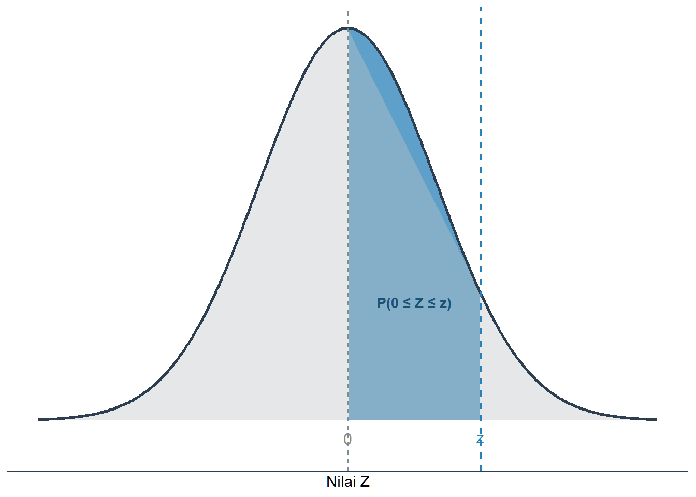
<p class="caption">(\#fig:fig-ilustrasi-z-table)Luas area yang dicari pada Tabel Distribusi Normal Standar: $P(0 \leq Z \leq z)$</p>
</div>

<div style="border: 1px solid #ddd; padding: 0px; overflow-y: scroll; height:450px; overflow-x: scroll; width:100%; "><table class="table table-striped table-hover table-condensed" style="width: auto !important; margin-left: auto; margin-right: auto;">
<caption>(\#tab:tab-distribusi-z)Tabel Distribusi Normal Standar $P(0 \leq Z \leq z)$</caption>
 <thead>
<tr>
<th style="empty-cells: hide;border-bottom:hidden;position: sticky; top:0; background-color: #FFFFFF;" colspan="1"></th>
<th style="border-bottom:hidden;padding-bottom:0; padding-left:3px;padding-right:3px;text-align: center; position: sticky; top:0; background-color: #FFFFFF;" colspan="10"><div style="border-bottom: 1px solid #ddd; padding-bottom: 5px; ">Desimal kedua nilai z</div></th>
</tr>
  <tr>
   <th style="text-align:center;position: sticky; top:0; background-color: #FFFFFF;"> z </th>
   <th style="text-align:center;position: sticky; top:0; background-color: #FFFFFF;"> 0,00 </th>
   <th style="text-align:center;position: sticky; top:0; background-color: #FFFFFF;"> 0,01 </th>
   <th style="text-align:center;position: sticky; top:0; background-color: #FFFFFF;"> 0,02 </th>
   <th style="text-align:center;position: sticky; top:0; background-color: #FFFFFF;"> 0,03 </th>
   <th style="text-align:center;position: sticky; top:0; background-color: #FFFFFF;"> 0,04 </th>
   <th style="text-align:center;position: sticky; top:0; background-color: #FFFFFF;"> 0,05 </th>
   <th style="text-align:center;position: sticky; top:0; background-color: #FFFFFF;"> 0,06 </th>
   <th style="text-align:center;position: sticky; top:0; background-color: #FFFFFF;"> 0,07 </th>
   <th style="text-align:center;position: sticky; top:0; background-color: #FFFFFF;"> 0,08 </th>
   <th style="text-align:center;position: sticky; top:0; background-color: #FFFFFF;"> 0,09 </th>
  </tr>
 </thead>
<tbody>
  <tr>
   <td style="text-align:center;font-weight: bold;"> 0,0 </td>
   <td style="text-align:center;"> 0,0000 </td>
   <td style="text-align:center;"> 0,0040 </td>
   <td style="text-align:center;"> 0,0080 </td>
   <td style="text-align:center;"> 0,0120 </td>
   <td style="text-align:center;"> 0,0160 </td>
   <td style="text-align:center;"> 0,0199 </td>
   <td style="text-align:center;"> 0,0239 </td>
   <td style="text-align:center;"> 0,0279 </td>
   <td style="text-align:center;"> 0,0319 </td>
   <td style="text-align:center;"> 0,0359 </td>
  </tr>
  <tr>
   <td style="text-align:center;font-weight: bold;"> 0,1 </td>
   <td style="text-align:center;"> 0,0398 </td>
   <td style="text-align:center;"> 0,0438 </td>
   <td style="text-align:center;"> 0,0478 </td>
   <td style="text-align:center;"> 0,0517 </td>
   <td style="text-align:center;"> 0,0557 </td>
   <td style="text-align:center;"> 0,0596 </td>
   <td style="text-align:center;"> 0,0636 </td>
   <td style="text-align:center;"> 0,0675 </td>
   <td style="text-align:center;"> 0,0714 </td>
   <td style="text-align:center;"> 0,0753 </td>
  </tr>
  <tr>
   <td style="text-align:center;font-weight: bold;"> 0,2 </td>
   <td style="text-align:center;"> 0,0793 </td>
   <td style="text-align:center;"> 0,0832 </td>
   <td style="text-align:center;"> 0,0871 </td>
   <td style="text-align:center;"> 0,0910 </td>
   <td style="text-align:center;"> 0,0948 </td>
   <td style="text-align:center;"> 0,0987 </td>
   <td style="text-align:center;"> 0,1026 </td>
   <td style="text-align:center;"> 0,1064 </td>
   <td style="text-align:center;"> 0,1103 </td>
   <td style="text-align:center;"> 0,1141 </td>
  </tr>
  <tr>
   <td style="text-align:center;font-weight: bold;"> 0,3 </td>
   <td style="text-align:center;"> 0,1179 </td>
   <td style="text-align:center;"> 0,1217 </td>
   <td style="text-align:center;"> 0,1255 </td>
   <td style="text-align:center;"> 0,1293 </td>
   <td style="text-align:center;"> 0,1331 </td>
   <td style="text-align:center;"> 0,1368 </td>
   <td style="text-align:center;"> 0,1406 </td>
   <td style="text-align:center;"> 0,1443 </td>
   <td style="text-align:center;"> 0,1480 </td>
   <td style="text-align:center;"> 0,1517 </td>
  </tr>
  <tr>
   <td style="text-align:center;font-weight: bold;"> 0,4 </td>
   <td style="text-align:center;"> 0,1554 </td>
   <td style="text-align:center;"> 0,1591 </td>
   <td style="text-align:center;"> 0,1628 </td>
   <td style="text-align:center;"> 0,1664 </td>
   <td style="text-align:center;"> 0,1700 </td>
   <td style="text-align:center;"> 0,1736 </td>
   <td style="text-align:center;"> 0,1772 </td>
   <td style="text-align:center;"> 0,1808 </td>
   <td style="text-align:center;"> 0,1844 </td>
   <td style="text-align:center;"> 0,1879 </td>
  </tr>
  <tr>
   <td style="text-align:center;font-weight: bold;"> 0,5 </td>
   <td style="text-align:center;"> 0,1915 </td>
   <td style="text-align:center;"> 0,1950 </td>
   <td style="text-align:center;"> 0,1985 </td>
   <td style="text-align:center;"> 0,2019 </td>
   <td style="text-align:center;"> 0,2054 </td>
   <td style="text-align:center;"> 0,2088 </td>
   <td style="text-align:center;"> 0,2123 </td>
   <td style="text-align:center;"> 0,2157 </td>
   <td style="text-align:center;"> 0,2190 </td>
   <td style="text-align:center;"> 0,2224 </td>
  </tr>
  <tr>
   <td style="text-align:center;font-weight: bold;"> 0,6 </td>
   <td style="text-align:center;"> 0,2257 </td>
   <td style="text-align:center;"> 0,2291 </td>
   <td style="text-align:center;"> 0,2324 </td>
   <td style="text-align:center;"> 0,2357 </td>
   <td style="text-align:center;"> 0,2389 </td>
   <td style="text-align:center;"> 0,2422 </td>
   <td style="text-align:center;"> 0,2454 </td>
   <td style="text-align:center;"> 0,2486 </td>
   <td style="text-align:center;"> 0,2517 </td>
   <td style="text-align:center;"> 0,2549 </td>
  </tr>
  <tr>
   <td style="text-align:center;font-weight: bold;"> 0,7 </td>
   <td style="text-align:center;"> 0,2580 </td>
   <td style="text-align:center;"> 0,2611 </td>
   <td style="text-align:center;"> 0,2642 </td>
   <td style="text-align:center;"> 0,2673 </td>
   <td style="text-align:center;"> 0,2704 </td>
   <td style="text-align:center;"> 0,2734 </td>
   <td style="text-align:center;"> 0,2764 </td>
   <td style="text-align:center;"> 0,2794 </td>
   <td style="text-align:center;"> 0,2823 </td>
   <td style="text-align:center;"> 0,2852 </td>
  </tr>
  <tr>
   <td style="text-align:center;font-weight: bold;"> 0,8 </td>
   <td style="text-align:center;"> 0,2881 </td>
   <td style="text-align:center;"> 0,2910 </td>
   <td style="text-align:center;"> 0,2939 </td>
   <td style="text-align:center;"> 0,2967 </td>
   <td style="text-align:center;"> 0,2995 </td>
   <td style="text-align:center;"> 0,3023 </td>
   <td style="text-align:center;"> 0,3051 </td>
   <td style="text-align:center;"> 0,3078 </td>
   <td style="text-align:center;"> 0,3106 </td>
   <td style="text-align:center;"> 0,3133 </td>
  </tr>
  <tr>
   <td style="text-align:center;font-weight: bold;"> 0,9 </td>
   <td style="text-align:center;"> 0,3159 </td>
   <td style="text-align:center;"> 0,3186 </td>
   <td style="text-align:center;"> 0,3212 </td>
   <td style="text-align:center;"> 0,3238 </td>
   <td style="text-align:center;"> 0,3264 </td>
   <td style="text-align:center;"> 0,3289 </td>
   <td style="text-align:center;"> 0,3315 </td>
   <td style="text-align:center;"> 0,3340 </td>
   <td style="text-align:center;"> 0,3365 </td>
   <td style="text-align:center;"> 0,3389 </td>
  </tr>
  <tr>
   <td style="text-align:center;font-weight: bold;"> 1,0 </td>
   <td style="text-align:center;"> 0,3413 </td>
   <td style="text-align:center;"> 0,3438 </td>
   <td style="text-align:center;"> 0,3461 </td>
   <td style="text-align:center;"> 0,3485 </td>
   <td style="text-align:center;"> 0,3508 </td>
   <td style="text-align:center;"> 0,3531 </td>
   <td style="text-align:center;"> 0,3554 </td>
   <td style="text-align:center;"> 0,3577 </td>
   <td style="text-align:center;"> 0,3599 </td>
   <td style="text-align:center;"> 0,3621 </td>
  </tr>
  <tr>
   <td style="text-align:center;font-weight: bold;"> 1,1 </td>
   <td style="text-align:center;"> 0,3643 </td>
   <td style="text-align:center;"> 0,3665 </td>
   <td style="text-align:center;"> 0,3686 </td>
   <td style="text-align:center;"> 0,3708 </td>
   <td style="text-align:center;"> 0,3729 </td>
   <td style="text-align:center;"> 0,3749 </td>
   <td style="text-align:center;"> 0,3770 </td>
   <td style="text-align:center;"> 0,3790 </td>
   <td style="text-align:center;"> 0,3810 </td>
   <td style="text-align:center;"> 0,3830 </td>
  </tr>
  <tr>
   <td style="text-align:center;font-weight: bold;"> 1,2 </td>
   <td style="text-align:center;"> 0,3849 </td>
   <td style="text-align:center;"> 0,3869 </td>
   <td style="text-align:center;"> 0,3888 </td>
   <td style="text-align:center;"> 0,3907 </td>
   <td style="text-align:center;"> 0,3925 </td>
   <td style="text-align:center;"> 0,3944 </td>
   <td style="text-align:center;"> 0,3962 </td>
   <td style="text-align:center;"> 0,3980 </td>
   <td style="text-align:center;"> 0,3997 </td>
   <td style="text-align:center;"> 0,4015 </td>
  </tr>
  <tr>
   <td style="text-align:center;font-weight: bold;"> 1,3 </td>
   <td style="text-align:center;"> 0,4032 </td>
   <td style="text-align:center;"> 0,4049 </td>
   <td style="text-align:center;"> 0,4066 </td>
   <td style="text-align:center;"> 0,4082 </td>
   <td style="text-align:center;"> 0,4099 </td>
   <td style="text-align:center;"> 0,4115 </td>
   <td style="text-align:center;"> 0,4131 </td>
   <td style="text-align:center;"> 0,4147 </td>
   <td style="text-align:center;"> 0,4162 </td>
   <td style="text-align:center;"> 0,4177 </td>
  </tr>
  <tr>
   <td style="text-align:center;font-weight: bold;"> 1,4 </td>
   <td style="text-align:center;"> 0,4192 </td>
   <td style="text-align:center;"> 0,4207 </td>
   <td style="text-align:center;"> 0,4222 </td>
   <td style="text-align:center;"> 0,4236 </td>
   <td style="text-align:center;"> 0,4251 </td>
   <td style="text-align:center;"> 0,4265 </td>
   <td style="text-align:center;"> 0,4279 </td>
   <td style="text-align:center;"> 0,4292 </td>
   <td style="text-align:center;"> 0,4306 </td>
   <td style="text-align:center;"> 0,4319 </td>
  </tr>
  <tr>
   <td style="text-align:center;font-weight: bold;"> 1,5 </td>
   <td style="text-align:center;"> 0,4332 </td>
   <td style="text-align:center;"> 0,4345 </td>
   <td style="text-align:center;"> 0,4357 </td>
   <td style="text-align:center;"> 0,4370 </td>
   <td style="text-align:center;"> 0,4382 </td>
   <td style="text-align:center;"> 0,4394 </td>
   <td style="text-align:center;"> 0,4406 </td>
   <td style="text-align:center;"> 0,4418 </td>
   <td style="text-align:center;"> 0,4429 </td>
   <td style="text-align:center;"> 0,4441 </td>
  </tr>
  <tr>
   <td style="text-align:center;font-weight: bold;"> 1,6 </td>
   <td style="text-align:center;"> 0,4452 </td>
   <td style="text-align:center;"> 0,4463 </td>
   <td style="text-align:center;"> 0,4474 </td>
   <td style="text-align:center;"> 0,4484 </td>
   <td style="text-align:center;"> 0,4495 </td>
   <td style="text-align:center;"> 0,4505 </td>
   <td style="text-align:center;"> 0,4515 </td>
   <td style="text-align:center;"> 0,4525 </td>
   <td style="text-align:center;"> 0,4535 </td>
   <td style="text-align:center;"> 0,4545 </td>
  </tr>
  <tr>
   <td style="text-align:center;font-weight: bold;"> 1,7 </td>
   <td style="text-align:center;"> 0,4554 </td>
   <td style="text-align:center;"> 0,4564 </td>
   <td style="text-align:center;"> 0,4573 </td>
   <td style="text-align:center;"> 0,4582 </td>
   <td style="text-align:center;"> 0,4591 </td>
   <td style="text-align:center;"> 0,4599 </td>
   <td style="text-align:center;"> 0,4608 </td>
   <td style="text-align:center;"> 0,4616 </td>
   <td style="text-align:center;"> 0,4625 </td>
   <td style="text-align:center;"> 0,4633 </td>
  </tr>
  <tr>
   <td style="text-align:center;font-weight: bold;"> 1,8 </td>
   <td style="text-align:center;"> 0,4641 </td>
   <td style="text-align:center;"> 0,4649 </td>
   <td style="text-align:center;"> 0,4656 </td>
   <td style="text-align:center;"> 0,4664 </td>
   <td style="text-align:center;"> 0,4671 </td>
   <td style="text-align:center;"> 0,4678 </td>
   <td style="text-align:center;"> 0,4686 </td>
   <td style="text-align:center;"> 0,4693 </td>
   <td style="text-align:center;"> 0,4699 </td>
   <td style="text-align:center;"> 0,4706 </td>
  </tr>
  <tr>
   <td style="text-align:center;font-weight: bold;"> 1,9 </td>
   <td style="text-align:center;"> 0,4713 </td>
   <td style="text-align:center;"> 0,4719 </td>
   <td style="text-align:center;"> 0,4726 </td>
   <td style="text-align:center;"> 0,4732 </td>
   <td style="text-align:center;"> 0,4738 </td>
   <td style="text-align:center;"> 0,4744 </td>
   <td style="text-align:center;"> 0,4750 </td>
   <td style="text-align:center;"> 0,4756 </td>
   <td style="text-align:center;"> 0,4761 </td>
   <td style="text-align:center;"> 0,4767 </td>
  </tr>
  <tr>
   <td style="text-align:center;font-weight: bold;"> 2,0 </td>
   <td style="text-align:center;"> 0,4772 </td>
   <td style="text-align:center;"> 0,4778 </td>
   <td style="text-align:center;"> 0,4783 </td>
   <td style="text-align:center;"> 0,4788 </td>
   <td style="text-align:center;"> 0,4793 </td>
   <td style="text-align:center;"> 0,4798 </td>
   <td style="text-align:center;"> 0,4803 </td>
   <td style="text-align:center;"> 0,4808 </td>
   <td style="text-align:center;"> 0,4812 </td>
   <td style="text-align:center;"> 0,4817 </td>
  </tr>
  <tr>
   <td style="text-align:center;font-weight: bold;"> 2,1 </td>
   <td style="text-align:center;"> 0,4821 </td>
   <td style="text-align:center;"> 0,4826 </td>
   <td style="text-align:center;"> 0,4830 </td>
   <td style="text-align:center;"> 0,4834 </td>
   <td style="text-align:center;"> 0,4838 </td>
   <td style="text-align:center;"> 0,4842 </td>
   <td style="text-align:center;"> 0,4846 </td>
   <td style="text-align:center;"> 0,4850 </td>
   <td style="text-align:center;"> 0,4854 </td>
   <td style="text-align:center;"> 0,4857 </td>
  </tr>
  <tr>
   <td style="text-align:center;font-weight: bold;"> 2,2 </td>
   <td style="text-align:center;"> 0,4861 </td>
   <td style="text-align:center;"> 0,4864 </td>
   <td style="text-align:center;"> 0,4868 </td>
   <td style="text-align:center;"> 0,4871 </td>
   <td style="text-align:center;"> 0,4875 </td>
   <td style="text-align:center;"> 0,4878 </td>
   <td style="text-align:center;"> 0,4881 </td>
   <td style="text-align:center;"> 0,4884 </td>
   <td style="text-align:center;"> 0,4887 </td>
   <td style="text-align:center;"> 0,4890 </td>
  </tr>
  <tr>
   <td style="text-align:center;font-weight: bold;"> 2,3 </td>
   <td style="text-align:center;"> 0,4893 </td>
   <td style="text-align:center;"> 0,4896 </td>
   <td style="text-align:center;"> 0,4898 </td>
   <td style="text-align:center;"> 0,4901 </td>
   <td style="text-align:center;"> 0,4904 </td>
   <td style="text-align:center;"> 0,4906 </td>
   <td style="text-align:center;"> 0,4909 </td>
   <td style="text-align:center;"> 0,4911 </td>
   <td style="text-align:center;"> 0,4913 </td>
   <td style="text-align:center;"> 0,4916 </td>
  </tr>
  <tr>
   <td style="text-align:center;font-weight: bold;"> 2,4 </td>
   <td style="text-align:center;"> 0,4918 </td>
   <td style="text-align:center;"> 0,4920 </td>
   <td style="text-align:center;"> 0,4922 </td>
   <td style="text-align:center;"> 0,4925 </td>
   <td style="text-align:center;"> 0,4927 </td>
   <td style="text-align:center;"> 0,4929 </td>
   <td style="text-align:center;"> 0,4931 </td>
   <td style="text-align:center;"> 0,4932 </td>
   <td style="text-align:center;"> 0,4934 </td>
   <td style="text-align:center;"> 0,4936 </td>
  </tr>
  <tr>
   <td style="text-align:center;font-weight: bold;"> 2,5 </td>
   <td style="text-align:center;"> 0,4938 </td>
   <td style="text-align:center;"> 0,4940 </td>
   <td style="text-align:center;"> 0,4941 </td>
   <td style="text-align:center;"> 0,4943 </td>
   <td style="text-align:center;"> 0,4945 </td>
   <td style="text-align:center;"> 0,4946 </td>
   <td style="text-align:center;"> 0,4948 </td>
   <td style="text-align:center;"> 0,4949 </td>
   <td style="text-align:center;"> 0,4951 </td>
   <td style="text-align:center;"> 0,4952 </td>
  </tr>
  <tr>
   <td style="text-align:center;font-weight: bold;"> 2,6 </td>
   <td style="text-align:center;"> 0,4953 </td>
   <td style="text-align:center;"> 0,4955 </td>
   <td style="text-align:center;"> 0,4956 </td>
   <td style="text-align:center;"> 0,4957 </td>
   <td style="text-align:center;"> 0,4959 </td>
   <td style="text-align:center;"> 0,4960 </td>
   <td style="text-align:center;"> 0,4961 </td>
   <td style="text-align:center;"> 0,4962 </td>
   <td style="text-align:center;"> 0,4963 </td>
   <td style="text-align:center;"> 0,4964 </td>
  </tr>
  <tr>
   <td style="text-align:center;font-weight: bold;"> 2,7 </td>
   <td style="text-align:center;"> 0,4965 </td>
   <td style="text-align:center;"> 0,4966 </td>
   <td style="text-align:center;"> 0,4967 </td>
   <td style="text-align:center;"> 0,4968 </td>
   <td style="text-align:center;"> 0,4969 </td>
   <td style="text-align:center;"> 0,4970 </td>
   <td style="text-align:center;"> 0,4971 </td>
   <td style="text-align:center;"> 0,4972 </td>
   <td style="text-align:center;"> 0,4973 </td>
   <td style="text-align:center;"> 0,4974 </td>
  </tr>
  <tr>
   <td style="text-align:center;font-weight: bold;"> 2,8 </td>
   <td style="text-align:center;"> 0,4974 </td>
   <td style="text-align:center;"> 0,4975 </td>
   <td style="text-align:center;"> 0,4976 </td>
   <td style="text-align:center;"> 0,4977 </td>
   <td style="text-align:center;"> 0,4977 </td>
   <td style="text-align:center;"> 0,4978 </td>
   <td style="text-align:center;"> 0,4979 </td>
   <td style="text-align:center;"> 0,4979 </td>
   <td style="text-align:center;"> 0,4980 </td>
   <td style="text-align:center;"> 0,4981 </td>
  </tr>
  <tr>
   <td style="text-align:center;font-weight: bold;"> 2,9 </td>
   <td style="text-align:center;"> 0,4981 </td>
   <td style="text-align:center;"> 0,4982 </td>
   <td style="text-align:center;"> 0,4982 </td>
   <td style="text-align:center;"> 0,4983 </td>
   <td style="text-align:center;"> 0,4984 </td>
   <td style="text-align:center;"> 0,4984 </td>
   <td style="text-align:center;"> 0,4985 </td>
   <td style="text-align:center;"> 0,4985 </td>
   <td style="text-align:center;"> 0,4986 </td>
   <td style="text-align:center;"> 0,4986 </td>
  </tr>
  <tr>
   <td style="text-align:center;font-weight: bold;"> 3,0 </td>
   <td style="text-align:center;"> 0,4987 </td>
   <td style="text-align:center;"> 0,4987 </td>
   <td style="text-align:center;"> 0,4987 </td>
   <td style="text-align:center;"> 0,4988 </td>
   <td style="text-align:center;"> 0,4988 </td>
   <td style="text-align:center;"> 0,4989 </td>
   <td style="text-align:center;"> 0,4989 </td>
   <td style="text-align:center;"> 0,4989 </td>
   <td style="text-align:center;"> 0,4990 </td>
   <td style="text-align:center;"> 0,4990 </td>
  </tr>
  <tr>
   <td style="text-align:center;font-weight: bold;"> 3,1 </td>
   <td style="text-align:center;"> 0,4990 </td>
   <td style="text-align:center;"> 0,4991 </td>
   <td style="text-align:center;"> 0,4991 </td>
   <td style="text-align:center;"> 0,4991 </td>
   <td style="text-align:center;"> 0,4992 </td>
   <td style="text-align:center;"> 0,4992 </td>
   <td style="text-align:center;"> 0,4992 </td>
   <td style="text-align:center;"> 0,4992 </td>
   <td style="text-align:center;"> 0,4993 </td>
   <td style="text-align:center;"> 0,4993 </td>
  </tr>
  <tr>
   <td style="text-align:center;font-weight: bold;"> 3,2 </td>
   <td style="text-align:center;"> 0,4993 </td>
   <td style="text-align:center;"> 0,4993 </td>
   <td style="text-align:center;"> 0,4994 </td>
   <td style="text-align:center;"> 0,4994 </td>
   <td style="text-align:center;"> 0,4994 </td>
   <td style="text-align:center;"> 0,4994 </td>
   <td style="text-align:center;"> 0,4994 </td>
   <td style="text-align:center;"> 0,4995 </td>
   <td style="text-align:center;"> 0,4995 </td>
   <td style="text-align:center;"> 0,4995 </td>
  </tr>
  <tr>
   <td style="text-align:center;font-weight: bold;"> 3,3 </td>
   <td style="text-align:center;"> 0,4995 </td>
   <td style="text-align:center;"> 0,4995 </td>
   <td style="text-align:center;"> 0,4995 </td>
   <td style="text-align:center;"> 0,4996 </td>
   <td style="text-align:center;"> 0,4996 </td>
   <td style="text-align:center;"> 0,4996 </td>
   <td style="text-align:center;"> 0,4996 </td>
   <td style="text-align:center;"> 0,4996 </td>
   <td style="text-align:center;"> 0,4996 </td>
   <td style="text-align:center;"> 0,4997 </td>
  </tr>
  <tr>
   <td style="text-align:center;font-weight: bold;"> 3,4 </td>
   <td style="text-align:center;"> 0,4997 </td>
   <td style="text-align:center;"> 0,4997 </td>
   <td style="text-align:center;"> 0,4997 </td>
   <td style="text-align:center;"> 0,4997 </td>
   <td style="text-align:center;"> 0,4997 </td>
   <td style="text-align:center;"> 0,4997 </td>
   <td style="text-align:center;"> 0,4997 </td>
   <td style="text-align:center;"> 0,4997 </td>
   <td style="text-align:center;"> 0,4997 </td>
   <td style="text-align:center;"> 0,4998 </td>
  </tr>
</tbody>
</table></div>

\FloatBarrier

## Tabel Distribusi F ($\alpha = 10\%$) {.unnumbered} {#appendix-tabel-f-5}

Tabel berikut menyajikan nilai $F_{kritis}$ pada tingkat signifikansi $\alpha = 10\%$, yaitu nilai $F$ yang membatasi luas area sebesar 10% di ekor kanan distribusi F, $P(F > F_{tabel}) = 0{,}10$.

<div class="figure" style="text-align: center">
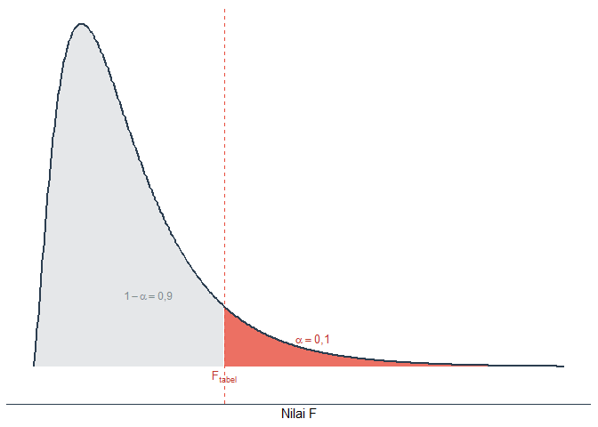
<p class="caption">(\#fig:fig-ilustrasi-f-table-10)Luas area yang dicari pada Tabel Distribusi F ($\alpha = 10\%$): $P(F > F_{tabel}) = 0{,}10$</p>
</div>

<div style="border: 1px solid #ddd; padding: 0px; overflow-y: scroll; height:450px; overflow-x: scroll; width:100%; "><table class="table table-striped table-hover table-condensed" style="font-size: 10px; width: auto !important; margin-left: auto; margin-right: auto;">
<caption style="font-size: initial !important;">(\#tab:tab-distribusi-f-10persen)Tabel Distribusi F pada Tingkat Signifikansi $\alpha = 10\%$</caption>
 <thead>
<tr>
<th style="empty-cells: hide;border-bottom:hidden;position: sticky; top:0; background-color: #FFFFFF;" colspan="1"></th>
<th style="border-bottom:hidden;padding-bottom:0; padding-left:3px;padding-right:3px;text-align: center; position: sticky; top:0; background-color: #FFFFFF;" colspan="34"><div style="border-bottom: 1px solid #ddd; padding-bottom: 5px; ">dfb</div></th>
</tr>
  <tr>
   <th style="text-align:center;position: sticky; top:0; background-color: #FFFFFF;"> dfw </th>
   <th style="text-align:center;position: sticky; top:0; background-color: #FFFFFF;"> 1 </th>
   <th style="text-align:center;position: sticky; top:0; background-color: #FFFFFF;"> 2 </th>
   <th style="text-align:center;position: sticky; top:0; background-color: #FFFFFF;"> 3 </th>
   <th style="text-align:center;position: sticky; top:0; background-color: #FFFFFF;"> 4 </th>
   <th style="text-align:center;position: sticky; top:0; background-color: #FFFFFF;"> 5 </th>
   <th style="text-align:center;position: sticky; top:0; background-color: #FFFFFF;"> 6 </th>
   <th style="text-align:center;position: sticky; top:0; background-color: #FFFFFF;"> 7 </th>
   <th style="text-align:center;position: sticky; top:0; background-color: #FFFFFF;"> 8 </th>
   <th style="text-align:center;position: sticky; top:0; background-color: #FFFFFF;"> 9 </th>
   <th style="text-align:center;position: sticky; top:0; background-color: #FFFFFF;"> 10 </th>
   <th style="text-align:center;position: sticky; top:0; background-color: #FFFFFF;"> 11 </th>
   <th style="text-align:center;position: sticky; top:0; background-color: #FFFFFF;"> 12 </th>
   <th style="text-align:center;position: sticky; top:0; background-color: #FFFFFF;"> 13 </th>
   <th style="text-align:center;position: sticky; top:0; background-color: #FFFFFF;"> 14 </th>
   <th style="text-align:center;position: sticky; top:0; background-color: #FFFFFF;"> 15 </th>
   <th style="text-align:center;position: sticky; top:0; background-color: #FFFFFF;"> 16 </th>
   <th style="text-align:center;position: sticky; top:0; background-color: #FFFFFF;"> 17 </th>
   <th style="text-align:center;position: sticky; top:0; background-color: #FFFFFF;"> 18 </th>
   <th style="text-align:center;position: sticky; top:0; background-color: #FFFFFF;"> 19 </th>
   <th style="text-align:center;position: sticky; top:0; background-color: #FFFFFF;"> 20 </th>
   <th style="text-align:center;position: sticky; top:0; background-color: #FFFFFF;"> 21 </th>
   <th style="text-align:center;position: sticky; top:0; background-color: #FFFFFF;"> 22 </th>
   <th style="text-align:center;position: sticky; top:0; background-color: #FFFFFF;"> 23 </th>
   <th style="text-align:center;position: sticky; top:0; background-color: #FFFFFF;"> 24 </th>
   <th style="text-align:center;position: sticky; top:0; background-color: #FFFFFF;"> 25 </th>
   <th style="text-align:center;position: sticky; top:0; background-color: #FFFFFF;"> 26 </th>
   <th style="text-align:center;position: sticky; top:0; background-color: #FFFFFF;"> 27 </th>
   <th style="text-align:center;position: sticky; top:0; background-color: #FFFFFF;"> 28 </th>
   <th style="text-align:center;position: sticky; top:0; background-color: #FFFFFF;"> 29 </th>
   <th style="text-align:center;position: sticky; top:0; background-color: #FFFFFF;"> 30 </th>
   <th style="text-align:center;position: sticky; top:0; background-color: #FFFFFF;"> 40 </th>
   <th style="text-align:center;position: sticky; top:0; background-color: #FFFFFF;"> 60 </th>
   <th style="text-align:center;position: sticky; top:0; background-color: #FFFFFF;"> 120 </th>
   <th style="text-align:center;position: sticky; top:0; background-color: #FFFFFF;"> ∞ </th>
  </tr>
 </thead>
<tbody>
  <tr>
   <td style="text-align:center;font-weight: bold;"> 1 </td>
   <td style="text-align:center;"> 39,86 </td>
   <td style="text-align:center;"> 49,50 </td>
   <td style="text-align:center;"> 53,59 </td>
   <td style="text-align:center;"> 55,83 </td>
   <td style="text-align:center;"> 57,24 </td>
   <td style="text-align:center;"> 58,20 </td>
   <td style="text-align:center;"> 58,91 </td>
   <td style="text-align:center;"> 59,44 </td>
   <td style="text-align:center;"> 59,86 </td>
   <td style="text-align:center;"> 60,19 </td>
   <td style="text-align:center;"> 60,47 </td>
   <td style="text-align:center;"> 60,71 </td>
   <td style="text-align:center;"> 60,90 </td>
   <td style="text-align:center;"> 61,07 </td>
   <td style="text-align:center;"> 61,22 </td>
   <td style="text-align:center;"> 61,35 </td>
   <td style="text-align:center;"> 61,46 </td>
   <td style="text-align:center;"> 61,57 </td>
   <td style="text-align:center;"> 61,66 </td>
   <td style="text-align:center;"> 61,74 </td>
   <td style="text-align:center;"> 61,81 </td>
   <td style="text-align:center;"> 61,88 </td>
   <td style="text-align:center;"> 61,95 </td>
   <td style="text-align:center;"> 62,00 </td>
   <td style="text-align:center;"> 62,05 </td>
   <td style="text-align:center;"> 62,10 </td>
   <td style="text-align:center;"> 62,15 </td>
   <td style="text-align:center;"> 62,19 </td>
   <td style="text-align:center;"> 62,23 </td>
   <td style="text-align:center;"> 62,26 </td>
   <td style="text-align:center;"> 62,53 </td>
   <td style="text-align:center;"> 62,79 </td>
   <td style="text-align:center;"> 63,06 </td>
   <td style="text-align:center;"> 63,30 </td>
  </tr>
  <tr>
   <td style="text-align:center;font-weight: bold;"> 2 </td>
   <td style="text-align:center;"> 8,53 </td>
   <td style="text-align:center;"> 9,00 </td>
   <td style="text-align:center;"> 9,16 </td>
   <td style="text-align:center;"> 9,24 </td>
   <td style="text-align:center;"> 9,29 </td>
   <td style="text-align:center;"> 9,33 </td>
   <td style="text-align:center;"> 9,35 </td>
   <td style="text-align:center;"> 9,37 </td>
   <td style="text-align:center;"> 9,38 </td>
   <td style="text-align:center;"> 9,39 </td>
   <td style="text-align:center;"> 9,40 </td>
   <td style="text-align:center;"> 9,41 </td>
   <td style="text-align:center;"> 9,41 </td>
   <td style="text-align:center;"> 9,42 </td>
   <td style="text-align:center;"> 9,42 </td>
   <td style="text-align:center;"> 9,43 </td>
   <td style="text-align:center;"> 9,43 </td>
   <td style="text-align:center;"> 9,44 </td>
   <td style="text-align:center;"> 9,44 </td>
   <td style="text-align:center;"> 9,44 </td>
   <td style="text-align:center;"> 9,44 </td>
   <td style="text-align:center;"> 9,45 </td>
   <td style="text-align:center;"> 9,45 </td>
   <td style="text-align:center;"> 9,45 </td>
   <td style="text-align:center;"> 9,45 </td>
   <td style="text-align:center;"> 9,45 </td>
   <td style="text-align:center;"> 9,45 </td>
   <td style="text-align:center;"> 9,46 </td>
   <td style="text-align:center;"> 9,46 </td>
   <td style="text-align:center;"> 9,46 </td>
   <td style="text-align:center;"> 9,47 </td>
   <td style="text-align:center;"> 9,47 </td>
   <td style="text-align:center;"> 9,48 </td>
   <td style="text-align:center;"> 9,49 </td>
  </tr>
  <tr>
   <td style="text-align:center;font-weight: bold;"> 3 </td>
   <td style="text-align:center;"> 5,54 </td>
   <td style="text-align:center;"> 5,46 </td>
   <td style="text-align:center;"> 5,39 </td>
   <td style="text-align:center;"> 5,34 </td>
   <td style="text-align:center;"> 5,31 </td>
   <td style="text-align:center;"> 5,28 </td>
   <td style="text-align:center;"> 5,27 </td>
   <td style="text-align:center;"> 5,25 </td>
   <td style="text-align:center;"> 5,24 </td>
   <td style="text-align:center;"> 5,23 </td>
   <td style="text-align:center;"> 5,22 </td>
   <td style="text-align:center;"> 5,22 </td>
   <td style="text-align:center;"> 5,21 </td>
   <td style="text-align:center;"> 5,20 </td>
   <td style="text-align:center;"> 5,20 </td>
   <td style="text-align:center;"> 5,20 </td>
   <td style="text-align:center;"> 5,19 </td>
   <td style="text-align:center;"> 5,19 </td>
   <td style="text-align:center;"> 5,19 </td>
   <td style="text-align:center;"> 5,18 </td>
   <td style="text-align:center;"> 5,18 </td>
   <td style="text-align:center;"> 5,18 </td>
   <td style="text-align:center;"> 5,18 </td>
   <td style="text-align:center;"> 5,18 </td>
   <td style="text-align:center;"> 5,17 </td>
   <td style="text-align:center;"> 5,17 </td>
   <td style="text-align:center;"> 5,17 </td>
   <td style="text-align:center;"> 5,17 </td>
   <td style="text-align:center;"> 5,17 </td>
   <td style="text-align:center;"> 5,17 </td>
   <td style="text-align:center;"> 5,16 </td>
   <td style="text-align:center;"> 5,15 </td>
   <td style="text-align:center;"> 5,14 </td>
   <td style="text-align:center;"> 5,13 </td>
  </tr>
  <tr>
   <td style="text-align:center;font-weight: bold;"> 4 </td>
   <td style="text-align:center;"> 4,54 </td>
   <td style="text-align:center;"> 4,32 </td>
   <td style="text-align:center;"> 4,19 </td>
   <td style="text-align:center;"> 4,11 </td>
   <td style="text-align:center;"> 4,05 </td>
   <td style="text-align:center;"> 4,01 </td>
   <td style="text-align:center;"> 3,98 </td>
   <td style="text-align:center;"> 3,95 </td>
   <td style="text-align:center;"> 3,94 </td>
   <td style="text-align:center;"> 3,92 </td>
   <td style="text-align:center;"> 3,91 </td>
   <td style="text-align:center;"> 3,90 </td>
   <td style="text-align:center;"> 3,89 </td>
   <td style="text-align:center;"> 3,88 </td>
   <td style="text-align:center;"> 3,87 </td>
   <td style="text-align:center;"> 3,86 </td>
   <td style="text-align:center;"> 3,86 </td>
   <td style="text-align:center;"> 3,85 </td>
   <td style="text-align:center;"> 3,85 </td>
   <td style="text-align:center;"> 3,84 </td>
   <td style="text-align:center;"> 3,84 </td>
   <td style="text-align:center;"> 3,84 </td>
   <td style="text-align:center;"> 3,83 </td>
   <td style="text-align:center;"> 3,83 </td>
   <td style="text-align:center;"> 3,83 </td>
   <td style="text-align:center;"> 3,83 </td>
   <td style="text-align:center;"> 3,82 </td>
   <td style="text-align:center;"> 3,82 </td>
   <td style="text-align:center;"> 3,82 </td>
   <td style="text-align:center;"> 3,82 </td>
   <td style="text-align:center;"> 3,80 </td>
   <td style="text-align:center;"> 3,79 </td>
   <td style="text-align:center;"> 3,78 </td>
   <td style="text-align:center;"> 3,76 </td>
  </tr>
  <tr>
   <td style="text-align:center;font-weight: bold;"> 5 </td>
   <td style="text-align:center;"> 4,06 </td>
   <td style="text-align:center;"> 3,78 </td>
   <td style="text-align:center;"> 3,62 </td>
   <td style="text-align:center;"> 3,52 </td>
   <td style="text-align:center;"> 3,45 </td>
   <td style="text-align:center;"> 3,40 </td>
   <td style="text-align:center;"> 3,37 </td>
   <td style="text-align:center;"> 3,34 </td>
   <td style="text-align:center;"> 3,32 </td>
   <td style="text-align:center;"> 3,30 </td>
   <td style="text-align:center;"> 3,28 </td>
   <td style="text-align:center;"> 3,27 </td>
   <td style="text-align:center;"> 3,26 </td>
   <td style="text-align:center;"> 3,25 </td>
   <td style="text-align:center;"> 3,24 </td>
   <td style="text-align:center;"> 3,23 </td>
   <td style="text-align:center;"> 3,22 </td>
   <td style="text-align:center;"> 3,22 </td>
   <td style="text-align:center;"> 3,21 </td>
   <td style="text-align:center;"> 3,21 </td>
   <td style="text-align:center;"> 3,20 </td>
   <td style="text-align:center;"> 3,20 </td>
   <td style="text-align:center;"> 3,19 </td>
   <td style="text-align:center;"> 3,19 </td>
   <td style="text-align:center;"> 3,19 </td>
   <td style="text-align:center;"> 3,18 </td>
   <td style="text-align:center;"> 3,18 </td>
   <td style="text-align:center;"> 3,18 </td>
   <td style="text-align:center;"> 3,18 </td>
   <td style="text-align:center;"> 3,17 </td>
   <td style="text-align:center;"> 3,16 </td>
   <td style="text-align:center;"> 3,14 </td>
   <td style="text-align:center;"> 3,12 </td>
   <td style="text-align:center;"> 3,11 </td>
  </tr>
  <tr>
   <td style="text-align:center;font-weight: bold;"> 6 </td>
   <td style="text-align:center;"> 3,78 </td>
   <td style="text-align:center;"> 3,46 </td>
   <td style="text-align:center;"> 3,29 </td>
   <td style="text-align:center;"> 3,18 </td>
   <td style="text-align:center;"> 3,11 </td>
   <td style="text-align:center;"> 3,05 </td>
   <td style="text-align:center;"> 3,01 </td>
   <td style="text-align:center;"> 2,98 </td>
   <td style="text-align:center;"> 2,96 </td>
   <td style="text-align:center;"> 2,94 </td>
   <td style="text-align:center;"> 2,92 </td>
   <td style="text-align:center;"> 2,90 </td>
   <td style="text-align:center;"> 2,89 </td>
   <td style="text-align:center;"> 2,88 </td>
   <td style="text-align:center;"> 2,87 </td>
   <td style="text-align:center;"> 2,86 </td>
   <td style="text-align:center;"> 2,85 </td>
   <td style="text-align:center;"> 2,85 </td>
   <td style="text-align:center;"> 2,84 </td>
   <td style="text-align:center;"> 2,84 </td>
   <td style="text-align:center;"> 2,83 </td>
   <td style="text-align:center;"> 2,83 </td>
   <td style="text-align:center;"> 2,82 </td>
   <td style="text-align:center;"> 2,82 </td>
   <td style="text-align:center;"> 2,81 </td>
   <td style="text-align:center;"> 2,81 </td>
   <td style="text-align:center;"> 2,81 </td>
   <td style="text-align:center;"> 2,81 </td>
   <td style="text-align:center;"> 2,80 </td>
   <td style="text-align:center;"> 2,80 </td>
   <td style="text-align:center;"> 2,78 </td>
   <td style="text-align:center;"> 2,76 </td>
   <td style="text-align:center;"> 2,74 </td>
   <td style="text-align:center;"> 2,72 </td>
  </tr>
  <tr>
   <td style="text-align:center;font-weight: bold;"> 7 </td>
   <td style="text-align:center;"> 3,59 </td>
   <td style="text-align:center;"> 3,26 </td>
   <td style="text-align:center;"> 3,07 </td>
   <td style="text-align:center;"> 2,96 </td>
   <td style="text-align:center;"> 2,88 </td>
   <td style="text-align:center;"> 2,83 </td>
   <td style="text-align:center;"> 2,78 </td>
   <td style="text-align:center;"> 2,75 </td>
   <td style="text-align:center;"> 2,72 </td>
   <td style="text-align:center;"> 2,70 </td>
   <td style="text-align:center;"> 2,68 </td>
   <td style="text-align:center;"> 2,67 </td>
   <td style="text-align:center;"> 2,65 </td>
   <td style="text-align:center;"> 2,64 </td>
   <td style="text-align:center;"> 2,63 </td>
   <td style="text-align:center;"> 2,62 </td>
   <td style="text-align:center;"> 2,61 </td>
   <td style="text-align:center;"> 2,61 </td>
   <td style="text-align:center;"> 2,60 </td>
   <td style="text-align:center;"> 2,59 </td>
   <td style="text-align:center;"> 2,59 </td>
   <td style="text-align:center;"> 2,58 </td>
   <td style="text-align:center;"> 2,58 </td>
   <td style="text-align:center;"> 2,58 </td>
   <td style="text-align:center;"> 2,57 </td>
   <td style="text-align:center;"> 2,57 </td>
   <td style="text-align:center;"> 2,56 </td>
   <td style="text-align:center;"> 2,56 </td>
   <td style="text-align:center;"> 2,56 </td>
   <td style="text-align:center;"> 2,56 </td>
   <td style="text-align:center;"> 2,54 </td>
   <td style="text-align:center;"> 2,51 </td>
   <td style="text-align:center;"> 2,49 </td>
   <td style="text-align:center;"> 2,47 </td>
  </tr>
  <tr>
   <td style="text-align:center;font-weight: bold;"> 8 </td>
   <td style="text-align:center;"> 3,46 </td>
   <td style="text-align:center;"> 3,11 </td>
   <td style="text-align:center;"> 2,92 </td>
   <td style="text-align:center;"> 2,81 </td>
   <td style="text-align:center;"> 2,73 </td>
   <td style="text-align:center;"> 2,67 </td>
   <td style="text-align:center;"> 2,62 </td>
   <td style="text-align:center;"> 2,59 </td>
   <td style="text-align:center;"> 2,56 </td>
   <td style="text-align:center;"> 2,54 </td>
   <td style="text-align:center;"> 2,52 </td>
   <td style="text-align:center;"> 2,50 </td>
   <td style="text-align:center;"> 2,49 </td>
   <td style="text-align:center;"> 2,48 </td>
   <td style="text-align:center;"> 2,46 </td>
   <td style="text-align:center;"> 2,45 </td>
   <td style="text-align:center;"> 2,45 </td>
   <td style="text-align:center;"> 2,44 </td>
   <td style="text-align:center;"> 2,43 </td>
   <td style="text-align:center;"> 2,42 </td>
   <td style="text-align:center;"> 2,42 </td>
   <td style="text-align:center;"> 2,41 </td>
   <td style="text-align:center;"> 2,41 </td>
   <td style="text-align:center;"> 2,40 </td>
   <td style="text-align:center;"> 2,40 </td>
   <td style="text-align:center;"> 2,40 </td>
   <td style="text-align:center;"> 2,39 </td>
   <td style="text-align:center;"> 2,39 </td>
   <td style="text-align:center;"> 2,39 </td>
   <td style="text-align:center;"> 2,38 </td>
   <td style="text-align:center;"> 2,36 </td>
   <td style="text-align:center;"> 2,34 </td>
   <td style="text-align:center;"> 2,32 </td>
   <td style="text-align:center;"> 2,30 </td>
  </tr>
  <tr>
   <td style="text-align:center;font-weight: bold;"> 9 </td>
   <td style="text-align:center;"> 3,36 </td>
   <td style="text-align:center;"> 3,01 </td>
   <td style="text-align:center;"> 2,81 </td>
   <td style="text-align:center;"> 2,69 </td>
   <td style="text-align:center;"> 2,61 </td>
   <td style="text-align:center;"> 2,55 </td>
   <td style="text-align:center;"> 2,51 </td>
   <td style="text-align:center;"> 2,47 </td>
   <td style="text-align:center;"> 2,44 </td>
   <td style="text-align:center;"> 2,42 </td>
   <td style="text-align:center;"> 2,40 </td>
   <td style="text-align:center;"> 2,38 </td>
   <td style="text-align:center;"> 2,36 </td>
   <td style="text-align:center;"> 2,35 </td>
   <td style="text-align:center;"> 2,34 </td>
   <td style="text-align:center;"> 2,33 </td>
   <td style="text-align:center;"> 2,32 </td>
   <td style="text-align:center;"> 2,31 </td>
   <td style="text-align:center;"> 2,30 </td>
   <td style="text-align:center;"> 2,30 </td>
   <td style="text-align:center;"> 2,29 </td>
   <td style="text-align:center;"> 2,29 </td>
   <td style="text-align:center;"> 2,28 </td>
   <td style="text-align:center;"> 2,28 </td>
   <td style="text-align:center;"> 2,27 </td>
   <td style="text-align:center;"> 2,27 </td>
   <td style="text-align:center;"> 2,26 </td>
   <td style="text-align:center;"> 2,26 </td>
   <td style="text-align:center;"> 2,26 </td>
   <td style="text-align:center;"> 2,25 </td>
   <td style="text-align:center;"> 2,23 </td>
   <td style="text-align:center;"> 2,21 </td>
   <td style="text-align:center;"> 2,18 </td>
   <td style="text-align:center;"> 2,16 </td>
  </tr>
  <tr>
   <td style="text-align:center;font-weight: bold;"> 10 </td>
   <td style="text-align:center;"> 3,29 </td>
   <td style="text-align:center;"> 2,92 </td>
   <td style="text-align:center;"> 2,73 </td>
   <td style="text-align:center;"> 2,61 </td>
   <td style="text-align:center;"> 2,52 </td>
   <td style="text-align:center;"> 2,46 </td>
   <td style="text-align:center;"> 2,41 </td>
   <td style="text-align:center;"> 2,38 </td>
   <td style="text-align:center;"> 2,35 </td>
   <td style="text-align:center;"> 2,32 </td>
   <td style="text-align:center;"> 2,30 </td>
   <td style="text-align:center;"> 2,28 </td>
   <td style="text-align:center;"> 2,27 </td>
   <td style="text-align:center;"> 2,26 </td>
   <td style="text-align:center;"> 2,24 </td>
   <td style="text-align:center;"> 2,23 </td>
   <td style="text-align:center;"> 2,22 </td>
   <td style="text-align:center;"> 2,22 </td>
   <td style="text-align:center;"> 2,21 </td>
   <td style="text-align:center;"> 2,20 </td>
   <td style="text-align:center;"> 2,19 </td>
   <td style="text-align:center;"> 2,19 </td>
   <td style="text-align:center;"> 2,18 </td>
   <td style="text-align:center;"> 2,18 </td>
   <td style="text-align:center;"> 2,17 </td>
   <td style="text-align:center;"> 2,17 </td>
   <td style="text-align:center;"> 2,17 </td>
   <td style="text-align:center;"> 2,16 </td>
   <td style="text-align:center;"> 2,16 </td>
   <td style="text-align:center;"> 2,16 </td>
   <td style="text-align:center;"> 2,13 </td>
   <td style="text-align:center;"> 2,11 </td>
   <td style="text-align:center;"> 2,08 </td>
   <td style="text-align:center;"> 2,06 </td>
  </tr>
  <tr>
   <td style="text-align:center;font-weight: bold;"> 11 </td>
   <td style="text-align:center;"> 3,23 </td>
   <td style="text-align:center;"> 2,86 </td>
   <td style="text-align:center;"> 2,66 </td>
   <td style="text-align:center;"> 2,54 </td>
   <td style="text-align:center;"> 2,45 </td>
   <td style="text-align:center;"> 2,39 </td>
   <td style="text-align:center;"> 2,34 </td>
   <td style="text-align:center;"> 2,30 </td>
   <td style="text-align:center;"> 2,27 </td>
   <td style="text-align:center;"> 2,25 </td>
   <td style="text-align:center;"> 2,23 </td>
   <td style="text-align:center;"> 2,21 </td>
   <td style="text-align:center;"> 2,19 </td>
   <td style="text-align:center;"> 2,18 </td>
   <td style="text-align:center;"> 2,17 </td>
   <td style="text-align:center;"> 2,16 </td>
   <td style="text-align:center;"> 2,15 </td>
   <td style="text-align:center;"> 2,14 </td>
   <td style="text-align:center;"> 2,13 </td>
   <td style="text-align:center;"> 2,12 </td>
   <td style="text-align:center;"> 2,12 </td>
   <td style="text-align:center;"> 2,11 </td>
   <td style="text-align:center;"> 2,11 </td>
   <td style="text-align:center;"> 2,10 </td>
   <td style="text-align:center;"> 2,10 </td>
   <td style="text-align:center;"> 2,09 </td>
   <td style="text-align:center;"> 2,09 </td>
   <td style="text-align:center;"> 2,08 </td>
   <td style="text-align:center;"> 2,08 </td>
   <td style="text-align:center;"> 2,08 </td>
   <td style="text-align:center;"> 2,05 </td>
   <td style="text-align:center;"> 2,03 </td>
   <td style="text-align:center;"> 2,00 </td>
   <td style="text-align:center;"> 1,98 </td>
  </tr>
  <tr>
   <td style="text-align:center;font-weight: bold;"> 12 </td>
   <td style="text-align:center;"> 3,18 </td>
   <td style="text-align:center;"> 2,81 </td>
   <td style="text-align:center;"> 2,61 </td>
   <td style="text-align:center;"> 2,48 </td>
   <td style="text-align:center;"> 2,39 </td>
   <td style="text-align:center;"> 2,33 </td>
   <td style="text-align:center;"> 2,28 </td>
   <td style="text-align:center;"> 2,24 </td>
   <td style="text-align:center;"> 2,21 </td>
   <td style="text-align:center;"> 2,19 </td>
   <td style="text-align:center;"> 2,17 </td>
   <td style="text-align:center;"> 2,15 </td>
   <td style="text-align:center;"> 2,13 </td>
   <td style="text-align:center;"> 2,12 </td>
   <td style="text-align:center;"> 2,10 </td>
   <td style="text-align:center;"> 2,09 </td>
   <td style="text-align:center;"> 2,08 </td>
   <td style="text-align:center;"> 2,08 </td>
   <td style="text-align:center;"> 2,07 </td>
   <td style="text-align:center;"> 2,06 </td>
   <td style="text-align:center;"> 2,05 </td>
   <td style="text-align:center;"> 2,05 </td>
   <td style="text-align:center;"> 2,04 </td>
   <td style="text-align:center;"> 2,04 </td>
   <td style="text-align:center;"> 2,03 </td>
   <td style="text-align:center;"> 2,03 </td>
   <td style="text-align:center;"> 2,02 </td>
   <td style="text-align:center;"> 2,02 </td>
   <td style="text-align:center;"> 2,01 </td>
   <td style="text-align:center;"> 2,01 </td>
   <td style="text-align:center;"> 1,99 </td>
   <td style="text-align:center;"> 1,96 </td>
   <td style="text-align:center;"> 1,93 </td>
   <td style="text-align:center;"> 1,91 </td>
  </tr>
  <tr>
   <td style="text-align:center;font-weight: bold;"> 13 </td>
   <td style="text-align:center;"> 3,14 </td>
   <td style="text-align:center;"> 2,76 </td>
   <td style="text-align:center;"> 2,56 </td>
   <td style="text-align:center;"> 2,43 </td>
   <td style="text-align:center;"> 2,35 </td>
   <td style="text-align:center;"> 2,28 </td>
   <td style="text-align:center;"> 2,23 </td>
   <td style="text-align:center;"> 2,20 </td>
   <td style="text-align:center;"> 2,16 </td>
   <td style="text-align:center;"> 2,14 </td>
   <td style="text-align:center;"> 2,12 </td>
   <td style="text-align:center;"> 2,10 </td>
   <td style="text-align:center;"> 2,08 </td>
   <td style="text-align:center;"> 2,07 </td>
   <td style="text-align:center;"> 2,05 </td>
   <td style="text-align:center;"> 2,04 </td>
   <td style="text-align:center;"> 2,03 </td>
   <td style="text-align:center;"> 2,02 </td>
   <td style="text-align:center;"> 2,01 </td>
   <td style="text-align:center;"> 2,01 </td>
   <td style="text-align:center;"> 2,00 </td>
   <td style="text-align:center;"> 1,99 </td>
   <td style="text-align:center;"> 1,99 </td>
   <td style="text-align:center;"> 1,98 </td>
   <td style="text-align:center;"> 1,98 </td>
   <td style="text-align:center;"> 1,97 </td>
   <td style="text-align:center;"> 1,97 </td>
   <td style="text-align:center;"> 1,96 </td>
   <td style="text-align:center;"> 1,96 </td>
   <td style="text-align:center;"> 1,96 </td>
   <td style="text-align:center;"> 1,93 </td>
   <td style="text-align:center;"> 1,90 </td>
   <td style="text-align:center;"> 1,88 </td>
   <td style="text-align:center;"> 1,85 </td>
  </tr>
  <tr>
   <td style="text-align:center;font-weight: bold;"> 14 </td>
   <td style="text-align:center;"> 3,10 </td>
   <td style="text-align:center;"> 2,73 </td>
   <td style="text-align:center;"> 2,52 </td>
   <td style="text-align:center;"> 2,39 </td>
   <td style="text-align:center;"> 2,31 </td>
   <td style="text-align:center;"> 2,24 </td>
   <td style="text-align:center;"> 2,19 </td>
   <td style="text-align:center;"> 2,15 </td>
   <td style="text-align:center;"> 2,12 </td>
   <td style="text-align:center;"> 2,10 </td>
   <td style="text-align:center;"> 2,07 </td>
   <td style="text-align:center;"> 2,05 </td>
   <td style="text-align:center;"> 2,04 </td>
   <td style="text-align:center;"> 2,02 </td>
   <td style="text-align:center;"> 2,01 </td>
   <td style="text-align:center;"> 2,00 </td>
   <td style="text-align:center;"> 1,99 </td>
   <td style="text-align:center;"> 1,98 </td>
   <td style="text-align:center;"> 1,97 </td>
   <td style="text-align:center;"> 1,96 </td>
   <td style="text-align:center;"> 1,96 </td>
   <td style="text-align:center;"> 1,95 </td>
   <td style="text-align:center;"> 1,94 </td>
   <td style="text-align:center;"> 1,94 </td>
   <td style="text-align:center;"> 1,93 </td>
   <td style="text-align:center;"> 1,93 </td>
   <td style="text-align:center;"> 1,92 </td>
   <td style="text-align:center;"> 1,92 </td>
   <td style="text-align:center;"> 1,92 </td>
   <td style="text-align:center;"> 1,91 </td>
   <td style="text-align:center;"> 1,89 </td>
   <td style="text-align:center;"> 1,86 </td>
   <td style="text-align:center;"> 1,83 </td>
   <td style="text-align:center;"> 1,80 </td>
  </tr>
  <tr>
   <td style="text-align:center;font-weight: bold;"> 15 </td>
   <td style="text-align:center;"> 3,07 </td>
   <td style="text-align:center;"> 2,70 </td>
   <td style="text-align:center;"> 2,49 </td>
   <td style="text-align:center;"> 2,36 </td>
   <td style="text-align:center;"> 2,27 </td>
   <td style="text-align:center;"> 2,21 </td>
   <td style="text-align:center;"> 2,16 </td>
   <td style="text-align:center;"> 2,12 </td>
   <td style="text-align:center;"> 2,09 </td>
   <td style="text-align:center;"> 2,06 </td>
   <td style="text-align:center;"> 2,04 </td>
   <td style="text-align:center;"> 2,02 </td>
   <td style="text-align:center;"> 2,00 </td>
   <td style="text-align:center;"> 1,99 </td>
   <td style="text-align:center;"> 1,97 </td>
   <td style="text-align:center;"> 1,96 </td>
   <td style="text-align:center;"> 1,95 </td>
   <td style="text-align:center;"> 1,94 </td>
   <td style="text-align:center;"> 1,93 </td>
   <td style="text-align:center;"> 1,92 </td>
   <td style="text-align:center;"> 1,92 </td>
   <td style="text-align:center;"> 1,91 </td>
   <td style="text-align:center;"> 1,90 </td>
   <td style="text-align:center;"> 1,90 </td>
   <td style="text-align:center;"> 1,89 </td>
   <td style="text-align:center;"> 1,89 </td>
   <td style="text-align:center;"> 1,88 </td>
   <td style="text-align:center;"> 1,88 </td>
   <td style="text-align:center;"> 1,88 </td>
   <td style="text-align:center;"> 1,87 </td>
   <td style="text-align:center;"> 1,85 </td>
   <td style="text-align:center;"> 1,82 </td>
   <td style="text-align:center;"> 1,79 </td>
   <td style="text-align:center;"> 1,76 </td>
  </tr>
  <tr>
   <td style="text-align:center;font-weight: bold;"> 16 </td>
   <td style="text-align:center;"> 3,05 </td>
   <td style="text-align:center;"> 2,67 </td>
   <td style="text-align:center;"> 2,46 </td>
   <td style="text-align:center;"> 2,33 </td>
   <td style="text-align:center;"> 2,24 </td>
   <td style="text-align:center;"> 2,18 </td>
   <td style="text-align:center;"> 2,13 </td>
   <td style="text-align:center;"> 2,09 </td>
   <td style="text-align:center;"> 2,06 </td>
   <td style="text-align:center;"> 2,03 </td>
   <td style="text-align:center;"> 2,01 </td>
   <td style="text-align:center;"> 1,99 </td>
   <td style="text-align:center;"> 1,97 </td>
   <td style="text-align:center;"> 1,95 </td>
   <td style="text-align:center;"> 1,94 </td>
   <td style="text-align:center;"> 1,93 </td>
   <td style="text-align:center;"> 1,92 </td>
   <td style="text-align:center;"> 1,91 </td>
   <td style="text-align:center;"> 1,90 </td>
   <td style="text-align:center;"> 1,89 </td>
   <td style="text-align:center;"> 1,88 </td>
   <td style="text-align:center;"> 1,88 </td>
   <td style="text-align:center;"> 1,87 </td>
   <td style="text-align:center;"> 1,87 </td>
   <td style="text-align:center;"> 1,86 </td>
   <td style="text-align:center;"> 1,86 </td>
   <td style="text-align:center;"> 1,85 </td>
   <td style="text-align:center;"> 1,85 </td>
   <td style="text-align:center;"> 1,84 </td>
   <td style="text-align:center;"> 1,84 </td>
   <td style="text-align:center;"> 1,81 </td>
   <td style="text-align:center;"> 1,78 </td>
   <td style="text-align:center;"> 1,75 </td>
   <td style="text-align:center;"> 1,72 </td>
  </tr>
  <tr>
   <td style="text-align:center;font-weight: bold;"> 17 </td>
   <td style="text-align:center;"> 3,03 </td>
   <td style="text-align:center;"> 2,64 </td>
   <td style="text-align:center;"> 2,44 </td>
   <td style="text-align:center;"> 2,31 </td>
   <td style="text-align:center;"> 2,22 </td>
   <td style="text-align:center;"> 2,15 </td>
   <td style="text-align:center;"> 2,10 </td>
   <td style="text-align:center;"> 2,06 </td>
   <td style="text-align:center;"> 2,03 </td>
   <td style="text-align:center;"> 2,00 </td>
   <td style="text-align:center;"> 1,98 </td>
   <td style="text-align:center;"> 1,96 </td>
   <td style="text-align:center;"> 1,94 </td>
   <td style="text-align:center;"> 1,93 </td>
   <td style="text-align:center;"> 1,91 </td>
   <td style="text-align:center;"> 1,90 </td>
   <td style="text-align:center;"> 1,89 </td>
   <td style="text-align:center;"> 1,88 </td>
   <td style="text-align:center;"> 1,87 </td>
   <td style="text-align:center;"> 1,86 </td>
   <td style="text-align:center;"> 1,86 </td>
   <td style="text-align:center;"> 1,85 </td>
   <td style="text-align:center;"> 1,84 </td>
   <td style="text-align:center;"> 1,84 </td>
   <td style="text-align:center;"> 1,83 </td>
   <td style="text-align:center;"> 1,83 </td>
   <td style="text-align:center;"> 1,82 </td>
   <td style="text-align:center;"> 1,82 </td>
   <td style="text-align:center;"> 1,81 </td>
   <td style="text-align:center;"> 1,81 </td>
   <td style="text-align:center;"> 1,78 </td>
   <td style="text-align:center;"> 1,75 </td>
   <td style="text-align:center;"> 1,72 </td>
   <td style="text-align:center;"> 1,69 </td>
  </tr>
  <tr>
   <td style="text-align:center;font-weight: bold;"> 18 </td>
   <td style="text-align:center;"> 3,01 </td>
   <td style="text-align:center;"> 2,62 </td>
   <td style="text-align:center;"> 2,42 </td>
   <td style="text-align:center;"> 2,29 </td>
   <td style="text-align:center;"> 2,20 </td>
   <td style="text-align:center;"> 2,13 </td>
   <td style="text-align:center;"> 2,08 </td>
   <td style="text-align:center;"> 2,04 </td>
   <td style="text-align:center;"> 2,00 </td>
   <td style="text-align:center;"> 1,98 </td>
   <td style="text-align:center;"> 1,95 </td>
   <td style="text-align:center;"> 1,93 </td>
   <td style="text-align:center;"> 1,92 </td>
   <td style="text-align:center;"> 1,90 </td>
   <td style="text-align:center;"> 1,89 </td>
   <td style="text-align:center;"> 1,87 </td>
   <td style="text-align:center;"> 1,86 </td>
   <td style="text-align:center;"> 1,85 </td>
   <td style="text-align:center;"> 1,84 </td>
   <td style="text-align:center;"> 1,84 </td>
   <td style="text-align:center;"> 1,83 </td>
   <td style="text-align:center;"> 1,82 </td>
   <td style="text-align:center;"> 1,82 </td>
   <td style="text-align:center;"> 1,81 </td>
   <td style="text-align:center;"> 1,80 </td>
   <td style="text-align:center;"> 1,80 </td>
   <td style="text-align:center;"> 1,80 </td>
   <td style="text-align:center;"> 1,79 </td>
   <td style="text-align:center;"> 1,79 </td>
   <td style="text-align:center;"> 1,78 </td>
   <td style="text-align:center;"> 1,75 </td>
   <td style="text-align:center;"> 1,72 </td>
   <td style="text-align:center;"> 1,69 </td>
   <td style="text-align:center;"> 1,66 </td>
  </tr>
  <tr>
   <td style="text-align:center;font-weight: bold;"> 19 </td>
   <td style="text-align:center;"> 2,99 </td>
   <td style="text-align:center;"> 2,61 </td>
   <td style="text-align:center;"> 2,40 </td>
   <td style="text-align:center;"> 2,27 </td>
   <td style="text-align:center;"> 2,18 </td>
   <td style="text-align:center;"> 2,11 </td>
   <td style="text-align:center;"> 2,06 </td>
   <td style="text-align:center;"> 2,02 </td>
   <td style="text-align:center;"> 1,98 </td>
   <td style="text-align:center;"> 1,96 </td>
   <td style="text-align:center;"> 1,93 </td>
   <td style="text-align:center;"> 1,91 </td>
   <td style="text-align:center;"> 1,89 </td>
   <td style="text-align:center;"> 1,88 </td>
   <td style="text-align:center;"> 1,86 </td>
   <td style="text-align:center;"> 1,85 </td>
   <td style="text-align:center;"> 1,84 </td>
   <td style="text-align:center;"> 1,83 </td>
   <td style="text-align:center;"> 1,82 </td>
   <td style="text-align:center;"> 1,81 </td>
   <td style="text-align:center;"> 1,81 </td>
   <td style="text-align:center;"> 1,80 </td>
   <td style="text-align:center;"> 1,79 </td>
   <td style="text-align:center;"> 1,79 </td>
   <td style="text-align:center;"> 1,78 </td>
   <td style="text-align:center;"> 1,78 </td>
   <td style="text-align:center;"> 1,77 </td>
   <td style="text-align:center;"> 1,77 </td>
   <td style="text-align:center;"> 1,76 </td>
   <td style="text-align:center;"> 1,76 </td>
   <td style="text-align:center;"> 1,73 </td>
   <td style="text-align:center;"> 1,70 </td>
   <td style="text-align:center;"> 1,67 </td>
   <td style="text-align:center;"> 1,64 </td>
  </tr>
  <tr>
   <td style="text-align:center;font-weight: bold;"> 20 </td>
   <td style="text-align:center;"> 2,97 </td>
   <td style="text-align:center;"> 2,59 </td>
   <td style="text-align:center;"> 2,38 </td>
   <td style="text-align:center;"> 2,25 </td>
   <td style="text-align:center;"> 2,16 </td>
   <td style="text-align:center;"> 2,09 </td>
   <td style="text-align:center;"> 2,04 </td>
   <td style="text-align:center;"> 2,00 </td>
   <td style="text-align:center;"> 1,96 </td>
   <td style="text-align:center;"> 1,94 </td>
   <td style="text-align:center;"> 1,91 </td>
   <td style="text-align:center;"> 1,89 </td>
   <td style="text-align:center;"> 1,87 </td>
   <td style="text-align:center;"> 1,86 </td>
   <td style="text-align:center;"> 1,84 </td>
   <td style="text-align:center;"> 1,83 </td>
   <td style="text-align:center;"> 1,82 </td>
   <td style="text-align:center;"> 1,81 </td>
   <td style="text-align:center;"> 1,80 </td>
   <td style="text-align:center;"> 1,79 </td>
   <td style="text-align:center;"> 1,79 </td>
   <td style="text-align:center;"> 1,78 </td>
   <td style="text-align:center;"> 1,77 </td>
   <td style="text-align:center;"> 1,77 </td>
   <td style="text-align:center;"> 1,76 </td>
   <td style="text-align:center;"> 1,76 </td>
   <td style="text-align:center;"> 1,75 </td>
   <td style="text-align:center;"> 1,75 </td>
   <td style="text-align:center;"> 1,74 </td>
   <td style="text-align:center;"> 1,74 </td>
   <td style="text-align:center;"> 1,71 </td>
   <td style="text-align:center;"> 1,68 </td>
   <td style="text-align:center;"> 1,64 </td>
   <td style="text-align:center;"> 1,61 </td>
  </tr>
  <tr>
   <td style="text-align:center;font-weight: bold;"> 21 </td>
   <td style="text-align:center;"> 2,96 </td>
   <td style="text-align:center;"> 2,57 </td>
   <td style="text-align:center;"> 2,36 </td>
   <td style="text-align:center;"> 2,23 </td>
   <td style="text-align:center;"> 2,14 </td>
   <td style="text-align:center;"> 2,08 </td>
   <td style="text-align:center;"> 2,02 </td>
   <td style="text-align:center;"> 1,98 </td>
   <td style="text-align:center;"> 1,95 </td>
   <td style="text-align:center;"> 1,92 </td>
   <td style="text-align:center;"> 1,90 </td>
   <td style="text-align:center;"> 1,87 </td>
   <td style="text-align:center;"> 1,86 </td>
   <td style="text-align:center;"> 1,84 </td>
   <td style="text-align:center;"> 1,83 </td>
   <td style="text-align:center;"> 1,81 </td>
   <td style="text-align:center;"> 1,80 </td>
   <td style="text-align:center;"> 1,79 </td>
   <td style="text-align:center;"> 1,78 </td>
   <td style="text-align:center;"> 1,78 </td>
   <td style="text-align:center;"> 1,77 </td>
   <td style="text-align:center;"> 1,76 </td>
   <td style="text-align:center;"> 1,75 </td>
   <td style="text-align:center;"> 1,75 </td>
   <td style="text-align:center;"> 1,74 </td>
   <td style="text-align:center;"> 1,74 </td>
   <td style="text-align:center;"> 1,73 </td>
   <td style="text-align:center;"> 1,73 </td>
   <td style="text-align:center;"> 1,72 </td>
   <td style="text-align:center;"> 1,72 </td>
   <td style="text-align:center;"> 1,69 </td>
   <td style="text-align:center;"> 1,66 </td>
   <td style="text-align:center;"> 1,62 </td>
   <td style="text-align:center;"> 1,59 </td>
  </tr>
  <tr>
   <td style="text-align:center;font-weight: bold;"> 22 </td>
   <td style="text-align:center;"> 2,95 </td>
   <td style="text-align:center;"> 2,56 </td>
   <td style="text-align:center;"> 2,35 </td>
   <td style="text-align:center;"> 2,22 </td>
   <td style="text-align:center;"> 2,13 </td>
   <td style="text-align:center;"> 2,06 </td>
   <td style="text-align:center;"> 2,01 </td>
   <td style="text-align:center;"> 1,97 </td>
   <td style="text-align:center;"> 1,93 </td>
   <td style="text-align:center;"> 1,90 </td>
   <td style="text-align:center;"> 1,88 </td>
   <td style="text-align:center;"> 1,86 </td>
   <td style="text-align:center;"> 1,84 </td>
   <td style="text-align:center;"> 1,83 </td>
   <td style="text-align:center;"> 1,81 </td>
   <td style="text-align:center;"> 1,80 </td>
   <td style="text-align:center;"> 1,79 </td>
   <td style="text-align:center;"> 1,78 </td>
   <td style="text-align:center;"> 1,77 </td>
   <td style="text-align:center;"> 1,76 </td>
   <td style="text-align:center;"> 1,75 </td>
   <td style="text-align:center;"> 1,74 </td>
   <td style="text-align:center;"> 1,74 </td>
   <td style="text-align:center;"> 1,73 </td>
   <td style="text-align:center;"> 1,73 </td>
   <td style="text-align:center;"> 1,72 </td>
   <td style="text-align:center;"> 1,72 </td>
   <td style="text-align:center;"> 1,71 </td>
   <td style="text-align:center;"> 1,71 </td>
   <td style="text-align:center;"> 1,70 </td>
   <td style="text-align:center;"> 1,67 </td>
   <td style="text-align:center;"> 1,64 </td>
   <td style="text-align:center;"> 1,60 </td>
   <td style="text-align:center;"> 1,57 </td>
  </tr>
  <tr>
   <td style="text-align:center;font-weight: bold;"> 23 </td>
   <td style="text-align:center;"> 2,94 </td>
   <td style="text-align:center;"> 2,55 </td>
   <td style="text-align:center;"> 2,34 </td>
   <td style="text-align:center;"> 2,21 </td>
   <td style="text-align:center;"> 2,11 </td>
   <td style="text-align:center;"> 2,05 </td>
   <td style="text-align:center;"> 1,99 </td>
   <td style="text-align:center;"> 1,95 </td>
   <td style="text-align:center;"> 1,92 </td>
   <td style="text-align:center;"> 1,89 </td>
   <td style="text-align:center;"> 1,87 </td>
   <td style="text-align:center;"> 1,84 </td>
   <td style="text-align:center;"> 1,83 </td>
   <td style="text-align:center;"> 1,81 </td>
   <td style="text-align:center;"> 1,80 </td>
   <td style="text-align:center;"> 1,78 </td>
   <td style="text-align:center;"> 1,77 </td>
   <td style="text-align:center;"> 1,76 </td>
   <td style="text-align:center;"> 1,75 </td>
   <td style="text-align:center;"> 1,74 </td>
   <td style="text-align:center;"> 1,74 </td>
   <td style="text-align:center;"> 1,73 </td>
   <td style="text-align:center;"> 1,72 </td>
   <td style="text-align:center;"> 1,72 </td>
   <td style="text-align:center;"> 1,71 </td>
   <td style="text-align:center;"> 1,70 </td>
   <td style="text-align:center;"> 1,70 </td>
   <td style="text-align:center;"> 1,69 </td>
   <td style="text-align:center;"> 1,69 </td>
   <td style="text-align:center;"> 1,69 </td>
   <td style="text-align:center;"> 1,66 </td>
   <td style="text-align:center;"> 1,62 </td>
   <td style="text-align:center;"> 1,59 </td>
   <td style="text-align:center;"> 1,55 </td>
  </tr>
  <tr>
   <td style="text-align:center;font-weight: bold;"> 24 </td>
   <td style="text-align:center;"> 2,93 </td>
   <td style="text-align:center;"> 2,54 </td>
   <td style="text-align:center;"> 2,33 </td>
   <td style="text-align:center;"> 2,19 </td>
   <td style="text-align:center;"> 2,10 </td>
   <td style="text-align:center;"> 2,04 </td>
   <td style="text-align:center;"> 1,98 </td>
   <td style="text-align:center;"> 1,94 </td>
   <td style="text-align:center;"> 1,91 </td>
   <td style="text-align:center;"> 1,88 </td>
   <td style="text-align:center;"> 1,85 </td>
   <td style="text-align:center;"> 1,83 </td>
   <td style="text-align:center;"> 1,81 </td>
   <td style="text-align:center;"> 1,80 </td>
   <td style="text-align:center;"> 1,78 </td>
   <td style="text-align:center;"> 1,77 </td>
   <td style="text-align:center;"> 1,76 </td>
   <td style="text-align:center;"> 1,75 </td>
   <td style="text-align:center;"> 1,74 </td>
   <td style="text-align:center;"> 1,73 </td>
   <td style="text-align:center;"> 1,72 </td>
   <td style="text-align:center;"> 1,71 </td>
   <td style="text-align:center;"> 1,71 </td>
   <td style="text-align:center;"> 1,70 </td>
   <td style="text-align:center;"> 1,70 </td>
   <td style="text-align:center;"> 1,69 </td>
   <td style="text-align:center;"> 1,69 </td>
   <td style="text-align:center;"> 1,68 </td>
   <td style="text-align:center;"> 1,68 </td>
   <td style="text-align:center;"> 1,67 </td>
   <td style="text-align:center;"> 1,64 </td>
   <td style="text-align:center;"> 1,61 </td>
   <td style="text-align:center;"> 1,57 </td>
   <td style="text-align:center;"> 1,54 </td>
  </tr>
  <tr>
   <td style="text-align:center;font-weight: bold;"> 25 </td>
   <td style="text-align:center;"> 2,92 </td>
   <td style="text-align:center;"> 2,53 </td>
   <td style="text-align:center;"> 2,32 </td>
   <td style="text-align:center;"> 2,18 </td>
   <td style="text-align:center;"> 2,09 </td>
   <td style="text-align:center;"> 2,02 </td>
   <td style="text-align:center;"> 1,97 </td>
   <td style="text-align:center;"> 1,93 </td>
   <td style="text-align:center;"> 1,89 </td>
   <td style="text-align:center;"> 1,87 </td>
   <td style="text-align:center;"> 1,84 </td>
   <td style="text-align:center;"> 1,82 </td>
   <td style="text-align:center;"> 1,80 </td>
   <td style="text-align:center;"> 1,79 </td>
   <td style="text-align:center;"> 1,77 </td>
   <td style="text-align:center;"> 1,76 </td>
   <td style="text-align:center;"> 1,75 </td>
   <td style="text-align:center;"> 1,74 </td>
   <td style="text-align:center;"> 1,73 </td>
   <td style="text-align:center;"> 1,72 </td>
   <td style="text-align:center;"> 1,71 </td>
   <td style="text-align:center;"> 1,70 </td>
   <td style="text-align:center;"> 1,70 </td>
   <td style="text-align:center;"> 1,69 </td>
   <td style="text-align:center;"> 1,68 </td>
   <td style="text-align:center;"> 1,68 </td>
   <td style="text-align:center;"> 1,67 </td>
   <td style="text-align:center;"> 1,67 </td>
   <td style="text-align:center;"> 1,66 </td>
   <td style="text-align:center;"> 1,66 </td>
   <td style="text-align:center;"> 1,63 </td>
   <td style="text-align:center;"> 1,59 </td>
   <td style="text-align:center;"> 1,56 </td>
   <td style="text-align:center;"> 1,52 </td>
  </tr>
  <tr>
   <td style="text-align:center;font-weight: bold;"> 26 </td>
   <td style="text-align:center;"> 2,91 </td>
   <td style="text-align:center;"> 2,52 </td>
   <td style="text-align:center;"> 2,31 </td>
   <td style="text-align:center;"> 2,17 </td>
   <td style="text-align:center;"> 2,08 </td>
   <td style="text-align:center;"> 2,01 </td>
   <td style="text-align:center;"> 1,96 </td>
   <td style="text-align:center;"> 1,92 </td>
   <td style="text-align:center;"> 1,88 </td>
   <td style="text-align:center;"> 1,86 </td>
   <td style="text-align:center;"> 1,83 </td>
   <td style="text-align:center;"> 1,81 </td>
   <td style="text-align:center;"> 1,79 </td>
   <td style="text-align:center;"> 1,77 </td>
   <td style="text-align:center;"> 1,76 </td>
   <td style="text-align:center;"> 1,75 </td>
   <td style="text-align:center;"> 1,73 </td>
   <td style="text-align:center;"> 1,72 </td>
   <td style="text-align:center;"> 1,71 </td>
   <td style="text-align:center;"> 1,71 </td>
   <td style="text-align:center;"> 1,70 </td>
   <td style="text-align:center;"> 1,69 </td>
   <td style="text-align:center;"> 1,68 </td>
   <td style="text-align:center;"> 1,68 </td>
   <td style="text-align:center;"> 1,67 </td>
   <td style="text-align:center;"> 1,67 </td>
   <td style="text-align:center;"> 1,66 </td>
   <td style="text-align:center;"> 1,66 </td>
   <td style="text-align:center;"> 1,65 </td>
   <td style="text-align:center;"> 1,65 </td>
   <td style="text-align:center;"> 1,61 </td>
   <td style="text-align:center;"> 1,58 </td>
   <td style="text-align:center;"> 1,54 </td>
   <td style="text-align:center;"> 1,51 </td>
  </tr>
  <tr>
   <td style="text-align:center;font-weight: bold;"> 27 </td>
   <td style="text-align:center;"> 2,90 </td>
   <td style="text-align:center;"> 2,51 </td>
   <td style="text-align:center;"> 2,30 </td>
   <td style="text-align:center;"> 2,17 </td>
   <td style="text-align:center;"> 2,07 </td>
   <td style="text-align:center;"> 2,00 </td>
   <td style="text-align:center;"> 1,95 </td>
   <td style="text-align:center;"> 1,91 </td>
   <td style="text-align:center;"> 1,87 </td>
   <td style="text-align:center;"> 1,85 </td>
   <td style="text-align:center;"> 1,82 </td>
   <td style="text-align:center;"> 1,80 </td>
   <td style="text-align:center;"> 1,78 </td>
   <td style="text-align:center;"> 1,76 </td>
   <td style="text-align:center;"> 1,75 </td>
   <td style="text-align:center;"> 1,74 </td>
   <td style="text-align:center;"> 1,72 </td>
   <td style="text-align:center;"> 1,71 </td>
   <td style="text-align:center;"> 1,70 </td>
   <td style="text-align:center;"> 1,70 </td>
   <td style="text-align:center;"> 1,69 </td>
   <td style="text-align:center;"> 1,68 </td>
   <td style="text-align:center;"> 1,67 </td>
   <td style="text-align:center;"> 1,67 </td>
   <td style="text-align:center;"> 1,66 </td>
   <td style="text-align:center;"> 1,65 </td>
   <td style="text-align:center;"> 1,65 </td>
   <td style="text-align:center;"> 1,64 </td>
   <td style="text-align:center;"> 1,64 </td>
   <td style="text-align:center;"> 1,64 </td>
   <td style="text-align:center;"> 1,60 </td>
   <td style="text-align:center;"> 1,57 </td>
   <td style="text-align:center;"> 1,53 </td>
   <td style="text-align:center;"> 1,50 </td>
  </tr>
  <tr>
   <td style="text-align:center;font-weight: bold;"> 28 </td>
   <td style="text-align:center;"> 2,89 </td>
   <td style="text-align:center;"> 2,50 </td>
   <td style="text-align:center;"> 2,29 </td>
   <td style="text-align:center;"> 2,16 </td>
   <td style="text-align:center;"> 2,06 </td>
   <td style="text-align:center;"> 2,00 </td>
   <td style="text-align:center;"> 1,94 </td>
   <td style="text-align:center;"> 1,90 </td>
   <td style="text-align:center;"> 1,87 </td>
   <td style="text-align:center;"> 1,84 </td>
   <td style="text-align:center;"> 1,81 </td>
   <td style="text-align:center;"> 1,79 </td>
   <td style="text-align:center;"> 1,77 </td>
   <td style="text-align:center;"> 1,75 </td>
   <td style="text-align:center;"> 1,74 </td>
   <td style="text-align:center;"> 1,73 </td>
   <td style="text-align:center;"> 1,71 </td>
   <td style="text-align:center;"> 1,70 </td>
   <td style="text-align:center;"> 1,69 </td>
   <td style="text-align:center;"> 1,69 </td>
   <td style="text-align:center;"> 1,68 </td>
   <td style="text-align:center;"> 1,67 </td>
   <td style="text-align:center;"> 1,66 </td>
   <td style="text-align:center;"> 1,66 </td>
   <td style="text-align:center;"> 1,65 </td>
   <td style="text-align:center;"> 1,64 </td>
   <td style="text-align:center;"> 1,64 </td>
   <td style="text-align:center;"> 1,63 </td>
   <td style="text-align:center;"> 1,63 </td>
   <td style="text-align:center;"> 1,63 </td>
   <td style="text-align:center;"> 1,59 </td>
   <td style="text-align:center;"> 1,56 </td>
   <td style="text-align:center;"> 1,52 </td>
   <td style="text-align:center;"> 1,48 </td>
  </tr>
  <tr>
   <td style="text-align:center;font-weight: bold;"> 29 </td>
   <td style="text-align:center;"> 2,89 </td>
   <td style="text-align:center;"> 2,50 </td>
   <td style="text-align:center;"> 2,28 </td>
   <td style="text-align:center;"> 2,15 </td>
   <td style="text-align:center;"> 2,06 </td>
   <td style="text-align:center;"> 1,99 </td>
   <td style="text-align:center;"> 1,93 </td>
   <td style="text-align:center;"> 1,89 </td>
   <td style="text-align:center;"> 1,86 </td>
   <td style="text-align:center;"> 1,83 </td>
   <td style="text-align:center;"> 1,80 </td>
   <td style="text-align:center;"> 1,78 </td>
   <td style="text-align:center;"> 1,76 </td>
   <td style="text-align:center;"> 1,75 </td>
   <td style="text-align:center;"> 1,73 </td>
   <td style="text-align:center;"> 1,72 </td>
   <td style="text-align:center;"> 1,71 </td>
   <td style="text-align:center;"> 1,69 </td>
   <td style="text-align:center;"> 1,68 </td>
   <td style="text-align:center;"> 1,68 </td>
   <td style="text-align:center;"> 1,67 </td>
   <td style="text-align:center;"> 1,66 </td>
   <td style="text-align:center;"> 1,65 </td>
   <td style="text-align:center;"> 1,65 </td>
   <td style="text-align:center;"> 1,64 </td>
   <td style="text-align:center;"> 1,63 </td>
   <td style="text-align:center;"> 1,63 </td>
   <td style="text-align:center;"> 1,62 </td>
   <td style="text-align:center;"> 1,62 </td>
   <td style="text-align:center;"> 1,62 </td>
   <td style="text-align:center;"> 1,58 </td>
   <td style="text-align:center;"> 1,55 </td>
   <td style="text-align:center;"> 1,51 </td>
   <td style="text-align:center;"> 1,47 </td>
  </tr>
  <tr>
   <td style="text-align:center;font-weight: bold;"> 30 </td>
   <td style="text-align:center;"> 2,88 </td>
   <td style="text-align:center;"> 2,49 </td>
   <td style="text-align:center;"> 2,28 </td>
   <td style="text-align:center;"> 2,14 </td>
   <td style="text-align:center;"> 2,05 </td>
   <td style="text-align:center;"> 1,98 </td>
   <td style="text-align:center;"> 1,93 </td>
   <td style="text-align:center;"> 1,88 </td>
   <td style="text-align:center;"> 1,85 </td>
   <td style="text-align:center;"> 1,82 </td>
   <td style="text-align:center;"> 1,79 </td>
   <td style="text-align:center;"> 1,77 </td>
   <td style="text-align:center;"> 1,75 </td>
   <td style="text-align:center;"> 1,74 </td>
   <td style="text-align:center;"> 1,72 </td>
   <td style="text-align:center;"> 1,71 </td>
   <td style="text-align:center;"> 1,70 </td>
   <td style="text-align:center;"> 1,69 </td>
   <td style="text-align:center;"> 1,68 </td>
   <td style="text-align:center;"> 1,67 </td>
   <td style="text-align:center;"> 1,66 </td>
   <td style="text-align:center;"> 1,65 </td>
   <td style="text-align:center;"> 1,64 </td>
   <td style="text-align:center;"> 1,64 </td>
   <td style="text-align:center;"> 1,63 </td>
   <td style="text-align:center;"> 1,63 </td>
   <td style="text-align:center;"> 1,62 </td>
   <td style="text-align:center;"> 1,62 </td>
   <td style="text-align:center;"> 1,61 </td>
   <td style="text-align:center;"> 1,61 </td>
   <td style="text-align:center;"> 1,57 </td>
   <td style="text-align:center;"> 1,54 </td>
   <td style="text-align:center;"> 1,50 </td>
   <td style="text-align:center;"> 1,46 </td>
  </tr>
  <tr>
   <td style="text-align:center;font-weight: bold;"> 40 </td>
   <td style="text-align:center;"> 2,84 </td>
   <td style="text-align:center;"> 2,44 </td>
   <td style="text-align:center;"> 2,23 </td>
   <td style="text-align:center;"> 2,09 </td>
   <td style="text-align:center;"> 2,00 </td>
   <td style="text-align:center;"> 1,93 </td>
   <td style="text-align:center;"> 1,87 </td>
   <td style="text-align:center;"> 1,83 </td>
   <td style="text-align:center;"> 1,79 </td>
   <td style="text-align:center;"> 1,76 </td>
   <td style="text-align:center;"> 1,74 </td>
   <td style="text-align:center;"> 1,71 </td>
   <td style="text-align:center;"> 1,70 </td>
   <td style="text-align:center;"> 1,68 </td>
   <td style="text-align:center;"> 1,66 </td>
   <td style="text-align:center;"> 1,65 </td>
   <td style="text-align:center;"> 1,64 </td>
   <td style="text-align:center;"> 1,62 </td>
   <td style="text-align:center;"> 1,61 </td>
   <td style="text-align:center;"> 1,61 </td>
   <td style="text-align:center;"> 1,60 </td>
   <td style="text-align:center;"> 1,59 </td>
   <td style="text-align:center;"> 1,58 </td>
   <td style="text-align:center;"> 1,57 </td>
   <td style="text-align:center;"> 1,57 </td>
   <td style="text-align:center;"> 1,56 </td>
   <td style="text-align:center;"> 1,56 </td>
   <td style="text-align:center;"> 1,55 </td>
   <td style="text-align:center;"> 1,55 </td>
   <td style="text-align:center;"> 1,54 </td>
   <td style="text-align:center;"> 1,51 </td>
   <td style="text-align:center;"> 1,47 </td>
   <td style="text-align:center;"> 1,42 </td>
   <td style="text-align:center;"> 1,38 </td>
  </tr>
  <tr>
   <td style="text-align:center;font-weight: bold;"> 60 </td>
   <td style="text-align:center;"> 2,79 </td>
   <td style="text-align:center;"> 2,39 </td>
   <td style="text-align:center;"> 2,18 </td>
   <td style="text-align:center;"> 2,04 </td>
   <td style="text-align:center;"> 1,95 </td>
   <td style="text-align:center;"> 1,87 </td>
   <td style="text-align:center;"> 1,82 </td>
   <td style="text-align:center;"> 1,77 </td>
   <td style="text-align:center;"> 1,74 </td>
   <td style="text-align:center;"> 1,71 </td>
   <td style="text-align:center;"> 1,68 </td>
   <td style="text-align:center;"> 1,66 </td>
   <td style="text-align:center;"> 1,64 </td>
   <td style="text-align:center;"> 1,62 </td>
   <td style="text-align:center;"> 1,60 </td>
   <td style="text-align:center;"> 1,59 </td>
   <td style="text-align:center;"> 1,58 </td>
   <td style="text-align:center;"> 1,56 </td>
   <td style="text-align:center;"> 1,55 </td>
   <td style="text-align:center;"> 1,54 </td>
   <td style="text-align:center;"> 1,53 </td>
   <td style="text-align:center;"> 1,53 </td>
   <td style="text-align:center;"> 1,52 </td>
   <td style="text-align:center;"> 1,51 </td>
   <td style="text-align:center;"> 1,50 </td>
   <td style="text-align:center;"> 1,50 </td>
   <td style="text-align:center;"> 1,49 </td>
   <td style="text-align:center;"> 1,49 </td>
   <td style="text-align:center;"> 1,48 </td>
   <td style="text-align:center;"> 1,48 </td>
   <td style="text-align:center;"> 1,44 </td>
   <td style="text-align:center;"> 1,40 </td>
   <td style="text-align:center;"> 1,35 </td>
   <td style="text-align:center;"> 1,30 </td>
  </tr>
  <tr>
   <td style="text-align:center;font-weight: bold;"> 120 </td>
   <td style="text-align:center;"> 2,75 </td>
   <td style="text-align:center;"> 2,35 </td>
   <td style="text-align:center;"> 2,13 </td>
   <td style="text-align:center;"> 1,99 </td>
   <td style="text-align:center;"> 1,90 </td>
   <td style="text-align:center;"> 1,82 </td>
   <td style="text-align:center;"> 1,77 </td>
   <td style="text-align:center;"> 1,72 </td>
   <td style="text-align:center;"> 1,68 </td>
   <td style="text-align:center;"> 1,65 </td>
   <td style="text-align:center;"> 1,63 </td>
   <td style="text-align:center;"> 1,60 </td>
   <td style="text-align:center;"> 1,58 </td>
   <td style="text-align:center;"> 1,56 </td>
   <td style="text-align:center;"> 1,55 </td>
   <td style="text-align:center;"> 1,53 </td>
   <td style="text-align:center;"> 1,52 </td>
   <td style="text-align:center;"> 1,50 </td>
   <td style="text-align:center;"> 1,49 </td>
   <td style="text-align:center;"> 1,48 </td>
   <td style="text-align:center;"> 1,47 </td>
   <td style="text-align:center;"> 1,46 </td>
   <td style="text-align:center;"> 1,46 </td>
   <td style="text-align:center;"> 1,45 </td>
   <td style="text-align:center;"> 1,44 </td>
   <td style="text-align:center;"> 1,43 </td>
   <td style="text-align:center;"> 1,43 </td>
   <td style="text-align:center;"> 1,42 </td>
   <td style="text-align:center;"> 1,41 </td>
   <td style="text-align:center;"> 1,41 </td>
   <td style="text-align:center;"> 1,37 </td>
   <td style="text-align:center;"> 1,32 </td>
   <td style="text-align:center;"> 1,26 </td>
   <td style="text-align:center;"> 1,20 </td>
  </tr>
  <tr>
   <td style="text-align:center;font-weight: bold;"> ∞ </td>
   <td style="text-align:center;"> 2,71 </td>
   <td style="text-align:center;"> 2,31 </td>
   <td style="text-align:center;"> 2,09 </td>
   <td style="text-align:center;"> 1,95 </td>
   <td style="text-align:center;"> 1,85 </td>
   <td style="text-align:center;"> 1,78 </td>
   <td style="text-align:center;"> 1,72 </td>
   <td style="text-align:center;"> 1,68 </td>
   <td style="text-align:center;"> 1,64 </td>
   <td style="text-align:center;"> 1,61 </td>
   <td style="text-align:center;"> 1,58 </td>
   <td style="text-align:center;"> 1,55 </td>
   <td style="text-align:center;"> 1,53 </td>
   <td style="text-align:center;"> 1,51 </td>
   <td style="text-align:center;"> 1,49 </td>
   <td style="text-align:center;"> 1,48 </td>
   <td style="text-align:center;"> 1,46 </td>
   <td style="text-align:center;"> 1,45 </td>
   <td style="text-align:center;"> 1,44 </td>
   <td style="text-align:center;"> 1,43 </td>
   <td style="text-align:center;"> 1,42 </td>
   <td style="text-align:center;"> 1,41 </td>
   <td style="text-align:center;"> 1,40 </td>
   <td style="text-align:center;"> 1,39 </td>
   <td style="text-align:center;"> 1,38 </td>
   <td style="text-align:center;"> 1,38 </td>
   <td style="text-align:center;"> 1,37 </td>
   <td style="text-align:center;"> 1,36 </td>
   <td style="text-align:center;"> 1,36 </td>
   <td style="text-align:center;"> 1,35 </td>
   <td style="text-align:center;"> 1,30 </td>
   <td style="text-align:center;"> 1,25 </td>
   <td style="text-align:center;"> 1,18 </td>
   <td style="text-align:center;"> 1,08 </td>
  </tr>
</tbody>
</table></div>

\FloatBarrier

## Tabel Distribusi F ($\alpha = 5\%$) {.unnumbered} {#appendix-tabel-f-10}

Tabel berikut menyajikan nilai $F_{kritis}$ pada tingkat signifikansi $\alpha = 5\%$, yaitu nilai $F$ yang membatasi luas area sebesar 5% di ekor kanan distribusi F, $P(F > F_{tabel}) = 0{,}05$.

<div class="figure" style="text-align: center">
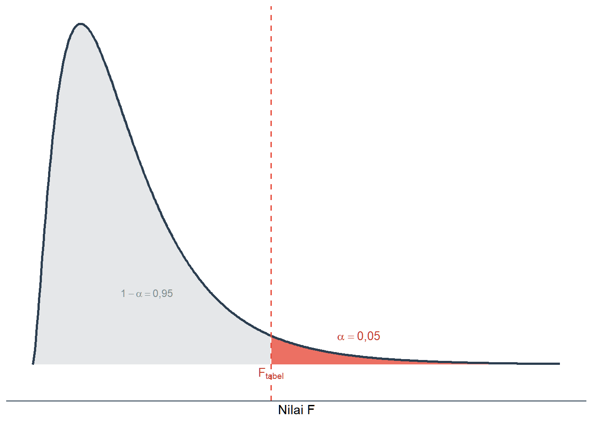
<p class="caption">(\#fig:fig-ilustrasi-f-table-05)Luas area yang dicari pada Tabel Distribusi F ($\alpha = 5\%$): $P(F > F_{tabel}) = 0{,}05$</p>
</div>

<div style="border: 1px solid #ddd; padding: 0px; overflow-y: scroll; height:450px; overflow-x: scroll; width:100%; "><table class="table table-striped table-hover table-condensed" style="font-size: 10px; width: auto !important; margin-left: auto; margin-right: auto;">
<caption style="font-size: initial !important;">(\#tab:tab-distribusi-f-5persen-lampiran)Tabel Distribusi F pada Tingkat Signifikansi $\alpha = 5\%$</caption>
 <thead>
<tr>
<th style="empty-cells: hide;border-bottom:hidden;position: sticky; top:0; background-color: #FFFFFF;" colspan="1"></th>
<th style="border-bottom:hidden;padding-bottom:0; padding-left:3px;padding-right:3px;text-align: center; position: sticky; top:0; background-color: #FFFFFF;" colspan="34"><div style="border-bottom: 1px solid #ddd; padding-bottom: 5px; ">dfb</div></th>
</tr>
  <tr>
   <th style="text-align:center;position: sticky; top:0; background-color: #FFFFFF;"> dfw </th>
   <th style="text-align:center;position: sticky; top:0; background-color: #FFFFFF;"> 1 </th>
   <th style="text-align:center;position: sticky; top:0; background-color: #FFFFFF;"> 2 </th>
   <th style="text-align:center;position: sticky; top:0; background-color: #FFFFFF;"> 3 </th>
   <th style="text-align:center;position: sticky; top:0; background-color: #FFFFFF;"> 4 </th>
   <th style="text-align:center;position: sticky; top:0; background-color: #FFFFFF;"> 5 </th>
   <th style="text-align:center;position: sticky; top:0; background-color: #FFFFFF;"> 6 </th>
   <th style="text-align:center;position: sticky; top:0; background-color: #FFFFFF;"> 7 </th>
   <th style="text-align:center;position: sticky; top:0; background-color: #FFFFFF;"> 8 </th>
   <th style="text-align:center;position: sticky; top:0; background-color: #FFFFFF;"> 9 </th>
   <th style="text-align:center;position: sticky; top:0; background-color: #FFFFFF;"> 10 </th>
   <th style="text-align:center;position: sticky; top:0; background-color: #FFFFFF;"> 11 </th>
   <th style="text-align:center;position: sticky; top:0; background-color: #FFFFFF;"> 12 </th>
   <th style="text-align:center;position: sticky; top:0; background-color: #FFFFFF;"> 13 </th>
   <th style="text-align:center;position: sticky; top:0; background-color: #FFFFFF;"> 14 </th>
   <th style="text-align:center;position: sticky; top:0; background-color: #FFFFFF;"> 15 </th>
   <th style="text-align:center;position: sticky; top:0; background-color: #FFFFFF;"> 16 </th>
   <th style="text-align:center;position: sticky; top:0; background-color: #FFFFFF;"> 17 </th>
   <th style="text-align:center;position: sticky; top:0; background-color: #FFFFFF;"> 18 </th>
   <th style="text-align:center;position: sticky; top:0; background-color: #FFFFFF;"> 19 </th>
   <th style="text-align:center;position: sticky; top:0; background-color: #FFFFFF;"> 20 </th>
   <th style="text-align:center;position: sticky; top:0; background-color: #FFFFFF;"> 21 </th>
   <th style="text-align:center;position: sticky; top:0; background-color: #FFFFFF;"> 22 </th>
   <th style="text-align:center;position: sticky; top:0; background-color: #FFFFFF;"> 23 </th>
   <th style="text-align:center;position: sticky; top:0; background-color: #FFFFFF;"> 24 </th>
   <th style="text-align:center;position: sticky; top:0; background-color: #FFFFFF;"> 25 </th>
   <th style="text-align:center;position: sticky; top:0; background-color: #FFFFFF;"> 26 </th>
   <th style="text-align:center;position: sticky; top:0; background-color: #FFFFFF;"> 27 </th>
   <th style="text-align:center;position: sticky; top:0; background-color: #FFFFFF;"> 28 </th>
   <th style="text-align:center;position: sticky; top:0; background-color: #FFFFFF;"> 29 </th>
   <th style="text-align:center;position: sticky; top:0; background-color: #FFFFFF;"> 30 </th>
   <th style="text-align:center;position: sticky; top:0; background-color: #FFFFFF;"> 40 </th>
   <th style="text-align:center;position: sticky; top:0; background-color: #FFFFFF;"> 60 </th>
   <th style="text-align:center;position: sticky; top:0; background-color: #FFFFFF;"> 120 </th>
   <th style="text-align:center;position: sticky; top:0; background-color: #FFFFFF;"> ∞ </th>
  </tr>
 </thead>
<tbody>
  <tr>
   <td style="text-align:center;font-weight: bold;"> 1 </td>
   <td style="text-align:center;"> 161,45 </td>
   <td style="text-align:center;"> 199,50 </td>
   <td style="text-align:center;"> 215,71 </td>
   <td style="text-align:center;"> 224,58 </td>
   <td style="text-align:center;"> 230,16 </td>
   <td style="text-align:center;"> 233,99 </td>
   <td style="text-align:center;"> 236,77 </td>
   <td style="text-align:center;"> 238,88 </td>
   <td style="text-align:center;"> 240,54 </td>
   <td style="text-align:center;"> 241,88 </td>
   <td style="text-align:center;"> 242,98 </td>
   <td style="text-align:center;"> 243,91 </td>
   <td style="text-align:center;"> 244,69 </td>
   <td style="text-align:center;"> 245,36 </td>
   <td style="text-align:center;"> 245,95 </td>
   <td style="text-align:center;"> 246,46 </td>
   <td style="text-align:center;"> 246,92 </td>
   <td style="text-align:center;"> 247,32 </td>
   <td style="text-align:center;"> 247,69 </td>
   <td style="text-align:center;"> 248,01 </td>
   <td style="text-align:center;"> 248,31 </td>
   <td style="text-align:center;"> 248,58 </td>
   <td style="text-align:center;"> 248,83 </td>
   <td style="text-align:center;"> 249,05 </td>
   <td style="text-align:center;"> 249,26 </td>
   <td style="text-align:center;"> 249,45 </td>
   <td style="text-align:center;"> 249,63 </td>
   <td style="text-align:center;"> 249,80 </td>
   <td style="text-align:center;"> 249,95 </td>
   <td style="text-align:center;"> 250,10 </td>
   <td style="text-align:center;"> 251,14 </td>
   <td style="text-align:center;"> 252,20 </td>
   <td style="text-align:center;"> 253,25 </td>
   <td style="text-align:center;"> 254,19 </td>
  </tr>
  <tr>
   <td style="text-align:center;font-weight: bold;"> 2 </td>
   <td style="text-align:center;"> 18,51 </td>
   <td style="text-align:center;"> 19,00 </td>
   <td style="text-align:center;"> 19,16 </td>
   <td style="text-align:center;"> 19,25 </td>
   <td style="text-align:center;"> 19,30 </td>
   <td style="text-align:center;"> 19,33 </td>
   <td style="text-align:center;"> 19,35 </td>
   <td style="text-align:center;"> 19,37 </td>
   <td style="text-align:center;"> 19,38 </td>
   <td style="text-align:center;"> 19,40 </td>
   <td style="text-align:center;"> 19,40 </td>
   <td style="text-align:center;"> 19,41 </td>
   <td style="text-align:center;"> 19,42 </td>
   <td style="text-align:center;"> 19,42 </td>
   <td style="text-align:center;"> 19,43 </td>
   <td style="text-align:center;"> 19,43 </td>
   <td style="text-align:center;"> 19,44 </td>
   <td style="text-align:center;"> 19,44 </td>
   <td style="text-align:center;"> 19,44 </td>
   <td style="text-align:center;"> 19,45 </td>
   <td style="text-align:center;"> 19,45 </td>
   <td style="text-align:center;"> 19,45 </td>
   <td style="text-align:center;"> 19,45 </td>
   <td style="text-align:center;"> 19,45 </td>
   <td style="text-align:center;"> 19,46 </td>
   <td style="text-align:center;"> 19,46 </td>
   <td style="text-align:center;"> 19,46 </td>
   <td style="text-align:center;"> 19,46 </td>
   <td style="text-align:center;"> 19,46 </td>
   <td style="text-align:center;"> 19,46 </td>
   <td style="text-align:center;"> 19,47 </td>
   <td style="text-align:center;"> 19,48 </td>
   <td style="text-align:center;"> 19,49 </td>
   <td style="text-align:center;"> 19,49 </td>
  </tr>
  <tr>
   <td style="text-align:center;font-weight: bold;"> 3 </td>
   <td style="text-align:center;"> 10,13 </td>
   <td style="text-align:center;"> 9,55 </td>
   <td style="text-align:center;"> 9,28 </td>
   <td style="text-align:center;"> 9,12 </td>
   <td style="text-align:center;"> 9,01 </td>
   <td style="text-align:center;"> 8,94 </td>
   <td style="text-align:center;"> 8,89 </td>
   <td style="text-align:center;"> 8,85 </td>
   <td style="text-align:center;"> 8,81 </td>
   <td style="text-align:center;"> 8,79 </td>
   <td style="text-align:center;"> 8,76 </td>
   <td style="text-align:center;"> 8,74 </td>
   <td style="text-align:center;"> 8,73 </td>
   <td style="text-align:center;"> 8,71 </td>
   <td style="text-align:center;"> 8,70 </td>
   <td style="text-align:center;"> 8,69 </td>
   <td style="text-align:center;"> 8,68 </td>
   <td style="text-align:center;"> 8,67 </td>
   <td style="text-align:center;"> 8,67 </td>
   <td style="text-align:center;"> 8,66 </td>
   <td style="text-align:center;"> 8,65 </td>
   <td style="text-align:center;"> 8,65 </td>
   <td style="text-align:center;"> 8,64 </td>
   <td style="text-align:center;"> 8,64 </td>
   <td style="text-align:center;"> 8,63 </td>
   <td style="text-align:center;"> 8,63 </td>
   <td style="text-align:center;"> 8,63 </td>
   <td style="text-align:center;"> 8,62 </td>
   <td style="text-align:center;"> 8,62 </td>
   <td style="text-align:center;"> 8,62 </td>
   <td style="text-align:center;"> 8,59 </td>
   <td style="text-align:center;"> 8,57 </td>
   <td style="text-align:center;"> 8,55 </td>
   <td style="text-align:center;"> 8,53 </td>
  </tr>
  <tr>
   <td style="text-align:center;font-weight: bold;"> 4 </td>
   <td style="text-align:center;"> 7,71 </td>
   <td style="text-align:center;"> 6,94 </td>
   <td style="text-align:center;"> 6,59 </td>
   <td style="text-align:center;"> 6,39 </td>
   <td style="text-align:center;"> 6,26 </td>
   <td style="text-align:center;"> 6,16 </td>
   <td style="text-align:center;"> 6,09 </td>
   <td style="text-align:center;"> 6,04 </td>
   <td style="text-align:center;"> 6,00 </td>
   <td style="text-align:center;"> 5,96 </td>
   <td style="text-align:center;"> 5,94 </td>
   <td style="text-align:center;"> 5,91 </td>
   <td style="text-align:center;"> 5,89 </td>
   <td style="text-align:center;"> 5,87 </td>
   <td style="text-align:center;"> 5,86 </td>
   <td style="text-align:center;"> 5,84 </td>
   <td style="text-align:center;"> 5,83 </td>
   <td style="text-align:center;"> 5,82 </td>
   <td style="text-align:center;"> 5,81 </td>
   <td style="text-align:center;"> 5,80 </td>
   <td style="text-align:center;"> 5,79 </td>
   <td style="text-align:center;"> 5,79 </td>
   <td style="text-align:center;"> 5,78 </td>
   <td style="text-align:center;"> 5,77 </td>
   <td style="text-align:center;"> 5,77 </td>
   <td style="text-align:center;"> 5,76 </td>
   <td style="text-align:center;"> 5,76 </td>
   <td style="text-align:center;"> 5,75 </td>
   <td style="text-align:center;"> 5,75 </td>
   <td style="text-align:center;"> 5,75 </td>
   <td style="text-align:center;"> 5,72 </td>
   <td style="text-align:center;"> 5,69 </td>
   <td style="text-align:center;"> 5,66 </td>
   <td style="text-align:center;"> 5,63 </td>
  </tr>
  <tr>
   <td style="text-align:center;font-weight: bold;"> 5 </td>
   <td style="text-align:center;"> 6,61 </td>
   <td style="text-align:center;"> 5,79 </td>
   <td style="text-align:center;"> 5,41 </td>
   <td style="text-align:center;"> 5,19 </td>
   <td style="text-align:center;"> 5,05 </td>
   <td style="text-align:center;"> 4,95 </td>
   <td style="text-align:center;"> 4,88 </td>
   <td style="text-align:center;"> 4,82 </td>
   <td style="text-align:center;"> 4,77 </td>
   <td style="text-align:center;"> 4,74 </td>
   <td style="text-align:center;"> 4,70 </td>
   <td style="text-align:center;"> 4,68 </td>
   <td style="text-align:center;"> 4,66 </td>
   <td style="text-align:center;"> 4,64 </td>
   <td style="text-align:center;"> 4,62 </td>
   <td style="text-align:center;"> 4,60 </td>
   <td style="text-align:center;"> 4,59 </td>
   <td style="text-align:center;"> 4,58 </td>
   <td style="text-align:center;"> 4,57 </td>
   <td style="text-align:center;"> 4,56 </td>
   <td style="text-align:center;"> 4,55 </td>
   <td style="text-align:center;"> 4,54 </td>
   <td style="text-align:center;"> 4,53 </td>
   <td style="text-align:center;"> 4,53 </td>
   <td style="text-align:center;"> 4,52 </td>
   <td style="text-align:center;"> 4,52 </td>
   <td style="text-align:center;"> 4,51 </td>
   <td style="text-align:center;"> 4,50 </td>
   <td style="text-align:center;"> 4,50 </td>
   <td style="text-align:center;"> 4,50 </td>
   <td style="text-align:center;"> 4,46 </td>
   <td style="text-align:center;"> 4,43 </td>
   <td style="text-align:center;"> 4,40 </td>
   <td style="text-align:center;"> 4,37 </td>
  </tr>
  <tr>
   <td style="text-align:center;font-weight: bold;"> 6 </td>
   <td style="text-align:center;"> 5,99 </td>
   <td style="text-align:center;"> 5,14 </td>
   <td style="text-align:center;"> 4,76 </td>
   <td style="text-align:center;"> 4,53 </td>
   <td style="text-align:center;"> 4,39 </td>
   <td style="text-align:center;"> 4,28 </td>
   <td style="text-align:center;"> 4,21 </td>
   <td style="text-align:center;"> 4,15 </td>
   <td style="text-align:center;"> 4,10 </td>
   <td style="text-align:center;"> 4,06 </td>
   <td style="text-align:center;"> 4,03 </td>
   <td style="text-align:center;"> 4,00 </td>
   <td style="text-align:center;"> 3,98 </td>
   <td style="text-align:center;"> 3,96 </td>
   <td style="text-align:center;"> 3,94 </td>
   <td style="text-align:center;"> 3,92 </td>
   <td style="text-align:center;"> 3,91 </td>
   <td style="text-align:center;"> 3,90 </td>
   <td style="text-align:center;"> 3,88 </td>
   <td style="text-align:center;"> 3,87 </td>
   <td style="text-align:center;"> 3,86 </td>
   <td style="text-align:center;"> 3,86 </td>
   <td style="text-align:center;"> 3,85 </td>
   <td style="text-align:center;"> 3,84 </td>
   <td style="text-align:center;"> 3,83 </td>
   <td style="text-align:center;"> 3,83 </td>
   <td style="text-align:center;"> 3,82 </td>
   <td style="text-align:center;"> 3,82 </td>
   <td style="text-align:center;"> 3,81 </td>
   <td style="text-align:center;"> 3,81 </td>
   <td style="text-align:center;"> 3,77 </td>
   <td style="text-align:center;"> 3,74 </td>
   <td style="text-align:center;"> 3,70 </td>
   <td style="text-align:center;"> 3,67 </td>
  </tr>
  <tr>
   <td style="text-align:center;font-weight: bold;"> 7 </td>
   <td style="text-align:center;"> 5,59 </td>
   <td style="text-align:center;"> 4,74 </td>
   <td style="text-align:center;"> 4,35 </td>
   <td style="text-align:center;"> 4,12 </td>
   <td style="text-align:center;"> 3,97 </td>
   <td style="text-align:center;"> 3,87 </td>
   <td style="text-align:center;"> 3,79 </td>
   <td style="text-align:center;"> 3,73 </td>
   <td style="text-align:center;"> 3,68 </td>
   <td style="text-align:center;"> 3,64 </td>
   <td style="text-align:center;"> 3,60 </td>
   <td style="text-align:center;"> 3,57 </td>
   <td style="text-align:center;"> 3,55 </td>
   <td style="text-align:center;"> 3,53 </td>
   <td style="text-align:center;"> 3,51 </td>
   <td style="text-align:center;"> 3,49 </td>
   <td style="text-align:center;"> 3,48 </td>
   <td style="text-align:center;"> 3,47 </td>
   <td style="text-align:center;"> 3,46 </td>
   <td style="text-align:center;"> 3,44 </td>
   <td style="text-align:center;"> 3,43 </td>
   <td style="text-align:center;"> 3,43 </td>
   <td style="text-align:center;"> 3,42 </td>
   <td style="text-align:center;"> 3,41 </td>
   <td style="text-align:center;"> 3,40 </td>
   <td style="text-align:center;"> 3,40 </td>
   <td style="text-align:center;"> 3,39 </td>
   <td style="text-align:center;"> 3,39 </td>
   <td style="text-align:center;"> 3,38 </td>
   <td style="text-align:center;"> 3,38 </td>
   <td style="text-align:center;"> 3,34 </td>
   <td style="text-align:center;"> 3,30 </td>
   <td style="text-align:center;"> 3,27 </td>
   <td style="text-align:center;"> 3,23 </td>
  </tr>
  <tr>
   <td style="text-align:center;font-weight: bold;"> 8 </td>
   <td style="text-align:center;"> 5,32 </td>
   <td style="text-align:center;"> 4,46 </td>
   <td style="text-align:center;"> 4,07 </td>
   <td style="text-align:center;"> 3,84 </td>
   <td style="text-align:center;"> 3,69 </td>
   <td style="text-align:center;"> 3,58 </td>
   <td style="text-align:center;"> 3,50 </td>
   <td style="text-align:center;"> 3,44 </td>
   <td style="text-align:center;"> 3,39 </td>
   <td style="text-align:center;"> 3,35 </td>
   <td style="text-align:center;"> 3,31 </td>
   <td style="text-align:center;"> 3,28 </td>
   <td style="text-align:center;"> 3,26 </td>
   <td style="text-align:center;"> 3,24 </td>
   <td style="text-align:center;"> 3,22 </td>
   <td style="text-align:center;"> 3,20 </td>
   <td style="text-align:center;"> 3,19 </td>
   <td style="text-align:center;"> 3,17 </td>
   <td style="text-align:center;"> 3,16 </td>
   <td style="text-align:center;"> 3,15 </td>
   <td style="text-align:center;"> 3,14 </td>
   <td style="text-align:center;"> 3,13 </td>
   <td style="text-align:center;"> 3,12 </td>
   <td style="text-align:center;"> 3,12 </td>
   <td style="text-align:center;"> 3,11 </td>
   <td style="text-align:center;"> 3,10 </td>
   <td style="text-align:center;"> 3,10 </td>
   <td style="text-align:center;"> 3,09 </td>
   <td style="text-align:center;"> 3,08 </td>
   <td style="text-align:center;"> 3,08 </td>
   <td style="text-align:center;"> 3,04 </td>
   <td style="text-align:center;"> 3,01 </td>
   <td style="text-align:center;"> 2,97 </td>
   <td style="text-align:center;"> 2,93 </td>
  </tr>
  <tr>
   <td style="text-align:center;font-weight: bold;"> 9 </td>
   <td style="text-align:center;"> 5,12 </td>
   <td style="text-align:center;"> 4,26 </td>
   <td style="text-align:center;"> 3,86 </td>
   <td style="text-align:center;"> 3,63 </td>
   <td style="text-align:center;"> 3,48 </td>
   <td style="text-align:center;"> 3,37 </td>
   <td style="text-align:center;"> 3,29 </td>
   <td style="text-align:center;"> 3,23 </td>
   <td style="text-align:center;"> 3,18 </td>
   <td style="text-align:center;"> 3,14 </td>
   <td style="text-align:center;"> 3,10 </td>
   <td style="text-align:center;"> 3,07 </td>
   <td style="text-align:center;"> 3,05 </td>
   <td style="text-align:center;"> 3,03 </td>
   <td style="text-align:center;"> 3,01 </td>
   <td style="text-align:center;"> 2,99 </td>
   <td style="text-align:center;"> 2,97 </td>
   <td style="text-align:center;"> 2,96 </td>
   <td style="text-align:center;"> 2,95 </td>
   <td style="text-align:center;"> 2,94 </td>
   <td style="text-align:center;"> 2,93 </td>
   <td style="text-align:center;"> 2,92 </td>
   <td style="text-align:center;"> 2,91 </td>
   <td style="text-align:center;"> 2,90 </td>
   <td style="text-align:center;"> 2,89 </td>
   <td style="text-align:center;"> 2,89 </td>
   <td style="text-align:center;"> 2,88 </td>
   <td style="text-align:center;"> 2,87 </td>
   <td style="text-align:center;"> 2,87 </td>
   <td style="text-align:center;"> 2,86 </td>
   <td style="text-align:center;"> 2,83 </td>
   <td style="text-align:center;"> 2,79 </td>
   <td style="text-align:center;"> 2,75 </td>
   <td style="text-align:center;"> 2,71 </td>
  </tr>
  <tr>
   <td style="text-align:center;font-weight: bold;"> 10 </td>
   <td style="text-align:center;"> 4,96 </td>
   <td style="text-align:center;"> 4,10 </td>
   <td style="text-align:center;"> 3,71 </td>
   <td style="text-align:center;"> 3,48 </td>
   <td style="text-align:center;"> 3,33 </td>
   <td style="text-align:center;"> 3,22 </td>
   <td style="text-align:center;"> 3,14 </td>
   <td style="text-align:center;"> 3,07 </td>
   <td style="text-align:center;"> 3,02 </td>
   <td style="text-align:center;"> 2,98 </td>
   <td style="text-align:center;"> 2,94 </td>
   <td style="text-align:center;"> 2,91 </td>
   <td style="text-align:center;"> 2,89 </td>
   <td style="text-align:center;"> 2,86 </td>
   <td style="text-align:center;"> 2,85 </td>
   <td style="text-align:center;"> 2,83 </td>
   <td style="text-align:center;"> 2,81 </td>
   <td style="text-align:center;"> 2,80 </td>
   <td style="text-align:center;"> 2,79 </td>
   <td style="text-align:center;"> 2,77 </td>
   <td style="text-align:center;"> 2,76 </td>
   <td style="text-align:center;"> 2,75 </td>
   <td style="text-align:center;"> 2,75 </td>
   <td style="text-align:center;"> 2,74 </td>
   <td style="text-align:center;"> 2,73 </td>
   <td style="text-align:center;"> 2,72 </td>
   <td style="text-align:center;"> 2,72 </td>
   <td style="text-align:center;"> 2,71 </td>
   <td style="text-align:center;"> 2,70 </td>
   <td style="text-align:center;"> 2,70 </td>
   <td style="text-align:center;"> 2,66 </td>
   <td style="text-align:center;"> 2,62 </td>
   <td style="text-align:center;"> 2,58 </td>
   <td style="text-align:center;"> 2,54 </td>
  </tr>
  <tr>
   <td style="text-align:center;font-weight: bold;"> 11 </td>
   <td style="text-align:center;"> 4,84 </td>
   <td style="text-align:center;"> 3,98 </td>
   <td style="text-align:center;"> 3,59 </td>
   <td style="text-align:center;"> 3,36 </td>
   <td style="text-align:center;"> 3,20 </td>
   <td style="text-align:center;"> 3,09 </td>
   <td style="text-align:center;"> 3,01 </td>
   <td style="text-align:center;"> 2,95 </td>
   <td style="text-align:center;"> 2,90 </td>
   <td style="text-align:center;"> 2,85 </td>
   <td style="text-align:center;"> 2,82 </td>
   <td style="text-align:center;"> 2,79 </td>
   <td style="text-align:center;"> 2,76 </td>
   <td style="text-align:center;"> 2,74 </td>
   <td style="text-align:center;"> 2,72 </td>
   <td style="text-align:center;"> 2,70 </td>
   <td style="text-align:center;"> 2,69 </td>
   <td style="text-align:center;"> 2,67 </td>
   <td style="text-align:center;"> 2,66 </td>
   <td style="text-align:center;"> 2,65 </td>
   <td style="text-align:center;"> 2,64 </td>
   <td style="text-align:center;"> 2,63 </td>
   <td style="text-align:center;"> 2,62 </td>
   <td style="text-align:center;"> 2,61 </td>
   <td style="text-align:center;"> 2,60 </td>
   <td style="text-align:center;"> 2,59 </td>
   <td style="text-align:center;"> 2,59 </td>
   <td style="text-align:center;"> 2,58 </td>
   <td style="text-align:center;"> 2,58 </td>
   <td style="text-align:center;"> 2,57 </td>
   <td style="text-align:center;"> 2,53 </td>
   <td style="text-align:center;"> 2,49 </td>
   <td style="text-align:center;"> 2,45 </td>
   <td style="text-align:center;"> 2,41 </td>
  </tr>
  <tr>
   <td style="text-align:center;font-weight: bold;"> 12 </td>
   <td style="text-align:center;"> 4,75 </td>
   <td style="text-align:center;"> 3,89 </td>
   <td style="text-align:center;"> 3,49 </td>
   <td style="text-align:center;"> 3,26 </td>
   <td style="text-align:center;"> 3,11 </td>
   <td style="text-align:center;"> 3,00 </td>
   <td style="text-align:center;"> 2,91 </td>
   <td style="text-align:center;"> 2,85 </td>
   <td style="text-align:center;"> 2,80 </td>
   <td style="text-align:center;"> 2,75 </td>
   <td style="text-align:center;"> 2,72 </td>
   <td style="text-align:center;"> 2,69 </td>
   <td style="text-align:center;"> 2,66 </td>
   <td style="text-align:center;"> 2,64 </td>
   <td style="text-align:center;"> 2,62 </td>
   <td style="text-align:center;"> 2,60 </td>
   <td style="text-align:center;"> 2,58 </td>
   <td style="text-align:center;"> 2,57 </td>
   <td style="text-align:center;"> 2,56 </td>
   <td style="text-align:center;"> 2,54 </td>
   <td style="text-align:center;"> 2,53 </td>
   <td style="text-align:center;"> 2,52 </td>
   <td style="text-align:center;"> 2,51 </td>
   <td style="text-align:center;"> 2,51 </td>
   <td style="text-align:center;"> 2,50 </td>
   <td style="text-align:center;"> 2,49 </td>
   <td style="text-align:center;"> 2,48 </td>
   <td style="text-align:center;"> 2,48 </td>
   <td style="text-align:center;"> 2,47 </td>
   <td style="text-align:center;"> 2,47 </td>
   <td style="text-align:center;"> 2,43 </td>
   <td style="text-align:center;"> 2,38 </td>
   <td style="text-align:center;"> 2,34 </td>
   <td style="text-align:center;"> 2,30 </td>
  </tr>
  <tr>
   <td style="text-align:center;font-weight: bold;"> 13 </td>
   <td style="text-align:center;"> 4,67 </td>
   <td style="text-align:center;"> 3,81 </td>
   <td style="text-align:center;"> 3,41 </td>
   <td style="text-align:center;"> 3,18 </td>
   <td style="text-align:center;"> 3,03 </td>
   <td style="text-align:center;"> 2,92 </td>
   <td style="text-align:center;"> 2,83 </td>
   <td style="text-align:center;"> 2,77 </td>
   <td style="text-align:center;"> 2,71 </td>
   <td style="text-align:center;"> 2,67 </td>
   <td style="text-align:center;"> 2,63 </td>
   <td style="text-align:center;"> 2,60 </td>
   <td style="text-align:center;"> 2,58 </td>
   <td style="text-align:center;"> 2,55 </td>
   <td style="text-align:center;"> 2,53 </td>
   <td style="text-align:center;"> 2,51 </td>
   <td style="text-align:center;"> 2,50 </td>
   <td style="text-align:center;"> 2,48 </td>
   <td style="text-align:center;"> 2,47 </td>
   <td style="text-align:center;"> 2,46 </td>
   <td style="text-align:center;"> 2,45 </td>
   <td style="text-align:center;"> 2,44 </td>
   <td style="text-align:center;"> 2,43 </td>
   <td style="text-align:center;"> 2,42 </td>
   <td style="text-align:center;"> 2,41 </td>
   <td style="text-align:center;"> 2,41 </td>
   <td style="text-align:center;"> 2,40 </td>
   <td style="text-align:center;"> 2,39 </td>
   <td style="text-align:center;"> 2,39 </td>
   <td style="text-align:center;"> 2,38 </td>
   <td style="text-align:center;"> 2,34 </td>
   <td style="text-align:center;"> 2,30 </td>
   <td style="text-align:center;"> 2,25 </td>
   <td style="text-align:center;"> 2,21 </td>
  </tr>
  <tr>
   <td style="text-align:center;font-weight: bold;"> 14 </td>
   <td style="text-align:center;"> 4,60 </td>
   <td style="text-align:center;"> 3,74 </td>
   <td style="text-align:center;"> 3,34 </td>
   <td style="text-align:center;"> 3,11 </td>
   <td style="text-align:center;"> 2,96 </td>
   <td style="text-align:center;"> 2,85 </td>
   <td style="text-align:center;"> 2,76 </td>
   <td style="text-align:center;"> 2,70 </td>
   <td style="text-align:center;"> 2,65 </td>
   <td style="text-align:center;"> 2,60 </td>
   <td style="text-align:center;"> 2,57 </td>
   <td style="text-align:center;"> 2,53 </td>
   <td style="text-align:center;"> 2,51 </td>
   <td style="text-align:center;"> 2,48 </td>
   <td style="text-align:center;"> 2,46 </td>
   <td style="text-align:center;"> 2,44 </td>
   <td style="text-align:center;"> 2,43 </td>
   <td style="text-align:center;"> 2,41 </td>
   <td style="text-align:center;"> 2,40 </td>
   <td style="text-align:center;"> 2,39 </td>
   <td style="text-align:center;"> 2,38 </td>
   <td style="text-align:center;"> 2,37 </td>
   <td style="text-align:center;"> 2,36 </td>
   <td style="text-align:center;"> 2,35 </td>
   <td style="text-align:center;"> 2,34 </td>
   <td style="text-align:center;"> 2,33 </td>
   <td style="text-align:center;"> 2,33 </td>
   <td style="text-align:center;"> 2,32 </td>
   <td style="text-align:center;"> 2,31 </td>
   <td style="text-align:center;"> 2,31 </td>
   <td style="text-align:center;"> 2,27 </td>
   <td style="text-align:center;"> 2,22 </td>
   <td style="text-align:center;"> 2,18 </td>
   <td style="text-align:center;"> 2,14 </td>
  </tr>
  <tr>
   <td style="text-align:center;font-weight: bold;"> 15 </td>
   <td style="text-align:center;"> 4,54 </td>
   <td style="text-align:center;"> 3,68 </td>
   <td style="text-align:center;"> 3,29 </td>
   <td style="text-align:center;"> 3,06 </td>
   <td style="text-align:center;"> 2,90 </td>
   <td style="text-align:center;"> 2,79 </td>
   <td style="text-align:center;"> 2,71 </td>
   <td style="text-align:center;"> 2,64 </td>
   <td style="text-align:center;"> 2,59 </td>
   <td style="text-align:center;"> 2,54 </td>
   <td style="text-align:center;"> 2,51 </td>
   <td style="text-align:center;"> 2,48 </td>
   <td style="text-align:center;"> 2,45 </td>
   <td style="text-align:center;"> 2,42 </td>
   <td style="text-align:center;"> 2,40 </td>
   <td style="text-align:center;"> 2,38 </td>
   <td style="text-align:center;"> 2,37 </td>
   <td style="text-align:center;"> 2,35 </td>
   <td style="text-align:center;"> 2,34 </td>
   <td style="text-align:center;"> 2,33 </td>
   <td style="text-align:center;"> 2,32 </td>
   <td style="text-align:center;"> 2,31 </td>
   <td style="text-align:center;"> 2,30 </td>
   <td style="text-align:center;"> 2,29 </td>
   <td style="text-align:center;"> 2,28 </td>
   <td style="text-align:center;"> 2,27 </td>
   <td style="text-align:center;"> 2,27 </td>
   <td style="text-align:center;"> 2,26 </td>
   <td style="text-align:center;"> 2,25 </td>
   <td style="text-align:center;"> 2,25 </td>
   <td style="text-align:center;"> 2,20 </td>
   <td style="text-align:center;"> 2,16 </td>
   <td style="text-align:center;"> 2,11 </td>
   <td style="text-align:center;"> 2,07 </td>
  </tr>
  <tr>
   <td style="text-align:center;font-weight: bold;"> 16 </td>
   <td style="text-align:center;"> 4,49 </td>
   <td style="text-align:center;"> 3,63 </td>
   <td style="text-align:center;"> 3,24 </td>
   <td style="text-align:center;"> 3,01 </td>
   <td style="text-align:center;"> 2,85 </td>
   <td style="text-align:center;"> 2,74 </td>
   <td style="text-align:center;"> 2,66 </td>
   <td style="text-align:center;"> 2,59 </td>
   <td style="text-align:center;"> 2,54 </td>
   <td style="text-align:center;"> 2,49 </td>
   <td style="text-align:center;"> 2,46 </td>
   <td style="text-align:center;"> 2,42 </td>
   <td style="text-align:center;"> 2,40 </td>
   <td style="text-align:center;"> 2,37 </td>
   <td style="text-align:center;"> 2,35 </td>
   <td style="text-align:center;"> 2,33 </td>
   <td style="text-align:center;"> 2,32 </td>
   <td style="text-align:center;"> 2,30 </td>
   <td style="text-align:center;"> 2,29 </td>
   <td style="text-align:center;"> 2,28 </td>
   <td style="text-align:center;"> 2,26 </td>
   <td style="text-align:center;"> 2,25 </td>
   <td style="text-align:center;"> 2,24 </td>
   <td style="text-align:center;"> 2,24 </td>
   <td style="text-align:center;"> 2,23 </td>
   <td style="text-align:center;"> 2,22 </td>
   <td style="text-align:center;"> 2,21 </td>
   <td style="text-align:center;"> 2,21 </td>
   <td style="text-align:center;"> 2,20 </td>
   <td style="text-align:center;"> 2,19 </td>
   <td style="text-align:center;"> 2,15 </td>
   <td style="text-align:center;"> 2,11 </td>
   <td style="text-align:center;"> 2,06 </td>
   <td style="text-align:center;"> 2,02 </td>
  </tr>
  <tr>
   <td style="text-align:center;font-weight: bold;"> 17 </td>
   <td style="text-align:center;"> 4,45 </td>
   <td style="text-align:center;"> 3,59 </td>
   <td style="text-align:center;"> 3,20 </td>
   <td style="text-align:center;"> 2,96 </td>
   <td style="text-align:center;"> 2,81 </td>
   <td style="text-align:center;"> 2,70 </td>
   <td style="text-align:center;"> 2,61 </td>
   <td style="text-align:center;"> 2,55 </td>
   <td style="text-align:center;"> 2,49 </td>
   <td style="text-align:center;"> 2,45 </td>
   <td style="text-align:center;"> 2,41 </td>
   <td style="text-align:center;"> 2,38 </td>
   <td style="text-align:center;"> 2,35 </td>
   <td style="text-align:center;"> 2,33 </td>
   <td style="text-align:center;"> 2,31 </td>
   <td style="text-align:center;"> 2,29 </td>
   <td style="text-align:center;"> 2,27 </td>
   <td style="text-align:center;"> 2,26 </td>
   <td style="text-align:center;"> 2,24 </td>
   <td style="text-align:center;"> 2,23 </td>
   <td style="text-align:center;"> 2,22 </td>
   <td style="text-align:center;"> 2,21 </td>
   <td style="text-align:center;"> 2,20 </td>
   <td style="text-align:center;"> 2,19 </td>
   <td style="text-align:center;"> 2,18 </td>
   <td style="text-align:center;"> 2,17 </td>
   <td style="text-align:center;"> 2,17 </td>
   <td style="text-align:center;"> 2,16 </td>
   <td style="text-align:center;"> 2,15 </td>
   <td style="text-align:center;"> 2,15 </td>
   <td style="text-align:center;"> 2,10 </td>
   <td style="text-align:center;"> 2,06 </td>
   <td style="text-align:center;"> 2,01 </td>
   <td style="text-align:center;"> 1,97 </td>
  </tr>
  <tr>
   <td style="text-align:center;font-weight: bold;"> 18 </td>
   <td style="text-align:center;"> 4,41 </td>
   <td style="text-align:center;"> 3,55 </td>
   <td style="text-align:center;"> 3,16 </td>
   <td style="text-align:center;"> 2,93 </td>
   <td style="text-align:center;"> 2,77 </td>
   <td style="text-align:center;"> 2,66 </td>
   <td style="text-align:center;"> 2,58 </td>
   <td style="text-align:center;"> 2,51 </td>
   <td style="text-align:center;"> 2,46 </td>
   <td style="text-align:center;"> 2,41 </td>
   <td style="text-align:center;"> 2,37 </td>
   <td style="text-align:center;"> 2,34 </td>
   <td style="text-align:center;"> 2,31 </td>
   <td style="text-align:center;"> 2,29 </td>
   <td style="text-align:center;"> 2,27 </td>
   <td style="text-align:center;"> 2,25 </td>
   <td style="text-align:center;"> 2,23 </td>
   <td style="text-align:center;"> 2,22 </td>
   <td style="text-align:center;"> 2,20 </td>
   <td style="text-align:center;"> 2,19 </td>
   <td style="text-align:center;"> 2,18 </td>
   <td style="text-align:center;"> 2,17 </td>
   <td style="text-align:center;"> 2,16 </td>
   <td style="text-align:center;"> 2,15 </td>
   <td style="text-align:center;"> 2,14 </td>
   <td style="text-align:center;"> 2,13 </td>
   <td style="text-align:center;"> 2,13 </td>
   <td style="text-align:center;"> 2,12 </td>
   <td style="text-align:center;"> 2,11 </td>
   <td style="text-align:center;"> 2,11 </td>
   <td style="text-align:center;"> 2,06 </td>
   <td style="text-align:center;"> 2,02 </td>
   <td style="text-align:center;"> 1,97 </td>
   <td style="text-align:center;"> 1,92 </td>
  </tr>
  <tr>
   <td style="text-align:center;font-weight: bold;"> 19 </td>
   <td style="text-align:center;"> 4,38 </td>
   <td style="text-align:center;"> 3,52 </td>
   <td style="text-align:center;"> 3,13 </td>
   <td style="text-align:center;"> 2,90 </td>
   <td style="text-align:center;"> 2,74 </td>
   <td style="text-align:center;"> 2,63 </td>
   <td style="text-align:center;"> 2,54 </td>
   <td style="text-align:center;"> 2,48 </td>
   <td style="text-align:center;"> 2,42 </td>
   <td style="text-align:center;"> 2,38 </td>
   <td style="text-align:center;"> 2,34 </td>
   <td style="text-align:center;"> 2,31 </td>
   <td style="text-align:center;"> 2,28 </td>
   <td style="text-align:center;"> 2,26 </td>
   <td style="text-align:center;"> 2,23 </td>
   <td style="text-align:center;"> 2,21 </td>
   <td style="text-align:center;"> 2,20 </td>
   <td style="text-align:center;"> 2,18 </td>
   <td style="text-align:center;"> 2,17 </td>
   <td style="text-align:center;"> 2,16 </td>
   <td style="text-align:center;"> 2,14 </td>
   <td style="text-align:center;"> 2,13 </td>
   <td style="text-align:center;"> 2,12 </td>
   <td style="text-align:center;"> 2,11 </td>
   <td style="text-align:center;"> 2,11 </td>
   <td style="text-align:center;"> 2,10 </td>
   <td style="text-align:center;"> 2,09 </td>
   <td style="text-align:center;"> 2,08 </td>
   <td style="text-align:center;"> 2,08 </td>
   <td style="text-align:center;"> 2,07 </td>
   <td style="text-align:center;"> 2,03 </td>
   <td style="text-align:center;"> 1,98 </td>
   <td style="text-align:center;"> 1,93 </td>
   <td style="text-align:center;"> 1,88 </td>
  </tr>
  <tr>
   <td style="text-align:center;font-weight: bold;"> 20 </td>
   <td style="text-align:center;"> 4,35 </td>
   <td style="text-align:center;"> 3,49 </td>
   <td style="text-align:center;"> 3,10 </td>
   <td style="text-align:center;"> 2,87 </td>
   <td style="text-align:center;"> 2,71 </td>
   <td style="text-align:center;"> 2,60 </td>
   <td style="text-align:center;"> 2,51 </td>
   <td style="text-align:center;"> 2,45 </td>
   <td style="text-align:center;"> 2,39 </td>
   <td style="text-align:center;"> 2,35 </td>
   <td style="text-align:center;"> 2,31 </td>
   <td style="text-align:center;"> 2,28 </td>
   <td style="text-align:center;"> 2,25 </td>
   <td style="text-align:center;"> 2,22 </td>
   <td style="text-align:center;"> 2,20 </td>
   <td style="text-align:center;"> 2,18 </td>
   <td style="text-align:center;"> 2,17 </td>
   <td style="text-align:center;"> 2,15 </td>
   <td style="text-align:center;"> 2,14 </td>
   <td style="text-align:center;"> 2,12 </td>
   <td style="text-align:center;"> 2,11 </td>
   <td style="text-align:center;"> 2,10 </td>
   <td style="text-align:center;"> 2,09 </td>
   <td style="text-align:center;"> 2,08 </td>
   <td style="text-align:center;"> 2,07 </td>
   <td style="text-align:center;"> 2,07 </td>
   <td style="text-align:center;"> 2,06 </td>
   <td style="text-align:center;"> 2,05 </td>
   <td style="text-align:center;"> 2,05 </td>
   <td style="text-align:center;"> 2,04 </td>
   <td style="text-align:center;"> 1,99 </td>
   <td style="text-align:center;"> 1,95 </td>
   <td style="text-align:center;"> 1,90 </td>
   <td style="text-align:center;"> 1,85 </td>
  </tr>
  <tr>
   <td style="text-align:center;font-weight: bold;"> 21 </td>
   <td style="text-align:center;"> 4,32 </td>
   <td style="text-align:center;"> 3,47 </td>
   <td style="text-align:center;"> 3,07 </td>
   <td style="text-align:center;"> 2,84 </td>
   <td style="text-align:center;"> 2,68 </td>
   <td style="text-align:center;"> 2,57 </td>
   <td style="text-align:center;"> 2,49 </td>
   <td style="text-align:center;"> 2,42 </td>
   <td style="text-align:center;"> 2,37 </td>
   <td style="text-align:center;"> 2,32 </td>
   <td style="text-align:center;"> 2,28 </td>
   <td style="text-align:center;"> 2,25 </td>
   <td style="text-align:center;"> 2,22 </td>
   <td style="text-align:center;"> 2,20 </td>
   <td style="text-align:center;"> 2,18 </td>
   <td style="text-align:center;"> 2,16 </td>
   <td style="text-align:center;"> 2,14 </td>
   <td style="text-align:center;"> 2,12 </td>
   <td style="text-align:center;"> 2,11 </td>
   <td style="text-align:center;"> 2,10 </td>
   <td style="text-align:center;"> 2,08 </td>
   <td style="text-align:center;"> 2,07 </td>
   <td style="text-align:center;"> 2,06 </td>
   <td style="text-align:center;"> 2,05 </td>
   <td style="text-align:center;"> 2,05 </td>
   <td style="text-align:center;"> 2,04 </td>
   <td style="text-align:center;"> 2,03 </td>
   <td style="text-align:center;"> 2,02 </td>
   <td style="text-align:center;"> 2,02 </td>
   <td style="text-align:center;"> 2,01 </td>
   <td style="text-align:center;"> 1,96 </td>
   <td style="text-align:center;"> 1,92 </td>
   <td style="text-align:center;"> 1,87 </td>
   <td style="text-align:center;"> 1,82 </td>
  </tr>
  <tr>
   <td style="text-align:center;font-weight: bold;"> 22 </td>
   <td style="text-align:center;"> 4,30 </td>
   <td style="text-align:center;"> 3,44 </td>
   <td style="text-align:center;"> 3,05 </td>
   <td style="text-align:center;"> 2,82 </td>
   <td style="text-align:center;"> 2,66 </td>
   <td style="text-align:center;"> 2,55 </td>
   <td style="text-align:center;"> 2,46 </td>
   <td style="text-align:center;"> 2,40 </td>
   <td style="text-align:center;"> 2,34 </td>
   <td style="text-align:center;"> 2,30 </td>
   <td style="text-align:center;"> 2,26 </td>
   <td style="text-align:center;"> 2,23 </td>
   <td style="text-align:center;"> 2,20 </td>
   <td style="text-align:center;"> 2,17 </td>
   <td style="text-align:center;"> 2,15 </td>
   <td style="text-align:center;"> 2,13 </td>
   <td style="text-align:center;"> 2,11 </td>
   <td style="text-align:center;"> 2,10 </td>
   <td style="text-align:center;"> 2,08 </td>
   <td style="text-align:center;"> 2,07 </td>
   <td style="text-align:center;"> 2,06 </td>
   <td style="text-align:center;"> 2,05 </td>
   <td style="text-align:center;"> 2,04 </td>
   <td style="text-align:center;"> 2,03 </td>
   <td style="text-align:center;"> 2,02 </td>
   <td style="text-align:center;"> 2,01 </td>
   <td style="text-align:center;"> 2,00 </td>
   <td style="text-align:center;"> 2,00 </td>
   <td style="text-align:center;"> 1,99 </td>
   <td style="text-align:center;"> 1,98 </td>
   <td style="text-align:center;"> 1,94 </td>
   <td style="text-align:center;"> 1,89 </td>
   <td style="text-align:center;"> 1,84 </td>
   <td style="text-align:center;"> 1,79 </td>
  </tr>
  <tr>
   <td style="text-align:center;font-weight: bold;"> 23 </td>
   <td style="text-align:center;"> 4,28 </td>
   <td style="text-align:center;"> 3,42 </td>
   <td style="text-align:center;"> 3,03 </td>
   <td style="text-align:center;"> 2,80 </td>
   <td style="text-align:center;"> 2,64 </td>
   <td style="text-align:center;"> 2,53 </td>
   <td style="text-align:center;"> 2,44 </td>
   <td style="text-align:center;"> 2,37 </td>
   <td style="text-align:center;"> 2,32 </td>
   <td style="text-align:center;"> 2,27 </td>
   <td style="text-align:center;"> 2,24 </td>
   <td style="text-align:center;"> 2,20 </td>
   <td style="text-align:center;"> 2,18 </td>
   <td style="text-align:center;"> 2,15 </td>
   <td style="text-align:center;"> 2,13 </td>
   <td style="text-align:center;"> 2,11 </td>
   <td style="text-align:center;"> 2,09 </td>
   <td style="text-align:center;"> 2,08 </td>
   <td style="text-align:center;"> 2,06 </td>
   <td style="text-align:center;"> 2,05 </td>
   <td style="text-align:center;"> 2,04 </td>
   <td style="text-align:center;"> 2,02 </td>
   <td style="text-align:center;"> 2,01 </td>
   <td style="text-align:center;"> 2,01 </td>
   <td style="text-align:center;"> 2,00 </td>
   <td style="text-align:center;"> 1,99 </td>
   <td style="text-align:center;"> 1,98 </td>
   <td style="text-align:center;"> 1,97 </td>
   <td style="text-align:center;"> 1,97 </td>
   <td style="text-align:center;"> 1,96 </td>
   <td style="text-align:center;"> 1,91 </td>
   <td style="text-align:center;"> 1,86 </td>
   <td style="text-align:center;"> 1,81 </td>
   <td style="text-align:center;"> 1,76 </td>
  </tr>
  <tr>
   <td style="text-align:center;font-weight: bold;"> 24 </td>
   <td style="text-align:center;"> 4,26 </td>
   <td style="text-align:center;"> 3,40 </td>
   <td style="text-align:center;"> 3,01 </td>
   <td style="text-align:center;"> 2,78 </td>
   <td style="text-align:center;"> 2,62 </td>
   <td style="text-align:center;"> 2,51 </td>
   <td style="text-align:center;"> 2,42 </td>
   <td style="text-align:center;"> 2,36 </td>
   <td style="text-align:center;"> 2,30 </td>
   <td style="text-align:center;"> 2,25 </td>
   <td style="text-align:center;"> 2,22 </td>
   <td style="text-align:center;"> 2,18 </td>
   <td style="text-align:center;"> 2,15 </td>
   <td style="text-align:center;"> 2,13 </td>
   <td style="text-align:center;"> 2,11 </td>
   <td style="text-align:center;"> 2,09 </td>
   <td style="text-align:center;"> 2,07 </td>
   <td style="text-align:center;"> 2,05 </td>
   <td style="text-align:center;"> 2,04 </td>
   <td style="text-align:center;"> 2,03 </td>
   <td style="text-align:center;"> 2,01 </td>
   <td style="text-align:center;"> 2,00 </td>
   <td style="text-align:center;"> 1,99 </td>
   <td style="text-align:center;"> 1,98 </td>
   <td style="text-align:center;"> 1,97 </td>
   <td style="text-align:center;"> 1,97 </td>
   <td style="text-align:center;"> 1,96 </td>
   <td style="text-align:center;"> 1,95 </td>
   <td style="text-align:center;"> 1,95 </td>
   <td style="text-align:center;"> 1,94 </td>
   <td style="text-align:center;"> 1,89 </td>
   <td style="text-align:center;"> 1,84 </td>
   <td style="text-align:center;"> 1,79 </td>
   <td style="text-align:center;"> 1,74 </td>
  </tr>
  <tr>
   <td style="text-align:center;font-weight: bold;"> 25 </td>
   <td style="text-align:center;"> 4,24 </td>
   <td style="text-align:center;"> 3,39 </td>
   <td style="text-align:center;"> 2,99 </td>
   <td style="text-align:center;"> 2,76 </td>
   <td style="text-align:center;"> 2,60 </td>
   <td style="text-align:center;"> 2,49 </td>
   <td style="text-align:center;"> 2,40 </td>
   <td style="text-align:center;"> 2,34 </td>
   <td style="text-align:center;"> 2,28 </td>
   <td style="text-align:center;"> 2,24 </td>
   <td style="text-align:center;"> 2,20 </td>
   <td style="text-align:center;"> 2,16 </td>
   <td style="text-align:center;"> 2,14 </td>
   <td style="text-align:center;"> 2,11 </td>
   <td style="text-align:center;"> 2,09 </td>
   <td style="text-align:center;"> 2,07 </td>
   <td style="text-align:center;"> 2,05 </td>
   <td style="text-align:center;"> 2,04 </td>
   <td style="text-align:center;"> 2,02 </td>
   <td style="text-align:center;"> 2,01 </td>
   <td style="text-align:center;"> 2,00 </td>
   <td style="text-align:center;"> 1,98 </td>
   <td style="text-align:center;"> 1,97 </td>
   <td style="text-align:center;"> 1,96 </td>
   <td style="text-align:center;"> 1,96 </td>
   <td style="text-align:center;"> 1,95 </td>
   <td style="text-align:center;"> 1,94 </td>
   <td style="text-align:center;"> 1,93 </td>
   <td style="text-align:center;"> 1,93 </td>
   <td style="text-align:center;"> 1,92 </td>
   <td style="text-align:center;"> 1,87 </td>
   <td style="text-align:center;"> 1,82 </td>
   <td style="text-align:center;"> 1,77 </td>
   <td style="text-align:center;"> 1,72 </td>
  </tr>
  <tr>
   <td style="text-align:center;font-weight: bold;"> 26 </td>
   <td style="text-align:center;"> 4,23 </td>
   <td style="text-align:center;"> 3,37 </td>
   <td style="text-align:center;"> 2,98 </td>
   <td style="text-align:center;"> 2,74 </td>
   <td style="text-align:center;"> 2,59 </td>
   <td style="text-align:center;"> 2,47 </td>
   <td style="text-align:center;"> 2,39 </td>
   <td style="text-align:center;"> 2,32 </td>
   <td style="text-align:center;"> 2,27 </td>
   <td style="text-align:center;"> 2,22 </td>
   <td style="text-align:center;"> 2,18 </td>
   <td style="text-align:center;"> 2,15 </td>
   <td style="text-align:center;"> 2,12 </td>
   <td style="text-align:center;"> 2,09 </td>
   <td style="text-align:center;"> 2,07 </td>
   <td style="text-align:center;"> 2,05 </td>
   <td style="text-align:center;"> 2,03 </td>
   <td style="text-align:center;"> 2,02 </td>
   <td style="text-align:center;"> 2,00 </td>
   <td style="text-align:center;"> 1,99 </td>
   <td style="text-align:center;"> 1,98 </td>
   <td style="text-align:center;"> 1,97 </td>
   <td style="text-align:center;"> 1,96 </td>
   <td style="text-align:center;"> 1,95 </td>
   <td style="text-align:center;"> 1,94 </td>
   <td style="text-align:center;"> 1,93 </td>
   <td style="text-align:center;"> 1,92 </td>
   <td style="text-align:center;"> 1,91 </td>
   <td style="text-align:center;"> 1,91 </td>
   <td style="text-align:center;"> 1,90 </td>
   <td style="text-align:center;"> 1,85 </td>
   <td style="text-align:center;"> 1,80 </td>
   <td style="text-align:center;"> 1,75 </td>
   <td style="text-align:center;"> 1,70 </td>
  </tr>
  <tr>
   <td style="text-align:center;font-weight: bold;"> 27 </td>
   <td style="text-align:center;"> 4,21 </td>
   <td style="text-align:center;"> 3,35 </td>
   <td style="text-align:center;"> 2,96 </td>
   <td style="text-align:center;"> 2,73 </td>
   <td style="text-align:center;"> 2,57 </td>
   <td style="text-align:center;"> 2,46 </td>
   <td style="text-align:center;"> 2,37 </td>
   <td style="text-align:center;"> 2,31 </td>
   <td style="text-align:center;"> 2,25 </td>
   <td style="text-align:center;"> 2,20 </td>
   <td style="text-align:center;"> 2,17 </td>
   <td style="text-align:center;"> 2,13 </td>
   <td style="text-align:center;"> 2,10 </td>
   <td style="text-align:center;"> 2,08 </td>
   <td style="text-align:center;"> 2,06 </td>
   <td style="text-align:center;"> 2,04 </td>
   <td style="text-align:center;"> 2,02 </td>
   <td style="text-align:center;"> 2,00 </td>
   <td style="text-align:center;"> 1,99 </td>
   <td style="text-align:center;"> 1,97 </td>
   <td style="text-align:center;"> 1,96 </td>
   <td style="text-align:center;"> 1,95 </td>
   <td style="text-align:center;"> 1,94 </td>
   <td style="text-align:center;"> 1,93 </td>
   <td style="text-align:center;"> 1,92 </td>
   <td style="text-align:center;"> 1,91 </td>
   <td style="text-align:center;"> 1,90 </td>
   <td style="text-align:center;"> 1,90 </td>
   <td style="text-align:center;"> 1,89 </td>
   <td style="text-align:center;"> 1,88 </td>
   <td style="text-align:center;"> 1,84 </td>
   <td style="text-align:center;"> 1,79 </td>
   <td style="text-align:center;"> 1,73 </td>
   <td style="text-align:center;"> 1,68 </td>
  </tr>
  <tr>
   <td style="text-align:center;font-weight: bold;"> 28 </td>
   <td style="text-align:center;"> 4,20 </td>
   <td style="text-align:center;"> 3,34 </td>
   <td style="text-align:center;"> 2,95 </td>
   <td style="text-align:center;"> 2,71 </td>
   <td style="text-align:center;"> 2,56 </td>
   <td style="text-align:center;"> 2,45 </td>
   <td style="text-align:center;"> 2,36 </td>
   <td style="text-align:center;"> 2,29 </td>
   <td style="text-align:center;"> 2,24 </td>
   <td style="text-align:center;"> 2,19 </td>
   <td style="text-align:center;"> 2,15 </td>
   <td style="text-align:center;"> 2,12 </td>
   <td style="text-align:center;"> 2,09 </td>
   <td style="text-align:center;"> 2,06 </td>
   <td style="text-align:center;"> 2,04 </td>
   <td style="text-align:center;"> 2,02 </td>
   <td style="text-align:center;"> 2,00 </td>
   <td style="text-align:center;"> 1,99 </td>
   <td style="text-align:center;"> 1,97 </td>
   <td style="text-align:center;"> 1,96 </td>
   <td style="text-align:center;"> 1,95 </td>
   <td style="text-align:center;"> 1,93 </td>
   <td style="text-align:center;"> 1,92 </td>
   <td style="text-align:center;"> 1,91 </td>
   <td style="text-align:center;"> 1,91 </td>
   <td style="text-align:center;"> 1,90 </td>
   <td style="text-align:center;"> 1,89 </td>
   <td style="text-align:center;"> 1,88 </td>
   <td style="text-align:center;"> 1,88 </td>
   <td style="text-align:center;"> 1,87 </td>
   <td style="text-align:center;"> 1,82 </td>
   <td style="text-align:center;"> 1,77 </td>
   <td style="text-align:center;"> 1,71 </td>
   <td style="text-align:center;"> 1,66 </td>
  </tr>
  <tr>
   <td style="text-align:center;font-weight: bold;"> 29 </td>
   <td style="text-align:center;"> 4,18 </td>
   <td style="text-align:center;"> 3,33 </td>
   <td style="text-align:center;"> 2,93 </td>
   <td style="text-align:center;"> 2,70 </td>
   <td style="text-align:center;"> 2,55 </td>
   <td style="text-align:center;"> 2,43 </td>
   <td style="text-align:center;"> 2,35 </td>
   <td style="text-align:center;"> 2,28 </td>
   <td style="text-align:center;"> 2,22 </td>
   <td style="text-align:center;"> 2,18 </td>
   <td style="text-align:center;"> 2,14 </td>
   <td style="text-align:center;"> 2,10 </td>
   <td style="text-align:center;"> 2,08 </td>
   <td style="text-align:center;"> 2,05 </td>
   <td style="text-align:center;"> 2,03 </td>
   <td style="text-align:center;"> 2,01 </td>
   <td style="text-align:center;"> 1,99 </td>
   <td style="text-align:center;"> 1,97 </td>
   <td style="text-align:center;"> 1,96 </td>
   <td style="text-align:center;"> 1,94 </td>
   <td style="text-align:center;"> 1,93 </td>
   <td style="text-align:center;"> 1,92 </td>
   <td style="text-align:center;"> 1,91 </td>
   <td style="text-align:center;"> 1,90 </td>
   <td style="text-align:center;"> 1,89 </td>
   <td style="text-align:center;"> 1,88 </td>
   <td style="text-align:center;"> 1,88 </td>
   <td style="text-align:center;"> 1,87 </td>
   <td style="text-align:center;"> 1,86 </td>
   <td style="text-align:center;"> 1,85 </td>
   <td style="text-align:center;"> 1,81 </td>
   <td style="text-align:center;"> 1,75 </td>
   <td style="text-align:center;"> 1,70 </td>
   <td style="text-align:center;"> 1,65 </td>
  </tr>
  <tr>
   <td style="text-align:center;font-weight: bold;"> 30 </td>
   <td style="text-align:center;"> 4,17 </td>
   <td style="text-align:center;"> 3,32 </td>
   <td style="text-align:center;"> 2,92 </td>
   <td style="text-align:center;"> 2,69 </td>
   <td style="text-align:center;"> 2,53 </td>
   <td style="text-align:center;"> 2,42 </td>
   <td style="text-align:center;"> 2,33 </td>
   <td style="text-align:center;"> 2,27 </td>
   <td style="text-align:center;"> 2,21 </td>
   <td style="text-align:center;"> 2,16 </td>
   <td style="text-align:center;"> 2,13 </td>
   <td style="text-align:center;"> 2,09 </td>
   <td style="text-align:center;"> 2,06 </td>
   <td style="text-align:center;"> 2,04 </td>
   <td style="text-align:center;"> 2,01 </td>
   <td style="text-align:center;"> 1,99 </td>
   <td style="text-align:center;"> 1,98 </td>
   <td style="text-align:center;"> 1,96 </td>
   <td style="text-align:center;"> 1,95 </td>
   <td style="text-align:center;"> 1,93 </td>
   <td style="text-align:center;"> 1,92 </td>
   <td style="text-align:center;"> 1,91 </td>
   <td style="text-align:center;"> 1,90 </td>
   <td style="text-align:center;"> 1,89 </td>
   <td style="text-align:center;"> 1,88 </td>
   <td style="text-align:center;"> 1,87 </td>
   <td style="text-align:center;"> 1,86 </td>
   <td style="text-align:center;"> 1,85 </td>
   <td style="text-align:center;"> 1,85 </td>
   <td style="text-align:center;"> 1,84 </td>
   <td style="text-align:center;"> 1,79 </td>
   <td style="text-align:center;"> 1,74 </td>
   <td style="text-align:center;"> 1,68 </td>
   <td style="text-align:center;"> 1,63 </td>
  </tr>
  <tr>
   <td style="text-align:center;font-weight: bold;"> 40 </td>
   <td style="text-align:center;"> 4,08 </td>
   <td style="text-align:center;"> 3,23 </td>
   <td style="text-align:center;"> 2,84 </td>
   <td style="text-align:center;"> 2,61 </td>
   <td style="text-align:center;"> 2,45 </td>
   <td style="text-align:center;"> 2,34 </td>
   <td style="text-align:center;"> 2,25 </td>
   <td style="text-align:center;"> 2,18 </td>
   <td style="text-align:center;"> 2,12 </td>
   <td style="text-align:center;"> 2,08 </td>
   <td style="text-align:center;"> 2,04 </td>
   <td style="text-align:center;"> 2,00 </td>
   <td style="text-align:center;"> 1,97 </td>
   <td style="text-align:center;"> 1,95 </td>
   <td style="text-align:center;"> 1,92 </td>
   <td style="text-align:center;"> 1,90 </td>
   <td style="text-align:center;"> 1,89 </td>
   <td style="text-align:center;"> 1,87 </td>
   <td style="text-align:center;"> 1,85 </td>
   <td style="text-align:center;"> 1,84 </td>
   <td style="text-align:center;"> 1,83 </td>
   <td style="text-align:center;"> 1,81 </td>
   <td style="text-align:center;"> 1,80 </td>
   <td style="text-align:center;"> 1,79 </td>
   <td style="text-align:center;"> 1,78 </td>
   <td style="text-align:center;"> 1,77 </td>
   <td style="text-align:center;"> 1,77 </td>
   <td style="text-align:center;"> 1,76 </td>
   <td style="text-align:center;"> 1,75 </td>
   <td style="text-align:center;"> 1,74 </td>
   <td style="text-align:center;"> 1,69 </td>
   <td style="text-align:center;"> 1,64 </td>
   <td style="text-align:center;"> 1,58 </td>
   <td style="text-align:center;"> 1,52 </td>
  </tr>
  <tr>
   <td style="text-align:center;font-weight: bold;"> 60 </td>
   <td style="text-align:center;"> 4,00 </td>
   <td style="text-align:center;"> 3,15 </td>
   <td style="text-align:center;"> 2,76 </td>
   <td style="text-align:center;"> 2,53 </td>
   <td style="text-align:center;"> 2,37 </td>
   <td style="text-align:center;"> 2,25 </td>
   <td style="text-align:center;"> 2,17 </td>
   <td style="text-align:center;"> 2,10 </td>
   <td style="text-align:center;"> 2,04 </td>
   <td style="text-align:center;"> 1,99 </td>
   <td style="text-align:center;"> 1,95 </td>
   <td style="text-align:center;"> 1,92 </td>
   <td style="text-align:center;"> 1,89 </td>
   <td style="text-align:center;"> 1,86 </td>
   <td style="text-align:center;"> 1,84 </td>
   <td style="text-align:center;"> 1,82 </td>
   <td style="text-align:center;"> 1,80 </td>
   <td style="text-align:center;"> 1,78 </td>
   <td style="text-align:center;"> 1,76 </td>
   <td style="text-align:center;"> 1,75 </td>
   <td style="text-align:center;"> 1,73 </td>
   <td style="text-align:center;"> 1,72 </td>
   <td style="text-align:center;"> 1,71 </td>
   <td style="text-align:center;"> 1,70 </td>
   <td style="text-align:center;"> 1,69 </td>
   <td style="text-align:center;"> 1,68 </td>
   <td style="text-align:center;"> 1,67 </td>
   <td style="text-align:center;"> 1,66 </td>
   <td style="text-align:center;"> 1,66 </td>
   <td style="text-align:center;"> 1,65 </td>
   <td style="text-align:center;"> 1,59 </td>
   <td style="text-align:center;"> 1,53 </td>
   <td style="text-align:center;"> 1,47 </td>
   <td style="text-align:center;"> 1,40 </td>
  </tr>
  <tr>
   <td style="text-align:center;font-weight: bold;"> 120 </td>
   <td style="text-align:center;"> 3,92 </td>
   <td style="text-align:center;"> 3,07 </td>
   <td style="text-align:center;"> 2,68 </td>
   <td style="text-align:center;"> 2,45 </td>
   <td style="text-align:center;"> 2,29 </td>
   <td style="text-align:center;"> 2,18 </td>
   <td style="text-align:center;"> 2,09 </td>
   <td style="text-align:center;"> 2,02 </td>
   <td style="text-align:center;"> 1,96 </td>
   <td style="text-align:center;"> 1,91 </td>
   <td style="text-align:center;"> 1,87 </td>
   <td style="text-align:center;"> 1,83 </td>
   <td style="text-align:center;"> 1,80 </td>
   <td style="text-align:center;"> 1,78 </td>
   <td style="text-align:center;"> 1,75 </td>
   <td style="text-align:center;"> 1,73 </td>
   <td style="text-align:center;"> 1,71 </td>
   <td style="text-align:center;"> 1,69 </td>
   <td style="text-align:center;"> 1,67 </td>
   <td style="text-align:center;"> 1,66 </td>
   <td style="text-align:center;"> 1,64 </td>
   <td style="text-align:center;"> 1,63 </td>
   <td style="text-align:center;"> 1,62 </td>
   <td style="text-align:center;"> 1,61 </td>
   <td style="text-align:center;"> 1,60 </td>
   <td style="text-align:center;"> 1,59 </td>
   <td style="text-align:center;"> 1,58 </td>
   <td style="text-align:center;"> 1,57 </td>
   <td style="text-align:center;"> 1,56 </td>
   <td style="text-align:center;"> 1,55 </td>
   <td style="text-align:center;"> 1,50 </td>
   <td style="text-align:center;"> 1,43 </td>
   <td style="text-align:center;"> 1,35 </td>
   <td style="text-align:center;"> 1,27 </td>
  </tr>
  <tr>
   <td style="text-align:center;font-weight: bold;"> ∞ </td>
   <td style="text-align:center;"> 3,85 </td>
   <td style="text-align:center;"> 3,00 </td>
   <td style="text-align:center;"> 2,61 </td>
   <td style="text-align:center;"> 2,38 </td>
   <td style="text-align:center;"> 2,22 </td>
   <td style="text-align:center;"> 2,11 </td>
   <td style="text-align:center;"> 2,02 </td>
   <td style="text-align:center;"> 1,95 </td>
   <td style="text-align:center;"> 1,89 </td>
   <td style="text-align:center;"> 1,84 </td>
   <td style="text-align:center;"> 1,80 </td>
   <td style="text-align:center;"> 1,76 </td>
   <td style="text-align:center;"> 1,73 </td>
   <td style="text-align:center;"> 1,70 </td>
   <td style="text-align:center;"> 1,68 </td>
   <td style="text-align:center;"> 1,65 </td>
   <td style="text-align:center;"> 1,63 </td>
   <td style="text-align:center;"> 1,61 </td>
   <td style="text-align:center;"> 1,60 </td>
   <td style="text-align:center;"> 1,58 </td>
   <td style="text-align:center;"> 1,57 </td>
   <td style="text-align:center;"> 1,55 </td>
   <td style="text-align:center;"> 1,54 </td>
   <td style="text-align:center;"> 1,53 </td>
   <td style="text-align:center;"> 1,52 </td>
   <td style="text-align:center;"> 1,51 </td>
   <td style="text-align:center;"> 1,50 </td>
   <td style="text-align:center;"> 1,49 </td>
   <td style="text-align:center;"> 1,48 </td>
   <td style="text-align:center;"> 1,47 </td>
   <td style="text-align:center;"> 1,41 </td>
   <td style="text-align:center;"> 1,33 </td>
   <td style="text-align:center;"> 1,24 </td>
   <td style="text-align:center;"> 1,11 </td>
  </tr>
</tbody>
</table></div>

<!--chapter:end:90-lampiran-tabel-statistik.Rmd-->

