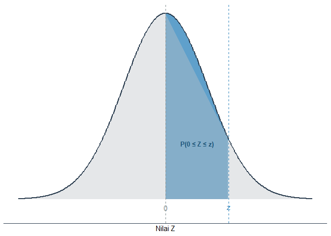
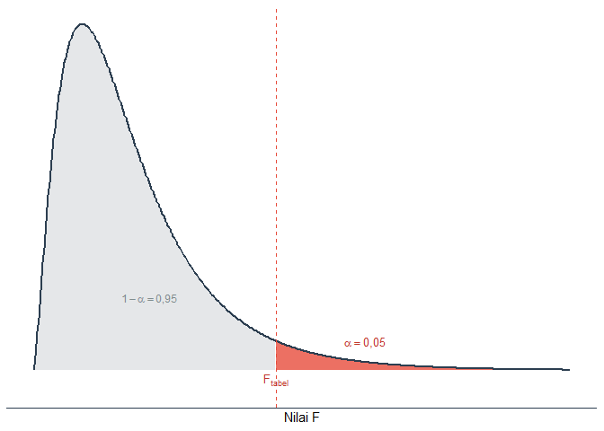

# Statistika untuk Perencanaan {.unnumbered}

Placeholder


<!--chapter:end:index.Rmd-->


# Konsep Dasar Statistika dalam Perencanaan

Placeholder


### Capaian Pembelajaran {.unnumbered}
## Kedudukan dan Peran Analisis Data dalam Perencanaan
### Studi Kasus: Analisis Data dalam Perencanaan Transportasi Berkelanjutan di Kampus ITERA {#kasus-analisis-data-dalam-perencanaan .unnumbered}
## Penelitian Kuantitatif vs. Penelitian Kualitatif dan Kedudukan Statistik
### Analisis Kuantitatif vs. Analisis Kualitatif {#analisis-kuantitatif-vs-kualitatif}
### Studi Kasus: Penelitian Mengenai Pola Pergerakan Mahasiswa dan Pegawai di Kampus ITERA {.unnumbered}
### Analisis Statistik sebagai Analisis Kuantitatif
## Soal Evaluasi 1 {.unnumbered}

<!--chapter:end:01-konsep-dasar.Rmd-->


# Data Terstruktur

Placeholder


### Capaian Pembelajaran {.unnumbered}
## Elemen Data Terstruktur {#kasus-elemen-data-terstruktur}
### Studi Kasus: Elemen Data Terstruktur {.unnumbered} 
## Tabulasi Data Terstruktur yang Baik
### Studi Kasus: Perbandingan Data yang Tidak Rapi dan Data yang Rapi {.unnumbered} 
## Soal Evaluasi 2 {.unnumbered}
## Tingkat Pengukuran Variabel
### Studi Kasus: Tingkat Pengukuran Variabel {.unnumbered}
## Jenis-jenis Tingkat Pengukuran Variabel
### Nominal
### Ordinal
### Metrik (Angka)
## Menentukan Tingkat Pengukuran Variabel
### Studi Kasus: Menentukan Tingkat Pengukuran Variabel {.unnumbered}
## Soal Evaluasi 3 {.unnumbered}

<!--chapter:end:02-data-terstruktur.Rmd-->


# Analisis Statistik Deskriptif

Placeholder


### Capaian Pembelajaran {.unnumbered}
## Makna Analisis Statistik Deskriptif
## Ukuran Frekuensi
### Studi Kasus: Penerapan Ukuran Frekuensi dari Dataset Hasil Survei {.unnumbered}
### Persentase dan Proporsi
### Studi Kasus: Penerapan Persentase dan Proporsi {.unnumbered}
### Laju *(Rate)*
### Studi Kasus: Perhitungan Laju {.unnumbered}
### Rasio
### Studi Kasus: Perhitungan Rasio Penggunaan Kendaraan {.unnumbered}
### Perubahan Persentase (*Percentage Change*)
### Studi Kasus: Perubahan Persentase Penggunaan Transportasi Online {.unnumbered}
### Studi Kasus: Kesalahan Umum dalam Menafsirkan Kenaikan Pajak {.unnumbered}
## Ukuran Kecenderungan Pemusatan (*Measure Central Tendency*)
### Rata-rata (*mean*)
### Median
### Studi Kasus: Mean dan Median pada Data dengan Pencilan {.unnumbered}
### Modus
### Studi Kasus: Analisis Modus {.unnumbered}
## Ukuran Penyebaran (*Measure of Dispersion*)
### Indeks Variasi Kualitatif (*Index of Qualitative Variance*, IQV)
### Studi Kasus: Keberagaman Distribusi Mahasiswa Antar Fakultas {.unnumbered}
### Rentang (*Range*)
### Studi Kasus: Perbandingan Rentang Biaya Perjalanan Mahasiswa {.unnumbered}
### Kuartil, Desil, dan Persentil
### Studi Kasus: Analisis Posisi Data dengan Kuartil {.unnumbered}
### Variansi (*Variance*) dan Simpangan Baku (*Standard Deviation*)
### Studi Kasus: Menghitung Variansi dan Simpangan Baku Biaya Perjalanan {.unnumbered}
### Rangkuman Teknik Analisis Statistik Deskriptif
## Soal Evaluasi 4 {.unnumbered}

<!--chapter:end:03-statistik-deskriptif.Rmd-->


# Visualisasi Data Kuantitatif

Placeholder


### Capaian Pembelajaran {.unnumbered}
## Konsep Dasar
## Jenis-jenis Diagram
### Variabel Kategorikal
#### Grafik Batang *(Column/Bar Chart)*
#### Grafik Batang Bertumpuk (Stacked Column/Bar Chart) {#materi-bar-chart}
#### Studi Kasus: Visualisasi Moda Transportasi Mahasiswa dengan Diagram Batang  {.unnumbered}
#### Grafik Lollipop
#### Studi Kasus: Perbandingan Grafik Lollipop dengan Grafik Batang {.unnumbered}
#### Grafik *Treemap*
#### Studi Kasus: Membuat Treemap Moda Transportasi {.unnumbered}
#### Grafik Pai/Donat *(Pie/Donut Chart)*
#### Studi Kasus: Membuat Grafik Pai dan Donat {.unnumbered}
### Variabel Numerik
#### Histogram
#### Studi Kasus: Membuat Histogram Biaya Perjalanan {.unnumbered}
#### *Boxplot*
#### Studi Kasus: Membuat Boxplot Biaya Perjalanan Mahasiswa {.unnumbered}
#### Grafik Garis *(Line Plot)* dan Area *(Area Plot)*
#### Grafik Pencar *(Scatterplot)*
#### Studi Kasus: Membuat *Scatterplot* Hubungan Biaya Perjalanan dan Jarak Tempuh {.unnumbered}
## Penggunaan dan Interpretasi Diagram
### Pemilihan Diagram Berdasarkan Tujuan
### Pemilihan Diagram Berdasarkan Jumlah Variabel
### Pemilihan Diagram Berdasarkan Tingkat Pengukuran Variabel
## Soal Evaluasi 5 {.unnumbered}

<!--chapter:end:04-visualisasi-data.Rmd-->


# Pengantar Analisis Statistik Inferensial

Placeholder


## Capaian Pembelajaran {.unnumbered}
## Konsep Dasar Statistika Inferensial
## Populasi vs. Sampel
### Studi Kasus: Populasi vs. Sampel {.unnumbered}
## Teknik-Teknik Pengambilan Sampel *(Sampling Techniques)*
### Studi Kasus: Pengambilan Sampel dengan Populasi Kecil {.unnumbered}
### *Simple Random Sampling*
### Catatan: Miskonsepsi tentang Istilah Random {.unnumbered}
### Studi Kasus: *Simple Random Sampling* dengan Populasi Kecil {.unnumbered}
### *Systematic Random Sampling*
### Studi Kasus: *Systematic Sampling* dengan Populasi Kecil {.unnumbered}
### *Stratified Random Sampling*
### Studi Kasus: *Stratified Random Sampling* dengan Populasi Kecil {.unnumbered}
### *Multi-Stage Cluster Sampling*
### Studi Kasus: *Multi-Stage Cluster Sampling* dengan Populasi Kecil {.unnumbered}
## Soal Evaluasi 6 {.unnumbered}
## Menentukan Ukuran Sampel
### Studi Kasus: Menentukan Jumlah Sampel dari Tabel {.unnumbered}
## Konsep Distribusi dalam Statistik
### Model-model Distribusi Statistik
### Distribusi Normal {#bab-5-distribusi-normal}
### Distribusi Objek dan Distribusi Statistik
### Studi Kasus: Distribusi Objek vs Distribusi Statistik {.unnumbered}
## Soal Evaluasi 7 {.unnumbered}
## Teorema Limit Sentral
### Studi Kasus: Simulasi Teorema Limit Sentral {.unnumbered}
### Studi Kasus: Efek Ukuran Sampel terhadap Variasi {.unnumbered}
## Soal Evaluasi 8 {.unnumbered}
## Menghitung Peluang Kemunculan Nilai Tertentu dari Distribusi Statistik yang Berbentuk Normal.
### *Standard Error* (SE)
### Studi Kasus: Menghitung Standard Error {.unnumbered}
## Soal Evaluasi 9 {.unnumbered}
### Nilai Standar (*Z-Score*)
### Studi Kasus: Menghitung *Z-Score* Suatu Nilai {.unnumbered}
### Studi Kasus: Menghitung *Z-Score* Rata-rata Sampel {.unnumbered}
## Soal Evaluasi 10 {.unnumbered}
### Menentukan Probabilitas Terjadinya Suatu Nilai {#probabilitas-nilai-di-distribusi-statistik}
### Studi Kasus: Probabilitas Ditemukannya Suatu Sampel dengan Rata-rata Tertentu Dibandingkan dengan Rata-rata Populasi {.unnumbered}
### Menentukan Nilai yang Menjadi Pembatas Suatu Probabilitas {#untuk-z-kritis}
### Studi Kasus: Menentukan Batas Biaya Perjalanan Ekstrem (Distribusi Objek) {.unnumbered}
## Soal Evaluasi 11 {.unnumbered}

<!--chapter:end:05-pengantar-inferensial.Rmd-->


# Estimasi Parameter {#bab-6-estimasi-parameter}

Placeholder


### Capaian Pembelajaran {.unnumbered}
## Statistik vs. Parameter
### Studi Kasus: Statistik vs Parameter {.unnumbered}
## Estimasi Titik vs. Estimasi Rentang
### Estimasi Titik
### Studi Kasus: Keterbatasan Estimasi Titik {.unnumbered}
### Estimasi Rentang
### Studi Kasus: Keuntungan Estimasi Rentang {.unnumbered}
## Konsep Perhitungan Rentang Kepercayaan Sebagai Estimasi Rentang
### Perhitungan Rentang Kepercayaan Rata-rata
### Studi Kasus: Menghitung Rata-rata Jarak Tempat Tinggal Mahasiswa ITERA Berdasarkan Jenis Tempat Tinggalnya {.unnumbered}
## Soal Evaluasi 12 {.unnumbered}
### Perhitungan Rentang Kepercayaan Proporsi
### Studi Kasus: Proporsi Mahasiswa Berdasarkan Jenis Tempat Tinggal {.unnumbered}
## Soal Evaluasi 13  {.unnumbered}
## Lebih Dalam tentang Tingkat Kepercayaan (*Confidence Level*) {#tingkat-kepercayaan}
### Catatan: Salah Kaprah Tingkat Kepercayaan {.unnumbered}
### Studi Kasus: Pengaruh Tingkat Kepercayaan terhadap Lebar Rentang Kepercayaan {.unnumbered}
## Kesimpulan: Interpretasi Estimasi Parameter

<!--chapter:end:06-estimasi-parameter.Rmd-->


# Uji Hipotesis Parameter Satu Populasi {#bab-7-uji-hipotesis-satu-populasi}

Placeholder


### Capaian Pembelajaran {.unnumbered}
## Konsep Dasar Uji Hipotesis Parameter {#konsep-dasar-uji-hipotesis-1samp}
### Studi Kasus: Alur Logika Evaluasi Makan Bergizi Gratis (MBG) {.unnumbered}
## Perbedaan Uji Hipotesis Parameter dengan Estimasi Parameter {#perbedaan-uji-hipotesis-estimasi-parameter}
## Asumsi-asumsi yang Harus Dipenuhi dalam Menguji Hipotesis Parameter {#asumsi-dasar-uji-hipotesis}
### Studi Kasus: Memeriksa Asumsi pada Evaluasi MBG {.unnumbered}
## Hipotesis Kosong dan Hipotesis Alternatif {#hipotesis-kosong-dan-alternatif}
### Hipotesis Kosong {#konsep-hipotesis-kosong}
### Studi Kasus: Menentukan Hipotesis Kosong pada Evaluasi MBG {.unnumbered}
### Hipotesis Alternatif {#konsep-hipotesis-alternatif}
### Studi Kasus: Menentukan Hipotesis Alternatif pada Evaluasi MBG {.unnumbered}
### Pentingnya Menentukan Bentuk Hipotesis Alternatif {#pentingnya-menentukan-bentuk-h1}
### Kemungkinan Hasil Pengujian Hipotesis: "Menerima $H_0$" atau "Gagal Menolak $H_0$"?
### Catatan: Analogi Pengadilan {.unnumbered}
## Menentukan Hasil Pengujian Hipotesis Parameter
#### Titik Kritis dan Wilayah Kritis {#titik-kritis-wilayah-kritis}
#### Nilai Statistik Uji dan Nilai p (*p-value*) {#nilai-statistik-uji-nilai-p}
## Langkah-langkah Pengujian Hipotesis {#langkah-pengujian-hipotesis}
### Studi Kasus: Melanjutkan Langkah Pengujian Hipotesis MBG {.unnumbered}
### Studi Kasus: Layanan Bus Kampus {.unnumbered}
#### Pengujian Hipotesis Rata-rata Populasi {.unnumbered}
##### Memeriksa Asumsi Pengujian {.unnumbered}
##### Menetapkan Hipotesis Kosong dan Alternatif ($H_0$ dan $H_1$) {.unnumbered}
##### Menetapkan Wilayah Kritis dari Signifikansi {.unnumbered}
##### Mencari Nilai Titik Kritis {-}
##### Mencari Nilai Statistik Uji {-}
##### Membandingkan Nilai Statistik Uji dan Titik Kritis {-}
##### Menarik Kesimpulan dan Memaknai Hasil {-}
#### Pengujian Hipotesis Proporsi Populasi {.unnumbered}
##### Memeriksa Asumsi Pengujian {-}
##### Menetapkan Hipotesis Kosong dan Alternatif ($H_0$ dan $H_1$) {-}
##### Menetapkan Wilayah Kritis dari Signifikansi {-}
##### Mencari Nilai Titik Kritis {-}
##### Mencari Nilai Statistik Uji {-}
##### Membandingkan Nilai Statistik Uji dan Titik Kritis {-}
##### Menarik Kesimpulan dan Memaknai Hasil {-}
## Soal Evaluasi 14 {.unnumbered}

<!--chapter:end:07-uji-hipotesis-satu-populasi.Rmd-->


# Uji Hipotesis Parameter Dua Populasi Atau Lebih

Placeholder


### Capaian Pembelajaran {.unnumbered}
## Konsep Dasar Uji Hipotesis Parameter Dua Populasi Atau Lebih {#konsep-dasar-uji-hipotesis-dua-populasi}
### Studi Kasus: Batasan Cakupan Sebagai Dasar Penentuan Populasi {.unnumbered}
### Studi Kasus: Waktu Pengambilan Data Sebagai Dasar Penentuan Populasi {.unnumbered}
## Tahapan Pengujian Hipotesis Parameter Dua Populasi atau Lebih
## Uji Hipotesis Parameter Dua Populasi Independen
### Hipotesis Kosong dan Alternatif Uji Hipotesis Parameter Dua Populasi Independen
### Perhitungan Statistik Uji dalam Uji Hipotesis Parameter Dua Populasi Independen
### Studi Kasus: Uji Rata-Rata Waktu Tempuh Mahasiswa ITERA dan UNILA {.unnumbered}
### Studi Kasus: Uji Proporsi Pengguna Sepeda Motor Mahasiswa ITERA dan UNILA {.unnumbered}
## Uji Hipotesis Parameter Dua Populasi Berpasangan
### Studi Kasus: Uji Beda Biaya Perjalanan Mahasiswa Sebelum dan Sesudah Pemberlakuan Sistem Angkutan Umum Kampus {.unnumbered}
## Uji Hipotesis Parameter Lebih dari Dua Populasi
### Hipotesis Kosong dan Alternatif ANOVA {#hipotesis-kosong-alternatif-anova}
### Konsep *Analysis of Variance* (ANOVA)
### Langkah Pengujian Hipotesis dengan ANOVA
#### Menyatakan Asumsi Awal
#### Merumuskan Hipotesis Kosong dan Alternatif
### Studi Kasus: Uji Perbedaan Rata-Rata Jarak Tempuh Mahasiswa Empat Perguruan Tinggi {.unnumbered}
#### Menentukan Wilayah dan Titik Kritis
## Soal Evaluasi 9 {.unnumbered}

<!--chapter:end:08-uji-hipotesis-dua-populasi.Rmd-->


# Uji Hipotesis Parameter Lebih dari Dua Populasi

Placeholder


## Analisis Variansi (ANOVA)
## Studi Kasus dengan R
## Soal Evaluasi 10 {.unnumbered}

<!--chapter:end:09-uji-hipotesis-lebih-dua-populasi.Rmd-->


# Korelasi Antarvariabel Nominal

Placeholder


## Konsep Dasar
## Studi Kasus dengan R
## Soal Evaluasi 11 {.unnumbered}

<!--chapter:end:10-korelasi-nominal.Rmd-->


# Korelasi Antarvariabel Ordinal

Placeholder


## Konsep Dasar
## Studi Kasus dengan R
## Soal Evaluasi 12 {.unnumbered}

<!--chapter:end:11-korelasi-ordinal.Rmd-->

# Korelasi Antarvariabel Metrik

## Konsep Dasar

Untuk dua variabel numerik (interval/rasio), ukuran asosiasi yang paling umum adalah **Pearson Product-Moment Correlation ($r$)**. Nilai $r$ berkisar antara -1 hingga +1.

## Studi Kasus dengan R

Hubungan antara **Pendapatan** dan **Pengeluaran**.


``` r
pendapatan <- c(5, 6, 7, 8, 9, 10, 11)
pengeluaran <- c(3, 4, 3.5, 5, 6, 6.5, 7)

# Scatterplot
plot(pendapatan, pengeluaran)
```

<!-- -->

``` r
# Korelasi Pearson
cor.test(pendapatan, pengeluaran, method = "pearson")
```

```
## 
## 	Pearson's product-moment correlation
## 
## data:  pendapatan and pengeluaran
## t = 8,5927, df = 5, p-value = 0,0003521
## alternative hypothesis: true correlation is not equal to 0
## 95 percent confidence interval:
##  0,7916653 0,9953960
## sample estimates:
##       cor 
## 0,9677688
```

::: rmdexercise
## Soal Evaluasi 13 {.unnumbered}

1.  Apa syarat utama penggunaan korelasi Pearson? [STP-10.1]{.capaian}
2.  Jika $r = 0$, apakah artinya tidak ada hubungan sama sekali? Jelaskan! [STP-10.2]{.capaian}

:::

<!--chapter:end:12-korelasi-metrik.Rmd-->


# Regresi Linear Sederhana

Placeholder


## Konsep Dasar
## Studi Kasus dengan R
## Soal Evaluasi 14 {.unnumbered}

<!--chapter:end:13-regresi-sederhana.Rmd-->

# Regresi Linear Berganda

## Konsep Dasar

Regresi linear berganda melibatkan **lebih dari satu** variabel independen untuk memprediksi variabel dependen.
$$ Y = a + b_1X_1 + b_2X_2 + \dots + \epsilon $$

## Studi Kasus dengan R

Memprediksi **Harga Rumah** berdasarkan **Luas Tanah** dan **Jumlah Kamar**.


``` r
harga <- c(500, 700, 600, 800, 900)
luas <- c(100, 150, 120, 160, 200)
kamar <- c(2, 3, 2, 4, 5)

# Model Regresi Berganda
model_berganda <- lm(harga ~ luas + kamar)
summary(model_berganda)
```

```
## 
## Call:
## lm(formula = harga ~ luas + kamar)
## 
## Residuals:
##       1       2       3       4       5 
## -22,901  -6,107  16,031  32,824 -19,847 
## 
## Coefficients:
##             Estimate Std. Error t value Pr(>|t|)
## (Intercept)  156,489    104,150   1,503    0,272
## luas           3,053      1,724   1,771    0,219
## kamar         30,534     50,865   0,600    0,609
## 
## Residual standard error: 33,84 on 2 degrees of freedom
## Multiple R-squared:  0,9771,	Adjusted R-squared:  0,9542 
## F-statistic: 42,67 on 2 and 2 DF,  p-value: 0,0229
```

::: rmdexercise
## Soal Evaluasi 15 {.unnumbered}

1.  Apa itu multikolinearitas dalam regresi berganda? [STP-12.1]{.capaian}
2.  Bagaimana cara menginterpretasikan Adjusted $R^2$? [STP-12.2]{.capaian}

:::

<!--chapter:end:14-regresi-berganda.Rmd-->


# Analisis Statistik Multivariat Interdependensi

Placeholder


## Konsep Dasar
## Studi Kasus dengan R
## Soal Evaluasi 16 {.unnumbered}

<!--chapter:end:15-multivariat-interdependensi.Rmd-->

# Referensi {-}

<div id="refs"></div>

<!--chapter:end:89-referensi.Rmd-->

# (APPENDIX) Lampiran {-}

# Tabel Statistik {.unnumbered}

## Tabel Distribusi Normal Standar (Z) {.unnumbered} {#appendix-tabel-normdist}

Tabel berikut menyajikan luas area di bawah kurva distribusi normal standar dari $Z = 0$ hingga nilai $Z$ tertentu, yaitu $P(0 \leq Z \leq z)$.

<div class="figure" style="text-align: center">

<p class="caption">(\#fig:fig-ilustrasi-z-table)Luas area yang dicari pada Tabel Distribusi Normal Standar: $P(0 \leq Z \leq z)$</p>
</div>

<div style="border: 1px solid #ddd; padding: 0px; overflow-y: scroll; height:450px; overflow-x: scroll; width:100%; "><table class="table table-striped table-hover table-condensed" style="color: black; width: auto !important; margin-left: auto; margin-right: auto;">
<caption>(\#tab:tab-distribusi-z)Tabel Distribusi Normal Standar $P(0 \leq Z \leq z)$</caption>
 <thead>
<tr>
<th style="empty-cells: hide;border-bottom:hidden;position: sticky; top:0; background-color: #FFFFFF;" colspan="1"></th>
<th style="border-bottom:hidden;padding-bottom:0; padding-left:3px;padding-right:3px;text-align: center; position: sticky; top:0; background-color: #FFFFFF;" colspan="10"><div style="border-bottom: 1px solid #ddd; padding-bottom: 5px; ">Desimal kedua nilai z</div></th>
</tr>
  <tr>
   <th style="text-align:center;position: sticky; top:0; background-color: #FFFFFF;"> z </th>
   <th style="text-align:center;position: sticky; top:0; background-color: #FFFFFF;"> 0,00 </th>
   <th style="text-align:center;position: sticky; top:0; background-color: #FFFFFF;"> 0,01 </th>
   <th style="text-align:center;position: sticky; top:0; background-color: #FFFFFF;"> 0,02 </th>
   <th style="text-align:center;position: sticky; top:0; background-color: #FFFFFF;"> 0,03 </th>
   <th style="text-align:center;position: sticky; top:0; background-color: #FFFFFF;"> 0,04 </th>
   <th style="text-align:center;position: sticky; top:0; background-color: #FFFFFF;"> 0,05 </th>
   <th style="text-align:center;position: sticky; top:0; background-color: #FFFFFF;"> 0,06 </th>
   <th style="text-align:center;position: sticky; top:0; background-color: #FFFFFF;"> 0,07 </th>
   <th style="text-align:center;position: sticky; top:0; background-color: #FFFFFF;"> 0,08 </th>
   <th style="text-align:center;position: sticky; top:0; background-color: #FFFFFF;"> 0,09 </th>
  </tr>
 </thead>
<tbody>
  <tr>
   <td style="text-align:center;font-weight: bold;"> 0,0 </td>
   <td style="text-align:center;"> 0,0000 </td>
   <td style="text-align:center;"> 0,0040 </td>
   <td style="text-align:center;"> 0,0080 </td>
   <td style="text-align:center;"> 0,0120 </td>
   <td style="text-align:center;"> 0,0160 </td>
   <td style="text-align:center;"> 0,0199 </td>
   <td style="text-align:center;"> 0,0239 </td>
   <td style="text-align:center;"> 0,0279 </td>
   <td style="text-align:center;"> 0,0319 </td>
   <td style="text-align:center;"> 0,0359 </td>
  </tr>
  <tr>
   <td style="text-align:center;font-weight: bold;"> 0,1 </td>
   <td style="text-align:center;"> 0,0398 </td>
   <td style="text-align:center;"> 0,0438 </td>
   <td style="text-align:center;"> 0,0478 </td>
   <td style="text-align:center;"> 0,0517 </td>
   <td style="text-align:center;"> 0,0557 </td>
   <td style="text-align:center;"> 0,0596 </td>
   <td style="text-align:center;"> 0,0636 </td>
   <td style="text-align:center;"> 0,0675 </td>
   <td style="text-align:center;"> 0,0714 </td>
   <td style="text-align:center;"> 0,0753 </td>
  </tr>
  <tr>
   <td style="text-align:center;font-weight: bold;"> 0,2 </td>
   <td style="text-align:center;"> 0,0793 </td>
   <td style="text-align:center;"> 0,0832 </td>
   <td style="text-align:center;"> 0,0871 </td>
   <td style="text-align:center;"> 0,0910 </td>
   <td style="text-align:center;"> 0,0948 </td>
   <td style="text-align:center;"> 0,0987 </td>
   <td style="text-align:center;"> 0,1026 </td>
   <td style="text-align:center;"> 0,1064 </td>
   <td style="text-align:center;"> 0,1103 </td>
   <td style="text-align:center;"> 0,1141 </td>
  </tr>
  <tr>
   <td style="text-align:center;font-weight: bold;"> 0,3 </td>
   <td style="text-align:center;"> 0,1179 </td>
   <td style="text-align:center;"> 0,1217 </td>
   <td style="text-align:center;"> 0,1255 </td>
   <td style="text-align:center;"> 0,1293 </td>
   <td style="text-align:center;"> 0,1331 </td>
   <td style="text-align:center;"> 0,1368 </td>
   <td style="text-align:center;"> 0,1406 </td>
   <td style="text-align:center;"> 0,1443 </td>
   <td style="text-align:center;"> 0,1480 </td>
   <td style="text-align:center;"> 0,1517 </td>
  </tr>
  <tr>
   <td style="text-align:center;font-weight: bold;"> 0,4 </td>
   <td style="text-align:center;"> 0,1554 </td>
   <td style="text-align:center;"> 0,1591 </td>
   <td style="text-align:center;"> 0,1628 </td>
   <td style="text-align:center;"> 0,1664 </td>
   <td style="text-align:center;"> 0,1700 </td>
   <td style="text-align:center;"> 0,1736 </td>
   <td style="text-align:center;"> 0,1772 </td>
   <td style="text-align:center;"> 0,1808 </td>
   <td style="text-align:center;"> 0,1844 </td>
   <td style="text-align:center;"> 0,1879 </td>
  </tr>
  <tr>
   <td style="text-align:center;font-weight: bold;"> 0,5 </td>
   <td style="text-align:center;"> 0,1915 </td>
   <td style="text-align:center;"> 0,1950 </td>
   <td style="text-align:center;"> 0,1985 </td>
   <td style="text-align:center;"> 0,2019 </td>
   <td style="text-align:center;"> 0,2054 </td>
   <td style="text-align:center;"> 0,2088 </td>
   <td style="text-align:center;"> 0,2123 </td>
   <td style="text-align:center;"> 0,2157 </td>
   <td style="text-align:center;"> 0,2190 </td>
   <td style="text-align:center;"> 0,2224 </td>
  </tr>
  <tr>
   <td style="text-align:center;font-weight: bold;"> 0,6 </td>
   <td style="text-align:center;"> 0,2257 </td>
   <td style="text-align:center;"> 0,2291 </td>
   <td style="text-align:center;"> 0,2324 </td>
   <td style="text-align:center;"> 0,2357 </td>
   <td style="text-align:center;"> 0,2389 </td>
   <td style="text-align:center;"> 0,2422 </td>
   <td style="text-align:center;"> 0,2454 </td>
   <td style="text-align:center;"> 0,2486 </td>
   <td style="text-align:center;"> 0,2517 </td>
   <td style="text-align:center;"> 0,2549 </td>
  </tr>
  <tr>
   <td style="text-align:center;font-weight: bold;"> 0,7 </td>
   <td style="text-align:center;"> 0,2580 </td>
   <td style="text-align:center;"> 0,2611 </td>
   <td style="text-align:center;"> 0,2642 </td>
   <td style="text-align:center;"> 0,2673 </td>
   <td style="text-align:center;"> 0,2704 </td>
   <td style="text-align:center;"> 0,2734 </td>
   <td style="text-align:center;"> 0,2764 </td>
   <td style="text-align:center;"> 0,2794 </td>
   <td style="text-align:center;"> 0,2823 </td>
   <td style="text-align:center;"> 0,2852 </td>
  </tr>
  <tr>
   <td style="text-align:center;font-weight: bold;"> 0,8 </td>
   <td style="text-align:center;"> 0,2881 </td>
   <td style="text-align:center;"> 0,2910 </td>
   <td style="text-align:center;"> 0,2939 </td>
   <td style="text-align:center;"> 0,2967 </td>
   <td style="text-align:center;"> 0,2995 </td>
   <td style="text-align:center;"> 0,3023 </td>
   <td style="text-align:center;"> 0,3051 </td>
   <td style="text-align:center;"> 0,3078 </td>
   <td style="text-align:center;"> 0,3106 </td>
   <td style="text-align:center;"> 0,3133 </td>
  </tr>
  <tr>
   <td style="text-align:center;font-weight: bold;"> 0,9 </td>
   <td style="text-align:center;"> 0,3159 </td>
   <td style="text-align:center;"> 0,3186 </td>
   <td style="text-align:center;"> 0,3212 </td>
   <td style="text-align:center;"> 0,3238 </td>
   <td style="text-align:center;"> 0,3264 </td>
   <td style="text-align:center;"> 0,3289 </td>
   <td style="text-align:center;"> 0,3315 </td>
   <td style="text-align:center;"> 0,3340 </td>
   <td style="text-align:center;"> 0,3365 </td>
   <td style="text-align:center;"> 0,3389 </td>
  </tr>
  <tr>
   <td style="text-align:center;font-weight: bold;"> 1,0 </td>
   <td style="text-align:center;"> 0,3413 </td>
   <td style="text-align:center;"> 0,3438 </td>
   <td style="text-align:center;"> 0,3461 </td>
   <td style="text-align:center;"> 0,3485 </td>
   <td style="text-align:center;"> 0,3508 </td>
   <td style="text-align:center;"> 0,3531 </td>
   <td style="text-align:center;"> 0,3554 </td>
   <td style="text-align:center;"> 0,3577 </td>
   <td style="text-align:center;"> 0,3599 </td>
   <td style="text-align:center;"> 0,3621 </td>
  </tr>
  <tr>
   <td style="text-align:center;font-weight: bold;"> 1,1 </td>
   <td style="text-align:center;"> 0,3643 </td>
   <td style="text-align:center;"> 0,3665 </td>
   <td style="text-align:center;"> 0,3686 </td>
   <td style="text-align:center;"> 0,3708 </td>
   <td style="text-align:center;"> 0,3729 </td>
   <td style="text-align:center;"> 0,3749 </td>
   <td style="text-align:center;"> 0,3770 </td>
   <td style="text-align:center;"> 0,3790 </td>
   <td style="text-align:center;"> 0,3810 </td>
   <td style="text-align:center;"> 0,3830 </td>
  </tr>
  <tr>
   <td style="text-align:center;font-weight: bold;"> 1,2 </td>
   <td style="text-align:center;"> 0,3849 </td>
   <td style="text-align:center;"> 0,3869 </td>
   <td style="text-align:center;"> 0,3888 </td>
   <td style="text-align:center;"> 0,3907 </td>
   <td style="text-align:center;"> 0,3925 </td>
   <td style="text-align:center;"> 0,3944 </td>
   <td style="text-align:center;"> 0,3962 </td>
   <td style="text-align:center;"> 0,3980 </td>
   <td style="text-align:center;"> 0,3997 </td>
   <td style="text-align:center;"> 0,4015 </td>
  </tr>
  <tr>
   <td style="text-align:center;font-weight: bold;"> 1,3 </td>
   <td style="text-align:center;"> 0,4032 </td>
   <td style="text-align:center;"> 0,4049 </td>
   <td style="text-align:center;"> 0,4066 </td>
   <td style="text-align:center;"> 0,4082 </td>
   <td style="text-align:center;"> 0,4099 </td>
   <td style="text-align:center;"> 0,4115 </td>
   <td style="text-align:center;"> 0,4131 </td>
   <td style="text-align:center;"> 0,4147 </td>
   <td style="text-align:center;"> 0,4162 </td>
   <td style="text-align:center;"> 0,4177 </td>
  </tr>
  <tr>
   <td style="text-align:center;font-weight: bold;"> 1,4 </td>
   <td style="text-align:center;"> 0,4192 </td>
   <td style="text-align:center;"> 0,4207 </td>
   <td style="text-align:center;"> 0,4222 </td>
   <td style="text-align:center;"> 0,4236 </td>
   <td style="text-align:center;"> 0,4251 </td>
   <td style="text-align:center;"> 0,4265 </td>
   <td style="text-align:center;"> 0,4279 </td>
   <td style="text-align:center;"> 0,4292 </td>
   <td style="text-align:center;"> 0,4306 </td>
   <td style="text-align:center;"> 0,4319 </td>
  </tr>
  <tr>
   <td style="text-align:center;font-weight: bold;"> 1,5 </td>
   <td style="text-align:center;"> 0,4332 </td>
   <td style="text-align:center;"> 0,4345 </td>
   <td style="text-align:center;"> 0,4357 </td>
   <td style="text-align:center;"> 0,4370 </td>
   <td style="text-align:center;"> 0,4382 </td>
   <td style="text-align:center;"> 0,4394 </td>
   <td style="text-align:center;"> 0,4406 </td>
   <td style="text-align:center;"> 0,4418 </td>
   <td style="text-align:center;"> 0,4429 </td>
   <td style="text-align:center;"> 0,4441 </td>
  </tr>
  <tr>
   <td style="text-align:center;font-weight: bold;"> 1,6 </td>
   <td style="text-align:center;"> 0,4452 </td>
   <td style="text-align:center;"> 0,4463 </td>
   <td style="text-align:center;"> 0,4474 </td>
   <td style="text-align:center;"> 0,4484 </td>
   <td style="text-align:center;"> 0,4495 </td>
   <td style="text-align:center;"> 0,4505 </td>
   <td style="text-align:center;"> 0,4515 </td>
   <td style="text-align:center;"> 0,4525 </td>
   <td style="text-align:center;"> 0,4535 </td>
   <td style="text-align:center;"> 0,4545 </td>
  </tr>
  <tr>
   <td style="text-align:center;font-weight: bold;"> 1,7 </td>
   <td style="text-align:center;"> 0,4554 </td>
   <td style="text-align:center;"> 0,4564 </td>
   <td style="text-align:center;"> 0,4573 </td>
   <td style="text-align:center;"> 0,4582 </td>
   <td style="text-align:center;"> 0,4591 </td>
   <td style="text-align:center;"> 0,4599 </td>
   <td style="text-align:center;"> 0,4608 </td>
   <td style="text-align:center;"> 0,4616 </td>
   <td style="text-align:center;"> 0,4625 </td>
   <td style="text-align:center;"> 0,4633 </td>
  </tr>
  <tr>
   <td style="text-align:center;font-weight: bold;"> 1,8 </td>
   <td style="text-align:center;"> 0,4641 </td>
   <td style="text-align:center;"> 0,4649 </td>
   <td style="text-align:center;"> 0,4656 </td>
   <td style="text-align:center;"> 0,4664 </td>
   <td style="text-align:center;"> 0,4671 </td>
   <td style="text-align:center;"> 0,4678 </td>
   <td style="text-align:center;"> 0,4686 </td>
   <td style="text-align:center;"> 0,4693 </td>
   <td style="text-align:center;"> 0,4699 </td>
   <td style="text-align:center;"> 0,4706 </td>
  </tr>
  <tr>
   <td style="text-align:center;font-weight: bold;"> 1,9 </td>
   <td style="text-align:center;"> 0,4713 </td>
   <td style="text-align:center;"> 0,4719 </td>
   <td style="text-align:center;"> 0,4726 </td>
   <td style="text-align:center;"> 0,4732 </td>
   <td style="text-align:center;"> 0,4738 </td>
   <td style="text-align:center;"> 0,4744 </td>
   <td style="text-align:center;"> 0,4750 </td>
   <td style="text-align:center;"> 0,4756 </td>
   <td style="text-align:center;"> 0,4761 </td>
   <td style="text-align:center;"> 0,4767 </td>
  </tr>
  <tr>
   <td style="text-align:center;font-weight: bold;"> 2,0 </td>
   <td style="text-align:center;"> 0,4772 </td>
   <td style="text-align:center;"> 0,4778 </td>
   <td style="text-align:center;"> 0,4783 </td>
   <td style="text-align:center;"> 0,4788 </td>
   <td style="text-align:center;"> 0,4793 </td>
   <td style="text-align:center;"> 0,4798 </td>
   <td style="text-align:center;"> 0,4803 </td>
   <td style="text-align:center;"> 0,4808 </td>
   <td style="text-align:center;"> 0,4812 </td>
   <td style="text-align:center;"> 0,4817 </td>
  </tr>
  <tr>
   <td style="text-align:center;font-weight: bold;"> 2,1 </td>
   <td style="text-align:center;"> 0,4821 </td>
   <td style="text-align:center;"> 0,4826 </td>
   <td style="text-align:center;"> 0,4830 </td>
   <td style="text-align:center;"> 0,4834 </td>
   <td style="text-align:center;"> 0,4838 </td>
   <td style="text-align:center;"> 0,4842 </td>
   <td style="text-align:center;"> 0,4846 </td>
   <td style="text-align:center;"> 0,4850 </td>
   <td style="text-align:center;"> 0,4854 </td>
   <td style="text-align:center;"> 0,4857 </td>
  </tr>
  <tr>
   <td style="text-align:center;font-weight: bold;"> 2,2 </td>
   <td style="text-align:center;"> 0,4861 </td>
   <td style="text-align:center;"> 0,4864 </td>
   <td style="text-align:center;"> 0,4868 </td>
   <td style="text-align:center;"> 0,4871 </td>
   <td style="text-align:center;"> 0,4875 </td>
   <td style="text-align:center;"> 0,4878 </td>
   <td style="text-align:center;"> 0,4881 </td>
   <td style="text-align:center;"> 0,4884 </td>
   <td style="text-align:center;"> 0,4887 </td>
   <td style="text-align:center;"> 0,4890 </td>
  </tr>
  <tr>
   <td style="text-align:center;font-weight: bold;"> 2,3 </td>
   <td style="text-align:center;"> 0,4893 </td>
   <td style="text-align:center;"> 0,4896 </td>
   <td style="text-align:center;"> 0,4898 </td>
   <td style="text-align:center;"> 0,4901 </td>
   <td style="text-align:center;"> 0,4904 </td>
   <td style="text-align:center;"> 0,4906 </td>
   <td style="text-align:center;"> 0,4909 </td>
   <td style="text-align:center;"> 0,4911 </td>
   <td style="text-align:center;"> 0,4913 </td>
   <td style="text-align:center;"> 0,4916 </td>
  </tr>
  <tr>
   <td style="text-align:center;font-weight: bold;"> 2,4 </td>
   <td style="text-align:center;"> 0,4918 </td>
   <td style="text-align:center;"> 0,4920 </td>
   <td style="text-align:center;"> 0,4922 </td>
   <td style="text-align:center;"> 0,4925 </td>
   <td style="text-align:center;"> 0,4927 </td>
   <td style="text-align:center;"> 0,4929 </td>
   <td style="text-align:center;"> 0,4931 </td>
   <td style="text-align:center;"> 0,4932 </td>
   <td style="text-align:center;"> 0,4934 </td>
   <td style="text-align:center;"> 0,4936 </td>
  </tr>
  <tr>
   <td style="text-align:center;font-weight: bold;"> 2,5 </td>
   <td style="text-align:center;"> 0,4938 </td>
   <td style="text-align:center;"> 0,4940 </td>
   <td style="text-align:center;"> 0,4941 </td>
   <td style="text-align:center;"> 0,4943 </td>
   <td style="text-align:center;"> 0,4945 </td>
   <td style="text-align:center;"> 0,4946 </td>
   <td style="text-align:center;"> 0,4948 </td>
   <td style="text-align:center;"> 0,4949 </td>
   <td style="text-align:center;"> 0,4951 </td>
   <td style="text-align:center;"> 0,4952 </td>
  </tr>
  <tr>
   <td style="text-align:center;font-weight: bold;"> 2,6 </td>
   <td style="text-align:center;"> 0,4953 </td>
   <td style="text-align:center;"> 0,4955 </td>
   <td style="text-align:center;"> 0,4956 </td>
   <td style="text-align:center;"> 0,4957 </td>
   <td style="text-align:center;"> 0,4959 </td>
   <td style="text-align:center;"> 0,4960 </td>
   <td style="text-align:center;"> 0,4961 </td>
   <td style="text-align:center;"> 0,4962 </td>
   <td style="text-align:center;"> 0,4963 </td>
   <td style="text-align:center;"> 0,4964 </td>
  </tr>
  <tr>
   <td style="text-align:center;font-weight: bold;"> 2,7 </td>
   <td style="text-align:center;"> 0,4965 </td>
   <td style="text-align:center;"> 0,4966 </td>
   <td style="text-align:center;"> 0,4967 </td>
   <td style="text-align:center;"> 0,4968 </td>
   <td style="text-align:center;"> 0,4969 </td>
   <td style="text-align:center;"> 0,4970 </td>
   <td style="text-align:center;"> 0,4971 </td>
   <td style="text-align:center;"> 0,4972 </td>
   <td style="text-align:center;"> 0,4973 </td>
   <td style="text-align:center;"> 0,4974 </td>
  </tr>
  <tr>
   <td style="text-align:center;font-weight: bold;"> 2,8 </td>
   <td style="text-align:center;"> 0,4974 </td>
   <td style="text-align:center;"> 0,4975 </td>
   <td style="text-align:center;"> 0,4976 </td>
   <td style="text-align:center;"> 0,4977 </td>
   <td style="text-align:center;"> 0,4977 </td>
   <td style="text-align:center;"> 0,4978 </td>
   <td style="text-align:center;"> 0,4979 </td>
   <td style="text-align:center;"> 0,4979 </td>
   <td style="text-align:center;"> 0,4980 </td>
   <td style="text-align:center;"> 0,4981 </td>
  </tr>
  <tr>
   <td style="text-align:center;font-weight: bold;"> 2,9 </td>
   <td style="text-align:center;"> 0,4981 </td>
   <td style="text-align:center;"> 0,4982 </td>
   <td style="text-align:center;"> 0,4982 </td>
   <td style="text-align:center;"> 0,4983 </td>
   <td style="text-align:center;"> 0,4984 </td>
   <td style="text-align:center;"> 0,4984 </td>
   <td style="text-align:center;"> 0,4985 </td>
   <td style="text-align:center;"> 0,4985 </td>
   <td style="text-align:center;"> 0,4986 </td>
   <td style="text-align:center;"> 0,4986 </td>
  </tr>
  <tr>
   <td style="text-align:center;font-weight: bold;"> 3,0 </td>
   <td style="text-align:center;"> 0,4987 </td>
   <td style="text-align:center;"> 0,4987 </td>
   <td style="text-align:center;"> 0,4987 </td>
   <td style="text-align:center;"> 0,4988 </td>
   <td style="text-align:center;"> 0,4988 </td>
   <td style="text-align:center;"> 0,4989 </td>
   <td style="text-align:center;"> 0,4989 </td>
   <td style="text-align:center;"> 0,4989 </td>
   <td style="text-align:center;"> 0,4990 </td>
   <td style="text-align:center;"> 0,4990 </td>
  </tr>
  <tr>
   <td style="text-align:center;font-weight: bold;"> 3,1 </td>
   <td style="text-align:center;"> 0,4990 </td>
   <td style="text-align:center;"> 0,4991 </td>
   <td style="text-align:center;"> 0,4991 </td>
   <td style="text-align:center;"> 0,4991 </td>
   <td style="text-align:center;"> 0,4992 </td>
   <td style="text-align:center;"> 0,4992 </td>
   <td style="text-align:center;"> 0,4992 </td>
   <td style="text-align:center;"> 0,4992 </td>
   <td style="text-align:center;"> 0,4993 </td>
   <td style="text-align:center;"> 0,4993 </td>
  </tr>
  <tr>
   <td style="text-align:center;font-weight: bold;"> 3,2 </td>
   <td style="text-align:center;"> 0,4993 </td>
   <td style="text-align:center;"> 0,4993 </td>
   <td style="text-align:center;"> 0,4994 </td>
   <td style="text-align:center;"> 0,4994 </td>
   <td style="text-align:center;"> 0,4994 </td>
   <td style="text-align:center;"> 0,4994 </td>
   <td style="text-align:center;"> 0,4994 </td>
   <td style="text-align:center;"> 0,4995 </td>
   <td style="text-align:center;"> 0,4995 </td>
   <td style="text-align:center;"> 0,4995 </td>
  </tr>
  <tr>
   <td style="text-align:center;font-weight: bold;"> 3,3 </td>
   <td style="text-align:center;"> 0,4995 </td>
   <td style="text-align:center;"> 0,4995 </td>
   <td style="text-align:center;"> 0,4995 </td>
   <td style="text-align:center;"> 0,4996 </td>
   <td style="text-align:center;"> 0,4996 </td>
   <td style="text-align:center;"> 0,4996 </td>
   <td style="text-align:center;"> 0,4996 </td>
   <td style="text-align:center;"> 0,4996 </td>
   <td style="text-align:center;"> 0,4996 </td>
   <td style="text-align:center;"> 0,4997 </td>
  </tr>
  <tr>
   <td style="text-align:center;font-weight: bold;"> 3,4 </td>
   <td style="text-align:center;"> 0,4997 </td>
   <td style="text-align:center;"> 0,4997 </td>
   <td style="text-align:center;"> 0,4997 </td>
   <td style="text-align:center;"> 0,4997 </td>
   <td style="text-align:center;"> 0,4997 </td>
   <td style="text-align:center;"> 0,4997 </td>
   <td style="text-align:center;"> 0,4997 </td>
   <td style="text-align:center;"> 0,4997 </td>
   <td style="text-align:center;"> 0,4997 </td>
   <td style="text-align:center;"> 0,4998 </td>
  </tr>
</tbody>
</table></div>

\FloatBarrier

## Tabel Distribusi F ($\alpha = 10\%$) {.unnumbered} {#appendix-tabel-f-5}

Tabel berikut menyajikan nilai $F_{kritis}$ pada tingkat signifikansi $\alpha = 10\%$, yaitu nilai $F$ yang membatasi luas area sebesar 10% di ekor kanan distribusi F, $P(F > F_{tabel}) = 0{,}10$.

<div class="figure" style="text-align: center">

<p class="caption">(\#fig:fig-ilustrasi-f-table-10)Luas area yang dicari pada Tabel Distribusi F ($\alpha = 10\%$): $P(F > F_{tabel}) = 0{,}10$</p>
</div>

<div style="border: 1px solid #ddd; padding: 0px; overflow-y: scroll; height:450px; overflow-x: scroll; width:100%; "><table class="table table-striped table-hover table-condensed" style="font-size: 10px; color: black; width: auto !important; margin-left: auto; margin-right: auto;">
<caption style="font-size: initial !important;">(\#tab:tab-distribusi-f-10persen)Tabel Distribusi F pada Tingkat Signifikansi $\alpha = 10\%$</caption>
 <thead>
<tr>
<th style="empty-cells: hide;border-bottom:hidden;position: sticky; top:0; background-color: #FFFFFF;" colspan="1"></th>
<th style="border-bottom:hidden;padding-bottom:0; padding-left:3px;padding-right:3px;text-align: center; position: sticky; top:0; background-color: #FFFFFF;" colspan="34"><div style="border-bottom: 1px solid #ddd; padding-bottom: 5px; ">dfb</div></th>
</tr>
  <tr>
   <th style="text-align:center;position: sticky; top:0; background-color: #FFFFFF;"> dfw </th>
   <th style="text-align:center;position: sticky; top:0; background-color: #FFFFFF;"> 1 </th>
   <th style="text-align:center;position: sticky; top:0; background-color: #FFFFFF;"> 2 </th>
   <th style="text-align:center;position: sticky; top:0; background-color: #FFFFFF;"> 3 </th>
   <th style="text-align:center;position: sticky; top:0; background-color: #FFFFFF;"> 4 </th>
   <th style="text-align:center;position: sticky; top:0; background-color: #FFFFFF;"> 5 </th>
   <th style="text-align:center;position: sticky; top:0; background-color: #FFFFFF;"> 6 </th>
   <th style="text-align:center;position: sticky; top:0; background-color: #FFFFFF;"> 7 </th>
   <th style="text-align:center;position: sticky; top:0; background-color: #FFFFFF;"> 8 </th>
   <th style="text-align:center;position: sticky; top:0; background-color: #FFFFFF;"> 9 </th>
   <th style="text-align:center;position: sticky; top:0; background-color: #FFFFFF;"> 10 </th>
   <th style="text-align:center;position: sticky; top:0; background-color: #FFFFFF;"> 11 </th>
   <th style="text-align:center;position: sticky; top:0; background-color: #FFFFFF;"> 12 </th>
   <th style="text-align:center;position: sticky; top:0; background-color: #FFFFFF;"> 13 </th>
   <th style="text-align:center;position: sticky; top:0; background-color: #FFFFFF;"> 14 </th>
   <th style="text-align:center;position: sticky; top:0; background-color: #FFFFFF;"> 15 </th>
   <th style="text-align:center;position: sticky; top:0; background-color: #FFFFFF;"> 16 </th>
   <th style="text-align:center;position: sticky; top:0; background-color: #FFFFFF;"> 17 </th>
   <th style="text-align:center;position: sticky; top:0; background-color: #FFFFFF;"> 18 </th>
   <th style="text-align:center;position: sticky; top:0; background-color: #FFFFFF;"> 19 </th>
   <th style="text-align:center;position: sticky; top:0; background-color: #FFFFFF;"> 20 </th>
   <th style="text-align:center;position: sticky; top:0; background-color: #FFFFFF;"> 21 </th>
   <th style="text-align:center;position: sticky; top:0; background-color: #FFFFFF;"> 22 </th>
   <th style="text-align:center;position: sticky; top:0; background-color: #FFFFFF;"> 23 </th>
   <th style="text-align:center;position: sticky; top:0; background-color: #FFFFFF;"> 24 </th>
   <th style="text-align:center;position: sticky; top:0; background-color: #FFFFFF;"> 25 </th>
   <th style="text-align:center;position: sticky; top:0; background-color: #FFFFFF;"> 26 </th>
   <th style="text-align:center;position: sticky; top:0; background-color: #FFFFFF;"> 27 </th>
   <th style="text-align:center;position: sticky; top:0; background-color: #FFFFFF;"> 28 </th>
   <th style="text-align:center;position: sticky; top:0; background-color: #FFFFFF;"> 29 </th>
   <th style="text-align:center;position: sticky; top:0; background-color: #FFFFFF;"> 30 </th>
   <th style="text-align:center;position: sticky; top:0; background-color: #FFFFFF;"> 40 </th>
   <th style="text-align:center;position: sticky; top:0; background-color: #FFFFFF;"> 60 </th>
   <th style="text-align:center;position: sticky; top:0; background-color: #FFFFFF;"> 120 </th>
   <th style="text-align:center;position: sticky; top:0; background-color: #FFFFFF;"> ∞ </th>
  </tr>
 </thead>
<tbody>
  <tr>
   <td style="text-align:center;font-weight: bold;"> 1 </td>
   <td style="text-align:center;"> 39,86 </td>
   <td style="text-align:center;"> 49,50 </td>
   <td style="text-align:center;"> 53,59 </td>
   <td style="text-align:center;"> 55,83 </td>
   <td style="text-align:center;"> 57,24 </td>
   <td style="text-align:center;"> 58,20 </td>
   <td style="text-align:center;"> 58,91 </td>
   <td style="text-align:center;"> 59,44 </td>
   <td style="text-align:center;"> 59,86 </td>
   <td style="text-align:center;"> 60,19 </td>
   <td style="text-align:center;"> 60,47 </td>
   <td style="text-align:center;"> 60,71 </td>
   <td style="text-align:center;"> 60,90 </td>
   <td style="text-align:center;"> 61,07 </td>
   <td style="text-align:center;"> 61,22 </td>
   <td style="text-align:center;"> 61,35 </td>
   <td style="text-align:center;"> 61,46 </td>
   <td style="text-align:center;"> 61,57 </td>
   <td style="text-align:center;"> 61,66 </td>
   <td style="text-align:center;"> 61,74 </td>
   <td style="text-align:center;"> 61,81 </td>
   <td style="text-align:center;"> 61,88 </td>
   <td style="text-align:center;"> 61,95 </td>
   <td style="text-align:center;"> 62,00 </td>
   <td style="text-align:center;"> 62,05 </td>
   <td style="text-align:center;"> 62,10 </td>
   <td style="text-align:center;"> 62,15 </td>
   <td style="text-align:center;"> 62,19 </td>
   <td style="text-align:center;"> 62,23 </td>
   <td style="text-align:center;"> 62,26 </td>
   <td style="text-align:center;"> 62,53 </td>
   <td style="text-align:center;"> 62,79 </td>
   <td style="text-align:center;"> 63,06 </td>
   <td style="text-align:center;"> 63,30 </td>
  </tr>
  <tr>
   <td style="text-align:center;font-weight: bold;"> 2 </td>
   <td style="text-align:center;"> 8,53 </td>
   <td style="text-align:center;"> 9,00 </td>
   <td style="text-align:center;"> 9,16 </td>
   <td style="text-align:center;"> 9,24 </td>
   <td style="text-align:center;"> 9,29 </td>
   <td style="text-align:center;"> 9,33 </td>
   <td style="text-align:center;"> 9,35 </td>
   <td style="text-align:center;"> 9,37 </td>
   <td style="text-align:center;"> 9,38 </td>
   <td style="text-align:center;"> 9,39 </td>
   <td style="text-align:center;"> 9,40 </td>
   <td style="text-align:center;"> 9,41 </td>
   <td style="text-align:center;"> 9,41 </td>
   <td style="text-align:center;"> 9,42 </td>
   <td style="text-align:center;"> 9,42 </td>
   <td style="text-align:center;"> 9,43 </td>
   <td style="text-align:center;"> 9,43 </td>
   <td style="text-align:center;"> 9,44 </td>
   <td style="text-align:center;"> 9,44 </td>
   <td style="text-align:center;"> 9,44 </td>
   <td style="text-align:center;"> 9,44 </td>
   <td style="text-align:center;"> 9,45 </td>
   <td style="text-align:center;"> 9,45 </td>
   <td style="text-align:center;"> 9,45 </td>
   <td style="text-align:center;"> 9,45 </td>
   <td style="text-align:center;"> 9,45 </td>
   <td style="text-align:center;"> 9,45 </td>
   <td style="text-align:center;"> 9,46 </td>
   <td style="text-align:center;"> 9,46 </td>
   <td style="text-align:center;"> 9,46 </td>
   <td style="text-align:center;"> 9,47 </td>
   <td style="text-align:center;"> 9,47 </td>
   <td style="text-align:center;"> 9,48 </td>
   <td style="text-align:center;"> 9,49 </td>
  </tr>
  <tr>
   <td style="text-align:center;font-weight: bold;"> 3 </td>
   <td style="text-align:center;"> 5,54 </td>
   <td style="text-align:center;"> 5,46 </td>
   <td style="text-align:center;"> 5,39 </td>
   <td style="text-align:center;"> 5,34 </td>
   <td style="text-align:center;"> 5,31 </td>
   <td style="text-align:center;"> 5,28 </td>
   <td style="text-align:center;"> 5,27 </td>
   <td style="text-align:center;"> 5,25 </td>
   <td style="text-align:center;"> 5,24 </td>
   <td style="text-align:center;"> 5,23 </td>
   <td style="text-align:center;"> 5,22 </td>
   <td style="text-align:center;"> 5,22 </td>
   <td style="text-align:center;"> 5,21 </td>
   <td style="text-align:center;"> 5,20 </td>
   <td style="text-align:center;"> 5,20 </td>
   <td style="text-align:center;"> 5,20 </td>
   <td style="text-align:center;"> 5,19 </td>
   <td style="text-align:center;"> 5,19 </td>
   <td style="text-align:center;"> 5,19 </td>
   <td style="text-align:center;"> 5,18 </td>
   <td style="text-align:center;"> 5,18 </td>
   <td style="text-align:center;"> 5,18 </td>
   <td style="text-align:center;"> 5,18 </td>
   <td style="text-align:center;"> 5,18 </td>
   <td style="text-align:center;"> 5,17 </td>
   <td style="text-align:center;"> 5,17 </td>
   <td style="text-align:center;"> 5,17 </td>
   <td style="text-align:center;"> 5,17 </td>
   <td style="text-align:center;"> 5,17 </td>
   <td style="text-align:center;"> 5,17 </td>
   <td style="text-align:center;"> 5,16 </td>
   <td style="text-align:center;"> 5,15 </td>
   <td style="text-align:center;"> 5,14 </td>
   <td style="text-align:center;"> 5,13 </td>
  </tr>
  <tr>
   <td style="text-align:center;font-weight: bold;"> 4 </td>
   <td style="text-align:center;"> 4,54 </td>
   <td style="text-align:center;"> 4,32 </td>
   <td style="text-align:center;"> 4,19 </td>
   <td style="text-align:center;"> 4,11 </td>
   <td style="text-align:center;"> 4,05 </td>
   <td style="text-align:center;"> 4,01 </td>
   <td style="text-align:center;"> 3,98 </td>
   <td style="text-align:center;"> 3,95 </td>
   <td style="text-align:center;"> 3,94 </td>
   <td style="text-align:center;"> 3,92 </td>
   <td style="text-align:center;"> 3,91 </td>
   <td style="text-align:center;"> 3,90 </td>
   <td style="text-align:center;"> 3,89 </td>
   <td style="text-align:center;"> 3,88 </td>
   <td style="text-align:center;"> 3,87 </td>
   <td style="text-align:center;"> 3,86 </td>
   <td style="text-align:center;"> 3,86 </td>
   <td style="text-align:center;"> 3,85 </td>
   <td style="text-align:center;"> 3,85 </td>
   <td style="text-align:center;"> 3,84 </td>
   <td style="text-align:center;"> 3,84 </td>
   <td style="text-align:center;"> 3,84 </td>
   <td style="text-align:center;"> 3,83 </td>
   <td style="text-align:center;"> 3,83 </td>
   <td style="text-align:center;"> 3,83 </td>
   <td style="text-align:center;"> 3,83 </td>
   <td style="text-align:center;"> 3,82 </td>
   <td style="text-align:center;"> 3,82 </td>
   <td style="text-align:center;"> 3,82 </td>
   <td style="text-align:center;"> 3,82 </td>
   <td style="text-align:center;"> 3,80 </td>
   <td style="text-align:center;"> 3,79 </td>
   <td style="text-align:center;"> 3,78 </td>
   <td style="text-align:center;"> 3,76 </td>
  </tr>
  <tr>
   <td style="text-align:center;font-weight: bold;"> 5 </td>
   <td style="text-align:center;"> 4,06 </td>
   <td style="text-align:center;"> 3,78 </td>
   <td style="text-align:center;"> 3,62 </td>
   <td style="text-align:center;"> 3,52 </td>
   <td style="text-align:center;"> 3,45 </td>
   <td style="text-align:center;"> 3,40 </td>
   <td style="text-align:center;"> 3,37 </td>
   <td style="text-align:center;"> 3,34 </td>
   <td style="text-align:center;"> 3,32 </td>
   <td style="text-align:center;"> 3,30 </td>
   <td style="text-align:center;"> 3,28 </td>
   <td style="text-align:center;"> 3,27 </td>
   <td style="text-align:center;"> 3,26 </td>
   <td style="text-align:center;"> 3,25 </td>
   <td style="text-align:center;"> 3,24 </td>
   <td style="text-align:center;"> 3,23 </td>
   <td style="text-align:center;"> 3,22 </td>
   <td style="text-align:center;"> 3,22 </td>
   <td style="text-align:center;"> 3,21 </td>
   <td style="text-align:center;"> 3,21 </td>
   <td style="text-align:center;"> 3,20 </td>
   <td style="text-align:center;"> 3,20 </td>
   <td style="text-align:center;"> 3,19 </td>
   <td style="text-align:center;"> 3,19 </td>
   <td style="text-align:center;"> 3,19 </td>
   <td style="text-align:center;"> 3,18 </td>
   <td style="text-align:center;"> 3,18 </td>
   <td style="text-align:center;"> 3,18 </td>
   <td style="text-align:center;"> 3,18 </td>
   <td style="text-align:center;"> 3,17 </td>
   <td style="text-align:center;"> 3,16 </td>
   <td style="text-align:center;"> 3,14 </td>
   <td style="text-align:center;"> 3,12 </td>
   <td style="text-align:center;"> 3,11 </td>
  </tr>
  <tr>
   <td style="text-align:center;font-weight: bold;"> 6 </td>
   <td style="text-align:center;"> 3,78 </td>
   <td style="text-align:center;"> 3,46 </td>
   <td style="text-align:center;"> 3,29 </td>
   <td style="text-align:center;"> 3,18 </td>
   <td style="text-align:center;"> 3,11 </td>
   <td style="text-align:center;"> 3,05 </td>
   <td style="text-align:center;"> 3,01 </td>
   <td style="text-align:center;"> 2,98 </td>
   <td style="text-align:center;"> 2,96 </td>
   <td style="text-align:center;"> 2,94 </td>
   <td style="text-align:center;"> 2,92 </td>
   <td style="text-align:center;"> 2,90 </td>
   <td style="text-align:center;"> 2,89 </td>
   <td style="text-align:center;"> 2,88 </td>
   <td style="text-align:center;"> 2,87 </td>
   <td style="text-align:center;"> 2,86 </td>
   <td style="text-align:center;"> 2,85 </td>
   <td style="text-align:center;"> 2,85 </td>
   <td style="text-align:center;"> 2,84 </td>
   <td style="text-align:center;"> 2,84 </td>
   <td style="text-align:center;"> 2,83 </td>
   <td style="text-align:center;"> 2,83 </td>
   <td style="text-align:center;"> 2,82 </td>
   <td style="text-align:center;"> 2,82 </td>
   <td style="text-align:center;"> 2,81 </td>
   <td style="text-align:center;"> 2,81 </td>
   <td style="text-align:center;"> 2,81 </td>
   <td style="text-align:center;"> 2,81 </td>
   <td style="text-align:center;"> 2,80 </td>
   <td style="text-align:center;"> 2,80 </td>
   <td style="text-align:center;"> 2,78 </td>
   <td style="text-align:center;"> 2,76 </td>
   <td style="text-align:center;"> 2,74 </td>
   <td style="text-align:center;"> 2,72 </td>
  </tr>
  <tr>
   <td style="text-align:center;font-weight: bold;"> 7 </td>
   <td style="text-align:center;"> 3,59 </td>
   <td style="text-align:center;"> 3,26 </td>
   <td style="text-align:center;"> 3,07 </td>
   <td style="text-align:center;"> 2,96 </td>
   <td style="text-align:center;"> 2,88 </td>
   <td style="text-align:center;"> 2,83 </td>
   <td style="text-align:center;"> 2,78 </td>
   <td style="text-align:center;"> 2,75 </td>
   <td style="text-align:center;"> 2,72 </td>
   <td style="text-align:center;"> 2,70 </td>
   <td style="text-align:center;"> 2,68 </td>
   <td style="text-align:center;"> 2,67 </td>
   <td style="text-align:center;"> 2,65 </td>
   <td style="text-align:center;"> 2,64 </td>
   <td style="text-align:center;"> 2,63 </td>
   <td style="text-align:center;"> 2,62 </td>
   <td style="text-align:center;"> 2,61 </td>
   <td style="text-align:center;"> 2,61 </td>
   <td style="text-align:center;"> 2,60 </td>
   <td style="text-align:center;"> 2,59 </td>
   <td style="text-align:center;"> 2,59 </td>
   <td style="text-align:center;"> 2,58 </td>
   <td style="text-align:center;"> 2,58 </td>
   <td style="text-align:center;"> 2,58 </td>
   <td style="text-align:center;"> 2,57 </td>
   <td style="text-align:center;"> 2,57 </td>
   <td style="text-align:center;"> 2,56 </td>
   <td style="text-align:center;"> 2,56 </td>
   <td style="text-align:center;"> 2,56 </td>
   <td style="text-align:center;"> 2,56 </td>
   <td style="text-align:center;"> 2,54 </td>
   <td style="text-align:center;"> 2,51 </td>
   <td style="text-align:center;"> 2,49 </td>
   <td style="text-align:center;"> 2,47 </td>
  </tr>
  <tr>
   <td style="text-align:center;font-weight: bold;"> 8 </td>
   <td style="text-align:center;"> 3,46 </td>
   <td style="text-align:center;"> 3,11 </td>
   <td style="text-align:center;"> 2,92 </td>
   <td style="text-align:center;"> 2,81 </td>
   <td style="text-align:center;"> 2,73 </td>
   <td style="text-align:center;"> 2,67 </td>
   <td style="text-align:center;"> 2,62 </td>
   <td style="text-align:center;"> 2,59 </td>
   <td style="text-align:center;"> 2,56 </td>
   <td style="text-align:center;"> 2,54 </td>
   <td style="text-align:center;"> 2,52 </td>
   <td style="text-align:center;"> 2,50 </td>
   <td style="text-align:center;"> 2,49 </td>
   <td style="text-align:center;"> 2,48 </td>
   <td style="text-align:center;"> 2,46 </td>
   <td style="text-align:center;"> 2,45 </td>
   <td style="text-align:center;"> 2,45 </td>
   <td style="text-align:center;"> 2,44 </td>
   <td style="text-align:center;"> 2,43 </td>
   <td style="text-align:center;"> 2,42 </td>
   <td style="text-align:center;"> 2,42 </td>
   <td style="text-align:center;"> 2,41 </td>
   <td style="text-align:center;"> 2,41 </td>
   <td style="text-align:center;"> 2,40 </td>
   <td style="text-align:center;"> 2,40 </td>
   <td style="text-align:center;"> 2,40 </td>
   <td style="text-align:center;"> 2,39 </td>
   <td style="text-align:center;"> 2,39 </td>
   <td style="text-align:center;"> 2,39 </td>
   <td style="text-align:center;"> 2,38 </td>
   <td style="text-align:center;"> 2,36 </td>
   <td style="text-align:center;"> 2,34 </td>
   <td style="text-align:center;"> 2,32 </td>
   <td style="text-align:center;"> 2,30 </td>
  </tr>
  <tr>
   <td style="text-align:center;font-weight: bold;"> 9 </td>
   <td style="text-align:center;"> 3,36 </td>
   <td style="text-align:center;"> 3,01 </td>
   <td style="text-align:center;"> 2,81 </td>
   <td style="text-align:center;"> 2,69 </td>
   <td style="text-align:center;"> 2,61 </td>
   <td style="text-align:center;"> 2,55 </td>
   <td style="text-align:center;"> 2,51 </td>
   <td style="text-align:center;"> 2,47 </td>
   <td style="text-align:center;"> 2,44 </td>
   <td style="text-align:center;"> 2,42 </td>
   <td style="text-align:center;"> 2,40 </td>
   <td style="text-align:center;"> 2,38 </td>
   <td style="text-align:center;"> 2,36 </td>
   <td style="text-align:center;"> 2,35 </td>
   <td style="text-align:center;"> 2,34 </td>
   <td style="text-align:center;"> 2,33 </td>
   <td style="text-align:center;"> 2,32 </td>
   <td style="text-align:center;"> 2,31 </td>
   <td style="text-align:center;"> 2,30 </td>
   <td style="text-align:center;"> 2,30 </td>
   <td style="text-align:center;"> 2,29 </td>
   <td style="text-align:center;"> 2,29 </td>
   <td style="text-align:center;"> 2,28 </td>
   <td style="text-align:center;"> 2,28 </td>
   <td style="text-align:center;"> 2,27 </td>
   <td style="text-align:center;"> 2,27 </td>
   <td style="text-align:center;"> 2,26 </td>
   <td style="text-align:center;"> 2,26 </td>
   <td style="text-align:center;"> 2,26 </td>
   <td style="text-align:center;"> 2,25 </td>
   <td style="text-align:center;"> 2,23 </td>
   <td style="text-align:center;"> 2,21 </td>
   <td style="text-align:center;"> 2,18 </td>
   <td style="text-align:center;"> 2,16 </td>
  </tr>
  <tr>
   <td style="text-align:center;font-weight: bold;"> 10 </td>
   <td style="text-align:center;"> 3,29 </td>
   <td style="text-align:center;"> 2,92 </td>
   <td style="text-align:center;"> 2,73 </td>
   <td style="text-align:center;"> 2,61 </td>
   <td style="text-align:center;"> 2,52 </td>
   <td style="text-align:center;"> 2,46 </td>
   <td style="text-align:center;"> 2,41 </td>
   <td style="text-align:center;"> 2,38 </td>
   <td style="text-align:center;"> 2,35 </td>
   <td style="text-align:center;"> 2,32 </td>
   <td style="text-align:center;"> 2,30 </td>
   <td style="text-align:center;"> 2,28 </td>
   <td style="text-align:center;"> 2,27 </td>
   <td style="text-align:center;"> 2,26 </td>
   <td style="text-align:center;"> 2,24 </td>
   <td style="text-align:center;"> 2,23 </td>
   <td style="text-align:center;"> 2,22 </td>
   <td style="text-align:center;"> 2,22 </td>
   <td style="text-align:center;"> 2,21 </td>
   <td style="text-align:center;"> 2,20 </td>
   <td style="text-align:center;"> 2,19 </td>
   <td style="text-align:center;"> 2,19 </td>
   <td style="text-align:center;"> 2,18 </td>
   <td style="text-align:center;"> 2,18 </td>
   <td style="text-align:center;"> 2,17 </td>
   <td style="text-align:center;"> 2,17 </td>
   <td style="text-align:center;"> 2,17 </td>
   <td style="text-align:center;"> 2,16 </td>
   <td style="text-align:center;"> 2,16 </td>
   <td style="text-align:center;"> 2,16 </td>
   <td style="text-align:center;"> 2,13 </td>
   <td style="text-align:center;"> 2,11 </td>
   <td style="text-align:center;"> 2,08 </td>
   <td style="text-align:center;"> 2,06 </td>
  </tr>
  <tr>
   <td style="text-align:center;font-weight: bold;"> 11 </td>
   <td style="text-align:center;"> 3,23 </td>
   <td style="text-align:center;"> 2,86 </td>
   <td style="text-align:center;"> 2,66 </td>
   <td style="text-align:center;"> 2,54 </td>
   <td style="text-align:center;"> 2,45 </td>
   <td style="text-align:center;"> 2,39 </td>
   <td style="text-align:center;"> 2,34 </td>
   <td style="text-align:center;"> 2,30 </td>
   <td style="text-align:center;"> 2,27 </td>
   <td style="text-align:center;"> 2,25 </td>
   <td style="text-align:center;"> 2,23 </td>
   <td style="text-align:center;"> 2,21 </td>
   <td style="text-align:center;"> 2,19 </td>
   <td style="text-align:center;"> 2,18 </td>
   <td style="text-align:center;"> 2,17 </td>
   <td style="text-align:center;"> 2,16 </td>
   <td style="text-align:center;"> 2,15 </td>
   <td style="text-align:center;"> 2,14 </td>
   <td style="text-align:center;"> 2,13 </td>
   <td style="text-align:center;"> 2,12 </td>
   <td style="text-align:center;"> 2,12 </td>
   <td style="text-align:center;"> 2,11 </td>
   <td style="text-align:center;"> 2,11 </td>
   <td style="text-align:center;"> 2,10 </td>
   <td style="text-align:center;"> 2,10 </td>
   <td style="text-align:center;"> 2,09 </td>
   <td style="text-align:center;"> 2,09 </td>
   <td style="text-align:center;"> 2,08 </td>
   <td style="text-align:center;"> 2,08 </td>
   <td style="text-align:center;"> 2,08 </td>
   <td style="text-align:center;"> 2,05 </td>
   <td style="text-align:center;"> 2,03 </td>
   <td style="text-align:center;"> 2,00 </td>
   <td style="text-align:center;"> 1,98 </td>
  </tr>
  <tr>
   <td style="text-align:center;font-weight: bold;"> 12 </td>
   <td style="text-align:center;"> 3,18 </td>
   <td style="text-align:center;"> 2,81 </td>
   <td style="text-align:center;"> 2,61 </td>
   <td style="text-align:center;"> 2,48 </td>
   <td style="text-align:center;"> 2,39 </td>
   <td style="text-align:center;"> 2,33 </td>
   <td style="text-align:center;"> 2,28 </td>
   <td style="text-align:center;"> 2,24 </td>
   <td style="text-align:center;"> 2,21 </td>
   <td style="text-align:center;"> 2,19 </td>
   <td style="text-align:center;"> 2,17 </td>
   <td style="text-align:center;"> 2,15 </td>
   <td style="text-align:center;"> 2,13 </td>
   <td style="text-align:center;"> 2,12 </td>
   <td style="text-align:center;"> 2,10 </td>
   <td style="text-align:center;"> 2,09 </td>
   <td style="text-align:center;"> 2,08 </td>
   <td style="text-align:center;"> 2,08 </td>
   <td style="text-align:center;"> 2,07 </td>
   <td style="text-align:center;"> 2,06 </td>
   <td style="text-align:center;"> 2,05 </td>
   <td style="text-align:center;"> 2,05 </td>
   <td style="text-align:center;"> 2,04 </td>
   <td style="text-align:center;"> 2,04 </td>
   <td style="text-align:center;"> 2,03 </td>
   <td style="text-align:center;"> 2,03 </td>
   <td style="text-align:center;"> 2,02 </td>
   <td style="text-align:center;"> 2,02 </td>
   <td style="text-align:center;"> 2,01 </td>
   <td style="text-align:center;"> 2,01 </td>
   <td style="text-align:center;"> 1,99 </td>
   <td style="text-align:center;"> 1,96 </td>
   <td style="text-align:center;"> 1,93 </td>
   <td style="text-align:center;"> 1,91 </td>
  </tr>
  <tr>
   <td style="text-align:center;font-weight: bold;"> 13 </td>
   <td style="text-align:center;"> 3,14 </td>
   <td style="text-align:center;"> 2,76 </td>
   <td style="text-align:center;"> 2,56 </td>
   <td style="text-align:center;"> 2,43 </td>
   <td style="text-align:center;"> 2,35 </td>
   <td style="text-align:center;"> 2,28 </td>
   <td style="text-align:center;"> 2,23 </td>
   <td style="text-align:center;"> 2,20 </td>
   <td style="text-align:center;"> 2,16 </td>
   <td style="text-align:center;"> 2,14 </td>
   <td style="text-align:center;"> 2,12 </td>
   <td style="text-align:center;"> 2,10 </td>
   <td style="text-align:center;"> 2,08 </td>
   <td style="text-align:center;"> 2,07 </td>
   <td style="text-align:center;"> 2,05 </td>
   <td style="text-align:center;"> 2,04 </td>
   <td style="text-align:center;"> 2,03 </td>
   <td style="text-align:center;"> 2,02 </td>
   <td style="text-align:center;"> 2,01 </td>
   <td style="text-align:center;"> 2,01 </td>
   <td style="text-align:center;"> 2,00 </td>
   <td style="text-align:center;"> 1,99 </td>
   <td style="text-align:center;"> 1,99 </td>
   <td style="text-align:center;"> 1,98 </td>
   <td style="text-align:center;"> 1,98 </td>
   <td style="text-align:center;"> 1,97 </td>
   <td style="text-align:center;"> 1,97 </td>
   <td style="text-align:center;"> 1,96 </td>
   <td style="text-align:center;"> 1,96 </td>
   <td style="text-align:center;"> 1,96 </td>
   <td style="text-align:center;"> 1,93 </td>
   <td style="text-align:center;"> 1,90 </td>
   <td style="text-align:center;"> 1,88 </td>
   <td style="text-align:center;"> 1,85 </td>
  </tr>
  <tr>
   <td style="text-align:center;font-weight: bold;"> 14 </td>
   <td style="text-align:center;"> 3,10 </td>
   <td style="text-align:center;"> 2,73 </td>
   <td style="text-align:center;"> 2,52 </td>
   <td style="text-align:center;"> 2,39 </td>
   <td style="text-align:center;"> 2,31 </td>
   <td style="text-align:center;"> 2,24 </td>
   <td style="text-align:center;"> 2,19 </td>
   <td style="text-align:center;"> 2,15 </td>
   <td style="text-align:center;"> 2,12 </td>
   <td style="text-align:center;"> 2,10 </td>
   <td style="text-align:center;"> 2,07 </td>
   <td style="text-align:center;"> 2,05 </td>
   <td style="text-align:center;"> 2,04 </td>
   <td style="text-align:center;"> 2,02 </td>
   <td style="text-align:center;"> 2,01 </td>
   <td style="text-align:center;"> 2,00 </td>
   <td style="text-align:center;"> 1,99 </td>
   <td style="text-align:center;"> 1,98 </td>
   <td style="text-align:center;"> 1,97 </td>
   <td style="text-align:center;"> 1,96 </td>
   <td style="text-align:center;"> 1,96 </td>
   <td style="text-align:center;"> 1,95 </td>
   <td style="text-align:center;"> 1,94 </td>
   <td style="text-align:center;"> 1,94 </td>
   <td style="text-align:center;"> 1,93 </td>
   <td style="text-align:center;"> 1,93 </td>
   <td style="text-align:center;"> 1,92 </td>
   <td style="text-align:center;"> 1,92 </td>
   <td style="text-align:center;"> 1,92 </td>
   <td style="text-align:center;"> 1,91 </td>
   <td style="text-align:center;"> 1,89 </td>
   <td style="text-align:center;"> 1,86 </td>
   <td style="text-align:center;"> 1,83 </td>
   <td style="text-align:center;"> 1,80 </td>
  </tr>
  <tr>
   <td style="text-align:center;font-weight: bold;"> 15 </td>
   <td style="text-align:center;"> 3,07 </td>
   <td style="text-align:center;"> 2,70 </td>
   <td style="text-align:center;"> 2,49 </td>
   <td style="text-align:center;"> 2,36 </td>
   <td style="text-align:center;"> 2,27 </td>
   <td style="text-align:center;"> 2,21 </td>
   <td style="text-align:center;"> 2,16 </td>
   <td style="text-align:center;"> 2,12 </td>
   <td style="text-align:center;"> 2,09 </td>
   <td style="text-align:center;"> 2,06 </td>
   <td style="text-align:center;"> 2,04 </td>
   <td style="text-align:center;"> 2,02 </td>
   <td style="text-align:center;"> 2,00 </td>
   <td style="text-align:center;"> 1,99 </td>
   <td style="text-align:center;"> 1,97 </td>
   <td style="text-align:center;"> 1,96 </td>
   <td style="text-align:center;"> 1,95 </td>
   <td style="text-align:center;"> 1,94 </td>
   <td style="text-align:center;"> 1,93 </td>
   <td style="text-align:center;"> 1,92 </td>
   <td style="text-align:center;"> 1,92 </td>
   <td style="text-align:center;"> 1,91 </td>
   <td style="text-align:center;"> 1,90 </td>
   <td style="text-align:center;"> 1,90 </td>
   <td style="text-align:center;"> 1,89 </td>
   <td style="text-align:center;"> 1,89 </td>
   <td style="text-align:center;"> 1,88 </td>
   <td style="text-align:center;"> 1,88 </td>
   <td style="text-align:center;"> 1,88 </td>
   <td style="text-align:center;"> 1,87 </td>
   <td style="text-align:center;"> 1,85 </td>
   <td style="text-align:center;"> 1,82 </td>
   <td style="text-align:center;"> 1,79 </td>
   <td style="text-align:center;"> 1,76 </td>
  </tr>
  <tr>
   <td style="text-align:center;font-weight: bold;"> 16 </td>
   <td style="text-align:center;"> 3,05 </td>
   <td style="text-align:center;"> 2,67 </td>
   <td style="text-align:center;"> 2,46 </td>
   <td style="text-align:center;"> 2,33 </td>
   <td style="text-align:center;"> 2,24 </td>
   <td style="text-align:center;"> 2,18 </td>
   <td style="text-align:center;"> 2,13 </td>
   <td style="text-align:center;"> 2,09 </td>
   <td style="text-align:center;"> 2,06 </td>
   <td style="text-align:center;"> 2,03 </td>
   <td style="text-align:center;"> 2,01 </td>
   <td style="text-align:center;"> 1,99 </td>
   <td style="text-align:center;"> 1,97 </td>
   <td style="text-align:center;"> 1,95 </td>
   <td style="text-align:center;"> 1,94 </td>
   <td style="text-align:center;"> 1,93 </td>
   <td style="text-align:center;"> 1,92 </td>
   <td style="text-align:center;"> 1,91 </td>
   <td style="text-align:center;"> 1,90 </td>
   <td style="text-align:center;"> 1,89 </td>
   <td style="text-align:center;"> 1,88 </td>
   <td style="text-align:center;"> 1,88 </td>
   <td style="text-align:center;"> 1,87 </td>
   <td style="text-align:center;"> 1,87 </td>
   <td style="text-align:center;"> 1,86 </td>
   <td style="text-align:center;"> 1,86 </td>
   <td style="text-align:center;"> 1,85 </td>
   <td style="text-align:center;"> 1,85 </td>
   <td style="text-align:center;"> 1,84 </td>
   <td style="text-align:center;"> 1,84 </td>
   <td style="text-align:center;"> 1,81 </td>
   <td style="text-align:center;"> 1,78 </td>
   <td style="text-align:center;"> 1,75 </td>
   <td style="text-align:center;"> 1,72 </td>
  </tr>
  <tr>
   <td style="text-align:center;font-weight: bold;"> 17 </td>
   <td style="text-align:center;"> 3,03 </td>
   <td style="text-align:center;"> 2,64 </td>
   <td style="text-align:center;"> 2,44 </td>
   <td style="text-align:center;"> 2,31 </td>
   <td style="text-align:center;"> 2,22 </td>
   <td style="text-align:center;"> 2,15 </td>
   <td style="text-align:center;"> 2,10 </td>
   <td style="text-align:center;"> 2,06 </td>
   <td style="text-align:center;"> 2,03 </td>
   <td style="text-align:center;"> 2,00 </td>
   <td style="text-align:center;"> 1,98 </td>
   <td style="text-align:center;"> 1,96 </td>
   <td style="text-align:center;"> 1,94 </td>
   <td style="text-align:center;"> 1,93 </td>
   <td style="text-align:center;"> 1,91 </td>
   <td style="text-align:center;"> 1,90 </td>
   <td style="text-align:center;"> 1,89 </td>
   <td style="text-align:center;"> 1,88 </td>
   <td style="text-align:center;"> 1,87 </td>
   <td style="text-align:center;"> 1,86 </td>
   <td style="text-align:center;"> 1,86 </td>
   <td style="text-align:center;"> 1,85 </td>
   <td style="text-align:center;"> 1,84 </td>
   <td style="text-align:center;"> 1,84 </td>
   <td style="text-align:center;"> 1,83 </td>
   <td style="text-align:center;"> 1,83 </td>
   <td style="text-align:center;"> 1,82 </td>
   <td style="text-align:center;"> 1,82 </td>
   <td style="text-align:center;"> 1,81 </td>
   <td style="text-align:center;"> 1,81 </td>
   <td style="text-align:center;"> 1,78 </td>
   <td style="text-align:center;"> 1,75 </td>
   <td style="text-align:center;"> 1,72 </td>
   <td style="text-align:center;"> 1,69 </td>
  </tr>
  <tr>
   <td style="text-align:center;font-weight: bold;"> 18 </td>
   <td style="text-align:center;"> 3,01 </td>
   <td style="text-align:center;"> 2,62 </td>
   <td style="text-align:center;"> 2,42 </td>
   <td style="text-align:center;"> 2,29 </td>
   <td style="text-align:center;"> 2,20 </td>
   <td style="text-align:center;"> 2,13 </td>
   <td style="text-align:center;"> 2,08 </td>
   <td style="text-align:center;"> 2,04 </td>
   <td style="text-align:center;"> 2,00 </td>
   <td style="text-align:center;"> 1,98 </td>
   <td style="text-align:center;"> 1,95 </td>
   <td style="text-align:center;"> 1,93 </td>
   <td style="text-align:center;"> 1,92 </td>
   <td style="text-align:center;"> 1,90 </td>
   <td style="text-align:center;"> 1,89 </td>
   <td style="text-align:center;"> 1,87 </td>
   <td style="text-align:center;"> 1,86 </td>
   <td style="text-align:center;"> 1,85 </td>
   <td style="text-align:center;"> 1,84 </td>
   <td style="text-align:center;"> 1,84 </td>
   <td style="text-align:center;"> 1,83 </td>
   <td style="text-align:center;"> 1,82 </td>
   <td style="text-align:center;"> 1,82 </td>
   <td style="text-align:center;"> 1,81 </td>
   <td style="text-align:center;"> 1,80 </td>
   <td style="text-align:center;"> 1,80 </td>
   <td style="text-align:center;"> 1,80 </td>
   <td style="text-align:center;"> 1,79 </td>
   <td style="text-align:center;"> 1,79 </td>
   <td style="text-align:center;"> 1,78 </td>
   <td style="text-align:center;"> 1,75 </td>
   <td style="text-align:center;"> 1,72 </td>
   <td style="text-align:center;"> 1,69 </td>
   <td style="text-align:center;"> 1,66 </td>
  </tr>
  <tr>
   <td style="text-align:center;font-weight: bold;"> 19 </td>
   <td style="text-align:center;"> 2,99 </td>
   <td style="text-align:center;"> 2,61 </td>
   <td style="text-align:center;"> 2,40 </td>
   <td style="text-align:center;"> 2,27 </td>
   <td style="text-align:center;"> 2,18 </td>
   <td style="text-align:center;"> 2,11 </td>
   <td style="text-align:center;"> 2,06 </td>
   <td style="text-align:center;"> 2,02 </td>
   <td style="text-align:center;"> 1,98 </td>
   <td style="text-align:center;"> 1,96 </td>
   <td style="text-align:center;"> 1,93 </td>
   <td style="text-align:center;"> 1,91 </td>
   <td style="text-align:center;"> 1,89 </td>
   <td style="text-align:center;"> 1,88 </td>
   <td style="text-align:center;"> 1,86 </td>
   <td style="text-align:center;"> 1,85 </td>
   <td style="text-align:center;"> 1,84 </td>
   <td style="text-align:center;"> 1,83 </td>
   <td style="text-align:center;"> 1,82 </td>
   <td style="text-align:center;"> 1,81 </td>
   <td style="text-align:center;"> 1,81 </td>
   <td style="text-align:center;"> 1,80 </td>
   <td style="text-align:center;"> 1,79 </td>
   <td style="text-align:center;"> 1,79 </td>
   <td style="text-align:center;"> 1,78 </td>
   <td style="text-align:center;"> 1,78 </td>
   <td style="text-align:center;"> 1,77 </td>
   <td style="text-align:center;"> 1,77 </td>
   <td style="text-align:center;"> 1,76 </td>
   <td style="text-align:center;"> 1,76 </td>
   <td style="text-align:center;"> 1,73 </td>
   <td style="text-align:center;"> 1,70 </td>
   <td style="text-align:center;"> 1,67 </td>
   <td style="text-align:center;"> 1,64 </td>
  </tr>
  <tr>
   <td style="text-align:center;font-weight: bold;"> 20 </td>
   <td style="text-align:center;"> 2,97 </td>
   <td style="text-align:center;"> 2,59 </td>
   <td style="text-align:center;"> 2,38 </td>
   <td style="text-align:center;"> 2,25 </td>
   <td style="text-align:center;"> 2,16 </td>
   <td style="text-align:center;"> 2,09 </td>
   <td style="text-align:center;"> 2,04 </td>
   <td style="text-align:center;"> 2,00 </td>
   <td style="text-align:center;"> 1,96 </td>
   <td style="text-align:center;"> 1,94 </td>
   <td style="text-align:center;"> 1,91 </td>
   <td style="text-align:center;"> 1,89 </td>
   <td style="text-align:center;"> 1,87 </td>
   <td style="text-align:center;"> 1,86 </td>
   <td style="text-align:center;"> 1,84 </td>
   <td style="text-align:center;"> 1,83 </td>
   <td style="text-align:center;"> 1,82 </td>
   <td style="text-align:center;"> 1,81 </td>
   <td style="text-align:center;"> 1,80 </td>
   <td style="text-align:center;"> 1,79 </td>
   <td style="text-align:center;"> 1,79 </td>
   <td style="text-align:center;"> 1,78 </td>
   <td style="text-align:center;"> 1,77 </td>
   <td style="text-align:center;"> 1,77 </td>
   <td style="text-align:center;"> 1,76 </td>
   <td style="text-align:center;"> 1,76 </td>
   <td style="text-align:center;"> 1,75 </td>
   <td style="text-align:center;"> 1,75 </td>
   <td style="text-align:center;"> 1,74 </td>
   <td style="text-align:center;"> 1,74 </td>
   <td style="text-align:center;"> 1,71 </td>
   <td style="text-align:center;"> 1,68 </td>
   <td style="text-align:center;"> 1,64 </td>
   <td style="text-align:center;"> 1,61 </td>
  </tr>
  <tr>
   <td style="text-align:center;font-weight: bold;"> 21 </td>
   <td style="text-align:center;"> 2,96 </td>
   <td style="text-align:center;"> 2,57 </td>
   <td style="text-align:center;"> 2,36 </td>
   <td style="text-align:center;"> 2,23 </td>
   <td style="text-align:center;"> 2,14 </td>
   <td style="text-align:center;"> 2,08 </td>
   <td style="text-align:center;"> 2,02 </td>
   <td style="text-align:center;"> 1,98 </td>
   <td style="text-align:center;"> 1,95 </td>
   <td style="text-align:center;"> 1,92 </td>
   <td style="text-align:center;"> 1,90 </td>
   <td style="text-align:center;"> 1,87 </td>
   <td style="text-align:center;"> 1,86 </td>
   <td style="text-align:center;"> 1,84 </td>
   <td style="text-align:center;"> 1,83 </td>
   <td style="text-align:center;"> 1,81 </td>
   <td style="text-align:center;"> 1,80 </td>
   <td style="text-align:center;"> 1,79 </td>
   <td style="text-align:center;"> 1,78 </td>
   <td style="text-align:center;"> 1,78 </td>
   <td style="text-align:center;"> 1,77 </td>
   <td style="text-align:center;"> 1,76 </td>
   <td style="text-align:center;"> 1,75 </td>
   <td style="text-align:center;"> 1,75 </td>
   <td style="text-align:center;"> 1,74 </td>
   <td style="text-align:center;"> 1,74 </td>
   <td style="text-align:center;"> 1,73 </td>
   <td style="text-align:center;"> 1,73 </td>
   <td style="text-align:center;"> 1,72 </td>
   <td style="text-align:center;"> 1,72 </td>
   <td style="text-align:center;"> 1,69 </td>
   <td style="text-align:center;"> 1,66 </td>
   <td style="text-align:center;"> 1,62 </td>
   <td style="text-align:center;"> 1,59 </td>
  </tr>
  <tr>
   <td style="text-align:center;font-weight: bold;"> 22 </td>
   <td style="text-align:center;"> 2,95 </td>
   <td style="text-align:center;"> 2,56 </td>
   <td style="text-align:center;"> 2,35 </td>
   <td style="text-align:center;"> 2,22 </td>
   <td style="text-align:center;"> 2,13 </td>
   <td style="text-align:center;"> 2,06 </td>
   <td style="text-align:center;"> 2,01 </td>
   <td style="text-align:center;"> 1,97 </td>
   <td style="text-align:center;"> 1,93 </td>
   <td style="text-align:center;"> 1,90 </td>
   <td style="text-align:center;"> 1,88 </td>
   <td style="text-align:center;"> 1,86 </td>
   <td style="text-align:center;"> 1,84 </td>
   <td style="text-align:center;"> 1,83 </td>
   <td style="text-align:center;"> 1,81 </td>
   <td style="text-align:center;"> 1,80 </td>
   <td style="text-align:center;"> 1,79 </td>
   <td style="text-align:center;"> 1,78 </td>
   <td style="text-align:center;"> 1,77 </td>
   <td style="text-align:center;"> 1,76 </td>
   <td style="text-align:center;"> 1,75 </td>
   <td style="text-align:center;"> 1,74 </td>
   <td style="text-align:center;"> 1,74 </td>
   <td style="text-align:center;"> 1,73 </td>
   <td style="text-align:center;"> 1,73 </td>
   <td style="text-align:center;"> 1,72 </td>
   <td style="text-align:center;"> 1,72 </td>
   <td style="text-align:center;"> 1,71 </td>
   <td style="text-align:center;"> 1,71 </td>
   <td style="text-align:center;"> 1,70 </td>
   <td style="text-align:center;"> 1,67 </td>
   <td style="text-align:center;"> 1,64 </td>
   <td style="text-align:center;"> 1,60 </td>
   <td style="text-align:center;"> 1,57 </td>
  </tr>
  <tr>
   <td style="text-align:center;font-weight: bold;"> 23 </td>
   <td style="text-align:center;"> 2,94 </td>
   <td style="text-align:center;"> 2,55 </td>
   <td style="text-align:center;"> 2,34 </td>
   <td style="text-align:center;"> 2,21 </td>
   <td style="text-align:center;"> 2,11 </td>
   <td style="text-align:center;"> 2,05 </td>
   <td style="text-align:center;"> 1,99 </td>
   <td style="text-align:center;"> 1,95 </td>
   <td style="text-align:center;"> 1,92 </td>
   <td style="text-align:center;"> 1,89 </td>
   <td style="text-align:center;"> 1,87 </td>
   <td style="text-align:center;"> 1,84 </td>
   <td style="text-align:center;"> 1,83 </td>
   <td style="text-align:center;"> 1,81 </td>
   <td style="text-align:center;"> 1,80 </td>
   <td style="text-align:center;"> 1,78 </td>
   <td style="text-align:center;"> 1,77 </td>
   <td style="text-align:center;"> 1,76 </td>
   <td style="text-align:center;"> 1,75 </td>
   <td style="text-align:center;"> 1,74 </td>
   <td style="text-align:center;"> 1,74 </td>
   <td style="text-align:center;"> 1,73 </td>
   <td style="text-align:center;"> 1,72 </td>
   <td style="text-align:center;"> 1,72 </td>
   <td style="text-align:center;"> 1,71 </td>
   <td style="text-align:center;"> 1,70 </td>
   <td style="text-align:center;"> 1,70 </td>
   <td style="text-align:center;"> 1,69 </td>
   <td style="text-align:center;"> 1,69 </td>
   <td style="text-align:center;"> 1,69 </td>
   <td style="text-align:center;"> 1,66 </td>
   <td style="text-align:center;"> 1,62 </td>
   <td style="text-align:center;"> 1,59 </td>
   <td style="text-align:center;"> 1,55 </td>
  </tr>
  <tr>
   <td style="text-align:center;font-weight: bold;"> 24 </td>
   <td style="text-align:center;"> 2,93 </td>
   <td style="text-align:center;"> 2,54 </td>
   <td style="text-align:center;"> 2,33 </td>
   <td style="text-align:center;"> 2,19 </td>
   <td style="text-align:center;"> 2,10 </td>
   <td style="text-align:center;"> 2,04 </td>
   <td style="text-align:center;"> 1,98 </td>
   <td style="text-align:center;"> 1,94 </td>
   <td style="text-align:center;"> 1,91 </td>
   <td style="text-align:center;"> 1,88 </td>
   <td style="text-align:center;"> 1,85 </td>
   <td style="text-align:center;"> 1,83 </td>
   <td style="text-align:center;"> 1,81 </td>
   <td style="text-align:center;"> 1,80 </td>
   <td style="text-align:center;"> 1,78 </td>
   <td style="text-align:center;"> 1,77 </td>
   <td style="text-align:center;"> 1,76 </td>
   <td style="text-align:center;"> 1,75 </td>
   <td style="text-align:center;"> 1,74 </td>
   <td style="text-align:center;"> 1,73 </td>
   <td style="text-align:center;"> 1,72 </td>
   <td style="text-align:center;"> 1,71 </td>
   <td style="text-align:center;"> 1,71 </td>
   <td style="text-align:center;"> 1,70 </td>
   <td style="text-align:center;"> 1,70 </td>
   <td style="text-align:center;"> 1,69 </td>
   <td style="text-align:center;"> 1,69 </td>
   <td style="text-align:center;"> 1,68 </td>
   <td style="text-align:center;"> 1,68 </td>
   <td style="text-align:center;"> 1,67 </td>
   <td style="text-align:center;"> 1,64 </td>
   <td style="text-align:center;"> 1,61 </td>
   <td style="text-align:center;"> 1,57 </td>
   <td style="text-align:center;"> 1,54 </td>
  </tr>
  <tr>
   <td style="text-align:center;font-weight: bold;"> 25 </td>
   <td style="text-align:center;"> 2,92 </td>
   <td style="text-align:center;"> 2,53 </td>
   <td style="text-align:center;"> 2,32 </td>
   <td style="text-align:center;"> 2,18 </td>
   <td style="text-align:center;"> 2,09 </td>
   <td style="text-align:center;"> 2,02 </td>
   <td style="text-align:center;"> 1,97 </td>
   <td style="text-align:center;"> 1,93 </td>
   <td style="text-align:center;"> 1,89 </td>
   <td style="text-align:center;"> 1,87 </td>
   <td style="text-align:center;"> 1,84 </td>
   <td style="text-align:center;"> 1,82 </td>
   <td style="text-align:center;"> 1,80 </td>
   <td style="text-align:center;"> 1,79 </td>
   <td style="text-align:center;"> 1,77 </td>
   <td style="text-align:center;"> 1,76 </td>
   <td style="text-align:center;"> 1,75 </td>
   <td style="text-align:center;"> 1,74 </td>
   <td style="text-align:center;"> 1,73 </td>
   <td style="text-align:center;"> 1,72 </td>
   <td style="text-align:center;"> 1,71 </td>
   <td style="text-align:center;"> 1,70 </td>
   <td style="text-align:center;"> 1,70 </td>
   <td style="text-align:center;"> 1,69 </td>
   <td style="text-align:center;"> 1,68 </td>
   <td style="text-align:center;"> 1,68 </td>
   <td style="text-align:center;"> 1,67 </td>
   <td style="text-align:center;"> 1,67 </td>
   <td style="text-align:center;"> 1,66 </td>
   <td style="text-align:center;"> 1,66 </td>
   <td style="text-align:center;"> 1,63 </td>
   <td style="text-align:center;"> 1,59 </td>
   <td style="text-align:center;"> 1,56 </td>
   <td style="text-align:center;"> 1,52 </td>
  </tr>
  <tr>
   <td style="text-align:center;font-weight: bold;"> 26 </td>
   <td style="text-align:center;"> 2,91 </td>
   <td style="text-align:center;"> 2,52 </td>
   <td style="text-align:center;"> 2,31 </td>
   <td style="text-align:center;"> 2,17 </td>
   <td style="text-align:center;"> 2,08 </td>
   <td style="text-align:center;"> 2,01 </td>
   <td style="text-align:center;"> 1,96 </td>
   <td style="text-align:center;"> 1,92 </td>
   <td style="text-align:center;"> 1,88 </td>
   <td style="text-align:center;"> 1,86 </td>
   <td style="text-align:center;"> 1,83 </td>
   <td style="text-align:center;"> 1,81 </td>
   <td style="text-align:center;"> 1,79 </td>
   <td style="text-align:center;"> 1,77 </td>
   <td style="text-align:center;"> 1,76 </td>
   <td style="text-align:center;"> 1,75 </td>
   <td style="text-align:center;"> 1,73 </td>
   <td style="text-align:center;"> 1,72 </td>
   <td style="text-align:center;"> 1,71 </td>
   <td style="text-align:center;"> 1,71 </td>
   <td style="text-align:center;"> 1,70 </td>
   <td style="text-align:center;"> 1,69 </td>
   <td style="text-align:center;"> 1,68 </td>
   <td style="text-align:center;"> 1,68 </td>
   <td style="text-align:center;"> 1,67 </td>
   <td style="text-align:center;"> 1,67 </td>
   <td style="text-align:center;"> 1,66 </td>
   <td style="text-align:center;"> 1,66 </td>
   <td style="text-align:center;"> 1,65 </td>
   <td style="text-align:center;"> 1,65 </td>
   <td style="text-align:center;"> 1,61 </td>
   <td style="text-align:center;"> 1,58 </td>
   <td style="text-align:center;"> 1,54 </td>
   <td style="text-align:center;"> 1,51 </td>
  </tr>
  <tr>
   <td style="text-align:center;font-weight: bold;"> 27 </td>
   <td style="text-align:center;"> 2,90 </td>
   <td style="text-align:center;"> 2,51 </td>
   <td style="text-align:center;"> 2,30 </td>
   <td style="text-align:center;"> 2,17 </td>
   <td style="text-align:center;"> 2,07 </td>
   <td style="text-align:center;"> 2,00 </td>
   <td style="text-align:center;"> 1,95 </td>
   <td style="text-align:center;"> 1,91 </td>
   <td style="text-align:center;"> 1,87 </td>
   <td style="text-align:center;"> 1,85 </td>
   <td style="text-align:center;"> 1,82 </td>
   <td style="text-align:center;"> 1,80 </td>
   <td style="text-align:center;"> 1,78 </td>
   <td style="text-align:center;"> 1,76 </td>
   <td style="text-align:center;"> 1,75 </td>
   <td style="text-align:center;"> 1,74 </td>
   <td style="text-align:center;"> 1,72 </td>
   <td style="text-align:center;"> 1,71 </td>
   <td style="text-align:center;"> 1,70 </td>
   <td style="text-align:center;"> 1,70 </td>
   <td style="text-align:center;"> 1,69 </td>
   <td style="text-align:center;"> 1,68 </td>
   <td style="text-align:center;"> 1,67 </td>
   <td style="text-align:center;"> 1,67 </td>
   <td style="text-align:center;"> 1,66 </td>
   <td style="text-align:center;"> 1,65 </td>
   <td style="text-align:center;"> 1,65 </td>
   <td style="text-align:center;"> 1,64 </td>
   <td style="text-align:center;"> 1,64 </td>
   <td style="text-align:center;"> 1,64 </td>
   <td style="text-align:center;"> 1,60 </td>
   <td style="text-align:center;"> 1,57 </td>
   <td style="text-align:center;"> 1,53 </td>
   <td style="text-align:center;"> 1,50 </td>
  </tr>
  <tr>
   <td style="text-align:center;font-weight: bold;"> 28 </td>
   <td style="text-align:center;"> 2,89 </td>
   <td style="text-align:center;"> 2,50 </td>
   <td style="text-align:center;"> 2,29 </td>
   <td style="text-align:center;"> 2,16 </td>
   <td style="text-align:center;"> 2,06 </td>
   <td style="text-align:center;"> 2,00 </td>
   <td style="text-align:center;"> 1,94 </td>
   <td style="text-align:center;"> 1,90 </td>
   <td style="text-align:center;"> 1,87 </td>
   <td style="text-align:center;"> 1,84 </td>
   <td style="text-align:center;"> 1,81 </td>
   <td style="text-align:center;"> 1,79 </td>
   <td style="text-align:center;"> 1,77 </td>
   <td style="text-align:center;"> 1,75 </td>
   <td style="text-align:center;"> 1,74 </td>
   <td style="text-align:center;"> 1,73 </td>
   <td style="text-align:center;"> 1,71 </td>
   <td style="text-align:center;"> 1,70 </td>
   <td style="text-align:center;"> 1,69 </td>
   <td style="text-align:center;"> 1,69 </td>
   <td style="text-align:center;"> 1,68 </td>
   <td style="text-align:center;"> 1,67 </td>
   <td style="text-align:center;"> 1,66 </td>
   <td style="text-align:center;"> 1,66 </td>
   <td style="text-align:center;"> 1,65 </td>
   <td style="text-align:center;"> 1,64 </td>
   <td style="text-align:center;"> 1,64 </td>
   <td style="text-align:center;"> 1,63 </td>
   <td style="text-align:center;"> 1,63 </td>
   <td style="text-align:center;"> 1,63 </td>
   <td style="text-align:center;"> 1,59 </td>
   <td style="text-align:center;"> 1,56 </td>
   <td style="text-align:center;"> 1,52 </td>
   <td style="text-align:center;"> 1,48 </td>
  </tr>
  <tr>
   <td style="text-align:center;font-weight: bold;"> 29 </td>
   <td style="text-align:center;"> 2,89 </td>
   <td style="text-align:center;"> 2,50 </td>
   <td style="text-align:center;"> 2,28 </td>
   <td style="text-align:center;"> 2,15 </td>
   <td style="text-align:center;"> 2,06 </td>
   <td style="text-align:center;"> 1,99 </td>
   <td style="text-align:center;"> 1,93 </td>
   <td style="text-align:center;"> 1,89 </td>
   <td style="text-align:center;"> 1,86 </td>
   <td style="text-align:center;"> 1,83 </td>
   <td style="text-align:center;"> 1,80 </td>
   <td style="text-align:center;"> 1,78 </td>
   <td style="text-align:center;"> 1,76 </td>
   <td style="text-align:center;"> 1,75 </td>
   <td style="text-align:center;"> 1,73 </td>
   <td style="text-align:center;"> 1,72 </td>
   <td style="text-align:center;"> 1,71 </td>
   <td style="text-align:center;"> 1,69 </td>
   <td style="text-align:center;"> 1,68 </td>
   <td style="text-align:center;"> 1,68 </td>
   <td style="text-align:center;"> 1,67 </td>
   <td style="text-align:center;"> 1,66 </td>
   <td style="text-align:center;"> 1,65 </td>
   <td style="text-align:center;"> 1,65 </td>
   <td style="text-align:center;"> 1,64 </td>
   <td style="text-align:center;"> 1,63 </td>
   <td style="text-align:center;"> 1,63 </td>
   <td style="text-align:center;"> 1,62 </td>
   <td style="text-align:center;"> 1,62 </td>
   <td style="text-align:center;"> 1,62 </td>
   <td style="text-align:center;"> 1,58 </td>
   <td style="text-align:center;"> 1,55 </td>
   <td style="text-align:center;"> 1,51 </td>
   <td style="text-align:center;"> 1,47 </td>
  </tr>
  <tr>
   <td style="text-align:center;font-weight: bold;"> 30 </td>
   <td style="text-align:center;"> 2,88 </td>
   <td style="text-align:center;"> 2,49 </td>
   <td style="text-align:center;"> 2,28 </td>
   <td style="text-align:center;"> 2,14 </td>
   <td style="text-align:center;"> 2,05 </td>
   <td style="text-align:center;"> 1,98 </td>
   <td style="text-align:center;"> 1,93 </td>
   <td style="text-align:center;"> 1,88 </td>
   <td style="text-align:center;"> 1,85 </td>
   <td style="text-align:center;"> 1,82 </td>
   <td style="text-align:center;"> 1,79 </td>
   <td style="text-align:center;"> 1,77 </td>
   <td style="text-align:center;"> 1,75 </td>
   <td style="text-align:center;"> 1,74 </td>
   <td style="text-align:center;"> 1,72 </td>
   <td style="text-align:center;"> 1,71 </td>
   <td style="text-align:center;"> 1,70 </td>
   <td style="text-align:center;"> 1,69 </td>
   <td style="text-align:center;"> 1,68 </td>
   <td style="text-align:center;"> 1,67 </td>
   <td style="text-align:center;"> 1,66 </td>
   <td style="text-align:center;"> 1,65 </td>
   <td style="text-align:center;"> 1,64 </td>
   <td style="text-align:center;"> 1,64 </td>
   <td style="text-align:center;"> 1,63 </td>
   <td style="text-align:center;"> 1,63 </td>
   <td style="text-align:center;"> 1,62 </td>
   <td style="text-align:center;"> 1,62 </td>
   <td style="text-align:center;"> 1,61 </td>
   <td style="text-align:center;"> 1,61 </td>
   <td style="text-align:center;"> 1,57 </td>
   <td style="text-align:center;"> 1,54 </td>
   <td style="text-align:center;"> 1,50 </td>
   <td style="text-align:center;"> 1,46 </td>
  </tr>
  <tr>
   <td style="text-align:center;font-weight: bold;"> 40 </td>
   <td style="text-align:center;"> 2,84 </td>
   <td style="text-align:center;"> 2,44 </td>
   <td style="text-align:center;"> 2,23 </td>
   <td style="text-align:center;"> 2,09 </td>
   <td style="text-align:center;"> 2,00 </td>
   <td style="text-align:center;"> 1,93 </td>
   <td style="text-align:center;"> 1,87 </td>
   <td style="text-align:center;"> 1,83 </td>
   <td style="text-align:center;"> 1,79 </td>
   <td style="text-align:center;"> 1,76 </td>
   <td style="text-align:center;"> 1,74 </td>
   <td style="text-align:center;"> 1,71 </td>
   <td style="text-align:center;"> 1,70 </td>
   <td style="text-align:center;"> 1,68 </td>
   <td style="text-align:center;"> 1,66 </td>
   <td style="text-align:center;"> 1,65 </td>
   <td style="text-align:center;"> 1,64 </td>
   <td style="text-align:center;"> 1,62 </td>
   <td style="text-align:center;"> 1,61 </td>
   <td style="text-align:center;"> 1,61 </td>
   <td style="text-align:center;"> 1,60 </td>
   <td style="text-align:center;"> 1,59 </td>
   <td style="text-align:center;"> 1,58 </td>
   <td style="text-align:center;"> 1,57 </td>
   <td style="text-align:center;"> 1,57 </td>
   <td style="text-align:center;"> 1,56 </td>
   <td style="text-align:center;"> 1,56 </td>
   <td style="text-align:center;"> 1,55 </td>
   <td style="text-align:center;"> 1,55 </td>
   <td style="text-align:center;"> 1,54 </td>
   <td style="text-align:center;"> 1,51 </td>
   <td style="text-align:center;"> 1,47 </td>
   <td style="text-align:center;"> 1,42 </td>
   <td style="text-align:center;"> 1,38 </td>
  </tr>
  <tr>
   <td style="text-align:center;font-weight: bold;"> 60 </td>
   <td style="text-align:center;"> 2,79 </td>
   <td style="text-align:center;"> 2,39 </td>
   <td style="text-align:center;"> 2,18 </td>
   <td style="text-align:center;"> 2,04 </td>
   <td style="text-align:center;"> 1,95 </td>
   <td style="text-align:center;"> 1,87 </td>
   <td style="text-align:center;"> 1,82 </td>
   <td style="text-align:center;"> 1,77 </td>
   <td style="text-align:center;"> 1,74 </td>
   <td style="text-align:center;"> 1,71 </td>
   <td style="text-align:center;"> 1,68 </td>
   <td style="text-align:center;"> 1,66 </td>
   <td style="text-align:center;"> 1,64 </td>
   <td style="text-align:center;"> 1,62 </td>
   <td style="text-align:center;"> 1,60 </td>
   <td style="text-align:center;"> 1,59 </td>
   <td style="text-align:center;"> 1,58 </td>
   <td style="text-align:center;"> 1,56 </td>
   <td style="text-align:center;"> 1,55 </td>
   <td style="text-align:center;"> 1,54 </td>
   <td style="text-align:center;"> 1,53 </td>
   <td style="text-align:center;"> 1,53 </td>
   <td style="text-align:center;"> 1,52 </td>
   <td style="text-align:center;"> 1,51 </td>
   <td style="text-align:center;"> 1,50 </td>
   <td style="text-align:center;"> 1,50 </td>
   <td style="text-align:center;"> 1,49 </td>
   <td style="text-align:center;"> 1,49 </td>
   <td style="text-align:center;"> 1,48 </td>
   <td style="text-align:center;"> 1,48 </td>
   <td style="text-align:center;"> 1,44 </td>
   <td style="text-align:center;"> 1,40 </td>
   <td style="text-align:center;"> 1,35 </td>
   <td style="text-align:center;"> 1,30 </td>
  </tr>
  <tr>
   <td style="text-align:center;font-weight: bold;"> 120 </td>
   <td style="text-align:center;"> 2,75 </td>
   <td style="text-align:center;"> 2,35 </td>
   <td style="text-align:center;"> 2,13 </td>
   <td style="text-align:center;"> 1,99 </td>
   <td style="text-align:center;"> 1,90 </td>
   <td style="text-align:center;"> 1,82 </td>
   <td style="text-align:center;"> 1,77 </td>
   <td style="text-align:center;"> 1,72 </td>
   <td style="text-align:center;"> 1,68 </td>
   <td style="text-align:center;"> 1,65 </td>
   <td style="text-align:center;"> 1,63 </td>
   <td style="text-align:center;"> 1,60 </td>
   <td style="text-align:center;"> 1,58 </td>
   <td style="text-align:center;"> 1,56 </td>
   <td style="text-align:center;"> 1,55 </td>
   <td style="text-align:center;"> 1,53 </td>
   <td style="text-align:center;"> 1,52 </td>
   <td style="text-align:center;"> 1,50 </td>
   <td style="text-align:center;"> 1,49 </td>
   <td style="text-align:center;"> 1,48 </td>
   <td style="text-align:center;"> 1,47 </td>
   <td style="text-align:center;"> 1,46 </td>
   <td style="text-align:center;"> 1,46 </td>
   <td style="text-align:center;"> 1,45 </td>
   <td style="text-align:center;"> 1,44 </td>
   <td style="text-align:center;"> 1,43 </td>
   <td style="text-align:center;"> 1,43 </td>
   <td style="text-align:center;"> 1,42 </td>
   <td style="text-align:center;"> 1,41 </td>
   <td style="text-align:center;"> 1,41 </td>
   <td style="text-align:center;"> 1,37 </td>
   <td style="text-align:center;"> 1,32 </td>
   <td style="text-align:center;"> 1,26 </td>
   <td style="text-align:center;"> 1,20 </td>
  </tr>
  <tr>
   <td style="text-align:center;font-weight: bold;"> ∞ </td>
   <td style="text-align:center;"> 2,71 </td>
   <td style="text-align:center;"> 2,31 </td>
   <td style="text-align:center;"> 2,09 </td>
   <td style="text-align:center;"> 1,95 </td>
   <td style="text-align:center;"> 1,85 </td>
   <td style="text-align:center;"> 1,78 </td>
   <td style="text-align:center;"> 1,72 </td>
   <td style="text-align:center;"> 1,68 </td>
   <td style="text-align:center;"> 1,64 </td>
   <td style="text-align:center;"> 1,61 </td>
   <td style="text-align:center;"> 1,58 </td>
   <td style="text-align:center;"> 1,55 </td>
   <td style="text-align:center;"> 1,53 </td>
   <td style="text-align:center;"> 1,51 </td>
   <td style="text-align:center;"> 1,49 </td>
   <td style="text-align:center;"> 1,48 </td>
   <td style="text-align:center;"> 1,46 </td>
   <td style="text-align:center;"> 1,45 </td>
   <td style="text-align:center;"> 1,44 </td>
   <td style="text-align:center;"> 1,43 </td>
   <td style="text-align:center;"> 1,42 </td>
   <td style="text-align:center;"> 1,41 </td>
   <td style="text-align:center;"> 1,40 </td>
   <td style="text-align:center;"> 1,39 </td>
   <td style="text-align:center;"> 1,38 </td>
   <td style="text-align:center;"> 1,38 </td>
   <td style="text-align:center;"> 1,37 </td>
   <td style="text-align:center;"> 1,36 </td>
   <td style="text-align:center;"> 1,36 </td>
   <td style="text-align:center;"> 1,35 </td>
   <td style="text-align:center;"> 1,30 </td>
   <td style="text-align:center;"> 1,25 </td>
   <td style="text-align:center;"> 1,18 </td>
   <td style="text-align:center;"> 1,08 </td>
  </tr>
</tbody>
</table></div>

\FloatBarrier

## Tabel Distribusi F ($\alpha = 5\%$) {.unnumbered} {#appendix-tabel-f-10}

Tabel berikut menyajikan nilai $F_{kritis}$ pada tingkat signifikansi $\alpha = 5\%$, yaitu nilai $F$ yang membatasi luas area sebesar 5% di ekor kanan distribusi F, $P(F > F_{tabel}) = 0{,}05$.

<div class="figure" style="text-align: center">

<p class="caption">(\#fig:fig-ilustrasi-f-table-05)Luas area yang dicari pada Tabel Distribusi F ($\alpha = 5\%$): $P(F > F_{tabel}) = 0{,}05$</p>
</div>

<div style="border: 1px solid #ddd; padding: 0px; overflow-y: scroll; height:450px; overflow-x: scroll; width:100%; "><table class="table table-striped table-hover table-condensed" style="font-size: 10px; color: black; width: auto !important; margin-left: auto; margin-right: auto;">
<caption style="font-size: initial !important;">(\#tab:tab-distribusi-f-5persen-lampiran)Tabel Distribusi F pada Tingkat Signifikansi $\alpha = 5\%$</caption>
 <thead>
<tr>
<th style="empty-cells: hide;border-bottom:hidden;position: sticky; top:0; background-color: #FFFFFF;" colspan="1"></th>
<th style="border-bottom:hidden;padding-bottom:0; padding-left:3px;padding-right:3px;text-align: center; position: sticky; top:0; background-color: #FFFFFF;" colspan="34"><div style="border-bottom: 1px solid #ddd; padding-bottom: 5px; ">dfb</div></th>
</tr>
  <tr>
   <th style="text-align:center;position: sticky; top:0; background-color: #FFFFFF;"> dfw </th>
   <th style="text-align:center;position: sticky; top:0; background-color: #FFFFFF;"> 1 </th>
   <th style="text-align:center;position: sticky; top:0; background-color: #FFFFFF;"> 2 </th>
   <th style="text-align:center;position: sticky; top:0; background-color: #FFFFFF;"> 3 </th>
   <th style="text-align:center;position: sticky; top:0; background-color: #FFFFFF;"> 4 </th>
   <th style="text-align:center;position: sticky; top:0; background-color: #FFFFFF;"> 5 </th>
   <th style="text-align:center;position: sticky; top:0; background-color: #FFFFFF;"> 6 </th>
   <th style="text-align:center;position: sticky; top:0; background-color: #FFFFFF;"> 7 </th>
   <th style="text-align:center;position: sticky; top:0; background-color: #FFFFFF;"> 8 </th>
   <th style="text-align:center;position: sticky; top:0; background-color: #FFFFFF;"> 9 </th>
   <th style="text-align:center;position: sticky; top:0; background-color: #FFFFFF;"> 10 </th>
   <th style="text-align:center;position: sticky; top:0; background-color: #FFFFFF;"> 11 </th>
   <th style="text-align:center;position: sticky; top:0; background-color: #FFFFFF;"> 12 </th>
   <th style="text-align:center;position: sticky; top:0; background-color: #FFFFFF;"> 13 </th>
   <th style="text-align:center;position: sticky; top:0; background-color: #FFFFFF;"> 14 </th>
   <th style="text-align:center;position: sticky; top:0; background-color: #FFFFFF;"> 15 </th>
   <th style="text-align:center;position: sticky; top:0; background-color: #FFFFFF;"> 16 </th>
   <th style="text-align:center;position: sticky; top:0; background-color: #FFFFFF;"> 17 </th>
   <th style="text-align:center;position: sticky; top:0; background-color: #FFFFFF;"> 18 </th>
   <th style="text-align:center;position: sticky; top:0; background-color: #FFFFFF;"> 19 </th>
   <th style="text-align:center;position: sticky; top:0; background-color: #FFFFFF;"> 20 </th>
   <th style="text-align:center;position: sticky; top:0; background-color: #FFFFFF;"> 21 </th>
   <th style="text-align:center;position: sticky; top:0; background-color: #FFFFFF;"> 22 </th>
   <th style="text-align:center;position: sticky; top:0; background-color: #FFFFFF;"> 23 </th>
   <th style="text-align:center;position: sticky; top:0; background-color: #FFFFFF;"> 24 </th>
   <th style="text-align:center;position: sticky; top:0; background-color: #FFFFFF;"> 25 </th>
   <th style="text-align:center;position: sticky; top:0; background-color: #FFFFFF;"> 26 </th>
   <th style="text-align:center;position: sticky; top:0; background-color: #FFFFFF;"> 27 </th>
   <th style="text-align:center;position: sticky; top:0; background-color: #FFFFFF;"> 28 </th>
   <th style="text-align:center;position: sticky; top:0; background-color: #FFFFFF;"> 29 </th>
   <th style="text-align:center;position: sticky; top:0; background-color: #FFFFFF;"> 30 </th>
   <th style="text-align:center;position: sticky; top:0; background-color: #FFFFFF;"> 40 </th>
   <th style="text-align:center;position: sticky; top:0; background-color: #FFFFFF;"> 60 </th>
   <th style="text-align:center;position: sticky; top:0; background-color: #FFFFFF;"> 120 </th>
   <th style="text-align:center;position: sticky; top:0; background-color: #FFFFFF;"> ∞ </th>
  </tr>
 </thead>
<tbody>
  <tr>
   <td style="text-align:center;font-weight: bold;"> 1 </td>
   <td style="text-align:center;"> 161,45 </td>
   <td style="text-align:center;"> 199,50 </td>
   <td style="text-align:center;"> 215,71 </td>
   <td style="text-align:center;"> 224,58 </td>
   <td style="text-align:center;"> 230,16 </td>
   <td style="text-align:center;"> 233,99 </td>
   <td style="text-align:center;"> 236,77 </td>
   <td style="text-align:center;"> 238,88 </td>
   <td style="text-align:center;"> 240,54 </td>
   <td style="text-align:center;"> 241,88 </td>
   <td style="text-align:center;"> 242,98 </td>
   <td style="text-align:center;"> 243,91 </td>
   <td style="text-align:center;"> 244,69 </td>
   <td style="text-align:center;"> 245,36 </td>
   <td style="text-align:center;"> 245,95 </td>
   <td style="text-align:center;"> 246,46 </td>
   <td style="text-align:center;"> 246,92 </td>
   <td style="text-align:center;"> 247,32 </td>
   <td style="text-align:center;"> 247,69 </td>
   <td style="text-align:center;"> 248,01 </td>
   <td style="text-align:center;"> 248,31 </td>
   <td style="text-align:center;"> 248,58 </td>
   <td style="text-align:center;"> 248,83 </td>
   <td style="text-align:center;"> 249,05 </td>
   <td style="text-align:center;"> 249,26 </td>
   <td style="text-align:center;"> 249,45 </td>
   <td style="text-align:center;"> 249,63 </td>
   <td style="text-align:center;"> 249,80 </td>
   <td style="text-align:center;"> 249,95 </td>
   <td style="text-align:center;"> 250,10 </td>
   <td style="text-align:center;"> 251,14 </td>
   <td style="text-align:center;"> 252,20 </td>
   <td style="text-align:center;"> 253,25 </td>
   <td style="text-align:center;"> 254,19 </td>
  </tr>
  <tr>
   <td style="text-align:center;font-weight: bold;"> 2 </td>
   <td style="text-align:center;"> 18,51 </td>
   <td style="text-align:center;"> 19,00 </td>
   <td style="text-align:center;"> 19,16 </td>
   <td style="text-align:center;"> 19,25 </td>
   <td style="text-align:center;"> 19,30 </td>
   <td style="text-align:center;"> 19,33 </td>
   <td style="text-align:center;"> 19,35 </td>
   <td style="text-align:center;"> 19,37 </td>
   <td style="text-align:center;"> 19,38 </td>
   <td style="text-align:center;"> 19,40 </td>
   <td style="text-align:center;"> 19,40 </td>
   <td style="text-align:center;"> 19,41 </td>
   <td style="text-align:center;"> 19,42 </td>
   <td style="text-align:center;"> 19,42 </td>
   <td style="text-align:center;"> 19,43 </td>
   <td style="text-align:center;"> 19,43 </td>
   <td style="text-align:center;"> 19,44 </td>
   <td style="text-align:center;"> 19,44 </td>
   <td style="text-align:center;"> 19,44 </td>
   <td style="text-align:center;"> 19,45 </td>
   <td style="text-align:center;"> 19,45 </td>
   <td style="text-align:center;"> 19,45 </td>
   <td style="text-align:center;"> 19,45 </td>
   <td style="text-align:center;"> 19,45 </td>
   <td style="text-align:center;"> 19,46 </td>
   <td style="text-align:center;"> 19,46 </td>
   <td style="text-align:center;"> 19,46 </td>
   <td style="text-align:center;"> 19,46 </td>
   <td style="text-align:center;"> 19,46 </td>
   <td style="text-align:center;"> 19,46 </td>
   <td style="text-align:center;"> 19,47 </td>
   <td style="text-align:center;"> 19,48 </td>
   <td style="text-align:center;"> 19,49 </td>
   <td style="text-align:center;"> 19,49 </td>
  </tr>
  <tr>
   <td style="text-align:center;font-weight: bold;"> 3 </td>
   <td style="text-align:center;"> 10,13 </td>
   <td style="text-align:center;"> 9,55 </td>
   <td style="text-align:center;"> 9,28 </td>
   <td style="text-align:center;"> 9,12 </td>
   <td style="text-align:center;"> 9,01 </td>
   <td style="text-align:center;"> 8,94 </td>
   <td style="text-align:center;"> 8,89 </td>
   <td style="text-align:center;"> 8,85 </td>
   <td style="text-align:center;"> 8,81 </td>
   <td style="text-align:center;"> 8,79 </td>
   <td style="text-align:center;"> 8,76 </td>
   <td style="text-align:center;"> 8,74 </td>
   <td style="text-align:center;"> 8,73 </td>
   <td style="text-align:center;"> 8,71 </td>
   <td style="text-align:center;"> 8,70 </td>
   <td style="text-align:center;"> 8,69 </td>
   <td style="text-align:center;"> 8,68 </td>
   <td style="text-align:center;"> 8,67 </td>
   <td style="text-align:center;"> 8,67 </td>
   <td style="text-align:center;"> 8,66 </td>
   <td style="text-align:center;"> 8,65 </td>
   <td style="text-align:center;"> 8,65 </td>
   <td style="text-align:center;"> 8,64 </td>
   <td style="text-align:center;"> 8,64 </td>
   <td style="text-align:center;"> 8,63 </td>
   <td style="text-align:center;"> 8,63 </td>
   <td style="text-align:center;"> 8,63 </td>
   <td style="text-align:center;"> 8,62 </td>
   <td style="text-align:center;"> 8,62 </td>
   <td style="text-align:center;"> 8,62 </td>
   <td style="text-align:center;"> 8,59 </td>
   <td style="text-align:center;"> 8,57 </td>
   <td style="text-align:center;"> 8,55 </td>
   <td style="text-align:center;"> 8,53 </td>
  </tr>
  <tr>
   <td style="text-align:center;font-weight: bold;"> 4 </td>
   <td style="text-align:center;"> 7,71 </td>
   <td style="text-align:center;"> 6,94 </td>
   <td style="text-align:center;"> 6,59 </td>
   <td style="text-align:center;"> 6,39 </td>
   <td style="text-align:center;"> 6,26 </td>
   <td style="text-align:center;"> 6,16 </td>
   <td style="text-align:center;"> 6,09 </td>
   <td style="text-align:center;"> 6,04 </td>
   <td style="text-align:center;"> 6,00 </td>
   <td style="text-align:center;"> 5,96 </td>
   <td style="text-align:center;"> 5,94 </td>
   <td style="text-align:center;"> 5,91 </td>
   <td style="text-align:center;"> 5,89 </td>
   <td style="text-align:center;"> 5,87 </td>
   <td style="text-align:center;"> 5,86 </td>
   <td style="text-align:center;"> 5,84 </td>
   <td style="text-align:center;"> 5,83 </td>
   <td style="text-align:center;"> 5,82 </td>
   <td style="text-align:center;"> 5,81 </td>
   <td style="text-align:center;"> 5,80 </td>
   <td style="text-align:center;"> 5,79 </td>
   <td style="text-align:center;"> 5,79 </td>
   <td style="text-align:center;"> 5,78 </td>
   <td style="text-align:center;"> 5,77 </td>
   <td style="text-align:center;"> 5,77 </td>
   <td style="text-align:center;"> 5,76 </td>
   <td style="text-align:center;"> 5,76 </td>
   <td style="text-align:center;"> 5,75 </td>
   <td style="text-align:center;"> 5,75 </td>
   <td style="text-align:center;"> 5,75 </td>
   <td style="text-align:center;"> 5,72 </td>
   <td style="text-align:center;"> 5,69 </td>
   <td style="text-align:center;"> 5,66 </td>
   <td style="text-align:center;"> 5,63 </td>
  </tr>
  <tr>
   <td style="text-align:center;font-weight: bold;"> 5 </td>
   <td style="text-align:center;"> 6,61 </td>
   <td style="text-align:center;"> 5,79 </td>
   <td style="text-align:center;"> 5,41 </td>
   <td style="text-align:center;"> 5,19 </td>
   <td style="text-align:center;"> 5,05 </td>
   <td style="text-align:center;"> 4,95 </td>
   <td style="text-align:center;"> 4,88 </td>
   <td style="text-align:center;"> 4,82 </td>
   <td style="text-align:center;"> 4,77 </td>
   <td style="text-align:center;"> 4,74 </td>
   <td style="text-align:center;"> 4,70 </td>
   <td style="text-align:center;"> 4,68 </td>
   <td style="text-align:center;"> 4,66 </td>
   <td style="text-align:center;"> 4,64 </td>
   <td style="text-align:center;"> 4,62 </td>
   <td style="text-align:center;"> 4,60 </td>
   <td style="text-align:center;"> 4,59 </td>
   <td style="text-align:center;"> 4,58 </td>
   <td style="text-align:center;"> 4,57 </td>
   <td style="text-align:center;"> 4,56 </td>
   <td style="text-align:center;"> 4,55 </td>
   <td style="text-align:center;"> 4,54 </td>
   <td style="text-align:center;"> 4,53 </td>
   <td style="text-align:center;"> 4,53 </td>
   <td style="text-align:center;"> 4,52 </td>
   <td style="text-align:center;"> 4,52 </td>
   <td style="text-align:center;"> 4,51 </td>
   <td style="text-align:center;"> 4,50 </td>
   <td style="text-align:center;"> 4,50 </td>
   <td style="text-align:center;"> 4,50 </td>
   <td style="text-align:center;"> 4,46 </td>
   <td style="text-align:center;"> 4,43 </td>
   <td style="text-align:center;"> 4,40 </td>
   <td style="text-align:center;"> 4,37 </td>
  </tr>
  <tr>
   <td style="text-align:center;font-weight: bold;"> 6 </td>
   <td style="text-align:center;"> 5,99 </td>
   <td style="text-align:center;"> 5,14 </td>
   <td style="text-align:center;"> 4,76 </td>
   <td style="text-align:center;"> 4,53 </td>
   <td style="text-align:center;"> 4,39 </td>
   <td style="text-align:center;"> 4,28 </td>
   <td style="text-align:center;"> 4,21 </td>
   <td style="text-align:center;"> 4,15 </td>
   <td style="text-align:center;"> 4,10 </td>
   <td style="text-align:center;"> 4,06 </td>
   <td style="text-align:center;"> 4,03 </td>
   <td style="text-align:center;"> 4,00 </td>
   <td style="text-align:center;"> 3,98 </td>
   <td style="text-align:center;"> 3,96 </td>
   <td style="text-align:center;"> 3,94 </td>
   <td style="text-align:center;"> 3,92 </td>
   <td style="text-align:center;"> 3,91 </td>
   <td style="text-align:center;"> 3,90 </td>
   <td style="text-align:center;"> 3,88 </td>
   <td style="text-align:center;"> 3,87 </td>
   <td style="text-align:center;"> 3,86 </td>
   <td style="text-align:center;"> 3,86 </td>
   <td style="text-align:center;"> 3,85 </td>
   <td style="text-align:center;"> 3,84 </td>
   <td style="text-align:center;"> 3,83 </td>
   <td style="text-align:center;"> 3,83 </td>
   <td style="text-align:center;"> 3,82 </td>
   <td style="text-align:center;"> 3,82 </td>
   <td style="text-align:center;"> 3,81 </td>
   <td style="text-align:center;"> 3,81 </td>
   <td style="text-align:center;"> 3,77 </td>
   <td style="text-align:center;"> 3,74 </td>
   <td style="text-align:center;"> 3,70 </td>
   <td style="text-align:center;"> 3,67 </td>
  </tr>
  <tr>
   <td style="text-align:center;font-weight: bold;"> 7 </td>
   <td style="text-align:center;"> 5,59 </td>
   <td style="text-align:center;"> 4,74 </td>
   <td style="text-align:center;"> 4,35 </td>
   <td style="text-align:center;"> 4,12 </td>
   <td style="text-align:center;"> 3,97 </td>
   <td style="text-align:center;"> 3,87 </td>
   <td style="text-align:center;"> 3,79 </td>
   <td style="text-align:center;"> 3,73 </td>
   <td style="text-align:center;"> 3,68 </td>
   <td style="text-align:center;"> 3,64 </td>
   <td style="text-align:center;"> 3,60 </td>
   <td style="text-align:center;"> 3,57 </td>
   <td style="text-align:center;"> 3,55 </td>
   <td style="text-align:center;"> 3,53 </td>
   <td style="text-align:center;"> 3,51 </td>
   <td style="text-align:center;"> 3,49 </td>
   <td style="text-align:center;"> 3,48 </td>
   <td style="text-align:center;"> 3,47 </td>
   <td style="text-align:center;"> 3,46 </td>
   <td style="text-align:center;"> 3,44 </td>
   <td style="text-align:center;"> 3,43 </td>
   <td style="text-align:center;"> 3,43 </td>
   <td style="text-align:center;"> 3,42 </td>
   <td style="text-align:center;"> 3,41 </td>
   <td style="text-align:center;"> 3,40 </td>
   <td style="text-align:center;"> 3,40 </td>
   <td style="text-align:center;"> 3,39 </td>
   <td style="text-align:center;"> 3,39 </td>
   <td style="text-align:center;"> 3,38 </td>
   <td style="text-align:center;"> 3,38 </td>
   <td style="text-align:center;"> 3,34 </td>
   <td style="text-align:center;"> 3,30 </td>
   <td style="text-align:center;"> 3,27 </td>
   <td style="text-align:center;"> 3,23 </td>
  </tr>
  <tr>
   <td style="text-align:center;font-weight: bold;"> 8 </td>
   <td style="text-align:center;"> 5,32 </td>
   <td style="text-align:center;"> 4,46 </td>
   <td style="text-align:center;"> 4,07 </td>
   <td style="text-align:center;"> 3,84 </td>
   <td style="text-align:center;"> 3,69 </td>
   <td style="text-align:center;"> 3,58 </td>
   <td style="text-align:center;"> 3,50 </td>
   <td style="text-align:center;"> 3,44 </td>
   <td style="text-align:center;"> 3,39 </td>
   <td style="text-align:center;"> 3,35 </td>
   <td style="text-align:center;"> 3,31 </td>
   <td style="text-align:center;"> 3,28 </td>
   <td style="text-align:center;"> 3,26 </td>
   <td style="text-align:center;"> 3,24 </td>
   <td style="text-align:center;"> 3,22 </td>
   <td style="text-align:center;"> 3,20 </td>
   <td style="text-align:center;"> 3,19 </td>
   <td style="text-align:center;"> 3,17 </td>
   <td style="text-align:center;"> 3,16 </td>
   <td style="text-align:center;"> 3,15 </td>
   <td style="text-align:center;"> 3,14 </td>
   <td style="text-align:center;"> 3,13 </td>
   <td style="text-align:center;"> 3,12 </td>
   <td style="text-align:center;"> 3,12 </td>
   <td style="text-align:center;"> 3,11 </td>
   <td style="text-align:center;"> 3,10 </td>
   <td style="text-align:center;"> 3,10 </td>
   <td style="text-align:center;"> 3,09 </td>
   <td style="text-align:center;"> 3,08 </td>
   <td style="text-align:center;"> 3,08 </td>
   <td style="text-align:center;"> 3,04 </td>
   <td style="text-align:center;"> 3,01 </td>
   <td style="text-align:center;"> 2,97 </td>
   <td style="text-align:center;"> 2,93 </td>
  </tr>
  <tr>
   <td style="text-align:center;font-weight: bold;"> 9 </td>
   <td style="text-align:center;"> 5,12 </td>
   <td style="text-align:center;"> 4,26 </td>
   <td style="text-align:center;"> 3,86 </td>
   <td style="text-align:center;"> 3,63 </td>
   <td style="text-align:center;"> 3,48 </td>
   <td style="text-align:center;"> 3,37 </td>
   <td style="text-align:center;"> 3,29 </td>
   <td style="text-align:center;"> 3,23 </td>
   <td style="text-align:center;"> 3,18 </td>
   <td style="text-align:center;"> 3,14 </td>
   <td style="text-align:center;"> 3,10 </td>
   <td style="text-align:center;"> 3,07 </td>
   <td style="text-align:center;"> 3,05 </td>
   <td style="text-align:center;"> 3,03 </td>
   <td style="text-align:center;"> 3,01 </td>
   <td style="text-align:center;"> 2,99 </td>
   <td style="text-align:center;"> 2,97 </td>
   <td style="text-align:center;"> 2,96 </td>
   <td style="text-align:center;"> 2,95 </td>
   <td style="text-align:center;"> 2,94 </td>
   <td style="text-align:center;"> 2,93 </td>
   <td style="text-align:center;"> 2,92 </td>
   <td style="text-align:center;"> 2,91 </td>
   <td style="text-align:center;"> 2,90 </td>
   <td style="text-align:center;"> 2,89 </td>
   <td style="text-align:center;"> 2,89 </td>
   <td style="text-align:center;"> 2,88 </td>
   <td style="text-align:center;"> 2,87 </td>
   <td style="text-align:center;"> 2,87 </td>
   <td style="text-align:center;"> 2,86 </td>
   <td style="text-align:center;"> 2,83 </td>
   <td style="text-align:center;"> 2,79 </td>
   <td style="text-align:center;"> 2,75 </td>
   <td style="text-align:center;"> 2,71 </td>
  </tr>
  <tr>
   <td style="text-align:center;font-weight: bold;"> 10 </td>
   <td style="text-align:center;"> 4,96 </td>
   <td style="text-align:center;"> 4,10 </td>
   <td style="text-align:center;"> 3,71 </td>
   <td style="text-align:center;"> 3,48 </td>
   <td style="text-align:center;"> 3,33 </td>
   <td style="text-align:center;"> 3,22 </td>
   <td style="text-align:center;"> 3,14 </td>
   <td style="text-align:center;"> 3,07 </td>
   <td style="text-align:center;"> 3,02 </td>
   <td style="text-align:center;"> 2,98 </td>
   <td style="text-align:center;"> 2,94 </td>
   <td style="text-align:center;"> 2,91 </td>
   <td style="text-align:center;"> 2,89 </td>
   <td style="text-align:center;"> 2,86 </td>
   <td style="text-align:center;"> 2,85 </td>
   <td style="text-align:center;"> 2,83 </td>
   <td style="text-align:center;"> 2,81 </td>
   <td style="text-align:center;"> 2,80 </td>
   <td style="text-align:center;"> 2,79 </td>
   <td style="text-align:center;"> 2,77 </td>
   <td style="text-align:center;"> 2,76 </td>
   <td style="text-align:center;"> 2,75 </td>
   <td style="text-align:center;"> 2,75 </td>
   <td style="text-align:center;"> 2,74 </td>
   <td style="text-align:center;"> 2,73 </td>
   <td style="text-align:center;"> 2,72 </td>
   <td style="text-align:center;"> 2,72 </td>
   <td style="text-align:center;"> 2,71 </td>
   <td style="text-align:center;"> 2,70 </td>
   <td style="text-align:center;"> 2,70 </td>
   <td style="text-align:center;"> 2,66 </td>
   <td style="text-align:center;"> 2,62 </td>
   <td style="text-align:center;"> 2,58 </td>
   <td style="text-align:center;"> 2,54 </td>
  </tr>
  <tr>
   <td style="text-align:center;font-weight: bold;"> 11 </td>
   <td style="text-align:center;"> 4,84 </td>
   <td style="text-align:center;"> 3,98 </td>
   <td style="text-align:center;"> 3,59 </td>
   <td style="text-align:center;"> 3,36 </td>
   <td style="text-align:center;"> 3,20 </td>
   <td style="text-align:center;"> 3,09 </td>
   <td style="text-align:center;"> 3,01 </td>
   <td style="text-align:center;"> 2,95 </td>
   <td style="text-align:center;"> 2,90 </td>
   <td style="text-align:center;"> 2,85 </td>
   <td style="text-align:center;"> 2,82 </td>
   <td style="text-align:center;"> 2,79 </td>
   <td style="text-align:center;"> 2,76 </td>
   <td style="text-align:center;"> 2,74 </td>
   <td style="text-align:center;"> 2,72 </td>
   <td style="text-align:center;"> 2,70 </td>
   <td style="text-align:center;"> 2,69 </td>
   <td style="text-align:center;"> 2,67 </td>
   <td style="text-align:center;"> 2,66 </td>
   <td style="text-align:center;"> 2,65 </td>
   <td style="text-align:center;"> 2,64 </td>
   <td style="text-align:center;"> 2,63 </td>
   <td style="text-align:center;"> 2,62 </td>
   <td style="text-align:center;"> 2,61 </td>
   <td style="text-align:center;"> 2,60 </td>
   <td style="text-align:center;"> 2,59 </td>
   <td style="text-align:center;"> 2,59 </td>
   <td style="text-align:center;"> 2,58 </td>
   <td style="text-align:center;"> 2,58 </td>
   <td style="text-align:center;"> 2,57 </td>
   <td style="text-align:center;"> 2,53 </td>
   <td style="text-align:center;"> 2,49 </td>
   <td style="text-align:center;"> 2,45 </td>
   <td style="text-align:center;"> 2,41 </td>
  </tr>
  <tr>
   <td style="text-align:center;font-weight: bold;"> 12 </td>
   <td style="text-align:center;"> 4,75 </td>
   <td style="text-align:center;"> 3,89 </td>
   <td style="text-align:center;"> 3,49 </td>
   <td style="text-align:center;"> 3,26 </td>
   <td style="text-align:center;"> 3,11 </td>
   <td style="text-align:center;"> 3,00 </td>
   <td style="text-align:center;"> 2,91 </td>
   <td style="text-align:center;"> 2,85 </td>
   <td style="text-align:center;"> 2,80 </td>
   <td style="text-align:center;"> 2,75 </td>
   <td style="text-align:center;"> 2,72 </td>
   <td style="text-align:center;"> 2,69 </td>
   <td style="text-align:center;"> 2,66 </td>
   <td style="text-align:center;"> 2,64 </td>
   <td style="text-align:center;"> 2,62 </td>
   <td style="text-align:center;"> 2,60 </td>
   <td style="text-align:center;"> 2,58 </td>
   <td style="text-align:center;"> 2,57 </td>
   <td style="text-align:center;"> 2,56 </td>
   <td style="text-align:center;"> 2,54 </td>
   <td style="text-align:center;"> 2,53 </td>
   <td style="text-align:center;"> 2,52 </td>
   <td style="text-align:center;"> 2,51 </td>
   <td style="text-align:center;"> 2,51 </td>
   <td style="text-align:center;"> 2,50 </td>
   <td style="text-align:center;"> 2,49 </td>
   <td style="text-align:center;"> 2,48 </td>
   <td style="text-align:center;"> 2,48 </td>
   <td style="text-align:center;"> 2,47 </td>
   <td style="text-align:center;"> 2,47 </td>
   <td style="text-align:center;"> 2,43 </td>
   <td style="text-align:center;"> 2,38 </td>
   <td style="text-align:center;"> 2,34 </td>
   <td style="text-align:center;"> 2,30 </td>
  </tr>
  <tr>
   <td style="text-align:center;font-weight: bold;"> 13 </td>
   <td style="text-align:center;"> 4,67 </td>
   <td style="text-align:center;"> 3,81 </td>
   <td style="text-align:center;"> 3,41 </td>
   <td style="text-align:center;"> 3,18 </td>
   <td style="text-align:center;"> 3,03 </td>
   <td style="text-align:center;"> 2,92 </td>
   <td style="text-align:center;"> 2,83 </td>
   <td style="text-align:center;"> 2,77 </td>
   <td style="text-align:center;"> 2,71 </td>
   <td style="text-align:center;"> 2,67 </td>
   <td style="text-align:center;"> 2,63 </td>
   <td style="text-align:center;"> 2,60 </td>
   <td style="text-align:center;"> 2,58 </td>
   <td style="text-align:center;"> 2,55 </td>
   <td style="text-align:center;"> 2,53 </td>
   <td style="text-align:center;"> 2,51 </td>
   <td style="text-align:center;"> 2,50 </td>
   <td style="text-align:center;"> 2,48 </td>
   <td style="text-align:center;"> 2,47 </td>
   <td style="text-align:center;"> 2,46 </td>
   <td style="text-align:center;"> 2,45 </td>
   <td style="text-align:center;"> 2,44 </td>
   <td style="text-align:center;"> 2,43 </td>
   <td style="text-align:center;"> 2,42 </td>
   <td style="text-align:center;"> 2,41 </td>
   <td style="text-align:center;"> 2,41 </td>
   <td style="text-align:center;"> 2,40 </td>
   <td style="text-align:center;"> 2,39 </td>
   <td style="text-align:center;"> 2,39 </td>
   <td style="text-align:center;"> 2,38 </td>
   <td style="text-align:center;"> 2,34 </td>
   <td style="text-align:center;"> 2,30 </td>
   <td style="text-align:center;"> 2,25 </td>
   <td style="text-align:center;"> 2,21 </td>
  </tr>
  <tr>
   <td style="text-align:center;font-weight: bold;"> 14 </td>
   <td style="text-align:center;"> 4,60 </td>
   <td style="text-align:center;"> 3,74 </td>
   <td style="text-align:center;"> 3,34 </td>
   <td style="text-align:center;"> 3,11 </td>
   <td style="text-align:center;"> 2,96 </td>
   <td style="text-align:center;"> 2,85 </td>
   <td style="text-align:center;"> 2,76 </td>
   <td style="text-align:center;"> 2,70 </td>
   <td style="text-align:center;"> 2,65 </td>
   <td style="text-align:center;"> 2,60 </td>
   <td style="text-align:center;"> 2,57 </td>
   <td style="text-align:center;"> 2,53 </td>
   <td style="text-align:center;"> 2,51 </td>
   <td style="text-align:center;"> 2,48 </td>
   <td style="text-align:center;"> 2,46 </td>
   <td style="text-align:center;"> 2,44 </td>
   <td style="text-align:center;"> 2,43 </td>
   <td style="text-align:center;"> 2,41 </td>
   <td style="text-align:center;"> 2,40 </td>
   <td style="text-align:center;"> 2,39 </td>
   <td style="text-align:center;"> 2,38 </td>
   <td style="text-align:center;"> 2,37 </td>
   <td style="text-align:center;"> 2,36 </td>
   <td style="text-align:center;"> 2,35 </td>
   <td style="text-align:center;"> 2,34 </td>
   <td style="text-align:center;"> 2,33 </td>
   <td style="text-align:center;"> 2,33 </td>
   <td style="text-align:center;"> 2,32 </td>
   <td style="text-align:center;"> 2,31 </td>
   <td style="text-align:center;"> 2,31 </td>
   <td style="text-align:center;"> 2,27 </td>
   <td style="text-align:center;"> 2,22 </td>
   <td style="text-align:center;"> 2,18 </td>
   <td style="text-align:center;"> 2,14 </td>
  </tr>
  <tr>
   <td style="text-align:center;font-weight: bold;"> 15 </td>
   <td style="text-align:center;"> 4,54 </td>
   <td style="text-align:center;"> 3,68 </td>
   <td style="text-align:center;"> 3,29 </td>
   <td style="text-align:center;"> 3,06 </td>
   <td style="text-align:center;"> 2,90 </td>
   <td style="text-align:center;"> 2,79 </td>
   <td style="text-align:center;"> 2,71 </td>
   <td style="text-align:center;"> 2,64 </td>
   <td style="text-align:center;"> 2,59 </td>
   <td style="text-align:center;"> 2,54 </td>
   <td style="text-align:center;"> 2,51 </td>
   <td style="text-align:center;"> 2,48 </td>
   <td style="text-align:center;"> 2,45 </td>
   <td style="text-align:center;"> 2,42 </td>
   <td style="text-align:center;"> 2,40 </td>
   <td style="text-align:center;"> 2,38 </td>
   <td style="text-align:center;"> 2,37 </td>
   <td style="text-align:center;"> 2,35 </td>
   <td style="text-align:center;"> 2,34 </td>
   <td style="text-align:center;"> 2,33 </td>
   <td style="text-align:center;"> 2,32 </td>
   <td style="text-align:center;"> 2,31 </td>
   <td style="text-align:center;"> 2,30 </td>
   <td style="text-align:center;"> 2,29 </td>
   <td style="text-align:center;"> 2,28 </td>
   <td style="text-align:center;"> 2,27 </td>
   <td style="text-align:center;"> 2,27 </td>
   <td style="text-align:center;"> 2,26 </td>
   <td style="text-align:center;"> 2,25 </td>
   <td style="text-align:center;"> 2,25 </td>
   <td style="text-align:center;"> 2,20 </td>
   <td style="text-align:center;"> 2,16 </td>
   <td style="text-align:center;"> 2,11 </td>
   <td style="text-align:center;"> 2,07 </td>
  </tr>
  <tr>
   <td style="text-align:center;font-weight: bold;"> 16 </td>
   <td style="text-align:center;"> 4,49 </td>
   <td style="text-align:center;"> 3,63 </td>
   <td style="text-align:center;"> 3,24 </td>
   <td style="text-align:center;"> 3,01 </td>
   <td style="text-align:center;"> 2,85 </td>
   <td style="text-align:center;"> 2,74 </td>
   <td style="text-align:center;"> 2,66 </td>
   <td style="text-align:center;"> 2,59 </td>
   <td style="text-align:center;"> 2,54 </td>
   <td style="text-align:center;"> 2,49 </td>
   <td style="text-align:center;"> 2,46 </td>
   <td style="text-align:center;"> 2,42 </td>
   <td style="text-align:center;"> 2,40 </td>
   <td style="text-align:center;"> 2,37 </td>
   <td style="text-align:center;"> 2,35 </td>
   <td style="text-align:center;"> 2,33 </td>
   <td style="text-align:center;"> 2,32 </td>
   <td style="text-align:center;"> 2,30 </td>
   <td style="text-align:center;"> 2,29 </td>
   <td style="text-align:center;"> 2,28 </td>
   <td style="text-align:center;"> 2,26 </td>
   <td style="text-align:center;"> 2,25 </td>
   <td style="text-align:center;"> 2,24 </td>
   <td style="text-align:center;"> 2,24 </td>
   <td style="text-align:center;"> 2,23 </td>
   <td style="text-align:center;"> 2,22 </td>
   <td style="text-align:center;"> 2,21 </td>
   <td style="text-align:center;"> 2,21 </td>
   <td style="text-align:center;"> 2,20 </td>
   <td style="text-align:center;"> 2,19 </td>
   <td style="text-align:center;"> 2,15 </td>
   <td style="text-align:center;"> 2,11 </td>
   <td style="text-align:center;"> 2,06 </td>
   <td style="text-align:center;"> 2,02 </td>
  </tr>
  <tr>
   <td style="text-align:center;font-weight: bold;"> 17 </td>
   <td style="text-align:center;"> 4,45 </td>
   <td style="text-align:center;"> 3,59 </td>
   <td style="text-align:center;"> 3,20 </td>
   <td style="text-align:center;"> 2,96 </td>
   <td style="text-align:center;"> 2,81 </td>
   <td style="text-align:center;"> 2,70 </td>
   <td style="text-align:center;"> 2,61 </td>
   <td style="text-align:center;"> 2,55 </td>
   <td style="text-align:center;"> 2,49 </td>
   <td style="text-align:center;"> 2,45 </td>
   <td style="text-align:center;"> 2,41 </td>
   <td style="text-align:center;"> 2,38 </td>
   <td style="text-align:center;"> 2,35 </td>
   <td style="text-align:center;"> 2,33 </td>
   <td style="text-align:center;"> 2,31 </td>
   <td style="text-align:center;"> 2,29 </td>
   <td style="text-align:center;"> 2,27 </td>
   <td style="text-align:center;"> 2,26 </td>
   <td style="text-align:center;"> 2,24 </td>
   <td style="text-align:center;"> 2,23 </td>
   <td style="text-align:center;"> 2,22 </td>
   <td style="text-align:center;"> 2,21 </td>
   <td style="text-align:center;"> 2,20 </td>
   <td style="text-align:center;"> 2,19 </td>
   <td style="text-align:center;"> 2,18 </td>
   <td style="text-align:center;"> 2,17 </td>
   <td style="text-align:center;"> 2,17 </td>
   <td style="text-align:center;"> 2,16 </td>
   <td style="text-align:center;"> 2,15 </td>
   <td style="text-align:center;"> 2,15 </td>
   <td style="text-align:center;"> 2,10 </td>
   <td style="text-align:center;"> 2,06 </td>
   <td style="text-align:center;"> 2,01 </td>
   <td style="text-align:center;"> 1,97 </td>
  </tr>
  <tr>
   <td style="text-align:center;font-weight: bold;"> 18 </td>
   <td style="text-align:center;"> 4,41 </td>
   <td style="text-align:center;"> 3,55 </td>
   <td style="text-align:center;"> 3,16 </td>
   <td style="text-align:center;"> 2,93 </td>
   <td style="text-align:center;"> 2,77 </td>
   <td style="text-align:center;"> 2,66 </td>
   <td style="text-align:center;"> 2,58 </td>
   <td style="text-align:center;"> 2,51 </td>
   <td style="text-align:center;"> 2,46 </td>
   <td style="text-align:center;"> 2,41 </td>
   <td style="text-align:center;"> 2,37 </td>
   <td style="text-align:center;"> 2,34 </td>
   <td style="text-align:center;"> 2,31 </td>
   <td style="text-align:center;"> 2,29 </td>
   <td style="text-align:center;"> 2,27 </td>
   <td style="text-align:center;"> 2,25 </td>
   <td style="text-align:center;"> 2,23 </td>
   <td style="text-align:center;"> 2,22 </td>
   <td style="text-align:center;"> 2,20 </td>
   <td style="text-align:center;"> 2,19 </td>
   <td style="text-align:center;"> 2,18 </td>
   <td style="text-align:center;"> 2,17 </td>
   <td style="text-align:center;"> 2,16 </td>
   <td style="text-align:center;"> 2,15 </td>
   <td style="text-align:center;"> 2,14 </td>
   <td style="text-align:center;"> 2,13 </td>
   <td style="text-align:center;"> 2,13 </td>
   <td style="text-align:center;"> 2,12 </td>
   <td style="text-align:center;"> 2,11 </td>
   <td style="text-align:center;"> 2,11 </td>
   <td style="text-align:center;"> 2,06 </td>
   <td style="text-align:center;"> 2,02 </td>
   <td style="text-align:center;"> 1,97 </td>
   <td style="text-align:center;"> 1,92 </td>
  </tr>
  <tr>
   <td style="text-align:center;font-weight: bold;"> 19 </td>
   <td style="text-align:center;"> 4,38 </td>
   <td style="text-align:center;"> 3,52 </td>
   <td style="text-align:center;"> 3,13 </td>
   <td style="text-align:center;"> 2,90 </td>
   <td style="text-align:center;"> 2,74 </td>
   <td style="text-align:center;"> 2,63 </td>
   <td style="text-align:center;"> 2,54 </td>
   <td style="text-align:center;"> 2,48 </td>
   <td style="text-align:center;"> 2,42 </td>
   <td style="text-align:center;"> 2,38 </td>
   <td style="text-align:center;"> 2,34 </td>
   <td style="text-align:center;"> 2,31 </td>
   <td style="text-align:center;"> 2,28 </td>
   <td style="text-align:center;"> 2,26 </td>
   <td style="text-align:center;"> 2,23 </td>
   <td style="text-align:center;"> 2,21 </td>
   <td style="text-align:center;"> 2,20 </td>
   <td style="text-align:center;"> 2,18 </td>
   <td style="text-align:center;"> 2,17 </td>
   <td style="text-align:center;"> 2,16 </td>
   <td style="text-align:center;"> 2,14 </td>
   <td style="text-align:center;"> 2,13 </td>
   <td style="text-align:center;"> 2,12 </td>
   <td style="text-align:center;"> 2,11 </td>
   <td style="text-align:center;"> 2,11 </td>
   <td style="text-align:center;"> 2,10 </td>
   <td style="text-align:center;"> 2,09 </td>
   <td style="text-align:center;"> 2,08 </td>
   <td style="text-align:center;"> 2,08 </td>
   <td style="text-align:center;"> 2,07 </td>
   <td style="text-align:center;"> 2,03 </td>
   <td style="text-align:center;"> 1,98 </td>
   <td style="text-align:center;"> 1,93 </td>
   <td style="text-align:center;"> 1,88 </td>
  </tr>
  <tr>
   <td style="text-align:center;font-weight: bold;"> 20 </td>
   <td style="text-align:center;"> 4,35 </td>
   <td style="text-align:center;"> 3,49 </td>
   <td style="text-align:center;"> 3,10 </td>
   <td style="text-align:center;"> 2,87 </td>
   <td style="text-align:center;"> 2,71 </td>
   <td style="text-align:center;"> 2,60 </td>
   <td style="text-align:center;"> 2,51 </td>
   <td style="text-align:center;"> 2,45 </td>
   <td style="text-align:center;"> 2,39 </td>
   <td style="text-align:center;"> 2,35 </td>
   <td style="text-align:center;"> 2,31 </td>
   <td style="text-align:center;"> 2,28 </td>
   <td style="text-align:center;"> 2,25 </td>
   <td style="text-align:center;"> 2,22 </td>
   <td style="text-align:center;"> 2,20 </td>
   <td style="text-align:center;"> 2,18 </td>
   <td style="text-align:center;"> 2,17 </td>
   <td style="text-align:center;"> 2,15 </td>
   <td style="text-align:center;"> 2,14 </td>
   <td style="text-align:center;"> 2,12 </td>
   <td style="text-align:center;"> 2,11 </td>
   <td style="text-align:center;"> 2,10 </td>
   <td style="text-align:center;"> 2,09 </td>
   <td style="text-align:center;"> 2,08 </td>
   <td style="text-align:center;"> 2,07 </td>
   <td style="text-align:center;"> 2,07 </td>
   <td style="text-align:center;"> 2,06 </td>
   <td style="text-align:center;"> 2,05 </td>
   <td style="text-align:center;"> 2,05 </td>
   <td style="text-align:center;"> 2,04 </td>
   <td style="text-align:center;"> 1,99 </td>
   <td style="text-align:center;"> 1,95 </td>
   <td style="text-align:center;"> 1,90 </td>
   <td style="text-align:center;"> 1,85 </td>
  </tr>
  <tr>
   <td style="text-align:center;font-weight: bold;"> 21 </td>
   <td style="text-align:center;"> 4,32 </td>
   <td style="text-align:center;"> 3,47 </td>
   <td style="text-align:center;"> 3,07 </td>
   <td style="text-align:center;"> 2,84 </td>
   <td style="text-align:center;"> 2,68 </td>
   <td style="text-align:center;"> 2,57 </td>
   <td style="text-align:center;"> 2,49 </td>
   <td style="text-align:center;"> 2,42 </td>
   <td style="text-align:center;"> 2,37 </td>
   <td style="text-align:center;"> 2,32 </td>
   <td style="text-align:center;"> 2,28 </td>
   <td style="text-align:center;"> 2,25 </td>
   <td style="text-align:center;"> 2,22 </td>
   <td style="text-align:center;"> 2,20 </td>
   <td style="text-align:center;"> 2,18 </td>
   <td style="text-align:center;"> 2,16 </td>
   <td style="text-align:center;"> 2,14 </td>
   <td style="text-align:center;"> 2,12 </td>
   <td style="text-align:center;"> 2,11 </td>
   <td style="text-align:center;"> 2,10 </td>
   <td style="text-align:center;"> 2,08 </td>
   <td style="text-align:center;"> 2,07 </td>
   <td style="text-align:center;"> 2,06 </td>
   <td style="text-align:center;"> 2,05 </td>
   <td style="text-align:center;"> 2,05 </td>
   <td style="text-align:center;"> 2,04 </td>
   <td style="text-align:center;"> 2,03 </td>
   <td style="text-align:center;"> 2,02 </td>
   <td style="text-align:center;"> 2,02 </td>
   <td style="text-align:center;"> 2,01 </td>
   <td style="text-align:center;"> 1,96 </td>
   <td style="text-align:center;"> 1,92 </td>
   <td style="text-align:center;"> 1,87 </td>
   <td style="text-align:center;"> 1,82 </td>
  </tr>
  <tr>
   <td style="text-align:center;font-weight: bold;"> 22 </td>
   <td style="text-align:center;"> 4,30 </td>
   <td style="text-align:center;"> 3,44 </td>
   <td style="text-align:center;"> 3,05 </td>
   <td style="text-align:center;"> 2,82 </td>
   <td style="text-align:center;"> 2,66 </td>
   <td style="text-align:center;"> 2,55 </td>
   <td style="text-align:center;"> 2,46 </td>
   <td style="text-align:center;"> 2,40 </td>
   <td style="text-align:center;"> 2,34 </td>
   <td style="text-align:center;"> 2,30 </td>
   <td style="text-align:center;"> 2,26 </td>
   <td style="text-align:center;"> 2,23 </td>
   <td style="text-align:center;"> 2,20 </td>
   <td style="text-align:center;"> 2,17 </td>
   <td style="text-align:center;"> 2,15 </td>
   <td style="text-align:center;"> 2,13 </td>
   <td style="text-align:center;"> 2,11 </td>
   <td style="text-align:center;"> 2,10 </td>
   <td style="text-align:center;"> 2,08 </td>
   <td style="text-align:center;"> 2,07 </td>
   <td style="text-align:center;"> 2,06 </td>
   <td style="text-align:center;"> 2,05 </td>
   <td style="text-align:center;"> 2,04 </td>
   <td style="text-align:center;"> 2,03 </td>
   <td style="text-align:center;"> 2,02 </td>
   <td style="text-align:center;"> 2,01 </td>
   <td style="text-align:center;"> 2,00 </td>
   <td style="text-align:center;"> 2,00 </td>
   <td style="text-align:center;"> 1,99 </td>
   <td style="text-align:center;"> 1,98 </td>
   <td style="text-align:center;"> 1,94 </td>
   <td style="text-align:center;"> 1,89 </td>
   <td style="text-align:center;"> 1,84 </td>
   <td style="text-align:center;"> 1,79 </td>
  </tr>
  <tr>
   <td style="text-align:center;font-weight: bold;"> 23 </td>
   <td style="text-align:center;"> 4,28 </td>
   <td style="text-align:center;"> 3,42 </td>
   <td style="text-align:center;"> 3,03 </td>
   <td style="text-align:center;"> 2,80 </td>
   <td style="text-align:center;"> 2,64 </td>
   <td style="text-align:center;"> 2,53 </td>
   <td style="text-align:center;"> 2,44 </td>
   <td style="text-align:center;"> 2,37 </td>
   <td style="text-align:center;"> 2,32 </td>
   <td style="text-align:center;"> 2,27 </td>
   <td style="text-align:center;"> 2,24 </td>
   <td style="text-align:center;"> 2,20 </td>
   <td style="text-align:center;"> 2,18 </td>
   <td style="text-align:center;"> 2,15 </td>
   <td style="text-align:center;"> 2,13 </td>
   <td style="text-align:center;"> 2,11 </td>
   <td style="text-align:center;"> 2,09 </td>
   <td style="text-align:center;"> 2,08 </td>
   <td style="text-align:center;"> 2,06 </td>
   <td style="text-align:center;"> 2,05 </td>
   <td style="text-align:center;"> 2,04 </td>
   <td style="text-align:center;"> 2,02 </td>
   <td style="text-align:center;"> 2,01 </td>
   <td style="text-align:center;"> 2,01 </td>
   <td style="text-align:center;"> 2,00 </td>
   <td style="text-align:center;"> 1,99 </td>
   <td style="text-align:center;"> 1,98 </td>
   <td style="text-align:center;"> 1,97 </td>
   <td style="text-align:center;"> 1,97 </td>
   <td style="text-align:center;"> 1,96 </td>
   <td style="text-align:center;"> 1,91 </td>
   <td style="text-align:center;"> 1,86 </td>
   <td style="text-align:center;"> 1,81 </td>
   <td style="text-align:center;"> 1,76 </td>
  </tr>
  <tr>
   <td style="text-align:center;font-weight: bold;"> 24 </td>
   <td style="text-align:center;"> 4,26 </td>
   <td style="text-align:center;"> 3,40 </td>
   <td style="text-align:center;"> 3,01 </td>
   <td style="text-align:center;"> 2,78 </td>
   <td style="text-align:center;"> 2,62 </td>
   <td style="text-align:center;"> 2,51 </td>
   <td style="text-align:center;"> 2,42 </td>
   <td style="text-align:center;"> 2,36 </td>
   <td style="text-align:center;"> 2,30 </td>
   <td style="text-align:center;"> 2,25 </td>
   <td style="text-align:center;"> 2,22 </td>
   <td style="text-align:center;"> 2,18 </td>
   <td style="text-align:center;"> 2,15 </td>
   <td style="text-align:center;"> 2,13 </td>
   <td style="text-align:center;"> 2,11 </td>
   <td style="text-align:center;"> 2,09 </td>
   <td style="text-align:center;"> 2,07 </td>
   <td style="text-align:center;"> 2,05 </td>
   <td style="text-align:center;"> 2,04 </td>
   <td style="text-align:center;"> 2,03 </td>
   <td style="text-align:center;"> 2,01 </td>
   <td style="text-align:center;"> 2,00 </td>
   <td style="text-align:center;"> 1,99 </td>
   <td style="text-align:center;"> 1,98 </td>
   <td style="text-align:center;"> 1,97 </td>
   <td style="text-align:center;"> 1,97 </td>
   <td style="text-align:center;"> 1,96 </td>
   <td style="text-align:center;"> 1,95 </td>
   <td style="text-align:center;"> 1,95 </td>
   <td style="text-align:center;"> 1,94 </td>
   <td style="text-align:center;"> 1,89 </td>
   <td style="text-align:center;"> 1,84 </td>
   <td style="text-align:center;"> 1,79 </td>
   <td style="text-align:center;"> 1,74 </td>
  </tr>
  <tr>
   <td style="text-align:center;font-weight: bold;"> 25 </td>
   <td style="text-align:center;"> 4,24 </td>
   <td style="text-align:center;"> 3,39 </td>
   <td style="text-align:center;"> 2,99 </td>
   <td style="text-align:center;"> 2,76 </td>
   <td style="text-align:center;"> 2,60 </td>
   <td style="text-align:center;"> 2,49 </td>
   <td style="text-align:center;"> 2,40 </td>
   <td style="text-align:center;"> 2,34 </td>
   <td style="text-align:center;"> 2,28 </td>
   <td style="text-align:center;"> 2,24 </td>
   <td style="text-align:center;"> 2,20 </td>
   <td style="text-align:center;"> 2,16 </td>
   <td style="text-align:center;"> 2,14 </td>
   <td style="text-align:center;"> 2,11 </td>
   <td style="text-align:center;"> 2,09 </td>
   <td style="text-align:center;"> 2,07 </td>
   <td style="text-align:center;"> 2,05 </td>
   <td style="text-align:center;"> 2,04 </td>
   <td style="text-align:center;"> 2,02 </td>
   <td style="text-align:center;"> 2,01 </td>
   <td style="text-align:center;"> 2,00 </td>
   <td style="text-align:center;"> 1,98 </td>
   <td style="text-align:center;"> 1,97 </td>
   <td style="text-align:center;"> 1,96 </td>
   <td style="text-align:center;"> 1,96 </td>
   <td style="text-align:center;"> 1,95 </td>
   <td style="text-align:center;"> 1,94 </td>
   <td style="text-align:center;"> 1,93 </td>
   <td style="text-align:center;"> 1,93 </td>
   <td style="text-align:center;"> 1,92 </td>
   <td style="text-align:center;"> 1,87 </td>
   <td style="text-align:center;"> 1,82 </td>
   <td style="text-align:center;"> 1,77 </td>
   <td style="text-align:center;"> 1,72 </td>
  </tr>
  <tr>
   <td style="text-align:center;font-weight: bold;"> 26 </td>
   <td style="text-align:center;"> 4,23 </td>
   <td style="text-align:center;"> 3,37 </td>
   <td style="text-align:center;"> 2,98 </td>
   <td style="text-align:center;"> 2,74 </td>
   <td style="text-align:center;"> 2,59 </td>
   <td style="text-align:center;"> 2,47 </td>
   <td style="text-align:center;"> 2,39 </td>
   <td style="text-align:center;"> 2,32 </td>
   <td style="text-align:center;"> 2,27 </td>
   <td style="text-align:center;"> 2,22 </td>
   <td style="text-align:center;"> 2,18 </td>
   <td style="text-align:center;"> 2,15 </td>
   <td style="text-align:center;"> 2,12 </td>
   <td style="text-align:center;"> 2,09 </td>
   <td style="text-align:center;"> 2,07 </td>
   <td style="text-align:center;"> 2,05 </td>
   <td style="text-align:center;"> 2,03 </td>
   <td style="text-align:center;"> 2,02 </td>
   <td style="text-align:center;"> 2,00 </td>
   <td style="text-align:center;"> 1,99 </td>
   <td style="text-align:center;"> 1,98 </td>
   <td style="text-align:center;"> 1,97 </td>
   <td style="text-align:center;"> 1,96 </td>
   <td style="text-align:center;"> 1,95 </td>
   <td style="text-align:center;"> 1,94 </td>
   <td style="text-align:center;"> 1,93 </td>
   <td style="text-align:center;"> 1,92 </td>
   <td style="text-align:center;"> 1,91 </td>
   <td style="text-align:center;"> 1,91 </td>
   <td style="text-align:center;"> 1,90 </td>
   <td style="text-align:center;"> 1,85 </td>
   <td style="text-align:center;"> 1,80 </td>
   <td style="text-align:center;"> 1,75 </td>
   <td style="text-align:center;"> 1,70 </td>
  </tr>
  <tr>
   <td style="text-align:center;font-weight: bold;"> 27 </td>
   <td style="text-align:center;"> 4,21 </td>
   <td style="text-align:center;"> 3,35 </td>
   <td style="text-align:center;"> 2,96 </td>
   <td style="text-align:center;"> 2,73 </td>
   <td style="text-align:center;"> 2,57 </td>
   <td style="text-align:center;"> 2,46 </td>
   <td style="text-align:center;"> 2,37 </td>
   <td style="text-align:center;"> 2,31 </td>
   <td style="text-align:center;"> 2,25 </td>
   <td style="text-align:center;"> 2,20 </td>
   <td style="text-align:center;"> 2,17 </td>
   <td style="text-align:center;"> 2,13 </td>
   <td style="text-align:center;"> 2,10 </td>
   <td style="text-align:center;"> 2,08 </td>
   <td style="text-align:center;"> 2,06 </td>
   <td style="text-align:center;"> 2,04 </td>
   <td style="text-align:center;"> 2,02 </td>
   <td style="text-align:center;"> 2,00 </td>
   <td style="text-align:center;"> 1,99 </td>
   <td style="text-align:center;"> 1,97 </td>
   <td style="text-align:center;"> 1,96 </td>
   <td style="text-align:center;"> 1,95 </td>
   <td style="text-align:center;"> 1,94 </td>
   <td style="text-align:center;"> 1,93 </td>
   <td style="text-align:center;"> 1,92 </td>
   <td style="text-align:center;"> 1,91 </td>
   <td style="text-align:center;"> 1,90 </td>
   <td style="text-align:center;"> 1,90 </td>
   <td style="text-align:center;"> 1,89 </td>
   <td style="text-align:center;"> 1,88 </td>
   <td style="text-align:center;"> 1,84 </td>
   <td style="text-align:center;"> 1,79 </td>
   <td style="text-align:center;"> 1,73 </td>
   <td style="text-align:center;"> 1,68 </td>
  </tr>
  <tr>
   <td style="text-align:center;font-weight: bold;"> 28 </td>
   <td style="text-align:center;"> 4,20 </td>
   <td style="text-align:center;"> 3,34 </td>
   <td style="text-align:center;"> 2,95 </td>
   <td style="text-align:center;"> 2,71 </td>
   <td style="text-align:center;"> 2,56 </td>
   <td style="text-align:center;"> 2,45 </td>
   <td style="text-align:center;"> 2,36 </td>
   <td style="text-align:center;"> 2,29 </td>
   <td style="text-align:center;"> 2,24 </td>
   <td style="text-align:center;"> 2,19 </td>
   <td style="text-align:center;"> 2,15 </td>
   <td style="text-align:center;"> 2,12 </td>
   <td style="text-align:center;"> 2,09 </td>
   <td style="text-align:center;"> 2,06 </td>
   <td style="text-align:center;"> 2,04 </td>
   <td style="text-align:center;"> 2,02 </td>
   <td style="text-align:center;"> 2,00 </td>
   <td style="text-align:center;"> 1,99 </td>
   <td style="text-align:center;"> 1,97 </td>
   <td style="text-align:center;"> 1,96 </td>
   <td style="text-align:center;"> 1,95 </td>
   <td style="text-align:center;"> 1,93 </td>
   <td style="text-align:center;"> 1,92 </td>
   <td style="text-align:center;"> 1,91 </td>
   <td style="text-align:center;"> 1,91 </td>
   <td style="text-align:center;"> 1,90 </td>
   <td style="text-align:center;"> 1,89 </td>
   <td style="text-align:center;"> 1,88 </td>
   <td style="text-align:center;"> 1,88 </td>
   <td style="text-align:center;"> 1,87 </td>
   <td style="text-align:center;"> 1,82 </td>
   <td style="text-align:center;"> 1,77 </td>
   <td style="text-align:center;"> 1,71 </td>
   <td style="text-align:center;"> 1,66 </td>
  </tr>
  <tr>
   <td style="text-align:center;font-weight: bold;"> 29 </td>
   <td style="text-align:center;"> 4,18 </td>
   <td style="text-align:center;"> 3,33 </td>
   <td style="text-align:center;"> 2,93 </td>
   <td style="text-align:center;"> 2,70 </td>
   <td style="text-align:center;"> 2,55 </td>
   <td style="text-align:center;"> 2,43 </td>
   <td style="text-align:center;"> 2,35 </td>
   <td style="text-align:center;"> 2,28 </td>
   <td style="text-align:center;"> 2,22 </td>
   <td style="text-align:center;"> 2,18 </td>
   <td style="text-align:center;"> 2,14 </td>
   <td style="text-align:center;"> 2,10 </td>
   <td style="text-align:center;"> 2,08 </td>
   <td style="text-align:center;"> 2,05 </td>
   <td style="text-align:center;"> 2,03 </td>
   <td style="text-align:center;"> 2,01 </td>
   <td style="text-align:center;"> 1,99 </td>
   <td style="text-align:center;"> 1,97 </td>
   <td style="text-align:center;"> 1,96 </td>
   <td style="text-align:center;"> 1,94 </td>
   <td style="text-align:center;"> 1,93 </td>
   <td style="text-align:center;"> 1,92 </td>
   <td style="text-align:center;"> 1,91 </td>
   <td style="text-align:center;"> 1,90 </td>
   <td style="text-align:center;"> 1,89 </td>
   <td style="text-align:center;"> 1,88 </td>
   <td style="text-align:center;"> 1,88 </td>
   <td style="text-align:center;"> 1,87 </td>
   <td style="text-align:center;"> 1,86 </td>
   <td style="text-align:center;"> 1,85 </td>
   <td style="text-align:center;"> 1,81 </td>
   <td style="text-align:center;"> 1,75 </td>
   <td style="text-align:center;"> 1,70 </td>
   <td style="text-align:center;"> 1,65 </td>
  </tr>
  <tr>
   <td style="text-align:center;font-weight: bold;"> 30 </td>
   <td style="text-align:center;"> 4,17 </td>
   <td style="text-align:center;"> 3,32 </td>
   <td style="text-align:center;"> 2,92 </td>
   <td style="text-align:center;"> 2,69 </td>
   <td style="text-align:center;"> 2,53 </td>
   <td style="text-align:center;"> 2,42 </td>
   <td style="text-align:center;"> 2,33 </td>
   <td style="text-align:center;"> 2,27 </td>
   <td style="text-align:center;"> 2,21 </td>
   <td style="text-align:center;"> 2,16 </td>
   <td style="text-align:center;"> 2,13 </td>
   <td style="text-align:center;"> 2,09 </td>
   <td style="text-align:center;"> 2,06 </td>
   <td style="text-align:center;"> 2,04 </td>
   <td style="text-align:center;"> 2,01 </td>
   <td style="text-align:center;"> 1,99 </td>
   <td style="text-align:center;"> 1,98 </td>
   <td style="text-align:center;"> 1,96 </td>
   <td style="text-align:center;"> 1,95 </td>
   <td style="text-align:center;"> 1,93 </td>
   <td style="text-align:center;"> 1,92 </td>
   <td style="text-align:center;"> 1,91 </td>
   <td style="text-align:center;"> 1,90 </td>
   <td style="text-align:center;"> 1,89 </td>
   <td style="text-align:center;"> 1,88 </td>
   <td style="text-align:center;"> 1,87 </td>
   <td style="text-align:center;"> 1,86 </td>
   <td style="text-align:center;"> 1,85 </td>
   <td style="text-align:center;"> 1,85 </td>
   <td style="text-align:center;"> 1,84 </td>
   <td style="text-align:center;"> 1,79 </td>
   <td style="text-align:center;"> 1,74 </td>
   <td style="text-align:center;"> 1,68 </td>
   <td style="text-align:center;"> 1,63 </td>
  </tr>
  <tr>
   <td style="text-align:center;font-weight: bold;"> 40 </td>
   <td style="text-align:center;"> 4,08 </td>
   <td style="text-align:center;"> 3,23 </td>
   <td style="text-align:center;"> 2,84 </td>
   <td style="text-align:center;"> 2,61 </td>
   <td style="text-align:center;"> 2,45 </td>
   <td style="text-align:center;"> 2,34 </td>
   <td style="text-align:center;"> 2,25 </td>
   <td style="text-align:center;"> 2,18 </td>
   <td style="text-align:center;"> 2,12 </td>
   <td style="text-align:center;"> 2,08 </td>
   <td style="text-align:center;"> 2,04 </td>
   <td style="text-align:center;"> 2,00 </td>
   <td style="text-align:center;"> 1,97 </td>
   <td style="text-align:center;"> 1,95 </td>
   <td style="text-align:center;"> 1,92 </td>
   <td style="text-align:center;"> 1,90 </td>
   <td style="text-align:center;"> 1,89 </td>
   <td style="text-align:center;"> 1,87 </td>
   <td style="text-align:center;"> 1,85 </td>
   <td style="text-align:center;"> 1,84 </td>
   <td style="text-align:center;"> 1,83 </td>
   <td style="text-align:center;"> 1,81 </td>
   <td style="text-align:center;"> 1,80 </td>
   <td style="text-align:center;"> 1,79 </td>
   <td style="text-align:center;"> 1,78 </td>
   <td style="text-align:center;"> 1,77 </td>
   <td style="text-align:center;"> 1,77 </td>
   <td style="text-align:center;"> 1,76 </td>
   <td style="text-align:center;"> 1,75 </td>
   <td style="text-align:center;"> 1,74 </td>
   <td style="text-align:center;"> 1,69 </td>
   <td style="text-align:center;"> 1,64 </td>
   <td style="text-align:center;"> 1,58 </td>
   <td style="text-align:center;"> 1,52 </td>
  </tr>
  <tr>
   <td style="text-align:center;font-weight: bold;"> 60 </td>
   <td style="text-align:center;"> 4,00 </td>
   <td style="text-align:center;"> 3,15 </td>
   <td style="text-align:center;"> 2,76 </td>
   <td style="text-align:center;"> 2,53 </td>
   <td style="text-align:center;"> 2,37 </td>
   <td style="text-align:center;"> 2,25 </td>
   <td style="text-align:center;"> 2,17 </td>
   <td style="text-align:center;"> 2,10 </td>
   <td style="text-align:center;"> 2,04 </td>
   <td style="text-align:center;"> 1,99 </td>
   <td style="text-align:center;"> 1,95 </td>
   <td style="text-align:center;"> 1,92 </td>
   <td style="text-align:center;"> 1,89 </td>
   <td style="text-align:center;"> 1,86 </td>
   <td style="text-align:center;"> 1,84 </td>
   <td style="text-align:center;"> 1,82 </td>
   <td style="text-align:center;"> 1,80 </td>
   <td style="text-align:center;"> 1,78 </td>
   <td style="text-align:center;"> 1,76 </td>
   <td style="text-align:center;"> 1,75 </td>
   <td style="text-align:center;"> 1,73 </td>
   <td style="text-align:center;"> 1,72 </td>
   <td style="text-align:center;"> 1,71 </td>
   <td style="text-align:center;"> 1,70 </td>
   <td style="text-align:center;"> 1,69 </td>
   <td style="text-align:center;"> 1,68 </td>
   <td style="text-align:center;"> 1,67 </td>
   <td style="text-align:center;"> 1,66 </td>
   <td style="text-align:center;"> 1,66 </td>
   <td style="text-align:center;"> 1,65 </td>
   <td style="text-align:center;"> 1,59 </td>
   <td style="text-align:center;"> 1,53 </td>
   <td style="text-align:center;"> 1,47 </td>
   <td style="text-align:center;"> 1,40 </td>
  </tr>
  <tr>
   <td style="text-align:center;font-weight: bold;"> 120 </td>
   <td style="text-align:center;"> 3,92 </td>
   <td style="text-align:center;"> 3,07 </td>
   <td style="text-align:center;"> 2,68 </td>
   <td style="text-align:center;"> 2,45 </td>
   <td style="text-align:center;"> 2,29 </td>
   <td style="text-align:center;"> 2,18 </td>
   <td style="text-align:center;"> 2,09 </td>
   <td style="text-align:center;"> 2,02 </td>
   <td style="text-align:center;"> 1,96 </td>
   <td style="text-align:center;"> 1,91 </td>
   <td style="text-align:center;"> 1,87 </td>
   <td style="text-align:center;"> 1,83 </td>
   <td style="text-align:center;"> 1,80 </td>
   <td style="text-align:center;"> 1,78 </td>
   <td style="text-align:center;"> 1,75 </td>
   <td style="text-align:center;"> 1,73 </td>
   <td style="text-align:center;"> 1,71 </td>
   <td style="text-align:center;"> 1,69 </td>
   <td style="text-align:center;"> 1,67 </td>
   <td style="text-align:center;"> 1,66 </td>
   <td style="text-align:center;"> 1,64 </td>
   <td style="text-align:center;"> 1,63 </td>
   <td style="text-align:center;"> 1,62 </td>
   <td style="text-align:center;"> 1,61 </td>
   <td style="text-align:center;"> 1,60 </td>
   <td style="text-align:center;"> 1,59 </td>
   <td style="text-align:center;"> 1,58 </td>
   <td style="text-align:center;"> 1,57 </td>
   <td style="text-align:center;"> 1,56 </td>
   <td style="text-align:center;"> 1,55 </td>
   <td style="text-align:center;"> 1,50 </td>
   <td style="text-align:center;"> 1,43 </td>
   <td style="text-align:center;"> 1,35 </td>
   <td style="text-align:center;"> 1,27 </td>
  </tr>
  <tr>
   <td style="text-align:center;font-weight: bold;"> ∞ </td>
   <td style="text-align:center;"> 3,85 </td>
   <td style="text-align:center;"> 3,00 </td>
   <td style="text-align:center;"> 2,61 </td>
   <td style="text-align:center;"> 2,38 </td>
   <td style="text-align:center;"> 2,22 </td>
   <td style="text-align:center;"> 2,11 </td>
   <td style="text-align:center;"> 2,02 </td>
   <td style="text-align:center;"> 1,95 </td>
   <td style="text-align:center;"> 1,89 </td>
   <td style="text-align:center;"> 1,84 </td>
   <td style="text-align:center;"> 1,80 </td>
   <td style="text-align:center;"> 1,76 </td>
   <td style="text-align:center;"> 1,73 </td>
   <td style="text-align:center;"> 1,70 </td>
   <td style="text-align:center;"> 1,68 </td>
   <td style="text-align:center;"> 1,65 </td>
   <td style="text-align:center;"> 1,63 </td>
   <td style="text-align:center;"> 1,61 </td>
   <td style="text-align:center;"> 1,60 </td>
   <td style="text-align:center;"> 1,58 </td>
   <td style="text-align:center;"> 1,57 </td>
   <td style="text-align:center;"> 1,55 </td>
   <td style="text-align:center;"> 1,54 </td>
   <td style="text-align:center;"> 1,53 </td>
   <td style="text-align:center;"> 1,52 </td>
   <td style="text-align:center;"> 1,51 </td>
   <td style="text-align:center;"> 1,50 </td>
   <td style="text-align:center;"> 1,49 </td>
   <td style="text-align:center;"> 1,48 </td>
   <td style="text-align:center;"> 1,47 </td>
   <td style="text-align:center;"> 1,41 </td>
   <td style="text-align:center;"> 1,33 </td>
   <td style="text-align:center;"> 1,24 </td>
   <td style="text-align:center;"> 1,11 </td>
  </tr>
</tbody>
</table></div>

<!--chapter:end:90-lampiran-tabel-statistik.Rmd-->

